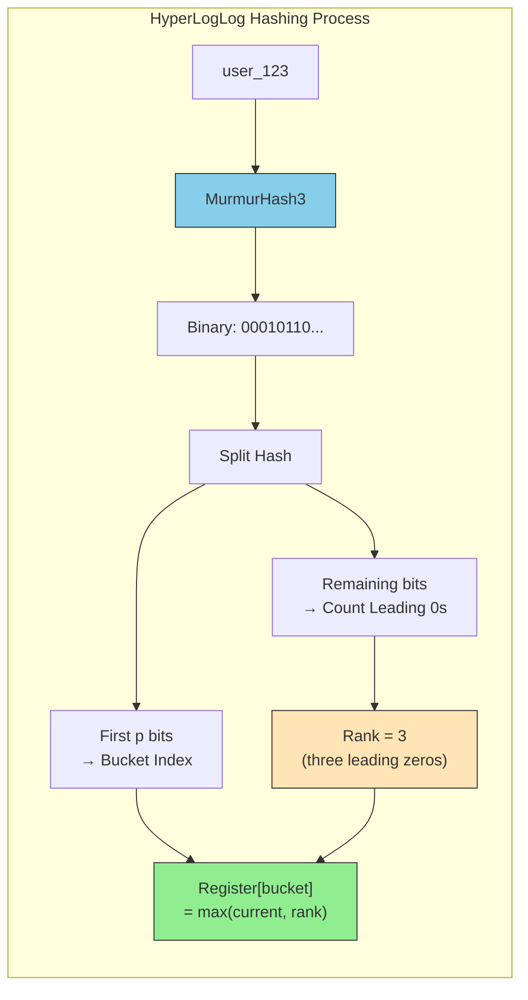
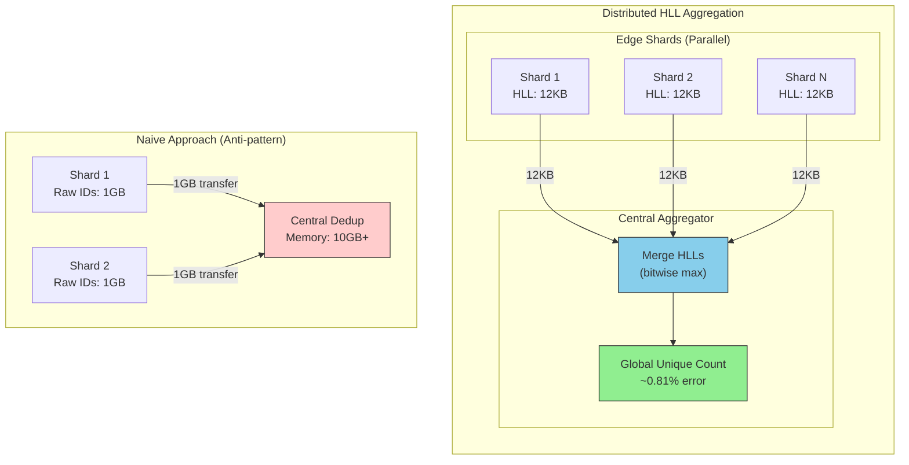

# HyperLogLog (HLL)

This guide covers 5 key areas: I. Executive Summary: The Cardinality Problem, II. Technical Mechanics: How HLL Works, III. Real-World Behavior at Mag7, IV. Architectural Tradeoffs, V. Impact on Business, ROI, and CX.

## I. Executive Summary: The Cardinality Problem

### 1. The Core Architectural Constraint: Linear Space Complexity

At the scale of a Mag7 company, "counting" is distinct from "summing." Summing integers is computationally cheap (O(1) space). Counting **cardinality**—determining the number of *unique* elements in a set—is architecturally expensive because it presents a **Linear Space Complexity (O(N))** problem.

To determine if a user visiting Amazon.com today is "new" or "returning," the system must compare the current user ID against the history of *all* user IDs seen so far today. In a standard implementation (like a `HashSet` or SQL `COUNT(DISTINCT)`), the system must store every single unique ID in memory.

**The Math of the Problem:**
*   **Scenario:** You are tracking unique visitors to a viral YouTube video.
*   **Data:** 100 Million unique viewers.
*   **Storage:** Each User ID is a 64-bit integer (8 bytes).
*   **Memory Footprint:** $100,000,000 \times 8 \text{ bytes} \approx 800 \text{ MB}$.

While 800 MB sounds manageable for a single server, this breaks down immediately in distributed systems:
1.  **High Cardinality Dimensions:** If you need this count per video, per region, per device type, you are storing that 800 MB structure thousands of times.
2.  **The Merge Problem:** In a distributed query engine (like Google BigQuery, AWS Athena, or Spark), data is sharded. To get a global count, independent shards must send their lists of unique IDs to a coordinator node to be de-duplicated. This results in a "Shuffle Heavy" operation, saturating network bandwidth and causing query latency to spike from milliseconds to minutes.

### 2. Real-World Behavior at Mag7

The "Cardinality Problem" manifests differently across specific Mag7 domains. A Principal TPM must recognize these patterns to prevent infrastructure blowouts.

#### A. Observability and Metrics (The "High Cardinality" Explosion)
At companies like Meta or Netflix, engineering teams use metrics systems (like Prometheus or internal equivalents) to track service health.
*   **The Issue:** Engineers often add tags to metrics, such as `user_id` or `container_id`.
*   **The Result:** If a metric is `request_latency { user_id="123" }`, the monitoring system creates a new time-series database entry for every single user. This is known as the **High Cardinality Explosion**. It crashes time-series databases and leads to massive overage bills (often millions of dollars/year in wasted storage).
*   **Principal TPM Action:** Enforce governance restricting high-cardinality tags (like User IDs or IP addresses) in standard metrics, pushing them instead to logs or specialized analytics stores utilizing probabilistic counting.

#### B. Digital Advertising (Reach & Frequency)
*   **The Issue:** Advertisers pay based on "Reach"—the number of *unique* people who saw an ad.
*   **The Scale:** Google and Meta process billions of ad impressions daily.
*   **The Behavior:** Calculating exact reach across disparate datasets (e.g., YouTube mobile app + Chrome Desktop + Instagram) requires joining massive tables of user IDs. Doing this exactly for every advertiser report is computationally infeasible and too slow for real-time bidding adjustments.

### 3. Strategic Tradeoffs: Exact vs. Approximate

The defining decision for a Principal TPM is navigating the tradeoff between **Precision** and **Resource Utilization**.

| Feature | Approach | Tradeoff Analysis |
| :--- | :--- | :--- |
| **Financial Billing** | **Exact Counting** (`COUNT(DISTINCT)`) | **Must be exact.** You cannot bill a cloud customer for "approximately" 1 million API calls.  **Cost:** High. Requires massive RAM/Shuffle.  **Latency:** High (Batch processing usually required). |
| **Trend Analysis** | **Probabilistic** (HyperLogLog) | **Acceptable Error (~0.81%).** Knowing if a site had 10M vs 10.1M visitors rarely changes the business decision.  **Cost:** Negligible (KB of memory).  **Latency:** Real-time/Interactive. |
| **Fraud Detection** | **Hybrid** | **Bloom Filters / Sketches.** You need to know if an IP has hit an endpoint "too many times." False positives are acceptable (trigger a CAPTCHA), but false negatives (letting an attacker through) are not. |

### 4. Impact on Business Capabilities

Failure to address the Cardinality Problem results in three distinct failure modes:

1.  **The "Loading..." Dashboard (CX Impact):**
    *   If a product dashboard (e.g., Azure Portal usage stats) attempts exact counting on large datasets, the query will time out. The user sees a spinning wheel. Using probabilistic data structures allows these dashboards to load in sub-seconds, significantly improving Customer Experience (CX).

2.  **Infrastructure ROI (Cost Impact):**
    *   Switching from exact counting to probabilistic counting (like HLL) can reduce memory requirements by a factor of **1,000,000:1**.
    *   *Example:* Storing 1 billion distinct items takes ~8GB with a HashSet, but only ~12KB with HyperLogLog. This translates directly to millions of dollars in saved RAM and compute instances across a fleet.

3.  **Data Freshness (Capability Impact):**
    *   Exact counting often requires batch processing (waiting overnight for ETL jobs to finish). Solving the cardinality problem allows for **Streaming Analytics**, enabling the business to react to viral trends or outages in seconds rather than hours.

### 5. Edge Cases and Failure Modes

Even when the problem is understood, implementations can fail:

*   **The "Small Set" Inefficiency:** Probabilistic structures have a fixed memory overhead (albeit small). If you are counting sets with only 5 items, a simple List is more efficient than a HyperLogLog. Smart systems switch strategies dynamically based on set size (Sparse vs. Dense representation).
*   **Set Intersection Limitations:** While counting unions (A + B) is easy with probabilistic structures, calculating intersections (Users who visited BOTH Home AND Checkout) is mathematically difficult and results in higher error rates. A Principal TPM must warn stakeholders that "Drill-down" capabilities might be less accurate than top-line metrics.

## II. Technical Mechanics: How HLL Works

### 1. The Hashing and Ranking Process
The algorithm transforms incoming data into a uniform distribution to simulate the "coin flip" probability.

*   **Input Processing:** A user ID (e.g., `user_123`) is passed through a non-cryptographic hash function (like MurmurHash3 or xxHash). Speed is prioritized over cryptographic security here.
*   **Binary Conversion:** The resulting hash integer is viewed as a binary string (e.g., `000101...`).
*   **Rank Calculation:** The algorithm counts the number of leading zeros before the first "1".
    *   `1...` (0 leading zeros) → 50% probability (1/2).
    *   `01...` (1 leading zero) → 25% probability (1/4).
    *   `001...` (2 leading zeros) → 12.5% probability (1/8).
    *   `0001...` (3 leading zeros) → 6.25% probability (1/16).

If the algorithm observes a hash with 3 leading zeros, it estimates the cardinality is roughly $2^3 = 8$. If it sees 10 leading zeros, it estimates $2^{10} = 1024$.

**Tradeoff:** Relying on a single hash creates massive variance (just like flipping a coin once doesn't prove it's fair). To solve this, HLL uses **Stochastic Averaging**.

### 2. Bucketing (Registers) and Precision
To reduce variance, the HLL algorithm divides the input stream into many substreams using "buckets" or "registers."

*   **Mechanism:** The first $p$ bits of the hash determine the **Bucket Index**. The remaining bits are used to count leading zeros (the **Rank**).
*   **Storage:** The algorithm stores only the *maximum* number of leading zeros seen for that specific bucket. It does not store the user ID.
*   **Example:** In Redis (a common Mag7 implementation), HLL uses $2^{14}$ (16,384) buckets.
    *   Input: `user_123` → Hash: `000010...` (Bucket 2, Rank 5).
    *   Register[2] updates to 5.
    *   Input: `user_456` → Hash: `000010...` (Bucket 2, Rank 3).
    *   Register[2] stays at 5 (Max > Current).

**Mag7 Implementation Example:**
At **Meta (Facebook)**, Presto/Trino utilizes HLL for `approx_distinct`. They allow engineers to tune the standard error by defining the number of buckets. A lower error tolerance requires more buckets, consuming more memory per group.

**Business Impact & ROI:**
*   **Memory vs. Accuracy:** The standard error is approximately $1.04 / \sqrt{m}$, where $m$ is the number of buckets.
*   **The Sweet Spot:** Using 16KB of memory yields a standard error of ~0.81%. Increasing memory to 64KB only reduces error to ~0.40%. For a Product Principal, this implies diminishing returns: **stick to the standard 12KB-16KB implementation unless you have a critical need for <0.5% precision.**

### 3. Harmonic Mean and Bias Correction
Once the buckets are filled, HLL computes the final estimate. It does not use a simple Arithmetic Mean, which is highly susceptible to outliers (one lucky hash with 30 zeros would skew the count to billions).

*   **Harmonic Mean:** HLL uses the Harmonic Mean of the estimates across all buckets. This mathematical approach suppresses the impact of outliers, ensuring that one "lucky" hash doesn't ruin the dashboard's accuracy.
*   **Small Range Correction (Linear Counting):** If the estimated cardinality is very small (e.g., < 2.5 * m), HLL switches to "Linear Counting" (counting empty buckets) to improve accuracy for low-traffic items.

**Tradeoff:** This calculation adds CPU overhead during the read/query phase, but it is negligible compared to the I/O savings of not retrieving millions of raw rows.

### 4. The "Killer Feature": Lossless Merging (Unions)
For a Principal TPM, this is the most critical architectural capability of HLL. **HLL structures are additive.**

*   **The Capability:** You can take the HLL binary blob for "Day 1" and the HLL blob for "Day 2," perform a bitwise merge (max of each bucket), and instantly get the unique count for "Day 1 + Day 2" without accessing the raw data.
*   **Mag7 Real-World Example (Google/YouTube):**
    *   **Scenario:** You need a dashboard showing "Monthly Active Users" (MAU) for YouTube.
    *   **Naive Approach:** Store 30 days of raw logs. Run a `COUNT(DISTINCT user_id)` query over petabytes of data every time the CEO loads the dashboard. **Result:** High latency, massive compute cost.
    *   **HLL Approach:** The data pipeline computes a 12KB HLL blob for *each day* and stores it. To get MAU, the query engine reads 30 small blobs (total 360KB), merges them in milliseconds, and outputs the result.
    *   **Distributed Systems:** This allows "Map-Side Aggregation." Individual shards calculate local HLLs, and the central reducer simply merges the blobs. This minimizes network traffic by orders of magnitude.

**Operational Impact:**
*   **Latency:** Reduces query time from minutes to milliseconds.
*   **Storage:** Reduces storage of aggregation tables by ~99%.
*   **Flexibility:** Enables arbitrary time-window rollups (e.g., "Show me unique users from Jan 1 to Mar 15") instantly, which is impossible with pre-computed integer counts.

### 5. Limitations and Failure Modes
A Principal TPM must know when *not* to use HLL.

1.  **No Set Operations (Intersection/Difference):** You can easily Union (Add) HLLs. You **cannot** accurately intersect them (e.g., "Users who visited Home AND Checkout"). While inclusion-exclusion principles exist, the error rate compounds drastically, making HLL unsuitable for funnel conversion analysis requiring high precision.
2.  **No ID Retrieval:** You cannot query, "Who are these users?" HLL answers "How many," not "Who."
3.  **Exact Billing:** Never use HLL for billing. If you charge per API call or per active user, a 0.81% error on a $100M revenue line is an unacceptable $810k variance.

## III. Real-World Behavior at Mag7

### 1. Distributed Aggregation and Mergability
At Mag7 scale, data never lives on a single server. User logs for Facebook, Netflix, or Amazon are sharded across thousands of partitions globally. The primary architectural advantage of HLL in this environment is not just compression, but **algebraic mergability**.

In a distributed system, calculating `Count(Distinct User_IDs)` across 1,000 shards using Sets requires transferring all unique IDs to a central aggregator node. This creates a "network storm" and a memory bottleneck at the aggregator.

**The Mag7 Approach:**
*   **Map Phase:** Each shard maintains its own local HLL sketch of users it sees.
*   **Reduce Phase:** The central aggregator requests the HLL binary (small KB size) from each shard.
*   **Merge:** The aggregator performs a bitwise merge (taking the maximum value of registers across all HLLs). This is computationally cheap and requires negligible network bandwidth.

**Real-World Example:**
*   **Google BigQuery:** When you run `APPROX_COUNT_DISTINCT`, BigQuery pushes HLL sketch generation down to the leaf nodes (Colossus storage/Dremel workers). Only the tiny sketches are sent up the tree to be merged.
*   **Amazon CloudWatch:** Aggregating metrics across millions of EC2 instances uses similar probabilistic sketching to provide near real-time distinct counts without calculating every unique packet.

**Tradeoffs:**
*   **Network vs. Precision:** You save 99.9% on network bandwidth and aggregation memory, but you accept that the error rate (standard error) applies to the final merged total.
*   **Idempotency:** HLL merging is idempotent. If a message is processed twice (common in "at-least-once" delivery systems like Kafka/Kinesis), the HLL sketch does not change, as the hash of the same user ID yields the same register position. This provides built-in deduplication.

### 2. The "Rolling Window" Challenge (Time-Series Data)
A common Product requirement is the "Rolling 7-Day Active Users" metric. A Principal TPM must understand that **HLLs are additive, not subtractive.** You cannot "subtract" yesterday’s users from an HLL to shift the window forward because the specific user IDs are lost in the hashing process.

**The Mag7 Implementation:**
To solve this, engineering teams do not store one massive HLL. Instead, they store **granular HLLs** (usually hourly or daily) and merge them on the fly at query time.

*   **Storage:** Store 7 individual daily HLL sketches (Day 1, Day 2... Day 7).
*   **Query:** To get "7-Day Actives," the system merges Day 1 through Day 7.
*   **Rolling:** To move to the next day, the system drops Day 1 and merges Day 2 through Day 8.

**Impact on ROI & Capabilities:**
*   **Storage Cost:** Storing 365 daily HLLs is still significantly cheaper than storing raw user logs for a year.
*   **Query Latency:** Merging 7 (or even 30) HLLs is a sub-millisecond operation in memory (e.g., using Redis `PFCOUNT`). This enables interactive dashboards for Product Managers where queries return instantly, rather than batch jobs that take hours.

### 3. Precision vs. Cost Tuning
While HLL is efficient, it is not magic. The accuracy is determined by the number of registers ($m$) used. The standard error is approximately $1.04 / \sqrt{m}$.

**Configuration Choices:**
*   **Redis Implementation:** Uses $2^{14}$ (16,384) registers. This requires 12KB of memory and yields a standard error of ~0.81%.
*   **Ad-Tech vs. Content:**
    *   **Content (YouTube Views):** 0.81% error is acceptable. If a video has 10M views, displaying 10.08M is fine.
    *   **Billing (Meta Ads):** Billing requires exactness. HLL is used for *pacing* (checking if a budget is roughly exhausted in real-time) to stop serving ads quickly, but the final invoice is calculated later using exact logs (batch processing).

**TPM Decision Framework:**
When defining SLAs with engineering, if the stakeholder requires "Zero Error," you cannot use HLL. If they accept "Trends and Analytics," HLL saves millions in infrastructure.

### 4. Handling Low Cardinality (Sparse vs. Dense)
A common edge case occurs when an HLL is initialized for a dataset that ends up having very few items (e.g., a new YouTube channel with 5 subscribers). Allocating 12KB for 5 items is wasteful.

**Mag7 Optimization:**
Systems like Redis and Google Spanner utilize a **Sparse Representation**.
*   **Sparse Mode:** When cardinality is low, the data structure stores the actual hashed integers in a list. This is exact (0% error) and tiny in memory.
*   **Dense Mode:** Once the list hits a threshold (e.g., 300 items), it converts (promotes) the structure to a full HLL dense representation.

**Business Capability:**
This ensures that the "Long Tail" (the millions of small accounts/products at Amazon or YouTube) does not consume excessive RAM, while the "Head" (Justin Bieber’s channel or the iPhone product page) benefits from the HLL compression.

## IV. Architectural Tradeoffs

### 1. Precision vs. Resource Efficiency: The ROI Calculation

The primary architectural decision to use HyperLogLog (HLL) is a negotiation between business requirements for accuracy and infrastructure constraints on cost.

*   **The Tradeoff:** You sacrifice **exactness** (accepting a standard error, typically 0.81% to 2%) to gain **massive memory efficiency** (fixed size, usually ~12KB regardless of cardinality).
*   **Mag7 Context:**
    *   **Ad Tech (Meta/Google):** When reporting "Reach" (unique people who saw an ad) to advertisers, a 1% error margin on 10 million users is acceptable. The business contract allows for estimation. Storing exact user IDs for every campaign would require Petabytes of high-speed RAM (Redis/Memcached), destroying margins.
    *   **Billing (AWS/Azure):** You **never** use HLL for billing metering. If a customer makes 1,000,000 API calls, you cannot bill them for "approximately 1,000,000." Exact counting (HashSets/Counters) is mandatory here, regardless of cost.
*   **Business Impact:**
    *   **OpEx Reduction:** Replacing exact counting with HLL can reduce the memory footprint of an analytics cluster by 99.9%. For a Redis cluster costing \$50k/month, this can drop storage requirements to negligible levels, allowing that same cluster to serve 1000x more metrics.
    *   **SLA Definition:** As a Principal TPM, you must define the "Error Budget" with Product Managers. If the product requires "accounting precision," HLL is a non-starter. If the product is "directional analytics," HLL is the correct choice.

### 2. Distributed Aggregation vs. Network Latency

In a microservices or distributed architecture, the ability to merge data is often the bottleneck. HLL shines here due to the **Mergeability Property**.

*   **The Tradeoff:** You shift complexity from **Network I/O** (transferring data) to **CPU** (hashing inputs).
*   **Mag7 Context:**
    *   **Netflix/YouTube:** Consider a global dashboard showing "Unique Viewers of *Stranger Things*." Data is collected in thousands of edge locations.
        *   *Without HLL:* Every edge server must send a list of every UserID to a central aggregator. This causes a "thundering herd" of network traffic and requires the central aggregator to hold a massive HashSet in memory to deduplicate.
        *   *With HLL:* Each edge server maintains a 12KB HLL register. They send only this tiny binary object to the central aggregator. The aggregator performs a bitwise merge (Union) of the registers.
*   **Operational Behavior:**
    *   **Latency:** Merging HLLs takes microseconds. Merging HashSets grows linearly with dataset size. HLL enables sub-second real-time analytics on global datasets.
    *   **Data Egress Costs:** In cloud environments (AWS/GCP), cross-region data transfer is expensive. Sending 12KB summaries instead of GBs of UserIDs significantly impacts the bottom line.

### 3. Functional Limitations: What You Lose

HLL is a "lossy" compression of set information. Choosing it removes specific capabilities from your product roadmap.

*   **The Limitation (No Retrieval):** You cannot ask an HLL, "Is User X in this set?" or "List all users in this set." HLL answers *how many*, not *who*.
    *   *Workaround:* If you need membership testing ("Has User X seen this ad?"), you must pair HLL with a **Bloom Filter**, another probabilistic structure.
*   **The Limitation (No Deletion):** Standard HLLs do not support removing items. If a user deletes their account, you cannot "subtract" them from the HLL count without rebuilding the structure from raw logs.
    *   *Impact:* This complicates "active user" counts where users might need to be scrubbed for GDPR/Privacy compliance.
*   **The Limitation (Intersection Inaccuracy):** While HLLs handle Unions (A + B) perfectly, Intersections (Users who saw Ad A *AND* Ad B) are mathematically derived using the Inclusion-Exclusion principle. As the sets overlap more, the error rate increases significantly.
    *   *TPM Guidance:* If the core product feature is complex audience segmentation (intersections of 5+ attributes), HLL may introduce too much noise to be useful.

### 4. Implementation Variance: Sparse vs. Dense

Not all HLL implementations are identical. A nuanced architectural choice exists between Sparse and Dense representations.

*   **Sparse Representation:** Used when the cardinality is very low (e.g., a newly created analytics tag). The structure stores a list of indices rather than the full register.
    *   *Benefit:* Extremely low memory (bytes rather than kilobytes).
*   **Dense Representation:** The standard 12KB structure.
*   **Mag7 Implementation Example (Redis):** Redis automatically manages this transition. It starts with a sparse representation and promotes it to dense once the set grows beyond a threshold (typically 3000 items).
*   **Tradeoff:**
    *   **CPU Spikes:** The conversion from Sparse to Dense causes a momentary CPU spike.
    *   **Memory Fragmentation:** If you have 100 million distinct keys (e.g., one HLL per user to count distinct songs played), even 12KB per user equals 1.2 TB of RAM. Sparse representation is critical for "long tail" distributions where most users have low counts.

## V. Impact on Business, ROI, and CX

### 1. Infrastructure ROI: From Linear to Constant Cost
At the Principal level, technical decisions are investment decisions. The primary business driver for adopting HyperLogLog (HLL) is the shift from linear resource scaling ($O(N)$) to near-constant resource scaling ($O(1)$) for distinct counting operations.

*   **The Cost Delta:** In a standard implementation (e.g., a Redis Set), storing 100 million unique user IDs (assuming 64-bit integers) requires approximately **800 MB** of memory. With HLL, storing the count of those same 100 million users requires approximately **12 KB**.
*   **Mag7 Real-World Example:** Consider **Amazon CloudWatch** or **Google Analytics**. These services monitor metrics for millions of customers. If Google stored a unique `HashSet` for every URL visited by every user to calculate "Daily Unique Visitors," the RAM costs would obliterate the product's margin. By using HLL, they can store these metrics in-memory (Redis/Memcached) or in column-oriented stores (BigQuery/Redshift) with negligible storage footprints.
*   **Business Impact:** This efficiency allows Mag7 companies to offer "Free Tiers" for analytics products. The marginal cost of tracking an additional million events for a free user becomes near-zero in terms of storage.

### 2. Latency and Customer Experience (CX)
For Product TPMs, the "Speed to Insight" is a critical CX metric. HLL drastically reduces query latency in distributed systems.

*   **The Merge Problem:** In a distributed system (like Facebook or LinkedIn), user data is sharded across hundreds of databases. To answer "How many unique people saw this ad campaign?", a naive system must fetch all user IDs from all shards, bring them to a central aggregator, de-duplicate them, and count. This is network-bound and slow.
*   **The HLL Solution:** HLL data structures are **mergeable**. You can take the 12 KB HLL structure from Shard A and merge it with the 12 KB structure from Shard B using a bitwise operation. The result is a mathematically correct combined HLL.
*   **CX Impact:** This enables **interactive dashboards**. When a Facebook Ads Manager user toggles a date range from "Last 7 Days" to "Last 30 Days," the system doesn't re-scan petabytes of raw logs. It simply merges the pre-computed daily HLL sketches. The response time drops from minutes to milliseconds.
*   **Tradeoff:** The user sees an *approximate* number (e.g., 1,000,000 ± 0.81%). In analytics, instant interactivity is almost always valued higher than perfect precision (seeing 1,000,000 vs 1,000,420).

### 3. Capability Enablement: Real-Time Fraud and Security
HLL enables capabilities that are computationally impossible with exact counting. This is particularly relevant for "Velocity Checks" in security.

*   **Mag7 Example:** **AWS Shield** (DDoS protection) or **Netflix Account Sharing Detection**.
*   **The Scenario:** You need to detect if a specific IP address has connected to 5,000 *different* ports or requested 10,000 *different* assets in the last 60 seconds.
*   **The Mechanism:** Storing a hash set for every IP address on the internet is impossible. However, keeping a small HLL counter for suspect IPs is trivial. If the estimated cardinality of requested assets spikes above a threshold, the system triggers a mitigation rule.
*   **Tradeoff - False Positives:** HLL cannot tell you *which* ports were accessed, only *how many*. If you need to audit the specific attack vector later, HLL is insufficient. You must pair HLL (for detection trigger) with raw logging (for forensic analysis).

### 4. The "Billing Boundary" Risk
The most critical constraint a Principal TPM must manage is the distinction between **analytical data** and **transactional data**.

*   **The Hard Rule:** Never use HLL for billing if the contract specifies "Pay Per Unique."
*   **Mag7 Context:** In **Google Ads** or **Meta Ads**, advertisers pay for impressions or distinct reach. If you bill a client based on an HLL estimate that overcounts by 1%, you face legal liability and trust erosion. If you undercount by 1%, you are bleeding millions in revenue at scale.
*   **Strategic Architecture:**
    *   **Pipeline A (Billing):** Uses exact counting (HashSets/Bloom Filters with fallback). It is slower, more expensive, and runs in batch mode (e.g., nightly reconciliation).
    *   **Pipeline B (Reporting):** Uses HLL. It is real-time, cheap, and powers the client-facing dashboard.
*   **CX Friction:** This leads to the common "Reporting Discrepancy" phenomenon where the dashboard shows 10,000 visitors, but the invoice charges for 9,950. As a TPM, you must ensure product documentation and SLAs account for this discrepancy ("Dashboard numbers are estimates").

### 5. Skill and Operational Complexity
Implementing HLL introduces a specific type of technical debt and skill requirement.

*   **Loss of Granularity:** HLL is a "lossy" compression. You cannot query an HLL to ask, "Was User X in this set?" (You would need a Bloom Filter for that, which is a different probabilistic structure). Once data is converted to HLL, the raw identities are gone.
*   **Operational Risk:** If the business requirements change and stakeholders suddenly want to segment the data by a new dimension (e.g., "Show me unique users *by device type*"), and you only stored the aggregate HLL, you cannot retroactively slice the data. You must re-process the raw logs.
*   **TPM Guidance:** Ensure that while HLL is used for the "hot" serving layer, the raw event logs are preserved in "cold" storage (e.g., S3/Glacier) to allow for historical backfilling or new dimension extraction.

---

## Interview Questions

### I. Executive Summary: The Cardinality Problem

### Question 1: The Dashboard Latency Challenge
**Question:** "You are the TPM for an analytics product used by large enterprise customers. Customers are complaining that their 'Daily Unique Users' dashboard times out or takes 30+ seconds to load when they query date ranges longer than a week. The engineering team says the database simply can't handle the `DISTINCT` count over millions of rows faster. How do you approach this?"

**Guidance for a Strong Answer:**
*   **Diagnosis:** Identify this as a Cardinality Problem. The O(N) memory requirement for exact uniqueness is choking the database.
*   **Solutioning:** Propose moving from exact counts to probabilistic counting (HyperLogLog).
*   **Tradeoff Management:** Explicitly mention the conversation required with Product/Customers. "Are customers okay with seeing '1.2M' users with a 1% margin of error if the dashboard loads in 200ms instead of 30s?"
*   **Architecture:** Discuss pre-aggregating these HLL sketches. Instead of scanning raw logs on every query, store the HLL structure per hour/day, and merge them on the fly for the requested date range.

### Question 2: The Billing System Design
**Question:** "We are building a new API monetization platform where we charge developers based on the number of unique end-users they serve. Your engineering lead suggests using HyperLogLog to track usage because it saves 99% on storage costs. Do you approve this design?"

**Guidance for a Strong Answer:**
*   **Immediate Pushback:** A strong candidate will reject HLL for *billing* as the primary source of truth. You cannot charge money based on probability; 1% error on a $1M invoice is a lawsuit or a refund request.
*   **Nuanced Approach:** Propose a hybrid model. Use HLL for the *customer-facing dashboard* (so they can track their spend in real-time cheaply) but use exact counting (batch processing/logs) for the actual end-of-month invoice generation.
*   **Business Acumen:** Highlight that the cost of storage (the savings from HLL) is negligible compared to the cost of customer trust and billing disputes.

### II. Technical Mechanics: How HLL Works

### Question 1: The Dashboard Latency Challenge
**Question:** "We are building a real-time analytics dashboard for a new video streaming service. Product requires 'Unique Viewers' counts updated every minute for millions of streams. The current `COUNT(DISTINCT)` SQL query is timing out and costing too much. How would you redesign this?"

**Guidance for a Strong Answer:**
*   **Identify the Bottleneck:** Acknowledge that exact counting at scale is $O(N)$ in memory and compute.
*   **Propose HLL:** Suggest replacing exact counting with HyperLogLog to reduce memory footprint from linear to constant ($O(1)$).
*   **Architecture:** Describe a pipeline where edge servers generate HLLs per minute. These are pushed to a central store (like Redis or a Timeseries DB).
*   **Merging:** Explain how the dashboard can query a range of time (e.g., "Last hour") by merging 60 one-minute HLL blobs on the fly.
*   **Trade-offs:** explicitly mention the <1% error rate and confirm with the interviewer if this is acceptable for an analytics dashboard (usually yes) vs. a billing report (no).

### Question 2: The Distributed Data Center Problem
**Question:** "We have user activity logs generated across 3 distinct data centers (US, EU, APAC). We need a global count of unique users every day. Users may travel and appear in multiple regions. How do you architect this efficiently without replicating all raw logs to a central location?"

**Guidance for a Strong Answer:**
*   **Leverage HLL Merge:** The candidate should recognize this as a distributed systems bandwidth problem.
*   **Local Aggregation:** Compute a daily HLL for users locally at each data center (US HLL, EU HLL, APAC HLL).
*   **Central Merge:** Transmit only the HLL blobs (kilobytes in size) to a central aggregator, not the raw user IDs (terabytes).
*   **Union Property:** Explain that merging the HLLs automatically handles the deduplication of travelers. If User A is in the US HLL and EU HLL, the merged HLL counts them exactly once.
*   **Cost/Benefit:** Highlight the massive ROI on cross-region data transfer costs (egress fees).

### III. Real-World Behavior at Mag7

### Question 1: Dashboard Latency & Cost
**"We are building a real-time analytics dashboard for our advertisers to see unique reach across 50 different demographics. The current prototype using `COUNT(DISTINCT user_id)` is timing out and costing too much in compute. How would you architect a solution to fix this, and how would you handle the advertiser's concern about accuracy?"**

**Guidance for a Strong Answer:**
*   **Architecture:** Propose replacing the exact count with HyperLogLog. Explain pre-aggregating HLL sketches by demographic segments (e.g., "Age 18-25", "US-East").
*   **Merge on Read:** Explain that to see the total reach, the backend simply merges the sketches of the selected demographics on the fly.
*   **Stakeholder Management:** Address the accuracy concern directly. Explain that for "Reach" metrics, a <1% variance is standard industry practice (referencing Nielsen/Comscore methods). The tradeoff is sub-second load times vs. timeouts. Offer a "reconciliation" report (exact count) that runs offline daily if billing depends on it.

### Question 2: Distributed System Design
**"You need to design a system to detect 'Trending Topics' globally across 10 data centers. We need to identify hashtags that have high unique user engagement in the last 15 minutes. Bandwidth between data centers is expensive."**

**Guidance for a Strong Answer:**
*   **Local Aggregation:** Describe generating HLL sketches for hashtags locally at each data center.
*   **Global Merge:** Transmit only the HLL binaries (small size) to a central control plane, not the user IDs.
*   **Time Windows:** Propose using sliding windows (e.g., three 5-minute HLLs) to allow the "rolling 15-minute" calculation.
*   **Filtering:** Mention using a "Heavy Hitter" algorithm (like Count-Min Sketch) alongside HLL to filter out noise before even creating HLLs for rare hashtags, further saving resources.

### IV. Architectural Tradeoffs

**Question 1: The Analytics Dashboard Design**
"We are building a real-time dashboard for a high-traffic video streaming service. Product wants to show 'Unique Viewers' per video, updated every minute. However, the Finance team also wants to use this data to calculate royalty payments to content creators based on unique views. How would you architect the counting mechanism?"

*   **Guidance for a Strong Answer:**
    *   **Identify the Conflict:** The candidate must immediately recognize the conflicting requirements. Real-time dashboards require low latency/high throughput (HLL is perfect). Royalty payments require exact precision (HLL is unacceptable).
    *   **Propose a Hybrid Architecture (Lambda Architecture):**
        *   **Hot Path (Real-time):** Use HLL (e.g., via Redis) to power the dashboard. It’s fast, cheap, and the <1% error is acceptable for a "live view."
        *   **Cold Path (Batch):** Log raw events to a data lake (S3/HDFS). Run a nightly batch job (Spark/MapReduce) to calculate exact counts for Finance/Billing.
    *   **Justification:** This decouples the user experience (speed) from the financial obligation (accuracy), optimizing ROI on infrastructure.

**Question 2: The Distributed Merge Problem**
"You are designing a system to track unique API errors across 50 distinct data centers globally. The aggregate report needs to be generated centrally. The current solution sends all error logs to the center, resulting in massive bandwidth costs and delayed reporting. How do you fix this?"

*   **Guidance for a Strong Answer:**
    *   **Leverage HLL Mergeability:** Propose generating HLL sketches locally at each data center.
    *   **Quantify the Win:** Explain that instead of sending GBs of logs, each DC sends a tiny (e.g., 12KB) binary sketch.
    *   **Address the Tradeoff:** Acknowledge that while we solve the bandwidth and latency issue, we lose the ability to inspect the *specific* error payloads centrally in this stream.
    *   **Mitigation:** Suggest sending HLLs for the metric aggregation and sampling a small percentage of raw logs (e.g., 0.1%) for qualitative debugging, satisfying both the metric need and the engineering need.

### V. Impact on Business, ROI, and CX

**Question 1: The Dashboard Latency Challenge**
"We are building a real-time analytics dashboard for a high-traffic video streaming service. Product requires the dashboard to load 'Unique Viewers' for any custom date range within 200ms. The dataset is petabytes in size. How do you architect this, and what are the limitations of your approach?"

*   **Guidance for a Strong Answer:**
    *   **Architecture:** Propose pre-computing HLL sketches at a granular level (e.g., hourly or daily).
    *   **Aggregation:** Explain that querying a custom date range (e.g., Jan 1 to Jan 14) involves merging the 14 daily HLL sketches, which is an $O(1)$ operation relative to the data size.
    *   **Storage:** Store these sketches in a fast store like Redis or a specialized column store (e.g., Druid/ClickHouse).
    *   **Limitation:** Acknowledge that this prevents arbitrary filtering *after* the fact (e.g., "Show me unique viewers who *also* used an iPhone") unless those dimensions were pre-calculated in the HLL key. Acknowledge the error rate (standard error ~0.81%).

**Question 2: The Billing vs. Analytics Conflict**
"You are launching a new ad platform. The Engineering Lead suggests using HyperLogLog for everything to save $5M/year in infrastructure costs. The Sales Lead insists on 100% accuracy for billing. How do you resolve this conflict and what architecture do you propose?"

*   **Guidance for a Strong Answer:**
    *   **Strategic Stance:** Reject the "HLL for everything" proposal for billing. The reputational risk and potential for revenue leakage (or overcharging) outweigh the infrastructure savings.
    *   **Hybrid Solution:** Propose the "Lambda Architecture" or dual-pipeline approach. Use HLL for the real-time advertiser dashboard (providing instant feedback/gratification) and exact counting (via batch processing/Hadoop/Spark) for the monthly invoice.
    *   **Communication:** Explicitly manage the CX expectation that "Real-time stats are directional; Invoices are final."
    *   **Cost Optimization:** Suggest using sampling or retention policies on the exact counting pipeline to mitigate the $5M cost, rather than sacrificing accuracy.

---

## Key Takeaways

- Review each section for actionable insights applicable to your organization

- Consider the trade-offs discussed when making architectural decisions

- Use the operational considerations as a checklist for production readiness
