# Identity & Access Management at Okta Scale

Okta is a **multi-tenant identity control plane** for thousands of enterprises, built around Zero Trust, high-scale auth flows, and strict SOC2/GDPR alignment. As the market leader in cloud IAM, Okta demonstrates how to architect identity infrastructure that scales across organizations, regions, and compliance regimes.

> **Why This Matters for TPMs**
>
> At Principal level, you will own cross-cutting IAM programs. Understanding Okta's architecture gives you the vocabulary for auth flows, zero-trust implementation, lifecycle management, and compliance mapping.

---

## 1. Core Architecture: Identity Control Plane

Okta centralizes identity decisions (AuthN/AuthZ, policy, lifecycle) and pushes enforcement to apps, networks, and devices via standards and integrations.

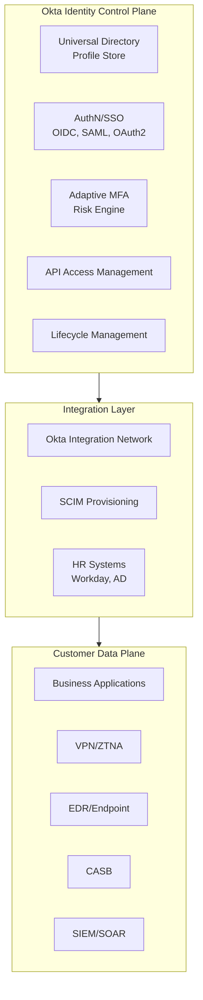

### 1.1 Multi-Tenant Organization Model

| Concept | Implementation | Isolation |
|---------|---------------|-----------|
| **Org** | Logical tenant per customer | Hard-isolated |
| **Users/Groups** | Per-org directory | Org-scoped |
| **Apps** | Per-org assignments | Org-scoped |
| **Policies** | Per-org authentication rules | Org-scoped |
| **Admin roles** | Per-org or cross-org | Scoped permissions |

### 1.2 Hub-and-Spoke for B2B SaaS

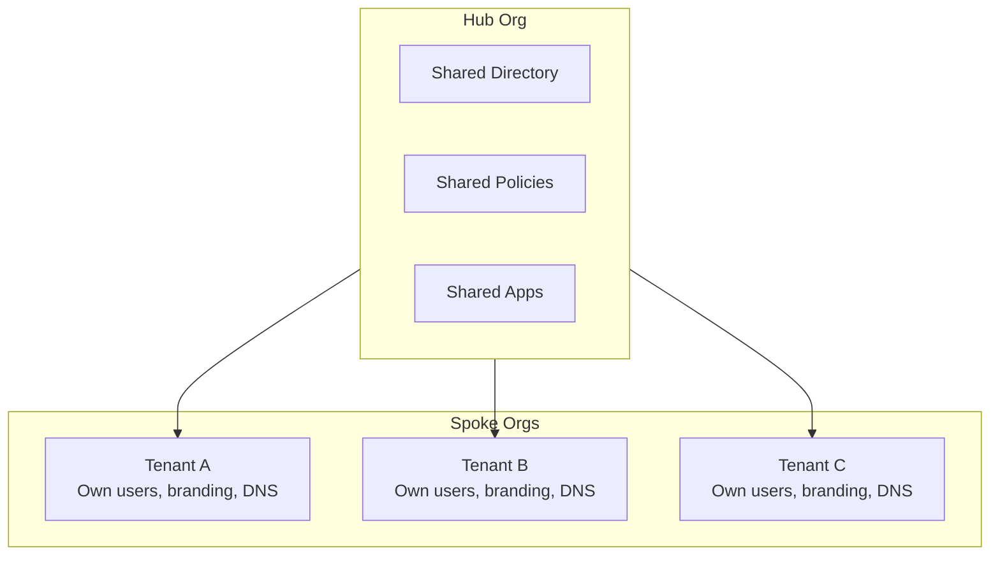

| Component | Hub Org | Spoke Org |
|-----------|---------|-----------|
| Directory | Shared base profiles | Tenant-specific extensions |
| Policies | Default policies | Override allowed |
| Branding | Template | Custom per tenant |
| DNS | Central domain | Tenant-specific domains |

> **One-Way Door Decisions**
>
> Org/tenant model, core identity data model (profile schema), token and API contracts, and tenant isolation at storage/control-plane layers are foundational decisions that are hard to change later.

---

## 2. Auth Flows at Scale: SSO + Zero Trust

Okta's auth flows are standards-based but wrapped in a Zero-Trust, context-aware engine.

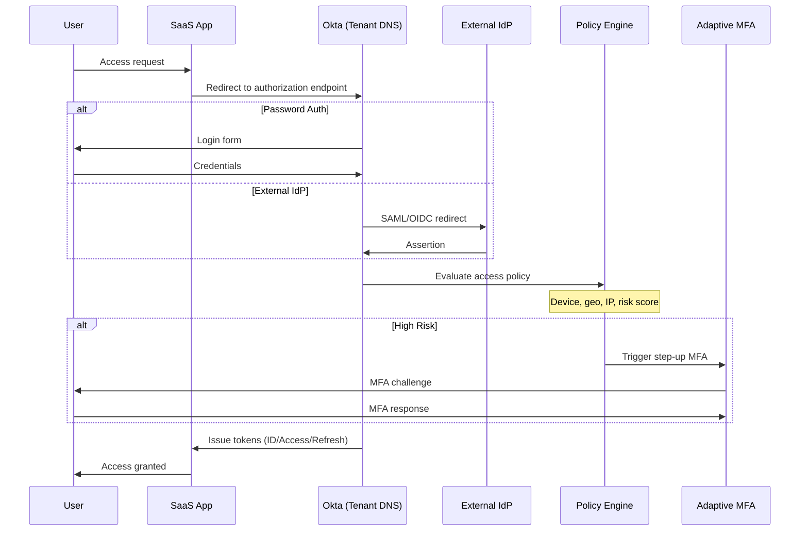

### 2.1 Zero Trust Principles in Practice

| Principle | Okta Implementation |
|-----------|---------------------|
| **No implicit network trust** | Auth via identity + device + context, not IP/VPN alone |
| **Least privilege** | Per-app policies, step-up MFA, RBAC via groups/claims |
| **Continuous evaluation** | Risk re-assessment mid-session, SSF integrations |
| **Verify explicitly** | Every access decision evaluates current context |

### 2.2 Contextual Access Policy Factors

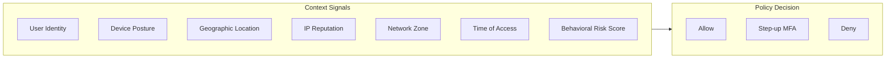

| Signal | Source | Policy Use |
|--------|--------|------------|
| Device posture | EDR (CrowdStrike, etc.) | Block unmanaged devices |
| Geographic location | IP geolocation | Block unusual locations |
| IP reputation | Threat intelligence | Block known bad actors |
| Network zone | Corporate vs. public | Require MFA on public |
| Behavioral risk | ML model | Trigger step-up auth |

### 2.3 Zero Trust Integration Ecosystem

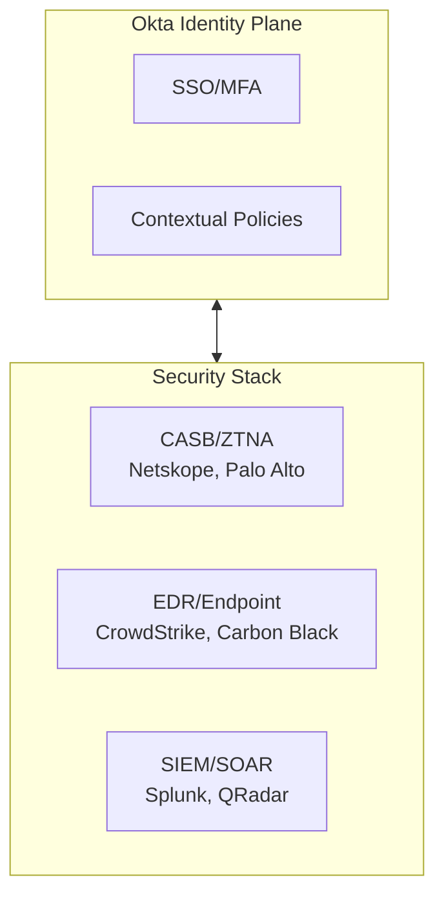

> **Identity as the Perimeter**
>
> In Zero Trust, identity is the new perimeter. Okta provides the identity plane that integrates with CASB, EDR, and SIEM to create defense in depth.

---

## 3. Lifecycle Management: Joiner/Mover/Leaver

Okta Lifecycle Management (LCM) is the engine to enforce "least privilege over time" via automated provisioning and deprovisioning.

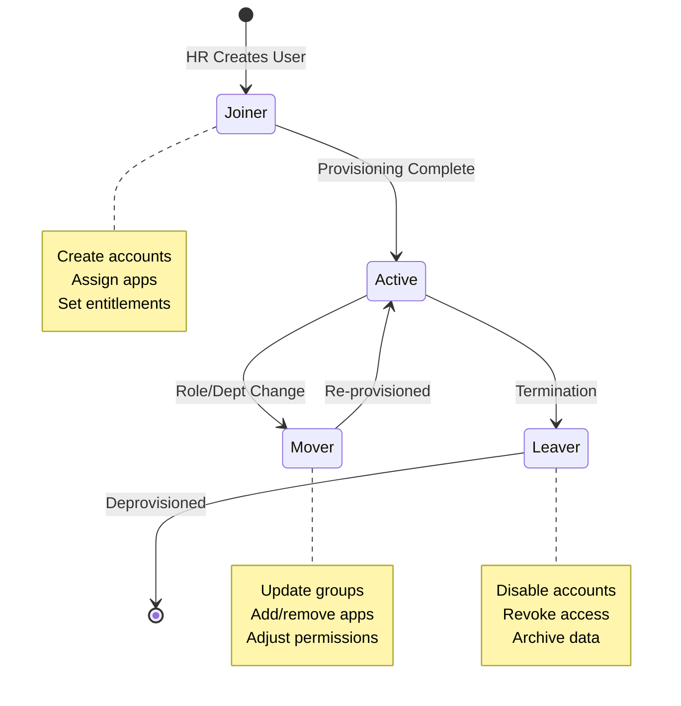

### 3.1 Source of Truth Integration

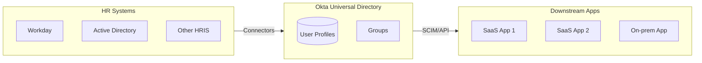

### 3.2 Lifecycle Event Flows

| Event | Trigger | Okta Actions | Downstream |
|-------|---------|--------------|------------|
| **Joiner** | User created in HR | Create profile, assign apps | Provision accounts (SCIM) |
| **Mover** | Role/dept change | Update groups, re-assign apps | Adjust entitlements |
| **Leaver** | Termination in HR | Disable user, revoke sessions | Deprovision accounts |

### 3.3 Compliance Benefits

| Compliance Requirement | LCM Implementation |
|-----------------------|-------------------|
| **Least privilege** | Auto-assign based on role, auto-remove on change |
| **Timely deprovisioning** | Immediate revocation on termination |
| **Auditable changes** | Full audit trail of all lifecycle events |
| **Access reviews** | Periodic certification campaigns |

> **Operationalizing Least Privilege**
>
> LCM prevents entitlement accretion. Without automation, users accumulate access over time as they move through roles. LCM ensures access matches current role.

---

## 4. Multi-Tenant Isolation and Cell Architecture

Okta's platform implements cell-based isolation at the identity layer.

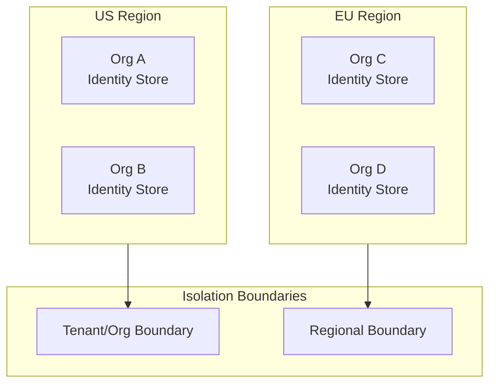

### 4.1 Isolation Boundaries

| Boundary | Scope | Purpose |
|----------|-------|---------|
| **Org (Tenant)** | Customer-level | Data isolation, policy independence |
| **Region** | Geographic | Data residency, latency |
| **Super-admin scope** | Cross-org | Managed service providers |

### 4.2 Cell Architecture for IAM

| Concept | Traditional Infra | IAM Equivalent |
|---------|------------------|----------------|
| Cell boundary | Region/AZ | Org/Region |
| Blast radius | Failure scope | Compromise scope |
| Independence | Separate scaling | Separate policies |

> **IAM Cell-Based Architecture**
>
> In Okta's world, cell boundaries are orgs/regions. Blast radius is contained to an org (customer) or region, not the whole fleet. This is the IAM version of cell-based architecture.

---

## 5. Compliance: SOC2 and GDPR Mapping

SOC2 and GDPR aren't just badges—Okta maps product features to requirements.

### 5.1 SOC2 Control Mapping

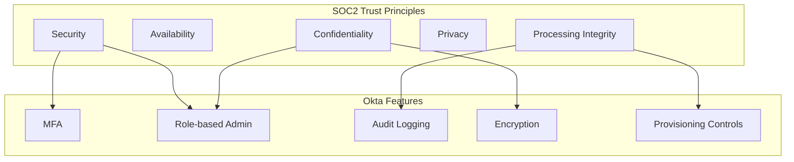

| SOC2 Principle | Okta Controls |
|---------------|---------------|
| **Security** | MFA, role-based admin, scoped roles, session management |
| **Availability** | HA architecture, SLA commitments |
| **Confidentiality** | Encryption at rest/transit, access controls |
| **Privacy** | Consent management, profile scoping |
| **Processing Integrity** | Audit logging, change control, deployment processes |

### 5.2 GDPR Article Mapping

| GDPR Article | Requirement | Okta Implementation |
|--------------|-------------|---------------------|
| **Art. 6 & 7** | Lawful basis, consent | Consent attributes in profiles |
| **Art. 15** | Right of access | Admin export capabilities |
| **Art. 17** | Right to erasure | Delete/deactivate flows + downstream deprovisioning |
| **Art. 20** | Data portability | Profile export APIs |
| **Art. 32** | Security of processing | Encryption, access controls, audit trails |

### 5.3 Compliance as Technical Controls + Process

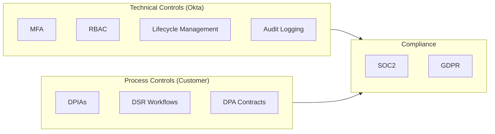

> **Compliance Framework**
>
> Okta provides technical controls (MFA, RBAC, lifecycle, audit). Customers combine these with process controls (DPIAs, DSR workflows, DPA contracts) to meet SOC2/GDPR obligations.

---

## 6. Principal TPM Program Ownership

If you were "owning cross-cutting IAM/Zero-Trust programs" anchored on Okta:

### 6.1 North Star Metrics

| Metric | What It Measures |
|--------|------------------|
| **Auth success rate** | SSO reliability |
| **MFA challenge rate** | Security vs. friction balance |
| **Time-to-deprovision** | Leaver security posture |
| **MTTD for anomalous logins** | Detection capability |
| **MTTR for identity incidents** | Response capability |

### 6.2 One-Way Door Decisions

| Decision | Impact | Reversibility |
|----------|--------|---------------|
| Identity provider strategy | Okta-first vs. hybrid | Hard to change |
| Profile schema | Data model for all apps | Hard to change |
| Master-of-record | Okta UD vs. HR vs. AD | Medium difficulty |
| Multi-region layout | Data residency | Regional constraints |

### 6.3 Cross-Cutting Zero-Trust Rollout

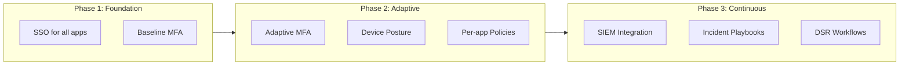

| Phase | Components | Outcome |
|-------|------------|---------|
| **Foundation** | SSO + MFA for all apps | Baseline security |
| **Adaptive** | Risk-based MFA, device posture, per-app policies | Context-aware security |
| **Continuous** | SIEM integration, incident playbooks, DSR workflows | Operational maturity |

### 6.4 Program Structure

| Program | Scope | Key Deliverables |
|---------|-------|------------------|
| **SSO Consolidation** | All internal apps | App inventory, integration plan, rollout |
| **Zero-Trust Rollout** | Adaptive policies | Risk model, policy framework, phased rollout |
| **Lifecycle Automation** | Joiner/mover/leaver | HR integration, provisioning rules, audit |
| **Compliance Readiness** | SOC2/GDPR | Control mapping, evidence collection, audit prep |

---

## 7. Trade-off Matrix

| Decision | Security | UX | Complexity | Compliance |
|----------|----------|-----|------------|------------|
| MFA everywhere | High | Low | Low | High |
| Adaptive MFA (risk-based) | High | Medium | High | High |
| Device posture checks | High | Low | High | High |
| SSO-only (no passwords) | High | High | Medium | Medium |
| LCM automation | High | N/A | High | High |
| Hub-and-spoke multi-tenancy | Medium | Medium | High | High |

---

## 8. Reliability, SLOs, and Operations

### 8.1 SLIs/SLOs

| SLI Category | Metric | SLO Target |
|--------------|--------|------------|
| **Auth Availability SLI** | Percentage of successful authentication attempts (excluding user errors) | 99.99% |
| **Auth Latency SLI** | p99 login flow completion time | &lt;2 seconds |
| **Provisioning SLI** | Time from HR event to downstream account creation | &lt;5 minutes for Tier-1 apps |
| **Deprovisioning SLI** | Time from termination to full access revocation | &lt;15 minutes |
| **MFA Success SLI** | Percentage of MFA challenges completed successfully | 99.5% |

### 8.2 Error Budgets

**Burned by:** Auth outages, provisioning delays, deprovisioning failures, MFA delivery issues, policy misconfigurations.

**Policy:** If auth availability drops below 99.99%, freeze policy changes and prioritize reliability. Any deprovisioning delay &gt;1 hour for terminated employees triggers immediate incident response.

### 8.3 Golden Signals

| Signal | What to Monitor |
|--------|-----------------|
| **Latency** | Login flow latency, MFA challenge latency, SCIM provisioning latency |
| **Traffic** | Auth requests per second, provisioning events per hour, MFA challenge volume |
| **Errors** | Auth failures by type, MFA delivery failures, provisioning errors, policy evaluation failures |
| **Saturation** | Concurrent sessions, SCIM queue depth, policy evaluation complexity |

### 8.4 Chaos Scenarios to Run

| Scenario | Expected Behavior |
|----------|-------------------|
| Primary IdP unavailable (federated auth) | Graceful degradation, fallback auth options, clear user messaging |
| HR system sync delay | Existing users unaffected, new joiners queued, alerts triggered |
| MFA provider outage | Backup MFA methods available, admin override capability |
| Malicious login attempt surge | Rate limiting engages, adaptive MFA triggered, SIEM alerted |
| Region-level Okta outage | Cross-region failover (if configured), cached sessions continue |

### 8.5 MTTR Targets

- Target MTTR for auth outage: &lt;5 minutes to detection, &lt;15 minutes to mitigation
- Target MTTR for provisioning issues: &lt;30 minutes
- Target MTTR for security incident (compromised account): &lt;10 minutes to session revocation

---

## 9. Economics, COGS, and Mag7 vs non-Mag7

### 9.1 COGS Levers

| Category | Optimization Strategy |
|----------|----------------------|
| **Licensing** | Right-size license tiers; consolidate apps to reduce per-app costs |
| **MFA** | SMS costs per challenge; push notifications cheaper at scale |
| **Integration** | SCIM/automated provisioning reduces manual admin effort |
| **Support** | Self-service password reset reduces helpdesk tickets |
| **Audit** | Automated compliance reporting reduces audit preparation costs |

### 9.2 Time to Value

- SSO reduces login friction (fewer passwords = higher productivity)
- Automated lifecycle management reduces onboarding time (days → hours)
- Centralized identity reduces app-by-app IAM configuration
- Pre-built integrations (OIN) accelerate app onboarding

### 9.3 Mag7 vs non-Mag7

| Aspect | Mag7 | Strong non-Mag7 |
|--------|------|-----------------|
| **Identity Strategy** | Often hybrid (internal IdP + Okta for specific use cases) | Okta as primary IdP |
| **Scale** | 100k+ users, custom integrations | 1k-50k users, standard OIN integrations |
| **Zero Trust Maturity** | Advanced (device posture, continuous evaluation) | Basic (SSO + MFA) |
| **Compliance** | Custom controls, internal audit teams | Rely on Okta's SOC2/compliance |
| **Lifecycle Automation** | Deep HR integration, custom workflows | Standard SCIM provisioning |

---

## 10. Example Flow: Enterprise SSO Integration with Adaptive MFA

Walk one concrete flow like you'd in an interview.

**Scenario:** Onboard a critical SaaS application (e.g., Salesforce) with SSO, adaptive MFA, and automated provisioning for a 10,000-user enterprise.

### 10.1 Application Onboarding

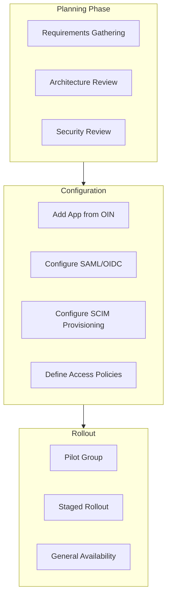

### 10.2 Authentication Flow with Adaptive MFA

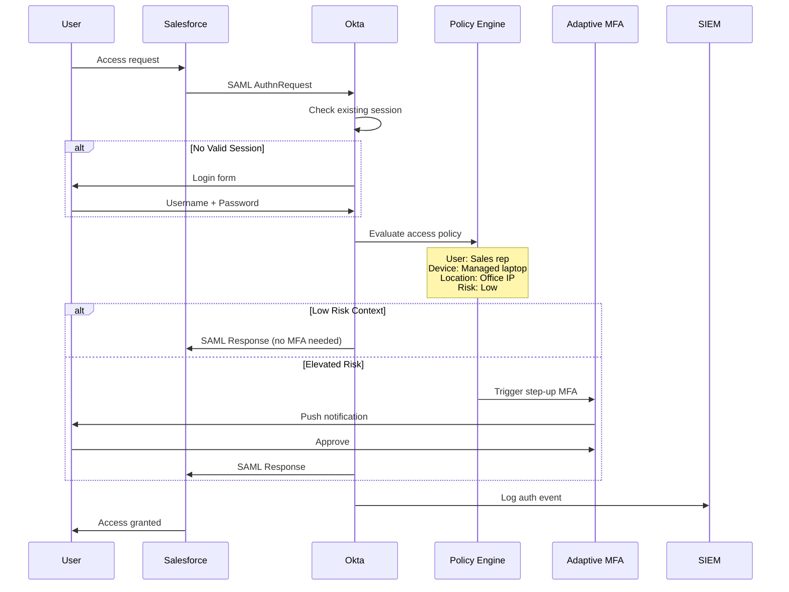

### 10.3 Lifecycle Management Integration

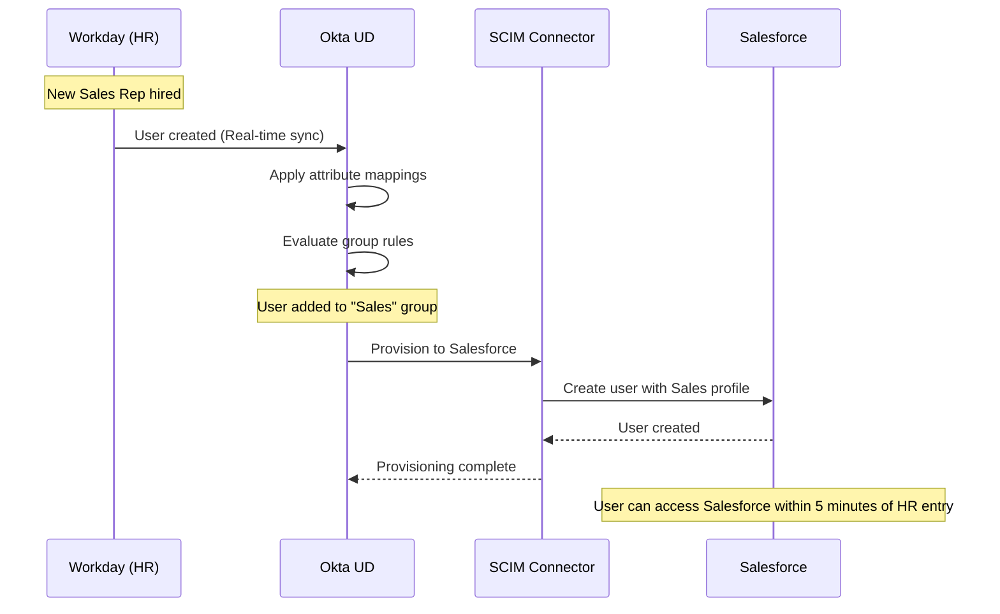

### 10.4 Deprovisioning Flow

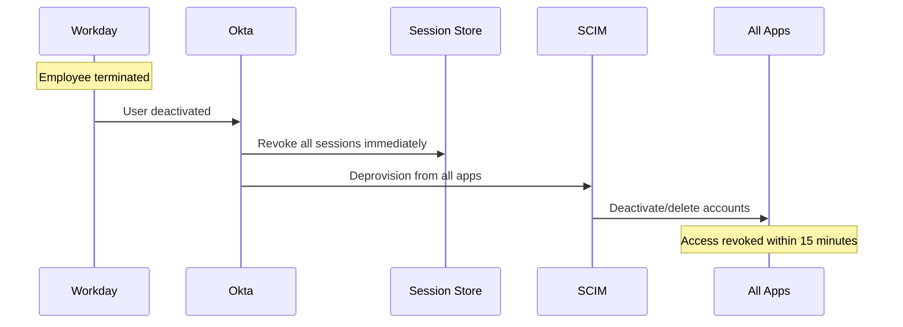

### 10.5 Failure Scenario (Security Incident)

**Scenario:** User credentials compromised (detected via impossible travel).

**Expected Response:**
- Adaptive MFA triggers step-up authentication
- If MFA bypassed or suspicious: session revoked, account suspended
- SIEM alert generated with full context
- Admin notification with one-click remediation
- Post-incident: forced password reset, MFA re-enrollment

---

## 11. How a Senior vs Principal TPM Should Operate Here

### 11.1 Senior TPM Scope

**Owns a slice:** e.g., "Salesforce SSO rollout and Zero Trust policy implementation."

| Responsibility | Deliverables |
|---------------|--------------|
| App onboarding | SSO configuration, testing, rollout plan |
| Policy design | Adaptive MFA rules, risk thresholds |
| Provisioning setup | SCIM configuration, attribute mappings |
| Rollout coordination | Pilot, staged rollout, communications |
| SLO tracking | Auth success rate, provisioning latency |

### 11.2 Principal TPM Scope

**Owns the multi-year roadmap:** Enterprise Zero Trust strategy and identity platform evolution.

| Responsibility | Deliverables |
|---------------|--------------|
| Zero Trust roadmap | Phased implementation across all apps/users |
| Identity strategy | Okta vs. hybrid, federation architecture |
| Compliance program | SOC2/GDPR mapping, audit readiness |
| Lifecycle automation | HR integration, deprovisioning SLAs |
| Security posture metrics | MTTD, MTTR, policy effectiveness |

### 11.3 Interview Readiness

For interviews, you should be ready to:
- **Articulate Zero Trust principles** (identity-based perimeter, continuous evaluation)
- **Walk through an SSO + provisioning implementation** with SLOs
- **Quantify impact** in terms of:
  - Auth success rate (99.99% target)
  - Time-to-deprovision (&lt;15 minutes for terminated employees)
  - Security metrics (MTTD for anomalous logins)
  - Cost savings from automated lifecycle management

---

## Key Takeaways

> **Identity as Control Plane**
>
> Okta is not "SSO vendor"—it's the identity control plane you orchestrate across orgs, regions, and compliance regimes. Authentication decisions are centralized; enforcement is distributed.

> **Zero Trust = Identity + Context**
>
> Zero Trust isn't a product—it's a policy framework. Okta provides the identity plane that evaluates user, device, location, and risk for every access decision.

> **Lifecycle = Least Privilege Over Time**
>
> Without automated joiner/mover/leaver flows, users accumulate access. LCM ensures access matches current role and terminates immediately on separation.

> **Compliance = Controls + Process**
>
> Okta provides technical controls (MFA, RBAC, audit). Meeting SOC2/GDPR requires combining these with process controls (DPIAs, DSR workflows, contracts).

> **Cell-Based Identity**
>
> Org and regional boundaries contain blast radius for identity incidents. This is the IAM equivalent of cell-based infrastructure architecture.
