# Identity & Access Management at Okta Scale

## Why This Matters

Okta manages identity for thousands of enterprises, handling authentication, authorization, and lifecycle management for millions of users. Understanding Okta's architecture matters for TPMs because:

1. **Identity is the new perimeter.** In Zero Trust, every access decision evaluates identity + context, not network location.
2. **Lifecycle management prevents entitlement creep.** Without automation, users accumulate access over time. Joiner/mover/leaver automation enforces least privilege.
3. **IAM touches every compliance regime.** SOC2, GDPR, HIPAA—identity controls are foundational to all of them.

This document covers Okta's identity control plane architecture: multi-tenant organization model, Zero Trust implementation, lifecycle management, and compliance mapping.

---

## 1. The Core Challenge: Identity as Control Plane

**The problem:** Traditional perimeter security (firewalls, VPNs) assumes you can trust anyone inside the network. But with cloud services, remote work, and mobile devices, there is no "inside." How do you make access decisions when you can't trust the network?

**The solution:** Identity becomes the control plane. Every access decision evaluates who you are, what device you're using, where you're coming from, and what you're trying to access—regardless of network location.

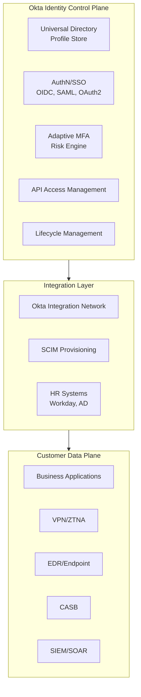

### 1.1 Control Plane vs. Data Plane

| Component | Plane | Responsibility |
|-----------|-------|----------------|
| **Universal Directory** | Control | User profiles, groups, attributes |
| **SSO/MFA** | Control | Authentication decisions |
| **Policy Engine** | Control | Access rules, risk evaluation |
| **Applications** | Data | Actual business functionality |
| **CASB/EDR** | Data | Enforcement at access point |

### 1.2 Multi-Tenant Organization Model

| Concept | Implementation | Isolation |
|---------|---------------|-----------|
| **Org** | Logical tenant per customer | Hard-isolated |
| **Users/Groups** | Per-org directory | Org-scoped |
| **Apps** | Per-org assignments | Org-scoped |
| **Policies** | Per-org authentication rules | Org-scoped |

> **One-Way Door:** Org/tenant model, profile schema, token contracts, and tenant isolation are foundational decisions that are hard to change later.

---

## 2. Zero Trust: Identity + Context for Every Decision

**The problem:** Traditional access control is binary—you're either authenticated or not. But not all authentication contexts are equal. Logging in from a managed laptop in the office is different from logging in from an unknown device in a foreign country.

**The solution:** Zero Trust evaluates multiple context signals for every access decision, not just "are you authenticated?"

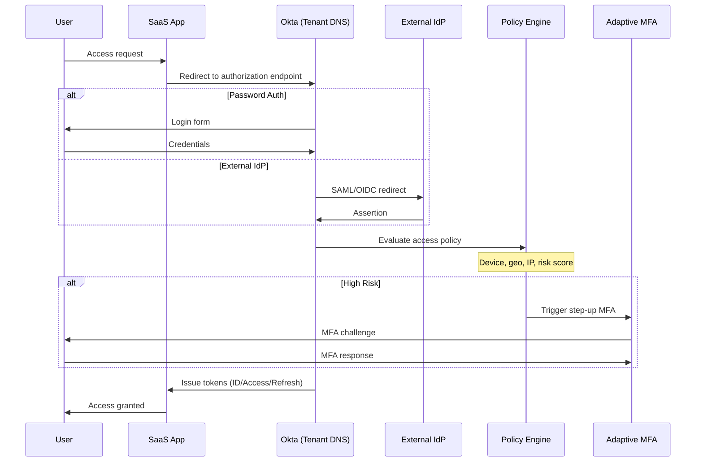

### 2.1 Zero Trust Principles

| Principle | Okta Implementation |
|-----------|---------------------|
| **No implicit trust** | Auth via identity + device + context, not network |
| **Least privilege** | Per-app policies, step-up MFA, RBAC via groups |
| **Continuous evaluation** | Risk re-assessment mid-session |
| **Verify explicitly** | Every decision evaluates current context |

### 2.2 Context Signals

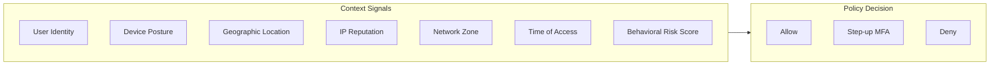

| Signal | Source | Policy Use |
|--------|--------|------------|
| Device posture | EDR (CrowdStrike, etc.) | Block unmanaged devices |
| Geographic location | IP geolocation | Block unusual locations |
| IP reputation | Threat intelligence | Block known bad actors |
| Network zone | Corporate vs. public | Require MFA on public |
| Behavioral risk | ML model | Trigger step-up auth |

### 2.3 Integration Ecosystem

Okta integrates with the broader security stack. These acronyms represent different layers of enterprise security: **CASB** (Cloud Access Security Broker) controls access to cloud apps; **EDR** (Endpoint Detection and Response) monitors device health; **SIEM** (Security Information and Event Management) correlates security events across systems.

| Integration | Purpose |
|-------------|---------|
| **CASB** (Netskope, Palo Alto) | Cloud access control |
| **EDR** (CrowdStrike, Carbon Black) | Device posture signals |
| **SIEM** (Splunk, QRadar) | Security event correlation |

> **Key Insight:** Identity is the new perimeter. Okta provides the identity plane that integrates with CASB, EDR, and SIEM to create defense in depth.

---

## 3. Lifecycle Management: Enforcing Least Privilege Over Time

**The problem:** Users accumulate access over time. They join with one role, move to another, pick up access for projects, and never lose any of it. Without automation, "least privilege" is a fiction.

**The solution:** Automated joiner/mover/leaver flows that ensure access matches current role at all times.

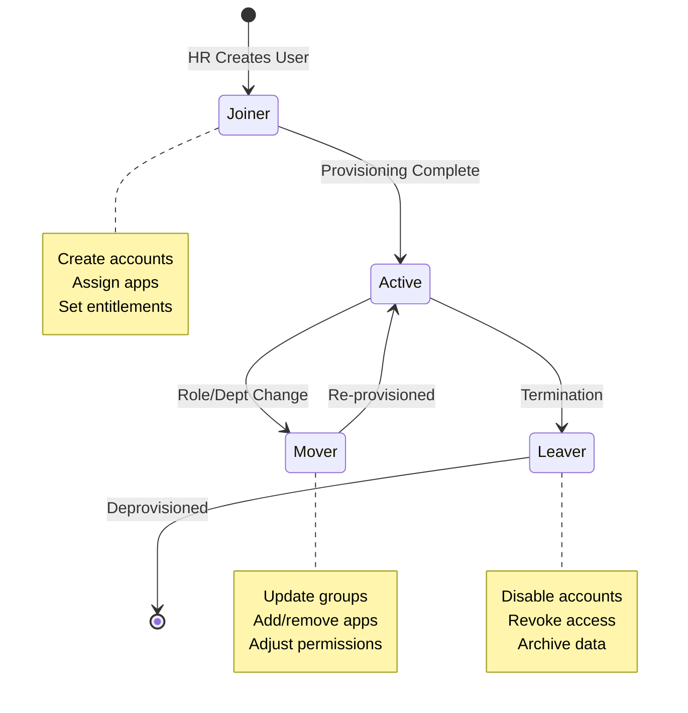

### 3.1 Lifecycle Events

| Event | Trigger | Okta Actions | Downstream |
|-------|---------|--------------|------------|
| **Joiner** | User created in HR | Create profile, assign apps | Provision accounts (SCIM) |
| **Mover** | Role/dept change | Update groups, re-assign apps | Adjust entitlements |
| **Leaver** | Termination in HR | Disable user, revoke sessions | Deprovision accounts |

### 3.2 Source of Truth Integration

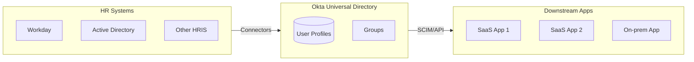

### 3.3 Compliance Benefits

| Requirement | LCM Implementation |
|-------------|-------------------|
| **Least privilege** | Auto-assign based on role, auto-remove on change |
| **Timely deprovisioning** | Immediate revocation on termination |
| **Auditable changes** | Full audit trail of lifecycle events |
| **Access reviews** | Periodic certification campaigns |

> **Operationalizing Least Privilege:** Without automation, users accumulate access. LCM ensures access matches current role at all times.

---

## 4. Multi-Tenant and Cell Architecture

**The problem:** A compromise in one customer's org shouldn't affect other customers. How do you achieve isolation at the identity layer?

**The solution:** Cell-based isolation where each org (tenant) and region operates independently with explicit boundaries.

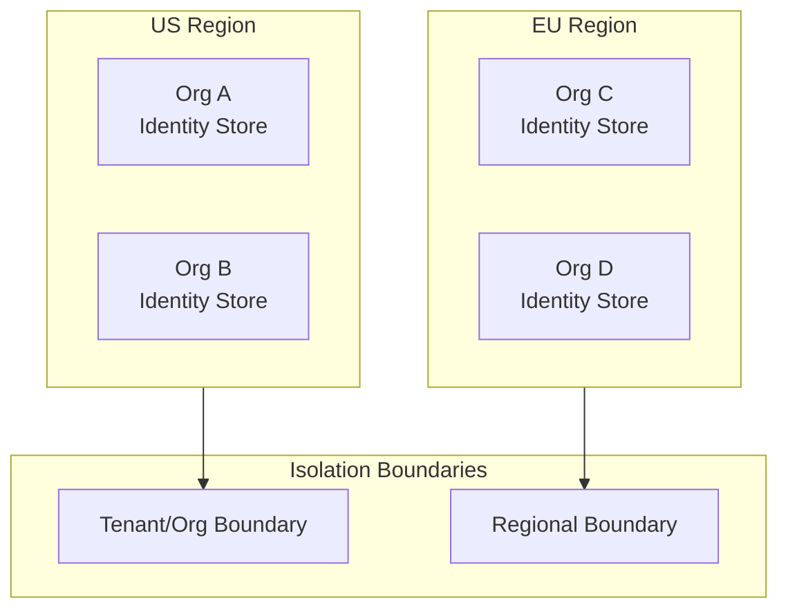

### 4.1 Isolation Boundaries

| Boundary | Scope | Purpose |
|----------|-------|---------|
| **Org (Tenant)** | Customer-level | Data isolation, policy independence |
| **Region** | Geographic | Data residency, latency |
| **Super-admin scope** | Cross-org | Managed service providers |

### 4.2 IAM Cell Architecture

| Concept | Traditional Infra | IAM Equivalent |
|---------|------------------|----------------|
| Cell boundary | Region/AZ | Org/Region |
| Blast radius | Failure scope | Compromise scope |
| Independence | Separate scaling | Separate policies |

> **IAM Cell-Based Architecture:** Cell boundaries are orgs/regions. Blast radius contained to an org or region, not the whole fleet.

---

## 5. Compliance: SOC2 and GDPR Mapping

**The problem:** Compliance isn't just about having the right checkboxes—it's about being able to demonstrate controls work and evidence is available during audits.

**The solution:** Map Okta features to specific compliance requirements so you can explain how each control is satisfied.

### 5.1 SOC2 Control Mapping

| SOC2 Principle | Okta Controls |
|---------------|---------------|
| **Security** | MFA, role-based admin, scoped roles, session management |
| **Availability** | HA architecture, SLA commitments |
| **Confidentiality** | Encryption at rest/transit, access controls |
| **Privacy** | Consent management, profile scoping |
| **Processing Integrity** | Audit logging, change control |

### 5.2 GDPR Article Mapping

| GDPR Article | Requirement | Okta Implementation |
|--------------|-------------|---------------------|
| **Art. 6 & 7** | Lawful basis, consent | Consent attributes in profiles |
| **Art. 15** | Right of access | Admin export capabilities |
| **Art. 17** | Right to erasure | Delete/deactivate + downstream deprovisioning |
| **Art. 20** | Data portability | Profile export APIs |
| **Art. 32** | Security of processing | Encryption, access controls, audit trails |

### 5.3 Compliance = Technical Controls + Process

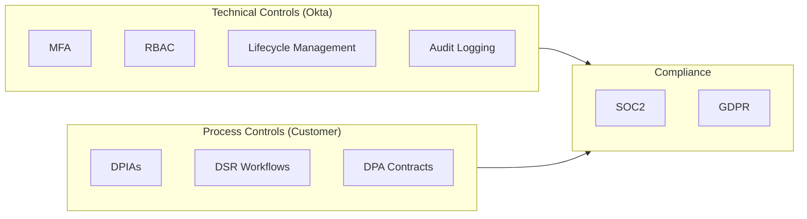

> **Framework:** Okta provides technical controls. Customers combine with process controls (DPIAs, DSR workflows, contracts) to meet compliance obligations.

---

## 6. Principal TPM Program Ownership

### 6.1 North Star Metrics

| Metric | What It Measures |
|--------|------------------|
| **Auth success rate** | SSO reliability |
| **MFA challenge rate** | Security vs. friction balance |
| **Time-to-deprovision** | Leaver security posture |
| **MTTD for anomalous logins** | Detection capability |
| **MTTR for identity incidents** | Response capability |

### 6.2 One-Way Door Decisions

| Decision | Impact | Reversibility |
|----------|--------|---------------|
| Identity provider strategy | Okta-first vs. hybrid | Hard to change |
| Profile schema | Data model for all apps | Hard to change |
| Master-of-record | Okta UD vs. HR vs. AD | Medium difficulty |
| Multi-region layout | Data residency | Regional constraints |

### 6.3 Zero-Trust Rollout Phases

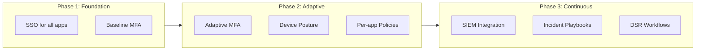

| Phase | Components | Outcome |
|-------|------------|---------|
| **Foundation** | SSO + MFA for all apps | Baseline security |
| **Adaptive** | Risk-based MFA, device posture, per-app policies | Context-aware security |
| **Continuous** | SIEM integration, incident playbooks, DSR workflows | Operational maturity |

### 6.4 Program Structure

| Program | Scope | Key Deliverables |
|---------|-------|------------------|
| **SSO Consolidation** | All internal apps | App inventory, integration plan, rollout |
| **Zero-Trust Rollout** | Adaptive policies | Risk model, policy framework, phased rollout |
| **Lifecycle Automation** | Joiner/mover/leaver | HR integration, provisioning rules, audit |
| **Compliance Readiness** | SOC2/GDPR | Control mapping, evidence collection |

---

## 7. Reliability, SLOs, and Operations

### 7.1 SLIs/SLOs

| SLI Category | Metric | SLO Target |
|--------------|--------|------------|
| **Auth Availability** | Successful auth (excluding user errors) | 99.99% |
| **Auth Latency** | p99 login flow | &lt;2 seconds |
| **Provisioning** | HR event to account creation | &lt;5 minutes (Tier-1) |
| **Deprovisioning** | Termination to full revocation | &lt;15 minutes |
| **MFA Success** | Challenges completed | 99.5% |

### 7.2 Error Budgets

**Burned by:** Auth outages, provisioning delays, deprovisioning failures, MFA delivery issues.

**Policy:** Auth below 99.99% → freeze policy changes. Deprovisioning delay >1 hour → immediate incident.

### 7.3 Golden Signals

| Signal | What to Monitor |
|--------|-----------------|
| **Latency** | Login flow, MFA challenge, SCIM provisioning |
| **Traffic** | Auth requests, provisioning events, MFA volume |
| **Errors** | Auth failures by type, MFA delivery, provisioning errors |
| **Saturation** | Concurrent sessions, SCIM queue, policy complexity |

### 7.4 Chaos Scenarios

| Scenario | Expected Behavior |
|----------|-------------------|
| Primary IdP unavailable | Graceful degradation, fallback options |
| HR sync delay | Existing users unaffected, joiners queued, alerts |
| MFA provider outage | Backup methods available, admin override |
| Malicious login surge | Rate limiting, adaptive MFA, SIEM alert |
| Region-level outage | Cross-region failover if configured |

### 7.5 MTTR Targets

- Auth outage: &lt;5 min detection, &lt;15 min mitigation
- Provisioning issues: &lt;30 minutes
- Security incident (compromised account): &lt;10 min to session revocation

---

## 8. Trade-Off Matrix

| Decision | Security | UX | Complexity | Compliance |
|----------|----------|-----|------------|------------|
| MFA everywhere | High | Low | Low | High |
| Adaptive MFA (risk-based) | High | Medium | High | High |
| Device posture checks | High | Low | High | High |
| SSO-only (no passwords) | High | High | Medium | Medium |
| LCM automation | High | N/A | High | High |
| Hub-and-spoke multi-tenancy | Medium | Medium | High | High |

---

## 9. Example Flow: Enterprise SSO with Adaptive MFA

**Scenario:** Onboard Salesforce with SSO, adaptive MFA, and provisioning for 10,000 users.

### 9.1 Application Onboarding

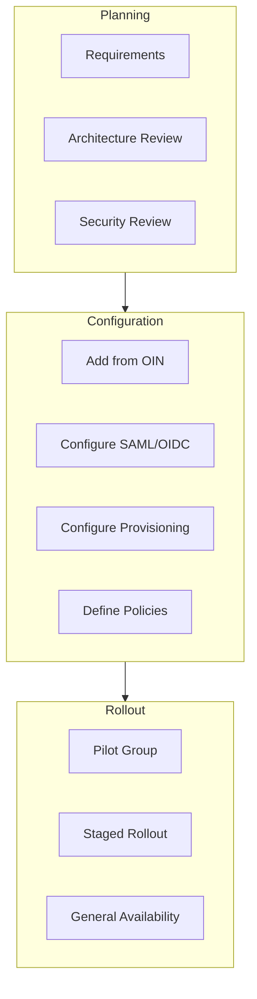

### 9.2 Authentication with Adaptive MFA

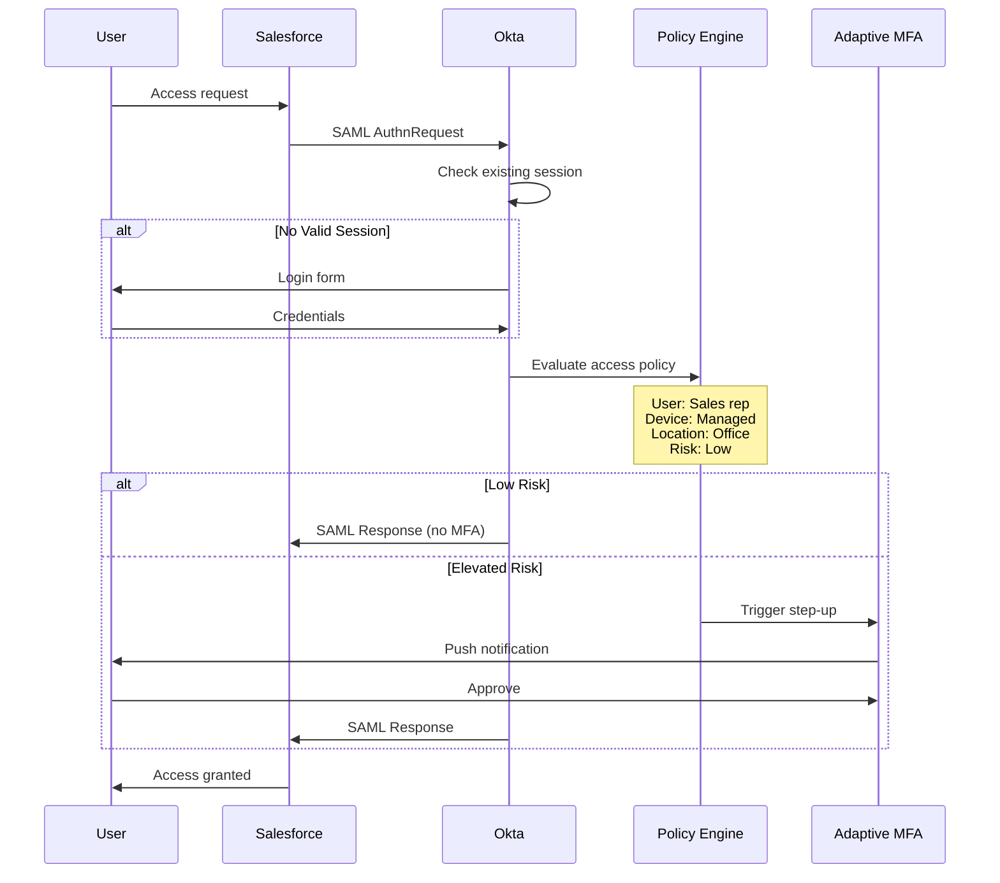

### 9.3 Lifecycle Integration

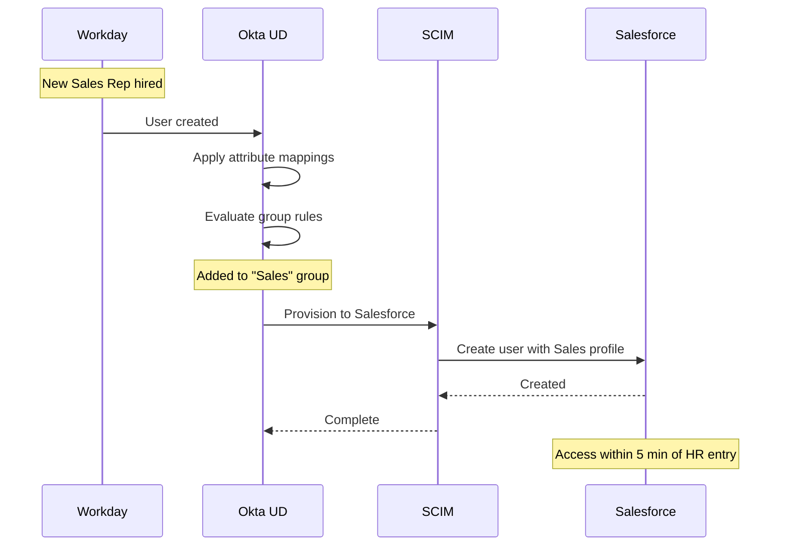

### 9.4 Deprovisioning

- HR terminates → Okta deactivates
- All sessions revoked immediately
- SCIM deprovisions from all apps
- Access revoked within 15 minutes

### 9.5 Security Incident Response

**Scenario:** Credentials compromised (impossible travel detected).

**Response:**
- Adaptive MFA triggers step-up
- If suspicious: session revoked, account suspended
- SIEM alert with context
- Admin notification with one-click remediation
- Post-incident: forced password reset, MFA re-enrollment

---

## 10. Role-Specific Focus

### 10.1 Senior TPM Scope

**Owns a slice:** "Salesforce SSO rollout and Zero Trust policy."

| Responsibility | Deliverables |
|---------------|--------------|
| App onboarding | SSO config, testing, rollout plan |
| Policy design | Adaptive MFA rules, thresholds |
| Provisioning setup | SCIM, attribute mappings |
| Rollout coordination | Pilot, staged, communications |
| SLO tracking | Auth success, provisioning latency |

### 10.2 Principal TPM Scope

**Owns the multi-year roadmap:** Enterprise Zero Trust strategy.

| Responsibility | Deliverables |
|---------------|--------------|
| Zero Trust roadmap | Phased implementation |
| Identity strategy | Okta vs. hybrid, federation |
| Compliance program | SOC2/GDPR mapping, audit readiness |
| Lifecycle automation | HR integration, deprovisioning SLAs |
| Security metrics | MTTD, MTTR, policy effectiveness |

### 10.3 Interview Readiness

Be ready to:
- **Articulate Zero Trust** (identity-based perimeter, continuous evaluation)
- **Walk through SSO + provisioning** with SLOs
- **Quantify impact:**
  - Auth success rate (99.99%)
  - Time-to-deprovision (&lt;15 min)
  - MTTD for anomalous logins
  - Cost savings from lifecycle automation

---

## Key Takeaways

> **Identity as Control Plane:** Okta isn't "SSO vendor"—it's the identity control plane for authentication, authorization, and lifecycle across all applications.

> **Zero Trust = Identity + Context:** Every access decision evaluates user, device, location, and risk. Not just "are you authenticated?"

> **Lifecycle = Least Privilege Over Time:** Without automation, users accumulate access. Joiner/mover/leaver ensures access matches current role.

> **Compliance = Controls + Process:** Okta provides technical controls. Meeting SOC2/GDPR requires combining with process controls.

> **Cell-Based Identity:** Org and regional boundaries contain blast radius. This is IAM's version of cell-based architecture.
