# Idempotency - Critical Concept

This guide covers 6 key areas: I. Executive Summary: The Definition for Principal TPMs, II. Business Impact, ROI, and Customer Experience, III. Technical Implementation Patterns, IV. Tradeoffs and Architectural Considerations, V. Real-World Mag7 Examples, VI. Interview Strategy: How to Use This.

## I. Executive Summary: The Definition for Principal TPMs

At the Principal TPM level, **Idempotency** is not merely a coding pattern; it is a critical architectural contract that guarantees data integrity across distributed systems. While the mathematical definition ($f(x) = f(f(x))$) implies that applying an operation multiple times yields the same result, the **architectural definition** for a Mag7 environment is:

**Idempotency is the mechanism that converts "At-Least-Once" message delivery (the physical reality of networks) into "Exactly-Once" processing (the business requirement).**

In a monolithic architecture, ACID transactions in a single database handle consistency. In the distributed microservices architecture typical of Google, Amazon, or Azure, network partitions and timeouts are inevitable. When a client (mobile app, internal service) sends a request and times out waiting for a response, it faces the **Two Generals' Problem**:
1.  Did the request fail to reach the server? (Safe to retry)
2.  Did the request succeed, but the acknowledgement failed? (Unsafe to retry without idempotency)

Without an idempotency strategy, the system defaults to data corruption (duplicates) or data loss (if retries are suppressed).

### 1. The Mechanism at Scale: Idempotency Keys
For a Product Principal TPM, the implementation detail that matters most is the **Idempotency Key**. This is a unique value generated by the client (not the server) and sent with the request.

*   **The Workflow:**
    1.  **Client** generates a unique key (e.g., UUID) and sends a request: `POST /charge {amount: 100, idemp_key: "abc-123"}`.
    2.  **Server** checks a dedicated storage layer (often Redis or DynamoDB) for "abc-123".
    3.  **Scenario A (First Request):** Key not found. Server locks the key, processes the payment, stores the response payload against the key, and returns the result.
    4.  **Scenario B (Retry/Replay):** Key found. Server halts processing. It retrieves the stored response payload from the previous successful attempt and returns it immediately.

*   **Mag7 Example (Stripe/Amazon Pay):** Stripe’s API is the industry standard for this. They require an `Idempotency-Key` header for all state-changing POST requests. If a generic "Create Charge" request times out, the merchant's server retries with the *same* key. Stripe detects this and ensures the credit card is not charged twice, returning the original "Success" message.

### 2. Strategic Tradeoffs
A Principal TPM must drive the decision on *where* and *how* to implement this, balancing reliability against complexity and cost.

| Tradeoff Vector | Principal Analysis |
| :--- | :--- |
| **Latency vs. Safety** | **The Cost of Consistency:** Implementing idempotency adds latency. Every write request requires a read (check key), a write (lock key), and potentially another write (store response).   *Tradeoff:* In high-frequency trading or real-time gaming, this latency might be unacceptable. In Payments or Cloud Provisioning (e.g., AWS EC2 creation), it is non-negotiable. |
| **Storage Costs vs. Retention** | **The TTL Dilemma:** How long do you store the Idempotency Key?   *Tradeoff:* Storing keys forever is expensive at Mag7 scale. Storing them for 24 hours covers 99.9% of network retries but fails if a client replays a transaction a week later. A common compromise is a 24-72 hour TTL (Time To Live) in a fast cache (Redis), and relying on hard database constraints for long-tail deduplication. |
| **Complexity vs. Scope** | **Concurrency Control:** What happens if two requests with the same key arrive *simultaneously* (race condition)?   *Tradeoff:* You must implement distributed locking (e.g., via Redis Redlock or DynamoDB conditional writes). This increases engineering complexity significantly. A "Product" decision must be made: do we block the second request or queue it? |

### 3. Business Impact & ROI
The investment in building an idempotent infrastructure is significant. As a Principal TPM, you justify this investment through Risk Mitigation and Customer Experience (CX).

*   **Financial Compliance (SOX/Auditing):** In systems like AWS Billing or Google Ads, duplicate records create accounting nightmares. Idempotency is often a requirement for financial auditing compliance.
*   **Customer Trust (The "Uber" Scenario):** If a user requests a ride, the app spins, and they press "Request" again, they should not summon two vehicles. Lack of idempotency here causes immediate refund demands and churn.
*   **Operational Efficiency:** Without idempotency, "fixing" data requires manual database intervention or complex reconciliation scripts. Idempotency allows for aggressive, automated retry policies (e.g., Exponential Backoff) without fear of side effects, making the system self-healing.

### 4. Failure Modes and Edge Cases
A Principal TPM must anticipate where this logic breaks:
*   **Key Collisions:** If the client uses a weak random number generator for keys, two different users might generate the same key. The second user receives the first user's data. *Mitigation:* Enforce UUID v4 or similar standards.
*   **Parameter Mismatch:** A client sends a request with Key A and Amount $10. Later, they retry with Key A but Amount $20. *Behavior:* The system should detect that the parameters associated with the locked Key A do not match the new request and throw a `409 Conflict` or `422 Unprocessable Entity` error, rather than silently returning the old $10 result.

## II. Business Impact, ROI, and Customer Experience ⚠️

*Note: This section may need additional review.*

Why should a Product Principal TPM care? Because the lack of idempotency directly degrades trust and increases operational costs.

### 1. Financial Compliance & Trust (The "Amazon" Scenario)
*   **Scenario:** A user buys a $2,000 laptop. The request hits the payment gateway, the charge succeeds, but the network drops the acknowledgement back to the user. The user's browser auto-retries.
*   **Without Idempotency:** The user is charged $4,000. Customer support costs spike; brand trust plummets.
*   **With Idempotency:** The system recognizes the second request is a replay of the first. It returns "Success" (and the receipt) without charging the card again.
*   **ROI:** Massive reduction in "Chargeback" fees and Tier-1 Customer Support tickets.

### 2. Infrastructure Efficiency (The "AWS/Azure" Scenario)
*   **Scenario:** An internal control plane creates a new VM instance. The orchestration message is delivered twice by a message queue (e.g., Kafka/SQS).
*   **Without Idempotency:** You provision two VMs. You are now paying double the compute costs, and the client only knows about one of them. The second becomes a "zombie" resource.
*   **With Idempotency:** The provisioner checks if the Resource ID already exists. If yes, it returns the existing metadata.
*   **ROI:** Direct reduction in COGS (Cost of Goods Sold) and wasted cloud capacity.

### 3. Data Integrity & API Experience
*   **Scenario:** A user uploads a photo to Instagram. The upload finishes, but the confirmation times out. The app retries.
*   **CX Impact:** Users hate seeing the same photo appear twice in their feed. It looks "buggy" and unpolished.
*   **Business Capability:** Idempotency allows mobile teams to implement aggressive retry logic (improving perceived reliability) without fear of corrupting the user experience.

## III. Technical Implementation Patterns

### 1. The "Idempotency Key" Pattern (REST & RPC)

The industry standard for implementing idempotency in transactional APIs (like those at Stripe, Adyen, or AWS) is the **Idempotency Key** pattern via HTTP headers.

**The Mechanism:**
1.  **Client Responsibility:** The client generates a unique ID (usually a UUID v4) and sends it in the header (e.g., `Idempotency-Key: <UUID>`) along with the payload.
2.  **Server Responsibility:**
    *   **Check:** Upon receipt, the server checks a dedicated storage layer (e.g., Redis, DynamoDB) to see if this Key exists.
    *   **Lock:** If the key is new, the server creates a record marked as `IN_PROGRESS` to prevent race conditions (see Concurrency below).
    *   **Execute:** The server processes the business logic.
    *   **Update:** The server updates the record with the final response and marks it `COMPLETED`.
    *   **Return:** The response is sent to the client.
3.  **Replay Behavior:** If a second request arrives with the same Key:
    *   If `COMPLETED`: Return the *stored* response immediately (do not re-process logic).
    *   If `IN_PROGRESS`: Return a `409 Conflict` or a "Request in Progress" status, telling the client to wait.

**Mag7 Example (AWS):**
When launching an EC2 instance using `RunInstances`, you provide a `ClientToken`. If the network times out and you retry with the same token, AWS ensures only one VM spins up. If you retry with the same token but *different parameters* (e.g., different instance type), AWS throws an `IdempotentParameterMismatch` error.

**Tradeoffs:**
*   **Client Complexity vs. Server Safety:** This shifts complexity to the client (they must manage UUIDs). However, it is the only way to guarantee safety in a "stateless" HTTP environment.
*   **Storage Cost:** You are storing metadata for every mutating request. At Mag7 scale, this requires aggressive TTL (Time-To-Live) strategies.

### 2. Concurrency Control: The "Double-Click" Race Condition

A common failure mode in implementation is the "Check-Then-Act" bug.
*   *Bad Implementation:* Service checks DB -> "Key doesn't exist" -> Service starts processing.
*   *Scenario:* A user double-clicks "Pay". Two requests hit the load balancer simultaneously (within milliseconds). Both checks return "Key doesn't exist" before the first one writes the lock. Both process the payment.

```mermaid
sequenceDiagram
    participant U as User
    participant LB as Load Balancer
    participant S1 as Server 1
    participant S2 as Server 2
    participant DB as Database

    rect rgb(255, 220, 220)
        Note over U,DB: ❌ Bad: Check-Then-Act Race Condition
        U->>LB: Double-click "Pay"
        par Request 1
            LB->>S1: POST /charge (key: abc)
            S1->>DB: SELECT WHERE key='abc'
            DB-->>S1: Not found
        and Request 2
            LB->>S2: POST /charge (key: abc)
            S2->>DB: SELECT WHERE key='abc'
            DB-->>S2: Not found
        end
        S1->>DB: INSERT key='abc'
        S2->>DB: INSERT key='abc'
        Note over DB: 💥 Both succeed = Double charge!
    end

    rect rgb(220, 255, 220)
        Note over U,DB: ✅ Good: Atomic Conditional Write
        U->>LB: Double-click "Pay"
        par Request 1
            LB->>S1: POST /charge (key: abc)
            S1->>DB: PutItem IF NOT EXISTS
            DB-->>S1: Success
        and Request 2
            LB->>S2: POST /charge (key: abc)
            S2->>DB: PutItem IF NOT EXISTS
            DB-->>S2: ConditionalCheckFailed
        end
        Note over DB: ✓ Only one charge processed
    end
```

**The Solution: Database Constraints (Atomic Operations)**
Principal TPMs must ensure the architecture relies on the database's consistency model, not application logic, for the initial lock.

*   **Optimistic Locking (DynamoDB/NoSQL):** Use `PutItem` with a condition expression `attribute_not_exists(idempotency_key)`. If two requests hit at once, the database accepts one and rejects the second with a `ConditionalCheckFailedException`.
*   **Unique Constraints (SQL):** Rely on the Primary Key constraint. The second insert fails at the database level.

**Impact on ROI/CX:**
Failure to handle this specific race condition is the primary cause of "double spend" incidents during high-traffic events (e.g., Black Friday sales or ticket launches), leading to high-severity incidents (SEV1) and manual reconciliation costs.

### 3. Scope and Storage Strategy: Where does the state live?

A critical architectural decision is where the idempotency keys are stored. This dictates the latency and durability of the system.

**Option A: Ephemeral/Cache (Redis/Memcached)**
*   **Use Case:** High-volume, low-criticality events (e.g., Analytics events, "Likes", Notifications).
*   **Pros:** Extremely low latency (<1ms).
*   **Cons:** Volatile. If the Redis cluster fails or restarts, the idempotency keys are lost. A retry during a cache outage results in duplication.
*   **Tradeoff:** Prioritizing Performance over Absolute Consistency.

**Option B: Persistent Storage (DynamoDB/Spanner/CockroachDB)**
*   **Use Case:** Financial transactions, Inventory reservation, Cloud Resource provisioning.
*   **Pros:** Durable. Survives zonal failures.
*   **Cons:** Higher latency (single digit to low double-digit ms) and higher cost.
*   **Tradeoff:** Prioritizing Data Integrity over Latency.

**Mag7 Guidance:** For a "Product Principal," the default stance for any mutating user flow (Orders, Payments, Settings) must be **Persistent Storage**. You cannot explain to a VP that customers were double-charged because a Redis node rebooted.

### 4. Edge Case Handling: Parameter Mismatches and Errors

Implementing the "Happy Path" is easy. The Principal TPM ensures the "Unhappy Paths" are defined.

**Scenario 1: Parameter Mismatch**
*   *Event:* Client sends Key `ABC` with Amount `$10`. Later, Client sends Key `ABC` with Amount `$20`.
*   *Behavior:* This is likely a bug or a malicious attack. The system **must not** return the cached response for the $10 charge, nor should it process the $20 charge.
*   *Correct Action:* Return a `400 Bad Request` or `422 Unprocessable Entity` explicitly stating validation mismatch.

**Scenario 2: Failed Operations**
*   *Event:* The first request attempted to process but failed (e.g., Credit Card declined).
*   *Behavior:* Should the second request retry the logic or return the cached failure?
*   *Correct Action:* Generally, Idempotency caches the *result*. If the result was "Card Declined", the retry should return "Card Declined". The client must generate a *new* Idempotency Key to attempt a new charge.

### 5. Lifecycle Management (TTL)

You cannot store idempotency keys forever. The database would grow infinitely.

**The Policy:**
Define a retention window based on the maximum reasonable retry time for a client.
*   **Standard:** 24 to 48 hours.
*   **Rationale:** If a client hasn't received a response in 24 hours, they are likely not auto-retrying anymore; they have moved to a manual workflow or a new session.
*   **Business Capability:** This allows the business to "garbage collect" billions of rows of historical keys, saving significant infrastructure OPEX.

## IV. Tradeoffs and Architectural Considerations

Implementing idempotency at the scale of a Mag7 company is not merely a coding practice; it is an architectural commitment that consumes significant storage and compute resources. As a Principal TPM, you must arbitrate the tension between **data consistency** (preventing duplicates) and **system availability/latency** (adding locking mechanisms).

### 1. Storage Strategy: The "Check-Then-Act" Dilemma

The fundamental mechanism of idempotency is a lookup: *Has this unique key been seen before?* If yes, return the stored result. If no, process the request. This introduces a "Check-Then-Act" race condition.

At Mag7 scale, you cannot rely on local memory (e.g., a single server’s RAM) because requests are load-balanced across thousands of hosts. You must use a distributed data store.

**The Architectural Choice:**
*   **Option A: Relational Database (ACID transactions).** You insert the idempotency key into a dedicated table within the same transaction as the business logic.
    *   *Tradeoff:* High consistency, low throughput. This creates a "hot" table that becomes a bottleneck during peak events (e.g., Prime Day, Black Friday). It couples your idempotency logic tightly to your domain database schema.
*   **Option B: Low-Latency KV Store (Redis/Memcached).**
    *   *Tradeoff:* High throughput, lower consistency. If Redis goes down or flushes memory, you lose your idempotency protection, leading to potential double-writes during a recovery window.
*   **Option C: Distributed Consistent Store (DynamoDB/Spanner/CosmosDB).**
    *   *Mag7 Standard:* Most Mag7 services utilize a highly durable, distributed Key-Value store (like DynamoDB with conditional writes) specifically for idempotency leasing.

**Real-World Mag7 Behavior:**
AWS API Gateway and Lambda often utilize a sidecar or middleware approach where the idempotency check happens *before* the business logic is invoked, using DynamoDB with a `ConditionExpression` to ensure atomicity. If the write fails (key exists), the system fetches the stored response.

### 2. Handling "In-Flight" Requests (The Locking Problem)

A critical edge case occurs when Request A is still processing, and Request B (the retry) arrives. This is common in mobile networks where latencies fluctuate wildly.

If you simply check "Is it done?", the answer for Request A is "No." If you act on Request B, you create a race condition resulting in double processing.

**The Solution: The "Processing" State (Leasing)**
You must implement a three-state machine for keys:
1.  **Non-Existent:** New request.
2.  **Processing (Locked):** Request received, logic executing.
3.  **Completed:** Result stored.

**Tradeoffs & Risks:**
*   **The Zombie Lock:** If the worker processing Request A crashes while the key is in the "Processing" state, the key remains locked forever. Request B will indefinitely receive a "409 Conflict" or "Processing" error.
*   **Mitigation:** You must implement a **Lock TTL (Time-to-Live)**. If the key stays in "Processing" for >30 seconds (or 99th percentile latency), the lock expires, and a new worker can take over.
*   **Business Impact:** Setting the Lock TTL too short causes double processing (Request A finishes just as Request B takes over). Setting it too long results in poor CX (user waits indefinitely for a retry to succeed).

### 3. Scope and Retention of Idempotency Keys

How long do you keep the keys? Indefinitely storing every request ID ever sent to Google Cloud or Azure is cost-prohibitive and technically unfeasible.

**Architectural Decisions:**
*   **Retention Policy (TTL):**
    *   *Mag7 Standard:* 24 to 72 hours.
    *   *Why:* Most retries happen within seconds or minutes. If a client retries a request 4 days later, it is likely a new user intent, not a network retry.
    *   *ROI Impact:* Reducing TTL from 7 days to 24 hours can save millions of dollars in storage costs for high-volume services like ingestion pipelines or payment gateways.
*   **Key Scope:**
    *   Keys should usually be scoped to a specific user or account ID (`user_id + idempotency_key`) rather than a global index. This allows for sharding the idempotency store based on User ID, aligning with the sharding strategy of the primary datastore to reduce cross-shard latency.

### 4. Error Handling: To Cache or Not to Cache?

When a request fails, does that count as the "result"?

*   **Scenario:** A user tries to upload a file. The internal storage service fails (500 Error). The idempotency layer records this "500 Error."
*   **The Retry:** The user clicks "Retry." The system sees the idempotency key and returns the cached "500 Error."
*   **The Problem:** The user is permanently blocked from uploading that file with that key, even if the internal storage service is fixed.

**The Principal TPM Guidance:**
Do **not** persist 5xx (Server Side) errors in the idempotency store. Only persist:
1.  **Success (2xx):** To ensure we don't do it again.
2.  **Client Errors (4xx):** If the input was bad (400 Bad Request), it will always be bad. Caching this saves compute resources.

**Tradeoff:** By allowing retries on 5xx errors, you risk thundering herd scenarios if the retry logic isn't coupled with exponential backoff. However, this is necessary for system recovery.

### 5. Payload Validation (Parameter Tampering)

A subtle security and integrity risk involves a client sending the *same* Idempotency Key but *different* request parameters.

*   *Request A:* Pay $50 (Key: `123-abc`) -> Drops.
*   *Request B:* Pay $500 (Key: `123-abc`) -> Arrives.

If the system blindly accepts Request B because it hasn't seen Key `123-abc` yet, it processes $500. If Request A then arrives, it sees the key exists and returns the $500 result. The user intended $50 but got charged $500.

**Mag7 Requirement:**
The Idempotency check must validate that the hash of the incoming payload matches the hash associated with the stored key. If the keys match but payloads differ, the system must throw a **422 Unprocessable Entity** or **409 Conflict**, alerting the client of the mismatch.

## V. Real-World Mag7 Examples ⚠️

*Note: This section may need additional review.*

### 1. Amazon/AWS: The "Token" Pattern
In AWS APIs (e.g., EC2 `RunInstances`), there is a parameter often called `ClientToken`.
*   **Behavior:** If you invoke `RunInstances` with a specific `ClientToken`, AWS ensures that only one EC2 instance is launched, even if the API receives the request three times due to network jitter.
*   **Mag7 Nuance:** AWS treats the token as valid for a specific duration (usually 24 hours).

### 2. Stripe (The Industry Standard)
While not Mag7, Stripe sets the standard that Google/Meta often emulate for payments.
*   **Behavior:** They use a header `Idempotency-Key`.
*   **Error Handling:** If a request comes in with the same Key but *different* parameters (e.g., first request was $10, second is $20), Stripe throws a `409 Conflict` error. This prevents accidental key reuse for different intents.

### 3. Kafka (Streaming Data)
*   **Behavior:** "Exactly-Once Semantics" (EOS).
*   **Mag7 Nuance:** In data pipelines (e.g., ads processing at Meta), producers assign sequence numbers to messages. The broker (Kafka) deduplicates based on these sequence numbers to ensure ad impressions aren't over-counted, which would fraudulently overcharge advertisers.

## VI. Interview Strategy: How to Use This

To effectively leverage knowledge of idempotency in a Principal TPM interview, you must move beyond the "dictionary definition" and demonstrate how this technical concept acts as a lever for business reliability, user experience, and architectural scalability. At the Principal level, interviewers assess your ability to anticipate failure modes in distributed systems and negotiate the cost of mitigating them.

### 1. The System Design Round: Treating Idempotency as a Constraint, Not a Feature

In a system design interview (e.g., "Design a Payment Gateway" or "Design a Ride-Sharing Dispatcher"), do not treat idempotency as an afterthought. You must introduce it immediately as a foundational constraint of the API contract.

*   **The Strategy:** Explicitly define the **Idempotency Key Strategy** during the high-level design phase. Do not wait for the interviewer to ask "What if the network fails?" Proactively state, "Because we are operating at Mag7 scale, we assume network partitions will occur. Therefore, all state-changing APIs (POST/PUT/PATCH) will require an `Idempotency-Key` header."
*   **Mag7 Example (Stripe/Amazon):** Reference how Stripe enforces idempotency via HTTP headers. The key is usually a UUID generated by the client (V4). If a request retries with the same key, the server returns the cached response rather than re-executing logic.
*   **Tradeoff Analysis:**
    *   **Storage vs. Reliability:** Storing idempotency keys requires high-performance storage (e.g., Redis or DynamoDB with TTL). You are trading storage costs and write-complexity for system integrity.
    *   **Window of Validity:** Discuss the Time-to-Live (TTL). Do we keep keys for 24 hours or 30 days?
        *   *Short TTL (24h):* Cheaper storage, but risks duplicates if a client comes back online after a long outage.
        *   *Long TTL (30d):* Higher storage cost, covers edge cases like mobile devices in developing markets with poor connectivity.
*   **Business Impact:** This demonstrates you understand **Operational ROI**. The cost of a Redis cluster is negligible compared to the legal/support cost of refunding 10,000 double-charged customers.

### 2. The Product Sense Round: UX Implications of "At-Least-Once" Delivery

When discussing product strategy or customer experience, use idempotency to explain how you handle the "Uncanny Valley" of uncertainty—when a user clicks "Buy" and the spinner just spins.

*   **The Strategy:** Connect technical implementation to User Trust. Explain that idempotency allows the frontend to safely retry without user intervention, or allows the user to mash the "Buy" button in frustration without financial penalty.
*   **Mag7 Example (Uber/DoorDash):** When a user requests a ride/order, and the app crashes or loses signal, the app re-sends the request upon reopening. Idempotency ensures two drivers aren't dispatched.
*   **Tradeoff Analysis:**
    *   **Latency vs. Safety:** Implementing an idempotency check adds latency (a database read/write) to the critical path.
    *   **The "Like" Button vs. The "Buy" Button:** A Principal TPM knows when *not* to use it.
        *   *Scenario A (Social Media Like):* If a "Like" is duplicated or lost, the business impact is near zero. The latency cost of idempotency checks might degrade the scrolling experience. **Decision:** Eventual consistency, no strict idempotency.
        *   *Scenario B (Stock Trade):* Zero tolerance for error. **Decision:** Strong consistency, mandatory idempotency, acceptable latency penalty.
*   **CX Impact:** You are prioritizing **Customer Trust**. A fast application that double-charges users is a failed product.

### 3. The Execution/Delivery Round: API Governance and Legacy Migration

Principal TPMs often inherit legacy systems ("The Monolith") that lack these protections. Interviewers will ask how you manage technical debt or drive cross-team standards.

*   **The Strategy:** Frame idempotency as a **Governance and Platform Capability**. It is not just about one endpoint; it is about standardizing how internal microservices talk to each other to prevent cascading retry storms (The Thundering Herd problem).
*   **Mag7 Example (AWS Lambda/SQS):** AWS Lambda functions triggered by SQS standard queues utilize "at-least-once" delivery. Your function *will* be invoked multiple times for the same event eventually. You must enforce that all downstream consumers handle this.
*   **Tradeoff Analysis:**
    *   **Developer Velocity vs. Platform Stability:** Forcing every team to implement idempotency checks slows down feature shipping initially.
    *   **Centralized vs. Decentralized Implementation:**
        *   *Sidecar/Gateway Pattern:* Implement idempotency logic in the API Gateway / Service Mesh (Envoy). *Pro:* Developers don't write code; consistent logic. *Con:* Complexity in the infrastructure layer; "Magic" behavior that developers might misunderstand.
        *   *Library/SDK Pattern:* Provide a shared library. *Pro:* Explicit control. *Con:* Version drift; adoption friction.
*   **Business Capability:** This highlights **Organizational Scalability**. By enforcing this standard, you decouple teams. The Checkout team doesn't need to call the Inventory team to check if a reservation was made; the API contract handles the deduplication automatically.

### 4. Handling Edge Cases: The "Concurrency" Trap

A specific trap in interviews is the race condition during the idempotency check.

*   **The Scenario:** Two requests with the same Key arrive at the exact same millisecond (e.g., a frantic user double-tap or a misconfigured retry loop).
*   **The Principal Answer:** "We cannot simply check `if (exists)` then `write`. We must use atomic operations (e.g., `SETNX` in Redis or Conditional Writes in DynamoDB) to lock the key. If the key is locked (processing in progress), the second request waits or receives a `429 - Processing` response, rather than executing parallel logic."
*   **Why this matters:** It shows you understand **Data Integrity** at a depth beyond the happy path.

---

## Interview Questions

### I. Executive Summary: The Definition for Principal TPMs

**Question 1: Designing for Failure**
"We are building a new internal API for transferring credits between user accounts. The network is unreliable, and we anticipate a 1% timeout rate. How would you design the API to ensure no money is created or destroyed during these timeouts?"

*   **Guidance for a Strong Answer:**
    *   **Identify the Core Problem:** Acknowledge that timeouts are ambiguous (unknown state).
    *   **Propose Idempotency:** explicitly mention passing a unique `transaction_id` or `idempotency_key` in the header.
    *   **Architectural Flow:** Describe checking the key in a cache (Redis) before processing.
    *   **Handling Race Conditions:** Discuss using database transactions or optimistic locking (e.g., "If key exists, return stored result; else, create record").
    *   **Principal Level Detail:** Mention parameter validation (ensuring the retry payload matches the original) and defining a TTL for the key storage.

**Question 2: The Tradeoff Scenario**
"Our legacy system processes orders but occasionally duplicates them when the frontend retries. Engineering proposes a full refactor to add idempotency keys to every endpoint. This will delay the roadmap by 3 months. As the TPM, how do you evaluate if this is the right choice?"

*   **Guidance for a Strong Answer:**
    *   **Quantify the Impact:** Ask for data. How many duplicates? What is the cost of a duplicate (Refund cost + Support time + Churn)?
    *   **Assess the Scope:** Challenge the "every endpoint" assumption. Idempotency is critical for *mutating* (POST/PUT/PATCH) transactions (payments, orders), but unnecessary for Read (GET) operations or low-risk logs.
    *   **Propose Phased Rollout:** Suggest implementing idempotency only on the critical "Checkout" endpoint first to reduce risk immediately without stalling the entire roadmap.
    *   **Alternative Solutions:** Discuss if database unique constraints (e.g., on `order_id`) could solve 80% of the problem with 10% of the effort, versus a full distributed lock system.

### III. Technical Implementation Patterns

### Question 1: The "Zombie" Transaction
**"We are building a money transfer service. A client sends a request with an idempotency key. The server starts processing, which involves a slow call to a banking partner (3-5 seconds). While that is happening, the client times out and sends a retry with the same key. How should the system handle this second request?"**

*   **Guidance for a Strong Answer:**
    *   **Identify the State:** The candidate must recognize the `IN_PROGRESS` state. The key exists, but there is no result yet.
    *   **Avoid Double Processing:** The system must *not* start a second thread to the bank.
    *   **Wait vs. Fast Fail:**
        *   *Option A (Spin/Wait):* The second request subscribes to the result of the first and waits. (Better CX, higher complexity).
        *   *Option B (Fast Fail):* Return `409 Conflict` asking the client to retry in 5 seconds. (Easier to build, slightly worse CX).
    *   **Principal Level Detail:** Mention the need for a "Lock Timeout." If the first process crashes and never updates the record, the key shouldn't be locked forever.

### Question 2: Idempotency at Scale (Global vs. Regional)
**"You are launching a global ticketing platform. Users in Europe and the US might be hitting different regional shards. How do you implement idempotency if a user travels or if we failover traffic from US-East to EU-West? Do we need global replication for idempotency keys?"**

*   **Guidance for a Strong Answer:**
    *   **Tradeoff Analysis:** Global replication of *every* idempotency key (e.g., via DynamoDB Global Tables) is expensive and introduces replication lag.
    *   **User Sharding:** Ideally, idempotency keys should live where the user's data lives. If a user is pinned to US-East, the key stays there.
    *   **Failover Strategy:** If US-East goes down completely, do we care about idempotency for in-flight requests?
        *   *Pragmatic Answer:* In a catastrophic region failover, we might accept a tiny percentage of edge-case duplicates to ensure availability for the millions of other users.
        *   *Strict Answer:* If strictness is required, we pay the latency/cost penalty for global active-active storage. The candidate should ask "What is the cost of a duplicate ticket vs. the cost of global replication?"

### IV. Tradeoffs and Architectural Considerations

### Question 1: The "Zombie" Transaction
**"Design an idempotency mechanism for a long-running video transcoding job that takes up to 15 minutes. How do you handle a client retry at minute 14, and what happens if the original server crashes at minute 5?"**

*   **Guidance for a Strong Answer:**
    *   **State Management:** Candidate should propose a "Processing" state, not just "Done/Not Done."
    *   **Locking Strategy:** Acknowledges that a standard 30-second web request lock won't work. Suggests a "heartbeat" mechanism where the worker updates the lock every minute.
    *   **Crash Recovery:** If the heartbeat stops (server crash at minute 5), the lock expires at minute 6. The retry at minute 14 (or an automated sweeper) detects the expired lock and restarts the job.
    *   **UX/API:** The retry at minute 14 should return a "202 Accepted (Job Still Running)" status, not re-trigger the job blindly.

### Question 2: Retrofitting Legacy Systems
**"We have a legacy payment service processing 10k TPS that has no idempotency. We are seeing double charges. You need to introduce idempotency without downtime and with minimal latency impact. Walk me through your rollout strategy."**

*   **Guidance for a Strong Answer:**
    *   **Client-Side vs Server-Side:** Acknowledges that clients must change to send keys. Proposes a backward-compatible phase where keys are optional.
    *   **Storage Choice:** Selects a high-write throughput store (e.g., Redis with persistence or DynamoDB) rather than the legacy SQL DB to avoid locking the payments table.
    *   **Rollout Phases:**
        1.  *Dark Mode:* Clients send keys, server logs them but doesn't enforce logic (to test throughput/errors).
        2.  *Enforcement:* Enable check-then-act logic.
    *   **Determinism:** Discusses how to handle the "Payload Mismatch" issue mentioned in section 5, ensuring legacy clients don't accidentally reuse IDs.

### VI. Interview Strategy: How to Use This

### Question 1: Designing for Failure in Fintech
**"We are launching a peer-to-peer payment feature (like Venmo) within our chat application. We expect 50k transactions per second during peak holidays. Design the transaction flow to ensure no user loses money if our primary database goes down mid-transaction."**

**Guidance for a Strong Answer:**
*   **Identify the Core Risk:** The risk isn't just the database going down; it's the client not knowing the result.
*   **Idempotency Key Placement:** Propose generating the key on the *mobile device* (client-side), not the server. If the server generates it, a network failure before the response means the client doesn't have the key to retry with.
*   **The "Processing" State:** Explain how to handle a retry that arrives while the first request is still pending (the race condition). Return the current status ("Pending") rather than an error or a new transaction.
*   **Reconciliation:** Mention an asynchronous reconciliation process (daemon) that sweeps for "stuck" idempotency keys that never resolved to a final state.

### Question 2: Legacy Migration Strategy
**"You've joined a team managing a legacy monolithic inventory system. It currently has no idempotency protections. Clients (other microservices) are reporting inventory drift due to aggressive retries during network blips. How do you roll out idempotency without breaking the existing clients who don't send an Idempotency Key?"**

**Guidance for a Strong Answer:**
*   **Phased Rollout (The Principal Approach):** Do not suggest a "big bang" rewrite.
    *   *Phase 1 (Optional):* Update the API to accept an optional `Idempotency-Key` header. Log usage but don't enforce blocking.
    *   *Phase 2 (Deterministic Generation):* For clients that don't send a key, can we generate one based on the request body hash (e.g., SHA-256 of the payload)? *Tradeoff:* This is risky if legitimate duplicate requests (buying two identical items sequentially) occur. Discuss this risk.
    *   *Phase 3 (Enforcement):* Set a deprecation timeline. Communicate with stakeholders. After Date X, requests without the header are rejected (or strictly rate-limited).
*   **Metrics:** Define success metrics—reduction in "Inventory Drift" tickets and "Duplicate Order" refunds.

---

## Key Takeaways

- Review each section for actionable insights applicable to your organization

- Consider the trade-offs discussed when making architectural decisions

- Use the operational considerations as a checklist for production readiness
