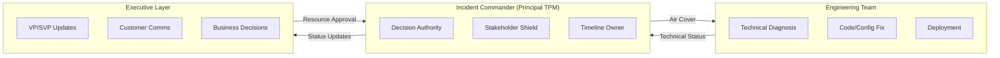
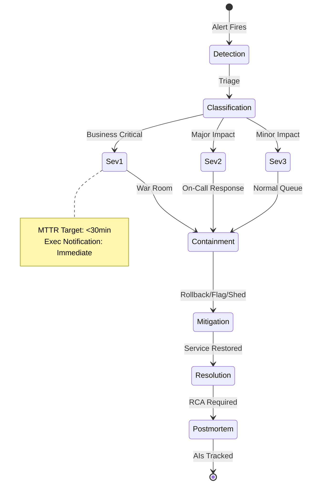
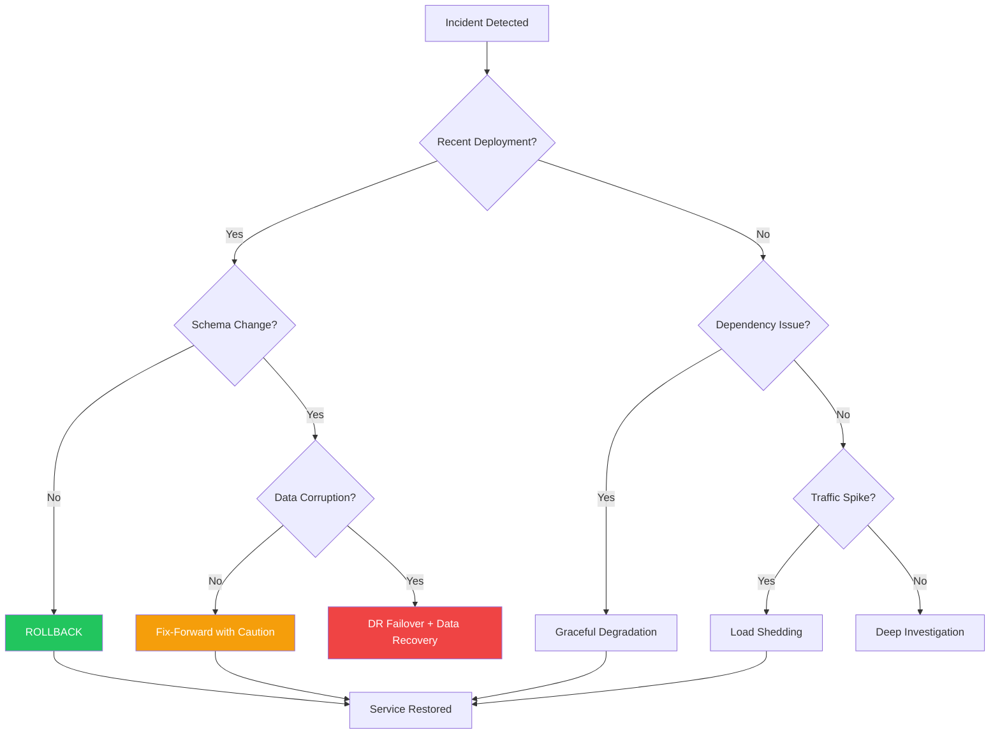
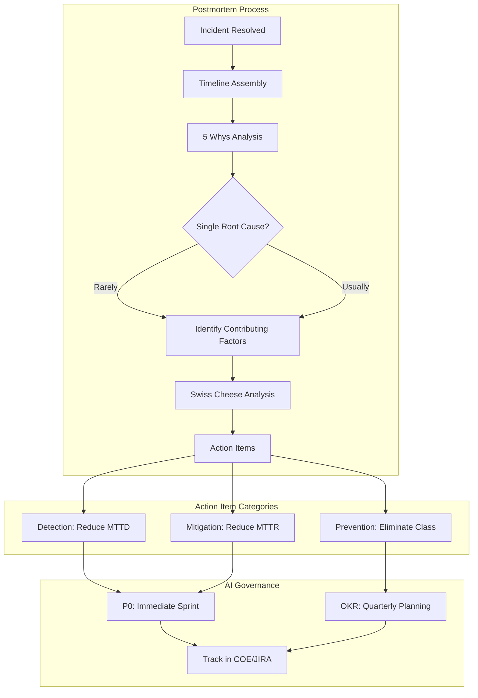
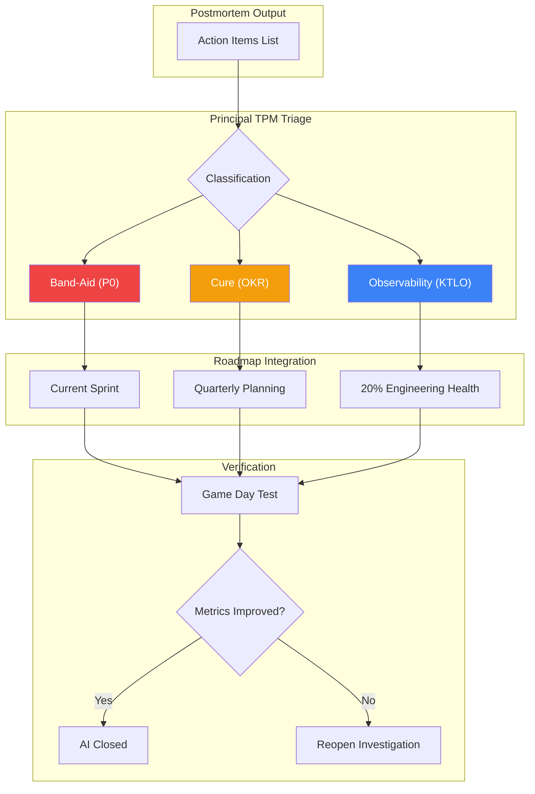

# Incident Management & Postmortems for Principal TPM at Mag7

At Mag7 scale, outages cost millions per hour and are measured by executives in real-time. Principal TPMs don't write code during incidents—they create order from chaos: commanding the war room, shielding engineers from executive pressure, making unilateral decisions (rollback vs. fix-forward), and ensuring the timeline is impeccable for the inevitable COE review. After incidents, they architect the blameless postmortem culture that surfaces systemic failures while maintaining the political capital to convert action items into roadmap commitments. This guide covers the incident lifecycle, RCA methodology, and remediation governance that transforms firefighting into organizational learning.

## I. The Strategic Role of the Principal TPM in High-Severity Incidents

At the Principal level in a Mag7 environment (Google, Amazon, Meta, etc.), you are rarely the person pushing code fixes during an outage. Instead, you are the **Incident Commander (IC)** or the **Communication Lead**. Your primary function is to bring order to chaos, manage executive stakeholders, and ensure the engineering team has the "air cover" required to resolve the issue.

### Real-World Behavior at Mag7
*   **Google:** Follows the SRE model where an Incident Commander (often a TPM or SRE Lead) holds absolute authority over the incident state, separating the "operations" of the incident from the "technical resolution."
*   **Amazon:** Uses the "Call Leader" concept. The TPM often acts as the scribe or facilitator for the Call Leader, ensuring the timeline is impeccable for the inevitable COE (Correction of Error) document.

### Trade-offs
*   **Command & Control vs. Consensus:**
    *   *Choice:* You must make unilateral decisions (e.g., "Roll back the deployment now") rather than debating the root cause during the fire.
    *   *Trade-off:* You risk rolling back a benign change and delaying features, but you prioritize Mean Time to Recover (MTTR) over diagnostic precision.
*   **Communication Frequency vs. Engineer Focus:**
    *   *Choice:* You shield engineers from pings by providing status updates every 15-30 minutes.
    *   *Trade-off:* You absorb high pressure from VPs demanding ETAs, but you prevent context-switching costs for the engineers fixing the issue.

### Impact
*   **Business:** Minimizes revenue loss (e.g., Amazon downtime costs millions per minute).
*   **Skill:** Demonstrates "Executive Presence" and "Crisis Management"—core competencies for L7+ promotion.

## II. Incident Lifecycle: Classification, Containment, and Mitigation

### 1. Severity Classification: The Matrix of Urgency

At the Principal level, your role is not to reactively guess the severity but to proactively define the **Severity Matrix** that removes ambiguity before an incident occurs. In a Mag7 environment, severity is rarely determined by technical metrics alone (e.g., "CPU is at 90%"); it is determined by business impact and customer experience.

**The Principal TPM's Responsibility:** You must ensure that "Severity" is a binary decision tree, not a debate. You define the thresholds where a technical glitch becomes a business crisis.

**Real-World Behavior at Mag7:**
*   **Microsoft (Azure):** Uses a severity scale driven by "Customer Impact Score." If a specific threshold of high-value enterprise customers files support tickets within a 15-minute window, the incident is automatically upgraded to Sev-1, bypassing manual triage.
*   **Meta:** Distinguishes between "Site Integrity" (SEV1 - the site is down) and "Revenue Integrity" (SEV1 - Ads Manager is down). A Principal TPM ensures that a failure in the Ads API is treated with the same urgency as the News Feed going down, despite different user visibility.

**Trade-offs:**
*   **Automated vs. Manual Classification:**
    *   *Choice:* Automating Sev-1 creation based on error rate thresholds (e.g., >1% 5xx errors).
    *   *Trade-off:* High rate of "false positive" pages resulting in alert fatigue and desensitization vs. the risk of a "slow burn" incident (0.5% error rate) going unnoticed for hours, breaching SLAs.
*   **Granularity vs. Speed:**
    *   *Choice:* Having 5 Severity levels (Sev 1-5) vs. 3 (Critical, Major, Minor).
    *   *Trade-off:* Granularity allows for better resource allocation but increases cognitive load during the initial panic. Most Mag7 incident commanders prefer a simplified model (Sev 1/2/3) during the firefight to speed up decision-making.

**Impact:**
*   **Business:** Correct classification triggers the correct SLA clock. Over-classifying wastes expensive engineering hours; under-classifying triggers SLA penalty payouts (credits) to enterprise customers.
*   **CX:** Ensures communication to customers matches reality. Telling a customer "we have a minor glitch" when they are experiencing a total outage destroys trust.

---

### 2. Containment: The "Stop the Bleeding" Phase

Containment is the single most critical phase for a Principal TPM. This is where you provide the highest value by enforcing the **"Mitigate, don't Fix"** mindset. Engineers naturally want to find the *root cause* (why did the pointer act null?). The IC must force them to focus on *symptom relief* (rollback the code that introduced the pointer).

**Techniques:**
1.  **Rollback:** Reverting the binary or configuration to the last known good state.
2.  **Feature Flagging:** Disabling the specific code path via dynamic configuration.
3.  **Throttling/Load Shedding:** Rejecting a percentage of traffic to save the remaining healthy traffic.

**Real-World Behavior at Mag7:**
*   **Amazon:** Leverages "Apollo" deployment pipelines. The standard procedure is that if a deployment triggers alarms, it is automatically rolled back. The TPM's role is to prevent engineers from stopping the rollback to "debug live."
*   **Google:** Uses "Canary" analysis. If a containment requires a global rollback, the TPM coordinates the "drain" of traffic away from the affected datacenters to allow for a safe rollback without dropping active connections.

**Trade-offs:**
*   **Rollback vs. Fix-Forward:**
    *   *Choice:* Rolling back a massive release vs. pushing a "hotfix" patch.
    *   *Trade-off:* Rollback is safer but disrupts the roadmap and requires re-verification. Fix-forward feels faster but carries extreme risk of introducing *new* bugs during a crisis.
    *   *Principal Guidance:* Always default to rollback unless the data corruption is irreversible or the rollback itself is technically impossible (e.g., schema changes).
*   **Blunt vs. Surgical Load Shedding:**
    *   *Choice:* Dropping 50% of all traffic vs. dropping only "Free Tier" users.
    *   *Trade-off:* Surgical shedding preserves high-value revenue but requires complex, pre-tested logic that might fail. Blunt shedding is reliable but guarantees revenue loss.

**Impact:**
*   **ROI:** Every minute of containment delay is linear revenue loss. In e-commerce, a 10-minute delay in containment can equal millions of dollars.
*   **Skill:** Demonstrating the ability to overrule a Senior Engineer who wants to "just check one thing" establishes your authority as a leader who prioritizes business continuity over technical curiosity.

---

### 3. Mitigation: Graceful Degradation

When containment (rollback) fails or isn't applicable (e.g., a dependency failure or a physical fiber cut), the strategy shifts to Mitigation via **Graceful Degradation**. The goal is to keep the "Core Loop" functional while disabling peripheral features.

**The Principal TPM's Responsibility:** You must have pre-negotiated "Degradation Modes" with Product and Engineering leadership. You cannot decide during an outage which features are expendable; that list must exist beforehand.

**Real-World Behavior at Mag7:**
*   **Netflix:** If the personalization engine (which recommends movies) fails, the system falls back to a pre-cached list of "Popular Titles." The user experience is degraded (generic recommendations), but the core loop (playing video) remains functional.
*   **Amazon:** During Prime Day spikes, if the review service buckles, the site will load the product page *without* reviews rather than failing to load the page at all.

**Trade-offs:**
*   **User Experience vs. System Survival:**
    *   *Choice:* Serve a "Whoops" error page vs. serving a page with missing images/data.
    *   *Trade-off:* Partial rendering can confuse users ("Why is my cart empty?"), leading to support ticket spikes. However, a full outage causes immediate bounce rates.
*   **Cost of Redundancy vs. Latency:**
    *   *Choice:* Failing over to a Disaster Recovery (DR) region (e.g., us-east-1 to us-west-2).
    *   *Trade-off:* Cross-region failover introduces latency due to data gravity and distance. It also doubles infrastructure costs if you maintain "hot-hot" redundancy.

**Impact:**
*   **Business Capabilities:** Graceful degradation transforms a "hard down" (0% availability) into a "brownout" (partial availability). This often avoids triggering severe SLA breach clauses.
*   **Skill:** Designing systems for failure (Resiliency Architecture) is a key differentiator between a Senior and a Principal TPM.

---

## III. The Postmortem: Root Cause Analysis (RCA) and Culture

### 1. The Philosophy of "Blameless" vs. Accountability

At the Principal level, your objective in a postmortem is not merely to document a timeline, but to architect a culture where engineers feel safe exposing their mistakes while maintaining rigorous accountability for system improvements. This is the "Blameless Postmortem" paradox: individuals are blameless, but the engineering organization is fully accountable for the system that allowed the individual to fail.

**Real-World Behavior at Mag7:**
*   **Google:** Adheres strictly to the "Blameless Postmortem." If an engineer pushes bad config, the RCA focuses on why the CI/CD pipeline lacked a canary test or validator to catch it.
*   **Amazon:** Utilizes the **Correction of Error (COE)** process. While theoretically blameless, Amazon COEs are notoriously intense. The culture demands "vocally self-critical" behavior. As a Principal TPM, you often chair these meetings. If the document says "Human Error," the meeting stops until the author rewrites it to explain the *systemic* lack of guardrails.

**Trade-offs:**
*   **Psychological Safety vs. Rigor:**
    *   *Choice:* You reject a vague root cause like "network blip" and demand deep packet inspection logs or vendor tickets.
    *   *Trade-off:* You risk alienating a partner team by grilling them publicly, but you prevent the recurrence of "mystery" outages.
*   **Speed vs. Depth:**
    *   *Choice:* Delaying the Postmortem review by 48 hours to gather exact metric data rather than estimating.
    *   *Trade-off:* The emotional urgency to "fix it" fades, but the resulting Action Items (AIs) are based on data, not intuition.

**Impact:**
*   **Skill:** Demonstrates ability to navigate political minefields (e.g., when the root cause is a dependency owned by a VP who peers with your VP).
*   **Business:** A true blameless culture reduces the "Mean Time to Detect" (MTTD) because engineers report issues immediately rather than trying to hide them.

### 2. Conducting the RCA: The 5 Whys and Beyond

The Principal TPM must distinguish between the **Proximate Cause** (what triggered the event) and the **Root Cause** (the underlying systemic flaw). You must guide the engineering team past the obvious answers.

**Technical Depth & Methodology:**
*   **The 5 Whys:** Standard practice, but often misused.
    *   *Example:* The site went down (Why?) -> DB CPU spiked (Why?) -> Bad query (Why?) -> No index (Why?) -> Review process failed (Why?) -> No DBA review required for non-migration changes.
    *   *Principal TPM Role:* You must identify where the "Why" chain branches. A single root cause is rare in distributed systems; usually, it is a confluence of factors (e.g., a bad deployment *plus* a failed retry logic *plus* a misconfigured alert).
*   **Swiss Cheese Model:** In complex Mag7 architectures, you look for how the holes in different defense layers (testing, canary, monitoring, fallback) aligned to allow the failure.

**Real-World Behavior at Mag7:**
*   **Microsoft/Azure:** Focuses heavily on **Detection** and **Mitigation** in the RCA. Even if the bug was unavoidable, why did it take 20 minutes to detect? Why did auto-rollback fail?
*   **Meta:** heavily emphasizes "Test in Production" safeguards. An RCA often leads to new "invariant detectors" (scripts that constantly check if data logic holds true) rather than just unit tests.

**Trade-offs:**
*   **Process vs. Engineering Velocity:**
    *   *Choice:* Mandating a new class of integration tests for every service involved in the outage.
    *   *Trade-off:* Increases build times and deployment friction. You must calculate if the risk reduction justifies slowing down the pipeline by 10%.

### 3. Action Item (AI) Governance and ROI

The most common failure mode of postmortems is the "Write-Only Database"—documents are written, stored, and never looked at again. The Principal TPM is responsible for the **Governance of Remediation**.

**Categorization Strategy:**
You should enforce a strict taxonomy for Action Items:
1.  **Detection:** Reduce MTTD (e.g., "Add alarm for latency > 500ms").
2.  **Mitigation:** Reduce MTTR (e.g., "Create a runbook for clearing cache" or "Implement automated circuit breaker").
3.  **Prevention:** Eliminate recurrence (e.g., "Refactor the dependency to remove the single point of failure").

**Real-World Behavior at Mag7:**
*   **Amazon:** Action items from COEs are tracked in a centralized ticketing system with high-severity SLAs. If a VP's org has overdue COE actions, they are flagged in the Weekly Business Review (WBR).
*   **Netflix:** Focuses on "Chaos Engineering" as an action item. Instead of just fixing the bug, the action item is often "Write a chaos experiment that reproduces this failure mode, and run it weekly."

**Trade-offs:**
*   **Feature Roadmap vs. Tech Debt:**
    *   *Choice:* You block a planned product launch to prioritize COE Action Items.
    *   *Trade-off:* Short-term business value (revenue/features) is sacrificed for long-term reliability.
    *   *Principal TPM Action:* You must articulate the ROI. "If we don't fix this, we risk a 4-hour outage during Black Friday, costing $10M. The feature delay costs $50k."

### 4. The Artifact: Writing the Document

At the Principal level, you ensure the document is readable by the CTO. It must be concise, data-driven, and free of jargon that obscures the truth.

**Key Sections to Enforce:**
*   **Executive Summary:** Must be understandable by non-technical leadership.
*   **Impact:** Quantified. Not "High Latency," but "15% of checkout requests failed for 45 minutes, totaling $1.2M in lost GMS (Gross Merchandise Sales)."
*   **Timeline:** UTC timestamps. Granularity down to the minute.
    *   *Bad:* "10:00 - We noticed the issue."
    *   *Good:* "10:03 - PagerDuty alert 'High CPU' fired. 10:07 - On-call engineer acknowledged."
*   **Where we got lucky:** A crucial, often overlooked section. Did the outage stop only because traffic naturally dipped? If so, the system isn't fixed.

### 5. Edge Cases and Failure Modes

*   **The "Vendor Blame" Trap:** If AWS or Azure goes down and takes you with them, the RCA cannot simply stop at "Vendor Outage."
    *   *Correction:* The RCA must ask: Why did we not have multi-region failover? Why did our graceful degradation fail?
*   **Repeat Offenders:** If a team has the same outage twice, the Postmortem process failed.
    *   *Correction:* The Principal TPM must escalate. The previous Action Items were either insufficient or not actually completed. This requires a "Process Audit" rather than just a technical fix.
*   **Conway’s Law Failures:** Sometimes the root cause is organizational (e.g., two teams own overlapping code).
    *   *Correction:* The Principal TPM must be brave enough to list "Org Structure" as a contributing factor and assign an Action Item to Directors to clarify ownership.

## IV. Remediation: Turning Action Items into Roadmap

### 1. The Taxonomy of Remediation Items

At the Principal level, your role is not to nag engineers to close JIRA tickets; it is to govern the portfolio of risk. After a postmortem (Post-Incident Review or COE), you will typically face a laundry list of Action Items (AIs). A Principal TPM must immediately classify these into three distinct buckets to determine their roadmap placement:

1.  **Immediate Mitigations (The "Band-Aid"):**
    *   *Definition:* Quick fixes required to restore safety margins or prevent immediate recurrence (e.g., increasing a timeout, adding a rate limit, updating a runbook).
    *   *Execution:* These are `P0/Blocker` bugs. They bypass the standard roadmap process and are executed in the current or immediate next sprint.
2.  **Structural Preventions (The "Cure"):**
    *   *Definition:* Architectural changes required to eliminate the class of failure entirely (e.g., decoupling a monolith, moving to an active-active region architecture, implementing chaos testing).
    *   *Execution:* These are "Big Rocks" or quarterly goals (OKRs). They require scoping, design docs, and displacement of feature work.
3.  **Observability & Process Improvements:**
    *   *Definition:* Enhancing detection time (TTD) or reducing diagnosis time (TTI).
    *   *Execution:* Often absorbed into "Keep the Lights On" (KTLO) or "Engineering Health" allocations.

**Real-World Behavior at Mag7:**
*   **Amazon (COE Process):** Amazon distinguishes strictly between "Action Items" (must be done to close the COE) and "Sim-S" (Simple Issues Manager - Severity). A Principal TPM ensures that at least one AI is a **mechanism change** (code or automated process), rejecting AIs that rely on "human vigilance" (e.g., "Update the wiki" is considered weak; "Add a linter rule to block this config" is strong).
*   **Google (SRE Model):** Uses the concept of **Error Budgets**. If the incident burned through the quarter's error budget, the "Remediation" phase is not a negotiation; feature launches are frozen by policy until reliability AIs are implemented to restore the budget.

**Trade-offs:**
*   **Speed vs. Solvency:**
    *   *Choice:* Pushing a structural prevention into the roadmap immediately.
    *   *Trade-off:* Delays product time-to-market. However, failing to do so incurs "Operational Debt," where the team spends more time fighting fires than building features in the future.
*   **Automation vs. Process:**
    *   *Choice:* Insisting on automated prevention (code) vs. documentation (process).
    *   *Trade-off:* Automation has a high upfront engineering cost (high ROI long-term) but delays closure. Documentation is instant but has low reliability (low ROI).

### 2. Prioritization: The "Reliability Tax" Negotiation

The hardest part of remediation is convincing Product and Engineering leadership to displace revenue-generating features for reliability work. As a Principal TPM, you must shift the conversation from "fixing bugs" to "protecting revenue."

You must implement a **Risk Matrix** (Probability of Recurrence $\times$ Business Impact) to justify the roadmap slot.

**Strategic Approaches:**
1.  **The 20% Tax:** Enforce a standard capacity allocation (e.g., 20% of sprint velocity) dedicated to reliability and tech debt. This avoids negotiating every single AI.
2.  **Campaigns vs. One-offs:** If you see similar AIs arising from multiple incidents (e.g., three different teams had outages due to Redis timeouts), you bundle them into a "Resiliency Campaign." It is easier to sell a program titled "Q3 Cache Layer Hardening" to VPs than 15 disjointed JIRA tickets.

**Real-World Behavior at Mag7:**
*   **Meta (Facebook):** Uses "SEV Review" meetings. If a high-severity incident (SEV1) occurs, the remediation items are reviewed by Directors/VPs. If the roadmap does not reflect the AIs, the TPM or Engineering Manager must formally "Accept the Risk" in writing.
*   **Microsoft (Azure):** Utilizes "Quality of Service" (QoS) gates. Remediation items often become release blockers. You cannot deploy the new feature until the "Repair Items" from the previous outage are closed.

**Impact on Business/ROI:**
*   **ROI Calculation:** You must quantify the "Cost of Inaction."
    *   *Example:* "This remediation costs 4 engineering weeks ($60k). The outage cost us $2M in SLA credits. The probability of recurrence is 50% per year. Expected Value of the fix is $1M/year."
*   **Skill:** Demonstrates "Commercial Awareness" and "Negotiation," moving beyond project tracking to portfolio management.

### 3. Governance and Verification (Closing the Loop)

A common failure mode is marking an AI as "Done" when code is merged, but not deployed or verified. The Principal TPM ensures **verification of efficacy**.

**Key Activities:**
1.  **Game Days / Chaos Engineering:** Don't trust the fix; test it. If the AI was "Implement circuit breaker," the remediation is only complete after a Game Day where you artificially inject latency to prove the circuit breaker opens.
2.  **The "Did it Work?" Review:** 30-60 days after the AIs are closed, the TPM reviews operational metrics. Did the specific error rate drop? If not, the roadmap item was wasted effort, and the incident investigation was likely flawed.

**Trade-offs:**
*   **Verification Overhead vs. False Security:**
    *   *Choice:* Mandating a Game Day to close the AI.
    *   *Trade-off:* Consumes significant team time to set up the test environment. However, skipping it leads to "Illusion of Safety," where the team thinks they are protected but fails again in the same way (a career-limiting event for a Principal TPM).

### 4. Handling "Won't Fix" (Risk Acceptance)

Not every Action Item makes the roadmap. Some fixes are too expensive relative to the risk. The Principal TPM facilitates the **Risk Acceptance** process.

If an Engineering Lead argues that rewriting the legacy auth service is too costly compared to the risk of a 5-minute downtime once a year, you do not force the fix. Instead, you create a **Risk Record**:
*   **Risk:** Potential global outage of Auth service.
*   **Mitigation Proposed:** Rewrite to microservices (Est: 6 months).
*   **Decision:** Won't Fix / Defer.
*   **Owner:** VP of Engineering (Must sign off).

**Why this matters:** When the system fails again six months later, the conversation is not "Why did the TPM fail to track this?" but "We made a conscious business decision to accept this risk; do we want to change that decision now?" This protects the team and the business logic.

---

## V. Metrics and Continuous Improvement

### 1. Moving Beyond MTTR: Service Level Objectives (SLOs) and Error Budgets

At a Principal level, tracking Mean Time to Resolve (MTTR) is table stakes. The strategic focus shifts to **Service Level Objectives (SLOs)** and **Error Budgets**. These are not just operational metrics; they are product roadmap governance tools. You use these to negotiate between feature velocity and platform stability.

**Technical Depth:**
MTTR is a lagging indicator that averages out "easy" fixes with catastrophic failures. A Principal TPM focuses on **Error Budget Burn Rate**.
*   **SLI (Indicator):** The quantitative measure (e.g., successful HTTP 200 responses / total requests).
*   **SLO (Objective):** The target (e.g., 99.9% availability over a rolling 30-day window).
*   **Error Budget:** The allowable threshold of failure (0.1%).

When the error budget is exhausted, the Principal TPM enforces a "Feature Freeze" or "Reliability Sprint." This is a hard gate, not a suggestion.

**Real-World Behavior at Mag7:**
*   **Google:** If a service exhausts its quarterly error budget, SREs hand back the pager to the developers. The dev team must manage their own on-call rotation until stability is restored. This creates a powerful incentive for devs to prioritize reliability.
*   **Netflix:** Uses "Core" vs. "Non-Core" metrics. A failure in the recommendation engine (Non-Core) has a looser error budget than a failure in the playback stream (Core).

**Trade-offs:**
*   **Velocity vs. Stability:**
    *   *Choice:* Enforcing a code freeze when the error budget is burned.
    *   *Trade-off:* You delay a potentially revenue-generating feature launch to pay down technical debt. This requires significant political capital to explain to Product VPs.
*   **Granularity vs. Noise:**
    *   *Choice:* Setting tight SLOs on every microservice.
    *   *Trade-off:* Creates alert fatigue. If a backend dependency fails but the customer is served cached data, the customer-facing SLO is intact. Over-alerting on backend SLOs wastes engineering cycles.

**Impact:**
*   **ROI:** Prevents SLA breach penalties and customer churn.
*   **Business Capability:** Aligns product and engineering on a single "truth" regarding system health, eliminating subjective arguments about whether the system is "stable enough."

### 2. Measuring the "Meta": Postmortem Efficacy and Action Item Quality

The most common failure mode in Incident Management is the "Write-Only Postmortem"—a document is created, but the root cause is never actually fixed. Principal TPMs measure the *process* of improvement, not just the incidents.

**Key Metrics to Track:**
1.  **Incident Recurrence Rate:** The percentage of incidents caused by a failure mode that was previously identified in a past postmortem. A high rate indicates a broken CI process.
2.  **Time to Detect (TTD) vs. Time to Mitigate (TTM):** While TTR is standard, TTM (Time to Mitigate) is more critical. It measures how fast you stopped the bleeding (e.g., via rollback or kill-switch), distinct from how long it took to fix the code bug.
3.  **Action Item (AI) Closure Rate by Priority:** Specifically tracking "P0/Sev1 Prevention Items."

**Real-World Behavior at Mag7:**
*   **Amazon:** The **COE (Correction of Error)** process is rigorous. In the weekly "Wheel of Fortune" (Operational Review), Executives pick a random COE. If the Action Items are vague (e.g., "Add more logging" vs. "Implement circuit breaker on Dependency X"), the TPM and Manager are grilled.
*   **Meta:** Focuses on **SEV Review** attendance and "Derby" tasks. If a SEV1 action item is not closed within a specific window (e.g., 30 days), it triggers an escalation to Director-level leadership automatically.

**Trade-offs:**
*   **Deep Analysis vs. Quick Closure:**
    *   *Choice:* Rejecting a postmortem because the "Root Cause" is listed as "Human Error" or "Configuration Drift" (which are symptoms, not causes).
    *   *Trade-off:* Increases the administrative burden on engineers to dig deeper (The 5 Whys), potentially delaying their return to feature work.
*   **Automated vs. Manual Remediation:**
    *   *Choice:* Prioritizing AIs that automate mitigation (auto-rollback) over manual runbooks.
    *   *Trade-off:* High upfront engineering cost to build automation frameworks, but infinite ROI on future incidents.

**Impact:**
*   **CX:** Reduces the frequency of "Déjà vu" outages (same issue happening twice).
*   **Skill:** Demonstrates the ability to hold engineering leadership accountable without having direct managerial authority.

### 3. Latency and "Blast Radius" Reduction Metrics

Availability (uptime) is often a vanity metric in distributed systems. A system can be "up" but so slow it is unusable. Principal TPMs shift focus to **Tail Latency (P99/P99.9)** and **Blast Radius**.

**Technical Depth:**
*   **P99 Latency:** The speed at which the slowest 1% of requests are served. In a microservices architecture, P99 latency issues compound (fan-out effect), causing massive slowdowns.
*   **Blast Radius:** The percentage of the customer base impacted by a zonal failure or bad deployment.

**Real-World Behavior at Mag7:**
*   **AWS:** Heavily focuses on "Cell-based Architectures." The metric is not "Did the region fail?" but "Did the failure stay contained within Cell A?" They measure the effectiveness of isolation boundaries.
*   **Microsoft Azure:** Tracks "Time to Safe Deployment." How long does it take to deploy to a canary ring, verify health, and promote? Slow deployment pipelines increase the blast radius because bad code sits in production longer before full detection.

**Trade-offs:**
*   **Redundancy vs. Cost:**
    *   *Choice:* Architecting for N+1 redundancy or active-active regions to minimize blast radius.
    *   *Trade-off:* Doubles infrastructure costs. The TPM must build the ROI case that the cost of downtime exceeds the cost of idle compute.
*   **Safe Deployment vs. Feature Velocity:**
    *   *Choice:* Implementing fractional deployments (1% -> 5% -> 20% -> 100%).
    *   *Trade-off:* Increases the "Time to Market" for code changes. A deployment might take 3 days to reach 100% saturation.

**Impact:**
*   **Business:** Protects the brand. A 100% outage for 1% of users is often preferable to a 50% performance degradation for 100% of users.
*   **Skill:** Technical Architecture proficiency. Understanding distributed systems allows the TPM to challenge architectural decisions that increase blast radius.

### 4. Edge Cases in Metrics Collection

Metrics can lie. A Principal TPM must identify and mitigate edge cases where data misrepresents reality.

*   **The "Gray Failure" Mode:** The system is returning 200 OK responses, but the content is empty or the data is stale. Standard availability metrics show 100% uptime, but CX is zero.
    *   *Solution:* Implement **Semantic Monitoring** (synthetic transactions that validate the *content* of the payload, not just the HTTP status code).
*   **Metric Dilution:** In high-volume systems, a 5-minute outage might be diluted by millions of successful requests in a 24-hour window, making the daily availability look like 99.99%.
    *   *Solution:* Track **Burn Rate Alerts**. Instead of looking at the absolute error count, look at the *rate* at which the error budget is being consumed.
*   **The "Human Fix" Distortion:** If an engineer manually restarts a server to fix an issue but doesn't log an incident, the metrics look clean while the system is fragile.
    *   *Solution:* Correlate **Operator Actions** (SSH logins, control plane commands) with system anomalies to detect "shadow incidents."

---

## Interview Questions

### II. Incident Lifecycle: Classification, Containment, and Mitigation

### 1. The "Fix Forward" Conflict
**Question:** "You are the Incident Commander for a Sev-1 outage affecting the checkout flow on Black Friday. The Root Cause is identified as a bug in a new feature deployment. The Engineering Lead insists they can 'fix forward' with a patch in 15 minutes. A rollback will take 20 minutes but is guaranteed to work. What do you do, and how do you handle the engineer?"

**Guidance for a Strong Answer:**
*   **Decision:** Choose the Rollback. In high-stakes environments (Black Friday), certainty beats speed. "15 minutes" for a fix is an estimate; "20 minutes" for a rollback is a known process.
*   **Rationale:** Explain the risk asymmetry. If the fix-forward fails, you are now 30+ minutes into the outage. If the rollback works, you are stable.
*   **Soft Skills:** Acknowledge the engineer's expertise but frame the decision as a business risk calculation, not a technical dispute. "I trust your code, but I cannot gamble the platform's stability on a compilation timeline right now. Let's stabilize first, then patch."

### 2. Handling Gray Failures
**Question:** "Our monitoring shows a 2% increase in latency and a 0.5% increase in error rates. It’s below the threshold for an automated Sev-1 page, but Twitter/X is trending with user complaints. The on-call engineer says 'metrics look mostly fine.' How do you handle this classification and mitigation?"

**Guidance for a Strong Answer:**
*   **Classification:** Upgrade to Sev-1 immediately. "Customer sentiment is a leading indicator; metrics are lagging." The metrics thresholds are likely misconfigured or averaging out the errors (masking a specific shard failure).
*   **Action:** Initiate a "War Room" immediately.
*   **Investigation:** Direct engineers to look for "poison pill" requests or specific regional failures that might be diluted in global averages.
*   **Mitigation:** If the specific cause isn't found quickly, propose a "binary search" rollback (reverting recent changes one by one) or traffic drain from the suspected region.

### III. The Postmortem: Root Cause Analysis (RCA) and Culture

### Question 1: The "Human Error" Trap
**Question:** "You are reviewing a postmortem for a Sev-1 outage where a developer accidentally ran a production database deletion script in the wrong terminal window. The team has listed the root cause as 'Human Error' and the action item as 'Retrain engineer on terminal usage.' How do you handle this review?"

**Guidance for a Strong Answer:**
*   **Immediate Rejection:** explicitly state that "Human Error" is never a root cause; it is a symptom of bad system design.
*   **Systemic Inquiry:** Pivot to questions like: Why did the engineer have write-access to Prod DBs from a local terminal? Why was there no "break-glass" procedure? Why are dev and prod credentials not distinct?
*   **Cultural Aspect:** Mention that firing or shaming the engineer makes the company *less* safe because you lose the person with the most context on the failure.
*   **Actionable Outcome:** The AI should be technical constraints (e.g., "Implement Bastion host with command auditing" or "Remove direct SSH access to DBs"), not administrative (training).

### Question 2: The Recurring Incident
**Question:** "A critical service has had three outages in the last quarter due to similar memory leak issues. The team keeps patching it, but it keeps recurring. The Engineering Manager wants to prioritize new features and says they will 'monitor' the leaks. As a Principal TPM, what do you do?"

**Guidance for a Strong Answer:**
*   **Escalation with Data:** Demonstrate how you quantify the cost of the outages (engineering hours lost + customer impact) vs. the value of the new features.
*   **Process Mechanism:** Propose a "Code Yellow" or "Feature Freeze" framework where the team is not allowed to deploy new features until stability metrics (SLAs) are met for 30 consecutive days.
*   **Root Cause Depth:** Suggest that the previous RCAs were superficial. The "patch" was likely a restart or a config tweak, not addressing the architectural flaw.
*   **Stakeholder Management:** Explain how you would align with the Director/VP to get air cover for the team to stop feature work and pay down this technical debt.

### IV. Remediation: Turning Action Items into Roadmap

### Q1: The "Feature vs. Fix" Conflict
**Question:** "You have just concluded a postmortem for a major outage that cost the company significant revenue. The root cause requires a major architectural refactor estimated to take 3 months. The Product VP is pushing back, saying they cannot delay the Q4 launch for this refactor. As the Principal TPM, how do you resolve this impasse?"

**Guidance for a Strong Answer:**
*   **Quantify Risk:** Move away from technical arguments to business arguments. Calculate the cost of another outage vs. the value of the Q4 launch.
*   **Explore Options:** Propose a "middle ground"—is there a short-term mitigation (e.g., over-provisioning, aggressive rate-limiting) that reduces risk by 80% while allowing the launch to proceed, with the refactor scheduled for Q1?
*   **Escalation Framework:** Describe how you would prepare the data for a "disagree and commit" decision at the SVP level if consensus cannot be reached.
*   **Risk Acceptance:** Explicitly mention that if the business chooses the feature, you will document the "Risk Acceptance" so accountability is clear.

### Q2: Systemic Remediation
**Question:** "You notice that over the last six months, 40% of incidents across different teams are being caused by configuration errors during deployment. Each team is creating their own specific action items to 'be more careful' or 'add a checklist.' What do you do?"

**Guidance for a Strong Answer:**
*   **Identify the Pattern:** Recognize that individual "be careful" AIs are low-leverage and ineffective. This is a systemic/platform issue.
*   **Programmatic Approach:** Propose a cross-functional initiative (e.g., "Safe Deployment Platform").
*   **Mechanism over Process:** Suggest implementing a "Policy as Code" solution (e.g., OPA - Open Policy Agent) or a unified deployment pipeline that validates config before push.
*   **Influence:** Explain how you would gather the data from the disparate postmortems to build a business case to fund a Platform Engineering team initiative, relieving the individual product teams of this burden.

### V. Metrics and Continuous Improvement

### Question 1: The "Error Budget" Conflict
**Scenario:** "You are the Principal TPM for a core platform service. Your service has exhausted its Error Budget for the quarter due to a series of stability issues. However, the VP of Product is demanding the release of a high-profile feature next week to meet a marketing commitment. The engineering lead is hesitant but willing to push if you agree. What do you do?"

**Guidance for a Strong Answer:**
*   **Refuse to compromise blindly:** Acknowledge that bypassing the Error Budget breaks the fundamental agreement of SRE. If you break it now, the metric becomes meaningless.
*   **Data-Driven Risk Assessment:** Analyze the specific risks. Is the new feature touching the unstable code paths?
*   **The "Third Option":** Propose a compromise. Can we launch the feature behind a feature flag to 0% of users to meet the "code complete" deadline, but delay the rollout? Can we launch with a "Dark Launch" to validate stability?
*   **Escalation with Consequence:** If the VP forces the launch, explicitly document the risk (e.g., "We project a 20% chance of total outage based on recent instability") and require written sign-off on that risk. This moves the decision from "opinion" to "business risk acceptance."

### Question 2: The Recurring Incident
**Scenario:** "You notice that your org's MTTR is improving, but the *volume* of incidents (Incident Frequency) is increasing by 15% quarter-over-quarter. The teams are getting really good at fixing fires, but they are starting more of them. How do you address this?"

**Guidance for a Strong Answer:**
*   **Identify the Anti-Pattern:** This is "Hero Culture." The team is being rewarded for firefighting rather than fire prevention.
*   **Shift Metrics:** Pivot the org's focus from MTTR to **Mean Time Between Failures (MTBF)** or **Incident Recurrence Rate**.
*   **Process Change:** Implement a "Reliability Tax." For every incident, a corresponding integration test or automated guardrail must be added to the CI/CD pipeline before new feature work resumes.
*   **Root Cause Analysis:** Investigate upstream. Is the increase in volume due to lower code quality? Lack of staging environments? Rushed design phases? Propose a "Quality Gate" review for the design phase of the SDLC.

---

## Key Takeaways

1. **"Mitigate, don't Fix" is the Incident Commander's mantra.** Engineers want to diagnose root cause during the fire. Force them to rollback first, debug later. Every minute spent diagnosing is revenue bleeding.

2. **Rollback beats Fix-Forward in high-stakes scenarios.** "15 minutes for a patch" is an estimate; "20 minutes for rollback" is a known process. On Black Friday, certainty beats speed.

3. **"Human Error" is never a root cause.** If an engineer ran a delete script in the wrong terminal, the systemic failure is: Why did they have write access from a local terminal? Why are dev and prod credentials identical? The human is the symptom; the system is the cause.

4. **Severity classification must be a decision tree, not a debate.** Define thresholds before incidents occur. If Twitter is trending with complaints but metrics look "mostly fine," upgrade to Sev-1 immediately—customer sentiment is a leading indicator; metrics are lagging.

5. **Graceful degradation must be pre-negotiated.** You cannot decide during an outage which features are expendable. That list must exist beforehand. Netflix serves "Popular Titles" when personalization fails; Amazon loads products without reviews.

6. **Postmortems fail when Action Items rely on human vigilance.** "Update the wiki" or "Retrain the engineer" are weak. "Implement circuit breaker" or "Add linter rule to block this config" are strong. Mechanisms over processes.

7. **Error Budgets govern feature velocity.** When the budget is exhausted, feature launches freeze—by policy, not negotiation. If you override this once, the metric becomes meaningless.

8. **Track Time to Mitigate (TTM), not just MTTR.** TTM measures how fast you stopped the bleeding (rollback/kill-switch). MTTR includes diagnosis and permanent fix time. TTM is what saves revenue during the incident.

9. **Risk Acceptance requires VP signature.** If the business chooses to defer a remediation, document who accepted the risk. When the system fails again, the conversation is "Do we want to change our previous decision?" not "Why didn't the TPM track this?"

10. **Verify remediation with Game Days.** Don't trust that the circuit breaker works—inject latency and prove it opens. An Action Item is only complete when tested under realistic failure conditions.
