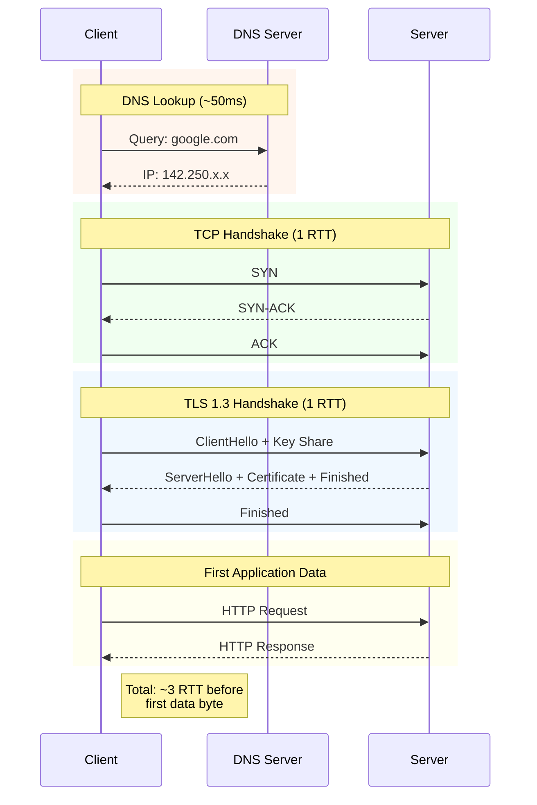
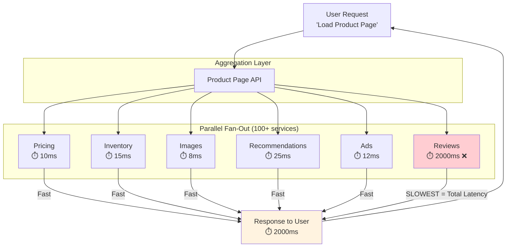

# Latency Physics

This guide covers 5 key areas: I. The Fundamental Constraints: Speed of Light & Fiber Optics, II. Network Latency: Bandwidth vs. Latency vs. Throughput, III. Protocol Overhead: The "Handshake Tax", IV. The Last Mile & The Edge, V. Application Latency: Processing & Fan-Out.

## I. The Fundamental Constraints: Speed of Light & Fiber Optics ⚠️

*Note: This section may need additional review.*

At the Principal level, you are not expected to calculate refractive indices, but you must possess a strong intuition for "impossible physics." You cannot design a system that beats the speed of light.

**The Rule of Thumb:** In a vacuum, light travels at ~300,000 km/s. In fiber optic cables (glass), it travels roughly 30% slower (~200,000 km/s).
*   **Estimation Heuristic:** For back-of-the-envelope calculations, assume **1ms of latency for every 100km of distance** (round trip).

**Real-World Mag7 Behavior:**
*   **Google/Microsoft:** They invest billions in subsea cables not just for bandwidth, but to control the path. By owning the fiber, they can route traffic via the shortest physical path rather than relying on inefficient public BGP routing, shaving off single-digit milliseconds.
*   **High-Frequency Trading (HFT) on Cloud:** Financial clients demand colocation. If your matching engine is in AWS us-east-1 (N. Virginia) and the trader is in London, the ~70ms RTT (Round Trip Time) is a physical constraint that no amount of code optimization can fix.

**Tradeoffs:**
*   **Centralization vs. Geo-Distribution:** Centralizing data simplifies consistency (ACID) but guarantees high latency for distant users. Geo-distribution lowers latency but introduces the complexity of eventual consistency and data replication lag.

**Business Impact:**
*   **Capability:** Determines if a product (e.g., Cloud Gaming like Xbox Cloud or GeForce Now) is physically viable in a specific region.
*   **CX:** Users perceive interactions under 100ms as "instant." Above 300ms, the system feels "sluggish."

## II. Network Latency: Bandwidth vs. Latency vs. Throughput ⚠️

*Note: This section may need additional review.*

A common trap in TPM interviews is conflating bandwidth with latency.
*   **Bandwidth:** The width of the pipe (how much data *can* fit).
*   **Latency:** The speed of the data traveling through the pipe (how fast it arrives).
*   **Analogy:** You can send a terabyte of data via a station wagon filled with hard drives (high bandwidth), but the latency is the time it takes to drive across the country (very high).

**Real-World Mag7 Behavior:**
*   **Netflix:** When a user hits "Play," the *start-up time* is dominated by latency (handshakes, finding the server). Once the video starts, the *quality* (4K vs 1080p) is dominated by bandwidth.
*   **Starlink (SpaceX/Google partnership):** Low Earth Orbit (LEO) satellites aim to reduce latency compared to Geostationary satellites. Geostationary is ~35,000km up (min ~500ms RTT). LEO is ~550km up (~20-40ms RTT).

**Tradeoffs:**
*   **Packet Size Optimization:** Larger packets increase throughput (less header overhead) but can increase latency (head-of-line blocking) and jitter if a packet is lost.
*   **Protocol Choice:** UDP (fire and forget) offers lower latency but no guarantees. TCP guarantees delivery but introduces retransmission latency.

**Business Impact:**
*   **ROI:** Buying "fatter pipes" (more bandwidth) solves buffering issues but does not solve "lag" in interactive applications like Zoom or Google Meet. Misunderstanding this leads to wasted infrastructure spend.

## III. Protocol Overhead: The "Handshake Tax" ⚠️

*Note: This section may need additional review.*

Physics is only half the battle. The software stack introduces significant latency before the first byte of application data is even processed. This is often where a Principal TPM can drive the most engineering value.

**Key Drivers:**
*   **DNS Lookup:** Turning `google.com` into an IP address.
*   **TCP Handshake (SYN/SYN-ACK/ACK):** 1.5 Round Trips (RTT) before connection.
*   **TLS Handshake:** 1 or 2 RTTs to establish encryption keys.

**Real-World Mag7 Behavior:**
*   **Google (QUIC / HTTP3):** Google developed QUIC (which became HTTP/3) to run over UDP. This eliminates the TCP handshake and combines the crypto handshake, effectively allowing "0-RTT" (Zero Round Trip Time) resumption for returning visitors. This drastically speeds up Google Search and YouTube load times.
*   **Amazon (Keep-Alive):** AWS SDKs and internal services aggressively use persistent connections (TCP Keep-Alive) to avoid paying the "handshake tax" on every API call.

**Tradeoffs:**
*   **Security vs. Latency:** High-grade encryption (TLS 1.3) is non-negotiable, but it adds computational latency and network RTTs.
*   **Compatibility vs. Performance:** Adopting HTTP/3 requires client and server support. Fallback mechanisms add complexity.

**Business Impact:**
*   **Revenue:** Amazon famously found that every 100ms of latency cost them 1% in sales. Optimizing the handshake directly impacts conversion rates (GMV).

## IV. The Last Mile & The Edge ⚠️

*Note: This section may need additional review.*

The "Last Mile" refers to the connection between the ISP and the user's device (Wi-Fi, 4G, 5G). This is the most variable and unpredictable segment of latency.

**Real-World Mag7 Behavior:**
*   **Content Delivery Networks (CDNs):**
    *   **Meta/Instagram:** Static images and videos are cached at the Edge (Points of Presence - PoPs) close to the user. An Instagram user in Paris fetches images from a Paris PoP, not a data center in Oregon.
    *   **Netflix Open Connect:** Netflix places storage appliances *inside* ISP networks (e.g., Comcast, Verizon) to physically minimize the distance to the user.
*   **Edge Compute:** Moving logic (Lambda@Edge, Cloudflare Workers) to the edge to execute code closer to the user, avoiding the trip to the origin server entirely.

**Tradeoffs:**
*   **Cache Hit Ratio vs. Freshness:** Aggressive caching lowers latency but risks showing users stale data. Purging caches globally is a hard distributed systems problem.
*   **Cost vs. Performance:** Storing data in 100+ PoPs is significantly more expensive than storing it in one region (S3 Standard vs. CloudFront costs).

**Business Impact:**
*   **CX:** For mobile users on flaky networks, Edge caching is the difference between an app working or timing out.
*   **Skill/Capability:** Moving from a monolithic architecture to an Edge-aware architecture requires a paradigm shift in how engineering teams build and deploy services.

## V. Application Latency: Processing & Fan-Out ⚠️

*Note: This section may need additional review.*

Even if the network is instant, the application takes time to process the request. This is "Server Response Time."

**The Fan-Out Problem:**
In microservices architectures (common at Amazon/Uber), one user request (e.g., "Load Amazon Product Page") triggers calls to 100+ downstream services (Pricing, Inventory, Recommendations, Ads).

*   **The Latency Tail:** The response time is determined by the *slowest* service in the chain. If 99 services take 10ms, but the "Reviews" service takes 2000ms, the user waits 2 seconds.

**Real-World Mag7 Behavior:**
*   **Google (Tail Latency Tolerance):** Google utilizes "hedged requests." If a service replica doesn't respond within the 95th percentile expected time, they send a secondary request to a different replica and take whichever answers first.
*   **Asynchronous Processing:** Writing to a queue (SQS/Kafka) and returning "202 Accepted" immediately, rather than waiting for the process to finish.

**Tradeoffs:**
*   **Resource Utilization vs. Latency:** Hedged requests increase load on the system (doing work twice) to reduce latency for the user.
*   **Consistency vs. Availability:** Returning a "good enough" response (e.g., showing the product page without the "Reviews" section if that service is slow) vs. failing the request.

**Business Impact:**
*   **SLA Management:** As a Principal TPM, you negotiate SLAs (Service Level Agreements). You must define latency at p50 (median), p99, and p99.9.
    *   *Why?* p99.9 usually represents your "whales" (power users with heavily loaded accounts). Ignoring tail latency means ignoring your most valuable customers.

---

## Key Takeaways

- Review each section for actionable insights applicable to your organization

- Consider the trade-offs discussed when making architectural decisions

- Use the operational considerations as a checklist for production readiness
