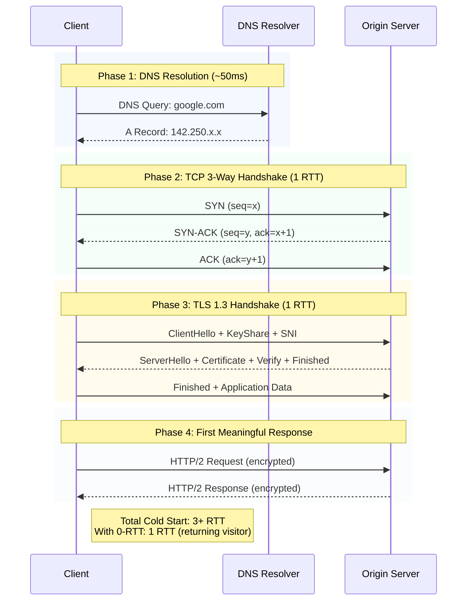
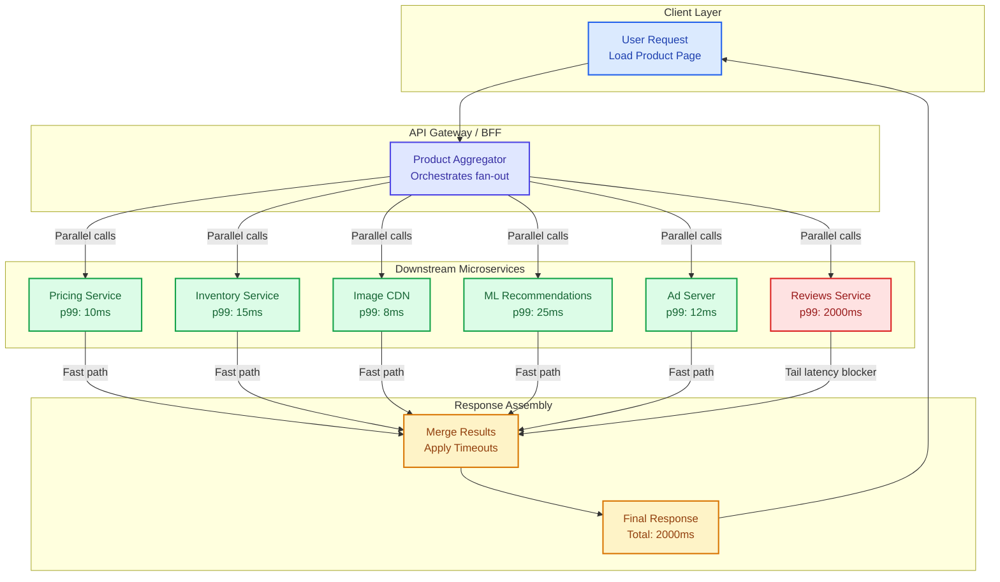

# Latency Physics

This guide covers 5 key areas: I. The Fundamental Constraints: Speed of Light & Fiber Optics, II. Network Latency: Bandwidth vs. Latency vs. Throughput, III. Protocol Overhead: The "Handshake Tax", IV. The Last Mile & The Edge, V. Application Latency: Processing & Fan-Out.

## I. The Fundamental Constraints: Speed of Light & Fiber Optics
At the Principal level, you are not expected to calculate refractive indices, but you must possess a strong intuition for "impossible physics." You cannot design a system that beats the speed of light.

**The Rule of Thumb:** In a vacuum, light travels at ~300,000 km/s. In fiber optic cables (glass), it travels roughly 30% slower (~200,000 km/s).
*   **Estimation Heuristic:** For back-of-the-envelope calculations, assume **1ms of latency for every 100km of distance** (round trip).

**Real-World Mag7 Behavior:**
*   **Google/Microsoft:** They invest billions in subsea cables not just for bandwidth, but to control the path. By owning the fiber, they can route traffic via the shortest physical path rather than relying on inefficient public BGP routing, shaving off single-digit milliseconds.
*   **High-Frequency Trading (HFT) on Cloud:** Financial clients demand colocation. If your matching engine is in AWS us-east-1 (N. Virginia) and the trader is in London, the ~70ms RTT (Round Trip Time) is a physical constraint that no amount of code optimization can fix.

**Tradeoffs:**
*   **Centralization vs. Geo-Distribution:** Centralizing data simplifies consistency (ACID) but guarantees high latency for distant users. Geo-distribution lowers latency but introduces the complexity of eventual consistency and data replication lag.

**Business Impact:**
*   **Capability:** Determines if a product (e.g., Cloud Gaming like Xbox Cloud or GeForce Now) is physically viable in a specific region.
*   **CX:** Users perceive interactions under 100ms as "instant." Above 300ms, the system feels "sluggish."

## II. Network Latency: Bandwidth vs. Latency vs. Throughput
A common trap in TPM interviews is conflating bandwidth with latency.
*   **Bandwidth:** The width of the pipe (how much data *can* fit).
*   **Latency:** The speed of the data traveling through the pipe (how fast it arrives).
*   **Analogy:** You can send a terabyte of data via a station wagon filled with hard drives (high bandwidth), but the latency is the time it takes to drive across the country (very high).

**Real-World Mag7 Behavior:**
*   **Netflix:** When a user hits "Play," the *start-up time* is dominated by latency (handshakes, finding the server). Once the video starts, the *quality* (4K vs 1080p) is dominated by bandwidth.
*   **Starlink (SpaceX/Google partnership):** Low Earth Orbit (LEO) satellites aim to reduce latency compared to Geostationary satellites. Geostationary is ~35,000km up (min ~500ms RTT). LEO is ~550km up (~20-40ms RTT).

**Tradeoffs:**
*   **Packet Size Optimization:** Larger packets increase throughput (less header overhead) but can increase latency (head-of-line blocking) and jitter if a packet is lost.
*   **Protocol Choice:** UDP (fire and forget) offers lower latency but no guarantees. TCP guarantees delivery but introduces retransmission latency.

**Business Impact:**
*   **ROI:** Buying "fatter pipes" (more bandwidth) solves buffering issues but does not solve "lag" in interactive applications like Zoom or Google Meet. Misunderstanding this leads to wasted infrastructure spend.

## III. Protocol Overhead: The "Handshake Tax"
Physics is only half the battle. The software stack introduces significant latency before the first byte of application data is even processed. This is often where a Principal TPM can drive the most engineering value.

**Key Drivers:**
*   **DNS Lookup:** Turning `google.com` into an IP address.
*   **TCP Handshake (SYN/SYN-ACK/ACK):** 1.5 Round Trips (RTT) before connection.
*   **TLS Handshake:** 1 or 2 RTTs to establish encryption keys.

**Real-World Mag7 Behavior:**
*   **Google (QUIC / HTTP3):** Google developed QUIC (which became HTTP/3) to run over UDP. This eliminates the TCP handshake and combines the crypto handshake, effectively allowing "0-RTT" (Zero Round Trip Time) resumption for returning visitors. This drastically speeds up Google Search and YouTube load times.
*   **Amazon (Keep-Alive):** AWS SDKs and internal services aggressively use persistent connections (TCP Keep-Alive) to avoid paying the "handshake tax" on every API call.

**Tradeoffs:**
*   **Security vs. Latency:** High-grade encryption (TLS 1.3) is non-negotiable, but it adds computational latency and network RTTs.
*   **Compatibility vs. Performance:** Adopting HTTP/3 requires client and server support. Fallback mechanisms add complexity.

**Business Impact:**
*   **Revenue:** Amazon famously found that every 100ms of latency cost them 1% in sales. Optimizing the handshake directly impacts conversion rates (GMV).

## IV. The Last Mile & The Edge
The "Last Mile" refers to the connection between the ISP and the user's device (Wi-Fi, 4G, 5G). This is the most variable and unpredictable segment of latency.

**Real-World Mag7 Behavior:**
*   **Content Delivery Networks (CDNs):**
    *   **Meta/Instagram:** Static images and videos are cached at the Edge (Points of Presence - PoPs) close to the user. An Instagram user in Paris fetches images from a Paris PoP, not a data center in Oregon.
    *   **Netflix Open Connect:** Netflix places storage appliances *inside* ISP networks (e.g., Comcast, Verizon) to physically minimize the distance to the user.
*   **Edge Compute:** Moving logic (Lambda@Edge, Cloudflare Workers) to the edge to execute code closer to the user, avoiding the trip to the origin server entirely.

**Tradeoffs:**
*   **Cache Hit Ratio vs. Freshness:** Aggressive caching lowers latency but risks showing users stale data. Purging caches globally is a hard distributed systems problem.
*   **Cost vs. Performance:** Storing data in 100+ PoPs is significantly more expensive than storing it in one region (S3 Standard vs. CloudFront costs).

**Business Impact:**
*   **CX:** For mobile users on flaky networks, Edge caching is the difference between an app working or timing out.
*   **Skill/Capability:** Moving from a monolithic architecture to an Edge-aware architecture requires a paradigm shift in how engineering teams build and deploy services.

## V. Application Latency: Processing & Fan-Out
Even if the network is instant, the application takes time to process the request. This is "Server Response Time."

**The Fan-Out Problem:**
In microservices architectures (common at Amazon/Uber), one user request (e.g., "Load Amazon Product Page") triggers calls to 100+ downstream services (Pricing, Inventory, Recommendations, Ads).

*   **The Latency Tail:** The response time is determined by the *slowest* service in the chain. If 99 services take 10ms, but the "Reviews" service takes 2000ms, the user waits 2 seconds.

**Real-World Mag7 Behavior:**
*   **Google (Tail Latency Tolerance):** Google utilizes "hedged requests." If a service replica doesn't respond within the 95th percentile expected time, they send a secondary request to a different replica and take whichever answers first.
*   **Asynchronous Processing:** Writing to a queue (SQS/Kafka) and returning "202 Accepted" immediately, rather than waiting for the process to finish.

**Tradeoffs:**
*   **Resource Utilization vs. Latency:** Hedged requests increase load on the system (doing work twice) to reduce latency for the user.
*   **Consistency vs. Availability:** Returning a "good enough" response (e.g., showing the product page without the "Reviews" section if that service is slow) vs. failing the request.

**Business Impact:**
*   **SLA Management:** As a Principal TPM, you negotiate SLAs (Service Level Agreements). You must define latency at p50 (median), p99, and p99.9.
    *   *Why?* p99.9 usually represents your "whales" (power users with heavily loaded accounts). Ignoring tail latency means ignoring your most valuable customers.

---

## Interview Questions

### I. The Fundamental Constraints: Speed of Light & Fiber Optics

### Question 1: The Multi-Region Architecture Decision
**Question:** "We're launching a new SaaS product targeting customers in both the US and Europe. The product involves real-time collaboration features. Currently, all our infrastructure is in AWS us-east-1. Product wants to guarantee sub-100ms latency for all users. What are your architectural recommendations?"

**Guidance for a Strong Answer:**
*   **Physics First:** Start with the fundamental constraint—light in fiber travels ~200,000 km/s, roughly 1ms per 100km round trip. US-East to Western Europe is ~6,000km, meaning ~60ms minimum network latency one-way, ~120ms+ RTT.
*   **Conclusion:** You cannot meet sub-100ms for European users from US-East. Multi-region deployment is mandatory, not optional.
*   **Architecture Options:** Discuss Active-Active (both regions serve writes) vs. Active-Passive (one region primary). For real-time collaboration, Active-Active with CRDTs or OT (Operational Transformation) for conflict resolution.
*   **Trade-offs:** Multi-region adds replication complexity, consistency challenges, and ~2x infrastructure cost. Quantify if the European market justifies this investment.

### Question 2: The Cloud Gaming Feasibility Study
**Question:** "An executive wants to launch a cloud gaming service targeting users in Southeast Asia. Our nearest data center is in Singapore. What latency concerns would you raise, and how would you structure a feasibility analysis?"

**Guidance for a Strong Answer:**
*   **Gaming Latency Threshold:** Users perceive latency above 50-100ms as "lag" in action games. Cloud gaming adds encode/decode latency (10-30ms) on top of network latency.
*   **Last Mile Challenge:** Southeast Asia has highly variable last-mile connectivity (mix of fiber, 4G, and older infrastructure). Singapore to Jakarta might be 30ms, but the user's ISP adds 50ms+ jitter.
*   **Feasibility Metrics:** Propose measuring P90 latency from real user endpoints across target countries. If P90 exceeds 80ms total, the product may not be viable without additional PoPs.
*   **Edge Strategy:** Discuss placing encode/decode infrastructure at ISP peering points or partnering with local telcos to reduce last-mile impact.

### II. Network Latency: Bandwidth vs. Latency vs. Throughput

### Question 1: The Video Startup Time Problem
**Question:** "Users are complaining that our video streaming service takes 5+ seconds to start playing. We upgraded our CDN bandwidth by 3x but startup time didn't improve. Engineering says 'we have enough bandwidth.' What's likely wrong, and how do you investigate?"

**Guidance for a Strong Answer:**
*   **Bandwidth vs. Latency Distinction:** Video startup is dominated by latency (handshakes, manifest fetching, segment requests), not bandwidth. Bandwidth only matters once the stream is flowing.
*   **Investigation Path:** Trace the cold-start waterfall: DNS lookup, TCP handshake, TLS negotiation, manifest request, first segment request. Each step is sequential and adds RTTs.
*   **Root Causes:** Likely culprits are TCP slow start, TLS 1.2 (2 RTT) instead of TLS 1.3 (1 RTT), or non-prewarmed CDN connections.
*   **Solutions:** Connection pooling, HTTP/3 (0-RTT resumption), preloading manifests, or adaptive bitrate starting with a tiny initial segment.

### Question 2: The Batch Job vs. API Latency Trade-off
**Question:** "We're designing a data pipeline that needs to move 1TB of data nightly from US to EU. Engineering proposes using a real-time streaming architecture for 'lower latency.' Do you agree with this approach?"

**Guidance for a Strong Answer:**
*   **Challenge the Premise:** For bulk data movement, latency (time to first byte) is irrelevant—throughput (total transfer time) matters. Streaming doesn't help here.
*   **Bandwidth Math:** A dedicated 10Gbps link moves 1TB in ~15 minutes. The question is whether we have enough bandwidth, not whether we're using streaming.
*   **Recommend Batch:** Batch transfer with compression, parallel connections, and possibly AWS Snowball for extremely large transfers. Streaming adds complexity with no benefit for this use case.
*   **When Streaming Matters:** Clarify that streaming is for real-time analytics where you need sub-second latency on individual events, not for bulk transfer.

### III. Protocol Overhead: The "Handshake Tax"

### Question 1: The Mobile App Cold Start
**Question:** "Our mobile app takes 3+ seconds to show content on a cold start, but once running, API calls are fast. Users in emerging markets with high-latency networks (200ms RTT) are churning. How do you diagnose and fix this?"

**Guidance for a Strong Answer:**
*   **Quantify the Handshake Tax:** At 200ms RTT: DNS (1 RTT = 200ms) + TCP (1.5 RTT = 300ms) + TLS 1.2 (2 RTT = 400ms) + HTTP request (1 RTT = 200ms) = ~1.1s for *first* request. Multiple sequential requests compound this.
*   **Diagnosis:** Use network profiling tools (Charles Proxy, Chrome DevTools) to trace the cold-start waterfall.
*   **Optimizations:**
    *   DNS pre-resolution and caching
    *   Upgrade to TLS 1.3 (1 RTT) or HTTP/3 (0-RTT resumption)
    *   Connection pooling with keep-alive
    *   Bundle initial API calls into a single request
*   **Edge Architecture:** Consider moving authentication and initial data to edge functions to reduce origin RTT.

### Question 2: The HTTP/3 Migration Decision
**Question:** "Engineering proposes migrating our entire API infrastructure from HTTP/2 to HTTP/3 (QUIC). They claim it will 'eliminate all latency issues.' What questions would you ask to evaluate this proposal?"

**Guidance for a Strong Answer:**
*   **Validate the Claim:** HTTP/3's main benefits are 0-RTT resumption (for returning connections) and better handling of packet loss. It doesn't eliminate latency—it reduces handshake overhead.
*   **Client Support:** What percentage of our users have clients that support HTTP/3? Mobile apps need SDK updates; older browsers don't support it.
*   **Operational Readiness:** Does our infrastructure team have experience with QUIC/UDP? Firewall rules, load balancer support, debugging tools are less mature than HTTP/2.
*   **Measurement:** What's our current handshake overhead as a percentage of total latency? If application processing is 80% of latency, HTTP/3 won't help much.

### IV. The Last Mile & The Edge

### Question 1: The CDN Cache Strategy
**Question:** "Our e-commerce site shows personalized product recommendations on the homepage. CDN cache hit rate is only 5% because every user sees different content. How do you improve latency without sacrificing personalization?"

**Guidance for a Strong Answer:**
*   **Separate Cacheable from Personalized:** Propose Edge Side Includes (ESI) or client-side assembly. Cache the static page shell (header, footer, layout) at the edge, then fetch personalized fragments via API or lazy-load them.
*   **Recommendation Tiers:** Cache popular recommendations (Top 100 products, trending items) at the edge. Only fetch truly personalized content from origin.
*   **Prefetching:** Use predictive prefetching—while user is on landing page, prefetch likely next pages in background.
*   **Trade-off:** Acknowledge that aggressive caching may show slightly stale inventory counts. Define an acceptable staleness window (e.g., 60 seconds).

### Question 2: The Edge Compute Decision
**Question:** "We're considering moving our authentication logic to Cloudflare Workers (edge compute) to reduce login latency. Currently, auth is handled by a central service in us-east-1. What factors would you evaluate?"

**Guidance for a Strong Answer:**
*   **Latency Benefit:** Auth typically involves 1-2 API calls. Moving to edge saves 1 RTT to origin per call. For users far from us-east-1, this could be 100-200ms savings.
*   **Security Concerns:** Auth is security-critical. Edge compute has a different security posture (shared infrastructure, limited secrets management). How do we securely distribute signing keys?
*   **Consistency:** If auth state changes (password reset, session revocation), how quickly does it propagate to all edge locations? Eventual consistency in auth is risky.
*   **Recommendation:** Consider edge for *stateless* token validation (JWT verification) but keep stateful auth (login, password changes) at origin with strong consistency.

### V. Application Latency: Processing & Fan-Out

### Question 1: The Tail Latency Problem
**Question:** "Our product page API has a p50 latency of 50ms but p99 of 2 seconds. Users are complaining about intermittent slowness. Engineering says 'most users are fine.' How do you frame this problem to drive action?"

**Guidance for a Strong Answer:**
*   **Business Impact Framing:** If we have 1M requests/day, 1% (10,000 requests) experience 2-second latency. At Amazon's finding of 100ms = 1% sales impact, 2-second delays on 10K requests translates to measurable revenue loss.
*   **Identify the Long Tail:** The 40x difference between p50 and p99 indicates a fan-out problem—one slow downstream service is dragging overall latency.
*   **Diagnosis:** Implement distributed tracing (Jaeger, X-Ray) to identify which service is the bottleneck at p99.
*   **Solutions:** Timeouts with fallbacks (show page without slow component), hedged requests (send parallel requests to replicas), or circuit breakers to fail fast on slow services.

### Question 2: The SLA Definition Challenge
**Question:** "We're signing an enterprise SLA and need to define latency guarantees. The customer wants 'sub-100ms response times.' How do you negotiate and structure this SLA?"

**Guidance for a Strong Answer:**
*   **Reject Ambiguity:** "Sub-100ms" is meaningless without specifying: which percentile (p50, p95, p99)? Measured where (client-side, server-side)? For which API endpoints?
*   **Propose Structure:** "API response time measured at our edge, p95 ≤ 100ms, p99 ≤ 500ms, excluding network transit to customer." This protects against last-mile issues outside our control.
*   **Carve-Outs:** Exclude complex queries, batch operations, and initial cold-start requests. Define "normal operations" excluding planned maintenance.
*   **Measurement & Reporting:** Agree on the measurement methodology—synthetic monitoring, real user monitoring (RUM), or both. Specify reporting frequency and dispute resolution.

---

## Key Takeaways

- Review each section for actionable insights applicable to your organization

- Consider the trade-offs discussed when making architectural decisions

- Use the operational considerations as a checklist for production readiness
