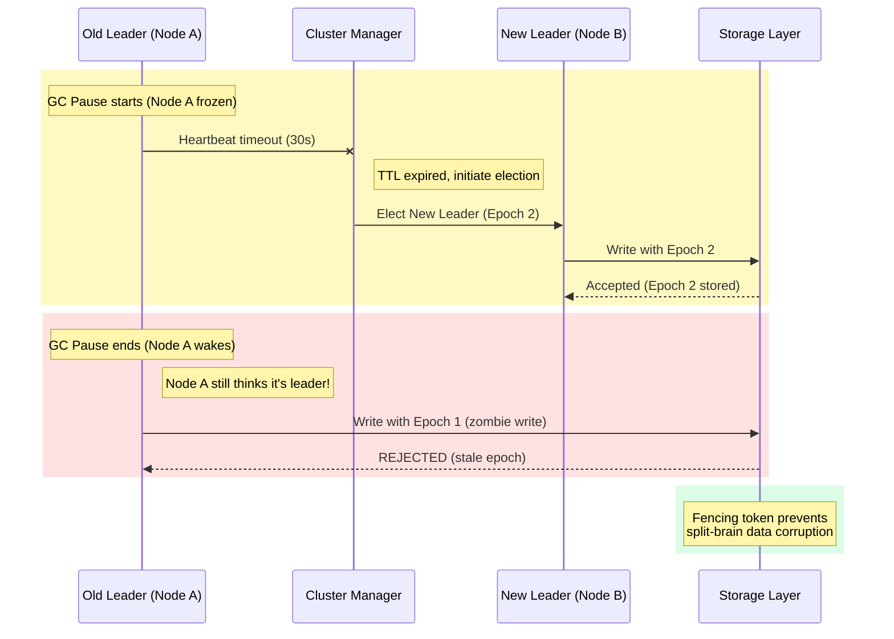
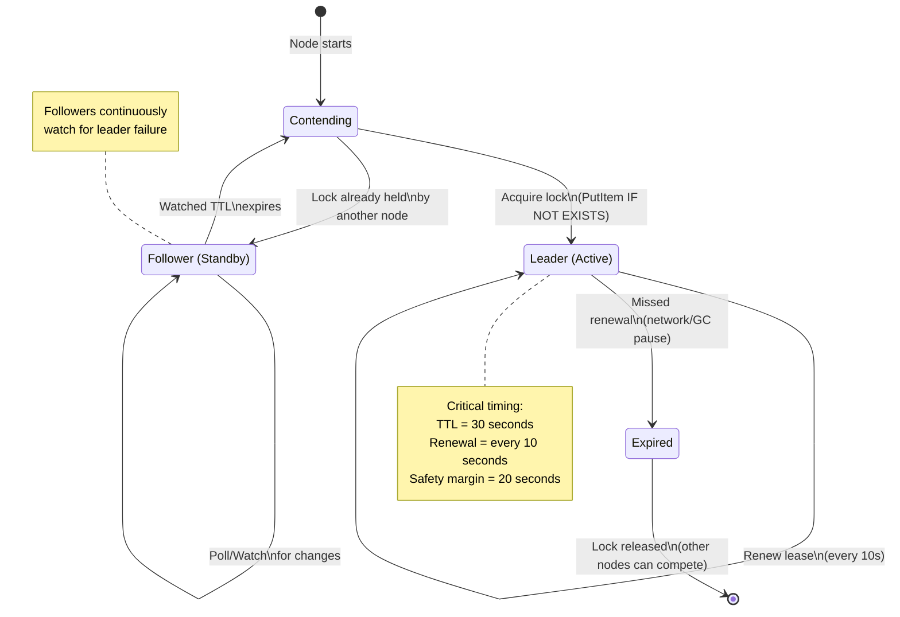
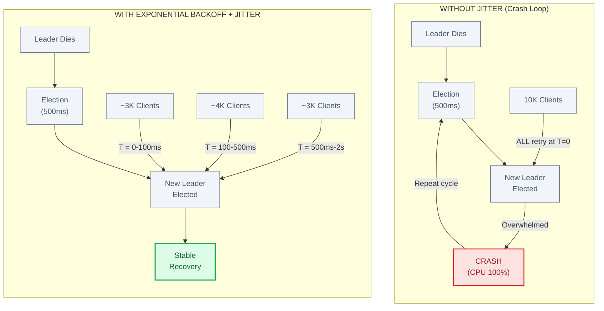
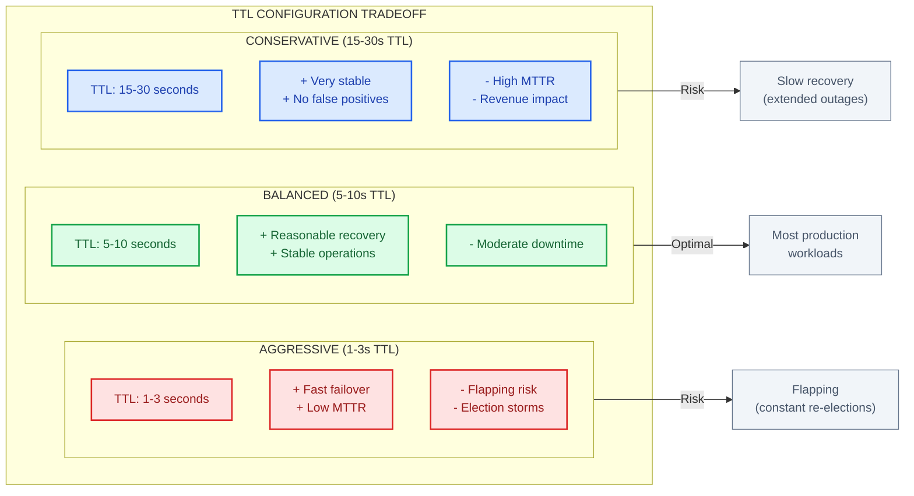

# Leader Election

This guide covers 6 key areas: I. Executive Summary & Business Case, II. Architectural Patterns & Mechanisms, III. Mag7 Real-World Scenarios, IV. Critical Tradeoffs, V. Failure Modes & Business Impact, VI. The Principal TPM Decision Matrix.

## I. Executive Summary & Business Case

At the Principal TPM level within a Mag7 environment, Leader Election is not merely a synchronization mechanism; it is the fundamental architectural decision that dictates the **Consistency model** of your product. It determines whether your system prioritizes data correctness over system uptime (CP over AP in the CAP theorem).

In distributed computing at scale, "truth" is relative. Without a leader, multiple nodes may process conflicting transactions simultaneously. Leader Election designates a single node as the authoritative coordinator for specific partitions or operations, ensuring a **Single Source of Truth**.

### 1. The Strategic Necessity at Mag7 Scale
In monolithic applications, locking is simple (mutexes). In distributed systems spanning multiple availability zones (AZs) or regions, locking requires network consensus.

For a Product Principal TPM, the business case for Leader Election rests on three pillars:

1.  **Strict Serialization of State:** When two users attempt to book the last seat on a flight simultaneously, only one can succeed. A leader node serializes these requests. Without a leader, you risk "double-spend" scenarios.
2.  **Coordination of Background Jobs:** In systems like **Google Drive** or **Dropbox**, you do not want five different servers simultaneously attempting to transcode the same uploaded video. Leader Election ensures exactly-once execution logic for heavy compute tasks, optimizing infrastructure ROI.
3.  **Metadata Management:** Systems like **HDFS (Hadoop)** or **Google Colossus** utilize a NameNode (Leader) to manage file system metadata. If the metadata state diverges, the data becomes unreadable.

### 2. Real-World Behavior & Mag7 Examples
At companies like Amazon or Google, Leader Election is rarely built from scratch by product teams. Instead, it is consumed as a utility via "Lock Services."

*   **Google (Chubby):** Google relies on Chubby (a lock service) to elect masters for BigTable and GFS. If Chubby is unavailable, these massive systems effectively halt. The architectural behavior here is **fail-stop**. The business accepts a total outage rather than risking data corruption.
*   **Amazon (DynamoDB/Leases):** Many internal Amazon services use DynamoDB with conditional writes to maintain a "lease." A worker node writes a timestamp to a table; if it succeeds, it is the leader for X seconds. If it fails to renew, another node takes over.
*   **Kafka (Controller):** In Kafka clusters, one broker is elected as the Controller. This leader manages the states of partitions and replicas. If the Controller pauses (e.g., due to a long Garbage Collection pause), the cluster may experience a "gray failure" where metadata operations stall until a new controller is elected via ZooKeeper/KRaft.

### 3. Critical Tradeoffs: The Principal TPM Framework
Implementing Leader Election introduces a specific set of constraints that must be weighed against product requirements.

| Tradeoff Area | Decision Point | Business Impact |
| :--- | :--- | :--- |
| **Availability vs. Consistency** | **Leader-Based:** If the leader dies, the system is unavailable for writes during the "Election Term" (usually seconds).   **Leaderless:** The system is always available, but you must handle conflict resolution (e.g., Vector Clocks) later. | **Leader-Based:** High data integrity (Banking, Inventory).   **Leaderless:** High uptime, lower accuracy (Social Media Likes, Shopping Cart Items). |
| **Latency** | All write requests must be routed to the leader, potentially across regions. | Increases "Time to First Byte" and write latency. May violate SLAs for edge-based low-latency applications. |
| **Scalability** | The Leader is a bottleneck. It has finite CPU/IO. | Limits the maximum write throughput of a single partition. Requires **Sharding** (partitioning data so each shard has its own leader) to scale, increasing complexity. |
| **Split-Brain Risk** | Network partitions can cause two nodes to believe they are the leader. | Requires **Fencing** mechanisms (e.g., STONITH - Shoot The Other Node In The Head) to prevent data corruption. Increases infrastructure complexity. |

### 4. Impact on ROI and Customer Experience (CX)
The choice to utilize Leader Election directly impacts the bottom line and user trust.

*   **ROI (Infrastructure Efficiency):**
    *   *Positive:* Prevents redundant processing. If a batch job costs $500 to run, ensuring only one node runs it saves money.
    *   *Negative:* The "Leader" node often requires over-provisioned hardware to handle the traffic concentration, while "Follower" nodes sit idle regarding write-processing, reducing fleet utilization efficiency.

*   **CX (User Trust vs. Frustration):**
    *   *Scenario:* A user transfers money.
    *   *With Leader:* The system might spin for 2 seconds (routing to leader). If the leader is failing over, the transaction fails safely. **Result:** User trusts the bank.
    *   *Without Leader:* The transfer appears to succeed instantly but might disappear later due to conflict resolution. **Result:** User churn/Customer Support calls.

### 5. Failure Modes & Edge Cases
A Principal TPM must anticipate failure. The most common issues in Leader Election implementations are:

1.  **The Zombie Leader:** A leader node hangs (e.g., GC pause) but doesn't die. The cluster elects a new leader. The old leader wakes up and tries to write data. *Mitigation:* Epoch numbers (generation clocks) to reject writes from old leaders.
2.  **Thundering Herd:** When a leader dies, all follower nodes simultaneously bombard the election service to become the new leader, potentially crashing the election service. *Mitigation:* Randomized back-off timers.

## II. Architectural Patterns & Mechanisms

### 1. External Consensus Services (The "ZooKeeper/etcd" Pattern)
The most robust approach to Leader Election at Mag7 scale is to offload the consensus problem to a dedicated, battle-tested service like **ZooKeeper**, **etcd**, or **Consul**.

**Mechanism:**
*   A node attempts to create an **ephemeral node** (ZooKeeper) or acquire a **lease** (etcd) at a specific path.
*   If successful, it becomes the leader.
*   The service guarantees strict ordering and availability. If the leader's session expires (due to network partition or crash), the service notifies other nodes immediately to initiate a new election.

**Real-World Mag7 Example:**
*   **Google:** Uses **Chubby** (a lock service) to elect masters for **BigTable** and **GFS**. The architectural principle here is decoupling: the application logic (BigTable) does not need to know *how* to elect a leader, it just asks Chubby "Who is in charge?"
*   **Kubernetes (Standard across Mag7):** Uses **etcd** to store cluster state and handle leader election for the Control Plane.

**Tradeoffs:**
*   **Pros:** Strongest consistency guarantees (CP systems in CAP theorem). Proven correctness (Paxos/Raft are notoriously hard to implement from scratch).
*   **Cons:** High operational complexity. You now have to manage a ZooKeeper/etcd cluster. If that cluster goes down, your entire application stops.
*   **Business Impact:** High ROI on engineering time (don't reinvent the wheel), but introduces a "God-box" risk where a single infrastructure dependency failure causes a global outage.

### 2. Lease/Lock Mechanisms (The "Optimistic" Approach)
In many Mag7 microservices, spinning up a ZooKeeper cluster is overkill. Instead, teams use a shared datastore (DynamoDB, Redis, S3) to implement a "Lease" pattern.

**Mechanism:**
1.  All nodes attempt to write a record to a database (e.g., `LockID: PaymentProcessor, Owner: NodeA, TTL: 30s`).
2.  The database's "Conditional Write" or "Atomic Set" feature ensures only one node succeeds.
3.  The winner becomes the leader but must renew the lease (heartbeat) every $T$ seconds (e.g., every 10s) before the TTL expires.
4.  If the leader dies, the TTL expires, the lock is released, and another node grabs it.

**Real-World Mag7 Example:**
*   **Amazon:** Many Tier-1 services use **DynamoDB with Conditional Writes** for leader election. It offloads the availability problem to DynamoDB (which is managed) rather than an ops-heavy ZooKeeper cluster.
*   **Netflix:** Often uses **Eureka** or simple Redis keys for optimistic locking in non-critical control planes.

**Tradeoffs:**
*   **Pros:** Low operational overhead (serverless implementation). Easy for developers to understand.
*   **Cons:** Vulnerable to **Clock Skew**. If the leader's clock is slow, it might think it holds the lock while the database thinks the TTL expired, leading to two active leaders.
*   **Business Impact:** Faster Time-to-Market (TTM) as it utilizes existing infrastructure. However, it offers weaker consistency guarantees than ZooKeeper.

### 3. The "Zombie Leader" Problem & Fencing Tokens
A Principal TPM must proactively identify the failure mode known as the **Split-Brain** or "Zombie Leader" scenario.

**The Scenario:**
Node A is the leader. It pauses for a long Garbage Collection (GC) cycle. The lease expires. Node B becomes the new leader and starts writing to the database. Node A wakes up from GC, *thinks* it is still the leader, and overwrites Node B’s data. **Result: Data Corruption.**

**The Principal Solution: Fencing Tokens**
You must enforce a monotonically increasing "Epoch ID" (or fencing token).
1.  Every time a leader is elected, the ID increments (Epoch 1 $\rightarrow$ Epoch 2).
2.  The datastore rejects any write request with an Epoch ID lower than the current highest seen.
3.  When Node A (Zombie) wakes up and tries to write with Epoch 1, the datastore (now at Epoch 2) rejects the request.

**Impact on Capabilities:** This moves a system from "High Availability" to "Strict Consistency/Data Safety." It requires the storage layer to support version checks.

### 4. Strategic Decision Matrix: When to use which?

As a Principal TPM, you guide the architecture review. Use this heuristic:

| Requirement | Recommended Pattern | Business Rationale |
| :--- | :--- | :--- |
| **Strict Financial Consistency** (e.g., Billing, Ledger) | **External Consensus (ZooKeeper/etcd)** | The cost of a double-spend or data corruption exceeds the cost of maintaining complex infrastructure. |
| **Background Job Processing** (e.g., Email Digest, Log Rotation) | **Lease/Lock (DynamoDB/Redis)** | If two emails are sent (rarely), it is an annoyance, not a catastrophe. Prioritize low operational overhead. |
| **Low Latency / Edge** | **Node ID / Hash Ring** | Avoid leader election entirely if possible. Use consistent hashing to assign ownership deterministically. |

## III. Mag7 Real-World Scenarios

### 1. The "Zombie Leader" Scenario (Data Corruption Risk)

In Mag7 infrastructure, network partitions are inevitable. A common failure mode occurs when the current leader becomes isolated from the cluster but remains connected to the client (or the database). The cluster elects a new leader, but the old leader (the "Zombie") doesn't know it has been deposed and continues to accept write requests.

*   **Real-World Example:** In early versions of distributed data stores (similar to issues seen in HBase or older MongoDB versions), if a primary node experienced a "Stop-the-World" Garbage Collection (GC) pause, it would fail to send heartbeats. The cluster would elect a new primary. When the old primary finished its GC, it would process the backlog of writes, overwriting valid data committed by the new leader.
*   **The Technical Fix (Fencing):** We implement **Fencing Tokens**. Every time a leader is elected, the epoch (generation ID) increments. The storage layer checks this ID. If the Zombie Leader tries to write with an old ID, the storage layer rejects the request.
*   **Principal TPM Tradeoff:** Implementing fencing requires deep integration between the application layer and the storage layer. It increases engineering complexity and testing overhead.
    *   **Business Impact:** Prevents silent data corruption. In a financial ledger (e.g., Google Pay, Amazon Pay), the ROI of fencing is infinite because the cost of corrupted financial data is existential.

### 2. The "Thundering Herd" upon Re-Election (Availability Impact)

When a leader fails, connected clients are disconnected. Once a new leader is elected, thousands of clients may attempt to reconnect simultaneously.

*   **Real-World Example:** At a company like Netflix or Amazon Prime Video, a service maintaining user session states might lose its leader. If 100,000 clients instantly retry connection to the new leader, they will DDoS the new node, causing it to crash immediately, leading to a crash-loop.
*   **The Technical Fix:** Implementation of **Exponential Backoff with Jitter**. Clients do not retry immediately; they wait a random amount of time, increasing the wait on every failure.
*   **Principal TPM Tradeoff:** This extends the **MTTR (Mean Time To Recovery)** from the user's perspective. The system is technically "up," but clients are artificially delayed from accessing it.
    *   **CX Impact:** A user sees a spinner for 2 seconds instead of an error message. However, without this mechanism, the system might be down for hours due to cascading failures.

### 3. Global Control Planes vs. Local Data Planes (Google Chubby Pattern)

Google’s architecture relies heavily on Chubby (a lock service) for leader election in control planes (like GFS or Bigtable masters).

*   **Behavior:** The "Master" node acquires a lock in Chubby. It holds this lock to prove it is the leader.
*   **The Constraint:** Chubby is a CP system (Consistent and Partition Tolerant, per CAP theorem). If Chubby is unavailable, no leader can be elected.
*   **Strategic Decision:** Google architects systems such that the **Data Plane** (where users read/write data) can function temporarily even if the **Control Plane** (Leader Election) is down.
*   **Principal TPM Takeaway:** You must enforce a strict separation of concerns. If the Leader Election service goes down, you cannot scale up, change configs, or rebalance shards. However, the *existing* nodes should continue serving customer traffic.
    *   **Business Capability:** This preserves revenue generation during internal outages. "We can't deploy new code, but customers can still watch YouTube."

### 4. Leaderless Architectures (The Amazon Dynamo Pattern)

Not all systems require a leader. For high-availability shopping carts, Amazon’s Dynamo (and by extension, DynamoDB in certain configs) utilizes a leaderless, peer-to-peer architecture.

*   **Behavior:** Any node can accept a write. Data is replicated asynchronously.
*   **Tradeoff:** You accept **Eventual Consistency**. You might have "write conflicts" (e.g., a user adds Item A on their phone and Item B on their laptop simultaneously).
*   **Resolution:** The application must handle conflict resolution (e.g., "Last Write Wins" or merging cart items).
*   **Principal TPM Decision Matrix:** If the business requirement is "Never reject a write" (High Availability), you must abandon Leader Election. If the requirement is "Strict Consistency" (Inventory count), you must use Leader Election.
    *   **ROI Impact:** Leaderless systems are harder to debug but offer higher uptime guarantees, directly correlating to sales conversion during peak traffic (e.g., Prime Day).

### 5. Leader Election Latency & TTL Tuning

The "Time to Live" (TTL) on a leader lease dictates how fast a failure is detected.

*   **Scenario:** You set a TTL of 3 seconds. The leader must renew its lease every 1 second.
*   **The Tradeoff:**
    *   **Short TTL (e.g., 3s):** Fast failover (high availability). *Risk:* False positives. A minor network blip causes a leadership change, disrupting the system unnecessarily (Flapping).
    *   **Long TTL (e.g., 60s):** Stable system. *Risk:* If the leader actually dies, the system sits dead for 60 seconds before realizing it needs a new leader.
*   **Principal TPM Guidance:** You must negotiate the **RTO (Recovery Time Objective)** with the business. If the Product VP demands "Zero Downtime," you must explain that physics dictates a minimum detection window, or propose an Active-Active architecture (which doubles cost).

## IV. Critical Tradeoffs

At the Principal level, your role shifts from understanding that a tradeoff exists to quantifying the risk and making the decision based on business capabilities. In Leader Election, every configuration choice moves a lever between **System Stability** and **Failover Speed**.

You cannot maximize both.

### 1. Failover Speed vs. System Stability (The "Flapping" Problem)
The most critical configuration in a leader-based system is the **Time-to-Live (TTL)** or **Heartbeat Interval**. This determines how quickly the system detects a leader failure and elects a new one.

*   **Aggressive Configuration (Short TTL, e.g., < 1 second):**
    *   **The Goal:** Minimize "Write Downtime." If a leader dies, a new one is elected almost instantly.
    *   **The Tradeoff:** High risk of **Flapping**. A minor network blip or a Garbage Collection (GC) pause on the leader node can cause followers to falsely believe the leader is dead. They trigger a new election. The old leader comes back, realizes it was demoted, and chaos ensues.
    *   **Mag7 Reality:** In high-throughput environments like **Google's internal Pub/Sub** or **AWS Kinesis**, aggressive failover can cause "election storms" where the system spends more time electing leaders than processing data.
    *   **Business Impact:** Flapping destroys P99 latency SLAs. While the system is technically "available," the constant re-shuffling of leadership creates jitter that degrades the customer experience (CX).

*   **Conservative Configuration (Long TTL, e.g., > 10 seconds):**
    *   **The Goal:** Stability. We only change leadership if the node is definitively dead.
    *   **The Tradeoff:** High **Mean Time To Recovery (MTTR)**. If the leader actually crashes, the system sits idle for the duration of the TTL before realizing it needs a replacement.
    *   **Business Impact:** For a payment gateway, a 10-second outage is a direct revenue drop. For a background batch processing job (e.g., generating nightly invoices), a 10-second delay is irrelevant.

**Principal Guidance:** If you own a user-facing synchronous service (e.g., login, checkout), you push for shorter TTLs but require robust infrastructure to prevent false positives. If you own an asynchronous backend service, prioritize stability (longer TTLs) to reduce operational noise.

### 2. Strong Consistency vs. Write Availability (The Zombie Leader)
This is the classic Split-Brain scenario. When a network partition occurs, the old leader might still be running but cut off from the consensus group. It doesn't *know* it has been replaced.

*   **The Problem:** If a client sends a write request to the "Zombie Leader," and that leader processes it, you have data corruption. The new leader has likely already accepted conflicting data.
*   **The Mechanism: Fencing Tokens.** To solve this, every time a leader is elected, the "epoch" (generation number) increments. The storage layer checks this number.
*   **Mag7 Example:** In **HBase** (used heavily at Meta/Yahoo heritage architectures), if a RegionServer (leader) pauses due to a long GC, ZooKeeper may expire its session. A new master is elected. If the old RegionServer wakes up and tries to write to HDFS, HDFS rejects the write because the "Fencing Token" is old.
*   **The Tradeoff:**
    *   **Implementing Fencing:** Requires deep integration between the application layer and the storage layer. It increases engineering complexity and development time.
    *   **Ignoring Fencing:** You achieve higher write availability (the zombie node keeps working), but you risk "Split-Brain" data corruption.
*   **ROI/CX Impact:** In financial transactions (e.g., Google Pay), the ROI of Fencing is infinite because the cost of data corruption is catastrophic. In a social media "likes" counter, you might skip strict fencing to keep the UI snappy, accepting that a few "likes" might be lost or double-counted.

### 3. Single Leader vs. Sharded Leadership
Does one node rule the entire system, or do we break the system into shards, each with its own leader?

*   **Single Global Leader:**
    *   **Pros:** Simplicity. Total ordering of all events in the system. Easy to debug.
    *   **Cons:** Vertical scalability limit. The leader becomes the bottleneck for CPU/Memory/Network.
    *   **Example:** Early versions of centralized metadata services often start here.
*   **Sharded Leadership (Multi-Leader):**
    *   **Pros:** Infinite horizontal scale. Node A leads Shard 1; Node B leads Shard 2.
    *   **Cons:** Complexity. You now need a mechanism to map requests to the correct leader (request routing). You lose the ability to perform atomic transactions *across* shards easily.
    *   **Mag7 Example:** **Amazon DynamoDB** and **Google Spanner**. There is no "one leader" for the whole database. Leadership is partitioned by data ranges (tablets/partitions).
    *   **Business Capability:** Sharding is mandatory for Tier-1 Mag7 services. A Principal TPM must recognize when a "Single Leader" architecture is approaching its physical limits and champion the expensive re-architecture to Sharded Leadership *before* the system collapses under load.

### 4. Implementation: Build vs. Buy (Sidecar pattern)
Should your engineering team write the Paxos/Raft implementation inside the application binary, or use a sidecar/external service?

*   **Embedded (In-App Library):**
    *   **Tradeoff:** Reduces network hops (faster), but forces application developers to debug complex consensus logic. If the app crashes, the consensus member crashes.
*   **External Service (Sidecar/Remote):**
    *   **Tradeoff:** Uses established tools (e.g., Microsoft Service Fabric, Kubernetes logic). Adds network latency but decouples application stability from consensus stability.
    *   **Principal Guidance:** At Mag7, **never let application teams write their own consensus algorithm.** The ROI is negative. The risk of subtle bugs appearing 2 years later is 100%. Always mandate the use of the platform's standard consensus service (e.g., Chubby at Google, ZooKeeper/etcd elsewhere).

## V. Failure Modes & Business Impact

At the Principal TPM level, understanding the "Happy Path" of Leader Election is insufficient. You must anticipate failure modes because they define your system's **Mean Time To Recovery (MTTR)** and **Recovery Point Objective (RPO)**. In a Mag7 infrastructure, a failure in the election mechanism often cascades into a control plane outage, affecting not just one service but potentially an entire region’s ability to scale or heal.

### 1. Split-Brain (Network Partition) scenarios
The most catastrophic failure mode in leader-based systems is "Split-Brain," where a network partition causes two different nodes to believe they are the leader simultaneously.

*   **The Scenario:** In a multi-region setup (e.g., US-East and US-West), the network link between regions is severed. The US-West cluster assumes the US-East leader is dead and elects a new one. Both leaders now accept writes.
*   **Mag7 Real-World Example:** This is a classic failure mode in early versions of Elasticsearch or custom implementations of primary-secondary SQL replication without strict quorum enforcement.
*   **Mitigation Strategy:**
    *   **Quorums:** Require a majority ($N/2 + 1$) to elect a leader. If a partition isolates a minority of nodes, they cannot elect a leader and must pause operations.
    *   **Fencing Tokens:** If a "Zombie Leader" (the old leader) tries to write to the database, the storage layer checks a monotonically increasing token (epoch). If the token is older than the current leader's token, the write is rejected.
*   **Tradeoff:** **Availability vs. Consistency.** By enforcing Quorums/Fencing, you choose to make the minority partition unavailable (it cannot accept writes) to preserve data consistency.
*   **Business Impact:**
    *   *Without Fencing:* Data corruption requiring manual reconciliation (days of engineering toil).
    *   *With Fencing:* Partial service outage in the partitioned region, but zero data loss.

### 2. The "Thundering Herd" & Election Storms
When a leader fails, the remaining nodes must detect the failure and trigger an election. In a massive fleet, this can lead to a Denial of Service (DoS) attack on your own control plane.

*   **The Scenario:** You have 5,000 worker nodes monitoring a leader via ZooKeeper. The leader crashes. All 5,000 nodes simultaneously receive a "node deleted" event and instantly send a request to ZooKeeper to nominate themselves as the new leader.
*   **Mag7 Real-World Example:** At Amazon or Netflix, improperly configured client retries during a control plane failover can saturate the network bandwidth or CPU of the consensus service (etcd/ZooKeeper), causing the election to fail repeatedly. This extends a 5-second outage into a 30-minute outage.
*   **Mitigation Strategy:**
    *   **Randomized Backoff:** Nodes wait a random amount of time (jitter) before attempting to become leader.
    *   **Sidecar Proxy:** Only a small subset of "candidate" nodes participate in the election; the rest simply listen for the result.
*   **Tradeoff:** **Election Speed vs. Stability.** Adding backoff delays the election slightly (increasing MTTR by milliseconds or seconds) but prevents the consensus system from crashing (which would increase MTTR by minutes).
*   **Business Impact:**
    *   **ROI:** Prevents the need to over-provision the consensus cluster just to handle rare peak election traffic.
    *   **CX:** Prevents "flapping" where the system comes up and goes down repeatedly, which frustrates users more than a hard down.

### 3. Process Pauses & "Zombie" Leaders
A node may cease to function as a leader not because it crashed, but because the process paused (e.g., a long Java Garbage Collection (GC) cycle or VM stall).

*   **The Scenario:** The leader enters a "Stop-the-World" GC pause for 10 seconds. The lease expires (TTL 5 seconds). The cluster elects a new leader. The old leader wakes up, unaware time has passed, and processes a queued request.
*   **Mag7 Real-World Example:** This is a specific concern in Java-heavy environments (common in Kafka or Hadoop ecosystems).
*   **Mitigation Strategy:**
    *   **KeepAlive/Heartbeat tuning:** The lease duration must be significantly longer than the worst-case GC pause, or the application must check lease validity *after* the pause but *before* the write.
    *   **Physical Time vs. Logical Time:** Using monotonic clocks (logical ordering) rather than wall-clock time to validate lease ownership.
*   **Tradeoff:** **Latency vs. Safety.** Setting a long lease time (e.g., 30 seconds) prevents false failovers due to GC, but it means if the leader *actually* crashes, the system sits idle for 30 seconds before electing a new one.
*   **Business Impact:**
    *   **CX:** Short leases maximize availability but risk data corruption (Zombie writes). Long leases ensure safety but cause noticeable "hangs" for users during failovers. As a Principal TPM, you must align this setting with the product's SLA.

### 4. Clock Skew
Distributed systems rely on time, but server clocks drift. If the leader’s clock is faster or slower than the consensus service’s clock, lease expiration logic breaks.

*   **Mag7 Real-World Example:** Google Spanner solves this with **TrueTime** (using atomic clocks and GPS), creating a bound on clock uncertainty. Most other companies do not have this hardware luxury and must rely on software consensus (NTP), which is prone to drift.
*   **Mitigation:** Avoid relying on wall-clock time for ordering. Use **Logical Clocks** (Lamport timestamps or Raft Terms) to order events.
*   **Business Impact:** High risk of data anomalies in financial transactions if relying on wall clocks without specialized infrastructure.

## VI. The Principal TPM Decision Matrix

At the Principal level, your role shifts from tracking execution to influencing architectural strategy. You are the "Business-Technical Bridge." When Engineering proposes a complex Leader Election implementation using etcd or ZooKeeper, you must evaluate that choice against business realities. You are not checking their math on the Paxos implementation; you are validating that the *cost* of that complexity yields a necessary *return* for the product.

The Decision Matrix is the mental framework you use to approve, reject, or modify technical proposals based on four distinct quadrants: **Consistency Requirements**, **Operational Overhead**, **Latency Tolerance**, and **Failure Blast Radius**.

### 1. Consistency vs. Availability (The CAP Theorem in Practice)
The first filter in the matrix is determining if the product actually requires the "Strong Consistency" that Leader Election provides, or if the team is over-engineering.

*   **Mag7 Reality:**
    *   **Amazon (Retail Page):** Prioritizes **Availability**. If the Leader Election service goes down, Amazon cannot afford to stop showing product pages. They accept "Eventual Consistency" (you might see an item in stock that is actually sold out, which is reconciled at checkout).
    *   **Google (AdWords Billing):** Prioritizes **Consistency**. You cannot charge a customer twice. If the leader is down, the system *must* block writes until a new leader is elected.
*   **The Tradeoff:**
    *   **Strict Leader Election:** Guarantees data integrity but introduces a Single Point of Failure (SPoF) for write operations. If election takes 10 seconds, you have 10 seconds of downtime.
    *   **Leaderless/Eventual:** Guarantees uptime but introduces data reconciliation complexity (conflict resolution, vector clocks).
*   **Principal TPM Action:** Challenge the requirement. Ask, "What is the financial impact of a double-write vs. the financial impact of 5 seconds of downtime?" If the answer is "double-writes are annoying but fixable," reject the complex Leader Election architecture in favor of a simpler, leaderless approach.

### 2. Operational Complexity vs. Team Capability (The "Who Wakes Up" Test)
Implementing robust consensus (Paxos/Raft) is notoriously difficult. Even using managed services like Amazon DynamoDB Lock Client or Google Chubby incurs operational debt.

*   **Mag7 Reality:**
    *   **Netflix:** Operates with a "paved road" philosophy. If a team wants to use a custom Leader Election mechanism rather than the platform-standard (e.g., Netflix’s internal abstractions over ZooKeeper/Eureka), they must justify the operational burden.
    *   **Microsoft (Azure):** Service Fabric handles leader election internally so product teams don't have to implement it.
*   **The Tradeoff:**
    *   **Custom Implementation:** Highly optimized for specific use cases but requires specialized SRE skills to debug split-brain scenarios.
    *   **Standard/Managed:** Higher latency or cost, but offloads the "pager fatigue" to a platform team.
*   **Business Impact:** If a team builds a custom election mechanism, they are effectively shifting 20% of their future roadmap to maintenance.
*   **Principal TPM Action:** Enforce "Boring Technology." Unless the product has unique latency requirements (sub-millisecond), mandate the use of existing infrastructure (e.g., using a Redis lock or a database row lock) over spinning up a new ZooKeeper cluster.

### 3. Latency vs. Durability (The Performance Tax)
Leader Election requires network round-trips to achieve quorum. This adds latency to every write operation that requires coordination.

*   **Mag7 Reality:**
    *   **Meta (Messenger):** For message ordering, latency is critical. However, for a "User is Typing" indicator, no leader is needed; the signal is ephemeral.
    *   **AWS (EBS Volumes):** Block storage coordination requires strict durability; latency is sacrificed to ensure data isn't corrupted by two hosts writing to the same block.
*   **The Tradeoff:**
    *   **Synchronous Coordination:** Safe but slow. The user waits for the leader to confirm with followers.
    *   **Asynchronous/Optimistic:** Fast but risky. The user gets a "Success" message, but if the leader crashes immediately, data is lost.
*   **Principal TPM Action:** Define the SLA. If the Product Requirement Document (PRD) demands <50ms response time globally, a strict global leader architecture is physically impossible due to speed-of-light constraints. You must force a decision: relax the latency constraint or shard the leaders geographically (see Section 4).

### 4. Blast Radius & Partitioning (The "Kill Switch" Analysis)
A global leader is a global bottleneck. The Decision Matrix requires you to evaluate how failure propagates.

*   **Mag7 Reality:**
    *   **Apple (iMessage):** Does not have one leader for the world. Leaders are sharded by user ID or region. If a leader node fails, only a tiny percentage of users are affected.
    *   **Google (Spanner):** Uses TrueTime to allow distributed consistency without a single bottleneck, but this requires expensive atomic clock hardware.
*   **The Tradeoff:**
    *   **Global Leader:** Simple to reason about, easy to implement. **Risk:** Total outage.
    *   **Sharded Leaders:** Complex routing logic, difficult to rebalance. **Risk:** Partial outage (better for CX).
*   **ROI/CX Impact:** A 100% outage for 10 minutes often makes the news (reputational damage). A 1% outage for 1 hour is often handled by support tickets.
*   **Principal TPM Action:** Push for **Cell-Based Architecture**. Ensure that the election scope is as small as possible. A leader should govern a "shard" or "partition," not the whole system.

---

## Interview Questions

### I. Executive Summary & Business Case

**Question 1: Designing for Write-Heavy Constraints**
"We are building a global inventory system for a flash-sale event (high concurrency). The business requires 100% accuracy on inventory counts to prevent overselling, but also demands extremely low latency for users worldwide. How do you architect the Leader Election strategy, and what tradeoffs do you present to the VP of Engineering?"

*   **Guidance for a Strong Answer:**
    *   Acknowledge the conflict: You cannot have global strong consistency *and* low latency (CAP Theorem/PACELC).
    *   Propose **Sharding**: Partition inventory by region or SKU. Each shard has a local leader.
    *   Discuss **Optimistic Locking**: Use a leader for the final commit, but allow tentative holds at the edge.
    *   Address **Fencing**: Explicitly mention how to handle a leader that becomes partitioned to ensure no double-selling occurs.

**Question 2: The "Gray Failure" Scenario**
"Our metrics dashboard shows that our background reporting service is processing data twice on random days, doubling the reported revenue metrics. The engineering team uses a standard Leader Election library. As a Principal TPM, how do you debug the architectural flaw causing this, and what is the fix?"

*   **Guidance for a Strong Answer:**
    *   Identify the root cause: Likely a **Zombie Leader** or lack of **Fencing**. The old leader lost its lease but didn't stop working before the new leader started.
    *   Propose the fix: Implement **Fencing Tokens** (a strictly increasing number passed with every write request). The storage layer rejects any write with a token older than the current one.
    *   Business Pivot: Explain how you would institute an "Idempotency" requirement for the reporting logic as a fail-safe, ensuring that even if the election fails, processing the same data twice yields the same result.

### II. Architectural Patterns & Mechanisms

### Question 1: The "Split-Brain" Scenario
**Question:** "We are designing a distributed payment processing system. We used a Redis lock for leader election. During a network partition, the old leader didn't realize it lost connection and kept processing transactions while a new leader was elected. We ended up double-charging customers. As the Principal TPM, how do you fix this architecturally without changing the database?"

**Guidance for a Strong Answer:**
*   **Identify the root cause:** This is a lack of "Fencing." The system relied on the leader's local state rather than verifying authority at the point of commit.
*   **Propose Fencing Tokens:** Explain that every write to the payment ledger must include the "Leader Epoch ID."
*   **Constraint Handling:** Since the prompt says "without changing the database" (implying we can't swap Redis for Zookeeper easily), the candidate should suggest optimistic locking on the transaction table itself (e.g., `UPDATE accounts SET balance = X WHERE id = Y AND last_modified_by_epoch < current_epoch`).
*   **Tradeoff:** Acknowledge that this adds a check to every write, slightly increasing latency, but is non-negotiable for payments.

### Question 2: Bottleneck Mitigation
**Question:** "Our leader-based architecture is hitting a vertical scaling limit. The leader node is at 100% CPU handling write coordination, while the follower nodes are idle. How do we evolve this architecture to support 10x growth?"

**Guidance for a Strong Answer:**
*   **Challenge the premise:** Why is the leader doing *all* the work? The leader should only coordinate, not process heavy payloads.
*   **Solution 1: Sharding/Partitioning:** Instead of one Global Leader, implement "Leadership per Shard." (e.g., Leader A manages Users A-M, Leader B manages Users N-Z). This scales linearly.
*   **Solution 2: Offloading:** The leader sequences the writes (assigns an ID) but followers execute the actual I/O or computation.
*   **Mag7 Context:** Reference how Kafka partitions leadership (each partition has a leader) or how DynamoDB partitions keyspaces. A single leader for a massive system is an anti-pattern.

### III. Mag7 Real-World Scenarios

### Question 1: The Split-Brain Ledger
**"We are designing a new global payment processing service. We have two data centers, one in Virginia and one in Oregon. To ensure high availability, the engineering lead proposes an Active-Active setup where both regions can accept writes (process payments) independently, syncing data later. As the Principal TPM, do you approve this? If not, why, and what is the architectural alternative?"**

*   **Guidance for a Strong Answer:**
    *   **Immediate Rejection:** A strong candidate will immediately reject Active-Active for *payments* due to the risk of "Double Spend" or "Split Brain." If the network between Virginia and Oregon is cut, both sides might process a withdrawal for the same $100 balance.
    *   **Concept Identification:** Must identify this as a CAP theorem problem. You cannot have Partition Tolerance and Availability without sacrificing Consistency. For payments, Consistency is non-negotiable.
    *   **Proposed Solution:** Propose a **Leader-Follower** model (Active-Passive). Writes only go to the Leader (e.g., Virginia). If Virginia fails, Oregon is elected Leader.
    *   **Nuance:** Acknowledge the tradeoff. This means if Virginia goes down, there is a downtime window (RTO) while Oregon is elected. The business must accept this downtime to guarantee data integrity.

### Question 2: The Flapping Leader
**"You are the TPM for a critical background job scheduler. You notice that every day at 2:00 PM, the system pauses for 3 minutes. Logs show the Leader is being de-elected and re-elected repeatedly (flapping) during this window. The engineering team wants to just increase the timeout settings to fix it. How do you approach this?"**

*   **Guidance for a Strong Answer:**
    *   **Root Cause Analysis:** Do not just accept the fix. Ask *why* it happens at 2:00 PM. Is there a traffic spike? A scheduled backup saturating the network? Garbage Collection spikes?
    *   **Risk of "Masking":** Explain that increasing the timeout (TTL) might stop the flapping, but it effectively masks the underlying performance issue. It also increases the RTO if a real failure occurs at another time.
    *   **Systemic Fix:** The correct approach is to investigate resource contention on the leader node. Perhaps the leader is doing too much work (processing data *and* coordinating).
    *   **Architecture Proposal:** Suggest offloading the heavy lifting. The Leader should only *assign* work, not *do* the work. Or, implement a separate control plane for election vs. data processing.

### IV. Critical Tradeoffs

**Question 1: The "Flapping" Scenario**
"We have a critical background job scheduler that uses Leader Election. Recently, we’ve seen incidents where the leader changes every few seconds, causing jobs to restart and fail. The engineering team wants to increase the heartbeat timeout from 3 seconds to 30 seconds to 'fix' it. As the Principal TPM, how do you evaluate this proposal, and what risks does it introduce?"

*   **Guidance for a Strong Answer:**
    *   **Identify the Root Cause:** Acknowledge that increasing timeout masks the symptom (instability) but doesn't fix the root cause (likely GC pauses, network congestion, or resource exhaustion).
    *   **Analyze Tradeoff:** Explain that 30 seconds means a 30-second total outage if the leader *actually* fails. Ask if the business SLA allows for a 30-second delay in job scheduling.
    *   **Propose Alternatives:** Suggest investigating *why* the node is failing heartbeats. Is the process CPU starved? Can we move the heartbeat thread to a higher priority? Can we implement a "pre-vote" check to ensure stability before switching?
    *   **Business Context:** If the jobs are not time-sensitive (e.g., daily cleanup), the 30-second delay is acceptable to gain stability. If they are real-time (e.g., order processing), 30 seconds is unacceptable.

**Question 2: Global vs. Regional Leadership**
"We are designing a new global inventory system for a release like the new iPhone. Marketing wants a single global counter to prevent overselling. Engineering says a single global leader will have too much latency for users in Asia and Europe accessing a US-based leader. How do you resolve this conflict?"

*   **Guidance for a Strong Answer:**
    *   **CAP Theorem Application:** Recognize this as a Consistency vs. Latency trade-off.
    *   **Solutioning:** Reject the binary choice. Propose **Sharding** (inventory allocated to regions: US gets 1M units, EU gets 500k units). Each region has a local leader (low latency).
    *   **Handling the Edge Case:** Discuss what happens when a region runs out. Can the EU leader request stock from the US leader? This introduces complexity but solves the business requirement (no overselling) and the technical constraint (latency).
    *   **Stakeholder Management:** Explain how you would align Marketing on the definition of "Global" (is it okay if the global count is eventually consistent, as long as the local "Buy" button is accurate?).

### V. Failure Modes & Business Impact

### Question 1: Diagnosis & Mitigation
**"We have a service where the leader is changing every 15 minutes, causing brief 2-second latency spikes for our enterprise customers. The logs show the previous leader is healthy but 'lost the lease.' How would you debug this, and what trade-offs would you consider to fix it?"**

*   **Guidance for a Strong Answer:**
    *   **Identification:** The candidate should identify this as "Flapping."
    *   **Root Cause Analysis:** Suspect "False Positives" in failure detection. Is the heartbeat interval too aggressive? Is there network congestion? Is a Garbage Collection (GC) pause exceeding the lease timeout?
    *   **Mitigation:** Propose increasing the Lease TTL (Time To Live).
    *   **Tradeoff Analysis:** Crucially, the candidate must explain that increasing TTL reduces flapping (improving stability) but increases the downtime window if a *real* crash occurs (worsening MTTR). They should propose metrics to balance these two risks based on SLA requirements.

### Question 2: Architecture & Consistency
**"We are building a payment processing system for a flash-sale event. We need to ensure no item is oversold. Would you use a Leader-based architecture or a Leaderless (Peer-to-Peer) architecture? Justify your choice regarding CAP theorem trade-offs."**

*   **Guidance for a Strong Answer:**
    *   **Choice:** Strong preference for **Leader-based (CP - Consistency/Partition Tolerance)**.
    *   **Justification:** In payments/inventory, Consistency is paramount. You cannot tolerate "eventual consistency" where two people buy the last item. A Leader acts as the single point of serialization for inventory decrements.
    *   **Tradeoff:** Acknowledge that this creates a write bottleneck and a single point of failure (temporarily).
    *   **Contrast:** Explain why Leaderless (AP - e.g., Dynamo-style) is bad here: it allows concurrent writes that must be reconciled later, leading to awkward "We're sorry, we oversold" emails to customers, which damages Brand Trust (CX).

### VI. The Principal TPM Decision Matrix

### Question 1: The "Split-Brain" Crisis
**Scenario:** "You are the Principal TPM for a financial transaction service at a Mag7 company. During a network partition, your primary Leader Election mechanism failed, resulting in a 'Split-Brain' scenario where two data centers both thought they were the leader and processed conflicting transactions for 5 minutes. The engineering team wants to solve this by increasing the timeout thresholds to prevent false positives. Do you approve this?"

**Guidance for a Strong Answer:**
*   **Identify the Trap:** Increasing timeouts is a band-aid that degrades availability (takes longer to failover) and doesn't solve the root cause of Split-Brain (fencing).
*   **Technical Mechanism:** The candidate should discuss **Fencing Tokens** or **Lease Versions**. When a leader is elected, it gets a token (e.g., #5). If the old leader (token #4) tries to write, the storage layer rejects it.
*   **Business Decision:** Reject the timeout increase. It hurts CX (longer outages). Instead, prioritize the implementation of a Fencing mechanism or a "Stonith" (Shoot The Other Node In The Head) protocol to ensure data integrity, which is non-negotiable in financial services.

### Question 2: Build vs. Buy for Consensus
**Scenario:** "Your team is building a new high-throughput metadata service. The Tech Lead proposes writing a custom, lightweight leader election algorithm using UDP because 'ZooKeeper is too heavy and slow' for our needs. How do you evaluate this decision?"

**Guidance for a Strong Answer:**
*   **Risk Assessment:** Writing a consensus algorithm (like Paxos/Raft) correctly is extremely difficult. The risk of hidden bugs (edge cases in network partitions) is near 100%.
*   **ROI Analysis:** Calculate the "Cost of Ownership." Saving 5ms of latency is likely not worth the months of debugging and the risk of data corruption.
*   **Strategic Pivot:** Challenge the constraints. Why is ZooKeeper too slow? Can we batch requests? Can we use a managed service like etcd?
*   **The "Principal" Stance:** "I would likely block this proposal unless the Tech Lead can prove that standard solutions cause a direct violation of the business SLA, and even then, I would advocate for contributing to an open-source solution rather than building a proprietary one."

---

## Key Takeaways

- Review each section for actionable insights applicable to your organization

- Consider the trade-offs discussed when making architectural decisions

- Use the operational considerations as a checklist for production readiness
