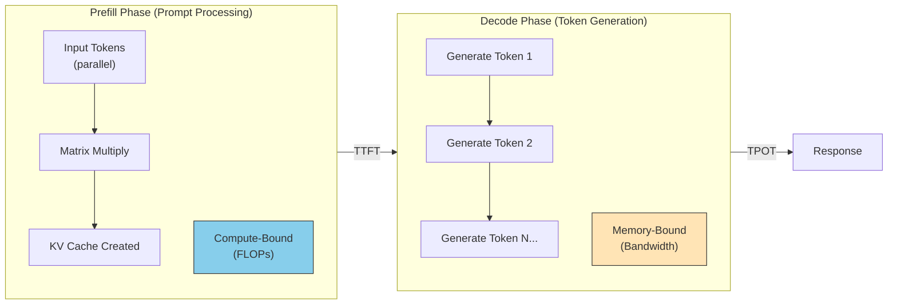
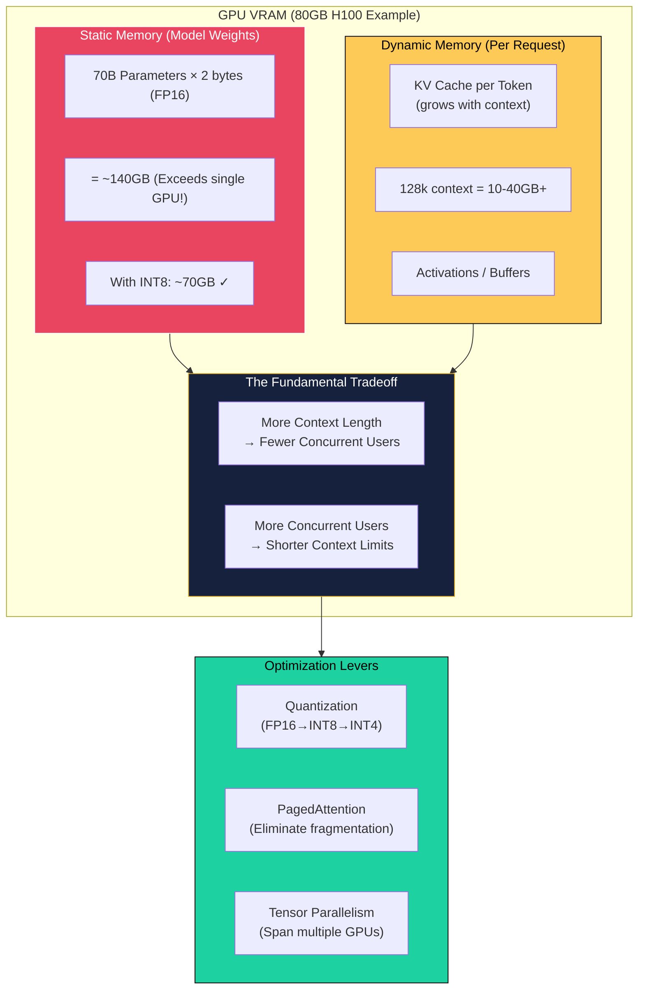
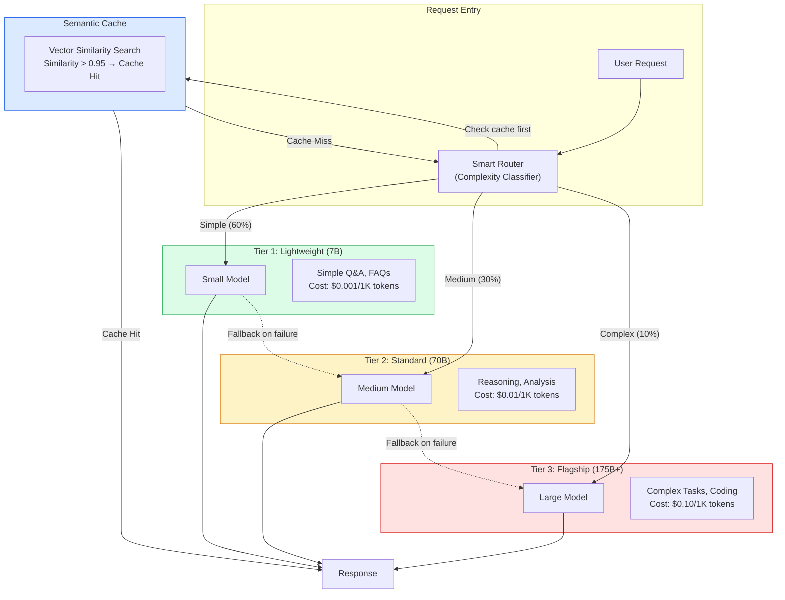

# LLM Serving Considerations

This guide covers 5 key areas: I. The Core Metrics: Defining "Performance" in LLM Serving, II. Memory Management & Architecture: The VRAM Bottleneck, III. Model Optimization Techniques, IV. Hardware Strategy: GPUs, TPUs, and Inferentia, V. Operational Reliability & Guardrails.

## I. The Core Metrics: Defining "Performance" in LLM Serving

### 1. The Anatomy of Latency: Prefill vs. Decode
To manage performance effectively, you must distinguish between the two distinct phases of LLM generation, as they have different hardware bottlenecks and scaling properties.

*   **The Prefill Phase (Prompt Processing):** The model processes the user's input tokens in parallel.
    *   **Hardware Behavior:** This is **compute-bound**. The GPU is crunching matrix multiplications as fast as the Tensor Cores allow.
    *   **Mag7 Example:** In a Retrieval Augmented Generation (RAG) system like an internal enterprise search at Microsoft or Google, the "prompt" might include 10 retrieved documents (10k+ tokens). The user perceives latency here as the system "thinking."
    *   **Optimization:** Optimizing prefill requires high FLOPs (Floating Point Operations per Second). You might choose NVIDIA H100s over A100s specifically for their Transformer Engine capabilities if your product relies heavily on massive context windows.

*   **The Decode Phase (Token Generation):** The model generates the response one token at a time.
    *   **Hardware Behavior:** This is **memory-bandwidth bound**. The GPU spends most of its time moving model weights from HBM (High Bandwidth Memory) to the compute units for every single token generated.
    *   **Mag7 Example:** In a coding assistant like GitHub Copilot, once the suggestion starts appearing, it must flow smoothly. If the memory bandwidth is saturated, the text "stutters."
    *   **Optimization:** Optimizing decode requires high memory bandwidth. Quantization (reducing precision from FP16 to INT8 or FP8) is highly effective here because it reduces the amount of data moved per token, directly improving TPOT.

**Tradeoff Analysis:**
*   **Prompt Caching vs. Fresh Context:** You can cache the KV (Key-Value) states of common system prompts (e.g., "You are a helpful assistant...").
    *   *Pros:* Drastically reduces TTFT for the prefill phase.
    *   *Cons:* Consumes VRAM that could be used for batch size.
    *   *Impact:* For a chatbot with a fixed 2k token system prompt, caching improves TTFT by ~40% and reduces compute costs, but requires sophisticated cache eviction policies (LRU) at the load balancer level.

### 2. Throughput Optimization: Continuous Batching
At a Mag7 scale, static batching (waiting for 32 requests to arrive before processing) is obsolete for user-facing apps because it destroys TTFT. The standard is **Continuous (or Cellular) Batching** (e.g., vLLM, TGI).

*   **Mechanism:** The serving engine processes the prefill of a new request *while* it is simultaneously decoding tokens for existing requests. As soon as Request A finishes, Request C is slotted in immediately, without waiting for Request B to finish.
*   **Mag7 Real-World Behavior:**
    *   **Meta (Llama serving):** For products like Meta AI on WhatsApp, traffic is spiky. Continuous batching allows the infrastructure to run at higher average utilization (often targeting 80-90% GPU compute utilization) without causing massive latency spikes for the "unlucky" user who arrived last in a batch.
*   **Business Impact:**
    *   **ROI:** Continuous batching can increase throughput by 20x compared to naive batching. This directly translates to needing 1/20th of the GPU fleet for the same traffic volume.
    *   **CX:** It decouples the latency of short queries from long queries. A user asking "What is the weather?" is not blocked by a user asking "Write a novel."

### 3. The Memory Bottleneck: KV Cache Management
The biggest constraint in serving modern LLMs (especially Llama 3 70B or GPT-4 class models) is not compute speed; it is VRAM capacity. Every token generated requires storing its "Key" and "Value" tensors in GPU memory to generate the *next* token.

*   **The Math:** A 128k context window request can easily consume more VRAM for the KV cache than the model weights themselves.
*   **PagedAttention:** Similar to virtual memory in operating systems, this technique (popularized by vLLM) allows the KV cache to be non-contiguous in memory.
*   **Tradeoff: Context Length vs. Concurrency:**
    *   If you guarantee support for 128k context length for every user, you might only fit 2 concurrent users on an A100 80GB GPU.
    *   If you cap context at 8k, you might fit 64 users.
    *   **Decision:** As a Principal TPM, you must enforce strict context limits based on product tiers. Free users might get 8k (high concurrency, low cost), while Enterprise users get 128k (low concurrency, high premium).

### 4. Speculative Decoding
To solve the memory-bandwidth bottleneck of the Decode phase, Mag7 companies often employ Speculative Decoding.

*   **Mechanism:** A small, cheap "draft" model (e.g., a 7B parameter model) rapidly guesses the next 5 tokens. The massive "target" model (e.g., 70B+) verifies them in a single parallel pass.
*   **Mag7 Example:** Google uses variations of this for Gemini. If the draft model is accurate, the system outputs 5 tokens for the compute cost of 1 pass of the large model.
*   **Tradeoff:**
    *   *Pros:* Can increase TPOT (speed) by 2-3x without degrading model quality (mathematically identical output).
    *   *Cons:* Increases system complexity and VRAM usage (must load two models). If the draft model is inaccurate (low acceptance rate), latency actually *increases* due to the overhead of verification and backtracking.

### 5. Defining SLAs and Failure Modes
You cannot simply say "make it fast." You must define probabilistic SLAs.

*   **The Metric:** **P99 TTFT** (Time to First Token) and **P99 ITL** (Inter-Token Latency).
    *   *Note:* Average (Mean) latency is useless in LLMs because generation length varies wildly.
*   **CX Thresholds:**
    *   **TTFT:** < 400ms is "instant." > 2s causes cognitive drift.
    *   **TPOT:** > 15 tokens/sec is preferred. < 5 tokens/sec feels broken.
*   **Handling Overload (Load Shedding):**
    *   When the KV cache is full, the system physically cannot accept a new request.
    *   **Strategy:** Return a 503 immediately (fail fast) rather than queuing indefinitely. This allows the client to retry with exponential backoff or failover to a less capable (but available) model.

## II. Memory Management & Architecture: The VRAM Bottleneck

At the Principal TPM level, you must recognize that Large Language Models are rarely compute-bound (limited by the speed of math operations); they are almost exclusively **memory-bound**. The bottleneck is usually moving data from High Bandwidth Memory (HBM) to the GPU compute units, or running out of VRAM capacity to store the active conversation history (KV Cache).

Understanding VRAM architecture is the primary lever for controlling **Unit Economics (Cost per Token)**.

### 1. The Anatomy of VRAM Consumption
To size infrastructure correctly, you must break down memory usage into two distinct categories: **Static** (Model Weights) and **Dynamic** (KV Cache + Activation).

*   **Model Weights (Static):** The fixed cost to load the model. A 70B parameter model in FP16 (16-bit precision) requires roughly 140GB of VRAM just to exist. This exceeds a single Nvidia H100 (80GB), mandating multi-GPU setups immediately.
*   **KV Cache (Dynamic):** The variable cost. As a user generates tokens, the model must "remember" previous tokens to predict the next one. This data is stored in the Key-Value (KV) Cache.
    *   *Mag7 Reality:* For long-context models (e.g., Claude 3 or GPT-4 Turbo with 128k context), the KV Cache can grow larger than the model weights themselves.
    *   *The "OOM" Risk:* If VRAM fills up, the service throws an Out Of Memory error. To prevent this, systems often reserve memory conservatively, leading to fragmentation and waste.

### 2. Optimization Strategy: Quantization
Quantization reduces the precision of model weights (and sometimes the KV cache) from 16-bit floating point (FP16) to 8-bit integers (INT8) or even 4-bit (FP4/INT4).

*   **Real-World Behavior:** At Mag7, almost no production inference runs at full FP16 precision anymore. We utilize techniques like GPTQ, AWQ, or FP8 (native on H100s).
    *   *Example:* Serving Llama-3-70B in FP16 requires ~140GB (2x H100s). Quantizing to INT8 reduces weights to ~70GB, theoretically fitting on 1x H100 (though tight).
*   **Tradeoffs:**
    *   **Precision vs. Quality:** Moving from FP16 to INT8 usually results in <1% perplexity degradation (negligible for most tasks). Moving to 4-bit can significantly harm reasoning capabilities in complex logic tasks (coding, math).
    *   **Compute vs. Memory:** De-quantizing weights on the fly adds a small compute overhead, but because we are memory-bandwidth bound, the speedup from reading smaller data outweighs the compute cost.
*   **Business Impact:** Quantization is the single highest ROI lever. Moving from FP16 to INT8 effectively doubles the number of models you can serve on existing hardware, halving CapEx.

### 3. Optimization Strategy: PagedAttention & Memory Management
Before 2023, memory was allocated contiguously. If a user *might* generate 4,096 tokens, the system reserved that space immediately. If the user only generated 50 tokens, the rest was wasted.

*   **Technical Solution:** **PagedAttention** (popularized by vLLM, now standard in TGI/TensorRT-LLM). It works like OS Virtual Memory, breaking the KV cache into non-contiguous blocks. Memory is allocated only as tokens are generated.
*   **Mag7 Behavior:** This is now table-stakes infrastructure. It allows for "Continuous Batching"—inserting new requests into the GPU the moment a previous request finishes, rather than waiting for the whole batch to clear.
*   **Tradeoffs:**
    *   **Complexity vs. Efficiency:** Implementing PagedAttention requires sophisticated kernel rewriting. However, for a TPM, the choice is binary: do not approve architecture designs that rely on naive, static memory allocation.
*   **Business Impact:** This increases maximum batch size by 5x-10x. Since GPU throughput scales with batch size, PagedAttention directly increases Revenue Per GPU without degrading latency significantly.

### 4. Distributed Inference: Tensor vs. Pipeline Parallelism
When a model (and its KV cache) exceeds the VRAM of a single GPU, you must shard it.

*   **Tensor Parallelism (TP):** Splits individual layers across GPUs. Calculation of Layer 1 happens simultaneously on GPU A and GPU B.
    *   *Requirement:* Extremely high bandwidth between GPUs (NVLink/NVSwitch). You cannot do this effectively over Ethernet.
    *   *Use Case:* Minimizing Latency (TTFT).
*   **Pipeline Parallelism (PP):** Places Layer 1 on GPU A and Layer 2 on GPU B.
    *   *Requirement:* Less bandwidth sensitive.
    *   *Use Case:* Throughput. However, it introduces the "Bubble" problem where GPU B sits idle waiting for GPU A to finish.
*   **Mag7 Real-World Example:** For a 175B parameter model, a common setup is **8-way Tensor Parallelism** inside a single DGX/HGX H100 node. We avoid spanning TP across nodes because network latency kills performance.
*   **Business Impact:**
    *   **CapEx:** High TP requirements dictate buying expensive 8-GPU chassis (HGX) rather than cheaper individual PCIe cards.
    *   **Failure Domains:** In 8-way TP, if one GPU fails, the entire inference instance goes down. Reliability engineering becomes harder.

### 5. The Bandwidth Bottleneck (HBM Utilization)
The speed of token generation (TPOT) is defined by how fast you can move data from memory to the chip. This is the **Memory Wall**.

*   **The Math:** An H100 has ~3.35 TB/s of bandwidth. If your model is 100GB, you must move 100GB of data for *every single token generated*.
    *   *Max Theoretical Speed:* 3,350 GB/s / 100 GB = 33.5 tokens/second (for a single user).
*   **The Batching Effect:** If you batch 10 users, you load the weights once (100GB) but perform math for 10 users. This is why batching is critical.
*   **Business Impact (CX):** If a Product Manager demands "instant" responses for a single user (Batch Size 1), the cost is astronomical because you are utilizing <1% of the GPU's compute capability while maxing out its memory bandwidth. You are paying for a Ferrari to drive in a school zone.

## III. Model Optimization Techniques

Model optimization is the primary lever a Principal TPM pulls to align technical feasibility with business viability. While model architecture determines *potential* capability, optimization techniques determine the *actual* unit economics and user experience. At the Mag7 level, you are rarely deploying raw, full-precision weights; you are managing a pipeline of compression and acceleration techniques to fit massive models into constrained hardware budgets while maintaining strict SLAs.

### 1. Quantization: Precision Reduction
Quantization involves reducing the numerical precision of the model’s weights and activations (e.g., from 16-bit Floating Point to 8-bit or 4-bit Integers). This is the most immediate method to reduce memory footprint and increase inference speed.

*   **Technical Depth:**
    *   **Post-Training Quantization (PTQ):** Applied after the model is trained. It requires a calibration dataset to determine the dynamic range of activations.
    *   **Quantization Aware Training (QAT):** Simulates quantization noise during the training/fine-tuning phase, allowing the model to adapt its weights to minimize accuracy loss.
    *   **FP8 vs. INT8/INT4:** Modern hardware (NVIDIA H100s) supports FP8 natively, offering a sweet spot between dynamic range and performance. Older hardware relies heavily on INT8.

*   **Mag7 Real-World Behavior:**
    *   **On-Device AI (Apple/Google):** To run generative features on Pixel or iPhone (e.g., Gemini Nano), models must be heavily quantized (often to 4-bit or mixed precision) to fit within the limited RAM of a mobile SoC (System on Chip) and thermal constraints.
    *   **Cloud Serving (Azure/AWS):** For massive models like GPT-4 or Claude, services often use FP8 or specific KV-cache quantization to maximize the batch size per GPU node.

*   **Tradeoffs:**
    *   **VRAM vs. Accuracy (Perplexity):** Moving from FP16 to INT4 can reduce memory usage by ~70%, allowing a 70B model to fit on a single A100 (80GB) instead of two. However, this incurs a "perplexity penalty"—the model becomes slightly less smart.
    *   **Compute Bound vs. Memory Bound:** Quantization mainly helps memory-bound workloads (decoding). It offers diminishing returns if the workload is compute-bound (prefill/prompt processing).

*   **Business Impact:**
    *   **ROI:** Halving the GPU requirement per model instance effectively doubles the capacity per dollar.
    *   **CX:** Enables "edge" capabilities (privacy, offline usage) that are impossible with full-precision models.

### 2. Knowledge Distillation
Distillation is the process of training a smaller "student" model to mimic the behavior of a larger "teacher" model (e.g., GPT-4 teaching a 7B parameter model).

*   **Technical Depth:**
    *   Instead of training on raw ground-truth data (hard labels), the student trains on the probability distributions (soft labels) generated by the teacher. The student learns not just the right answer, but the teacher's "reasoning" via the output distribution.
    *   **Synthetic Data Distillation:** A common modern variation involves using the Teacher to generate high-quality synthetic training data (finetuning datasets) for the Student.

*   **Mag7 Real-World Behavior:**
    *   **Microsoft/Meta:** Many "Small Language Models" (SLMs) like Phi-3 or Llama-3-8B are effectively distilled or trained on synthetic data generated by massive frontier models. This allows them to punch above their weight class in reasoning benchmarks.
    *   **Specific Task Optimization:** Amazon might distill a massive generalist model into a specialized, smaller model specifically for "Product Review Summarization" to reduce the inference cost of that specific high-volume feature.

*   **Tradeoffs:**
    *   **Generalization vs. Efficiency:** The student model is significantly faster and cheaper (often 10x-50x) but loses the "world knowledge" and broad generalization capabilities of the teacher. It becomes a specialist, not a generalist.
    *   **Training Cost:** Distillation requires significant upfront compute to run the teacher model over the training corpus to generate targets.

*   **Business Impact:**
    *   **Capabilities:** Allows Mag7 companies to offer "Tiered" API pricing (e.g., Haiku vs. Sonnet vs. Opus), capturing different market segments based on cost/performance sensitivity.

### 3. Attention Optimization (FlashAttention & PagedAttention)
Standard attention mechanisms scale quadratically with sequence length ($O(N^2)$), creating massive bottlenecks for long-context workflows.

*   **Technical Depth:**
    *   **FlashAttention:** An IO-aware exact attention algorithm. It minimizes memory reads/writes between the GPU's high-bandwidth memory (HBM) and on-chip SRAM. It speeds up training and inference without approximating the attention score (no accuracy loss).
    *   **PagedAttention (vLLM):** Inspired by OS virtual memory paging. It breaks the Key-Value (KV) cache into blocks that do not need to be contiguous in memory. This eliminates memory fragmentation.

*   **Mag7 Real-World Behavior:**
    *   **Infrastructure Defaults:** Practically all Mag7 serving stacks (Google Saxml, AWS Bedrock runtime, Azure OpenAI) now integrate FlashAttention and PagedAttention logic by default.
    *   **Long Context:** This is the enabling technology for 128k+ context windows. Without PagedAttention, memory fragmentation would make serving long documents prohibitively expensive due to wasted VRAM ("dark silicon").

*   **Tradeoffs:**
    *   **Implementation Complexity:** These require low-level kernel integration (CUDA programming). As a TPM, the tradeoff is usually "Build vs. Buy/Adopt." Adopting open-source libraries (like vLLM) introduces a dependency management risk versus building proprietary kernels (high engineering effort).

*   **Business Impact:**
    *   **Throughput/ROI:** PagedAttention can increase serving throughput by 2x-4x by allowing more aggressive batching. This directly improves the margin of the inference service.

### 4. Speculative Decoding
Speculative decoding decouples the "drafting" of tokens from the "verification" of tokens to overcome the memory-bandwidth bottleneck of auto-regressive generation.

*   **Technical Depth:**
    *   A small, fast "draft model" generates $N$ tokens speculatively.
    *   The large "target model" processes all $N$ tokens in parallel (which GPUs are good at) to verify them.
    *   If the draft is correct, you get $N$ tokens for the latency cost of roughly 1 forward pass of the large model. If incorrect, you discard and regenerate.

*   **Mag7 Real-World Behavior:**
    *   **Code Completion (GitHub Copilot):** Code has high predictability (rigid syntax). A small model can accurately guess the next few tokens (e.g., `for i in range(`). Speculative decoding makes the "ghost text" appear instantly.
    *   **Google Search SGE:** To render answers alongside search results instantly, speculative decoding is used to reduce TTFT (Time To First Token) and TPOT (Time Per Output Token).

*   **Tradeoffs:**
    *   **Latency vs. Jitter:** It improves average latency significantly, but can introduce "latency jitter." If the draft model misses frequently (e.g., on a creative writing task with high entropy), the system actually becomes slower than standard decoding.
    *   **Hardware Complexity:** Requires hosting two models (Draft + Target) in VRAM simultaneously, complicating orchestration.

*   **Business Impact:**
    *   **CX:** Makes the AI feel "snappy" and responsive, which is a primary driver of user retention in consumer apps.

## IV. Hardware Strategy: GPUs, TPUs, and Inferentia

### 1. The Landscape: General Purpose vs. Application-Specific Integrated Circuits (ASICs)

At the Principal level, hardware strategy is rarely about "picking the fastest chip." It is a capital allocation exercise balancing supply chain risk, software ecosystem maturity, and unit economics. The market is bifurcated into two categories: General Purpose (Nvidia GPUs) and Custom Silicon (ASICs like TPUs, Inferentia, MTIA).

**Nvidia GPUs (H100/H200/Blackwell):**
*   **Role:** The default "safe" choice for training and inference.
*   **Mag7 Behavior:** Microsoft and Meta are hoarding H100s to train frontier models (GPT-4, Llama 3) because the CUDA ecosystem allows researchers to iterate rapidly without debugging hardware-specific compiler failures.
*   **The "Tax":** You pay a premium for flexibility. Nvidia margins are high; consequently, your COGS (Cost of Goods Sold) are high.

**Custom Silicon (ASICs):**
*   **Role:** Cost reduction and vertical integration.
*   **Mag7 Behavior:**
    *   **Google (TPU v4/v5p):** Google is the most mature here. Gemini was trained on TPUs. By controlling the full stack (TensorFlow/JAX -> XLA Compiler -> TPU Pods), Google avoids the "Nvidia Tax" and optimizes interconnects specifically for their datacenter topology.
    *   **AWS (Inferentia/Trainium):** Amazon pushes Anthropic and internal teams to use Trainium/Inferentia to improve margins on hosted models.
    *   **Meta (MTIA):** Focused heavily on recommendation systems (ranking/ads) rather than just LLMs, as this drives their core revenue.

### 2. Strategic Tradeoffs: The Decision Matrix

When deciding between hardware backends for a new product line, you must evaluate the following tradeoffs:

#### A. Flexibility vs. Efficiency (The "Compiler Trap")
*   **The Tradeoff:** GPUs run almost everything out of the box. ASICs require mature compiler stacks (XLA, Neuron, PyTorch/XLA).
*   **Real-World Example:** If your research team invents a new architecture (e.g., a novel Sparse Mixture of Experts implementation), it will run on Nvidia immediately. Porting it to AWS Inferentia might take 3 months of engineering time to optimize the kernels.
*   **Business Impact:** If time-to-market is the KPI, eat the cost and use GPUs. If the model is stable (e.g., a mature embedding model for Search), migrate to ASICs to slash inference costs by 40-60%.

#### B. Supply Chain & Availability
*   **The Tradeoff:** Nvidia allocation is often political and constrained. Internal silicon is usually more available but requires specific SKU adoption.
*   **Real-World Behavior:** During the 2023 GPU shortage, Microsoft and Oracle had to ration GPU capacity. Teams that could adapt to run on AMD MI300 or internal silicon (Maia) gained launch certainty, while others faced "capacity starvation."
*   **Actionable Guidance:** Do not build a roadmap dependent solely on H100 availability unless you have reserved capacity confirmed by Finance/Infrastructure. Always have a "fallback" SKU or a quantization strategy that fits on older hardware (A100s).

#### C. Memory Bandwidth vs. Compute
*   **The Tradeoff:** LLM Inference is usually **memory-bound**, not compute-bound. The bottleneck is moving weights from HBM (High Bandwidth Memory) to the compute units.
*   **Technical Depth:** The H100 is prized not just for FLOPS, but for its massive memory bandwidth (3.35 TB/s).
*   **Mag7 Strategy:** For serving massive models (70B+ parameters), you are forced into H100s or TPU v5 pods because you need the VRAM capacity and bandwidth to hold the KV cache. For smaller models (7B-13B), ASICs or older GPUs (A10G) are significantly more ROI-positive because you don't waste the massive compute capability of an H100 waiting for memory.

### 3. Interconnects: The Invisible Bottleneck

A Principal TPM must understand that a single GPU is useless for training; the *cluster* is the product. The network fabric determines linear scaling.

*   **NVLink/NVSwitch:** Nvidia’s proprietary interconnect allows GPUs to talk to each other incredibly fast, bypassing the CPU. This is why Nvidia has a moat—it sells a "supercomputer," not just a chip.
*   **Ethernet/Infiniband:**
    *   **Google:** Uses optical circuit switches (OCS) for TPUs, allowing dynamic reconfiguration of topology on the fly. This reduces cost and failure blast radius.
    *   **Meta:** Moving heavily toward Ethernet (RoCE) for their AI clusters to avoid the cost/complexity of Infiniband, accepting a slight performance penalty for massive supply chain simplification and standard networking gear compatibility.

### 4. Business & ROI Implications

**The "Utilization" Metric**
*   **Problem:** GPUs are expensive assets. If an H100 instance ($3/hr internal cost) sits idle at 20% utilization because of poor batching or network latency, you are burning CAPEX.
*   **Solution:** Mag7 companies implement "Capacity Reclamation."
    *   *High Priority:* Real-time user inference (ChatGPT queries).
    *   *Low Priority:* Offline batch jobs (Data labeling, embedding generation).
    *   *Mechanism:* When user traffic dips (nighttime), the scheduler preempts the hardware to run offline batch jobs.
*   **Impact:** Increasing overall cluster utilization from 40% to 60% saves hundreds of millions of dollars annually in infrastructure build-out.

**Migration Costs (The Hidden OPEX)**
*   Moving from Nvidia to AWS Inferentia isn't free. It requires:
    1.  Model conversion (PyTorch to Neuron).
    2.  Accuracy validation (FP8 on Nvidia != FP8 on Inferentia).
    3.  Operator training (SREs need to learn new failure modes).
*   **ROI Calculation:** You generally need a "scale horizon" of 6+ months with high traffic volume to justify the engineering effort of migrating off Nvidia GPUs to custom silicon.

## V. Operational Reliability & Guardrails

Operational reliability in LLM serving extends far beyond standard "five nines" availability. Unlike deterministic microservices, LLMs are stochastic engines where "failure" includes hallucinations, toxic output, and variable latency spikes caused by long-context requests. A Principal TPM must architect guardrails that balance safety and compliance against the "latency tax" imposed by these checks.

### 1. Traffic Management: Token-Based Rate Limiting & Priority Queuing

Standard request-based rate limiting (e.g., 1000 RPM) is insufficient for LLMs because request complexity varies wildly. A user asking "What is 2+2?" consumes negligible compute compared to a user asking to "Summarize this 50-page PDF."

*   **Technical Implementation:**
    *   **Token-Based Throttling:** Quotas are enforced based on *Total Compute Units* (Input Tokens + Estimated Output Tokens).
    *   **Priority Queues:** Implementation of distinct queues for Free, Pro, and Enterprise tiers. When GPU saturation hits 90%, the load balancer actively sheds "Free" tier requests or routes them to quantized (lower precision/lower quality) models.
    *   **KV Cache Eviction Policies:** In high-concurrency scenarios, the system must decide which active user sessions to keep in GPU memory (VRAM). Least Recently Used (LRU) is standard, but "VIP-weighted LRU" ensures high-value accounts aren't interrupted mid-generation.

*   **Mag7 Real-World Behavior:**
    *   **OpenAI/Azure:** During peak load, ChatGPT Plus users are routed to dedicated clusters with reserved H100 capacity, while free users face "at capacity" errors or are throttled to GPT-3.5/4o-mini.
    *   **Google:** Uses predictive admission control. If the estimated decode time for a prompt exceeds the SLA timeout, the request is rejected immediately at the gateway rather than wasting GPU cycles on a query that will time out anyway.

*   **Tradeoffs:**
    *   **Utilization vs. Headroom:** Maintaining strict SLAs for Enterprise clients requires keeping expensive GPU buffers (headroom) idle. This lowers ROI per chip but prevents SLA breach penalties.
    *   **Fairness vs. Revenue:** Prioritizing paid users aggressively ensures revenue stability but degrades the viral loop/growth engine provided by free users.

*   **Business Impact:**
    *   **ROI:** Prevents "compute abuse" where a single user monopolizes a GPU with massive context prompts.
    *   **CX:** Ensures predictable performance for paying customers.

### 2. The "Latency Tax" of Safety Guardrails

In the enterprise, an LLM that outputs hate speech or PII (Personally Identifiable Information) is a liability. Guardrails act as a firewall for content, but they sit in the critical path of the request.

*   **Technical Implementation:**
    *   **Input Scanning:** Before the LLM receives the prompt, a lightweight model (like BERT or a regex engine) scans for prompt injection attacks or PII.
    *   **Output Scanning:** As tokens are generated, they are buffered and scanned for toxicity.
    *   **Asynchronous vs. Synchronous:**
        *   *Synchronous:* Blocks the stream until safety is confirmed (high latency, high safety).
        *   *Asynchronous:* Streams tokens immediately but cuts the connection if toxicity is detected (low latency, risk of user seeing 3-4 toxic words before cutoff).

*   **Mag7 Real-World Behavior:**
    *   **Meta (Llama Guard):** Deploys a specific "Guard" model that classifies prompts/responses as safe/unsafe.
    *   **Microsoft (Azure AI Content Safety):** Uses a tiered approach where text is run through faster, cheaper classifiers first; only ambiguous content goes to deeper, slower safety models.

*   **Tradeoffs:**
    *   **Safety vs. TTFT:** Adding a rigorous input scan adds 50ms–200ms to Time To First Token.
    *   **False Positives vs. Utility:** Over-tuning guardrails ("refusals") frustrates users. If a coding assistant refuses to write a "kill process" script because it interprets "kill" as violence, utility drops to zero.

*   **Business Impact:**
    *   **Risk:** Mitigates massive reputational damage and legal action (e.g., GDPR violations).
    *   **Trust:** Essential for selling to regulated industries (Healthcare, Finance).

### 3. Model Cascading & Fallback Architectures

Reliance on a single massive model (e.g., GPT-4 class) for all queries is inefficient and creates a single point of failure.

*   **Technical Implementation:**
    *   **Router/Gateway Pattern:** An upstream classifier analyzes prompt complexity. Simple queries ("How do I reset my password?") are routed to a smaller, cheaper model (e.g., 7B parameter). Complex reasoning tasks go to the flagship model (e.g., 70B+ parameter).
    *   **Speculative Decoding:** A small "draft" model generates tokens rapidly, and the large model verifies them in parallel. If the large model agrees, throughput increases significantly.
    *   **Region Failover:** Because GPU clusters are power-hungry and often located in specific zones, logic must exist to reroute traffic from `us-east-1` to `eu-west-1` if the former goes down, despite the latency penalty.

*   **Mag7 Real-World Behavior:**
    *   **Google Search (SGE):** Does not use Gemini Ultra for every query. It utilizes highly optimized, smaller distilled models for standard search summaries to maintain millisecond-level latency and control COGS.
    *   **Amazon Bedrock:** Allows customers to define fallback logic—if the provisioned throughput for Model A is exceeded, automatically spill over to On-Demand Model B.

*   **Tradeoffs:**
    *   **Complexity vs. Cost:** Building a smart router requires maintaining multiple model versions and tuning the routing logic (which is itself an ML problem).
    *   **Consistency:** A user might get a brilliant answer one minute (routed to Large Model) and a mediocre one the next (routed to Small Model), leading to inconsistent CX.

*   **Business Impact:**
    *   **COGS:** Cascading can reduce inference costs by 30-50% by diverting easy traffic away from expensive GPUs.
    *   **Availability:** Provides resilience. If the flagship model has a bad deployment, the smaller models keep the service running.

### 4. Semantic Caching

Standard caching (Redis key-value) doesn't work well for LLMs because users rarely type the exact same sentence twice.

*   **Technical Implementation:**
    *   **Embedding-Based Cache:** The system converts the user prompt into a vector embedding. It then performs a vector similarity search against a database of previously answered questions.
    *   **Thresholding:** If a stored query has a similarity score of >0.95 (e.g., "What is the capital of France?" vs "Capital of France?"), the system returns the cached response immediately without touching the GPU.

*   **Tradeoffs:**
    *   **Freshness vs. Latency:** Semantic caching is the single biggest latency reducer (TTFT drops to near zero). However, it risks serving stale data. (e.g., "Who is the UK Prime Minister?" cached from last year).
    *   **Nuance Loss:** High similarity scores might miss subtle context differences that change the answer (e.g., "Write a short poem" vs "Write a long poem" might vectorially look similar but require different outputs).

*   **Business Impact:**
    *   **Margin Expansion:** Serving a cached result costs fractions of a cent compared to GPU inference.
    *   **Scalability:** Allows the system to absorb massive spikes in identical traffic (e.g., everyone asking about a breaking news event simultaneously).

---

## Interview Questions

### I. The Core Metrics: Defining "Performance" in LLM Serving

### Question 1: Optimizing for RAG Latency
"We are launching an internal legal document analysis tool using a 70B parameter model. The average prompt includes 20k tokens of retrieved case law, but the expected output is a short summary (approx. 500 tokens). Users are complaining that the system takes 10+ seconds before it starts writing. How would you diagnose the bottleneck and what architectural changes would you propose to reduce the Time to First Token (TTFT)?"

**Guidance for a Strong Answer:**
*   **Identification:** The candidate should identify this as a **Prefill-bound** (Compute-bound) problem, not a memory bandwidth problem. The 20k token input is the heavy lifter.
*   **Hardware:** Suggest using GPUs with higher FLOPs/Tensor Core performance (e.g., H100s over A100s) specifically for the prefill phase.
*   **Techniques:** Discuss **Chunked Prefill** (splitting the prefill into smaller batches to allow other requests to interleave, though this helps overall throughput more than single-user latency) or **Prefix Caching** if the legal documents are shared across queries.
*   **Advanced:** Suggest **Disaggregated Serving** (separating Prefill and Decode onto different GPU instances). Use high-compute instances for the prompt processing and high-bandwidth instances for the generation.

### Question 2: Tradeoffs in Quantization
"To reduce serving costs for our free-tier chatbot, engineering proposes moving from FP16 (16-bit) to INT4 (4-bit) quantization. This would reduce our GPU footprint by 60%. As the Product Principal, what specific risks and metrics would you evaluate before approving this change? How do you measure the impact on the user?"

**Guidance for a Strong Answer:**
*   **Quality Degradation:** Acknowledge that INT4 often results in a "perplexity cliff" where reasoning capabilities drop disproportionately compared to INT8.
*   **Evaluation Strategy:** Propose running an eval harness (e.g., MMLU, GSM8K) specifically on the INT4 model to quantify reasoning loss.
*   **Business Impact:** Connect the technical change to CX. For a "creative writing" bot, INT4 might be fine. For a "math/coding" bot, the precision loss will likely increase user churn due to incorrect answers.
*   **Operational Tradeoff:** Mention that while VRAM usage drops (allowing larger batch sizes), the overhead of de-quantizing weights on the fly might slightly impact latency, though usually, the memory bandwidth savings outweigh this.

### II. Memory Management & Architecture: The VRAM Bottleneck

### Question 1: The Hardware Sizing Scenario
**Question:** "We are launching a new internal coding assistant using an open-source 70B parameter model. We expect the average input context to be 4k tokens and output to be 1k tokens. We have a limited supply of H100 (80GB) cards. How would you architect the serving infrastructure to maximize throughput, and what specific memory optimizations would you mandate?"

**Guidance for a Strong Answer:**
*   **Memory Math:** The candidate should immediately calculate that a 70B FP16 model (140GB) won't fit on one card.
*   **Quantization:** They should propose INT8 or FP8 quantization to bring weights down to ~70GB to attempt fitting on one card, OR suggest 2x Tensor Parallelism if FP16 is strictly required for coding accuracy (coding models are sensitive to quantization).
*   **KV Cache Planning:** They must identify that with 5k total tokens context, the KV cache will be significant. Even if the compressed model fits on one card, the KV cache might cause OOMs at high concurrency.
*   **Architecture:** Recommend 2x H100 using Tensor Parallelism. This splits weights (70GB per card) and leaves ample room (45GB+ per card) for the KV cache, allowing high batch sizes (throughput).
*   **Optimization:** Mandate PagedAttention (vLLM) to handle the variable context lengths efficiently.

### Question 2: The "Slow Token" Debug
**Question:** "Users of our enterprise RAG (Retrieval Augmented Generation) tool are complaining that while the first word appears quickly (good TTFT), the rest of the answer streams out very slowly (poor TPOT). The engineering team says GPU Compute Utilization is only at 30%. What is likely the bottleneck, and what tradeoff would you propose to fix it?"

**Guidance for a Strong Answer:**
*   **Diagnosis:** Low compute utilization + slow streaming indicates a **Memory Bandwidth Bound** scenario. The GPU is waiting for data to arrive from HBM.
*   **Root Cause:** The batch size is likely too small (or effectively 1 for that specific user), or the model is too large for the memory bandwidth available.
*   **Tradeoff Proposal:**
    *   *Option A (Throughput focus):* Increase batch size / wait for a batch to form. This *worsens* TTFT (latency) but improves TPOT and utilization.
    *   *Option B (Latency focus):* If TPOT is the priority, we need more memory bandwidth. Suggest scaling out via Tensor Parallelism (aggregating bandwidth of multiple cards) or switching to a smaller/quantized model (less data to move).
*   **Business Context:** The candidate should ask about the SLA. Is this a chatbot (needs fast TPOT) or a background summarizer? If it's a chatbot, the low utilization is the price we pay for speed, and we may need to accept it or charge more per token.

### III. Model Optimization Techniques

### Question 1: Strategic Optimization for Margins
**"We are launching a free-tier coding assistant feature that uses a 70B parameter model. The current inference cost is projected to make the feature unprofitable even as a loss leader. Walk me through your strategy to reduce inference costs by 50% without retraining the base model from scratch."**

**Guidance for a Strong Answer:**
*   **Quantization First:** Propose aggressive quantization (INT4/GPTQ/AWQ). Explain that for coding tasks, we must benchmark if the precision loss breaks syntax generation.
*   **Speculative Decoding:** Suggest implementing speculative decoding using a smaller code-specialized draft model (e.g., 7B) since code is highly structured and predictable.
*   **KV Caching/PagedAttention:** Discuss memory optimization to increase batch size. Higher batch size = lower cost per user.
*   **Infrastructure:** Mention moving to spot instances if the SLA allows, or optimizing the "Time-to-Live" of the model warm-up.
*   **Tradeoff Analysis:** Acknowledge that INT4 might degrade complex logic handling, so you might propose a "router" approach: simple code queries go to a quantized model, complex architectural queries go to a higher-precision tier.

### Question 2: Edge vs. Cloud Trade-offs
**"Our mobile product team wants to move a summarization feature from the cloud to run entirely on-device (Pixel/iPhone) to save server costs. As the Principal TPM, how do you evaluate the feasibility and what optimization techniques are required?"**

**Guidance for a Strong Answer:**
*   **Feasibility Check:** Analyze memory constraints (RAM availability on device vs. OS overhead) and thermal constraints (battery drain). A 70B model won't fit; we need a <7B model.
*   **Technique - Distillation:** Propose distilling the Cloud model into a 3B parameter student model specifically for summarization.
*   **Technique - Quantization:** Mandatory usage of NPU-friendly quantization (e.g., CoreML INT4).
*   **Update Lifecycle:** Highlight the operational complexity. Updating a cloud model is instant; updating an on-device model requires an App Store update or large background download, impacting adoption rates.
*   **Hybrid Fallback:** Suggest a hybrid approach where the device attempts summarization, but falls back to the cloud if the input text is too long or the confidence score is low.

### IV. Hardware Strategy: GPUs, TPUs, and Inferentia

### Question 1: The Build vs. Buy Hardware Crisis
**Scenario:** You are the Principal TPM for a new Generative Video product at a company like Meta. The model is computationally expensive. Launch is in 6 months. Engineering wants to use H100s for maximum performance. Finance is blocking the request due to the projected $50M/month run rate, suggesting you use the internal custom silicon (MTIA) which is 50% cheaper but currently lacks support for two specific operators your model uses. What is your strategy?

**Guidance for a Strong Answer:**
*   **Phased Approach:** Reject the binary choice. Propose launching on H100s (Limited Availability/Beta) to validate product-market fit and ensure quality (CX), while parallel-streaming a dedicated engineering team to write the missing kernels for the custom silicon.
*   **Quantify the Trigger:** Establish a "migration trigger." E.g., "Once we hit 100k DAU or stability in model architecture, we freeze development and port to MTIA."
*   **Risk Mitigation:** Acknowledge that video models change fast. Committing to custom silicon too early might lock the team into an outdated architecture that the chip supports, while competitors move to newer architectures on flexible GPUs.
*   **Negotiation:** Offer Finance a roadmap where Unit Economics are negative at launch but turn positive in Q3 via the migration, rather than trying to force positive unit economics on day 1 at the risk of launch delay.

### Question 2: The Capacity Squeeze
**Scenario:** Your platform hosts internal LLMs for various orgs (Search, Ads, Cloud). A supply chain disruption cuts your expected GPU delivery by 40% for the next two quarters. Demand is projected to exceed supply by 2x. How do you prioritize allocation?

**Guidance for a Strong Answer:**
*   **Tiered SLA Framework:** Move away from "First Come First Served." Define tiers based on business criticality (Revenue generating > User facing > Internal productivity > R&D experiments).
*   **Technical Mitigation:** Push for aggressive quantization. Can the Ads team run on INT8 instead of FP16? If so, they effectively double their throughput on existing hardware.
*   **The "Spot Market" Internal Economy:** Implement a mechanism where R&D jobs are preemptible. If a Search production node goes down, it cannibalizes R&D capacity immediately.
*   **Strategic Communication:** The answer isn't just technical; it's political. You need a governance committee (VP level) to ratify the prioritization logic so you (the TPM) aren't the single point of blame for rejected requests.

### V. Operational Reliability & Guardrails

### 1. The "Safety vs. Speed" Dilemma
**Question:** "We are launching a new coding assistant for enterprise clients. Legal insists on a 100% synchronous PII scan on inputs and a toxicity scan on outputs. Engineering says this adds 400ms to latency, killing the 'real-time' feel. As the Principal TPM, how do you resolve this standoff and architect the solution?"

**Guidance for a Strong Answer:**
*   **Acknowledge the constraints:** You cannot compromise on Legal/Enterprise compliance, but 400ms is unacceptable for a coding assistant (where typing latency matters).
*   **Propose a tiered architecture:** Suggest **Optimistic Streaming** with **Post-Hoc Revocation**. Stream the tokens immediately (low latency) but run the scan in parallel. If toxicity is detected, cut the stream and mask the output in the UI.
*   **PII Handling:** Argue for client-side (or edge) PII masking (regex/light ML) before the request hits the server to reduce round-trip latency.
*   **Risk Segmentation:** Propose different strictness levels. Trusted internal users might get asynchronous checks; external public users get synchronous checks.
*   **Metrics:** Define the "abort rate" (how often we cut a stream) as a key metric to monitor CX impact.

### 2. Capacity Planning & Tiering
**Question:** "Our GenAI service runs on H100 GPUs, which are supply-constrained. We just signed three massive enterprise deals that will double our traffic next month, but we can't get more GPUs for 6 months. Design a reliability strategy that prevents an outage while adhering to the new contracts."

**Guidance for a Strong Answer:**
*   **Prioritization Framework:** Immediately define strict admission control. Enterprise contracts likely have SLAs; they get guaranteed capacity. The public/free tier becomes a "best effort" service subject to aggressive load shedding.
*   **Model Quantization/Downgrade:** Suggest serving the free tier via smaller or quantized models (e.g., 8-bit loading) to fit more concurrent requests per GPU, trading off quality for throughput.
*   **Request Queue Management:** Discuss implementing "wait times" rather than hard failures for free users, managing expectations via UX.
*   **Aggressive Caching:** Implement semantic caching to deflect as many requests as possible from hitting the GPUs.
*   **Business alignment:** Explicitly state that you would work with Product/Sales to pause new lower-tier signups until hardware capacity catches up.

---

## Key Takeaways

- Review each section for actionable insights applicable to your organization

- Consider the trade-offs discussed when making architectural decisions

- Use the operational considerations as a checklist for production readiness
