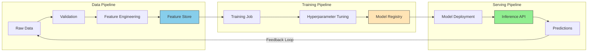

# MLOps Pipeline

This guide covers 5 key areas: I. Strategic Overview: MLOps as a Product Lifecycle, II. Data Engineering & The Feature Store, III. Model Development & Continuous Training (CT), IV. Model Serving & Deployment Strategies, V. Monitoring, Governance, and Feedback Loops.

## I. Strategic Overview: MLOps as a Product Lifecycle

At the Principal TPM level, the strategic imperative is shifting the organization from treating Machine Learning as a "research project" to treating it as a "software product." This requires managing a lifecycle that is fundamentally non-deterministic. Unlike traditional software, where `Code + Config = Output`, ML systems operate as `Code + Data + Model = Prediction`.

This section dissects the end-to-end lifecycle, identifying where value is created and where Mag7 initiatives typically fail.

### 1. The Three Pipelines of the MLOps Lifecycle

In a mature Mag7 environment (e.g., Azure AI or Amazon Personalize), the MLOps lifecycle is not a single linear path but three distinct, interconnected pipelines. As a TPM, you are responsible for the synchronization of these pipelines.

1.  **The Data Pipeline:** Focuses on extraction, validation, and feature engineering.
    *   *Output:* Feature Store / Training Datasets.
    *   *Mag7 Context:* At Uber, the "Michelangelo" platform separates offline (batch) and online (real-time) data pipelines to ensure feature consistency.
2.  **The Training Pipeline:** Focuses on algorithm selection, hyperparameter tuning, and model creation.
    *   *Output:* A serialized model artifact (e.g., a `.pb` file in TensorFlow or `.pkl` in PyTorch) registered in a Model Registry.
3.  **The Serving Pipeline (Inference):** Focuses on exposing the model via REST/gRPC or batch processes.
    *   *Output:* Predictions/Inferences logged for monitoring.

**Tradeoffs & Decision Making:**
*   **Decoupled vs. Monolithic Pipelines:**
    *   *Choice:* Should data processing be embedded in the model training script or separated?
    *   *Tradeoff:* Embedding is faster for a single data scientist (high velocity initially). Decoupling allows feature reuse across teams (high ROI long-term).
    *   *Mag7 Standard:* Strong decoupling. Features are treated as APIs (Feature Store) to prevent "pipeline jungles."

**Business Impact:**
*   **Capability:** Decoupling allows Data Engineers to optimize query costs (Snowflake/BigQuery) independently of Data Scientists optimizing GPU utilization (CUDA/TPUs).

### 2. The "Research to Production" Gap (The Valley of Death)

The primary friction point a Principal TPM must manage is the handoff between Data Science (DS) and ML Engineering (MLE). DS teams often work in "notebooks" (Jupyter/Colab), which are stateful and difficult to version control. MLE teams work in standardized IDEs/Containers.

**Real-World Behavior at Mag7:**
At Google, TFX (TensorFlow Extended) was built specifically to bridge this gap. It forces a contract where the output of research is not just a model weight file, but a reproducible pipeline definition.

**Actionable Guidance for TPMs:**
*   **Enforce Reproducibility:** Do not allow models into production if they were trained "manually" on a laptop. Require the training run to be triggered via an orchestrator (e.g., Kubeflow, Airflow, AWS Step Functions).
*   **Containerization:** Ensure the training environment and serving environment use the exact same Docker container base layers to prevent dependency hell (e.g., library version mismatches).

**Impact on ROI:**
*   **Metric:** "Time to Recovery." If a model behaves erratically in production, how fast can you retrain it? If the process was manual, it could take days. If automated, it takes hours.

### 3. Continuous Training (CT) vs. Static Deployment

In traditional DevOps, you deploy once and the code doesn't change until the next commit. In MLOps, the model degrades the moment it is deployed because the world changes (Data Drift).

**Technical Depth:**
*   **Static Retraining:** Scheduled retraining (e.g., every Sunday night).
*   **Dynamic Retraining:** Triggered retraining based on drift detection (e.g., if the distribution of input data deviates by >5% from training data).

**Mag7 Example:**
Consider **Amazon's Supply Chain**. A model predicting toilet paper demand works fine until a pandemic hits (Concept Drift). A static model fails. A mature MLOps system detects the prediction error spike and automatically triggers a retraining pipeline on the most recent 24 hours of data.

**Tradeoffs:**
*   **Cost vs. Freshness:**
    *   Dynamic retraining requires keeping "hot" compute clusters ready and incurs massive GPU costs.
    *   Static retraining risks serving stale predictions, lowering conversion rates.
*   *Guidance:* For high-frequency trading or real-time ad bidding (Meta Ads), dynamic is mandatory. For internal HR churn prediction, static is sufficient.

### 4. Feedback Loops and Evaluation Store

The lifecycle is not complete until the prediction is validated against the actual outcome (Ground Truth).

**The Challenge:**
In many cases (e.g., loan default prediction), the "ground truth" (did they default?) isn't known for months. In others (e.g., click-through rate), it is known instantly.

**Principal TPM Strategy:**
You must define the **Proxy Metrics** when Ground Truth is delayed.
*   *Example:* Netflix doesn't know immediately if you "liked" a show. They use "watch time > 5 minutes" as a proxy for a successful recommendation to tune the model immediately.

**Edge Case - Feedback Loops:**
*   **Self-Fulfilling Prophecies:** If a model only shows users Action movies, users only click Action movies. The model thinks it's a genius, but it has created a filter bubble.
*   *Mitigation:* The TPM must ensure "Exploration" traffic (randomized recommendations) is budgeted into the product requirements to capture unbiased data.

---

## II. Data Engineering & The Feature Store

### 1. The Dual-Database Architecture
At a Mag7 scale, a Feature Store is not a single database. It is an abstraction layer that manages two distinct storage engines synchronized by a common transformation pipeline. A Principal TPM must understand why this split exists and the latency implications of each.

*   **The Offline Store (Training):**
    *   **Technology:** High-throughput, high-latency storage (e.g., Google BigQuery, AWS Redshift, S3/Parquet).
    *   **Purpose:** Stores months or years of historical data. Used to generate training datasets.
    *   **Key Metric:** Throughput (Rows per second).
*   **The Online Store (Inference):**
    *   **Technology:** Low-latency, high-availability Key-Value stores (e.g., Redis, Cassandra, Amazon DynamoDB).
    *   **Purpose:** Stores only the *current* values of features required for real-time prediction.
    *   **Key Metric:** Latency (p99 < 10ms).

**The Synchronization Challenge:**
The primary engineering challenge is **Materialization**—the process of computing feature values and pushing them to the Online Store.
*   **Batch Materialization:** Jobs run daily/hourly (e.g., "Average spend last 30 days"). Low cost, high latency.
*   **Streaming Materialization:** Jobs run continuously via Kafka/Flink (e.g., "Clicks in the last 10 seconds"). High cost, near-real-time freshness.

**Mag7 Real-World Example:**
Consider **Uber’s Michelangelo** (or a similar system at DoorDash). When you request a ride, the Estimated Time of Arrival (ETA) model requires two types of features:
1.  **Batch (Offline Source):** "Driver's average speed over the last year." This is computed nightly and pushed to Cassandra.
2.  **Streaming (Real-time Source):** "Traffic congestion at this intersection *right now*." This flows through Kafka and Flink, updating the Online Store immediately.

### 2. Solving "Time Travel" (Point-in-Time Correctness)
The most complex data engineering problem in ML is preventing **Data Leakage** during training.

If you are training a model today to predict fraud based on historical transactions from six months ago, you cannot use the user's *current* credit score. You must use the credit score *as it existed at the exact moment of the transaction six months ago*.

**The Mechanism:**
A mature Feature Store supports **Time Travel** queries. When a Data Scientist requests a training dataset, they provide a list of entity IDs (users) and timestamps. The Feature Store reconstructs the state of the world at those specific timestamps using the Offline Store.

**Tradeoffs & Impact:**
*   **Tradeoff:** Supporting Time Travel requires immutable logs or snapshots, effectively multiplying storage costs by 10x-100x compared to a standard CRUD database.
*   **Business Impact:** Without Time Travel, models learn from future data. This results in **optimistic performance estimates**—the model looks great in testing (99% accuracy) but fails catastrophically in production (60% accuracy) because it was cheating during training.

### 3. Feature Reuse and the "Marketplace" Concept
At the Principal level, you are solving for organizational efficiency. Without a Feature Store, every team rebuilds the same pipelines. The Fraud team builds a "User Age" pipeline; the AdTech team builds a separate "User Age" pipeline. This leads to duplicate compute costs and inconsistent data definitions.

**Mag7 Strategy:**
Companies like Airbnb and Netflix treat the Feature Store as an internal **Marketplace**.
*   **Producer Teams:** Define feature logic (e.g., `user_has_clicked_ad_last_1h`) once. The system handles backfilling (calculating history) and materialization.
*   **Consumer Teams:** "Shop" for features. They add the feature to their model config without writing a single line of data engineering code.

**ROI Analysis:**
*   **Velocity:** Reduces time-to-model from months to weeks. A new model is often just a selection of existing features plus one new experimental feature.
*   **Cost:** Significant reduction in cloud compute spend (Spark/Dataflow) by computing a feature once and serving it to 50 distinct models.

### 4. Tradeoff Analysis: Freshness vs. Cost
As a TPM, you will frequently arbitrate disputes between Data Scientists (who want real-time data) and Infrastructure Engineers (who manage cloud budgets).

| Feature Type | Implementation | Freshness | Cost | Use Case |
| :--- | :--- | :--- | :--- | :--- |
| **Batch** | SQL / Spark Jobs (Airflow) | 24h - 1h | $ (Low) | Recommendations (e.g., "Movies you liked last year") |
| **Near-Real-Time** | Micro-batching | 15m - 1m | $$ (Med) | Inventory management, Logistics |
| **Real-Time** | Stream Processing (Flink/Kafka) | < 1s | $$$$ (Very High) | Fraud detection, High-Frequency Trading, Ad Bidding |

**Strategic Decision Framework:**
Always challenge the requirement for Real-Time features.
*   *Question:* "Does knowing the user's behavior in the last 5 seconds significantly lift model performance compared to knowing their behavior in the last 15 minutes?"
*   *Mag7 Context:* For **TikTok's feed**, real-time is critical (if I skip a video, stop showing similar ones *immediately*). For **Amazon Product Recommendations**, batch is often sufficient (buying habits change slowly).

### 5. Failure Modes and Handling
A Feature Store introduces a centralized point of failure.

1.  **Staleness (The "Silent Killer"):** The synchronization job fails, but the Online Store (Redis) keeps serving old data. The model doesn't crash, but predictions degrade.
    *   *Mitigation:* Implement "Feature Freshness" monitoring. If data is older than X threshold, fallback to a default value or a heuristic rule.
2.  **Training-Serving Skew (Logic Drift):** The transformation logic in Python (training) differs slightly from the implementation in Java/Go (serving).
    *   *Mitigation:* Use a unified transformation engine (e.g., Tecton or Feast) where logic is defined once (usually in Python/SQL) and compiled for both environments.

## III. Model Development & Continuous Training (CT)

### 1. The Shift from Ad-Hoc Modeling to Automated Pipelines

In a startup environment, a Data Scientist (DS) might train a model in a Jupyter Notebook, save the weights to a `.h5` file, and hand it to an engineer. At Mag7 scale, this "human-in-the-loop" approach is a critical vulnerability.

For a Principal TPM, Model Development is not about the algorithm itself (e.g., Transformer vs. CNN); it is about the **orchestration of the experiment lifecycle**. The objective is to decouple model generation from individual contributors, ensuring that if your Lead AI Researcher leaves tomorrow, the model can still be retrained and deployed automatically.

**Mag7 Real-World Behavior:**
*   **Google (TFX):** Uses TensorFlow Extended (TFX) pipelines. A model is not considered "ready" until the training pipeline *itself* is committed to the repository, not just the model artifact.
*   **Meta (FBLearner Flow):** Engineers do not manually provision GPUs. They submit a workflow definition to FBLearner, which handles data fetching, training, and pushing the model to the registry.

**Tradeoffs:**
*   **Flexibility vs. Standardization:** Enforcing rigid pipelines (e.g., Kubeflow/Vertex AI) slows down initial exploration. Data Scientists often hate leaving their notebooks. However, without this standardization, you cannot achieve Continuous Training (CT).
*   **Upfront Engineering Cost vs. Operational Debt:** Building a pipeline takes 3x longer than training a model once. But manual retraining incurs massive operational debt and risk of human error in the long run.

**Business Impact:**
*   **Reproducibility:** Ensures that any model version in production can be traced back to the specific code commit, dataset snapshot, and hyperparameter configuration used to create it.

---

### 2. Experiment Tracking & Hyperparameter Optimization (HPO)

Before a model reaches production, thousands of variations are generated. Managing this "Cambrian explosion" of artifacts is a core TPM concern regarding resource utilization and auditability.

**Technical Deep Dive:**
You must implement a centralized **Model Registry** and **Experiment Tracker** (e.g., MLflow, Weights & Biases, or internal tools like Amazon SageMaker Experiments).
*   **Tracking:** Logs metrics (Accuracy, AUC, F1) alongside artifacts.
*   **HPO (Hyperparameter Optimization):** Automating the search for the best configuration (learning rate, batch size). At Mag7, this is rarely a grid search; it is **Bayesian Optimization** (e.g., Google Vizier) that intelligently navigates the search space to minimize compute costs.

**Mag7 Context:**
When a team at Amazon Search wants to improve ranking relevance, they don't just train one model. They launch an HPO job that spins up 50 parallel training instances on EC2 Spot Instances, automatically killing underperforming trials to save cost (Early Stopping).

**Tradeoffs:**
*   **Compute Budget vs. Model Performance:** HPO yields diminishing returns. A TPM must set guardrails. Is a 0.05% increase in AUC worth an extra $50,000 in GPU spend?
*   **Complexity vs. Interpretability:** Automated AutoML/HPO can create "black box" configurations that are hard to debug or explain to stakeholders.

**ROI & Capability:**
*   **Resource Efficiency:** Automated early stopping can reduce training compute costs by 30-50% compared to standard grid searches.

---

### 3. Continuous Training (CT) Strategies

This is the defining line between a "Science Project" and a "Product." Models decay the moment they are deployed because the world changes (Concept Drift). CT automates the retraining process.

**The Three Tiers of CT:**

1.  **Schedule-Based:** Retrain every Sunday at 2 AM. Simple, predictable, but reactive.
2.  **Trigger-Based (Drift-Driven):** Retrain when monitoring detects that the statistical properties of the input data have shifted (e.g., feature distribution changes).
3.  **Online Learning:** The model updates weights incrementally with every new data point.

**Mag7 Real-World Behavior:**
*   **TikTok/Reels (Online Learning):** User preferences shift in minutes. These systems use near-real-time online learning. If a user suddenly starts watching cooking videos, the model updates immediately.
*   **Amazon Supply Chain (Scheduled):** Forecasting demand for inventory doesn't change by the minute. Weekly retraining is sufficient and more stable.

**Tradeoffs:**
*   **Freshness vs. Stability (Catastrophic Forgetting):** In Online Learning, a model might over-index on recent data and "forget" historical patterns. It is also highly susceptible to **Data Poisoning** (malicious users feeding bad data to skew the model).
*   **Cost vs. Lift:** Continuous training is expensive. If retraining daily only improves accuracy by 0.01% over retraining weekly, the ROI is negative.

**TPM Action Item:**
Define the "Retraining Trigger" in the PRD. Do not default to "real-time." Ask: "What is the half-life of this prediction's value?"

---

### 4. The Model Registry & Governance

The Model Registry is the "Git" for binary model artifacts. It acts as the gatekeeper between Development and Production.

**Technical Deep Dive:**
A registry stores the model binary (e.g., ONNX, pickle, saved_model.pb) alongside its metadata. It manages lifecycle stages: `Staging`, `Production`, `Archived`.
Crucially, the registry enforces **Policy-as-Code**:
*   *Does this model pass the bias check?*
*   *Is the latency under the 50ms SLA?*
*   *Is the accuracy better than the currently running model (Champion/Challenger)?*

**Edge Case - The "Rollback" Scenario:**
A new model is deployed and immediately causes a revenue drop. Without a registry, rolling back involves finding an old file on S3. With a registry, the TPM/Engineering Lead simply promotes the `Previous-Champion` back to `Production` via an API call.

**Impact on CX:**
Prevents "silent regressions" where a model is technically functional (returns 200 OK) but provides garbage predictions that hurt the user experience.

---

## IV. Model Serving & Deployment Strategies

At the Principal TPM level, Model Serving is where the economic reality of AI hits hard. While training is a capital expenditure (CapEx) often treated as R&D, inference is an operational expenditure (OpEx) that scales linearly or exponentially with user traffic.

In a Mag7 environment, the primary challenge is not just "getting the model to run," but balancing **Latency, Throughput, Cost, and Freshness**. A 100ms delay in inference can result in a measurable drop in search queries or ad clicks, directly impacting quarterly revenue.

### 1. Inference Architectures: Batch vs. Online vs. Streaming

The first architectural decision a TPM must govern is the serving pattern. This dictates the infrastructure cost structure and the freshness of predictions.

**A. Batch Inference (Offline)**
Predictions are generated periodically (e.g., nightly) across a massive dataset and cached in a low-latency key-value store (e.g., DynamoDB, Cassandra, Redis).
*   **Mag7 Example:** **Netflix Recommendations (Historically).** Recommendations were pre-computed nightly. When you logged in, the system simply fetched pre-calculated rows.
*   **Tradeoffs:** High throughput and low cost (can use spot instances). However, the "Cold Start" problem is severe; the model cannot react to actions the user took 5 minutes ago.
*   **Business Impact:** Low operational risk, but potentially lower engagement due to stale recommendations.

**B. Online Inference (Real-Time)**
The model accepts a request and returns a prediction synchronously.
*   **Mag7 Example:** **Uber/Lyft ETA & Pricing.** When a user requests a ride, the model must calculate price/time immediately based on current traffic and supply. Pre-computing is impossible due to the infinite permutation of pickup/drop-off locations and time.
*   **Tradeoffs:** Highest cost and complexity. Requires strict SLAs (e.g., p99 < 50ms). Highly susceptible to traffic spikes.
*   **Business Impact:** High engagement and conversion. Direct correlation between latency and revenue.

**C. Streaming Inference (Near Real-Time)**
An event-driven architecture (using Kafka/Kinesis) where prediction requests are processed asynchronously but rapidly.
*   **Mag7 Example:** **TikTok/Reels Session Updates.** As a user swipes, their interaction events stream into a model which updates the ranking for the *next* batch of videos in the feed.
*   **Tradeoffs:** Balances the freshness of online inference with the decoupling of batch. Complex to debug (event correctness).

### 2. Deployment Strategies: Managing Risk at Scale

At Mag7, you never simply "replace" a model endpoint. The blast radius of a bad model (e.g., one that predicts $0.00 for all ad bids) is catastrophic. TPMs must enforce rigorous deployment patterns.

**A. Shadow Deployment (Dark Launching)**
The new model (Challenger) is deployed alongside the current model (Champion). It receives the same live traffic, computes predictions, but **does not return them to the user**. The system logs the Challenger's output for offline analysis against the Champion.
*   **Mag7 Context:** Standard for **Google Search Ranking** changes. You validate that the new model doesn't crash and that its relevance scores align with expectations before it ever touches a user.
*   **Tradeoffs:** **Double the compute cost** for the duration of the test. Zero user-facing risk.
*   **ROI/Capability:** Prevents "silent failures" where a model is technically healthy (returning 200 OK) but functionally garbage.

**B. Canary Deployment**
The new model is exposed to a small subset of users (e.g., 1% or specific internal employees). Traffic is gradually ramped up (1% -> 5% -> 25% -> 100%) based on automated health metrics.
*   **Mag7 Context:** **Facebook News Feed.** New ranking algorithms are rolled out to small geographic clusters first.
*   **Tradeoffs:** Real user feedback immediately. If the model is bad, 1% of users have a degraded experience.
*   **ROI/Capability:** rapid validation of business metrics (Click-Through Rate, Watch Time) that Shadow mode cannot provide.

**C. A/B Testing**
Distinct from Canary (which is about stability), A/B testing is about **statistical significance**. Users are persistently routed to Model A or Model B to measure long-term behavior changes.
*   **Tradeoffs:** High complexity in routing logic and data attribution. Requires a robust Experimentation Platform.

### 3. Optimization: Distillation and Quantization

A Principal TPM must drive efficiency. If a model is too heavy, it costs too much to serve or is too slow.

**A. Model Quantization**
Converting model weights from 32-bit floating-point (FP32) to 8-bit integers (INT8).
*   **Impact:** Reduces model size by 4x and speeds up inference significantly on modern hardware (TPUs/GPUs).
*   **Tradeoff:** Slight loss in precision (accuracy). The TPM must define the acceptable accuracy drop (e.g., "We accept 0.5% accuracy loss for 50% cost reduction").

**B. Knowledge Distillation**
Training a massive, complex "Teacher" model (high accuracy, slow) to teach a smaller "Student" model (lower accuracy, fast) to mimic its behavior.
*   **Mag7 Example:** **BERT models in Search.** A massive BERT model is too slow for every query. A distilled version runs in production to handle the bulk of traffic.
*   **Business Impact:** Enables the deployment of State-of-the-Art (SOTA) capabilities on commodity hardware or edge devices.

### 4. Edge vs. Cloud Serving

The decision of *where* the compute happens is strategic.

**Cloud Serving:**
*   **Pros:** Infinite scale, easy updates, powerful GPUs.
*   **Cons:** Latency (network round trip), bandwidth costs, privacy concerns (sending data off-device).

**Edge Serving (On-Device):**
*   **Mag7 Example:** **Apple FaceID / Siri** or **Google Pixel Magic Eraser**. The inference happens on the phone's Neural Engine.
*   **Pros:** Zero latency, works offline, highest privacy (data never leaves device). Saves massive cloud compute costs for the company.
*   **Cons:** Hard to update (requires app update), limited by battery and thermal constraints, model must be highly optimized.
*   **Tradeoff:** You sacrifice model complexity/size for privacy and zero latency.

### 5. Common Failure Modes & Mitigation

1.  **Prediction Drift:** The model's distribution of predicted labels changes (e.g., suddenly predicting "Fraud" 50% of the time instead of 1%).
    *   *Mitigation:* Real-time monitoring of prediction distribution. Automated rollbacks if thresholds are breached.
2.  **Feature Drift:** The input data changes (e.g., a camera sensor degrades, or user behavior shifts due to a holiday).
    *   *Mitigation:* Schema validation at the serving layer.
3.  **Thundering Herd:** If a service goes down and comes back up, millions of clients retry simultaneously, crashing it again.
    *   *Mitigation:* Implement exponential backoff and jitter in client SDKs; use shedding at the load balancer level.

---

## V. Monitoring, Governance, and Feedback Loops

At the Principal TPM level, monitoring is not about looking at dashboards; it is about **automated remediation** and **trust**. In standard software, if a service returns a 200 OK, it is usually working. In ML, a model can return 200 OK, with low latency, while making catastrophic predictions that hemorrhage revenue or violate fair lending laws. This phenomenon is known as "silent failure."

For a Mag7 TPM, the goal is to architect a system where monitoring triggers the next iteration of the product lifecycle automatically (e.g., retraining) rather than just waking up an on-call engineer.

### 1. The Three Layers of ML Observability

To effectively govern a model at scale, you must enforce observability at three distinct layers. A failure in any layer requires a different response protocol.

#### Layer A: Infrastructure & System Metrics (The "Plumbing")
This is standard DevOps monitoring applied to ML.
*   **Metrics:** Latency (p99), Throughput (RPS), CPU/GPU utilization, Memory usage.
*   **Mag7 Context:** At **Netflix**, if the recommendation service latency exceeds 200ms, the system falls back to a pre-computed "Popular in your Region" list rather than waiting for the personalized model. This protects the User Experience (CX).
*   **Tradeoff:** **Cost vs. Latency.** Provisioning excess GPU capacity ensures low latency during spikes but kills ROI.
    *   *TPM Decision:* Implement auto-scaling policies based on inference queue depth, not just CPU usage.

#### Layer B: Data Quality & Drift (The "Input")
This monitors the shape of the data entering the model compared to the baseline established during training.
*   **Metrics:** Missing values, type mismatches, and **Feature Drift** (e.g., using Kullback-Leibler divergence or Population Stability Index).
*   **Mag7 Context:** In **Amazon Ads**, if a sudden influx of bot traffic changes the distribution of "user_age" inputs to strictly 0 or 99, the model will output garbage. The system must detect this input anomaly *before* the prediction is served.
*   **Tradeoff:** **Blocking vs. Non-Blocking checks.**
    *   *Strict Blocking:* Reject requests with anomalous features. *Risk:* False positives cause service outages.
    *   *Non-Blocking:* Log anomalies and alert. *Risk:* Bad predictions impact users immediately.
    *   *Principal TPM Stance:* Use non-blocking for high-volume consumer apps; use blocking for high-stakes decisions (e.g., financial fraud).

#### Layer C: Model Performance & Concept Drift (The "Output")
This measures if the model’s predictions are still accurate relative to reality.
*   **Metrics:** Accuracy, Precision/Recall, AUC-ROC, and Prediction Drift (output distribution shifts).
*   **Mag7 Context:** **Google Search** ranking algorithms are constantly monitored. If the click-through rate (CTR) for top results drops significantly for a specific query category (Concept Drift), it signals that user intent has changed (e.g., "Corona" shifting from beer to virus), and the model is stale.
*   **Tradeoff:** **Label Lag.** You often don't know the "ground truth" immediately.
    *   *Solution:* Monitor "Proxy Metrics." If you can't measure "did the user buy the item" (lag: days), measure "did the user add to cart" (lag: seconds).

### 2. Feedback Loops: Closing the Circle

The definition of a mature MLOps pipeline is the existence of an automated feedback loop. This is the mechanism by which production data flows back into the training set to update the model.

#### The "Flywheel" Architecture
1.  **Inference Logging:** Every prediction request (features) and response (prediction) must be logged with a unique `prediction_id`.
2.  **Outcome Joining:** When the ground truth arrives (user clicked, loan defaulted), it is joined with the inference log via `prediction_id`.
3.  **Triggering:** If performance metrics dip below a threshold, a retraining pipeline is triggered automatically.

**Mag7 Real-World Example:**
**Meta (Facebook/Instagram) Ads:** The feedback loop is near real-time.
1.  Model predicts probability of a click ($p(click)$).
2.  User sees ad.
3.  User clicks (or doesn't).
4.  This interaction is immediately fed into a stream processing system (e.g., Flink/Kafka).
5.  The model weights are updated via **Online Learning** or frequent micro-batch retraining.

**Business Impact/ROI:**
*   **Revenue Protection:** Prevents revenue decay from stale models.
*   **Operational Efficiency:** Eliminates the manual toil of data scientists manually collecting new data to retrain.

**Tradeoff: Feedback Loop Stability vs. Speed**
*   *Fast Loops (Online Learning):* The model learns instantly. *Risk:* A malicious user can "poison" the model by feeding it bad data (e.g., clicking spam to confuse the filter).
*   *Slow Loops (Batch Retraining):* More stable, allows for human review. *Risk:* Model is always slightly out of date.

### 3. Governance: Compliance and Fairness

At a Mag7 company, you are a target for regulators. Governance is not optional; it is a P0 requirement for launch.

#### Model Lineage & Reproducibility
You must be able to answer: "For the prediction served to User X on Date Y, exactly what code, data snapshot, and hyperparameters were used?"
*   **Implementation:** All artifacts (code, data, model binaries) are versioned and hashed.
*   **Mag7 Context:** **Apple** places extreme emphasis on privacy and lineage. If a model is found to be biased, they must trace exactly which dataset introduced that bias to remediate it.

#### Bias Detection & Fairness
Principal TPMs must integrate fairness checks into the CI/CD pipeline.
*   **Action:** Before a model is promoted to production, it runs against "Slicing Metrics." It’s not enough to have 99% global accuracy; you must verify accuracy across protected classes (e.g., age, gender, geography).
*   **Tradeoff:** **Fairness vs. Accuracy.** Removing a highly predictive feature (like zip code, which correlates with race) might lower overall model accuracy.
    *   *Principal TPM Stance:* Compliance and Brand Safety usually trump marginal accuracy gains. You must document this tradeoff for leadership.

### 4. Incident Response: The "Kill Switch"

What happens when monitoring turns red? As a Principal TPM, you define the playbook.

1.  **Shadow Mode:** Deploy the new model alongside the old one. It receives traffic but its predictions are logged, not returned to the user. Promote only after verifying metrics match production.
2.  **Canary Deployment:** Route 1% of traffic to the new model.
3.  **The Kill Switch (Fallback):** If the model goes haywire, the system must automatically revert to a heuristic (rule-based system) or the previous model version.
    *   *Example:* If an ML pricing engine at **Uber** fails, the system falls back to a static base-rate calculation rather than returning $0.00 or $1,000,000.

---

---

## Interview Questions

### I. Strategic Overview: MLOps as a Product Lifecycle

### Question 1: Managing The "Works on My Machine" Problem
**Prompt:** "You are the TPM for a new Fraud Detection model at a fintech division. The Data Science team has achieved 99% accuracy in their Jupyter notebooks, but the Engineering team estimates it will take 6 months to implement this in production. How do you diagnose the bottleneck and accelerate this timeline?"

**Guidance for a Strong Answer:**
*   **Diagnosis:** Identify that the "6 months" is likely due to rewriting non-production code (notebooks) into production services (Java/Go/C++) and handling data plumbing discrepancies.
*   **Strategy:** Propose moving to a containerized pipeline approach (e.g., Kubeflow) where the DS team delivers a Docker image, not a notebook.
*   **Tradeoff Analysis:** Acknowledge that forcing DS to write production-ready code slows down *experimentation* (research velocity) but speeds up *deployment* (production velocity).
*   **Solution:** Introduce a "Golden Path" or template infrastructure that abstracts the engineering complexity for the DS team, allowing them to deploy without rewriting code.

### Question 2: Handling Model Decay in High-Stakes Environments
**Prompt:** "We launched a pricing model for our ride-sharing service. It performed well for three months, but revenue has dropped 15% in the last week despite no code changes. As the Principal TPM, how do you investigate and resolve this?"

**Guidance for a Strong Answer:**
*   **Immediate Action:** Rollback is not always possible with data issues. The first step is to check **Data Drift** (inputs changed) and **Concept Drift** (relationship between inputs and outputs changed).
*   **Technical Deep Dive:** Ask if the feature distribution (e.g., weather, traffic patterns) has shifted. Perhaps a competitor lowered prices, changing user behavior (Concept Drift).
*   **Systemic Fix:** Discuss implementing automated monitoring for *prediction distribution*. If the model starts predicting "$50" for 90% of rides when it used to be 10%, an alert should fire *before* revenue drops.
*   **Governance:** Mention the need for a "Kill Switch" or heuristic fallback (rule-based pricing) to stop the bleeding while the model is retrained.

### II. Data Engineering & The Feature Store

### Q1: Architecting for Latency vs. Accuracy
"We are launching a new real-time fraud detection system for a payment gateway. The Data Science team wants to use a feature based on the 'rolling average transaction amount over the last 30 days,' updated instantly after every swipe. This feature is expensive to compute. As the TPM, how do you evaluate if we should support this?"

**Guidance for a Strong Answer:**
*   **Identify the Tradeoff:** Immediate recognition of the tension between **Inference Latency** (must be <200ms for payments), **Data Freshness** (streaming compute costs), and **Model Lift**.
*   **Propose an Experiment:** Do not accept the requirement blindly. Suggest an A/B test using a "Lambda Architecture" or a proxy feature (e.g., end-of-day batch update) to measure the marginal ROI of real-time updates.
*   **Technical Solutioning:** Discuss implementation options. Instead of recomputing the 30-day average on every read (too slow), suggest **incremental aggregation** (keeping a running sum and count in Redis) or using a sliding window in a stream processor like Flink.
*   **Fallback Strategy:** What happens if the stream lags? The system must default to the last known batch value to prevent blocking the transaction.

### Q2: Handling Feature Skew
"A model deployed to production has seen a 15% drop in accuracy over the last week. The model binary hasn't changed. The Data Engineering team says the pipelines are 'green.' How do you debug this?"

**Guidance for a Strong Answer:**
*   **Drill into the Data:** Acknowledge that "green pipelines" only mean jobs finished, not that data is correct.
*   **Hypothesis Generation:**
    *   **Drift:** Has the real-world distribution changed? (e.g., a new bot attack pattern).
    *   **Skew:** Is the Online Store serving `null` values because a materialization job is lagging (staleness)?
    *   **Schema Change:** Did an upstream team change a column definition (e.g., changing currency from USD to EUR) without notifying the ML team?
*   **Systemic Fix:** Move beyond the immediate fix. Propose implementing **Data Contracts** or schema registries to prevent upstream changes from breaking downstream ML features, and setting up automated alerts for feature distribution shifts (e.g., using Kullback-Leibler divergence monitoring).

### III. Model Development & Continuous Training (CT)

**Question 1: The "Freshness" Trap**
"We are launching a fraud detection system for a fintech product. The engineering lead insists on 'Online Learning' so the model adapts to new fraud patterns instantly. As the Principal TPM, how do you evaluate this request, what are the specific risks you would highlight, and what architecture would you propose as a counter or compromise?"

*   **Guidance for a Strong Answer:**
    *   **Identify the Risk:** Acknowledge that Online Learning is extremely risky for fraud because fraudsters can "teach" the model to accept bad transactions (poisoning). It also lacks a stable baseline for debugging.
    *   **Propose Architecture:** Suggest a "Lambda Architecture" or frequent batch retraining (e.g., hourly) rather than true streaming updates.
    *   **Tradeoff Analysis:** Discuss the operational complexity of online learning (monitoring weights in real-time) vs. the business loss of a 1-hour delay in learning new patterns.
    *   **Safety Mechanisms:** Mention the need for a "shadow mode" where the online model predicts but doesn't block transactions until validated.

**Question 2: Debugging Model Decay**
"You own a recommendation engine that has been performing well for 6 months. Suddenly, key engagement metrics drop by 15% over a weekend. The engineering team says the infrastructure is fine (latency is low, uptime is 100%). What is your triage process to identify the root cause in the Model Development/CT pipeline?"

*   **Guidance for a Strong Answer:**
    *   **Training-Serving Skew:** Immediately check if the data entering the model (serving) matches the data it was trained on. Did a frontend change break the logging format?
    *   **Registry Check:** Verify exactly which model version is currently in production. Was a new model automatically promoted over the weekend via the CT pipeline?
    *   **Drift Analysis:** Look at feature drift. Did user behavior change (e.g., a holiday, a global event)?
    *   **Rollback Strategy:** The immediate action is to roll back to the last known good model version in the Registry to stabilize business metrics while investigating.

### IV. Model Serving & Deployment Strategies

### Question 1: The Transition to Real-Time
**Prompt:** "We currently serve our product recommendations via a nightly batch process. The product team wants to move to real-time personalization to capture user intent immediately. As the Principal TPM, how do you evaluate this request and what architecture do you propose?"

**Guidance for a Strong Answer:**
*   **ROI Assessment:** Challenge the premise first. Does the lift in engagement from real-time updates justify the 10x-50x increase in inference costs? Suggest an A/B test first.
*   **Architecture:** Propose a hybrid "Lambda Architecture" or a Feature Store approach. Keep the heavy compute (long-term preferences) in batch, but use a lightweight online model to re-rank based on the last 5 minutes of session data.
*   **Infrastructure:** Discuss the need for low-latency feature serving (e.g., Redis/Cassandra) and the shift from Spark (batch) to Flink/Kafka (streaming) for feature engineering.
*   **Risk:** Highlight the increased operational burden (on-call rotations) required for maintaining a real-time service vs. a batch job.

### Question 2: The Failed Deployment
**Prompt:** "A new model version was deployed using a Canary strategy to 5% of traffic. Latency immediately spiked by 300ms, causing timeouts. However, the model's accuracy metrics (precision/recall) are significantly better than the production model. What do you do?"

**Guidance for a Strong Answer:**
*   **Immediate Action:** Rollback immediately. Service health (availability/latency) trumps model accuracy. If the user times out, the accuracy doesn't matter.
*   **Root Cause Analysis:** Investigate *why* latency spiked. Did the new model introduce a heavier architecture (e.g., more layers)? Was it not quantized? Did the dependency on a feature store introduce network lag?
*   **Solutioning:** Propose optimization techniques (Quantization, Distillation) or infrastructure scaling (more GPUs, autoscaling policies) to bring latency within SLA.
*   **Tradeoff Decision:** If optimization fails, present a decision to leadership: Is the accuracy gain worth the cost of doubling the hardware to support the latency? (Usually, the answer is no, unless it directly drives massive revenue).

### V. Monitoring, Governance, and Feedback Loops

### Q1: Design a monitoring strategy for a Delayed Feedback Loop scenario.
*Context:* "You are the TPM for a Fintech lending product at a Mag7. We use ML to predict loan defaults. However, we won't know if a user defaults for months or years. How do you monitor model performance and decide when to retrain?"

**Guidance for a Strong Answer:**
*   **Acknowledge the Lag:** admit that standard accuracy metrics are impossible to calculate in real-time.
*   **Proxy Metrics:** Propose monitoring "early warning signs" (e.g., late first payment, changes in user credit score from external bureaus) as proxies for default.
*   **Drift Detection:** Heavily emphasize monitoring **Data Drift** (Input) and **Prediction Drift** (Output). If the distribution of applicants changes (e.g., suddenly younger, lower income), alert immediately, even if you don't know the default rate yet.
*   **Reference Set Comparison:** Compare current applicants against the "Gold Standard" training set.
*   **Business Impact:** Explain that in Fintech, "silent failure" means bad debt exposure. The bias should be toward conservative model updates or human-in-the-loop for high-risk segments until ground truth is established.

### Q2: Handling Bias in a High-Velocity Pipeline.
*Context:* "We are launching a global facial recognition feature for photo tagging. Legal is concerned about bias against underrepresented groups. The engineering team says adding fairness checks to the pipeline adds 4 hours to the build time, killing their velocity. How do you handle this?"

**Guidance for a Strong Answer:**
*   **Strategic Prioritization:** Clarify that for Mag7, Brand Trust > Velocity. Releasing a biased model is a PR disaster.
*   **Technical Compromise (Optimization):** Don't just accept the 4-hour delay. Propose **Tiered Testing**:
    *   *Commit Stage:* Run a small, representative "smoke test" for fairness (fast, blocks bad commits early).
    *   *Nightly/Staging:* Run the full 4-hour comprehensive fairness suite.
*   **Observability:** Implement production monitoring for bias (slicing metrics) to catch issues that slip through testing.
*   **Stakeholder Management:** Frame the solution as "enabling sustainable velocity" rather than "blocking release." You are protecting the engineers from a rollback/hotfix nightmare later.

---

## Key Takeaways

- Review each section for actionable insights applicable to your organization

- Consider the trade-offs discussed when making architectural decisions

- Use the operational considerations as a checklist for production readiness
