# Multi-Region Architecture & Global Deployment

Multi-region architecture is the ultimate expression of engineering trade-offs: you're trading 2-3x cost and exponential complexity for latency reduction, disaster resilience, or regulatory compliance. At the Principal TPM level, your role is gatekeeper—validating that the business case strictly maps to latency, availability, or compliance drivers before approving infrastructure that will double your COGS. This guide equips you to evaluate Active-Passive vs. Active-Active patterns, architect traffic management that contains blast radius, enforce safe deployment through rings and waves, and build ROI models that withstand CFO scrutiny.

## I. Strategic Drivers: Why Go Multi-Region?

At the Principal level, the decision to go multi-region is rarely a purely technical one; it is a business risk calculation. Moving from a single region (even with multiple Availability Zones) to a multi-region architecture typically increases engineering complexity by 3x and infrastructure costs by 2x to 2.5x.

Your role is to act as the gatekeeper against "Resume Driven Development." You must validate that the business requirement strictly maps to one of three drivers: **Latency**, **Availability**, or **Compliance**. If the request does not squarely fit these buckets, the ROI is likely negative.

### 1. Latency: The Speed of Light Constraint

Latency is the most common driver for consumer-facing applications, but it is often misunderstood. It is not just about "loading speed"; it is about the **Round Trip Time (RTT)** required for TCP/TLS handshakes before data even begins to flow.

*   **Technical Reality:** Light travels at roughly 200,000 km/s in fiber. A round trip from Tokyo to N. Virginia (us-east-1) is physically bound to ~160-200ms. Modern applications require multiple round trips (DNS, TCP handshake, TLS handshake, Request, Response). A dynamic app might require 4-5 round trips, resulting in a 1-second delay before the "First Contentful Paint."
*   **Mag7 Example:** **Amazon Retail**. Amazon famously calculated that every 100ms of latency cost them 1% in sales. Consequently, their architecture pushes the "read" heavy components (product catalogs, images, prices) to edge locations and regional caches close to the user, while keeping the "write" heavy components (placing the order) centralized or regionally sharded.
*   **The Trade-off:** **Consistency vs. Latency.** To serve a user in Tokyo with <20ms latency, the data must reside in Tokyo. If that data is updated in Virginia, you must rely on **Asynchronous Replication**. This creates **Eventual Consistency**.
    *   *Risk:* A user updates their profile in Tokyo. The read replica in Virginia hasn't updated yet. The user refreshes and sees old data.
    *   *Mitigation:* Use "Read-Your-Writes" consistency models or sticky sessions (pinning a user to a specific region), which reduces resilience.
*   **Business Impact:** High latency directly correlates to increased bounce rates and lower conversion (ROI). However, solving this requires building a distributed data mesh, which increases the skill requirement for your engineering teams.

### 2. Availability & Disaster Recovery: The "Blast Radius"

Multi-region for availability is an insurance policy against catastrophic failure. At a Mag7 level, you do not design for server failure (handled by clustering) or data center failure (handled by Availability Zones); you design for **Region Failure**.

*   **Technical Reality:** Regions fail due to black swan events: simultaneous fiber cuts, cascading control plane failures (e.g., a bad config pushed to the underlying network fabric), or natural disasters.
*   **Architectural Models:**
    *   **Active-Passive (Cold/Warm/Hot):** Traffic goes to Region A. Region B is on standby. RTO (Recovery Time Objective) depends on how "hot" Region B is.
    *   **Active-Active:** Traffic is load-balanced between Region A and Region B simultaneously. If A fails, B takes the load.
*   **Mag7 Example:** **Google Spanner**. Google’s global database uses atomic clocks (TrueTime) to ensure consistency across regions. This allows services like Gmail or Google Workspace to run Active-Active. If `us-central` goes dark, traffic automatically shifts to `us-east` with zero data loss.
*   **The Trade-off:** **Cost vs. RTO.**
    *   *Active-Passive:* Lower cost, but failover is traumatic. It often requires manual intervention (updating DNS), leading to 30+ minutes of downtime.
    *   *Active-Active:* "Zero downtime" but requires provisioning 200% capacity (50% in Region A, 50% in Region B). If A fails, B must handle 100% load immediately. If you run both at 80% utilization, a failover will crash the surviving region (Cascading Failure).
*   **Business Impact:** This is a pure Cost of Goods Sold (COGS) calculation. Does the cost of downtime (Revenue Loss + SLA Credits + Brand Damage) exceed the cost of doubling infrastructure spend? For a free tier user, the answer is no. For an Enterprise B2B customer, the answer is yes.

### 3. Data Sovereignty: The Legal Hard Stop

This is the only driver where ROI is irrelevant. If you want to operate in a specific market, you must comply with local laws regarding Personally Identifiable Information (PII).

*   **Technical Reality:** Laws like GDPR (EU), FedRAMP (US Gov), and various regulations in India, Germany, and China require that user data *rest* within physical borders.
*   **Implementation:** This forces a **Sharded Architecture**. You cannot have a single global database. You must shard users by geography.
    *   *German User* -> Data stored only in `eu-central-1` (Frankfurt).
    *   *US User* -> Data stored in `us-east-1`.
*   **Mag7 Example:** **Microsoft Azure Government**. Microsoft maintains physically isolated regions for the US Department of Defense. These regions are not just logically separated; they have distinct identity management systems and are operated by screened US citizens. Data in these regions never replicates to the public commercial cloud.
*   **The Trade-off:** **Operational Complexity vs. Market Access.**
    *   *Fragmentation:* You can no longer run a simple `SELECT * FROM Users`. Analytics and reporting become difficult because you cannot legally aggregate the raw data in one place. You must build "anonymization pipelines" to extract insights without extracting PII.
    *   *Travel Edge Cases:* What happens when a German user travels to the US? If their data is legally pinned to Germany, their experience in the US will be high-latency (accessing Frankfurt from New York), or you must build complex "temporary caching" mechanisms that comply with law.
*   **Business Impact:** Failure to comply results in massive fines (up to 4% of global revenue for GDPR) or being banned from the market entirely.

## II. Architectural Patterns: Active-Passive vs. Active-Active

At the Principal level, the decision between Active-Passive and Active-Active is rarely a binary engineering choice; it is a negotiation between **finance (cost), product (user experience), and engineering (complexity)**. Your role is to prevent over-engineering a non-critical service (waste) while ensuring critical paths do not have single points of failure (risk).

### 1. Active-Passive Architectures (Failover)

In this model, traffic goes to a primary region (e.g., `us-east-1`). A secondary region (e.g., `us-west-2`) receives data replication but does not handle live traffic until a failover event is triggered.

**Technical Implementation Variants:**
*   **Pilot Light:** The database is replicated to the secondary region, but compute resources (VMs/Containers) are turned off. In a disaster, you must spin up compute.
    *   *RTO (Recovery Time Objective):* Minutes to Hours.
    *   *Cost:* Lowest.
*   **Warm Standby:** The database is replicated, and a scaled-down fleet of compute is running (e.g., 10% capacity) to handle "smoke tests" or immediate critical traffic while the rest of the fleet scales up.
    *   *RTO:* Minutes.
    *   *Cost:* Moderate.

**Mag7 Real-World Behavior:**
Contrary to popular belief, Mag7 companies use Active-Passive extensively for **internal tools, non-real-time data processing, and back-office applications**.
*   **Example:** An internal employee ticketing system at Google or Meta is likely Active-Passive. If the primary region fails, it is acceptable for internal employees to wait 30 minutes for the backup region to come online. The cost savings of not running redundant compute globally are massive.

**Tradeoffs & Business Impact:**
*   **ROI:** High. You are not paying for double compute capacity that sits idle 99.9% of the time.
*   **Risk:** "Failover Confidence." The biggest risk in Active-Passive is that the failover mechanism itself fails because it is rarely tested.
*   **CX Impact:** During an outage, there is a hard downtime window (the RTO). For a payments processor, this is revenue loss. For a reporting dashboard, it is an annoyance.

### 2. Active-Active Architectures (Global Availability)

In this model, multiple regions (e.g., `us-east-1`, `eu-central-1`, `ap-northeast-1`) are live simultaneously. A Global Load Balancer (like AWS Global Accelerator or Cloudflare) routes users to the nearest healthy region.

**Technical Implementation:**
This requires **bi-directional replication**. If a user writes to Virginia, that data must propagate to Frankfurt. If the same user (or a different user acting on the same object) writes to Frankfurt, the system must reconcile the data.

**Mag7 Real-World Behavior:**
This is the standard for "Tier 0" services (Identity, Payments, Core Feed).
*   **Google:** Uses **Spanner** (TrueTime API) to achieve external consistency globally. This allows Google to run Active-Active with strong consistency, though it incurs a latency penalty for writes (commit wait).
*   **Amazon:** Uses **DynamoDB Global Tables**. This is often "Eventual Consistency." If you update your shopping cart in London, and immediately check it in New York, there might be a millisecond delay before the item appears.

**Tradeoffs & Business Impact:**
*   **Complexity:** Exponentially higher than Active-Passive. You must handle **Data Conflict Resolution** (e.g., what happens if two admins edit the same config file in two different regions at the exact same second? Last-write-wins? Vector clocks?).
*   **Cost:** You are paying for active compute and storage in multiple locations. Furthermore, **Data Transfer Costs** (egress/ingress between regions for replication) can become a significant line item on the P&L.
*   **CX Impact:** Lowest latency (users route to nearest server) and highest availability. If one region dies, traffic shifts instantly.

### 3. The Hidden Trap: Capacity Planning in Active-Active

A common failure mode Principal TPMs must spot is **"The 50% Trap."**

If you run Active-Active across two regions (Region A and Region B), and each runs at 60% utilization, you are not actually redundant.
*   **The Scenario:** Region A fails. 100% of traffic shifts to Region B.
*   **The Result:** Region B traffic jumps to 120%. Region B crashes immediately due to overload. You have now turned a regional outage into a global outage.
*   **The Fix:** To be truly Active-Active with 2 regions, neither region can ever exceed 50% capacity. This effectively doubles your infrastructure bill.

**Mag7 Mitigation Strategy:**
Mag7 companies often use **N+1 redundancy**. Instead of 2 regions at 50%, they might use 3 regions running at 65%. If one fails, the remaining two take the load (going to ~97%) without crashing.

### 4. "Sharded" or "Cell-Based" Architecture (The Hybrid Approach)

This is a sophisticated pattern often championed by Principal Engineers at Mag7 to solve the complexity of Active-Active data consistency.

**Concept:**
Instead of making every piece of data available everywhere (Global Active-Active), you **pin** a user to a specific region.
*   **Example:** A user in France is "homed" to the Paris region. All their writes go to Paris.
*   **Failover:** The Frankfurt region holds a passive replica of the French user's data.
*   **Result:** The system *looks* Active-Active globally (users in US go to US, users in EU go to EU), but at a data level, it behaves like Active-Passive. This avoids the nightmare of bi-directional conflict resolution.

**Mag7 Example:**
**Discord** and **Slack** rely heavily on this. A Discord voice channel is hosted on a specific server in a specific region. You cannot be in the same voice channel "Active-Active" across two regions. If that region fails, the channel crashes and must be re-instantiated in a new region.

### Summary Table for Decision Making

| Feature | Active-Passive | Active-Active | Cell-Based / Sharded |
| :--- | :--- | :--- | :--- |
| **Primary Driver** | Cost Savings, Internal Tools | Zero Downtime, Low Latency | Data Residency, Scalability |
| **Data Consistency** | Simple (One-way replication) | Hard (Conflict resolution required) | Moderate (Pinned users) |
| **Cost Profile** | Low (Idle backup) | High (Over-provisioning required) | Medium |
| **Failover Speed** | Slow (Minutes/Hours) | Instant (Seconds) | Fast (Seconds/Minutes) |
| **Ideal Use Case** | Reporting, Batch Jobs, Non-Critical APIs | Login, Payments, Ad Serving | Chat Apps, SaaS storage |

## III. Traffic Management & The "Blast Radius"

At the Principal level, you must view traffic management not as network plumbing, but as the primary control plane for risk mitigation. The goal is to decouple the **failure domain** from the **service footprint**. If your service spans the globe, a failure should never span the globe.

### 1. Ingress Strategy: Anycast vs. Geo-DNS
The first decision in traffic management is how a user’s packet finds the "front door" of your infrastructure. There are two competing philosophies at the Mag7 level.

**A. Geo-DNS (The AWS Approach)**
*   **Mechanism:** When a user resolves `api.service.com`, the authoritative DNS server looks at the user’s IP, calculates the geolocation, and returns the IP address of the load balancer in the closest region (e.g., `us-east-1`).
*   **Mag7 Example:** **Netflix** and **Amazon Retail** heavily utilize this. It allows for precise traffic segmentation. If `us-east-1` is overloaded, they can update DNS records to shift 5% of East Coast traffic to `us-east-2`.
*   **Trade-offs:**
    *   **Control vs. Convergence:** You have granular control, but traffic shifting relies on DNS TTL (Time To Live). If a region dies, clients with cached DNS records will continue hammering the dead region until the TTL expires (often minutes).
    *   **Business Impact:** High reliability requires managing "sticky" clients. If you shift traffic, you must ensure the destination region has the user's data (see Data Synchronization in Section I), or the user experiences a "cold" cache/login.

**B. Anycast IP (The Google/Cloudflare Approach)**
*   **Mechanism:** You advertise the *same* IP address from every Point of Presence (PoP) globally via BGP. The internet’s routing protocols automatically direct the user to the closest network edge.
*   **Mag7 Example:** **Google Search** and **YouTube**. A user in London and a user in Sydney hit the same IP, but land in different data centers.
*   **Trade-offs:**
    *   **Speed vs. Debuggability:** This offers the lowest possible latency and immediate failover (if a route is withdrawn, BGP updates quickly). However, it is notoriously difficult to troubleshoot. You cannot easily "drain" a specific region because the internet controls the routing, not you.
    *   **Business Impact:** Superior CX for latency-sensitive apps, but higher operational complexity for SRE teams during partial outages.

### 2. The "Blast Radius" & Cell-Based Architecture
A multi-region architecture is useless if a single poisonous configuration push takes down all regions simultaneously. To prevent this, Principal TPMs advocate for **Cell-Based Architecture (Bulkheads)**.

*   **The Concept:** Instead of scaling a service as one massive monolith in a region, you slice the service into isolated "cells." A cell is a self-contained unit (compute, storage, queues) capable of handling a fixed number of users (e.g., 100k users).
*   **Mag7 Example:** **AWS** and **Slack**. AWS does not just have `us-east-1`; they have thousands of cells within that region. If a specific cell processes a "poison pill" request that triggers a crash loop, only the 2% of customers assigned to that cell are affected. The remaining 98% in the same region are untouched.
*   **Traffic Routing:** The ingress layer identifies the user (via Partition Key) and routes them to their specific cell.
*   **Trade-offs:**
    *   **Resilience vs. Efficiency:** Cells create fragmentation. You lose the efficiency of statistical multiplexing. You might have 20% free space in Cell A and be out of capacity in Cell B, but you cannot easily move users without complex migration logic.
    *   **Stranded Capacity:** You will inevitably pay for more infrastructure buffer (overhead) to maintain cell isolation.
*   **ROI Impact:** This effectively eliminates "Black Swan" global outages. The cost of the extra infrastructure is justified by the prevention of reputation-destroying global downtime.

### 3. Safe Deployment: The Global Rollout Policy
In a multi-region environment, the "Deploy" button is the most dangerous object in the room. A Principal TPM must enforce a rigorous "Baking" policy to limit the blast radius of bad code.

*   **The Mag7 Standard (The Wave/Ring Model):**
    1.  **Canary:** Deploy to 1 box in 1 zone.
    2.  **One Zone:** Deploy to 1 Availability Zone (AZ) in the lowest traffic region. **Wait/Bake (4-24 hours).**
    3.  **One Region:** Deploy to the rest of the first region. **Wait/Bake.**
    4.  **The "Wave":** Deploy to remaining regions in staggered groups (e.g., 2 regions, then 5, then global).
*   **Automated Rollback:** If metrics (latency, error rate, CPU) deviate by >1% during any phase, the deployment automatically halts and rolls back. Humans are not involved in the decision to rollback, only to investigate.
*   **Trade-offs:**
    *   **Velocity vs. Safety:** A global deployment might take 3-5 days to reach 100% of the fleet. This frustrates Product Managers who want "immediate" feature launches.
    *   **Business Impact:** You trade "Time to Market" for "Availability." As a Principal, you must defend this trade-off. A fast deployment that breaks checkout in all regions costs more than a feature delayed by 48 hours.

### 4. Load Shedding & Graceful Degradation
Traffic management isn't just about routing; it's about survival when demand exceeds capacity (e.g., Black Friday, DDoS, or a celebrity tweet).

*   **Prioritization:** You must classify traffic.
    *   **P0:** Health checks, security tokens, "Add to Cart."
    *   **P1:** Search, Browsing.
    *   **P2:** Recommendations, Reviews, History.
*   **Mag7 Example:** **Amazon Prime Day**. If the backend databases are overwhelmed, Amazon will stop rendering "Personalized Recommendations" (P2) to save CPU cycles for "Checkout" (P0). The user sees a generic homepage, but the business continues to make money.
*   **Trade-offs:**
    *   **CX vs. Uptime:** You intentionally degrade the user experience to prevent a total system collapse.
    *   **Engineering Effort:** Building applications that can toggle features on/off dynamically requires significant engineering investment (feature flags, circuit breakers).

## IV. Global Deployment Strategy: Rings and Waves

At the Principal level, your role is not just to deliver features but to protect the platform's reliability. The primary cause of global outages at Mag7 scale is rarely a hardware failure or a natural disaster; it is a bad configuration or code change deployed simultaneously to all regions.

To mitigate this, Mag7 companies utilize **Safe Deployment Practices (SDP)**, commonly structured as **Rings** (risk groups) and **Waves** (time-based stages). This strategy prioritizes **Blast Radius Containment** over Deployment Velocity.

### 1. The Hierarchy of Rings
A global deployment pipeline should be segmented into concentric rings of increasing scale and risk. A Principal TPM must enforce strict "gates" between these rings.

*   **Ring 0: The Canary / One-Box**
    *   **Scope:** A single server or container in a non-critical Availability Zone (AZ).
    *   **Goal:** Catch immediate crashes (segfaults), missing dependencies, or obvious configuration errors.
    *   **Mag7 Example:** At **Amazon**, this is often referred to as "One-Box." No code proceeds to a full fleet without surviving One-Box traffic for a set period.
*   **Ring 1: Single Availability Zone (AZ) / Data Center**
    *   **Scope:** A full deployment to one AZ (e.g., `us-east-1a`).
    *   **Goal:** Identify issues that only appear under load or via interaction with other services in that specific zone.
    *   **Trade-off:** **Statistical Significance vs. Risk.** A single AZ might not have enough traffic to trigger a rare race condition, but deploying to the whole region risks taking down the region.
*   **Ring 2: The "Pilot" Region**
    *   **Scope:** One complete region (usually one with lower traffic or internal-only usage).
    *   **Mag7 Example:** **Microsoft Azure** often deploys to "Stage" regions or smaller public regions (like West Central US) before hitting major hubs like East US.
    *   **TPM Action:** Ensure the Pilot Region is representative. If your Pilot region has low traffic, you must rely on **Synthetic Transactions** to simulate load; otherwise, the "green" signal is a false positive.
*   **Ring 3: The "Rest of World" (Staggered Waves)**
    *   **Scope:** Remaining regions grouped into waves (e.g., Wave 1: 20% of regions; Wave 2: 40%; Wave 3: 40%).
    *   **Strategy:** Never deploy to `us-east-1` (AWS) or `West Europe` (Azure) in the first wave. Save the largest, most critical business regions for the final wave when confidence is highest.

### 2. The Concept of "Bake Time"
Bake time is the mandatory waiting period between waves. It is not idle time; it is active verification time.

*   **Mag7 Behavior:** A deployment might sit in Ring 1 for 4 hours and Ring 2 for 24 hours before proceeding.
*   **Technical Nuance:** Many bugs (memory leaks, connection pool exhaustion) are not instantaneous. They require time and traffic volume to manifest.
*   **Business Impact & Trade-off:**
    *   **Velocity vs. Reliability:** Increasing bake time reduces the risk of outage but increases the "Time to Production" for features.
    *   **TPM Decision:** For a critical security hotfix (Zero-day vulnerability), you might compress bake times to minutes (high risk, high necessity). For a standard UI update, bake times should be standard (low risk, low urgency).

### 3. Automated Rollbacks and Health Signals
At Mag7 scale, humans cannot monitor dashboards for every deployment. The deployment engine must be autonomous.

*   **The Mechanism:** The deployment pipeline continuously polls monitoring systems (Datadog, CloudWatch, Prometheus). If error rates (HTTP 500s) exceed a threshold (e.g., >1%) or latency spikes (p99 > 500ms), the pipeline **automatically** halts the forward wave and initiates a rollback in the current ring.
*   **The "poison pill" problem:** If a bad change reaches the database layer (e.g., a schema change that locks a table), rolling back the application binary won't fix it.
    *   **Mitigation:** Schema changes must be backward-compatible and deployed *before* the code change (N-1 compatibility).

### 4. Configuration as Code
A common anti-pattern is treating application binaries with suspicion (using Rings/Waves) but pushing configuration changes (feature flags, timeouts, allow-lists) globally in seconds.

*   **Mag7 Reality:** A significant percentage of major outages (e.g., **Facebook's** 2021 BGP outage or **Google Cloud** outages) are caused by configuration changes, not code bugs.
*   **TPM Imperative:** Configuration changes must ride the *same* deployment rails as binaries. They must go through Canary -> Zone -> Region -> Global with the same bake times and rollback capabilities.

### 5. Trade-off Analysis Summary

| Decision | Trade-off | Business/CX Impact |
| :--- | :--- | :--- |
| **Long Bake Times** | Reduces velocity; delays feature release. | Increases reliability (ROI positive via SLA credit savings) but frustrates product teams wanting rapid iteration. |
| **Granular Waves (Many small steps)** | Increases pipeline complexity and total deployment duration. | Minimizes blast radius. If a bug exists, only 5% of users see it, preserving the brand reputation. |
| **Automated Rollback** | Can trigger false positives (rolling back good code due to unrelated network blips). | Prevents prolonged outages. "Better safe than sorry" approach protects revenue streams (Ads/Commerce). |

## V. Business Impact & ROI Analysis

### 1. Total Cost of Ownership (TCO) Modeling: Beyond the Infrastructure Bill

At a Principal level, you must articulate that Multi-Region is not a linear cost increase ($2x for 2 regions); it is often exponential due to data transfer and operational overhead. The financial model must account for the "Silent Killers" of distributed architecture.

**The Three Tiers of Cost:**
1.  **Compute/Storage (The Visible Cost):** Running redundant fleets. In an Active-Active setup, you cannot run both regions at 100% utilization. To survive a region failure, each region must run at <50% capacity (or have auto-scaling headroom pre-provisioned).
    *   **Mag7 Reality:** **Google** and **Meta** utilize "Capacity Buffers." They do not pay on-demand rates; they buy reserved hardware. However, multi-region fragments these pools. If you have 10,000 cores in `us-east` and 10,000 in `eu-west`, you lose the statistical multiplexing efficiency of having 20,000 in one pool. Utilization rates often drop from ~65% to ~40% to accommodate failover safety margins.
2.  **Data Transfer (The Silent Killer):** Cloud providers (AWS, Azure, GCP) charge for data crossing region boundaries.
    *   **Technical Depth:** Synchronous replication (e.g., multi-region SQL read replicas or DynamoDB Global Tables) generates massive egress charges. If an application is "chatty" across regions, the network bill can exceed the compute bill.
    *   **Mag7 Example:** **Instagram** (Meta) optimizes this by enforcing "Data Locality." A user's data is pinned to a specific region. If a user travels, the data might eventually migrate, but real-time cross-region calls are strictly rate-limited to prevent a billing explosion.
3.  **Engineering & Operational Overhead:** The complexity of debugging a distributed race condition or a split-brain scenario requires higher-level (more expensive) engineering talent.

**Tradeoff Analysis:**
*   **Choice:** Implementing Active-Active for immediate failover.
*   **Tradeoff:** **Utilization vs. Safety.** You pay for 200% capacity to serve 100% of traffic.
*   **ROI Impact:** Negative ROI unless the cost of downtime exceeds the doubled infrastructure cost (see Subsection 2).

### 2. The "Cost of Downtime" Equation vs. RTO Investment

You cannot approve a multi-region architecture without a quantified "Cost of Downtime" (CoD). This is the primary ROI justification mechanism.

```mermaid
flowchart TB
    subgraph FORMULA["ROI Decision Framework"]
        direction TB
        F1["Probability of Outage"]
        F2["× Cost of Outage"]
        F3["Direct Revenue Loss"]
        F4["+ SLA Penalties"]
        F5["+ Brand Damage"]
        F6["= Expected Loss"]
        F7["- Multi-Region Cost"]
        F8["= ROI"]

        F1 --> F2
        F2 --> F3
        F3 --> F4 --> F5 --> F6
        F6 --> F7 --> F8
    end

    subgraph AMAZON["Example: Amazon"]
        direction TB
        A1["Amazon Retail (Prime Day)<br/>30min outage = $100M+ loss"]
        A2["Multi-Region ROI: ✓ POSITIVE"]
        A1 --> A2
        style A2 fill:#22c55e,color:#fff
    end

    subgraph HR["Example: Internal HR Tool"]
        direction TB
        H1["4hr outage = productivity dip<br/>No revenue impact"]
        H2["Multi-Region ROI: ✗ NEGATIVE"]
        H1 --> H2
        style H2 fill:#ef4444,color:#fff
    end

    FORMULA --> AMAZON
    FORMULA --> HR
```

**The Formula:**
$$ROI = (Probability\_of\_Outage \times Cost\_of\_Outage) - (Cost\_of\_MultiRegion\_Implementation)$$

**Defining Cost of Outage:**
*   **Direct Revenue Loss:** (Avg transactions per second) $\times$ (Avg transaction value).
*   **SLA Penalties:** Credits owed to enterprise customers (common in AWS/Azure/GCP B2B contracts).
*   **Brand/Trust Damage:** Harder to quantify, but for a Mag7, a global outage moves the stock price.

**Mag7 Example: Amazon Retail vs. Amazon Internal Tools**
*   **Amazon Retail:** A 30-minute outage on Prime Day is hundreds of millions in lost revenue. The ROI for Multi-Region Active-Active is positive.
*   **Internal HR Tool:** If the HR portal goes down for 4 hours, productivity dips, but revenue is unaffected. The ROI for Multi-Region is negative. A simple snapshot backup to S3 (Cold DR) in another region suffices.

**Actionable Guidance:**
Classify services into Tier 0 (Critical Path/Revenue Generating), Tier 1 (Business Operations), and Tier 2 (Internal/Batch). Only Tier 0 warrants the 2.5x cost premium of multi-region Active-Active.

### 3. Latency ROI: Conversion Uplift

For consumer-facing products, latency reduction is a revenue driver, not just a technical metric.

**The Latency-Revenue Correlation:**
*   **Concept:** Lower latency correlates with higher user engagement and conversion.
*   **Technical Depth:** Moving the "edge" (TLS termination and static content) is cheap via CDNs. Moving the "compute" (logic and database) is expensive.
*   **Mag7 Example:** **Google Search**. Google discovered early that increasing latency by 100ms to 400ms reduced daily searches per user by 0.2% to 0.6%. At Google scale, that is a massive revenue hit. Therefore, deploying search index shards to regional data centers is ROI positive.

**Tradeoff Analysis:**
*   **Choice:** Sharding user data to local regions (e.g., EU users hosted in Frankfurt, US users in Virginia).
*   **Tradeoff:** **Complexity vs. Conversion.** You gain conversion speed but lose the ability to easily query global data (e.g., "Show me the top 10 users globally"). You must build complex aggregation pipelines.
*   **Business Impact:** High ROI for user-interactive apps; Low ROI for background processing or asynchronous reporting tools.

### 4. Compliance as a Market Access Cost

Sometimes ROI is binary: You either enter the market or you don't.

**Sovereignty as a Gatekeeper:**
*   **Concept:** In strict jurisdictions (Germany, India, China), you cannot legally operate or sell to enterprise/government sectors without local residency.
*   **Mag7 Example:** **Microsoft Azure** and **AWS** created specific "GovCloud" regions or partnered with local entities (like 21Vianet in China). This is not for latency or DR; it is purely legal compliance.
*   **ROI Calculation:** The cost of the region is weighed against the *Total Addressable Market (TAM)* of that country. If the German enterprise market is worth \$5B, spinning up a Frankfurt region is justified regardless of latency needs.

**Tradeoff Analysis:**
*   **Choice:** Ring-fencing infrastructure for a specific region.
*   **Tradeoff:** **Feature Parity vs. Market Access.** "Sovereign clouds" often lag behind the main global regions in feature rollouts because every deployment must be vetted separately. This creates a fragmented customer experience (CX).

### 5. Exit Strategy and Vendor Lock-in Mitigation

A Principal TPM must assess the risk of being locked into a specific cloud provider's multi-region implementation.

**The Trap:**
Using proprietary multi-region features (e.g., AWS DynamoDB Global Tables, Google Spanner) makes the architecture extremely "sticky." Migrating away requires a complete rewrite of the data layer.

**Mag7 Approach:**
*   **Commoditization:** Netflix and Uber often build abstraction layers over cloud primitives. They use the cloud for raw compute/storage but manage the replication logic in the application layer (e.g., using Cassandra or Kafka for cross-region sync).
*   **Impact:** This increases engineering OpEx (you need a team to manage Cassandra) but decreases CapEx and risk (you can negotiate better rates or move workloads).

**Tradeoff Analysis:**
*   **Choice:** Build vs. Buy for Replication.
*   **Tradeoff:** **Engineering Speed vs. Portability.** Buying (using Cloud native features) is faster to market. Building (custom replication) ensures long-term leverage.

---

## Interview Questions

### I. Strategic Drivers: Why Go Multi-Region?

### Question 1: The "Five Nines" Request
**Scenario:** "Our VP of Product wants our new payment service to have 99.999% (Five Nines) availability and insists on an Active-Active multi-region architecture to achieve this. The service is currently single-region. How do you evaluate this request and what is your recommendation?"

**Guidance for a Strong Answer:**
*   **Challenge the Premise:** A Principal TPM should immediately calculate that 5 nines allows for only ~5 minutes of downtime *per year*.
*   **Identify the Cost:** Highlight that moving to Active-Active implies a 2x-3x cost increase (infrastructure + engineering maintenance) and introduces "Split Brain" data consistency risks.
*   **Propose Alternatives:** Ask if the goal is truly 5 nines or just "High Availability." Often, a well-architected Multi-AZ (Availability Zone) solution within one region offers 99.99% at a fraction of the cost.
*   **Decision Matrix:** The candidate should propose an ROI analysis: "Does 5 minutes of downtime cost us more than the $2M/year it will cost to build and run multi-region?"

### Question 2: The Data Residency Trap
**Scenario:** "We are expanding to India and must comply with data localization laws. However, our analytics team in California needs access to global user behavior data to train our recommendation models. How do you architect the solution to satisfy both Legal and Product?"

**Guidance for a Strong Answer:**
*   **Architecture Strategy:** Propose a **Geo-Sharded** storage layer (India data stays in India).
*   **Pipeline Design:** Describe an ETL (Extract, Transform, Load) pipeline that performs **PII Redaction/Anonymization** locally within the India region *before* the data is transferred to the global data lake in the US.
*   **Trade-off Awareness:** Acknowledge that this degrades the model's ability to personalize based on specific PII traits, but satisfies the legal constraint.
*   **Governance:** Mention the need for "Break Glass" protocols—if a specific user needs to be debugged, how does a US engineer access logs without violating sovereignty? (Answer: They usually can't; you need local support staff or specific ephemeral access tools).

### II. Architectural Patterns: Active-Passive vs. Active-Active

**1. "We are launching a new enterprise SaaS product and the Engineering Lead insists on a multi-region Active-Active architecture for 'infinite' availability. As the TPM, how do you validate if this is the right choice?"**

*   **Guidance:** A strong answer challenges the premise.
    *   **Requirements First:** Ask about the SLA. Does the contract require 99.999% availability? If the SLA is 99.9%, Active-Active is over-engineering.
    *   **Data Consistency:** Ask about the data model. Can the application handle "eventual consistency"? If it's a financial ledger requiring strong consistency, Active-Active introduces massive latency challenges (locking across oceans).
    *   **Cost vs. Value:** Highlight the "50% capacity trap" (need to over-provision). Ask if the business ROI justifies doubling the infrastructure cost.
    *   **Alternative:** Propose a "Warm Standby" Active-Passive model as a Phase 1 to reduce complexity, moving to Active-Active only if customer adoption warrants it.

**2. "You have an Active-Active setup between US-East and US-West. US-East goes down completely. Describe the sequence of events and the risks involved in the automatic failover."**

*   **Guidance:** This tests operational depth.
    *   **Detection:** How does the system know US-East is down? (Health checks). Mention "Flapping" risks (marking it down, then up, then down).
    *   **Traffic Shift:** DNS propagation takes time (TTL). Global Load Balancers are faster.
    *   **The Thundering Herd:** This is the critical part. Can US-West handle 200% of its normal traffic instantly? Discuss auto-scaling lag (VMs take minutes to boot).
    *   **Cold Caches:** Even if compute scales, the database caches in US-West won't have the "hot" data from US-East users. This will spike database latency and potentially crash the database.
    *   **Mitigation:** Shedding load (dropping non-critical requests) to survive the spike.

### III. Traffic Management & The "Blast Radius"

**Question 1: "We are planning a global launch of a new real-time collaboration tool. We want to use Anycast for low latency, but our security team is worried about a DDoS attack in one region cascading to others. How do you architect the traffic management to balance speed and isolation?"**

*   **Guidance for a Strong Answer:**
    *   **Acknowledge the Tradeoff:** Validate that Anycast makes DDoS mitigation harder because you can't easily "shut off" a region via DNS.
    *   **Proposed Solution:** Propose a hybrid approach. Use Anycast for the "front door" (Edge PoPs) to terminate TCP/TLS connections close to the user (speed).
    *   **Mitigation Strategy:** Implement "Scrubbing Centers" or Edge protection (like AWS Shield or Cloudflare Magic Transit) that sits *before* the traffic hits your application servers.
    *   **Failover Logic:** Explain how BGP route withdrawals can be used in an emergency to take a specific PoP offline if it is overwhelmed, shifting traffic to the next closest PoP, while acknowledging this increases latency for those users.
    *   **Principal Perspective:** Mention the operational cost. Do we have the network engineering talent to manage BGP policies, or should we offload this to a managed vendor?

**Question 2: "A bad configuration change was pushed to our identity service, causing a 100% outage in our primary region. The failover to the secondary region worked, but the secondary region immediately crashed due to the sudden spike in traffic (The Thundering Herd). How would you prevent this in the future?"**

*   **Guidance for a Strong Answer:**
    *   **Root Cause Analysis:** Identify that the secondary region was likely under-provisioned (Active-Passive cold standby) or lacked "admission control."
    *   **Prevention (Cell-Based):** Argue for cell-based architecture so a config change only impacts a small percentage of users, negating the need for a massive region failover.
    *   **Prevention (Capacity):** Discuss "Static Stability." The secondary region should always be provisioned to handle 100% of the traffic, even if it runs at 50% utilization normally (Active-Active).
    *   **Mitigation (Shedding):** Implement aggressive load shedding. When the herd arrives, immediately drop P2/P3 traffic. Accept connections slowly (exponential backoff) rather than trying to process everything at once.
    *   **ROI Check:** Highlight that maintaining 100% redundant capacity is expensive. Ask if the business RTO (Recovery Time Objective) justifies doubling the compute bill.

### IV. Global Deployment Strategy: Rings and Waves

**Question 1: The Security Hotfix Dilemma**
"You are managing the deployment pipeline for a Tier-1 service. A Zero-Day vulnerability is discovered that requires an immediate patch. Your standard pipeline takes 3 days to reach all regions due to bake times. The CISO wants it deployed everywhere in 1 hour. How do you handle this?"

*   **Guidance for a Strong Answer:**
    *   **Acknowledge the Risk:** Admitting that fast deployment increases the risk of a secondary outage (the cure is worse than the disease).
    *   **Expedited Pipeline (The "Emergency Lane"):** Describe a pre-approved "Break Glass" procedure where bake times are reduced but not eliminated.
    *   **Observability:** Emphasize *heightened* monitoring. If we speed up deployment, we must put senior engineers on a "war room" call to manually verify health since we are bypassing automated soak times.
    *   **Staggering:** Even in an emergency, do not deploy to all regions simultaneously. Do 1 region, then 5, then all.

**Question 2: The "Silent Failure"**
"We deployed a change through all rings and waves. It passed all health checks and bake times. However, two days after global rollout, customer support tickets spiked because a specific user workflow (e.g., cancelling a subscription) is broken. How did this happen, and how do you prevent it next time?"

*   **Guidance for a Strong Answer:**
    *   **Gap Analysis:** Identify that the "Health Checks" were likely generic (CPU, Memory, HTTP 200 OK) rather than functional.
    *   **Synthetic Transactions:** Propose implementing "Synthetics" that actually simulate user journeys (logging in, clicking cancel) within the production environment during the bake time.
    *   **Metric Selection:** Move beyond system metrics to business metrics (e.g., "Subscription Cancellations per minute"). If this metric drops to zero, it’s an alarm, even if the server is returning HTTP 200s.

### V. Business Impact & ROI Analysis

**Question 1: The CFO Challenge**
"We are currently in `us-east-1`. The engineering team wants to expand to `us-west-2` and `eu-west-1` to 'improve reliability and speed.' This will triple our infrastructure spend. As the Principal TPM, how do you validate if this investment is worth it, and what specific metrics would you present to me to approve or reject this?"

*   **Guidance for a Strong Answer:**
    *   **Challenge the premise:** Does "reliability" actually require multi-region, or is the current single-region architecture just poorly optimized (e.g., lack of Multi-AZ)?
    *   **Financial Modeling:** Differentiate between the cost of the infrastructure vs. the "Cost of Downtime" (CoD). If CoD < Cost of implementation, reject for reliability reasons.
    *   **Latency Analysis:** Demand p99 latency data mapped to conversion rates. If EU users convert at the same rate as US users despite latency, the expansion is not justified for speed.
    *   **Tiered Approach:** Propose moving only the stateless front-end/CDN to global regions first (cheap) while keeping the heavy stateful backend in one region, measuring the impact before full commitment.

**Question 2: The Split-Brain Disaster**
"You championed a multi-region Active-Active architecture for our payments platform. During a network partition between regions, our automated failover logic failed, and both regions accepted writes for the same user accounts, resulting in data corruption (double spending). What went wrong in your risk assessment, and how do you manage the recovery and future prevention?"

*   **Guidance for a Strong Answer:**
    *   **Root Cause Analysis:** Acknowledge the CAP Theorem. You chose Availability (A) over Consistency (C) during a Partition (P) without adequate conflict resolution logic.
    *   **Immediate Mitigation:** Stop the bleeding. Switch to Active-Passive (drain traffic from one region) immediately to restore consistency, even if it means higher latency or minor downtime.
    *   **Reconciliation:** Describe the "ledger reconciliation" process. You need to write scripts to identify conflicting transaction IDs and manually (or algorithmically) merge the state based on timestamps or business rules.
    *   **Long-term Fix:** Implement "Entity Pinning" or "Sharding" where a specific user's writes are always routed to a specific region, preventing write conflicts, or adopt a database with stronger consistency guarantees (like Spanner/CockroachDB) if the latency penalty is acceptable.

---

## Key Takeaways

1. **Validate the driver before approving multi-region**: If the request doesn't strictly map to latency, availability, or compliance, the ROI is likely negative—guard against "Resume Driven Development"

2. **Apply the 50% capacity rule for Active-Active**: Neither region can exceed 50% utilization; otherwise, failover becomes a cascading failure that turns a regional outage into a global one

3. **Use the N+1 redundancy model at scale**: Three regions at 65% utilization beats two regions at 50%—if one fails, the remaining two absorb load without crashing

4. **Treat configuration changes as code deployments**: A significant percentage of Mag7 outages (Facebook BGP 2021, Google Cloud incidents) stem from config changes bypassing deployment rails

5. **Implement cell-based architecture to contain blast radius**: Slice services into isolated cells so a poison pill request affects 2% of users, not 100%

6. **Enforce bake times between deployment waves**: Bugs like memory leaks and connection pool exhaustion require time and traffic volume to manifest—4-24 hours between rings is standard

7. **Quantify the Cost of Downtime equation**: ROI = (Probability of Outage × Cost of Outage) − Cost of Multi-Region Implementation; only proceed when the math is positive

8. **Account for data transfer as the "silent killer"**: Cross-region replication egress charges can exceed compute costs; enforce data locality to prevent billing explosions

9. **Classify services into Tier 0/1/2 for architectural decisions**: Only Tier 0 (critical path/revenue generating) warrants the 2.5x cost premium of Active-Active

10. **Build exit strategy into vendor selection**: Using proprietary multi-region features (DynamoDB Global Tables, Spanner) creates lock-in; consider abstraction layers for portability at the cost of engineering OpEx
