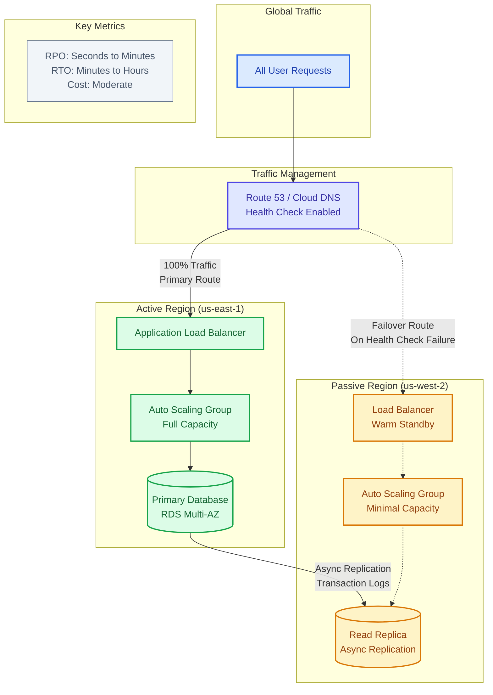
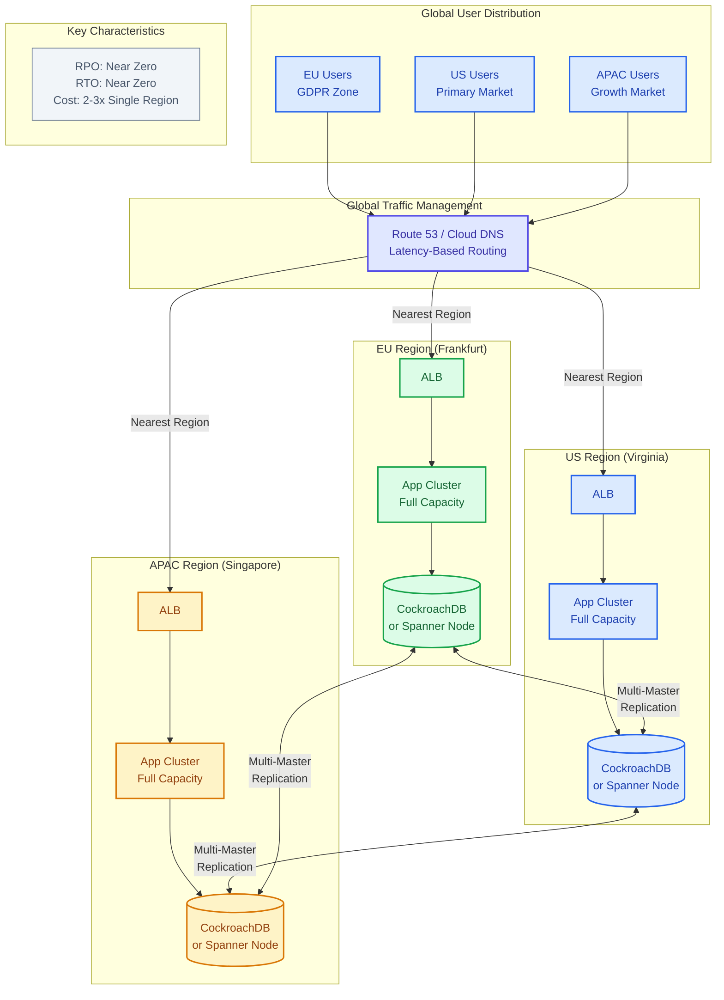
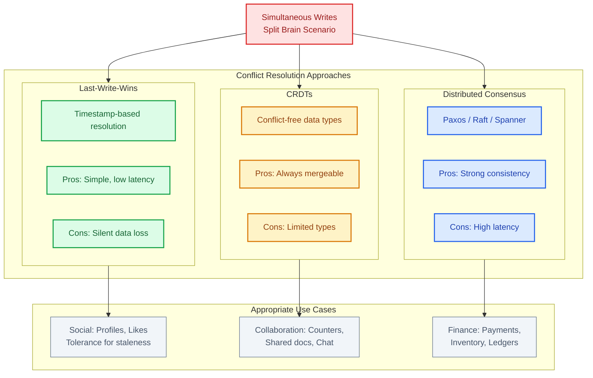
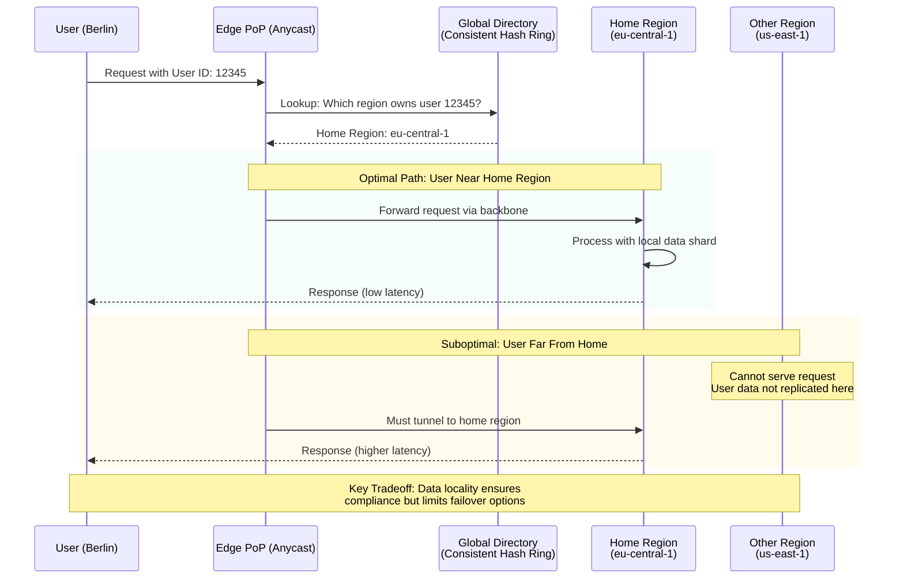

# Multi-Region Patterns

This guide covers 6 key areas: I. The Strategic "Why" Behind Multi-Region Architectures, II. Pattern A: Active-Passive (Failover), III. Pattern B: Active-Active (Global Availability), IV. Pattern C: Geo-Sharding (Partitioning), V. Key Technical Concepts for TPMs (The "Deep Dive" Vocabulary), VI. Execution & Operational Excellence.

## I. The Strategic "Why" Behind Multi-Region Architectures

At the Principal TPM level, the decision to adopt a multi-region architecture is a "One-Way Door" decision. Once implemented, the operational overhead, data synchronization complexities, and infrastructure costs become permanent baselines for the product. Therefore, the "Why" must be rigorously defended against the "Cost of Complexity."

### 1. Availability and Blast Radius Containment
While "Disaster Recovery" is the common term, at Mag7 scale, the strategic focus is **Blast Radius Containment**. The goal is not just to recover from a natural disaster, but to ensure that a bad deployment, a config error, or a gray failure in one region does not propagate to others.

*   **Technical Implementation:** This requires a "Shared-Nothing" architecture at the regional level. Ideally, Region A and Region B share no dependencies—not even a global control plane if possible.
*   **Mag7 Example:** **AWS** treats Regions as completely independent entities. A failure in `us-east-1` (N. Virginia) EC2 APIs should theoretically never impact `us-west-2` (Oregon). However, global services like IAM or Route53 represent "Global Blast Radii," which is why changes to these are gated with extreme rigor compared to regional service updates.
*   **Tradeoff:** **Operational Divergence.** Without a centralized control plane, configurations can drift between regions. You risk "snowflake" regions where `eu-central-1` behaves slightly differently than `us-east-1` due to patch levels or hardware generations.
*   **Business Impact:** Preservation of the Service Level Agreement (SLA). Moving from 99.9% (single region) to 99.99% or 99.999% (multi-region) availability. This directly correlates to enterprise contract penalties and reputation management.

### 2. Latency Reduction and the CAP Theorem
Physics is the ultimate constraint. For latency-sensitive applications (gaming, ad-bidding, financial trading), the speed of light dictates that you cannot serve a global user base from a single location with acceptable performance.

*   **Technical Implementation:** This often involves **Active-Active** architectures where users are routed to the nearest region via DNS (Geo-IP routing). The complexity arises in data consistency. You are effectively battling the CAP Theorem (Consistency, Availability, Partition Tolerance). To achieve low latency (Availability/Performance), you often must sacrifice strong Consistency.
*   **Mag7 Example:** **Meta (Facebook/Instagram)** uses a read-optimized architecture. When a user in London loads their feed, they read from a European data center (Edge/Region) for near-instant rendering. However, writes (comments/likes) might be asynchronously replicated back to a primary region in the US, or updated via a distributed database system like TAO that manages eventual consistency.
*   **Tradeoff:** **Data Consistency vs. Complexity.** Implementing "Eventual Consistency" requires application logic to handle stale data. If a user updates their profile in Tokyo, and immediately refreshes, they might see the old data if the replication lag is high. Handling "Read-your-writes" consistency in a multi-region setup requires complex sticky-session routing or distributed locking.
*   **ROI/CX Impact:** Amazon found that every 100ms of latency cost them 1% in sales. Google found similar drops in search traffic. The ROI here is calculated by: `(Conversion Uplift from Lower Latency) - (Cost of Multi-Region Infra)`.

### 3. Capacity scaling and "Hard" Limits
A strategic "why" often overlooked by smaller companies but critical for Mag7 is simply **running out of room**.

*   **Technical Implementation:** A single AWS Availability Zone (AZ) or Region has finite power and cooling capacity. If a service like **Google Search** or **Microsoft OpenAI Service** requires 100,000 GPUs, a single region may literally not have the rack space or power grid allocation to support it.
*   **Mag7 Example:** **Microsoft Azure** has faced capacity constraints in specific European regions where demand exceeded physical hardware supply. Multi-region architecture allows the business to "spill over" compute tasks to regions with excess capacity, even if latency is suboptimal, to prevent service denial.
*   **Tradeoff:** **Data Transfer Costs.** Moving compute to where the capacity is (e.g., training an AI model in `us-east` while the data sits in `us-west`) incurs massive cross-region data egress fees.
*   **Business Capability:** Business Continuity and Uncapped Growth. It ensures the product's growth isn't throttled by the physical supply chain of a specific geography.

### 4. Data Sovereignty (The Legal "Why")
This is a binary constraint: either you comply, or you cannot operate in that market.

*   **Technical Implementation:** This requires **Data Sharding by Geography**. User data for German citizens must be tagged and pinned to Frankfurt servers. This breaks many "global user ID" assumptions in legacy codebases.
*   **Mag7 Example:** **TikTok (Project Texas)** and **Apple (Guizhou data center)**. To operate in China, Apple had to partner with a local firm to store iCloud keys within China. Similarly, Salesforce and Microsoft offer "Government Clouds" that are physically and logically isolated from their public commercial regions.
*   **Tradeoff:** **Feature Parity.** Often, sovereign clouds lag behind the main commercial regions in features because deploying new services requires specific compliance audits (FedRAMP High, etc.). It creates a fragmented product experience.
*   **Business Impact:** Total Addressable Market (TAM). Without multi-region sovereignty capabilities, the product cannot be sold to governments, healthcare, or financial sectors in the EU or APAC.

## II. Pattern A: Active-Passive (Failover)

In the Active-Passive architecture, all write traffic (and usually all read traffic) is directed to a single "Active" region (e.g., `us-east-1`). A second "Passive" region (e.g., `us-west-2`) maintains a near-real-time copy of the data but handles no live traffic until a failover event occurs.

This is the default starting point for Disaster Recovery (DR) strategies at Mag7 companies for Tier-1 non-critical services or Tier-2 services because it balances implementation complexity with reasonable recovery capabilities.

### 1. Data Replication Strategy: The RPO Tradeoff

The technical backbone of Active-Passive is **Asynchronous Replication**. You cannot use synchronous replication across cross-continental regions without incurring a massive latency penalty (speed of light constraints).

*   **How it works:** The application writes to the Primary DB in Region A. The Primary acknowledges the write to the user immediately. In the background, the database ships transaction logs to the Replica DB in Region B.
*   **The "Lag" Reality:** There is always a replication lag, typically ranging from milliseconds to seconds.
*   **Mag7 Example:** **Amazon RDS** or **Aurora Global Database**. When you set up a cross-region read replica, AWS handles the log shipping. However, during a massive write event (e.g., Prime Day lightning deal), replication lag can spike.
*   **Business Impact (RPO):** The Recovery Point Objective (RPO) is non-zero. If Region A is vaporized by a meteor, **you will lose data**—specifically, any data committed in Region A that hadn't yet arrived in Region B.
*   **Tradeoff:** 
    *   *Choice:* Asynchronous Replication.
    *   *Benefit:* User experience in Region A is fast (low latency); no waiting for Region B to confirm.
    *   *Cost:* Potential data loss during catastrophic failure.

### 2. Infrastructure Readiness: Pilot Light vs. Warm Standby

A Principal TPM must define the "Passiveness" of the secondary region. This is a direct dial between **Cost** and **Recovery Time Objective (RTO)**.

#### A. Pilot Light
Only the data layer (databases, object storage) acts as a replica. The compute layer (EC2, Kubernetes clusters) is either turned off or non-existent.
*   **Failover Behavior:** When Region A fails, automation must provision/boot thousands of servers in Region B before traffic can be routed.
*   **ROI/Tradeoff:** Lowest cost (no idle compute), but highest RTO (can take 30+ minutes to boot and warm up caches).
*   **Mag7 Use Case:** Internal tooling, HR systems, or non-user-facing analytics pipelines where an hour of downtime is acceptable to save millions in infrastructure costs.

#### B. Warm Standby
The data layer is replicated, and a *scaled-down* version of the compute layer is running in Region B (always on).
*   **Failover Behavior:** The infrastructure is already running. You simply scale it up (Auto Scaling Groups) to handle full production traffic.
*   **ROI/Tradeoff:** Higher cost than Pilot Light, but significantly lower RTO (minutes).
*   **Mag7 Use Case:** **Netflix** control plane services. You cannot wait 45 minutes for the ability to log in to be restored. A minimal footprint runs in the passive region, ready to scale up rapidly.

### 3. The Failover Event: "Thundering Herd" & Capacity Risks

The most critical risk in Active-Passive is not the technology, but the **Capacity Planning**.

*   **The Scenario:** Region A fails. You swing DNS to Region B. Suddenly, 100% of global traffic hits Region B.
*   **The Risk:** If Region B was running as a "Warm Standby" at 5% capacity, a sudden 100% load will DDoS your own service before it can scale up. The service crashes immediately upon failover.
*   **Mitigation:** 
    *   **Pre-warming:** Mag7 operational playbooks often include "pre-warming" procedures (contacting the cloud provider to warm load balancers) or maintaining a higher baseline in the passive region (Headroom).
    *   **Throttling/Shedding:** During failover, the system may intentionally drop non-critical traffic (e.g., Facebook might allow you to view the feed but disable video uploads) to preserve core functionality.
*   **Business Impact:** Failover is rarely seamless. It usually involves a period of degraded performance (Brownout) while the passive region absorbs the load.

### 4. Split-Brain Syndrome and the "Human Decision"

At the Principal level, you must advocate for **Manual Failover Triggers** in Active-Passive setups.

*   **The Problem:** Automated failover relies on health checks. If a network partition occurs (the fiber between US-East and US-West is cut), US-West might *think* US-East is down. If US-West automatically promotes itself to "Active," you now have **two** active regions accepting writes. This is "Split Brain."
*   **The Consequence:** When the network heals, you have conflicting data (User X bought Item Y in East, but bought Item Z in West). Reconciling this is an engineering nightmare often requiring manual database surgery.
*   **Mag7 Behavior:** At Google and Amazon, failing over an entire region is almost always a human decision (executive approval required). The cost of a false-positive failover (data corruption, confusion) is often higher than 10 minutes of downtime.

### 5. Summary of Tradeoffs

| Feature | Active-Passive Implication |
| :--- | :--- |
| **Complexity** | Moderate. Easier than Active-Active, but requires robust failover scripts. |
| **Cost** | Moderate. You pay for data replication + idle/warm compute. |
| **Latency** | Good for local users (Active region), Poor for remote users (Active region is fixed). |
| **Data Consistency** | Eventual (Async). Risk of data loss on disaster. |
| **Availability** | High, but dependent on RTO (how fast you can switch). |

## III. Pattern B: Active-Active (Global Availability)

### 1. Architectural Overview and The "Write Anywhere" Challenge

In an Active-Active architecture, traffic is distributed across multiple regions, and all regions are capable of serving read and write requests simultaneously. Unlike Active-Passive, there is no "standby" region; every deployed environment is live.

For a Principal TPM, the critical distinction lies in how **writes** are handled. Serving global *reads* is trivial (CDN/Read Replicas). Allowing a user to *write* to a database in `eu-central-1` while another user writes to the same record in `us-east-1` introduces the "Multi-Master" or "Bi-Directional Replication" problem.

**The Core Mechanism:**
1.  **Traffic Routing:** DNS (e.g., AWS Route53) or Anycast IP routes the user to the geographically nearest region to minimize latency.
2.  **Local Processing:** The application processes the request locally.
3.  **Asynchronous Replication:** The data change is committed locally and then asynchronously replicated to all other regions.

**Mag7 Example:**
**Uber's Trip Data.** When a user requests a ride, that write operation (creation of a trip intent) must happen fast. Uber originally used a sharded architecture where users were pinned to a region, but moved toward more globally available storage solutions (like Schemaless/Docstore) to allow high availability. If the US East region fails, the app must seamlessly point to US West, and the user's trip state must be preserved.

### 2. Consistency Models and Conflict Resolution

The biggest risk in Active-Active is data divergence. If two regions accept writes for the same data simultaneously, you encounter a "Split Brain" scenario. You must choose a conflict resolution strategy, which directly impacts User Experience (CX) and Engineering Complexity.

**Strategy A: Last-Write-Wins (LWW)**
*   **Mechanism:** Rely on timestamps. If Update A happens at 12:00:01 and Update B at 12:00:02, Update B overwrites A everywhere.
*   **Tradeoff:** Simple to implement, but data loss is possible (Update A is lost entirely).
*   **Use Case:** Updating a user profile bio or a "Like" count on Facebook. Absolute precision isn't critical; eventual consistency is acceptable.

**Strategy B: CRDTs (Conflict-Free Replicated Data Types)**
*   **Mechanism:** Data structures designed to always merge successfully (e.g., a counter that only increments).
*   **Tradeoff:** High engineering complexity; limited data types supported.
*   **Use Case:** **Discord** read receipts or chat history merging.

**Strategy C: Distributed Consensus (Paxos/Raft/Spanner)**
*   **Mechanism:** A write is not committed until a majority of regions acknowledge it.
*   **Mag7 Example:** **Google Spanner**. It uses atomic clocks (TrueTime API) to guarantee external consistency globally.
*   **Tradeoff:** **High Latency.** A write in New York might wait for an acknowledgement from London. This sacrifices the "Latency Reduction" pillar for "Data Consistency."

### 3. Infrastructure and Capacity Planning (The "Thundering Herd")

A common failure mode in Active-Active architectures is cascading failure during a regional outage.

**The Scenario:**
You have two regions, US-East and US-West, each running at 60% capacity. US-East goes down. Traffic automatically reroutes to US-West.
*   **Result:** US-West now receives 120% traffic load. It crashes immediately.

**The Principal TPM Requirement:**
You must enforce **N+1 Capacity Planning**. If you have two regions, each must operate at maximum 50% capacity (or have auto-scaling pre-warmed) to absorb the failure of the other.
*   **ROI Impact:** This effectively doubles your compute bill. You are paying for 50% idle capacity as an insurance policy.
*   **Business Capability:** This guarantees 99.999% (5 nines) availability, required for critical paths like **Amazon Checkout** or **Azure Login**.

### 4. Data Residency and Sharding (Cellular Architecture)

While "Active-Active" implies global access, legal compliance often breaks this pattern.

**GDPR/Data Residency Constraints:**
You cannot replicate German health data to a US region. Therefore, a "Global Active-Active" system is often actually a **Cellular Architecture**.
*   **Implementation:** The application code is identical globally, but the data store is sharded. European users are pinned to EU regions; US users to US regions.
*   **Failure Mode:** If the EU region burns down, EU users go offline. You cannot failover to the US due to legal constraints.
*   **Tradeoff:** You prioritize **Compliance** over **Availability**.

### 5. Tradeoff Analysis Summary

| Feature | Active-Active Impact | Tradeoff/Cost |
| :--- | :--- | :--- |
| **Availability** | Maximum (RTO/RPO near zero). | **Cost:** Requires 2x+ infrastructure provisioning (over-provisioning for failover). |
| **Latency** | Lowest (Users routed to nearest region). | **Complexity:** Handling "Read-after-Write" issues (User updates profile, refreshes, hits different region, sees old profile). |
| **Data Integrity** | High Risk of Conflicts. | **Engineering Skill:** Requires senior distributed systems engineers to manage conflict resolution and replication lag. |
| **Maintenance** | Complex. Deployments must be staggered. | **Velocity:** Slower release cycles to ensure a bad deploy doesn't break all regions simultaneously. |

### 6. Edge Cases and Failure Modes

**1. Replication Lag & The "Ghost Read"**
*   *Scenario:* A user adds an item to their cart in Region A. The replication to Region B takes 500ms. The user refreshes the page in 200ms and is routed (via DNS round-robin) to Region B.
*   *Result:* The cart appears empty. The user panics or re-adds the item.
*   *Solution:* **Sticky Sessions** (pin user to a region for the duration of a session) or **Global Session Caching** (e.g., a global Redis layer, though this introduces a new single point of failure).

**2. The Split-Brain Network Partition**
*   *Scenario:* The fiber cable under the Atlantic is cut. US and EU regions are both up, but cannot talk to each other.
*   *Result:* Both regions accept conflicting writes. When the cable is fixed, the database cannot automatically merge the data.
*   *Solution:* Implementation of a "Circuit Breaker" that puts one region into Read-Only mode if it loses contact with the quorum, or manual reconciliation tools (very expensive operationally).

## IV. Pattern C: Geo-Sharding (Partitioning)

### 1. Architecture Overview: The "Silo" Approach

Geo-sharding (or Geo-partitioning) differs fundamentally from Active-Active replication. In Active-Active, data is replicated across regions, and any region can theoretically serve any user. In **Geo-Sharding**, a specific user's data is pinned to a specific "Home Region." The request *must* be processed in that region.

This is a "Shared-Nothing" architecture at the regional level. If a user is mapped to `eu-central-1` (Frankfurt), the application servers in `us-east-1` (N. Virginia) do not have the data required to serve them.

**The Routing Mechanism:**
Traffic routing relies on a **Global Directory Service** (or Lookup Service).
1.  **Ingress:** The user hits a global endpoint (e.g., via Anycast DNS).
2.  **Lookup:** The Edge layer checks the Directory to find the user's Home Region.
3.  **Routing:** The request is tunneled to the specific regional data center.

### 2. Strategic Drivers and Business Capabilities

As a Principal TPM, you would advocate for this pattern primarily when **Regulatory Compliance** or **Data Sovereignty** outweighs the need for global failover.

*   **Data Residency (The Primary Driver):** Many jurisdictions (Germany, India, China) require PII (Personally Identifiable Information) to stay within physical borders.
    *   *Mag7 Example:* **Microsoft Office 365** and **Salesforce** use geo-sharding to sell to government entities. A German government agency's emails are physically stored in German data centers and generally are not replicated to the US, ensuring compliance with strict privacy laws.
*   **Blast Radius Reduction:** By isolating users into regional silos, a catastrophic software bug or infrastructure failure in one region affects *only* the users sharded to that region.
    *   *Mag7 Example:* **Discord** (while not Mag7, operates at similar scale) and gaming companies (like **Riot Games**) shard voice/game servers by region. If the "US-East" shard fails, European players are completely unaffected because there is no shared state or cross-region dependency.

### 3. Tradeoffs and Technical Challenges

The decision to Geo-Shard introduces specific rigidity into the system that the TPM must manage.

#### The Availability vs. Compliance Tradeoff
In an Active-Active system, if `us-east-1` fails, traffic shifts to `us-west-2`. In a Geo-Sharded system, if the Home Region fails, the user is **down**.
*   **The Conflict:** You cannot failover the user to another region without violating the data residency promise that justified the architecture in the first place.
*   **TPM Decision Point:** You must define the "Break Glass" protocol. In a catastrophic event, does the business prioritize uptime (move data to a backup region and pay regulatory fines) or compliance (stay down until the region recovers)? This is a legal/business decision, not just engineering.

#### The "Global Directory" Single Point of Failure (SPOF)
The entire architecture relies on the mapping service that says "User A belongs to Region B."
*   **Risk:** If the Global Directory goes down, no users can be routed, resulting in a global outage even if the regional shards are healthy.
*   **Mitigation:** This directory must be highly replicated (often using Paxos/Raft consensus algorithms like Google's Spanner or strictly consistent key-value stores) and cached aggressively at the Edge.

#### Capacity Planning and "Hot Shards"
Unlike global pools where traffic is fluid, shards are rigid.
*   **The Problem:** If a specific region (e.g., `ap-south-1` during a cricket final on **Disney+ Hotstar**) experiences a usage spike, you cannot "burst" into other regions because the data is pinned.
*   **Business Impact:** This requires higher capacity buffers (CapEx) per region, as you lose the statistical multiplexing benefits of a global fleet.

### 4. Implementation Checklist for Principal TPMs

When overseeing the rollout of a Geo-Sharded architecture:

1.  **User Migration Strategy:** How do you move a user? If a user moves from London to New York permanently, their "Home Region" should eventually change to reduce latency. This requires a "Move Tool" that locks the account, copies data cross-Atlantic, verifies integrity, and updates the Global Directory. This is complex and prone to data corruption.
2.  **Cross-Shard Communication:** How does User A (USA) send a message to User B (EU)? The application logic must handle cross-region RPC calls. This introduces latency and complexity in the aggregation layer.
3.  **Tiered Resiliency:**
    *   *Tier 1 (Region Local):* High Availability within the region (Availability Zones).
    *   *Tier 2 (Region Failover):* **Passive** replication to a backup region within the same geopolitical boundary (e.g., `us-east-1` to `us-west-2` is okay; `eu-central-1` to `us-east-1` is not).

### 5. Summary of Impacts

| Dimension | Impact |
| :--- | :--- |
| **ROI / Cost** | **Medium.** Cheaper than Active-Active (less data replication transfer costs), but higher compute buffers required per region due to lack of global load balancing. |
| **CX (Latency)** | **High (Positive).** Users are almost always served by the closest region. |
| **Availability** | **Lower.** If a region dies, those users are down. No global failover safety net. |
| **Skill Requirement** | **High.** Requires sophisticated routing logic and strict governance on data placement. |

## V. Key Technical Concepts for TPMs (The "Deep Dive" Vocabulary)

At the Principal TPM level, technical fluency is not about knowing how to implement an algorithm, but understanding the **architectural constraints** that dictate product feasibility, timeline, and cost. You must possess the vocabulary to challenge engineering leads on "why" a specific pattern is chosen and be able to translate technical debt into business risk.

### 1. Consistency Models: Beyond the CAP Theorem
While most TPMs know the CAP theorem (Pick two: Consistency, Availability, Partition Tolerance), Mag7 architectures operate on the more nuanced **PACELC** theorem: In the case of a Partition (P), one has to choose between Availability (A) and Consistency (C), but else (E), even when the system is running normally, one has to choose between Latency (L) and Consistency (C).

*   **Strong Consistency:** All reads receive the most recent write or an error.
    *   *Mag7 Example:* **Google Spanner** (used for Google Ads and Play). When an advertiser updates a bid, it must be reflected globally immediately to prevent under/overcharging.
    *   *Tradeoff:* Higher latency (write must commit to multiple replicas) and lower availability (if the leader node is down, writes stop).
    *   *Business Impact:* Essential for billing and inventory (preventing overselling). High ROI for high-stakes transactional data; poor ROI for social feeds due to latency costs.
*   **Eventual Consistency:** Reads may return stale data for a short window ("convergence time").
    *   *Mag7 Example:* **Facebook News Feed**. If a user posts a photo, it is acceptable if a friend in a different region sees it 2 seconds later.
    *   *Tradeoff:* High availability and low latency vs. data staleness.
    *   *Business Impact:* Maximizes user engagement (never shows an error page). However, it introduces "complexity creep" in the application layer, as developers must write code to handle stale data scenarios.

### 2. Idempotency: The Financial Safety Net
Idempotency guarantees that making the same API request multiple times produces the same result. This is the single most critical concept for TPMs managing payments, inventory, or external integrations.

*   **The Mechanism:** The client generates a unique "idempotency key" (UUID) for a request. The server checks if it has already processed a request with that key. If yes, it returns the stored result without re-executing the logic.
*   **Mag7 Example:** **Stripe** or **Amazon Pay**. If a user clicks "Buy Now" on Prime Day and the network times out, the app retries the request. Without idempotency, the user is charged twice. With idempotency, the second request is recognized as a retry and returns "Success" without a second charge.
*   **Tradeoff:** Requires state management (storing keys and results for a set duration, e.g., 24 hours). This increases storage costs and database write throughput.
*   **Business Impact/ROI:** drastically reduces Customer Support volume regarding double-charges (high OPEX savings) and prevents inventory corruption. It is non-negotiable for fintech products.

### 3. Sharding and "Hot Partitions"
When a dataset exceeds the capacity of a single database node (approx. 2-4TB or specific IOPS limits), it must be split horizontally (sharded). The "Sharding Key" determines where data lives.

*   **The "Justin Bieber" Problem (Hot Keys):** If you shard Instagram user data based on UserID, the shard containing Justin Bieber or Taylor Swift will melt down due to massive read/write volume compared to an average user.
*   **Mag7 Example:** **Twitter/X** and **Instagram**. They often use complex sharding strategies (e.g., sharding by media ID rather than user ID, or using "celebrity" look-aside caches) to distribute load evenly.
*   **Tradeoff:** Resharding (moving data when a shard gets full) is one of the riskiest operations in infrastructure. It often requires downtime or complex dual-write migration strategies that TPMs must schedule carefully.
*   **Business Impact:** Poor sharding strategies lead to "Thundering Herd" outages during peak events. A Principal TPM must ensure the sharding key aligns with *access patterns*, not just data size.

### 4. Asynchronous Event-Driven Architectures
Decoupling the "User Interaction" from the "Business Logic" using message queues (Kafka, SQS, Pub/Sub).

*   **The Mechanism:** When a user performs an action, the API returns "202 Accepted" immediately, and pushes a message to a queue. Background workers pick up the message to process the heavy lifting.
*   **Mag7 Example:** **Uber**. When a trip ends, the "End Trip" API call is fast. Behind the scenes, events are fired to: 1. Charge the credit card, 2. Email the receipt, 3. Update driver analytics, 4. Prompt for a rating. If the email service is down, the payment still succeeds.
*   **Tradeoff:** "Observability" becomes difficult. Tracing a bug is harder because the operation jumps across different services and timelines. It also introduces "Eventual Consistency" (the receipt might arrive 1 minute late).
*   **Business Impact:** Increases system resilience (fault isolation). If one non-critical subsystem fails, the core revenue-generating flow remains operational.

### 5. Caching Strategies (The Latency Mask)
Caching is the fastest way to improve performance and the easiest way to introduce bugs.

*   **Write-Through:** Data is written to the cache and DB simultaneously.
    *   *Pros:* Data is always fresh.
    *   *Cons:* Higher write latency.
*   **Look-Aside (Lazy Loading):** App checks cache; if missing, reads DB and updates cache.
    *   *Pros:* Resilient to cache failure.
    *   *Cons:* "Cache Stampede." If the cache clears (e.g., a deployment restart), thousands of requests hit the database simultaneously, potentially crashing it.
*   **Mag7 Example:** **Netflix**. Nearly all metadata (movie titles, thumbnails) is heavily cached. If the cache fails, Netflix has "fallback" mechanisms to serve a static or degraded experience rather than crashing the database.
*   **Business Impact:** Reduces database licensing/provisioning costs (ROI). Improves "Time to First Byte" (CX). A TPM must ask: "What is the TTL (Time to Live) of this data, and what happens when the cache empties?"

## VI. Execution & Operational Excellence

Operational Excellence at the Principal TPM level shifts from "managing tickets" to "managing systemic risk and reliability." At Mag7 companies, the scale of operations means that manual intervention is a failure mode. You are expected to design and enforce mechanisms that ensure software is deployed safely, monitored accurately, and recovered rapidly when (not if) it fails.

### 1. Progressive Delivery and Safe Deployment

At scale, "deploying to production" is not a binary event; it is a gradual process of exposure. The goal is to limit the "blast radius" of a bad change.

*   **The Mechanism: Canary and Zonal Deployments**
    *   **Phase 1 (One-Box):** Deploy the new artifact to a single host or container in a low-traffic zone.
    *   **Phase 2 (Zonal/Regional):** If metrics remain healthy, expand to a single Availability Zone (AZ), then a full Region.
    *   **Phase 3 (Global):** Gradually roll out to remaining regions over hours or days.
    *   **Mag7 Example:** **Amazon** enforces a "wave" deployment strategy. Code typically bakes in a `beta` environment, then hits a low-traffic region (e.g., `sa-east-1` or `ap-southeast-2`) before touching high-volume regions like `us-east-1`. A deployment pipeline might be blocked automatically if the "One-Box" generates a spike in HTTP 500 errors.
*   **Feature Flags (Decoupling Deploy from Release):**
    *   Code is deployed to servers but hidden behind a dynamic configuration flag. This allows you to turn features on/off instantly without a rollback or hotfix.
    *   **Mag7 Example:** **Facebook (Meta)** relies heavily on "Gatekeeper." A TPM might coordinate the rollout of a new News Feed algorithm to only 1% of users to monitor engagement metrics (Time Spent, Ad Clicks) before widening the gate.
*   **Tradeoff:**
    *   **Velocity vs. Safety:** Rigorous baking times (waiting 4 hours between zones) slow down Time-to-Market. However, at Mag7 scale, a 1% error rate on a bad deploy can impact millions of users instantly.
*   **Business Impact:**
    *   **ROI:** Prevents catastrophic revenue loss. If Amazon Retail goes down for 30 minutes due to a bad config push, the cost is millions of dollars.
    *   **CX:** Users rarely experience "hard down" outages; they might experience a glitch that is quickly reverted via feature flag toggles.

### 2. Observability and Incident Management (SEV Levels)

Monitoring tells you the system is down; observability tells you *why*. A Principal TPM must define the "signals" that trigger a response.

*   **Defining Severity (SEV) Levels:**
    *   **SEV 1 (Critical):** Critical business function unavailable (e.g., Checkout is broken, Ads are not serving). Requires immediate "all hands" response.
    *   **SEV 2 (High):** Feature degradation or high latency, but core flows work (e.g., Reviews aren't loading, but users can still buy).
    *   **SEV 3/4 (Medium/Low):** Minor bugs, internal tool issues.
*   **The "Call Leader" or Incident Commander (IC):**
    *   During a SEV1, technical hierarchy dissolves. The IC runs the call. Their job is not to debug, but to coordinate. They assign roles: "Communication Lead," "Operations Lead," "Subject Matter Expert."
    *   **Mag7 Example:** **Google SRE** culture dictates that the IC has absolute authority to order a rollback or traffic drain, even over the objection of a VP, to restore service health.
*   **Tradeoff:**
    *   **Alert Fatigue vs. Visibility:** If you alert on everything, engineers ignore the pager. If you alert on too little, you miss outages.
    *   **Cost:** High-cardinality observability (storing massive amounts of trace data) is expensive.
*   **Business Impact:**
    *   **MTTR (Mean Time To Resolution):** The primary metric for operational excellence. Reducing MTTR directly correlates to higher availability (e.g., moving from 99.9% to 99.99%).

### 3. The Correction of Error (COE) / Post-Mortem Culture

The difference between a mature organization and a chaotic one is how they handle failure. A Principal TPM owns the *process* of learning from failure.

*   **The Mechanism:**
    *   After every SEV1/SEV2, a document is written. It must answer:
        1.  **What happened?** (Timeline)
        2.  **Why did it happen?** (The "5 Whys" to get to the root cause).
        3.  **Why didn't we catch it?** (Testing gap).
        4.  **How do we prevent it from recurring?** (Action items).
    *   **Mag7 Example:** **Amazon's COE** process is rigorous. You cannot blame a human ("Developer A made a typo"). You must blame the system ("The tooling allowed a typo to be pushed to prod without validation").
*   **Actionable Items:**
    *   Action items must be "Mechanism" fixes, not "Intention" fixes.
    *   *Bad:* "Developers should be more careful."
    *   *Good:* "Implement a pre-commit hook that lints the config file and blocks the pipeline if syntax is invalid."
*   **Tradeoff:**
    *   **Engineering Hours:** Writing a high-quality COE takes time (often days). This subtracts from feature development time.
*   **Business Impact:**
    *   **Long-term Velocity:** By eliminating classes of errors, the system becomes more stable, allowing faster development in the future. Recurring outages destroy velocity.

### 4. Capacity Planning and Efficiency

Operations isn't just about uptime; it's about margin. A Principal TPM bridges the gap between Engineering (who wants infinite resources) and Finance (who wants to cut costs).

*   **The Mechanism:**
    *   **Forecasting:** Using historical data (Year-over-Year growth) to predict compute/storage needs.
    *   **Load Testing:** validating that the system can actually handle the forecasted load.
    *   **Mag7 Example:** **Netflix** performs "Chaos Engineering" (Chaos Monkey) to randomly terminate instances in production. This forces engineers to design systems that auto-scale and self-heal, ensuring capacity is utilized efficiently rather than statically provisioned.
*   **Tradeoff:**
    *   **Buffer vs. Waste:** Keeping 50% extra capacity "just in case" is safe but expensive. Running at 90% utilization is efficient but risky (spikes cause latency).
*   **Business Impact:**
    *   **COGS (Cost of Goods Sold):** Cloud infrastructure is often the second largest expense after headcount. A TPM who optimizes instance types (e.g., moving from Intel to ARM-based Graviton processors at AWS) can save millions annually, directly improving the company's gross margin.

---

## Interview Questions

### I. The Strategic "Why" Behind Multi-Region Architectures

### Q1: The "Anti-Pattern" Challenge
**Question:** "We are launching a new enterprise B2B service. The engineering lead argues we must launch in three regions (US, EU, APAC) on Day 1 for latency and reliability. As the Principal TPM, how do you evaluate this request, and under what circumstances would you argue *against* multi-region for launch?"

**Guidance for a Strong Answer:**
*   **Framework:** The candidate should apply an ROI and Complexity framework.
*   **The "No" Argument:**
    *   **Premature Optimization:** Multi-region adds 3x complexity to CI/CD, testing, and data schema management. On Day 1, feature velocity is usually more important than 50ms latency improvements.
    *   **Cost:** Triple the infrastructure cost with zero revenue to offset it.
    *   **Data Gravity:** If the customer's data lives in one region (e.g., their on-prem HQ), putting compute in APAC won't help if the database calls have to cross the ocean anyway.
*   **The Recommendation:** Propose a "Cell-Based" or single-region architecture with a CloudFront/CDN layer for static content to solve 80% of latency issues, while keeping the backend simple until product-market fit or specific contract requirements dictate otherwise.

### Q2: The Consistency/Availability Tradeoff
**Question:** "You are managing a payment platform at a Mag7 company. We are moving to an Active-Active multi-region architecture. How do you handle a scenario where a user tries to spend the same account balance in Region A and Region B simultaneously (double spend)? What are the tradeoffs?"

**Guidance for a Strong Answer:**
*   **Technical Recognition:** Identify this as a classic CAP Theorem problem. You cannot have Partition Tolerance, Availability, and Consistency simultaneously.
*   **The Solution:**
    *   **Option A (Strong Consistency/Global Locking):** Use a global distributed transaction (e.g., Google Spanner or 2-Phase Commit).
        *   *Tradeoff:* High latency. The transaction fails if the link between regions is down (sacrifices Availability).
    *   **Option B (Sharding/Home Region):** Assign every user a "Home Region." All writes for User X must go to Region A. If Region A is down, User X cannot transact.
        *   *Tradeoff:* Simpler data model, but user is down if their region is down.
    *   **Option C (Conflict Resolution):** Allow both writes, reconcile later.
        *   *Tradeoff:* Financial loss risk (double spend) or terrible UX (clawing back money).
*   **Principal Level Decision:** For payments, **Consistency is non-negotiable**. A strong answer advocates for **Option B (Home Region with failover)** or **Option A (Global Strong Consistency)**, explicitly rejecting "Eventual Consistency" for financial ledgers despite the latency penalty.

### II. Pattern A: Active-Passive (Failover)

### Question 1: The "False Positive" Dilemma
"We have a critical payment service running Active-Passive between Virginia and Oregon. Our monitoring detects a total outage in Virginia. However, checking external news, there are no reports of widespread AWS outages. As the Principal TPM, do you recommend triggering the automated failover immediately to minimize downtime, or do you wait? Walk me through your decision framework."

*   **Guidance for a Strong Answer:**
    *   **Identify the Trap:** Immediate action risks a "Split Brain" scenario if the monitoring is faulty or if it's a transient network glitch.
    *   **Verify:** The candidate should check "Canary" metrics (is it just our monitoring? is the load balancer actually rejecting traffic?).
    *   **Assess Impact:** Compare the cost of downtime (e.g., $100k/min) vs. the cost of data corruption/reconciliation (potentially weeks of engineering time + loss of customer trust).
    *   **Decision:** Most Principal TPMs would advise a "verify then execute" approach, likely waiting 2-5 minutes to confirm stability unless the outage is confirmed physically (e.g., "the datacenter is underwater"). They should advocate for a "Big Red Button" (human gate) rather than full automation for region-level failover.

### Question 2: RPO vs. RTO Negotiation
"Business stakeholders for a new messaging app want 'Zero Data Loss' (RPO=0) and 'Instant Failover' (RTO=0) if a region fails. However, they only have the budget for an Active-Passive architecture. How do you handle this requirement?"

*   **Guidance for a Strong Answer:**
    *   **Technical Reality Check:** Correctly identify that RPO=0 requires synchronous replication (Active-Active behavior), which is physically impossible/highly latent across large distances without massive performance hits. RTO=0 requires both regions to be fully scaled (Active-Active), which blows the budget.
    *   **Negotiation:** The candidate must explain the "CAP Theorem" constraints in business terms.
    *   **Proposed Solution:** Offer a compromise. "We can achieve RPO near-zero (seconds) and RTO in minutes with Active-Passive Warm Standby. To get RPO=0, we would need to accept high latency on every message sent, which hurts CX. Which is more important: User speed or zero theoretical data loss in a 10-year event?"
    *   **Business Alignment:** Frame the decision around ROI. Spending 3x the budget for a risk that happens once a decade is usually poor business strategy.

### III. Pattern B: Active-Active (Global Availability)

### Question 1: The Inventory Problem
"We are designing the inventory management system for a global e-commerce platform similar to Amazon Fresh. We have warehouses in multiple regions. We want an Active-Active architecture so users can buy items quickly. How do you handle the situation where there is only 1 item left in stock, and two users in different regions click 'Buy' at the exact same millisecond?"

**Guidance for a Strong Answer:**
*   **Identify the Constraint:** You cannot oversell physical inventory (unlike digital goods). Strong consistency is required here, not eventual consistency.
*   **Proposed Solution:** Propose a **Global Lock** or a **Master Region** for inventory counts (sharding by Product ID). For example, all writes for "Milk" go to Region A, all writes for "Eggs" go to Region B.
*   **Tradeoff Analysis:** Acknowledge that this adds latency for the user farthest from the master region for that specific item, but explain that this is a necessary business tradeoff to prevent overselling.
*   **Alternative:** Discuss "soft allocation" (hold the item locally) vs. "hard commit" (database transaction).

### Question 2: The Cost vs. Availability Debate
"Your VP of Engineering wants to move our User Metadata service (Usernames, Bios, Avatars) to a fully Active-Active global architecture to ensure 5-nines availability. However, the Finance team is blocking it due to a projected 3x cost increase. As a Principal TPM, how do you resolve this conflict?"

**Guidance for a Strong Answer:**
*   **Business Value Assessment:** Do not jump straight to technical implementation. Ask: Does the business *lose money* if avatars are unavailable for 10 minutes? Likely not.
*   **Tiered Architecture:** Propose a tiered SLA. Authentication (Login) must be Active-Active (critical path). Metadata (Avatars) can be Active-Passive or eventually consistent with lower redundancy.
*   **Quantify Risk:** Calculate the cost of downtime for this specific service. If downtime costs $10k/hour and the solution costs $1M/year, the investment is negative ROI.
*   **Negotiation:** Demonstrate the ability to bridge the gap between Engineering (reliability) and Finance (efficiency) by aligning the architecture to the actual business criticality of the data.

### IV. Pattern C: Geo-Sharding (Partitioning)

**Question 1: The "Hot Shard" Crisis**
"We have a geo-sharded architecture for a messaging app, partitioned by user location. A major event occurs in Brazil, causing traffic to the South America shard to spike 500% above provisioned capacity, resulting in cascading failures. The North American shard is sitting at 10% utilization. As the Principal TPM, how do you manage this incident in real-time, and what architectural changes do you propose for the long term?"

*   **Guidance:**
    *   *Immediate Action:* Acknowledge that you *cannot* simply route traffic to NA because the data isn't there. The immediate lever is **Load Shedding** (dropping non-critical requests) or degrading features (disable read receipts, typing indicators) to save the core message flow.
    *   *Long Term:* Propose "Cell-based Architecture" within the region (sharding the shard) to limit blast radius. Discuss implementing "Volatile Sharding" for stateless features—processing compute-heavy tasks in NA while keeping state in SA (if latency/compliance permits).

**Question 2: The Compliance vs. Uptime Dilemma**
"You own a SaaS platform serving banking clients in the EU. A fire destroys your primary Frankfurt data center. Your disaster recovery plan involves failing over to Dublin, but a new legal interpretation suggests this might violate a specific client's data residency contract. The client is down, losing $1M/hour. The VP of Engineering wants to flip the switch to Dublin. Legal advises against it. How do you resolve this?"

*   **Guidance:**
    *   *Framework:* This tests stakeholder management and risk assessment.
    *   *Resolution:* Do not make the decision alone. Convene the "Crisis Management Team" (Legal, Exec, Eng).
    *   *The "Strong" Answer:* Pre-work is key. A Principal TPM ensures these contracts have "Force Majeure" clauses or explicit "Emergency Failover" waivers *before* the fire starts. If not, you present the quantified risk: "Cost of downtime ($1M/hr + Reputation)" vs. "Cost of Breach (Fine + Legal action)." Usually, you engage the customer directly for an emergency waiver if possible. If not, you follow Legal's counsel—compliance often trumps revenue in banking.

### V. Key Technical Concepts for TPMs (The "Deep Dive" Vocabulary)

### Question 1: The Payment Retry Scenario
**"We are designing the payment flow for a new global marketplace. We are seeing a 1% network failure rate in emerging markets, leading to failed transaction confirmations. How would you architect the retry logic to ensure we collect revenue without double-charging customers?"**

*   **Guidance for a Strong Answer:**
    *   **Identify the core concept:** Immediately identify **Idempotency** as the required technical solution.
    *   **The "How":** Explain passing a unique `idempotency_key` (UUID) from the client. The server checks a high-speed store (like Redis) for this key before processing.
    *   **Edge Cases:** Discuss "Exponential Backoff" and "Jitter" for the retry mechanism to avoid dDoSing your own servers during a recovery.
    *   **Tradeoff/Business:** Acknowledge that strict consistency is required here (ACID transactions), and we accept higher latency to ensure financial accuracy. Mention the impact on Customer Support costs (reducing refund tickets).

### Question 2: The Celebrity Live-Stream
**"You are the TPM for a live-streaming platform. A major celebrity is about to start a stream, and we expect 5 million concurrent viewers to join within 60 seconds. Our current database sharding is based on `StreamID`. What risks do you foresee, and what architectural patterns should we pivot to?"**

*   **Guidance for a Strong Answer:**
    *   **Identify the bottleneck:** The "Hot Shard" problem. If sharding is by `StreamID`, all 5 million users hit the *same* database shard.
    *   **Proposed Solution:** Move away from direct DB reads. Implement a **Read-Through Cache** or **CDN** layer. The application should read from a cached state, not the DB.
    *   **Write Contention:** For the chat feature, sharding by `StreamID` will fail. Propose sharding chat messages by `UserID` or using a **Fan-Out** architecture where messages are batched before persistence.
    *   **Business Continuity:** Discuss "Degraded Mode." If the chat service melts down due to volume, the video stream must remain unaffected. Decouple these services (Asynchronous architecture).

### VI. Execution & Operational Excellence

### 1. The Catastrophic Outage
**Question:** "Imagine you are the TPM for a critical service (e.g., Identity/Login). A bad deployment has just caused a global outage, and users cannot log in. The rollback failed. The VP is pinging you for an ETA, and three engineering teams are arguing on the bridge about the root cause. Walk me through how you handle the next 30 minutes."

**Guidance for a Strong Answer:**
*   **Prioritize Mitigation over Resolution:** Do not waste time finding the *bug* (root cause); focus on restoring *service*. Can we failover to a different region? Can we turn off the feature via a flag?
*   **Command & Control:** Establish yourself (or designate someone) as the Incident Commander. Silence the arguing. Assign specific investigation tracks.
*   **Communication:** Manage the VP. "I will provide an update in 15 minutes. Please let the team work." Do not give an ETA unless you are certain.
*   **Aftermath:** Mention the COE/Post-Mortem process *after* the fire is out.

### 2. Balancing Velocity and Reliability
**Question:** "Your product team wants to move to a continuous deployment model to ship features faster, but your service has had three major stability incidents in the last quarter. Engineering leadership wants to freeze deployments. How do you resolve this conflict?"

**Guidance for a Strong Answer:**
*   **Reject Binary Thinking:** It is not "speed OR safety." It is "speed THROUGH safety."
*   **Data-Driven Assessment:** Analyze the three incidents. Were they caused by speed? Or lack of testing?
*   **Propose Guardrails:** Instead of a freeze (which kills morale and business value), implement "deployment gates."
    *   *Example:* "We will automate the canary stage. If error rates exceed 0.1%, the pipeline halts automatically."
*   **The Deal:** Negotiate a "Error Budget" (SRE concept). If the team stays within the availability target (e.g., 99.9%), they can deploy at will. If they burn the budget (too many outages), the freeze is automatically enforced until stability improves.

---

## Key Takeaways

- Review each section for actionable insights applicable to your organization

- Consider the trade-offs discussed when making architectural decisions

- Use the operational considerations as a checklist for production readiness
