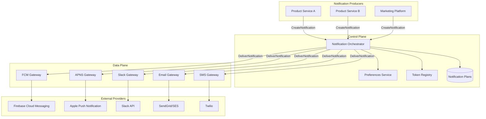
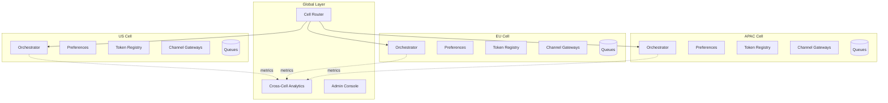
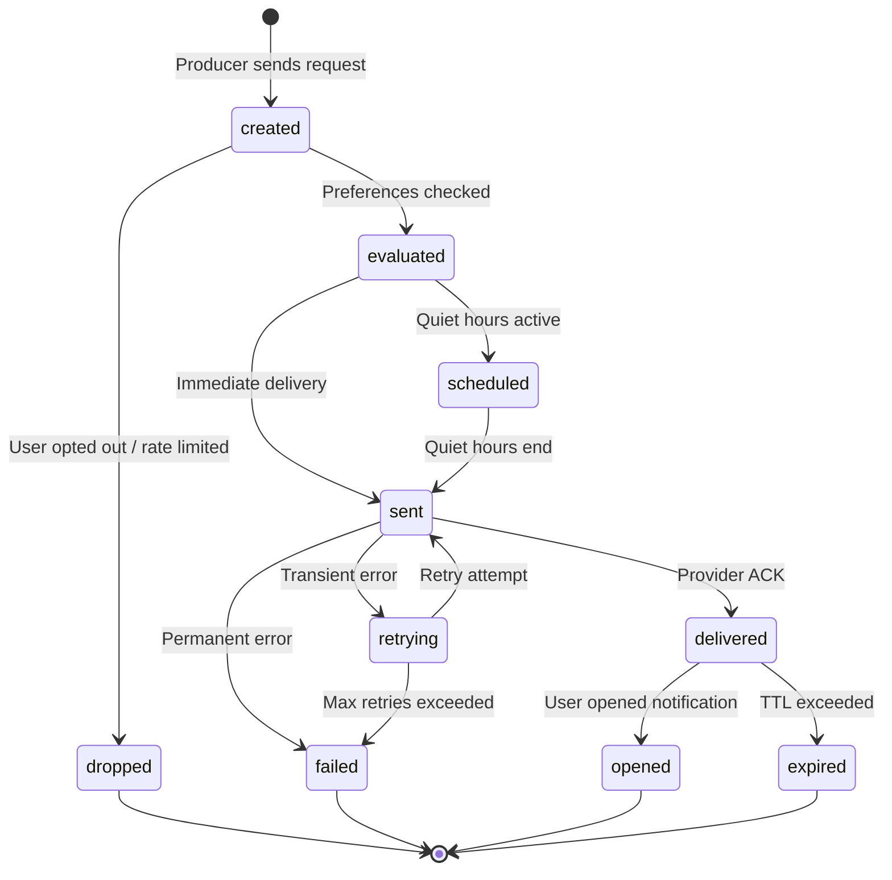
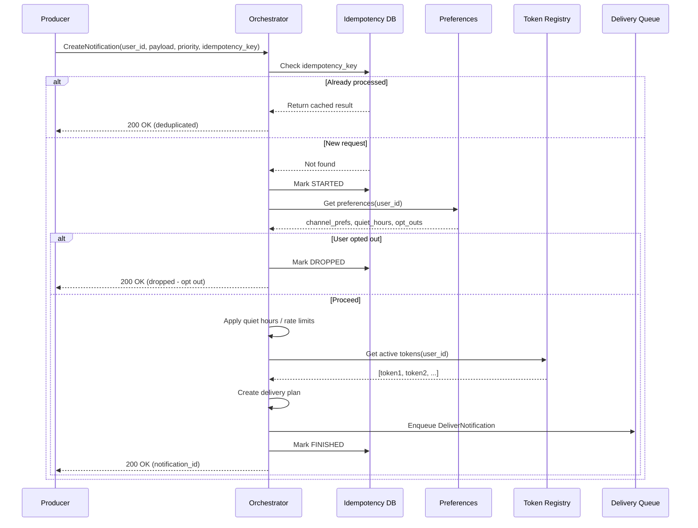
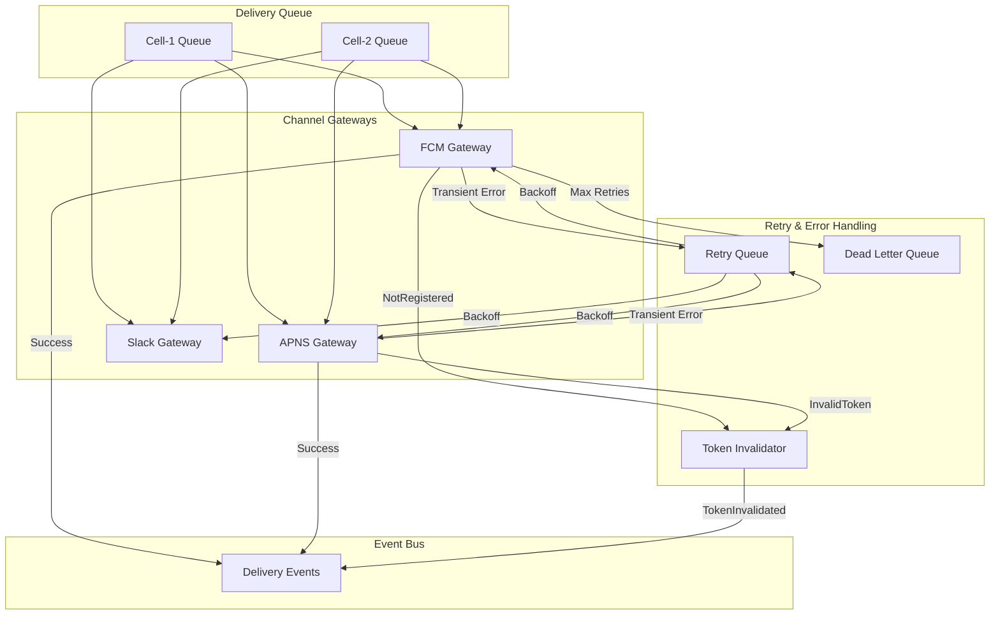
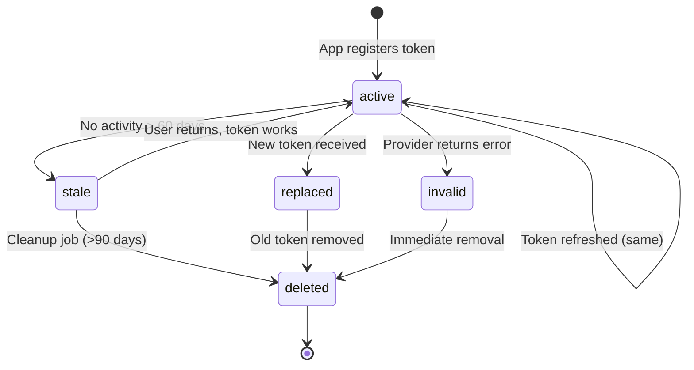
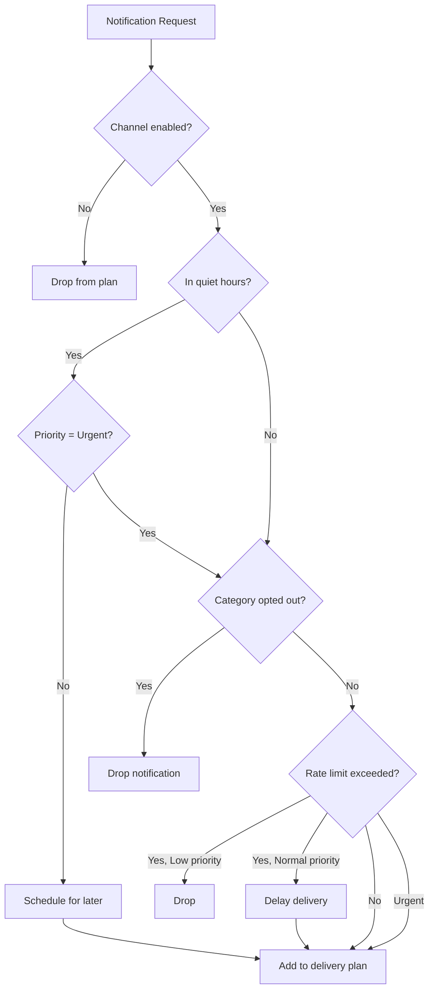
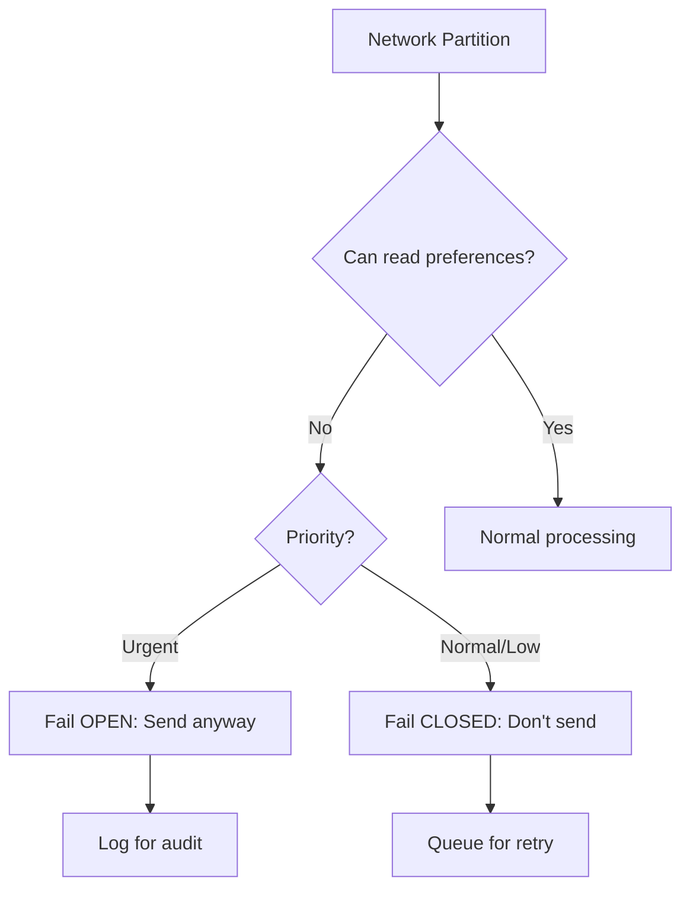
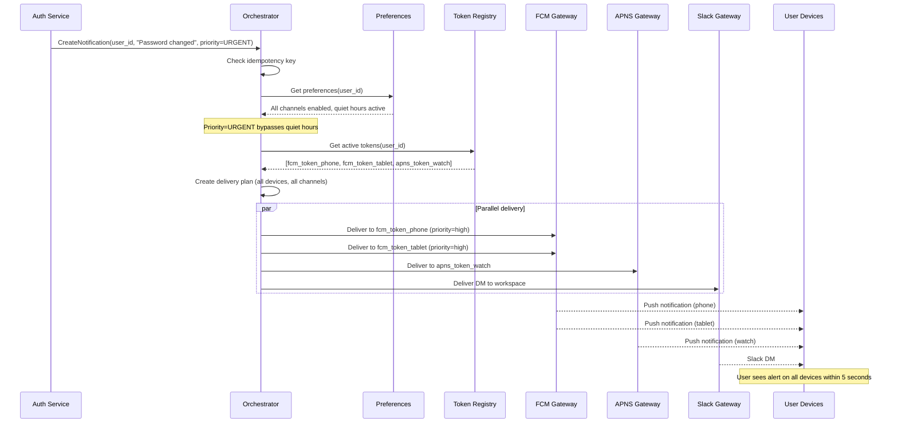

# Notification Platform System Design for Scale

## Why This Matters

Every modern application sends notifications—push notifications, emails, Slack messages, SMS alerts. But at scale, notifications become surprisingly hard:

1. **Diverse channels with different contracts.** FCM, APNS, email, SMS, and Slack each have different rate limits, delivery guarantees, error codes, and pricing models.
2. **User preferences are complex.** Quiet hours, per-channel opt-outs, category preferences, and rate limits create a combinatorial explosion of rules.
3. **Token churn is relentless.** Mobile device tokens rotate frequently, and stale tokens waste resources and pollute error metrics.
4. **Scale amplifies everything.** A misconfigured campaign can send millions of unwanted notifications in minutes, destroying user trust.

This document presents a comprehensive system design for a notification platform capable of handling millions of users across multiple channels. The design treats notifications as dedicated infrastructure with clear separation between control plane (orchestration, policy) and data plane (delivery, retries).

---

## 1. North Star Metric

**The problem:** With notifications, success isn't just "message delivered." A notification that arrives at 3 AM during quiet hours, or the 10th notification in an hour, isn't really successful—it's annoying.

**The solution:** A metric that captures both delivery and engagement:

> **North Star Metric:** Percentage of high-priority notifications successfully delivered and opened within X seconds, measured end-to-end per channel.

This metric matters because it captures:
- **Delivery reliability:** Messages actually reach devices
- **Timeliness:** Urgent notifications arrive quickly
- **Relevance:** Users engage (open) rather than dismiss or disable

---

## 2. High-Level Architecture

**The problem:** Notification systems easily become tangled messes where business logic, delivery logic, and retry logic are all mixed together. When FCM rate limits hit, you don't want recommendation notifications blocking security alerts.

**The solution:** Strict separation between control plane (configuration, orchestration, policy) and data plane (actual delivery). This mirrors how we design payment systems, but for messages instead of money.

### 2.1 Core Services

| Component | Plane | Responsibility |
|-----------|-------|----------------|
| **Notification Orchestrator** | Control | Routes and schedules notifications, applies policies, creates delivery plans |
| **Preferences Service** | Control | Manages user channel preferences, quiet hours, opt-outs, rate limits |
| **Token Registry** | Control | Stores FCM/APNS device tokens with lifecycle management (active, stale, invalid) |
| **Channel Gateways** | Data | FCM, APNS, Slack, Email, SMS delivery with retries and error handling |

### 2.2 Why This Separation Matters

**Control plane decisions (what to send, when, to whom):**
- Can I send to this user? (preferences check)
- What tokens/endpoints are active? (token lookup)
- Should I wait for quiet hours to end? (scheduling)
- Have I exceeded this user's rate limit? (policy enforcement)

**Data plane operations (actually sending):**
- Call FCM/APNS/Slack API
- Handle retries on transient errors
- Mark tokens invalid on permanent errors
- Emit delivery events for tracing

When FCM is rate-limited, only the FCM gateway backs off. The control plane continues processing other channels unaffected.

---

## 3. Cell-Based Architecture: Why One Global System Isn't Enough

**The problem:** A global notification system without partitioning is a single point of failure. A misconfigured marketing campaign in the US shouldn't knock out security alerts in Europe. Data residency laws (GDPR) require EU user data to stay in EU.

**The solution:** Cell-based architecture where each cell (US, EU, APAC) operates as a complete, independent notification system.

### 3.1 Blast Radius Containment

| Failure | Impact | Unaffected |
|---------|--------|------------|
| Misconfigured campaign in US cell | US cell queues, FCM rate limits | EU cell continues unaffected |
| FCM quota exhaustion | FCM gateway in affected cell | Slack/email delivery, other cells |
| Provider regional outage | Cells using that provider endpoint | Cells using different endpoints |

### 3.2 Data Residency Compliance

- EU user tokens and preferences stay in EU cell
- Cross-cell queries go through global aggregation layer
- Required for GDPR compliance

### 3.3 Partitioning Strategy (One-Way Door)

> **One-Way Door Decision:** Partitioning decisions are hard to change after launch. Choose carefully.

| Strategy | Use Case | Trade-offs |
|----------|----------|------------|
| **By Region (US, EU, APAC)** | Data residency, GDPR compliance | Requires cross-cell routing for global users |
| **By Tenant** | Multi-tenant SaaS isolation | Higher infrastructure overhead |
| **By hash(user_id)** | Even distribution | Complex cross-cell queries |

---

## 4. Data Model: The Foundation for Token Lifecycle

**The problem:** Device tokens change frequently (app reinstalls, OS updates, token rotation). Without proper lifecycle management, you end up with databases full of invalid tokens, wasted API calls to providers, and polluted error metrics.

**The solution:** Explicit data models for tokens, endpoints, preferences, and notification state—with lifecycle management built in.

### 4.1 Token Registry Schema

Each record represents a unique user-device-channel combination:

| Field | Type | Description |
|-------|------|-------------|
| `user_id` | string | User identifier |
| `device_id` | string | Device identifier |
| `provider` | enum | FCM, APNS |
| `token` | string | Push notification token |
| `status` | enum | active, stale, invalid |
| `last_seen_at` | timestamp | Last activity time |
| `last_error_code` | string | Last delivery error |
| `created_at` | timestamp | Token creation time |

**Key Invariants:**
- At most N active tokens per (user_id, device_id, provider)—enforced via upsert on token refresh
- Tokens older than staleness window (typically 60 days) are marked stale and excluded from routing
- Invalid tokens (from provider errors) are eventually deleted to reduce write amplification

### 4.2 User Preferences Schema

| Field | Type | Description |
|-------|------|-------------|
| `user_id` | string | User identifier |
| `channel_preferences` | map | Per-channel enabled/disabled |
| `quiet_hours` | object | Start/end times, timezone |
| `category_opt_outs` | list | Disabled notification categories |
| `rate_limits` | object | Max notifications per period |

### 4.3 Notification State Machine

Every notification moves through a defined state machine. Tracking state ensures you can answer "what happened to notification X?" at any point.

| State | Description |
|-------|-------------|
| `created` | Notification request received, pending evaluation |
| `evaluated` | Preferences checked, channels determined |
| `dropped` | Notification not sent (opt-out, rate limit, invalid user) |
| `scheduled` | Delayed due to quiet hours |
| `sent` | Delivered to provider API |
| `delivered` | Provider confirmed receipt |
| `opened` | User interacted with notification |
| `failed` | Permanent delivery failure |
| `retrying` | Transient failure, retry in progress |

---

## 5. Control Plane: Making Decisions About What to Send

The control plane handles configuration, orchestration, idempotency, and policy evaluation. It makes decisions about what to send, to whom, and through which channels—without actually sending anything.

### 5.1 Notification Intake Flow

1. Producer sends CreateNotificationRequest with user_id, payload, category, priority, and idempotency key
2. Orchestrator validates request and deduplicates based on (idempotency_key, origin)
3. Invalid requests are rejected immediately with appropriate error codes

### 5.2 Preference and Policy Evaluation

1. Fetch preferences for user_id from Preferences Service
2. **Check quiet hours:** If non-urgent and inside quiet period, schedule for later
3. **Filter channels:** Respect user's per-channel and per-category opt-outs
4. **Apply rate limits:** Prevent notification fatigue

### 5.3 Token Resolution

1. Resolve active FCM/APNS tokens from Token Registry, excluding stale and invalid
2. Resolve Slack endpoints where app is installed and authorized
3. Validate that resolved endpoints match planned channels

### 5.4 Routing and Fan-Out Plan

For each candidate channel, the orchestrator computes a delivery plan:

- **FCM/APNS:** Determine tokens per device, set priority flags (high vs normal)
- **Slack:** Choose between DM and channel mention based on use case
- Persist plan in NotificationPlan table for auditability

> **Consistency Requirement:** The control plane requires strong consistency for preferences and token state within a cell. If preferences cannot be read, fail closed for non-urgent notifications to avoid violating user opt-outs.

---

## 6. Data Plane: Actually Sending Notifications

The data plane handles the hot path: actual delivery, retries, and backoff. It contains minimal business logic and focuses on reliable message transmission.

### 6.1 Channel Gateway Operations

1. Gateways subscribe to delivery streams partitioned by cell_id and channel_type
2. Each gateway looks up channel-specific metadata (Slack bot token, FCM API key)
3. Calls provider API with appropriate flags (FCM priority=high for urgent)

### 6.2 Error Handling Strategy

**Permanent errors** (NotRegistered, InvalidRegistration): Mark token invalid immediately, stop retries, emit TokenInvalidated event.

**Transient errors**: Apply exponential backoff with jitter, enforce per-user and per-channel rate limits, retry up to configured max.

| FCM Error Code | Action | Rationale |
|----------------|--------|-----------|
| `NotRegistered` | Mark token invalid, stop retries | User uninstalled app or token expired |
| `InvalidRegistration` | Mark token invalid, stop retries | Token format is wrong |
| `MismatchSenderId` | Log error, investigate | Wrong FCM project |
| `Unavailable` | Retry with backoff | Transient FCM issue |

### 6.3 Delivery Events

All delivery attempts emit events tagged with notification_id for traceability:
- `sent` - Delivered to provider API
- `delivered` - Provider acknowledged receipt
- `failed` - Permanent failure
- `TokenInvalidated` - Token marked invalid

> **Consistency Trade-off:** The data plane can be eventually consistent for metrics and delivery events. Accept slightly delayed visibility in exchange for lower latency on the delivery path.

---

## 7. Device Token Management: The Hidden Complexity

**The problem:** Token churn and invalid token buildup are the biggest sources of latent bugs in notification systems. Tokens rotate when users reinstall apps, update iOS/Android, or when providers rotate them. Without cleanup, you accumulate millions of dead tokens.

**The solution:** Explicit lifecycle management with staleness detection and error-driven invalidation.

### 7.1 Token Lifecycle

### 7.2 Token Creation and Refresh

**When tokens arrive from the mobile app:**

1. **On app start:** Client retrieves current FCM token and sends to backend
2. **In onNewToken callback:** Firebase/APNS triggers when tokens rotate; client immediately sends new token

**Backend processing:**
- If existing token for (user_id, device_id, provider) differs, mark old as stale, new as active
- Update `last_seen_at` timestamp
- Reset `last_error_code`

### 7.3 Staleness Management

A background job runs daily per cell:

1. Scan tokens where `last_seen_at < now - staleness_window` (60 days)
2. Mark as stale, exclude from routing
3. **Don't delete immediately**—stale tokens may reactivate if user returns

Why not delete? If a user returns after 3 months and their token still works, you want to reach them. Mark stale, exclude from routing, but let the deletion job clean up truly abandoned tokens later.

### 7.4 COGS Impact

Stale token cleanup directly reduces:
- Outbound FCM/APNS API calls (each call costs money at scale)
- Error noise in monitoring
- Database storage

Run cleanup jobs on spot/preemptible compute—they don't affect user-perceived latency.

---

## 8. Channel Preferences and Priority Delivery

**The problem:** Users have different preferences for different channels and times. A security alert should bypass quiet hours; a marketing notification shouldn't. Getting this wrong leads to app uninstalls.

**The solution:** A three-tier priority model with clear semantics and explicit preference evaluation logic.

### 8.1 Priority Model

| Priority | Behavior | Examples |
|----------|----------|----------|
| **Urgent** | Deliver immediately to all enabled channels, bypass quiet hours | Security alerts, 2FA codes, critical incidents |
| **Normal** | Deliver based on preferences, respect quiet hours | Messages, comments, task updates |
| **Low** | Batch into digests, send at optimal times | Weekly summaries, recommendations |

### 8.2 Preferences Evaluation Logic

**Evaluation order:**
1. **Check channel_preferences:** If disabled, drop from plan
2. **Check quiet_hours:** If active and priority ≠ urgent, reschedule
3. **Check category opt-out:** If opted out, drop entirely
4. **Apply rate_limits:** Drop low priority, delay normal, always allow urgent

**Cache preferences** per-user with low TTL (5-15 minutes) to reduce database load while ensuring reasonably fresh data.

### 8.3 Priority-Based Delivery Strategy

**Urgent:** Send to all enabled real-time channels simultaneously. Mark FCM as high priority. Never batch or delay.

**Normal:** Pick primary channel based on recent user activity (push if mobile active, Slack if desktop active). Fall back to secondary channels only if primary fails.

**Low:** Batch into daily/weekly digests. Prefer in-app or email over push. Optimize send time based on historical engagement.

---

## 9. Consistency, CAP/PACELC, and SLOs

In distributed systems, you face fundamental trade-offs. **CAP** means choosing between Consistency and Availability during network partitions. **Strong consistency** means all nodes see the same data; **eventual consistency** means nodes converge over time. The choice depends on what's worse: stale data or unavailable data.

### 9.1 Consistency Choices by Component

| Component | Consistency | Rationale |
|-----------|-------------|-----------|
| Preferences Service | Strong (within cell) | User opt-outs must be respected immediately |
| Token Registry | Strong (within cell) | Avoid sending to invalid tokens |
| Delivery Events | Eventual | Metrics can lag; hot path matters |
| Analytics | Eventual | Cross-cell aggregation is batch |

### 9.2 Partition Behavior

- If control plane can't read preferences, **fail closed** for non-urgent (no notification sent)
- **Fail open** only for urgent notifications if business risk justifies it (security alerts)
- Cross-region analytics degrade gracefully—local delivery continues

### 9.3 Service Level Indicators

**Control Plane:**
- CreateNotificationRequest success rate (excluding client errors)
- Control-plane latency p95
- Preference read latency p95

**Data Plane:**
- Delivery success rate = delivered / sent, per channel, per priority
- Notification latency p95 = time from created to provider ACK for urgent
- Preference violation rate = notifications sent violating current preferences

### 9.4 Service Level Objectives

| Metric | Target |
|--------|--------|
| Urgent delivery latency (p95) | &lt;5 seconds |
| Normal delivery latency (p95) | &lt;30 seconds |
| Delivery success rate | >99.5% |
| Preference violation rate | &lt;0.01% |

### 9.5 Error Budget Actions

**If urgent delivery latency SLO burns > X% budget:** Freeze new notification feature rollouts, add capacity to gateways or queues, investigate saturation.

**If preference violation rate increases:** Shorten cache TTLs, add write-through semantics, implement cache invalidation on preference changes.

### 9.6 Golden Signals

| Signal | What to Monitor |
|--------|-----------------|
| **Latency** | Control-plane API response time, gateway provider call duration |
| **Traffic** | Notifications per user, per channel, per cell |
| **Errors** | Provider error codes, internal 5xx rates, invalid token ratio |
| **Saturation** | Queue depth per cell, thread pool utilization, vendor rate limit consumption |

### 9.7 Chaos Scenarios

| Scenario | Expected Behavior |
|----------|-------------------|
| Kill FCM access in one cell | Graceful degradation to Slack/email, bounded retries, token invalidation works, no SLO impact outside cell |
| Preferences DB unavailable | Fail closed for normal/low; urgent sends with audit log |
| Provider returns 100% errors | Circuit breaker opens, alerts fire, traffic shifts to backup channels |

---

## 10. Business Impact, COGS, and Organizational Considerations

### 10.1 Cost of Goods Sold (COGS) Levers

| Channel | Cost Model | Optimization |
|---------|------------|--------------|
| **FCM** | Free (basic), quotas at scale | Token cleanup, batching |
| **APNS** | Free (with Apple Dev Program) | Certificate management |
| **SMS** | Per-message, varies by country | Use only for urgent; prefer push |
| **Email** | Per-message (SendGrid, SES) | Batch digests, optimize templates |
| **Slack** | API limits, Enterprise Grid for heavy use | Rate limit awareness |

**Compute:** Run gateways with autoscaling; track per-cell utilization. Use spot instances for batch cleanup.

**Storage:**
| Tier | Retention | Use Case |
|------|-----------|----------|
| Hot | 30-90 days | Notification history for UX, debugging |
| Warm/Cold | 1+ years | Analytics, compliance |

### 10.2 Time to Value

> **MVP Scope:** Single-cell implementation with FCM + one additional channel (Slack or email), minimal preferences, and correct token lifecycle management.

> **Critical Early Investment:** Build the event model and observability (notification_id tracing) from day one. Essential for debugging.

### 10.3 Mag7 vs Non-Mag7

| Context | Characteristics |
|---------|-----------------|
| **Mag7** | Internal gateways; heavy cell-based infra. Emphasis on platformization: notification-as-a-service. |
| **Non-Mag7** | Heavier use of managed services (AWS SNS, SendGrid, Twilio). More aggressive cost focus. |

### 10.4 Role-Specific Focus

**Senior TPM:**
- Drive token lifecycle implementation to completion
- Ship preferences service with core functionality
- Establish SLOs and meet them in one region
- Coordinate mobile, backend, and channel teams

**Principal TPM:**
- Multi-region roadmap with cell partitioning strategy
- Regulatory posture (GDPR, data residency)
- Platform strategy: unify notification patterns across products
- Cost dashboards per tenant; identify anomalies
- Define one-way door decisions and establish review gates

---

## 11. Trade-Off Matrix

| Decision | Latency | Cost | Complexity | Risk |
|----------|---------|------|------------|------|
| Cell-based architecture | Neutral | Higher | Higher | Lower blast radius |
| Strong consistency for preferences | Higher | Higher | Higher | Lower preference violations |
| Eventual consistency for metrics | Lower | Lower | Lower | Slightly stale dashboards |
| Multi-device delivery | Neutral | Higher (more API calls) | Higher | Lower missed notifications |
| Token staleness marking vs delete | Neutral | Neutral | Higher | Lower risk of losing returning users |
| Priority-based routing | Neutral | Lower (batching) | Higher | Better UX |

---

## 12. End-to-End Example: Urgent Security Alert

**Scenario:** User changes password, triggering a security alert to all their devices.

**Key Points:**
1. Auth service triggers notification with URGENT priority
2. Orchestrator fetches preferences—quiet hours are active but bypassed due to priority
3. All active tokens retrieved (phone, tablet, watch)
4. Parallel delivery to all channels
5. User receives alert within SLO (&lt;5 seconds)

---

## 13. Interview Readiness

For interviews, you should be ready to:

- **Articulate the control plane / data plane separation** and why it matters for notification systems
- **Walk through the token lifecycle** including staleness detection and error-driven invalidation
- **Explain preference evaluation** with the priority model and quiet hours handling
- **Quantify impact** in terms of:
  - Delivery latency (urgent &lt;5s, normal &lt;30s)
  - Preference violation rate (&lt;0.01%)
  - COGS savings from token cleanup
  - Blast radius containment with cell architecture

---

## Key Takeaways

> **Control Plane / Data Plane Separation:** What to send (control) vs. how to send (data). When FCM has issues, it shouldn't affect your preference evaluation or Slack delivery.

> **Token Lifecycle is Non-Negotiable:** Stale and invalid tokens pollute metrics, waste API calls, and increase costs. Build lifecycle management from day one.

> **Priority Model Matters:** Urgent bypasses quiet hours; Low gets batched. Getting this wrong leads to app uninstalls or missed critical alerts.

> **Cell-Based for Blast Radius:** Regional cells contain failures and enable data residency compliance. This is a one-way door decision.

> **Fail Closed on Preferences:** If you can't read preferences, don't send non-urgent notifications. Violating user opt-outs destroys trust.
