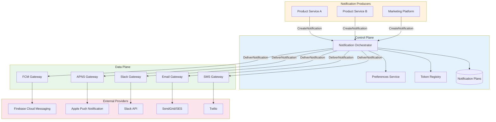
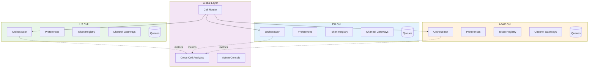
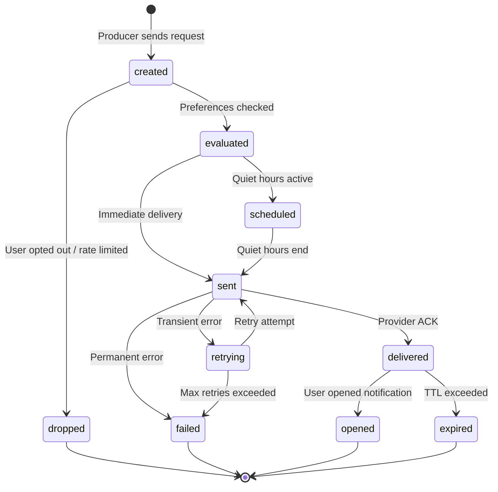
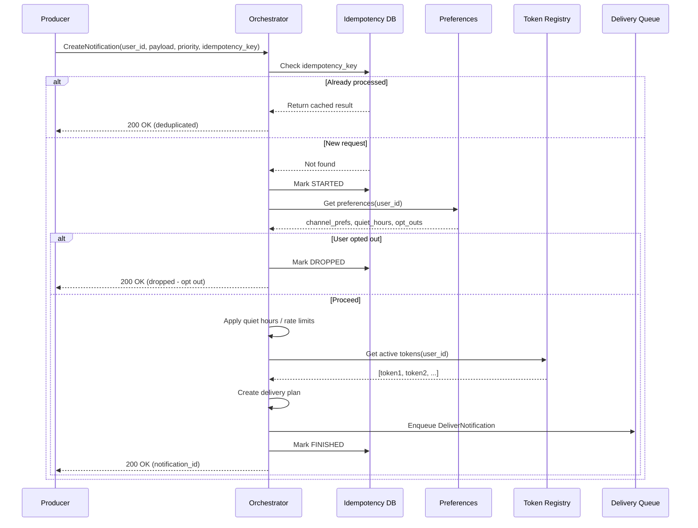
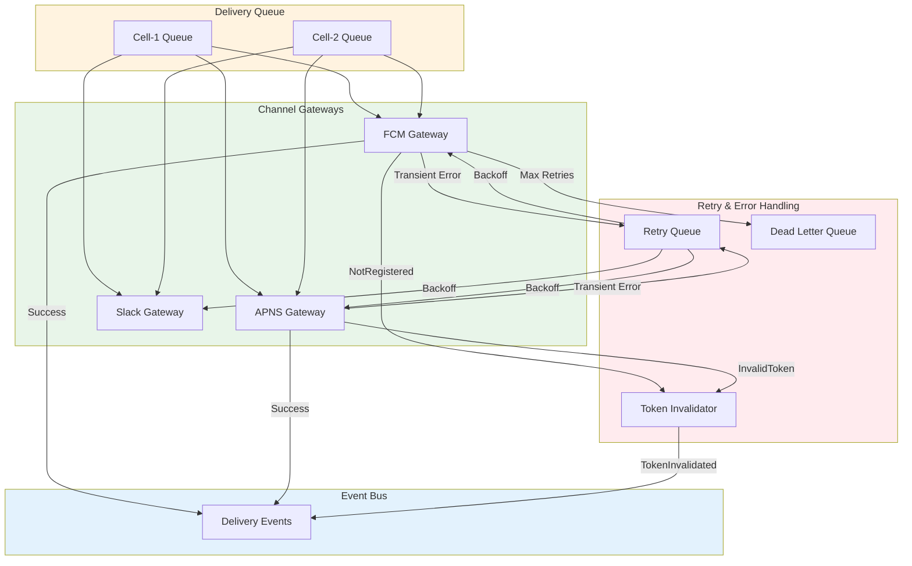
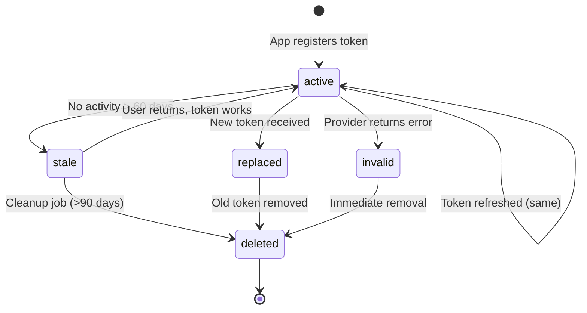
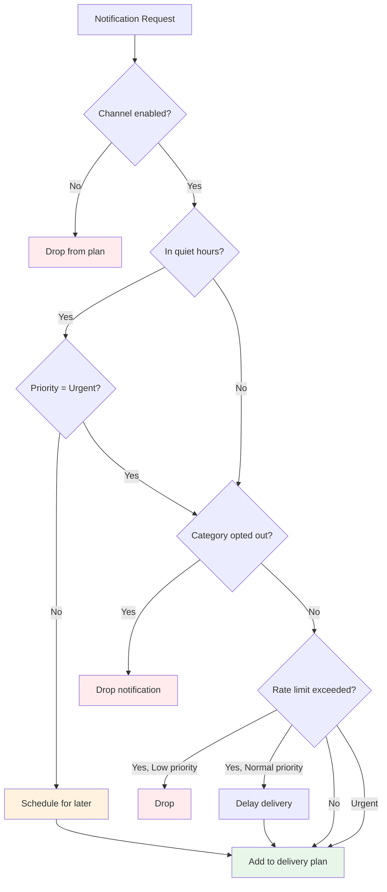
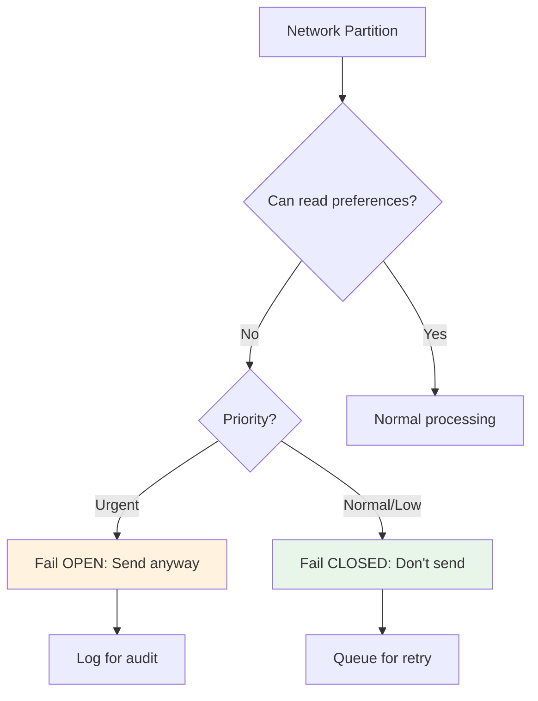
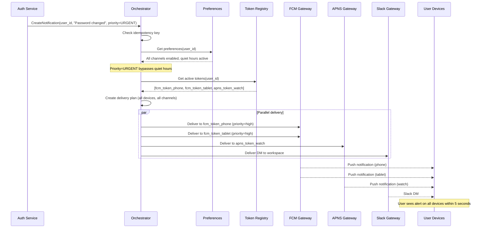

# Notification Platform System Design for Scale

This document presents a comprehensive system design for a notification platform capable of handling millions of users across multiple channels (FCM, APNS, Slack, email, SMS). The design treats notifications as dedicated infrastructure with clear separation between control plane (orchestration, policy) and data plane (delivery, retries), cell-based partitioning for blast radius containment, and explicit consistency boundaries.

## North Star Metric

> **North Star Metric**
>
> Percentage of high-priority notifications successfully delivered and opened within X seconds, measured end-to-end per channel.

---

## 1. High-Level Architecture

At scale, a notification platform requires a strict separation between control plane (configuration, orchestration, policy) and data plane (actual delivery). The system uses cell-based partitioning to contain failures and ensure that problems in one region or tenant do not cascade globally.

### 1.1 Core Services Overview

The architecture consists of:

| Component | Plane | Responsibility |
|-----------|-------|----------------|
| **Notification Orchestrator** | Control | Routes and schedules notifications, applies policies |
| **Preferences Service** | Control | Manages user channel preferences, quiet hours, opt-outs |
| **Token Registry** | Control | Stores FCM/APNS device tokens with lifecycle management |
| **Channel Gateways** | Data | FCM, APNS, Slack, Email, SMS delivery with retries |

### 1.2 Cell-Based Architecture

The system partitions by tenant or region, running a complete slice of all services per cell. This architecture provides several critical benefits:

| Benefit | Description |
|---------|-------------|
| **Blast radius containment** | A misconfigured campaign or provider issue in one cell cannot affect other cells |
| **Data residency compliance** | Regional cells align with cross-border data transfer requirements (GDPR) |
| **Independent scaling** | Each cell scales based on its own traffic patterns |
| **Operational isolation** | Deployments and maintenance can be performed per-cell without global impact |

---

## 2. Data Model

> **One-Way Door Decision**
>
> The data model represents a one-way door decision—schema changes are expensive and risky once in production. The design must support token lifecycle management, channel-specific endpoints, user preferences, and notification state tracking.

### 2.1 Token Registry Schema

Each record represents a unique user-device-channel combination:

| Field | Type | Description |
|-------|------|-------------|
| `user_id` | string | User identifier |
| `device_id` | string | Device identifier |
| `provider` | enum | FCM, APNS |
| `token` | string | Push notification token |
| `status` | enum | active, stale, invalid |
| `last_seen_at` | timestamp | Last activity time |
| `last_error_code` | string | Last delivery error |
| `created_at` | timestamp | Token creation time |

**Key Invariants:**
- At most N active tokens per (user_id, device_id, provider) combination, enforced via upsert on onNewToken flows
- Tokens with last_seen_at older than the staleness window (typically 60 days) are marked stale and excluded from routing
- Invalid tokens (from provider error responses) are eventually deleted to reduce write amplification

### 2.2 Channel Endpoints Schema (Slack, Teams)

| Field | Type | Description |
|-------|------|-------------|
| `user_id` | string | User identifier |
| `channel_type` | enum | slack_dm, slack_channel, teams |
| `workspace_id` | string | Workspace/team identifier |
| `channel_id` | string | Channel/conversation ID |
| `bot_token` | string | Bot access token |
| `status` | enum | active, revoked |

### 2.3 User Preferences Schema

| Field | Type | Description |
|-------|------|-------------|
| `user_id` | string | User identifier |
| `channel_preferences` | map | Per-channel enabled/disabled |
| `quiet_hours` | object | Start/end times, timezone |
| `category_opt_outs` | list | Disabled notification categories |
| `rate_limits` | object | Max notifications per period |

### 2.4 Notification Event Schema

Each notification has a unique trace ID that follows it through the entire lifecycle:

| Field | Type | Description |
|-------|------|-------------|
| `notification_id` | string | Unique identifier (trace ID) |
| `user_id` | string | Target user |
| `category` | string | Notification category |
| `priority` | enum | urgent, normal, low |
| `payload` | object | Notification content |
| `state` | enum | See state machine below |
| `created_at` | timestamp | Creation time |
| `delivered_at` | timestamp | Delivery time |

### 2.5 Notification State Machine

**State definitions:**

| State | Description |
|-------|-------------|
| `created` | Notification request received, pending evaluation |
| `evaluated` | Preferences checked, channels determined |
| `dropped` | Notification not sent (opt-out, rate limit, invalid user) |
| `scheduled` | Delayed due to quiet hours or send-time optimization |
| `sent` | Delivered to provider API |
| `delivered` | Provider confirmed receipt |
| `opened` | User interacted with notification |
| `expired` | TTL exceeded without delivery confirmation |
| `failed` | Permanent delivery failure |
| `retrying` | Transient failure, retry in progress |

---

## 3. Control Plane vs Data Plane

### 3.1 Control Plane Responsibilities

The control plane handles configuration, orchestration, idempotency, routing, and policy evaluation. It makes decisions about what to send, to whom, and through which channels.

#### Notification Intake Flow

1. Producer sends CreateNotificationRequest with user_id, payload, category, priority, and idempotency key
2. Orchestrator validates the request and deduplicates based on (idempotency_key, origin) combination
3. Invalid requests are rejected immediately with appropriate error codes

#### Preference and Policy Evaluation

1. Fetch preferences for user_id from Preferences Service
2. Check quiet hours: if non-urgent and inside quiet period, schedule for later or downgrade channels
3. Filter channels based on channel_preferences and category (respect user opt-outs)
4. Apply rate limits to prevent notification fatigue

#### Token and Endpoint Resolution

1. Resolve active FCM/APNS tokens from Token Registry, excluding stale and invalid tokens
2. Resolve Slack endpoints where the app is installed and authorized
3. Validate that resolved endpoints match the planned channels

#### Routing and Fan-Out Plan

For each candidate channel, the orchestrator computes a delivery plan:

- **FCM/APNS**: Determine tokens per device, set priority flags (high vs normal) based on notification priority
- **Slack**: Choose between DM and channel mention based on use case and workspace policies
- Persist the plan in a NotificationPlan table keyed by notification_id for auditability

> **Consistency Requirement**
>
> The control plane requires strong consistency for preferences and token state within a cell. If preferences cannot be read, fail closed for non-urgent notifications to avoid violating user opt-outs or regulatory requirements.

### 3.2 Data Plane Responsibilities

The data plane handles the hot path: actual delivery, retries, and backoff. It contains minimal business logic and focuses on reliable message transmission.

#### Channel Gateway Operations

1. Gateways subscribe to DeliverNotification streams partitioned by cell_id and channel_type
2. Each gateway looks up channel-specific metadata (Slack bot token, FCM API key)
3. Calls provider API with appropriate QoS flags (FCM priority=high for urgent notifications)

#### Error Handling Strategy

**Permanent errors** (NotRegistered, InvalidRegistration): Mark the token/endpoint as invalid, record last_error_code, emit TokenInvalidated event to the control plane.

**Transient errors**: Apply exponential backoff with jitter, enforce per-user and per-channel rate limits, retry up to configured maximum attempts.

All delivery attempts emit sent, delivered, or failed events tagged with notification_id to the event bus for traceability and SLO measurement.

> **Consistency Trade-off**
>
> The data plane can be eventually consistent for metrics and delivery events. Accept slightly delayed visibility in exchange for lower latency on the delivery path (PACELC: choose latency over consistency).

---

## 4. Cell-Based Architecture and Blast Radius

A global notification system without partitioning is a single point of failure. Cell-based architecture isolates failures and enables independent scaling and operations.

### 4.1 Partitioning Strategy

> **One-Way Door**
>
> Partitioning decisions are one-way doors—changing the partition key after launch is extremely costly. Choose carefully based on your requirements.

| Strategy | Use Case | Trade-offs |
|----------|----------|------------|
| **By Region (US, EU, APAC)** | Data residency, GDPR compliance | Requires cross-cell routing for global users |
| **By Tenant** | Multi-tenant SaaS isolation | Higher infrastructure overhead |
| **By hash(user_id)** | Even distribution | Complex cross-cell queries |

### 4.2 Per-Cell Components

Each cell operates as a complete, independent system containing:

- Token Registry instance with cell-local data
- Preferences Service with cell-local user preferences
- Notification Orchestrator for cell-local routing decisions
- Channel Gateways for all supported providers
- Cell-specific queues and event bus topics partitioned by cell_id

### 4.3 Blast Radius Containment

Cell isolation provides concrete operational benefits:

| Failure | Impact | Unaffected |
|---------|--------|------------|
| Misconfigured campaign in US cell | US cell queues, FCM rate limits | EU cell continues unaffected |
| FCM quota exhaustion | FCM gateway in affected cell | Slack/email delivery, other cells |
| Provider regional outage | Cells using that provider endpoint | Cells using different endpoints |

### 4.4 Cross-Cell Routing

- Frontdoor services maintain a global directory mapping user_id to cell_id
- Cross-cell notifications (admin broadcasts) are fanned out per cell via a dedicated aggregator
- Cross-cell replication of analytics and history is eventual—never block the hot path for cross-cell consistency

---

## 5. Device Token Management (FCM/APNS)

Token churn and invalid token buildup are the biggest sources of latent bugs in notification systems. Proper lifecycle management is critical for reliability and cost efficiency.

### 5.1 Token Lifecycle

### 5.2 Token Creation and Refresh

The mobile app initiates token updates in two scenarios:

1. **On app start**: Client retrieves the current FCM token and sends it to the backend
2. **In onNewToken callback**: Firebase/APNS triggers this when tokens rotate; client immediately sends the new token

**Backend processing on token receipt:**
- If an existing token for (user_id, device_id, provider) differs from the new token, mark the old token as stale and the new token as active
- Update last_seen_at timestamp and reset last_error_code
- If the token matches, still update last_seen_at to indicate the device is active

### 5.3 Staleness Management

A background job runs daily per cell to manage stale tokens:

1. Scan all tokens where `last_seen_at < now - staleness_window` (typically 60 days)
2. Mark these tokens as stale and exclude them from routing
3. Do not delete immediately—stale tokens may reactivate if the user returns

> **Why Not Delete Immediately?**
>
> Deleting stale tokens prevents them from being reactivated if a user returns after a long absence. Instead, mark as stale, exclude from routing, and let the deletion job clean up truly abandoned tokens after a longer period.

### 5.4 Error-Driven Invalidation

When FCM returns specific error codes, take immediate action:

| Error Code | Action | Rationale |
|------------|--------|-----------|
| `NotRegistered` | Mark token invalid, stop retries | User uninstalled app or token expired |
| `InvalidRegistration` | Mark token invalid, stop retries | Token format is wrong |
| `MismatchSenderId` | Log error, investigate configuration | Wrong FCM project |
| `Unavailable` | Retry with exponential backoff | Transient FCM issue |

### 5.5 Multiple Devices Per User

Users often have multiple devices (phone, tablet, watch). The system must handle this:

- Allow multiple active tokens per user—treat each as a separate endpoint
- For urgent priority: Send to all active mobile tokens simultaneously
- For normal priority: Consider sending only to the primary device to reduce notification fatigue
- Track device activity to intelligently select the most likely active device

> **COGS Impact**
>
> Stale token cleanup directly reduces outbound FCM calls and error noise, improving unit economics per monthly active user. Run cleanup jobs on spot/preemptible compute—they don't affect user-perceived latency.

---

## 6. Channel Preferences and Priority Delivery

The core product decisions are: when do we notify, on which channels, and how aggressively. These decisions directly impact user engagement and churn.

### 6.1 Priority Model

Use a three-tier priority model with clear semantics:

| Priority | Behavior | Examples |
|----------|----------|----------|
| **Urgent** | Deliver immediately to all enabled channels, bypass quiet hours | Security alerts, 2FA codes, critical incidents |
| **Normal** | Deliver based on preferences, respect quiet hours | Messages, comments, task updates |
| **Low** | Batch into digests, send at optimal times | Weekly summaries, recommendations |

### 6.2 Preferences Evaluation Logic

On each notification, the orchestrator evaluates preferences in the following order:

1. **Check channel_preferences**: If the channel is disabled, drop it from the plan
2. **Check quiet_hours**: If currently in quiet period and priority ≠ urgent, reschedule for after quiet period ends
3. **Check category opt-out**: If user has opted out of this category, drop the notification entirely
4. **Apply rate_limits**: If limit exceeded, drop low priority; delay normal priority; always allow urgent

Cache preferences per-user with a low TTL (5-15 minutes) to reduce database read costs while ensuring reasonably fresh data.

### 6.3 Slack-Specific Considerations

- Users may prefer Slack during work hours and push notifications outside work hours—model this as channel-specific schedules in preferences
- Treat Slack channel posts and DMs as separate channel types with independent opt-in settings
- Never blast public channels with high-frequency notifications—this creates noise and leads to app uninstalls

### 6.4 Priority-Based Delivery Strategy

**Urgent notifications**: Send to all enabled real-time channels simultaneously (FCM, Slack, SMS). Mark FCM as high priority. Do not batch or delay.

**Normal notifications**: Pick a primary channel based on recent user activity (push if mobile active, Slack if desktop active). Fall back to secondary channels only if primary fails.

**Low notifications**: Batch into daily or weekly digests. Prefer in-app notifications or email over push. Optimize send time based on historical engagement data.

---

## 7. Consistency, CAP/PACELC, and SLOs

### 7.1 Consistency Choices by Component

| Component | Consistency | Rationale |
|-----------|-------------|-----------|
| Preferences Service | Strong (within cell) | User opt-outs must be respected immediately |
| Token Registry | Strong (within cell) | Avoid sending to invalid tokens |
| Delivery Events | Eventual | Metrics can lag, hot path matters |
| Analytics | Eventual | Cross-cell aggregation is batch |

### 7.2 Partition Behavior

Under network partitions, the system behaves as follows:

- If control plane cannot read preferences, fail closed for non-urgent notifications (no notification sent)
- Fail open only for urgent notifications if business risk justifies it (security alerts)
- Cross-region analytics and global dashboards degrade gracefully—local delivery paths continue

### 7.3 Service Level Indicators (SLIs)

**Control Plane SLIs:**
- CreateNotificationRequest success rate (excluding client errors)
- Control-plane latency p95: time from trigger to plan creation
- Preference read latency p95 per cell

**Data Plane SLIs:**
- Delivery success rate = delivered / sent, per channel, per priority
- Notification latency p95 = time from created to provider ACK for urgent notifications
- Stale/inconsistent notification rate = notifications sent violating current preferences

### 7.4 Service Level Objectives (SLOs)

| Metric | Target |
|--------|--------|
| Urgent delivery latency (p95) | &lt;5 seconds |
| Normal delivery latency (p95) | &lt;30 seconds |
| Delivery success rate | >99.5% |
| Preference violation rate | &lt;0.01% |

### 7.5 Error Budget Actions

**If urgent delivery latency SLO burns > X% budget**: Freeze new notification feature rollouts, add capacity to gateways or queues, investigate saturation (FCM rate limits, queue depth).

**If preference violation rate increases**: Shorten cache TTLs, add stronger write-through semantics, implement cache invalidation on preference changes.

### 7.6 Golden Signals

| Signal | What to Monitor |
|--------|-----------------|
| **Latency** | Control-plane API response time, gateway provider call duration |
| **Traffic** | Notifications per user, per channel, per cell |
| **Errors** | Provider error codes, internal 5xx rates, invalid token ratio |
| **Saturation** | Queue depth per cell, thread pool utilization, vendor rate limit consumption |

> **Required Chaos Test**
>
> Kill FCM access (simulate credential revoke/rate limit) in one cell. Expected: graceful degradation to Slack/email, bounded retries, token invalidation updates, no SLO impact outside the cell.

---

## 8. Business Impact, COGS, and Organizational Considerations

The notification platform directly impacts engagement, churn, and operational costs. Understanding the cost structure enables better trade-off decisions.

### 8.1 Cost of Goods Sold (COGS) Levers

**Vendor Costs:**

| Channel | Cost Model | Optimization |
|---------|------------|--------------|
| **FCM** | Free (basic), quotas at scale | Token cleanup, batching |
| **APNS** | Free (with Apple Dev Program) | Certificate management |
| **SMS** | Per-message, varies by country | Use only for urgent, prefer push |
| **Email** | Per-message (SendGrid, SES) | Batch digests, optimize templates |
| **Slack** | API limits, Enterprise Grid for heavy use | Rate limit awareness |

**Compute Costs:**
- Run gateways and orchestrators on shared compute with autoscaling; track per-cell utilization
- Use spot/preemptible instances for batch cleanup jobs and analytics workers (no user-facing latency impact)
- Bin pack services efficiently—notification workloads are often bursty

**Storage Costs:**

| Tier | Retention | Use Case |
|------|-----------|----------|
| Hot | 30-90 days | Notification history for UX, debugging |
| Warm/Cold | 1+ years | Analytics, compliance queries |

- Reduce write amplification: Avoid multiple rows per token change; coalesce writes where possible

### 8.2 Time to Value

> **MVP Scope**
>
> Single-cell implementation with FCM + one additional channel (Slack or email), minimal preferences, and correct token lifecycle management.

> **Critical Early Investment**
>
> Build the event model and observability (notification_id tracing) from day one. This is essential for debugging end-to-end notification flows and will save significant time during production incidents.

### 8.3 Mag7 vs Non-Mag7 Context

| Context | Characteristics |
|---------|-----------------|
| **Mag7 Environment** | Internal gateways to FCM/APNS/Slack-like systems; heavy cell-based infrastructure already available. Emphasis on platformization: notification-as-a-service reusable across products |
| **Non-Mag7 Environment** | Heavier use of managed services (AWS SNS, SendGrid, Twilio). More aggressive cost focus: fewer channels, more batching, preference for low-cost email/digests |

### 8.4 Role-Specific Focus Areas

**Senior TPM Scope:**
- Drive token lifecycle implementation to completion
- Ship preferences service with core functionality
- Establish SLOs and meet them in one region
- Coordinate mobile, backend, and channel teams to close the loop on delivery failures

**Principal TPM Scope (Extension):**
- Multi-region roadmap with cell partitioning strategy
- Regulatory posture (GDPR, data residency, cross-border transfers)
- Platform strategy: unify notification patterns across products with shared schema and trace IDs
- Cost dashboards per tenant; identify and address cost anomalies
- Define which decisions are one-way doors and establish review gates

---

## 9. Trade-Off Matrix

Every design decision involves trade-offs. This matrix summarizes the key decisions and their impacts across latency, cost, complexity, and risk.

| Decision | Latency | Cost | Complexity | Risk |
|----------|---------|------|------------|------|
| Cell-based architecture | Neutral | Higher | Higher | Lower blast radius |
| Strong consistency for preferences | Higher | Higher | Higher | Lower preference violations |
| Eventual consistency for metrics | Lower | Lower | Lower | Slightly stale dashboards |
| Multi-device delivery | Neutral | Higher (more API calls) | Higher | Lower missed notifications |
| Token staleness marking vs delete | Neutral | Neutral | Higher | Lower risk of losing returning users |
| Priority-based routing | Neutral | Lower (intelligent batching) | Higher | Better UX |

---

## 10. End-to-End Example: Urgent Security Alert

**Scenario:** User changes password, triggering a security alert to all their devices.

**Flow:**
1. Auth service triggers notification after password change
2. Orchestrator fetches preferences—quiet hours are active but bypassed due to URGENT priority
3. All active tokens retrieved (phone, tablet, watch)
4. Parallel delivery to all channels
5. User receives alert on all devices within SLO (&lt;5 seconds)

---

## 11. Next Steps

This design can be scoped into a phased roadmap with explicit ARR and risk reduction milestones:

| Phase | Scope | Success Criteria |
|-------|-------|------------------|
| **Phase 0** | FCM-only in single cell, correct token lifecycle | 99% delivery rate, token cleanup working |
| **Phase 1** | Slack integration, preference service, quiet hours | Multi-channel delivery, preference violations &lt;0.01% |
| **Phase 2** | Multi-region cells, full observability, SLO tracking | Cross-cell routing, &lt;5s urgent latency |

Each phase should have clear success metrics, rollback criteria, and stakeholder sign-off before proceeding to the next.
