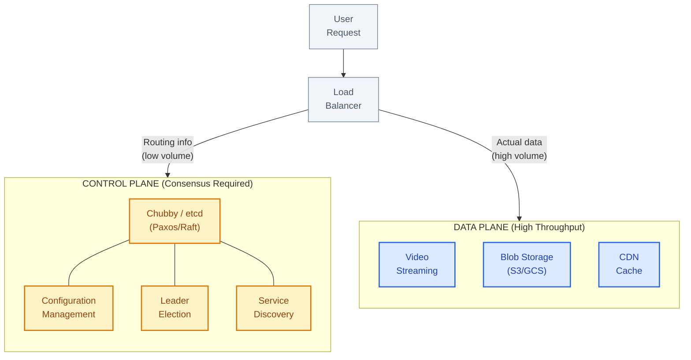
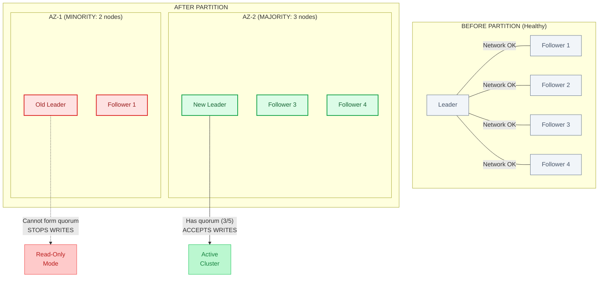
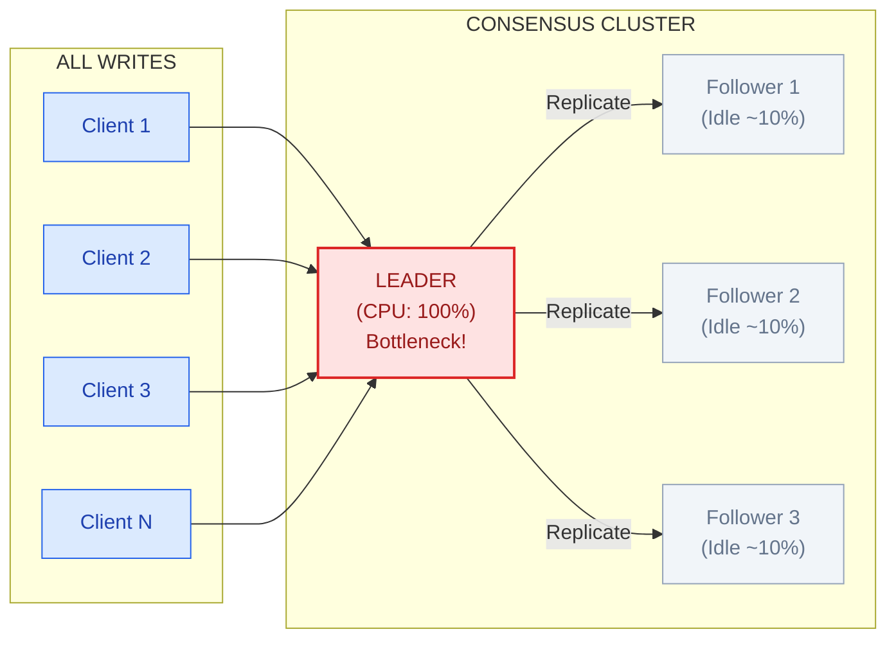

# Paxos and Raft

This guide covers 5 key areas: I. Executive Summary: The Problem of Agreement, II. Paxos vs. Raft: The Architectural Choice, III. Real-World Behavior at Mag7, IV. Critical Trade-offs, V. Impact on Business, ROI, and Customer Experience.

## I. Executive Summary: The Problem of Agreement

At the scale of Mag7 infrastructure, hardware reliability is a statistical impossibility. With fleets numbering in the millions of cores, nodes crash, disks fail, and network switches drop packets every minute. To build reliable services (99.999% availability) on top of unreliable hardware, we rely on distributed systems.

The fundamental challenge in these systems is **State Divergence**. If two machines in a cluster disagree on the current state (e.g., "Who is the leader?" or "How much inventory is left?"), the system faces "split-brain," leading to data corruption or double-processing.

**Consensus** is the mechanism by which a cluster of machines agrees on a specific value or state transition, ensuring that once a decision is made, it is durable and recognized by the entire cluster, even in the face of partial failures.

### 1. The Strategic Role of the Control Plane

For a Principal TPM, the critical distinction is not how the algorithm votes, but **what data** requires this level of rigor. Consensus algorithms (Paxos, Raft, ZAB) are computationally expensive and network-intensive. They are rarely used for the "Data Plane" (user traffic) but are the backbone of the "Control Plane."

*   **The Control Plane (High Criticality, Low Volume):** This layer manages the topology of the system.
    *   *Mag7 Example:* **Google Chubby** (based on Paxos) or **Kubernetes etcd** (based on Raft).
    *   *Usage:* Storing global configuration, service discovery (mapping "PaymentService" to IP 10.0.0.1), and Master Election.
    *   *Business Impact:* If the Control Plane diverges, the entire region may go down because services cannot find each other. We accept high latency here for perfect consistency.

*   **The Data Plane (High Volume, Variable Criticality):** This layer handles the actual user requests.
    *   *Mag7 Example:* **Netflix video streaming** or **Amazon S3 object retrieval**.
    *   *Usage:* Streaming pixels or serving images.
    *   *Tradeoff:* We do *not* use strict consensus for every video chunk. If a user sees a pixelated frame (eventual consistency), it is better than the video stopping to wait for a quorum vote (strong consistency).

### 2. The Mechanics of "Quorum" and Tradeoffs

Consensus relies on a **Quorum**—a majority of nodes ($N/2 + 1$) agreeing on a proposal. If you have 5 nodes, you need 3 to agree to commit a write.

**The Tradeoffs:**

| Feature | Impact | Business/CX Consequence |
| :--- | :--- | :--- |
| **Write Latency** | **High.** Every write requires network round-trips to multiple nodes and disk fsyncs. | **ROI Impact:** You cannot use consensus-backed storage for high-throughput, low-latency requirements (e.g., real-time ad bidding) without massive caching layers, which introduces complexity. |
| **Read Scalability** | **Limited.** To guarantee strong consistency, reads often must go through the Leader, creating a bottleneck. | **Scalability Cap:** Doubling the number of nodes in a consensus cluster actually *decreases* write performance (more nodes must acknowledge). |
| **Availability** | **Conditional.** The system survives the loss of minority nodes ($F$ failures in $2F+1$ cluster). | **Resilience:** If you lose 3 out of 5 nodes, the system stops accepting writes entirely to prevent corruption (CP in CAP theorem). The business capability halts to save the data. |

### 3. Real-World Failure Modes and Split-Brain

The most dangerous scenario in a distributed system is the **Network Partition**.

*   **Scenario:** An Availability Zone (AZ) gets cut off from the rest of the network but the machines are still running.
*   **Without Consensus:** The isolated AZ thinks it is the active primary and accepts writes. The main cluster also accepts writes. When the network heals, you have two conflicting ledgers.
*   **With Consensus (Mag7 Standard):** The isolated AZ cannot form a quorum (it has fewer than $N/2 + 1$ nodes). It automatically steps down or freezes. It refuses user traffic, causing an outage in that AZ, but preserving data integrity.

**Principal TPM Takeaway:** When defining Service Level Objectives (SLOs) for a new product, you must decide if the system should fail open (accept writes, risk conflict) or fail closed (reject writes, guarantee consistency). Consensus is the tool for "fail closed."

### 4. Buy vs. Build: The "Zero-Implementation" Rule

A critical stricture at companies like Google, Microsoft, and Amazon is that product teams should **never implement their own consensus algorithm**.

*   **The Risk:** Implementing Paxos/Raft correctly is notoriously difficult. Edge cases involving clock skew, zombie leaders (nodes that think they are leaders but aren't), and partial packet loss can lead to silent data corruption that is only discovered months later.
*   **The Capability Strategy:**
    *   **Google:** Teams use **Chubby** or **Spanner**.
    *   **Open Source/General:** Teams use **ZooKeeper**, **etcd**, or **Consul**.
    *   **AWS:** Teams rely on **DynamoDB** (with conditional writes) or **QLDB**.
*   **ROI Impact:** Building a custom consensus layer is a massive drain on engineering velocity with negative ROI. The "Skill" required to maintain it is niche and expensive. Your role is to steer architecture reviews toward managed services or battle-tested libraries.

## II. Paxos vs. Raft: The Architectural Choice

re are very few "correct" open-source implementations.
*   **The Trade-off:**
    *   **Pro:** Extremely flexible. It makes fewer assumptions about the structure of the log, allowing for highly specialized optimizations in proprietary internal stacks (e.g., Google's internal storage stack).
    *   **Con:** High engineering ROI cost. Debugging a Paxos implementation requires Principal-level engineers. It creates a "bus factor" risk where only a few people truly understand the core replication logic.

### 2. Raft (The "Understandable" Alternative)
*   **Origin:** Diego Ongaro and John Ousterhout (2014).
*   **Behavior:** Designed specifically to be understandable. It decomposes consensus into defined sub-problems: Leader Election, Log Replication, and Safety. It enforces a stricter structure than Paxos (e.g., logs must be continuous).
*   **Mag7 Context:** The backbone of the cloud-native ecosystem. **Kubernetes** uses **etcd**, which relies on Raft. If you are managing products on EKS (Amazon), GKE (Google), or AKS (Microsoft), your control plane relies on Raft.
*   **The Trade-off:**
    *   **Pro:** Operational velocity. Because the logic is clearer, tooling and observability are better. SRE teams can diagnose "split-brain" scenarios or leader election failures faster than with custom Paxos implementations.
    *   **Con:** Slightly less flexible than Paxos regarding log gaps, though this rarely impacts general-purpose applications.

### 3. Strategic Implications for the Principal TPM

As a TPM, you will rarely choose between "coding Paxos" or "coding Raft." You will choose between **technologies that implement them**. Your decision impacts the system's reliability budget and maintenance overhead.

#### A. The "Build vs. Buy" Trap
**Scenario:** An engineering lead suggests building a custom consensus layer for a new metadata service to squeeze out 5% more performance.
**TPM Stance:** **Reject.**
**Reasoning:** The ROI is negative. Correctly implementing consensus takes years of verification (TLA+ modeling, Jepsen testing).
**Mag7 Standard:** Use battle-tested libraries or services.
*   **Google:** Uses **Chubby** (Paxos as a service) or **Spanner**.
*   **Open Source/General:** Use **etcd** (Raft) or **ZooKeeper** (Zab, similar to Paxos).
*   **Impact:** Using off-the-shelf solutions reduces "Unknown Unknowns" in failure modes.

#### B. The "Leader Bottleneck" (Throughput vs. Consistency)
Both Paxos (Multi-Paxos) and Raft rely on a **Leader** (or Proposer) to serialize writes.
*   **The Constraint:** All writes must go through the Leader. This creates a bottleneck. You cannot scale write throughput simply by adding more nodes; adding nodes actually *increases* latency because the Leader must replicate data to a quorum of them.
*   **Business Impact:** If your product requires massive write throughput (e.g., ingesting telemetry data from 1B devices), you cannot use a Paxos/Raft store as the primary ingestion point. You must use a sharded system (like Kafka or DynamoDB) where consensus is scoped to small partitions, not the whole dataset.

#### C. Read Consistency Trade-offs
**Scenario:** A customer updates their profile, refreshes the page, and sees the old data.
**Technical Cause:** To improve performance, the system allowed a "Stale Read" from a Follower node, rather than forcing the read to go through the Leader (Linearizable Read).
**TPM Decision Point:**
*   **Option A (Linearizable):** Read goes to Leader. **Result:** Highest consistency, lower throughput, higher latency. Essential for billing/payments.
*   **Option B (Stale/Eventual):** Read goes to any Follower. **Result:** High throughput, low latency, risk of stale data. Acceptable for social media feeds or search indexes.

### 4. Operational Reality: Failure Modes

When these systems fail, they fail hard. A Principal TPM must ensure the disaster recovery (DR) plan accounts for the specific nature of consensus failures.

#### The "Split Brain" and Quorum Loss
If a 5-node cluster loses 3 nodes (leaving 2), the cluster **stops accepting writes**. It cannot form a majority (3/5).
*   **Mag7 Behavior:** We deploy consensus clusters across 3 or 5 Availability Zones (AZs).
*   **The Cost:** Cross-AZ latency (1-2ms) is added to every write. We accept this latency to survive a full data center outage.
*   **Operational Risk:** If a network partition isolates the Leader, the remaining nodes will elect a new Leader. When the partition heals, the old Leader must step down. If the implementation is buggy, you get "Split Brain" (two leaders accepting writes), leading to data corruption.
*   **Recovery:** Automated recovery via Raft is generally reliable. Manual intervention usually involves forcing a cluster reset, which can cause data loss.

## III. Real-World Behavior at Mag7

At the Principal level within a Mag7 environment, your interaction with consensus algorithms shifts from "how they work" to "how they fail" and "how they limit architecture." You will rarely manage a team writing a Paxos implementation from scratch. Instead, you will manage dependencies on internal "Lock Services" (like Google’s Chubby or Amazon’s internal coordination services) or open-source equivalents (Zookeeper, etcd).

The following sections detail how these algorithms manifest in production environments and the strategic decisions a TPM must drive regarding them.

### 1. The "Don't Roll Your Own" Mandate
In Mag7 engineering cultures, there is a strict, unwritten rule: **Never implement your own consensus algorithm.**

*   **Real-World Behavior:** At Google, teams rely on **Chubby** (a distributed lock service based on Paxos) or **Spanner** (a globally distributed database using Paxos). At Microsoft/Azure, Service Fabric relies on a custom implementation of Paxos/Raft, but product teams build *on top* of Service Fabric, not the consensus layer itself. In the Kubernetes ecosystem (heavily influenced by Google/Red Hat), **etcd** (Raft-based) is the standard.
*   **The Tradeoff:**
    *   *Build (Custom):* Optimization for specific edge cases. **Risk:** Extremely high probability of subtle bugs (e.g., split-brain scenarios) that only appear under massive load or network partitions.
    *   *Buy/Reuse (Standard):* Proven reliability. **Cost:** You inherit the limitations of the general-purpose tool (e.g., rigid API limits, specific throughput ceilings).
*   **Business & ROI Impact:**
    *   **Skill:** Utilizing standard services reduces the "Bus Factor." Finding an engineer who knows etcd is easy; finding one who understands a custom implementation of Multi-Paxos is difficult and expensive.
    *   **ROI:** "Not Invented Here" syndrome in this layer destroys ROI. Engineering hours spent debugging consensus race conditions are hours not spent on revenue-generating features.

### 2. The Throughput Bottleneck (The "Leader" Constraint)
A critical limitation of Raft and Paxos is that they are **throughput-limited by the capacity of a single node (the Leader).** All writes must go through the Leader to be replicated. Adding more nodes to a consensus cluster does *not* increase write throughput; in fact, it often decreases it because the Leader has to replicate data to more followers before confirming a commit.

*   **Real-World Behavior:**
    *   **Anti-Pattern:** A team attempts to use Zookeeper or etcd as a high-volume message queue or a general-purpose database for analytics. The cluster crashes because the Leader cannot serialize writes fast enough.
    *   **Mag7 Pattern:** Consensus is used strictly for **metadata** (configuration, pointers to data, leader election), while the actual high-volume data (blobs, logs, video) is stored in blob storage (S3/GCS) or partitioned NoSQL stores (DynamoDB/BigTable).
*   **Actionable Guidance:** If a Principal TPM sees a design document proposing a consensus store (like etcd) for data that changes thousands of times per second per key, they must flag this as a scalability risk.
*   **The "3 vs. 5 vs. 7" Node Decision:**
    *   **3 Nodes:** Survives 1 failure. Fastest writes (lowest replication overhead). Common for single-region control planes.
    *   **5 Nodes:** Survives 2 failures. Slightly slower writes. Standard for high-availability production cells.
    *   **7+ Nodes:** Rarely used. The write latency penalty usually outweighs the marginal gain in reliability.

### 3. Latency vs. Consistency (The Multi-Region Challenge)
This is the most common friction point between Product and Engineering. Product wants "instant global updates" (e.g., a user changes a setting in Europe and sees it instantly in the US). Physics dictates otherwise.

*   **Technical Context:** To guarantee consistency (CP), the Leader must receive acknowledgment from a majority of nodes. If nodes are spread across US-East, US-West, and EU-West, the speed of light dictates that a "commit" will take 100ms+ (round trip).
*   **Real-World Behavior:**
    *   **Google Spanner:** Uses TrueTime (atomic clocks) and Paxos to achieve external consistency globally. It accepts the latency cost for the benefit of transactional integrity.
    *   **Amazon DynamoDB (Global Tables):** Often favors "Last Writer Wins" or asynchronous replication (Eventual Consistency) for multi-region to preserve low latency, rather than running a global Paxos lock for every write.
*   **Tradeoff:**
    *   *Global Consensus:* Zero data loss, single source of truth. **Cost:** High latency on every write.
    *   *Local Consensus + Async Replication:* Low latency. **Cost:** Potential for data conflicts/divergence (split-brain) during regional disconnects.
*   **CX Impact:** For a shopping cart, eventual consistency is usually acceptable (reconcile later). For a banking ledger or inventory deduction, strong consistency (consensus) is required, even if it slows down the transaction.

### 4. The "Stop-the-World" Failure Mode
When a Consensus Leader fails, the cluster enters an "Election" phase. During this window (typically 3 to 30 seconds, depending on tuning), **the system is effectively down for writes.**

*   **Real-World Behavior:**
    *   **The Brownout Loop:** A Leader crashes. A new election occurs. As soon as the new Leader is elected, thousands of pending client requests hit it simultaneously (Thundering Herd). The new Leader CPU spikes to 100% and crashes. The cycle repeats.
*   **Mag7 Mitigation Strategy:**
    *   **Client Backoff & Jitter:** Clients must not retry immediately. They must wait a random amount of time.
    *   **Read-Only Replicas:** Clients should be configured to read from "Followers" (stale reads) during an election if strict currency isn't required, keeping the read-plane alive even if the write-plane is electing.
*   **Business Capabilities:** This dictates the SLA. You cannot promise "Zero Downtime" on a system relying on a single consensus group. You can promise "Four Nines" (99.99%), acknowledging the brief windows of leader election.

## IV. Critical Trade-offs

### 1. The Latency Tax: Consistency vs. User Experience

The most immediate trade-off when adopting consensus-based systems (Paxos/Raft) is the latency penalty incurred to guarantee Strong Consistency.

**Technical Context:**
In a standard Raft implementation, a write is not acknowledged to the client until:
1.  The Leader receives the request.
2.  The Leader persists it to its local write-ahead log (WAL).
3.  The Leader replicates the entry to a majority of Followers (over the network).
4.  The Followers persist to their logs and acknowledge receipt.
5.  The Leader commits and responds to the client.

**Mag7 Example:**
At Amazon (AWS), DynamoDB offers two read consistency models: Eventually Consistent and Strongly Consistent. The default is Eventual. Why? Because enforcing Strong Consistency (requiring a quorum check on read) increases latency and doubles the read capacity unit (RCU) cost.

**The Trade-off:**
*   **Choice:** Enforcing Strong Consistency (CP).
*   **Cost:** Higher P99 latency (due to network round-trips and disk syncs) and lower availability (if a majority is unreachable, the system halts).
*   **Benefit:** Zero data loss and linearizability (clients always see the latest write).
*   **TPM Decision Framework:**
    *   *Financial/Inventory Data:* Accept the latency. Use Consensus. (e.g., "Is this item actually in stock?").
    *   *User Feeds/Recommendations:* Reject the latency. Use Eventual Consistency. (e.g., "Did the user just like this post?").

### 2. The Throughput Ceiling: Single Leader Bottlenecks

Consensus groups generally rely on a single Leader to sequence writes. This creates a hard physical limit on write throughput.

**Technical Context:**
While you can scale *reads* by allowing followers to serve data (with "Lease Reads" to ensure freshness), you cannot scale *writes* by adding more nodes to a single Raft group. In fact, adding more nodes often *decreases* write throughput because the leader must replicate to more followers to achieve a majority.

**Mag7 Example:**
Google’s Chubby (Paxos-based lock service) is not used to store large data blobs. It stores tiny configuration files and lock metadata. If a team at Google tries to use Chubby as a high-throughput database, Site Reliability Engineering (SRE) will block the launch. For high throughput, Google uses Spanner, which shards data into thousands of independent Paxos groups.

**The Trade-off:**
*   **Choice:** Using a single consensus group (e.g., a single etcd cluster).
*   **Cost:** Vertical scalability limit. Once the Leader’s CPU or Network I/O is saturated, the system tips over.
*   **Benefit:** Operational simplicity. Atomic transactions are easy when all data lives in one log.
*   **Business Impact:** If you misjudge this, your service hits a hard ceiling during peak traffic (e.g., Black Friday), requiring a complete re-architecture to introduce sharding.

### 3. Global vs. Local Consensus: The Speed of Light

As a Principal TPM, you will face decisions regarding Multi-Region Active-Active architectures. Extending a consensus group across wide geographic regions (WAN) introduces significant physics-based constraints.

**Technical Context:**
Running a single Raft group with nodes in US-East, EU-West, and APAC means every write requires a packet to cross the Atlantic or Pacific ocean *twice* before committing.

**Mag7 Example:**
*   **Microsoft Azure Cosmos DB:** Offers "Strong Global Consistency," but warns customers of the massive latency penalty.
*   **Meta (Facebook):** Uses ZippyDB (Paxos) for critical metadata but keeps the consensus groups regional. Cross-region replication is usually asynchronous to avoid blocking the user interaction.

**The Trade-off:**
*   **Choice:** Spanning a consensus group across regions (Geo-Replication).
*   **Cost:** Massive write latency (100ms+ vs. <10ms).
*   **Benefit:** Survival of a total region failure (e.g., a hurricane destroys a datacenter).
*   **ROI Analysis:** For 99.9% of services, the ROI of synchronous global replication is negative. It is cheaper and better for CX to accept a non-zero Recovery Point Objective (RPO) (potential data loss of a few seconds) during a region disaster than to penalize every single user request with global latency.

### 4. Operational Complexity: "Fencing" and Zombie Leaders

The theoretical safety of Paxos/Raft relies on correct implementation, particularly regarding "Fencing" (preventing an old leader from acting).

**Technical Context:**
In a "Split Brain" scenario, an old leader might be cut off from the network but not realize it. It might try to accept writes or hold locks. The system must ensure this "Zombie Leader" is fenced off (ignored) by the rest of the cluster.

**Mag7 Example:**
A common outage pattern in internal Mag7 platforms occurs when a garbage collection (GC) pause freezes a Leader node for 30 seconds. The cluster elects a new Leader. The old Leader wakes up, thinks it is still in charge, and tries to write to the disk. If the underlying storage doesn't support "Compare-and-Swap" or generation numbers (epochs), data corruption occurs.

**The Trade-off:**
*   **Choice:** Building vs. Buying Consensus.
*   **Cost:** If you build, you must handle edge cases like GC pauses, clock skew, and partial network partitions.
*   **Benefit:** Full control.
*   **Actionable Guidance:** **Never build your own Consensus implementation.** Always use battle-tested open source (etcd, ZooKeeper) or managed cloud services (DynamoDB, Firestore). The risk to business continuity is too high.

## V. Impact on Business, ROI, and Customer Experience ⚠️

*Note: This section may need additional review.*

### 1. Business Continuity & ROI
*   **Automated Failover:** The primary ROI of Paxos/Raft is the removal of the human element from disaster recovery. When a primary database node fails, Raft elects a new one in seconds.
*   **Cost Savings:** Without this, you need 24/7 SRE teams manually promoting database replicas, taking minutes or hours, costing millions in downtime.

### 2. Customer Experience (CX)
*   **The "Split Brain" Prevention:** Imagine a scenario where a network error makes two servers think they are both the Leader. Both accept writes. When the network heals, you have conflicting data (e.g., the same seat on a plane sold to two people).
*   **Impact:** Paxos/Raft mathematically prevents Split Brain. The CX benefit is **Data Integrity**. Users trust the platform because their data does not randomly corrupt during outages.

### 3. Skill & Organizational Capabilities
*   **Hiring Complexity:** Maintaining a custom Paxos implementation requires L6/L7 (Staff/Principal) engineers. It is a massive resource drain.
*   **Operational Maturity:** Adopting standard Raft implementations (like etcd) allows you to hire generalist DevOps engineers who already know how to operate Kubernetes/etcd, reducing onboarding time and operational risk.

### Summary for the Interview
If asked about Paxos/Raft:
1.  Identify them as **Consensus Algorithms** for distributed coordination.
2.  Position them as the backbone of the **Control Plane** (Leader election, config).
3.  Highlight the **CP (Consistency/Partition Tolerance)** trade-off: We sacrifice latency and write-availability to guarantee data correctness.
4.  Advocate for **Raft** for understandability and **managed implementations** to reduce operational overhead.

---

## Interview Questions

### I. Executive Summary: The Problem of Agreement

### Question 1: System Design & Tradeoffs
**"We are building a distributed credit card transaction system. We need to ensure a user cannot exceed their credit limit. However, the marketing team wants the system to be 'always on' and never decline a valid card due to system maintenance. How do you architect the data layer?"**

*   **Guidance for a Strong Answer:**
    *   **Identify the Conflict:** The candidate must recognize the conflict between "ensure limit is not exceeded" (Strong Consistency/CP) and "always on" (Availability/AP).
    *   **Apply Consensus Correctly:** They should argue for Strong Consistency (Consensus/Paxos) for the *ledger balance*. Allowing a double-spend is a worse business outcome for a bank than a momentary unavailability.
    *   **Nuance:** A Principal-level answer might suggest a hybrid approach: Use a consensus-based system for the hard limit, but perhaps allow a small "overdraft buffer" processed asynchronously if the main consensus cluster is unreachable, explicitly trading a small financial risk for CX (Availability).
    *   **Technology Choice:** Suggest using a transactional database (Spanner/CockroachDB/DynamoDB with transactions) rather than building raw consensus.

### Question 2: Operational Resilience
**"You are the TPM for a platform running on a 5-node etcd cluster. Two nodes crash simultaneously. What is the impact on Read/Write availability and latency? What happens if a third node crashes?"**

*   **Guidance for a Strong Answer:**
    *   **Quorum Math:** With 5 nodes, Quorum is 3.
    *   **2 Nodes Crash:** 3 nodes remain. The cluster maintains Quorum. Writes continue but latency might spike slightly as the leader waits for the remaining specific nodes. Reads continue.
    *   **3rd Node Crashes:** Only 2 nodes remain. Quorum is lost ($2 < 3$).
    *   **The Impact:** The system enters a Read-Only mode (depending on configuration) or fails completely. **Writes stop immediately.**
    *   **Recovery:** The candidate should discuss the operational urgency of restoring the nodes to regain Quorum and the risk that the control plane is now frozen, preventing deployments or auto-scaling events.

### II. Paxos vs. Raft: The Architectural Choice

### Q1: The "Build vs. Buy" Consensus
**Question:** "Your engineering team wants to build a custom lightweight consensus protocol for a new control plane service because they claim etcd is 'too heavy' and adds too much latency. As the Principal TPM, how do you evaluate this proposal and what is your recommendation?"

**Guidance for a Strong Answer:**
*   **Identify the Anti-Pattern:** Immediately recognize that rolling a custom consensus algorithm is a classic engineering trap. The complexity is underestimated, and the "long tail" of bugs is massive.
*   **Risk Assessment:** Highlight the risks of data corruption and lack of formal verification (TLA+).
*   **Alternative Solutions:** Propose tuning existing solutions first. Can etcd be tuned? Can we use a managed service (e.g., AWS DynamoDB with strong consistency) to offload the complexity?
*   **Business Impact:** Frame the argument in terms of TCO (Total Cost of Ownership). The "saved" latency is likely negligible compared to the cost of a single outage caused by a consensus bug. "We are not in the business of writing database kernels; we are in the business of [Product Value]."

### Q2: Global Latency vs. Consistency
**Question:** "We are designing a global configuration system for a service deployed in US, EU, and APAC regions. The system requires strong consistency (no stale reads allowed). Engineers propose a single 5-node Raft cluster spanning all three regions to ensure data safety. What are the performance implications of this, and what architectural trade-offs would you suggest?"

**Guidance for a Strong Answer:**
*   **Identify the Bottleneck:** A Raft cluster spanning the globe means every write requires a round-trip across oceans (e.g., US to EU to APAC) to achieve a quorum. This implies write latencies of 100ms-300ms, which is likely unacceptable for a control plane.
*   **Analyze the Read Path:** Even for reads, if we require Strong Consistency (Linearizability), the leader must verify it still has a quorum, incurring network costs.
*   **Propose Trade-offs:**
    *   *Option 1 (Hierarchical):* Regional clusters for local data, with a global asynchronous replicator (sacrificing global immediate consistency for performance).
    *   *Option 2 (True Spanner approach):* Use TrueTime/atomic clocks (if available, like at Google) or accept the write latency but heavily cache reads.
    *   *Option 3 (Sharding):* Does the configuration *need* to be global? Can we shard the consensus groups by region?
*   **Key Metric:** Focus on the distinction between *Write Latency* (painful here) and *Read Latency* (optimizable).

### III. Real-World Behavior at Mag7

### Question 1: The Metadata Store Scalability
**"We are designing a new global control plane for our container orchestration service. The engineering lead proposes using a single 5-node etcd cluster (Raft-based) to store both the cluster configuration and the real-time CPU/Memory usage metrics for 100,000 containers to ensure consistency. As the Principal TPM, do you approve this design? Why or why not?"**

*   **Guidance for a Strong Answer:**
    *   **The Verdict:** Reject the design.
    *   **The "Why":** Raft/etcd is designed for low-volume, high-value metadata (Configuration), not high-volume, high-frequency telemetry (Real-time metrics).
    *   **The Bottleneck:** 100k containers reporting metrics every few seconds will overwhelm the single Leader's write capacity (IOPS and network bandwidth). The Raft log will grow uncontrollably, causing massive garbage collection and disk latency issues.
    *   **The Alternative:** Split the architecture. Use etcd *only* for configuration/state definitions. Use a time-series database or a sharded NoSQL store for the high-volume metric data where eventual consistency is acceptable.

### Question 2: Multi-Region Latency Negotiation
**"A Product VP demands that our new payment ledger system must have zero data loss (Strong Consistency) and be active-active across US-East and EU-West. However, they also set a requirement that the API write latency must be under 30ms at P99. How do you handle this?"**

*   **Guidance for a Strong Answer:**
    *   **Identify the Impossibility:** Immediately recognize this violates the laws of physics. The round-trip time (RTT) between US-East and EU-West is roughly 70-90ms. A consensus algorithm (Paxos/Raft) requires at least one round trip to commit. Therefore, <30ms write latency with strong consistency across these regions is impossible.
    *   **The Tradeoff Conversation:** You must offer the VP two choices:
        1.  *Relax the Consistency:* We achieve <30ms by writing locally and replicating asynchronously (risk of data loss/conflict if a region dies).
        2.  *Relax the Latency:* We guarantee zero data loss using global consensus, but the write latency will be ~100-150ms.
    *   **Strategic Recommendation:** For a payment ledger, data integrity (Option 2) usually trumps speed. The TPM should advocate for relaxing the latency SLA, perhaps using a "pending" state in the UI to mask the delay for the user (CX mitigation).

### IV. Critical Trade-offs

**Question 1: The "Global Lock" Trap**
"We are designing a ticket reservation system for a global concert tour (high demand). The Product Manager wants to ensure that a user in Tokyo and a user in New York never book the same seat, but also insists on an 'Active-Active' architecture where writes can happen in any region. How do you architect the consensus model, and what trade-offs do you present to the PM?"

*   **Guidance for a Strong Answer:**
    *   **Identify the Conflict:** You cannot have low-latency local writes *and* global strong consistency simultaneously (CAP theorem).
    *   **Propose Solutions:**
        *   *Option A (Geo-Partitioning):* Assign specific seat inventory to specific regions. Tokyo users buy from the Tokyo cluster. Fast, consistent, but inventory is fragmented.
        *   *Option B (Global Consensus):* Use a global Spanner/CockroachDB setup. Zero overselling, but booking takes 200ms+.
    *   **Principal Level Insight:** Suggest a hybrid approach. Use a "hold" mechanism (optimistic locking) locally, then confirm asynchronously, or route all "buy" actions to a single primary region while serving "browse" traffic locally.

**Question 2: The Thundering Herd**
"Your team uses a 5-node etcd cluster to store configuration for a 10,000-node compute fleet. Every time the fleet restarts or scales up, the etcd cluster falls over, causing a total outage. Why is this happening, and how do you fix it without replacing etcd?"

*   **Guidance for a Strong Answer:**
    *   **Root Cause:** The "Thundering Herd." 10,000 nodes simultaneously trying to establish a connection or `WATCH` a key on the leader overwhelms the network/CPU of the consensus group.
    *   **Mitigation Strategies:**
        *   *Client-side:* Implement exponential backoff and jitter on the clients.
        *   *Architecture:* Introduce a caching layer or "proxy" tier. The 10,000 nodes talk to 50 caching proxies, and only the 50 proxies talk to etcd.
        *   *Read Scaling:* Allow "Follower Reads" (consistency level relaxed slightly) to offload the Leader.

---

## Key Takeaways

- Review each section for actionable insights applicable to your organization

- Consider the trade-offs discussed when making architectural decisions

- Use the operational considerations as a checklist for production readiness
