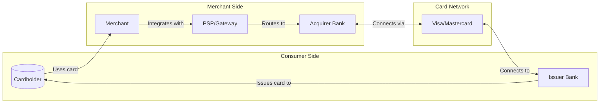
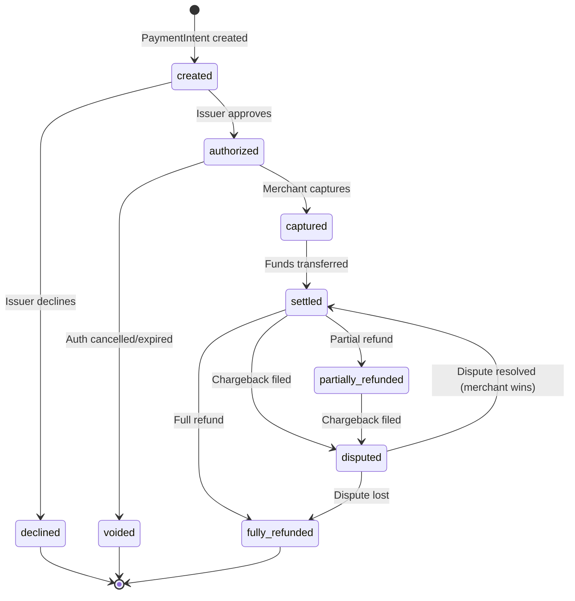
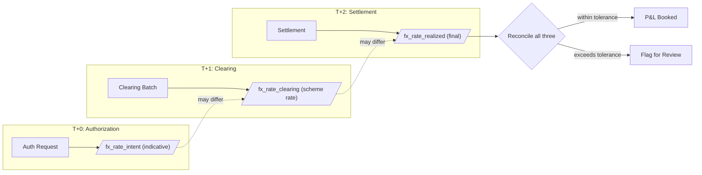
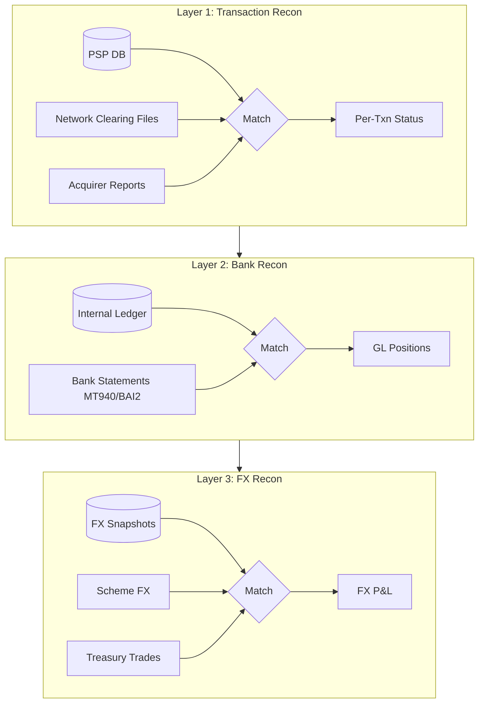
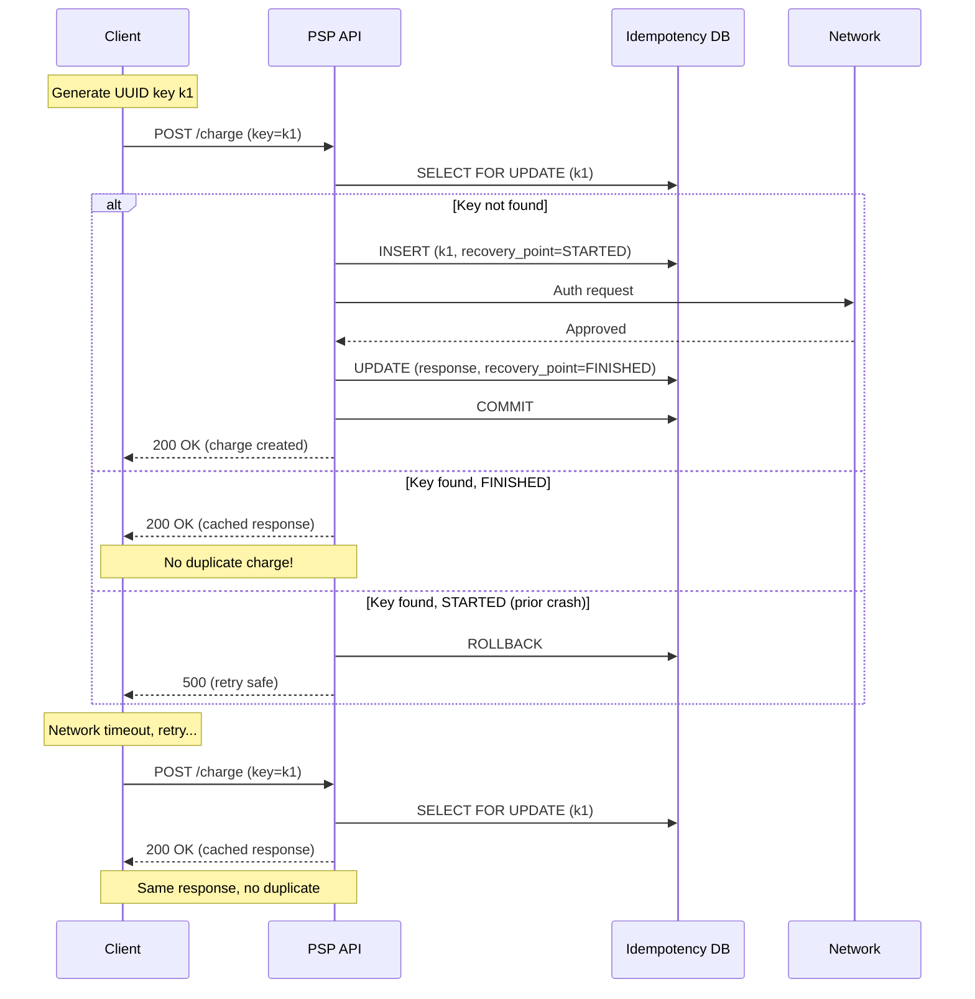
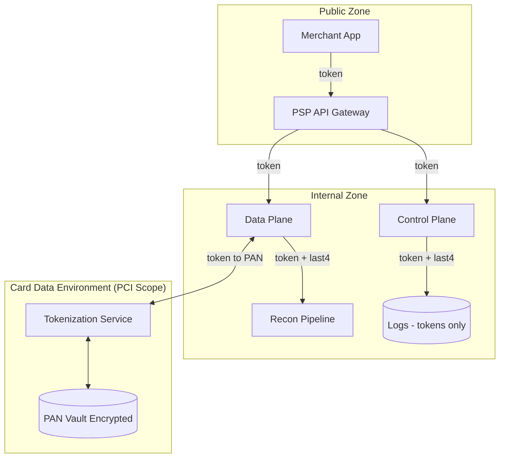
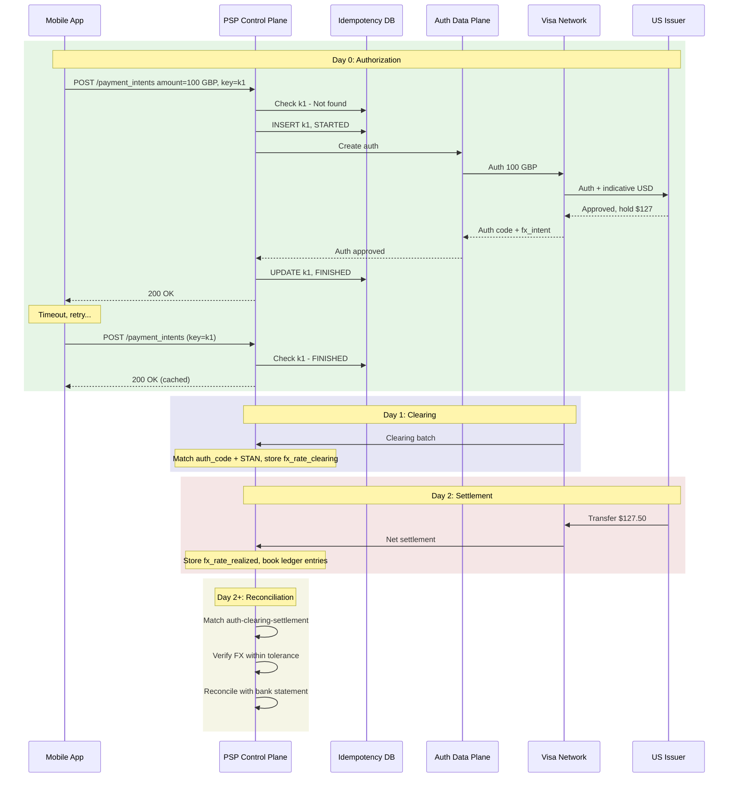

# Payment Systems at Visa Scale

## Why This Matters

Every e-commerce transaction you've ever completed—tapping your card, clicking "Pay Now," or scanning Apple Pay—flows through a remarkably complex system involving six different parties, three distinct time horizons, and multiple currencies. Understanding this system matters for TPMs because:

1. **It's a reference architecture.** Payment systems demonstrate the cleanest separation of control plane (orchestration, policy) and data plane (transaction execution) you'll find anywhere.
2. **It touches every compliance regime.** PCI DSS, PSD2, GDPR—you name it, payments has to deal with it.
3. **The stakes are absolute.** A duplicate charge or missing transaction destroys customer trust instantly. There's no "eventually consistent is good enough" for money.

This document covers how card payment infrastructure works at Visa/Stripe scale, including foreign exchange management, reconciliation pipelines, double-charge prevention, and regulatory compliance.

---

## 1. The Core Challenge: Different Operations Need Different Timing

Card payments seem instant to consumers, but behind the scenes, a single purchase flows through three distinct phases with different timing, consistency requirements, and failure modes.

**The problem:** You can't process a payment in one atomic operation. Authorization happens in milliseconds (real-time), but the merchant might not ship the product for days. Meanwhile, money needs to move through multiple banks, FX rates fluctuate, and disputes can arise weeks later.

**The solution:** Decompose the system into planes that operate on different time horizons:

| Plane | Time Horizon | Purpose |
|-------|--------------|---------|
| **Data Plane** | Real-time (T+0) | Authorization - instant approve/decline |
| **Control Plane** | Batch (T+0/T+1) | Clearing - transaction finalization |
| **Treasury Plane** | Settlement (T+1/T+2) | Fund movement and FX realization |
| **Compliance Plane** | Ongoing | PCI DSS, PSD2/SCA, audit trails |

The entire system is wrapped in idempotent APIs to prevent double-charging—the cardinal sin of payment systems.

---

## 2. Key Actors: Who Does What in a Card Transaction

Before diving into architecture, you need to understand who participates in a card transaction. Each actor has distinct responsibilities, risk exposure, and incentives.

| Actor | Role | Key Responsibilities |
|-------|------|---------------------|
| **Cardholder** | End consumer | Uses card (PAN) issued by their bank |
| **Merchant** | Seller | Accepts payments, integrates with PSP |
| **PSP/Gateway** | Payment Service Provider (e.g., Stripe) | Fronts the merchant, routes to acquirers, handles developer experience |
| **Acquirer** | Merchant's bank | Connects merchants to card networks, takes on merchant risk |
| **Network** | Visa/Mastercard | Routing switch, runs scheme rules, handles settlement between banks |
| **Issuer** | Cardholder's bank | Maintains card account, makes risk decisions (fraud, available credit) |

**Why this matters for TPMs:** When something goes wrong, you need to know which party owns the problem. An authorization decline? That's the issuer's risk decision. A settlement delay? That's the acquirer or network. A duplicate charge? That's your PSP's idempotency layer.

---

## 3. Transaction Lifecycle: The Three Phases

A single card payment flows through three distinct phases, each with different timing, consistency requirements, and failure modes.

### Phase 1: Authorization (Real-time)

**What happens:** The merchant asks "Can this cardholder pay $100?" The issuer checks fraud rules, available credit, and responds with approve or decline. If approved, the issuer places a temporary hold on cardholder funds.

**Timing:** Milliseconds to seconds. p95 target is typically &lt;800ms end-to-end.

**Key points:**
- This is the **data plane**—stateless, latency-critical, high availability required
- The hold is temporary. If the merchant never "captures" the charge, the hold expires
- The issuer makes the risk decision (fraud scoring, available balance)

### Phase 2: Clearing (Batch)

**What happens:** The acquirer batches all approved transactions and sends clearing files to the network. The network forwards to issuers, who post the actual charges to cardholder accounts.

**Timing:** End of day or next business day (T+0/T+1)

**Key points:**
- This is the **control plane boundary**—batch processing, not real-time
- FX rates are finalized here (the "scheme rate" from Visa/Mastercard)
- Clearing records must reference the prior authorization

### Phase 3: Settlement (Treasury)

**What happens:** Actual money moves. The issuer transfers funds through the network to the acquirer, who pays out to the merchant (minus fees).

**Timing:** T+1 to T+2 depending on region and banking rails

**Key points:**
- This is the **treasury plane**—real fund movement, GL entries, bank reconciliation
- Fees get deducted: interchange (to issuer), scheme fees (to Visa), acquirer fees
- FX spreads are realized and booked as P&L

### Disputes and Chargebacks

After settlement, cardholders can dispute transactions (e.g., "I didn't receive the product" or "I didn't authorize this"). This triggers a separate control flow governed by network rules, with evidence submission, representment, and arbitration phases. Chargebacks are a major cost driver for merchants—managing dispute rates is a key TPM concern.

---

## 4. North Star Metric

**The problem:** With millions of daily transactions flowing through authorization, clearing, and settlement, how do you measure whether the system is working correctly?

**The solution:** A single metric that captures both correctness and customer trust:

> **North Star Metric:** Percentage of correctly settled, non-disputed payments without double-charge or missing-charge, per day.

This metric matters because it captures:
- **Correctness:** No duplicate or missing transactions
- **Customer trust:** Low dispute rates indicate proper fulfillment

**Supporting metrics:**
- Authorized but not settled rate (indicates capture failures)
- Duplicate charge rate (target: ≤0.1 per million)
- Time to reconciliation (how quickly you detect problems)

---

## 5. Data Model: The Foundation You Can't Change Later

> **One-Way Door Decision:** The data model is the hardest thing to change once in production. Schema changes are expensive and risky. Every entity must be explicitly defined to handle FX and reconciliation correctly.

### 5.1 PaymentIntent (Control Plane)

**The problem:** You need a single object that tracks a payment from "customer clicked buy" to "money in merchant's bank account," including all the state transitions, currency conversions, and failure modes along the way.

**The solution:** The PaymentIntent pattern (popularized by Stripe) is the central object tracking a payment's lifecycle:

| Field | Type | Description |
|-------|------|-------------|
| `payment_intent_id` | string | Global unique ID (one-way door—format is hard to change) |
| `merchant_id` | string | Merchant identifier |
| `customer_id` | string | Customer identifier |
| `amount_original` | decimal | Original requested amount |
| `currency_original` | string | Original currency (ISO 4217) |
| `amount_to_capture` | decimal | Amount to actually capture |
| `capture_currency` | string | Currency for capture |
| `fx_rate_applied` | decimal | FX rate used |
| `fx_source` | enum | network, psp_treasury |
| `state` | enum | See state machine below |
| `created_at` | timestamp | Creation time |
| `updated_at` | timestamp | Last update |

**Invariants (rules that must always be true):**
- `sum(captures) ≤ authorized_amount` (you can't capture more than authorized)
- `sum(settled) ≥ sum(captured − refunds)` (all captured money eventually settles)

### 5.2 PaymentIntent State Machine

Every PaymentIntent moves through a defined set of states. This state machine is a **one-way door decision**—changing the states or transitions after launch requires migrating all existing data.

| State | Description | Next States |
|-------|-------------|-------------|
| `created` | PaymentIntent initialized, no network call yet | authorized, declined |
| `authorized` | Issuer approved, funds on hold | captured, voided |
| `declined` | Issuer declined the transaction | terminal |
| `voided` | Authorization cancelled or expired | terminal |
| `captured` | Merchant confirmed the charge | settled |
| `settled` | Funds transferred to merchant | partially_refunded, fully_refunded, disputed |
| `partially_refunded` | Some funds returned to cardholder | disputed |
| `fully_refunded` | All funds returned | terminal |
| `disputed` | Chargeback in progress | settled (merchant wins), fully_refunded (merchant loses) |

### 5.3 Authorization Record (Data Plane)

The authorization record captures the real-time approval decision:

| Field | Type | Description |
|-------|------|-------------|
| `auth_id` | string | Authorization identifier |
| `payment_intent_id` | string | FK to PaymentIntent |
| `card_pan_token` | string | Tokenized PAN (never store raw card numbers) |
| `issuer_id` | string | Issuing bank identifier |
| `network` | enum | visa, mastercard, amex |
| `amount` | decimal | Authorized amount |
| `currency` | string | Authorization currency |
| `auth_code` | string | Network authorization code |
| `auth_status` | enum | approved, declined, reversed |
| `expiry_time` | timestamp | When auth expires |

**Invariants:**
- Only one "active" auth per (card, merchant, intent)
- Expired auth cannot be captured

### 5.4 Clearing and Settlement Records

Clearing records (from network batch files) and settlement records (from treasury operations) must link back to authorizations and PaymentIntents for reconciliation. Key fields include network reference IDs, FX rates applied, and fees deducted.

### 5.5 One-Way vs Two-Way Door Decisions

| Decision Type | Examples | Changeability |
|---------------|----------|---------------|
| **One-way doors** | ID formats, state machine semantics, FX handling rules | Very expensive to change post-production |
| **Two-way doors** | Settlement batch grouping, internal FX spread allocation, API field exposure | Can iterate |

**TPM framing:** Before committing to a data model design, explicitly identify which decisions are one-way doors. Get broader stakeholder alignment on those.

---

## 6. Cell-Based Architecture: Containing Blast Radius

**The problem:** At Mag7 scale (billions of transactions), a single global system is too risky. A bug in one region shouldn't take down payments worldwide. Regulatory requirements (GDPR, data residency) also demand geographic data isolation.

**The solution:** Cell-based architecture, partitioned by region × tenant cluster. Each cell is a complete, independent payment system.

```mermaid
flowchart TB
    subgraph US["US-1 Cell"]
        US_DP[Auth Data Plane]
        US_CP[Control Plane]
        US_TV[Token Vault]
        US_LED[Ledger]
        US_FX[FX Service]
        US_BANK[(US Banks)]
    end

    subgraph EU["EU-1 Cell"]
        EU_DP[Auth Data Plane]
        EU_CP[Control Plane]
        EU_TV[Token Vault]
        EU_LED[Ledger]
        EU_FX[FX Service]
        EU_BANK[(EU Banks)]
    end

    subgraph APAC["APAC-1 Cell"]
        APAC_DP[Auth Data Plane]
        APAC_CP[Control Plane]
        APAC_TV[Token Vault]
        APAC_LED[Ledger]
        APAC_FX[FX Service]
        APAC_BANK[(APAC Banks)]
    end

    subgraph GLOBAL[Global Treasury Layer]
        TREASURY[Treasury FX]
        RECON[Cross-Cell Recon]
        GL[Global Ledger]
    end

    US_LED --> GL
    EU_LED --> GL
    APAC_LED --> GL
    US_FX -.->|rates| TREASURY
    EU_FX -.->|rates| TREASURY
    APAC_FX -.->|rates| TREASURY
```

### Per-Cell Components

Each cell (`US-1`, `EU-1`, `APAC-1`) contains a complete, independent system:

| Component | Description |
|-----------|-------------|
| **Auth Data Plane** | Stateless API + card/token vault + issuer connectors |
| **Control Plane** | PaymentIntent service, FX service, recon pipeline, config |
| **Local Ledger** | Settlement engines with regional banking rails |
| **Token Vault** | PCI-scoped PAN storage and tokenization |
| **FX Service** | Regional network rates, caches and applies FX |

### Blast Radius Containment

The key benefit: failures are isolated.

| Failure Scenario | Impact | Unaffected |
|------------------|--------|------------|
| EU-1 cell down | EEA merchants/customers in that cell | US auth continues running |
| FX service failure in US-1 | US cell transactions | EU and APAC cells |
| Token vault unavailable in APAC-1 | New APAC authorizations | Status APIs, other cells |

### Data Residency

- EU cardholder PII and PAN tokenization scoped to EU cells only
- Cross-region flows use tokens and aggregated financial positions, not raw PII
- Required for GDPR and PSD2 compliance

### Non-Mag7 Context

In smaller PSPs, you may have only 1–2 cells relying on cloud regions with multi-AZ. Blast radius is larger, so mitigate with conservative rollout strategies, tight SLOs, and feature flags for quick rollback.

---

## 7. Foreign Exchange (FX): Three Different Rates for One Transaction

**The problem:** When a US cardholder (USD account) buys from a UK website (pricing in GBP), a single transaction involves three different FX rates captured at different times. If you don't track all three, you can't explain to Finance why "100 EUR charge" became three slightly different USD values over three days.

**The solution:** Explicitly model and reconcile all three FX moments.

### 7.1 Authorization FX (Display/Hold)

**When:** At authorization time (T+0)

**What:** The network or issuer returns an indicative FX rate so the PSP can show an approximate converted amount ("~USD 105.23" for a 100 EUR authorization).

**Key point:** This is **not final**. Mark it as `fx_intent` and clearly communicate to merchants that settlement FX may differ.

### 7.2 Clearing FX (Scheme Rate)

**When:** At clearing time (T+0/T+1)

**What:** Visa/Mastercard calculate the final issuer → acquirer FX rate.

**Options:**
- **Use scheme rate:** Accept the network's FX (simpler, less P&L variability)
- **Dynamic Currency Conversion (DCC):** Offer "pay in your home currency" with your own FX rate (revenue lever but adds regulatory scrutiny and customer friction)

### 7.3 Treasury FX (PSP Rebalancing)

**When:** At settlement time (T+1/T+2)

**What:** The PSP may settle merchants in their local currency even if collected in another. The treasury team runs separate FX trades to rebalance.

**Revenue:** FX spreads between scheme rate and treasury rate are booked as revenue.

### 7.4 FX Reconciliation

**Why this matters for TPMs:** FX reconciliation is where Finance, Treasury, and Engineering collide. When a merchant asks "why did my $100 charge settle as $99.47?", you need to explain which rate applied at which stage. If you can't answer, you'll spend hours in war rooms with Finance.

You must store and reconcile all three rates:

| Rate | When Captured | Source |
|------|---------------|--------|
| `fx_rate_intent` | Authorization | Network indicative |
| `fx_rate_clearing` | Clearing | Network scheme rate |
| `fx_rate_realized` | Settlement | Actual treasury rate |

**Reconciliation process:**
- Compare all three rates
- Apply tolerances (e.g., ±X basis points allowed)
- Tag P&L for FX gains/losses vs expected
- Flag outliers for manual review

---

## 8. Reconciliation: Making Sure Money and Data Align

**The problem:** You have authorization records in your database, clearing files from Visa, settlement reports from your acquirer, and bank statements from your treasury accounts. How do you know they all match? How do you catch when they don't?

**The solution:** Three-layer reconciliation operating on different data sources with different timing.

### Layer 1: Transaction-Level Recon

**Goal:** Every merchant order ID maps through the complete chain: `Auth → Capture → Clearing → Settlement → Bank Credit`

**Outputs:** Per-transaction status, mismatch flags (amount mismatch, missing clearing, duplicate clearing)

### Layer 2: Bank Recon

**Goal:** Internal ledger positions match bank statements

**Outputs:** Unapplied cash identification, missing settlements, mis-booked FX or fees

### Layer 3: FX Reconciliation

**Goal:** FX spreads and gains/losses correctly booked; no unhedged large exposures

### Implementation at Scale

**Matching logic:**
- **Primary keys:** `network_reference + STAN + auth_code`
- **Fallback:** `card_token + merchant + amount + date_window`

**SLO:** 99.9% of transactions reconciled within X hours of settlement file arrival

> **Required Chaos Test:** Drop or delay network clearing files and verify recon identifies missing items and raises alerts (not silent mis-booking).

**Why this matters for TPMs:** Reconciliation failures are silent until they're not. A missing clearing record doesn't alert anyone—until Finance discovers a $2M discrepancy during month-end close. Your job is to ensure recon runs continuously with clear SLOs, not as a monthly fire drill.

### Mag7 vs Non-Mag7

| Context | Approach |
|---------|----------|
| **Mag7** | Own the recon platform as a product; APIs for Finance Ops; real-time anomaly detection |
| **Non-Mag7** | Lean on vendor recon tools or BI; retain enough IDs/fields to join data with vendor exports |

---

## 9. Avoiding Double-Charging: The Cardinal Sin

**The problem:** Double-charging destroys customer trust and triggers chargebacks. It happens more easily than you'd think: network timeouts, server crashes between network call and database write, concurrent requests, or replay attacks.

**The solution:** Strict idempotency + transactional state, following the Stripe pattern.

### 9.1 Why Double-Charges Happen

| Cause | Scenario |
|-------|----------|
| **Network timeout** | Client doesn't receive response, retries |
| **Crash after network call** | Server sent auth but died before recording it |
| **Race condition** | Concurrent requests for same payment |
| **Replay attack** | Malicious or accidental duplicate submission |

### 9.2 Idempotent API Design (Stripe Pattern)

The client generates an idempotency key and sends it with every payment-modifying request. The PSP enforces "process once, replay same response."

### 9.3 Processing Flow

1. Start DB transaction
2. `SELECT ... FOR UPDATE` on idempotency row
3. If absent: create with `recovery_point = STARTED`
4. If `recovery_point = FINISHED`: return cached `response_body` (no action)
5. Execute atomic phase: create/capture PaymentIntent, call network, update ledger
6. On success: store response, set `recovery_point = FINISHED`, commit
7. On error: rollback transaction, leave row incomplete for safe retry
8. Keys expire after ~24 hours

### 9.4 Critical Design Requirement

> The network charge creation and your internal ledger mutation must be in the same atomic phase, or follow a carefully staged pattern so that a duplicate external charge is either impossible or always reconciled to a single user-visible payment.

### 9.5 Consistency Choices (CAP/PACELC)

In distributed systems, you face a fundamental trade-off: **CP** (Consistency-Partition tolerance) means the system refuses requests rather than return stale data during failures; **PA/EL** (Partition-Available/Else-Latency) means the system prioritizes availability and speed, accepting eventual consistency.

| Operation | Consistency Choice | Rationale |
|-----------|-------------------|-----------|
| Idempotency check | **CP** (strong) | Prefer failing request over risking double charge |
| PaymentIntent update | **CP** (strong) | State must be accurate |
| User status queries (cross-region) | **PA/EL** (eventual) | Slightly stale OK for low latency |
| Analytics/dashboards | **PA/EL** (eventual) | Not user-facing |

**Where you must be strict:** Payment state, ledger entries, idempotency enforcement.

**Where you can relax:** Analytics, dashboards, merchant-side reporting.

---

## 10. Regulatory Compliance: PCI DSS and PSD2

**The problem:** Payment systems operate under strict regulatory frameworks. Non-compliance means fines, loss of processing privileges, and reputational damage.

### 10.1 PCI DSS (Card Data Security)

PCI DSS is the security standard for organizations that process, store, or transmit cardholder data.

**Key architectural decisions:**
- PAN vault is its own service (often its own cell) behind strict access controls
- Control plane and data plane only handle tokens, never raw PANs
- Logs and recon data use tokens + last4 only (never full PAN)

### 10.2 PSD2 and Strong Customer Authentication (EU)

PSD2 is the EU regulation for payment services, focusing on open APIs and Strong Customer Authentication (SCA).

| Requirement | Implementation |
|-------------|----------------|
| **SCA** | 2-factor auth (possession + knowledge/biometrics) unless exemptions apply |
| **3DS integration** | Integrate issuer 3DS flows into authorization pipeline |
| **Open APIs** | Banks must expose APIs to PSPs—AISPs (Account Information Service Providers) for read access, PISPs (Payment Initiation Service Providers) for initiating payments |
| **Data minimization** | Only collect/store necessary data |

**Operational impact:**
- EU cells must integrate SCA flows and log them in authorization lifecycle
- Failure budgets must account for SCA friction (expected declines, not outages)

---

## 11. Reliability: SLIs, SLOs, and Chaos Engineering

> **Reliability Philosophy:** You don't sell uptime; you sell "I don't screw up your money." Define SLIs and SLOs accordingly.

### 11.1 Service Level Indicators

**Control Plane:**
| SLI | Measurement |
|-----|-------------|
| Success rate | % of `CreatePaymentIntent` and `Capture` requests completing successfully |
| Latency | p95 response time within cell |

**Data Plane:**
| SLI | Measurement |
|-----|-------------|
| Auth success rate | Non-risk/non-funds declines |
| End-to-end latency | p95 from PSP → Issuer → PSP |

**Correctness:**
| SLI | Measurement |
|-----|-------------|
| Duplicate charge rate | Per million successful payments |
| Unresolved duplicates | Beyond 48 hours |

### 11.2 Service Level Objectives

| Metric | SLO Target |
|--------|------------|
| Control plane success rate | 99.95% |
| Control plane latency (p95) | &lt;300ms |
| Auth request handling | 99.99% (excluding issuer declines) |
| Auth latency (p95, in-region) | &lt;800ms |
| Settlements reconciled in 24h | 99.9% |
| Duplicate charge rate | ≤0.1 per million |

### 11.3 Chaos Engineering Scenarios

| Scenario | Expected Behavior |
|----------|-------------------|
| **Partial issuer network partition** | Retries and fallback routing work; idempotency prevents duplicates |
| **Dropped clearing file** | Recon flags unreconciled auths; Finance uses runbooks (no panic) |
| **PAN vault unavailability** | Tokenization failures degrade gracefully (block new charges, status APIs unaffected) |

> **MTTR Target:** Sub-30-minute for cell-level incidents affecting real-time auth. If not achievable, contain blast radius and communicate clearly to merchants.

---

## 12. Economics and COGS

Understanding cost structure enables better trade-off decisions and drives P&L optimization.

### 12.1 Key COGS Levers

**Compute:**
- Real-time auth is latency-sensitive, not throughput-bound
- Bin pack stateless services heavily within per-request latency budgets

**Storage:**
| Tier | Retention | Use Case |
|------|-----------|----------|
| Hot | 30-90 days | Recent payments, ledger entries |
| Warm | 1-2 years | Detailed records for queries |
| Cold | 7+ years | Archive for compliance and disputes |

**Third-Party Fees:**
- Network and acquirer fees are fixed short-term
- Optimization: route to lower-fee schemes/rails where allowed, shift volumes between acquirers for better blended rates

### 12.2 Mag7 vs Non-Mag7 Context

| Context | Characteristics |
|---------|-----------------|
| **Mag7** | Leverage existing internal tokenization, ledger, FX, identity platforms. Focus on platformization and standardizing across payment products and geos. |
| **Non-Mag7** | Heavier use of third-party acquirers and recon tools. Focus on careful vendor integration and cost-aware routing. |

### 12.3 Milestone Framing

Express milestones in business terms:
- "Reduce duplicate charge rate by 80% and unlock $XM ARR from enterprise merchants who require that SLA"
- "Reduce recon backlog from 3 days to same-day, reducing Finance FTE needs and audit risk"

---

## 13. Trade-Off Matrix

Real decisions you'll argue about in design reviews and interviews:

| Decision | Latency | Cost | Complexity | Risk |
|----------|---------|------|------------|------|
| Strong CP DB for idempotency + ledger | Slightly higher p95 | Higher (beefier DB) | Medium | Low double-charge risk |
| Eventual consistency for payment status across cells | Lower read latency | Lower (cheap replicas) | Medium | Risk of stale status (acceptable) |
| Scheme FX only vs PSP-managed FX/DCC | Neutral | Higher margin with PSP FX | High (treasury, hedging) | Regulatory + market risk |
| Single global region vs regional cells | Lower infra complexity | Lower overhead | Low initially | High blast radius, data residency issues |
| Vendor recon vs in-house recon platform | Neutral | Vendor may be expensive | Low/High | Vendor lock-in vs control |
| Aggressive SCA exemptions vs conservative | Lower latency (fewer 3DS) | More revenue | High (risk tuning) | Higher fraud/regulatory risk |

---

## 14. End-to-End Example: Cross-Currency Charge with Retry

**Scenario:** US cardholder (USD) buys from UK website (GBP). Mobile app retries due to network flakiness.

### Key Points in This Flow

**Step 1-3: Authorization with idempotency**
- App generates idempotency key `k1`
- PSP checks idempotency DB, creates record with `recovery_point=STARTED`
- Auth flows through to issuer, FX rate captured

**Step 4: Retry handling**
- Network timeout causes retry with same `k1`
- PSP finds `recovery_point=FINISHED`, returns cached response
- **No duplicate charge**

**Step 5-7: Clearing, Settlement, Reconciliation**
- Clearing file arrives with final FX rate
- Settlement moves actual funds with fees deducted
- Recon verifies all three stages match

### Crash Recovery Guarantee

> If crash occurs after network auth but before DB commit, the idempotent design and ACID DB ensure either: a single charge is recorded, OR on retry the same charge is returned. Never two separate settlements.

---

## 15. Role-Specific Focus

| Level | Focus Areas |
|-------|-------------|
| **Senior TPM** | Execution: shipping idempotent APIs, recon pipelines, FX data models. Driving SLOs and runbooks. Aligning 3-5 teams. |
| **Principal TPM** | Strategy: multi-region cell design, platformizing ledger/recon/FX for reuse, regulatory strategy (build vs outsource), 3-year P&L shape. |

---

## Key Takeaways

> **Control Plane / Data Plane Separation:** Payments demonstrate the cleanest version of this pattern. Auth is stateless data plane; PaymentIntent management is control plane; settlement is treasury plane.

> **Idempotency is Non-Negotiable:** The cardinal sin is double-charging. Build idempotency into the API contract from day one.

> **Three FX Rates, One Transaction:** Authorization, clearing, and settlement each capture different FX rates. If you don't model all three, you can't reconcile.

> **Cell-Based Architecture:** Regional cells contain blast radius and enable data residency compliance. This is a one-way door decision.

> **Compliance as Architecture:** PCI DSS and PSD2 aren't checkboxes—they drive fundamental architectural decisions (token vaults, SCA flows, data minimization).
