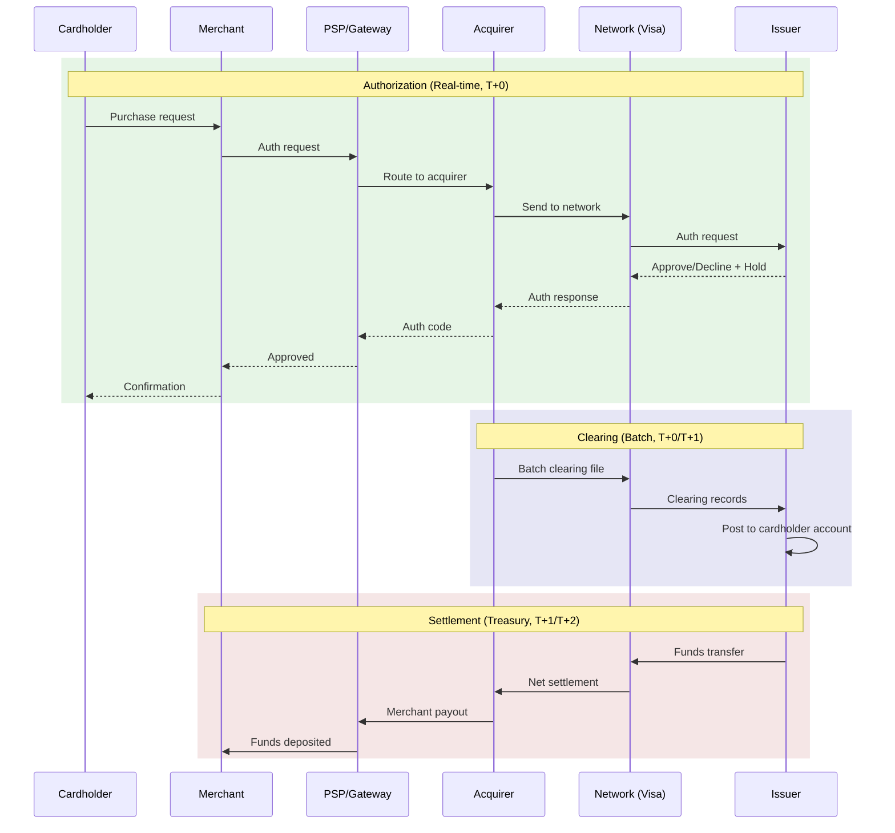
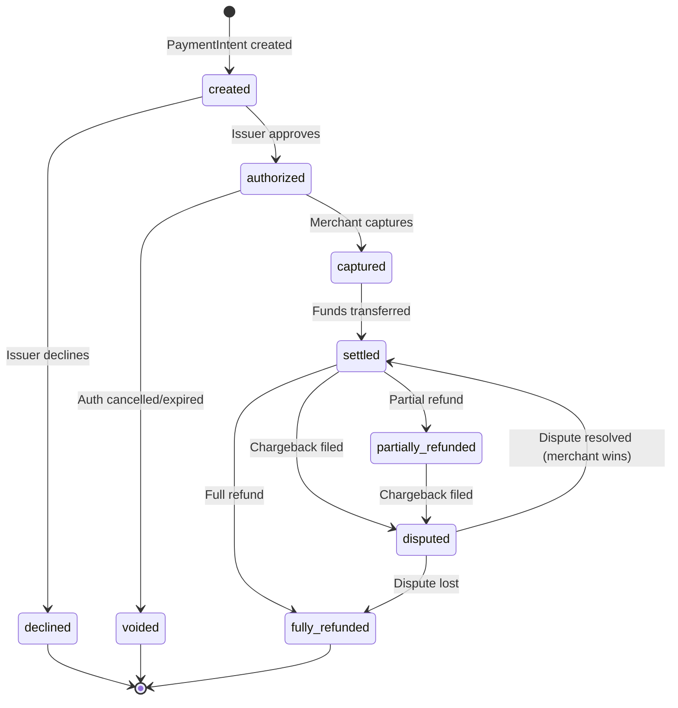
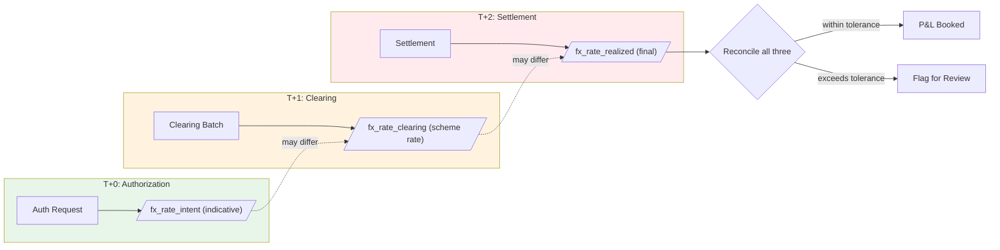
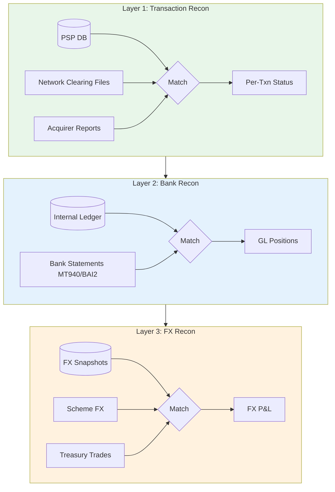
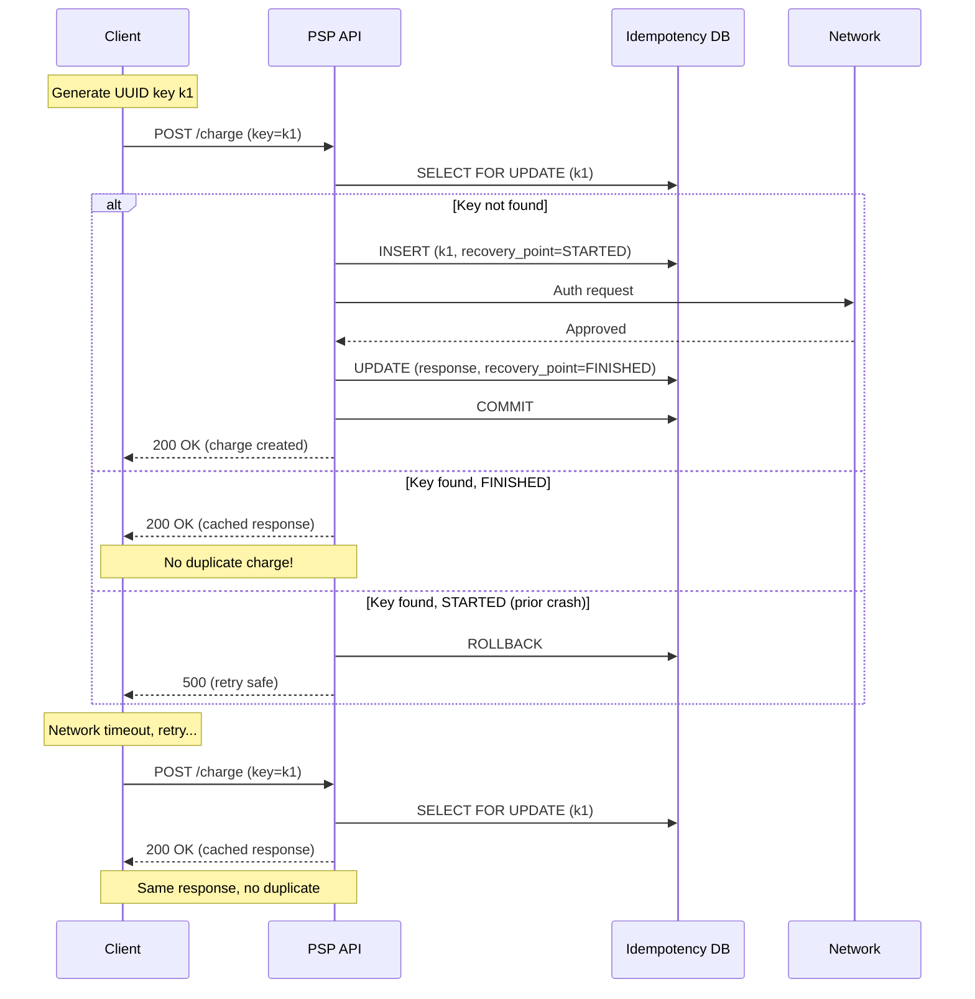
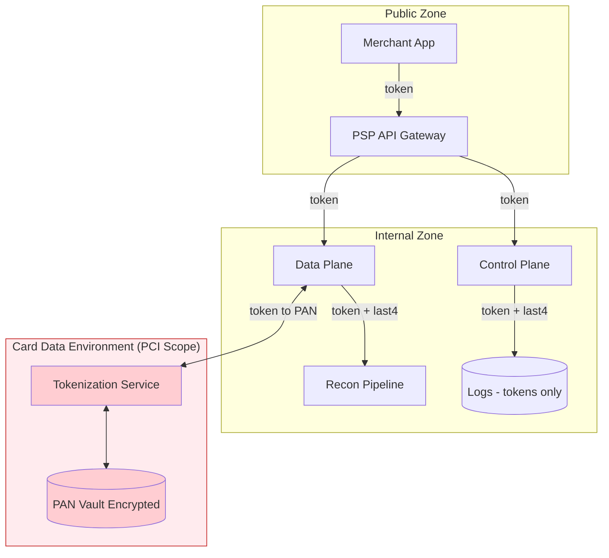
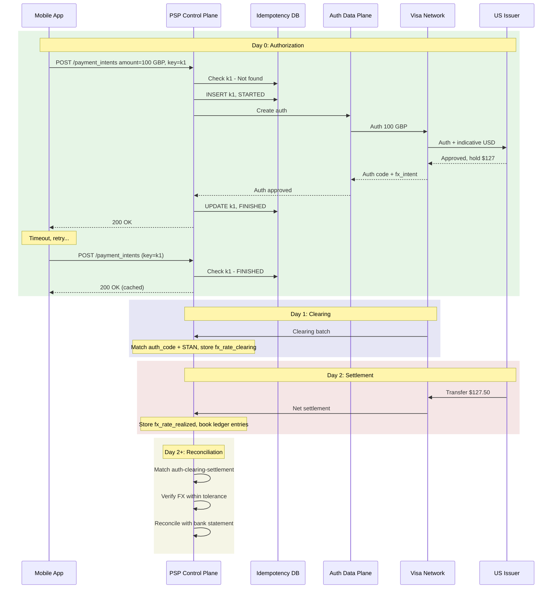

```mermaid
flowchart TB
    subgraph US["US-1 Cell"]
        US_DP[Auth Data Plane]
        US_CP[Control Plane]
        US_TV[Token Vault]
        US_LED[Ledger]
        US_FX[FX Service]
        US_BANK[(US Banks)]
    end

    subgraph EU["EU-1 Cell"]
        EU_DP[Auth Data Plane]
        EU_CP[Control Plane]
        EU_TV[Token Vault]
        EU_LED[Ledger]
        EU_FX[FX Service]
        EU_BANK[(EU Banks)]
    end

    subgraph APAC["APAC-1 Cell"]
        APAC_DP[Auth Data Plane]
        APAC_CP[Control Plane]
        APAC_TV[Token Vault]
        APAC_LED[Ledger]
        APAC_FX[FX Service]
        APAC_BANK[(APAC Banks)]
    end

    subgraph GLOBAL[Global Treasury Layer]
        TREASURY[Treasury FX]
        RECON[Cross-Cell Recon]
        GL[Global Ledger]
    end

    US_LED --> GL
    EU_LED --> GL
    APAC_LED --> GL
    US_FX -.->|rates| TREASURY
    EU_FX -.->|rates| TREASURY
    APAC_FX -.->|rates| TREASURY

    style US fill:#e8f5e9
    style EU fill:#e3f2fd
    style APAC fill:#fff3e0
    style GLOBAL fill:#f3e5f5
```

# Payment Systems (Visa/Stripe): Managing foreign exchange, reconciliation, and avoiding double-charging, regulatory compliance

At scale, card payments (Visa/Stripe-style) are a set of loosely coupled systems: real-time auth on the data plane, plus delayed clearing/settlement, FX, and reconciliation on the control/batch planes, wrapped in heavy compliance guardrails and idempotent APIs to avoid double-charging.

I'll frame it like a Principal TPM: cell-based architecture, FX/recon flows, idempotency/double-charge avoidance, and compliance (PCI DSS/PSD2) with SLOs and business impact.

***

## Mental model: actors and flows

Key actors:

- Cardholder → uses card (PAN) issued by issuer bank.
- Merchant → sells goods, integrates with a PSP (e.g., Stripe).
- PSP / Gateway → fronts the merchant, routes to acquirers and networks.
- Acquirer → merchant's bank, connects to Visa/Mastercard.
- Network (Visa/Mastercard) → routing \& settlement "switch," runs schemes.
- Issuer → cardholder's bank, maintains card account and risk.

High-level flows (simplified):

- Authorization (online, real-time data plane): merchant → PSP → acquirer → network → issuer; issuer approves/declines, places a hold.
- Clearing (T+0/T+1 control plane): acquirer batches approved transactions to network; issuer receives "clearing" records and posts them to card accounts.
- Settlement (T+1/T+2 batch data/treasury plane): funds move issuer → network → acquirer → merchant; fees and FX spreads applied.
- Reconciliation (merchant + PSP + issuer): matching what was authorized vs cleared vs settled vs bank ledger, including FX differences and fees.
- Disputes/chargebacks: post-settlement corrections via network rules, separate control-flow.

North Star metric for a PSP-style system: "Percentage of correctly settled, non-disputed payments without double-charge or missing-charge, per day" (i.e., correctness + customer trust), with sub-metrics on "authorized but not settled" and "duplicate charge rate."

***

## Data model and architecture (with FX \& recon)

### Core data model

You need explicit objects; anything hand-wavy here will bite you when FX or reconciliation go wrong.

- PaymentIntent (Stripe-style, control plane):
    - `payment_intent_id` (global, one-way door).
    - `merchant_id`, `customer_id`, `amount_original`, `currency_original`.
    - `amount_to_capture`, `capture_currency`, `fx_rate_applied`, `fx_source` (e.g., network, PSP treasury).
    - `state`: `created → authorized → captured → settled → partially_refunded/fully_refunded → disputed`.
    - Invariants: sum(captures) ≤ authorized, sum(settled) ≥ sum(captured − refunds).

- Authorization (data plane):
    - `auth_id`, `payment_intent_id`, `card_pan_token`, `issuer_id`, `network`, `amount`, `currency`.
    - `auth_code`, `auth_status` (approved/declined/reversed), `expiry_time`.
    - Invariants: only one "active" auth per card + merchant + intent; expired auth can't be captured.
- Clearing record (network batch, data/control boundary):
    - `clearing_id`, `network_reference`, `auth_code`, `STAN` (system trace audit number).
    - `merchant_currency_amount`, `issuer_currency_amount`, `interchange_fee`, `scheme_fee`.
    - `network_fx_rate`, `clearing_date`.
    - Invariants: clearing must link to a prior auth or be marked "force post."
- Settlement entry (treasury / GL ledger):
    - `settlement_id`, `clearing_id`, `issuer_id`, `acquirer_id`, `merchant_id`.
    - `amount_issuer_currency`, `amount_merchant_currency`, `fx_realized`, `fees_total`.
    - `value_date`, `bank_account_id`.
    - Invariants: GL must balance across all legs (issuer, scheme, acquirer, PSP, merchant).
- FX rate snapshot:
    - `fx_rate_id`, `source` (e.g., Visa, PSP's internal MM desk), `rate`, `spread_bps`.
    - `effective_from`, `effective_to`, `base_currency`, `quote_currency`.
    - Invariants: no overlapping effective windows for the same pair/source.

One-way doors you don't casually change: ID formats (needed to reconcile with networks), state machine semantics, and FX handling rules (when you lock rates vs float them). Two-way doors: exactly how you group settlement batches, internal FX spread allocation, or whether you expose certain fields externally.

### Cell-based architecture and blast radius

At Mag7 scale, you run this as cell-based, usually partitioned by region × tenant cluster:

- Cells: `US-1`, `EU-1`, `APAC-1` etc., each with:
    - Auth data plane: stateless API + card/token vault + issuer connectors.
    - Local control plane: PaymentIntent service, FX service, recon pipeline, config.
    - Local ledger and settlement engines, with regional banking rails.
- Blast radius:
    - If `EU-1` goes down, only EEA merchants/customers in that cell are impacted; US auth keeps running.
    - FX service per cell caches regional network rates; cross-cell FX only at treasury layer.
- Data residency:
    - EU cardholder PII and PAN tokenization scoped to EU cells only; cross-region flows use tokens and aggregated financial positions, not raw PII (PSD2 + GDPR pressure in practice).

In a non-Mag7 PSP, you may have only 1–2 cells and rely on cloud regions with some multi-AZ; blast radius is larger by definition, so you mitigate with more conservative rollout and tight SLOs, not elaborate cell graphs.

***

## FX: when and where you convert

There are three important "FX moments" that drive both correctness and P\&L:

1. **Authorization FX (display/hold only):**
    - Network or issuer may return an indicative FX rate so the PSP can show "~USD 105.23" for a 100 EUR auth.
    - This is not final; you must mark it as `fx_intent` and clearly track that settlement FX may differ.
2. **Clearing FX (scheme or PSP FX):**
    - Networks like Visa calculate the final issuer → acquirer FX at clearing and provide a scheme rate.
    - If your PSP offers dynamic currency conversion (DCC) or "pay in your home currency," you may apply your own FX and hedge separately; this is a P\&L lever but adds risk and regulatory scrutiny.
3. **Treasury FX (PSP-level rebalancing):**
    - You might settle merchants in their local currency even if you collected in another; your treasury team runs separate FX trades and books spreads as revenue, tracked at the settlement entry level.

FX reconciliation in practice:

- You store:
    - `fx_rate_intent` at auth time.
    - `fx_rate_clearing` at clearing from the network.
    - `fx_rate_realized` at settlement.
- Reconciliation process compares all three with:
    - Tolerances (e.g., ±X bps difference allowed).
    - P\&L tagging of FX gains/losses vs expected.

If you don't anchor this in the data model, you'll never be able to explain to Finance why "100 EUR charge" ended up as three slightly different USD values over three days.

***

## Reconciliation: making money and data line up

You should think in three reconciliation layers:

1. **Transaction-level recon (merchant/PSP level):**
    - Goal: every merchant order ID maps to:
        - Auth → capture → clearing → settlement → bank credit.
    - Inputs: PSP internal DB (PaymentIntent, auths, captures), network clearing files, acquirer settlement reports.
    - Output: per-transaction status and mismatch flags (amount mismatch, missing clearing, duplicate clearing).
2. **Bank recon (treasury/GL level):**
    - Goal: GL positions vs bank statements.
    - Inputs: internal ledger entries, bank statements (MT940/BAI2 or equivalent).
    - Output: unapplied cash, missing settlements, mis-booked FX or fees.
3. **FX reconciliation:**
    - Goal: ensure FX spreads and gains/losses are correctly booked; ensure no unhedged large exposures.
    - Inputs: FX rate snapshots, scheme-provided FX, internal treasury trades, settlement entries.

At scale, this is implemented as a dedicated recon pipeline:

- Data plane → event stream: every auth/capture/settlement emits immutable events.
- Batch/analytics plane:
    - ETL into a recon warehouse.
    - Deterministic matching logic:
        - Primary keys: network reference + STAN + auth code; fallback: card token + merchant + amount + date window.
    - State machine for each transaction: `seen_auth`, `seen_clearing`, `seen_settlement`, `reconciled`.
- SLOs:
    - "99.9% of transactions reconciled within X hours of settlement file arrival."
- Chaos-style tests:
    - Drop or delay a subset of network clearing files and verify recon identifies missing items and raises alerts instead of silently mis-booking.

Mag7 vs non-Mag7:

- Mag7: you own the recon platform, treat it as a product, with APIs for Finance Ops, and real-time anomaly detection.
- Non-Mag7: you lean more on vendor recon tools or BI; your job is to make sure you retain enough IDs/fields to join your data with vendor exports.

***

## Avoiding double-charging: idempotency and state

Double-charging risk is primarily at the PSP/control plane, not at the network itself; you fix it with strict idempotency + transactional state.

### Idempotent API model (Stripe-style)

Stripe's pattern is worth copying: the client generates an idempotency key, sends it with every payment-modifying request, and the PSP enforces "process once, replay same response."

Key mechanics:

- Client side:
    - For operations like "create charge" or "capture," you generate a UUID idempotency key and reuse it on retries.
    - If the payload meaningfully changes (e.g., amount differs), you generate a new key.
- Server side:
    - You maintain an `idempotency_keys` table:
        - `key`, `request_hash`, `request_path`, `user_id`, `response_status`, `response_body`, `recovery_point`, `expires_at`.
    - On request:
        - Start a DB transaction.
        - `SELECT ... FOR UPDATE` on the idempotency row; if absent, create it with `recovery_point = STARTED`.
        - If `recovery_point = FINISHED`, return stored `response_body` and do nothing.
        - Else, execute the "atomic phase": create/capture PaymentIntent, call network, update ledger.
        - On success: store final response, set `recovery_point = FINISHED`, commit.
        - On server error: rollback the DB transaction, leaving no partial charge; `recovery_point` stays as incomplete so you can safely retry.
    - Expiration: keys are kept for ~24 hours to allow retries and then deleted to keep storage in check.

The critical design point: the **network charge creation and your internal ledger mutation must be in the same atomic phase**, or at least follow a carefully staged pattern so that a duplicate external charge is either impossible or always reconciled to a single user-visible payment.

### Consistency and CAP/PACELC framing

- For the idempotency check and PaymentIntent update, you generally choose **CP**:
    - If your DB partition is unavailable, you prefer failing the request rather than risking double charge (strong consistency over availability).
- For user-visible status across regions (e.g., mobile app in another region), you often accept **PA/EL**:
    - Slightly stale reads on replicas (eventual consistency) but low latency for "what's my charge status?" queries.

Where you must be strict:

- Payment state and ledger entries: strongly consistent within the cell.
- Idempotency enforcement: strongly consistent in the control plane DB.

Where you can relax:

- Analytics and dashboards.
- Some merchant-side reporting, as long as final settlement and recon are correct.

***

## Regulatory compliance: PCI DSS, PSD2 and operational impact

### PCI DSS (card data security)

PCI DSS: a security standard for organizations that process, store, or transmit cardholder data.

Operational implications:

- PAN storage is either avoided (use tokens) or tightly scoped and segmented.
- Strong network segmentation: card data environment (CDE) separated from the rest of your infra.
- Encryption in transit/at rest, strict access controls, logging, regular vulnerability testing.

This directly shapes architecture:

- PAN vault is its own service (and often its own cell) behind strict access controls.
- Control plane and data plane only handle tokens, not raw PANs.
- Logs and recon data must not leak PAN or full cardholder data; you use tokens + last4 only.

### PSD2 and SCA (EU)

PSD2: EU regulation for payment services, focusing on open APIs and strong customer authentication (SCA).

Operational impact:

- SCA: you must do 2-factor auth (e.g., possession + knowledge/biometrics) unless exemptions apply; this typically integrates issuer 3DS flows into your auth pipeline.
- Open APIs: banks must expose APIs to PSPs (AISP/PISP); your control plane must handle OAuth-like consent and token scopes.
- Data minimization and consent tracking: your design must track which third parties can access which accounts and for how long.

Regionally, this means:

- EU cells must integrate SCA flows and log them as part of the authorization lifecycle.
- Your failure budgets must consider auth failures due to SCA friction (declines that are "compliance-expected," not outages).

***

## Reliability: SLIs, SLOs, and chaos

You don't sell "uptime"; you sell "I don't screw up your money." Define SLIs and SLOs accordingly.

### SLIs/SLOs

Control plane (merchant-facing APIs):

- SLI: percentage of `CreatePaymentIntent` and `Capture` requests that complete successfully under p95 300 ms within a cell.
- SLO: 99.95% success, 99.9% latency.

Data plane (authorization path):

- SLI: card auth success rate (non-risk/non-funds declines), p95 end-to-end latency (PSP → issuer → PSP).
- SLO: 99.99% auth request handling (excluding issuer declines) under 800 ms for in-region cards.

Settlement/recon:

- SLI: percentage of settled transactions that are fully reconciled within 24 hours of bank statement arrival.
- SLO: 99.9% of settlements reconciled in 24h, 100% in 72h.

Correctness:

- SLI: duplicate charge rate per million successful payments.
- SLO: ≤ 0.1 per million (and zero unresolved beyond 48 hours).

Error budgets:

- Burn sources: regional outages, DB contention in idempotency table, misconfigured FX or recon jobs, third-party failures (network/acquirer).
- Actions on burn:
    - Freeze new feature rollout in affected cell.
    - Route high-risk flows to safer paths (e.g., temporarily disable DCC).
    - Increase capacity of the idempotency and ledger DBs, review schema/indexes.
    - Run incident retros and change rollback procedures.

### Golden signals and chaos engineering

Golden signals:

- Latency: auth and capture p95 end-to-end, plus FX lookup time.
- Traffic: TPS by cell, by merchant tier, by network.
- Errors: API 5xx, idempotency conflicts, unresolved recon mismatches per hour.
- Saturation: DB CPU/IO, queue backlog for clearing/settlement jobs.

Chaos scenarios you should explicitly run in non-prod and eventually in prod:

- Partial issuer network partition:
    - Randomly introduce network failures between PSP and a given issuer; check that retries and fallback routing work, and idempotency prevents duplicates.
- Dropped clearing file:
    - Simulate missing network clearing batches; verify recon flags unreconciled auths and Finance uses runbooks instead of manual panic.
- PAN vault unavailability:
    - Ensure tokenization failures degrade gracefully (e.g., block new charges but don't break status APIs).

MTTR:

- Aim for sub-30-minute MTTR for cell-level incidents affecting real-time auth; if not achievable, you at least must contain blast radius and communicate clearly to merchants.

***

## Economics, COGS, and platform leverage

You care about ARR, but on the cost side you care about per-transaction COGS and gross margin.

Key COGS levers:

- Compute \& bin packing:
    - Real-time auth is latency-sensitive, not throughput-bound; bin pack stateless services heavily within per-request latency budgets.
- Storage \& tiering:
    - Hot: recent payments and ledger entries (e.g., last 30–90 days).
    - Warm: older detailed records; cold: archive, mostly for compliance and disputes.
    - Recon/analytics use warm/cold, not hot OLTP.
- Spot/preemptible usage:
    - Safe only in batch/analytics and recon pipelines, not auth/capture/data plane.
- Third-party fees:
    - Network and acquirer fees are non-negotiable short term, but you can:
        - Optimize routing to lower-fee schemes/rails where allowed.
        - Shift volumes between acquirers for better blended rates.
- Cross-region data transfer:
    - Keep card data and heavy logs within region; cross-region aggregates only.

Mag7 vs non-Mag7:

- Mag7:
    - Internal platform: leverage existing tokenization, ledger, FX, and identity platforms, cutting your Time to Value but reducing freedom (you inherit their one-way doors).
    - Focus: platformization and standardizing across multiple payment products and geos.
- Non-Mag7:
    - Heavier use of third-party acquirers and recon tools; P\&L sensitive to vendor pricing.
    - Focus: careful vendor integration and cost-aware routing, not building a full stack from scratch.

Milestones should be expressed as: "Reduce duplicate charge rate by 80% and unlock XM ARR from enterprise merchants who require that SLA" or "Reduce recon backlog from 3 days to same-day, reducing Finance FTE needs and audit risk."

***

## Trade-off matrix

Some real decisions you'll argue about:

| Decision | Latency | Cost | Complexity | Risk |
| :-- | :-- | :-- | :-- | :-- |
| Strong CP DB for idempotency + ledger | Slightly higher p95 | Higher (beefier DB) | Medium (transaction design) | Low double-charge risk, clear invariants |
| Eventual consistency for payment status across cells | Lower read latency | Lower (cheap replicas) | Medium (staleness handling) | Risk of stale status, but acceptable |
| Scheme FX only vs PSP-managed FX/DCC | Neutral | Higher margin with PSP FX | High (treasury, hedging) | Regulatory + market risk, recon complexity |
| Single global region vs regional cells | Lower infra complexity | Lower infra overhead | Low initially | High blast radius, data residency issues |
| Vendor recon vs in-house recon platform | Neutral for core flows | Vendor may be expensive | Low (vendor) / High (in-house) | Vendor lock-in vs control/fine-grained recon |
| Aggressive SCA exemptions vs conservative SCA | Lower latency (fewer 3DS) | Lower friction → more revenue | High (risk engine tuning) | Higher fraud/regulatory risk |
| Hot storage for all history vs tiered storage | Faster rare queries | Much higher storage COGS | Medium (lifecycle mgmt) | Risky audits if lifecycle not robust |
| Spot instances for batch recon | Neutral for auth | Lower compute COGS | Medium (resilience logic) | Batch delays if reclaimed at bad times |

Senior TPM: focuses on execution (shipping idempotent APIs, recon pipelines, FX data models), driving SLOs and runbooks, lining up 3–5 teams.
Principal TPM: pushes on multi-region cell design, platformizing ledger/recon/FX for reuse, regulatory strategy (what you build vs outsource), and the 3-year P\&L shape.

***

## Example flow: cross-currency charge with retry and recon

Scenario: US cardholder buys on a UK website (GBP), phone app retries due to network flakiness.

1. Client:
    - App creates `PaymentIntent` for `amount=10000, currency=GBP`, generates idempotency key `k1`, calls `POST /payment_intents` with `Idempotency-Key: k1`.
2. PSP control plane:
    - Checks `idempotency_keys` for `k1`:
        - Not found → inserts row with `recovery_point=STARTED`; starts DB transaction.
    - Creates `PaymentIntent` row with FX intent based on indicative cardholder currency (USD), using FX service snapshot.
3. Auth data plane:
    - Tokenizes card, hits Visa; issuer approves 100 GBP; network returns indicative USD amount and FX rate.
    - PSP stores `auth` record and updates `PaymentIntent.state = AUTHORIZED`.
    - DB transaction commits, `idempotency_keys.recovery_point = FINISHED`, response cached.
4. Client retry:
    - App times out and retries with same `k1`.
    - PSP finds `recovery_point=FINISHED` and returns cached response, no new auth/charge.
5. Clearing:
    - Next day, acquirer sends clearing batch to network; network forwards clearing records including `auth_code`, `STAN`, amounts in GBP and final USD with scheme FX.
    - PSP clearing pipeline consumes files, matches by `auth_code` + `STAN` to existing `auth`, updates `clearing` table with `fx_rate_clearing`.
6. Settlement:
    - Issuer transfers funds (USD) to network; network to acquirer; acquirer to PSP/merchant; fees and spreads applied.
    - PSP settlement engine writes ledger entries and creates `settlement` rows with final FX and fees.
7. Reconciliation:
    - Recon job matches PSP ledger entries to bank statements and clearing records; flags any mismatches (none expected in this clean scenario).
    - Merchant recon matches PSP payout reports to internal orders; they see only one successful order, one payout.

Under failures (e.g., crash after network auth but before DB commit), the idempotent design and ACID DB ensure you either record a single charge or on retry return the same charge; you don't create two separate settlements.

***

## Interview Prep Coverage: 10/10

| Element | Coverage | Interview Value |
| :-- | :-- | :-- |
| Data model schema | Complete with invariants | Can draw on whiteboard |
| State machine | created → authorized → captured → settled → refunded → disputed with invariants | Can explain lifecycle |
| Worked example | Full cross-currency charge with retry and recon | Can walk interviewer through scenario step-by-step |
| Failure handling | Explicit: "Under failures (crash after network auth but before DB commit), the idempotent design ensures..." | Can explain edge cases |
| Trade-off matrix | 8 explicit decisions with Latency/Cost/Complexity/Risk | Can navigate architectural decisions |
| SLOs | Concrete numbers (99.95% success, 99.9% latency, ≤0.1 duplicates per million) | Can define success criteria |
| Chaos scenarios | Partial issuer partition, dropped clearing file, PAN vault unavailability | Can discuss operational maturity |
| COGS levers | Compute, storage tiering, spot instances, third-party fees | Can discuss business impact |
| Mag7 vs. non-Mag7 | Explicit distinction in multiple sections | Can calibrate answers |
| Next steps for deeper prep | "Design the PaymentIntent state machine and idempotency DB schema in detail..." | Shows growth mindset |
