# Payment Systems at Visa Scale

This document provides a comprehensive system design for card payment infrastructure at Visa/Stripe scale. It covers foreign exchange management, reconciliation pipelines, double-charge prevention, and regulatory compliance (PCI DSS, PSD2).

## Design Philosophy

At scale, card payments operate as **loosely coupled systems** spanning multiple time horizons:

| Plane | Time Horizon | Purpose |
|-------|--------------|---------|
| **Data Plane** | Real-time (T+0) | Authorization - instant approve/decline |
| **Control Plane** | Batch (T+0/T+1) | Clearing - transaction finalization |
| **Treasury Plane** | Settlement (T+1/T+2) | Fund movement and FX realization |
| **Compliance Plane** | Ongoing | PCI DSS, PSD2/SCA, audit trails |

The entire system is wrapped in idempotent APIs to prevent double-charging—the cardinal sin of payment systems.

---

## 1. Key Actors in Card Payments

Understanding who participates in a card transaction is foundational. Each actor has distinct responsibilities and risk exposure.

```mermaid
flowchart LR
    subgraph Consumer["Consumer Side"]
        CH[("👤 Cardholder")]
        ISS["🏦 Issuer Bank"]
    end

    subgraph Merchant["Merchant Side"]
        M["🏪 Merchant"]
        PSP["💳 PSP/Gateway"]
        ACQ["🏦 Acquirer Bank"]
    end

    subgraph Network["Card Network"]
        NET["🔄 Visa/Mastercard"]
    end

    CH -->|"Uses card"| M
    M -->|"Integrates with"| PSP
    PSP -->|"Routes to"| ACQ
    ACQ <-->|"Connects via"| NET
    NET <-->|"Connects to"| ISS
    ISS -->|"Issues card to"| CH

    style CH fill:#e3f2fd
    style ISS fill:#e8f5e9
    style M fill:#fff3e0
    style PSP fill:#fce4ec
    style ACQ fill:#e8f5e9
    style NET fill:#f3e5f5
```

| Actor | Role | Key Responsibilities |
|-------|------|---------------------|
| **Cardholder** | End consumer | Uses card (PAN) issued by their bank |
| **Merchant** | Seller | Accepts payments, integrates with PSP |
| **PSP/Gateway** | Payment Service Provider | Fronts the merchant, routes to acquirers (e.g., Stripe) |
| **Acquirer** | Merchant's bank | Connects merchants to card networks |
| **Network** | Visa/Mastercard | Routing switch, runs scheme rules, handles settlement |
| **Issuer** | Cardholder's bank | Maintains card account, makes risk decisions |

---

## 2. Transaction Lifecycle

A single card payment flows through three distinct phases, each with different timing, consistency requirements, and failure modes.

### Phase 1: Authorization (Real-time)

**What happens:** Merchant requests permission to charge. Issuer approves/declines and places a temporary hold on cardholder funds.

**Timing:** Milliseconds to seconds (p95 <800ms target)

**Key points:**
- This is the **data plane**—stateless, latency-critical
- Hold is temporary; expires if not captured
- Issuer makes risk decision (fraud, available credit)

### Phase 2: Clearing (Batch)

**What happens:** Acquirer batches approved transactions and sends to network. Network forwards to issuers who post charges to cardholder accounts.

**Timing:** End of day or next business day (T+0/T+1)

**Key points:**
- This is the **control plane boundary**—batch processing
- FX rates are finalized here (scheme rate)
- Clearing must reference prior authorization

### Phase 3: Settlement (Treasury)

**What happens:** Actual money moves. Issuer transfers funds through network to acquirer, who pays out to merchant (minus fees).

**Timing:** T+1 to T+2 depending on region/bank

**Key points:**
- This is the **treasury plane**—real fund movement
- Fees deducted: interchange, scheme fees, acquirer fees
- FX spreads realized and booked

### Disputes and Chargebacks

After settlement, cardholders can dispute transactions. This triggers a separate control flow governed by network rules, with evidence submission, representment, and arbitration phases.

---

## 3. North Star Metric

> **North Star Metric**
>
> Percentage of correctly settled, non-disputed payments without double-charge or missing-charge, per day. This metric captures both **correctness** (no duplicate or missing transactions) and **customer trust** (low dispute rates).

**Supporting metrics:**
- Authorized but not settled rate
- Duplicate charge rate (target: ≤0.1 per million)
- Time to reconciliation

---

## 4. Data Model

> **One-Way Door Decision**
>
> The data model is a one-way door decision—schema changes are expensive and risky once in production. Every entity must be explicitly defined to handle FX and reconciliation correctly.

### 4.1 PaymentIntent (Control Plane)

The PaymentIntent is the central object tracking a payment from creation to completion. Stripe popularized this pattern.

| Field | Type | Description |
|-------|------|-------------|
| `payment_intent_id` | string | Global unique ID (one-way door) |
| `merchant_id` | string | Merchant identifier |
| `customer_id` | string | Customer identifier |
| `amount_original` | decimal | Original requested amount |
| `currency_original` | string | Original currency (ISO 4217) |
| `amount_to_capture` | decimal | Amount to actually capture |
| `capture_currency` | string | Currency for capture |
| `fx_rate_applied` | decimal | FX rate used |
| `fx_source` | enum | network, psp_treasury |
| `state` | enum | See state machine below |
| `created_at` | timestamp | Creation time |
| `updated_at` | timestamp | Last update |

**Invariants:**
- `sum(captures) ≤ authorized_amount`
- `sum(settled) ≥ sum(captured − refunds)`

### 4.2 PaymentIntent State Machine

**State definitions:**

| State | Description | Next States |
|-------|-------------|-------------|
| `created` | PaymentIntent initialized, no network call yet | authorized, declined |
| `authorized` | Issuer approved, funds on hold | captured, voided |
| `declined` | Issuer declined the transaction | terminal |
| `voided` | Authorization cancelled or expired | terminal |
| `captured` | Merchant confirmed the charge | settled |
| `settled` | Funds transferred to merchant | partially_refunded, fully_refunded, disputed |
| `partially_refunded` | Some funds returned to cardholder | disputed |
| `fully_refunded` | All funds returned | terminal |
| `disputed` | Chargeback in progress | settled (merchant wins), fully_refunded (merchant loses) |

### 4.3 Authorization Record (Data Plane)

| Field | Type | Description |
|-------|------|-------------|
| `auth_id` | string | Authorization identifier |
| `payment_intent_id` | string | FK to PaymentIntent |
| `card_pan_token` | string | Tokenized PAN (never raw) |
| `issuer_id` | string | Issuing bank identifier |
| `network` | enum | visa, mastercard, amex |
| `amount` | decimal | Authorized amount |
| `currency` | string | Authorization currency |
| `auth_code` | string | Network authorization code |
| `auth_status` | enum | approved, declined, reversed |
| `expiry_time` | timestamp | When auth expires |

**Invariants:**
- Only one "active" auth per (card, merchant, intent)
- Expired auth cannot be captured

### 4.4 Clearing Record (Network Batch)

| Field | Type | Description |
|-------|------|-------------|
| `clearing_id` | string | Clearing record identifier |
| `network_reference` | string | Network's reference ID |
| `auth_code` | string | Links to authorization |
| `STAN` | string | System Trace Audit Number |
| `merchant_currency_amount` | decimal | Amount in merchant currency |
| `issuer_currency_amount` | decimal | Amount in issuer currency |
| `interchange_fee` | decimal | Interchange fee |
| `scheme_fee` | decimal | Network scheme fee |
| `network_fx_rate` | decimal | FX rate applied by network |
| `clearing_date` | date | Date of clearing |

**Invariants:**
- Clearing must link to prior auth OR be marked "force post"

### 4.5 Settlement Entry (Treasury/GL Ledger)

| Field | Type | Description |
|-------|------|-------------|
| `settlement_id` | string | Settlement identifier |
| `clearing_id` | string | FK to clearing record |
| `issuer_id` | string | Issuing bank |
| `acquirer_id` | string | Acquiring bank |
| `merchant_id` | string | Merchant |
| `amount_issuer_currency` | decimal | Amount in issuer currency |
| `amount_merchant_currency` | decimal | Amount in merchant currency |
| `fx_realized` | decimal | Realized FX rate |
| `fees_total` | decimal | Total fees deducted |
| `value_date` | date | Settlement value date |
| `bank_account_id` | string | Destination bank account |

**Invariants:**
- General Ledger must balance across all legs (issuer, scheme, acquirer, PSP, merchant)

### 4.6 FX Rate Snapshot

| Field | Type | Description |
|-------|------|-------------|
| `fx_rate_id` | string | Rate snapshot identifier |
| `source` | enum | visa, mastercard, psp_treasury |
| `rate` | decimal | Exchange rate |
| `spread_bps` | integer | Spread in basis points |
| `effective_from` | timestamp | Rate validity start |
| `effective_to` | timestamp | Rate validity end |
| `base_currency` | string | Base currency (ISO 4217) |
| `quote_currency` | string | Quote currency (ISO 4217) |

**Invariants:**
- No overlapping effective windows for same (pair, source)

### One-Way vs Two-Way Doors

| Decision Type | Examples | Changeability |
|---------------|----------|---------------|
| **One-way doors** | ID formats, state machine semantics, FX handling rules | Very expensive to change post-production |
| **Two-way doors** | Settlement batch grouping, internal FX spread allocation, external field exposure | Can iterate |

---

## 5. Cell-Based Architecture

At Mag7 scale, payment systems run as **cell-based architecture**, partitioned by region × tenant cluster. This contains blast radius and enables data residency compliance.

### Per-Cell Components

Each cell (`US-1`, `EU-1`, `APAC-1`) contains a complete, independent system:

| Component | Description |
|-----------|-------------|
| **Auth Data Plane** | Stateless API + card/token vault + issuer connectors |
| **Control Plane** | PaymentIntent service, FX service, recon pipeline, config |
| **Local Ledger** | Settlement engines with regional banking rails |
| **Token Vault** | PCI-scoped PAN storage and tokenization |
| **FX Service** | Regional network rates, caches and applies FX |

### Blast Radius Containment

| Failure Scenario | Impact | Unaffected |
|------------------|--------|------------|
| EU-1 cell down | EEA merchants/customers in that cell | US auth continues running |
| FX service failure in US-1 | US cell transactions | EU and APAC cells |
| Token vault unavailable in APAC-1 | New APAC authorizations | Status APIs, other cells |

### Data Residency

- EU cardholder PII and PAN tokenization scoped to EU cells only
- Cross-region flows use tokens and aggregated financial positions, not raw PII
- Required for GDPR and PSD2 compliance

### Non-Mag7 Context

In smaller PSPs, you may have only 1–2 cells relying on cloud regions with multi-AZ. Blast radius is larger, so mitigate with:
- Conservative rollout strategies
- Tight SLOs
- Feature flags for quick rollback

---

## 6. Foreign Exchange (FX)

Cross-currency transactions involve **three distinct FX moments**, each with different rates that must be tracked and reconciled.

### 6.1 Authorization FX (Display/Hold)

**When:** At authorization time (T+0)

**What:** Network or issuer returns an indicative FX rate so PSP can show approximate converted amount.

**Example:** "~USD 105.23" for a 100 EUR authorization

**Key point:** This is **not final**. Mark it as `fx_intent` and clearly communicate to merchants that settlement FX may differ.

### 6.2 Clearing FX (Scheme Rate)

**When:** At clearing time (T+0/T+1)

**What:** Networks like Visa calculate the final issuer → acquirer FX rate at clearing.

**Options:**
- **Use scheme rate:** Accept network's FX (simpler)
- **Dynamic Currency Conversion (DCC):** Offer "pay in your home currency" with your own FX rate (P&L lever but adds risk and regulatory scrutiny)

### 6.3 Treasury FX (PSP Rebalancing)

**When:** At settlement time (T+1/T+2)

**What:** PSP may settle merchants in their local currency even if collected in another. Treasury team runs separate FX trades.

**Revenue:** FX spreads booked as revenue, tracked at settlement entry level.

### 6.4 FX Reconciliation

You must store and reconcile all three rates:

| Rate | When Captured | Source |
|------|---------------|--------|
| `fx_rate_intent` | Authorization | Network indicative |
| `fx_rate_clearing` | Clearing | Network scheme rate |
| `fx_rate_realized` | Settlement | Actual treasury rate |

**Reconciliation process:**
- Compare all three rates
- Apply tolerances (e.g., ±X basis points allowed)
- Tag P&L for FX gains/losses vs expected
- Flag outliers for manual review

> **Why This Matters**
>
> Without this model, you cannot explain to Finance why "100 EUR charge" became three slightly different USD values over three days.

---

## 7. Reconciliation

Reconciliation ensures money and data align. It operates across three layers, each with different inputs, outputs, and timing.

### Layer 1: Transaction-Level Recon (Merchant/PSP)

**Goal:** Every merchant order ID maps through the complete chain:
`Auth → Capture → Clearing → Settlement → Bank Credit`

**Inputs:**
- PSP internal DB (PaymentIntent, auths, captures)
- Network clearing files
- Acquirer settlement reports

**Outputs:**
- Per-transaction status
- Mismatch flags (amount mismatch, missing clearing, duplicate clearing)

### Layer 2: Bank Recon (Treasury/GL)

**Goal:** Internal ledger positions match bank statements

**Inputs:**
- Internal ledger entries
- Bank statements (MT940/BAI2 format)

**Outputs:**
- Unapplied cash identification
- Missing settlements
- Mis-booked FX or fees

### Layer 3: FX Reconciliation

**Goal:** FX spreads and gains/losses correctly booked; no unhedged large exposures

**Inputs:**
- FX rate snapshots
- Scheme-provided FX
- Internal treasury trades
- Settlement entries

### Implementation at Scale

**Matching logic:**
- **Primary keys:** `network_reference + STAN + auth_code`
- **Fallback:** `card_token + merchant + amount + date_window`

**SLO:** 99.9% of transactions reconciled within X hours of settlement file arrival

> **Required Chaos Test**
>
> Drop or delay network clearing files and verify recon identifies missing items and raises alerts (not silent mis-booking).

### Mag7 vs Non-Mag7

| Context | Approach |
|---------|----------|
| **Mag7** | Own the recon platform as a product; APIs for Finance Ops; real-time anomaly detection |
| **Non-Mag7** | Lean on vendor recon tools or BI; retain enough IDs/fields to join data with vendor exports |

---

## 8. Avoiding Double-Charging

Double-charging is the cardinal sin of payment systems. It destroys customer trust and triggers chargebacks. Prevention requires **strict idempotency + transactional state**.

### 8.1 Why Double-Charges Happen

Double-charge risk exists primarily at the PSP/control plane layer:

| Cause | Scenario |
|-------|----------|
| **Network timeout** | Client doesn't receive response, retries |
| **Crash after network call** | Server sent auth but died before recording it |
| **Race condition** | Concurrent requests for same payment |
| **Replay attack** | Malicious or accidental duplicate submission |

### 8.2 Idempotent API Design (Stripe Pattern)

The client generates an idempotency key and sends it with every payment-modifying request. The PSP enforces **"process once, replay same response."**

### 8.3 Client-Side Implementation

| Responsibility | Implementation |
|----------------|----------------|
| **Generate key** | Create UUID idempotency key for each payment operation |
| **Reuse on retry** | Same key for retries of the same operation |
| **New key for changes** | If payload changes (e.g., different amount), generate new key |

### 8.4 Server-Side Implementation

**Idempotency keys table:**

| Field | Type | Description |
|-------|------|-------------|
| `key` | string | Client-provided idempotency key |
| `request_hash` | string | Hash of request payload |
| `request_path` | string | API endpoint |
| `user_id` | string | User making request |
| `response_status` | integer | HTTP status code |
| `response_body` | json | Cached response |
| `recovery_point` | enum | STARTED, FINISHED |
| `expires_at` | timestamp | Key expiration (typically 24h) |

**Processing flow:**

1. Start DB transaction
2. `SELECT ... FOR UPDATE` on idempotency row
3. If absent: create with `recovery_point = STARTED`
4. If `recovery_point = FINISHED`: return cached `response_body` (no action)
5. Execute atomic phase: create/capture PaymentIntent, call network, update ledger
6. On success: store response, set `recovery_point = FINISHED`, commit
7. On error: rollback transaction, leave row incomplete for safe retry
8. Keys expire after ~24 hours

### 8.5 Critical Design Requirement

> **Critical Design Requirement**
>
> The network charge creation and your internal ledger mutation must be in the same atomic phase, or follow a carefully staged pattern so that a duplicate external charge is either impossible or always reconciled to a single user-visible payment.

### 8.6 Consistency and CAP/PACELC

| Operation | Consistency Choice | Rationale |
|-----------|-------------------|-----------|
| Idempotency check | **CP** (strong) | Prefer failing request over risking double charge |
| PaymentIntent update | **CP** (strong) | State must be accurate |
| User status queries (cross-region) | **PA/EL** (eventual) | Slightly stale OK for low latency |
| Analytics/dashboards | **PA/EL** (eventual) | Not user-facing |

**Where you must be strict:**
- Payment state and ledger entries: strongly consistent within cell
- Idempotency enforcement: strongly consistent in control plane DB

**Where you can relax:**
- Analytics and dashboards
- Merchant-side reporting (if final settlement/recon are correct)

---

## 9. Regulatory Compliance

Payment systems operate under strict regulatory frameworks. Non-compliance means fines, loss of processing privileges, and reputational damage.

### 9.1 PCI DSS (Card Data Security)

**What it is:** Security standard for organizations that process, store, or transmit cardholder data.

**Operational implications:**

| Requirement | Implementation |
|-------------|----------------|
| PAN storage | Avoid entirely (use tokens) or tightly scope and segment |
| Network segmentation | Card Data Environment (CDE) separated from rest of infrastructure |
| Encryption | In-transit (TLS) and at-rest (AES-256) |
| Access control | Strict role-based access, audit logging |
| Vulnerability testing | Regular penetration testing and scanning |

**Key architectural decisions:**
- PAN vault is its own service (often its own cell) behind strict access controls
- Control plane and data plane only handle tokens, never raw PANs
- Logs and recon data use tokens + last4 only (never full PAN)

### 9.2 PSD2 and SCA (European Union)

**What it is:** EU regulation for payment services, focusing on open APIs and Strong Customer Authentication (SCA).

**Key requirements:**

| Requirement | Implementation |
|-------------|----------------|
| **SCA** | 2-factor auth (possession + knowledge/biometrics) unless exemptions apply |
| **3DS integration** | Integrate issuer 3DS flows into authorization pipeline |
| **Open APIs** | Banks must expose APIs to PSPs (AISP/PISP) |
| **Consent tracking** | Track which third parties can access which accounts and for how long |
| **Data minimization** | Only collect/store necessary data |

**Operational impact:**
- EU cells must integrate SCA flows and log them in authorization lifecycle
- Failure budgets must account for SCA friction (expected declines, not outages)
- OAuth-like consent and token scopes for open banking

---

## 10. Reliability: SLIs, SLOs, and Chaos Engineering

> **Reliability Philosophy**
>
> You don't sell uptime; you sell "I don't screw up your money." Define SLIs and SLOs accordingly.

### 10.1 Service Level Indicators (SLIs)

**Control Plane (merchant-facing APIs):**

| SLI | Measurement |
|-----|-------------|
| Success rate | % of `CreatePaymentIntent` and `Capture` requests completing successfully |
| Latency | p95 response time within cell |

**Data Plane (authorization path):**

| SLI | Measurement |
|-----|-------------|
| Auth success rate | Non-risk/non-funds declines |
| End-to-end latency | p95 from PSP → Issuer → PSP |

**Settlement/Recon:**

| SLI | Measurement |
|-----|-------------|
| Reconciliation rate | % of settled transactions fully reconciled |
| Time to reconcile | Hours from bank statement arrival |

**Correctness:**

| SLI | Measurement |
|-----|-------------|
| Duplicate charge rate | Per million successful payments |
| Unresolved duplicates | Beyond 48 hours |

### 10.2 Service Level Objectives (SLOs)

| Metric | SLO Target |
|--------|------------|
| Control plane success rate | 99.95% |
| Control plane latency (p95) | <300ms |
| Auth request handling | 99.99% (excluding issuer declines) |
| Auth latency (p95, in-region) | <800ms |
| Settlements reconciled in 24h | 99.9% |
| Settlements reconciled in 72h | 100% |
| Duplicate charge rate | ≤0.1 per million |

### 10.3 Error Budget Actions

| Condition | Action |
|-----------|--------|
| Regional outage burns budget | Freeze new feature rollout in affected cell |
| DB contention in idempotency table | Increase capacity, review schema/indexes |
| Misconfigured FX or recon jobs | Route high-risk flows to safer paths (e.g., disable DCC) |
| Third-party failures (network/acquirer) | Incident retro, update rollback procedures |

### 10.4 Golden Signals

| Signal | What to Monitor |
|--------|-----------------|
| **Latency** | Auth/capture p95 end-to-end, FX lookup time |
| **Traffic** | TPS by cell, merchant tier, network |
| **Errors** | API 5xx, idempotency conflicts, unresolved recon mismatches/hour |
| **Saturation** | DB CPU/IO, queue backlog for clearing/settlement jobs |

### 10.5 Chaos Engineering Scenarios

| Scenario | Expected Behavior |
|----------|-------------------|
| **Partial issuer network partition** | Retries and fallback routing work; idempotency prevents duplicates |
| **Dropped clearing file** | Recon flags unreconciled auths; Finance uses runbooks (no manual panic) |
| **PAN vault unavailability** | Tokenization failures degrade gracefully (block new charges, status APIs unaffected) |

> **MTTR Target**
>
> Sub-30-minute for cell-level incidents affecting real-time auth. If not achievable, contain blast radius and communicate clearly to merchants.

---

## 11. Economics and COGS

Understanding cost structure enables better trade-off decisions and drives P&L optimization.

### 11.1 COGS Levers

**Compute & Bin Packing:**
- Real-time auth is latency-sensitive, not throughput-bound
- Bin pack stateless services heavily within per-request latency budgets

**Storage & Tiering:**

| Tier | Retention | Use Case |
|------|-----------|----------|
| Hot | 30-90 days | Recent payments, ledger entries |
| Warm | 1-2 years | Detailed records for queries |
| Cold | 7+ years | Archive for compliance and disputes |

- Recon/analytics use warm/cold, not hot OLTP

**Spot/Preemptible Usage:**
- Safe for: batch/analytics, recon pipelines
- Not safe for: auth/capture/data plane

**Third-Party Fees:**
- Network and acquirer fees are fixed short-term
- Optimization strategies:
  - Route to lower-fee schemes/rails where allowed
  - Shift volumes between acquirers for better blended rates

**Cross-Region Data Transfer:**
- Keep card data and heavy logs within region
- Cross-region only for aggregates

### 11.2 Mag7 vs Non-Mag7 Context

| Context | Characteristics |
|---------|-----------------|
| **Mag7** | Leverage existing internal tokenization, ledger, FX, identity platforms. Focus on platformization and standardizing across payment products and geos |
| **Non-Mag7** | Heavier use of third-party acquirers and recon tools. Focus on careful vendor integration and cost-aware routing |

### 11.3 Milestone Framing

Express milestones in business terms:

- "Reduce duplicate charge rate by 80% and unlock XM ARR from enterprise merchants who require that SLA"
- "Reduce recon backlog from 3 days to same-day, reducing Finance FTE needs and audit risk"

---

## 12. Trade-Off Matrix

Real decisions you'll argue about in design reviews and interviews:

| Decision | Latency | Cost | Complexity | Risk |
|----------|---------|------|------------|------|
| Strong CP DB for idempotency + ledger | Slightly higher p95 | Higher (beefier DB) | Medium | Low double-charge risk |
| Eventual consistency for payment status across cells | Lower read latency | Lower (cheap replicas) | Medium | Risk of stale status (acceptable) |
| Scheme FX only vs PSP-managed FX/DCC | Neutral | Higher margin with PSP FX | High (treasury, hedging) | Regulatory + market risk |
| Single global region vs regional cells | Lower infra complexity | Lower overhead | Low initially | High blast radius, data residency issues |
| Vendor recon vs in-house recon platform | Neutral | Vendor may be expensive | Low/High | Vendor lock-in vs control |
| Aggressive SCA exemptions vs conservative | Lower latency (fewer 3DS) | More revenue | High (risk tuning) | Higher fraud/regulatory risk |
| Hot storage for all history vs tiered | Faster rare queries | Much higher COGS | Medium | Risky if lifecycle not robust |
| Spot instances for batch recon | Neutral for auth | Lower compute COGS | Medium | Batch delays if reclaimed |

---

## 13. End-to-End Example: Cross-Currency Charge with Retry

**Scenario:** US cardholder (USD) buys from UK website (GBP). Mobile app retries due to network flakiness.

### Step-by-Step Walkthrough

**Step 1: Client initiates payment**
- App creates `PaymentIntent` for `amount=100 GBP`
- Generates idempotency key `k1`
- Calls `POST /payment_intents` with `Idempotency-Key: k1`

**Step 2: PSP control plane processes**
- Checks `idempotency_keys` for `k1`: not found
- Inserts row with `recovery_point=STARTED`
- Starts DB transaction
- Creates `PaymentIntent` with FX intent (indicative USD from FX service)

**Step 3: Auth data plane executes**
- Tokenizes card, sends to Visa
- Issuer approves 100 GBP
- Network returns indicative USD amount ($127) and FX rate
- PSP stores `auth` record, updates `PaymentIntent.state = AUTHORIZED`
- DB transaction commits
- `idempotency_keys.recovery_point = FINISHED`
- Response cached

**Step 4: Client retry (network timeout)**
- App times out, retries with same `k1`
- PSP finds `recovery_point=FINISHED`
- Returns cached response immediately
- **No new auth, no duplicate charge**

**Step 5: Clearing (Day 1)**
- Acquirer sends clearing batch to network
- Network forwards clearing records with `auth_code`, `STAN`, final amounts in GBP and USD with scheme FX
- PSP clearing pipeline consumes files
- Matches by `auth_code + STAN` to existing `auth`
- Updates `clearing` table with `fx_rate_clearing`

**Step 6: Settlement (Day 2)**
- Issuer transfers funds (USD) to network
- Network to acquirer; acquirer to PSP/merchant
- Fees and spreads applied
- PSP settlement engine writes ledger entries
- Creates `settlement` rows with final FX and fees

**Step 7: Reconciliation (Day 2+)**
- Recon job matches PSP ledger entries to bank statements and clearing records
- Verifies FX rates within tolerance
- Flags any mismatches (none expected in this clean scenario)
- Merchant recon matches PSP payout reports to internal orders
- Result: one successful order, one payout

### Failure Handling

> **Crash Recovery Guarantee**
>
> If crash occurs after network auth but before DB commit, the idempotent design and ACID DB ensure either: a single charge is recorded, OR on retry the same charge is returned. Never two separate settlements.

---

## 14. Role-Specific Focus

| Level | Focus Areas |
|-------|-------------|
| **Senior TPM** | Execution: shipping idempotent APIs, recon pipelines, FX data models. Driving SLOs and runbooks. Aligning 3-5 teams. |
| **Principal TPM** | Strategy: multi-region cell design, platformizing ledger/recon/FX for reuse, regulatory strategy (build vs outsource), 3-year P&L shape |

---

## 15. Interview Prep Checklist

| Element | Coverage | Interview Value |
|---------|----------|-----------------|
| Data model schema | Complete with invariants | Can draw on whiteboard |
| State machine | Full lifecycle with transitions | Can explain each state |
| Worked example | Cross-currency charge with retry | Can walk through step-by-step |
| Failure handling | Explicit crash scenarios | Can explain edge cases |
| Trade-off matrix | 8 decisions with dimensions | Can navigate architectural choices |
| SLOs | Concrete numbers | Can define success criteria |
| Chaos scenarios | 3 specific tests | Can discuss operational maturity |
| COGS levers | Compute, storage, third-party | Can discuss business impact |
| Mag7 vs non-Mag7 | Throughout document | Can calibrate answers to context |

**Next steps for deeper prep:**
- Design the PaymentIntent state machine and idempotency DB schema in detail
- Walk through a dispute/chargeback flow
- Calculate FX P&L for a multi-currency settlement batch
