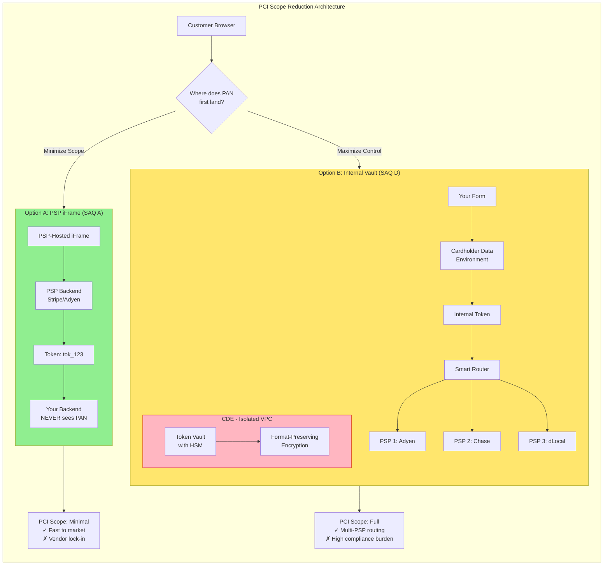
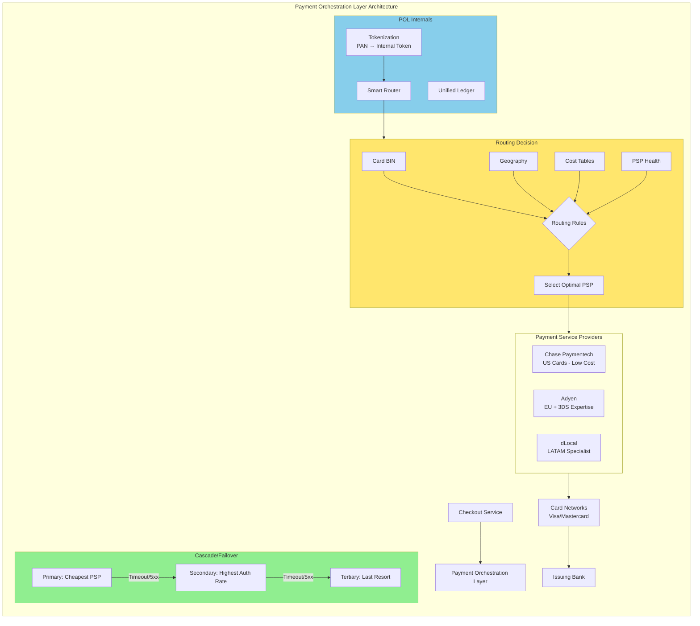

# PCI-DSS for Payment Systems

This guide covers 6 key areas: I. Executive Overview: The "Why" for Principal TPMs, II. Architectural Strategy: Scope Reduction and Tokenization, III. The 12 Requirements: A Principal TPM's Translation, IV. Build vs. Buy: The PSP Strategy, V. Incident Response and Data Breach Protocol, VI. Summary of Trade-offs & Business Capabilities.

## I. Executive Overview: The "Why" for Principal TPMs
At the Principal level, PCI-DSS (Payment Card Industry Data Security Standard) is not just a compliance checklist; it is a fundamental architectural constraint that dictates how your product handles data, how your microservices communicate, and how your infrastructure is segmented.

For Mag7 companies, the goal is rarely just "passing the audit." The goals are **Scope Reduction** and **Trust Preservation**.

*   **Real-World Mag7 Context:** If you are launching a new subscription service at YouTube or a checkout flow for AWS, you are operating at **Level 1** (over 6 million transactions annually). This requires an annual onsite audit by a Qualified Security Assessor (QSA).
*   **The TPM’s Role:** You act as the bridge between Product (who wants frictionless checkout), Engineering (who wants low latency), and Security/Compliance (who wants total isolation). Your job is to ensure the architecture minimizes the "Blast Radius" of cardholder data (CHD).

### Core Business Impact
*   **ROI:** Compliance allows you to process payments. Non-compliance leads to fines ($5k–$100k/month) and, more critically, revocation of card processing privileges, which effectively shuts down revenue.
*   **CX:** Security measures (like 3D Secure) introduce friction. The TPM must balance fraud prevention with conversion rates.

---

## II. Architectural Strategy: Scope Reduction and Tokenization

The guiding principle for a Principal TPM regarding PCI scope is simple: **If you do not need the card number (PAN), do not touch it.** If you must touch it, hold it for the shortest duration possible in the smallest blast radius possible.

Reducing the scope of the Cardholder Data Environment (CDE) is the single most effective way to reduce audit costs, operational overhead, and security risk.

### 1. Network Segmentation and Isolation

Network segmentation is the architectural practice of isolating the CDE from the rest of the corporate network. In a flat network, if a developer’s laptop in the marketing department is compromised, the attacker could theoretically pivot to the payment database. In a segmented network, this is architecturally impossible.

*   **Technical Implementation:**
    *   **VPC Isolation:** At Mag7 scale (e.g., AWS or Azure), the CDE should reside in a dedicated Virtual Private Cloud (VPC) or a completely separate AWS Account/GCP Project.
    *   **Ingress/Egress Filtering:** Strict Access Control Lists (ACLs) and Security Groups. Only whitelisted IPs and ports (usually HTTPS/443) can talk to the CDE.
    *   **Jump Boxes (Bastion Hosts):** Engineers cannot SSH directly into CDE servers. They must pass through a heavily monitored, multi-factor authenticated jump box.
    *   **Micro-segmentation:** Using tools like Istio or Envoy sidecars to enforce mutual TLS (mTLS) between services, ensuring that even within the CDE, Service A cannot talk to Database B unless explicitly authorized.

*   **Real-World Mag7 Example:**
    *   **Amazon:** Amazon’s retail checkout flow separates the "shopping cart" service (which holds items) from the "payment execution" service. The shopping cart service never sees the credit card number. It passes a `CartID` to the secure payment enclave, which collects the PAN, processes it, and returns a success/fail status. The shopping cart team operates outside the PCI scope, allowing them to deploy code 50+ times a day without security reviews for every change.

*   **Tradeoffs:**
    *   **Pros:** Drastically reduces the number of systems requiring audit (SAQ D to SAQ A or A-EP). Reduces "blast radius" of a breach.
    *   **Cons:** Increases architectural complexity. Debugging across segmented networks is difficult (logs must be centralized safely). Introduces latency due to extra network hops and encryption overhead.

### 2. Tokenization Strategies

Tokenization replaces the sensitive Primary Account Number (PAN) with a non-sensitive surrogate value (the "Token"). The mapping between the Token and the PAN is stored in a secure, centralized "Token Vault."

There are two primary tokenization strategies relevant to a Principal TPM:

#### A. Gateway Tokenization (PSP-Dependent)
You send the PAN directly to a provider like Stripe or Adyen via a client-side script (iFrame or SDK). They return a token (e.g., `tok_123`). You store `tok_123`.

*   **Mag7 Context:** Used by subsidiaries or specific low-volume products within a giant ecosystem (e.g., a newly acquired SaaS startup within Microsoft) to avoid integrating with the massive internal legacy payment bus immediately.
*   **Tradeoff:**
    *   **Vendor Lock-in:** You cannot easily switch from Stripe to Adyen because Stripe owns the mapping. To migrate, you must ask Stripe to export the PANs to the new provider, which is a complex, legal, and technical nightmare.

#### B. Internal Tokenization Service (The "Vault")
Mag7 companies almost always build or buy their own Tokenization Service. The company owns the Vault.

*   **Technical Implementation:**
    *   **Format Preserving Encryption (FPE):** The token looks like a credit card number (16 digits, passes Luhn check) but is mathematically generated. This allows legacy systems (like Mainframes or old ERPs) to process the token without crashing due to data type validation errors.
    *   **Detokenization:** When a transaction needs to be processed, the Payment Switch sends the Token to the Vault, retrieves the PAN, and sends it to the Bank/Network immediately.

*   **Real-World Mag7 Example:**
    *   **Netflix/Uber:** These companies operate globally and use "Smart Routing." They might route a transaction to Adyen in Europe and Chase Paymentech in the US. To do this, they need their own token. If they used Adyen's token, they couldn't route that transaction to Chase. They capture the PAN, tokenize it internally, and then detokenize it dynamically to send to the cheapest or highest-acceptance provider at that moment.

*   **Business Impact (ROI/Capabilities):**
    *   **Authorization Uplift:** Owning the token allows for "Network Tokenization" (Visa/Mastercard specific tokens), which often results in a 2-3% higher authorization rate compared to standard PAN processing.
    *   **Cost Savings:** Enables "Least Cost Routing" between multiple payment processors.

### 3. Hosted Payment Fields (iFrames) vs. API

The decision on how to capture data on the frontend dictates your compliance level.

*   **Direct Post / API:** The customer enters data into an HTML form served by your server. The data goes from the browser $\to$ your server $\to$ the PSP.
    *   **Scope:** Your servers handle CHD. You are fully in scope (SAQ D).
    *   **Mag7 Use Case:** Rarely used today unless you are the Payment Processor (e.g., Google Pay, Apple Pay).

*   **Hosted Fields (iFrame):** The input fields for the card number are actually an iFrame served directly from the PSP (or your internal Vault service).
    *   **Scope:** Your web server never sees the PAN. The browser sends it directly to the Vault. You qualify for SAQ A (lowest compliance burden).
    *   **Mag7 Use Case:** Standard for almost all checkout flows (e.g., Azure Portal checkout).

*   **Tradeoffs:**
    *   **CX vs. Security:** iFrames can be difficult to style and behave inconsistently across mobile browsers. However, the security benefit of keeping PANs off your web servers usually outweighs the UI friction.

### 4. Data Retention and Purging

Architectural strategy must include a "Data Lifecycle" plan. PCI-DSS Requirement 3.1 states you must keep storage to a minimum.

*   **The "CVV" Rule:** You may **NEVER** store the CVV2/CVC2 (the 3 or 4 digit code on the back), even encrypted. It is for one-time authorization only.
    *   **Failure Mode:** If a TPM allows a logging service to capture the full HTTP payload for debugging, and that payload includes the CVV, the company is instantly non-compliant and vulnerable.
*   **Real-World Behavior:** Mag7 automated scanners (like Amazon Macie or Google DLP API) constantly crawl S3 buckets, logs, and databases looking for credit card regex patterns. If found, they trigger a Sev-2 incident to purge the data.

---

## III. The 12 Requirements: A Principal TPM's Translation
You do not need to memorize the sub-requirements, but you must understand the six goals and how they affect your roadmap.

### Goal 1: Build and Maintain a Secure Network
*   **Req 1 (Firewalls) & Req 2 (No Defaults):**
    *   **TPM Implication:** You cannot just spin up a default EC2 instance or container for a payment app. You must use hardened images (Golden AMIs). This impacts **Sprint Velocity** as infrastructure setup takes longer.

### Goal 2: Protect Cardholder Data
*   **Req 3 (Protect Stored Data) & Req 4 (Encrypt in Transit):**
    *   **TPM Implication:** **Data Retention Policy** is key here. "If you don't need it, don't store it."
    *   **Mag7 Trade-off:** Storing the CVV (the 3-4 digit code) after authorization is **strictly forbidden**. If Product wants to store CVV to "reduce friction for next time," you must block it. It is a violation that causes immediate audit failure.

### Goal 3: Maintain a Vulnerability Management Program
*   **Req 5 (Malware Protection) & Req 6 (Secure Systems/Apps):**
    *   **TPM Implication:** This dictates your SDLC. You must integrate SAST/DAST (Static/Dynamic Application Security Testing) into your CI/CD pipeline.
    *   **Business Impact:** If a critical CVE (Common Vulnerabilities and Exposures) is found, your feature roadmap pauses. Patching the CDE takes priority over shipping new features.

### Goal 4: Implement Strong Access Control Measures
*   **Req 7 (Need to Know), Req 8 (Unique IDs), Req 9 (Physical Access):**
    *   **TPM Implication:** No shared SSH keys. Multi-Factor Authentication (MFA) is mandatory for CDE access.
    *   **CX Impact:** Internal developer friction increases. Devs cannot "SSH into prod" to debug a payment failure easily. You must build better observability and logging tools to compensate.

### Goal 5: Regularly Monitor and Test Networks
*   **Req 10 (Logging) & Req 11 (Penetration Testing):**
    *   **TPM Implication:** Logs must be immutable and stored for 1 year. You must schedule external Pen Tests annually and internal scans quarterly.
    *   **ROI:** Pen tests are expensive and time-consuming. You must budget for "remediation sprints" following a pen test.

### Goal 6: Maintain an Information Security Policy
*   **Req 12 (Documentation):**
    *   **TPM Implication:** If it isn't documented, it doesn't exist. You ensure the "System Security Plan" is updated as the architecture evolves.

---

## IV. Build vs. Buy: The PSP Strategy

At the Principal TPM level, the "Build vs. Buy" decision in payments is rarely binary. For Mag7 companies operating at hyperscale, the strategy almost invariably shifts toward a **Hybrid Multi-PSP Orchestration** model. You are not choosing between building a payments platform from scratch or using Stripe; you are deciding how much of the orchestration layer to own to commoditize your underlying providers.

### 1. The Mag7 Reality: Payment Orchestration Layers (POL)

In a startup, "Buy" means integrating a full-stack PSP (like Stripe or Braintree) to handle the UI, PCI compliance, gateway, and acquiring. In a Mag7 environment, "Buy" creates vendor lock-in and erodes margins.

Consequently, Mag7 companies typically **build** an internal Payment Orchestration Layer (POL) and **buy** the underlying connectivity to banking networks via multiple PSPs.

*   **Mag7 Architecture:** The internal POL acts as a switch. It ingests a transaction request from the checkout service, tokenizes the PAN (Primary Account Number) into an internal format, and then dynamically routes the transaction to the most optimal PSP based on logic defined by Product and Finance.
*   **Real-World Example:** Consider **Uber** or **Netflix**. They do not rely on a single global processor. They might route a US Visa transaction to Chase Paymentech (for cost), a Dutch iDEAL transaction to Adyen (for local acceptance), and a backup route to Stripe if the primary line fails.
*   **The "Build" Component:** You are building the routing logic, the unified API abstraction, and crucially, the **Token Vault**.
*   **The "Buy" Component:** You are buying the license to transact with Visa/Mastercard and the banking relationships held by the acquirers.

### 2. Strategic Pivot Point: Owning the Token Vault

The single most critical technical decision in this strategy is the ownership of the credit card token.

*   **The Trap (Pure Buy):** If you use a PSP’s native tokenization (e.g., a Stripe Token), that data is useless if you try to send it to Adyen. You are technically locked in. Migrating requires asking the PSP to export millions of PANs, a risky, expensive, and legally complex process.
*   **The Principal Strategy (Internal Vault):** Mag7s build or license a provider-agnostic Token Vault.
    *   **How it works:** The raw PAN enters your PCI-compliant environment (or a dedicated third-party vault like VGS) and is exchanged for an *internal* token.
    *   **The Capability:** When a transaction occurs, your POL sends the raw PAN to whichever PSP is selected for that specific transaction.
    *   **Business Impact:** This grants you **portability**. You can switch traffic from Provider A to Provider B instantly without asking customers to re-enter details. This leverage allows Mag7 procurement teams to negotiate aggressive rate reductions (basis points) by threatening to reroute volume.

### 3. Smart Routing and Failover Logic

Once you own the orchestration layer, the TPM must define the logic for the "Smart Router." This is where Business, Engineering, and Data Science converge.

**Routing Strategies & Tradeoffs:**

| Strategy | Logic | Tradeoff | Mag7 Use Case |
| :--- | :--- | :--- | :--- |
| **Cost Optimization** | Route to the provider with the lowest fees for that specific card type (BIN) and currency. | High complexity to maintain fee tables; potential hit to Auth Rates if the cheap provider has poor bank relationships. | **Amazon AWS:** High volume, lower margin B2B flows where 5bps savings = millions in profit. |
| **Auth Rate Optimization** | Route to the provider historically most likely to get a "Success" response for that specific issuer. | Higher transaction fees. | **Google Play/YouTube:** Digital goods have high margins; a failed transaction is lost revenue. Acceptance > Cost. |
| **Availability (Failover)** | If PSP A returns a 5xx error or timeout, immediately retry with PSP B. | Increased latency for the user during retry; risk of double-charging if not handled idempotently. | **Azure/Cloud Checkout:** Critical infrastructure uptime requirements. |

### 4. Local Payment Methods (LPMs) and Market Expansion

While Mag7s build the core card processing layer, they almost exclusively **Buy** access to Local Payment Methods. Building direct integrations into local schemes (like PIX in Brazil, UPI in India, or Konbini in Japan) is operationally unsustainable due to shifting local regulations.

*   **The "Wrapper" Pattern:** The Principal TPM drives the architecture where the internal POL has a generic "Payment Method" interface.
*   **Implementation:** When expanding to Indonesia, rather than building a direct bank connection, the TPM selects a specialized aggregator (e.g., Xendit or local Adyen endpoints) and integrates them as a plugin to the POL.
*   **Tradeoff:** You pay a higher markup to the aggregator, but you gain speed to market (weeks vs. years) and offload the regulatory burden of local compliance.

### 5. Impact Analysis: ROI, CX, and Capability

**ROI (Return on Investment):**
*   **Basis Point Arbitrage:** By building a multi-PSP setup, a Mag7 company processing $50B annually can save 10 basis points (0.10%) by routing effectively. That is **$50M in pure EBITDA** impact annually.
*   **Downtime Mitigation:** If a single PSP goes down (e.g., the Wirecard collapse), a "Buy" strategy halts revenue. A "Build/Orchestrate" strategy simply reroutes traffic, preserving millions in revenue per hour.

**CX (Customer Experience):**
*   **Latency:** The "Build" layer introduces a hop. The TPM must ensure the orchestration layer adds <50ms overhead.
*   **False Declines:** Smart routing can recover 1-3% of transactions that would otherwise be falsely declined by a single provider. For a subscription business (like Spotify or Netflix), this reduces involuntary churn significantly.

**Business Capabilities:**
*   **Reconciliation:** The hardest part of the "Build" strategy is unifying data. You will receive settlement files in different formats (CSV, XML, JSON) from different providers. The TPM must oversee the build of a **Unified Ledger** that normalizes this data for Finance. Without this, the cost savings of multi-PSP are eaten up by manual accounting labor.

### 6. Summary of Tradeoffs

| Choice | Pros | Cons |
| :--- | :--- | :--- |
| **Single PSP (Pure Buy)** | Fast integration, simple reconciliation, low engineering overhead. | Vendor lock-in, single point of failure, higher fees, lower auth rates globally. |
| **Direct Acquiring (Pure Build)** | Lowest possible fees, total control. | Massive regulatory burden (becoming a bank/PayFac), high maintenance, distracting from core product. |
| **Orchestration (Hybrid)** | **(Recommended)** Vendor leverage, high resiliency, optimized auth rates. | High initial engineering cost, complex reconciliation, requires specialized internal talent. |

## V. Incident Response and Data Breach Protocol
A Principal TPM must know what happens when things go wrong.

### The "P0" Scenario
If a database containing PANs is exposed:
1.  **Containment:** Isolate the affected segment immediately.
2.  **Forensics:** Do not reboot servers (you lose RAM forensics).
3.  **Notification:** Card brands (Visa/Mastercard) must be notified immediately.
4.  **Consequences:**
    *   **Fines:** Up to $500,000 per incident.
    *   **Level Escalation:** If you were a lower-level merchant, you are forcibly moved to Level 1 (annual onsite audits).
    *   **Monitoring Costs:** You may be required to pay for credit monitoring for all affected customers.

### TPM Action Item
Ensure your team runs **Tabletop Exercises** (Simulations) for a data breach. A plan that hasn't been tested is a hallucination.

---

## VI. Summary of Trade-offs & Business Capabilities

```mermaid
graph TB
    subgraph "PCI-DSS Strategic Decision Matrix"
        direction TB

        subgraph VAULT_DECISION["1. Token Vault Strategy"]
            PSP_HOSTED[PSP-Hosted<br/>Stripe/Adyen Tokens]
            OWN_VAULT[Owned Vault<br/>Internal Tokenization]

            PSP_HOSTED --> PSP_PRO[✓ SAQ A scope<br/>✓ Fast time-to-market<br/>❌ Vendor lock-in<br/>❌ No least-cost routing]
            OWN_VAULT --> VAULT_PRO[✓ PSP independence<br/>✓ Smart routing<br/>❌ SAQ D full scope<br/>❌ HSM/security team needed]
        end

        subgraph NETWORK_DECISION["2. Network Segmentation"]
            PHYSICAL[Physical Isolation<br/>Separate AWS Account]
            LOGICAL[Logical Isolation<br/>VLANs/Security Groups]

            PHYSICAL --> PHYS_PRO[✓ Simple audit scope<br/>✓ Blast radius contained<br/>❌ Cross-boundary debugging hard]
            LOGICAL --> LOG_PRO[❌ Scope creep risk<br/>❌ One misconfiguration = disaster<br/>Discouraged at Mag7 scale]
        end

        subgraph UX_DECISION["3. Fraud vs. Conversion"]
            AGGRESSIVE_3DS[Aggressive 3DS<br/>Always Challenge]
            FRICTIONLESS[Frictionless Flow<br/>Risk-Based Challenge]

            AGGRESSIVE_3DS --> AGG_PRO[✓ Liability shift<br/>✓ Lower fraud<br/>❌ Cart abandonment +5-15%]
            FRICTIONLESS --> FRIC_PRO[✓ Higher conversion<br/>❌ Absorb some fraud<br/>Model: Cost of fraud vs abandonment]
        end

        subgraph MATURITY["Maturity Progression"]
            STARTUP[Startup<br/>Single PSP<br/>SAQ A]
            SCALEUP[Scale-Up<br/>Failover Routing<br/>SAQ A-EP]
            MAG7[Mag7<br/>Smart Orchestration<br/>SAQ D + Vault]

            STARTUP --> SCALEUP --> MAG7
        end
    end

    style PSP_HOSTED fill:#90EE90
    style OWN_VAULT fill:#FFE66D
    style PHYSICAL fill:#90EE90
    style LOG_PRO fill:#FFB6C1
    style MAG7 fill:#87CEEB
```

At the Principal TPM level, architectural decisions regarding PCI-DSS are rarely binary choices between "secure" and "insecure." Instead, they are strategic negotiations between **Business Velocity** (how fast can we ship/iterate), **Vendor Neutrality** (can we switch processors), and **Operational Overhead** (audit fatigue and engineering maintenance).

The following matrix summarizes the critical architectural trade-offs a Principal TPM must navigate, specifically within the context of high-volume (Mag7) environments.

### 1. The Vault Strategy: Native vs. PSP-Hosted
The most significant strategic decision is where Cardholder Data (CHD) rests at rest.

*   **Option A: PSP-Hosted (Tokenization via Stripe/Adyen)**
    *   **Behavior:** The frontend posts directly to the PSP; your backend only stores a non-sensitive token (e.g., `tok_123`).
    *   **Mag7 Context:** Used for non-core products, acquisitions (e.g., a newly acquired SaaS tool at Google before integration), or specific geo-expansions where local compliance is heavy.
    *   **Trade-offs:**
        *   *Pros:* Lowest PCI scope (SAQ A). Fastest time-to-market. Zero liability for data breaches of the vault.
        *   *Cons:* **Vendor Lock-in.** You cannot easily migrate 50 million stored tokens from Stripe to Adyen without massive friction/fees. You lose "Least Cost Routing" capabilities because the token is tied to the processor.
    *   **Impact:** Reduces engineering headcount requirements but increases OpEx (transaction fees) and reduces negotiating leverage with payment processors.

*   **Option B: Owned/Agnostic Vault (Payment Orchestration)**
    *   **Behavior:** You build a highly secured, isolated CDE (Cardholder Data Environment) whose *only* job is to tokenize incoming PANs (Primary Account Numbers) and route them to multiple processors.
    *   **Mag7 Context:** Netflix, Uber, and Amazon operate this way. They ingest the PAN, vault it internally (or use a neutral vault like VGS), and then route the transaction to Chase, Adyen, or dLocal based on whoever offers the highest authorization rate or lowest fee for that specific bin/geo.
    *   **Trade-offs:**
        *   *Pros:* **Strategic Independence.** You can route traffic dynamically. If Processor A goes down, you route to Processor B. You own the data.
        *   *Cons:* **Maximum PCI Scope (SAQ D).** You are responsible for the encryption, HSMs (Hardware Security Modules), and physical security of the data. High CapEx and high maintenance.
    *   **Impact:** High ROI at scale (saving 0.1% on billions in volume is massive) but requires a dedicated "Payments Engineering" team.

### 2. Network Segmentation: Physical vs. Logical
How strictly do you isolate the CDE?

*   **Option A: Strict Physical/Account Isolation**
    *   **Behavior:** The CDE exists in a completely separate AWS Account/GCP Project with no VPC peering to the main production network. Communication occurs only via rigidly defined APIs over mTLS.
    *   **Mag7 Context:** Standard for core checkout services. AWS Billing operates in a silo distinct from the EC2 control plane.
    *   **Trade-offs:**
        *   *Pros:* Drastically simplifies the audit. The QSA (auditor) only looks at the isolated account. "Blast radius" is contained.
        *   *Cons:* **Observability Friction.** You cannot simply pipe logs from the CDE to the corporate Splunk/Datadog instance without scrubbing. Debugging cross-boundary latency issues is difficult.
    *   **Impact:** Increases Mean Time to Resolution (MTTR) for payment failures due to visibility barriers, but protects the wider organization from compliance drag.

*   **Option B: Logical Segmentation (VLANs/Security Groups)**
    *   **Behavior:** CDE services run on the same cluster or network fabric but are restricted by firewall rules and IAM policies.
    *   **Trade-offs:**
        *   *Pros:* Easier infrastructure management; shared tooling.
        *   *Cons:* **Scope Creep.** Misconfiguration of a single security group can bring the entire production network into PCI scope. Auditors will demand evidence for the entire shared fabric.
    *   **Impact:** High risk of audit failure or prolonged audit timelines. Generally discouraged at Mag7 scale due to the complexity of proving isolation.

### 3. User Experience vs. Fraud Controls (3DS)
Balancing PSD2 (European regulation) and fraud checks against conversion.

*   **The Decision:** Implementing 3-D Secure (3DS) / Strong Customer Authentication (SCA).
*   **Mag7 Context:** Amazon avoids 3DS whenever possible in the US to preserve "1-Click" ordering, absorbing the fraud cost. In the EU, they implement "frictionless flow" 3DS, where data is exchanged in the background, only challenging the user if absolutely necessary.
*   **Trade-offs:**
    *   *Aggressive Fraud Checks:* Liability shifts to the card issuer (you don't pay for chargebacks), but cart abandonment increases due to friction.
    *   *Passive/No Checks:* Maximum conversion (revenue), but you eat the cost of fraud.
*   **Impact:** A Principal TPM must model the **Cost of Fraud vs. Cost of Abandonment**. If 3DS saves \$1M in fraud but causes \$5M in lost sales due to friction, the business decision is to disable 3DS (where legally possible) and absorb the loss.

### 4. Data Utility vs. Compliance (The "Data Lake" Problem)
Product Managers and Data Scientists want transaction data for personalization and ML models.

*   **The Constraint:** You cannot store PANs or CVVs in data warehouses (BigQuery, Redshift, Snowflake).
*   **Mag7 Strategy:**
    *   **Truncation:** Store only first-6/last-4 digits. Useful for customer support but useless for rebilling.
    *   **Fingerprinting:** Generate a one-way hash of the PAN. This allows analytics teams to track "unique users" and "velocity" (e.g., this card was used 5 times today) without ever seeing the raw number.
*   **Trade-off:**
    *   *Strict Masking:* Compliance is easy, but Marketing cannot retarget users effectively based on spend behavior.
    *   *De-tokenization Access:* Building a controlled environment where specific approved services can "detokenize" for valid business reasons. High complexity, high risk.
*   **Impact:** Capability to detect fraud patterns (ML models need history) vs. Risk of massive data leak. The standard Mag7 approach is **Tokenized Lakes**—analytics run on tokens, not PANs.

### Summary of Capabilities by Maturity Level

| Capability | Startup / Level 4 | Scale-up / Level 2-3 | Mag7 / Level 1 Principal View |
| :--- | :--- | :--- | :--- |
| **Payment Routing** | Single Processor (e.g., Stripe only). | Failover routing (Primary + Backup). | **Dynamic Orchestration:** Routing based on bin-range, currency, and real-time health. |
| **Data Ownership** | None (Tokens owned by PSP). | Partial (Mixed tokens). | **Vault Ownership:** Agnostic tokens mapped to multiple PSPs. |
| **Compliance Scope** | SAQ A (Outsourced). | SAQ A-EP (Hybrid). | **SAQ D (Full Scope):** Necessary to control the UX and economics. |
| **CX Friction** | High (Standard PSP forms). | Medium (Custom UI). | **Invisible:** Native integration, background risk scoring, 1-click optimization. |

---

---

## Interview Questions

### II. Architectural Strategy: Scope Reduction and Tokenization

### Question 1: The "Loyalty" Feature Request
**Scenario:** "A Product Manager from the Loyalty team wants to use the customer's credit card number as a unique identifier to look up loyalty points at the Point of Sale, to reduce friction (so users don't have to scan a separate loyalty card). They are asking the Engineering team to store a hash of the credit card number in the Loyalty Database. As the Principal TPM for Payments, how do you evaluate this request?"

**Guidance for a Strong Answer:**
*   **Identify the Risk:** Hashing is allowed, but it effectively brings the Loyalty Database into PCI scope if not done correctly (e.g., using simple SHA-256 without salt is reversible via rainbow tables).
*   **Scope Creep:** Moving card data (even hashed) outside the CDE into a Loyalty system expands the audit scope to the Loyalty infrastructure, potentially costing millions.
*   **Propose Alternatives:** Suggest using the **Token** instead of the PAN hash. If the Loyalty system is integrated with the Vault, it can use the Token ID as the customer identifier.
*   **Business Tradeoff:** If they absolutely must use the card (e.g., for physical terminal recognition), discuss **Truncation**. You can store the first 6 (BIN) and last 4 digits. Is that enough uniqueness for loyalty lookup? (Likely not, but it's a discussion point).
*   **Verdict:** Deny the request to store PAN hashes in a general-purpose DB. Architect a solution using tokens or a dedicated, isolated cross-reference service.

### Question 2: Multi-Region Token Vault
**Scenario:** "We are expanding our e-commerce platform to Europe and need to comply with GDPR and data residency laws. However, we have global travelers. A US user travels to France and buys something. Our new architecture requires a Token Vault in the EU and one in the US. How do you architect the synchronization of tokens to ensure the user doesn't have to re-enter their card, while respecting data residency?"

**Guidance for a Strong Answer:**
*   **Data Residency vs. Replication:** Acknowledge that you cannot simply replicate the full PAN database globally if strict residency laws apply (though PCI allows it, GDPR/local laws might complicate it).
*   **Architecture - The "Pointer" Record:** Store the full PAN only in the user's "Home" region (US). Replicate only the *Token* and a metadata "pointer" to the EU region.
*   **The Transaction Flow:** When the US user transacts in France:
    1. The EU Vault sees the Token.
    2. It recognizes the Token belongs to the US Vault (via the pointer/metadata).
    3. It makes a secure, real-time API call to the US Vault to get a one-time cryptogram or to proxy the authorization request.
*   **Latency vs. UX:** Discuss the latency hit (trans-Atlantic call) vs. the friction of asking the user to re-enter the card.
*   **Edge Case:** What if the US region is down? The user fails to checkout. Discuss "Stand-in Processing" or fallback to asking for card entry.

### IV. Build vs. Buy: The PSP Strategy

### Question 1: Designing for Resiliency and Cost
"We are launching a new high-volume subscription service in three regions: US, Europe, and India. Management wants to minimize transaction fees, but Engineering is worried about downtime. Design a high-level payment architecture. Do we build direct connections or use a PSP? How do we handle the conflict between cost and reliability?"

**Guidance for a Strong Answer:**
*   **Rejection of Binary Choice:** The candidate should immediately propose a Multi-PSP strategy with an orchestration layer, not a single provider.
*   **Regional Nuance:**
    *   *US:* Route based on cost (Cost-based routing) using major acquirers.
    *   *Europe:* Prioritize a PSP with strong PSD2/3DS support to minimize friction.
    *   *India:* Acknowledge RBI regulations (recurring mandates are complex). Suggest "Buying" a specialized local provider rather than optimizing for cost immediately.
*   **The "Cascade" Logic:** Explain the fallback mechanism. Primary route = Cheapest Provider. If it fails/timeouts -> Secondary route = Most Reliable Provider.
*   **Tokenization:** Mention the need for an agnostic token vault so the user's card can be tried on both providers without re-entry.

### Question 2: The "Merchant of Record" Dilemma
"Our product team wants to expand into 20 new countries next quarter. Our current billing engine was built in-house for the US and UK. The legal team is flagging tax nexus issues and local entity requirements in these new regions. As a TPM, do you advocate for extending our in-house build or adopting a Merchant of Record (MoR) solution like Paddle or Digital River? Walk me through the tradeoffs."

**Guidance for a Strong Answer:**
*   **Speed vs. Margin:** Acknowledge that 20 countries in one quarter is impossible with an in-house build due to legal entity formation and tax registration.
*   **The MoR Solution:** Explain that an MoR acts as the reseller, handling VAT/GST remittance and compliance. This is the only way to hit the timeline.
*   **The Tradeoff:** MoR fees are high (5-7% vs. 2-3% for standard PSPs).
*   **The Hybrid Strategy:** Propose using an MoR for the "Long Tail" of small countries to validate the market (Speed), while maintaining the direct in-house stack for the US/UK (Margin). Once a new country reaches critical revenue volume, migrate it off the MoR to the internal stack to recover margin.

### VI. Summary of Trade-offs & Business Capabilities

### Question 1: The "Build vs. Buy" Pivot
**Scenario:** "We are currently using a third-party PSP (like Stripe) for everything. Our transaction volume has tripled, and the CFO wants to negotiate better rates by adding a second processor. However, our engineering team says we are 'locked in' because we don't have the raw card numbers, only PSP-specific tokens. As a Principal TPM, how do you drive a strategy to solve this without breaking the checkout flow?"

**Guidance for a Strong Answer:**
*   **Strategic Analysis:** Acknowledge the "Vendor Lock-in" problem. The candidate should identify that moving away from a single PSP requires a **Data Migration** strategy and likely the introduction of a **Payment Orchestration Layer** or a neutral vault (like VGS).
*   **Technical Execution:** Explain the concept of a "Batch Migration" (asking the current PSP to export PANs to a new secure vault—a legally complex but standard process).
*   **Risk Management:** Discuss the "Blast Radius." You don't switch 100% of traffic overnight. Propose a **Strangler Fig pattern**: Route 1% of *new* traffic to the new vault/processor while maintaining the legacy flow for existing subscriptions, gradually migrating cohorts.
*   **ROI Focus:** The answer must justify the engineering effort (building a vault/orchestration layer) against the savings (basis points reduction in fees).

### Question 2: Debugging in the CDE
**Scenario:** "Your Payments Engineering team is seeing a 1% failure rate on transactions that seems to be related to specific card types. To debug this, the Lead Engineer proposes temporarily logging the full HTTP payload (including the PAN) to a secure, short-retention S3 bucket accessible only by senior devs. Do you approve this? If not, how do you help them debug?"

**Guidance for a Strong Answer:**
*   **Immediate Rejection:** A strong candidate must immediately identify this as a **Critical PCI Violation**. Storing unencrypted PANs (even briefly, even in S3) violates PCI-DSS requirement 3.4. It puts the company’s processing ability at risk.
*   **Alternative Solutions:** Propose compliant debugging methods:
    1.  **Masking:** Log first-6/last-4 only (usually sufficient to identify card types/issuers).
    2.  **The "Check Digit" approach:** Verify the Luhn algorithm without logging the number.
    3.  **PSP Logs:** Rely on the logs provided by the payment processor (who *is* allowed to see the data) rather than internal application logs.
    4.  **Ephemeral Access:** If absolutely necessary, use a "break glass" mechanism where an engineer can view *live* traffic via a secure, non-recording bastion host, but *never* write the data to disk/logs.

---

## Key Takeaways

- Review each section for actionable insights applicable to your organization

- Consider the trade-offs discussed when making architectural decisions

- Use the operational considerations as a checklist for production readiness
