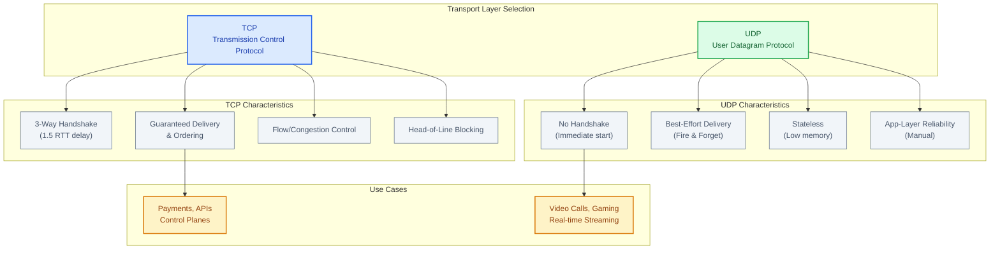
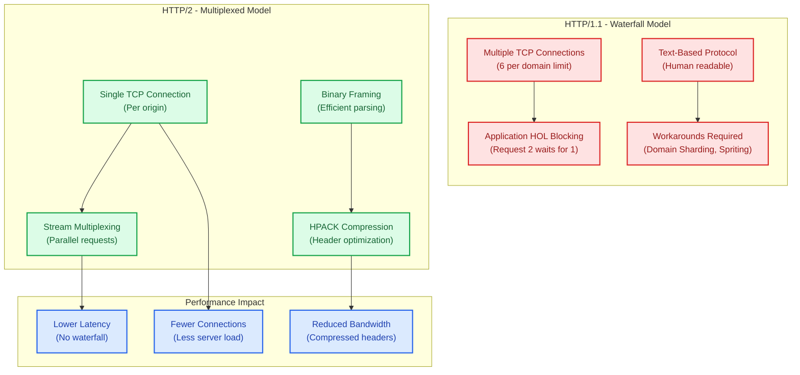
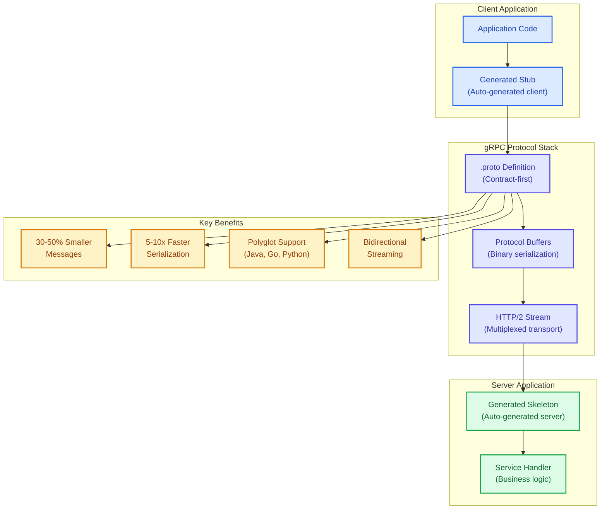
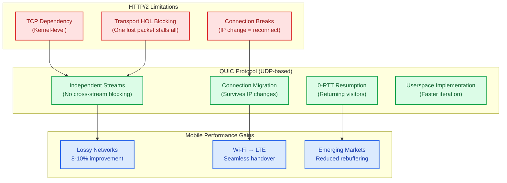
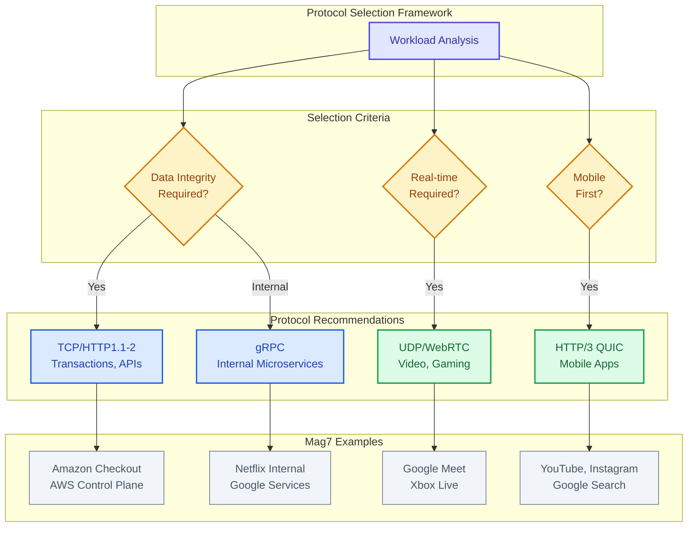

# Protocol Fundamentals

This guide covers 5 key areas: I. Transport Layer Foundations: TCP vs. UDP, II. The Evolution of Web Traffic: HTTP/1.1 vs. HTTP/2, III. The Internal Standard: gRPC (Google Remote Procedure Call), IV. The Mobile Frontier: HTTP/3 (QUIC), V. Strategic Summary for the Principal TPM.

## I. Transport Layer Foundations: TCP vs. UDP

At the Principal level, the choice between TCP and UDP is not merely a technical configuration; it is a product decision that defines the **Reliability vs. Latency** curve of your application. You are trading data integrity guarantees for raw speed, or engineering simplicity for complex custom implementation.

### Technical Deep-Dive: The Mechanics of the Tradeoff

**TCP (Transmission Control Protocol): The "guaranteed" pipe**
TCP provides an abstraction layer that allows application engineers to ignore network instability.
*   **Connection Setup:** Requires a 3-way handshake (SYN, SYN-ACK, ACK). This introduces a mandatory **1.5 Round Trip Time (RTT)** delay before a single byte of application data is sent. On a mobile network with 100ms latency, TCP adds 150ms of "dead air" to every new connection.
*   **Flow & Congestion Control:** TCP automatically throttles transmission if the receiver is overwhelmed or the network is congested. It prevents a single application from collapsing the network.
*   **Head-of-Line (HOL) Blocking:** This is the critical performance bottleneck. Because TCP guarantees ordering, if Packet 1 is lost but Packet 2 and 3 arrive, the OS kernel holds Packets 2 and 3 in a buffer until Packet 1 is re-transmitted. To the application (and the user), this looks like the connection froze.

**UDP (User Datagram Protocol): The "raw" pipe**
UDP is a thin wrapper around IP. It provides port numbers (multiplexing) and a checksum (integrity), but nothing else.
*   **Fire and Forget:** No handshake. Data transmission begins immediately.
*   **No State:** The server does not maintain connection status, allowing for massive vertical scaling (millions of concurrent clients) with lower memory overhead compared to TCP.
*   **Application-Layer Responsibility:** If you need reliability, ordering, or congestion control over UDP, your engineering team must build it manually in the application layer.

**The Paradigm Shift: QUIC and HTTP/3**
Mag7 companies are increasingly abandoning pure TCP for web traffic. **QUIC (Quick UDP Internet Connections)** is a protocol built on top of UDP that enforces reliability and security *in user space* rather than kernel space. It powers HTTP/3.
*   **Why:** It solves TCP's Head-of-Line blocking. If Stream A loses a packet, Stream B (on the same connection) continues processing without waiting.
*   **Relevance:** This is the current standard for Google Search, YouTube, and Meta apps to ensure performance on lossy mobile networks.

### Mag7 Real-World Behavior

**A. The "Zero-Loss" Requirement (TCP)**
*   **Amazon (Checkout & Payments):** Transactional systems utilize TCP (often via HTTPS/TLS). The business cost of a failed packet (a lost order) is infinite compared to the cost of 50ms latency. The overhead of the handshake is mitigated by **Keep-Alive** connections, keeping the TCP pipe open for multiple requests.
*   **Azure/AWS Control Plane:** When an API request is sent to provision an EC2 instance, it uses TCP. The system state must remain strictly consistent.

**B. The "Real-Time" Requirement (UDP)**
*   **Google Meet / Microsoft Teams / Zoom:** These use UDP (specifically RTP/WebRTC).
    *   *Scenario:* You are on a video call. A packet containing audio for the timestamp 00:05 is dropped.
    *   *TCP behavior:* The audio halts while the client requests a re-transmission. The audio resumes 400ms later, out of sync with reality.
    *   *UDP behavior:* The client plays silence or interpolates the noise for 20ms and plays the next packet immediately. The conversation flows naturally.
*   **Online Gaming (Xbox Live / PSN):** Player position updates are sent via UDP. If a "move left" packet is lost, the server relies on the next "move left" packet arriving 16ms later rather than pausing the game to recover the old one.

**C. The Hybrid Approach (QUIC/HTTP3)**
*   **YouTube & Google Search:** Google deployed QUIC (UDP) globally. They found that on poor networks (e.g., emerging markets on 3G), QUIC reduced re-buffering rates significantly compared to TCP because packet loss didn't stall the entire download stream.

### Tradeoffs Analysis

| Feature | TCP | UDP | Business/Product Impact |
| :--- | :--- | :--- | :--- |
| **Reliability** | Guaranteed delivery & ordering. | Best-effort. | **TCP:** High data integrity, lower error-handling logic costs. **UDP:** Potential data loss; requires logic to handle gaps. |
| **Latency** | High (Handshake + HOL Blocking). | Low (Immediate). | **TCP:** Slower "Time to First Byte" (TTFB). Bad for real-time CX. **UDP:** Instant start. Critical for voice/video/gaming. |
| **Engineering Cost** | Low. OS handles complexity. | High. Engineers must write reliability logic. | **TCP:** Faster Time-to-Market. **UDP:** Higher dev effort; requires senior networking engineers. |
| **Infrastructure** | Higher memory (connection state). | Lower memory (stateless). | **UDP:** Can support higher concurrency per server, improving hardware ROI. |
| **Firewalls** | Universally accepted. | Often blocked by corp firewalls. | **UDP:** Requires fallback mechanisms (e.g., trying UDP, failing over to TCP), increasing client complexity. |

### Impact on Business Capabilities & ROI

*   **ROI on Infrastructure:** UDP services generally require less memory per concurrent user, allowing for denser packing of services (e.g., DNS servers), which improves infrastructure ROI.
*   **User Retention (CX):** For streaming and gaming, UDP is directly correlated with retention. A 1% increase in buffering (caused by TCP HOL blocking) can lead to measurable drops in watch time.
*   **Mobile Performance:** TCP performs poorly on mobile networks where signal drops are common. Moving to UDP-based protocols (QUIC) improves the experience for mobile-first user bases (e.g., Instagram, TikTok), directly impacting engagement metrics.

### Actionable Guidance for Principal TPMs

1.  **Challenge the Default:** If your engineering team proposes TCP for a high-frequency, real-time data ingestion stream (e.g., IoT telemetry), ask: *"Can we tolerate data gaps? If so, why pay the latency tax of TCP?"*
2.  **Identify HOL Blocking:** If your application suffers from latency spikes specifically on mobile networks (packet loss environments) but looks fine on WiFi, you are likely hitting TCP Head-of-Line blocking. Propose investigating HTTP/3 (QUIC).
3.  **Mandate Fallbacks:** If approving a design based on UDP (or WebRTC), ensure the requirements include a **TCP Fallback**. Many corporate firewalls block non-standard UDP ports. If the UDP connection fails, the app must silently switch to TCP/HTTPS to prevent total service outage.

### Edge Cases and Failure Modes

*   **The "Thundering Herd" (UDP):** Because UDP lacks built-in congestion control, a misconfigured client can flood the server with packets, effectively DDoS-ing your own backend. *Mitigation:* You must implement rate limiting at the application layer or API Gateway.
*   **MTU Fragmentation:** UDP packets larger than the Maximum Transmission Unit (usually 1500 bytes) get fragmented. If one fragment is lost, the whole packet is lost. *Mitigation:* Keep UDP payloads small (under 1400 bytes).
*   **Deep Packet Inspection (DPI) Blocking:** Some ISPs or governments throttle UDP traffic because they cannot easily inspect it (especially QUIC).

---

## II. The Evolution of Web Traffic: HTTP/1.1 vs. HTTP/2

At the Principal level, understanding HTTP versions is not about syntax; it is about **resource utilization and latency management**. The shift from HTTP/1.1 to HTTP/2 represents a fundamental move from a resource-heavy, synchronous model to a streamlined, asynchronous model. This shift dictates how you architect microservices (gRPC), how you manage mobile client latency, and how you scale load balancers.

### The Technical Shift: From Text to Binary Multiplexing

**HTTP/1.1: The Waterfall Model**
*   **Text-Based:** Protocol data is human-readable.
*   **Synchronous & Serial:** To fetch 10 images, the browser opens a TCP connection, requests Image A, waits for the response, then requests Image B.
*   **The Constraint:** Browsers limit simultaneous connections per domain (usually 6). If a page has 100 assets, the 7th asset waits until one of the first 6 finishes. This is **Application-Layer Head-of-Line (HOL) Blocking**.
*   **The Hacks:** To bypass this, we historically used **Domain Sharding** (serving assets from `img1.cdn.com`, `img2.cdn.com`) to trick the browser into opening more connections, and **Spriting** (combining images) to reduce request counts.

**HTTP/2: The Multiplexed Model**
*   **Binary Framing:** The protocol is no longer text-based; it is binary. This is more efficient to parse and less error-prone.
*   **Multiplexing (The Game Changer):** HTTP/2 allows multiple request/response streams to happen in parallel over a **single** TCP connection. The "waterfall" is gone.
*   **Header Compression (HPACK):** In HTTP/1.1, cookies and auth tokens are resent in plain text with every request, consuming massive bandwidth. HTTP/2 compresses headers, maintaining a state table at both ends.

### Mag7 Real-World Behavior

**A. Internal Microservices (Google/Netflix - gRPC)**
At Mag7 scale, JSON-over-HTTP/1.1 is too slow and verbose for internal service-to-service communication.
*   **Implementation:** Companies use **gRPC** (Remote Procedure Call), which runs exclusively on **HTTP/2**.
*   **Why:** gRPC leverages HTTP/2's binary framing and multiplexing to allow thousands of internal microservice calls to flow over persistent long-lived connections. This dramatically reduces CPU usage on serialization/deserialization compared to JSON.

**B. The Mobile "Last Mile" (Facebook/Instagram)**
Mobile networks have high latency (RTT).
*   **Implementation:** The news feed fetch logic is optimized for HTTP/2.
*   **Why:** Opening a new TCP connection (3-way handshake) + TLS handshake takes multiple round trips. With HTTP/1.1, fetching a feed with 50 items required constantly opening new connections or waiting. With HTTP/2, the app opens **one** connection and streams all metadata and thumbnails simultaneously.

**C. CDN Edge Termination (AWS CloudFront/Azure CDN)**
*   **Implementation:** Load Balancers and CDNs terminate HTTP/2 from the client but often convert to HTTP/1.1 for the backend (origin) fetch.
*   **Why:** Supporting HTTP/2 on legacy backend fleets is complex. The biggest ROI is between the *User* and the *Edge*, where latency is highest. The connection between the Edge and the Data Center is low-latency, so HTTP/1.1 is often "good enough" internally if not using gRPC.

### Tradeoffs

Every architectural choice has a cost. Moving to HTTP/2 is not a silver bullet.

| Feature | HTTP/1.1 | HTTP/2 | Tradeoff Analysis |
| :--- | :--- | :--- | :--- |
| **Connection Model** | Multiple TCP connections per origin. | Single TCP connection per origin. | **H2 Win:** Reduces server load (fewer file descriptors/sockets). **H2 Risk:** If that single TCP connection fails, *everything* fails. |
| **HOL Blocking** | **High.** Request 2 waits for Request 1. | **Solved (at App Layer).** Request 2 and 1 run in parallel. | **H2 Nuance:** H2 solves *Application* HOL blocking but exacerbates *TCP* HOL blocking. If one TCP packet drops, *all* streams on that connection pause until retransmission. On very lossy networks, H1.1 can actually outperform H2. |
| **Security** | TLS optional (can run over port 80). | TLS effectively mandatory (Browsers only support h2 over TLS). | **H2 Impact:** Forces encryption overhead. However, H2's single handshake is cheaper than H1.1's multiple handshakes. |
| **Debuggability** | High. Can use `telnet` or read logs easily. | Low. Binary protocol requires specialized tools (Wireshark) and decryption keys. | **H2 Cost:** Increases skill floor for SREs and Devs troubleshooting production outages. |

### Impact on Business, ROI, and CX

**1. Infrastructure ROI (Cost Reduction)**
*   **Load Balancer Scaling:** Because HTTP/2 multiplexes requests over a single connection, the total number of open TCP connections on your Load Balancers (ALB/ELB) drops significantly. You can support more concurrent users with fewer infrastructure resources.
*   **Bandwidth Savings:** HPACK (header compression) saves significant bandwidth. For a platform like Twitter or LinkedIn, where cookies and auth tokens are large, this can reduce ingress/egress bandwidth bills by 5-15%.

**2. Developer Velocity (Skill & Capabilities)**
*   **Removal of Hacks:** Developers no longer need to maintain complex build pipelines for "spriting" images or manage "domain sharding" DNS entries. This simplifies the codebase and deployment pipeline.
*   **The "Push" Trap:** HTTP/2 introduced "Server Push" (sending assets before the client asks). This proved difficult to implement correctly and often wasted bandwidth. Google Chrome recently deprecated it. **Impact:** Don't waste engineering cycles trying to optimize Server Push; focus on Preload hints instead.

**3. Customer Experience (CX)**
*   **LCP (Largest Contentful Paint):** HTTP/2 dramatically improves page load speed on high-latency networks (3G/4G). Faster LCP correlates directly to lower bounce rates and higher conversion on e-commerce platforms (Amazon).

### Edge Cases & Failure Modes

**The "Middlebox" Problem:**
Many corporate firewalls and antivirus proxies do not understand HTTP/2.
*   *Mitigation:* Browsers and servers use ALPN (Application-Layer Protocol Negotiation) during the TLS handshake to agree on the protocol. If the middlebox interferes, the connection gracefully degrades to HTTP/1.1.

**The TCP Congestion Collapse:**
In HTTP/2, since all traffic shares one TCP window, a single congestion event throttles the entire application.
*   *Mitigation:* This is the primary driver for **HTTP/3 (QUIC)**, which moves transport to UDP to solve this specific issue. (Note: A Principal TPM should know H3 exists as the solution to H2's TCP dependency).

---

## III. The Internal Standard: gRPC (Google Remote Procedure Call)

At the Principal level, you must understand gRPC not just as a protocol, but as a strategic architectural choice that dictates how microservices contract with one another. While REST (Representational State Transfer) with JSON remains the standard for external-facing public APIs, gRPC is the de facto standard for high-performance internal communication within the Mag7 ecosystem.

### The Core Concepts: How and Why

gRPC is an open-source RPC framework that runs on **HTTP/2** and uses **Protocol Buffers (Protobuf)** as its Interface Definition Language (IDL) and message interchange format.

*   **Contract-First Development (The ".proto" file):** unlike REST, where documentation (Swagger/OpenAPI) often lags behind implementation, gRPC requires you to define the API schema *first* in a `.proto` file.
*   **Binary Serialization (Protobuf):** REST typically sends human-readable JSON text (e.g., `{"id": 123}`). gRPC compiles this into a binary format. It is much smaller and faster to serialize/deserialize (parse) than JSON because the computer doesn't have to scan for brackets or quotes.
*   **HTTP/2 Transport:** gRPC leverages HTTP/2 features, specifically **Multiplexing**. It allows multiple parallel requests/responses over a single TCP connection. This eliminates the "connection management" overhead found in HTTP/1.1 REST calls.

### Mag7 Real-World Behavior

In a Mag7 environment, the architecture usually follows the "External REST, Internal gRPC" pattern.

*   **Google (Internal Microservices):** Google developed "Stubby" (the precursor to gRPC) because JSON/REST was too CPU-intensive at their scale. Today, almost all internal service-to-service communication at Google (Search indexing, Ads bidding, Spanner replication) happens over gRPC.
*   **Netflix (Titans/Studio):** Netflix uses gRPC for its backend microservices to handle the massive fan-out of requests required to build a user's homepage. When you open Netflix, one request hits the gateway, which triggers dozens of internal gRPC calls to recommendation engines, billing, and content metadata services.
*   **Kubernetes (The Control Plane):** The communication between `kubectl` (the CLI), the API Server, and `etcd` (the datastore) is entirely gRPC. This allows the system to stream updates (e.g., "Pod A has crashed") in real-time rather than polling for status.

### Tradeoffs

A Principal TPM must weigh the operational complexity against the performance gains.

**The Advantages (Why we migrate):**
*   **Performance:** Protobuf messages are 30-50% smaller than equivalent JSON. Serialization speed is 5-10x faster. At Mag7 scale, this translates to millions of dollars in saved CPU compute and bandwidth costs.
*   **Polyglot Environments:** The `.proto` file generates client and server code automatically. Team A can write a service in Go, and Team B (using Java) generates a client library instantly. This eliminates "integration glue code" and reduces human error.
*   **Strong Typing:** The compiler catches errors at build time. You cannot accidentally send a "String" where an "Integer" is expected. This reduces runtime bugs in production.

**The Disadvantages (The cost of adoption):**
*   **Browser Incompatibility:** Browsers do not support gRPC natively. To use gRPC from a frontend web app, you need a proxy (gRPC-Web or Envoy) to translate HTTP/1.1 to gRPC. This adds infrastructure complexity.
*   **Opaque Debugging:** You cannot simply `curl` an endpoint or inspect the network tab to see the payload, because it is binary data. Developers require specific tooling (like `grpcurl`) to debug, which increases the learning curve.
*   **Load Balancing Complexity:** Because gRPC uses persistent HTTP/2 connections, standard L4 load balancers struggle to distribute traffic evenly (sticky connections). You often need "smart" L7 load balancing (like Envoy or Istio) to balance requests, not just connections.

### Impact on Business & Capabilities

*   **ROI/Cost:** Migrating high-volume services from REST to gRPC directly impacts the infrastructure bottom line by reducing the CPU required for serialization (parsing JSON is expensive) and reducing network egress costs (smaller packet sizes).
*   **Developer Velocity:** While the initial setup is harder, the **Code Generation** capability speeds up development long-term. When the Platform team updates the `.proto` file, the client libraries for all consuming teams are automatically regenerated. This enforces API governance strictly.
*   **Customer Experience (Latency):** For features requiring real-time updates (e.g., Uber driver tracking or a stock ticker), gRPC supports **Bidirectional Streaming**. The client and server can read and write data independently over the same connection, providing a smoother experience than REST polling.

### Edge Cases & Failure Modes

*   **Breaking Changes:** If a developer changes a field ID in the `.proto` file (e.g., changing `id = 1` to `id = 2`), it breaks backward compatibility immediately. Old clients will fail to deserialize the message. **Mitigation:** Principal TPMs must enforce strict schema governance (e.g., "never reuse field numbers").
*   **The "Death Star" Topology:** In deep microservice chains (Service A → B → C → D), the default gRPC timeout might be 30 seconds. If Service D hangs, A, B, and C all hold their connections open, consuming resources. **Mitigation:** Implement "Deadline Propagation," where the remaining time budget is passed down the chain. If A gives B 5 seconds, B knows it only has 4.9 seconds to call C.

---

## IV. The Mobile Frontier: HTTP/3 (QUIC)

For a Principal TPM, HTTP/3 is not merely a version upgrade; it is a strategic shift in how we handle the "Last Mile" of connectivity. While HTTP/2 optimized the application layer (multiplexing), it remained shackled to TCP. HTTP/3 breaks this dependency by utilizing **QUIC** (Quick UDP Internet Connections), a protocol built on top of UDP.

This shift addresses the primary bottleneck for mobile-first products: **Network inconsistency.**

### Technical Deep-Dive: The Architecture of QUIC

To drive product decisions regarding HTTP/3, you must understand two specific architectural changes:

**A. Elimination of Transport Head-of-Line (HOL) Blocking**
*   **The HTTP/2 Problem:** HTTP/2 multiplexes multiple requests (CSS, JS, Images) over a single TCP connection. If *one* TCP packet is dropped (e.g., a user walks into an elevator), the operating system stops delivering *all* subsequent data to the browser until that one packet is retransmitted. A minor image packet loss can stall critical JSON data.
*   **The HTTP/3 Solution:** QUIC runs independent streams over UDP. If a packet for Stream A (an image) is lost, Stream B (the API response) continues processing without waiting.
*   **Why it matters:** This decouples packet loss from application latency. On stable fiber, the difference is negligible. On a 4G network with 2% packet loss, this dramatically improves **P99 latency**.

**B. Connection Migration (The "Wi-Fi to LTE" Handover)**
*   **The TCP Problem:** TCP connections are defined by a 4-tuple (Source IP, Source Port, Dest IP, Dest Port). If a user switches from Wi-Fi to LTE, their Source IP changes. The TCP connection breaks. The app must re-handshake, re-authenticate, and re-request data.
*   **The QUIC Solution:** QUIC identifies connections using a **Connection ID (CID)**, which persists across IP changes.
*   **Why it matters:** A user on a video call (Google Meet) or uploading a Story (Instagram) can walk out the front door, switch networks, and the session continues seamlessly without a "Reconnecting..." spinner.

**C. Zero-RTT Handshakes**
*   QUIC integrates TLS 1.3 encryption directly into the transport handshake. Clients who have spoken to the server previously can send encrypted data in the *very first packet* (0-RTT), rather than waiting for the multi-step TCP+TLS handshake to complete.

### Mag7 Real-World Behavior

**Google (Search & YouTube)**
*   **Implementation:** Google developed QUIC. They force QUIC usage on all Google properties via the Chrome browser.
*   **Behavior:** When you search on Google on a mobile device, the browser attempts a QUIC handshake. If it fails (blocked by a firewall), it silently falls back to TCP.
*   **Impact:** Google reports a 3% improvement in page load times globally, but up to **8-10% improvement** in regions with poor network infrastructure (e.g., India, Brazil). For YouTube, this translates to a massive reduction in video re-buffering rates.

**Meta (Facebook/Instagram)**
*   **Implementation:** Over 75% of Meta's internet traffic uses QUIC.
*   **Behavior:** Instagram relies heavily on QUIC for image loading. Because the feed loads many small independent assets, eliminating HOL blocking makes the feed scroll feel "native" rather than "web-like."
*   **Impact:** Meta observed that enabling QUIC directly correlated with increased "Time Spent in App" metrics due to perceived responsiveness.

**Uber (Rider App)**
*   **Implementation:** Uses QUIC for RPC calls in low-connectivity markets.
*   **Behavior:** When a rider is in a spotty network area (e.g., a stadium or tunnel), QUIC ensures the "Request Ride" payload arrives even if background map tiles fail to load.

### Tradeoffs and Strategic Analysis

As a Principal TPM, you must weigh the implementation costs against the UX benefits.

| Feature | Tradeoff (Cons) | Business/Technical Impact |
| :--- | :--- | :--- |
| **UDP Foundation** | **High CPU Usage:** TCP is optimized in the OS kernel. QUIC runs in userspace. It consumes 2-3x more CPU on both server and client to encrypt/decrypt and manage packets. | **ROI Risk:** Higher server costs (more cores needed for same throughput). **CX Risk:** Faster battery drain on older mobile devices. |
| **0-RTT Handshake** | **Replay Attacks:** In 0-RTT, the initial data packet can be intercepted and re-sent by an attacker (e.g., re-sending a "Buy" command). | **Security Capability:** You must design idempotent API endpoints. Non-idempotent requests (POST/PUT) generally should not use 0-RTT features. |
| **Ubiquity** | **Middlebox Interference:** Corporate firewalls often block UDP traffic on port 443, assuming it is malware or non-standard. | **Reliability:** You cannot assume HTTP/3 will work. You *must* build robust fallback mechanisms (Happy Eyeballs algorithm) to revert to HTTP/2 instantly. |

### Actionable Guidance for the Principal TPM

If your product has a significant mobile user base or operates in emerging markets, follow this roadmap:

1.  **Do Not Rewrite the Backend:** Do not implement QUIC in your application code (e.g., Node.js or Java app servers). It is too complex and CPU-intensive.
2.  **Terminate at the Edge:** Offload HTTP/3 termination to your Load Balancer (AWS ALB supports HTTP/3) or CDN (Cloudfront/Cloudflare/Akamai). The connection from User → Edge is HTTP/3 (solving the mobile latency), while the connection from Edge → Origin remains HTTP/1.1 or HTTP/2 over reliable internal fiber.
3.  **Monitor "Client-Side" Metrics:** Server-side latency logs will lie to you. Because QUIC improves the *handshake* and *packet loss recovery*, the server sees "processing time" as normal. You must instrument Real User Monitoring (RUM) to measure the actual "Time to Interactive" on the client device.
4.  **Audit Idempotency:** Before enabling 0-RTT (Zero Round Trip Time), ensure your engineering leads have audited critical transaction paths to prevent replay attacks.

### Edge Cases & Failure Modes

*   **UDP Throttling:** Some ISPs throttle UDP traffic aggressively, assuming it is BitTorrent or gaming traffic, creating a scenario where HTTP/3 is actually *slower* than HTTP/2. The client must detect this and fallback.
*   **Amplification Attacks:** Because UDP is connectionless, attackers can spoof source IPs to flood a victim. Ensure your Edge/CDN provider has specific QUIC-aware DDoS mitigation.

---

## V. Strategic Summary for the Principal TPM

At the Principal level, technical knowledge is leverage. You use it to challenge engineering estimates, forecast risks, and ensure that "cool tech" doesn't override "business value." You must view networking and protocol choices through the lens of **CAP Theorem** (Consistency, Availability, Partition Tolerance) and **ROI**.

### The "Latency vs. Consistency" Business Decision

Every distributed system makes a tradeoff between how fast data moves (Latency) and how accurate that data is at any given millisecond (Consistency).

*   **The Technical "How":** This is often decided by the transport layer (TCP vs. UDP) and the application protocol (REST vs. gRPC). Strong consistency requires chatty, synchronous TCP connections with heavy locking. High availability/speed requires asynchronous, eventually consistent patterns.
*   **Mag7 Real-World Behavior:**
    *   **Amazon (Retail):** Optimizes for **Availability**. It is better to let two people buy the last Nintendo Switch (and apologize to one later via email) than to lock the database and prevent 10,000 users from browsing while the inventory updates. This is "Eventual Consistency."
    *   **Google (Spanner/Ads):** Optimizes for **Consistency**. When an advertiser sets a budget cap, the system must stop serving ads the *millisecond* the budget is hit. Over-serving ads costs Google money. They utilize atomic clocks and GPS (TrueTime) to force consistency across data centers.
*   **Tradeoffs:**
    *   *High Consistency:* **Pro:** Zero data anomalies. **Con:** Higher latency; potential downtime if the network partitions (system locks up to prevent errors).
    *   *High Availability:* **Pro:** System always accepts writes; revenue flows. **Con:** Engineering complexity to reconcile data conflicts later (e.g., the "shopping cart merge" problem).
*   **Business/ROI Impact:**
    *   **CX:** Latency kills conversion. Amazon found every 100ms of latency cost 1% in sales.
    *   **Capability:** Choosing the wrong model limits product features. You cannot build a high-frequency trading platform on an eventually consistent architecture.

### Protocol Standardization vs. Optimization (The "Build vs. Buy")

Engineers often want to build custom protocols or use the "newest" tech (e.g., HTTP/3 or QUIC) immediately. The Principal TPM acts as the governor of this impulse.

*   **The Technical "How":**
    *   **JSON/REST (HTTP/1.1 or 2):** Human-readable, verbose, universal support.
    *   **gRPC (Protobuf):** Binary, compressed, extremely fast, requires strict schema definitions.
    *   **Proprietary:** Custom protocols over raw TCP/UDP.
*   **Mag7 Real-World Behavior:**
    *   **Netflix:** Migrated internal microservices to **gRPC**. The reduction in payload size (binary vs. text) saved millions in AWS bandwidth costs and reduced CPU overhead for serialization/deserialization.
    *   **Microsoft (Azure Management API):** Sticks to **REST/JSON**. Why? Because the *customer* is a developer. Ease of use (DX) and debuggability via `curl` trump raw performance.
*   **Tradeoffs:**
    *   *Standard (REST):* **Pro:** Easy hiring (everyone knows it), easy debugging. **Con:** "Chatty" and heavy; higher infrastructure bill.
    *   *Optimized (gRPC/Custom):* **Pro:** Massive ROI on compute/network costs at scale. **Con:** Higher barrier to entry for new hires; opaque debugging (can't read binary on the wire).
*   **Actionable Guidance:**
    *   If the API is **public-facing**, default to REST/GraphQL for adoption.
    *   If the API is **internal high-volume** (server-to-server), push for gRPC to save OpEx.

### Resilience Strategies: Retries, Backoff, and Circuit Breakers

The network *will* fail. A Principal TPM ensures the product fails gracefully rather than catastrophically.

*   **The Technical "How":**
    *   **Exponential Backoff:** If a request fails, wait 1s, then 2s, then 4s before retrying.
    *   **Jitter:** Add random variance to the wait time so all clients don't retry simultaneously.
    *   **Circuit Breakers:** If an upstream service fails 5 times, stop calling it entirely for 60 seconds to let it recover.
*   **Mag7 Real-World Behavior:**
    *   **AWS (Lambda/DynamoDB):** Implements **Jitter** by default. Without it, a momentary glitch causes the "Thundering Herd" problem—where all disconnected clients reconnect at the exact same millisecond, instantly crashing the recovering server again.
    *   **Meta (Facebook):** Uses aggressive **Circuit Breakers**. If the "Like" service degrades, they simply stop querying it. The UI renders without the Like count. The user barely notices, and the core site remains up.
*   **Tradeoffs:**
    *   *Aggressive Retries:* **Pro:** Hides blips from users. **Con:** Can accidentally DDoS your own internal systems (Self-Inflicted Denial of Service).
    *   *Failing Fast:* **Pro:** Protects infrastructure. **Con:** Users see error messages immediately.
*   **Business/ROI Impact:**
    *   **Reliability:** Proper backoff strategies prevent cascading outages (SEV-1s).
    *   **Cost:** Preventing "retry storms" saves wasted compute cycles.

### Edge Cases & Failure Modes

You must ask: "What happens when the strategy works perfectly, but the environment changes?"

1.  **The Zombie Service:** A service is decommissioned but clients (using old cached DNS or hardcoded IPs) keep sending UDP traffic. The network absorbs it, but logs fill up, masking real issues.
    *   *Fix:* Strict API versioning and sunset policies.
2.  **The "Slowloris" Effect:** You optimized for TCP reliability, but a client on a 2G network is sending data at 1 byte per second. This keeps a thread open on your expensive server, starving high-value users.
    *   *Fix:* Aggressive connection timeouts at the Load Balancer level.
3.  **Schema Drift (gRPC):** Service A updates the Protobuf definition but Service B hasn't deployed the update. Service B crashes parsing the new binary format.
    *   *Fix:* Backward compatibility enforcement in CI/CD pipelines.

---

## Interview Questions

### I. Transport Layer Foundations: TCP vs. UDP

**Q1: System Design - The "Live" Leaderboard**
"We are building a global leaderboard for a massively multiplayer game. Millions of players update their scores every few seconds. We need to display the Top 100 in near real-time. Would you choose TCP or UDP for the score ingestion pipeline? Defend your choice regarding data integrity versus system throughput."

**Guidance for a Strong Answer:**
*   **Recommendation:** UDP (or a hybrid).
*   **Reasoning:**
    *   *Volume:* Millions of updates/sec over TCP would create massive connection overhead (handshakes/state) on the servers.
    *   *Integrity:* This is a "latest is greatest" scenario. If a score update for Player X is dropped, the next update arriving 2 seconds later will supersede it anyway. We do not need to pause the queue to recover an old score.
    *   *Nuance:* The candidate should mention that while *ingestion* is UDP (for speed/scale), the *final persistence* to the database of record must be reliable (likely internal TCP).
    *   *Bonus:* Mentioning QUIC/HTTP3 as a modern middle-ground for mobile clients.

**Q2: Troubleshooting - The "Laggy" Video**
"Users on our video streaming platform are complaining about 'stuttering' specifically when they are on 4G/5G networks, even though their bandwidth speed tests are high. The video chunks are currently delivered via standard HTTPS/TCP. What is the technical root cause, and what architectural change would you propose?"

**Guidance for a Strong Answer:**
*   **Root Cause:** TCP Head-of-Line (HOL) Blocking. High bandwidth does not mean zero packet loss. On cellular networks, packet loss is common. When a TCP packet is lost, the video player's buffer drains while waiting for the re-transmission, causing the stutter.
*   **Proposed Change:** Migrate the delivery protocol to **HTTP/3 (QUIC)**.
*   **Why:** QUIC runs over UDP. It handles stream multiplexing independently. If packet A is lost, packet B is still delivered to the application. This smooths out the jitter on lossy networks without sacrificing the security/reliability required for the video content.

### II. The Evolution of Web Traffic: HTTP/1.1 vs. HTTP/2

**Question 1: Migration Strategy**
"We have a legacy monolithic application communicating via REST APIs over HTTP/1.1. The team wants to rewrite the communication layer to use gRPC (HTTP/2) to improve performance. As a TPM, how do you evaluate if this migration is worth the engineering effort?"

**Guidance for a Strong Answer:**
*   **Quantify the Bottleneck:** Don't assume HTTP/1.1 is the problem. Is the latency network I/O bound (serialization/headers) or DB bound? If the DB is slow, gRPC changes nothing.
*   **Internal vs. External:** gRPC is great for internal microservices (East-West traffic) but requires proxying (envoy/transcoding) for external web clients (North-South traffic), adding complexity.
*   **Operational Readiness:** Can the SRE team debug binary gRPC streams? Do we have the observability tools in place?
*   **Conclusion:** Propose a pilot on a high-volume, non-critical service to measure CPU savings and latency reduction before a full rewrite.

**Question 2: Architectural Tradeoffs**
"You are designing the video delivery architecture for a streaming service on mobile networks in developing countries (high packet loss). Would you recommend forcing HTTP/2 for the video segments? Why or why not?"

**Guidance for a Strong Answer:**
*   **Identify the Trap:** HTTP/2 is generally faster, *except* on networks with high packet loss.
*   **The Technical Nuance:** Explain the TCP Head-of-Line blocking issue. In H2, one dropped packet stalls the whole stream. In H1.1, a dropped packet only stalls that specific connection (1 of 6).
*   **Strategic Decision:** On high-loss networks, multiple HTTP/1.1 connections might actually provide a smoother playback experience (less buffering jitter) than a single H2 connection.
*   **Forward Looking:** Mention that the *real* solution here is HTTP/3 (QUIC/UDP), but given the binary choice, you would likely implement an adaptive strategy that falls back to H1.1 if network quality degrades.

### III. The Internal Standard: gRPC (Google Remote Procedure Call)

**Question 1: Migration Strategy**
"We have a legacy monolith exposing REST APIs that is suffering from high latency and CPU costs. The engineering lead wants to rewrite everything in gRPC immediately. As the Principal TPM, how do you evaluate this proposal and plan the migration?"

**Guidance for a Strong Answer:**
*   **Challenge the "Big Bang":** Reject a total rewrite. Propose the "Strangler Fig" pattern.
*   **Identify High-Value Targets:** Analyze traffic logs. Identify the top 5 internal endpoints that consume the most CPU/Bandwidth. Migrate *only* those to gRPC first to prove ROI.
*   **Address Infrastructure:** Acknowledge that gRPC requires new load balancing (L7/Envoy) and observability infrastructure. Ask if the DevOps team is ready for this overhead.
*   **Hybrid Approach:** Suggest keeping the external API as REST (for public/partner ease of use) while using an API Gateway to transcode to gRPC for internal backend communication.

**Question 2: Architectural Decision (Streaming vs. Polling)**
"We are building a dashboard for a logistics internal tool that shows the live location of thousands of delivery trucks. The current design polls the server every 5 seconds via REST. The team wants to switch to gRPC. Is this the right choice, and what are the risks?"

**Guidance for a Strong Answer:**
*   **Validate the Use Case:** Yes, gRPC **Server-Side Streaming** is ideal here. It replaces resource-heavy "long-polling" with a single open connection where the server pushes updates only when truck locations change.
*   **Identify the Risk (State Management):** Stateful connections (streaming) make auto-scaling harder. If a server crashes, all connected clients lose their stream and must reconnect simultaneously (Thundering Herd problem).
*   **Tradeoff Analysis:** Discuss if the complexity of maintaining open streams is worth it. If updates only happen every 10 minutes, REST polling is actually cheaper and simpler. If updates are sub-second, gRPC is required.

### IV. The Mobile Frontier: HTTP/3 (QUIC)

**Question 1: The Migration Strategy**
"We are launching a new real-time trading application for mobile users in Southeast Asia. The Engineering Lead wants to use HTTP/3 (QUIC) exclusively to ensure the fastest possible trade execution. As the Principal TPM, do you support this? What is your rollout strategy?"

**Guidance for a Strong Answer:**
*   **Challenge the "Exclusive" premise:** Reject the idea of "exclusive" HTTP/3. Explain that 3-5% of networks block UDP. An exclusive rollout guarantees an outage for corporate users or specific ISPs.
*   **Architecture Proposal:** Propose a "Happy Eyeballs" approach (racing TCP and UDP connections) or a hard fallback to HTTP/2.
*   **Tradeoff Analysis:** Highlight the CPU/Battery cost. For a trading app, speed is paramount, so the battery trade-off is acceptable, but it must be monitored.
*   **Security:** Mention the Replay Attack risk with 0-RTT. Financial trades *must* be idempotent or disable 0-RTT to prevent double-execution of trades.

**Question 2: Debugging Performance**
"After enabling HTTP/3 on our media streaming platform, our P50 latency improved, but our server infrastructure costs spiked by 40%, and we are seeing complaints about battery drain from Android users. What is happening, and how do we fix it?"

**Guidance for a Strong Answer:**
*   **Root Cause Identification:** Identify that QUIC runs in userspace (not kernel), leading to high context-switching overhead and lack of hardware offloading (unlike TCP). This explains the server cost and client battery drain.
*   **Remediation Strategy:**
    *   *Short term:* Disable 0-RTT or HTTP/3 for older Android devices (User-Agent gating) to protect vulnerable users.
    *   *Long term:* Investigate NICs (Network Interface Cards) that support UDP segmentation offloading (USO) to lower CPU load.
    *   *Business Decision:* Calculate if the P50 latency gain translates to enough revenue (retention/watch time) to justify the 40% infrastructure bill. If not, roll back.

### V. Strategic Summary for the Principal TPM

**Question 1: The Migration Strategy**
"We have a legacy monolithic application using JSON/REST that is costing us too much in AWS bandwidth. Engineering wants to rewrite the communication layer to use gRPC. As the Principal TPM, how do you evaluate this proposal and execute the rollout?"

**Guidance for a Strong Answer:**
*   **Start with Business Value (ROI):** Do not start with the tech. Calculate the savings. If bandwidth is $50k/month and the rewrite costs $2M in engineering time, the ROI is negative for 3+ years. It's a "No-Go."
*   **Assess Technical Risk:** A "Big Bang" rewrite is dangerous. Propose the "Strangler Fig" pattern—migrating high-volume endpoints (the top 20% of calls that generate 80% of traffic) to gRPC first.
*   **CX Impact:** Acknowledge that gRPC breaks browser compatibility (requires gRPC-Web proxy). Does this complicate the frontend architecture?
*   **Observability:** Demand that the new protocol has parity in logging/tracing before rollout. We cannot fly blind to save money.

**Question 2: The Reliability Tradeoff**
"Our video streaming product is experiencing buffering complaints in emerging markets. Engineering suggests switching from TCP to UDP for the video segments to reduce latency, but the DRM (Digital Rights Management) team says dropped packets might break the encryption checks. How do you resolve this?"

**Guidance for a Strong Answer:**
*   **Identify the Hybrid Solution:** It is rarely binary. The answer is likely **Hybrid Transport**. Use TCP for the DRM handshake/key exchange (where accuracy is non-negotiable) and UDP for the actual video stream (where speed is paramount).
*   **Mag7 Context:** Reference how Netflix or YouTube handles this (QUIC/HTTP3).
*   **Define Success Metrics:** How much buffering reduction justifies a potential increase in DRM failures?
*   **The "Disagree and Commit":** If the DRM team blocks it, challenge the requirement. Can the DRM check be more fault-tolerant? As a Principal, you challenge constraints, not just manage them.

---

## Key Takeaways

- Review each section for actionable insights applicable to your organization
- Consider the trade-offs discussed when making architectural decisions
- Use the operational considerations as a checklist for production readiness
