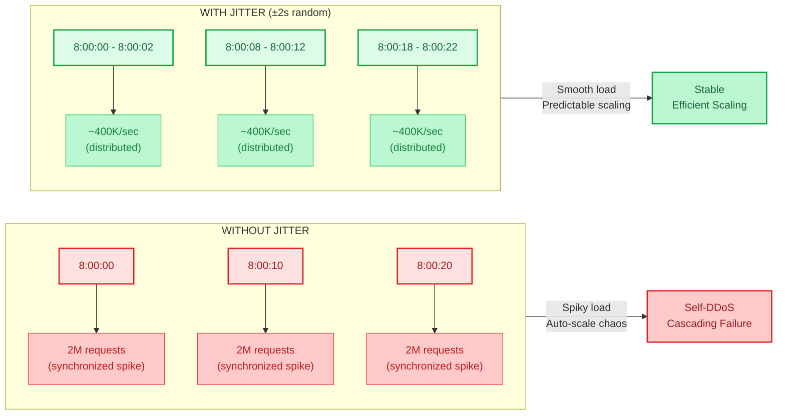
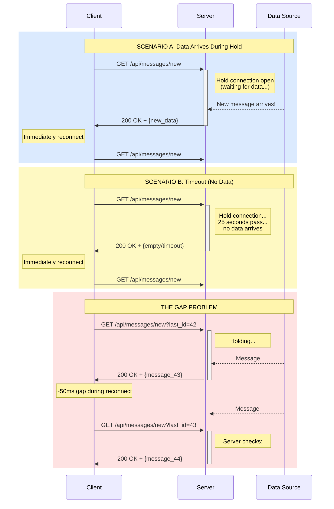
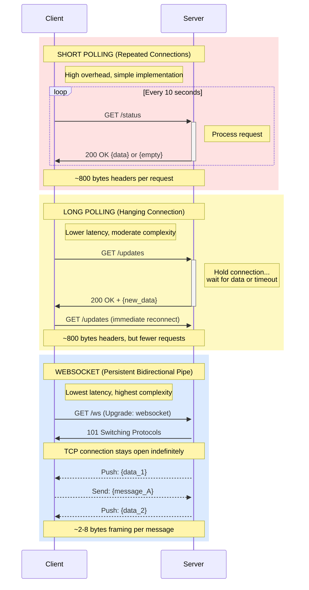
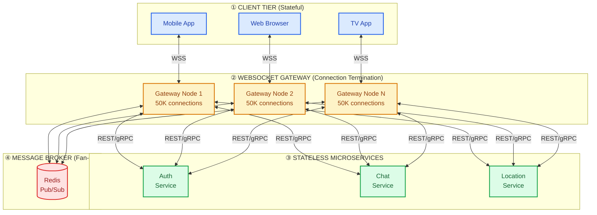
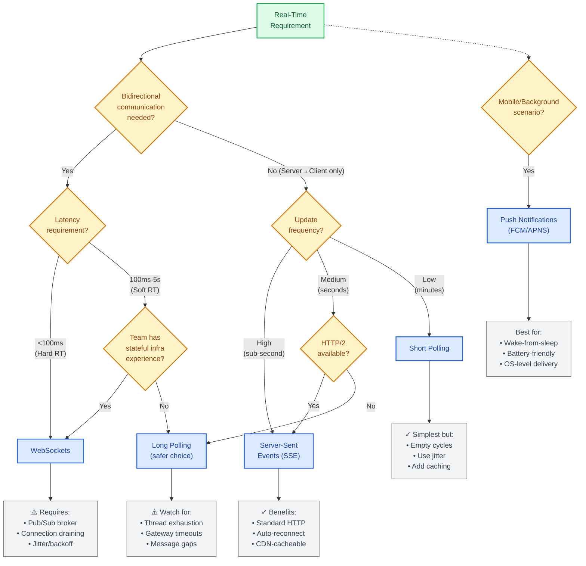

# Real-Time: Polling vs. WebSockets

This guide covers 6 key areas: I. Executive Summary: The Strategic Landscape of Real-Time, II. Short Polling: The "Are We There Yet?" Strategy, III. Long Polling: The "Hurry Up and Wait" Strategy, IV. WebSockets: The "Permanent Phone Line" Strategy, V. Alternative: Server-Sent Events (SSE), VI. Decision Framework for the Principal TPM.

## I. Executive Summary: The Strategic Landscape of Real-Time

Real-time data delivery is often treated as a binary feature—"is it real-time or not?"—but at the Principal TPM level, it must be viewed as a spectrum of **Data Freshness** versus **Infrastructure Overhead**. The strategic decision to implement real-time capabilities fundamentally alters the system's availability tiers, operational cost models, and client-side complexity.

At Mag7 scale, the decision is rarely driven by feasibility (we *can* build anything) but by ROI. Implementing a persistent connection architecture (like WebSockets) for a feature that only requires "near real-time" updates (like an order status page) is an engineering anti-pattern that wastes capital resources and increases the blast radius of outages.

### 1. The Spectrum of Freshness and Cost

You must categorize product requirements into three distinct tiers to determine the appropriate architecture. Over-engineering a lower tier into a higher tier creates unnecessary technical debt.

*   **Hard Real-Time (Sub-100ms):**
    *   **Use Case:** Multiplayer gaming (Stadia/Xbox Cloud), High-Frequency Trading, Collaborative Editing (Google Docs).
    *   **Tech:** UDP, WebSockets, specialized protocols (WebRTC).
    *   **Mag7 Reality:** Requires custom infrastructure. Standard load balancers often struggle with long-lived connections at scale due to port exhaustion.
    *   **Business Impact:** High cost per user. Justified only when latency directly correlates to revenue or core functionality.

*   **Soft Real-Time (100ms - Seconds):**
    *   **Use Case:** Chat apps (WhatsApp, Messenger), Live Comments (YouTube Live), Ride Tracking (Uber/Lyft).
    *   **Tech:** WebSockets, Server-Sent Events (SSE), Long Polling.
    *   **Mag7 Reality:** The standard for "interactive" consumer apps. Requires robust "heartbeat" mechanisms to detect "ghost" connections (where the client thinks it's connected, but the server has dropped the link).
    *   **Business Impact:** Moderate cost. The primary challenge is maintaining state across distributed systems during deployments.

*   **Near Real-Time (Seconds - Minutes):**
    *   **Use Case:** Email inboxes (Gmail), Social Feeds (Instagram), Analytics Dashboards (AWS CloudWatch).
    *   **Tech:** Short Polling, Adaptive Polling, Push Notifications (FCM/APNS) triggering a fetch.
    *   **Mag7 Reality:** heavily favored for "read-heavy" interfaces. It allows the server to remain stateless, significantly simplifying auto-scaling.
    *   **Business Impact:** Lowest cost. Highly cacheable.

### 2. The Core Tension: Stateless vs. Stateful Architectures

The most critical architectural tradeoff a Principal TPM must manage is the shift from Stateless to Stateful.

**Stateless (Polling/REST):**
In a stateless model (e.g., refreshing an Amazon order page), the server forgets the client immediately after the response.
*   **Scale:** Trivial. You can spin up 10,000 EC2 instances behind an Application Load Balancer (ALB). If one instance dies, the next request is simply routed to a healthy one.
*   **Reliability:** High. Network blips are resolved by a simple retry.

**Stateful (WebSockets/Streams):**
In a stateful model (e.g., Slack typing indicators), the server maintains an open file descriptor and memory context for that specific client.
*   **Scale:** Difficult. Load Balancers must support "sticky sessions" or consistent hashing. If a server holding 50,000 active WebSocket connections crashes, those 50,000 clients disconnect simultaneously.
*   **The "Thundering Herd" Risk:** When those 50,000 clients try to reconnect instantly, they can DDoS your authentication service and load balancers, causing a cascading failure. Mag7 implementations require **Jitter** (randomized backoff delays) to smooth out this reconnection spike.

### 3. Real-World Mag7 Implementation Examples

**Google (Google Docs vs. Gmail):**
*   **Google Docs:** Uses persistent connections (WebSockets/XHR streaming) because the "Operational Transformation" algorithm requires strict ordering of character inputs. Latency here creates merge conflicts.
*   **Gmail:** Historically used Long Polling and now integrates with internal push mechanisms. It does *not* need millisecond precision. If an email arrives 3 seconds late, the UX is unaffected. This saves massive compute resources given Gmail's user base.

**Meta (Facebook Live vs. News Feed):**
*   **Facebook Live:** Uses WebSockets/SSE to stream comments and reaction counts. The volume is high, and latency ruins the "live" feeling.
*   **News Feed:** Uses "Pull to Refresh" or adaptive polling. They do not push every new post to your device instantly. This saves battery life on billions of devices and reduces data plan usage in emerging markets.

### 4. Strategic Tradeoffs & ROI Analysis

When reviewing a design proposal for Real-Time communication, apply this rubric:

| Feature | Polling (Pull) | WebSockets (Push) | Principal TPM Takeaway |
| :--- | :--- | :--- | :--- |
| **Infrastructure Cost** | High bandwidth (header overhead), Low Compute/Memory. | Low bandwidth, High Compute/Memory (keeping connections open). | Use Polling for infrequent updates. Use Sockets for high-frequency data. |
| **Battery Impact** | High if polling frequency is aggressive. | Low (efficient), but keeping the radio active prevents deep sleep. | Mobile-first apps should prefer Push Notifications (FCM) to wake the app, rather than keeping a socket open in the background. |
| **Complexity** | Low. Standard HTTP. Easy to debug with curl/Postman. | High. Requires custom handshake, heartbeats, and reconnection logic. | Do not underestimate the "Maintenance Tax" of WebSockets. Debugging intermittent socket drops is notoriously difficult. |
| **Firewalls/Corp Net** | 100% success rate (Port 80/443). | Often blocked by aggressive corporate proxies. | B2B/Enterprise tools (like Salesforce or Jira) often fallback to Long Polling to ensure deliverability behind bank/gov firewalls. |

### 5. Edge Cases and Failure Modes

A Principal TPM must ensure the team has accounted for these specific failure scenarios:

1.  **Connection Limits:** A standard Linux server has a limit on open file descriptors (usually 65k). A WebSocket server needs kernel tuning to handle 100k+ concurrent connections (C10k/C100k problem).
2.  **Load Balancer Timeouts:** AWS ALBs and NGINX proxies have idle timeouts (often 60 seconds). If no data is sent, the LB kills the connection. The system must send synthetic "Ping/Pong" frames to keep the tunnel alive.
3.  **Mobile Network Switching:** When a user switches from WiFi to 5G, the IP changes, and the WebSocket breaks. The client must have robust logic to detect this and reconnect seamlessly without losing messages (requires message ID tracking/idempotency).

## II. Short Polling: The "Are We There Yet?" Strategy

poll request is simply routed to a healthy instance by the load balancer. There is no complex connection state to re-hydrate or "session stickiness" required.
    *   **Cacheability:** Unlike WebSockets, HTTP responses can be cached at the Edge (CDN) or the API Gateway. If 10,000 users poll for the same sports score, the backend might only see one request per second while the CDN handles the rest.

*   **Cons:**
    *   **The "Empty Cycle" Cost:** If data updates every 10 minutes, but you poll every 10 seconds, 98% of your requests are waste. This burns CPU cycles, bandwidth, and logging storage for zero customer value.
    *   **Header Overhead:** HTTP headers are sent with every request. If your payload is small (e.g., `{"status": "ok"}`), the headers (cookies, auth tokens, user-agent) might be 10x larger than the data itself.
    *   **Client Battery Drain:** Frequent radio wake-ups on mobile devices prevent the CPU from entering deep sleep, significantly impacting battery life.

### 1. Strategic Implementation at Mag7 Scale

At the Principal level, you must recognize that Short Polling is the standard pattern for **Long-Running Operations (LROs)**. In distributed systems (AWS, Azure, GCP), almost no infrastructure change happens instantly.

**The "Async Request-Reply" Pattern:**
When a user requests a heavy operation (e.g., "Create Database Cluster"), the system does not keep the connection open.
1.  **Request:** Client POSTs to `/db-clusters`.
2.  **Ack:** Server returns `202 Accepted` with a `Location` header pointing to a status monitor (e.g., `/operations/12345`).
3.  **Poll:** Client polls `/operations/12345`.
4.  **Completion:** Eventually, the server returns `200 OK` with the resource details.

**Mag7 Real-World Examples:**
*   **Google Drive Uploads:** When processing a large video upload, the client polls for "processing status" rather than holding a socket open, which would be fragile across network switches.
*   **Meta/Facebook Ad Manager:** When a bulk edit is applied to thousands of ad campaigns, the UI polls an async job ID. Using WebSockets here would be overkill because the user experience does not degrade if the completion notification is delayed by 3-5 seconds.
*   **Netflix TV UI:** On legacy or low-power devices, maintaining a WebSocket connection for minor metadata updates (like "Trending Now" row refreshes) is expensive. Netflix often relies on polling or "lazy loading" (polling on user interaction) to keep the memory footprint low.

### 2. The Hidden Risks: The Thundering Herd

The most dangerous aspect of Short Polling at scale is synchronization.

**The Scenario:**
Imagine you have a live sports event with 5 million viewers. The app is hard-coded to poll every 10 seconds. If the game starts at 8:00:00 PM, and 2 million users open the app at exactly 8:00:00 PM, your backend will receive 2 million requests at 8:00:00, 8:00:10, 8:00:20, etc.

**The Impact:**
*   **Infrastructure:** Your Load Balancers will red-line periodically while sitting idle in between.
*   **Availability:** This synchronized spike can trigger auto-scaling alarms or, worse, DDoS your own internal dependencies.

**The Solution: Jitter and Backoff**
A Principal TPM must ensure that client-side logic includes **Jitter**. Instead of polling every 10 seconds, the client should poll every $10 + random(-2, +2)$ seconds. This smoothes the traffic spike into a consistent wave.

### 3. Business & ROI Capabilities

When evaluating Short Polling against more complex solutions, consider the following dimensions:

| Dimension | Impact of Short Polling |
| :--- | :--- |
| **Engineering ROI** | **High.** It requires no specialized infrastructure (like Redis Pub/Sub or Socket.io servers). Junior engineers can implement and debug it easily using standard REST tools (Postman, cURL). |
| **Infrastructure Cost** | **Variable.** Low cost for low-frequency updates. Costs explode linearly with user count if the polling interval is aggressive (sub-2 seconds). |
| **Observability** | **Excellent.** Because it uses standard HTTP, you get request tracing, error rates, and latency metrics "for free" out of standard APM tools (Datadog, CloudWatch). |
| **Security** | **Standard.** Reuses existing WAF rules, rate limiters, and OAuth flows. No need to invent new security protocols for persistent connections. |

### 4. Advanced Optimization: Adaptive Polling

To mitigate the "Empty Cycle" cost, sophisticated Mag7 implementations use **Adaptive Polling**.

**How it works:**
The polling interval is not fixed; it adjusts based on user behavior or data state.
*   **Scenario:** An Uber Eats order.
*   **Stage 1 (Food Prep):** Updates are slow. Poll every 45 seconds.
*   **Stage 2 (Driver Picked Up):** Updates are frequent. Poll every 5 seconds.
*   **Stage 3 (App Backgrounded):** User minimizes the app. Stop polling or reduce to every 5 minutes (relies on Push Notifications for critical alerts).

**Tradeoff:** This increases client-side complexity (state management) but significantly reduces server load and battery drain.

### 5. Summary of Tradeoffs

*   **Choose Short Polling when:**
    *   Data staleness of 5–30 seconds is acceptable.
    *   The engineering team lacks deep experience with stateful connections.
    *   You need to leverage edge caching (CDNs).
    *   The feature is an "Async Request-Reply" pattern (LRO).
*   **Avoid Short Polling when:**
    *   Latency requirements are sub-500ms (e.g., Gaming, Trading).
    *   The "Empty Cycle" ratio is high (you are polling 100 times to get 1 update).
    *   Bandwidth is expensive or constrained (e.g., Emerging Markets/2G).

---

## III. Long Polling: The "Hurry Up and Wait" Strategy

Long polling acts as a bridge between the simplicity of Short Polling and the complexity of WebSockets. It is often the preferred architectural choice for features that require "near real-time" behavior (latency in the 100ms–3s range) but cannot justify the operational overhead of maintaining persistent, stateful WebSocket connections.

### 1. Mechanism: The "Hanging GET"

Unlike Short Polling, where the server immediately returns an empty response if no data exists, Long Polling instructs the server to hold the connection open.

1.  **Request:** The client sends an HTTP GET request (e.g., `/api/messages/new`).
2.  **Hold:** The server does **not** respond immediately. It keeps the request thread (or callback) suspended and waits for data to arrive or for a timeout threshold (e.g., 25 seconds).
3.  **Event or Timeout:**
    *   *Scenario A (Data Arrives):* A new message hits the backend. The server immediately completes the pending response with the data.
    *   *Scenario B (Timeout):* The timer expires. The server sends a `200 OK` with an empty body or a specific timeout flag.
4.  **Re-connect:** The moment the client receives the response (data or timeout), it **immediately** initiates a new request, restarting the cycle.

### 2. Real-World Mag7 Examples

#### Amazon SQS (Simple Queue Service)
Amazon SQS offers a configurable attribute called `ReceiveMessageWaitTimeSeconds` (up to 20 seconds).
*   **The Problem:** If a consumer polls an empty queue using Short Polling, AWS charges for that API call. Thousands of empty polls result in a high bill and wasted CPU cycles.
*   **The Solution:** By enabling Long Polling, the consumer's request "hangs" at the SQS endpoint. SQS only returns a response when a message arrives or the 20-second timer expires.
*   **Business Impact:** This drastically reduces the number of API calls (Cost Optimization) and reduces the latency between a message entering the queue and being processed (Performance).

#### Gmail (Early Implementations & Fallbacks)
Before the standardization of WebSockets and HTTP/2, Gmail used complex Long Polling techniques (often called COMET) to deliver new emails without a page refresh.
*   **Current State:** While modern Google Workspace apps prioritize WebSockets/QUIC, Long Polling remains the critical fallback mechanism for corporate networks with aggressive firewalls that block non-standard ports or persistent WebSocket connections.

### 3. Strategic Tradeoffs and ROI

For a Principal TPM, the decision to implement Long Polling usually hinges on **infrastructure constraints** and **client capability**.

| Feature | Impact & Tradeoff Analysis |
| :--- | :--- |
| **Latency** | **High ROI.** Latency is significantly lower than Short Polling because the data is pushed the moment it arrives. It is slightly higher than WebSockets due to the overhead of re-establishing HTTP headers after every message. |
| **Server Load** | **High Cost.** This is the primary drawback. In a blocking server architecture (e.g., traditional Apache/Tomcat), holding a connection open consumes a thread. 10,000 users = 10,000 threads. This requires a non-blocking tech stack (Node.js, Go, Java Netty/NIO) to be viable at Mag7 scale. |
| **Reliability** | **Medium Complexity.** Unlike WebSockets, Long Polling is standard HTTP. It automatically recovers from temporary network glitches because the client is programmed to constantly re-request. However, message ordering can be tricky if multiple requests overlap. |
| **Battery Life** | **Moderate.** Better than Short Polling (radio wakes up less often), but worse than WebSockets (overhead of establishing new TLS handshakes repeatedly). |

### 4. Technical Deep-Dive: Infrastructure Implications

Implementing Long Polling at scale requires specific infrastructure considerations that differ from standard REST APIs.

#### The "Gateway Timeout" Problem
In a Mag7 environment, a request passes through multiple layers: CDN -> Load Balancer (LB) -> Reverse Proxy -> Application Server.
*   **The Risk:** Most Load Balancers (AWS ALB, NGINX) have a default idle timeout (often 60 seconds). If the server holds the connection for 65 seconds, the LB will kill it, sending a `504 Gateway Timeout` to the client.
*   **The Fix:** You must configure the application logic to timeout *before* the infrastructure does. If the LB timeout is 60s, the application Long Poll timeout should be 50s. This ensures a clean `200 OK` (empty) rather than a `504 Error`.

#### Thread Exhaustion & Stack Selection
If your product is built on a legacy synchronous stack (e.g., older Java servlets or Rails with Passenger), Long Polling is dangerous.
*   **Scenario:** You have 500 server threads. You have 600 users long-polling.
*   **Outcome:** The first 500 users occupy all threads waiting for data. The server becomes unresponsive to *any* other request (even simple health checks).
*   **Principal TPM Action:** If the team proposes Long Polling, you must verify the stack supports **Async I/O** (non-blocking). If not, this architectural choice will necessitate a platform migration, significantly impacting the roadmap.

### 5. Edge Cases and Failure Modes

#### The "Thundering Herd"
If you deploy a new backend version, all current open connections are severed.
*   **The Impact:** 10 million clients simultaneously detect the disconnect and immediately try to reconnect. This creates a massive spike in traffic (DDoS yourself) that can topple the authentication service or database.
*   **Mitigation:** Clients must implement **Exponential Backoff and Jitter**. When a disconnect happens, the client should wait a random amount of time (e.g., between 100ms and 5s) before reconnecting, rather than all reconnecting at `T=0`.

#### Message Loss (The "Gap")
There is a tiny window of time between the client receiving a response and sending the next Long Poll request.
*   **The Risk:** If a message arrives on the server during this specific millisecond gap, the server has no open connection to push to.
*   **Mitigation:** The server must persist the message (in Redis/Kafka) and the client must send a `Last-Message-ID` cursor with its next request. The server checks the cursor and sends any messages missed during the gap.

## IV. WebSockets: The "Permanent Phone Line" Strategy

WebSockets represent a fundamental shift from the "Client asks, Server answers" paradigm to a bidirectional, full-duplex communication channel over a single TCP connection. For a Principal TPM, understanding WebSockets is less about the protocol handshake and more about the architectural implications of maintaining **stateful connections** at scale.

Unlike HTTP, where the connection is meant to be short-lived and stateless, a WebSocket connection remains open indefinitely. This shifts the bottleneck from **request throughput (RPS)** to **concurrency (Concurrent Open Connections)**.

### 1. The Technical Mechanism: Upgrade and Persistence

The lifecycle begins as a standard HTTP/1.1 `GET` request with an `Upgrade: websocket` header. If the server supports it, it responds with `101 Switching Protocols`.

From that millisecond onward, the HTTP rules no longer apply. The connection becomes a raw TCP pipe. Data is pushed in "frames," not packets with heavy headers.
*   **HTTP Overhead:** ~800 bytes of headers per request (Cookies, User-Agent, etc.).
*   **WebSocket Overhead:** ~2-8 bytes of framing per message.

**Principal Insight:** In high-frequency scenarios (e.g., stock tickers sending 10 updates/second), WebSockets reduce bandwidth costs significantly by eliminating repetitive header data. However, they increase memory pressure on the server, as every open connection consumes a file descriptor and kernel memory, regardless of activity.

### 2. The Scaling Challenge: Statefulness in a Stateless World

The biggest hurdle for Mag7 infrastructure when adopting WebSockets is Load Balancing.

*   **The Problem:** In a stateless REST architecture, if Server A is overloaded, the Load Balancer (LB) sends the next request to Server B. In WebSockets, once a client connects to Server A, they are physically tethered to it. If Server A crashes, the connection is severed.
*   **Sticky Sessions:** You cannot easily distribute traffic "per message." You distribute traffic "per connection." This leads to "hot spotting," where one server holds 50,000 active users while a newly spun-up server holds zero.
*   **Deployment Complexity:** You cannot simply perform a rolling restart. Killing a server disconnects all active users simultaneously, forcing them to reconnect instantly, creating a self-inflicted DDoS attack (Thundering Herd).

**Mitigation Strategy:**
Mag7 companies typically offload connection management to a dedicated **Gateway Layer** (e.g., custom NGINX / Envoy setups or managed services like AWS API Gateway). The Gateway holds the persistent connection to the client but communicates with backend microservices via standard REST or gRPC. This decouples the "stateful" connection from the "stateless" business logic.

### 3. Real-World Mag7 Implementations

**A. Google Docs (Collaborative Editing)**
*   **Behavior:** When you type a character, it must appear on your collaborator's screen in milliseconds. Polling is too slow; Long Polling has too much overhead.
*   **Implementation:** Google uses WebSockets to transmit Operational Transformation (OT) or CRDT (Conflict-free Replicated Data Types) payloads.
*   **Tradeoff:** High complexity in conflict resolution logic. The network layer is efficient, but the application layer (merging edits) is expensive.

**B. Meta / Facebook Messenger (Chat)**
*   **Behavior:** Billions of users need to receive messages instantly.
*   **Implementation:** Meta uses MQTT (Message Queuing Telemetry Transport) over WebSockets. MQTT is lightweight and designed for unstable networks.
*   **Impact:** By maintaining a single persistent connection for the app, they reduce battery drain compared to waking up the radio for frequent polls.

**C. Uber (Live Location Tracking)**
*   **Behavior:** Streaming the driver’s car icon moving across the map.
*   **Implementation:** WebSockets push coordinates only when the delta (change in position) is significant.
*   **ROI:** Massive reduction in egress bandwidth costs compared to sending full HTTP requests for every GPS ping.

### 4. Tradeoffs and Strategic Analysis

| Feature | WebSocket Impact | Tradeoff / Risk |
| :--- | :--- | :--- |
| **Latency** | **Lowest possible.** Sub-millisecond overhead after handshake. | **Complexity.** Requires custom protocols (STOMP, MQTT) on top of raw sockets to handle routing. |
| **Infrastructure** | **High Concurrency.** One server can handle 50k+ connections with proper tuning. | **Resource Exhaustion.** "Ghost connections" (dead clients that the server thinks are alive) eat RAM. Requires aggressive Keep-Alive/Heartbeat logic. |
| **Security** | **Standard TLS (WSS).** Uses same ports (443) as HTTPS. | **CSWSH (Cross-Site WebSocket Hijacking).** Standard CSRF tokens don't work the same way; requires validating the `Origin` header strictly during the handshake. |
| **Resilience** | **Fragile.** Mobile networks drop TCP connections constantly (tunnels, elevator). | **Reconnection Logic.** The client *must* have robust retry logic (Exponential Backoff) or it will DDoS the server upon recovery. |

### 5. Business & ROI Implications

**When to say "No" to WebSockets:**
As a Principal TPM, you should push back on WebSockets if the data update frequency is low. If a dashboard updates once every 5 minutes, WebSockets are overkill. The cost of maintaining the open connection (Keep-Alive packets, server memory) exceeds the cost of a simple polling request.

**The "Connection Limit" Bottleneck:**
A standard TCP stack is limited to 65,535 ports per IP address. At Mag7 scale (10M+ concurrent users), you hit OS limits.
*   **Solution:** You need sophisticated "Connection Termination" layers. You cannot serve 1M users from a single IP/Load Balancer entry point without advanced IP aliasing or multiple LBs.

### 6. Operational Readiness: The "Thundering Herd"

The most critical failure mode for WebSockets is the **Reconnection Storm**.
*   **Scenario:** A data center blip disconnects 5 million users.
*   **Result:** 5 million clients try to reconnect at the exact same second.
*   **Impact:** The Auth service (verifying tokens on handshake) melts down. The Load Balancers saturate. The system stays down even after the network is fixed.
*   **Requirement:** Client-side **Jitter**. You must mandate that clients wait a random amount of time (e.g., 0-30 seconds) before reconnecting, combined with Exponential Backoff.

## V. Alternative: Server-Sent Events (SSE)

Server-Sent Events (SSE) represent the strategic middle ground between the inefficiency of Polling and the complexity of WebSockets. While WebSockets provide a full-duplex (two-way) highway, SSE is a one-way broadcast channel from server to client.

For a Principal TPM, SSE is the default choice when the primary user need is **consumption**, not **interaction**. It utilizes the existing HTTP infrastructure to push updates to the client without the overhead of a custom protocol handshake.

### 1. Technical Mechanics: The "Long-Lived" HTTP Response

Unlike Polling (opening and closing connections repeatedly) or WebSockets (switching protocols), SSE works by opening a standard HTTP connection and keeping it open indefinitely.

1.  **Handshake:** The client sends a standard HTTP GET request with the header `Accept: text/event-stream`.
2.  **Open Channel:** The server responds with `200 OK` and keeps the underlying TCP connection open.
3.  **Data Stream:** Instead of sending a JSON body and closing, the server writes text chunks to the stream whenever new data is available, prefixed with `data:`.
4.  **Client Processing:** The browser’s native `EventSource` API listens to this stream and fires an event handler every time a new message chunk arrives.

**Why this matters for Infrastructure:**
Because SSE operates over standard HTTP/HTTPS, it behaves predictably with existing Load Balancers (LBs), Firewalls, and API Gateways. You generally do not need "sticky sessions" or complex socket management layers, provided your LBs are configured to allow long-lived connections.

### 2. Real-World Mag7 Examples

The most prominent modern use case for SSE is **Generative AI Streaming**, a critical capability for companies like Microsoft (Copilot), Google (Gemini), and Amazon (Bedrock/Q).

*   **LLM Token Streaming (ChatGPT/Copilot):**
    *   **The Problem:** Large Language Models (LLMs) are slow. Generating a 500-word summary might take 10 seconds. Waiting 10 seconds for a full response creates a poor User Experience (UX) where the app feels broken.
    *   **The SSE Solution:** The server streams the response token-by-token (word-by-word) as they are generated. The connection remains open until the `[DONE]` token is sent.
    *   **Business Impact:** This reduces "Time to First Byte" (TTFB) and "Perceived Latency." The user sees activity immediately, increasing retention and trust in the system.

*   **Google Finance / Stock Tickers:**
    *   **The Scenario:** A dashboard displaying real-time stock prices.
    *   **The Fit:** The data flow is 99% Server-to-Client. The user is watching, not writing. SSE pushes price updates efficiently without the overhead of maintaining a WebSocket state for bi-directional communication that isn't being used.

### 3. Strategic Tradeoffs and Constraints

As a Principal TPM, you must identify when SSE is the "Goldilocks" solution and when it will cause a production outage.

#### Pros (The ROI Case)
*   **Infrastructure Simplicity:** Unlike WebSockets, SSE works over standard HTTP. It respects standard Authentication headers and CORS policies. It is easier to debug using standard network inspection tools (Chrome DevTools).
*   **Built-in Resilience:** The browser's `EventSource` API has automatic reconnection logic built-in. If the connection drops, the browser automatically attempts to reconnect without the developer writing custom retry loops (a common source of bugs in WebSocket implementations).
*   **Firewall Friendly:** Since it looks like a standard long-running HTTP download, corporate firewalls rarely block it.

#### Cons (The Risks)
*   **Unidirectional:** You cannot send data *up* the SSE connection. If a user needs to "like" a post or send a chat message, they must initiate a separate standard HTTP POST request (AJAX/Fetch).
*   **The HTTP/1.1 Connection Limit (Critical Edge Case):** Browsers limit the number of simultaneous HTTP/1.1 connections to a specific domain (usually 6). If a user opens 7 tabs of your application, the 7th tab will hang indefinitely because the first 6 SSE connections are hogging the available slots.
    *   *Mitigation:* This is largely solved by **HTTP/2**, which uses multiplexing (sending multiple streams over a single TCP connection). **TPM Action:** If proposing SSE, you *must* verify the infrastructure supports HTTP/2 end-to-end.
*   **Proxy Buffering:** Some aggressive corporate proxies or internal Nginx configurations attempt to buffer responses to optimize bandwidth. They might wait until they have 1MB of data before sending it to the client. For SSE, this breaks real-time functionality. You must configure proxies to disable buffering for `text/event-stream`.

### 4. Impact Analysis

| Dimension | Impact |
| :--- | :--- |
| **Cost** | **Moderate.** Cheaper than Polling (less header overhead). Similar to WebSockets, but requires less engineering time to implement and maintain. |
| **Battery Life** | **Good.** Better than Polling (radio doesn't wake up every 5 seconds). Slightly worse than a dormant WebSocket, but negligible for most use cases. |
| **Scalability** | **High.** However, it consumes open File Descriptors on the server side. You need to tune your OS limits (ulimit) to handle high concurrency, similar to WebSockets. |
| **Dev Velocity** | **Fast.** Frontend developers can implement SSE in minutes using native browser APIs. Backend support is standard in almost all frameworks (Node, Go, Python/FastAPI). |

### 5. Summary Guidance for the TPM

Choose **Server-Sent Events** if:
1.  **Asymmetry:** The data flows almost exclusively from Server to Client (e.g., News feeds, status updates, AI streaming).
2.  **Standardization:** You want to avoid the protocol complexity of WebSockets.
3.  **HTTP/2 Availability:** Your infrastructure supports HTTP/2 to avoid connection limit blocking.

**Do NOT** use SSE if:
1.  **Collaboration:** The app is a collaborative whiteboard or chat room (requires low-latency bi-directional comms).
2.  **Binary Data:** While possible via Base64, SSE is designed for text. WebSockets handle binary data (audio/video streams) much better.

## VI. Decision Framework for the Principal TPM

### 1. The Latency-Utility Curve: Defining "Real-Time" Value

As a Principal TPM, you must challenge the Product Manager’s definition of "Real-Time." Engineering teams often default to WebSockets because it is technically superior for speed, but the business value often diminishes rapidly after a certain latency threshold. You must map the technical requirement to the **Utility Curve**.

*   **The Sub-100ms Tier (Hard Real-Time):** Collaborative editing (Google Docs), Multiplayer Gaming (Xbox Cloud Gaming), High-Frequency Trading.
    *   **Tech Choice:** WebSockets (or UDP/WebRTC for media).
    *   **Business Impact:** Essential for the core product function. High ROI despite high infrastructure cost.
*   **The 1-5 Second Tier (Soft Real-Time):** Chat applications (WhatsApp, Messenger), Ride-share location tracking (Uber/Lyft).
    *   **Tech Choice:** WebSockets or Long Polling.
    *   **Business Impact:** Users perceive this as "instant." Delays cause CX friction but not system failure.
*   **The 30+ Second Tier (Near Real-Time):** Email, Social Media Feeds, Order Status.
    *   **Tech Choice:** Short Polling or Push Notifications.
    *   **Business Impact:** Implementing WebSockets here is negative ROI. It introduces stateful complexity for no perceptible user benefit.

**Mag7 Example:**
**Meta (Facebook)** uses a tiered approach. Facebook Messenger uses **MQTT** (a lightweight publish/subscribe protocol over TCP/WebSockets) because chat latency must be low. However, the **News Feed** does not use WebSockets to push new posts instantly. Instead, it relies on client-side logic to pull (poll) for new content when the user opens the app or pulls to refresh. This saves massive server resources by not maintaining open connections for millions of users just to show a status update that isn't time-critical.

### 2. Infrastructure Complexity: Stateless vs. Stateful Scaling

The most significant architectural tradeoff a Principal TPM oversees in this domain is the shift from Stateless to Stateful architectures.

*   **Stateless (Polling):** The backend does not care which server handles the request. You can scale by simply adding more EC2 instances behind an Application Load Balancer (ALB).
    *   **Tradeoff:** Higher bandwidth consumption (HTTP overhead per request).
    *   **Operational Skill:** Standard DevOps/SRE skill set.
*   **Stateful (WebSockets):** The server must maintain an open TCP connection with the specific client. If Client A is connected to Server 1, Server 1 holds that state.
    *   **The Routing Challenge:** If Backend Service B wants to send a message to Client A, it must know *exactly* which frontend server holds Client A's connection. This necessitates a "Pub/Sub" layer (e.g., Redis Pub/Sub, Kafka, or a managed service like AWS AppSync).
    *   **The "Thundering Herd" Risk:** If a server holding 50,000 active WebSocket connections crashes, those 50,000 clients will immediately try to reconnect simultaneously, potentially DDOS-ing your remaining infrastructure.

**Strategic Decision Framework:**
If your team lacks deep SRE maturity or if the feature is "MVP/Experimental," **start with Polling.** Do not authorize the complexity of a Stateful architecture until the scale or latency requirements mandate it.

### 3. Client-Side Constraints: Battery, Data, and Connectivity

In a Mag7 environment, you are designing for global users, not just those with fiber connections and the latest iPhone.

*   **Battery Drain:** Keeping a radio active for a WebSocket connection prevents the mobile device from entering "sleep" modes.
    *   **Tradeoff:** WebSockets offer lower data overhead (tiny packets) but higher battery drain if keep-alives are too frequent. Short Polling kills battery life by constantly waking the radio.
    *   **Solution:** **Server-Sent Events (SSE)** or **Push Notifications** (FCM/APNS). For an app like **Gmail**, the app doesn't constantly poll or hold a socket open in the background. It relies on the OS-level push notification service to wake the app only when data arrives.
*   **Network Flakiness:** Mobile networks drop connections frequently.
    *   **CX Impact:** A WebSocket-based app requires complex client-side code to handle reconnection, back-off strategies, and message ordering (ensuring message 2 doesn't arrive before message 1 after a reconnect).
    *   **Tradeoff:** If the team underestimates this complexity, the CX will be buggy (ghost notifications, missing messages). Polling is resilient by default; if a request fails, the next one usually succeeds.

### 4. ROI and Buy vs. Build

A Principal TPM must evaluate whether to build a proprietary real-time engine or leverage managed services.

*   **Build (Raw WebSockets/Socket.io):**
    *   **Pros:** Total control, lower unit cost at massive scale (e.g., Netflix scale).
    *   **Cons:** High engineering CapEx. You own the reliability.
*   **Buy/Managed (AWS AppSync, Firebase, Azure SignalR):**
    *   **Pros:** Immediate Time-to-Market. The cloud provider handles the "Thundering Herd" and connection management.
    *   **Cons:** Vendor lock-in. Costs scale linearly and can become exorbitant at Mag7 scale.

**Mag7 Example:**
**LinkedIn** (Microsoft) utilizes a hybrid. For their instant messaging, they have highly optimized, custom-built persistent connection infrastructure (based on Akka/Play framework historically) because the scale justifies the engineering investment. However, for a new internal admin tool requiring real-time updates, they would likely use a managed Azure SignalR service to optimize for developer velocity over raw infrastructure cost.

### 5. Summary Decision Matrix

Use this matrix during Technical Design Reviews:

| Requirement | Recommended Strategy | Primary Tradeoff |
| :--- | :--- | :--- |
| **Bidirectional high-frequency (Chat/Games)** | **WebSockets** | High complexity; requires sticky sessions or Pub/Sub broker. |
| **One-way updates (Stock Ticker/Sports)** | **Server-Sent Events (SSE)** | Easy to implement; but text-only and one-way (Server -> Client). |
| **Low frequency updates (Email/News)** | **Short/Long Polling** | Network inefficiency; higher latency. |
| **App in Background/Mobile** | **Push Notifications (FCM/APNS)** | Reliance on OS/Third-party delivery; not guaranteed delivery timing. |

---

## Interview Questions

### I. Executive Summary: The Strategic Landscape of Real-Time

### Question 1: The "Thundering Herd" Mitigation
"We are designing a live sports scoring platform for millions of concurrent users. We plan to use WebSockets to push score updates. If our primary data center suffers a power blip and restarts, 5 million users will disconnect and immediately try to reconnect. How do you architect the system to survive this reconnection storm without taking down our Authentication and API gateways?"

*   **Guidance for a Strong Answer:**
    *   **Identify the Bottleneck:** The candidate should identify that the Auth service (checking tokens) is usually the bottleneck, not the socket server itself.
    *   **Client-Side Strategy:** Must mention **Exponential Backoff with Jitter**. Clients should not retry immediately; they should wait `random(0, 5s)`, then `random(0, 10s)`, etc.
    *   **Server-Side Strategy:** Implement **Load Shedding**. If the queue is full, drop requests immediately (HTTP 503) rather than queuing them until the server crashes.
    *   **Architecture:** Suggest a "Connection Holster" or "Edge Termination" pattern where the socket connection is terminated at the Edge (CDN/PoP), so the core backend only sees aggregated traffic, not 5 million individual handshakes.

### Question 2: The Hybrid Approach for Scale
"You are the TPM for a new collaborative dashboard tool similar to Trello. The engineering team wants to use Short Polling for MVP to save time, but the Product Manager insists on WebSockets because 'competitors have it.' How do you evaluate this tradeoff, and is there a middle ground that satisfies both time-to-market and user experience?"

*   **Guidance for a Strong Answer:**
    *   **Business Pragmatism:** Acknowledge that for an MVP, Polling is faster to build. However, for a *collaborative* tool, Polling creates "Edit Conflicts" (User A moves a card, User B doesn't see it for 10s and moves it back).
    *   **The Hybrid Solution:** Propose **Long Polling** or **Server-Sent Events (SSE)** as the middle ground. SSE provides the "Push" capability of WebSockets (good for updates coming from server to client) but operates over standard HTTP, making it easier to implement and debug than full bi-directional WebSockets.
    *   **Migration Path:** Launch with Polling (high latency acceptable for Alpha), instrument the "Conflict Rate" metric. If conflicts > X%, invest in the WebSocket refactor. This demonstrates data-driven decision-making.

### II. Short Polling: The "Are We There Yet?" Strategy

### Question 1: Designing for Scale
"We are building a dashboard for fleet managers to track 50,000 delivery trucks. The trucks report their location every 5 seconds. The managers want to see these updates on a map. Would you use Short Polling or WebSockets for the web dashboard? Walk me through your decision process, focusing on cost and reliability."

**Guidance for a Strong Answer:**
*   **Nuance:** A candidate should not just pick one. They should analyze the **Read/Write ratio**. The trucks *writing* data is high frequency. The managers *reading* data might be sporadic.
*   **The "Trap":** 50,000 trucks updating every 5 seconds is massive data. A browser cannot render 50k updates/sec.
*   **The Solution:** The candidate should likely propose **Short Polling with aggregation/viewport filtering**. The browser should poll based on the map's zoom level (e.g., "Give me trucks in this lat/long box every 10 seconds").
*   **Why Polling?** Opening a WebSocket to stream 50k trucks is unnecessary firehose data. Polling allows the client to request a *snapshot* of the relevant area, which is cacheable and easier to load balance.
*   **Cost:** Polling is cheaper here because the manager is not staring at the screen 24/7. WebSockets would require maintaining state for idle users.

### Question 2: The Migration Strategy
"We have a legacy application using Short Polling that is overwhelming our backend databases due to rapid growth. The engineering team wants to rewrite everything to use WebSockets to reduce load. As the TPM, how do you validate this strategy?"

**Guidance for a Strong Answer:**
*   **Challenge the Premise:** Moving to WebSockets might move the bottleneck, not remove it. If the DB is the bottleneck, WebSockets might actually make it worse by allowing more concurrent connections.
*   **Root Cause Analysis:** Is the load due to the *number* of requests or the *heaviness* of the query?
    *   If it's query heaviness: Moving to sockets won't fix a bad SQL query.
    *   If it's request volume (empty checks): Sockets will help.
*   **Alternative First Steps:**
    *   Can we implement **Caching** (TTL) first? (Low effort, high impact).
    *   Can we implement **Adaptive Polling**?
*   **ROI Calculation:** A rewrite is expensive (months of work). The candidate should propose a pilot or A/B test on a single high-traffic endpoint before approving a full architectural rewrite.

### III. Long Polling: The "Hurry Up and Wait" Strategy

**Question 1: "We are designing a notification system for a dashboard used by 50,000 concurrent enterprise users. The engineering lead suggests Short Polling to save development time, but Product wants 'instant' updates. Why might you advocate for Long Polling here, and what specific infrastructure risks would you ask the team to validate first?"**

*   **Guidance for a Strong Answer:**
    *   **Tradeoff articulation:** Short polling 50k users every 5 seconds = 600k requests/minute, mostly empty. This floods the logging stack and wastes bandwidth. Long Polling reduces request volume significantly while satisfying the "instant" requirement.
    *   **Infrastructure Risk:** The candidate must identify **Thread Exhaustion** or **Port Exhaustion**. They should ask: "Is our backend non-blocking (Async I/O)?" and "What are the Load Balancer timeout limits?"
    *   **Strategic view:** Mentioning that WebSockets might be overkill for simple notifications (firewall issues in enterprise environments) strengthens the case for Long Polling as the pragmatic middle ground.

**Question 2: "You have a Long Polling architecture in place. During a major regional outage, the system recovered, but the Load Balancers immediately crashed again despite the traffic being within normal peak limits. What is likely happening, and how do you fix it?"**

*   **Guidance for a Strong Answer:**
    *   **Identification:** This is the **Thundering Herd** problem. All clients reconnected simultaneously when the region came back up.
    *   **Immediate Fix:** Rate limiting at the API Gateway (shedding load) to allow servers to recover.
    *   **Long-term Fix:** Implementing **Jitter** (randomized delays) in the client reconnection logic.
    *   **Advanced nuance:** The candidate might mention that Long Polling is more susceptible to this than Short Polling because Short Polling is naturally distributed by independent timers, whereas Long Polling clients are often synchronized by the server restart event.

### IV. WebSockets: The "Permanent Phone Line" Strategy

**Question 1: The "Rolling Restart" Problem**
"We have a chat application serving 2 million concurrent users via WebSockets on a fleet of 500 servers. We need to deploy a critical security patch to the server OS. How do you manage this deployment without causing downtime or a massive reconnection storm that takes down our Auth service?"

*   **Guidance for a Strong Answer:**
    *   **Identify the constraint:** You cannot just kill a WebSocket server; it drops thousands of users instantly.
    *   **Connection Draining:** Explain the process of taking a server out of the Load Balancer rotation (so no new connections enter) and waiting for existing connections to close naturally (or forcing a close after a grace period, e.g., 1 hour).
    *   **Rate Limiting/Throttling:** Discuss implementing rate limits on the Auth service specifically for the `Upgrade` handshake request to protect it during the transition.
    *   **Canary Deployment:** Rolling out the restart to 1% of the fleet first to verify the client reconnection logic behaves as expected (e.g., verifying Jitter is working).

**Question 2: Polling vs. WebSockets for a Stock Trading App**
"We are building a mobile trading app. The Product VP wants 'Real-Time' prices for all assets. However, our user research shows most users only look at 3 stocks, but we have 10,000 assets available. Engineering wants to use WebSockets for everything. As the Principal TPM, do you agree? What is your architectural recommendation?"

*   **Guidance for a Strong Answer:**
    *   **Nuance is key:** A "WebSockets for everything" approach is likely wasteful.
    *   **Hybrid Approach:** Recommend WebSockets *only* for the active viewport (the 3 stocks the user is staring at).
    *   **Fallback Strategy:** Use infrequent polling or "push notifications" for price alerts on stocks not currently on screen.
    *   **Mobile Constraints:** Highlight that keeping a radio active for a full WebSocket stream drains battery.
    *   **Data Granularity:** Question the requirement. Does the human eye need 100 updates a second? Likely throttling the WebSocket messages to 1-2 updates per second per asset is sufficient for UX, significantly reducing bandwidth costs.

### V. Alternative: Server-Sent Events (SSE)

**Question 1: The "Live Blog" Architecture**
"We are building a Live Blog feature for a major breaking news event (e.g., Election Night) that will be viewed by millions of users. The editorial team posts updates every 30-60 seconds. Propose a communication strategy for the client. Why would you choose SSE over WebSockets or Polling?"

*   **Guidance for a Strong Answer:**
    *   **Reject Polling:** With millions of users, polling every 30 seconds creates a massive DDoS attack on our own servers. It wastes bandwidth checking for updates that haven't happened yet.
    *   **Reject WebSockets:** We don't need bi-directional communication. Managing millions of stateful WebSocket handshakes is computationally expensive and complex to scale (requires sticky sessions or a pub/sub redis backend).
    *   **Select SSE:** It is the ideal fit. It creates a lightweight subscription.
    *   **Address Scale:** Mention using a CDN (Content Delivery Network). SSE can be cached and fanned out by CDNs (Edge locations), meaning the origin server only sends the update once to the CDN, and the CDN pushes it to millions of users. This is a massive cost/scale advantage of SSE over WebSockets.

**Question 2: The "Hanging Tab" Problem**
"You launched a new dashboard using SSE for real-time widgets. Users are complaining that when they open multiple tabs of the dashboard to monitor different regions, the application stops loading data in the newer tabs. What is happening, and how do you fix it?"

*   **Guidance for a Strong Answer:**
    *   **Identify the Root Cause:** This is the classic browser limit for HTTP/1.1 connections (limit of 6 per domain). The SSE connections in the first few tabs are saturating the pool.
    *   **Immediate Workaround:** Domain sharding (api1.domain.com, api2.domain.com), though this is hacky.
    *   **Strategic Fix:** Upgrade the application serving stack to support **HTTP/2**. HTTP/2 supports multiplexing, allowing infinite logical streams over a single TCP connection, effectively eliminating the browser limit issue for SSE.
    *   **TPM Lens:** Discuss the migration plan to HTTP/2, including verifying LB support (e.g., AWS ALB supports HTTP/2) and client browser compatibility (which is high today).

### VI. Decision Framework for the Principal TPM

### Question 1: The "Live Sports" Scaling Challenge
**Question:** "We are building a feature for a sports broadcasting app to show live scores and commentary for the Super Bowl. Millions of concurrent users will be watching. The Product Manager wants 'instant' updates. How do you architect the communication strategy, and what are the primary risks?"

**Guidance for a Strong Answer:**
*   **Strategy Selection:** Reject Short Polling (millions of users polling every second will DDOS the origin). Reject pure WebSockets (bidirectional overhead is unnecessary for read-heavy scores). **Propose Server-Sent Events (SSE)** or a highly cached Long-Polling mechanism.
*   **Architecture:** Mention the use of a CDN (Content Delivery Network). Scores are static for all users; the backend should generate the JSON once, push it to the Edge, and clients fetch from the Edge.
*   **Risk Mitigation:** Address the "Thundering Herd." If the app crashes, how do we prevent 5 million users from reconnecting at once? (Answer: Jitter/Randomized Back-off).
*   **Business Tradeoff:** Discuss "Perceived Latency." Does the score need to be faster than the TV broadcast? (Usually no, or it spoils the game).

### Question 2: The Collaborative Editor Transition
**Question:** "Our internal documentation tool currently uses a 'save and refresh' model. We want to move to Google Docs-style real-time collaboration. As the TPM, how do you manage this migration, and what technical hurdles do you anticipate?"

**Guidance for a Strong Answer:**
*   **Technical Depth:** Acknowledge this is not just a UI change; it requires a fundamental backend rewrite from Stateless (REST) to Stateful (WebSockets).
*   **Conflict Resolution:** Mention **Operational Transformation (OT)** or **CRDTs (Conflict-free Replicated Data Types)**. This is the hardest part of real-time collaboration—handling User A and User B typing in the same sentence simultaneously.
*   **Phased Rollout:** Don't "Big Bang" release. Start with "Paragraph Locking" (easier to implement) before moving to "Character-level synchronization."
*   **Observability:** Define success metrics. It's not just "it works." It's "Latency < 50ms" and "Zero data loss on disconnect."

---

## Key Takeaways

- Review each section for actionable insights applicable to your organization

- Consider the trade-offs discussed when making architectural decisions

- Use the operational considerations as a checklist for production readiness
