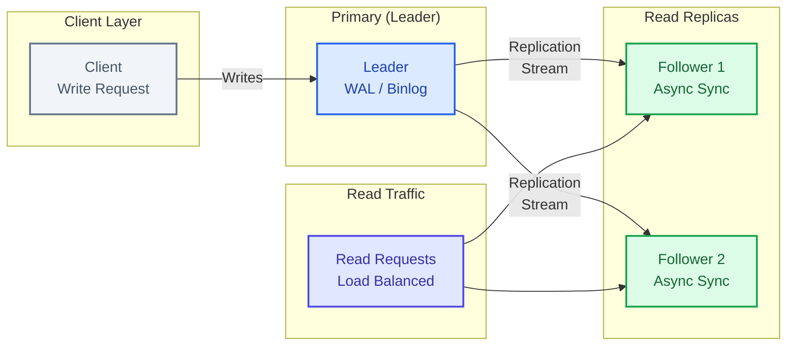
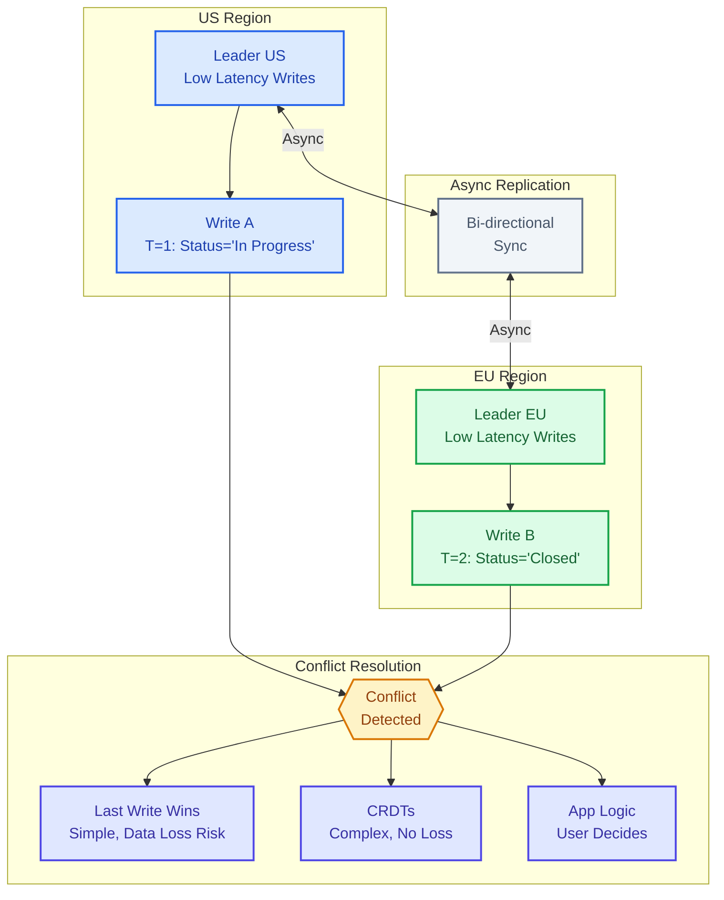
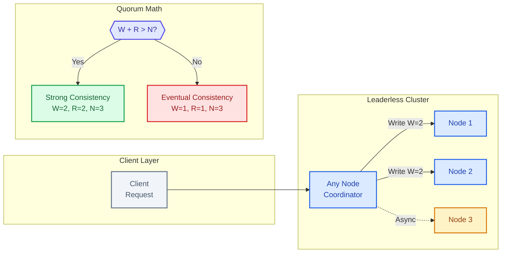
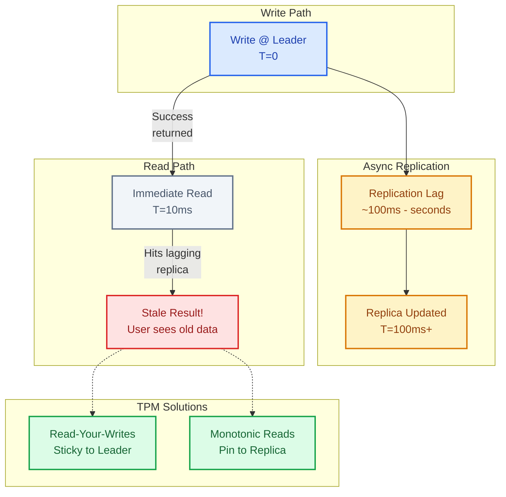
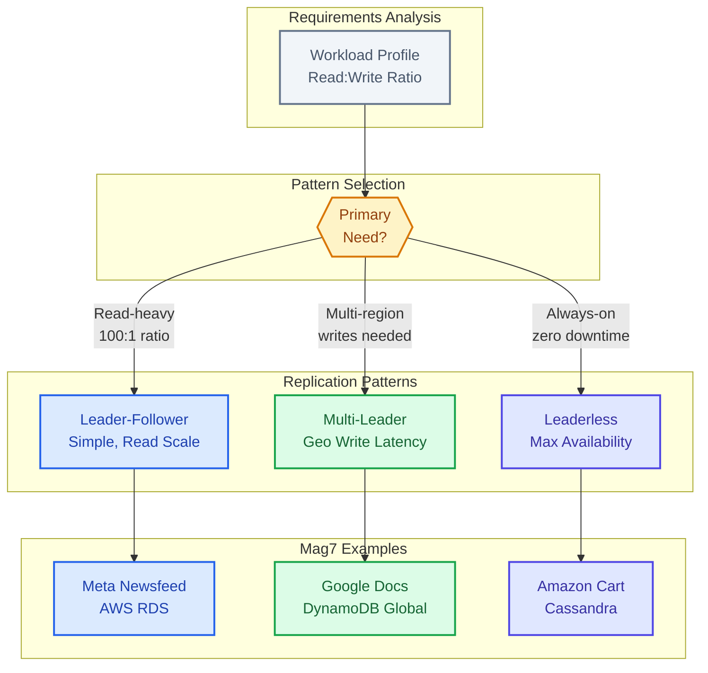

# Replication Patterns

    Leader-Follower (Primary-Replica): Writes go to leader, replicated to followers. Followers serve reads. Simple, well-understood. Leader is bottleneck for writes. Failover required if leader dies.
    Multi-Leader: Multiple nodes accept writes, sync with each other. Better write availability. Conflict resolution is hard - last-write-wins, vector clocks, or custom merge logic.
    Leaderless (Quorum): Any node accepts writes/reads. Quorum determines success. Write to W nodes, read from R nodes, ensure W + R > N for consistency. Cassandra, DynamoDB.

★Replication Lag Reality
Async replication has lag - milliseconds to seconds. Reading from replica might return stale data. Solutions: (1) Read-your-writes guarantee by routing user to same node, (2) Monotonic reads by pinning user to a replica, (3) Strong consistency for critical reads (hits latency).

This guide covers 5 key areas: I. Leader-Follower (Primary-Replica) Architecture, II. Multi-Leader (Active-Active) Replication, III. Leaderless (Quorum-Based) Replication, IV. The Reality of Replication Lag, V. Summary Strategy for Principal TPMs.

## I. Leader-Follower (Primary-Replica) Architecture

### 1. Architectural Mechanics & Replication Streams

At a Principal level, understanding that "data is copied" is insufficient. You must understand *how* it is copied, as this dictates data integrity and performance limits.

The Leader processes a write request and appends it to a local log (e.g., WAL - Write Ahead Log in PostgreSQL, Binlog in MySQL). This log is the source of truth. Followers consume this log stream to apply changes to their own local datasets.

**Three primary replication strategies determine the system's reliability:**
1.  **Statement-Based Replication:** The Leader sends the SQL statement (e.g., `UPDATE users SET age = age + 1`).
    *   *Tradeoff:* Low bandwidth usage, but nondeterministic functions (like `NOW()` or `RAND()`) create data divergence between Leader and Follower.
    *   *Mag7 Applicability:* Rarely used in critical production systems due to integrity risks.
2.  **Write-Ahead Log (WAL) Shipping:** The Leader sends the exact byte-level changes to the disk blocks.
    *   *Tradeoff:* Exact data replica guaranteed, but tightly couples the Leader and Follower to the same database version and architecture.
    *   *Mag7 Applicability:* Standard for Amazon Aurora and high-integrity financial systems.
3.  **Logical (Row-Based) Log Replication:** The Leader sends a stream describing the data change (e.g., "Log ID 104: Change value of Row X from A to B").
    *   *Tradeoff:* Decouples versioning (Follower can be a newer version for zero-downtime upgrades), but can be bandwidth-heavy for bulk updates.
    *   *Mag7 Applicability:* The standard for Meta’s MySQL fleet to allow rolling upgrades without downtime.

### 2. Consistency Models & Latency Tradeoffs

The most critical decision a TPM influences in this architecture is the replication timing. This is a direct negotiation between **Latency** (Speed) and **Durability** (Data Safety).

#### Asynchronous Replication
The Leader writes to its local storage and immediately returns "Success" to the client. It sends the replication log to Followers afterward.
*   **Mag7 Use Case:** Social media feeds, "Likes," non-critical logging, caching layers (Redis sidecars).
*   **Tradeoff:** 
    *   *Pro:* Extremely low write latency. Leader performance is not impacted by slow Followers.
    *   *Con:* **Replication Lag.** If the Leader crashes before forwarding the log, that data is permanently lost.
*   **Business Impact:** High throughput, low cost. Acceptable RPO (Recovery Point Objective) is > 0 seconds.

#### Synchronous Replication
The Leader writes to local storage, sends the log to Followers, and waits for confirmation (ACK) from *all* Followers before returning "Success" to the client.
*   **Mag7 Use Case:** Strong consistency requirements (e.g., Azure AD identity updates, Google Spanner - though Spanner uses Paxos, a variant of this).
*   **Tradeoff:**
    *   *Pro:* Zero data loss (RPO = 0).
    *   *Con:* **Write Availability Risk.** If one Follower goes offline or the network glitches, the Leader cannot accept writes. The system halts. Latency is determined by the slowest Follower.

#### Semi-Synchronous Replication (The Mag7 Standard)
The Leader waits for an ACK from *at least one* Follower (or a quorum) before confirming success.
*   **Mag7 Use Case:** Amazon RDS Multi-AZ, Meta’s payment ledgers.
*   **Tradeoff:** Balances durability with availability. If one node dies, the data exists on at least one other machine.
*   **ROI Impact:** Increases infrastructure cost (requires minimum 3 nodes for safety) but prevents revenue loss from data corruption.

### 3. The "Replication Lag" Problem & Solutions

In read-heavy systems (99% reads, 1% writes), Followers serve the reads. However, because replication takes non-zero time, a user might write data and immediately try to read it, hitting a Follower that hasn't received the update yet.

**Impact on CX:** A user updates their profile photo, refreshes the page, and sees the old photo. They assume the app is broken and upload it again.

**Principal TPM Solutions:**
1.  **Read-Your-Own-Writes (Sticky Routing):** The load balancer tracks that User A performed a write. For the next 60 seconds, all reads from User A are routed exclusively to the Leader.
    *   *Cost:* Increases load on the Leader; requires smarter load balancing middleware.
2.  **Monotonic Reads:** Ensures that if a user sees a newer version of data, they never see an older version in subsequent requests.
    *   *Implementation:* Timestamps or global sequence IDs passed in the client session.

### 4. Handling Failures: Split Brain and Election

When a Leader fails, a Follower must be promoted. If the network partitions (cuts) such that the Leader is isolated but still running, and the Followers elect a *new* Leader, you have **Split Brain**. Both nodes think they are the Leader and accept conflicting writes.

**Real-World Mitigation at Mag7:**
*   **Fencing Tokens:** When a new Leader is elected, it receives a monotonically increasing ID (Token). The storage layer rejects any write from a Leader with an older token.
*   **Quorums:** A Leader must maintain connectivity to a majority of nodes (N/2 + 1) to accept writes. If it loses the quorum, it steps down automatically.

### 5. Business & ROI Analysis

*   **Scalability Limits:** This architecture scales **Reads** linearly (add more Followers). It does **not** scale **Writes**.
    *   *Principal Insight:* If your product anticipates massive write growth (e.g., IoT ingestion, Logging), Leader-Follower is a temporary solution. You must eventually move to **Sharding** (partitioning data across multiple Leaders).
*   **Cost Efficiency:** 
    *   Followers can often run on cheaper hardware (or Spot instances in AWS) since they don't handle the write intensity.
    *   Global distribution (Read Replicas in different regions) reduces latency for international users, directly improving engagement metrics (CX).

## II. Multi-Leader (Active-Active) Replication

**The Concept:**
In a Multi-Leader (Active-Active) architecture, more than one node handles write traffic simultaneously. This setup is almost exclusively used across multiple data centers or geographical regions (e.g., US-East and EU-West). Each region has a Leader that accepts local writes and asynchronously replicates them to Leaders in other regions.

### 1. Real-World Behavior at Mag7

At the scale of Google, Amazon, or Meta, Multi-Leader replication is deployed primarily to solve two problems: **Geo-Latency** and **Disaster Recovery (DR)**. It is rarely used solely to scale write throughput (Sharding is the preferred pattern for that).

*   **Collaborative Applications (Google Docs/Sheets):** This is the most granular example. When User A edits a doc in New York and User B edits the same doc in London, both users are writing to their local regional leaders. The system asynchronously merges these changes using Operational Transformation (OT) or CRDTs (Conflict-free Replicated Data Types) to ensure both users eventually see the same document state.
*   **Global Session Management (Netflix/Meta):** User profile updates or "currently watching" markers are often replicated across regions. If the US-East region goes down, the user is routed to US-West. Because US-West is also an active Leader, the user can continue writing (e.g., liking a post) without downtime.
*   **DynamoDB Global Tables (AWS):** Amazon internally uses and sells this pattern. A write to a DynamoDB table in `us-east-1` is automatically propagated to `ap-northeast-1`. Both regions accept writes for the same item.

### 2. The Core Challenge: Write Conflicts

The defining characteristic of this pattern—and the area where a Principal TPM adds value—is **Conflict Resolution**. Because writes happen concurrently in different locations without locking each other, conflicts are inevitable.

**Example Scenario:**
*   **T=1:** User A updates a ticket status to "In Progress" (routed to US-East).
*   **T=2:** User B updates the same ticket status to "Closed" (routed to EU-West).
*   **T=3:** The regions attempt to replicate. US-East says it's "In Progress"; EU-West says it's "Closed".

**Resolution Strategies & Tradeoffs:**

*   **Last Write Wins (LWW):** The database assigns a timestamp to every write. The highest timestamp wins; the other is silently discarded.
    *   *Tradeoff:* Extremely simple to implement. However, it causes **data loss**. If the clocks are slightly skewed or writes happen within milliseconds, valid business data vanishes without a trace.
*   **On-Read Resolution (Amazon Shopping Cart):** The database stores *both* conflicting versions. When the user views the cart next, the application presents both versions or merges them (e.g., "You added Item A in New York and Item B in London; the cart now contains A and B").
    *   *Tradeoff:* Zero data loss, but pushes complexity to the application layer and the user interface.
*   **Conflict-free Replicated Data Types (CRDTs):** Data structures (like counters or sets) designed to be merged mathematically without conflicts (e.g., a "Like" counter on Facebook).
    *   *Tradeoff:* High engineering complexity to implement correctly; limited to specific data types.

### 3. Tradeoffs Analysis

**Pros:**
*   **Fault Tolerance:** If one entire data center fails, traffic is simply re-routed to another region. Since the other region is already a Leader, there is no "promotion" delay. The RTO (Recovery Time Objective) is near zero.
*   **Perceived Performance:** Users write to the data center geographically closest to them. A user in Tokyo does not have to wait for a round-trip packet to Virginia to confirm a write.

**Cons:**
*   **Consistency Nightmares:** You cannot guarantee Strong Consistency without sacrificing the performance benefits (using distributed locking). You are forced into **Eventual Consistency**. Users may see stale data or "jumping" data as replication catches up.
*   **Network Reliability:** Multi-leader setups rely on inter-datacenter links. If the link between US and EU is severed, both regions accept writes that diverge. Merging them back together after the link is restored can be painful.

### 4. Impact on Business/ROI/CX/Capabilities

*   **ROI/Cost:** Implementing Active-Active is significantly more expensive than Leader-Follower. It requires complex conflict resolution logic, higher storage costs (storing version vectors), and specialized engineering talent. It is justified only for "Tier 0" services where downtime equals massive revenue loss (e.g., Amazon Checkout, Google Ads serving).
*   **CX (Customer Experience):** Provides a seamless global experience. Users travel and their data "follows" them with low latency. However, it introduces "ghost" behaviors (e.g., a comment appearing and disappearing) if replication lags.
*   **Business Capability:** Enables **Global High Availability**. It allows a Mag7 company to survive the total loss of a major region (e.g., due to a hurricane or fiber cut) with minimal business interruption.

### 5. Principal TPM Action Plan

When your engineering team proposes Multi-Leader replication, you must validate the necessity and the strategy:

1.  **Challenge the Requirement:** "Do we actually need active writes in multiple regions, or do we just need fast reads?" If it's just fast reads, use Leader-Follower with Read Replicas.
2.  **Define Conflict Logic:** Do not accept "we'll figure it out later." Explicitly define: "If Region A and Region B conflict, does the application crash, does the user decide, or does the timestamp decide?"
3.  **Audit Clock Sync:** If using Last Write Wins, ensure NTP (Network Time Protocol) synchronization infrastructure is robust. Even small clock skews can cause data loss in this architecture.

## III. Leaderless (Quorum-Based) Replication

**The Concept:**
In a leaderless architecture (often referred to as Dynamo-style), there is no single node responsible for write serialization. The client sends write requests to any replica node, or to a coordinator node that broadcasts the request. For a system to be consistent, the setup relies on Quorum consistency math, defined as $R + W > N$ (where $N$ is the replication factor, $R$ is the number of nodes that must agree on a read, and $W$ is the number of nodes that must confirm a write).

### 1. Real-World Behavior at Mag7

At the Principal level, you must recognize that "Leaderless" is synonymous with **High Availability** and **Partition Tolerance** (AP in the CAP theorem). Mag7 companies utilize this pattern when the business requirement is "The system must accept writes even if the datacenter is on fire."

*   **Amazon (The Shopping Cart):** The seminal implementation of this pattern was the internal Amazon Dynamo storage system. The business requirement was absolute write availability; a user must always be able to add an item to their cart, even if network partitions exist. If the "latest" version of the cart cannot be determined immediately, the system accepts the write and reconciles conflicts (merging items) later.
*   **Netflix & Apple (Cassandra Usage):** Both companies operate massive Apache Cassandra clusters. Netflix uses this for subscriber viewing history. If a user watches a show, that write *must* succeed to ensure the "Resume Watching" feature works. If a specific node is down, the write goes to other nodes. The system tolerates eventual consistency (it is acceptable if the "Resume" point takes 200ms to propagate to a different device).
*   **Discord (Messages):** Discord moved explicitly to ScyllaDB (a C++ rewrite of Cassandra) to handle billions of messages. The leaderless nature allows them to ingest massive write throughput without the bottleneck of a single leader per partition, which is critical during high-traffic events like game launches.

### 2. Technical Mechanics & Tradeoffs

The Principal TPM must drive the decision on "Tunable Consistency." You are not just selecting a database; you are selecting a latency and durability profile.

**A. Quorum Configuration ($N, W, R$)**
*   **Configuration:** A common setup is $N=3, W=2, R=2$. This is a "Strong Consistency" quorum because $2+2 > 3$.
*   **Tradeoff:**
    *   *High W/R:* If you require $W=N$ (all nodes must acknowledge), you maximize durability but minimize availability (if one node rots, writes fail).
    *   *Low W/R:* If you set $W=1$ (Sloppy Quorum), writes are incredibly fast and highly available, but you risk "Dirty Reads" or data loss if that single node crashes before replicating.

**B. Conflict Resolution**
Since multiple nodes accept writes simultaneously, data divergence will occur.
*   **Last Write Wins (LWW):** The database relies on the timestamp. The highest timestamp overwrites everything else.
*   *Tradeoff:* Extremely simple to implement, but suffers from clock skew. You *will* silently lose data if two users write at the same millisecond.
*   **Vector Clocks/CRDTs:** The system tracks causality (Version A came from Version B).
*   *Tradeoff:* Zero data loss, but pushes complexity to the application layer. The engineering team must write logic to "merge" conflicting objects (e.g., merging two shopping cart states).

**C. Read Repair vs. Anti-Entropy**
*   **Read Repair:** When a client reads data, the system detects if replicas are out of sync and fixes them on the fly. *Tradeoff:* Slows down read requests for that specific instance.
*   **Anti-Entropy:** A background process (often using Merkle Trees) compares data between nodes and syncs them. *Tradeoff:* Consumes significant compute/IO resources in the background, potentially impacting throughput.

### 3. Impact on Business/ROI/CX

**Business Capability & ROI:**
*   **Global Active-Active:** Leaderless replication is the backbone of multi-region active-active setups. It allows a user in Europe to write to the EU region and a user in the US to write to the US region simultaneously without routing latency.
*   **Cost of Complexity:** While hardware utilization is efficient (all nodes work), the *human* cost is high. Debugging consistency issues in a leaderless environment is notoriously difficult. Hiring engineers with deep Cassandra/Dynamo experience is expensive.

**Customer Experience (CX):**
*   **The "Always On" Perception:** Users rarely see 5xx errors during writes. The application feels more robust.
*   **The "Ghost" Phenomenon:** A user might update their profile, refresh the page, and see the *old* profile (Stale Read) because the read request hit a node that hadn't received the write yet. Principal TPMs must define if this CX degradation is acceptable for the specific product (e.g., acceptable for a social feed, unacceptable for a bank balance).

**Skill & Operational Maturity:**
*   **Sloppy Quorums & Hinted Handoff:** If the designated replicas are down, the system writes to a temporary neighbor (a "hint"). When the original node comes back, the neighbor hands the data back. This requires sophisticated monitoring. If the temporary node dies before handoff, data is lost permanently. A Principal TPM must ensure the SRE team has observability into "pending hinted handoffs."

## IV. The Reality of Replication Lag

Replication lag is the delay between a write operation being committed on the Leader node and that data becoming visible on a Follower node. In an asynchronous system (the default for most high-scale Mag7 architectures), this lag is non-zero. It is not a bug; it is a physical constraint dictated by network speed, disk I/O, and transaction processing time.

For a Principal TPM, the challenge is not eliminating lag (which is often impossible without crippling write availability) but managing the *user perception* of that lag and the business risks associated with stale data.

### 1. The Mechanics of Lag and "Eventual Consistency"

In a Mag7 environment, "Eventual Consistency" is a vague promise. It means "the data will be consistent... eventually." But "eventually" can range from milliseconds (in a healthy AWS Region) to minutes (during a cross-region network partition).

**Real-World Behavior at Mag7:**
*   **Meta (Facebook/Instagram):** When a user posts a comment, the write goes to a Leader database (often MySQL/TAO). If the user immediately refreshes their feed, the read request might be routed to a Follower that hasn't received the update yet. The comment appears to vanish.
*   **Amazon (Inventory Management):** A highly contentious item (e.g., a PS5 launch) shows "In Stock" on the product detail page (served from a read replica cache) but fails at checkout because the Leader node knows inventory is actually zero.
*   **Google (Global Spanner/BigTable):** Even with TrueTime and synchronous replication, cross-continent replication obeys the speed of light. A write committed in Iowa takes non-trivial time to be readable in Singapore if strong consistency is enforced.

### 2. Strategic Patterns to Mitigate Lag

A Principal TPM must drive the decision on which mitigation strategy applies based on the product requirement.

#### A. Read-Your-Own-Writes (Read-After-Write Consistency)
This pattern guarantees that if a user modifies data, *they* will see that modification immediately, even if other users do not.

*   **Implementation:**
    *   **Leader Pinning:** For a set window (e.g., 60 seconds) after a user performs a write, route all their subsequent reads to the Leader.
    *   **Timestamp/LSN Tracking:** The client tracks the timestamp or Log Sequence Number (LSN) of its last write. When reading from a Follower, the request includes this token. If the Follower has not caught up to that LSN, it rejects the read or waits until it updates.
*   **Tradeoffs:**
    *   *Pros:* Solves the "disappearing comment" anxiety; maintains user trust.
    *   *Cons:* Reduces the efficiency of the read-replica fleet. If a specific user is write-heavy, they burden the Leader with reads, negating the architectural benefit of followers. Requires complex routing logic in the load balancer or application layer.

#### B. Monotonic Reads
This prevents the "time travel" phenomenon where a user makes several reads in succession, and subsequent reads return *older* data than previous reads (because the load balancer routed the second request to a more lagged replica).

*   **Implementation:**
    *   **User-Sticky Routing:** Ensure a specific user’s session is always routed to the same Follower replica.
*   **Tradeoffs:**
    *   *Pros:* User experience is consistent; time never moves backward.
    *   *Cons:* Can lead to "Hot Spots." If one replica becomes overloaded or slow, all users pinned to it suffer, while other replicas sit idle. Failover logic becomes complex (if the pinned replica dies, the user must be re-pinned, potentially to a node with more lag).

### 3. Business Impact and ROI Analysis

The decision to tolerate or mitigate replication lag is a direct business tradeoff between **Infrastructure Cost**, **System Availability**, and **Customer Experience (CX)**.

*   **CX & Brand Trust:**
    *   *Scenario:* A user pays a credit card bill. They refresh the page, but the balance remains unchanged due to lag.
    *   *Impact:* The user assumes the payment failed and pays again (double charge) or calls Customer Support.
    *   *ROI:* The cost of implementing "Read-Your-Own-Writes" is significantly lower than the operational cost of processing thousands of "Where is my payment?" support tickets.

*   **Financial Risk (Inventory/FinTech):**
    *   *Scenario:* High-frequency trading or flash sales.
    *   *Impact:* Making decisions on stale data causes financial loss (selling items you don't have).
    *   *Guidance:* In these domains, asynchronous replication is often unacceptable. The TPM must advocate for Synchronous Replication or single-leader reads, accepting the penalty on latency and write availability.

*   **Engineering Complexity vs. Velocity:**
    *   *Scenario:* A startup within a large company wants to launch fast.
    *   *Impact:* Implementing LSN tracking or sticky routing adds weeks of engineering time.
    *   *Guidance:* If the product is a "Likes" counter on a video, lag is acceptable. The business value of accurate "Like" counts in real-time is near zero. Do not over-engineer.

### 4. Edge Cases and Failure Modes

*   **The "Split Brain" Illusion:** If replication lag spikes to several minutes (due to network congestion), the monitoring dashboards might show healthy nodes, but the application behaves chaotically. Users see data from 5 minutes ago.
    *   *Action:* Define a "Max Lag Tolerance." If a Follower falls behind by > $X$ seconds, the load balancer should automatically take it out of rotation until it catches up.
*   **Cascading Failure:** If the Leader is overwhelmed, lag increases. If you react by shifting reads to the Leader (to ensure consistency), you increase the load on the Leader further, causing it to crash.
    *   *Action:* TPMs must enforce strict circuit breakers. It is better to serve stale data than to crash the Leader.

## V. Summary Strategy for Principal TPMs

### 1. The Decision Matrix: Matching Pattern to Business Requirement

At the Principal level, technical architecture is an exercise in risk management and cost optimization. You are not choosing a replication pattern because it is "modern"; you are choosing it because it aligns with the Service Level Agreement (SLA) and the revenue model of the product.

**The Strategic Framework:**
*   **Leader-Follower:** Default choice. Use for **Read-Heavy** workloads where **Eventual Consistency** (seconds of delay) is acceptable.
    *   *Mag7 Example:* **Meta's Newsfeed**. If a user updates their status, it is acceptable if a friend in a different region sees it 2 seconds later. The cost of strong consistency here destroys the user experience (latency).
*   **Multi-Leader:** Use for **Write-Heavy**, **Multi-Region** applications requiring offline capabilities or collaborative editing.
    *   *Mag7 Example:* **Google Docs** or **Outlook Calendar**. Users write to their local data center (low latency). Changes sync asynchronously. Conflict resolution is complex but necessary for the CX.
*   **Leaderless:** Use for **High-Availability (99.999%)** and **Write-Heavy** workloads where you cannot tolerate a single point of failure or failover downtime.
    *   *Mag7 Example:* **Amazon Shopping Cart**. The business priority is "never reject an item add." It is better to have a temporary anomaly (deleted item reappearing) than to show an error page during Prime Day.

**Tradeoffs:**
*   **Complexity vs. Availability:** Moving from Leader-Follower to Leaderless increases availability but increases application-level complexity (handling read repairs and sloppy quorums) by an order of magnitude.
*   **Latency vs. Consistency:** To guarantee data is the same everywhere (Strong Consistency), you must pay the latency penalty of cross-region network round trips.

**Impact:**
*   **CX:** Incorrectly choosing Strong Consistency for a consumer app leads to high churn due to sluggish performance.
*   **ROI:** Over-engineering availability (e.g., Multi-Leader for an internal admin tool) wastes engineering headcount on conflict resolution logic that yields no business value.

### 2. Defining "Truth": Conflict Resolution Strategy

A Principal TPM must force the engineering team to define "what happens when data conflicts?" before a single line of code is written. In distributed systems with replication, conflicts are not edge cases; they are expected states.

**Strategies & Real-World Behavior:**
*   **Last Write Wins (LWW):** The system relies on timestamps. The latest timestamp overwrites everything else.
    *   *Mag7 Context:* Used in **Cassandra** implementations for metrics logging.
    *   *Risk:* Clock skew. If Server A's clock is fast, it might overwrite valid data from Server B. Data loss is silent.
*   **Application-Level Merging:** The database keeps conflicting versions, and the application logic resolves them (or asks the user).
    *   *Mag7 Context:* **git merge** logic or **Amazon DynamoDB** (when configured with versioning).
    *   *Risk:* High engineering effort. Developers must write logic for every entity type.
*   **Conflict-free Replicated Data Types (CRDTs):** Data structures that mathematically guarantee convergence.
    *   *Mag7 Context:* **Google Docs** collaborative editing, **Apple Notes** syncing.
    *   *Risk:* Limited query flexibility and significant memory overhead.

**Principal TPM Action:**
Challenge the team: "If we use Last Write Wins, what is the financial impact of the 0.1% of data we silently lose due to clock skew?" If the answer is "Billing Data," LWW is unacceptable. If it is "User Avatar updates," it is acceptable.

### 3. The Cost of Replication (Replication Lag & Financials)

Replication is a primary driver of cloud infrastructure costs and customer support tickets (due to "stale" data).

**The Hidden Costs:**
*   **Cross-Region Egress:** Cloud providers (AWS/GCP/Azure) charge significantly for moving data between regions. A Multi-Leader setup that blindly replicates every log to every region will explode the infrastructure budget.
*   **Replication Lag:** In Leader-Follower, if the lag is high, a user writes data, refreshes the page, and sees old data. This generates "Bug Reports" that are actually just infrastructure latency.

**Impact on Capabilities:**
*   **Read-Your-Own-Writes:** A critical capability. If a user posts a comment, pin their subsequent read to the Leader node for 60 seconds to ensure they see their own content immediately, while other users read from Followers.
    *   *Tradeoff:* Increases load on the Leader, reducing the scalability benefit slightly, but preserves CX.

### 4. Disaster Recovery (DR) vs. High Availability (HA)

Principal TPMs must distinguish between HA (keeping the system up) and DR (recovering data after a catastrophe). Replication handles HA; it does *not* replace Backups.

**Mag7 Reality:**
If a developer accidentally runs `DROP TABLE` on the Leader:
*   **Replication:** Instantly replicates the `DROP` command to all Followers. The data is gone everywhere in milliseconds.
*   **Backup (Cold Storage):** The only way to restore.

**Actionable Guidance:**
Ensure your strategy includes "Point-in-Time Recovery" (PITR). Replication is for uptime; Snapshots are for data integrity.

### 5. Summary Checklist for Principal TPMs

When reviewing a design document proposing a replication strategy, apply this filter:

1.  **Workload Profile:** Is the Read:Write ratio 100:1 (Leader-Follower) or 1:1 (Leaderless/Multi-Leader)?
2.  **Tolerance for Stale Data:** Can the user see data that is 5 seconds old? If No, you need Strong Consistency (and must accept the latency/cost penalty).
3.  **Conflict Strategy:** If using Multi-Leader or Leaderless, who resolves conflicts? The Database (LWW) or the Developer (Custom Logic)?
4.  **Global Footprint:** Do we actually *need* active-active in Europe and US? Or can Europe just read from US with a caching layer? (Huge cost difference).

---

## Interview Questions

### I. Leader-Follower (Primary-Replica) Architecture

### Question 1: The "Stale Read" Scenario
**Question:** "We are launching a new inventory management feature for a high-volume e-commerce platform. The engineering team proposes a standard Primary-Replica setup with asynchronous replication to handle the read traffic. Product leadership is worried that a warehouse manager might update stock levels, refresh the page, and see the old value, leading to double-booking. As the TPM, how do you analyze this risk and what architectural mitigations do you propose without destroying write performance?"

**Guidance for a Strong Answer:**
*   **Acknowledge the Tradeoff:** Validate that async replication inherently causes replication lag.
*   **Quantify the Risk:** Ask about the acceptable inconsistency window. Is 200ms lag acceptable? Is 5 seconds?
*   **Propose "Read-after-Write" Consistency:** Suggest implementing logic where the specific user who modified the data reads from the Leader for a short window, while other users read from Followers (eventual consistency).
*   **Alternative - Versioning:** Suggest passing a "Last-Modified-Version" token to the client. If the Follower has an older version than the token, it either waits or redirects the query to the Leader.
*   **Anti-Pattern:** Do *not* suggest switching to full Synchronous replication immediately, as this creates a massive latency penalty for a global platform.

### Question 2: Handling Leader Failure
**Question:** "Your service is using a single Leader with two Followers. The Leader node suffers a hardware failure during a peak traffic event (Black Friday). The system attempts an automated failover, but during the process, we lose 3 seconds of transaction data. Post-mortem, executives are asking why this happened and how to ensure it never happens again. How do you explain the root cause and what changes do you drive?"

**Guidance for a Strong Answer:**
*   **Root Cause Identification:** Explain that with Asynchronous replication, the Leader confirmed writes to the client *before* replicating to Followers. When the Leader died, those buffered writes died with it.
*   **Strategic Adjustment:** Propose moving to **Semi-Synchronous Replication**. This ensures at least one Follower has the data before the client gets a success message.
*   **Impact Analysis:** Be honest about the cost. Write latency will increase (round trip time to the nearest Follower).
*   **Operational Maturity:** Discuss the "Split Brain" risk during failover. Ensure the new architecture includes a consensus mechanism (like ZooKeeper or Etcd) to handle the election effectively so the old Leader doesn't come back online and corrupt data.

### II. Multi-Leader (Active-Active) Replication

**Question 1: Designing Global Inventory**
"We are designing the inventory system for a global e-commerce platform. We need high availability and low latency for users in US, Europe, and Asia. An engineer suggests a Multi-Leader architecture so users can deduct inventory (buy items) against their local data center. Critique this approach."

*   **Guidance for a Strong Answer:**
    *   *Identify the Trap:* Inventory is a counter that cannot go below zero. Multi-leader is dangerous here. If US has 1 item and EU has 1 item (replicated), and two users buy it simultaneously in different regions, both local leaders allow the write. When they sync, you have sold 2 items but only had 1.
    *   *Propose Alternatives:* Suggest **Sharding by Geography** (inventory for US items lives in US leader) or **Distributed Locking** (slower but safe).
    *   *Nuance:* Acknowledge that Multi-Leader works for the *ShoppingCart* (adding items), but likely fails for the *Checkout* (final inventory deduction) unless using advanced CRDTs or allowing overselling and reconciling later (business decision).

**Question 2: The "Split Brain" Scenario**
"You are managing a service using Multi-Leader replication between AWS us-east-1 and us-west-2. A network partition occurs, severing the connection between the two regions for 30 minutes. Both regions continue to accept writes. The network is now restored. Describe the cleanup process and the business impact."

*   **Guidance for a Strong Answer:**
    *   *Technical Process:* Explain that the replication queues will drain, attempting to merge 30 minutes of divergent history.
    *   *Conflict Strategy:* Discuss specifically how the system handles the conflicts generated during that 30 minutes. If LWW was used, valid orders might be overwritten. If manual resolution is used, an "Admin Queue" might flood with thousands of flagged records.
    *   *Business Impact:* Highlight the potential for "Zombie Data" (deleted items reappearing) or financial discrepancies requiring customer support intervention. A Principal TPM focuses on the *reconciliation cost* (CS tickets, refunds) vs. the *uptime benefit*.

### III. Leaderless (Quorum-Based) Replication

**Question 1: The "Sloppy Quorum" Dilemma**
"We are designing a global comment system for a live streaming platform similar to Twitch. The product requirement is zero downtime for writes—users must always be able to post comments. However, we also need to minimize the chance of comments disappearing. How would you configure the replication parameters ($N, W, R$) for a Leaderless system, and how would you handle a scenario where a datacenter outage prevents a strict quorum?"

*   **Guidance for a Strong Answer:**
    *   **Configuration:** Propose a replication factor of $N=3$ (standard).
    *   **Tradeoff Analysis:** Argue for $W=1$ (or a "Sloppy Quorum") to satisfy the "zero downtime" requirement. Acknowledging that strict Quorum ($W=2$) would cause write failures during a partition.
    *   **Mitigation:** Explain "Hinted Handoff." If the target nodes are unreachable, write to a temporary node.
    *   **Business Impact:** explicit admission that $W=1$ risks data loss (durability) in exchange for availability. For a comment stream, losing 0.01% of comments is an acceptable business tradeoff compared to blocking all comments.

**Question 2: Conflict Resolution Strategy**
"You are managing the migration of a collaborative document editing tool (like Google Docs) to a new backend. The engineering lead suggests using a Leaderless architecture with 'Last Write Wins' (LWW) to simplify the deployment. Do you agree with this approach? Why or why not?"

*   **Guidance for a Strong Answer:**
    *   **Immediate Pushback:** A strong candidate must disagree with LWW for this specific use case.
    *   **Technical Reasoning:** In collaborative editing, two users often edit simultaneously. LWW relies on wall-clock time; if User A and User B edit the same sentence, the one with the slightly later timestamp overwrites the other, causing User A's work to vanish silently.
    *   **Alternative:** Propose using Vector Clocks or CRDTs (Conflict-free Replicated Data Types) which allow merging of changes rather than overwriting.
    *   **Nuance:** Acknowledge that CRDTs increase engineering complexity and data size, but for a "Document Editor," data integrity is the core value proposition, making the ROI positive.

### IV. The Reality of Replication Lag

**Question 1: The "Vanishing Post" Problem**
"We are designing a new collaboration tool similar to Slack. Users are complaining that when they send a message and immediately switch devices or refresh, the message sometimes disappears for a few seconds. Explain why this happens and propose a solution that balances server costs with user experience."

*   **Guidance for a Strong Answer:**
    *   **Identify the Root Cause:** Clearly attribute this to asynchronous replication lag between the Leader (write) and Follower (read) nodes.
    *   **Reject Naive Solutions:** Do not suggest "just use synchronous replication" for a chat app, as it degrades write availability and adds latency.
    *   **Propose "Read-Your-Own-Writes":** Suggest implementing a mechanism where the client remembers the timestamp of its last write. The read query sends this timestamp. The load balancer or proxy ensures the read is served by a replica that has caught up to at least that timestamp.
    *   **Address Cross-Device:** Acknowledge that simple cookie-based pinning won't work across devices. The solution likely requires checking the Leader for metadata or accepting slight lag on secondary devices while prioritizing the sending device.

**Question 2: Global Inventory Consistency**
"You are the TPM for a global e-commerce platform. We have a warehouse in Germany, but users buy from the US, Japan, and Brazil. We are seeing issues where users buy an item, but we have to cancel the order later because it was out of stock. How do we fix this without making the checkout process incredibly slow for global users?"

*   **Guidance for a Strong Answer:**
    *   **Distinguish Read vs. Write Paths:** Browsing the catalog can be eventually consistent (served from local read replicas). The "Buy" button (Write) requires strong consistency.
    *   **Inventory Reservation Pattern:** Propose a distributed lock or reservation system. When the user adds to cart/checkout, a temporary hold is placed on the inventory at the Leader node (or a dedicated inventory microservice).
    *   **Tradeoff Analysis:** Acknowledge that checking the Leader in Germany from Japan introduces latency (speed of light).
    *   **Optimization:** Suggest optimistic UI (assume success) or asynchronous validation (allow the order, validate in the background, email if failed), but the strongest technical answer involves a centralized inventory authority that must be consulted before the final transaction commits.

### V. Summary Strategy for Principal TPMs

**Question 1: The "Global Shopping Cart" Scenario**
"We are expanding our e-commerce platform to have active-active data centers in the US, Europe, and Asia to reduce latency. The Product VP insists that if a user adds an item to their cart in the US, flies to Europe, and opens the app, the item must be there. However, we also need to ensure we never oversell inventory. Propose a replication strategy and explain the tradeoffs."

*   **Guidance for a Strong Answer:**
    *   **Hybrid Approach:** Acknowledge that "Cart" and "Inventory" have different consistency requirements.
    *   **Cart:** Use **Multi-Leader** or **Leaderless** (DynamoDB style). High availability is key. If a conflict occurs (user adds Item A in US, Item B in EU), merge them so both are in the cart. Eventual consistency is fine.
    *   **Inventory:** Needs **Strong Consistency** (Leader-Follower with synchronous replication or distributed locking) to prevent overselling. However, locking globally is too slow.
    *   **Optimization:** Propose "sharding" inventory by region (US stock vs. EU stock) or using "reservation" logic (soft decrement in local region, async reconciliation with global master).
    *   **Tradeoff Analysis:** Discuss the cost of cross-region replication vs. the revenue loss of a slow checkout experience.

**Question 2: The "Split-Brain" Crisis**
"You are the TPM for a financial ledger service using a standard Leader-Follower architecture. During a network partition, the automated failover system promoted a Follower to Leader, but the original Leader didn't shut down. Both accepted writes for 5 minutes. The network is now restored. How do you handle the data and what process changes do you implement?"

*   **Guidance for a Strong Answer:**
    *   **Immediate Mitigation:** Stop the bleeding. Put the system in Read-Only mode or kill one Leader immediately to stop divergence.
    *   **Data Reconciliation:** You cannot simply "merge" financial ledgers using Last Write Wins. You must run a reconciliation script to identify conflicting transaction IDs. A "Generalist" answer might suggest manual review; a "Principal" answer suggests creating a "suspense account" for conflicting transactions to restore availability immediately while Finance teams audit the specific conflicts offline.
    *   **Root Cause/prevention:** The system lacked a "Fencing Token" or Quorum mechanism. Implement a consensus algorithm (like Raft/Paxos) or use a cloud-native locking service (like ZooKeeper/Etcd) to ensure only one node holds the "Leader Lease" at a time.
    *   **Business Impact:** Quantify the RPO (Recovery Point Objective) violation and communicate transparently with stakeholders about potential financial variance.

---

## Key Takeaways

- Review each section for actionable insights applicable to your organization

- Consider the trade-offs discussed when making architectural decisions

- Use the operational considerations as a checklist for production readiness
