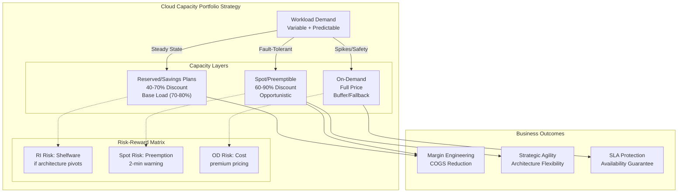
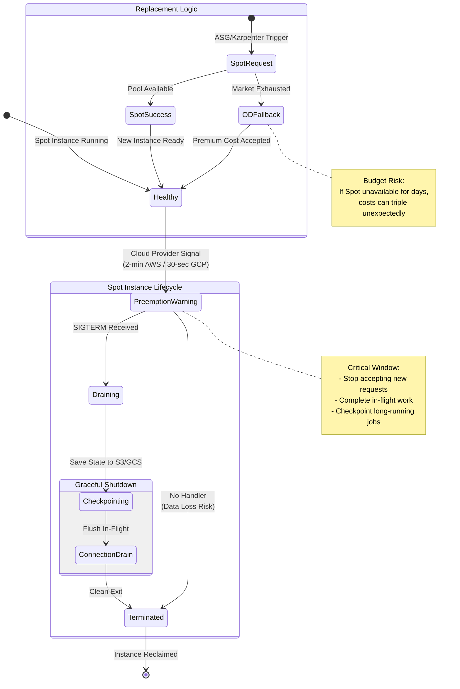
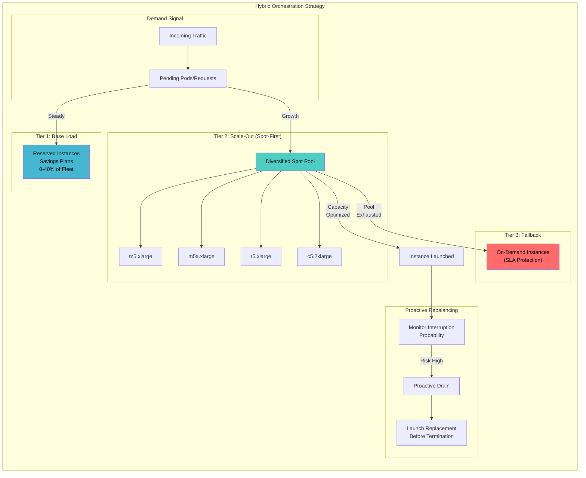

# Reserved vs. Spot Strategy

This guide covers 5 key areas: I. Strategic Context: The Cloud Capacity Portfolio, II. Reserved Instances (RIs) and Savings Plans, III. Spot Instances (Spot) and Preemptible VMs, IV. The Hybrid Strategy: Auto-Scaling and Orchestration, V. Business Impact & ROI Analysis.

## I. Strategic Context: The Cloud Capacity Portfolio

At the Principal TPM level, managing cloud capacity transitions from a tactical procurement exercise to a strategic risk management discipline. You are not merely "provisioning servers"; you are constructing a financial derivative strategy that balances **Availability Risk** (the cost of outages) against **Inventory Risk** (the cost of idle capital).

The objective is **Margin Engineering**: systematically reducing the Cost of Goods Sold (COGS) to improve Gross Margins, which directly correlates to company valuation.

### 1. The Portfolio Architecture: Beyond the Waterfall

While the "Waterfall" model (Reserved -> On-Demand -> Spot) is the foundational concept, Mag7 companies implement this dynamically using automated orchestration rather than static procurement rules.

**Technical Depth & Implementation:**
In a sophisticated portfolio, the infrastructure does not just "fall back" to On-Demand; it actively predicts and reshapes demand to fit the cheapest available supply.
*   **Workload Characterization:** Services are tagged not just by environment (Prod/Dev), but by *interruptibility* and *coupling*.
    *   *Tightly Coupled/Stateful:* Must land on Reserved Instances (RIs) or Savings Plans.
    *   *Loosely Coupled/Stateless:* Candidates for Spot.
*   **Orchestration Logic:** Tools like Kubernetes (with Karpenter on AWS) or proprietary internal schedulers (like Google’s Borg) dynamically bin-pack these workloads.
*   **The "Trough Filling" Strategy:** This involves scheduling low-priority batch jobs (e.g., video transcoding, log analysis, model training) specifically to fill the gaps between the Reserved capacity baseline and the actual diurnal traffic pattern of high-priority services.

**Real-World Mag7 Behavior (Google/Netflix):**
Google’s Borg scheduler overcommits machine resources. It classifies tasks into priority bands (e.g., "Production" vs. "Non-Production"). If a Production task needs resources, Borg immediately preempts (kills) the Non-Production task on that machine to make room. This allows Google to run their data centers at significantly higher utilization rates (often >60-70%) compared to the industry average (<20%), effectively getting "free" compute for batch jobs.

**Tradeoffs:**
*   **Choice:** Aggressive bin-packing and oversubscription of resources.
*   **Benefit:** Drastic reduction in wasted capacity (Capital Efficiency); lower TCO.
*   **Cost:** "Noisy Neighbor" problems where high-priority tasks suffer latency due to resource contention; engineering complexity in writing "resilient" code that handles preemption gracefully.

### 2. Capacity Forecasting and The "Buffer" Strategy

A Principal TPM must define the "Capacity Buffer"—the amount of idle headroom maintained to handle unexpected spikes. This is a business decision disguised as a technical parameter.

**Technical Depth:**
*   **Signal-Based Auto-Scaling:** Moving away from reactive scaling (CPU > 70%) to predictive scaling based on upstream business metrics (e.g., "Checkout Starts" or "Login Requests").
*   **The Buffer Calculation:** $Buffer = (Max\_Spike\_Velocity \times Provisioning\_Lag) + Safety\_Margin$.
    *   If it takes 5 minutes to boot a node, and traffic spikes 10% per minute, you need a 50% buffer to survive the lag.

**Impact on ROI/CX:**
*   **High Buffer (Safety):** Excellent CX (zero throttling), but destroys Unit Economics.
*   **Low Buffer (Lean):** Optimal ROI, but risks "Brownouts" during viral events or DDOS attacks.

**Mag7 Real-World Behavior (Amazon Retail):**
During Prime Day, Amazon freezes non-critical deployments and aggressively pre-scales capacity based on historical year-over-year growth models + marketing intent. They shift the portfolio heavily toward On-Demand/Reserved for the event duration to eliminate the risk of Spot reclamation, treating the increased cost as an insurance premium against downtime.

### 3. Internal Marketplaces and "Shadow Pricing"

To drive behavior change across thousands of engineers, Mag7 companies create internal economies.

**Technical Depth:**
A Principal TPM implements "Shadow Pricing" or "Showback" that reflects the *true* cost of the portfolio mix.
*   If Team A architects their service to be stateless and fault-tolerant, they are internally billed at the "Spot" rate (e.g., $0.10/hr).
*   If Team B builds a monolithic, stateful service requiring On-Demand reliability, they are billed at the premium rate (e.g., $1.00/hr).

**Impact on Skill & Capabilities:**
This forces engineering teams to upskill. They can no longer ignore architecture. To stay within budget (and get their headcount approved), they must refactor legacy applications to be cloud-native. It shifts the conversation from "Finance is cutting my budget" to "My architecture is too expensive."

**Tradeoffs:**
*   **Choice:** Implementing granular internal chargeback models.
*   **Benefit:** Decentralized cost optimization; aligns engineering incentives with business margins.
*   **Cost:** High friction during rollout; potential for "gaming the system" (e.g., teams under-provisioning to save money, leading to outages).

### 4. Edge Cases and Failure Modes

A portfolio strategy fails when correlations approach 1.0.

*   **Availability Zone (AZ) Failure:** If you rely heavily on Spot instances in `us-east-1a`, and that AZ has a power event, the Spot market in `us-east-1b` will instantly evaporate due to a flood of displacement demand.
    *   *Mitigation:* Your portfolio must be diversified across Regions, not just AZs.
*   **The "Death Spiral" of Preemption:** If your service takes 5 minutes to boot but is preempted every 4 minutes due to market volatility, you are paying for compute but accomplishing zero work.
    *   *Mitigation:* Implement "checkpointing" for long-running jobs and set minimum "drain timeouts" in your orchestration layer.

## II. Reserved Instances (RIs) and Savings Plans

In modern Mag7 contexts (specifically AWS and Azure), the rigid "Standard RI" model has largely been superseded or supplemented by **Savings Plans (SPs)** and **Committed Use Discounts (CUDs)**. While the financial principle remains the same—CapEx commitment for OpEx reduction—the technical implementation has shifted from reserving specific hardware slots (e.g., "I will buy 100 m5.large instances in us-east-1a") to committing to a specific spend (e.g., "I will spend $50/hour on compute").

As a Principal TPM, you are not expected to manage the procurement of these instruments manually. However, you must understand how they constrain or enable your architectural roadmap. If you are driving a migration from x86 to ARM (e.g., AWS Graviton) or moving a monolith to microservices, legacy RI strategies can actively penalize your modernization efforts by creating "financial lock-in" even if the technical lock-in is removed.

### 1. The Hierarchy of Commitment Flexibility

To optimize Unit Economics, you must select the correct instrument based on the volatility of your product's roadmap.

*   **Standard RIs (The "Hard Lock"):** You commit to a specific instance family (e.g., m5), OS, and region.
    *   **Mag7 Use Case:** Used only for legacy, "frozen" infrastructure like massive database clusters (e.g., RDS or self-managed Cassandra) that will not be re-architected for 3 years.
    *   **Tradeoff:** Highest discount (~60-72%) vs. Zero flexibility. If you optimize code and reduce instance count, you pay for "shelfware."
*   **Convertible RIs / Exchangeable CUDs:** Allows changing instance families or OS, but usually requires manual "exchanges" or specifically scoped commitments.
    *   **Mag7 Use Case:** Core backend services that are stable but might undergo a generational hardware refresh (e.g., moving from vCPU generation 2 to 3).
    *   **Tradeoff:** Moderate discount (~50-60%) vs. Administrative overhead to manage exchanges.
*   **Compute Savings Plans (The "Monetary Lock"):** You commit to $X/hour of spend across *any* instance family, size, or region (and often Fargate/Lambda).
    *   **Mag7 Use Case:** The default for 80% of microservices fleets. This decouples financial planning from engineering decisions. A team can migrate from Intel to AMD or from EC2 to Fargate without breaking the financial commit.
    *   **Tradeoff:** Lower discount (~25-50%) vs. Maximum architectural agility.

**Impact on Business Capability:**
Choosing Compute Savings Plans over Standard RIs often results in a 10-15% lower theoretical discount. However, the **effective savings** are usually higher because utilization remains near 100%, whereas rigid RIs often suffer from "breakage" (unused hours) during architectural shifts.

### 2. The "Waterline" Strategy and Coverage Ratios

A common failure mode for Principal TPMs is pushing for 100% RI/SP coverage to "maximize savings." This is mathematically flawed for dynamic workloads.

**Real-World Behavior:**
At companies like Netflix or Uber, the centralized Cloud Business Office (CBO) targets a "Waterline" or "Coverage Ratio" of typically **70-80% of steady-state usage**.
*   **The Bottom 70%:** Covered by 1-3 year Savings Plans (Base Load).
*   **The Top 30%:** Left as On-Demand or Spot.

**Why not 100%?**
If your engineering team ships a performance improvement that reduces compute intensity by 20%, or if user traffic drops seasonally, a 100% coverage model means you are now paying for unused capacity. The savings from the performance improvement are negated by the fixed financial commitment.

**Tradeoff:**
*   **Action:** Maintaining a "buffer" of On-Demand usage.
*   **Benefit:** Agility to scale down costs immediately when traffic drops or code becomes more efficient.
*   **Cost:** Paying premium rates for the top tier of usage.

### 3. Decoupling Billing from Capacity (The "Availability" Trap)

This is the most critical technical distinction for a Principal TPM.
**Savings Plans and RIs are primarily *billing* constructs, not *capacity* guarantees.**

If you purchase a Savings Plan for $100/hr, AWS/Azure promises you the *price*, but they do not guarantee that the specific physical servers will be available in `us-east-1` when you try to launch them during a region-wide outage or high-traffic event (like Black Friday).

**Mag7 Real-World Behavior:**
For critical launches (e.g., a new game launch or Prime Day), Principal TPMs must layer **On-Demand Capacity Reservations (ODCRs)** on top of their Savings Plans.
*   **ODCR:** You pay for the slot whether you use it or not (guarantees availability).
*   **Savings Plan:** You pay a lower rate for the usage.

**Tradeoff:**
*   **Action:** Provisioning ODCRs for launch events.
*   **Benefit:** Guaranteed hardware availability (SLA assurance).
*   **Cost:** ODCRs can result in wasted spend if the forecasted traffic does not materialize, as you are paying for empty racks.

### 4. The "Buy vs. Build" of Allocation Logic

At Mag7 scale, RIs and Savings Plans apply globally to the "Payer Account," not necessarily the specific "Linked Account" that generated the usage. This creates a "Peanut Butter" problem where savings are smeared across the organization, making accurate Unit Economics difficult.

**Impact on Skill & Culture:**
A Principal TPM must advocate for **Chargeback/Showback logic**.
*   **Scenario:** Team A optimizes their code and reduces spend. However, because the Savings Plan floats, the "unused" discount automatically applies to Team B's inefficient workload.
*   **Result:** Team A sees no cost reduction on the bill; Team B gets a subsidized budget. This destroys the incentive for engineering efficiency.
*   **Solution:** Implement "Proportional Amortization" metrics in your dashboards. Ensure teams are credited for the commitments made on their behalf.

## III. Spot Instances (Spot) and Preemptible VMs

Spot Instances (AWS) and Preemptible VMs (GCP/Azure) represent the "opportunistic" tier of your cloud portfolio. These are spare compute capacity sold by cloud providers at deep discounts (typically 60-90% off On-Demand prices). The catch is the **Interruption Contract**: the provider can reclaim this capacity with minimal warning (2 minutes on AWS, 30 seconds on GCP) when they need it for On-Demand or Reserved customers.

For a Principal TPM, Spot adoption is not merely a cost-saving tactic; it is a forcing function for **architectural resilience**. A service that runs successfully on Spot is, by definition, stateless, fault-tolerant, and loosely coupled.

### 1. Architectural Prerequisites: The "Spot-Ready" Criteria

You cannot simply "flip a switch" to Spot for legacy applications. As a TPM, you must validate that the engineering architecture supports the volatility.

*   **Statelessness:** The application must not store session state locally on the disk or memory. State must be externalized to a cache (Redis/Memcached) or database (DynamoDB/Cloud SQL).
*   **Graceful Shutdown Handling:** When the cloud provider sends the preemption signal (via instance metadata or EventBridge), the application must catch the signal (usually `SIGTERM`), stop accepting new requests, finish in-flight requests, and flush logs/metrics within the warning window (2 minutes for AWS).
*   **Checkpointing:** For long-running batch jobs (e.g., training an LLM or rendering video), the system must save progress periodically. If a node is preempted after 4 hours of processing without checkpoints, you have lost 4 hours of cost and time.

**Mag7 Real-World Behavior:**
At Meta and Google, internal batch processing frameworks (like Borg or internal K8s variants) automatically classify workloads. "Best Effort" jobs (lowest priority) run on preemptible capacity. If a production-critical latency-sensitive job spikes, the scheduler ruthlessly kills the Best Effort jobs to free up resources. Engineers at these companies design batch jobs assuming they will be killed multiple times per execution.

**Tradeoff:**
*   **Choice:** Refactoring a stateful legacy app to support Spot.
*   **Benefit:** 70%+ reduction in run costs; improved disaster recovery posture (due to forced statelessness).
*   **Cost:** High initial engineering NRE (Non-Recurring Engineering) to decouple state and implement graceful handling.

### 2. Diversification and Supply Chain Management

The single biggest failure mode in Spot strategy is **Capacity unavailability**. If you rely solely on one instance type (e.g., `c5.4xlarge`) in one Availability Zone (AZ), you are exposed to market fluctuations. If that specific pool runs out, your application scales down to zero.

**The Strategy: Spot Fleet / Mixed Instance Policies**
A Principal TPM must drive a strategy of diversification. You must define a "pool" of acceptable instances that are roughly equivalent in performance.
*   *Example:* If you need 16 vCPUs and 64GB RAM, your Auto Scaling Group (ASG) should be configured to accept `m5.4xlarge`, `m5a.4xlarge` (AMD variant), `r5.4xlarge` (Memory optimized), and `c5.9xlarge` (Compute optimized, larger size).

**Mag7 Real-World Behavior:**
Netflix’s container orchestration platform (Titus) abstracts the underlying EC2 instance types. Developers request resources (CPU/Memory/Disk), and the scheduler fulfills this demand using a massive, diversified fleet of Spot instances. If `m5` instances become expensive or unavailable in `us-east-1`, the system automatically shifts to `r5` instances or moves the workload to `us-east-2`, effectively arbitrating the market in real-time.

**Impact on Business Capabilities:**
*   **Resilience:** Diversification ensures that a stock-out in one instance family does not take down the service.
*   **Throughput:** Allows the business to scale out massively for short durations (e.g., processing a data lake) at a fraction of the cost.

### 3. Orchestration and Fallback Logic

In a production environment, you cannot tolerate a scenario where Spot capacity is zero and the service halts. You must implement **On-Demand Fallback**.

**The Waterfall Logic:**
1.  Attempt to launch Spot Instances using a diversified pool.
2.  If Spot capacity is unavailable (Market constraints), automatically launch On-Demand instances to meet the SLA.
3.  Continuously monitor Spot availability; once capacity returns, drain the expensive On-Demand instances and replace them with Spot.

**Technical Nuance:**
In Kubernetes (EKS/GKE), this is often handled via **Cluster Autoscaler** with Priority Expanders or specialized tools like Karpenter (AWS). You define "Node Pools." The primary pool is Spot; the secondary pool is On-Demand.

**Tradeoff:**
*   **Choice:** Automating On-Demand fallback.
*   **Benefit:** Protects SLAs and Customer Experience (CX) during market volatility.
*   **Cost:** Unpredictable budget spikes. If a region runs out of Spot for 3 days (e.g., during Black Friday), your bill for that period triples. The TPM must ensure Finance is aware of this variance risk.

### 4. Use Cases and ROI Analysis

Not all workloads are suitable for Spot. The Principal TPM is responsible for the "Go/No-Go" decision on workload placement.

| Workload Type | Suitability | Strategy | ROI Impact |
| :--- | :--- | :--- | :--- |
| **CI/CD Pipelines** | **High** | Jenkins/GitLab runners on 100% Spot. If a build dies, just retry it. | Massive. CI/CD is often 20-30% of dev compute bill. |
| **Stateless Microservices** | **Medium/High** | Run behind a Load Balancer. Ensure capacity is over-provisioned by ~10% to handle churn. | High, but requires strict "graceful shutdown" code. |
| **Databases (Master)** | **Zero** | Never run primary DBs on Spot. Data loss/corruption risk is unacceptable. | N/A - Do not do this. |
| **AI/ML Training** | **High** | Use "Capacity Blocks" (AWS) or checkpointing. | Enables training larger models that would be cost-prohibitive On-Demand. |

**The "Hidden Cost" of Retries:**
If your application has a long startup time (e.g., loading large ML models into memory takes 10 minutes) and the Spot instance is reclaimed every 30 minutes, you are paying for 10 minutes of "waste" every cycle.
*   *ROI Calculation:* If (Setup Time / Average Instance Lifetime) > 20%, Spot may actually be *less* efficient than Reserved Instances due to wasted compute cycles and retry overhead.

## IV. The Hybrid Strategy: Auto-Scaling and Orchestration

The implementation of a Cloud Capacity Portfolio is not a static configuration; it is a dynamic operational loop. For a Principal TPM, the technical challenge lies in architecting systems that fluidly transition between "Base Load" (Reserved) and "Opportunistic Load" (Spot) without human intervention or service degradation.

This requires moving beyond simple Auto-Scaling Groups (ASGs) to **Attribute-Based Instance Selection** and intelligent **Container Orchestration**.

### 1. Diversified Fleet Composition (Attribute-Based Selection)

A common failure mode in hybrid strategies is "Instance Affinity"—engineering teams validating their software on a single instance type (e.g., `m5.large`) and configuring auto-scaling to request only that type. In a Spot strategy, this is catastrophic. If the `m5.large` pool in `us-east-1a` is reclaimed, the application faces a capacity outage.

**The Principal Strategy:**
Shift from requesting specific instance types to requesting **attributes** (vCPU count, RAM, architecture). Modern orchestration (like AWS EC2 Fleet or open-source Karpenter) allows you to define a "capacity pool" that includes multiple generations and families (e.g., `m5.large`, `m4.large`, `c5.large`, `r5.large`).

*   **Mag7 Real-World Behavior:** At Netflix (via their internal platform Titus) or Meta (via Twine), schedulers treat compute as a commodity blob. If a video encoding job needs 4 vCPUs and 16GB RAM, the scheduler will accept an `m5.xlarge` or a `c5.2xlarge` (even if it has more CPU than needed) if the latter is currently the cheapest Spot option available. They prioritize "Availability via Diversity" over "Perfect Sizing."
*   **Tradeoff:**
    *   **Choice:** Allowing a heterogeneous fleet of instance types and generations.
    *   **Benefit:** Increases the "Surface Area of Availability." It is statistically unlikely that *all* 15 instance types in a pool will spike in price or run out of capacity simultaneously.
    *   **Cost/Risk:** QA complexity increases. The application must be validated to run on different processor architectures (Intel vs. AMD vs. ARM/Graviton) or tolerate slight variances in network throughput.
*   **Business Impact:** Drastic reduction in "Insufficient Capacity Errors" (ICE), directly protecting SLA uptime while maintaining Spot pricing (60-90% discount).

### 2. Orchestration Logic: The "Spot-First" Waterfall

Standard auto-scaling simply adds nodes when CPU > 50%. A Hybrid Strategy requires a prioritized waterfall logic embedded in the provisioning configuration.

**The Configuration Logic:**
1.  **Tier 1 (Base):** Launch Reserved Instances/Savings Plan coverage (0-40% of fleet).
2.  **Tier 2 (Scale-Out):** Launch Spot Instances using the "Capacity Optimized" allocation strategy (AWS) or similar predictive placement logic (GCP). This strategy selects Spot pools with the deepest capacity, not necessarily the absolute lowest current price, to minimize interruption probability.
3.  **Tier 3 (Fallback):** If Spot requests fail (market exhaustion), immediately fallback to On-Demand.

**Technical Nuance:**
This fallback must be automated. In Kubernetes, this is often handled by **Cluster Autoscaler** with priority expanders or **Karpenter**. When a Spot node cannot be provisioned, the pending pods remain in a `Pending` state. The orchestrator must detect this timeout (usually <60 seconds) and switch the request to an On-Demand Node Group / Provisioner.

*   **Tradeoff:**
    *   **Choice:** Implementing automated On-Demand fallback.
    *   **Benefit:** Protects the SLA. The business prefers paying On-Demand rates for 2 hours over a service outage.
    *   **Cost:** Budget unpredictability. A "Black Friday" event might force the entire fleet to On-Demand, causing a massive spike in COGS.
*   **Mag7 Impact:** Principal TPMs drive "Cost Anomaly Detection" alerts. If a service runs on On-Demand fallback for >4 hours, on-call engineers are paged to investigate why Spot is unavailable or if the configuration is broken, preventing accidental sustained high costs.

### 3. Handling Interruption: Graceful Termination & Rebalancing

Spot instances (AWS) and Preemptible VMs (GCP) provide a termination notice (2 minutes for AWS, 30 seconds for GCP). A Principal TPM must ensure the application architecture can handle this "Hard Stop."

**The Workflow:**
1.  **Detection:** The node receives the termination signal (via Instance Metadata Service or EventBridge).
2.  **Cordon and Drain:** The orchestration layer (e.g., K8s) immediately "cordons" the node (stops scheduling new pods) and "drains" existing pods (sends SIGTERM).
3.  **Checkpointing (Stateful):** If the workload is AI training or data processing, the application must checkpoint state to persistent storage (S3/GCS/EFS) within the window.
4.  **Replacement:** The Auto-Scaler launches a replacement node *immediately* upon receiving the signal, not waiting for the termination to complete.

*   **Mag7 Real-World Behavior:** Google's Borg (internal K8s predecessor) and AWS control planes utilize "Proactive Rebalancing." They monitor the "interruption probability" of the Spot pools they are using. If a pool's risk elevates, they proactively spin up replacement nodes and drain the risky nodes *before* the termination signal is even sent. This achieves "invisible" churn.
*   **Tradeoff:**
    *   **Choice:** Proactive Rebalancing (churning nodes before forced termination).
    *   **Benefit:** Zero-downtime user experience; elimination of 502 errors caused by abrupt termination.
    *   **Cost:** Higher "wasted" compute. You are paying for two nodes (the old one draining and the new one booting) simultaneously for several minutes.
*   **Business Capability:** Enables the use of Spot instances for customer-facing, stateless web services (e.g., frontend APIs), unlocking 70% savings on workloads previously thought to be "On-Demand only."

### 4. Container Bin-Packing and "Just-in-Time" Provisioning

Legacy auto-scaling scales the *infrastructure* (add EC2 nodes), and then the scheduler places containers. Modern strategies (Karpenter) invert this: they observe the *pending containers* and provision the exact infrastructure needed.

**Why this matters for Principals:**
Traditional ASGs often suffer from fragmentation. You might have 5 large nodes running at 20% utilization because the pods are spread out.
A "Just-in-Time" provisioner looks at pending pods and calculates: "I have 3 pending pods requiring 2 vCPU each. I will launch exactly one `c5.xlarge` (4 vCPU) and one `c5.large` (2 vCPU) to fit them perfectly."

*   **Impact on ROI:** This eliminates "allocatable but unused" waste. In large-scale microservices environments, moving from ASG-based scaling to Provisioner-based scaling (bin-packing) typically yields an additional **15-20% reduction in compute spend** on top of Spot savings.

## V. Business Impact & ROI Analysis

At the Principal TPM level, your role shifts from managing project delivery to influencing the company’s bottom line through technical strategy. In the context of cloud capacity (Reserved vs. Spot), "Business Impact" is not merely about lowering the monthly bill; it is about optimizing **Gross Margins** and **Unit Economics**.

You must demonstrate the ability to translate architectural decisions (e.g., "migrating to Spot instances") into financial metrics (e.g., "COGS per transaction"). This translation allows leadership to make data-driven decisions on where to allocate engineering headcount—whether to invest in cost optimization or feature velocity.

### 1. Unit Economics: Shifting from Absolute Cost to Cost-Per-Event

At Mag7 scale, absolute cloud spend will always increase as the business grows. A flat budget is unrealistic. Therefore, you must track and optimize **Unit Economics**—the cost to serve a single unit of value (e.g., Cost Per Stream at Netflix, Cost Per Query at Google, Cost Per Order at Amazon).

**Mag7 Real-World Behavior:**
Teams at Meta or Google do not simply report "Infrastructure Spend." They report "Efficiency." A Principal TPM might lead an initiative to migrate a video transcoding pipeline from On-Demand instances to Spot instances. The success metric is not "We saved \$500k," but rather "We reduced transcoding cost from \$0.04/minute to \$0.01/minute, improving gross margin by 3%."

*   **The Strategy:** Implement tagging and cost-allocation frameworks that map compute usage to specific business outputs.
*   **The Tradeoff:**
    *   *Choice:* Granular cost tracking vs. aggregated billing.
    *   *Benefit:* Enables precise ROI calculation and accountability; exposes inefficient microservices.
    *   *Cost:* High implementation friction; requires engineering teams to tag resources correctly and complicates the data pipeline for metering.

### 2. The "Engineering Hour" vs. "Compute Hour" Arbitrage

One of the most common pitfalls at the Senior level is over-optimizing for cloud costs at the expense of engineering velocity. As a Principal, you must perform the arbitrage calculation: **Is the engineering effort required to support Spot instances worth the cloud savings?**

**Mag7 Real-World Behavior:**
Consider a team at Amazon designing a new internal tool.
*   **Scenario A:** They use On-Demand instances. Cloud bill: \$50k/year. Engineering maintenance: 2 hours/month.
*   **Scenario B:** They architect for Spot (handling interruptions, checkpointing, state management). Cloud bill: \$15k/year. Engineering build time: 3 months of a Senior Engineer's time (~\$100k opportunity cost) plus ongoing maintenance.

In this scenario, a Principal TPM would block the move to Spot. The ROI is negative because the "Engineering Cost" (CapEx/OpEx of talent) outweighs the "Infrastructure Savings." However, if that service scales to \$5M/year in compute, the engineering investment becomes highly ROI-positive.

*   **Impact on Business:** prevents "Resume Driven Development" where engineers build complex Spot-handling architectures just for the intellectual challenge, ensuring talent is focused on revenue-generating features.

### 3. Risk-Adjusted ROI: The Cost of Interruption

When calculating the ROI of a Spot/Preemptible strategy, you must factor in the **Cost of Interruption**. Spot instances can be reclaimed with a 2-minute warning (AWS) or 30 seconds (GCP).

**The Formula:**
$$ \text{True Cost} = \text{Spot Price} + (\text{Probability of Preemption} \times \text{Cost of Recovery}) + \text{CX Impact} $$

**Mag7 Real-World Behavior:**
At Netflix, the "Chaos Monkey" philosophy ensures systems are resilient. However, for the *control plane* (the service that lets you hit 'Play'), they rely heavily on Reserved Instances or heavily over-provisioned groups. The ROI of saving 60% on compute is irrelevant if it introduces a 0.1% failure rate in starting streams, which directly correlates to churn.
Conversely, for *batch processing* (e.g., generating recommendation models), the CX impact of a 10-minute delay is zero. Here, the risk-adjusted ROI for Spot is massive.

*   **Tradeoff:**
    *   *Choice:* High-availability architecture (On-Demand/RI) vs. Fault-tolerant architecture (Spot).
    *   *Benefit (Spot):* Massive reduction in COGS (Cost of Goods Sold).
    *   *Cost (Spot):* Latency jitter; potential data reprocessing costs; requirement for stateless architecture.

### 4. CapEx vs. OpEx: Financial Engineering

A Principal TPM must understand how the CFO views money.
*   **Reserved Instances (RIs):** Often treated as a capital commitment or require upfront cash. This can look like CapEx (depending on accounting treatment) or a long-term liability.
*   **Spot/On-Demand:** Pure OpEx. You pay as you go.

**Mag7 Real-World Behavior:**
During economic downturns (e.g., the "Year of Efficiency" at Meta), cash flow is king. A CFO might prefer Spot instances (OpEx) to avoid locking up \$10M in upfront RI payments, even if RIs are theoretically cheaper over 3 years. Alternatively, if the company needs to improve EBITDA targets, they might push for RIs to lower the recognized monthly expense immediately.

*   **Impact on Capabilities:** Your technical roadmap must align with the fiscal calendar. Proposing a massive 3-year RI purchase in Q4 might be rejected if the company is trying to preserve cash on the balance sheet, whereas a Spot optimization project requiring engineering time might be approved.

### 5. Strategic Agility and Vendor Lock-in

Heavily investing in RIs creates a "Golden Handcuff." You are committed to a specific instance family (e.g., AWS `m5.large`) or region for 1-3 years.

**Mag7 Real-World Behavior:**
Microsoft Azure releases new chipsets (e.g., Cobalt) or AI accelerators regularly. If you locked into 3-year RIs on older GPU generations to save 40%, you cannot migrate to the new hardware that is 2x as fast without financial penalty or complex convertible RI exchanges.
A Spot strategy maintains **Strategic Agility**. You can switch instance families instantly to take advantage of new hardware price-performance improvements.

*   **Tradeoff:**
    *   *Choice:* 3-Year RI Commitment vs. Spot/On-Demand.
    *   *Benefit (RI):* Guaranteed capacity and predictable pricing.
    *   *Cost (RI):* Inability to adopt new, more efficient hardware; sunk cost fallacy if architecture changes (e.g., moving from x86 to ARM/Graviton).

---

## Interview Questions

### I. Strategic Context: The Cloud Capacity Portfolio

### Question 1: The Margin Squeeze
"Our CFO wants to improve gross margins by 5% next year. The engineering teams argue they are already optimized and cannot move more workloads to Spot instances without risking reliability. As a Principal TPM, how do you validate their claims and execute a strategy to meet the CFO's target?"

**Guidance for a Strong Answer:**
*   **Diagnosis:** Don't accept "we can't" at face value. Look at *Utilization Efficiency* (are the reserved instances actually doing work?) and *Application Coupling* (why can't it move to Spot?).
*   **Portfolio Strategy:** Propose a "Savings Plan" analysis to cover the steady-state if Spot isn't an option.
*   **Technical/Cultural:** Suggest "Reliability Engineering" sprints to decouple state from compute (e.g., moving session state to Redis) to enable Spot usage.
*   **Metrics:** Shift the KPI from "Total Spend" to "Cost per Transaction." If spend is flat but traffic grows 20%, you effectively improved margins.

### Question 2: The Capacity Crisis
"You are launching a GenAI feature that requires massive GPU capacity. The cloud provider informs you that On-Demand GPU capacity is stocked out in your primary region. You have a launch deadline in 4 weeks. What is your portfolio strategy to unblock the launch?"

**Guidance for a Strong Answer:**
*   **Immediate Mitigation:** Look for "Hidden Capacity." Can we reclaim GPUs from internal lower-priority training jobs (cannibalize internal R&D for Production Launch)?
*   **Geographic Arbitrage:** Can we deploy the inference layer in a different region with available capacity, even if it adds 50ms latency? (Tradeoff: Latency vs. Availability).
*   **Architecture:** Can we quantize the model to run on smaller, more available instance types?
*   **Communication:** This is a "Red Status" risk. The answer must include stakeholder management—informing leadership that the "Portfolio" is constrained and offering options: Delay launch, launch in limited regions, or pay a premium for reserved capacity in a secondary market.

### II. Reserved Instances (RIs) and Savings Plans

**Question 1: The Efficiency Paradox**
"You are leading a program to refactor a monolithic application into microservices, which we estimate will reduce our compute footprint by 30% and improve latency. However, Finance informs you that the current infrastructure is covered by a 3-year Reserved Instance commitment with 18 months remaining. If we reduce usage, we waste the commitment money. How do you proceed?"

*   **Guidance for a Strong Answer:**
    *   **Financial Analysis:** Acknowledge the "Sunk Cost." The RI money is gone. The decision should be based on future cash flows and opportunity cost.
    *   **Mitigation:** Can the RIs be sold (RI Marketplace - rare for Enterprise)? Can they be exchanged (Convertible RIs)? Can the "floating" RI credits be absorbed by another business unit growing their footprint?
    *   **Strategic Pivot:** If the RIs are rigid, calculate if the *operational* benefits (latency, velocity) outweigh the *financial* waste. If the latency improvement increases user retention/revenue, the wasted RI cost might be negligible compared to the top-line growth.

**Question 2: Launch Capacity Strategy**
"We are launching a generative AI feature expected to drive a 500% spike in GPU usage for the first 48 hours, followed by unpredictable volatility. The finance team wants to buy Savings Plans to lower the cost. The engineering team is worried about getting enough A100/H100 GPUs. What is your capacity and cost strategy?"

*   **Guidance for a Strong Answer:**
    *   **De-risk Availability first:** Reject the Savings Plan as the primary mechanism for the *spike*. Savings Plans do not guarantee hardware. Prioritize **On-Demand Capacity Reservations (ODCR)** or negotiating a specific short-term deal with the cloud provider for the launch window to ensure the GPUs are actually secured.
    *   **Wait-and-See for Commitments:** Advise against buying long-term Savings Plans (1-3 years) for a 48-hour spike. Wait for the "unpredictable volatility" to stabilize into a baseline (e.g., after 2-4 weeks) before committing to a Savings Plan.
    *   **Spot Usage:** Suggest using Spot instances for the inference queue if the architecture allows for fault tolerance (retries), which solves for both cost and potential On-Demand scarcity.

### III. Spot Instances (Spot) and Preemptible VMs

### Question 1: The Migration Strategy
"We have a legacy monolith application that runs on On-Demand instances, costing us $5M annually. The CTO wants to cut costs by moving to Spot Instances immediately. As a Principal TPM, how do you assess the feasibility, and what is your execution strategy?"

**Guidance for a Strong Answer:**
*   **Assessment:** Do not agree to move immediately. First, audit the application for state (sessions, local storage).
*   **Risk Mitigation:** Propose a hybrid approach. Start with the "Stateless Web Tier" or "Staging Environments" first.
*   **Architecture:** Mandate the implementation of graceful termination handling and connection draining.
*   **Diversification:** Insist on instance flexibility (not just one instance type) to avoid outages.
*   **Financials:** Model the "Worst Case" (100% fallback to On-Demand) and "Expected Case" (80% Spot coverage).
*   **Key Phrase:** "Spot is an architectural constraint, not just a billing setting."

### Question 2: Handling Market Volatility
"Your team manages a critical data processing pipeline running on Spot Instances. Suddenly, a regional outage in the cloud provider causes a massive spike in demand, and Spot capacity drops to zero in your primary Availability Zone. The pipeline is stalled, and SLAs are slipping. What is your immediate response and long-term fix?"

**Guidance for a Strong Answer:**
*   **Immediate Action:** Trigger the "On-Demand Fallback" manually if automation fails. Pay the premium to clear the backlog and meet the SLA. Cost is secondary to SLA in a crisis.
*   **Secondary Action:** Shift traffic/workload to a different region if the pipeline architecture supports multi-region ingress.
*   **Root Cause/Long Term:**
    *   Review the **Instance Diversification** strategy. Were we too reliant on a specific instance family (e.g., `m5`)? Add older generations (`m4`) or different types (`c5`, `r5`) to the pool.
    *   Implement **Automated Fallback Mechanisms** (e.g., Karpenter or Auto Scaling Group priorities) so human intervention isn't required next time.
    *   **Business Tradeoff:** Discuss with stakeholders if the SLA allows for "pausing" during high-cost periods to save money, or if the data is time-critical.

### IV. The Hybrid Strategy: Auto-Scaling and Orchestration

### Question 1: The "Thundering Herd" Fallback
**"We have a critical service running 80% on Spot instances. During a regional outage in one Availability Zone, Spot capacity dried up completely. The system attempted to fall back to On-Demand, but the sudden surge of API calls to provision thousands of On-Demand instances triggered rate limits and the service collapsed. As a Principal TPM, how would you architect the auto-scaling strategy to prevent this failure mode in the future?"**

*   **Guidance for a Strong Answer:**
    *   **Identify the Root Cause:** The issue is a lack of *diversification* and aggressive *retry storms* hitting the control plane APIs.
    *   **Strategic Fix (Diversification):** Expand the Spot request to include multiple instance families (C5, M5, R5) and generations to reduce the likelihood of total pool exhaustion.
    *   **Technical Fix (Proactive Scaling):** Implement "Over-provisioning" or "Headroom" pods. Keep a buffer of low-priority "pause pods" running on On-Demand instances. When Spot fails, evict the pause pods to make immediate room for critical workloads while new nodes spin up slowly.
    *   **Operational Fix (Rate Limiting):** Implement exponential backoff-and-jitter on the provisioning API calls to avoid self-inflicted DDoS on the cloud provider's control plane.

### Question 2: The Stateless vs. Stateful Debate
**"An engineering director wants to move our CI/CD build fleet and our primary redis caching layer entirely to Spot instances to save 60% on the budget. They claim their applications handle restarts well. How do you evaluate this request, and what is your recommendation?"**

*   **Guidance for a Strong Answer:**
    *   **Segment the Workloads:** Reject the "one size fits all" approach.
    *   **CI/CD (Approved):** CI/CD is stateless and batch-oriented. It is a perfect candidate for Spot. Recommendation: Implement aggressive Spot usage with a "checkpoint" mechanism or simple job retries.
    *   **Redis (Rejected/Caveated):** Redis is stateful (in-memory). While it *can* recover, a Spot interruption clears the cache, causing a "Cache Stampede" on the downstream database, potentially crashing the source of truth.
    *   **The Principal Solution:** Recommend Spot for CI/CD. For Redis, recommend **Reserved Instances** (for stability) or a hybrid approach where the *Master* node is On-Demand/RI and *Read Replicas* are Spot (if the application can tolerate eventual consistency and lag during churn). Focus on Total Cost of Ownership (TCO), noting that a database outage costs more than the Spot savings.

### V. Business Impact & ROI Analysis

**Question 1: The "Sunk Cost" Migration**
"You are the TPM for a critical data ingestion service currently running on Reserved Instances that have 18 months left on their term. An engineer proposes re-architecting the service to run on Spot instances, which would lower the compute rate by 60% compared to the On-Demand price, and 30% compared to our current RI rate. However, the RIs are not convertible. How do you evaluate this proposal and what is your recommendation?"

*   **Guidance for a Strong Answer:**
    *   **Financial Literacy:** Identify that the RI cost is a sunk cost. If you stop using the RIs, you still pay for them (unless there is a secondary market or another internal team can absorb them).
    *   **The "Double Pay" Problem:** Moving to Spot means paying for the Spot instances *plus* the wasted RIs. The immediate financial impact is negative.
    *   **Fungibility:** Ask if the RIs can be floated to another team. If yes, the ROI calculation changes.
    *   **Strategic Horizon:** If the re-architecture takes 6 months, you only have 12 months of RI waste.
    *   **Decision:** Likely reject the immediate move unless the RIs can be repurposed, but approve the *design* phase so the team is ready to switch to Spot the moment the RI term expires (or migrate partially to blend costs).

**Question 2: The Latency vs. Cost Tradeoff**
"Our machine learning inference service is costing \$5M/year on On-Demand instances. You propose moving to Spot to save \$3M/year. However, due to the need to handle interruptions and cold starts, P99 latency will increase from 200ms to 450ms. The Product VP argues this will hurt user experience. How do you resolve this conflict?"

*   **Guidance for a Strong Answer:**
    *   **Data-Driven Negotiation:** Don't argue opinions. Ask for (or generate) data correlating P99 latency to conversion/retention. Does a 250ms increase actually drop user engagement?
    *   **Hybrid Approach:** Propose a "Waterline" strategy. Run the base load (steady state) on RIs to guarantee performance for 80% of traffic, and use Spot only for the peaks. This averages down the cost while protecting the latency for the majority of users.
    *   **Business Impact Analysis:** Compare the \$3M savings to the potential revenue loss from churn. If the revenue loss is estimated at \$500k, the move is net positive. If revenue loss is \$10M, the move is catastrophic.
    *   **Stakeholder Management:** Frame the decision as a business choice, not a technical one. "We can buy \$3M of margin by accepting 250ms of latency. Is that a trade we want to make?"

---

## Key Takeaways

- Review each section for actionable insights applicable to your organization

- Consider the trade-offs discussed when making architectural decisions

- Use the operational considerations as a checklist for production readiness
