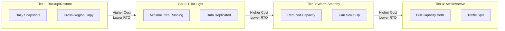
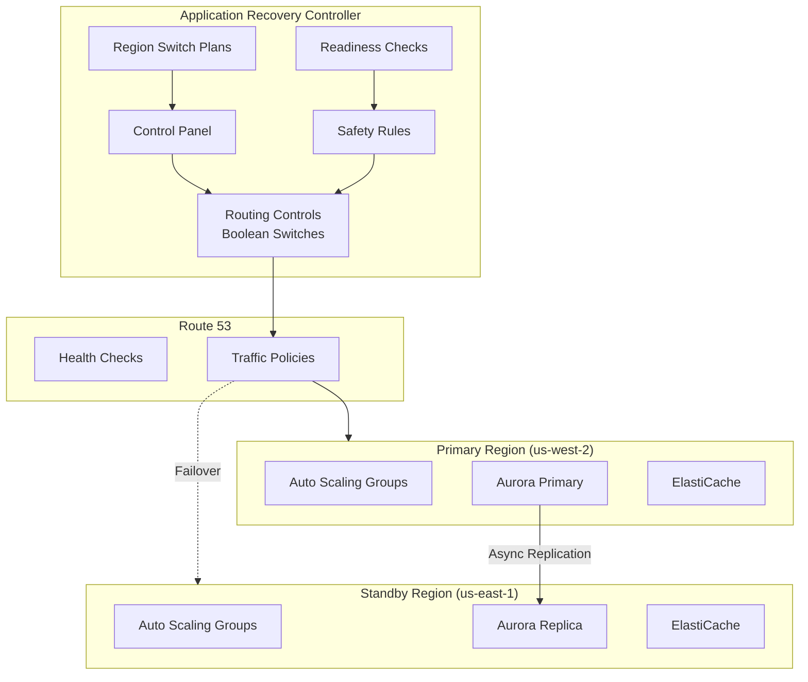
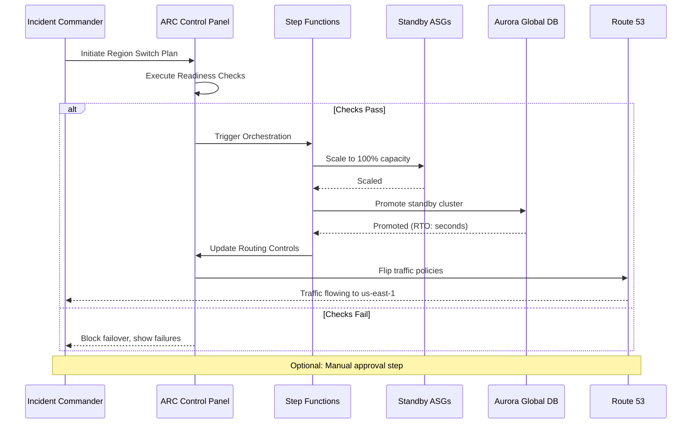
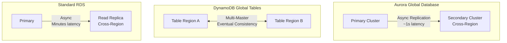
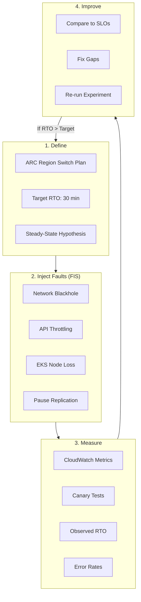
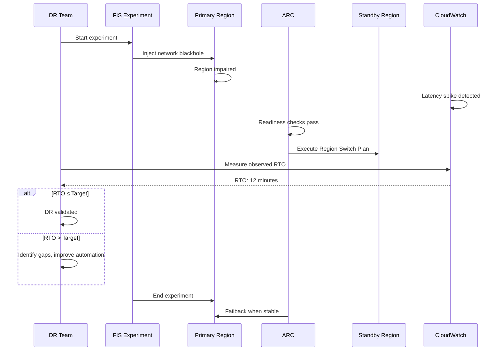
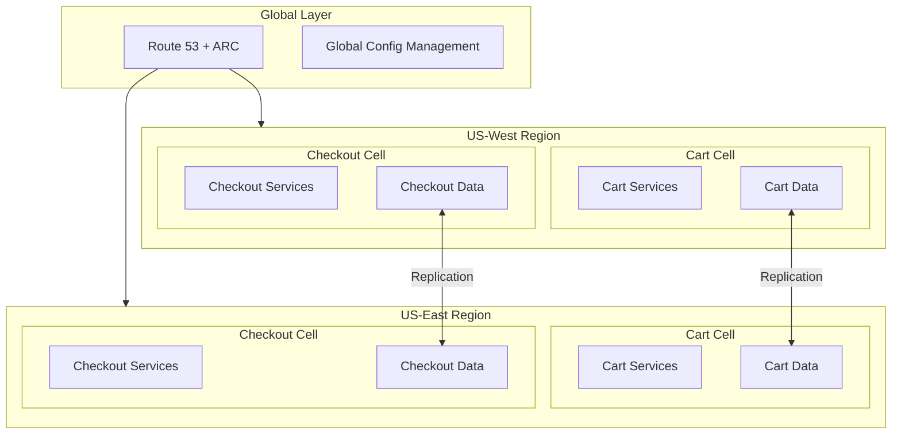
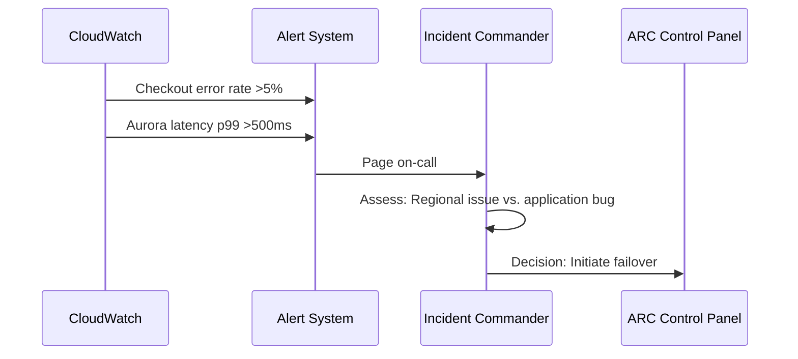
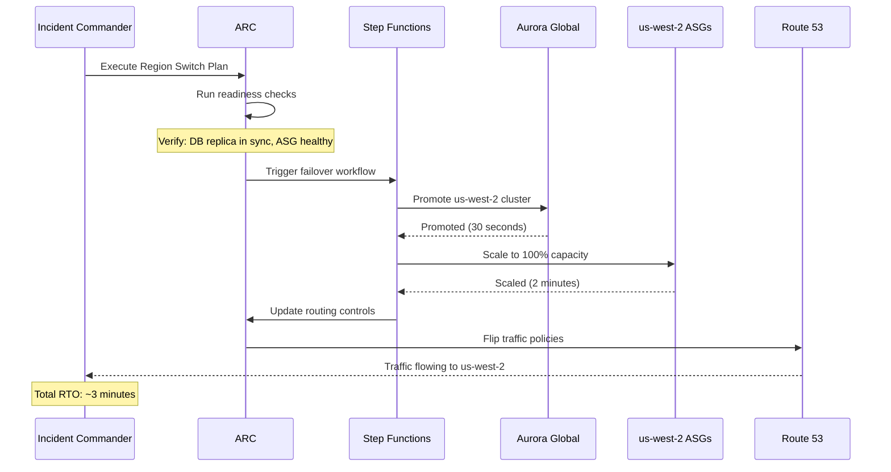

# Resilience & Disaster Recovery at AWS/Amazon Scale

## Why This Matters

Amazon.com processes millions of transactions daily, with checkout and payments requiring near-zero downtime. At this scale, disaster recovery isn't a checkbox—it's an architectural discipline. Understanding AWS's DR patterns matters for TPMs because:

1. **RTO/RPO are business decisions, not technical ones.** Different workloads justify different investments.
2. **DR must be orchestrated, not improvised.** Application Recovery Controller (ARC) provides the control plane for multi-region failover.
3. **Chaos engineering validates DR works.** AWS Fault Injection Service (FIS) turns DR from documentation into muscle memory.

This document covers AWS's multi-region DR patterns: active/active and active/passive architectures, orchestrated failover via ARC and Route 53, and continuous validation using FIS.

---

## 1. The Core Framework: Four DR Tiers

**The problem:** DR sounds simple—"if region A fails, use region B." But the cost and complexity vary dramatically depending on how fast you need to recover and how much data loss you can tolerate.

**The solution:** A four-tier framework that maps cost/complexity to RTO/RPO requirements.

### 1.1 Pattern Comparison

| Pattern | RTO | RPO | Cost | Complexity | Use Case |
|---------|-----|-----|------|------------|----------|
| **Backup/Restore** | Hours | Hours | $ | Low | Batch jobs, reporting, non-critical analytics |
| **Pilot Light** | Tens of minutes | Minutes | $$ | Medium | Non-critical workloads, internal tools |
| **Warm Standby** | Minutes | Minutes | $$$ | Medium-High | Important services, customer-facing with SLA |
| **Active/Active** | Seconds→Minutes | Seconds | $$$$ | High | Payments, checkout, revenue-critical |

### 1.2 Mapping Workloads to Tiers

Different business domains justify different DR investments:

| Domain | DR Pattern | RTO Target | RPO Target | Rationale |
|--------|------------|------------|------------|-----------|
| **Checkout/Payments** | Active/Active | Minutes | Seconds | Each minute of downtime costs $X million |
| **Product Catalog** | Warm Standby | 10-30 min | Minutes | Stale catalog is better than no catalog |
| **Recommendations** | Pilot Light | 30-60 min | Hours | Degraded recommendations are acceptable |
| **Reporting/BI** | Backup/Restore | Hours | Hours | Batch processing can wait |

> **TPM Framing:** Always anchor DR decisions to business impact: "For checkout, we pay the cost/complexity of active/active because each minute of downtime costs $X million. For catalog search, we accept longer failover because stale results are cheaper than unavailability."

---

## 2. Failover Orchestration: Application Recovery Controller (ARC)

**The problem:** DR without orchestration becomes a hero event—engineers scrambling through runbooks at 3 AM, making mistakes under pressure. Manual failover is slow and error-prone.

**The solution:** ARC is the DR control plane. It owns the application-level runbook for multi-region failover and failback, with safety rules to prevent mistakes.

### 2.1 ARC Building Blocks

| Component | Purpose | Example |
|-----------|---------|---------|
| **Routing Controls** | Boolean switches that gate Route 53 traffic | `us-west-2-active: true` |
| **Control Panel** | Groups routing controls for an application | Checkout app controls |
| **Region Switch Plans** | Declarative failover playbooks | A→B switch steps |
| **Safety Rules** | Pre-conditions before traffic shift | "DB replica in sync" |
| **Readiness Checks** | Verify standby has healthy capacity | ASG health, DB lag |

### 2.2 Region Failover Workflow

A typical ARC-driven failover from `us-west-2` → `us-east-1`:

### 2.3 Why Safety Rules Matter

Safety rules prevent well-intentioned failovers from making things worse:

- **"DB replica in sync"**: Don't failover if standby is 30 minutes behind—you'd lose 30 minutes of data
- **"Standby capacity healthy"**: Don't failover if standby ASG is at 20% capacity—you'd just shift the outage
- **"Not already in progress"**: Don't start a second failover while one is running

> **Key Insight:** ARC is the "one DR brain"—everything else (ASG, Aurora, Route 53) is a data plane target. This separation is critical for reliable orchestration.

---

## 3. RTO/RPO Trade-offs in AWS Terms

**The problem:** RTO and RPO aren't abstract numbers—they're realized through specific AWS service combinations and configurations. How do you translate business requirements into technical architecture?

**The solution:** Map RTO/RPO targets to specific AWS services and their replication characteristics.

### 3.1 Database Replication Options

Different AWS services make different CAP trade-offs: **CP** (Consistency-Partition tolerance) prioritizes data correctness during failures—failover may pause briefly to ensure consistency. **AP** (Availability-Partition tolerance) prioritizes staying available, accepting eventual consistency.

| Service | RPO | RTO | CAP Choice | Best For |
|---------|-----|-----|------------|----------|
| **Aurora Global DB** | Seconds | Tens of seconds | CP (failover) | Transactional workloads |
| **DynamoDB Global Tables** | Seconds (eventual) | DNS + app recovery | AP | Session state, carts |
| **RDS Cross-Region Replica** | Minutes | Tens of minutes | CP | Cost-sensitive workloads |
| **S3 Cross-Region Replication** | Object lag | Client config switch | AP | Object storage, backups |

### 3.2 Design Matrix

| Design Choice | RTO Impact | RPO Impact | Cost Impact |
|---------------|------------|------------|-------------|
| Active/Active + Global DB | Lowest | Lowest | Highest |
| Active/Passive + ARC + Async | Moderate | Moderate | Moderate |
| Pilot Light + Manual Failover | High | High | Lowest |
| Multi-master (DynamoDB) | Lowest | Eventual | High (write costs) |

> **Trade-off Decision:** For checkout, accept the cost/complexity of active/active with ARC. For catalog search, accept longer failover or partial degradation. Make these trade-offs explicit and documented.

---

## 4. Chaos Engineering: FIS + ARC Integration

**The problem:** DR documentation says failover takes 15 minutes. Does it actually? You won't know until you test—and by then it's a real incident.

**The solution:** AWS Fault Injection Service (FIS) as the chaos data plane, ARC to prove recovery works. Together they create a continuous validation loop.

### 4.1 FIS Fault Types

| Fault Type | What It Tests | Example |
|------------|---------------|---------|
| **Network Blackhole** | Cross-region connectivity loss | Block VPC peering traffic |
| **API Throttling** | Service degradation under load | Throttle DynamoDB, S3 |
| **Instance Termination** | Autoscaling recovery | Kill EC2/EKS instances |
| **Replication Pause** | RPO validation | Pause cross-region replication |
| **DNS Failure** | Route 53 failover | Fail health checks |

### 4.2 Chaos + DR Validation Pattern

### 4.3 Game Day Structure

Quarterly multi-region DR game days should include:

| Phase | Activities | Outputs |
|-------|------------|---------|
| **Pre-Game** | Define FIS experiments, ARC plans, SLOs | Runbook, go/no-go criteria |
| **Execute** | Run chaos experiments in production | Metrics, observations |
| **Measure** | Compare observed RTO/RPO to targets | Gap analysis |
| **Improve** | Fix automation, scaling, replication | Action items |
| **Document** | Write post-mortem, update runbooks | Updated DR procedures |

> **Continuous Improvement:** If observed RTO > target, adjust scaling policies, automation, or manual steps. Chaos engineering makes DR a continuous improvement process, not a one-time design.

---

## 5. Cell-Based Architecture at Amazon Scale

**The problem:** A single global application means a single global failure domain. A bug in checkout doesn't just affect checkout—it could cascade to cart, payments, and catalog.

**The solution:** Cell-based architecture where each domain (cart, checkout, catalog) runs independently per region, with explicit boundaries and controlled replication.

### 5.1 Cell Design Principles

| Principle | Implementation |
|-----------|----------------|
| **Blast radius containment** | One region failure doesn't kill global |
| **Independent scaling** | Each region/cell scales independently |
| **Explicit boundaries** | Cell-to-cell communication is deliberate |
| **Failure isolation** | Cells fail independently |

---

## 6. Reliability, SLOs, and Operations

### 6.1 SLIs/SLOs

| SLI Category | Metric | SLO Target |
|--------------|--------|------------|
| **Failover RTO** | Time from initiation to traffic flowing | &lt;15 min (Active/Active), &lt;30 min (Warm Standby) |
| **RPO** | Data loss at failover time | &lt;1 min (Aurora Global), &lt;5 min (standard) |
| **DR Readiness** | ARC readiness checks passing | 99.9% |
| **Recovery Validation** | Game day exercises meeting targets | 100% quarterly |

### 6.2 Error Budgets

**Burned by:** Failed game day failovers, RTO exceeding target, RPO breaches, ARC readiness check failures.

**Policy:** If quarterly game day fails to meet RTO/RPO, freeze non-essential deployments and prioritize DR hardening.

### 6.3 Golden Signals

| Signal | What to Monitor |
|--------|-----------------|
| **Latency** | Cross-region replication lag, ARC routing flip time, Aurora failover duration |
| **Traffic** | Requests per region, failover traffic shift percentage |
| **Errors** | Failed health checks, ARC safety rule violations, replication errors |
| **Saturation** | Standby capacity headroom, Aurora storage, Route 53 query volume |

### 6.4 Chaos Scenarios

| Scenario | Expected Behavior |
|----------|-------------------|
| Network blackhole between regions | Cross-region fails gracefully, ARC reflects state, no cascading |
| Aurora primary cluster failure | Global database promotes standby &lt;30 seconds |
| ARC control plane unavailable | Existing routing stays stable (fail-static), manual override available |
| DynamoDB replication pause | Local writes continue, conflict resolution on resume |
| Route 53 health check false positive | Safety rules prevent premature failover |

### 6.5 MTTR Targets

- DR activation: &lt;5 minutes from decision to traffic flowing
- Failback: &lt;30 minutes after primary recovery validation
- ARC runbooks reduce human decision points

---

## 7. Economics and Mag7 Context

### 7.1 COGS Levers

| Category | Optimization Strategy |
|----------|----------------------|
| **Compute** | Standby uses smaller ASG minimums; scale-up is part of failover |
| **Storage** | Aurora storage is pay-per-use; standby doesn't double costs |
| **Data Transfer** | Cross-region replication is primary cost; replicate only what's needed |
| **DR Infra** | Pilot Light/Warm Standby much cheaper than Active/Active |

### 7.2 Mag7 vs Non-Mag7

| Aspect | Mag7 (Amazon) | Strong Non-Mag7 |
|--------|---------------|-----------------|
| **DR Pattern** | Active/Active for critical; Warm Standby for others | Warm Standby or Pilot Light for most |
| **Tooling** | Deep ARC integration, custom Step Functions | Standard ARC + managed services |
| **Investment** | High (multiple regions always hot) | Match investment to business impact |
| **Testing** | Continuous chaos in production | Quarterly game days, staging chaos |

---

## 8. Trade-Off Matrix

| Decision | RTO | Cost | Complexity | Blast Radius |
|----------|-----|------|------------|--------------|
| Active/Active + Global DB | Lowest | Highest | High | Lowest |
| Warm Standby + ARC | Moderate | Medium | Medium | Low |
| Pilot Light + manual | High | Low | Low | Medium |
| Aurora Global Database | Seconds | Medium | Medium | Low |
| DynamoDB Global Tables | Seconds | High (writes) | Low | Lowest |
| ARC with safety rules | Slight overhead | Medium | Medium | Lowest |
| FIS chaos validation | N/A | Low | Medium | Controlled |

---

## 9. Example Flow: Checkout Region Failover

**Scenario:** us-east-1 checkout experiences degradation, requiring failover to us-west-2 with &lt;5 minute RTO and &lt;1 minute RPO.

### 9.1 Detection and Decision

### 9.2 Failover Execution

### 9.3 Post-Failover Validation

- Canary tests confirm checkout working in us-west-2
- CloudWatch shows error rate normalized
- Aurora confirms replication lag was &lt;1 second (RPO met)

---

## 10. Role-Specific Focus

### 10.1 Senior TPM Scope

**Owns a slice:** "Checkout DR implementation and quarterly game day program."

| Responsibility | Deliverables |
|---------------|--------------|
| ARC implementation | Region Switch Plans, safety rules, readiness checks |
| Game day execution | Quarterly exercises with success criteria |
| RTO/RPO validation | Documented evidence of meeting targets |
| Runbook maintenance | Up-to-date failover/failback procedures |
| Cross-team coordination | Align with Aurora, networking, app teams |

### 10.2 Principal TPM Scope

**Owns the multi-year roadmap:** Enterprise DR strategy across all business domains.

| Responsibility | Deliverables |
|---------------|--------------|
| DR tier classification | Business-impact-based tiering |
| Investment prioritization | Cost/benefit analysis per domain |
| Architecture standards | DR patterns, ARC adoption requirements |
| Compliance alignment | DR mapped to SOC2, PCI, regulatory |
| P&L accountability | DR costs justified by risk reduction |

### 10.3 Interview Readiness

Be ready to:
- **Articulate the four DR tiers** and when to use each
- **Walk through an ARC-driven failover** with concrete timelines
- **Quantify impact:**
  - RTO/RPO targets mapped to AWS service choices
  - Cost of Active/Active vs. Warm Standby (~2x vs. ~1.3x)
  - Business cost of downtime ($/minute for checkout)
  - Game day success metrics

---

## Key Takeaways

> **Four Tiers Framework:** Always know where your workload sits: Backup/Restore, Pilot Light, Warm Standby, or Active/Active. Each has explicit cost/RTO/RPO trade-offs.

> **ARC as DR Brain:** Application Recovery Controller is the control plane for DR. Everything else (databases, compute, routing) is a data plane target that ARC orchestrates.

> **Safety Rules Prevent Mistakes:** Don't failover if the standby isn't ready. ARC's safety rules encode these checks into the automation.

> **Chaos Validates DR:** FIS + ARC create a continuous validation loop. Quarterly game days turn DR from documentation into muscle memory.

> **Explicit Trade-offs:** Frame every DR decision as: "We pay X (cost/complexity) to get Y (RTO/RPO) for domain Z (checkout/catalog/recommendations)."
