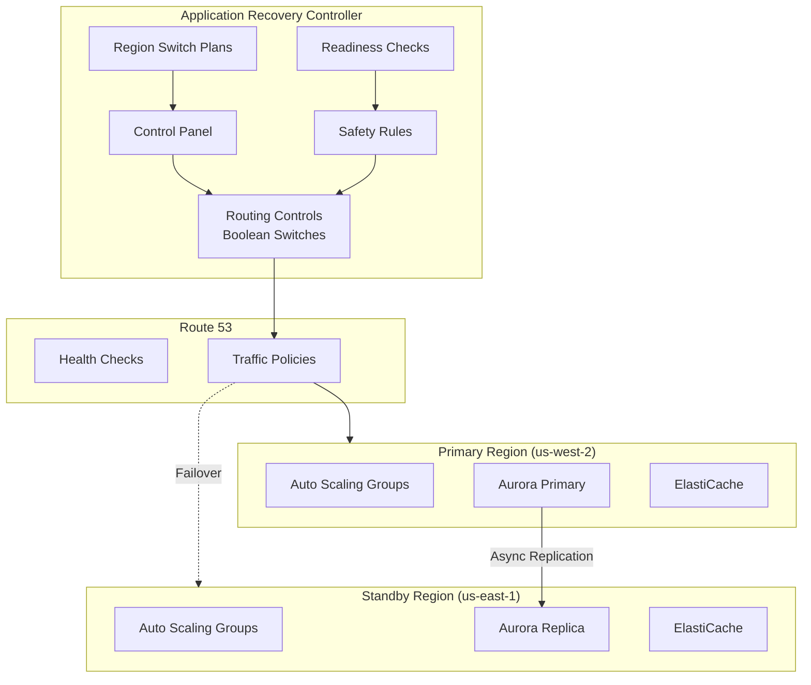
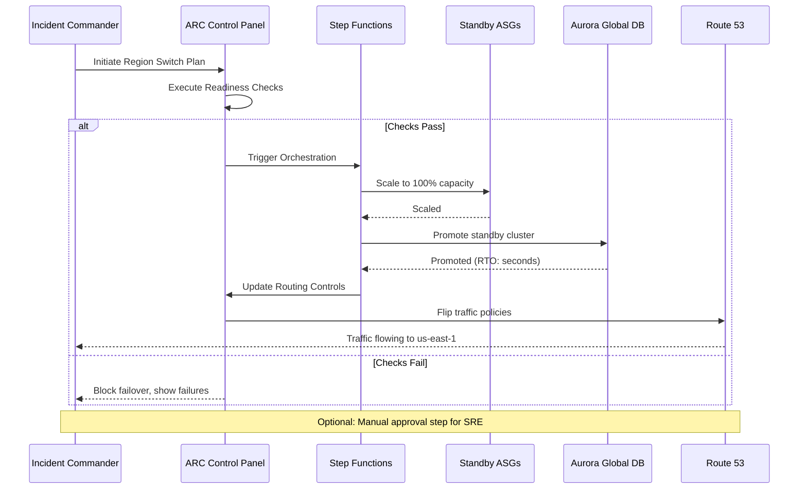
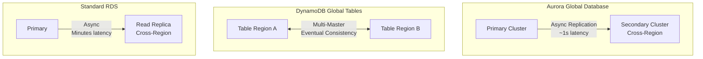
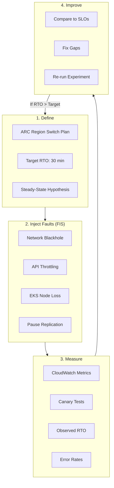
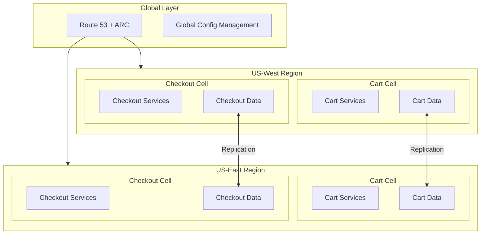
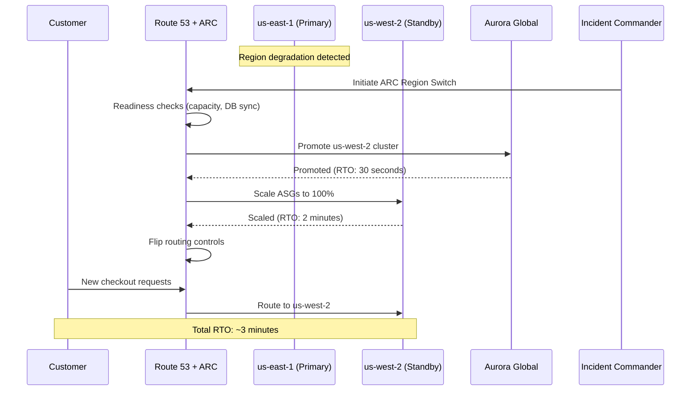
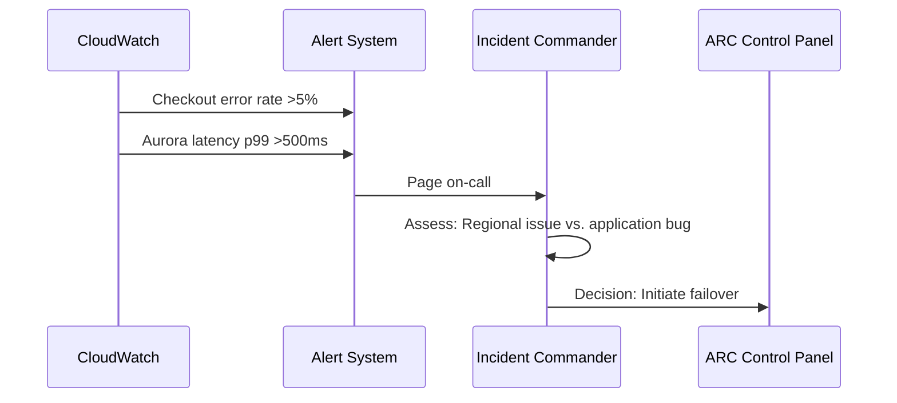
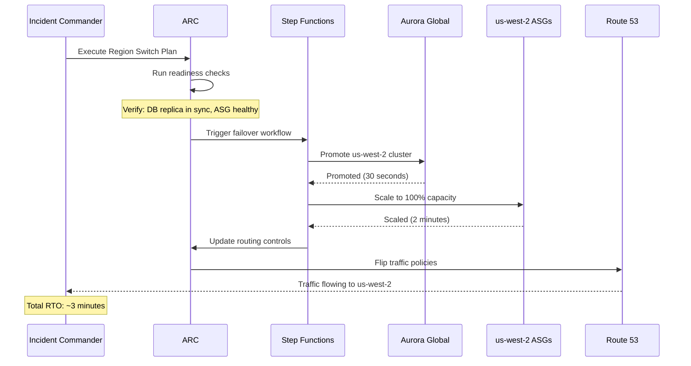

# Resilience & Disaster Recovery at AWS/Amazon Scale

Amazon's multi-region DR story combines **active/active or active/passive architectures** across AWS Regions, with **orchestrated failover** via Application Recovery Controller (ARC) and Route 53. RTO/RPO targets are explicitly engineered and continuously validated using AWS Fault Injection Service (FIS).

> **Why This Matters for TPMs**
>
> At Mag7 scale, disaster recovery isn't a checkbox—it's an architectural discipline. Understanding AWS's DR patterns gives you the vocabulary to discuss RTO/RPO trade-offs, failover orchestration, and chaos engineering coordination.

---

## 1. Core DR Patterns: The Four Tiers

Every DR conversation starts with understanding where your workload sits on the cost/RTO/RPO spectrum:

```mermaid
flowchart LR
    subgraph Tier1["Tier 1: Backup/Restore"]
        B1[Daily Snapshots]
        B2[Cross-Region Copy]
    end

    subgraph Tier2["Tier 2: Pilot Light"]
        P1[Minimal Infra Running]
        P2[Data Replicated]
    end

    subgraph Tier3["Tier 3: Warm Standby"]
        W1[Reduced Capacity]
        W2[Can Scale Up]
    end

    subgraph Tier4["Tier 4: Active/Active"]
        A1[Full Capacity Both]
        A2[Traffic Split]
    end

    Tier1 -->|"Higher Cost<br/>Lower RTO"| Tier2
    Tier2 -->|"Higher Cost<br/>Lower RTO"| Tier3
    Tier3 -->|"Higher Cost<br/>Lower RTO"| Tier4

    style Tier1 fill:#ffebee
    style Tier2 fill:#fff3e0
    style Tier3 fill:#e8f5e9
    style Tier4 fill:#e3f2fd
```

### 1.1 Pattern Comparison

| Pattern | RTO | RPO | Cost | Complexity | Use Case |
|---------|-----|-----|------|------------|----------|
| **Backup/Restore** | Hours | Hours | $ | Low | Batch jobs, reporting |
| **Pilot Light** | Tens of minutes | Minutes | $$ | Medium | Non-critical workloads |
| **Warm Standby** | Minutes | Minutes | $$$ | Medium-High | Important services |
| **Active/Active** | Seconds→Minutes | Seconds | $$$$ | High | Payments, checkout |

### 1.2 Amazon.com Workload Mapping

Different domains require different DR tiers:

| Domain | DR Pattern | RTO Target | RPO Target | AWS Components |
|--------|------------|------------|------------|----------------|
| **Checkout/Payments** | Active/Active | Minutes | Seconds | Aurora Global, DynamoDB Global, ARC |
| **Product Catalog** | Warm Standby | 10-30 min | Minutes | RDS, ElastiCache |
| **Recommendations** | Pilot Light | 30-60 min | Hours | Degraded service acceptable |
| **Reporting/BI** | Backup/Restore | Hours | Hours | S3, Redshift snapshots |

> **TPM Framing**
>
> Always anchor DR decisions to business impact: "For checkout, we pay cost/complexity for active/active + ARC because each minute of downtime costs $X million. For catalog search, we accept longer failover because stale results are cheaper than unavailability."

---

## 2. Failover Orchestration: Application Recovery Controller

**ARC is the DR control plane.** It owns the application-level runbook for multi-Region failover and failback.

### 2.1 ARC Building Blocks

| Component | Purpose | Example |
|-----------|---------|---------|
| **Routing Controls** | Boolean switches that gate Route 53 traffic | `us-west-2-active: true` |
| **Control Panel** | Groups routing controls for an application | Checkout app controls |
| **Region Switch Plans** | Declarative failover playbooks | A→B switch steps |
| **Safety Rules** | Pre-conditions before traffic shift | "DB replica in sync" |
| **Readiness Checks** | Verify standby has healthy capacity | ASG health, DB lag |

### 2.2 Region Failover Workflow

A typical ARC-driven failover from `us-west-2` → `us-east-1`:

### 2.3 Step Functions Orchestration

The failover workflow typically includes:

1. **Scale standby capacity** - ASGs, ECS/EKS to 100%
2. **Promote database** - Aurora Global Database or RDS cluster
3. **Update routing** - Route 53 ARC routing controls
4. **Health verification** - Canaries confirm traffic flowing
5. **Optional approval** - Manual gate for incident commander

> **Key Insight**
>
> ARC is the "one DR brain" - everything else (ASG, Aurora, Route 53) is a data plane target. This separation is critical for reliable orchestration.

---

## 3. RTO/RPO Trade-offs in AWS Terms

RTO and RPO aren't abstract numbers—they're realized through specific AWS service combinations.

### 3.1 Database Replication Options

| Service | RPO | RTO | CAP Choice | Best For |
|---------|-----|-----|------------|----------|
| **Aurora Global DB** | Seconds | Tens of seconds | CP (failover) | Transactional workloads |
| **DynamoDB Global Tables** | Seconds (eventual) | DNS + app recovery | AP | Session state, carts |
| **RDS Cross-Region Replica** | Minutes | Tens of minutes | CP | Cost-sensitive workloads |
| **S3 Cross-Region Replication** | Object replication lag | Client config switch | AP | Object storage, backups |

### 3.2 RTO/RPO Design Matrix

| Design Choice | RTO Impact | RPO Impact | Cost Impact |
|---------------|------------|------------|-------------|
| Active/Active + Global DB | Lowest | Lowest | Highest |
| Active/Passive + ARC + Async Repl | Moderate | Moderate | Moderate |
| Pilot Light + Manual Failover | High | High | Lowest |
| Multi-master (DynamoDB) | Lowest | Eventual | High (write costs) |

> **CAP/PACELC Decision**
>
> For checkout: accept the cost/complexity of active/active with ARC. For catalog search: accept longer failover or partial degradation. Make these trade-offs explicit and documented.

---

## 4. Chaos Engineering: FIS + ARC Integration

AWS Fault Injection Service (FIS) is the **chaos data plane**; ARC proves recovery works. Together they create a continuous validation loop.

### 4.1 FIS Capabilities for Multi-Region DR

| Fault Type | What It Tests | Example |
|------------|---------------|---------|
| **Network Blackhole** | Cross-region connectivity loss | Block VPC peering traffic |
| **API Throttling** | Service degradation | Throttle DynamoDB, S3 |
| **Instance Termination** | Autoscaling recovery | Kill EC2/EKS instances |
| **Replication Pause** | RPO validation | Pause cross-region replication |
| **DNS Failure** | Route 53 failover | Fail health checks |

### 4.2 Chaos + DR Validation Pattern

### 4.3 Game Day Structure

Quarterly multi-Region DR game days should include:

| Phase | Activities | Outputs |
|-------|------------|---------|
| **Pre-Game** | Define FIS experiments, ARC plans, SLOs | Runbook, go/no-go criteria |
| **Execute** | Run chaos experiments in production | Metrics, observations |
| **Measure** | Compare observed RTO/RPO to targets | Gap analysis |
| **Improve** | Fix automation, scaling, replication | Action items |
| **Document** | Write post-mortem, update runbooks | Updated DR procedures |

> **Feedback Loop**
>
> If observed RTO > target: adjust scaling policies, automation, or manual steps. If RPO worse than expected: adjust replication schedules or data plane architecture. Chaos engineering makes DR a continuous improvement process, not a one-time design.

---

## 5. Cell-Based Architecture at Amazon.com

While Amazon doesn't publish full details, their multi-Region approach is consistent with cell-based isolation:

### 5.1 Cell Design Principles

| Principle | Implementation |
|-----------|----------------|
| **Blast radius containment** | One Region failure doesn't kill global |
| **Independent scaling** | Each Region/cell scales independently |
| **Explicit boundaries** | Cell-to-cell communication is deliberate |
| **Failure isolation** | Cells fail independently |

---

## 6. Principal TPM Interview Framing

When discussing Amazon.com's DR posture:

### 6.1 Key Talking Points

1. **Cell-based multi-Region**: Independent cells for cart/checkout/search per Region, blast radius constrained
2. **Clear RTO/RPO budgets per domain**: Payments (minutes/seconds) vs. catalog (hours) vs. recommendations (degraded OK)
3. **Concrete AWS building blocks**: Map budgets to Aurora Global, DynamoDB Global, ARC, Route 53, FIS
4. **Quarterly DR game days**: Defined FIS experiments, ARC plans, pre-agreed SLOs, explicit go/no-go criteria

### 6.2 Example Narrative: Checkout Region Failover

**Scenario:** us-east-1 checkout stack fails over to us-west-2

### 6.3 Whiteboard Components

| Component | Role in Failover |
|-----------|------------------|
| **Route 53** | DNS-level traffic routing |
| **ARC** | Orchestration, safety rules, readiness |
| **Aurora Global** | Database failover with second-scale RPO |
| **FIS** | Pre-validate failover works via chaos |
| **Step Functions** | Workflow orchestration |

---

## 7. Reliability, SLOs, and Operations

### 7.1 SLIs/SLOs

| SLI Category | Metric | SLO Target |
|--------------|--------|------------|
| **Failover RTO SLI** | Time from failover initiation to traffic flowing in DR region | &lt;15 minutes for Active/Active, &lt;30 minutes for Warm Standby |
| **RPO SLI** | Data loss measured by replication lag at failover time | &lt;1 minute for Aurora Global, &lt;5 minutes for standard cross-region |
| **DR Readiness SLI** | Percentage of ARC readiness checks passing | 99.9% of checks passing at any point |
| **Recovery Validation SLI** | Percentage of game day exercises meeting RTO/RPO targets | 100% of quarterly exercises within target |

### 7.2 Error Budgets

**Burned by:** Failed failovers during game days, RTO exceeding target, RPO breaches during actual incidents, ARC readiness check failures.

**Policy:** If quarterly game day fails to meet RTO/RPO, freeze non-essential deployments and prioritize DR hardening. If production incident exceeds targets, mandatory post-mortem with architecture review.

### 7.3 Golden Signals

| Signal | What to Monitor |
|--------|-----------------|
| **Latency** | Cross-region replication lag, ARC routing control flip time, Aurora failover duration |
| **Traffic** | Requests per region, failover traffic shift completion percentage |
| **Errors** | Failed health checks, ARC safety rule violations, replication errors |
| **Saturation** | Standby region capacity headroom, Aurora storage utilization, Route 53 query volume |

### 7.4 Chaos Scenarios to Run

| Scenario | Expected Behavior |
|----------|-------------------|
| Network blackhole between regions (FIS) | Cross-region traffic fails gracefully, ARC readiness checks reflect state, no cascading failures |
| Aurora primary cluster failure | Global database promotes standby within 30 seconds, applications reconnect via global endpoint |
| ARC control plane unavailable | Existing routing stays stable (fail-static), manual DNS override available |
| DynamoDB Global Tables replication pause | Local writes continue, conflict resolution engages on resume, no data loss |
| Route 53 health check false positive | Safety rules prevent premature failover, manual override available |

### 7.5 MTTR Targets

- Target MTTR for DR activation: &lt;5 minutes from decision to traffic flowing
- Target MTTR for failback: &lt;30 minutes after primary region recovery validation
- ARC runbooks and Step Functions automation reduce human decision points

---

## 8. Economics, COGS, and Mag7 vs non-Mag7

### 8.1 COGS Levers

| Category | Optimization Strategy |
|----------|----------------------|
| **Compute** | Standby regions use smaller ASG minimums; scale-up is part of failover. Spot instances for non-critical workloads even in DR. |
| **Storage** | Aurora storage is pay-per-use; standby doesn't double costs. S3 cross-region replication uses intelligent tiering. |
| **Data Transfer** | Cross-region replication is the primary cost driver. Replicate only what's needed for DR, not all data. |
| **DR Infrastructure** | Pilot Light and Warm Standby patterns significantly cheaper than Active/Active. Match pattern to business criticality. |

### 8.2 Time to Value

- ARC provides faster time-to-DR than custom solutions
- Step Functions orchestration is declarative and auditable
- Game day automation reduces manual effort and increases confidence

### 8.3 Mag7 vs non-Mag7

| Aspect | Mag7 (Amazon) | Strong non-Mag7 |
|--------|---------------|-----------------|
| **DR Pattern** | Active/Active for critical paths (checkout, payments); Warm Standby for others | Warm Standby or Pilot Light for most workloads |
| **Tooling** | Deep integration with ARC, custom Step Functions, internal tooling | Standard ARC + managed services |
| **Investment** | High (multiple regions always hot), justified by scale | Match investment to business impact |
| **Testing** | Continuous chaos engineering in production | Quarterly game days, staging chaos |

---

## 9. Trade-off Matrix

| Decision | RTO | Cost | Complexity | Blast Radius |
|----------|-----|------|------------|--------------|
| Active/Active + Global DB | Lowest | Highest | High | Lowest |
| Warm Standby + ARC automation | Moderate | Medium | Medium | Low |
| Pilot Light + manual failover | High | Low | Low | Medium |
| Aurora Global Database | Seconds | Medium | Medium | Low |
| DynamoDB Global Tables | Seconds | High (write costs) | Low | Lowest |
| Cross-region S3 replication | N/A | Medium | Low | Low |
| ARC with safety rules | Slight overhead | Medium | Medium | Lowest |
| FIS chaos validation | N/A | Low | Medium | Controlled |

---

## 10. Example Flow: Checkout Region Failover with ARC

Walk one concrete flow like you'd in an interview.

**Scenario:** us-east-1 checkout stack experiences degradation, requiring failover to us-west-2 with &lt;5 minute RTO and &lt;1 minute RPO.

### 10.1 Detection and Decision

Incident commander assesses whether the issue is regional (requires failover) or application-specific (requires rollback/fix).

### 10.2 Failover Execution

### 10.3 Post-Failover Validation

- Canary tests confirm checkout flow working in us-west-2
- CloudWatch dashboards show error rate normalized
- Aurora confirms replication lag was &lt;1 second at failover (RPO met)

### 10.4 Failure Scenario (Chaos-Engineering Style)

**Inject:** During game day, use FIS to blackhole network between us-east-1 VPCs and Aurora primary.

**Expected Behavior:**
- Aurora health checks fail within 30 seconds
- ARC readiness checks reflect degraded state
- IC can initiate failover with confidence (readiness checks confirm us-west-2 ready)
- Safety rules prevent failover if us-west-2 replica is behind (RPO protection)
- Post-failover, us-east-1 applications fail gracefully (no cascading retries)

---

## 11. How a Senior vs Principal TPM Should Operate Here

### 11.1 Senior TPM Scope

**Owns a slice:** e.g., "Checkout DR implementation and quarterly game day program."

| Responsibility | Deliverables |
|---------------|--------------|
| ARC implementation | Region Switch Plans, safety rules, readiness checks |
| Game day execution | Quarterly exercises with defined success criteria |
| RTO/RPO validation | Documented evidence of meeting targets |
| Runbook maintenance | Up-to-date failover and failback procedures |
| Cross-team coordination | Align with Aurora, networking, and application teams |

### 11.2 Principal TPM Scope

**Owns the multi-year roadmap:** Enterprise DR strategy across all business domains.

| Responsibility | Deliverables |
|---------------|--------------|
| DR tier classification | Business-impact-based tiering (checkout vs. catalog vs. reporting) |
| Investment prioritization | Cost/benefit analysis for Active/Active vs. Warm Standby per domain |
| Architecture standards | DR patterns, ARC adoption, FIS integration requirements |
| Compliance alignment | DR requirements mapped to SOC2, PCI, regulatory obligations |
| P&L accountability | DR infrastructure costs justified by risk reduction |

### 11.3 Interview Readiness

For interviews, you should be ready to:
- **Articulate the four DR tiers** and when to use each
- **Walk through an ARC-driven failover** with concrete timelines
- **Quantify impact** in terms of:
  - RTO/RPO targets and how they map to AWS service choices
  - Cost of Active/Active vs. Warm Standby (2x infra vs. 1.3x)
  - Business cost of downtime ($/minute for checkout)
  - Game day success metrics and lessons learned

---

## Key Takeaways

> **Four Tiers Framework**
>
> Always know where your workload sits: Backup/Restore, Pilot Light, Warm Standby, or Active/Active. Each has explicit cost/RTO/RPO trade-offs.

> **ARC as DR Brain**
>
> Application Recovery Controller is the control plane for DR. Everything else (databases, compute, routing) is a data plane target that ARC orchestrates.

> **Chaos Validates DR**
>
> FIS + ARC create a continuous validation loop. Quarterly game days turn DR from documentation into muscle memory.

> **Explicit Trade-offs**
>
> Frame every DR decision as: "We pay X (cost/complexity) to get Y (RTO/RPO) for domain Z (checkout/catalog/recommendations)." Make trade-offs visible and documented.
