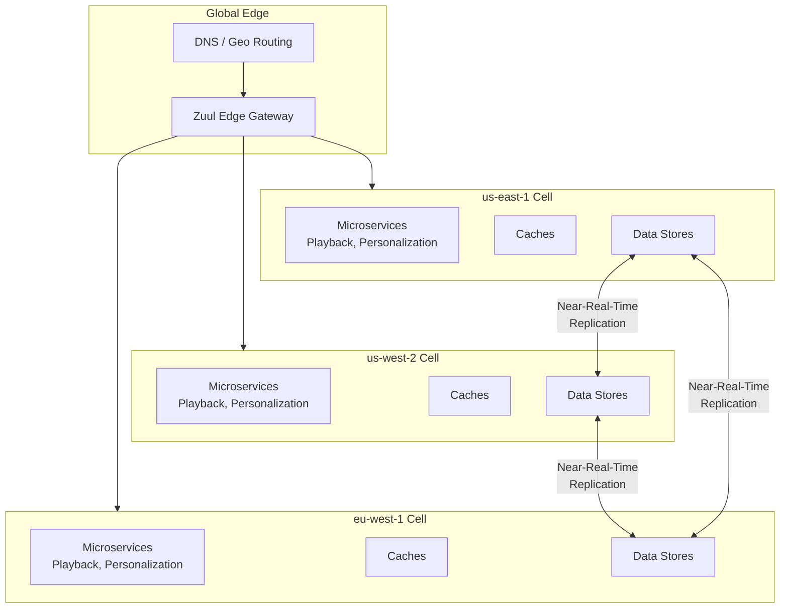
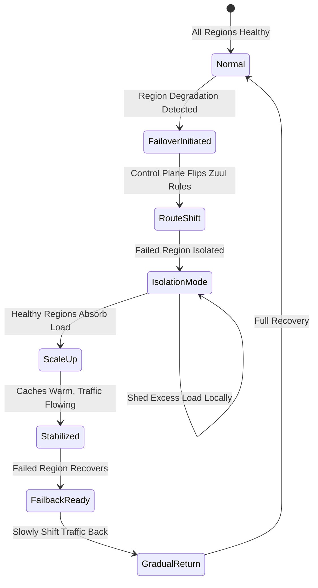
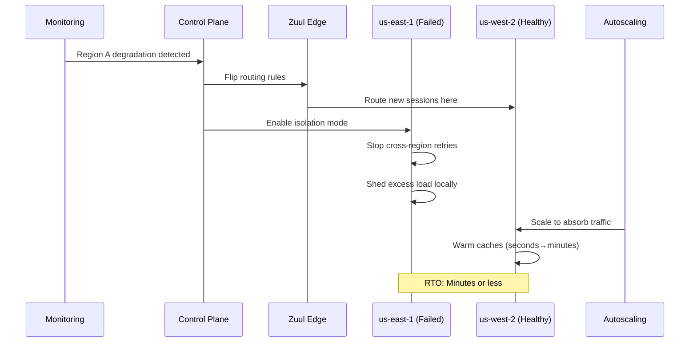
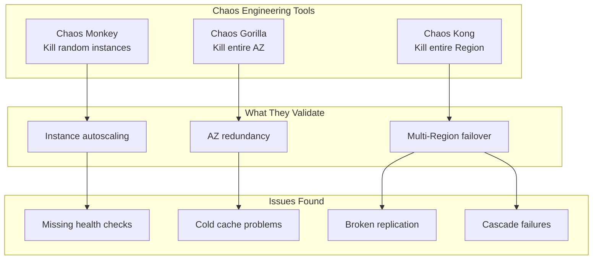
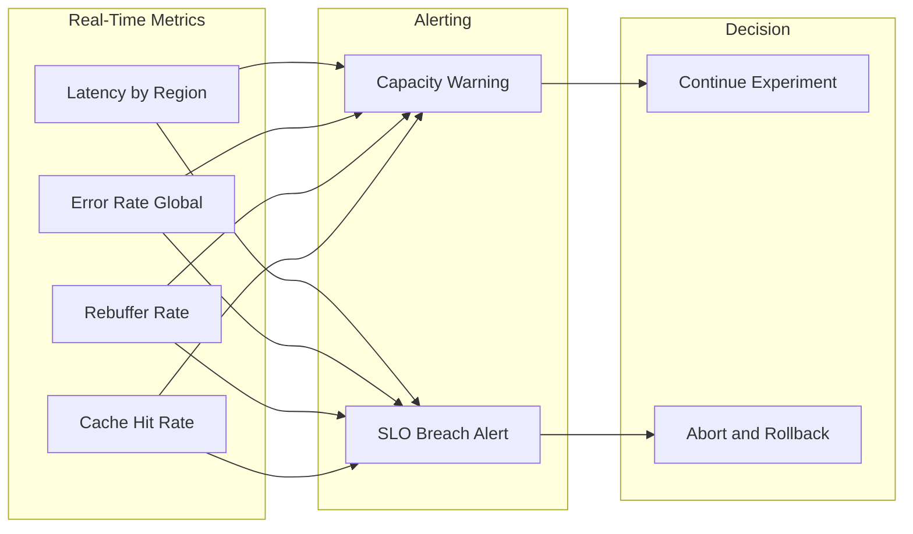
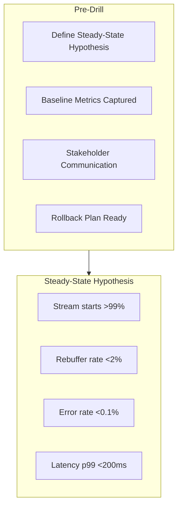
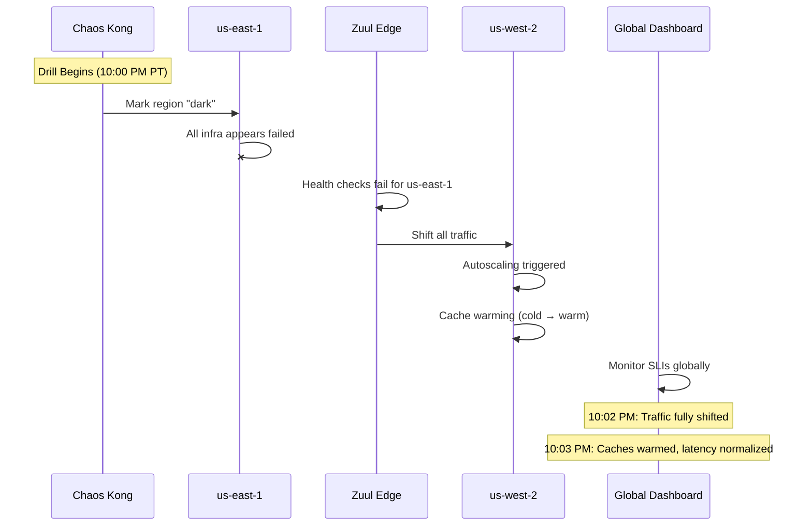
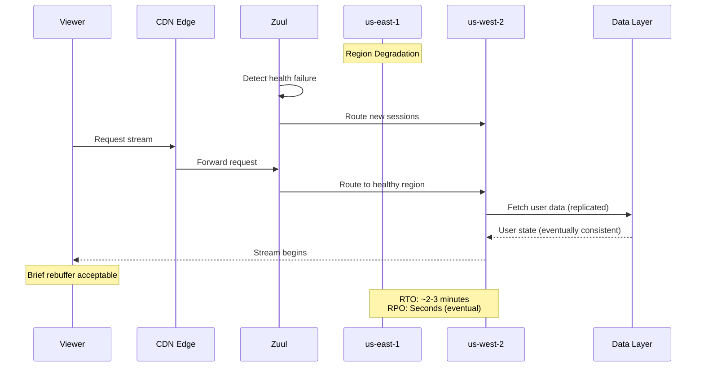

# Resilience & Disaster Recovery at Netflix Scale

Netflix runs **multi-Region active/active** as the default for streaming, treating region-wide failure as routine and validating it continuously via **Chaos Monkey, Chaos Gorilla, and Chaos Kong**. Their architecture demonstrates how to make regional failover boring through continuous practice.

> **Why Netflix Stands Out**
>
> Netflix didn't just build active/active—they pioneered **making regional failure a normal, rehearsed event**. Chaos Kong exercises have exposed cold caches, broken replication, and missing fallbacks, driving concrete engineering work to harden the platform.

---

## 1. Architecture: Active/Active Across Regions

Every user request can be served from multiple AWS Regions. Regions are **peered but isolated cells**, with the edge routing layer deciding where a session lands.

### 1.1 Key Architectural Components

| Component | Purpose | Behavior During Failover |
|-----------|---------|--------------------------|
| **Edge / Zuul** | Route requests, traffic shaping | Shift traffic away from failed region |
| **DNS/Geo Routing** | Initial client routing | Steer new sessions to healthy regions |
| **Regional Control Plane** | Caps, load shedding, failover mode | Prevent cascading cross-region retries |
| **Regional Microservices** | Stateless compute | Autoscale independently |
| **Data Replication** | Cross-region data sync | Eventually consistent, conflict resolution |

### 1.2 Why Active/Active?

Netflix's publicly stated availability SLO is around **99.99%**, which drives the decision:

| Pattern | Downtime/Year | Netflix Choice |
|---------|--------------|----------------|
| Active/Passive | 52 minutes | ❌ Too risky for streaming |
| Active/Active | 5.2 minutes | ✓ Worth the complexity |

> **Cost of Complexity**
>
> Active/active is significantly more expensive and complex than active/passive. Netflix pays this cost because each minute of streaming unavailability impacts millions of concurrent users.

---

## 2. Failover Orchestration: Routing-Based DR

Netflix doesn't rely on a single external DR service. Orchestration is built into their **edge routing + regional control planes**.

### 2.1 Normal State

During normal operations:
- Multiple Regions (e.g., `us-east-1` and `us-west-2`) are **both live**
- Users tend to stick to a "home" Region (latency, cost, content licensing)
- Any Region can serve any user if needed

### 2.2 Failover State

When Chaos Kong or a real incident marks Region A as unhealthy:

### 2.3 Isolation Mode

When a Region is in failover, it enters **isolation mode**:
- Stops routing misdirected traffic to other Regions
- Prevents recursive cascade failures
- May shed excess load locally while caches warm elsewhere

> **Real Incident Example**
>
> Netflix has described an incident where a middle-tier cluster degraded in one Region. They exercised Region failover to route users entirely to the healthy Region, debugged offline, and failed back once stable. This is "boring DR" in action.

---

## 3. RTO/RPO Trade-offs by Domain

Different domains have different tolerance for unavailability and data loss:

### 3.1 Domain-Specific Targets

```mermaid
flowchart LR
    subgraph Streaming["Streaming Path"]
        SP_RTO["RTO: Single-digit minutes"]
        SP_RPO["RPO: Near-zero"]
        SP_ACC["Acceptable: Brief rebuffer"]
    end

    subgraph Metadata["Recommendations/Personalization"]
        MD_RTO["RTO: Same as streaming"]
        MD_RPO["RPO: Looser - stale OK"]
        MD_ACC["Acceptable: Default recs"]
    end

    subgraph Billing["Billing/Entitlements"]
        BL_RTO["RTO: Tight + fallbacks"]
        BL_RPO["RPO: Near-real-time"]
        BL_ACC["Acceptable: Cached entitlements"]
    end

    Streaming --> |"Highest Priority"| Metadata
    Metadata --> |"Medium Priority"| Billing
```

### 3.2 Detailed RTO/RPO Matrix

| Domain | RTO Target | RPO Target | Degraded Mode | CAP Choice |
|--------|------------|------------|---------------|------------|
| **Playback/Streaming** | Minutes | Near-zero | Brief rebuffer | AP |
| **Recommendations** | Minutes | Hours OK | Stale/default recs | AP |
| **A/B Assignments** | Minutes | Eventually consistent | Stable assignment | AP |
| **Billing/Entitlements** | Minutes + fallback | Near-real-time | Cached entitlements, grace periods | AP with reconciliation |

### 3.3 PACELC Decision

Netflix makes a clear architectural choice:

> **Consistency Trade-off**
>
> They choose **availability and low latency over cross-Region strong consistency** for most user-facing paths. Strong consistency is confined to narrow financial/entitlement surfaces, with conflict resolution and reconciliation for stateful domains.

### 3.4 One-Way vs. Two-Way Doors

| Decision Type | Examples | Reversibility |
|---------------|----------|---------------|
| **One-Way Doors** | Cross-region data stores, replication strategies | Require significant rework |
| **Two-Way Doors** | Routing policies, failover aggressiveness | Can iterate with chaos experiments |

---

## 4. Chaos Engineering: The Simian Army

Netflix's standout contribution is making regional failure a normal, rehearsed event through their chaos engineering tools.

### 4.1 The Chaos Hierarchy

| Tool | Blast Radius | What It Tests | Frequency |
|------|-------------|---------------|-----------|
| **Chaos Monkey** | Single instance | Microservice resilience, autoscaling | Continuous |
| **Chaos Gorilla** | Entire AZ | AZ redundancy, capacity distribution | Regular |
| **Chaos Kong** | Entire Region | Multi-Region failover, DR readiness | Periodic (production!) |

### 4.2 Chaos Kong Deep Dive

Chaos Kong simulates **full AWS Region failure** from the application's perspective:

### 4.3 Steady-State Hypotheses

Before running chaos experiments, Netflix defines measurable hypotheses:

| Hypothesis | Metric | Target |
|------------|--------|--------|
| "Streaming continues during Region loss" | Stream starts success rate | 99.x% |
| "Rebuffering stays acceptable" | Rebuffer rate | &lt;2% increase |
| "Error rates stay bounded" | 5xx error rate | &lt;0.1% |
| "Surviving Regions handle load" | CPU/memory utilization | &lt;80% |

### 4.4 What Chaos Kong Has Found

Early Chaos Kong runs exposed critical issues:

| Issue Found | Impact | Fix |
|-------------|--------|-----|
| **Cold caches** | Latency spike on failover | Pre-warm caches, gradual shift |
| **Broken replication** | Data loss/inconsistency | Fix replication, add monitoring |
| **Missing fallbacks** | Complete failure instead of degradation | Add graceful degradation |
| **Cascade retries** | Cross-region retry storm | Isolation mode, circuit breakers |

> **Chaos as Continuous Validation**
>
> Chaos is the continuous validation layer for DR design. Regular game days are a non-negotiable part of the roadmap, not a one-off exercise.

---

## 5. SLI/SLO Instrumentation

Netflix instruments global dashboards to measure failover impact:

### 5.1 Key SLIs During Failover

| SLI Category | Metrics | Threshold |
|--------------|---------|-----------|
| **Latency** | p50, p95, p99 per Region and globally | &lt;200ms p99 |
| **Error Rate** | 5xx rate, stream start failures | &lt;0.1% |
| **Availability** | Successful stream starts / attempts | 99.99% |
| **Rebuffer** | Rebuffer rate per Region | &lt;1% |
| **Saturation** | CPU, memory, cache hit rates | &lt;80% |

### 5.2 Observability During Chaos

### 5.3 Error Budgets

**Monthly error budget:** 0.01% (aligned with 99.99% availability target)

| Budget Burn Rate | Triggered Action |
|-----------------|------------------|
| Normal | Continue operations, scheduled chaos tests |
| Elevated (regional lag) | Investigate, prepare for potential failover |
| High (SLO breach) | Initiate failover, pause non-critical experiments |
| Critical (multi-region impact) | All-hands incident response |
| Exceeded | Freeze deployments, mandatory reliability focus |

### 5.4 Chaos Scenarios to Run

| Scenario | Expected Behavior |
|----------|-------------------|
| Chaos Kong: Full region "dark" | Traffic shifts to healthy regions within minutes, caches warm, SLOs maintained |
| Chaos Gorilla: Kill entire AZ | AZ redundancy absorbs load, no user impact, autoscaling responds |
| Chaos Monkey: Random instance termination | Microservice autoscaling replaces, no user-visible impact |
| Cross-region replication lag injection | Local region continues serving, stale data flagged but acceptable |
| Edge/Zuul routing failure | Backup routing engages, traffic redistributes |

### 5.5 MTTR Targets

- Target MTTR for regional failover: &lt;3 minutes from detection to traffic flowing
- Target MTTR for AZ failure recovery: &lt;1 minute (autoscaling)
- Target MTTR for service-level issues: &lt;5 minutes with circuit breakers
- Chaos Kong drills have reduced actual incident MTTR by 50% through muscle memory

---

## 6. Economics, COGS, and Mag7 vs non-Mag7

### 6.1 COGS Levers

| Category | Optimization Strategy |
|----------|----------------------|
| **Compute** | All regions run at capacity (Active/Active cost), but consistent utilization enables better reserved instance planning |
| **Storage** | Replicated data across regions is a fixed cost; optimize by replicating only necessary state |
| **Data Transfer** | Cross-region replication is significant; architect to minimize data movement while maintaining DR capability |
| **Caching** | Warm caches in all regions reduce origin load and improve failover performance |

### 6.2 Time to Value

- Chaos Monkey/Gorilla/Kong are open-source, reducing time to implement chaos engineering
- Zuul-based routing provides fast, software-defined failover without DNS propagation delays
- Years of investment in Active/Active means failover is now "boring" (low operational overhead)

### 6.3 Mag7 vs non-Mag7

| Aspect | Mag7 (Netflix) | Strong non-Mag7 |
|--------|----------------|-----------------|
| **DR Pattern** | Active/Active everywhere (99.99% requirement) | Active/Passive or Warm Standby for most |
| **Chaos Engineering** | Continuous in production (Simian Army) | Quarterly game days in staging/production |
| **Investment** | ~2x infrastructure cost, dedicated platform teams | Match to business criticality |
| **Tooling** | Custom (Zuul, internal chaos tools) | AWS ARC, standard chaos tools |

---

## 7. Trade-off Matrix

| Decision | Availability | Cost | Complexity | User Experience |
|----------|-------------|------|------------|-----------------|
| Active/Active (all regions) | 99.99% | 2x baseline | High | Minimal failover impact |
| Active/Passive | 99.9% | 1.3x baseline | Medium | Noticeable failover |
| Eventual consistency (AP) | High | Lower | Medium | Stale data acceptable |
| Chaos Kong in production | Higher long-term | Medium | High | Occasional planned impact |
| Regional cell isolation | High | Medium | High | Blast radius contained |
| Cache warming strategies | Higher during failover | Medium | Medium | Faster failover recovery |

---

## 8. Example Flow: Regional Failover During Chaos Kong Drill

Walk one concrete flow like you'd in an interview.

**Scenario:** Chaos Kong drill marks us-east-1 as "dark" during prime-time viewing. Validate that streaming continues with &lt;3 minute RTO and acceptable rebuffer rates.

### 8.1 Pre-Drill Setup

### 8.2 Chaos Kong Execution

### 8.3 Metrics During Drill

| Metric | Before | During (Peak) | After (Stabilized) |
|--------|--------|---------------|-------------------|
| Stream starts | 99.5% | 98.5% | 99.4% |
| Rebuffer rate | 0.8% | 1.5% | 0.9% |
| Error rate | 0.02% | 0.08% | 0.03% |
| Latency p99 | 150ms | 280ms | 160ms |

### 8.4 Failure Scenario (What Chaos Found)

**Issue Found:** Cold caches in us-west-2 caused latency spike during initial traffic shift.

**Expected Behavior After Fix:**
- Pre-warm caches before drill
- Gradual traffic shift (canary → 25% → 50% → 100%)
- Latency spike reduced from 280ms to 180ms peak

### 8.5 Post-Drill Actions

- Document RTO achieved: 2.5 minutes (target: &lt;3 minutes)
- Identify improvement: Cache pre-warming automation
- Update runbooks with lessons learned
- Schedule follow-up drill to validate fix

---

## 9. How a Senior vs Principal TPM Should Operate Here

### 9.1 Senior TPM Scope

**Owns a slice:** e.g., "Chaos Kong drill program for streaming services."

| Responsibility | Deliverables |
|---------------|--------------|
| Chaos drill execution | Quarterly Chaos Kong drills with defined success criteria |
| SLO validation | Documented evidence of meeting availability targets |
| Fix tracking | Issues found → engineering work items → validation |
| Runbook maintenance | Up-to-date failover and failback procedures |
| Stakeholder communication | Pre-drill comms, post-drill reports |

### 9.2 Principal TPM Scope

**Owns the multi-year roadmap:** Enterprise resilience strategy and chaos engineering platform.

| Responsibility | Deliverables |
|---------------|--------------|
| 99.99% availability strategy | Architecture decisions enabling Active/Active |
| Chaos engineering platform | Simian Army evolution and adoption across org |
| Cell isolation architecture | Regional boundaries and replication strategies |
| Cost/availability trade-offs | Justification for Active/Active investment |
| Cultural transformation | Making "failure is normal" part of engineering culture |

### 9.3 Interview Readiness

For interviews, you should be ready to:
- **Articulate why Active/Active** is worth 2x the cost for streaming
- **Walk through a Chaos Kong drill** with concrete metrics and learnings
- **Quantify impact** in terms of:
  - Availability improvement (99.9% → 99.99% = 47 fewer minutes/year downtime)
  - Cost of Active/Active (~2x infrastructure)
  - Issues found by chaos (cold caches, broken replication) and their fixes
  - MTTR improvement from chaos practice (50% reduction)

---

## 10. Interview Framing

When discussing Netflix's DR architecture:

### 6.1 Opening Statement

> "Netflix runs multi-Region active/active on AWS, with each Region as a semi-independent cell fronted by Zuul and global routing. Regional failover is just a routing decision, not a hero event."

### 6.2 Key Points to Emphasize

| Topic | What to Say |
|-------|-------------|
| **Architecture** | Active/active, Zuul edge, regional cells, near-real-time replication |
| **RTO/RPO** | Streaming: near-zero; Billing: seconds-minutes with reconciliation |
| **Consistency** | Availability over cross-Region consistency for user-facing paths |
| **Chaos** | Chaos Kong turns DR from theory into muscle memory |
| **Learnings** | Early drills broke things (cold caches, replication) → drove hardening |

### 6.3 Whiteboard: Region Failover Flow

### 6.4 Common Interview Questions

| Question | Answer Anchor |
|----------|--------------|
| "How do you achieve 99.99%?" | Active/active + continuous chaos validation |
| "What's the cost of active/active?" | ~2x infrastructure, data replication complexity |
| "How do you handle data consistency?" | Eventual consistency + reconciliation, not distributed transactions |
| "What did you learn from chaos?" | Cold caches, broken replication → specific engineering fixes |

---

## Key Takeaways

> **Active/Active by Default**
>
> For streaming at Netflix scale, active/passive isn't good enough. The complexity and cost of active/active is justified by the 99.99% availability requirement.

> **Failover = Routing Decision**
>
> Regional failover is just a routing change, not a hero event. This simplicity comes from years of engineering to make it boring.

> **Chaos Makes DR Real**
>
> Chaos Monkey → Chaos Gorilla → Chaos Kong. Each level validates a different blast radius. Running these in production turns DR documentation into muscle memory.

> **AP Over CP**
>
> Netflix explicitly chooses availability and latency over cross-Region strong consistency for user-facing paths. Reconciliation handles the edge cases.

> **Continuous Improvement**
>
> Early Chaos Kong drills exposed cold caches, broken replication, and missing fallbacks. This feedback loop is what makes Netflix's DR world-class.
