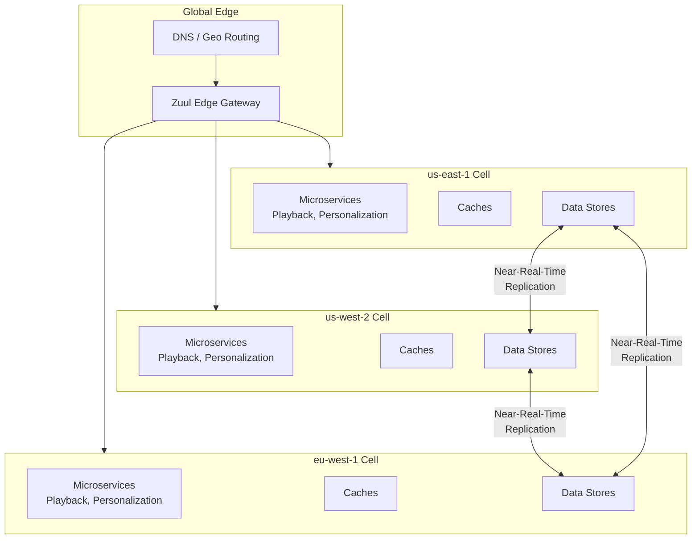
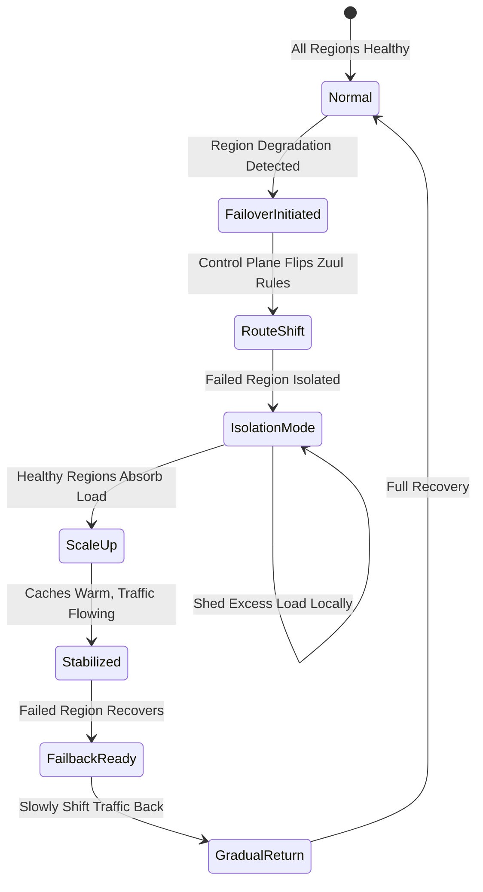
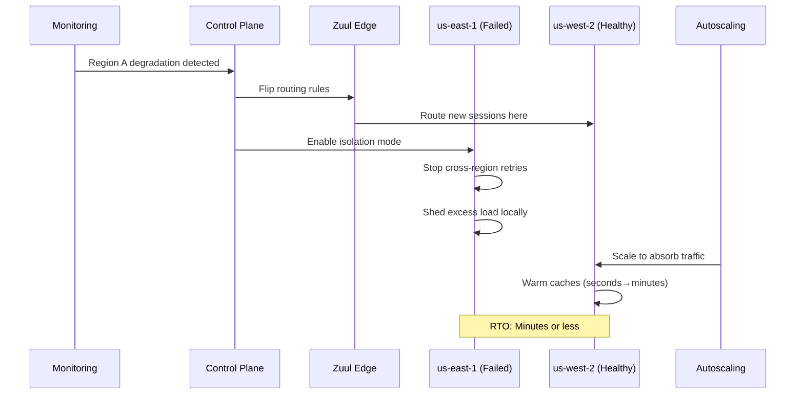
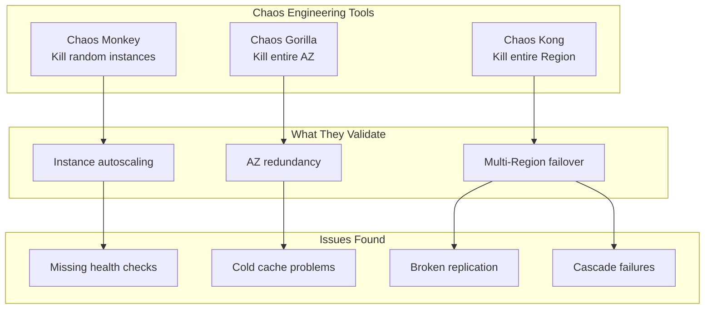
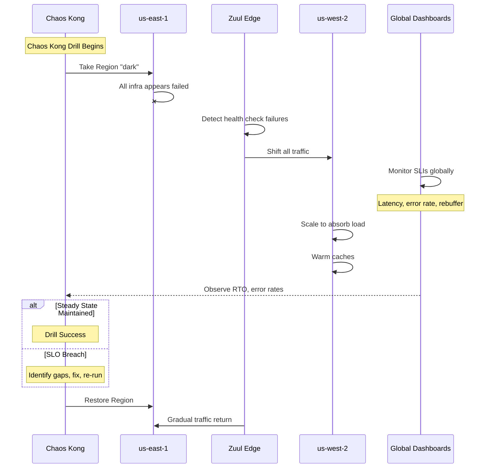
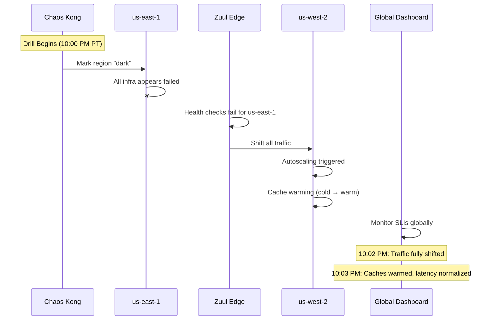

# Resilience & Disaster Recovery at Netflix Scale

## Why This Matters

Netflix serves 200+ million subscribers with a publicly stated availability target of 99.99%. At this scale, disaster recovery isn't a backup plan—it's an architectural philosophy. Understanding Netflix's approach matters for TPMs because:

1. **Active/active is the default, not the exception.** Netflix treats regional failure as routine, not exceptional.
2. **Chaos engineering validates DR continuously.** The Simian Army (Chaos Monkey, Chaos Gorilla, Chaos Kong) turns DR from documentation into muscle memory.
3. **Failover is a routing decision, not a hero event.** Years of engineering make regional failover boring—by design.

This document covers Netflix's multi-region active/active architecture, their chaos engineering methodology, and how they've made regional failure a rehearsed, routine event.

---

## 1. Why Active/Active? The Business Case

**The problem:** Netflix's publicly stated availability SLO is around 99.99%. With 200+ million subscribers streaming simultaneously, even brief outages are highly visible and costly.

**The solution:** Active/active multi-region architecture, where every user request can be served from multiple AWS regions. The complexity and cost are justified by the math:

| Pattern | Downtime/Year | Netflix Choice |
|---------|--------------|----------------|
| Active/Passive | 52 minutes | Too risky for streaming |
| Active/Active | 5.2 minutes | Worth the complexity |

**Why not active/passive?** With active/passive, failover requires scaling up standby, warming caches, and shifting traffic—all under pressure during an incident. With active/active, you're just changing which healthy region serves traffic. The failover is already running.

> **Cost of Complexity:** Active/active is approximately 2x the infrastructure cost of single-region. Netflix pays this because each minute of unavailability impacts millions of concurrent users and generates immediate social media visibility.

---

## 2. Architecture: Regions as Peered but Isolated Cells

**The problem:** If regions share dependencies, a failure in one can cascade to others. You need isolation, but you also need some data to be consistent across regions.

**The solution:** Each region is a semi-independent cell with complete compute, caching, and data infrastructure. Data replication is near-real-time but explicitly eventually consistent for most paths.

### 2.1 Key Architectural Components

| Component | Purpose | Behavior During Failover |
|-----------|---------|--------------------------|
| **Edge / Zuul** | Route requests, traffic shaping | Shift traffic away from failed region |
| **DNS/Geo Routing** | Initial client routing | Steer new sessions to healthy regions |
| **Regional Control Plane** | Caps, load shedding, failover mode | Prevent cascading cross-region retries |
| **Regional Microservices** | Stateless compute | Autoscale independently per region |
| **Data Replication** | Cross-region data sync | Eventually consistent with conflict resolution |

### 2.2 Normal vs. Failover State

**Normal state:**
- Multiple regions (e.g., `us-east-1` and `us-west-2`) are both live and serving traffic
- Users tend to stick to a "home" region based on latency and content licensing
- Any region can serve any user if needed

**Failover state:**
- Zuul detects health check failures or degradation in one region
- Traffic shifts to healthy regions via routing control changes
- Failed region enters isolation mode (stops cross-region retries, sheds load locally)
- Healthy regions autoscale to absorb additional traffic

---

## 3. Failover Orchestration: Routing-Based DR

**The problem:** You can't rely on a single external DR service for something this critical. If the DR orchestration system fails, you have no failover.

**The solution:** Orchestration is built into Netflix's own edge routing (Zuul) and regional control planes. Failover is a routing decision, not a database switch.

### 3.1 Isolation Mode

When a region is in failover, it enters **isolation mode**:
- Stops routing misdirected traffic to other regions (prevents recursive cascade)
- May shed excess load locally while caches warm elsewhere
- Prevents the failed region from making the problem worse

### 3.2 Failover Sequence

> **Key Insight:** Failover is just a routing change. The target region is already running, already has data, and already has warm-ish caches. This is fundamentally different from active/passive where the standby might be cold.

---

## 4. RTO/RPO Trade-offs by Domain

**The problem:** Not every service needs the same DR investment. Recommendations can degrade; billing cannot. How do you decide where to invest?

**The solution:** Explicit domain-specific targets based on business impact.

### 4.1 Domain-Specific Targets

| Domain | RTO Target | RPO Target | Degraded Mode | CAP Choice |
|--------|------------|------------|---------------|------------|
| **Playback/Streaming** | Minutes | Near-zero | Brief rebuffer acceptable | AP |
| **Recommendations** | Minutes | Hours OK | Stale/default recs acceptable | AP |
| **A/B Assignments** | Minutes | Eventually consistent | Stable assignment preferred | AP |
| **Billing/Entitlements** | Minutes + fallback | Near-real-time | Cached entitlements, grace periods | AP with reconciliation |

### 4.2 Consistency Trade-offs

Netflix makes a clear architectural choice. In distributed systems, **PACELC** extends CAP: even when there's no partition (normal operation), you must choose between latency and consistency. **AP** (Availability-Partition tolerance) means staying available during failures; **EL** (Else-Latency) means choosing speed over strong consistency during normal operation.

> **PACELC Decision:** They choose availability and low latency over cross-region strong consistency for most user-facing paths. Strong consistency is confined to narrow financial/entitlement surfaces, with conflict resolution and reconciliation for stateful domains.

### 4.3 One-Way vs. Two-Way Doors

| Decision Type | Examples | Reversibility |
|---------------|----------|---------------|
| **One-Way Doors** | Cross-region data stores, replication strategies | Require significant rework |
| **Two-Way Doors** | Routing policies, failover aggressiveness | Can iterate with chaos experiments |

---

## 5. Chaos Engineering: The Simian Army

**The problem:** DR documentation says failover works. Does it actually? The only way to know is to test—in production.

**The solution:** The Simian Army—a suite of chaos tools that systematically test failure scenarios at different blast radii.

### 5.1 The Chaos Hierarchy

| Tool | Blast Radius | What It Tests | Frequency |
|------|-------------|---------------|-----------|
| **Chaos Monkey** | Single instance | Microservice resilience, autoscaling | Continuous |
| **Chaos Gorilla** | Entire AZ | AZ redundancy, capacity distribution | Regular |
| **Chaos Kong** | Entire Region | Multi-Region failover, DR readiness | Periodic (in production!) |

### 5.2 Chaos Kong Deep Dive

Chaos Kong simulates full AWS Region failure from the application's perspective:

### 5.3 Steady-State Hypotheses

Before running chaos experiments, Netflix defines measurable hypotheses:

| Hypothesis | Metric | Target |
|------------|--------|--------|
| "Streaming continues during Region loss" | Stream starts success rate | 99.x% |
| "Rebuffering stays acceptable" | Rebuffer rate | &lt;2% increase |
| "Error rates stay bounded" | 5xx error rate | &lt;0.1% |
| "Surviving regions handle load" | CPU/memory utilization | &lt;80% |

### 5.4 What Chaos Kong Has Found

Early Chaos Kong runs exposed critical issues that looked fine on paper:

| Issue Found | Impact | Fix |
|-------------|--------|-----|
| **Cold caches** | Latency spike on failover | Pre-warm caches, gradual shift |
| **Broken replication** | Data loss/inconsistency | Fix replication, add monitoring |
| **Missing fallbacks** | Complete failure instead of degradation | Add graceful degradation paths |
| **Cascade retries** | Cross-region retry storm | Isolation mode, circuit breakers |

> **Chaos as Continuous Validation:** Chaos is how Netflix validates DR design. Regular game days are non-negotiable—not a one-off exercise.

---

## 6. SLI/SLO Instrumentation

### 6.1 Key SLIs During Failover

| SLI Category | Metrics | Threshold |
|--------------|---------|-----------|
| **Latency** | p50, p95, p99 per Region | &lt;200ms p99 |
| **Error Rate** | 5xx rate, stream start failures | &lt;0.1% |
| **Availability** | Successful stream starts / attempts | 99.99% |
| **Rebuffer** | Rebuffer rate per Region | &lt;1% |
| **Saturation** | CPU, memory, cache hit rates | &lt;80% |

### 6.2 Error Budgets

**Monthly error budget:** 0.01% (aligned with 99.99% availability)

| Burn Rate | Action |
|-----------|--------|
| Normal | Continue operations, scheduled chaos tests |
| Elevated | Investigate, prepare for potential failover |
| High (SLO breach) | Initiate failover, pause non-critical experiments |
| Critical | All-hands incident response |
| Exceeded | Freeze deployments, mandatory reliability focus |

### 6.3 Chaos Scenarios

| Scenario | Expected Behavior |
|----------|-------------------|
| Chaos Kong: Full region "dark" | Traffic shifts within minutes, caches warm, SLOs maintained |
| Chaos Gorilla: Kill entire AZ | AZ redundancy absorbs, no user impact |
| Chaos Monkey: Random instance termination | Autoscaling replaces, no visible impact |
| Cross-region replication lag | Local continues, stale flagged but acceptable |
| Edge/Zuul routing failure | Backup routing engages, traffic redistributes |

### 6.4 MTTR Targets

- Regional failover: &lt;3 minutes from detection to traffic flowing
- AZ failure recovery: &lt;1 minute (autoscaling)
- Service-level issues: &lt;5 minutes with circuit breakers
- Chaos Kong drills have reduced actual incident MTTR by 50%

---

## 7. Economics and Mag7 Context

### 7.1 COGS Levers

| Category | Optimization Strategy |
|----------|----------------------|
| **Compute** | All regions run at capacity (Active/Active cost), but enables better reserved instance planning |
| **Storage** | Replicated across regions (fixed cost); optimize by replicating only necessary state |
| **Data Transfer** | Cross-region replication is significant; architect to minimize movement |
| **Caching** | Warm caches in all regions reduce origin load and improve failover |

### 7.2 Mag7 vs Non-Mag7

| Aspect | Mag7 (Netflix) | Strong Non-Mag7 |
|--------|----------------|-----------------|
| **DR Pattern** | Active/Active everywhere (99.99% requirement) | Active/Passive or Warm Standby |
| **Chaos Engineering** | Continuous in production (Simian Army) | Quarterly game days in staging/production |
| **Investment** | ~2x infrastructure, dedicated platform teams | Match to business criticality |
| **Tooling** | Custom (Zuul, internal chaos tools) | AWS ARC, standard chaos tools |

---

## 8. Trade-Off Matrix

| Decision | Availability | Cost | Complexity | User Experience |
|----------|-------------|------|------------|-----------------|
| Active/Active (all regions) | 99.99% | 2x baseline | High | Minimal failover impact |
| Active/Passive | 99.9% | 1.3x baseline | Medium | Noticeable failover |
| Eventual consistency (AP) | High | Lower | Medium | Stale data acceptable |
| Chaos Kong in production | Higher long-term | Medium | High | Occasional planned impact |
| Regional cell isolation | High | Medium | High | Blast radius contained |
| Cache warming strategies | Higher during failover | Medium | Medium | Faster recovery |

---

## 9. Example Flow: Chaos Kong Drill

**Scenario:** Chaos Kong drill marks us-east-1 as "dark" during prime-time viewing. Validate that streaming continues with &lt;3 minute RTO.

### 9.1 Pre-Drill Setup

- Define steady-state hypothesis (stream starts >99%, rebuffer &lt;2%)
- Capture baseline metrics
- Communicate to stakeholders
- Prepare rollback plan

### 9.2 Drill Execution

### 9.3 Metrics During Drill

| Metric | Before | During (Peak) | After (Stabilized) |
|--------|--------|---------------|-------------------|
| Stream starts | 99.5% | 98.5% | 99.4% |
| Rebuffer rate | 0.8% | 1.5% | 0.9% |
| Error rate | 0.02% | 0.08% | 0.03% |
| Latency p99 | 150ms | 280ms | 160ms |

### 9.4 Issue Found and Fix

**Issue:** Cold caches in us-west-2 caused latency spike during initial traffic shift.

**Fix:**
- Pre-warm caches before drill
- Gradual traffic shift (canary → 25% → 50% → 100%)
- Result: Latency spike reduced from 280ms to 180ms peak

### 9.5 Post-Drill Actions

- Document RTO achieved: 2.5 minutes (target: &lt;3 minutes)
- Identify improvement: Cache pre-warming automation
- Update runbooks
- Schedule follow-up drill to validate fix

---

## 10. Role-Specific Focus

### 10.1 Senior TPM Scope

**Owns a slice:** "Chaos Kong drill program for streaming services."

| Responsibility | Deliverables |
|---------------|--------------|
| Chaos drill execution | Quarterly drills with success criteria |
| SLO validation | Documented evidence of meeting targets |
| Fix tracking | Issues found → engineering work items → validation |
| Runbook maintenance | Up-to-date failover/failback procedures |
| Stakeholder communication | Pre-drill comms, post-drill reports |

### 10.2 Principal TPM Scope

**Owns the multi-year roadmap:** Enterprise resilience strategy and chaos platform.

| Responsibility | Deliverables |
|---------------|--------------|
| 99.99% availability strategy | Architecture decisions enabling Active/Active |
| Chaos engineering platform | Simian Army evolution and adoption |
| Cell isolation architecture | Regional boundaries, replication strategies |
| Cost/availability trade-offs | Justification for Active/Active investment |
| Cultural transformation | Making "failure is normal" part of culture |

### 10.3 Interview Readiness

Be ready to:
- **Articulate why Active/Active** is worth 2x cost for streaming
- **Walk through a Chaos Kong drill** with concrete metrics
- **Quantify impact:**
  - Availability improvement (99.9% → 99.99% = 47 fewer minutes/year)
  - Cost of Active/Active (~2x infrastructure)
  - Issues found by chaos and their fixes
  - MTTR improvement from chaos practice (50% reduction)

---

## Key Takeaways

> **Active/Active by Default:** For streaming at Netflix scale, active/passive isn't good enough. The complexity and cost are justified by the 99.99% availability requirement.

> **Failover = Routing Decision:** Regional failover is just a routing change, not a hero event. This simplicity comes from years of engineering to make it boring.

> **Chaos Makes DR Real:** Chaos Monkey → Chaos Gorilla → Chaos Kong. Each validates a different blast radius. Running in production turns documentation into muscle memory.

> **AP Over CP:** Netflix explicitly chooses availability and latency over cross-region strong consistency for user-facing paths. Reconciliation handles edge cases.

> **Continuous Improvement:** Early Chaos Kong drills exposed cold caches, broken replication, and missing fallbacks. This feedback loop is what makes Netflix's DR world-class.
