# Retry Strategies

This guide covers 5 key areas: I. The Philosophy of Retries in Distributed Systems, II. Core Retry Algorithms and Backoff Strategies, III. System Stability: Thundering Herds and Retry Storms, IV. The Criticality of Idempotency, V. Strategic Tradeoffs & Business Impact Summary.

## I. The Philosophy of Retries in Distributed Systems

At the Principal level, the decision is rarely *whether* to retry, but *how* to retry mathematically to balance latency against system stability. A poor retry algorithm (e.g., immediate retries in a tight loop) creates a "Thundering Herd," transforming a minor degradation into a cascading total outage.

### 1. Exponential Backoff: The Industry Standard
While simple linear backoff (waiting 1s, then 2s, then 3s) is intuitive, it is insufficient for hyperscale systems. Mag7 infrastructure relies on **Exponential Backoff**.

*   **The Mechanism:** The wait time between retries increases exponentially (e.g., $100ms, 200ms, 400ms, 800ms$).
*   **Mag7 Real-World Example:** The AWS SDKs (for DynamoDB, S3, etc.) implement this by default. If a DynamoDB partition splits (causing a momentary throttle), the SDK backs off exponentially to allow the partition to stabilize.
*   **Tradeoffs:**
    *   *Pros:* Prevents the caller from hammering a struggling server; drastically increases the probability of recovery.
    *   *Cons:* Significantly increases P99 and P99.9 latency. A user request might hang for seconds before failing or succeeding.
*   **Business Impact:** This is a stability play. By accepting higher latency for a small percentage of users (the "tail"), you prevent a system-wide crash that would affect 100% of users (ROI protection).

### 2. Jitter: Breaking Synchronization
Exponential backoff alone has a flaw: if 10,000 mobile clients fail simultaneously due to a network blip, they will all retry at exactly 100ms, then all at 200ms. This synchronization keeps the server overwhelmed.

```mermaid
flowchart TB
    subgraph NoJitter["Without Jitter ❌"]
        direction TB
        T0N["T=0: 10,000 fail"]
        T1N["T=100ms: ALL retry"]
        T2N["T=300ms: ALL retry"]
        T3N["💥 Server overwhelmed"]
        T0N --> T1N --> T2N --> T3N
    end

    subgraph WithJitter["With Full Jitter ✅"]
        direction TB
        T0J["T=0: 10,000 fail"]
        T1J["T=0-200ms: Spread retries"]
        T2J["T=200-600ms: Spread retries"]
        T3J["📈 Smooth recovery"]
        T0J --> T1J --> T2J --> T3J
    end

    style NoJitter fill:#ffcdd2
    style WithJitter fill:#e8f5e9
```

*   **The Mechanism:** Jitter adds randomness to the backoff intervals. Instead of waiting exactly 200ms, a client waits `random(0, 200ms)`.
*   **Mag7 Real-World Example:** Amazon heavily evangelizes "Full Jitter." In internal service meshes, this ensures that retries are spread out over time, smoothing the traffic spike into a manageable curve rather than a wall of traffic.
*   **Tradeoffs:**
    *   *Pros:* Eliminates Thundering Herds; maximizes throughput during recovery.
    *   *Cons:* Increases implementation complexity; makes debugging slightly harder (logs show inconsistent retry times).

### 3. Hedge Requests (Speculative Retries)
This is a high-cost, high-performance strategy often used at Google.

*   **The Mechanism:** If a service call (e.g., to a database) takes longer than the P95 latency threshold, the client fires a second request to a *different* replica immediately, without waiting for the first to fail or finish. The client uses whichever response arrives first and cancels the other.
*   **Mag7 Real-World Example:** Google uses this in Spanner and internal gRPC calls (MapReduce tails). If a specific disk is slow due to heavy read contention, the Hedge Request routes to a replica on an idle disk, cutting tail latency.
*   **Tradeoffs:**
    *   *Pros:* Drastic reduction in tail latency (CX improvement). It makes the system feel "always fast."
    *   *Cons:* **Resource Amplification.** You are intentionally doubling the load for the slowest requests. If the system is slow due to global overload (CPU exhaustion), Hedge Requests act like a DDoS attack and make the outage worse.
*   **TPM Decision Point:** Only approve Hedge Requests for **Idempotent, Read-Only** operations where the system has excess capacity and latency is the primary KPI.

### 4. Retry Budgets (Token Buckets)
Infinite retries are dangerous. A Principal TPM must enforce "Retry Budgets" to prevent a service from becoming a bad actor in the ecosystem.

*   **The Mechanism:** Clients maintain a token bucket. Every successful call adds a token; every retry consumes multiple tokens. If the bucket is empty, the client fails fast without retrying.
*   **Mag7 Real-World Example:** In Microsoft Azure Service Mesh (Linkerd/Istio implementations), a common configuration restricts retries to max 20% of total traffic. If the failure rate exceeds 20%, the system assumes the downstream dependency is dead and stops retrying to let it recover.
*   **Business Impact:** This prevents "Meta-Work" (work that produces no value). It saves compute costs (ROI) and prevents a partial outage in Service A from taking down Service B due to retry volume.

### 5. Managing Non-Idempotent Operations
A critical architectural constraint is that **you cannot safely retry non-idempotent operations automatically.**

*   **The Scenario:** A user submits a payment. The connection drops. Did the server charge the card?
    *   If yes, a retry charges them twice (Double Spend).
    *   If no, a failure means they don't get the product.
*   **The Solution:** Idempotency Keys. The client generates a unique UUID for the transaction. The server checks: "Have I seen this UUID before?" If yes, return the cached success result; do not process the charge again.
*   **Mag7 Requirement:** As a Principal TPM, you must mandate Idempotency Keys for all state-changing APIs (POST/PUT) before enabling retry logic.

## II. Core Retry Algorithms and Backoff Strategies

### 1. The Necessity of Backoff: Avoiding the Thundering Herd
The default behavior of a naive retry loop is to retry immediately upon failure. In a distributed architecture like Amazon’s Service-Oriented Architecture (SOA), if a downstream service (e.g., a Database) slows down due to high load, immediate retries from thousands of upstream clients create a **Thundering Herd**.

This creates a positive feedback loop: The database is overloaded $\rightarrow$ requests time out $\rightarrow$ clients retry immediately $\rightarrow$ load doubles $\rightarrow$ database crashes completely.

**Mag7 Real-World Behavior:**
At AWS and Google, "Immediate Retry" is generally considered an anti-pattern for backend services. It is strictly flagged during design reviews. The only exception is often at the very edge (e.g., a mobile client retrying a failed TCP handshake once), but never deep in the backend call graph.

### 2. Exponential Backoff
To prevent the Thundering Herd, Principal TPMs must enforce **Exponential Backoff**. This algorithm increases the wait time between retries exponentially (e.g., 100ms, 200ms, 400ms, 800ms).

*   **Mechanism:** $WaitTime = Base \times 2^{AttemptCount}$
*   **Mag7 Implementation:** The AWS SDKs (Java, Python, Go) implement exponential backoff by default for throttled requests (HTTP 429) or server errors (HTTP 500).
*   **Tradeoffs:**
    *   **Pro:** Allows the struggling dependency time to recover and process its backlog.
    *   **Con:** Significantly increases P99 and P99.9 latency. A request that could have succeeded after 150ms might be forced to wait 400ms.

### 3. Adding Jitter (Randomization)
Exponential Backoff alone is insufficient. If a network switch blips at `T=0`, and 10,000 requests fail simultaneously, they will all back off and retry at exactly `T+100ms`, then `T+300ms`. This effectively creates "micro-bursts" of thundering herds.

**Jitter** adds a random variance to the backoff interval to desynchronize the retry attempts.

*   **Mechanism:** $WaitTime = random(0, \min(Cap, Base \times 2^{AttemptCount}))$
*   **Mag7 Real-World Behavior:** Amazon’s builder library utilizes "Full Jitter." If the calculated backoff is 1000ms, the system will sleep for a random duration between 0ms and 1000ms. This spreads the load over time, ensuring constant throughput rather than spikes.
*   **Business Impact/ROI:** Implementing Jitter improves total system throughput during partial outages. It transforms a potential "hard down" scenario (metastable failure) into a "degraded but functional" state, preserving revenue flow.

### 4. Bounded Retries and Timeouts
A retry strategy must have an exit condition. Infinite retries lead to **resource starvation** (thread pools filling up with blocked requests).

*   **Max Retries:** Usually capped at 3 or 4.
*   **Global Timeout (Budget):** A "deadline" propagated through the call chain. If Service A calls Service B, and Service B calls Service C, the remaining time budget must be passed down.
*   **Mag7 Example:** Google uses gRPC Contexts to propagate deadlines. If a request has a 500ms budget and retries consume 450ms, the final retry is aborted if the remaining budget is insufficient for the network round-trip.

### 5. Request Hedging (Backup Requests)
For services where low latency is paramount (e.g., Google Search or Ad Bidding), waiting for a timeout and *then* retrying is too slow. **Hedging** involves sending the same request to multiple replicas after a short delay and accepting the first response.

*   **Mechanism:** Send Request A. If no response in P95 latency time, send Request B to a different replica. Cancel whichever request finishes last.
*   **Tradeoffs:**
    *   **Pro:** Drastically reduces "Tail Latency" (P99.9).
    *   **Con:** Increases total cluster load by 5-10%.
    *   **ROI Decision:** As a TPM, you only approve Hedging for "Idempotent Safe" read operations where the cost of infrastructure (ROI) is outweighed by the revenue gain of speed (e.g., High-Frequency Trading or Real-Time Bidding).

### 6. Summary of Tradeoffs & Business Capabilities

| Strategy | Latency Impact | System Load | Complexity | Business Use Case |
| :--- | :--- | :--- | :--- | :--- |
| **Immediate Retry** | Low | Extreme (Dangerous) | Low | **Never** for backend. Rare edge cases only. |
| **Fixed Backoff** | Medium | High | Low | Batch jobs or non-urgent background tasks. |
| **Exponential + Jitter** | High (P99) | Optimized/Safe | Medium | **Standard** for all synchronous microservices. |
| **Request Hedging** | Very Low | Increased (Double) | High | **Premium** tier services (Search, Ads) requiring <50ms P99. |

---

## III. System Stability: Thundering Herds and Retry Storms

### 1. The Anatomy of Metastable Failures

In high-scale distributed systems, stability is not binary; systems often have a "metastable" state. This occurs when a system operates efficiently under normal load but, once pushed past a specific threshold (the tipping point), enters a failure state that persists even if the initial trigger is removed. Thundering Herds and Retry Storms are the primary drivers of metastable failures.

**Thundering Herd (Resource Contention):**
This occurs when a large number of processes or users wake up simultaneously to compete for a single resource.
*   **The Trigger:** A popular cache key expires (e.g., the homepage configuration for Netflix), or a service recovers after a crash.
*   **The Effect:** 10,000 requests hit the database simultaneously to regenerate the cache. The database CPU spikes to 100%, queries time out, and the cache is never repopulated.

**Retry Storm (Work Amplification):**
This is a positive feedback loop where failures generate more traffic.
*   **The Trigger:** A downstream dependency slows down slightly (latency increases).
*   **The Effect:** Upstream clients time out and retry. A service handling 10,000 TPS with a standard 3-retry policy can suddenly spike to 40,000 TPS (1 initial + 3 retries) effectively DDoS-ing its own dependency.

```mermaid
flowchart LR
    subgraph Trigger["1. Initial Trigger"]
        DB["Database slows<br/>(high load)"]
    end

    subgraph Cascade["2. Cascading Effect"]
        S1["Service A<br/>10K TPS"]
        S2["× 3 retries"]
        S3["= 40K TPS"]
    end

    subgraph Death["3. Death Spiral"]
        O1["DB more overloaded"]
        O2["More timeouts"]
        O3["More retries"]
        O4["💀 Complete crash"]
    end

    DB --> S1 --> S2 --> S3
    S3 --> O1 --> O2 --> O3 --> O4
    O4 -.->|"Feedback loop"| O1

    style Death fill:#ffcdd2
```

### 2. Mag7 Real-World Mitigation Strategies

At the Mag7 level, we do not rely on hope or over-provisioning to solve these issues. We implement architectural patterns that enforce stability.

#### A. Jitter and Exponential Backoff
A Retry Storm is often exacerbated by synchronization. If 1,000 requests fail at $T=0$ and retry exactly 1 second later, they will hammer the server again at $T=1$.

*   **Strategy:** Introduce randomness (Jitter). Instead of retrying at 1s, 2s, 4s, clients retry at `random(0.5, 1.5)`, `random(1.5, 2.5)`, etc.
*   **Mag7 Example:** AWS SDKs implement "Full Jitter" by default. If the exponential backoff cap is $X$, the sleep time is `random(0, X)`. This spreads the load over time, flattening the spike.
*   **Tradeoff:** Increases the "tail latency" (P99) for the individual user waiting for a retry, but saves the fleet from total collapse.

#### B. Circuit Breakers
Circuit breakers prevent an application from repeatedly trying to execute an operation that's likely to fail.

*   **Strategy:** If the error rate to Service B exceeds 10% over 1 minute, the Circuit Breaker "trips" (opens). All subsequent calls fail immediately (Fast Fail) without hitting the network. After a cooldown, it allows a "probe" request to check if Service B has recovered.
*   **Mag7 Example:** Netflix Hystrix (now resilience4j) popularized this. In a microservices mesh, if the "Recommendations" service dies, the "Movie Player" service trips the breaker and simply hides the recommendations carousel rather than crashing the video player.
*   **Tradeoff:** **CX Degradation vs. System Survival.** You deliberately degrade the experience (show empty recommendations) to preserve the core business value (streaming video).

#### C. Token Buckets (Client-Side Throttling)
This is a sophisticated defense used to prevent a service from becoming a bad actor.

*   **Strategy:** Each client (upstream service) maintains a local token bucket. Every request costs 1 token. Every success adds 1 token back (up to a cap). Every failure removes 10 tokens. If the bucket is empty, the client cannot retry.
*   **Mag7 Example:** Google’s SRE teams implement adaptive throttling. If the ratio of requests to successes drops below a threshold (e.g., 2:1), the client locally rejects requests probabilistically.
*   **Business Impact:** This prevents "selfish" clients from monopolizing shared infrastructure during an outage.

### 3. Handling the "Cold Start" Thundering Herd

When a service is redeployed or a cache is flushed, the system is vulnerable.

**Strategy: Request Coalescing (Singleflight)**
If 5,000 requests arrive for Key A simultaneously, the system identifies they are identical.
1.  Request 1 triggers the database fetch.
2.  Requests 2 through 5,000 "subscribe" to the result of Request 1.
3.  Once Request 1 completes, the data is returned to all 5,000 callers.
*   **Mag7 Example:** Facebook’s "Lease" mechanism in Memcached ensures that when a key is missing, only one web server is given the "lease" to repopulate it from the DB. Others wait or use stale data.

### 4. Business and ROI Implications

As a Principal TPM, you must translate these technical risks into business outcomes to prioritize engineering roadmap items.

*   **ROI of Resilience:** Implementing Circuit Breakers and Jitter has a high initial engineering cost (complexity, testing). However, the ROI is realized by preventing "Cascading Failures." A minor bug in a non-critical service (e.g., User Avatar upload) effectively taking down a critical service (e.g., Checkout) due to retry storms is a massive revenue risk.
*   **Capacity Planning (COGS):** Without retry limits and jitter, you must over-provision infrastructure to handle peak *retry* load, not just organic load. Implementing these stability patterns allows for tighter capacity planning, directly reducing cloud spend.
*   **SLA Management:** You cannot guarantee 99.99% availability if your retry strategy amplifies 1% packet loss into a 100% outage.

## IV. The Criticality of Idempotency

Idempotency is the mathematical and architectural property that allows a Distributed System to safely execute the same operation multiple times without changing the result beyond the initial application. In the context of Mag7 infrastructure, idempotency is the safety net that makes aggressive retry strategies possible.

Without idempotency, a retry strategy is dangerous. If a client retries a non-idempotent "Create Order" call because of a network timeout on the acknowledgment, the system might create duplicate orders, double-charge the customer, and corrupt inventory data.

### 1. The Mechanics of Idempotency
To implement idempotency, the system must recognize repeated requests for the same operation. This is achieved via **Idempotency Keys** (or Tokens).

*   **Client Responsibility:** The client (or upstream service) generates a unique ID (usually a UUID v4) for the transaction *before* making the call. This key is passed in the header (e.g., `Idempotency-Key` or `X-Request-ID`).
*   **Server Responsibility:**
    1.  **Check:** Upon receiving a request, the server looks up the key in a high-speed data store (like Redis or DynamoDB).
    2.  **Process:** If the key is new, the server processes the request and saves the key + response.
    3.  **Replay:** If the key exists, the server returns the *stored response* immediately without re-executing the logic.

### 2. Mag7 Real-World Behavior
At the scale of Amazon or Google, we assume "At-Least-Once" delivery semantics from message queues (SQS, Kafka, Pub/Sub). This means your service *will* receive duplicate messages.

*   **AWS API Pattern:** Most AWS APIs utilize `ClientToken` or `ClientRequestToken`. For example, when launching an EC2 instance (`RunInstances`), if you provide a client token and a network error occurs, you can safely retry the exact same call. AWS recognizes the token and ensures only one instance is spun up, returning the Instance ID of the existing operation.
*   **Stripe (Financial Standard):** Stripe’s API is the gold standard for this. If a payment request times out, the merchant server retries with the same Idempotency Key. Stripe checks the key; if the charge already succeeded, it returns the `200 OK` and the charge details rather than creating a second charge.
*   **Handling "In-Flight" Requests:** A common Mag7 edge case is when a retry arrives while the initial request is still processing (a race condition). Sophisticated implementations use atomic database locks. If Request B (retry) arrives while Request A is processing, Request B waits or receives a `409 Conflict` / `429 Too Many Requests` telling it to back off, ensuring the logic runs exactly once.

### 3. Tradeoffs
Implementing idempotency is not free; it introduces complexity and latency.

*   **Storage Overhead vs. Consistency:** You must store the keys and the responses.
    *   *Tradeoff:* Storing keys indefinitely is too expensive. Mag7 systems typically use a TTL (Time-To-Live) window (e.g., 24 to 72 hours). If a retry happens after the key expires, it is treated as a new request.
*   **Latency Impact:** Every write operation now requires a read (check for key) and a write (save key).
    *   *Tradeoff:* This adds milliseconds to the critical path. However, the tradeoff is accepted because data corruption (double billing) is infinitely more expensive to fix than the cost of a DynamoDB lookup.
*   **Complexity:** Clients must be smart enough to generate keys and manage them. If a client reuses a key for a *different* payload, the server will ignore the new payload and return the old cached response, leading to confusing bugs.

### 4. Business Impact
*   **ROI:** Drastically reduces Customer Support costs. Resolving a "you charged me twice" ticket costs significantly more in human labor and brand reputation than the compute cost of an idempotency check.
*   **CX:** Enables "Offline Mode" and robust mobile experiences. A user on a flaky subway connection can tap "Send" five times. The app sends five requests, but the recipient receives only one message.
*   **System Integrity:** It allows the use of "At-Least-Once" message brokers (like standard SQS), which are cheaper and more scalable than "Exactly-Once" systems (like SQS FIFO), by handling the deduplication at the application layer.

### 5. Safe vs. Unsafe Operations (REST Semantics)
As a Principal TPM reviewing API contracts, you must enforce idempotency based on the HTTP verb:
*   **GET, PUT, DELETE:** Inherently idempotent. `DELETE /users/123` can be called 50 times; the result is always that user 123 is gone.
*   **POST:** Inherently **NOT** idempotent. `POST /payments` creates a new payment every time.
*   **Guidance:** You must mandate that all `POST` endpoints in critical paths (Payments, Inventory, Notifications) accept and enforce an Idempotency Key header.

## V. Strategic Tradeoffs & Business Impact Summary

### 1. The Latency vs. Availability Tension (SLA Management)

At the Principal level, the decision to implement retries is effectively a negotiation between your Availability SLO (Service Level Objective) and your Latency SLO. You cannot maximize both simultaneously during partial outages.

*   **The Tradeoff:**
    *   **Aggressive Retries:** You prioritize **Availability**. The request eventually succeeds, but the P99 and P99.9 latency metrics spike significantly because successful requests now include the duration of failed attempts plus backoff wait times.
    *   **Fail Fast:** You prioritize **Latency**. The system responds immediately (with an error), preserving low latency metrics for the monitoring dashboard, but the Availability metric drops (error rate increases).

*   **Mag7 Real-World Example:**
    *   **Google Search vs. Google Cloud Storage:** For Google Search, a millisecond delay impacts ad revenue. If a specific backend shard is slow, the aggregator may skip it entirely (partial results) rather than retry and delay the page load. Conversely, for Google Cloud Storage (GCS) uploads, high latency is acceptable to ensure data durability. The client SDKs are configured to retry aggressively because a failed upload is a worse CX than a slow one.

*   **Business Impact:**
    *   **SLA Breach Risk:** If your service guarantees a P99 latency of 500ms, a default exponential backoff strategy (e.g., 100ms, 200ms, 400ms) will mathematically guarantee an SLA breach for any request that requires a third attempt.
    *   **Guidance:** As a TPM, you must align the retry budget (max attempts + max duration) strictly against the downstream client's timeout settings. If the client times out at 2 seconds, retrying for 5 seconds is wasted compute and cost.

### 2. Work Amplification and Infrastructure ROI

Retries introduce a multiplier effect known as **Work Amplification**. In a microservices call graph 5 levels deep, if every layer retries 3 times, a single user request can explode into $3^5$ (243) internal requests.

*   **The Tradeoff:**
    *   **Deep Retry Logic:** Increases the probability of success for an individual request but requires massive over-provisioning of hardware to absorb "Retry Storms" (Thundering Herds) during brownouts.
    *   **End-to-End Retries:** Only the edge (client) retries; intermediate services fail fast. This saves infrastructure cost but requires sophisticated client logic (thick clients).

*   **Mag7 Real-World Example:**
    *   **AWS Lambda:** AWS Lambda's asynchronous invocation model defaults to 2 retries. If a bad code deployment causes a function to crash, the retry logic effectively triples the invocation count. If the customer is paying per GB-second, this directly impacts the customer's bill and AWS's compute capacity. AWS mitigates this with "Dead Letter Queues" (DLQ) to offload failed events rather than retrying indefinitely.

*   **Business Impact:**
    *   **ROI/COGS:** Unchecked retries inflate Cost of Goods Sold (COGS). If 1% of traffic fails and is retried 3 times, you are processing 3% more volume than your revenue suggests.
    *   **Capacity Planning:** You must provision capacity not for steady-state traffic, but for "Steady State + Retry Volume" during a recovery phase.

### 3. The Idempotency Tax

You cannot safely retry non-idempotent operations (e.g., `POST /transfer-money`). To enable retries on state-changing operations, you must implement Idempotency Keys.

*   **The Tradeoff:**
    *   **Implementing Idempotency:** Allows safe retries on writes, improving UX and data integrity. However, it introduces significant engineering complexity: you need a distributed locking mechanism or a conditional write capability (e.g., DynamoDB conditional writes) to track processed keys.
    *   **No Idempotency:** Simpler architecture, but you must disable retries on mutations. Users see "Unknown Error" and may manually double-submit forms.

*   **Mag7 Real-World Example:**
    *   **Stripe (API Standards):** Stripe requires an `Idempotency-Key` header for critical POST requests. If a network blip occurs after the charge is processed but before the response reaches the client, the client retries with the same key. Stripe sees the key, recognizes the transaction occurred, and returns the cached success response rather than charging the card again.

*   **Business Impact:**
    *   **Financial Risk:** Without idempotency, automatic retries on payment or inventory reservation services lead to double-spending or phantom inventory allocation.
    *   **Storage Cost:** You must store idempotency keys and their results for a retention period (e.g., 24 hours), adding to storage overhead.

### 4. CX: The "Loading Spinner" vs. "Error Message" Decision

The retry strategy dictates the user interface behavior.

*   **The Tradeoff:**
    *   **Silent Retries:** The user sees a loading spinner for longer. This reduces friction for transient errors but can lead to "perceived unresponsiveness" if the backoff is too long.
    *   **Explicit Failure:** The user is told to "Try Again." This gives the user agency but increases frustration.

*   **Mag7 Real-World Example:**
    *   **Netflix Streaming:** When the player requests a video chunk, it retries aggressively with backoff. The user sees the buffer bar drop, but playback continues. They rarely show an error unless the retries exhaust completely.
    *   **Uber Ride Request:** If a request to match a driver times out, the app does not retry indefinitely. It fails back to the user to ask if they still want the ride, as market conditions (price/time) may have changed during the retry window.

*   **Business Impact:**
    *   **Churn:** In high-intent flows (Checkout), silent retries preserve revenue. In low-intent flows (Search), fast failure is often preferred to allow the user to refine their query.

---

## Interview Questions

### I. The Philosophy of Retries in Distributed Systems

### Question 1: The "Slow" Service
**Scenario:** "You own a critical service that aggregates data from three downstream dependencies to build a user profile. Dependency A has started experiencing high latency spikes (P99 is 3 seconds), causing your service to time out. Your engineering lead suggests implementing aggressive retries with Hedge Requests to mask the latency. Do you approve? Why or why not?"

**Guidance for a Strong Answer:**
*   **Identify the Trap:** Hedge requests increase load. If Dependency A is slow due to capacity overload, Hedge requests will kill it completely.
*   **Root Cause First:** A Principal TPM investigates *why* Dependency A is slow before masking it.
*   **Tradeoff Analysis:** Propose a solution that protects the business. If the data from A is not critical (e.g., "Recommended Friends"), fail fast and return a partial profile (Degraded Mode) rather than retrying and risking the whole page load.
*   **Cost Awareness:** Mention that Hedge requests double the infrastructure cost for those calls—is the latency reduction worth the ROI?

### Question 2: The Cascading Failure
**Scenario:** "During a Black Friday event, your Order Service begins failing 50% of requests. Logs show the Inventory Service is overwhelmed. You discover the Order Service has a default retry policy of 5 attempts with exponential backoff. What is your immediate mitigation, and what is your long-term fix?"

**Guidance for a Strong Answer:**
*   **Immediate Action (Bleeding Stop):** Turn off retries immediately or drastically reduce the retry count to 0 or 1. The priority is to shed load so the Inventory Service can recover (Load Shedding).
*   **Long-Term Fix:** Implement **Jitter** to prevent synchronization. Implement a **Circuit Breaker** so that if the Inventory Service fails >20% of requests, the Order Service stops calling it entirely for a set period.
*   **Strategic Alignment:** Discuss implementing **Backpressure** signals, where the Inventory Service can explicitly tell the Order Service "I am full, stop sending," rather than just timing out.

### II. Core Retry Algorithms and Backoff Strategies

### 1. The Thundering Herd Mitigation
**Question:** "We have a critical payment service that calls a legacy banking API. During peak traffic, the banking API occasionally times out. Our current retry logic is causing the banking API to crash completely, resulting in a 30-minute outage. As the Principal TPM, how would you redesign the retry strategy to prevent this crash while maintaining payment success rates?"

**Guidance for a Strong Answer:**
*   **Identify the root cause:** Immediate or synchronized retries are likely causing a Thundering Herd.
*   **Propose the solution:** Switch to **Exponential Backoff with Full Jitter**.
*   **Add safeguards:** Introduce a **Circuit Breaker**. If the banking API failure rate exceeds 50%, stop retrying entirely for a set period to let the legacy system recover.
*   **Business Alignment:** Mention implementing a "Queue-based" fallback. If the synchronous retry fails, push the payment to a dead-letter queue (DLQ) for asynchronous processing later, ensuring the user's payment isn't lost (Revenue protection) even if the real-time confirmation is delayed.

### 2. Tail Latency vs. Cost
**Question:** "Our recommendation engine has a P99 latency of 2 seconds due to occasional slow nodes in the cluster. The Engineering Lead wants to implement Request Hedging to drop P99 to 200ms. However, this will increase our cloud compute costs by 20%. How do you decide if we should proceed?"

**Guidance for a Strong Answer:**
*   **Analyze the metric:** Does a 2-second delay on recommendations actually hurt the user experience or conversion rate? (e.g., Is this the homepage load or an email batch job?)
*   **Cost-Benefit Analysis:** If this is the homepage, a 2s delay might drop user engagement by 5%. If the revenue loss from 5% engagement drop > 20% infrastructure cost, then Hedging is the correct ROI decision.
*   **Technical Nuance:** Verify the requests are idempotent. You cannot hedge a "Purchase" call (double charge risk), only "Read" calls.
*   **Alternative:** Suggest "Tied Requests" or hedging only after the P95 latency threshold is breached, rather than hedging every request, to minimize the cost impact.

### III. System Stability: Thundering Herds and Retry Storms

### Question 1: The Zombie Outage
**Scenario:** "You are the TPM for a critical payment service. A bad deployment caused high latency, triggering a retry storm that took the database down. You rolled back the deployment 20 minutes ago, but the database is still pegged at 100% CPU and the site is down. Why is the rollback not working, and what do you do?"

**Guidance for a Strong Answer:**
*   **Identify the Metastable State:** The candidate must recognize that the system is in a "death spiral." Even though the bad code is gone, the backlog of retrying clients (and their retries of retries) is keeping the load above the database's capacity.
*   **Immediate Mitigation:** The standard answer is "Shed Load." You must block traffic at the edge (API Gateway/Load Balancer) to let the database drain its queue and recover.
*   **Strategic Fix:** Discuss implementing "Exponential Backoff with Jitter" and "Client-side Throttling" to prevent this recurrence.

### Question 2: Designing for Idempotency
**Scenario:** "We are designing a money transfer API. To ensure reliability, we want to implement aggressive retries. What are the risks, and what specific architectural requirement must you impose on the engineering team before allowing these retries?"

**Guidance for a Strong Answer:**
*   **The Risk:** Aggressive retries on non-idempotent operations result in duplicate transactions (double spending). If the network cuts out *after* the server processed the payment but *before* the confirmation reached the client, the client will retry and pay again.
*   **The Requirement:** **Idempotency Keys.** The client must generate a unique ID (UUID) for the transaction. The server tracks this ID. If it receives a retry with an ID it has already processed, it returns the cached success response without re-executing the money transfer.
*   **Tradeoff Discussion:** Mention that this adds storage complexity (must store keys for X days) but is non-negotiable for financial data consistency.

### IV. The Criticality of Idempotency

**Question 1: Designing for Failure**
"We are building a money transfer service where a user sends money to a friend. The network is unreliable. Walk me through the end-to-end flow of a transaction, specifically focusing on how you handle a scenario where the client sends the request but never receives an acknowledgement."

*   **Guidance for a Strong Answer:**
    *   **Identification:** The candidate must immediately identify the "Two Generals Problem" or the uncertainty of whether the server processed the request.
    *   **Solution:** They must propose sending a unique transaction ID (Idempotency Key) generated by the client.
    *   **Mechanism:** Describe the server checking this ID before processing.
    *   **Outcome:** If the server had processed it, it returns the success message again. If it hadn't, it processes it. The user is never double-debited.

**Question 2: Idempotency at Scale**
"You have an API that processes high-volume event streams (100k TPS). You need to ensure events aren't processed twice, but checking a central database for every event key is introducing too much latency. How do you balance data integrity with low latency?"

*   **Guidance for a Strong Answer:**
    *   **Tradeoff Analysis:** Acknowledging that global strong consistency (checking a central DB) kills performance at that scale.
    *   **Partitioning:** Suggesting sharding/partitioning the data so that requests with specific IDs always go to specific shards (sticky routing), allowing for local/in-memory caching of keys.
    *   **Windowing:** Using a limited time window for deduplication (e.g., "we only guarantee dedupe for 5 minutes").
    *   **Bloom Filters:** Using probabilistic data structures (Bloom Filters) to quickly check if a key *might* exist before doing the expensive DB lookup, reducing necessary DB reads for unique keys.

### V. Strategic Tradeoffs & Business Impact Summary

### Question 1: The Cascading Failure
**Scenario:** You are the TPM for a core authentication service at a major cloud provider. A downstream database glitch causes a 500ms latency spike. Suddenly, your service CPU utilization hits 100%, and the service goes down completely, even though the database recovered in seconds. The outage lasts 30 minutes. What happened, and how do you architect a solution to prevent this recurrence?

**Guidance for a Strong Answer:**
*   **Identify the Root Cause:** This is a classic "Retry Storm" or "Thundering Herd." Clients (or upstream services) likely had aggressive retry policies without **Jitter**. When the DB slowed down, requests timed out, causing all clients to retry simultaneously, creating a synchronized spike in traffic that the auth service couldn't handle (Work Amplification).
*   **Strategic Mitigation:**
    *   **Exponential Backoff + Jitter:** Explain how adding randomness (jitter) desynchronizes the retries.
    *   **Circuit Breaking:** The Auth service should have opened a circuit breaker to the DB to fail fast rather than queuing requests.
    *   **Token Buckets:** Implement client-side throttling to prevent clients from retrying more than a certain percentage of their traffic.
*   **Business Lens:** Mention the need for "Shed Load" capabilities to prioritize VIP traffic over free-tier traffic during recovery.

### Question 2: The Payment Double-Charge
**Scenario:** A customer complains that they were charged twice for a subscription renewal. Your engineering team says, "The network timed out on the first call, so our job scheduler retried the payment API call." As a Principal TPM, what architectural gap does this expose, and what are the specific tradeoffs of fixing it?

**Guidance for a Strong Answer:**
*   **Identify the Gap:** Lack of **Idempotency**. The system retried a non-idempotent write operation (`POST /charge`).
*   **The Fix:** Implement Idempotency Keys. The scheduler must generate a unique key (e.g., `UUID`) for the job and pass it to the Payment API. The Payment API must check if it has already processed that UUID.
*   **The Tradeoffs:**
    *   **Latency:** Writes become slower because the Payment API must now perform a "read-before-write" or a "conditional write" to check the key.
    *   **Complexity:** The Payment service now needs a state store (Redis/DynamoDB) to track keys, which adds maintenance overhead and cost.
    *   **ROI Argument:** The cost of engineering time and infrastructure is significantly lower than the cost of regulatory fines, chargeback fees, and brand damage from double-charging customers.

---

## Key Takeaways

- Review each section for actionable insights applicable to your organization

- Consider the trade-offs discussed when making architectural decisions

- Use the operational considerations as a checklist for production readiness
