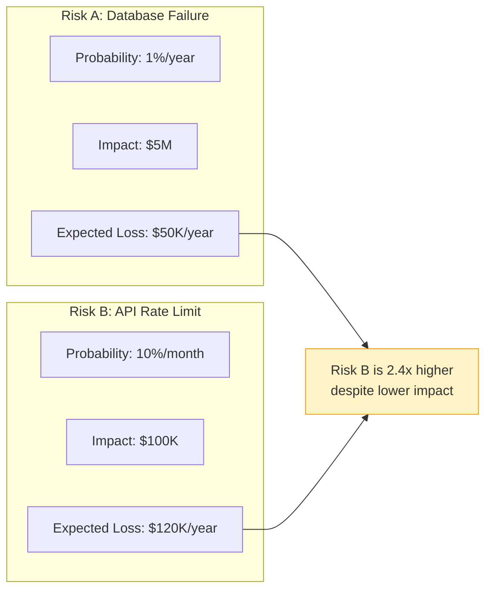
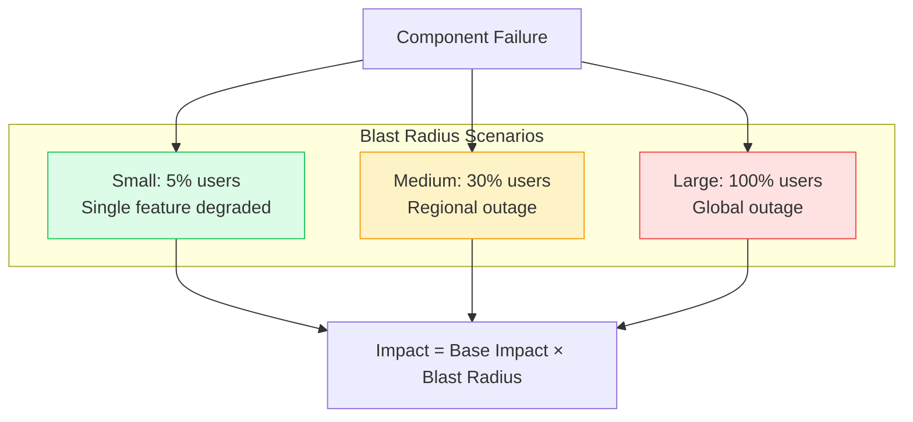
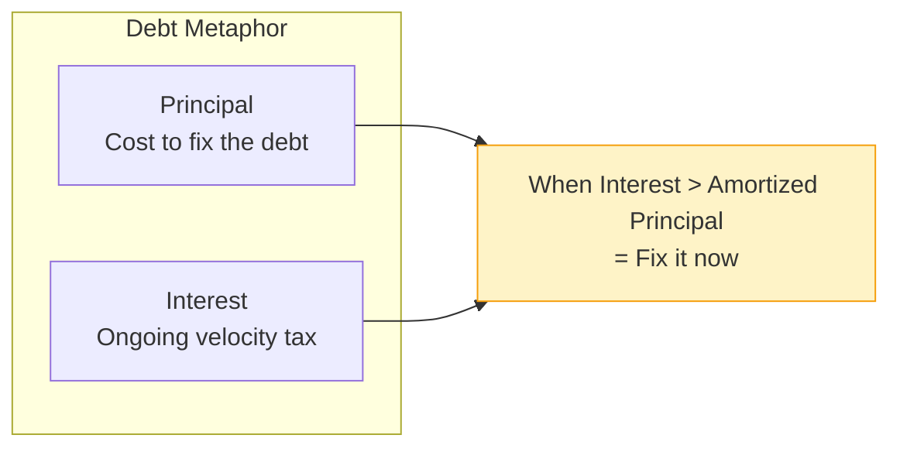
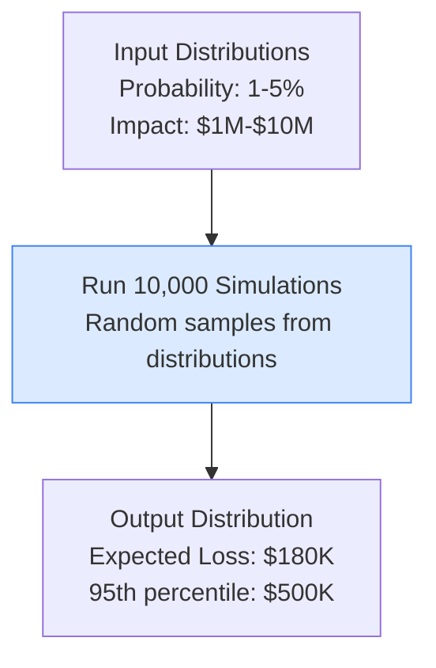
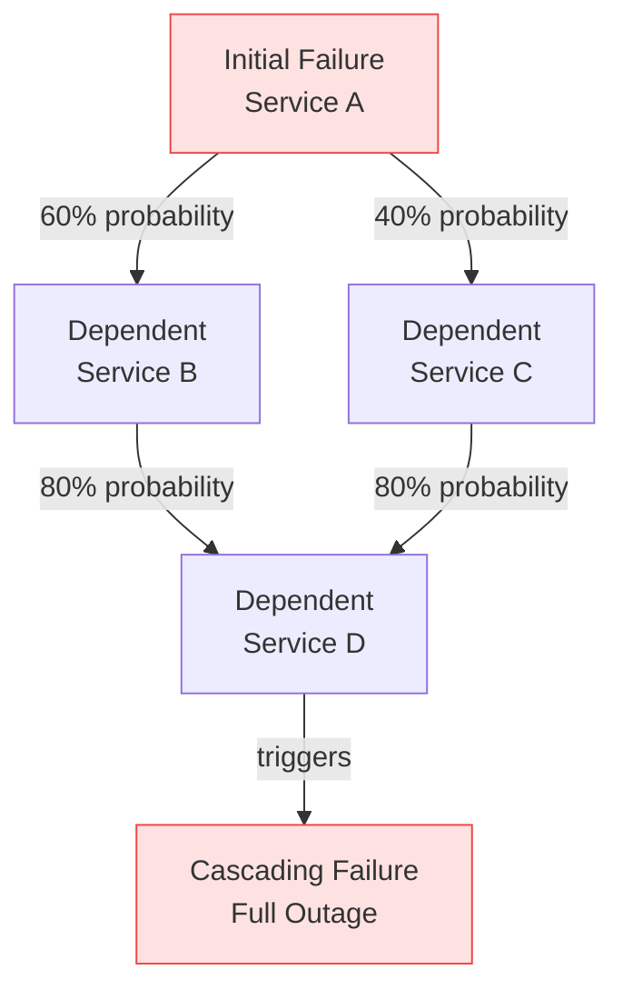
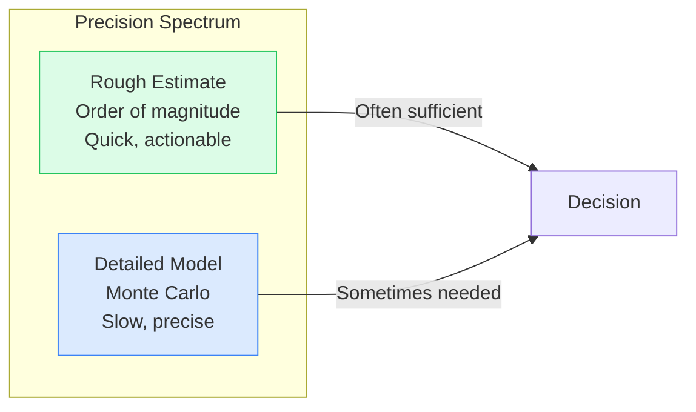
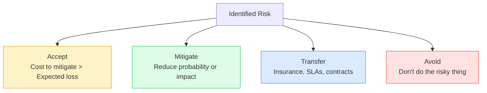

# Risk Quantification

This guide covers 5 key areas: I. Executive Summary: Speaking the Language of Business Risk, II. Technical Mechanics: Frameworks and Calculations, III. Real-World Behavior at Mag7, IV. Critical Tradeoffs, V. Impact on Business, ROI, and CX.


## I. Executive Summary: Speaking the Language of Business Risk

At the Principal TPM level, risk quantification is your superpower for translating technical concerns into business language. When you say "we need to fix this architecture," executives hear cost. When you say "this architecture has $2.4M annual expected loss; we can reduce it to $200K with a $500K investment," executives hear ROI. The difference determines whether your proposals get funded.

### 1. The Risk Equation: Probability × Impact

Every risk can be expressed mathematically:

```
Expected Loss = Probability × Impact
```

This simple formula enables comparison across unlike risks:



**Why This Matters:**
Without quantification, risk discussions become emotional debates. "This feels risky" vs. "That seems fine." With quantification, you have objective comparison criteria.

### 2. From Technical Risk to Business Impact

Technical risks must be translated to business terms:

| Technical Risk | Business Impact |
|----------------|-----------------|
| Database failure | Revenue loss, customer churn |
| Security breach | Fines, legal fees, brand damage |
| Performance degradation | Conversion rate drop, user abandonment |
| Technical debt | Development velocity reduction |
| Single point of failure | Extended outage duration |

**Translation Example:**
*   **Technical framing:** "Our database has no read replicas. If it fails, we have 15-minute MTTR."
*   **Business framing:** "A 15-minute outage during peak hours costs $200K in lost transactions. With 2% annual probability, that's $4K expected annual loss. Adding read replicas for $50K eliminates this risk entirely."

### 3. The Annualized Loss Expectancy (ALE) Framework

ALE is the standard framework for risk quantification in security and reliability:

```
ALE = ARO × SLE
```

Where:
*   **ARO (Annual Rate of Occurrence):** How often the event happens per year
*   **SLE (Single Loss Expectancy):** Cost of a single occurrence

**Example Calculation:**
*   Event: Major outage affecting all users
*   ARO: 2 per year (historical average)
*   SLE: $500K (lost revenue + incident response + customer credits)
*   ALE: 2 × $500K = $1M/year

**Investment Decision:**
If a $2M infrastructure upgrade reduces ARO from 2 to 0.2:
*   New ALE: 0.2 × $500K = $100K/year
*   Annual savings: $1M - $100K = $900K/year
*   Payback period: $2M / $900K = 2.2 years
*   5-year ROI: ($900K × 5 - $2M) / $2M = 125%

### 4. Blast Radius: The Multiplier Effect

Blast radius quantifies how much of your system or user base is affected by a failure:



**Blast Radius Reduction Strategies:**
*   **Isolation:** Failures in one component don't cascade
*   **Graceful degradation:** System continues with reduced functionality
*   **Canary deployments:** Limit exposure of new code to subset of users
*   **Multi-region:** Regional failure doesn't affect other regions

**Quantification:**
*   Global authentication outage: 100% blast radius
*   Single region database failure with 3-region deployment: 33% blast radius
*   Feature flag misconfiguration affecting one feature: 5-10% blast radius

### 5. Technical Debt as Financial Debt

Technical debt isn't just "messy code"—it's future cost with compounding interest:



**Quantification Framework:**

| Metric | Calculation | Example |
|--------|-------------|---------|
| Velocity Tax | % of sprint capacity spent on workarounds | 20% |
| Team Cost | Engineers × Avg Salary | 10 × $200K = $2M/year |
| Annual Interest | Velocity Tax × Team Cost | 20% × $2M = $400K/year |
| Principal | Estimated fix effort | 2 engineer-months = $66K |
| Payback | Principal / Annual Interest | $66K / $400K = 2 months |

**Decision:** If payback is less than 12 months, fix the debt immediately.

### 6. ROI and Capabilities Summary

Mastering risk quantification enables:
*   **Justified investments:** Get budget for reliability and security projects
*   **Objective prioritization:** Compare unlike risks on common basis
*   **Executive communication:** Speak the language of business impact
*   **Resource allocation:** Direct effort to highest-ROI improvements


## II. Technical Mechanics: Frameworks and Calculations

### 1. Monte Carlo Simulation for Risk

When outcomes are uncertain, Monte Carlo simulation models probability distributions:



**Process:**
1. Define probability distributions for inputs (not just point estimates)
2. Run thousands of simulations, sampling randomly from distributions
3. Analyze output distribution (mean, median, percentiles)

**Why It Matters:**
Point estimates hide uncertainty. "Expected loss is $200K" sounds precise but might range from $50K to $1M. Monte Carlo reveals the full range.

**Application:**
*   Capacity planning: Model traffic variability
*   Cost estimation: Model component cost ranges
*   Risk aggregation: Combine multiple risks into portfolio view

### 2. Failure Mode and Effects Analysis (FMEA)

FMEA systematically identifies failure modes and their impacts:

| Component | Failure Mode | Severity (1-10) | Probability (1-10) | Detection (1-10) | RPN |
|-----------|--------------|-----------------|-------------------|-----------------|-----|
| Database | Disk failure | 9 | 3 | 2 | 54 |
| Load Balancer | Config error | 7 | 5 | 4 | 140 |
| API Gateway | Memory leak | 6 | 6 | 7 | 252 |
| Auth Service | Key expiry | 8 | 4 | 3 | 96 |

**RPN (Risk Priority Number):**
```
RPN = Severity × Probability × Detection
```

Higher RPN = higher priority for mitigation.

**Detection Factor:**
*   1 = Certain detection before impact
*   10 = No detection until customer reports

This factor captures that undetected failures compound in severity.

### 3. Cascading Failure Analysis

In distributed systems, failures cascade. Quantify the cascade:



**Quantification:**
*   P(Service A fails) = 1% / year
*   P(B fails | A fails) = 60%
*   P(D fails | B fails) = 80%
*   P(Cascade | A fails) = 0.6 × 0.8 = 48%
*   P(Full cascade) = 1% × 48% = 0.48% / year

**Mitigation Value:**
Adding circuit breaker to B → D reduces P(D fails | B fails) to 10%:
*   New cascade probability: 0.6 × 0.1 = 6%
*   Reduction: 48% → 6% = 8x improvement

### 4. Value at Risk (VaR) for Technology

Borrowed from finance, VaR answers: "What's the maximum loss we expect with X% confidence?"

**Example:**
*   95% VaR of $500K means: "We're 95% confident losses won't exceed $500K this year."
*   Put differently: 5% chance of losing more than $500K.

**Calculation:**
From Monte Carlo output, find the 95th percentile of loss distribution.

**Application:**
*   Budget reserves for incident response
*   Insurance coverage decisions
*   Risk reporting to board

### 5. Cost of Delay (CoD)

For project prioritization, quantify the cost of not doing something:

```
Weekly Cost of Delay = (Revenue at risk + Cost increase + Strategic impact) per week
```

**Example - Scaling Project:**
*   Current capacity: 10K requests/second
*   Projected demand in 6 months: 15K requests/second
*   Revenue per request: $0.10
*   Excess requests dropped: 5K/second × $0.10 × 3600s × 24h × 7d = $302K/week

**Prioritization:**
Compare CoD across projects. Highest CoD = highest priority.

**WSJF (Weighted Shortest Job First):**
```
WSJF = Cost of Delay / Job Duration
```
Prioritize high CoD, short duration projects first.


## III. Real-World Behavior at Mag7

### 1. Google: Risk in OKRs

Google integrates risk quantification into objective setting:

**Risk OKRs:**
*   "Reduce expected annual loss from service outages by 40%"
*   "Decrease blast radius of any single failure to &lt;5% of users"

**Quantified Error Budgets:**
Error budgets translate to expected customer impact hours. Teams track "bad minutes" where users experienced degraded service.

**CapEx Justification:**
Major infrastructure investments require quantified risk reduction analysis. "This $50M data center reduces correlated failure risk by X%, saving $Y in expected losses."

### 2. Amazon: Six Sigma in Tech

Amazon applies manufacturing quality principles to technology:

**DMAIC Framework:**
*   **Define:** What's the problem? (e.g., API error rate too high)
*   **Measure:** Current state quantified (1.2% error rate)
*   **Analyze:** Root causes identified
*   **Improve:** Solutions implemented
*   **Control:** Sustained improvement verified

**Defect Cost Quantification:**
Every defect (bug, outage, slow request) has a calculated cost. Teams track "defect cost" as a key metric.

**COE (Correction of Errors):**
Post-incident reviews include quantified impact: "This incident cost $X in lost revenue, $Y in engineering time, affected Z customers."

### 3. Netflix: Chaos Engineering ROI

Netflix quantifies the value of chaos engineering:

**Failure Injection Value:**
*   Cost of running Chaos Monkey: Engineering time + occasional customer impact
*   Value: Prevented outages, reduced MTTR, faster recovery

**Quantification:**
*   Hours of unplanned downtime prevented (estimated from near-misses caught)
*   MTTR reduction (measured from actual incidents)
*   Developer time saved (issues caught in chaos experiments vs. production)

**Game Day ROI:**
*   Game day cost: $50K (engineer time, potential impact)
*   Issues found: 5 critical, 12 moderate
*   Estimated prevented outage cost: $500K
*   ROI: 900%

### 4. Meta: Scale Multipliers

At Meta's scale, small probabilities become certainties:

**The Scale Factor:**
*   3 billion users means a 1-in-a-million event happens 3,000 times
*   0.01% error rate = 300,000 affected users

**Risk Quantification at Scale:**
*   Impact is always huge (billions of users)
*   Focus shifts to probability reduction
*   Even 0.001% improvements matter

**Infrastructure Investment:**
Meta justifies custom hardware by quantifying:
*   Cost per query reduced by X%
*   At scale, X% savings = $Y million annually
*   Custom development cost: $Z million
*   ROI: Typically 3-5x over hardware lifetime


## IV. Critical Tradeoffs

### 1. Precision vs. Actionability

More precise risk quantification isn't always better:



**When Rough Estimates Suffice:**
*   Comparing risks that differ by 10x+
*   Initial prioritization
*   Communicating with non-technical stakeholders

**When Precision Matters:**
*   Large investment decisions ($1M+)
*   Regulatory compliance (quantified controls)
*   Insurance negotiations

**TPM Judgment:**
Match precision to decision stakes. Don't spend a week modeling a $10K decision.

### 2. Known vs. Unknown Risks

Quantification works for known risks but struggles with unknown unknowns:

| Risk Type | Quantifiable? | Approach |
|-----------|---------------|----------|
| Known-known | Yes | Standard models |
| Known-unknown | Partially | Scenario planning, ranges |
| Unknown-unknown | No | Resilience, chaos engineering |

**Black Swan Events:**
*   COVID-19 pandemic
*   Major cloud provider outage
*   Zero-day exploits

**Strategy:**
Can't quantify specific unknown risks, but can:
*   Build resilient systems that survive surprises
*   Maintain reserves for unexpected events
*   Practice incident response for generic scenarios

### 3. Risk Acceptance vs. Mitigation

Not all risks should be mitigated:



**Acceptance Criteria:**
*   Expected loss is small relative to business
*   Mitigation cost exceeds expected loss
*   Risk is inherent to the business model

**Documentation:**
Accepted risks must be documented and reviewed. "We accept $X risk because mitigation would cost $Y" signed by accountable executive.

### 4. Optimism Bias in Estimates

Humans systematically underestimate risk. Counter this bias:

**Typical Biases:**
*   Probability: Underestimate (optimism about prevention)
*   Impact: Underestimate (failure to consider cascades)
*   Recovery time: Underestimate (planning fallacy)

**Countermeasures:**
*   Use historical data, not estimates
*   Apply multipliers to initial estimates (1.5-2x for impact, 2-3x for duration)
*   Reference class forecasting: "How did similar projects/incidents turn out?"
*   Pre-mortem: "Assume it failed—why?"


## V. Impact on Business, ROI, and CX

### 1. Getting Budget for Risk Reduction

Risk quantification is your justification toolkit:

**The Before/After Frame:**
*   Before: "We need to improve our disaster recovery."
*   After: "Our current DR setup has $2.4M annual expected loss. A $400K investment reduces this to $150K, yielding 460% first-year ROI."

**Building the Business Case:**

| Element | Purpose |
|---------|---------|
| Current state risk | Quantify the problem |
| Proposed solution | What you want to do |
| Risk reduction | How much safer |
| Investment required | What it costs |
| ROI / Payback | Why it's worth it |
| Alternatives considered | Why this solution |

### 2. Risk-Adjusted Project Prioritization

Quantified risk enables objective prioritization:

**Prioritization Matrix:**

| Project | Expected Benefit | Risk (EL) | Risk-Adjusted Value | Effort | Priority Score |
|---------|------------------|-----------|---------------------|--------|---------------|
| Feature A | $500K | $50K | $450K | 3 months | 150K/month |
| Feature B | $300K | $10K | $290K | 1 month | 290K/month |
| Security Fix | $0 | -$200K (avoided) | $200K | 2 weeks | 400K/month |

**Result:** Security fix prioritized despite no direct benefit—avoided loss is quantified.

### 3. Customer Trust and Risk Transparency

Quantified risk supports customer conversations:

**Enterprise Sales:**
*   "Here's our SLA with credits for breach"
*   "Our annual expected downtime is X hours, validated by Y certifications"
*   "We maintain $Z in reserves for incident remediation"

**Transparency During Incidents:**
*   Quantified impact: "X% of users affected for Y minutes"
*   Calculated credits proactively offered
*   Post-mortem with quantified improvements

### 4. Insurance and Contract Negotiations

Risk quantification informs insurance decisions:

**Cyber Insurance:**
*   What coverage level do you need?
*   Quantified risk analysis determines appropriate coverage
*   Lower premiums if you can demonstrate risk controls

**Vendor Contracts:**
*   What SLAs to demand based on your risk tolerance?
*   What credits compensate for your expected loss?
*   Is the vendor's risk posture acceptable?


## Interview Questions

### I. Executive Summary: Speaking the Language of Business Risk

**Question 1: The Risk Communication Challenge**
"You need to convince the CFO to approve a $2M infrastructure upgrade that improves reliability but generates no direct revenue. How do you make the case?"

*   **Guidance for a Strong Answer:**
    *   **Quantify the Problem:** Calculate expected annual loss (ALE) from outages under current architecture using historical data.
    *   **Show the ROI:** Present before/after: "Current ALE is $1.5M. This investment reduces it to $150K. Payback period is 18 months, 5-year ROI is 275%."
    *   **Business Language:** Frame in terms of revenue protection, customer retention, and competitive positioning—not technical metrics.
    *   **Comparisons:** Show opportunity cost of NOT investing vs. investing in new features.

**Question 2: Blast Radius Quantification**
"Your authentication service has a 0.1% failure rate, but when it fails, 100% of users are affected. A proposed microservices refactor would reduce blast radius to 10% per failure but increase failure rate to 0.5%. Should you proceed?"

*   **Guidance for a Strong Answer:**
    *   **Calculate Current Impact:** 0.1% × 100% = 0.1% effective user impact
    *   **Calculate Proposed Impact:** 0.5% × 10% = 0.05% effective user impact
    *   **Quantify Difference:** 2x improvement in user-impacting failures despite higher raw failure rate.
    *   **Consider Secondary Factors:** Mention MTTR improvement (smaller blast radius = faster recovery), engineering complexity, and operational observability benefits.

### II. Technical Mechanics: Frameworks and Calculations

**Question 1: FMEA Application**
"Describe how you would use Failure Mode and Effects Analysis (FMEA) to prioritize reliability improvements across a microservices architecture with 50 services."

*   **Guidance for a Strong Answer:**
    *   **Structure the Analysis:** Group services by criticality tier (Tier 0 = auth/payments, Tier 1 = core features, Tier 2 = nice-to-have).
    *   **Score Each Service:** Severity (business impact 1-10), Probability (failure rate 1-10), Detection (monitoring quality 1-10).
    *   **Calculate RPN:** Risk Priority Number = S × P × D. Prioritize highest RPN for investment.
    *   **Focus on Detection:** Often the cheapest fix—improving monitoring reduces effective risk without changing architecture.

**Question 2: Cascading Failure Analysis**
"A database failure caused a 4-hour outage affecting all services. Post-mortem revealed 6 services were affected in sequence. How do you quantify and prevent future cascade risk?"

*   **Guidance for a Strong Answer:**
    *   **Map the Dependency Graph:** Document which services depend on which, with failure probability for each link.
    *   **Calculate Cascade Probability:** P(A fails) × P(B fails|A) × P(C fails|B) = compound risk.
    *   **Identify Critical Paths:** Find links where adding circuit breakers or fallbacks dramatically reduces cascade probability.
    *   **Quantify Mitigation Value:** "Adding circuit breaker to Service B reduces cascade probability from 48% to 6%, an 8x improvement."

### III. Real-World Behavior at Mag7

**Question 1: Scale Multiplier Problem**
"How does risk quantification change when operating at hyperscale with billions of users?"

*   **Guidance for a Strong Answer:**
    *   **Small Probabilities Become Certainties:** 1-in-a-million events happen thousands of times daily at Meta/Google scale.
    *   **Impact Is Always Massive:** Focus shifts to probability reduction since impact denominator is fixed.
    *   **Fractional Improvements Matter:** 0.001% reliability improvement = millions of dollars saved.
    *   **Custom Solutions Justified:** Scale justifies custom hardware, proprietary protocols, and massive infrastructure investments that wouldn't ROI at smaller scale.

**Question 2: Chaos Engineering ROI**
"Describe how you would justify chaos engineering investment to a CFO who sees it as 'intentionally breaking things.'"

*   **Guidance for a Strong Answer:**
    *   **Reframe the Investment:** Chaos engineering is insurance + quality assurance, not destruction.
    *   **Quantify Prevented Outages:** "Game Days have identified 15 critical issues that would have caused $2M in outage costs. Investment: $100K. ROI: 1,900%."
    *   **MTTR Improvement:** "Teams with chaos practice recover 3x faster. At our incident rate, that's $500K/year in reduced outage duration."
    *   **Competitive Positioning:** Netflix, Amazon, Google all do this—it's table stakes for reliability at scale.

### IV. Critical Tradeoffs

**Question 1: Precision vs. Speed**
"You have 2 hours before an executive meeting to recommend whether to proceed with a risky migration. You don't have time for detailed Monte Carlo analysis. How do you approach this?"

*   **Guidance for a Strong Answer:**
    *   **Order of Magnitude First:** Rough estimates (10x difference) are usually sufficient for go/no-go decisions.
    *   **Historical Analogy:** "Similar migrations have had X% failure rate with $Y impact. This one is comparable/different because Z."
    *   **Range Not Point:** Present "best case $100K, likely case $500K, worst case $2M" instead of false precision.
    *   **Flag Uncertainty:** "This is a rough estimate. If we need higher confidence, we should delay the decision by X days."

**Question 2: Risk Acceptance Decision**
"Engineering wants to fix a vulnerability that has 0.01% annual probability but $10M impact. The fix requires 6 months of work. Should you proceed?"

*   **Guidance for a Strong Answer:**
    *   **Calculate Expected Loss:** 0.01% × $10M = $1K/year expected loss.
    *   **Calculate Fix Cost:** 6 months × 2 engineers × $200K/year = $200K.
    *   **ROI Assessment:** Payback period = $200K / $1K = 200 years. Negative ROI.
    *   **Document Acceptance:** Formally accept the risk with executive sign-off, document the reasoning, and set review cadence.
    *   **Consider Non-Financial Factors:** Brand damage, regulatory implications, ethical considerations may override pure ROI.

### V. Impact on Business, ROI, and CX

**Question 1: Risk-Adjusted Prioritization**
"You have budget for one of three projects: a security fix preventing $200K expected loss, a reliability improvement preventing $150K expected loss, or a new feature generating $300K revenue. The security fix takes 2 weeks, reliability takes 2 months, and the feature takes 3 months. How do you decide?"

*   **Guidance for a Strong Answer:**
    *   **Calculate WSJF:** Weighted Shortest Job First = Value / Duration
        *   Security: $200K / 0.5 month = $400K/month
        *   Reliability: $150K / 2 months = $75K/month
        *   Feature: $300K / 3 months = $100K/month
    *   **Priority Order:** Security → Feature → Reliability
    *   **Sequence Logic:** Do security first (2 weeks), then start feature while assessing if reliability can be parallelized.
    *   **Risk Adjustment:** Consider that feature revenue is uncertain while loss prevention is quantified.

**Question 2: The "Feels Risky" Conversation**
"An executive says 'this migration feels too risky' without specifics. How do you move the conversation forward constructively?"

*   **Guidance for a Strong Answer:**
    *   **Acknowledge the Concern:** Don't dismiss emotional responses—they often signal real risk intuition.
    *   **Decompose the Risk:** "Let's break this down—are you concerned about technical failure, timeline slippage, customer impact, or something else?"
    *   **Quantify Together:** "If this goes wrong, what's the worst case impact? How likely is that? Let's put numbers on it."
    *   **Compare to Status Quo:** "Doing nothing also has risk—here's the quantified cost of NOT migrating."
    *   **Offer Mitigations:** "If we add canary rollout and rollback plan, we reduce blast radius by 80%. Does that change the risk calculus?"


---

## Key Takeaways

1. **Risk = Probability × Impact** - This simple formula enables comparing unlike risks on a common basis.

2. **Translate to business language** - "Expected annual loss of $1M" is more compelling than "this architecture is risky."

3. **Blast radius is a multiplier** - A 10% probability event affecting 100% of users is worse than a 50% event affecting 5% of users.

4. **Technical debt has interest** - Quantify the velocity tax to justify cleanup investments.

5. **Match precision to stakes** - Rough estimates for small decisions, detailed models for big investments.

6. **Account for bias** - Humans underestimate risk. Use historical data and apply multipliers.
