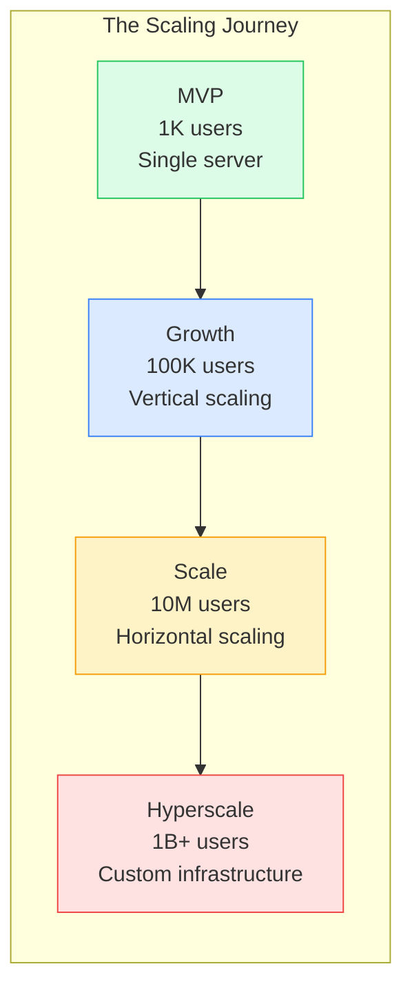
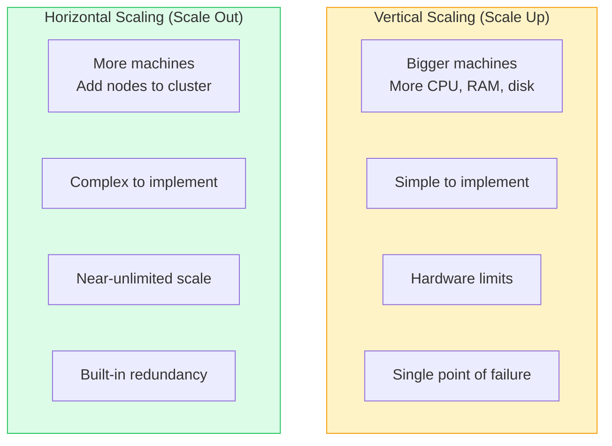
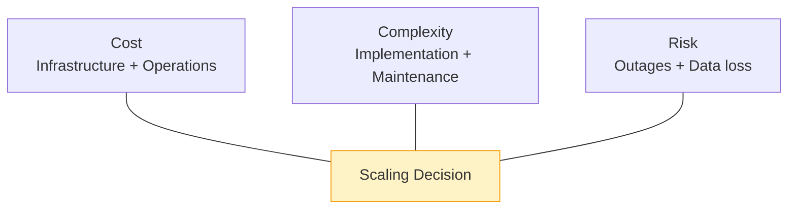
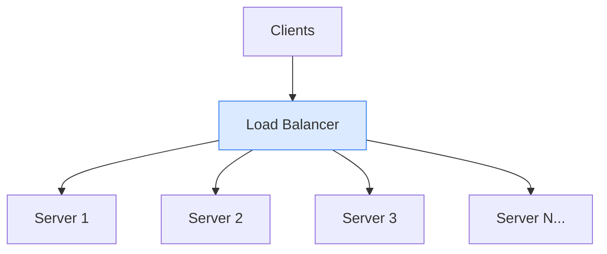
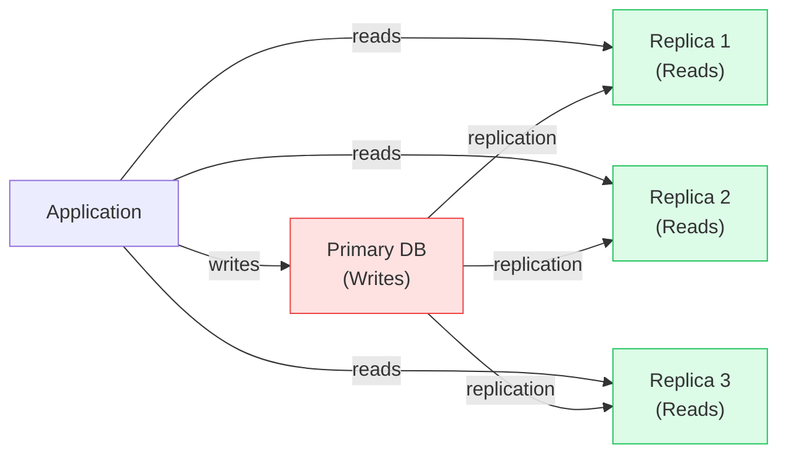
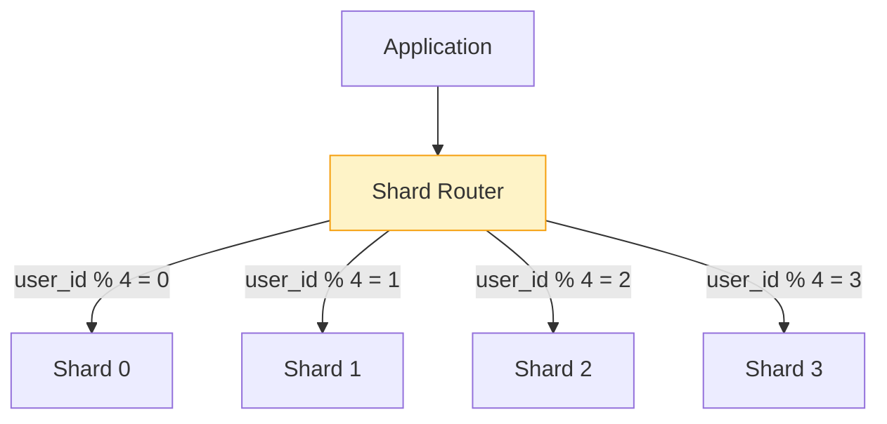
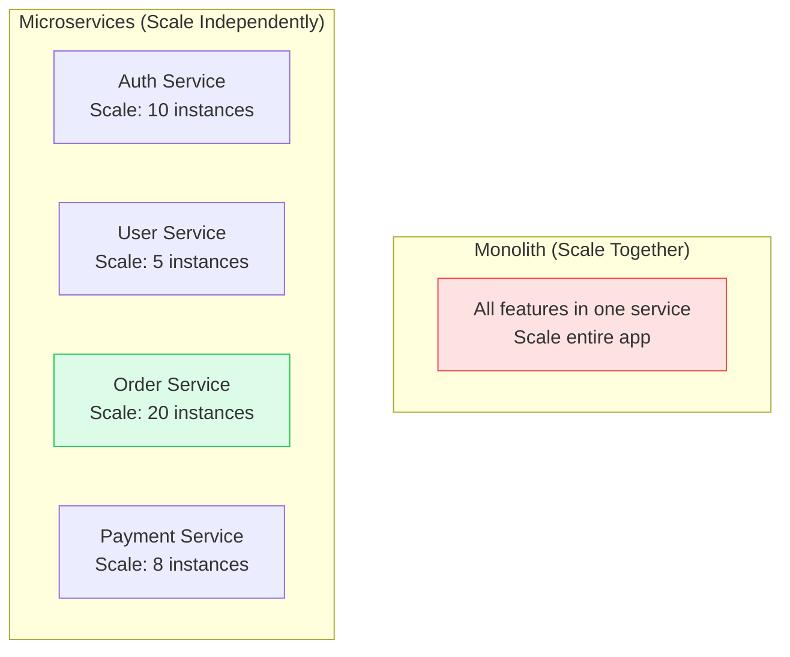
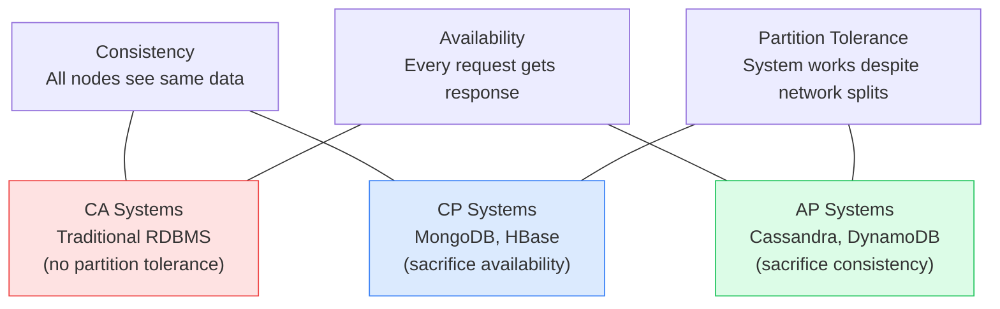
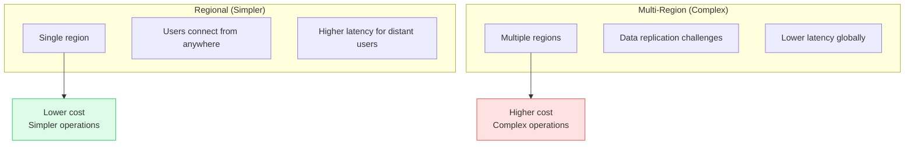

# Scaling Architecture

This guide covers 5 key areas: I. Executive Summary: The Art of Growing Systems, II. Technical Mechanics: Patterns and Approaches, III. Real-World Behavior at Mag7, IV. Critical Tradeoffs, V. Impact on Business, ROI, and CX.


## I. Executive Summary: The Art of Growing Systems

At the Principal TPM level, scaling architecture is not about knowing which database handles more queries—it's about understanding when to scale, what the bottlenecks are, and how to do it without disrupting the business. Systems that scale elegantly are designed for growth from day one, not retrofitted under pressure.

### 1. The Scaling Imperative

Every successful system eventually faces scaling challenges:



**Scaling Triggers:**
*   **Performance degradation:** Response times increasing, error rates rising
*   **Resource saturation:** CPU, memory, disk, or network approaching limits
*   **Cost inefficiency:** Vertical scaling becomes uneconomical
*   **Business growth:** User base or transaction volume exceeding capacity

**TPM Responsibility:**
You don't implement scaling—you plan it. You identify when scaling is needed, what approach fits the constraints, and coordinate the cross-functional effort to execute.

### 2. Vertical vs. Horizontal: The Fundamental Choice

The two fundamental scaling strategies have distinct characteristics:



**Vertical Scaling:**
*   **How:** Replace server with larger one (more CPUs, RAM, storage)
*   **Pros:** No application changes, simple operations
*   **Cons:** Hardware ceiling, cost superlinear at high end, single point of failure
*   **Best for:** Quick fixes, development environments, databases (until sharding required)

**Horizontal Scaling:**
*   **How:** Add more servers of similar size
*   **Pros:** Linear cost scaling, fault tolerance, near-unlimited scale
*   **Cons:** Requires application changes (statelessness), operational complexity
*   **Best for:** Stateless services, web tier, distributed processing

**Decision Framework:**
1. Can vertical solve the problem for the next 12-24 months?
2. Is vertical cost-effective at target scale?
3. Does the application support horizontal (stateless or partitionable)?
4. What's the operational overhead of horizontal?

### 3. Stateless vs. Stateful: The Scaling Divide

The ease of scaling depends heavily on where state lives:

| Service Type | Scaling Approach | Complexity |
|--------------|------------------|------------|
| Stateless (API servers) | Add more instances | Low |
| Externalized state (app + Redis) | Scale app, scale cache separately | Medium |
| Stateful (database) | Replication, sharding | High |
| Strongly consistent state | Consensus protocols | Very High |

**The Stateless Pattern:**
```
User → Load Balancer → Any App Server → Shared State (DB/Cache)
```
*   Any server can handle any request
*   Scale by adding servers behind load balancer
*   Kubernetes HPA, AWS Auto Scaling Groups

**The Stateful Challenge:**
*   State must be partitioned (sharded) or replicated
*   Replication adds complexity (consistency, lag)
*   Sharding adds complexity (routing, rebalancing)

**TPM Insight:**
Push state to the edges. Keep the scaling-sensitive components stateless. Invest in managed state services (RDS, DynamoDB, Redis Cloud) that handle scaling complexity.

### 4. The Scaling Ceiling: Where Systems Break

Every architecture has scaling limits. Understanding where systems break helps you plan:

**Common Bottlenecks:**

| Component | Scaling Limit | Symptoms | Solutions |
|-----------|---------------|----------|-----------|
| Single DB | Connections, IOPS | Query latency, timeouts | Read replicas, sharding |
| Load Balancer | Connections, bandwidth | 502 errors, dropped connections | Multiple LBs, regional deployment |
| API Gateway | Rate limits, CPU | 429 errors, latency spikes | Scale out, caching |
| Message Queue | Throughput, partitions | Consumer lag, backpressure | More partitions, multiple clusters |
| DNS | Lookup latency | Global resolution delays | Multiple providers, caching |

**Finding Your Ceiling:**
*   Load test before production traffic finds it
*   Monitor saturation metrics (CPU, memory, connections, queue depth)
*   Calculate headroom: (capacity - current load) / current load

### 5. The Scaling Equation: Cost, Complexity, and Risk

Scaling decisions involve balancing three factors:



**The Equation:**
*   Simpler scaling = lower complexity, often higher cost
*   Complex scaling = lower cost per unit, higher operational risk
*   Under-scaling = risk of outages, lost revenue
*   Over-scaling = wasted infrastructure spend

### 6. ROI and Capabilities Summary

Mastering scaling architecture delivers:
*   **Business continuity:** Handle growth without outages
*   **Cost efficiency:** Right-size infrastructure to demand
*   **Competitive advantage:** Support features competitors can't deliver
*   **Operational confidence:** Known playbook for handling load


## II. Technical Mechanics: Patterns and Approaches

### 1. Load Balancing Strategies

Load balancing distributes traffic across multiple servers:



**Balancing Algorithms:**

| Algorithm | Behavior | Best For |
|-----------|----------|----------|
| Round Robin | Cycle through servers sequentially | Uniform servers, uniform requests |
| Weighted Round Robin | Cycle with weight proportional to capacity | Heterogeneous server sizes |
| Least Connections | Route to server with fewest active connections | Variable request duration |
| IP Hash | Same client IP always hits same server | Sticky sessions |
| Random | Random server selection | Simple, surprisingly effective at scale |

**Layer 4 vs. Layer 7:**
*   **L4 (Transport):** Routes TCP/UDP packets. Fast, no payload inspection. NLB, HAProxy.
*   **L7 (Application):** Routes HTTP requests. Slower, can route by URL/header. ALB, NGINX, Envoy.

**Health Checks:**
*   Active: LB pings servers periodically
*   Passive: LB monitors response codes from real traffic
*   Deep: Health endpoint checks dependencies (DB, cache)

### 2. Database Scaling Patterns

Databases are often the scaling bottleneck. Multiple patterns address this:

**Read Replicas:**


*   **Use case:** Read-heavy workloads (90%+ reads)
*   **Tradeoff:** Replication lag means reads may be stale
*   **Implementation:** AWS RDS Read Replicas, PostgreSQL streaming replication

**Sharding (Horizontal Partitioning):**


*   **Use case:** Write-heavy workloads or data exceeding single node capacity
*   **Tradeoff:** Cross-shard queries are expensive, rebalancing is complex
*   **Shard keys:** Choose carefully—determines data distribution and query patterns

**Caching Layer:**
*   Place cache (Redis, Memcached) between app and database
*   Cache read results to reduce database load
*   Invalidation strategy: TTL, write-through, or explicit invalidation

### 3. Auto-Scaling Strategies

Automatically adjust capacity based on demand:

**Reactive (Threshold-Based):**
```
if CPU > 70% for 5 minutes:
    scale out by 2 instances
if CPU < 30% for 10 minutes:
    scale in by 1 instance
```
*   **Pros:** Simple, well-understood
*   **Cons:** Slow reaction, overshoots common
*   **Best for:** Gradual load changes

**Predictive:**
*   Use historical patterns to pre-scale
*   Monday 9 AM spike? Scale up at 8:30 AM
*   Requires ML or manual scheduling
*   AWS Predictive Scaling, GCP Autoscaler with prediction

**Queue-Based:**
```
Scale workers based on queue depth:
- Queue > 1000 messages → add worker
- Queue empty for 5 minutes → remove worker
```
*   **Pros:** Matches capacity to actual work
*   **Cons:** Requires queue-based architecture
*   **Best for:** Batch processing, async workloads

**Event-Driven:**
*   Scale in response to specific events (new deployment, marketing campaign)
*   Manual or automated triggers
*   Pre-warming for known events

### 4. Caching Strategies

Caching reduces load on databases and speeds responses:

**Cache-Aside (Lazy Loading):**
```
read(key):
    if cache.contains(key):
        return cache.get(key)
    else:
        value = database.get(key)
        cache.set(key, value, ttl)
        return value
```
*   **Pros:** Only caches accessed data
*   **Cons:** Cache miss on first access, stale data possible

**Write-Through:**
```
write(key, value):
    cache.set(key, value)
    database.set(key, value)
```
*   **Pros:** Cache always consistent
*   **Cons:** Write latency increased, cache may fill with unread data

**Write-Behind (Write-Back):**
```
write(key, value):
    cache.set(key, value)
    enqueue database.set(key, value) for later
```
*   **Pros:** Fastest writes
*   **Cons:** Data loss risk if cache fails before write

**Cache Invalidation:**
*   **TTL:** Expire after time period
*   **Event-based:** Invalidate on write
*   **Version-based:** Key includes version, new version = new key

**The Two Hard Problems:**
1. Cache invalidation (when to expire)
2. Naming things

### 5. Microservices and Service Mesh

Microservices enable independent scaling of components:



**Benefits for Scaling:**
*   Scale hot services independently
*   Different scaling strategies per service
*   Failure isolation (one service down ≠ all down)

**Costs:**
*   Operational complexity (more deployments, more monitoring)
*   Network overhead (service-to-service calls)
*   Distributed system challenges (consistency, tracing)

**Service Mesh (Istio, Linkerd):**
*   Handles service-to-service communication
*   Provides load balancing, retries, circuit breaking
*   Enables canary deployments, traffic shifting


## III. Real-World Behavior at Mag7

### 1. Google: Scale as Core Competency

Google's infrastructure is purpose-built for scale:

**Borg (now Kubernetes):**
The container orchestration system that inspired Kubernetes. Manages millions of containers across millions of machines. Features:
*   Bin-packing: Efficiently place containers on machines
*   Auto-healing: Restart failed containers automatically
*   Autoscaling: Horizontal Pod Autoscaler (HPA), Vertical Pod Autoscaler (VPA)

**Spanner: Globally Distributed Database:**
*   Horizontal scaling with strong consistency
*   TrueTime: Hardware-synchronized clocks enable distributed transactions
*   Scales to millions of nodes while providing ACID guarantees

**Colossus: Distributed File System:**
*   Successor to Google File System (GFS)
*   Petabytes of storage across thousands of machines
*   Automatic replication and recovery

**Mag7 Insight:**
Google built custom infrastructure because nothing off-the-shelf met their scale requirements. Most companies don't need this—cloud providers offer Google-grade infrastructure as a service.

### 2. Amazon: Service-Oriented Architecture Pioneer

Amazon's scaling journey defined modern distributed systems:

**The "Two-Pizza Team" Rule:**
*   Teams small enough to be fed by two pizzas
*   Each team owns a service end-to-end
*   Services communicate via APIs, not shared databases
*   Independent deployment and scaling

**DynamoDB:**
*   Amazon's internal database became a managed service
*   Designed for horizontal scale from the start
*   Single-digit millisecond latency at any scale
*   Partition-based architecture, automatic scaling

**Lambda: Serverless Scaling:**
*   No servers to manage
*   Scales to thousands of concurrent executions instantly
*   Pay only for execution time
*   Event-driven architecture

**Key Lesson:**
Amazon decomposed their monolith into services (famously, the "Bezos API mandate"). This enabled independent scaling but required significant investment in service infrastructure.

### 3. Netflix: Chaos and Resilience at Scale

Netflix serves 200M+ subscribers with near-perfect availability:

**Zuul: Edge Gateway:**
*   All traffic enters through Zuul
*   Handles authentication, routing, rate limiting
*   Scales horizontally across regions
*   Enables canary deployments

**Eureka: Service Discovery:**
*   Services register themselves
*   Clients query for available instances
*   Enables dynamic scaling without config changes

**Hystrix (Now Resilience4j): Circuit Breaker:**
*   Prevents cascade failures
*   If service is failing, stop calling it temporarily
*   Enables graceful degradation

**Chaos Engineering:**
*   Deliberately inject failures
*   Chaos Monkey: Kill random instances
*   Chaos Kong: Kill entire regions
*   Proves systems survive failures

### 4. Meta: Scale Beyond Reason

Meta operates at a scale that breaks conventional wisdom:

**TAO: Social Graph Database:**
*   Billions of nodes, trillions of edges
*   Custom graph database for social relationships
*   Optimized for "friends of friends" queries
*   Aggressive caching, write-through architecture

**Memcache at Scale:**
*   Largest Memcached deployment in the world
*   Billions of requests per second
*   Custom client-side routing and replication
*   Mcrouter: Memcache proxy for pooling and routing

**Regional Architecture:**
*   Primary data center (write master)
*   Regional data centers (read replicas)
*   Eventual consistency for performance
*   Strong consistency where required (payments)


## IV. Critical Tradeoffs

### 1. Consistency vs. Availability vs. Partition Tolerance (CAP)

The CAP theorem states you can have at most two of three:



**Real-World Application:**
*   Network partitions are rare but do happen
*   During partitions, you must choose: reject requests (CP) or serve stale data (AP)
*   Most systems are AP with mechanisms to resolve inconsistencies

**TPM Guidance:**
Understand the CAP position of each data store. Align with business requirements—a shopping cart (AP is fine) differs from a bank account (CP required).

### 2. Latency vs. Throughput

Optimizing for one often hurts the other:

| Optimization | Latency Impact | Throughput Impact |
|--------------|----------------|-------------------|
| Batching | Increases (wait for batch) | Increases (amortize overhead) |
| Caching | Decreases (avoid DB) | Increases (serve from memory) |
| Compression | Increases (CPU time) | Increases (less network) |
| Connection pooling | Decreases (no connect overhead) | Increases (reuse connections) |

**The Tradeoff:**
*   Low latency often requires over-provisioning (lower utilization, higher cost)
*   High throughput often requires batching (higher latency)

**TPM Balance:**
Define SLOs for both. "P99 latency &lt;200ms" and "Handle 10K requests/second." Design to meet both constraints.

### 3. Complexity vs. Cost

More sophisticated scaling reduces unit cost but increases operational complexity:

| Approach | Unit Cost | Operational Complexity |
|----------|-----------|----------------------|
| Vertical (bigger machines) | Higher | Low |
| Horizontal (more machines) | Medium | Medium |
| Sharding | Lower | High |
| Custom infrastructure | Lowest | Very High |

**TPM Judgment:**
Most companies should use managed services (RDS, DynamoDB, Cloud Spanner) rather than building custom infrastructure. The operational cost of building and maintaining custom systems usually exceeds the unit cost savings.

### 4. Global vs. Regional Architecture

Serving users globally requires distributing infrastructure:



**Multi-Region Patterns:**
*   **Active-Passive:** One region serves traffic, other is standby
*   **Active-Active Read:** Writes to primary, reads from any region
*   **Active-Active Write:** Writes to any region (requires conflict resolution)

**When to Go Multi-Region:**
*   Latency requirements demand proximity
*   Compliance requires regional data residency
*   Business continuity requires regional redundancy


## V. Impact on Business, ROI, and CX

### 1. Scaling as Business Enabler

Well-designed scaling architecture enables business growth:

**Direct Impact:**
*   Handle traffic spikes (Black Friday, viral moments) without outage
*   Support new markets without re-architecture
*   Launch features that require scale (real-time, ML)

**Indirect Impact:**
*   Developer productivity (clear scaling patterns)
*   Operational confidence (known playbooks)
*   Cost predictability (linear scaling economics)

### 2. Cost of Poor Scaling

Under-scaled systems cost money:

**Outage Costs:**
*   Lost revenue during downtime
*   Customer acquisition wasted (users who churn)
*   Brand damage (social media, press)

**Performance Costs:**
*   Conversion rate drops with latency
*   User engagement decreases
*   SEO ranking suffers

**Opportunity Costs:**
*   Can't launch traffic-driving features
*   Can't pursue large customer deals
*   Engineering time spent firefighting

### 3. Scaling Economics

Understand the cost curves:

**Vertical Scaling Curve:**
*   Costs increase superlinearly (2x CPU ≠ 2x cost, more like 2.5x)
*   Hard ceiling on maximum size

**Horizontal Scaling Curve:**
*   Costs increase linearly (2x instances = 2x cost)
*   Operational costs add overhead
*   Volume discounts improve economics at scale

**Managed Services:**
*   Higher unit cost than self-managed
*   Lower total cost when including operations
*   Faster time to value

### 4. Customer Experience Impact

Scaling directly affects user experience:

**Latency:**
*   100ms latency increase = 1% conversion drop (Amazon study)
*   Mobile users especially sensitive (already on slow networks)

**Availability:**
*   Every outage erodes trust
*   Users remember failures long after resolution

**Consistency:**
*   Eventual consistency can confuse users (wrote data, can't see it)
*   Design UX for consistency model


## Interview Questions

### Fundamentals
1. Explain the difference between vertical and horizontal scaling. When would you choose each?
2. What is the CAP theorem and how does it apply to scaling decisions?
3. Describe read replica architecture and its tradeoffs.

### Patterns
4. How would you scale a database that's handling 10K writes per second?
5. Explain different caching strategies and when to use each.
6. What is a service mesh and how does it help with scaling?

### Mag7-Specific
7. How does Google's Spanner achieve global scale with strong consistency?
8. Describe Netflix's approach to resilience at scale.

### Scenario-Based
9. Your application is experiencing 5-second response times during peak hours. Walk through your investigation and scaling strategy.
10. You're designing a system to handle a 100x traffic spike for an annual event. What's your approach?


---

## Key Takeaways

1. **Statelessness enables scaling** - Push state to dedicated services (databases, caches). Keep scaling-sensitive components stateless.

2. **Know your bottleneck** - Before scaling, identify what's actually limiting. Scaling the wrong component wastes money.

3. **Vertical scaling buys time** - It's simpler but has limits. Use it while building horizontal capability.

4. **CAP tradeoffs are real** - Understand your consistency requirements. Most systems choose availability, accepting eventual consistency.

5. **Auto-scaling requires preparation** - Cold start latency kills reactive scaling. Combine with predictive scaling or pre-warming.

6. **Managed services save operational cost** - The premium for managed databases/queues is usually less than the engineering cost of self-managing.
