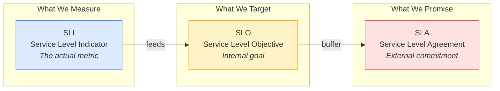
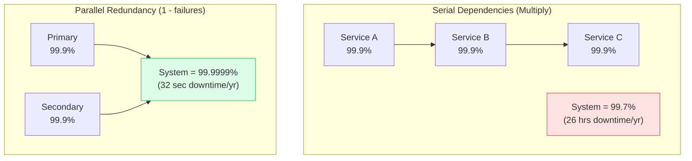
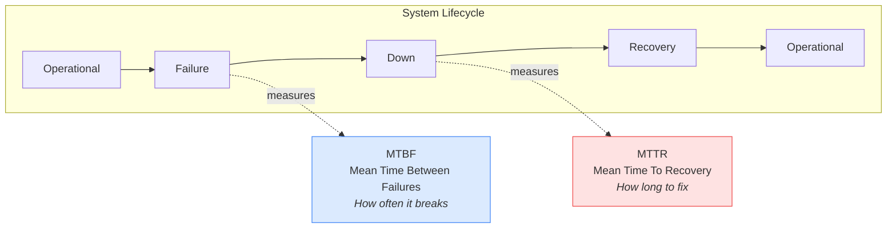
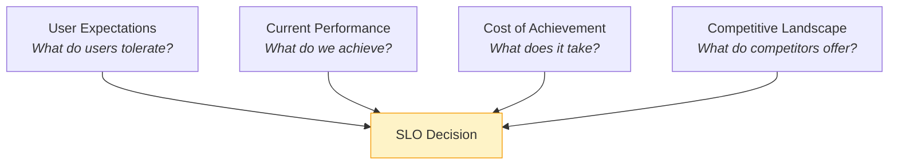
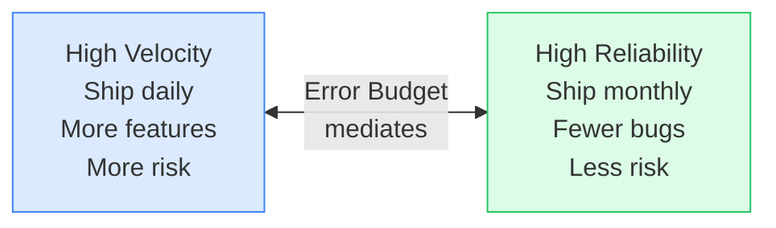
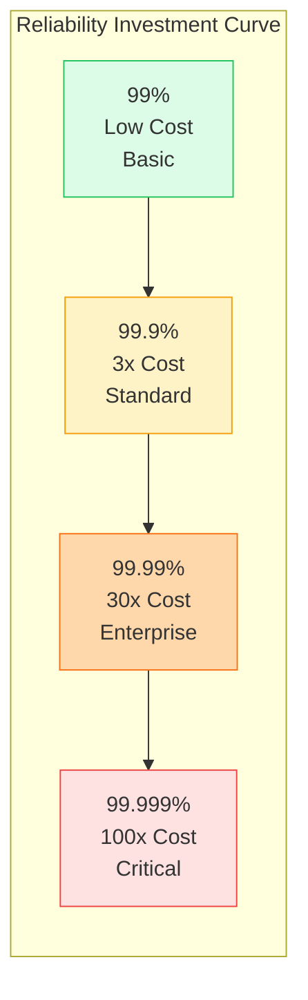

# SLA Mathematics & Reliability

This guide covers 5 key areas: I. Executive Summary: The Language of Reliability, II. Technical Mechanics: SLOs, SLIs, and Error Budgets, III. Real-World Behavior at Mag7, IV. Critical Tradeoffs, V. Impact on Business, ROI, and CX.


## I. Executive Summary: The Language of Reliability

At the Principal TPM level, SLA Mathematics is not about memorizing formulas—it is about translating technical reliability into business language and vice versa. When a VP asks "Can we promise 99.99% uptime to this enterprise customer?", you must instantly understand what that means operationally (52 minutes of downtime per year), architecturally (what redundancy is required), and commercially (what credits we owe when we miss it).

### 1. The SLI → SLO → SLA Pipeline

These three acronyms form a hierarchy that every TPM must internalize:



**SLI (Service Level Indicator):**
The raw measurement. Must be precisely defined—ambiguity causes arguments during incidents.
*   Bad: "Response time"
*   Good: "P99 latency of successful HTTP responses (2xx/3xx) measured at the load balancer, excluding health checks, over a 5-minute window"

**SLO (Service Level Objective):**
The internal target your team optimizes for. Sets the standard for engineering decisions.
*   Example: "99.9% of requests complete in &lt;200ms"
*   Purpose: Provides a clear line between "acceptable" and "needs attention"

**SLA (Service Level Agreement):**
The contractual promise to customers. Always set *lower* than SLO to provide operational buffer.
*   If SLO is 99.9%, SLA might be 99.5%
*   Breach consequences: Service credits, contract penalties, customer churn

**TPM Golden Rule:** Never let SLA = SLO. The gap is your insurance policy for unexpected events.

### 2. The Nines: What They Actually Mean

"Five nines" sounds impressive but means specific things operationally:

| Availability | Downtime/Year | Downtime/Month | Typical Use Case |
|--------------|---------------|----------------|------------------|
| 99% (two 9s) | 3.65 days | 7.3 hours | Internal tools, dev environments |
| 99.9% (three 9s) | 8.76 hours | 43.8 minutes | Most SaaS, APIs |
| 99.99% (four 9s) | 52.6 minutes | 4.4 minutes | Core infrastructure, payments |
| 99.999% (five 9s) | 5.26 minutes | 26 seconds | Emergency services, financial trading |

**The Exponential Cost of Nines:**
Each additional "nine" is not 10% harder—it is often 10x harder and 10x more expensive. Going from 99.9% to 99.99% typically requires:
*   Multi-region active-active deployment
*   Automated failover with sub-minute detection
*   Zero-downtime deployment pipelines
*   Chaos engineering and game days
*   24/7 on-call with aggressive SLAs

**Mag7 Reality Check:**
Even Google Cloud's SLA for Compute Engine is 99.99%, not 99.999%. Amazon's S3 SLA is 99.9% (availability, not durability). Promising five nines externally is extremely rare and expensive.

### 3. Composite SLA: The Math That Breaks Dreams

When systems have dependencies, availabilities multiply (for serial dependencies) or combine (for parallel/redundant):



**Serial Calculation:**
```
System Availability = A × B × C
99.9% × 99.9% × 99.9% = 99.7%
```

**Devastating Implication:**
A request that touches 10 microservices, each at 99.9%, yields:
```
0.999^10 = 0.990 = 99.0%
```
That is 87.6 hours of downtime per year—from services that each promise 99.9%.

**Parallel Calculation (Either Works):**
```
System Availability = 1 - (1-A)(1-B)
1 - (0.001)(0.001) = 1 - 0.000001 = 99.9999%
```

**TPM Implication:**
*   Minimize serial dependencies in critical paths
*   Add redundancy for critical components
*   Understand your actual system SLA, not component SLAs

### 4. Error Budgets: The Reliability Currency

Error budgets transform reliability from a religious argument into a data-driven negotiation. The concept: if your SLO is 99.9%, you have a budget of 0.1% for errors/downtime.

**Monthly Error Budget Calculation:**
*   SLO: 99.9%
*   Error budget: 100% - 99.9% = 0.1%
*   Minutes in month: 43,200
*   Error budget in minutes: 43,200 × 0.001 = 43.2 minutes

**How Error Budgets Change Conversations:**

| Old Conversation | New Conversation |
|------------------|------------------|
| "We need to improve reliability" | "We've consumed 80% of our error budget with 2 weeks remaining" |
| "Can we ship this risky feature?" | "We have 30 minutes of budget remaining—is this feature worth the risk?" |
| "SRE won't let us deploy" | "Our budget is exhausted; reliability work takes priority" |

**Budget Policies:**
*   **&gt;50% remaining:** Ship freely, take risks
*   **20-50% remaining:** Cautious shipping, avoid risky changes
*   **&lt;20% remaining:** Freeze features, focus on stability
*   **Exhausted:** No changes except reliability improvements

### 5. MTBF and MTTR: The Reliability Twins



**The Formula:**
```
Availability = MTBF / (MTBF + MTTR)
```

**Key Insight:**
You can improve availability by either:
1. Increasing MTBF (preventing failures) - expensive, diminishing returns
2. Decreasing MTTR (faster recovery) - often cheaper, linear improvements

**Mag7 Philosophy:**
Google, Netflix, and Amazon focus heavily on MTTR. Their philosophy: failures are inevitable at scale, so invest in fast detection, fast diagnosis, and fast recovery rather than trying to prevent all failures.

### 6. ROI and Capabilities Summary

Implementing rigorous SLA management drives:
*   **Commercial clarity** - Know what you can promise to customers
*   **Engineering focus** - Clear targets guide optimization efforts
*   **Risk management** - Error budgets quantify acceptable risk
*   **Negotiation leverage** - Data-driven reliability vs. velocity discussions


## II. Technical Mechanics: SLOs, SLIs, and Error Budgets

### 1. Choosing the Right SLIs

Not all metrics make good SLIs. The best SLIs are:
*   **User-centric:** Measures what users experience, not internal system state
*   **Actionable:** When it degrades, you can do something about it
*   **Understandable:** Non-engineers can grasp its meaning
*   **Measurable:** Can be collected reliably and consistently

**The Four Golden Signals (Google SRE):**

| Signal | What It Measures | Example SLI |
|--------|------------------|-------------|
| Latency | Time to serve a request | P99 response time &lt;200ms |
| Traffic | Demand on the system | Requests per second |
| Errors | Rate of failed requests | Error rate &lt;0.1% |
| Saturation | How full the system is | CPU utilization &lt;70% |

**SLI Specification Best Practices:**
*   Define measurement point (client, load balancer, application, database)
*   Specify inclusion/exclusion criteria (exclude health checks, include only production traffic)
*   Define aggregation window (1 minute, 5 minutes, 1 hour)
*   Specify percentile (p50, p95, p99, p99.9)

### 2. Setting Appropriate SLOs

Setting SLOs too high wastes engineering effort. Setting them too low disappoints users.

**Framework for Setting SLOs:**



**Step-by-Step Process:**
1. **Measure current state** - What is your actual p99 latency? Error rate?
2. **Research user expectations** - Survey users, analyze support tickets
3. **Benchmark competitors** - What do alternatives promise?
4. **Calculate cost** - What would it cost to achieve each target?
5. **Choose pragmatically** - Balance user needs with achievability

**Red Flag:** If you're always hitting 100% of SLO, it's too loose. You're over-investing in reliability. The sweet spot: hitting SLO 95-99% of the time.

### 3. Error Budget Burn Rate

Tracking raw error budget consumption is useful but insufficient. Burn rate tells you *how fast* you're consuming budget.

**Burn Rate Calculation:**
```
Burn Rate = (Budget Consumed / Time Elapsed) × (Total Time / Total Budget)
```

A burn rate of:
*   **1x:** On track to exactly exhaust budget at end of period
*   **2x:** Will exhaust budget in half the time
*   **10x:** Will exhaust budget in 1/10th the time

**Multi-Window Alerting:**
To balance early warning with noise reduction, use multiple windows:

| Alert | Burn Rate | Window | Meaning |
|-------|-----------|--------|---------|
| Page | 14.4x | 1 hour | Exhausting monthly budget in 2 days |
| Page | 6x | 6 hours | Exhausting monthly budget in 5 days |
| Ticket | 3x | 1 day | Exhausting monthly budget in 10 days |
| Ticket | 1x | 3 days | On track to exhaust budget |

### 4. SLA Credit Calculations

When SLAs are breached, credits are owed. Understanding the math helps negotiate reasonable SLAs.

**Typical SLA Credit Schedule:**

| Availability Achieved | Credit (% of monthly bill) |
|-----------------------|---------------------------|
| 99.0% - 99.9% | 10% |
| 95.0% - 99.0% | 25% |
| &lt;95.0% | 50% (often capped) |

**Example Calculation:**
*   Monthly spend: $100,000
*   SLA: 99.9%
*   Achieved: 99.5% (4.3 hours downtime vs. promised 43 minutes)
*   Credit tier: 10%
*   Credit owed: $10,000

**TPM Insight:**
SLA credits rarely cover actual business impact. A 4-hour outage for an e-commerce site during Black Friday costs far more than 10% of hosting fees. SLAs are not insurance—they're accountability mechanisms.


## III. Real-World Behavior at Mag7

### 1. Google: The SRE Birthplace

Google's Site Reliability Engineering discipline codified modern SLO practices:

**Error Budget Policy:**
*   Teams negotiate SLOs with SRE
*   Error budget tracked monthly
*   Budget exhaustion triggers "freeze" - no new features until stability improves
*   Unused budget can be "spent" on risky launches

**SLO Reviews:**
Monthly meetings review SLO performance. Questions include:
*   Did we meet SLO?
*   What incidents consumed budget?
*   Is the SLO still appropriate?
*   What investments would improve reliability?

**The "CUJ" Concept:**
Critical User Journeys (CUJs) define which user flows matter most. SLOs are set per CUJ, not per service. This ensures user-centric reliability.

### 2. Amazon: The Service-Level Obsession

At Amazon, SLAs are baked into service contracts between internal teams:

**Internal SLAs:**
Every internal service publishes an SLA. Consuming teams build their systems assuming that SLA will be met. Breaking internal SLAs creates organizational debt.

**The "Tenets" System:**
Each team publishes operating tenets, including reliability commitments. Example: "We will maintain 99.99% availability for read requests, accepting that write requests may degrade to 99.9% during peak load."

**Correction of Errors (COE):**
Post-incident reviews focus on "why did our systems allow this?" rather than "who caused this?" This drives systemic improvement.

### 3. Netflix: Chaos Engineering Pioneers

Netflix's approach to reliability is proactive disruption:

**Chaos Monkey:**
Randomly terminates production instances during business hours. Forces teams to build resilient systems that handle instance failure gracefully.

**Chaos Engineering Principles:**
1. Define steady state (normal SLI values)
2. Hypothesize that steady state continues during disruption
3. Introduce real-world failure scenarios
4. Measure difference between control and experiment

**SLOs Informed by Chaos:**
Netflix sets SLOs based on observed system behavior during chaos experiments. If the system degrades to 99.5% during simulated failures, the SLO shouldn't be 99.99%.

### 4. Meta: Availability Tiers

Meta operates systems with vastly different reliability requirements:

**Tier 0:** Core infrastructure (authentication, data storage) - Five nines target
**Tier 1:** User-facing products (News Feed, Messenger) - Four nines target
**Tier 2:** Supporting services (analytics, internal tools) - Three nines target

**Tiering Benefits:**
*   Engineering effort matches business impact
*   Teams know the bar they're optimizing for
*   Cost is allocated appropriately


## IV. Critical Tradeoffs

### 1. Reliability vs. Velocity

The eternal tension: shipping fast vs. shipping stable.



**Error Budget as Mediator:**
*   Budget available → Ship faster, accept more risk
*   Budget exhausted → Slow down, focus on stability

**TPM Role:**
You don't pick a side. You create frameworks (error budgets, deployment gates, rollback automation) that let teams navigate this tradeoff dynamically based on data.

### 2. SLO Granularity

How specific should SLOs be?

| Approach | Example | Pros | Cons |
|----------|---------|------|------|
| Coarse | "99.9% overall availability" | Simple, easy to communicate | Hides problems, no prioritization |
| Granular | "99.9% for checkout, 99% for browse" | Reflects business priority | Complex, requires more tooling |
| Per-CUJ | "Login flow: 99.99%, p99 &lt;500ms" | User-centric | Even more complex |

**Recommendation:**
Start coarse, add granularity where business value justifies complexity. Checkout should have better SLOs than "forgot password" flow.

### 3. Measurement Location

Where you measure SLIs matters enormously:

| Location | Measures | Pros | Cons |
|----------|----------|------|------|
| Client | True user experience | Most accurate | Hard to collect, noisy |
| CDN/Edge | User-perceived latency | Real-ish, reliable collection | Doesn't catch client issues |
| Load Balancer | Service availability | Easy to collect | Misses network issues |
| Application | Business logic health | Rich context | Misses infrastructure issues |

**Best Practice:**
Measure at multiple points. Use synthetic monitoring (probes from global locations) to complement real user monitoring.

### 4. Aggressive vs. Conservative SLOs

| Aggressive SLO | Conservative SLO |
|----------------|------------------|
| 99.99% availability | 99.9% availability |
| Small error budget | Large error budget |
| Restricts feature velocity | Enables experimentation |
| High operational cost | Lower operational cost |
| Delights reliability-sensitive customers | May disappoint some customers |

**TPM Judgment:**
Match SLO to customer expectations and competitive landscape. An internal tool doesn't need the same SLO as a payment processing API.


## V. Impact on Business, ROI, and CX

### 1. SLA as Competitive Advantage

Strong SLAs can be market differentiators:

**Enterprise Sales:**
Large customers require contractual SLAs. Better SLAs (with credible backing) win deals.

**Compliance:**
Regulated industries (finance, healthcare) mandate minimum availability levels. Meeting compliance requirements opens markets.

**Pricing Power:**
Higher reliability justifies premium pricing. Customers pay more for peace of mind.

### 2. Cost of Reliability Investment

Reliability investment follows diminishing returns:



**Cost Multipliers:**
*   99% → 99.9%: 2-3x investment
*   99.9% → 99.99%: 10x investment
*   99.99% → 99.999%: 50-100x investment

**TPM Calculation:**
What's the business value of the additional 9? If improving from 99.9% to 99.99% prevents $1M in customer churn but costs $5M, it's not worth it. If it prevents $10M in churn, it is.

### 3. Downtime Business Impact

Quantify downtime impact to justify reliability investment:

**Direct Costs:**
*   Lost revenue (transactions not processed)
*   SLA credits (contractual obligations)
*   Emergency response (overtime, war rooms)

**Indirect Costs:**
*   Customer churn (users switch to competitors)
*   Brand damage (social media, press coverage)
*   Employee morale (on-call burnout, stress)

**Industry Benchmarks:**
*   E-commerce: $100K-$500K per hour of downtime
*   Financial services: $1M-$5M per hour
*   Manufacturing: $100K-$300K per hour

### 4. Customer Experience Impact

Reliability directly affects user experience and retention:

**The 3-Second Rule:**
If a page doesn't load in 3 seconds, 53% of mobile users abandon. Availability and latency drive engagement.

**Trust Erosion:**
Every outage erodes trust. Users remember failures long after they're resolved. Consistency matters more than perfection.

**The Forgiveness Factor:**
How you handle failures matters. Transparent communication, fast resolution, and proactive credits can maintain relationships despite outages.


## Interview Questions

### Fundamentals
1. Explain the difference between SLI, SLO, and SLA with a concrete example.
2. Calculate the composite availability of a system with three serial dependencies, each at 99.9%.
3. What is an error budget and how does it change engineering decision-making?

### Practical Application
4. How would you set SLOs for a new service with no historical data?
5. Describe how you would implement multi-window burn rate alerting.
6. A product manager wants to promise 99.999% availability to land a major deal. How do you respond?

### Mag7-Specific
7. How does Google's error budget policy balance reliability and velocity?
8. Why does Netflix run Chaos Monkey in production, and how does this relate to SLOs?

### Scenario-Based
9. Your team's SLO is 99.9% and you're at 99.95% with two weeks left in the month. Engineering wants to ship a risky feature. What's your recommendation?
10. After a major outage, the CEO wants to commit to "zero downtime." How do you counsel them?


---

## Key Takeaways

1. **SLO ≠ SLA** - SLO is your internal target; SLA is your external promise. Always maintain a buffer between them.

2. **Composite availability destroys single-component reliability** - Ten services at 99.9% yield 99% system availability. Minimize serial dependencies.

3. **Error budgets transform conversations** - From religious arguments about reliability vs. velocity to data-driven decisions based on remaining budget.

4. **MTTR often matters more than MTBF** - At scale, failures are inevitable. Invest in fast detection and recovery, not just prevention.

5. **Each additional "nine" costs 10x more** - Be deliberate about reliability targets. Over-engineering reliability wastes resources that could fund features.

6. **Measurement location matters** - Where you measure SLIs (client, edge, application) affects what you see. Multi-point measurement gives the complete picture.
