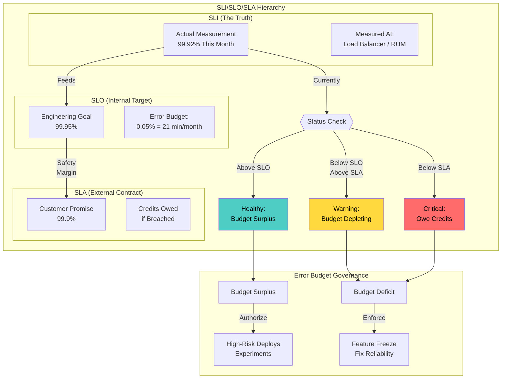
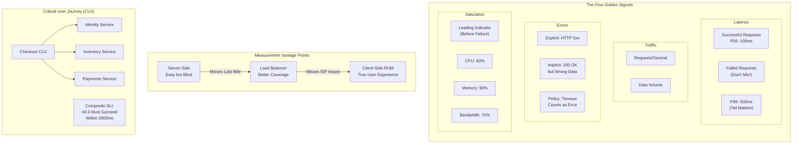
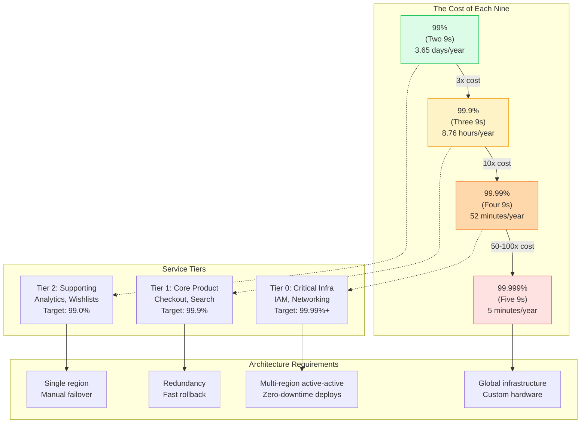
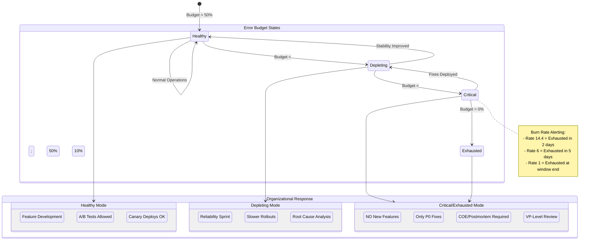

# SLO/SLA/SLI - Precision Matters

This guide covers 5 key areas: I. The Strategic Framework: Why Precision Matters for Principal TPMs, II. Service Level Indicators (SLIs): Measuring the User Journey, III. Service Level Objectives (SLOs): The Internal Target, IV. Service Level Agreements (SLAs): The External Contract, V. Operationalizing Reliability: The Principal TPM Workflow.

## I. The Strategic Framework: Why Precision Matters for Principal TPMs

Precision in reliability engineering is not a semantic exercise; it is the mechanism by which Mag7 companies decouple development velocity from operational chaos. As a Principal TPM, you must shift the organization’s mindset from "reliability is an engineering problem" to "reliability is a product feature with a cost."

At this level, your primary objective is ensuring that the definitions of SLIs, SLOs, and SLAs differ meaningfully to create a **Safety Margin**. If your internal target (SLO) is identical to your external contract (SLA), you have zero operational buffer. This means the moment an alert fires, you are likely already owing customers money or reputational capital.

### 1. The Error Budget as a Governance Mechanism

The most critical strategic shift a Principal TPM drives is the implementation of **Error Budgets**. An Error Budget is 1 minus the SLO. If your SLO is 99.9% availability, your error budget is 0.1% of time (approx. 43 minutes per month).

**Mag7 Real-World Behavior:**
At Google and Meta, the Error Budget is treated as a currency shared between Product and SRE (Site Reliability Engineering).
*   **Surplus Budget:** If a service has 99.95% availability against a 99.9% target, the TPM authorizes "high-risk" activities: accelerating feature flags, performing chaotic load tests, or reducing canary soak times to increase velocity.
*   **Deficit Budget:** If the service drops to 99.8%, the Principal TPM enforces a "Feature Freeze." No new code ships unless it is a fix for reliability. This is not a debate; it is a pre-agreed policy.

**Tradeoffs:**
*   **Strict Enforcement vs. Market Pressure:** Enforcing a freeze when a competitor releases a feature is painful. However, ignoring the freeze leads to "alert fatigue" and eventually a catastrophic outage that causes higher churn than the delayed feature would have.
*   **Innovation vs. Stability:** Consuming the budget allows for experimentation. If a team ends the quarter with 100% availability, a Principal TPM at Amazon might argue the team was too conservative and failed to innovate enough.

**Business Impact:**
*   **ROI:** Prevents "Gold Plating." Engineering teams often strive for 99.999% (5 nines) when the business only needs 99.9%. Achieving 5 nines costs exponentially more in infrastructure and headcount. The Error Budget signals when to *stop* optimizing reliability and shift resources back to feature development.

### 2. Defining Critical User Journeys (CUJs) over System Metrics

A common failure mode is defining SLIs based on system attributes (CPU, RAM) rather than user experience. A Principal TPM focuses on **Critical User Journeys (CUJs)**.

**Mag7 Real-World Behavior:**
*   **Amazon Retail:** They do not strictly measure "Database Uptime." They measure the "Checkout Success Rate." If the reviews service is down, the database is technically failing, but the user can still buy the item. The Checkout CUJ is successful, so the SEV level is lower.
*   **Netflix:** Uses "Stream Start Latency." They care less if the recommendation engine is slow (users just see cached lists) but care deeply if the "Play" button takes more than 5 seconds to start video.

**Tradeoffs:**
*   **Granularity vs. Noise:** Measuring every user interaction creates dashboard noise. The Principal TPM must select the top 3-5 CUJs that directly correlate to revenue or core value proposition.
*   **Tail Latency (P99) vs. Average (P50):** Mag7 companies ignore averages. A P50 latency of 200ms looks good, but if P99 is 10 seconds, your power users (who often have the largest datasets and pay the most) are suffering. Principal TPMs optimize for the P99 or P99.9 to protect the most valuable cohorts.

**Impact on CX:**
Aligning SLIs to CUJs ensures that when an engineer is paged at 3:00 AM, it is because a user cannot perform a critical action, not because a server is doing garbage collection.

### 3. The Strategic Gap: SLA vs. SLO

The distance between the SLO (internal goal) and the SLA (external penalty) is your operational runway.

**The Framework:**
1.  **SLA (The Contract):** 99.9%. If we dip below this, we issue credits. This is determined by Legal and Finance based on competitor analysis.
2.  **SLO (The Target):** 99.95%. We alert here. This gives the team time to react before breaching the SLA.
3.  **SLI (The Truth):** The actual measurement (e.g., 99.92%).

**Mag7 Real-World Behavior:**
At Azure or AWS, Principal TPMs work with Product to ensure SLAs are loose enough to account for "acts of God" (like fiber cuts) but tight enough to be competitive. They ensure SLOs are significantly tighter. If the SLO is breached, it triggers an internal "Corrective of Error" (COE) or Post-Mortem, even if the customer SLA was not violated.

**Tradeoffs:**
*   **Sales vs. Engineering:** Sales wants 99.999% SLAs to close deals. Engineering knows 99.999% requires multi-region active-active architecture which doubles the cost. The Principal TPM mediates this by modeling the cost of the architecture against the potential revenue of the deal.

**Impact on Business Capabilities:**
By maintaining a gap between SLO and SLA, the business avoids financial penalties. If the gap closes (SLO = SLA), the business loses the ability to react to incidents without financial consequence.

### 4. Handling Dependencies and Composite SLOs

In a microservices architecture (common at Mag7), your service depends on five others. If Service A depends on Service B, and Service B has an SLO of 99.9%, Service A *cannot* mathematically have an SLO of 99.99% without complex caching or fallback mechanisms.

**Actionable Guidance:**
*   **The Math:** Availability multiplies. If you depend on three services each at 99.9%, your maximum theoretical availability is $0.999 \times 0.999 \times 0.999 \approx 99.7\%$.
*   **The TPM Role:** You must map the dependency tree. If a downstream dependency has a lower SLO than your product offering, you must force an architectural change (e.g., implement asynchronous processing or aggressive caching) or lower your product's SLO.

## II. Service Level Indicators (SLIs): Measuring the User Journey

### 1. Completing the Golden Signals
Continuing from the Google SRE standard initiated in the context, the Principal TPM must enforce the adoption of the **Four Golden Signals** across product teams. While engineers implement the instrumentation, the TPM ensures the definitions align with business viability.

1.  **Latency:** The time it takes to service a request.
    *   *Nuance:* You must distinguish between the latency of successful requests and failed requests. A 500 error returning in 5ms is fast, but it is not a "good" latency signal.
2.  **Traffic:** A measure of how much demand is being placed on your system (e.g., HTTP requests per second for a web server, or I/O rate for a storage system).
3.  **Errors:** The rate of requests that fail.
    *   *Explicit:* HTTP 500s.
    *   *Implicit:* HTTP 200 OK, but the response body is empty or contains wrong data (semantic errors).
    *   *Policy:* A Principal TPM defines "Policy Errors"—e.g., if a response takes >2 seconds, the load balancer kills it. This must count as an error in the SLI, not just a timeout.
4.  **Saturation:** How "full" your service is.
    *   *Usage:* This is a leading indicator. Latency and Errors are lagging indicators. Saturation tells you that you are *about* to fail.
    *   *Mag7 Example:* At Meta, memory bandwidth saturation on inference fleets is monitored closely. Even if latency is fine now, if memory bandwidth hits 90%, the next small traffic spike will cause a cascading failure.

### 2. Selecting the Measurement Point: The Vantage Point Tradeoff
One of the most critical architectural decisions a Principal TPM influences is *where* the SLI is measured. Different vantage points yield different "truths" about reliability.

#### A. Server-Side (The Backend Logs)
*   **Definition:** Measuring success/latency at the application server or database level.
*   **Pros:** Easiest to implement; high fidelity for debugging code issues.
*   **Cons:** "The Server-Side Illusion." Your server might be returning 200 OKs, but the load balancer is dropping packets, or the ISP is down.
*   **Business Impact:** You may claim 99.99% availability while customers are churning due to outages you cannot see.

#### B. The Load Balancer (L7 / Mesh)
*   **Definition:** Measuring at the ingress point (e.g., AWS ALB, Google Cloud Load Balancing, or Envoy sidecar).
*   **Pros:** Captures request queuing and backend crashes.
*   **Cons:** Still misses the "last mile" (user connectivity).
*   **Mag7 Standard:** This is the default minimum standard for internal microservices (Service-to-Service SLIs).

#### C. Client-Side (RUM - Real User Monitoring)
*   **Definition:** Telemetry sent from the user’s browser or mobile app (e.g., Google Analytics, Crashlytics).
*   **Pros:** The absolute truth of the user experience.
*   **Cons:** extremely noisy. Data is polluted by users’ bad Wi-Fi, old devices, or 3rd party ad-blockers.
*   **Mag7 Example:** **Netflix** and **YouTube** prioritize client-side SLIs (e.g., Rebuffer Ratio). If the server sends video packets perfectly but the user sees a spinning wheel, the service is "down."
*   **Tradeoff:** High storage/ingestion costs for logs. You often must sample this data (e.g., record only 5% of client traces), which risks missing edge-case failures.

### 3. Aggregation Strategy: The Tyranny of Averages
A Principal TPM must ban the use of "Average Latency" in SLI definitions. Averages hide outliers, and in distributed systems, outliers are where the revenue loss happens.

#### The Long Tail (p99 and p99.9)
If you have an "Average Latency" of 100ms, you could have:
*   Scenario A: 100% of requests take 100ms.
*   Scenario B: 90% take 10ms, and 10% take 1000ms.

In Scenario B, 1 in 10 users is frustrated. If a page loads 50 assets (images, scripts), the probability of a user hitting that 1000ms delay approaches 100%.

*   **Mag7 Approach:** Amazon DynamoDB and Google Spanner build SLAs around **p99.9 (99.9th percentile)** latency.
*   **Business Logic:** The requests that take the longest usually belong to your "heaviest" users (those with the most data/largest carts). These are often your VIP customers. Ignoring p99 means ignoring your highest-value users.

### 4. Defining Critical User Journeys (CUJs)
You cannot measure everything. A Principal TPM prioritizes which flows require SLIs. This is an exercise in ROI: *Monitoring costs engineering time; measure only what drives revenue or trust.*

#### The CUJ Framework
1.  **Identify the Persona:** Who is the user? (e.g., E-commerce Shopper vs. Warehouse Picker).
2.  **Identify the Goal:** What are they trying to do? (e.g., "Complete Purchase").
3.  **Map the Architecture:** Which microservices support this? (Identity -> Inventory -> Payments).
4.  **Define the Composite SLI:**

**Example: The "Checkout" CUJ**
Instead of three separate SLIs for Identity, Inventory, and Payments, a Principal TPM defines a composite SLI:
*   *SLI Definition:* The proportion of requests to `/checkout` that result in a successful payment confirmation to the client within 2,000ms.
*   *The Tradeoff:* Composite SLIs are harder to debug. If the metric drops, you don't immediately know *which* sub-service failed.
*   *Mitigation:* Use Composite SLIs for **Executive/Business alerting** (SLOs) and granular, per-service SLIs for **On-Call Engineering paging**.

### 5. Validity and Coverage
An SLI is useless if it does not accurately reflect user pain.

*   **Coverage:** The fraction of total requests captured by the SLI.
    *   *Risk:* If you filter out "bot traffic" from your SLI, but your bot detection logic is flawed, you might be filtering out real users experiencing errors.
*   **Correctness:** Does the SLI correlate with customer support tickets?
    *   *Actionable Guidance:* Perform a "Fire Drill" calibration. Review the last major outage. Did your SLI drop *before* the support tickets spiked? If the support tickets spiked but your dashboard stayed green, your SLI is invalid.

## III. Service Level Objectives (SLOs): The Internal Target

An SLO is not merely a technical threshold; it is the primary governance mechanism a Principal TPM uses to align Engineering, Product, and Business stakeholders. While the SLI measures the user experience, the SLO defines the **acceptable margin of error** before business priorities must shift from innovation to stability.

At Mag7 companies, the SLO is the mathematical translation of "customer happiness." It explicitly acknowledges that failures will happen and sets a budget for them.

### 1. The Error Budget: Operationalizing the SLO
The most critical concept for a Principal TPM to master is the **Error Budget**. The Error Budget is calculated as $100\% - SLO$.
*   If your SLO is 99.9%, your error budget is 0.1% of all requests (or time units) in a given window.
*   **Mag7 Behavior:** At Google and Netflix, the Error Budget is a currency. Product teams "spend" this budget to push risky features or perform experiments. SRE teams monitor the remaining budget.
*   **The Consequence Policy:** An SLO is useless without a pre-agreed consequence. In high-maturity organizations, if the error budget is exhausted, a **Feature Freeze** is automatically triggered. No new code goes to production (except P0 fixes) until the budget recovers.

**Trade-offs:**
*   **Strict Enforcement vs. Agility:** Strictly enforcing freezes protects reliability but can delay critical market-responsive features.
*   **Precision vs. Complexity:** Calculating error budgets based on "good minutes" vs. "request counts" changes the implementation effort. Request-based is more precise for high-throughput APIs; time-based is better for low-traffic batch jobs.

**Business Impact:**
*   **ROI:** Prevents over-engineering. If a team has 50% of their error budget remaining at the end of the quarter, they were *too conservative*. They should have shipped faster or experimented more.
*   **Political Shield:** The TPM uses the Error Budget to depoliticize release decisions. It is not "Product vs. Engineering"; it is "Current Budget Status."

### 2. Defining the Target: The "Nines" and Tiering

Not all services are created equal. A Principal TPM must segment services into Tiers (0, 1, 2, 3) and assign SLOs accordingly.

*   **Tier 0 (Critical Infrastructure):** Identity (IAM), Networking, Block Storage.
    *   **Target:** 99.99% (4 nines) or 99.999% (5 nines).
    *   **Implication:** 5 nines allows for only ~5 minutes of downtime per year. This requires active-active multi-region architecture, automated failover, and zero-downtime deployments.
*   **Tier 1 (Core Product):** Checkout flow, Video Playback, Search Results.
    *   **Target:** 99.9% (3 nines).
    *   **Implication:** Allows ~43 minutes of downtime per month. This allows for standard redundancy and fast rollbacks.
*   **Tier 2/3 (Internal/Non-Critical):** Analytics dashboards, Wishlists, Recommendations.
    *   **Target:** 99.0% or 99.5%.
    *   **Implication:** Allows for extended maintenance windows and single-region architectures.

**Mag7 Example (AWS):** AWS distinguishes between the **Data Plane** (the running instance) and the **Control Plane** (the API to launch the instance). The Data Plane has a much stricter SLO than the Control Plane. If the API is down, you cannot launch new servers, but existing servers must keep running.

**Trade-offs:**
*   **Cost vs. Reliability:** Moving from 3 nines to 4 nines typically results in a **10x cost increase** (engineering effort + infrastructure redundancy). A Principal TPM must challenge Product: "Is the extra 0.09% worth \$2M in engineering time?"

### 3. The Dependency Problem: Math vs. Reality
A common failure mode in design reviews occurs when a service targets 99.99% availability but depends on a service with 99.9% availability.
**The Math:** Availability is multiplicative in series.
$$Availability_{Total} = Availability_A \times Availability_B$$
If Service A (99.99%) calls Service B (99.9%) synchronously, the maximum theoretical availability of Service A is 99.9%.

**Principal TPM Action:**
You cannot simply "demand" higher SLOs from dependencies. You must architect around them using:
1.  **Graceful Degradation:** If the Recommendations engine (99.5%) is down, the Homepage (99.99%) should not crash; it should show cached or generic content.
2.  **Asynchronous Processing:** Use queues (SQS/Kafka) to decouple availability.
3.  **Caching:** reducing the hit rate on the less reliable dependency.

**Impact on Capabilities:**
Identifying these mismatches early prevents "SLO inversion," where a platform promises more than its underlying infrastructure can deliver—a leading cause of SLA breaches and financial penalties.

### 4. Measurement Windows and Burn Rates
An SLO must have a defined time window.
*   **Rolling Window (e.g., 28 days):** The standard at Mag7. It prevents "gaming" the system at the end of the month.
*   **Calendar Window (e.g., Monthly):** Easier for billing/SLA alignment but bad for engineering behavior.

**Alerting on SLOs (Burn Rates):**
Junior teams alert when the error rate > 0. Principal TPMs advocate for **Burn Rate Alerting**.
*   **Burn Rate 1:** You are consuming the budget at a rate that will exhaust it exactly at the end of the window.
*   **Burn Rate 14.4:** You will exhaust the 30-day budget in 2 days. (Critical PagerDuty alert).
*   **Burn Rate 1:** You will exhaust the budget in 30 days. (Jira Ticket, review next sprint).

**Trade-offs:**
*   **Signal vs. Noise:** Burn rate alerting drastically reduces pager fatigue (noise) but requires complex monitoring setup (Prometheus/Datadog configurations).
*   **Reaction Time:** High burn rate alerts catch issues fast, but low burn rates (slow leaks) can sometimes go unnoticed until a significant portion of the budget is gone.

### 5. Intentional Downtime (Chaos Engineering)
At the highest level of maturity (e.g., Google's "Chubby" lock service), if a service is consistently over-performing its SLO (e.g., running at 100% when the target is 99.9%), the team may intentionally induce failure or downtime to burn the budget.

**Why?**
1.  **Hyrum's Law:** If an API offers 100% uptime, users will build systems that *rely* on 100% uptime. When a legitimate failure finally occurs, the downstream impact will be catastrophic because no one built retries or fallbacks.
2.  **Validating Assumptions:** It proves that the failover mechanisms actually work.

**Impact on CX:**
Short-term pain (intentional failure) for long-term resilience. It forces client teams to handle errors gracefully.

## IV. Service Level Agreements (SLAs): The External Contract

While Service Level Objectives (SLOs) are internal engineering targets to maintain velocity, the Service Level Agreement (SLA) is a mechanism for **financial risk transfer**. For a Principal TPM, the SLA is not merely a metric to track; it is a constraint that dictates architectural cost, operational headcount, and the legal liability of the company.

At the Mag7 level, an SLA is rarely a promise of "happiness"; it is a strictly defined contract that answers: *At what point is the pain significant enough that we owe the customer money?*

### 1. The Safety Margin: Decoupling SLOs from SLAs

The cardinal sin in reliability management is equating your internal goal (SLO) with your external promise (SLA). If your SLO is 99.9% and you set your SLA at 99.9%, you have zero margin for error. Any violation of your internal standard immediately results in financial penalties.

**Mag7 Behavior:**
At Google Cloud and AWS, there is always a calculated "Safety Margin" between the SLO and the SLA.
*   **SLO (Internal):** 99.95% (We aim to fail no more than 21 minutes/month).
*   **SLA (External):** 99.9% (We pay you if we fail more than 43 minutes/month).

**Strategic Trade-offs:**
*   **Tight SLA (Small Margin):**
    *   *Pros:* Competitive advantage in Sales; signals high confidence.
    *   *Cons:* High risk of payout; forces engineering to adopt expensive redundancy (e.g., multi-region active-active) earlier than necessary; high on-call burnout.
*   **Loose SLA (Large Margin):**
    *   *Pros:* Protects revenue; allows for "gray failures" without financial penalty.
    *   *Cons:* Enterprise customers (e.g., banks, healthcare) may reject the contract or demand custom terms; erodes trust if actual performance consistently hugs the baseline.

**Principal TPM Action:**
When Product or Sales pushes for a "Four Nines" (99.99%) SLA to close a deal, you must enforce the **Error Budget Policy**. If the SLA is 99.99%, the internal SLO must be roughly 99.995%. You must quantify the engineering cost (headcount + infrastructure) required to hit that tighter SLO and present it against the projected revenue of the deal.

### 2. Composite SLAs: The Dependency Trap

A common failure mode for Principal TPMs managing platform products is ignoring the mathematical reality of dependencies. If your service relies on three downstream dependencies, your maximum theoretical availability is the product of their availabilities.

**The Math:**
If Service A (your service) depends on Service B (Storage) and Service C (Auth), and both B and C have SLAs of 99.9%:
$$Availability = 99.9\% \times 99.9\% = 99.8\%$$

If you promise a 99.9% SLA to your customer, you are mathematically destined to breach your contract unless you architect around these dependencies.

**Mag7 Real-World Example:**
Microsoft Azure defines strict rules for "Composite SLAs." If an application uses Azure SQL (99.99%) and App Service (99.95%), the composite SLA is 99.94%. A Principal TPM at Microsoft would block a feature launch if the PRD claims a 99.99% availability for this bundle, as it is statistically unsupportable.

**Architectural Mitigations (Trade-offs):**
1.  **Soft Dependencies:** Ensure the service can degrade gracefully if a dependency fails (e.g., serving stale data from cache if the live database is down). This decouples your SLA from the dependency's SLA.
2.  **Asynchronous Processing:** Move from synchronous REST calls to message queues (SQS/Kafka). If the consumer is down, the SLA isn't breached immediately; the system just experiences "latency" rather than "unavailability."

### 3. Defining "Downtime": The Fine Print

The definition of "Downtime" is the most negotiated aspect of an SLA. It is not simply "the server is down." It is a specific set of criteria that must be met to trigger a payout.

**Key Clauses & Trade-offs:**
*   **The Error Rate Threshold:**
    *   *Definition:* "Downtime is defined as a period of 5 consecutive minutes where error rates exceed 5%."
    *   *Impact:* If your service is down for 4 minutes and 59 seconds, or if 4.9% of requests fail, you have not breached the SLA. This protects the business from transient blips (network jitter).
*   **Scheduled Maintenance Exclusions:**
    *   *Definition:* Downtime does not count if it was announced 5 days in advance.
    *   *Impact:* This is the primary tool used to manage major upgrades without incurring penalties. However, overuse erodes Customer Experience (CX).
*   **Client-Side vs. Server-Side Measurement:**
    *   *Definition:* SLAs are almost always measured at the *server boundary*.
    *   *Impact:* If the customer's ISP is down, or the internet backbone is congested, your server logs show "healthy." Therefore, no SLA breach. Principal TPMs must push back against clients demanding "client-side" SLA measurements, as you cannot be held liable for the public internet.

### 4. The Payout Structure: Service Credits vs. Cash

At the Mag7 level, SLAs rarely result in cash refunds. They result in **Service Credits**.

**Business Logic:**
*   **Retention:** Service credits force the customer to stay on the platform to redeem the value.
*   **Capped Liability:** Payouts are usually capped (e.g., max 30% of monthly bill). Even if the service is down for a week, the company does not refund 100% of the revenue.

**ROI Analysis for TPMs:**
Sometimes, the cost of engineering reliability exceeds the cost of the SLA penalty.
*   *Scenario:* Achieving 99.999% requires a global active-active architecture costing $2M/year in infrastructure.
*   *Risk:* Violating the SLA costs $100k/year in service credits.
*   *Decision:* A Principal TPM might recommend *accepting the risk* of the SLA breach (staying at 99.99%) rather than over-engineering, provided the reputational damage is manageable.

### 5. Edge Cases and Gray Failures

The most dangerous territory for an SLA is the "Gray Failure"—where the service is technically up (returning 200 OK), but functionally useless (e.g., high latency or empty responses).

*   **Latency SLAs:** Most standard SLAs cover Availability (Error Rate). Few cover Latency, because latency is subjective to payload size and client network.
    *   *Guidance:* Avoid Latency SLAs unless you control the hardware (e.g., private fiber). If forced, define the test payload rigorously (e.g., "1KB object fetch within same region").
*   **Regional Isolation:**
    *   *Mag7 Context:* AWS SLAs are often Region-specific. If `us-east-1` goes down, AWS owes credits for that region, but not for `us-west-2`.
    *   *Impact:* This forces customers to architect for multi-region redundancy if they want higher availability, effectively upselling them on infrastructure to mitigate *your* reliability risk.

## V. Operationalizing Reliability: The Principal TPM Workflow

Operationalizing reliability transitions SLIs and SLOs from theoretical mathematics into an organizational governance model. For a Principal TPM, this phase is about establishing the **feedback loops** that determine when Engineering must stop building new features to fix technical debt.

At a Mag7 level, you are not responsible for configuring Prometheus alerts; you are responsible for the **Error Budget Policy** and the **Decision Velocity** regarding reliability. You must answer the question: *What exactly happens when we burn through our budget?*

### 1. The Error Budget Policy: From Metric to Mandate

The most common failure mode in reliability programs is having a dashboard that turns red while the roadmap remains unchanged. An Error Budget Policy is a pre-agreed contract between Product and Engineering, facilitated by the TPM, that dictates behavior based on budget consumption.

**Mag7 Implementation:**
At Google and Meta, this is often formalized through "Code Yellow" or "Code Red" states.
*   **Healthy Budget:** Product prioritizes feature velocity. Experiments run freely.
*   **Depleting Budget (Fast Burn):** SREs are paged. The TPM facilitates a "reliability sprint" where non-critical features are paused.
*   **Exhausted Budget:** A hard freeze is instituted. No new features launch until the budget recovers (usually a rolling 28-day window). At Amazon, this often triggers a COE (Correction of Error) review with leadership, requiring a "path to green" before the freeze is lifted.

**Tradeoffs:**
*   **Strict Enforcement vs. Market Opportunity:** Enforcing a freeze during a critical holiday launch (e.g., Prime Day) protects the user experience but may sacrifice short-term revenue. The Principal TPM must adjudicate: is the reliability risk greater than the revenue loss?
*   **False Positives:** If the SLO is too tight, you trigger freezes unnecessarily, demoralizing the engineering team and stalling the business.

**Business Impact:**
A defined policy removes emotional negotiation during a crisis. It shifts the conversation from "Can we squeeze this feature in?" to "The math says we cannot launch." This protects long-term ROI by preventing churn caused by platform instability.

### 2. Burn Rate Alerting: Managing the Slope, Not the Level

Junior TPMs react when the SLO is breached (100% exhaustion). Principal TPMs manage **Burn Rates**. You need to know if you are consuming the error budget fast enough to exhaust it before the window closes.

**The Math of Burn Rates:**
*   **Burn Rate 1:** You are consuming budget at a rate that will exhaust it exactly at the end of the window (usually 30 days).
*   **Burn Rate 14.4:** You are consuming budget fast enough to exhaust it in 2 days (often critical alert level).
*   **Burn Rate 6:** You will exhaust it in 5 days (ticket to engineering backlog).

**Mag7 Real-World Behavior:**
Google SRE teams alert on Burn Rate, not just instantaneous errors. If a service throws 500s for 2 minutes but stops, and the burn rate is low, no pager goes off. If a specific 0.1% of requests fail consistently (slow burn), it creates a Jira ticket for the next sprint rather than waking an engineer at 3 AM.

**Principal TPM Action:**
You must configure the *response* to these burn rates.
*   **High Burn:** Immediate Incident Command mobilization.
*   **Low Burn:** Prioritize reliability stories in the next Sprint Planning.

**Tradeoffs:**
*   **Alert Fatigue vs. Detection Time:** High sensitivity catches issues early but burns out on-call engineers. Low sensitivity preserves engineer sleep but risks extended user pain. The TPM monitors "On-Call Health" metrics to balance this.

### 3. Dependency Alignment: The Mathematics of Availability

Your service’s reliability is mathematically capped by the reliability of your critical dependencies. If your service requires Service A (99.9%), Service B (99.9%), and Database C (99.99%) to all work synchronously to complete a Critical User Journey (CUJ), your maximum theoretical availability is roughly 99.79%.

**Mag7 Implementation:**
*   **Amazon (Decoupling):** Amazon enforces strict timeouts and fallback strategies. If a dependency fails, the service must degrade gracefully (e.g., show cached recommendations instead of live ones) rather than fail the request.
*   **Microsoft (Azure):** Principal TPMs map the "Dependency Graph." If a Tier-1 service depends on a Tier-2 service, the TPM must either force the Tier-2 service to upgrade its SLO (expensive) or re-architect the Tier-1 service to be asynchronous (complex).

**Tradeoffs:**
*   **Consistency vs. Availability:** To improve reliability despite weak dependencies, you might implement caching. This increases availability but introduces data staleness (Consistency tradeoff).
*   **Cost vs. Complexity:** Removing a dependency often requires duplicating data or building complex retry logic.

**Impact on Capabilities:**
The Principal TPM identifies "Architectural Risk." If a Core Product (SLO 99.99%) takes a dependency on a new Experimentation Platform (SLO 99.5%), the Core Product effectively downgrades to 99.5%. The TPM must block this architecture or mandate a fallback mechanism.

### 4. The Operational Review (WBR/MBR)

The mechanism for accountability is the Weekly/Monthly Business Review (WBR/MBR). This is not a status update; it is a metrics interrogation.

**Mag7 Workflow:**
*   **The Metric:** "P99 Latency."
*   **The Variance:** "Why did P99 jump to 600ms on Tuesday?"
*   **The Explanation:** "We deployed v2.1."
*   **The Action:** "Rollback or Fix Forward? What is the specific ticket number?"

**Watermelon Metrics:**
A key responsibility is identifying "Watermelon Metrics" (Green on the outside, Red on the inside).
*   *Example:* An API reports 99.99% availability (Green). However, the "Search" function returns zero results for 5% of queries due to a backend disconnect. The HTTP status is 200 OK, but the *Customer Experience* is failed.
*   *Principal TPM Action:* Redefine the SLI from "HTTP 200 OK" to "Result Set > 0".

**Impact:**
Effective WBRs drive a culture of precision. They prevent "drift," where reliability slowly degrades over quarters because no single incident was large enough to cause alarm.

---

## Interview Questions

### I. The Strategic Framework: Why Precision Matters for Principal TPMs

### Question 1: The Error Budget Conflict
**Question:** "You are the Principal TPM for a high-profile launch scheduled for next week. The engineering team has exhausted their Error Budget for the quarter due to instability in the staging environment, but the outages haven't affected real users yet. The VP of Product insists on launching to hit a market window. How do you handle this?"

**Guidance for a Strong Answer:**
*   **Acknowledge the Framework:** Validate that the Error Budget policy exists to prevent burnout and protect users, not to be bureaucratic.
*   **Analyze the Risk:** Differentiate between "staging instability" and "production risk." If the budget burn was due to testing (which is good), clarify if the root causes are fixed.
*   **Strategic Tradeoff:** Propose a "Launch with Guardrails." This might involve a slower rollout (canary deployment to 1% -> 5% -> 10%) or launching with a "Silver" SLA tier initially.
*   **Governance:** State clearly that if the risk is existential to the platform, you would recommend a delay, but provide data (e.g., "Launching now has a 40% probability of causing a Sev-1 outage") to let the VP make an informed business decision, rather than an emotional one.

### Question 2: Defining Metrics for Ambiguity
**Question:** "We are building a new Generative AI feature for our cloud platform. It is non-deterministic and latency can vary wildly from 2 seconds to 30 seconds. How do you define the SLIs and SLOs for this?"

**Guidance for a Strong Answer:**
*   **Reject Standard Metrics:** Acknowledge that standard "Success/Fail" or "200ms Latency" metrics don't work for GenAI.
*   **User-Centric SLIs:** Propose metrics like "Time to First Token" (perceived latency) vs. "Total Completion Time."
*   **Bucketed SLOs:** Suggest tiered SLOs based on request complexity (e.g., "Simple prompts < 5s", "Complex prompts < 30s").
*   **Quality as an SLI:** Introduce the concept of "Bad Response Rate" (e.g., user thumbs down or regenerates immediately) as a quality SLI, which is unique to AI products.

### II. Service Level Indicators (SLIs): Measuring the User Journey

### Question 1: The "Green Dashboard" Paradox
**Scenario:** You are the Principal TPM for a cloud storage service. Your engineering dashboard shows 100% availability and low latency for the last 4 hours. However, Twitter is trending with users complaining they cannot access their files. Customer Support is flooded.
1.  What is likely happening technically?
2.  How do you manage the immediate incident?
3.  How do you fix the SLI strategy long-term?

**Guidance for a Strong Answer:**
*   **Technical Diagnosis:** The candidate should identify a **Vantage Point Failure**. The SLIs are likely server-side (measuring the backend health), but the failure is at the edge (DNS, CDN, ISP, or a specific ISP route). Alternatively, the SLI is measuring "uptime" (ping checks) but not "correctness" (Can I actually read the file? Maybe permissions are broken).
*   **Immediate Action:** Acknowledge the outage immediately despite the green dashboard (trust the customer signal over the tool). Declare an incident.
*   **Strategic Fix:** Propose implementing **Synthetic Monitoring** (Probes) that simulate user behavior from external networks, or implementing Client-Side/RUM telemetry to bridge the gap between server logs and user reality.

### Question 2: Defining SLIs for a Non-Deterministic AI Feature
**Scenario:** You are launching a Generative AI feature (like a text summarizer) for an enterprise productivity suite. The engineering team wants to set an SLI on "Latency < 500ms" and "Availability (200 OK)." Why might these be insufficient, and what SLIs would you propose instead?

**Guidance for a Strong Answer:**
*   **Critique:** GenAI is computationally heavy; 500ms might be unrealistic or encourage lower-quality model outputs to meet speed targets. "200 OK" is insufficient because the model could return hallucinated garbage or empty strings and still be an HTTP 200.
*   **Proposed SLIs:**
    *   *Quality/Utility SLI:* Use a "Thumb up/down" ratio or "Copy to clipboard" rate as a proxy for successful generation (Implicit feedback).
    *   *Streaming Latency:* Instead of total time, measure **Time to First Token (TTFT)**. Users will wait 3 seconds for a summary if the text starts appearing in 200ms.
    *   *Fallibility:* Track "Safety Violations" or "refusals to answer" as a specific error category, distinct from system crashes.

### III. Service Level Objectives (SLOs): The Internal Target

**Question 1: The Dependency Mismatch**
"You are the TPM for a new Tier-1 payment service targeting 99.99% availability. However, your engineering lead informs you that the legacy fraud detection service you must call synchronously only has an SLO of 99.9%. The fraud team refuses to commit to a higher SLO due to technical debt. How do you proceed?"

*   **Guidance for a Strong Answer:**
    *   **Acknowledge the math:** Immediately state that a synchronous call makes 99.99% impossible.
    *   **Reject the 'Force' approach:** Do not suggest escalating to management to force the fraud team to improve; that takes too long and may fail.
    *   **Propose Architectural solutions:**
        *   *Fail Open vs. Fail Closed:* Can we process low-risk payments if fraud is down? (Business risk decision).
        *   *Async:* Can we authorize the payment and check fraud post-transaction?
        *   *Cache:* Can we cache safe user states?
    *   **Adjust expectations:** If architectural changes aren't possible, the TPM must formally revise the Payment Service SLO down to 99.9% and document the risk acceptance with leadership.

**Question 2: The Feature Freeze Conflict**
"Your product team has exhausted its error budget for the quarter due to a major incident last month. There is a high-profile feature promised to the VP of Sales for launch next week. The fix for the incident is deployed, and the system has been stable for two weeks, but the math says the budget is still empty. What is your recommendation?"

*   **Guidance for a Strong Answer:**
    *   **Respect the Governance:** Acknowledge that overriding the policy destroys the credibility of the Error Budget model.
    *   **Analyze the "Why":** Why is the budget empty? If the system is currently stable, the "burn" has stopped, but the *rolling window* still contains the bad data.
    *   **The Exception Path (Silver Bullet):** Propose a "Silver Bullet" or "Launch Committee" exception. The VP can authorize the launch, *but* they must sign off on the risk. If the launch causes an outage, the penalty is severe (e.g., absolute code freeze for a month).
    *   **Strategic Pivot:** Use this as leverage to negotiate more headcount for reliability engineering (SRE) in the next planning cycle. The friction is a data point for resource allocation.

### IV. Service Level Agreements (SLAs): The External Contract

### Question 1: The Sales vs. Engineering Standoff
**"Our Enterprise Sales team is trying to close a massive deal with a bank. The bank demands a 99.99% availability SLA. Your current engineering architecture historically delivers 99.95% (approx. 21 mins downtime/month). The Sales VP says the deal is worth $50M and we should just sign it and 'figure it out later.' As the Principal TPM for the platform, how do you handle this?"**

**Guidance for a Strong Answer:**
*   **Quantify the Gap:** Immediately identify that the gap between 99.95% and 99.99% is not linear; it is exponential. It requires reducing downtime from ~21 mins to ~4 mins per month.
*   **Risk vs. Cost Analysis:** Calculate the potential penalty. If the penalty is capped at 10% of the bill, and the upgrade costs $5M, it might be cheaper to sign and pay. However, acknowledge **Reputational Risk**—banks don't just want credits; they want stability. Failing them could kill future enterprise deals.
*   **The "Safety Margin" Strategy:** Propose a counter-offer. Can we offer 99.99% only on "Read" operations (easier to cache) and 99.9% on "Write" operations?
*   **Process:** Do not say "I would tell engineering to work harder." Instead, "I would initiate an architectural review to identify the single points of failure preventing 99.99%, cost the remediation, and present the P&L impact to leadership."

### Question 2: The Dependency Breach
**"You own a service that has an external SLA of 99.9%. A downstream dependency (managed by another team) just deployed a bad config, causing their service to fail for 2 hours. This caused your service to breach its SLA. Your customers are demanding credits. The downstream team refuses to pay for your credits because their internal SLO is looser than yours. How do you resolve this and prevent recurrence?"**

**Guidance for a Strong Answer:**
*   **Immediate Resolution:** Acknowledge that to the external customer, your service is the face of the failure. You must honor the SLA credits. Internal chargebacks are secondary to customer trust.
*   **Root Cause - Governance:** Identify the governance failure. You cannot offer a 99.9% SLA if you depend on a service with a looser SLO (e.g., 99.5%) without architectural mitigation.
*   **Technical Mitigation:** Propose decoupling strategies. Why did a downstream failure take you down? Where was the caching? Where was the circuit breaker?
*   **Policy Change:** Establish a "Composite SLA" policy where no product can launch with an external SLA tighter than its weakest critical dependency.

### V. Operationalizing Reliability: The Principal TPM Workflow

### Question 1: The dependency conflict
"You own a Tier-1 Identity service with an SLO of 99.99%. A Product team wants to launch a new feature that relies on a third-party vendor API which only guarantees 99.5% availability. The Product VP argues this feature is critical for Q4 revenue. How do you handle this conflict?"

**Guidance for a Strong Answer:**
*   **Acknowledge the Math:** State clearly that a synchronous dependency on 99.5% mathematically drags the Tier-1 service down to 99.5%, violating the contract with other internal consumers.
*   **Reject Binary Thinking:** Do not simply say "No." Propose architectural mitigation. Can the call be asynchronous? Can we cache the vendor data? Can we fail open (allow access if vendor is down)?
*   **Risk Acceptance:** If no mitigation is possible, the TPM must facilitate a "Risk Acceptance" document signed by the VP, explicitly acknowledging that the Identity service (and everything depending on it) will degrade.
*   **Strategic alignment:** Frame the decision in terms of error budget. "If we do this, we will exhaust our error budget in 2 days of vendor outage. Are we willing to freeze all other Identity features when that happens?"

### Question 2: The "Death by 1,000 Cuts"
"Your service consistently meets its 99.9% availability SLO, yet customer support tickets regarding 'slowness' and 'errors' are increasing 20% month-over-month. Engineering leadership points to the green dashboard and says the system is fine. What do you do?"

**Guidance for a Strong Answer:**
*   **Challenge the SLI:** The metric is wrong. The dashboard is measuring something that doesn't correlate with user pain (e.g., server-side availability vs. client-side success rate).
*   **Investigate the "Long Tail":** P99 might be fine, but P99.9 might be 10 seconds. Or, the errors are concentrated in a specific cohort (e.g., Android users in India) which is diluted in the global average.
*   **Action Plan:** Propose an audit of the Critical User Journeys (CUJs). Implement "Synthetics" (probes that mimic user behavior) to capture the real experience.
*   **Cultural Pivot:** Shift the narrative from "System Health" to "Customer Health." Use specific customer ticket examples to drive the point home in the WBR.

---

## Key Takeaways

- Review each section for actionable insights applicable to your organization

- Consider the trade-offs discussed when making architectural decisions

- Use the operational considerations as a checklist for production readiness
