# SOC 2 - Trust Framework

This guide covers 6 key areas: I. Executive Summary: SOC 2 at Mag7 Scale, II. The Five Trust Services Criteria (TSC) & Scoping Strategy, III. Type 1 vs. Type 2: The Execution Lifecycle, IV. Technical Deep Dive: Compliance as Code, V. Tradeoffs and Business Impact Analysis, VI. Summary of Capabilities for the Interview.

## I. Executive Summary: SOC 2 at Mag7 Scale

The Security criterion is the **only mandatory component** of a SOC 2 audit. It serves as the foundation (often referred to as the "Common Criteria") and validates that the system is protected against unauthorized access, use, or modification.

**Technical Deep-Dive:**
At the Principal level, "Security" is not about installing antivirus software; it is about **Identity and Access Management (IAM)** and **Zero Trust Architecture**. The auditor will look for evidence of "Defense in Depth."

*   **Logical Access:** Implementation of Role-Based Access Control (RBAC) and Least Privilege.
    *   *Mag7 Example:* Google uses **BeyondCorp** (Zero Trust). There is no "corporate VPN" that grants broad access. Every request to an internal tool is authenticated based on the user identity, device health, and context.
*   **Change Management:** Proof that code does not go to production without peer review and passing CI/CD gates.
    *   *Mag7 Example:* Amazon’s "Pipelines" enforce a blockade. If a developer attempts to push code that bypasses the standard build pipeline (which includes SAST/DAST scans), the deployment is automatically rejected.
*   **System Operations:** Incident response and anomaly detection.

**Tradeoffs:**
*   **Granularity vs. Velocity:** Implementing fine-grained IAM policies (e.g., resource-level permissions) increases security but can slow down developers who need to request new permissions for every new microservice interaction.
*   **Buy vs. Build:** Using a vendor for Identity (Okta/Auth0) vs. building internal auth. Mag7 usually builds (due to scale/cost), but acquiring companies must integrate rapidly.

**Impact:**
*   **ROI:** Prevents data breaches that cost millions in reputational damage.
*   **Skill:** Requires TPMs to understand OIDC, SAML, and infrastructure-as-code (Terraform/CloudFormation) to prove controls exist in code, not just policy docs.

### 2. Availability - **Operational Resilience**

This criterion addresses whether the system is available for operation and use as committed or agreed. It is highly recommended for SaaS platforms where downtime equates to SLA payouts.

**Technical Deep-Dive:**
This criteria validates your Disaster Recovery (DR) and Business Continuity Plans (BCP). It is not just "is the site up?"; it is "do you have a plan if `us-east-1` goes down?"

*   **Performance Monitoring:** Evidence of threshold-based alerting.
*   **Data Backups & Replication:** RPO (Recovery Point Objective) and RTO (Recovery Time Objective) validation.

**Real-World Mag7 Behavior:**
*   **Chaos Engineering:** Netflix (and now most Mag7) does not wait for an auditor to ask about availability. They use tools like Chaos Monkey to intentionally kill services in production to prove the system self-heals. The SOC 2 evidence is the *log* of these automated resilience tests.
*   **Cell-Based Architecture:** AWS limits blast radius by compartmentalizing services into "cells." If a cell fails, only a percentage of customers are impacted.

**Tradeoffs:**
*   **Cost vs. Compliance:** Achieving "active-active" multi-region availability to satisfy a high-bar Availability control doubles infrastructure costs. A Principal TPM must decide if the customer contract warrants this level of redundancy.

### 3. Confidentiality - **Data Secrecy**

Confidentiality addresses the protection of data designated as "confidential" from the time it is committed to the system until it is destroyed. This is critical for B2B SaaS handling trade secrets or intellectual property.

**Technical Deep-Dive:**
Do not confuse Confidentiality with Privacy. Confidentiality protects *data* (often corporate data); Privacy protects *people*.

*   **Encryption at Rest & In Transit:** TLS 1.2+ everywhere; AES-256 for storage.
*   **Key Management:** Who holds the keys?
    *   *Mag7 Example:* Azure Key Vault or AWS KMS integration. The "Gold Standard" is **Customer Managed Keys (CMK)**, where the cloud provider cannot decrypt the customer's data without the customer's specific KMS key, which the customer can revoke.
*   **Data Deletion:** Secure disposal of data upon contract termination.

**Impact:**
*   **Business Capability:** unlocks "Enterprise Tier" pricing. Large enterprises (e.g., banks) often require CMK support to sign a contract.

### 4. Processing Integrity - **The "Fintech" Control**

This criterion ensures system processing is complete, valid, accurate, timely, and authorized.

**Scoping Strategy:**
**Avoid this unless necessary.** Most generalist SaaS products do not need Processing Integrity. It is specifically for systems where data accuracy is the *product* (e.g., payment gateways, payroll processing, healthcare records).

**Technical Deep-Dive:**
*   **Input Validation:** Ensuring data types are correct at ingestion.
*   **Error Handling:** How the system handles failed transactions.
*   **Reconciliation:** Automated jobs that compare inputs vs. outputs.

**Real-World Mag7 Example:**
*   **Google Ads Billing:** The system that calculates how much an advertiser owes must have Processing Integrity. They use **Spanner** (globally distributed database with external consistency) to ensure that a click is counted exactly once, even if a data center fails during the write operation.

**Tradeoffs:**
*   **Latency vs. Accuracy:** Enforcing strict ACID transactions (required for high processing integrity) across distributed systems introduces latency.

### 5. Privacy - **PII and The Human Element**

Privacy addresses the collection, use, retention, disclosure, and disposal of personal information (PII) in conformity with the organization’s privacy notice and GAPP (Generally Accepted Privacy Principles).

**Scoping Strategy:**
Include this only if you are B2C or handle sensitive PII (Health, SSN). If you are a B2B infrastructure tool that processes logs, you might claim you are a "Data Processor" not a "Data Controller" and rely on Confidentiality instead.

**Technical Deep-Dive:**
*   **Consent Management:** Tracking user opt-ins/opt-outs.
*   **Right to be Forgotten (RTBF):** Technical pipelines that can locate and purge a specific user's data across 500 microservices within 30 days.

**Real-World Mag7 Behavior:**
*   **Meta (Facebook):** Due to scrutiny, Meta has massive internal engineering teams dedicated to "Privacy Engineering." They build internal tools that statically analyze code to detect if PII is being logged to non-secure destinations (like standard debug logs).

**Impact:**
*   **Risk:** Including Privacy in your scope opens you up to intense scrutiny regarding GDPR/CCPA. If you fail a Privacy control in a SOC 2 report, it is a red flag to every potential customer.

### 6. Strategic Scoping for the Principal TPM

The most common failure mode for TPMs leading SOC 2 is **Scope Creep**.

**The "Crawl, Walk, Run" Approach:**
1.  **Year 1 (The MVP):** Scope **Security** only. Get the Type 1 (point in time) and then Type 2 (period of time). This unblocks 80% of sales deals.
2.  **Year 2:** Add **Availability** and **Confidentiality**. This satisfies Enterprise procurement teams.
3.  **Year 3+:** Add **Privacy** or **Processing Integrity** only if specific product lines demand it.

**Tradeoff Analysis: The "Carve-Out" Method**
At Mag7, you rarely audit the *entire* company at once. You audit specific services (e.g., "AWS EC2 SOC 2 Report").
*   *Strategy:* If you are launching a new beta product, **carve it out** (exclude it) from the current audit cycle.
*   *Benefit:* Allows the beta product to iterate fast without compliance overhead.
*   *Risk:* You cannot sell the beta product to regulated customers until it is brought into scope.

**Business ROI Summary:**
*   **Sales Velocity:** Reduces "Security Questionnaire" turnaround time from weeks to days (send the report instead of answering 300 questions).
*   **Customer Trust:** In a shared responsibility model, the SOC 2 report is the primary artifact validating the provider's side of the contract.

---

## II. The Five Trust Services Criteria (TSC) & Scoping Strategy

### 1. Security (Common Criteria) - Mandatory

This is the baseline requirement for every SOC 2 report. It is not optional. It refers to the protection of system resources against unauthorized access.

*   **Core Focus:** Access controls (IAM), firewalls, intrusion detection, multi-factor authentication (MFA), and vulnerability management.
*   **Mag7 Behavior:**
    *   **Zero Trust Architecture:** At Google (BeyondCorp) or Microsoft, the perimeter is no longer the firewall; it is the identity. Security controls are enforced at the application layer via Identity-Aware Proxies (IAP).
    *   **Automated Remediation:** If a developer at Amazon opens a security group to `0.0.0.0/0` on port 22, an automated lambda function detects it via CloudTrail/Config and shuts it down within seconds, logging the event as a remediated exception.
*   **Tradeoffs:**
    *   *Strictness vs. Velocity:* Implementing rigid "least privilege" access can slow down debugging for engineers during an incident. Mag7 solves this with "Break Glass" mechanisms—temporary, elevated access that is heavily audited.
*   **Business Impact:** Without the Security criteria, there is no SOC 2. It is the table stakes for B2B commerce.

### 2. Availability

This criterion addresses whether the system is available for operation and use as committed or agreed. It does *not* measure system performance (speed), but rather system uptime and recoverability.

*   **Core Focus:** Disaster Recovery (DR), Business Continuity Planning (BCP), Incident Response, and backup integrity.
*   **Mag7 Behavior:**
    *   **Availability vs. SLA:** A Principal TPM must distinguish between the *SLA* (a contractual promise) and the *Availability Criterion* (the controls ensuring you can meet that promise).
    *   **Cell-Based Architecture:** AWS and Azure utilize cell-based architectures to contain blast radii. The audit evidence here isn't just "we have backups," but "we perform automated failover testing to a secondary region (Chaos Engineering)."
*   **Strategic Scoping Decision:**
    *   *Include if:* Your product is mission-critical to the client (e.g., a database, an authentication service like Okta/Auth0).
    *   *Exclude if:* Your product is non-critical or offline (e.g., a reporting tool that runs nightly).
*   **Tradeoffs:**
    *   *Cost vs. Compliance:* Including Availability requires evidence of redundancy. If your architecture is single-region, including this criterion forces an expensive re-architecture to multi-region active-passive or active-active setups.

### 3. Confidentiality

Confidentiality addresses the protection of data designated as confidential from the time it is committed to the system until it is disposed of. This is primarily focused on B2B data (trade secrets, intellectual property).

*   **Core Focus:** Encryption (at rest and in transit), data classification, and deletion procedures.
*   **Mag7 Behavior:**
    *   **Envelope Encryption:** Mag7 companies use hierarchical key management (e.g., AWS KMS). The data is encrypted with a Data Key, and the Data Key is encrypted with a Root Key. The audit trail focuses on the *access to the Root Key*.
    *   **Asset Management:** Confidentiality controls heavily rely on knowing *where* data lives. Mag7 uses automated discovery tools to tag data assets by sensitivity level.
*   **Confidentiality vs. Privacy:** A common pitfall. Confidentiality protects the *client's* data (e.g., Tenant A's source code). Privacy protects *personal* data (e.g., a user's SSN).
*   **Tradeoffs:**
    *   *Latency vs. Security:* Full encryption in transit (mTLS between microservices) introduces compute overhead and latency.
    *   *Searchability:* Encrypting data limits the ability to index and search it without decryption, impacting query performance.

### 4. Processing Integrity

This criterion ensures system processing is complete, valid, accurate, timely, and authorized. This is the rarest criterion, usually reserved for financial or transactional systems.

*   **Core Focus:** Data validation, error handling, and reconciliation. Input = Output.
*   **Mag7 Behavior:**
    *   **FinTech & Ads:** Google Ads or Amazon Payments *must* include this. They need to prove that if a customer clicked an ad 100 times, they were billed for exactly 100 clicks, not 99 or 101.
    *   **Pipeline Validation:** Implementing checksums and row counts at every stage of an ETL pipeline (e.g., Apache Airflow DAGs) to prove data was not lost during transformation.
*   **Strategic Scoping Decision:**
    *   *Avoid unless necessary:* This is high-effort. Only include if you are handling financial transactions, healthcare claims, or mission-critical logic where "approximate" data is unacceptable.
*   **Business Impact:** For FinTech products, this is the primary trust mechanism. It reduces billing disputes and regulatory fines.

### 5. Privacy

This criterion addresses the collection, use, retention, disclosure, and disposal of personal information (PII).

*   **Core Focus:** Notice, choice, consent, and Subject Access Requests (SARs).
*   **Mag7 Behavior:**
    *   **GDPR/CCPA Mapping:** Mag7 companies map SOC 2 Privacy controls directly to GDPR and CCPA requirements.
    *   **Data Minimization:** Engineering teams are forced to architect systems that decouple PII from behavioral data (pseudonymization) to reduce the scope of this audit.
*   **Tradeoffs:**
    *   *Data Utility vs. Privacy:* Strict privacy controls (like differential privacy) introduce noise into datasets, potentially reducing the accuracy of ML models trained on that data.
    *   *Operational Burden:* Including Privacy requires robust mechanisms to handle "Right to be Forgotten" requests across distributed systems, which is technically difficult in immutable ledgers or backups.

### 6. The Scoping Strategy: The "System Description"

The most critical strategic move a Principal TPM makes is defining the **System Description**. This defines the boundaries of the audit.

**The "Carve-Out" vs. "Inclusive" Method:**
*   **Carve-Out (Standard at Mag7):** If your service runs on AWS, you do *not* audit the physical security of the data center. You "carve out" AWS. You rely on AWS's SOC 2 report for physical security. Your audit scope begins at the OS/Hypervisor level.
*   **Microservices Strategy:**
    *   *Bad Strategy:* Auditing the entire company as one "System." If one non-critical service fails a control, the entire company gets a "Qualified" (bad) opinion.
    *   *Mag7 Strategy:* Segment audits by product line (e.g., Azure Compute vs. Azure Storage). This isolates failure. However, you must maintain a "Common Control Framework" (CCF) so you don't audit the same HR onboarding process 50 times.

**ROI Calculation for Scoping:**
*   **Action:** A Sales VP wants to include "Processing Integrity" to close a deal with a bank.
*   **TPM Analysis:** Adding Processing Integrity requires implementing end-to-end reconciliation logic ($500k eng cost) and increases audit fees by $30k/year.
*   **Decision:** Is the contract value > $530k + maintenance? If not, the TPM pushes back or negotiates a roadmap exception.

---

## III. Type 1 vs. Type 2: The Execution Lifecycle ⚠️

*Note: This section may need additional review.*

Understanding the difference is critical for roadmap planning.

### SOC 2 Type 1 (Point-in-Time)
*   **What it is:** A snapshot. "On September 1st, did you have these controls designed?"
*   **Mag7 Context:** Used only for **Beta/MVP** launches of new major services (e.g., a new AWS machine learning service). It signals to early adopters that security design is complete.
*   **ROI:** Low effort, fast time-to-market.
*   **CX Impact:** Low trust. Enterprise customers know this doesn't prove operational effectiveness.

### SOC 2 Type 2 (Period of Time)
*   **What it is:** A longitudinal study (usually 6-12 months). "Did you follow these controls *every single day* from Jan 1 to Dec 31?"
*   **Mag7 Context:** The standard for General Availability (GA).
*   **The TPM Challenge:** Managing the **Observation Period**.
    *   If an engineer pushes code to production without a peer review *once* during the 6-month window, it creates an "Exception" in the report.
    *   **Exceptions are bad.** A report with exceptions forces customer TPMs to review your failures, delaying deal closures.

---

## IV. Technical Deep Dive: Compliance as Code

```mermaid
flowchart TB
    subgraph "Compliance as Code - Three-Layer Architecture"
        direction TB

        subgraph L1["Layer 1: IDE/Pre-Commit (The Nudge)"]
            DEV[Developer] --> IDE[IDE Plugin<br/>Checkov/TFLint]
            IDE --> |Violation| WARN1[⚠️ Warning<br/>Fix before commit]
            IDE --> |Pass| COMMIT[git commit]
        end

        subgraph L2["Layer 2: CI/CD Pipeline (The Gate)"]
            COMMIT --> BUILD[Build Pipeline]
            BUILD --> POLICY_CHECK[OPA/Sentinel<br/>Policy Evaluation]
            POLICY_CHECK --> |Violation| BLOCK[🛑 Build Fails<br/>Cannot Deploy]
            POLICY_CHECK --> |Pass| DEPLOY[Deploy to Environment]
        end

        subgraph L3["Layer 3: Runtime (Drift Detector)"]
            DEPLOY --> PROD[Production]
            PROD --> SCANNER[AWS Config<br/>Azure Policy<br/>GCP Asset Inventory]
            SCANNER --> |Drift Detected| REMEDIATE{Auto-Remediate?}
            REMEDIATE -->|Critical: Public S3| AUTO_FIX[🔧 Auto-Fix + Alert]
            REMEDIATE -->|Non-Critical| TICKET[📋 Create Ticket]
        end

        subgraph EVIDENCE["Evidence Collection"]
            POLICY_CHECK --> LOG_DECISIONS[Log All Decisions<br/>WORM Storage]
            SCANNER --> LOG_DECISIONS
            LOG_DECISIONS --> AUDITOR[Auditor View:<br/>Policy + Execution Logs]
        end
    end

    style BLOCK fill:#FF6B6B
    style AUTO_FIX fill:#FFE66D
    style LOG_DECISIONS fill:#90EE90
```

Compliance as Code (CaC) is the architectural practice of defining regulatory and security requirements in machine-readable formats (code), enabling automated enforcement and verification across the software development lifecycle (SDLC).

For a Principal TPM at a Mag7 company, CaC represents the shift from "Compliance as a Blocker" to "Compliance as a Guardrail." Your objective is to decouple the *definition* of policy (Governance) from the *enforcement* of policy (Engineering), allowing developers to ship faster while mathematically guaranteeing adherence to SOC 2 controls.

### 1. The Architecture of Policy Enforcement

At Mag7 scale, you cannot rely on manual code reviews to catch compliance violations. You must implement a multi-layered defense strategy using Policy-as-Code engines (typically Open Policy Agent (OPA) or proprietary equivalents like Google's internal systems).

**The Three Layers of Enforcement:**

1.  **IDE/Pre-Commit (The "Nudge"):**
    *   **Mechanism:** Local hooks or IDE plugins (e.g., Checkov, TFLint) that scan Infrastructure as Code (IaC) before a commit happens.
    *   **Goal:** Fast feedback loop. Prevent the developer from pushing non-compliant code (e.g., an unencrypted database) to the repo.
2.  **CI/CD Pipeline (The "Gate"):**
    *   **Mechanism:** Using OPA Gatekeeper or HashiCorp Sentinel during the build/deploy phase.
    *   **Action:** If the Terraform plan contains a resource that violates policy (e.g., an S3 bucket with `public_access = true`), the build fails immediately.
    *   **Mag7 Example:** At Google, **Binary Authorization** ensures that container images cannot be deployed to GKE unless they are cryptographically signed and verified against specific policy attestations.
3.  **Runtime (The "Drift Detector"):**
    *   **Mechanism:** Cloud-native tools (AWS Config, Azure Policy, Google Cloud Asset Inventory) that continuously poll the live environment.
    *   **Goal:** Detect "ClickOps"—changes made manually in the console that bypass the CI/CD pipeline.

**Tradeoff Analysis:**
*   **Blocking (CI/CD) vs. Detecting (Runtime):** Blocking prevents bad state but risks halting release velocity during false positives. Detecting ensures velocity but allows a window of exposure (time-to-remediate).
*   **Principal TPM Decision:** Enforce **Blocking** for P0 security risks (public buckets, open port 22). Use **Detecting/Alerting** for hygiene issues (missing cost center tags, incorrect naming conventions) to avoid developer fatigue.

### 2. Implementation Strategy: Brownfield vs. Greenfield

The hardest challenge a Principal TPM faces is rolling out CaC in a "Brownfield" environment (legacy systems with thousands of existing resources). If you turn on a "Block all public buckets" policy today, you might break a legacy production app relying on that configuration.

**The Mag7 Rollout Strategy:**

1.  **Audit Mode (Shadow Mode):** Deploy policies that log violations but do not block deployments. Run this for 30–60 days to gather data on the "blast radius."
2.  **The "Burn Down" Campaign:** Generate a dashboard of existing violations. Assign tickets to service owners to remediate or request a permanent exception.
    *   *ROI Impact:* This phase creates technical debt visibility that is often invisible to leadership.
3.  **Enforcement (The Ratchet):**
    *   **New Resources:** Must be compliant immediately.
    *   **Existing Resources:** Whitelisted (grandfathered) with a Time-to-Live (TTL) for remediation.
    *   *Real-World Example:* Netflix uses **ConsoleMe** and **Aardvark** to analyze IAM permissions. Instead of breaking apps by stripping unused permissions overnight, they use usage data to suggest "right-sized" policies, allowing teams to adopt them via self-service.

### 3. Automated Evidence Collection

In a manual SOC 2 audit, you take screenshots of firewall rules. In CaC, the "audit" is a query against your policy execution logs.

**Technical Implementation:**
Instead of proving *state* (showing the bucket is encrypted now), you prove *process* (showing the pipeline rejected unencrypted buckets).
*   **Artifacts:** You store the JSON output of every OPA decision in an immutable log (e.g., S3 with Object Lock or Splunk).
*   **The Auditor View:** You provide the auditor with the policy code (Rego) and the execution logs.
    *   *Code:* "Here is the logic that requires encryption."
    *   *Logs:* "Here are 10,000 deployments where this logic was successfully applied."

**Business Impact:**
*   **Cost Reduction:** Reduces audit preparation time by 80%.
*   **Trust:** Moves from "Sample Testing" (auditing 10% of changes) to "Population Testing" (auditing 100% of changes automatedly).

### 4. Handling Exceptions: The "Break Glass" Protocol

Strict compliance causes outages when it prevents emergency fixes. If a P0 incident requires a configuration change that technically violates a "Change Management" control (e.g., skipping the staging environment), the system must allow it but document it heavily.

**The Mechanism:**
*   **Emergency Bypass:** A developer can bypass the CI/CD policy gate by attaching a specific flag (e.g., `--break-glass`) or using a privileged role.
*   **Consequences:**
    1.  Immediate alert to the Security Operations Center (SOC).
    2.  Automatic creation of a high-severity ticket requiring a Post-Mortem (COE).
    3.  The resource is tagged for immediate remediation post-incident.

**Tradeoff:** This lowers security posture temporarily to restore availability (Availability > Confidentiality in specific outage scenarios). The TPM must define the governance around *who* has break-glass privileges.

### 5. Auto-Remediation (Self-Healing Infrastructure)

The apex of CaC is auto-remediation. If drift is detected, the system fixes it without human intervention.

**Real-World Example (AWS):**
1.  **Event:** A developer manually modifies a Security Group to open port 22 to `0.0.0.0/0`.
2.  **Detection:** AWS Config detects the change.
3.  **Action:** An AWS Lambda function is triggered.
4.  **Remediation:** The Lambda removes the rule and posts a message to the team's Slack channel: *"Security Group modified to remove unsafe rule. Please update your Terraform if this was intended."*

**Risks & Mitigation:**
*   **The "Loop of Death":** If the IaC repo has the bad config, and the Lambda fixes the live environment, they will fight forever (Apply -> Remediate -> Apply).
*   **TPM Guardrail:** Auto-remediation should generally be reserved for high-severity security risks. For configuration drift, prefer opening a Jira ticket automatically (ChatOps) rather than touching live infrastructure.

## V. Tradeoffs and Business Impact Analysis

```mermaid
graph TB
    subgraph "SOC 2 Strategic Tradeoff Matrix"
        direction TB

        subgraph SCOPE["Scoping Strategy"]
            direction LR
            BIG_BANG[Big Bang Report<br/>All Products in One]
            SEGMENTED[Segmented Reports<br/>Per Product/Service]

            BIG_BANG --> BB_RISK[❌ High Risk<br/>One failure = All fail]
            SEGMENTED --> SEG_SAFE[✓ Risk Isolation<br/>Failure contained]

            BB_RISK --> VERDICT_SCOPE[Verdict: Segmented for<br/>growth stage, Bundle at maturity]
            SEG_SAFE --> VERDICT_SCOPE
        end

        subgraph CONTROL["Control Implementation"]
            direction LR
            HARD_GATE[Hard Gating<br/>CI/CD Blocks]
            DETECTIVE[Detective/Reactive<br/>Scan & Remediate]

            HARD_GATE --> HG_PRO[✓ Zero drift<br/>❌ Dev friction]
            DETECTIVE --> DET_PRO[✓ High velocity<br/>❌ Exposure window]

            HG_PRO --> VERDICT_CTRL[Verdict: Hard-gate for<br/>binary security controls<br/>Detective for nuanced rules]
            DET_PRO --> VERDICT_CTRL
        end

        subgraph EVIDENCE["Evidence Strategy"]
            direction LR
            SAMPLING[Manual Sampling<br/>5 examples from Q3]
            CONTINUOUS[Continuous Monitoring<br/>100% population]

            SAMPLING --> SAMP_CON[❌ Audit fatigue<br/>❌ Bad luck risk]
            CONTINUOUS --> CONT_PRO[✓ Audit immunity<br/>✓ Multi-framework reuse]

            SAMP_CON --> VERDICT_EV[Verdict: Continuous if<br/>scope > 50 engineers]
            CONT_PRO --> VERDICT_EV
        end

        subgraph EXCEPTION["Exception Handling"]
            direction LR
            FIX_FORWARD[Disclose + Fix Forward]
            HIDE_SCOPE[Reduce Scope to Hide]

            FIX_FORWARD --> FF_TRUST[✓ Builds trust<br/>Shows transparency]
            HIDE_SCOPE --> HIDE_RISK[❌ Savvy customers notice<br/>Kills trust faster]

            FF_TRUST --> VERDICT_EX[Verdict: Always<br/>transparency over hiding]
            HIDE_RISK --> VERDICT_EX
        end
    end

    style VERDICT_SCOPE fill:#90EE90
    style VERDICT_CTRL fill:#90EE90
    style VERDICT_EV fill:#90EE90
    style VERDICT_EX fill:#90EE90
```

In the context of SOC 2 at Mag7 scale, the Principal TPM operates at the intersection of risk tolerance and market capture. You are not making decisions based on "passing the audit"—that is the baseline. You are making decisions based on **audit efficiency, sales velocity, and architectural decoupling**.

The following analysis breaks down the critical strategic tradeoffs a Principal TPM must navigate when implementing or maintaining SOC 2 controls.

### 1. Architectural Decoupling: Monolithic vs. Micro-Audits

The most significant strategic decision in a Mag7 environment is determining the "Blast Radius" of your compliance scope.

**Mag7 Real-World Behavior:**
Amazon Web Services (AWS) does not issue a single, monolithic SOC 2 report for every service they offer simultaneously. Instead, they bundle services (e.g., "Infrastructure," "Database Services"). When a new service launches (e.g., AWS Bedrock), it often launches *without* SOC 2 coverage initially, or is placed in a separate scope to avoid jeopardizing the clean report of core services like EC2 or S3.

**The Tradeoff:**
*   **Option A: The "Big Bang" Report (All products in one report).**
    *   *Pros:* Simplified vendor management for your customers (one PDF to download); lower external auditor fees (economies of scale).
    *   *Cons:* **High Risk.** A control failure in a non-critical beta feature (e.g., a new sticker pack in a messaging app) results in a "Qualified Opinion" or exception that stains the entire report, potentially blocking deals for your core enterprise product.
*   **Option B: Segmented Reporting (Service-level or Cluster-level scope).**
    *   *Pros:* **Risk Isolation.** You can innovate rapidly on edge services without rigorous compliance overhead immediately. Core revenue drivers remain protected.
    *   *Cons:* **Customer Friction.** Enterprise customers must manage multiple artifacts. Sales teams must navigate complex matrices of "which service is covered where."

**Principal TPM Action:**
Advocate for **Segmented Reporting** during rapid growth or new product incubation. Move to **Bundled Reporting** only when services reach high maturity/stability (General Availability + 6 months).

### 2. Control Implementation: Hard Gating vs. Detective Remediation

This is the classic "Velocity vs. Governance" debate.

**Mag7 Real-World Behavior:**
Google and Netflix rely heavily on **Guardrails (Hard Gating)** via Policy-as-Code (e.g., Open Policy Agent). However, for complex logic where context matters, they utilize **Detective Remediation**.
*   *Example:* At Google, you often cannot commit code if it contains a hardcoded secret (Hard Gate). However, creating an IAM role with broad permissions might be allowed but immediately triggers an alert to the security team and the service owner (Detective).

**The Tradeoff:**
*   **Option A: Hard Gating (Preventative Controls).**
    *   *Mechanism:* CI/CD pipeline breaks if a control is violated (e.g., failing a build if test coverage < 80% or if a container runs as root).
    *   *Business Impact:* **Zero Compliance Drift.** The system is always clean.
    *   *Risk:* **Developer Friction.** False positives block deployments. If the policy engine is flawed, you halt the entire engineering organization.
*   **Option B: Detective Remediation (Reactive Controls).**
    *   *Mechanism:* Resources are created, scanned by a daemon (e.g., AWS Config, Azure Policy), and flagged for remediation if non-compliant.
    *   *Business Impact:* **High Velocity.** Developers are rarely blocked.
    *   *Risk:* **Window of Exposure.** There is a time lag (minutes to hours) between creation and remediation where data is vulnerable. Auditors will scrutinize this window.

**Principal TPM Action:**
Implement **Hard Gating** for binary, high-risk controls (Encryption at Rest, Public S3 Access). Implement **Detective Remediation** for nuanced operational controls (Tagging standards, complex IAM policies) to preserve developer velocity.

### 3. Evidence Collection: Sampling vs. Continuous Monitoring

**Mag7 Real-World Behavior:**
Startups rely on "Sampling" (Auditor asks: "Show me 5 examples of change requests from Q3"). Mag7 companies utilize **Continuous Monitoring** (Dashboard showing 100% population compliance). Microsoft Azure uses internal telemetry to prove to auditors that *every* access request was logged, rather than providing a random sample.

**The Tradeoff:**
*   **Option A: Sampling (Manual).**
    *   *Pros:* Low initial engineering investment.
    *   *Cons:* **High Audit Fatigue.** You are distracting Principal Engineers to take screenshots. High risk of "finding a bad apple" in the sample set purely by chance.
*   **Option B: Continuous Monitoring (Automated).**
    *   *Pros:* **Audit Immunity.** You provide the auditor with a log of 100% compliance. If a failure occurs, you show the automated remediation log.
    *   *Cons:* **High Engineering Overhead.** Requires building or buying and integrating a Governance, Risk, and Compliance (GRC) platform or custom internal tooling.

**Principal TPM Action:**
The ROI of automation breaks even at roughly 50 engineers. If your scope involves >50 engineers, you must drive the **Continuous Monitoring** roadmap. The "Business Capability" gained here is the ability to undergo multiple audits (SOC 2, ISO 27001, FedRAMP) with the same evidence set, unlocking new markets (Public Sector, Healthcare) with zero marginal effort.

### 4. Handling Exceptions: The "Qualified Opinion" Risk

An "Exception" is when an auditor finds a control failed (e.g., "One employee retained access for 48 hours after termination"). A "Qualified Opinion" is when the exceptions are severe enough that the auditor cannot certify the system is secure.

**Mag7 Real-World Behavior:**
At Meta or Apple, a single exception is acceptable *if* there is a documented "Management Response" explaining the mitigating factors. However, a pattern of exceptions is a failure of the TPM.

**The Tradeoff:**
*   **Scenario:** You discover a gap two weeks before the audit period ends.
*   **Choice A: Fix Forward (Remediate and disclose).**
    *   *Impact:* You get an exception in the report. You write a Management Response: "We identified the bug, fixed it on Date X, and back-tested logs to ensure no data was compromised."
    *   *Result:* Customers generally accept this if it's isolated. It shows transparency.
*   **Choice B: Scope Reduction (Remove the affected system).**
    *   *Impact:* You remove the failing system from the audit scope entirely for that period.
    *   *Result:* The report is "Clean" (Unqualified), but the scope description is narrower.
    *   *Risk:* Savvy enterprise procurement teams will notice the missing system. "Why is the Payment Gateway excluded from this year's SOC 2?" This kills trust faster than a disclosed exception.

**Principal TPM Action:**
Always choose **transparency with mitigation (Choice A)** over deceptive scoping (Choice B), unless the failure is catastrophic. Trust is the currency of the cloud; an explained failure builds more trust than a hidden one.

### 5. ROI and Business Capability Analysis

When a Principal TPM pitches a SOC 2 program, the justification is never "we need to be compliant." It is calculated via **Deal Velocity** and **Total Addressable Market (TAM) Expansion**.

| Metric | Impact Description |
| :--- | :--- |
| **Sales Cycle Time** | Without SOC 2, Enterprise procurement sends 300-question security questionnaires. Filling these takes ~20 hours of Engineering/Product time per deal. With SOC 2, you send the report. **ROI:** Reduces Security Review stage from 4 weeks to 2 days. |
| **TAM Unlock** | Fortune 500s, Healthcare, and Finserv have vendor risk policies that mandate SOC 2 Type 2. Without it, your TAM is capped at SMBs. |
| **Engineering ROI** | Implementing SSO (a SOC 2 requirement) reduces IT support tickets for password resets. Implementing Change Management automation reduces rollback rates. Compliance forces operational maturity that improves reliability. |

---

## VI. Summary of Capabilities for the Interview ⚠️

*Note: This section may need additional review.*

When asked about SOC 2, frame your answers around these three pillars:

1.  **Trust as a Product Feature:** SOC 2 is not overhead; it is a feature that allows the Sales team to sell to Enterprise.
2.  **Automation over Documentation:** You drive programs that move compliance from "human verification" to "machine verification" (Infrastructure as Code, Policy as Code).
3.  **Risk-Based Scoping:** You understand that you don't boil the ocean. You select the TSCs that align with business goals and customer requirements, managing the friction/value tradeoff.

**Key Metric to Mention:** "Time to Evidence." In a manual world, it takes weeks to gather evidence for an audit. In a Mag7 world led by a Principal TPM, evidence collection should be near-instantaneous via API.

---

## Interview Questions

### I. Executive Summary: SOC 2 at Mag7 Scale

### Question 1: Balancing Velocity and Governance
**"We are one week away from the observation window ending for our SOC 2 Type 2 audit. A product team discovers a critical bug that requires a hotfix, but following the full change management process (code review, staging deploy, integration tests) will take 2 days, potentially violating our SLA. If they bypass the process, we fail the 'Change Management' control. As the Principal TPM, how do you handle this?"**

*   **Guidance for a Strong Answer:**
    *   **Immediate Action:** Do *not* bypass the control blindly. Bypassing a control creates a "deviation" in the report, which customers will see.
    *   **The "Emergency Change" Protocol:** Explain that a mature SOC 2 program includes a pre-defined "Emergency Change" procedure. This allows for expedited deployment (e.g., deploy first, review immediately after) *if* it is documented, justified, and retroactively approved within a specific window (e.g., 24 hours).
    *   **Root Cause:** The candidate should pivot to why the standard process takes 2 days. A Principal TPM would look to automate the pipeline so that a compliant hotfix takes 2 hours, not 2 days.
    *   **Risk Assessment:** Weigh the SLA penalty (financial) against the SOC 2 deviation (reputational/sales blocker). Usually, the deviation is worse for long-term revenue.

### Question 2: Scoping a New Acquisition
**"Our company just acquired a mid-sized B2B SaaS startup. Their engineering culture is 'move fast and break things,' and they have zero compliance history. We need to integrate them into our SOC 2 scope within 12 months to sell their product to our enterprise customers. Walk me through your strategy."**

*   **Guidance for a Strong Answer:**
    *   **Gap Analysis First:** Don't impose tools yet. Perform a gap analysis against the *Security* criteria only.
    *   **Isolation Strategy:** Do not merge their AWS/GCP accounts into the main organization immediately. Keep them in a separate "scope" or "enclave" so their lack of compliance doesn't contaminate the main company's audit.
    *   **The "Paved Road" Approach:** Instead of forcing them to write compliance docs, migrate their workloads onto the parent company's compliant infrastructure (e.g., standard build pipelines, standard IAM). This makes them compliant by inheritance.
    *   **Prioritization:** Target a "Bridge Letter" or a Type 1 report for the acquisition specifically, rather than trying to squeeze them into the main Type 2 immediately.

### II. The Five Trust Services Criteria (TSC) & Scoping Strategy

### Question 1: Scoping for a New AI Product
**Prompt:** "You are the Principal TPM for a new Generative AI service at Google Cloud. We are launching in 6 months. Enterprise customers are demanding SOC 2. Which Trust Services Criteria do you select, and how do you handle the 'hallucination' risk regarding Processing Integrity?"

**Guidance for a Strong Answer:**
*   **Selection:** Must select **Security** (Mandatory). Should likely select **Confidentiality** (customers are terrified of their data training the public model).
*   **Availability:** Select only if there is a committed uptime SLA at launch.
*   **Privacy:** Critical if the AI processes PII, but advise attempting to contractually prohibit PII in prompts for MVP to avoid this scope initially.
*   **Processing Integrity (The Trap):** A strong candidate will **reject** Processing Integrity for a GenAI model. GenAI is probabilistic, not deterministic. You cannot guarantee "accuracy" in the auditing sense (Input A always equals Output B). Including this would guarantee a failed audit.
*   **Tradeoff:** Explain that excluding Processing Integrity might slow adoption in highly regulated sectors (Finance), but is necessary due to the technical nature of LLMs.

### Question 2: The "Qualified" Opinion Risk
**Prompt:** "Two weeks before the end of our observation period, you discover that a critical database in a new acquisition was not encrypted at rest, violating our Confidentiality controls. The fix takes 3 weeks. What do you do?"

**Guidance for a Strong Answer:**
*   **Immediate Mitigation:** Don't just wait for the fix. Restrict access immediately (compensating control).
*   **The "Bridge Letter" Strategy:** You cannot fix the past. The audit *will* find the exception. A Principal TPM knows to work with the auditor to classify this as a "minor exception" rather than a "material weakness" that leads to a Qualified Opinion.
*   **Scope Reduction (Nuclear Option):** If the acquisition is distinct enough, the TPM might suggest carving that specific product *out* of the current audit cycle's System Description to save the report for the main platform, deferring the acquisition's compliance to the next period.
*   **Root Cause:** Discuss how to integrate the acquisition into the automated compliance platform (e.g., AWS Config rules) so this doesn't happen again.

### IV. Technical Deep Dive: Compliance as Code

### Question 1: Managing Velocity vs. Compliance
"We need to roll out a new SOC 2 control that requires all database writes to be encrypted at the application layer. This will require code changes from 50 different service teams and will add 10ms of latency. Engineering Directors are pushing back, citing roadmap delays. How do you manage this rollout?"

**Guidance for a Strong Answer:**
*   **Quantify the Risk:** Acknowledge the latency (CX impact) but frame the compliance requirement as a non-negotiable business enabler (Enterprise sales).
*   **Phased Rollout:** Propose an "Audit Mode" first to measure actual latency impact in production without enforcement.
*   **Centralized Solution:** Instead of asking 50 teams to write encryption code, propose a sidecar pattern or a library update (Platform Engineering approach) to handle encryption transparently.
*   **Governance:** Establish a "Compliance Burndown" metric reviewed at the VP level, shifting the pressure from you to the shared organizational goal.

### Question 2: The "Break Glass" Scenario
"During a major outage, a Principal Engineer bypassed your Compliance-as-Code pipeline to deploy a hotfix directly to production, violating our SOC 2 Change Management controls. The audit is next week. How do you handle this?"

**Guidance for a Strong Answer:**
*   **Do Not Roll Back:** Acknowledge that availability (uptime) takes precedence during an incident.
*   **Retroactive Compliance:** Explain that SOC 2 allows for exceptions if they are documented. The "fix" is not to undo the code, but to create a retrospective Change Request (CR) that links the incident ticket to the deployment.
*   **Systemic Fix:** Discuss how you would analyze *why* the pipeline was too slow or rigid for the emergency, and propose a formalized "Emergency Lane" in the CI/CD pipeline that enforces a lighter set of checks (e.g., security scan only, skip integration tests) rather than a full bypass.

### V. Tradeoffs and Business Impact Analysis

### Question 1: The "Stop the Line" Scenario
*"We are three days away from the end of our SOC 2 observation window. A Principal Engineer discovers a critical bug in our core product that requires a hotfix. Our compliant Change Management process requires a 24-hour lead time and two approvals, but the business needs the fix in 2 hours to prevent customer churn. As the Principal TPM for Compliance, how do you handle this?"*

**Guidance for a Strong Answer:**
*   **Acknowledge the Tradeoff:** The candidate must balance the risk of an audit exception against the risk of customer churn/revenue loss. Business continuity usually wins, but *how* it wins matters.
*   **Emergency Change Process:** The candidate should define an "Emergency Change Request" protocol (standard in SOC 2) where the 24-hour lead time is waived, but the approvals are done *post-implementation* (retroactive approval) or verbally and logged immediately.
*   **Audit Evidence:** They must explain how they will document this specific event to the auditor to prove it was an authorized exception, not a process failure.
*   **Root Cause:** Post-incident, they should discuss running a blameless post-mortem to understand why a critical bug appeared so late and how to speed up the standard approval pipeline so "emergencies" don't become the norm.

### Question 2: The "Inherited Mess" Strategy
*"You’ve just joined a new vertical at [Company] that has grown through acquisition. They have five different tech stacks, no unified identity provider, and manual deployment scripts. Leadership wants a SOC 2 Type 2 report in 9 months to close a massive enterprise deal. Walk me through your strategy."*

**Guidance for a Strong Answer:**
*   **Scoping (The most critical step):** A strong candidate will not try to boil the ocean. They will identify *only* the specific services required for that enterprise deal and scope the SOC 2 to that "enclave" first.
*   **Gap Analysis vs. Remediation:** They should prioritize "Common Criteria" (Security). They might delay "Availability" or "Processing Integrity" criteria to a later audit to ensure the timeline is met.
*   **Tactical vs. Strategic:**
    *   *Short term (0-3 months):* Implement manual compensating controls (spreadsheets, manual access reviews) to start the audit clock immediately (Type 2 requires 6 months of data).
    *   *Long term (3-9 months):* While the audit period is running, migrate stacks to a unified IdP (Identity Provider) to ensure the *next* audit is automated.
*   **Risk Communication:** They must clearly communicate to leadership that the first audit will be painful and manual, but necessary to hit the revenue target.

---

## Key Takeaways

- Review each section for actionable insights applicable to your organization

- Consider the trade-offs discussed when making architectural decisions

- Use the operational considerations as a checklist for production readiness
