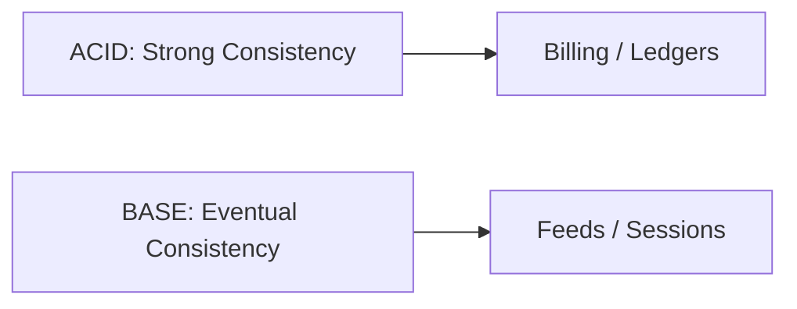
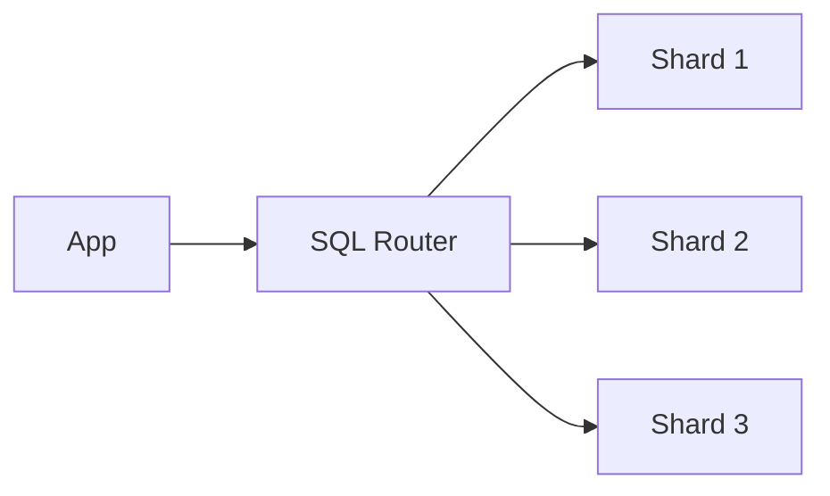
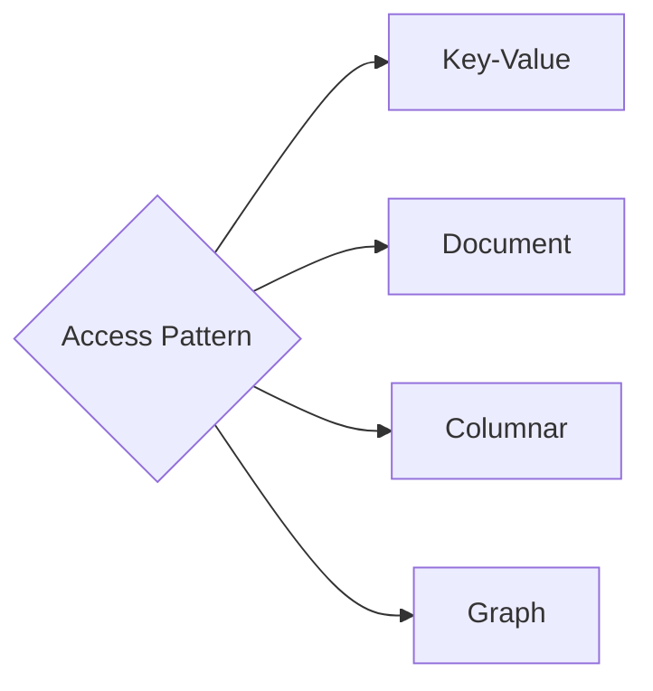
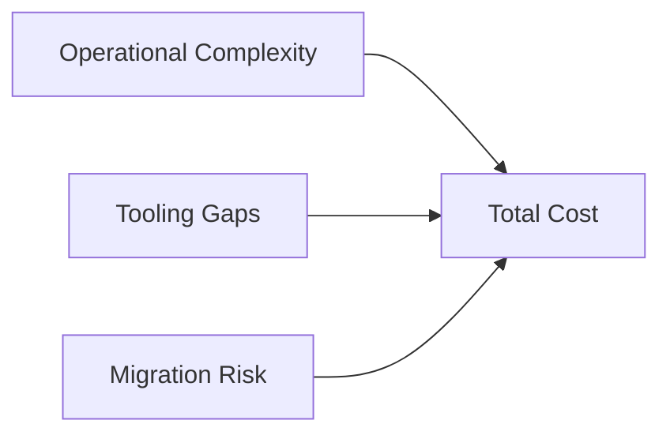
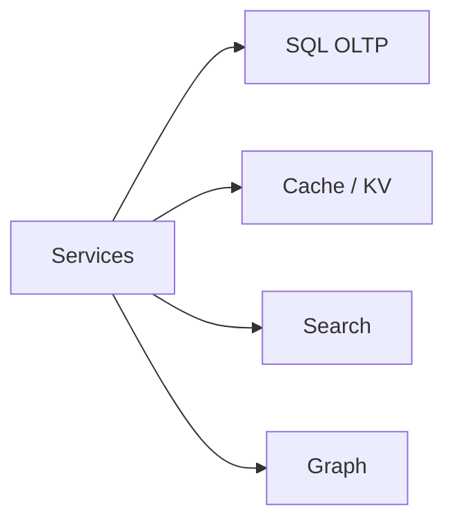

# SQL vs. NoSQL - The Real Trade-offs

    SQL Strengths: ACID guarantees, complex queries (JOINs, aggregations), mature tooling, well-understood. Works until single-node limits hit (~10-100K TPS depending on workload).
    SQL Weaknesses: Schema changes can be painful at scale (100M+ rows). Sharding is manual and complex. Geographic distribution is hard.
    NoSQL Strengths: Horizontal scalability built-in, flexible schema, designed for specific access patterns (key-value, document, wide-column, graph).
    NoSQL Weaknesses: Limited query flexibility, eventual consistency models require application-level handling, data modeling is access-pattern driven (get it wrong and you pay).

💡Interview Tip
Never say "SQL does not scale." Say "SQL scaling requires sharding which adds complexity. NoSQL trades query flexibility for built-in horizontal scaling." Show you understand nuance.

This guide covers 5 key areas: I. The Strategic Decision Framework: ACID vs. BASE, II. SQL at Scale: The Cost of Sharding, III. NoSQL Families: Modeling by Access Pattern, IV. The Hidden Costs: Operational & Financial, V. Polyglot Persistence: The Mag7 Standard.

## I. The Strategic Decision Framework: ACID vs. BASE

At the Principal TPM level, the distinction between ACID and BASE is not merely about database selection; it is a fundamental architectural decision regarding how a system handles failure and latency. This decision framework relies heavily on the **CAP Theorem**, which states that a distributed data store can effectively provide only two of the following three guarantees: **Consistency**, **Availability**, and **Partition Tolerance**.

Since network partitions (P) are inevitable in the distributed systems typical of Mag7 infrastructure (due to fiber cuts, switch failures, or region outages), the strategic choice effectively boils down to **CP (Consistency prioritized)** vs. **AP (Availability prioritized)**.

### 1. The ACID Model (CP Systems)
ACID (Atomicity, Consistency, Isolation, Durability) databases guarantee that transactions are processed reliably. In a distributed context, this implies a CP system: if a partition occurs, the system will reject writes rather than accept data that cannot be immediately synchronized across nodes.

*   **Technical Implementation:**
    *   **Synchronous Replication:** To ensure strong consistency, a write must be acknowledged by a quorum (or all) replicas before returning success to the client.
    *   **Two-Phase Commit (2PC):** Distributed ACID transactions often utilize 2PC protocols, which lock resources across multiple nodes until the transaction is finalized.
    *   **Isolation Levels:** Databases offer varying levels (Read Committed, Repeatable Read, Serializable) to manage how concurrent transactions view data.

*   **Mag7 Real-World Example: Google Spanner**
    *   Google Spanner is a globally distributed NewSQL database that provides ACID guarantees at a global scale. It achieves this using the **TrueTime API** (synchronized via GPS and atomic clocks) to assign global timestamps to transactions.
    *   **Why use it:** Google Ads and Gmail require external consistency. If a user deletes an email or updates a bid, that action must be reflected instantly globally to prevent billing errors or data resurrection.

*   **Trade-offs:**
    *   **Latency Penalty:** Synchronous replication is bound by the speed of light. Writing to a leader in `us-east` with a synchronous replica in `us-west` introduces significant latency.
    *   **Reduced Availability:** During a network partition, if the leader cannot reach the quorum, the system stops accepting writes to preserve data integrity.

### 2. The BASE Model (AP Systems)
BASE (Basically Available, Soft state, Eventual consistency) prioritizes availability. The system guarantees a response to every request (success or failure), even if the data returned is slightly stale or the write hasn't propagated to all replicas yet.

*   **Technical Implementation:**
    *   **Asynchronous Replication:** The primary node accepts the write and returns "Success" immediately. Data is propagated to replicas in the background.
    *   **Conflict Resolution:** Because different nodes might accept conflicting writes during a partition, the application must handle reconciliation using strategies like **Last-Write-Wins (LWW)** or **Vector Clocks**.
    *   **Read Repair / Hinted Handoff:** Mechanisms to detect and fix inconsistencies when nodes come back online or when data is read.

*   **Mag7 Real-World Example: Amazon DynamoDB (Shopping Cart)**
    *   The original Dynamo paper (the precursor to DynamoDB) was written specifically for the Amazon shopping cart.
    *   **Why use it:** In e-commerce, rejecting an "Add to Cart" action because of a database partition directly correlates to lost revenue. Amazon chooses to accept the write (Availability) and reconcile the cart items later (Eventual Consistency).

*   **Trade-offs:**
    *   **Complexity in Application Logic:** Developers must write code to handle stale reads or merge conflicts.
    *   **The "Stale Read" Risk:** A user might update their profile and, upon refreshing the page, see the old data because the read request hit a replica that hasn't updated yet.

### 3. Tunable Consistency: The Modern Middle Ground
In modern Mag7 architectures, the choice is rarely binary. Systems like **Apache Cassandra** (used heavily at Apple and Netflix) and **Azure Cosmos DB** allow TPMs and Architects to tune consistency per request or per workload.

*   **Quorum Controls:**
    *   **Write `ANY` / `ONE`:** Extreme availability. Fast, but high risk of data loss if the single node dies before replicating.
    *   **Write `QUORUM`:** Balanced. Requires a majority (e.g., 2 out of 3) to acknowledge. Survives single-node failure while maintaining consistency.
    *   **Write `ALL`:** Extreme consistency. Slowest, zero partition tolerance.

*   **Business Impact & ROI:**
    *   **Feature:** "Likes" on a social post.
        *   **Setting:** `ONE`.
        *   **ROI:** Low latency drives engagement. If a user sees 99 likes instead of 100 for 2 seconds, business value is unaffected.
    *   **Feature:** User Password Change.
        *   **Setting:** `QUORUM` or `ALL`.
        *   **ROI:** Security mandates consistency. If a user changes a password, the old password must be invalidated immediately across all regions to prevent unauthorized access.

### 4. Decision Matrix for Principal TPMs

When leading architectural reviews, apply this heuristic to determine the database requirement:

| Feature Requirement | Recommended Model | Implementation Example | Business Justification |
| :--- | :--- | :--- | :--- |
| **Financial Transactions / Billing** | **ACID (Strong Consistency)** | PostgreSQL, Spanner, Aurora | Double-spending or lost records result in regulatory fines and loss of trust. |
| **Inventory (Hard Cap)** | **ACID** | RDBMS with Row Locking | Selling the same seat on a plane to two people creates a CX disaster and operational cost. |
| **User Profiles / Social Graph** | **BASE (Eventual Consistency)** | DynamoDB, Cassandra, Tao (Meta) | High read volume requires massive horizontal scale; millisecond staleness is acceptable. |
| **IoT Telemetry / Logs** | **BASE** | Time-series DB, HBase | Volume of write ingestion is the bottleneck; losing 0.01% of sensor data is often acceptable. |

### 5. Edge Cases and Failure Modes

*   **The "Split-Brain" Scenario:** In a BASE system, if a network partition separates a cluster into two, both sides might accept writes for the same record. When the network heals, the system must merge these divergent histories.
    *   *Mitigation:* Use Vector Clocks to preserve causality (knowing which version is a descendant of another) rather than simple timestamps.
*   **Cascading Failures in ACID:** If an ACID primary node becomes overloaded, it may slow down. If clients retry aggressively, they can topple the replicas or the failover node immediately upon promotion.
    *   *Mitigation:* Implement exponential backoff and circuit breakers in the client application.

## II. SQL at Scale: The Cost of Sharding

Vertical scaling (buying a larger server) eventually hits a physical ceiling—either in terms of CPU, RAM, or, most commonly, I/O capacity. When a Mag7 service like YouTube or Instagram outgrows the largest available instance type, the only path forward for a SQL-based architecture is **sharding** (horizontal partitioning).

Sharding splits a single logical database into multiple physical databases (shards) that share nothing and can be deployed across multiple servers. While this solves the storage and write-throughput problem, it introduces massive application complexity. For a Principal TPM, the decision to shard is a strategic pivot point: you are trading **development velocity** and **transactional simplicity** for **infinite scale**.

### 1. The Architecture of Sharding: The Shard Key Dilemma

The most critical technical decision in a sharded architecture is the selection of the **Shard Key**. This key determines which physical server holds a specific row of data.

*   **How it works:** If you shard a user table by `User_ID`, users 1–1,000,000 might live on Shard A, and 1,000,001–2,000,000 on Shard B. The application layer (or a middleware proxy) must know to route queries for User 500 to Shard A.
*   **Mag7 Example (Instagram):** Instagram famously runs on a heavily sharded PostgreSQL architecture. They map data based on ID ranges. This allows them to scale to billions of users while keeping the underlying technology (PostgreSQL) simple and understood.
*   **The Trade-off:**
    *   **High Cardinality (Good):** Sharding by a unique ID (like UUID) ensures even data distribution.
    *   **Data Locality (Bad):** If you shard by `User_ID`, fetching all comments for a specific `Post_ID` might require querying *every* shard (scatter-gather), which destroys latency.
    *   **Hot Partitions (The "Justin Bieber" Problem):** If you shard by `User_ID` but one user generates 10,000x more traffic than others, that specific shard will overheat while others sit idle.

### 2. The Functional Tax: What You Lose

When you move from a monolithic SQL instance to a sharded cluster, you lose the features that made you choose SQL in the first place.

**A. Loss of ACID Across Shards**
*   **The Problem:** SQL databases guarantee atomicity within a single server. They do *not* guarantee it across servers natively. If you need to update a balance on Shard A and a transaction log on Shard B, and Shard B fails, you are left with corrupted state.
*   **The Fix:** You must implement **Two-Phase Commit (2PC)** or Saga patterns in the application layer.
*   **Mag7 Impact:** 2PC is blocking and slow. Implementing it increases latency significantly. Most Mag7 teams avoid cross-shard transactions entirely, redesigning the product to avoid them, which impacts product capabilities.

**B. Loss of JOINs**
*   **The Problem:** You cannot perform a `JOIN` between Table A on Server 1 and Table B on Server 2 efficiently.
*   **The Fix:** The application must fetch data from Server 1, then fetch data from Server 2, and join them in memory (Application-side Joins).
*   **Business Impact:** This increases the load on application servers and network bandwidth. It significantly slows down feature development because engineers can no longer write simple SQL queries to generate complex reports or views.

### 3. Operational Overhead: Resharding and Balancing

The "Day 2" costs of sharding are where ROI often degrades.

*   **Resharding:** Eventually, Shard A will get full. Splitting Shard A into Shard A1 and A2 while the system is live is one of the riskiest operations in database engineering.
*   **Mag7 Context (YouTube/Vitess):** YouTube created **Vitess**, a database clustering system for horizontal scaling of MySQL, specifically to abstract this complexity. Vitess sits between the app and the database, handling the routing and topology management so developers don't have to.
*   **Business Capability:** Without a tool like Vitess or a managed service (like AWS RDS Proxy or Azure Hyperscale), your best engineers will spend 50% of their time managing database topology rather than building product features.

### 4. The Strategic Pivot: NewSQL and Spanner

Because the operational cost of manual sharding is so high, Mag7 companies have invested in "NewSQL" technologies that offer the scale of NoSQL with the semantics of SQL.

*   **Google Cloud Spanner:** Uses atomic clocks (TrueTime) to guarantee global consistency across shards without the usual performance penalties of 2PC.
*   **CockroachDB (inspired by Spanner):** Provides similar capabilities for multi-cloud environments.
*   **ROI Analysis:**
    *   **Manual Sharding (MySQL/Postgres):** Low software cost, extremely high engineering operational cost (OpEx), high risk of outage during resharding.
    *   **NewSQL (Spanner):** High infrastructure cost (premium pricing), low operational overhead, high developer velocity.
    *   **Decision Guide:** If your product requires global strong consistency at massive scale (e.g., a global banking ledger or inventory system), the premium for Spanner is justified by the reduction in engineering risk and headcount.

## III. NoSQL Families: Modeling by Access Pattern

The fundamental paradigm shift you must internalize at the Principal level is the move from **Schema-First Design** (SQL) to **Query-First Design** (NoSQL). In the SQL world, you model the data entities (Users, Orders, Products) and rely on the database engine to perform complex joins at runtime. In the NoSQL world, runtime joins are generally impossible or prohibitively expensive.

Therefore, you must know exactly how the application will access the data *before* you design the schema. This is "Modeling by Access Pattern." If a TPM approves a NoSQL schema design without a defined list of Access Patterns, the project is at high risk of failure.

### 1. Key-Value Stores: The Performance/Simplicity Extremity
**Technologies:** Amazon DynamoDB (core), Redis, Memcached.

This is the simplest form of NoSQL: a hash table at massive scale. You have a unique key and a blob of value.

*   **Mag7 Use Case:** **Amazon Shopping Cart**. The "Cart" is a transient state object. The access pattern is singular and high-velocity: `GetCart(UserID)` and `UpdateCart(UserID)`. The system does not need to query "Show me all carts containing a 4k Monitor" (which would require a scan). It prioritizes write speed and retrieval by ID.
*   **The Trade-off:**
    *   *Pro:* O(1) performance. Predictable latency regardless of scale (1GB or 1PB).
    *   *Con:* Zero query flexibility. You cannot filter by the content inside the value blob unless you implement secondary indexes (which adds cost).
*   **Business Impact:**
    *   **CX:** Sub-millisecond latency for session retrieval.
    *   **ROI:** Highly cost-effective for high-traffic, low-complexity lookups.
    *   **Risk:** If requirements change and business suddenly needs analytics on that data, you must duplicate (ETL) the data into a data warehouse (Redshift/BigQuery), increasing architectural complexity.

### 2. Document Stores: The Flexibility Layer
**Technologies:** MongoDB, Amazon DocumentDB, Google Cloud Firestore.

Data is stored in JSON-like documents. Unlike Key-Value, the database understands the internal structure of the data, allowing for indexing on specific fields within the document.

*   **Mag7 Use Case:** **Netflix Content Metadata** or **Amazon Product Catalog**. A product catalog is inherently polymorphic. A "Laptop" document needs fields for CPU and RAM; a "Shirt" document needs Size and Material. Forcing this into a SQL table results in sparse tables with hundreds of null columns. Document stores handle this schema variance natively.
*   **The Trade-off:**
    *   *Pro:* High developer velocity. The data structure in the application code (Objects) maps directly to the database (Documents), eliminating the Object-Relational Impedance Mismatch.
    *   *Con:* Data duplication. If you store the "Director Name" inside every "Movie" document, and the director changes their name, you must update thousands of documents.
*   **Business Impact:**
    *   **Time-to-Market:** Significantly faster feature rollouts because DBAs don't need to run `ALTER TABLE` migrations for every new feature.
    *   **Capability:** Enables rich search and filtering on heterogeneous data sets without complex join logic.

### 3. Wide-Column Stores: The Write-Throughput Beast
**Technologies:** Apache Cassandra, Google Cloud Bigtable, HBase.

Modeled as a two-dimensional key-value store where columns can vary by row. These systems are designed for massive write throughput and storing petabytes of data across thousands of commodity servers.

*   **Mag7 Use Case:** **Facebook Messenger** or **Google Search Indexing**. When a user sends a message, it must be written immediately and replicated globally. Cassandra was literally invented by Facebook for Inbox Search to handle the write velocity that MySQL could not.
*   **Modeling Strategy:** **Denormalization**. In SQL, you store data once and join it. In Wide-Column, you duplicate data to satisfy different queries.
    *   *Query 1:* `GetMessagesByThread` -> Write to Table A (partitioned by ThreadID).
    *   *Query 2:* `GetMessagesByUser` -> Write same data to Table B (partitioned by UserID).
*   **The Trade-off:**
    *   *Pro:* Linearly scalable writes. To handle 2x traffic, you add 2x nodes. No theoretical limit.
    *   *Con:* Operational complexity and "Application-side Joins." The application is responsible for keeping Table A and Table B in sync. If the sync fails, the user sees different data depending on how they query (Consistency issues).
*   **Business Impact:**
    *   **ROI:** The only viable economic model for ingesting massive streams of telemetry or log data.
    *   **CX:** High availability guarantees (Masterless architecture means no single point of failure).

### 4. Graph Databases: The Relationship Engine
**Technologies:** Neo4j, Amazon Neptune.

Optimized for traversing relationships (edges) between entities (nodes). In SQL, many-to-many joins (e.g., "Friends of Friends") degrade exponentially in performance. In Graph DBs, performance is constant relative to the portion of the graph traversed.

*   **Mag7 Use Case:** **Meta (Facebook) Social Graph**, **Google Knowledge Graph**, **Amazon Recommendation Engine** ("People who bought X also bought Y").
*   **The Trade-off:**
    *   *Pro:* Capable of answering questions that are impossible in other systems (e.g., "Find the shortest path between User A and User B").
    *   *Con:* Hard to scale horizontally (Sharding). Splitting a graph across servers requires "graph partitioning," which is mathematically complex and performance-intensive.
*   **Business Impact:**
    *   **Capability:** Enables high-value features like fraud detection (detecting circular money movements) and social recommendations, which directly drive engagement and retention.

### 5. Strategic Synthesis: The "Single Table Design" Concept

At the Principal level, you will encounter the **Single Table Design** pattern (popularized by DynamoDB). This is the apex of "Modeling by Access Pattern."

Instead of creating tables for `Orders`, `Customers`, and `Products`, you put *everything* into one table. You use generic partition keys (PK) and sort keys (SK).
*   **Row 1:** PK=`USER#123`, SK=`METADATA`, Data=`{Name: "John"}`
*   **Row 2:** PK=`USER#123`, SK=`ORDER#999`, Data=`{Total: $50}`

**Why do Mag7 companies do this?**
Because it enables retrieving a User and their recent Orders in a **single network request** (querying for PK=`USER#123`). In a distributed cloud environment, network round-trips are the silent killer of performance. This design minimizes network chatter.

**The Trade-off:**
*   **Rigidity:** The schema is optimized for *specifically* that query. If the business asks, "How many orders were over $50 across all users?", this design fails catastrophically (requires a full table scan).
*   **Skill Gap:** It requires developers to unlearn SQL normalization.

## IV. The Hidden Costs: Operational & Financial

At the Principal TPM level, "cost" is rarely defined solely by the monthly AWS or Azure bill. It is defined by **Total Cost of Ownership (TCO)**, which aggregates infrastructure spend, engineering toil, opportunity cost (velocity), and the risk of vendor lock-in. A database choice that looks cheap on a pricing calculator can cost millions in engineering hours to maintain at scale.

### 1. The Cost of Scaling: Sharding vs. Auto-Partitioning

The most significant operational divergence between SQL and NoSQL at scale is how they handle growth beyond a single node's capacity.

*   **SQL (Sharding Toil):** When a PostgreSQL or MySQL instance hits its vertical limit (CPU/IOPS saturation), you must shard. Sharding is not a native SQL feature; it is an application-level construct. You split data across multiple instances based on a key (e.g., `user_id`).
    *   **Mag7 Context:** **YouTube** utilizes **Vitess** to manage massive MySQL sharding. This requires a dedicated platform team just to manage the sharding middleware, rebalancing data when shards get hot, and handling cross-shard queries.
    *   **The Trade-off:** You retain ACID compliance within a shard, but you incur massive operational overhead. Re-sharding (splitting one shard into two) is a risky, high-toil operation that often requires maintenance windows or complex dual-write logic.
    *   **Business Impact:** High operational capability requirement. If you choose SQL for hyperscale, you must budget for a team of DBREs (Database Reliability Engineers).

*   **NoSQL (Auto-Partitioning):** Systems like DynamoDB or Cassandra use consistent hashing to distribute data automatically. As data grows, the database splits partitions behind the scenes without engineering intervention.
    *   **Mag7 Context:** **Amazon’s Tier-1 services** (e.g., Prime Video metadata) default to DynamoDB. The "hidden cost" here is **Hot Partitions**. If traffic is not evenly distributed (e.g., a celebrity's Instagram post gets 1M comments while others get 0), one partition gets hammered while others sit idle.
    *   **The Trade-off:** You save on operational toil (no manual sharding) but risk **Throttling**. In provisioned modes, you pay for capacity you can't use because it's trapped in cold partitions, while the hot partition rejects writes (ThrottlingException), causing CX degradation.

### 2. Storage Efficiency and Data Lifecycle

Storage costs at Petabyte scale are non-trivial. The hidden cost lies in how the database handles data density and compression.

*   **SQL (B-Trees and Page Bloat):** Relational databases use B-Trees, which are read-optimized but write-heavy due to page splitting. Furthermore, MVCC (Multi-Version Concurrency Control) in Postgres can lead to "bloat" where dead tuples consume disk space, requiring CPU-intensive `VACUUM` processes.
    *   **Mag7 Context:** **Uber** migrated from Postgres to MySQL (Schemaless) partially due to write amplification and replication inefficiencies in their specific Postgres implementation at the time.
    *   **Business Impact:** Higher storage bills per GB of actual data. You are paying for the "air" in the database pages and the IOPS required to clean them.

*   **NoSQL (LSM Trees and TTL):** Many NoSQL engines (Cassandra, RocksDB) use Log-Structured Merge (LSM) trees, which are highly write-efficient and compress well. Crucially, NoSQL often supports native **Time To Live (TTL)**.
    *   **Mag7 Context:** **Netflix** uses Cassandra with TTL for viewing history. Data automatically expires and is purged from disk without a heavy `DELETE` query that locks rows.
    *   **The Trade-off:** LSM trees have a "read penalty." To read a record, the system may check multiple files (MemTable and SSTables), increasing latency.
    *   **ROI Impact:** Significant savings on "ephemeral" data (logs, session states, IoT streams) where long-term retention is unnecessary.

### 3. The Financial Model: Provisioned vs. On-Demand

The billing model dictates architectural behavior.

*   **SQL (Provisioned Capacity):** You generally provision an instance (e.g., `db.r5.24xlarge`). You pay for that capacity 24/7, regardless of traffic.
    *   **Hidden Cost:** **Over-provisioning**. To handle a peak event (like Black Friday), you might run at 10% utilization for the rest of the year.
    *   **Mitigation:** Serverless SQL (e.g., Aurora Serverless) exists but often suffers from "cold start" latency or connection limit issues during sudden spikes.

*   **NoSQL (Throughput/Request Based):** DynamoDB or Cosmos DB allow billing per Read/Write Request Unit (RRU/WRU).
    *   **Hidden Cost:** **The "Scan" Trap**. A developer accustomed to SQL runs a `SELECT * WHERE category = 'books'` on a NoSQL table without an index. This triggers a "Table Scan," reading every item in the database. A single query can cost hundreds of dollars and consume all provisioned throughput, taking the application offline.
    *   **Business Impact:** Unpredictable OpEx. A bad code deploy can spike the bill 100x overnight. This requires strict governance and guardrails (e.g., AWS Cost Anomaly Detection).

### 4. Schema Evolution and Velocity

The cost of changing your mind is an operational metric.

*   **SQL (Rigid Schema):** `ALTER TABLE` on a 10TB table is a nightmare. It can lock the table for hours.
    *   **Mag7 Context:** **Facebook** developed **OSC (Online Schema Change)** tools to copy the table, apply the change, and swap it back to allow schema changes without downtime.
    *   **Business Impact:** Slower Time-to-Market. Features requiring data model changes require heavy coordination between Product, Backend, and DBA teams.

*   **NoSQL (Schema-on-Read):** You can start writing new attributes immediately. The application code handles the logic (e.g., `if user.has_attribute('tiktok_handle')...`).
    *   **Hidden Cost:** **Data Debt**. Over 5 years, a User object might have 4 different "shapes" depending on when it was created. The application code becomes littered with `try/catch` blocks or conditional logic to handle legacy data structures, increasing technical debt and bug risk.

## V. Polyglot Persistence: The Mag7 Standard

In the early stages of growth, a startup might force all data—transactions, logs, sessions, and analytics—into a single monolithic PostgreSQL or MySQL instance. At the Mag7 scale, "one size fits all" is a recipe for catastrophic latency and outages.

Polyglot Persistence is the architectural standard where an application uses multiple, distinct data storage technologies, choosing the "best tool for the job" for each specific data type within the same workflow. As a Principal TPM, you are not just managing a migration; you are governing the complexity that comes with heterogeneous data systems.

### 1. Mapping Data Models to Business Functions

At this level, you must identify access patterns before approving architecture diagrams. The decision to introduce a new database technology must be justified by specific performance or functional gaps in existing infrastructure.

**A. Key-Value Stores (Redis, Memcached, DynamoDB)**
*   **Use Case:** High-velocity, simple lookups. Session management, shopping carts, real-time leaderboards.
*   **Mag7 Example:** **Twitter (X)** uses Redis clusters to cache timelines. When a celebrity tweets, the system doesn't query the disk-based database for every follower; it serves the tweet from RAM.
*   **Trade-off:** High RAM costs and data volatility (in cache mode) vs. sub-millisecond latency.
*   **Business Impact:** Immediate page loads. If the cache misses, the fallback to the primary DB can cause a "thundering herd" problem, crashing the persistent layer.

**B. Document Stores (MongoDB, Amazon DocumentDB)**
*   **Use Case:** Flexible schemas, content management, catalogs where attributes vary wildly (e.g., product specs for a laptop vs. a t-shirt).
*   **Mag7 Example:** **Netflix** uses Cassandra (wide-column, similar utility) and document models to store customer viewing history and preferences, allowing rapid iteration on the UI without running `ALTER TABLE` migrations on billions of rows.
*   **Trade-off:** Query flexibility is lower than SQL (complex joins are expensive/impossible) vs. rapid development velocity.
*   **Business Impact:** Faster Time-to-Market (TTM) for new features. Developers don't wait for DBAs to modify schemas.

**C. Graph Databases (Neo4j, Amazon Neptune)**
*   **Use Case:** Highly connected data, social graphs, fraud detection rings, recommendation engines.
*   **Mag7 Example:** **Meta (Facebook)** relies on TAO (The Associations and Objects), a proprietary graph store, to map the "Social Graph." Asking "Which of my friends like pages that also like this specific restaurant?" is an O(1) or O(log n) operation in a graph, but an O(n^2) or worse nightmare in SQL.
*   **Trade-off:** Niche skill set required (Cypher/Gremlin query languages) and difficult to shard horizontally.
*   **Business Impact:** Enables features that drive engagement (Friend recommendations) which are computationally infeasible in relational systems.

**D. Time-Series Databases (InfluxDB, Prometheus, Amazon Timestream)**
*   **Use Case:** DevOps monitoring, IoT sensor data, financial tick data.
*   **Mag7 Example:** **Uber** uses M3 (proprietary time-series DB) to track vehicle locations and metrics over time.
*   **Trade-off:** Optimized for "write-heavy, append-only" loads but poor at updating/deleting past records.
*   **Business Impact:** Observability. Without this, you cannot detect a 1% error rate spike in a specific region until customers complain.

### 2. The Synchronization Challenge: The "Glue" Problem

The biggest risk in Polyglot Persistence is data divergence. If you store the User Profile in Postgres and their Social Graph in Neo4j, how do you ensure they remain in sync?

**The Anti-Pattern: Dual Writes**
The application writes to Database A, then writes to Database B.
*   **Failure Mode:** The write to A succeeds, but the write to B fails (network blip). Now your data is corrupt.
*   **TPM Action:** Veto this pattern in design reviews for critical paths.

**The Mag7 Standard: Event-Driven Architecture (CDC)**
The application writes only to the "Source of Truth" (usually the SQL DB). A Change Data Capture (CDC) system listens to the transaction log and propagates the change to downstream systems (Search, Cache, Analytics).
*   **Implementation:** **LinkedIn** developed Databus (and later relied heavily on Kafka) to stream changes from their primary Oracle databases to their search and social graph systems.
*   **Trade-off:** Introduces "Eventual Consistency." The search index might be 500ms behind the transaction.
*   **ROI Impact:** Decouples services. If the Search cluster goes down, the Transaction system can still take payments. The system heals itself once the Search cluster recovers and replays the Kafka stream.

### 3. Operational Complexity and Cognitive Load

As a Principal TPM, you must balance technical optimization with organizational capability.

*   **The "Skill Tax":** Introducing a Graph DB means you need engineers who understand Graph theory. If only one team knows how to operate Cassandra, that team becomes a bottleneck for the entire org.
*   **License & Cloud Costs:** Running five different managed database services (RDS, ElastiCache, Neptune, Elasticsearch, Redshift) dramatically increases the cloud bill compared to a monolithic approach. You pay for overhead/idle compute on every single service.
*   **Vendor Lock-in:** Heavily leveraging proprietary managed services (like DynamoDB or Firestore) makes migrating away from AWS or GCP nearly impossible without a total rewrite.

**Strategic Guidance:**
Enforce "Golden Paths." Allow teams to choose from a curated list of supported persistence layers (e.g., "We support Postgres, Redis, and Kafka"). If a team wants to use a niche DB (e.g., a specific vector database for AI), they must prove the ROI justifies the operational overhead of supporting a "non-standard" stack.

### 4. Search Engines as a Data Store (Elasticsearch/Solr)

While technically search engines, these are often treated as primary read-stores in Mag7 architectures.

*   **The Problem:** SQL databases utilize B-Tree indexes, which are great for exact matches (`ID = 123`) but terrible for fuzzy text search (`Description LIKE '%blue%shirt%'`).
*   **The Solution:** Inverted Indexes (Elasticsearch).
*   **Mag7 Context:** **Amazon.com** product search. The source of truth for inventory is a relational/NoSQL mix, but the user queries an index optimized for relevance, typos, and faceting.
*   **Business Capability:** Directly correlates to conversion rate. If a user types "iphone case" and gets zero results because of a typo, revenue is lost.

---

## Interview Questions

### I. The Strategic Decision Framework: ACID vs. BASE

**Question 1: Designing for Consistency vs. Latency**
"We are designing a global inventory system for a flash-sale feature (high concurrency, limited stock). The business wants zero overselling (Strong Consistency) but also demands sub-100ms latency for users globally. How do you manage these conflicting requirements, and what trade-offs do you present to leadership?"

*   **Guidance for a Strong Answer:**
    *   **Identify the Conflict:** Acknowledge that global strong consistency contradicts low latency due to the speed of light (CAP theorem).
    *   **Proposed Solution:** Suggest sharding inventory geographically (e.g., allocating 100 units to US-East, 100 to EU-West) to allow local strong consistency. Alternatively, propose a "reservation" system where the initial check is optimistic (BASE), but final checkout is strict (ACID).
    *   **Trade-off Analysis:** Explain that strict global locking will crash the system under flash-sale load. The tradeoff is creating a complex "reconciliation" queue or potentially showing "Out of Stock" prematurely to ensure safety.

**Question 2: Microservices and Transactions**
"You are migrating a monolithic billing application to microservices. The current system relies on a single large SQL transaction to update the User, Ledger, and Notification tables simultaneously. How do you handle this transactionality in a distributed NoSQL/Microservices environment?"

*   **Guidance for a Strong Answer:**
    *   **The Anti-Pattern:** Acknowledge that distributed transactions (2PC) across microservices are brittle and slow (the "Death Star" architecture).
    *   **The Solution:** Propose the **Saga Pattern**. Explain how the transaction is broken into a sequence of local transactions (T1 -> T2 -> T3).
    *   **Error Handling:** Crucially, mention **Compensating Transactions**. If T3 fails, the system must execute C2 and C1 to undo the changes made by T2 and T1.
    *   **Consistency Model:** Identify this as moving from ACID to BASE (Eventual Consistency), and discuss the business implication (e.g., the user might see "Pending" status on their bill for a few seconds).

### II. SQL at Scale: The Cost of Sharding

**Question 1: The "Hot Partition" Scenario**
"We are designing a comment system for a social media platform using a sharded SQL architecture. We initially decided to shard by `Post_ID` so that all comments for a post live on the same server, making reads fast. However, when a celebrity posts, that single shard becomes overwhelmed with writes, causing timeouts. How would you propose we re-architect this without migrating to NoSQL?"

*   **Guidance for a Strong Answer:**
    *   **Identify the trade-off:** Acknowledge that `Post_ID` optimizes for reads (data locality) but fails on write distribution (hot spots).
    *   **Proposed Solution:** Suggest a **compound shard key** or "salt." For example, append a bucket number to the ID (`PostID_1`, `PostID_2`) to spread high-volume posts across 2-3 specific shards.
    *   **Read implications:** Explain that the read layer now needs to query those specific buckets and merge the results, slightly increasing read latency to save write availability.
    *   **Business continuity:** Mention that for non-celebrity posts, the system can default to a single bucket to maintain optimal performance.

**Question 2: Buy vs. Build (Sharding Middleware)**
"Our e-commerce platform's primary MySQL database is hitting 90% CPU utilization. The engineering team wants to implement application-level sharding logic to split the database. As the Principal TPM, what risks do you foresee with this approach, and what alternatives would you investigate before approving this roadmap?"

*   **Guidance for a Strong Answer:**
    *   **Operational Risk:** Highlight that application-level sharding couples the code tightly to the infrastructure topology. If the DB topology changes, code must be deployed.
    *   **Feature Velocity:** Point out that analytics and reporting will break because they can no longer query a single source of truth.
    *   **Alternatives:**
        *   **Read Replicas:** Are we write-bound or read-bound? If read-bound, just add replicas, don't shard.
        *   **Middleware:** Investigate Vitess or ProxySQL to handle the routing rather than hard-coding it in the app.
        *   **Vertical Scale:** Is it actually cheaper to buy the most expensive hardware available (or move to Aurora/Hyperscale) than to burn 6 months of engineering time rewriting the data layer? (ROI focus).

### III. NoSQL Families: Modeling by Access Pattern

**Question 1: The Migration Strategy**
"We are migrating a legacy monolithic billing application from Oracle to DynamoDB to handle Black Friday traffic scaling. The current schema is highly normalized (3NF). As a Principal TPM, how do you guide the engineering team on the schema design strategy, and what are the major risks you need to mitigate?"

*   **Guidance for a Strong Answer:**
    *   **Access Patterns First:** The candidate must reject a "lift and shift" of tables. They should articulate a process to map out every read/write pattern (e.g., "GetInvoiceByID", "ListInvoicesByUser").
    *   **Denormalization:** Explain that data will likely be duplicated. The `CustomerAddress` might need to be embedded in the `Invoice` item to avoid a second lookup.
    *   **Consistency Risk:** Address how to handle the loss of ACID transactions. Billing requires strong consistency. The candidate should mention using DynamoDB Transactions (ACID support) or conditional writes to prevent double-billing.
    *   **Reporting Gap:** Acknowledge that moving to NoSQL kills the ability to run ad-hoc SQL queries for the finance team. The solution must include streaming data (e.g., DynamoDB Streams) to a data warehouse (Redshift/Snowflake) for analytics.

**Question 2: Technology Selection (Wide-Column vs. Key-Value)**
"We are building a new 'User Activity Log' for a streaming service (like Netflix). We expect 500 million writes per day. We need to query this by 'User' to show watch history, but also by 'Title' to calculate popularity metrics. Engineering is debating between Redis and Cassandra. Which do you recommend and why?"

*   **Guidance for a Strong Answer:**
    *   **Rejection of Redis:** While Redis is fast, it is memory-bound. Storing persistent history for millions of users in RAM is cost-prohibitive and technically volatile (persistence issues).
    *   **Selection of Cassandra (Wide-Column):** Ideal for write-heavy workloads (Log structured merge trees). It handles high ingestion rates efficiently.
    *   **Data Modeling:** The candidate should propose writing the data twice (Denormalization). Once into a partition keyed by `UserID` (for the user's view) and once into a partition keyed by `TitleID` (for the popularity counters).
    *   **Tradeoff Awareness:** Acknowledge that the "Popularity" count might be eventually consistent (off by a few seconds), which is acceptable for this business capability (unlike billing).

### IV. The Hidden Costs: Operational & Financial

**Question 1: The "Free" Tier Trap**
"We have a legacy service running on a sharded MySQL cluster that is costing us $50k/month in maintenance and licensing. An engineering lead proposes migrating to a NoSQL serverless solution to 'cut costs to near zero' since the traffic is sporadic. As a Principal TPM, what specific failure modes and hidden costs would you challenge them to model before approving this migration?"

*   **Guidance:** A strong answer looks beyond the marketing pitch.
    *   *Data Access Patterns:* Does the app rely on complex joins? Replicating joins in NoSQL requires denormalization (duplicating data), which increases storage costs and write complexity (consistency bugs).
    *   *Migration Cost:* The cost of rewriting the data access layer and backfilling/transforming PB of data often exceeds 2 years of hosting savings.
    *   *The "Scan" Risk:* If the sporadic traffic involves analytical queries (e.g., "Show me all users created in May"), a serverless NoSQL scan is exponentially more expensive than a SQL index scan.
    *   *Talent:* Do we have engineers who understand NoSQL modeling (Single Table Design), or will they treat DynamoDB like MySQL and create a slow, expensive mess?

**Question 2: The Hot Partition Crisis**
"You are the TPM for a global ticketing platform (like Ticketmaster). During a high-profile concert launch, your NoSQL database metrics show that overall provisioned throughput is at only 20%, yet 50% of user requests are failing with 'Throughput Exceeded' errors. What is happening technically, what is the immediate mitigation, and what is the long-term architectural fix?"

*   **Guidance:** This tests knowledge of NoSQL internals and crisis management.
    *   *Diagnosis:* This is a **Hot Partition** issue. All users are hitting the same partition key (e.g., `event_id=TaylorSwift`), overwhelming a single storage node while others sit idle. The 20% aggregate metric is misleading because it averages the hot node with cold nodes.
    *   *Immediate Mitigation:* If the DB supports adaptive capacity (like DynamoDB), it may handle it eventually, but usually, you must implement **Write Caching** (e.g., ElastiCache/Redis) immediately to absorb the spike, or temporarily over-provision the table massively to raise the ceiling of that single partition.
    *   *Long-term Fix:* Change the data model. Use **Write Sharding** (appending a random suffix `event_id=TaylorSwift_1`, `_2`, `_3`) to spread the load, and aggregate the data on read.

### V. Polyglot Persistence: The Mag7 Standard

### 1. The Architecture Evolution
**Question:** "We are currently breaking down a monolithic e-commerce application into microservices. The product catalog is read-heavy, but inventory updates are write-heavy and demand high consistency. Propose a data persistence strategy. How do you handle the search functionality?"

**Guidance for a Strong Answer:**
*   **Separation of Concerns:** The candidate should not suggest a single DB. They should propose a Relational DB (Postgres/Aurora) or strong-consistency NoSQL (DynamoDB with strong consistency) for the Inventory/Transactions (ACID is required here).
*   **Read Optimization:** Suggest a document store or a read-replica strategy for the Product Catalog to handle the read volume.
*   **Search Implementation:** Explicitly add Elasticsearch/OpenSearch for the search bar functionality.
*   **Sync Mechanism:** The "Principal" level detail is identifying *how* Search gets updated. They should propose an Event Bus (Kafka) or CDC stream (DynamoDB Streams) to update the Search index asynchronously after an inventory change, acknowledging the slight latency (Eventual Consistency) is acceptable for search results but not for checkout.

### 2. The "New Tech" Trade-off
**Question:** "A lead engineer wants to introduce a Graph Database to power a new 'Recommended for You' feature. It promises a 20% latency reduction in query time compared to our current complex SQL joins. As the TPM, how do you evaluate this request?"

**Guidance for a Strong Answer:**
*   **Total Cost of Ownership (TCO):** A 20% latency gain is technical, but what is the business value? Does it improve conversion?
*   **Operational Readiness:** Who manages this DB? Do we have backups, DR plans, and security compliance (SOC2/GDPR) for this new tech?
*   **Complexity vs. Benefit:** If the current SQL joins are slow, can they be optimized (materialized views, read replicas) before adding an entirely new technology stack?
*   **Decision Framework:** The candidate should frame this as a "Buy vs. Build" or "Standardize vs. Specialize" decision. If the feature is core to the business strategy (e.g., a social network), the complexity is justified. If it's a minor side feature, the maintenance burden of a Graph DB outweighs the 20% speed boost.

---

## Key Takeaways

- Review each section for actionable insights applicable to your organization

- Consider the trade-offs discussed when making architectural decisions

- Use the operational considerations as a checklist for production readiness
