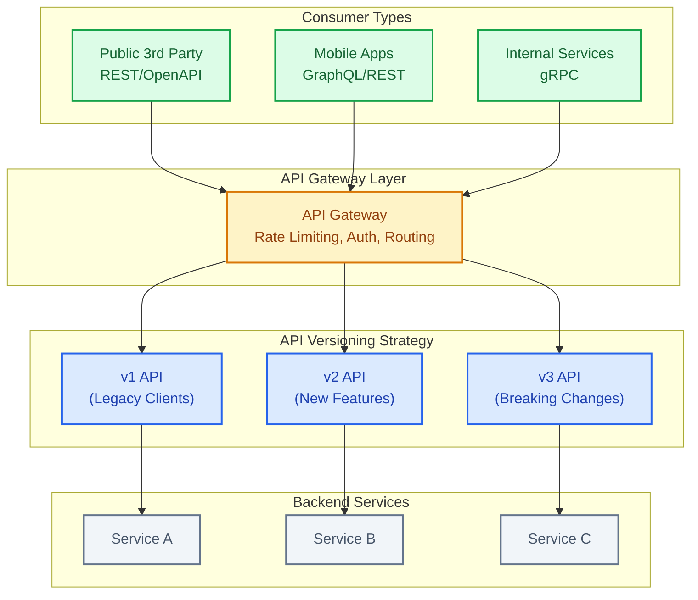
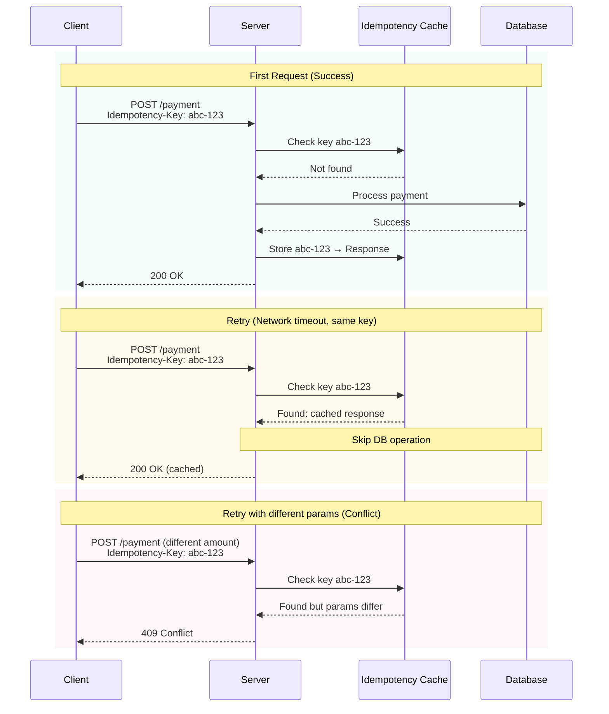
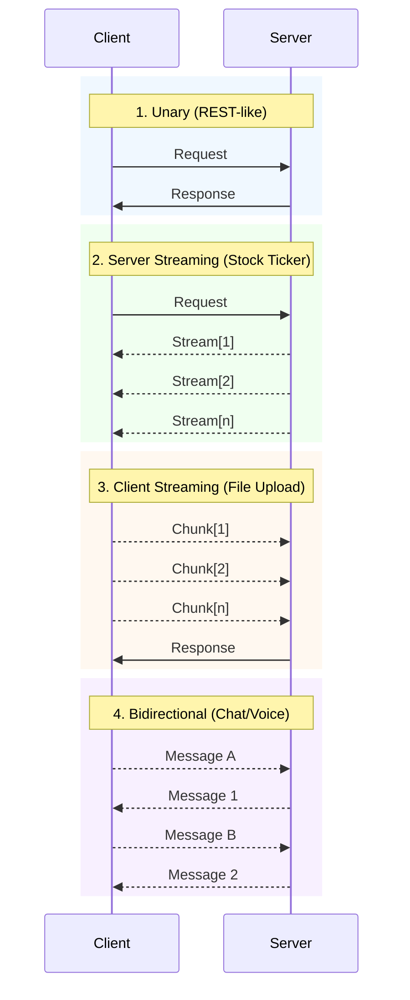
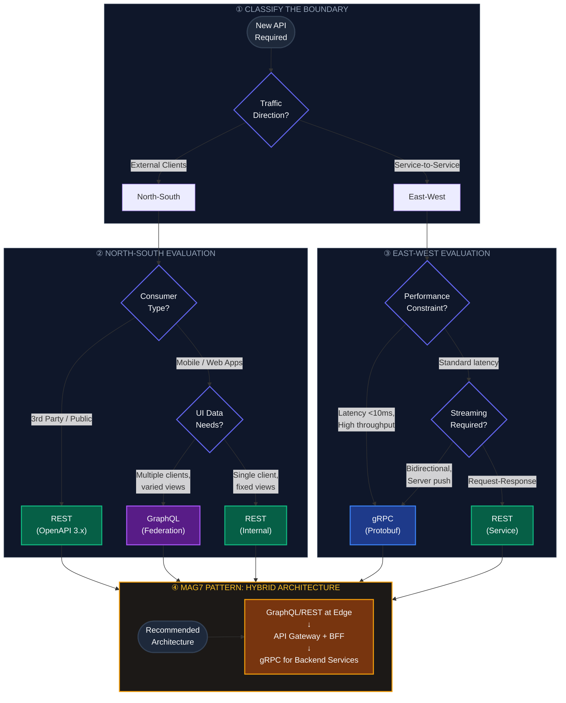
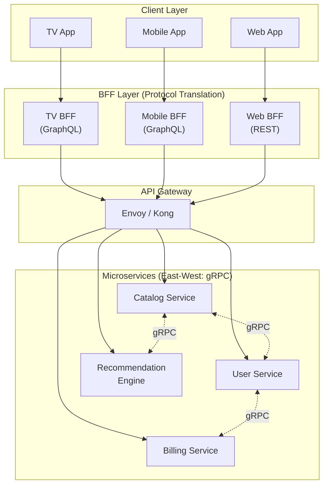

# Synchronous: REST vs. gRPC vs. GraphQL

This guide covers 6 key areas: I. Executive Summary: The API Economy, II. REST (Representational State Transfer), III. gRPC (Google Remote Procedure Call), IV. GraphQL, V. Strategic Decision Framework for Principal TPMs, VI. Interview Pivot: Handling "What if?" Scenarios.

## I. Executive Summary: The API Economy

The API Economy is the strategic realization that Application Programming Interfaces are not merely technical conduits for data, but business assets that define a company's agility, partnership potential, and platform viability. For a Principal TPM at a Mag7 level, an API is a product with its own lifecycle, SLA, and P&L implications.

In this environment, you represent the "Contract." Your architectural decisions regarding APIs determine the coupling between organizational units (Conway’s Law), the cognitive load on client developers, and the infrastructure costs of the platform.

### 1. The "API as a Product" Mindset

At the scale of Google, Amazon, or Microsoft, internal APIs are treated with the same rigor as public-facing products. This methodology, famously crystallized by Jeff Bezos’ "API Mandate" at Amazon, dictates that every team must expose their functionality through service interfaces designed to be externalizable from Day 1.

**Real-World Behavior:**
*   **Amazon (AWS):** The mandate forced teams to decouple. The billing team cannot look directly at the S3 team's database; they must use the S3 metering API. This allowed Amazon to eventually sell S3 to the public with minimal architectural refactoring.
*   **Stripe (Platform Standard):** Stripe treats "Time to First Call" as a primary KPI. Their API documentation and SDKs are products themselves, optimized to reduce integration friction, directly correlating to revenue velocity.

**Tradeoffs:**
*   **Development Velocity vs. Integration Velocity:** Treating an API as a product slows down the *provider* team initially (requires documentation, strict schema validation, versioning strategies). However, it exponentially accelerates the *consumer* team (self-service integration without meetings).
*   **Flexibility vs. Stability:** A "Product" API implies a contract. You cannot change a field name just because you refactored the database. This restricts the provider's ability to iterate recklessly but guarantees stability for the ecosystem.

**Impact:**
*   **ROI:** Reduces the "coordination tax" between teams. If Team A needs a feature from Team B, they consume the API rather than scheduling a roadmap alignment meeting.
*   **Business Capability:** Turns cost centers (internal tools) into potential profit centers (public platforms).

### 2. The Hybrid Protocol Strategy

No single protocol dominates the Mag7 stack. The "API Economy" is a heterogeneous ecosystem where the right tool is selected based on the specific boundary being crossed.

**Real-World Behavior:**
*   **Netflix:** Uses a tiered architecture.
    *   **Edge/Device:** Uses GraphQL (Federated) to allow UI teams (TV, Mobile, Web) to fetch exactly the data they need to render a view, optimizing bandwidth and latency.
    *   **Service-to-Service:** Uses gRPC (Protobuf) for deep backend communication between microservices to maximize throughput and type safety.
*   **Google:** While the creator of gRPC, Google still maintains massive REST endpoints for GCP (Google Cloud Platform) to ensure broad compatibility with third-party tooling (Terraform, Ansible) and ease of use for external developers.

**Tradeoffs:**
*   **Standardization vs. Optimization:** Enforcing a single protocol (e.g., "Everything must be REST") simplifies governance and hiring but creates performance bottlenecks in high-throughput internal services. Allowing hybrid approaches increases operational complexity (different observability stacks, load balancers) but optimizes user experience and infrastructure costs.

### 3. Governance and the Versioning Trap

The most critical risk in the API Economy is breaking changes. A Principal TPM must enforce governance that prevents "API drift."

**Real-World Behavior:**
*   **Microsoft:** Famous for extreme backward compatibility. Enterprise customers build multi-year dependencies on APIs. Breaking an API contract is viewed as a breach of trust.
*   **Meta (Facebook):** Uses a "continuous evolution" approach with GraphQL, where fields are deprecated and marked as such in the schema, but rarely removed entirely until usage drops to near zero, monitored via strict telemetry.

**Impact:**
*   **CX (Customer Experience):** Stable APIs build trust. If an update breaks a client integration, that customer churns.
*   **Skill:** Requires engineering teams to understand semantic versioning and backward compatibility patterns (e.g., the Expand-Contract pattern for database migrations behind APIs).

### 4. Monetization and Rate Limiting

In the API Economy, access is a currency. Protecting the "Bank" (your infrastructure) is paramount.

**Technical Context:**
You must design for "noisy neighbors" and DDoS scenarios. This involves implementing token bucket algorithms, leaky buckets, or fixed window counters at the API Gateway level.

**Real-World Behavior:**
*   **Twitter/X:** Shifted from a largely open API to a tiered, paid model. This required a massive overhaul of their API Gateway logic to enforce strict quotas based on subscription tiers rather than just technical capacity.

**Tradeoffs:**
*   **Openness vs. Control:** Generous rate limits encourage adoption and innovation (ecosystem growth) but risk system stability and increase infrastructure bills. Strict limits protect the system and drive monetization (up-selling to higher tiers) but stifle developer experimentation.

## II. REST (Representational State Transfer)

### 1. Architectural Constraints and Scalability
While most TPMs understand that REST uses HTTP verbs, the Principal TPM must understand the architectural constraints that define *true* RESTful systems and how they impact horizontal scaling at Mag7 levels.

*   **Statelessness:** The server must not store any session state between requests. Every request from a client must contain all the information necessary to understand the request.
    *   **Mag7 Context:** In **Google Cloud's Control Plane**, requests are routed to any available region-local instance. If an API relied on server-side session affinity (sticky sessions), auto-scaling would break, and "hot spotting" would degrade performance.
    *   **Tradeoff:** Increases payload size (redundant authentication tokens/context in every header) vs. Infinite horizontal scalability (any server can handle any request).
    *   **Business Impact:** directly correlates to infrastructure COGS. Statelessness allows the use of ephemeral computing (e.g., AWS Spot Instances) because losing a server node results in zero data/session loss.

*   **Cacheability:** Responses must define themselves as cacheable or not.
    *   **Mag7 Context:** **Netflix** heavily relies on CDN caching for metadata APIs (movie titles, images). By strictly adhering to HTTP caching headers (`ETag`, `Cache-Control`), they offload 90%+ of read traffic from origin servers to edge locations.
    *   **ROI Impact:** Drastic reduction in backend database load and compute costs; lower latency for the end-user.

### 2. Resource Modeling and Granularity
The most common friction point in API design is defining "Resources." A Principal TPM must arbitrate between "Chatty" (fine-grained) and "Chunky" (coarse-grained) APIs.

*   **Fine-Grained (Pure REST):** `/orders/123`, `/orders/123/items`, `/orders/123/shipping`.
    *   **Pro:** High reusability; distinct cache keys.
    *   **Con:** The "N+1" problem mentioned in the summary. Mobile apps on 4G networks suffer due to TCP handshake latency on multiple calls.
*   **Coarse-Grained (Pragmatic REST):** `/orders/123?expand=items,shipping`.
    *   **Mag7 Behavior:** **Stripe** and **Microsoft Graph** use expansion logic. They allow clients to request related resources in a single call via query parameters.
    *   **Tradeoff:** Backend complexity (requires complex join logic or resolver patterns) increases, but client implementation velocity and performance improve significantly.

### 3. Idempotency and Reliability
In distributed systems, networks fail. A client may send a request, the server processes it, but the acknowledgement is lost. The client retries. Without idempotency, this results in duplicate transactions.

*   **The Mechanism:** Clients generate a unique `Idempotency-Key` header (UUID) for mutating requests (POST/PATCH). The server stores this key with the response for 24-48 hours. If a retry hits with the same key, the server returns the cached response without re-executing the logic.
*   **Mag7 Example:** **Amazon Payments** and **Uber** (trip requests). You cannot double-charge a card or dispatch two cars because of a network timeout.
*   **Actionable Guidance:** For any transactional API (Create, Update, Pay), you must enforce Idempotency Keys as a mandatory header in the API contract.
*   **CX Impact:** Prevents "double spend" scenarios which are high-severity customer trust eroders.

### 4. Method Semantics: PUT vs. PATCH
A common interview trap and real-world failure mode is the misuse of update verbs.

*   **PUT (Replace):** Replaces the *entire* resource. If you PUT a User object but leave out the "email" field, the email should technically be deleted (set to null).
*   **PATCH (Modify):** Updates only the fields supplied.
*   **Mag7 Context:** Most internal microservices at **Meta** prefer PATCH for partial updates to avoid race conditions where two users update different fields of the same object simultaneously.
*   **Tradeoff:** PUT is idempotent (safe to retry). PATCH is generally not idempotent (unless carefully designed), requiring stricter concurrency controls (e.g., Optimistic Locking with `If-Match` headers).

### 5. Pagination at Scale
`OFFSET` and `LIMIT` pagination works for 1,000 records but kills databases at 100 million records.

*   **The Problem:** `OFFSET 10000` requires the database to read 10,000 rows and throw them away to return the next 10.
*   **The Solution (Cursor-based):** Use an opaque pointer (Cursor) referencing the last record seen.
*   **Mag7 Example:** **Twitter/X API** and **DynamoDB**. They return a `NextToken` or `cursor`. You pass this back to get the next page.
*   **Business Capability:** Enables infinite scroll features without degrading database performance as the user scrolls deeper.

### 6. Governance and Evolution (OpenAPI/Swagger)
At Principal level, you are managing the API lifecycle, not just the build.

*   **Contract-First Development:** Define the interface using OpenAPI Specification (OAS) *before* writing code.
*   **Versioning:**
    *   *URI Versioning* (`/v1/users`): Explicit, easy to route. Preferred by **Twilio** and **Google**.
    *   *Header Versioning* (`Accept: application/vnd.company.v1+json`): Keeps URLs clean, adheres to strict REST, but harder to test in browser.
*   **Deprecation Policy:** Mag7 standard is usually a 12+ month deprecation window with "Sunset" HTTP headers to warn consumers programmatically.

---

## III. gRPC (Google Remote Procedure Call)

While REST is the language of the web, gRPC is the language of the data center. Developed internally at Google (originally called "Stubby") before being open-sourced, gRPC is designed specifically for low-latency, high-throughput communication between microservices.

As a Principal TPM, you should advocate for gRPC when the constraints are **latency**, **bandwidth**, and **strict interface contracts**. It is rarely the right choice for public-facing web APIs but is the de facto standard for internal "East-West" traffic in hyperscale architectures.

### 1. Core Architecture: Protobufs and HTTP/2

To lead an infrastructure migration or a microservices split, you must understand the two pillars that give gRPC its performance edge:

1.  **Protocol Buffers (Protobuf):** Unlike REST, which typically sends human-readable JSON (text), gRPC sends binary data. You define a strict schema (a `.proto` file).
    *   *The "Contract":* This `.proto` file is the source of truth. It allows you to auto-generate client and server code in almost any language (Go, Java, Python, C++).
    *   *Performance:* Binary serialization is 30-50% smaller than equivalent JSON and significantly faster to serialize/deserialize, saving massive CPU cycles at scale.
2.  **HTTP/2 Transport:** gRPC rides on HTTP/2, which supports **multiplexing**.
    *   *The Shift:* In HTTP/1.1 (REST), multiple requests often require multiple TCP connections or suffer from Head-of-Line blocking. In HTTP/2, gRPC can send multiple parallel requests and responses over a single long-lived TCP connection.

### 2. Mag7 Real-World Context

At **Google**, nearly every internal service call is gRPC. If Search calls Ads, Maps, and Personalization services to render a result page, those calls happen over gRPC.

*   **Netflix** utilizes gRPC heavily for its backend microservices. They use a "Federated Gateway" approach. The client (TV, Phone) might speak GraphQL or REST to the edge, but once inside the Netflix VPC, the gateway converts those requests to gRPC to talk to the recommendation engine, billing, or metadata services.
*   **Business Justification:** At the scale of 10 million requests per second, the overhead of parsing JSON adds up to thousands of servers. Moving to gRPC is often a direct **ROI play**—reducing fleet size by reducing the CPU cost of serialization (the "tax" of moving data).

### 3. Critical Capabilities: Streaming

One feature where gRPC destroys REST is **Streaming**. Because it runs on HTTP/2, gRPC supports four modes:
1.  **Unary:** Standard Request/Response (like REST).
2.  **Server Streaming:** Client sends one request; Server sends a stream of data (e.g., a stock ticker).
3.  **Client Streaming:** Client uploads a stream of data; Server sends one response (e.g., uploading a large file).
4.  **Bidirectional Streaming:** Both sides send/receive independently (e.g., real-time chat or voice-to-text processing).

**TPM Insight:** If your product involves real-time telemetry, live feeds, or massive file ingestion, proposing gRPC streaming can eliminate the need for complex polling mechanisms or separate WebSocket infrastructure.

### 4. Tradeoffs and Strategic Decision Matrix

When acting as the architectural conscience of the program, weigh these factors:

| Feature | gRPC Implication | Tradeoff / Risk |
| :--- | :--- | :--- |
| **Coupling** | **Tight Coupling.** Both client and server must have the `.proto` file to communicate. | **Risk:** Breaking changes are painful. If the server changes the contract, the client *must* update their stubs, or you must carefully manage backward compatibility (e.g., never reusing field numbers). |
| **Browser Support** | **Poor.** Browsers do not support gRPC natively. | **Tradeoff:** You need a proxy (like Envoy or gRPC-Web) to translate HTTP/1.1 from the browser to gRPC for the backend. This adds infrastructure complexity. |
| **Developer Velocity** | **High (eventually).** Auto-generating SDKs prevents "fat finger" errors and type mismatches. | **Tradeoff:** High initial friction. Developers can't just `curl` an endpoint to test it. They need tools like `grpcurl` and must set up the Protobuf compiler pipeline. |
| **Load Balancing** | **Complex (L7).** Because gRPC uses persistent connections (sticky), standard L4 load balancers cannot distribute traffic effectively. | **Impact:** You must implement Client-Side Load Balancing or use L7 proxies (Envoy/Istio). If you miss this, one server will get overloaded while others sit idle. |

### 5. Business and ROI Impact

*   **Infrastructure Cost Reduction:** For high-traffic services, switching from JSON/REST to gRPC can reduce bandwidth usage by ~40% and CPU utilization by ~30%. For a service costing \$10M/year in compute, this is a \$3M saving.
*   **Organizational Scalability:** The strict contract (`.proto`) acts as documentation. In a large org where Team A calls Team B's service, gRPC enforces the interface. This reduces integration bugs and "interpretation" errors of loose JSON schemas.
*   **Latency-Sensitive CX:** For products requiring <50ms response times (e.g., AdTech bidding, High-Frequency Trading), the efficiency of gRPC is often the only way to meet SLAs.

### 6. Edge Cases and Failure Modes

*   **The "Zombie" Connection:** Because gRPC connections are long-lived, a bad deployment might not be detected immediately if clients are stuck to old server instances. You need aggressive "max connection age" settings to force cycling.
*   **Versioning Hell:** If a Principal Engineer deletes a field in the `.proto` file that a mobile client (which hasn't been updated in 6 months) still expects, the app crashes.
    *   *Mitigation:* Never delete fields. Mark them `deprecated`. Always add new fields with new numbers.

---

## IV. GraphQL

GraphQL represents a paradigm shift from server-driven data (REST) to client-driven data selection. While REST is resource-oriented (endpoints define the data), GraphQL is demand-oriented (the client defines the data).

For a Principal TPM, GraphQL is not just a query language; it is an aggregation layer. It acts as the "glue" that stitches together disparate microservices into a cohesive data graph, allowing frontend teams to iterate independently of backend release cycles.

### 1. Mag7 Real-World Context: The Federation Model

At scale, no single team owns "The Graph." At companies like **Meta** (creators of GraphQL) and **Netflix**, the architecture relies on **Federation**.

*   **Meta (The News Feed Problem):** The News Feed is a complex hierarchy: A `Post` has an `Author` (User Service), `Comments` (Interaction Service), and `Media` (CDN/Asset Service). In a REST world, the mobile app would need to make 5-6 distinct calls to render one screen, or the backend team would have to write a custom endpoint like `GET /newsfeed-aggregated` for every UI change.
*   **The Solution:** Meta implemented a GraphQL Gateway. Frontend engineers request exactly the shape of data they need. The Gateway parses the query and routes sub-requests to the appropriate downstream services (Users, Comments, Assets) in parallel.
*   **Netflix Studio Engineering:** Netflix uses GraphQL heavily for their internal "Studio" tools (content production). Because the data model for producing a movie is incredibly complex and interrelated, GraphQL allows different internal apps to traverse the graph without needing hundreds of bespoke REST endpoints.

### 2. Architecture & The "BFF" Pattern

At the Principal level, you must decide where GraphQL sits in your stack.

*   **The Aggregation Layer (Gateway):** This is the most common Mag7 pattern. A single GraphQL endpoint (e.g., `api.company.com/graphql`) sits in front of dozens of gRPC or REST microservices. It handles authentication, rate limiting, and request routing.
*   **Backend for Frontend (BFF):** Sometimes, a "One Graph" approach is too heavy. You might deploy a specific GraphQL server just for the iOS app and another for the Web Dashboard. This optimizes the schema for specific user experiences but introduces code duplication.

### 3. Critical Tradeoffs

Implementing GraphQL is a high-effort, high-reward investment. It shifts complexity from the client to the server.

*   **Pros:**
    *   **No Over/Under-fetching:** Mobile clients on poor networks (e.g., 2G/3G markets for **Uber Lite**) save bandwidth by requesting only the 3 fields they need, not the full JSON object.
    *   **Decoupled Velocity:** Frontend teams can change the UI data requirements without filing a ticket with the Backend team, provided the data exists somewhere in the Graph.
    *   **Strong Typing:** The Schema acts as a contract. Tools like `GraphQL Code Generator` can automatically generate TypeScript types for the frontend, reducing runtime errors.
*   **Cons:**
    *   **Caching Complexity:** In REST, you cache `GET /user/1`. In GraphQL, most requests are `POST` to a single endpoint. You lose native HTTP caching. You must implement application-level caching (e.g., Apollo Client normalization) or Persisted Queries to utilize CDNs.
    *   **The N+1 Problem:** A naive resolver implementation can accidentally trigger thousands of database lookups.
        *   *Scenario:* You query a list of 50 posts, and for each post, you ask for the author.
        *   *Failure:* The server queries the "Posts" table once, then fires 50 separate queries to the "Users" table.
        *   *Fix:* You must mandate the use of **DataLoaders** (batching pattern) to coalesce these into 2 queries.
    *   **Security Risks:** A malicious client can construct a deeply nested query (recursive loop) that crashes the server (e.g., `Author { Posts { Author { Posts... } } }`). You must implement **Query Complexity Analysis** and depth limits.

### 4. Impact on Business Capabilities

| Capability | Impact |
| :--- | :--- |
| **Developer Velocity** | **High Increase.** Frontend developers become self-sufficient. Backend developers stop building "View Models" and focus on domain logic. |
| **Performance (CX)** | **Mixed.** Reduces payload size and network round trips (lower latency for users), but increases server-side processing time (CPU intensive) to parse and resolve the graph. |
| **Governance** | **High Cost.** In a Federated graph, who owns the `User` type? If the "Identity" team changes a field, it breaks the "Checkout" team's usage. You need a "Schema Registry" and strict governance policies (Schema Stewardship). |

### 5. Strategic Decision Framework: When to use GraphQL?

As a TPM, you should advocate for GraphQL when:
1.  **Multiple Clients:** You have Web, iOS, Android, and Public API consumers all needing slightly different variations of the same data.
2.  **Graph-Structured Data:** Your data is highly relational (social networks, e-commerce catalogs, supply chains).
3.  **Rapid UI Iteration:** Your product is in a growth phase where the UI changes weekly.

You should **avoid** GraphQL (and stick to gRPC/REST) when:
1.  **Simple Services:** A microservice that does one thing (e.g., an image resizer) does not need a graph interface.
2.  **File Uploads/Binary Data:** GraphQL is text-based. heavy binary handling is clumsy.
3.  **Server-to-Server:** If Service A calls Service B, use gRPC. The overhead of GraphQL parsing is unnecessary here.

## V. Strategic Decision Framework for Principal TPMs

At the Principal level, technical decisions are actually investment decisions. You are not simply choosing a data transport format; you are determining the "tax" your organization pays on every feature release, the hardware cost of scaling, and the learning curve for new hires.

A Principal TPM must apply a decision matrix that weighs **Traffic Topology** (North-South vs. East-West) against **Team Topology** (Conway's Law).

**Protocol Selection Summary:**

| Boundary | Constraint | Protocol | Key Tradeoff |
|:---------|:-----------|:---------|:-------------|
| **North-South** | Public/3rd Party | REST | Adoption ↔ Performance |
| **North-South** | Multi-client apps | GraphQL | Flexibility ↔ Caching complexity |
| **East-West** | High-throughput | gRPC | Efficiency ↔ Debugging difficulty |
| **East-West** | Standard services | REST | Simplicity ↔ Bandwidth overhead |

### 1. Traffic Topology: North-South vs. East-West
The most critical architectural distinction in modern Mag7 infrastructure is the direction of the traffic.

*   **North-South (Client to Gateway):** Traffic moving from mobile devices/browsers into the data center.
    *   **Constraint:** Network is unreliable; bandwidth is expensive; client battery is limited.
    *   **Mag7 Strategy:** **GraphQL** or **REST**.
    *   **Example:** **Meta (Facebook)** uses GraphQL for almost all North-South traffic to allow mobile teams to iterate on UI without forcing backend teams to deploy new endpoints. This decoupling is vital for maintaining high feature velocity on mobile apps.
*   **East-West (Service to Service):** Traffic moving between microservices within the data center.
    *   **Constraint:** Latency must be sub-millisecond; volume is massive; contracts must be strict.
    *   **Mag7 Strategy:** **gRPC**.
    *   **Example:** **Google** uses Stubby (the internal precursor to gRPC) for internal service communication. The strict Protobuf contracts prevent "drift" where service A changes a field type and breaks Service B, a common failure mode in loose REST architectures.

**Strategic Tradeoff:**
*   **Uniformity vs. Optimization:** Using REST everywhere simplifies the stack (one protocol to learn) but bloats internal bandwidth costs. Using a hybrid (GraphQL front, gRPC back) optimizes performance but requires an "API Gateway" or "BFF" (Backend for Frontend) layer to translate, adding a hop in the latency budget.

### 2. The "Backend for Frontend" (BFF) Pattern
At Mag7 scale, a "One Size Fits All" API is a myth. The data requirements for a Netflix TV app (high-res images, minimal text) are vastly different from the Netflix mobile app (lower res, heavy metadata).

*   **The Pattern:** Instead of one giant API, you build specific aggregation layers.
*   **Mag7 Implementation:** **Netflix** pioneered the BFF pattern. They realized that a generic REST API forced the TV team to make complex orchestration calls on low-power devices. By moving that logic to a BFF layer (often using GraphQL or specialized adapters), the complexity sits on the server, not the client.
*   **ROI Impact:**
    *   **Positive:** Drastic reduction in client-side crashes and latency; faster Time-to-Glass (TTG).
    *   **Negative:** Code duplication. You may end up with a `Mobile-BFF` and a `Web-BFF` maintaining similar business logic. As a TPM, you must govern this to ensure core logic stays in the microservices, not the BFF.

### 3. Business Capabilities & Organizational Cost (Conway’s Law)
The protocol you choose dictates how your teams interact.

*   **REST Teams:** Tend to be autonomous but suffer from integration breakage. Documentation (OpenAPI/Swagger) is often an afterthought, leading to "integration hell" during release cycles.
*   **gRPC Teams:** Require a centralized "Schema Registry." This enforces governance. Team A *cannot* break Team B because the build will fail if the `.proto` files don't align.
    *   **Business Value:** High reliability, lower MTTR (Mean Time to Recovery).
    *   **Cost:** Higher barrier to entry. You need tooling teams to manage the registry.
*   **GraphQL Teams:** Shift power to the Frontend. Backend teams become "Data Provide teams."
    *   **Business Value:** Frontend velocity increases by 2-3x (measured by feature flags deployed).
    *   **Cost:** "The N+1 Problem" moves from code to infrastructure. A bad frontend query can inadvertently DDoS the database. This requires sophisticated rate-limiting and cost-analysis middleware.

### 4. Migration Strategy: The Strangler Fig
You will rarely choose a protocol for a greenfield project. You will likely be asked: *"Our legacy REST API is too slow. Should we rewrite in gRPC?"*

**The Principal TPM approach is the Strangler Fig pattern:**
1.  **Do not rewrite.** Big bang rewrites fail.
2.  **Intercept.** Place an API Gateway (e.g., Envoy or Kong) in front of the legacy service.
3.  **Transcode.** Configure the Gateway to accept gRPC (for new internal clients) and translate it to REST for the legacy backend.
4.  **Replace.** Slowly peel off endpoints to native gRPC services over time.

**Tradeoff:**
*   **Latency Tax:** The translation layer adds 5-10ms.
*   **Velocity Gain:** New services can be built in gRPC immediately without waiting for the legacy monolith to die.

### 5. Summary Decision Matrix

| Constraint | Recommended Protocol | Primary Tradeoff | Business Impact |
| :--- | :--- | :--- | :--- |
| **Public/3rd Party Integration** | **REST** | Lower performance; Over-fetching | Maximize ecosystem adoption; lowest barrier to entry. |
| **Mobile/Web App (North-South)** | **GraphQL** | Complexity in caching and security | Accelerate Frontend feature velocity; optimize bandwidth. |
| **Inter-Service (East-West)** | **gRPC** | Hard to debug (binary blob); browser support issues | Reduce Cloud Compute spend (CPU serialization costs); Type safety. |
| **Streaming/Bi-directional** | **gRPC / WebSockets** | Stateful connections are hard to load balance | Real-time capabilities (Chat, Stock Tickers). |

## VI. Interview Pivot: Handling "What if?" Scenarios

In a Principal TPM interview, the "What if?" phase is not a test of your ability to guess the right answer, but a demonstration of your ability to navigate ambiguity and manage architectural evolution. This is where the interviewer tests if your design is brittle or resilient. At the Principal level, you must demonstrate that you anticipate change and understand the cascading effects of pivoting an architecture from one set of constraints to another.

### 1. The "Hyper-Scale" Pivot: From 10k to 10M DAU

The most common pivot challenges your design's scalability limits. You may have designed a RESTful service for an internal dashboard, and the interviewer asks: *"What if we open this up to all consumer traffic on Black Friday?"*

**Technical Deep-Dive:**
When traffic scales by orders of magnitude, the bottleneck usually shifts from the compute layer to the data store or network bandwidth.
*   **Caching Strategy:** You must introduce a multi-level caching strategy (CDN for static assets, Redis/Memcached for hot data). You move from "fresh data on every request" to "eventual consistency."
*   **Protocol Optimization:** If the pivot implies massive bandwidth costs (e.g., mobile clients at scale), sticking with verbose REST JSON payloads becomes a business liability. You might propose a **BFF (Backend for Frontend)** layer using GraphQL to trim payload sizes, or switch backend service-to-service communication to gRPC to reduce CPU overhead on serialization/deserialization.

**Mag7 Real-World Example:**
At **Amazon**, during Prime Day preparation, services do not just add more servers (horizontal scaling). They implement aggressive **load shedding** and **degradation strategies**. If the "Recommendations" service is overwhelmed, the system pivots to showing a static "Best Sellers" list rather than crashing the checkout flow.

**Tradeoffs:**
*   **Consistency vs. Availability:** To survive the scale, you sacrifice strong consistency. Users might see "5 items left" when there are actually 0.
*   **Operational Complexity:** Introducing a caching layer adds cache invalidation logic, which is notoriously difficult to debug.
*   **Business Impact:** High ROI. Preventing downtime during peak traffic is worth the engineering cost of implementing complex caching and degradation logic.

### 2. The "Real-Time" Pivot: From Polling to Push

Your initial design likely used standard REST GET requests. The interviewer asks: *"What if the user needs to see updates immediately (e.g., Uber driver location, Stock Ticker, Chat)?"*

**Technical Deep-Dive:**
Standard REST relies on the client initiating requests. Short polling (requesting every 2 seconds) destroys battery life and floods the server with empty requests.
*   **Long Polling:** The server holds the connection open until data is available. Better than short polling, but resource-intensive for the server.
*   **WebSockets:** A persistent, bi-directional connection. Ideal for chat or gaming but requires stateful server architecture.
*   **Server-Sent Events (SSE):** A lightweight, uni-directional channel (Server -> Client). Ideal for stock tickers or news feeds where the client doesn't need to send data back on the same channel.

**Mag7 Real-World Example:**
**Meta (Facebook/Messenger)** utilizes MQTT (Message Queuing Telemetry Transport) for mobile messaging. It is lighter than WebSockets and optimized for unstable mobile networks. When you design a chat feature, pivoting from REST to MQTT demonstrates deep domain knowledge of mobile constraints.

**Tradeoffs:**
*   **State Management:** REST is stateless (easy to scale). WebSockets are stateful (difficult to scale). If a server dies, all WebSocket connections on that server break and must reconnect, causing a "thundering herd" problem.
*   **Infrastructure:** You need specialized load balancers (L7) capable of handling long-lived connections.
*   **CX Impact:** Essential for competitive UX. A chat app that requires a page refresh is non-viable in the market.

### 3. The "Governance & Compliance" Pivot: From Internal to Public

You designed a gRPC service for high-speed internal communication. The interviewer asks: *"What if we need to expose this API to 3rd party developers?"*

**Technical Deep-Dive:**
You cannot simply expose a gRPC endpoint to the public internet easily; browser support is limited, and integration requires external devs to use your `.proto` files.
*   **API Gateway/Transcoding:** Implement an API Gateway (like Envoy or AWS API Gateway) that transcodes HTTP/JSON requests from the public into gRPC for internal services.
*   **Throttling and Quotas:** Internal services rarely throttle each other. Public APIs must have strict rate limiting (Leaky Bucket or Token Bucket algorithms) to prevent DDoS or abuse.
*   **Authentication:** Move from internal mTLS or VPC trust to OAuth2/OIDC.

**Mag7 Real-World Example:**
**Google Cloud APIs** utilize a sidecar proxy pattern. While the internal machinery runs on Stubby (Google’s internal gRPC precursor), the public interface passes through the Google Front End (GFE) which handles protection, load balancing, and translation from REST to internal protocols.

**Tradeoffs:**
*   **Latency:** The transcoding layer adds a small latency penalty (usually negligible compared to network latency).
*   **Developer Experience (DX):** You trade internal efficiency for external adoption. External devs want REST/JSON, not binary Protobufs.
*   **Business Capability:** Opens new revenue streams (API monetization) but requires a dedicated DevRel and support team.

### 4. The "Data Residency" Pivot: GDPR and Regional Isolation

The interviewer asks: *"What if we launch in Europe and cannot store user PII (Personally Identifiable Information) in US data centers?"*

**Technical Deep-Dive:**
This moves the discussion from application layer to infrastructure and data topology.
*   **Sharding by Geography:** You must implement logic in your routing layer to direct traffic based on user location.
*   **Cell-Based Architecture:** Instead of one global database, you create self-contained "cells" or "pods" located in Frankfurt or Dublin. The API Gateway routes the user to their specific cell.

**Mag7 Real-World Example:**
**Netflix** and **Salesforce** use cell-based architectures (sometimes called shards or pods). A failure in the "EU Cell" does not affect US users. This provides both compliance (data stays in the region) and blast-radius reduction (outages are contained).

**Tradeoffs:**
*   **Cost:** You lose economies of scale. You must provision redundant compute/storage in multiple regions.
*   **Complexity:** "Global" features (like searching for a user across all regions) become incredibly slow and complex (scatter-gather queries).
*   **Risk Mitigation:** High. Failure to comply results in massive fines (4% of global revenue for GDPR), making the infrastructure cost justifiable.

---

## Interview Questions

### I. Executive Summary: The API Economy

**Question 1: The Legacy Migration**
"We have a legacy SOAP-based monolith that is critical for our enterprise customers. We want to decompose this into microservices exposing a modern REST or GraphQL interface. However, we cannot break existing integrations for our top clients. As a Principal TPM, how do you architect the migration strategy, and how do you handle the data consistency between the old and new systems during the transition?"

*   **Guidance for a Strong Answer:**
    *   **Strategy:** Discuss the **Strangler Fig Pattern** (gradually replacing specific functionalities with new services while keeping the old interface alive).
    *   **Traffic Management:** Propose an **API Gateway** or **Anti-Corruption Layer** that translates legacy SOAP requests into calls to the new microservices, allowing clients to remain unaware of the backend changes.
    *   **Consistency:** Address **Dual Writes** vs. **Change Data Capture (CDC)**. Acknowledge the race conditions involved in dual writes and prefer CDC (using Kafka/Kinesis) to sync the legacy DB with new microservice DBs eventually.
    *   **Deprecation:** Define a "Sunset Policy" with clear communication timelines (e.g., 6 months deprecation warning, brownouts) based on telemetry data of usage.

**Question 2: The Protocol War**
"Your mobile team is demanding GraphQL because they are tired of over-fetching data and making multiple round-trips to render the home screen. Your backend team refuses, citing that GraphQL is too complex to cache, hard to secure, and allows clients to execute expensive, unbounded queries that could crash the database. How do you resolve this conflict?"

*   **Guidance for a Strong Answer:**
    *   **Root Cause Analysis:** Acknowledge both sides are correct. The Mobile team has a Latency/DX problem; the Backend team has a Stability/Security problem.
    *   **Solution - BFF (Backend for Frontend):** Propose a managed GraphQL layer (middle-tier) specifically for the mobile app, while keeping the backend services as gRPC or REST.
    *   **Governance:** Address the backend fears by implementing **Persisted Queries** (allow-listing only specific queries), **Query Depth Limiting**, and **Complexity Analysis** at the gateway level to prevent DoS.
    *   **Business Impact:** Frame the decision around CX (faster app load times = higher engagement) vs. Engineering Cost (maintaining the GraphQL layer). The CX usually wins at Mag7 scale, provided the guardrails are in place.

### II. REST (Representational State Transfer)

### Question 1: Designing for Failure
"We are designing a payment processing API for a new marketplace. We need to ensure that if a client crashes after sending a payment request, or if our server times out, the user is never charged twice. Walk me through the API design, specifically focusing on the headers, status codes, and backend state handling."

**Guidance for a Strong Answer:**
*   **Idempotency is non-negotiable:** The candidate must introduce an `Idempotency-Key` or `Request-ID` header.
*   **State Handling:** Explain that the server must check a distributed cache (e.g., Redis) or database for this key *before* processing.
*   **Status Codes:** Distinguish between `200 OK` (processed), `201 Created` (new resource), and `409 Conflict` (if a request is retried with different parameters but same key).
*   **Edge Cases:** Discuss "Atomic Operations." The check-for-key and write-result must be atomic or strictly ordered to prevent race conditions.
*   **Retry Logic:** Recommend `Exponential Backoff` for the client side on `5xx` errors.

### Question 2: API Evolution & Breaking Changes
"You own a public-facing API used by thousands of external developers. You need to rename a critical field in the response payload from `user_id` to `account_id` to align with a new internal architecture. How do you execute this migration without breaking a single integration?"

**Guidance for a Strong Answer:**
*   **Avoid Breaking Changes:** The best strategy is to *add* the new field and keep the old one.
*   **The "Expand/Contract" Pattern:**
    1.  **Add** `account_id` to the response (both fields exist).
    2.  **Mark** `user_id` as `@deprecated` in the OpenAPI spec and add a `Warning` header in HTTP responses.
    3.  **Monitor** usage logs to track who is still accessing `user_id`.
    4.  **Outreach** to partners still using the old field.
    5.  **Remove** `user_id` only after usage drops to near zero or the major version increments (e.g., v1 -> v2).
*   **Versioning:** If the change *must* be destructive, the candidate should advocate for a new API version (`v2`) rather than breaking `v1`.

### III. gRPC (Google Remote Procedure Call)

### Q1: We are decomposing a monolithic e-commerce application into microservices. The team wants to use REST for everything because it's what they know. As the Principal TPM, how do you evaluate this decision, and under what conditions would you push for gRPC?

**Guidance for a Strong Answer:**
*   **Contextualize:** Acknowledge that REST is fine for the public edge, but question the internal architecture.
*   **Identify the Bottleneck:** If the decomposition leads to "chattiness" (one user request = 50 internal service calls), REST latency will compound (waterfall effect).
*   **Propose Hybrid:** Suggest REST/GraphQL for the frontend-to-backend gateway (for easy browser integration) and gRPC for the backend-to-backend communication (for speed and type safety).
*   **Address the Skill Gap:** Acknowledge the learning curve. Propose a pilot on a high-throughput service (e.g., the Inventory service) to prove the ROI (latency/cost reduction) before a wider rollout.
*   **Contract Management:** Highlight that gRPC forces a schema-first approach, which prevents the "integration hell" common in monolith breakups.

### Q2: You have a gRPC-based microservice that is seeing uneven CPU utilization. One instance is at 95% CPU while four others are at 10%. The infrastructure team says the Load Balancer is working fine. What is happening, and how do you fix it?

**Guidance for a Strong Answer:**
*   **Technical Diagnosis:** Identify this as a classic **L4 vs. L7 Load Balancing issue** specific to HTTP/2. Standard load balancers operate at Layer 4 (TCP); they open a connection and keep it open. Because gRPC multiplexes many requests over one connection, the LB sees "one connection" and sends all traffic to that one lucky server.
*   **Solutioning:**
    *   **Client-Side Load Balancing:** The client is aware of all available servers (via service discovery) and rotates requests itself.
    *   **Proxy/Sidecar (The Mag7 Way):** Use a sidecar proxy like **Envoy** or a Service Mesh (Istio). The proxy terminates the persistent connection and distributes the individual RPC calls round-robin across the backend fleet.
*   **Impact Analysis:** Explain that fixing this improves reliability (no single point of failure) and reduces cost (no need to over-provision capacity to handle the hot-spotting).

### IV. GraphQL

**Question 1: Designing for Failure & Scale**
"We are migrating our monolithic e-commerce application to microservices. The frontend team wants to use GraphQL to aggregate data from the Order, Inventory, and User services. However, the Inventory service is legacy and prone to high latency. How do you architect the GraphQL layer to ensure the checkout page doesn't crash if Inventory is slow, and how do you handle partial failures?"

*   **Guidance for a Strong Answer:**
    *   **Architecture:** Propose a Federated GraphQL Gateway.
    *   **Partial Failures:** Explain GraphQL's ability to return `data` and `errors` side-by-side. If Inventory fails, return the User and Order data, but pass a `null` for Inventory with an error message, allowing the UI to render a "Checking stock..." spinner or a "Stock status unavailable" warning rather than a blank white screen.
    *   **Resiliency:** Discuss implementing timeouts and circuit breakers at the resolver level. If Inventory takes >200ms, fail fast so the rest of the query returns instantly.
    *   **Business Impact:** Focus on the CX—preserving the ability to render the page even when one downstream dependency is struggling.

**Question 2: Governance in a Federated Graph**
"You are the TPM for the API Platform. Three different product teams (Cart, Search, Recommendations) all want to extend the `Product` type in the GraphQL schema. They are starting to introduce naming collisions and conflicting field definitions. How do you establish a governance model to manage this shared schema without blocking their deployment velocity?"

*   **Guidance for a Strong Answer:**
    *   **Tooling:** Mention using a Schema Registry (like Apollo Studio) to check for breaking changes in CI/CD pipelines.
    *   **Process:** Define the concept of "Type Ownership." The Catalog team owns the core `Product` type. The Search team can *extend* that type with search-specific fields, but they cannot modify the core definition.
    *   **Stewardship:** Propose a "Schema Guild" or review process for changes to core types, while allowing "wild west" freedom for query-specific types that don't affect other teams.
    *   **Deprecation Strategy:** Explain how to use `@deprecated` directives to phase out old fields smoothly, monitoring usage logs to know when it's safe to remove them completely.

### V. Strategic Decision Framework for Principal TPMs

### 1. The Migration Trap
**Question:** "We have a massive legacy REST monolithic application that is causing latency issues for our mobile users due to over-fetching. Engineering leadership wants to rewrite the entire API layer in GraphQL to solve this. As the Principal TPM, how do you evaluate this proposal and what is your recommendation?"

**Guidance for a Strong Answer:**
*   **Challenge the premise:** A full rewrite is high risk. Is the latency actually caused by over-fetching, or is it slow database queries? (Root Cause Analysis).
*   **Propose a hybrid solution:** Suggest implementing a GraphQL "shim" or Gateway layer in front of the REST services first. This solves the mobile over-fetching problem immediately without touching the risky backend code.
*   **Discuss Governance:** Mention the risk of the "Graph Monster." If you expose the monolith via GraphQL, who owns the schema? You need to define ownership boundaries before writing code.
*   **ROI Focus:** The goal is mobile experience, not "using GraphQL." If the shim provides 80% of the benefit for 20% of the cost, that is the winning strategy.

### 2. The Internal Standardization
**Question:** "Your company has acquired a smaller startup. Your core infrastructure uses gRPC for all microservices, but the acquisition uses REST. Integration is painful and slow. The VP wants to force the acquisition to migrate to gRPC immediately. Do you agree?"

**Guidance for a Strong Answer:**
*   **Assess Business Value:** Does the acquisition *need* to talk to the core infrastructure frequently? If they are a standalone product, forcing migration is wasted effort (Opportunity Cost).
*   **Technical Empathy:** Forcing a team to learn Protobufs/gRPC while they are likely dealing with post-acquisition churn will kill morale and velocity.
*   **The "Anti-Corruption Layer":** Propose building an adapter pattern (ACL) where the two systems meet. Only migrate the specific endpoints that require high-performance integration.
*   **Long-term Roadmap:** Agree with the VP on the *end state* (unification), but disagree on the *timeline*. Prioritize business continuity over architectural purity.

### VI. Interview Pivot: Handling "What if?" Scenarios

### Question 1: The Protocol Pivot
"We are designing a dashboard for a logistics company to track fleet movements. You initially proposed a REST API that the frontend polls every 30 seconds. However, the business just informed us that operations managers need to see vehicle accidents or critical alerts within 500ms of the event occurring. How do you adjust your architecture, and what are the risks?"

**Guidance for a Strong Answer:**
*   **Identify the Pivot:** The requirement shifted from "near real-time" to "real-time/event-driven."
*   **Solution:** Propose a hybrid approach. Keep REST for static data (driver profiles, truck specs) to leverage caching. Introduce **WebSockets** or **Server-Sent Events (SSE)** specifically for the "Alerts" stream.
*   **Address Scale:** Explain that maintaining open WebSocket connections for every user is expensive. If the user base is small (internal ops team), WebSockets are fine. If it's public, consider SSE or pushing notifications via a mobile OS push service (APNS/FCM).
*   **Edge Case:** Handle "reconnection storms." If the WebSocket server crashes, how do clients recover without DDOSing the system? (Answer: Exponential backoff).

### Question 2: The Legacy Integration Pivot
"You are building a modern microservices architecture using gRPC for a new e-commerce platform. However, the inventory data lives in a 20-year-old mainframe system that only accepts SOAP requests and has a hard limit of 5 requests per second. How do you design the interface between your high-speed modern system and this fragile legacy system?"

**Guidance for a Strong Answer:**
*   **Identify the Constraint:** Throughput mismatch. Modern microservices will crush the mainframe instantly.
*   **Solution:** Implement the **Anti-Corruption Layer (ACL)** pattern. Build a wrapper service that sits between the new system and the mainframe.
*   **Queueing:** The ACL should accept incoming high-speed gRPC requests and place them in a queue (e.g., SQS or Kafka).
*   **Throttling Worker:** A worker process pulls from the queue at a strictly controlled rate (maximum 5/sec) to feed the mainframe.
*   **Asynchronous UX:** You must change the user expectation. The API cannot return "Inventory Confirmed" immediately. It must return "Request Received" (HTTP 202 Accepted) and notify the user later via email or webhook when the legacy system processes the request.

---

## Key Takeaways

- Review each section for actionable insights applicable to your organization

- Consider the trade-offs discussed when making architectural decisions

- Use the operational considerations as a checklist for production readiness
