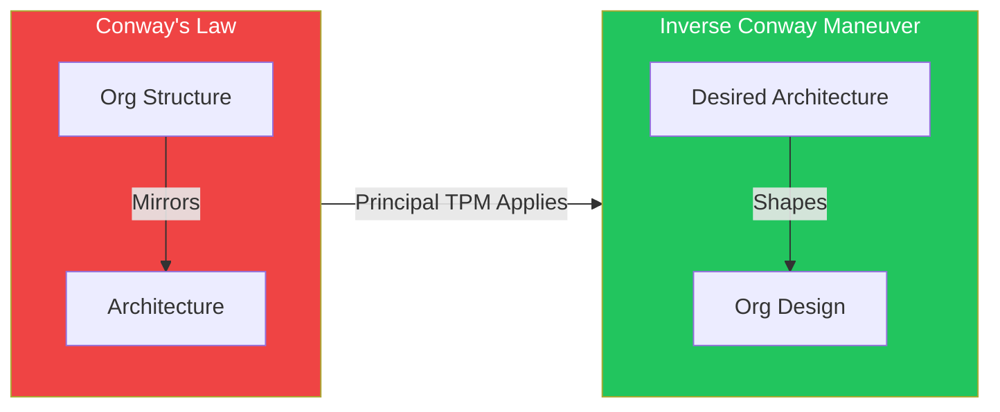
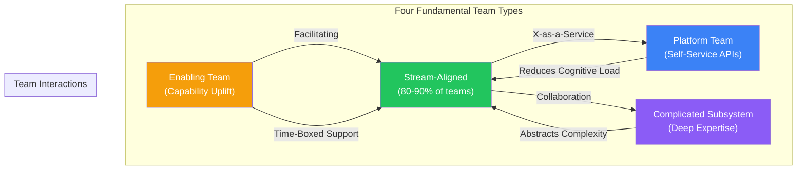
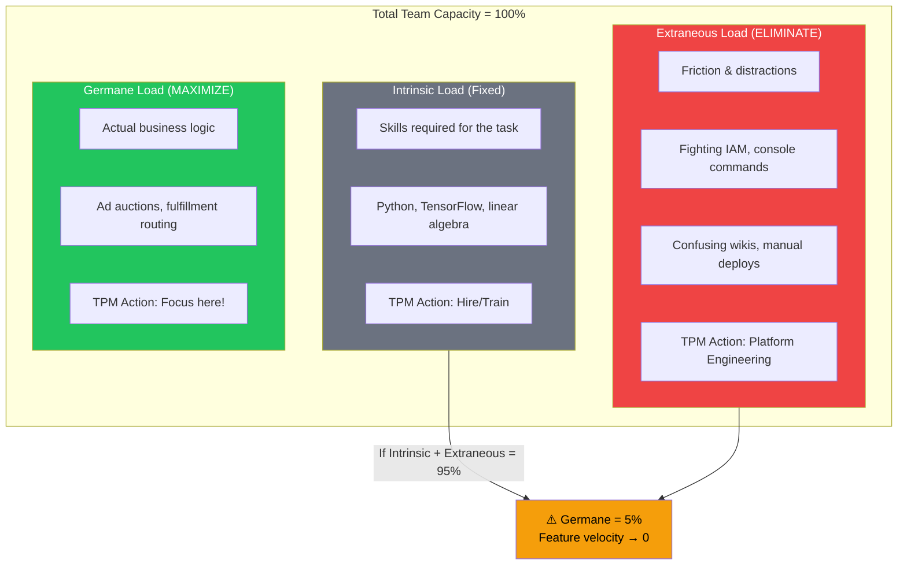
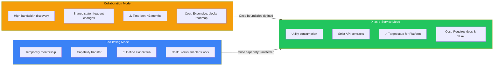

# Team Topologies & Conway's Law

Organizations ship their org charts—this is Conway's Law, and at Principal TPM level, it's your most powerful lever for architectural change. You cannot refactor a monolith into microservices while keeping a monolithic "Backend Engineering" team; the communication paths will recreate the coupling. This guide equips you to apply the Inverse Conway Maneuver strategically, deploy the four fundamental team types (Stream-Aligned, Platform, Enabling, Complicated Subsystem) correctly, manage cognitive load as a finite system resource, and mandate interaction modes that force the architectural coupling you want.

## I. Introduction: The Strategic Intersection of Org Design and Architecture

At the Principal TPM level, you must view organizational design not as an HR administrative task, but as a primary input into system architecture. The alignment between how teams communicate and how software components communicate determines the velocity, stability, and scalability of the platform.

### 1. The Mechanism of Action: Communication Paths as Architectural Constraints

Conway’s Law operates on the principle of **Cognitive Load** and **Communication Cost**. Software interfaces (APIs, shared libraries, database schemas) are rigid representations of human negotiation.

*   **High-Bandwidth Communication (Co-located/Same Team):** When developers communicate freely and frequently, they tend to create **tightly coupled code**. They rely on implicit knowledge ("I know Bob changed that function, so I'll update mine"). This results in monolithic architectures or "big balls of mud" where separation of concerns is blurred.
*   **Low-Bandwidth Communication (Different Depts/Timezones):** When communication is expensive or slow, developers instinctively create **strict interfaces** (contracts) to minimize the need for future interaction. This naturally results in decoupled, service-oriented architectures.

**Mag7 Real-World Behavior:**
*   **Amazon (The API Mandate):** Jeff Bezos’ famous mandate wasn't just technical; it was an organizational constraint. By forbidding "backdoor" database access and forcing teams to communicate only via hardened APIs, Amazon artificially increased the "cost" of coupling. This forced the organization to fracture into autonomous units (2-pizza teams) that could scale AWS services independently.
*   **Google (The Monorepo Paradox):** Google uses a monolithic repository, which theoretically suggests a monolithic application. However, Google counters Conway’s Law using **strict tooling (Bazel)** and **Code Ownership** (`OWNERS` files). Even though the code lives together, the build system enforces strict visibility rules (public vs. private targets). The tooling acts as a proxy for organizational boundaries, preventing the "spaghetti code" that usually results from a shared codebase.

### 2. The Inverse Conway Maneuver: Strategic Reorganization

The "Inverse Conway Maneuver" is the proactive application of this principle: **Design the organization you want the software to look like.**

If you are tasked with breaking a legacy monolith into microservices, you cannot succeed by keeping a single, large "Backend Engineering" team. You must first fracture the team into smaller squads aligned with the desired Bounded Contexts (e.g., "Checkout," "Inventory," "User Profile").

**Execution Steps for a Principal TPM:**
1.  **Identify Bounded Contexts:** Map the domain. Where are the natural seams in the business logic?
2.  **Align Teams to Seams:** Create cross-functional teams (Product, Eng, Design, QA) for each context.
3.  **Restrict Communication:** Deliberately reduce the frequency of detailed technical coordination between these new teams. Force them to define contracts (gRPC/REST/Thrift) to interact.

**Tradeoffs & Risks:**
*   **The "Distributed Monolith" Risk:** If you split the teams but they still share a single database or require lock-step deployments, you have incurred the operational cost of microservices (network latency, tracing difficulty) without the benefit of improved velocity.
*   **Skill Duplication:** Autonomous teams often require redundant skills (e.g., every team needs a DevOps engineer or a DB expert), which lowers resource utilization efficiency compared to centralized functional pools.
*   **Standardization vs. Autonomy:** Highly decoupled teams may choose divergent tech stacks (e.g., Team A uses Java, Team B uses Go). This increases the burden on Platform Engineering to support polyglot environments.

### 3. Impact on Business Capabilities and ROI

The structural alignment of teams and architecture directly impacts the "Four Key Metrics" (DORA metrics):

1.  **Deployment Frequency & Lead Time:**
    *   *Aligned:* Teams deploy independently. ROI: Faster Time-to-Market (TTM).
    *   *Misaligned:* Teams wait for "release trains" or integration testing across the whole org. ROI: Slow feature release.

2.  **Change Failure Rate & MTTR:**
    *   *Aligned:* Failures are contained within the blast radius of the specific service/team.
    *   *Misaligned:* A bug in the "User" module brings down the "Checkout" flow because the codebases are entangled.

**Mag7 ROI Example:**
At **Netflix**, the architecture is designed for failure (Chaos Engineering). The organization mirrors this. Teams are "loosely coupled but highly aligned." The ROI is that Netflix can push thousands of deployments daily with minimal downtime. If they had a centralized "Operations" team acting as a gatekeeper (a bottleneck structure), their architectural capability to stream globally would be throttled by the human capacity of that Ops team.

### 4. Handling Legacy and Hybrid States

Rarely will you design an org from scratch. You will likely inherit a "Brownfield" environment.

*   **The "Team API" Approach:** Even if you cannot re-architect the code immediately, you can re-architect the *interaction*. Treat the team as an API. Define clear intake processes, SLAs, and documentation requirements for how other teams request work. This reduces cognitive load and prepares the ground for eventual software decoupling.
*   **Temporary Task Forces:** To break a dependency cycle, you may need to temporarily violate Conway’s Law by co-locating members from two dependencies into a "Tiger Team" to build the decoupling interface, then disbanding them back to their autonomous structures.

## II. The Four Fundamental Team Types

As a Principal TPM, your primary objective in organizational design is to optimize for **fast flow** while managing **cognitive load**. You must treat team structures as mutable architectural components. If a team is struggling to deliver, it is rarely a "people problem"; it is usually a topology problem where the team's type does not match its assignment or cognitive load.

The four fundamental team types provide a schema for diagnosing these bottlenecks.

### 1. Stream-Aligned Team (The Primary Value Unit)

This is the default team type. In a healthy Mag7 organization, **80-90%** of teams should be stream-aligned. These teams are aligned to a single, valuable stream of work—usually a specific product, user journey, or persona (e.g., the "Checkout" team at Amazon or the "News Feed Ads" team at Meta).

*   **Technical & Operational Behavior:**
    *   **Full Ownership:** They own the "full stack" of their slice, including application code, testing, and production monitoring. They operate under the "You Build It, You Run It" (YBIYRI) model.
    *   **No Handoffs:** They do not hand off to QA or Ops. They consume platforms via self-service APIs to deploy.
    *   **Cognitive Load Management:** If a Stream-Aligned team spends >20% of their time on infrastructure plumbing or complex mathematical subsystems, the topology is failing.

*   **Real-World Mag7 Example:**
    *   **Amazon (Two-Pizza Teams):** A classic example where a small team owns a specific service (e.g., AWS S3 Bucket policy management) end-to-end. They have a roadmap, a P&L (shadow or real), and direct customer feedback loops.
    *   **Netflix (Full Cycle Developers):** Developers are expected to manage the lifecycle of their microservices. They are stream-aligned to specific content delivery features (e.g., the recommendation row).

*   **Tradeoffs:**
    *   **Pro:** Maximizes velocity and customer responsiveness. Minimizes wait times/dependencies.
    *   **Con:** High risk of cognitive burnout if the underlying platform is immature. Requires generalist "T-shaped" talent which is expensive and harder to hire.

*   **Business & ROI Impact:**
    *   **ROI:** Fastest time-to-value.
    *   **CX:** Direct correlation between team output and customer metrics (conversion, retention).

### 2. Enabling Team (The "Force Multipliers")

Enabling teams are composed of specialists in a specific domain (Security, Accessibility, Architecture, CI/CD) who bridge the capability gap for Stream-Aligned teams.

*   **Technical & Operational Behavior:**
    *   **Consultative, Not operational:** They do **not** own the backlog or fix the bugs. They teach the Stream-Aligned team how to fix the bugs.
    *   **Temporary Engagement:** An Enabling team might embed with a Stream-Aligned team for 6 weeks to help them migrate to a new tech stack or implement a new security protocol, then they leave.
    *   **Goal:** Their success metric is the *increased velocity or capability* of the Stream-Aligned team, not their own output.

*   **Real-World Mag7 Example:**
    *   **Google (SRE Engagement Model):** While Google has Platform SREs, they also have consulting SREs who engage with product teams to help them design for reliability, define SLOs/SLIs, and then disengage once the product team is self-sufficient.
    *   **Microsoft (CSE/ISE):** Engineering teams that partner with internal or external groups to solve hard technical challenges, upskilling the partner team in the process.

*   **Tradeoffs:**
    *   **Pro:** Prevents "Not Invented Here" syndrome and spreads best practices without creating permanent dependencies.
    *   **Con:** Hard to measure ROI directly. If they become a "fix-it" squad, they become a bottleneck and prevent the Stream-Aligned team from learning (the "give a man a fish" anti-pattern).

*   **Business & ROI Impact:**
    *   **Skill:** Critical for upleveling the organization without mass hiring.
    *   **Capabilities:** Accelerates adoption of new technologies (e.g., shifting an org to GenAI).

### 3. Complicated Subsystem Team (The "Specialists")

This team type is responsible for a part of the system that depends on heavy specialized knowledge (PhDs, advanced math, niche hardware drivers) such that most generalist engineers would not be able to understand it quickly.

*   **Technical & Operational Behavior:**
    *   **Encapsulation:** They wrap complex logic (e.g., video codecs, physics engines, real-time bidding algorithms) inside a clean interface.
    *   **Cognitive Load Shield:** Their existence is justified *only* to reduce the cognitive load on Stream-Aligned teams. If a generalist *could* do it reasonably well, this team should not exist.

*   **Real-World Mag7 Example:**
    *   **Meta (Oculus/Reality Labs):** Teams working specifically on Inside-Out Tracking algorithms. A generalist UI team building the VR menu shouldn't need to understand computer vision SLAM algorithms; they just need the coordinate output.
    *   **Apple (Core Audio/Core Graphics):** Low-level framework teams optimizing for silicon. App store teams consume these frameworks but do not modify them.

*   **Tradeoffs:**
    *   **Pro:** Allows high-quality execution on extremely difficult technical problems.
    *   **Con:** Creates a synchronization bottleneck. If the Stream-Aligned team needs a change in the subsystem, they must wait. This breaks flow.

*   **Business & ROI Impact:**
    *   **Differentiation:** Often builds the "moat" or IP that distinguishes the Mag7 product from competitors.
    *   **Risk:** High "Bus Factor." If key specialists leave, the subsystem may become unmaintainable.

### 4. Platform Team (The "Internal Product")

The Platform team provides the foundation that allows Stream-Aligned teams to deliver work with minimal friction. They provide "X-as-a-Service" internal products.

*   **Technical & Operational Behavior:**
    *   **Thinnest Viable Platform (TVP):** The goal is not to build a massive beast, but the smallest set of APIs, tools, and documentation needed to accelerate the Stream-Aligned teams.
    *   **Product Mindset:** They must treat internal developers as customers. They should have Product Managers (PMs) and track NPS/CSAT of their tools.
    *   **Self-Service Mandate:** If a Stream-Aligned team has to open a Jira ticket and wait for the Platform team to do something (e.g., provision a database), the Platform team has failed. It must be API-driven.

*   **Real-World Mag7 Example:**
    *   **Netflix (The "Paved Road"):** The platform team builds tools (Spinnaker, Titus) that are so good, engineers *want* to use them. Usage is optional but highly incentivized because it handles logging, monitoring, and scaling out of the box.
    *   **Google (Borg/Kubernetes/Blaze):** The internal developer infrastructure groups. They abstract away the complexity of running code across data centers.

*   **Tradeoffs:**
    *   **Pro:** Massive economies of scale and standardization. Reduces cognitive load across the entire org.
    *   **Con:** Risk of building "Ivory Tower" architecture that solves theoretical problems rather than actual user needs. High initial investment before ROI is realized.

*   **Business & ROI Impact:**
    *   **ROI:** Reduces OpEx by standardizing tooling and infrastructure.
    *   **Velocity:** The primary driver of organizational scale. You cannot have 10,000 engineers without a robust Platform team.

---

## III. Cognitive Load Management

At the Principal TPM level, you must view **Cognitive Load** not as a psychological concept, but as a finite system resource, similar to CPU cycles or memory. If a team’s cognitive capacity is saturated by infrastructure complexity, deployment friction, or sprawling domain logic, they have zero capacity left for value delivery or innovation.

As systems scale at Mag7 companies, the default trajectory is for cognitive load to increase until it paralyzes the team. Your role is to architect processes and team boundaries that cap this load.

### 1. The Three Types of Cognitive Load in Engineering

To manage load, you must first categorize it. *Team Topologies* adapts Sweller's Cognitive Load Theory into three buckets relevant to software delivery.

*   **Intrinsic Load (The Skills):** The complexity defined by the fundamental skills required for the task.
    *   *Example:* A team building a Machine Learning model needs to know Python, TensorFlow, and linear algebra.
    *   *TPM Action:* This is fixed by hiring and training. You generally cannot "process" this away.
*   **Extraneous Load (The Friction):** The distractions and unnecessary tasks that do not add direct value to the product.
    *   *Example:* Remembering complex console commands to deploy, fighting with IAM permissions, manually configuring VPCs, or navigating a confusing corporate wiki to find an API spec.
    *   *TPM Action:* **Ruthlessly eliminate.** This is pure waste. This is where "Platform Engineering" and "Developer Experience" (DevEx) teams yield high ROI.
*   **Germane Load (The Value):** The mental effort applied to the specific problem domain (business logic).
    *   *Example:* Understanding how ad auctions work (Google) or how fulfillment center routing logic operates (Amazon).
    *   *TPM Action:* **Maximize.** You want the team's mental energy spent here.

**The Principal TPM Equation:**
> *Total Capacity = Intrinsic + Extraneous + Germane*

If Intrinsic + Extraneous consumes 95% of the team's capacity, you will see feature velocity drop to near zero, regardless of headcount.

### 2. Mag7 Strategy: The "Paved Road" (Golden Path)

The primary mechanism Mag7 companies use to manage cognitive load is the **Paved Road** (a term popularized by Netflix) or "Golden Path."

*   **Concept:** Create a supported, opinionated, and automated path for building software. If a team stays on the path, the Extraneous Load (infrastructure, CI/CD, security, logging) is near zero because the platform handles it.
*   **Mag7 Real-World Behavior:**
    *   **Netflix:** Engineers can spin up a microservice with Spinnaker and standard libraries (Spring Boot wrappers) that handle all service discovery, metrics, and alerting out of the box.
    *   **Google:** The "Blaze" (Bazel) build system and "Borg" (Kubernetes predecessor) infrastructure. A developer defines a build target and a config file; the system handles the complexity of dependency management and global orchestration.
    *   **Meta:** The "Monorepo" strategy reduces cognitive load regarding versioning. You are always at `HEAD`. You don't waste brainpower debugging why Library V1.2 isn't talking to Service V2.4.

**The Tradeoff:**
*   **Adoption vs. Flexibility:** A Paved Road reduces load but restricts choice. If a team wants to use Rust when the Paved Road is Java, they must accept full ownership of the Extraneous Load (building their own CI/CD, security scanning, etc.).
*   **Principal TPM Role:** You must enforce that teams venturing "off-road" have the business justification and the operational maturity to handle the increased cognitive load without crashing.

### 3. Identifying Cognitive Overload (The Signals)

As a Principal TPM, you are often brought in to fix "slow" teams. You must distinguish between incompetence and cognitive overload. Look for these signals:

1.  **High Context Switching Cost:** Developers cannot complete a ticket without consulting three other teams or five different documentation sources.
2.  **Anxiety Deployments:** The team is afraid to deploy on Fridays or requires a "Release Captain" to manually oversee deployments because the system is too complex to trust automation.
3.  **Knowledge Hoarding:** Only one "Hero" engineer knows how the legacy subsystem works. This is a bottleneck and a single point of failure.
4.  **Operational Drudgery:** The team spends >50% of time on "Keep the Lights On" (KTLO) work or responding to pages, leaving no room for Germane (feature) work.

### 4. Strategic Intervention: Fracture Planes

When a team is overloaded, adding people often increases the load (communication overhead). The correct move is to split the system and the team along **Fracture Planes**.

Instead of splitting arbitrarily (e.g., Frontend vs. Backend), split by **Bounded Context** (Domain-Driven Design) to isolate cognitive load.

**Mag7 Examples of Splitting:**
*   **Amazon (AWS):** S3 is not one monolithic team. It is split into control plane, data plane, storage engine, and billing. A developer on the "Billing" team does not need to hold the complexity of the "Bit-rot detection algorithm" in their head.
*   **Splitting by Regulatory Compliance:** If a subset of data requires PCI-DSS or HIPAA compliance, split that into a separate team/service. Isolate the compliance cognitive load to a small group rather than forcing the whole org to learn the regulations.

### 5. Managing Interaction Modes to Reduce Load

*Team Topologies* defines specific interaction modes. A Principal TPM must police these to prevent load spikes.

*   **Collaboration:** High cognitive load. Two teams working closely together. Good for exploration/innovation, but unsustainable long-term.
*   **X-as-a-Service:** Low cognitive load. One team consumes another's service via an API or platform.
*   **Facilitating:** Medium load. One team helps another clear a hurdle.

**The Anti-Pattern:**
If Team A has to constantly ask Team B "How do I use your API?" or "Can you debug this for me?", the interaction mode is undefined, and cognitive load is bleeding between teams.
**The Fix:** Force an "X-as-a-Service" model. Demand documentation, clear SLAs, and self-service APIs. This encapsulates the complexity within the service provider, reducing the load on the consumer.

### 6. Business Impact & ROI

| Dimension | Impact of Managed Cognitive Load |
| :--- | :--- |
| **Velocity (ROI)** | Teams focus on business logic (Germane load). Features ship faster because "plumbing" (Extraneous load) is abstracted. |
| **System Stability** | Smaller, well-bounded domains mean engineers fully understand their service. This reduces "change failure rate" and MTTR (Mean Time To Recovery). |
| **Talent Retention** | High Extraneous load leads to burnout ("I hate fighting the tools"). High Germane load leads to engagement ("I love solving hard business problems"). |
| **Scalability** | You can add new teams without slowing down existing ones, provided the boundaries (APIs/Platform) are clean. |

## IV. Team Interaction Modes

At the Principal level, you must treat team interactions as defined interfaces, similar to software APIs. Just as a microservice cannot randomly access another service's database without creating tight coupling and fragility, a Stream-Aligned team cannot randomly "collaborate" with a Platform team without creating organizational drag.

The core responsibility of a Principal TPM here is **Cognitive Load Management**. If interaction modes are undefined, teams default to ad-hoc communication, leading to context switching and blocked dependencies. You must explicitly define, monitor, and evolve these modes to ensure the organizational architecture supports the technical architecture.

### 1. The Three Essential Interaction Modes

There are only three valid ways for teams to interact. Any interaction falling outside these definitions is likely a source of friction (waste).

#### A. Collaboration Mode (High-Bandwidth Discovery)
Two teams work together closely for a defined period to discover a solution to a shared problem. This is effectively "merging" the teams temporarily.

*   **Mag7 Behavior:**
    *   **Google:** Often seen when a Product Area (PA) is integrating a new, unproven technology from Google Research. The Research team and the Product team enter Collaboration mode to define the API boundaries.
    *   **Meta:** "Lockdowns" or "War Rooms" prior to a major feature launch (e.g., Threads launch) represent intense Collaboration mode to solve cross-stack latency issues.
*   **Tradeoffs:**
    *   *Pros:* High innovation speed; rapid discovery of boundaries; immediate feedback loops.
    *   *Cons:* **Extremely expensive.** High cognitive load for both teams. It reduces the velocity of roadmap delivery for anything *outside* the collaboration scope.
*   **Principal TPM Action:** You must time-box this. Collaboration is not a sustainable long-term state. If two teams are collaborating for >3 months, they should probably be merged, or the API definition is failing.

#### B. X-as-a-Service Mode (The Utility Pattern)
One team provides a service (API, tool, platform) that another team consumes with minimal collaboration. The "Service" team treats the "Consumer" team as a customer.

*   **Mag7 Behavior:**
    *   **Amazon (The Gold Standard):** The 2002 API Mandate required all teams to expose data/functionality through service interfaces. If Team A needs data from Team B, they hit the API. They do *not* Jira ticket Team B for a data dump.
    *   **Microsoft:** Azure Core providing compute primitives to higher-level services (like Office 365).
*   **Tradeoffs:**
    *   *Pros:* Maximum scaling; predictable delivery; near-zero cognitive load for the consuming team (if DX is good).
    *   *Cons:* Requires robust documentation, SLAs, and stability. If the "Service" is flaky or undocumented, this mode collapses into ad-hoc Collaboration (debugging together), killing velocity.
*   **Principal TPM Action:** Enforce Product Management on the Platform side. If the Platform team has no PM/TPM managing the "Service," they will fail to support the Stream-Aligned teams.

#### C. Facilitating Mode (The Unblocking Pattern)
One team actively helps another team clear a hurdle, adopt a new technology, or improve a capability. This is temporary mentorship or embedded expertise.

*   **Mag7 Behavior:**
    *   **Netflix:** Security Engineering teams often "embed" with a product team to help them design a secure architecture, then leave once the capability is transferred.
    *   **Google:** SRE (Site Reliability Engineering) "Mission Control" engagement. SREs consult with a product team to get their service to "GA-quality" reliability standards.
*   **Tradeoffs:**
    *   *Pros:* Upskilling; removing specific bottlenecks; standardization of best practices across silos.
    *   *Cons:* The facilitating team is not doing *their* core work while facilitating. Risk of the facilitating team becoming a "crutch" (doing the work *for* the stream team rather than teaching).
*   **Principal TPM Action:** Define "Exit Criteria." Facilitation must result in the Stream-Aligned team becoming self-sufficient in that specific domain.

### 2. Strategic Selection and Tradeoffs

A Principal TPM must recognize that the wrong interaction mode is often the root cause of missed OKRs.

| Interaction Scenario | Correct Mode | Failure Mode (What happens if you get it wrong) | Business Impact |
| :--- | :--- | :--- | :--- |
| **New Platform Feature** | **Collaboration** (initially) | **X-as-a-Service:** If you force an API too early, it will be the wrong API. The platform team builds a feature nobody uses. | Wasted Engineering Headcount (OpEx). |
| **Mature Infrastructure** | **X-as-a-Service** | **Collaboration:** If a product team has to Slack the DB team to provision storage, you cannot scale. | Slow Time-to-Market (TTM); inability to handle burst traffic. |
| **Adopting New Tech** | **Facilitating** | **X-as-a-Service:** Throwing a tool over the wall without training leads to "Shadow IT" or tool abandonment. | Tech Debt; Security Vulnerabilities. |

### 3. Impact on Business Capabilities and ROI

Implementing strict Interaction Modes drives specific ROI outcomes that resonate with VP/Director leadership:

1.  **Reduced Latency (Wait Times):** By moving from "Collaboration" (meetings) to "X-as-a-Service" (self-serve APIs), you remove human synchronization time.
    *   *Metric:* Reduction in "Ticket Wait Time" or "Provisioning Time."
2.  **Decoupled Release Cycles:** Correct interaction modes allow teams to release independently. If Team A consumes Team B via a stable Versioned API (X-as-a-Service), Team B can refactor their entire backend without coordinating with Team A.
    *   *Metric:* Deployment Frequency and Lead Time for Changes (DORA metrics).
3.  **Scalability of Expertise:** Facilitating mode allows a small team of experts (e.g., 5 AI Researchers) to upskill 50 Product Teams sequentially, rather than trying to build AI features for everyone simultaneously.
    *   *Metric:* Adoption rate of internal platforms/standards.

### 4. Detecting Interaction Drift (The TPM Sensor)

As a Generalist TPM, you debug the org by looking for these symptoms:

*   **The "Slack DM" Dependency:** If Team A cannot deploy without DMing an engineer on Team B, they are in a hidden "Collaboration" mode that should likely be "X-as-a-Service."
    *   *Fix:* Prioritize documentation and self-serve tooling for Team B.
*   **The "Ticket Black Hole":** If Team A files tickets against Team B that sit for weeks, Team B is likely a Platform team incorrectly staffed or structured as a "Stream" team, failing to provide X-as-a-Service.
    *   *Fix:* Implement SLAs; shift Team B's focus from "features" to "platform reliability."
*   **The "Forever Embed":** If a Security Engineer has been sitting in a Product team's standup for 6 months, Facilitating has failed.
    *   *Fix:* Establish a timeline for knowledge transfer and disengage.

## V. Organizational Design Impact on Architecture (The "So What?")

### 1. Cognitive Load as an Architectural Constraint

At the Principal level, you must treat **Team Cognitive Load** as a finite system resource, identical to CPU or Memory. When a team’s cognitive load is exceeded, the architectural consequence is the creation of a **"God Object" or "Distributed Monolith."**

If a single team is responsible for too many domains (e.g., Checkout, Inventory, *and* Shipping), they will inevitably take architectural shortcuts to manage the complexity. They will share databases, leak logic between modules, and avoid creating strict API boundaries because "it's all in our head anyway."

*   **The Metric:** You measure this via **Context Switching Cost** and **Onboarding Time**. If it takes a Senior Engineer 6 months to become productive, the architectural boundaries are too broad for the team size.
*   **Mag7 Behavior (Amazon):** This is the functional driver behind the "Two-Pizza Team." It is not just about communication overhead; it is a cap on the complexity of the software that team owns. If the software grows too complex for 8-10 people to maintain operational excellence (OE), the software—and the team—must be split (mitosis).
*   **Tradeoff:**
    *   *Splitting Teams:* Reduces cognitive load and increases domain velocity.
    *   *Cost:* Increases the "Coordination Tax." You have now introduced network latency and contract negotiation between previously internal logic blocks.
*   **Business Impact:** High cognitive load leads to higher Change Failure Rates (CFR) and lower Mean Time to Recovery (MTTR) because the team no longer understands the blast radius of their changes.

### 2. Interaction Modes: Hard-Coding Architectural Coupling

The way teams interact dictates the coupling of your architecture. *Team Topologies* defines three interaction modes. As a Principal TPM, you must **mandate the interaction mode** to force the desired architectural state.

#### A. X-as-a-Service (The Goal)
One team provides a component or platform as a service to another with minimal collaboration.
*   **Architecture:** Strict API contracts, versioned endpoints, high decoupling.
*   **Mag7 Example (AWS/Google Cloud):** Internal storage teams (e.g., S3 or Colossus) treat internal product teams (e.g., Lambda or YouTube) exactly like external customers. They do not share roadmaps; they share SLAs.
*   **Tradeoff:** High stability and scalability vs. low responsiveness to specific feature requests. The consumer team cannot "tweak" the provider's code.

#### B. Collaboration (The Exception)
Two teams work closely together for a defined period to discover new boundaries.
*   **Architecture:** Shared state, frequent breaking changes, "chatty" APIs.
*   **Mag7 Example:** A specialized AI/ML team working with a Product team to integrate a new recommendation engine.
*   **Tradeoff:** High innovation velocity vs. High coupling. If this mode persists too long, you create a dependency knot where neither team can deploy independently. **Action:** You must time-box this mode.

#### C. Facilitating (The Unblocker)
One team helps another clear impediments (e.g., an Enabling Team).
*   **Architecture:** Standardization, library adoption, reducing "Shadow IT."
*   **Mag7 Example:** Security Engineering teams embedding with a product team to upgrade encryption standards.
*   **Tradeoff:** Short-term velocity dip for the product team vs. Long-term compliance and security ROI.

### 3. The "Platform" Trap and Thinnest Viable Platform (TVP)

A common failure mode at Mag7 scale is the "Platform Team" that builds a massive abstraction layer that no Stream-Aligned team actually wants to use. This results in architectural fragmentation where product teams build "Shadow Platforms" to bypass the central team.

*   **The Strategy:** Enforce the **Thinnest Viable Platform (TVP)**. The platform should not be a mandate; it should be a compelling product.
*   **Mag7 Behavior (Netflix):** The **"Paved Road"** concept. Central Engineering provides a fully supported PaaS (paved road). Stream-aligned teams *can* choose to build their own infrastructure (go off-road), but they take on 100% of the operational burden (on-call, patching, compliance).
*   **Tradeoff:**
    *   *Standardization:* Reduces OpEx and improves security posture.
    *   *Autonomy:* Allowing "off-road" behavior increases innovation but risks creating "Zombie Services" if that team creates a custom stack and then disbands.
*   **ROI Impact:** A successful TVP reduces the "undifferentiated heavy lifting" (Jeff Bezos), allowing Stream-aligned teams to focus 100% of their capacity on business logic rather than Kubernetes config.

### 4. Reverse-Engineering Legacy Architectures

When tasked with decomposing a legacy monolith, you cannot simply refactor code. You must refactor the organization to apply pressure on the code.

*   **The Tactic:** Use the **Strangler Fig Pattern** applied to *teams*.
    1.  Identify a bounded context within the monolith (e.g., "User Profile").
    2.  Spin up a new Stream-Aligned team dedicated *only* to that domain.
    3.  Give them the mandate to build the new microservice *and* the anti-corruption layer (ACL) to the monolith.
    4.  Slowly drain talent from the "Monolith Maintenance Team" to the new team.
*   **Mag7 Behavior (Meta):** When migrating from the PHP monolith to specific Hack services, Meta didn't just rewrite code; they reorganized teams around high-traffic verticals (Newsfeed, Ads, Messenger), effectively starving the monolith of generalist maintenance until it became a set of libraries rather than a runtime application.
*   **Tradeoff:**
    *   *Efficiency:* You will have temporary duplication of data (dual writes) and logic.
    *   *Cost:* You are paying for two systems simultaneously (high infrastructure ROI hit short-term).
*   **Failure Mode:** If you keep the "Monolith Team" fully staffed while spinning up the "Microservices Team," the Monolith Team will continue adding features to the monolith faster than the new team can strangle them. You must **cap the headcount** of the legacy owner.

---

## Interview Questions

### I. Introduction: The Strategic Intersection of Org Design and Architecture

**Question 1: The Distributed Monolith**
"We recently broke our core platform team into four domain-specific squads to speed up development. However, we are finding that all four teams are still blocked by each other during release cycles, and our lead time has actually increased. Based on Conway’s Law and Team Topologies, what is likely happening, and how would you investigate and resolve this?"

*   **Guidance for a Strong Answer:**
    *   **Diagnosis:** Identify that the org structure changed, but the architectural dependencies (shared DB, shared libraries, or synchronous API calls) remain. This is a "Distributed Monolith."
    *   **Investigation:** Look at the "Wait Time" in Jira/Tasks. Look at the PR reviews (are Team A members reviewing Team B code?). Look at the deployment pipeline (does it require a 'world build'?).
    *   **Resolution:** Propose the "Inverse Conway Maneuver" correctly—align teams not just by feature, but by *decoupled data ownership*. Suggest implementing Contract Testing (e.g., Pact) to allow independent deployments.

**Question 2: Standardization vs. Velocity**
"You are leading a TPM effort to modernize a legacy stack. One high-performing team wants to use Rust for their new microservice, while the rest of the company uses Java. They claim it will make their specific service 10x faster and safer. Allowing this breaks our standardization, but blocking it hurts their autonomy. How do you decide, and how does this relate to organizational architecture?"

*   **Guidance for a Strong Answer:**
    *   **Framework:** Use the concept of "Paved Road" (Netflix/Spotify model).
    *   **Analysis:** Analyze the *Cognitive Load* on the platform team. Can the platform support Rust? If not, the product team must take on the *full* operational burden (building, deploying, patching, hiring for Rust).
    *   **Decision:** If the service is on the "critical path" for latency (e.g., high-frequency trading or ad-bidding), the divergence is architecturally justified. If it's a standard CRUD app, the organizational cost of fragmentation outweighs the local optimization. The answer must balance *Global Optimization* (company maintenance cost) vs. *Local Optimization* (team velocity).

### II. The Four Fundamental Team Types

### Question 1: Diagnosis & restructuring
**"I have a team responsible for our 'Checkout' experience. They are missing deadlines, morale is low, and their bug count is rising. Upon investigation, you see they are spending 40% of their time maintaining their custom CI/CD pipeline and another 20% debugging a legacy tax-calculation module. As a Principal TPM, how do you fix this using Team Topologies?"**

*   **Guidance for a Strong Answer:**
    *   **Identify the Anti-Pattern:** The Checkout team is a Stream-Aligned team suffering from excessive **Cognitive Load**. They are doing "shadow platform" work (CI/CD) and "complicated subsystem" work (Tax).
    *   **Apply the Solution:**
        1.  **Extract the Platform:** Move the CI/CD responsibility to a centralized Platform team or adopt a standard "Paved Road" solution.
        2.  **Isolate the Complexity:** If Tax calculation is complex/regulated, spin out a "Complicated Subsystem" team to own the tax engine, exposing it via a clean API. Or, buy a vendor solution (SaaS).
        3.  **Refocus:** The Checkout team should now focus 100% on the customer checkout flow (Stream-Aligned).
    *   **Metrics:** Measure success by the reduction in "wait time" and the increase in "deployment frequency" for the Checkout team.

### Question 2: Platform Strategy & Influence
**"You are launching a new internal developer platform to speed up microservice creation. However, several high-performing teams refuse to use it, claiming their custom bespoke tools are faster. How do you handle this?"**

*   **Guidance for a Strong Answer:**
    *   **Reject the Mandate:** Do not force migration immediately (unless it's a security compliance issue). Mandates kill morale and velocity.
    *   **Treat Platform as Product:** Acknowledge that if the platform isn't being used, it might lack product-market fit.
    *   **Use an Enabling Team:** Deploy an Enabling team to sit with the high-performers to understand *why* their tools are faster.
    *   **The "Paved Road" Strategy:** Improve the platform until it is visibly better (easier, more secure, free maintenance). Market it internally.
    *   **Define the Boundary:** Allow bespoke tools *if* the team accepts the full cost of ownership (YBIYRI) and meets strict interoperability/security SLAs. If they miss SLAs, they must migrate to the paved road.

### III. Cognitive Load Management

### Question 1: Diagnosis & Remediation
**"You have a critical team that owns the 'Checkout' service. They are missing deadlines, their on-call is a nightmare, and they claim the codebase is 'unmaintainable.' Leadership wants to double the team size to fix it. As a Principal TPM, how do you assess the situation and what is your counter-proposal?"**

*   **Guidance for a Strong Answer:**
    *   **Reject the premise:** Adding people to a high-cognitive-load mess usually slows it down (Brooks’s Law).
    *   **Assessment:** Measure the types of load. How much time is spent on deployment/infra (Extraneous)? How complex is the domain (Germane)? Is the scope too big (Checkout + Inventory + Payments)?
    *   **Strategy:** Propose splitting the team/service along a Fracture Plane (e.g., separate "Payment Processing" from "Cart Management").
    *   **Tactics:** Introduce a "Thinnest Viable Platform" or utilize existing Platform teams to offload the infrastructure drudgery.
    *   **Metric:** Success is defined by reduced context switching and improved lead time for changes, not just "more headcount."

### Question 2: The Tradeoff of Abstraction
**"We are planning to mandate a new internal PaaS (Platform as a Service) to reduce cognitive load for all product teams. However, our High-Frequency Trading (HFT) team claims this platform will prevent them from optimizing network latency and refuses to adopt it. How do you resolve this conflict?"**

*   **Guidance for a Strong Answer:**
    *   **Acknowledge the Tradeoff:** Cognitive load reduction (PaaS) usually comes at the cost of control/performance.
    *   **Differentiate Team Types:** The HFT team is likely a "Complicated Subsystem Team" (per Team Topologies). Their *Germane* load requires deep access to the metal.
    *   **Solution:** Grant an exception (variance) but define the cost. The HFT team must own their own Extraneous load (security patching, OS upgrades) because they are opting out of the Paved Road.
    *   **Governance:** Do not force the PaaS on them, but ensure the PaaS team does not build features *specifically* for the HFT edge case (which would bloat the platform for everyone else). Keep the platform focused on the 90% use case (Stream-Aligned teams).

### IV. Team Interaction Modes

**Question 1: The Platform Bottleneck**
"You are the Principal TPM for a Platform organization. The Product teams (your customers) are constantly complaining that your team is too slow, and they are blocked waiting for new API features. However, your Platform engineers are burnt out from constant context switching and meeting requests from these Product teams. Which interaction mode is currently active, which one should be active, and how do you manage the transition?"

*   **Guidance for a Strong Answer:**
    *   **Diagnosis:** Identify that the teams are currently stuck in ad-hoc **Collaboration** mode (high touch, meetings, negotiation), which is unscalable.
    *   **Target State:** The goal is **X-as-a-Service**. The Platform should be a product, not a consulting shop.
    *   **Execution:**
        1.  **Freeze Collaboration:** Institute a "Feature Request" process (temporarily bureaucratic) to stop the bleeding.
        2.  **Define the Thin Interface:** Work with Eng Leads to define a stable API surface area.
        3.  **Documentation First:** You cannot move to X-as-a-Service without documentation; otherwise, the Product teams *must* talk to the engineers.
        4.  **Facilitating Transition:** Use a brief "Facilitating" period where Platform engineers train Product engineers on how to use the self-serve tools, then withdraw.

**Question 2: The Monolith Breakup**
"We are breaking a legacy monolithic application into microservices. We have formed three new teams to handle Checkout, Search, and Inventory. Currently, the Checkout team breaks the Search team's build twice a week. They are blaming each other for lack of communication. How do you use Interaction Modes to fix this?"

*   **Guidance for a Strong Answer:**
    *   **Diagnosis:** The teams are structurally separated (Team Topologies) but architecturally coupled (Monolith). They are trying to operate as independent **Stream-Aligned** teams but the code requires them to be in **Collaboration** mode.
    *   **Strategy:**
        1.  **Acknowledge Reality:** Explicitly put the Checkout and Search tech leads into **Collaboration** mode. Create a temporary "Joint Task Force" (JTF).
        2.  **Define Boundaries:** The JTF's sole OKR is to define the gRPC/REST contract between Search and Checkout.
        3.  **Consumer-Driven Contracts (CDC):** Implement contract testing. This automates the "interaction" so if Checkout breaks Search, the build fails locally, not in the shared pipe.
        4.  **Shift to X-as-a-Service:** Once the contract is stable, dissolve the JTF. Search becomes a service provider to Checkout.
    *   **Key Insight:** Do not force "independence" before the architecture supports it. Use Collaboration to build the boundaries that *allow* for independence later.

### V. Organizational Design Impact on Architecture (The "So What?")

### Question 1: The "Inverse Conway" Failure
**"Imagine you have identified that a monolithic architecture is slowing down feature velocity. You successfully reorganized the engineering department into domain-specific, stream-aligned teams to encourage microservices. Six months later, the architecture is still a monolith, but now the teams are fighting over release windows. What happened, and how do you fix it?"**

*   **Guidance for a Strong Answer:**
    *   **Diagnosis:** The candidate should identify that org structure changes alone are insufficient without changes to **Governance and Tooling**. The "fighting over release windows" indicates a shared deployment pipeline (a "deployment monolith").
    *   **Root Cause:** The teams are stream-aligned logically but coupled physically via CI/CD or shared database schemas.
    *   **Action:** The Principal TPM must implement **Service Interface Contracts** and decouple the release pipelines.
    *   **The Fix:** Move teams from "Collaboration" mode (negotiating release slots) to "X-as-a-Service" (deploying independently via API contracts). Introduce "Contract Testing" to replace manual integration coordination.

### Question 2: Optimizing Cognitive Load vs. System Complexity
**"We have a 'Platform Team' at [Company] that owns the internal developer portal, the CI/CD pipeline, and the core authentication library. Their backlog is growing, and internal customer satisfaction (NPS) is dropping. Product teams are complaining they are blocked. Do we add more people to the Platform team, or do we break it up? Walk me through your decision framework."**

*   **Guidance for a Strong Answer:**
    *   **Framework:** Use *Team Topologies* to assess **Cognitive Load**. The Platform team likely owns disparate domains (Frontend portal vs. Backend Auth vs. DevOps pipelines).
    *   **Analysis:** Adding people to a confused domain increases communication overhead (Brooks' Law) and won't solve the blockage.
    *   **Solution:** The team should likely be split based on the nature of the product (fracture planes).
        *   *Split 1:* A "Platform Team" focused strictly on infrastructure/CI/CD (Thinnest Viable Platform).
        *   *Split 2:* An "Enabling Team" or specialized component team for Authentication (high security/compliance risk).
    *   **Tradeoff:** Acknowledge that splitting the team requires defining clear interfaces between the Portal and the Auth library, which may initially slow down development but will increase long-term throughput.

---

## Key Takeaways

1. **Apply the Inverse Conway Maneuver before refactoring**: Design the organization you want the software to look like—split teams along bounded contexts before attempting to decompose a monolith

2. **Target 80-90% Stream-Aligned teams in a healthy organization**: If most teams aren't aligned to value streams with full ownership (You Build It, You Run It), the topology is broken

3. **Treat cognitive load as a finite system resource**: If Intrinsic + Extraneous load consumes 95% of capacity, feature velocity drops to near zero regardless of headcount

4. **Time-box Collaboration mode to prevent dependency knots**: If two teams collaborate for >3 months, they should merge or the API definition is failing—Collaboration is expensive and unsustainable

5. **Enforce X-as-a-Service with Product Management rigor**: Platform teams without PMs treating developers as customers will fail to support Stream-Aligned teams at scale

6. **Build the Thinnest Viable Platform, not an ivory tower**: The platform should be a compelling product that teams want to use, not a mandate they circumvent with Shadow IT

7. **Define exit criteria for Facilitating mode engagements**: If an Enabling team embeds for 6+ months without transferring capability, facilitation has failed—they've become a crutch

8. **Use fracture planes, not arbitrary splits, when teams are overloaded**: Split by bounded context and data ownership, not by Frontend/Backend, to isolate cognitive load effectively

9. **Detect interaction drift through Slack DM dependencies and ticket black holes**: Hidden Collaboration mode masquerading as independence indicates undefined interaction contracts

10. **Cap legacy team headcount during Strangler Fig migrations**: If you keep the monolith team fully staffed while spinning up microservices teams, the monolith will grow faster than you can strangle it
