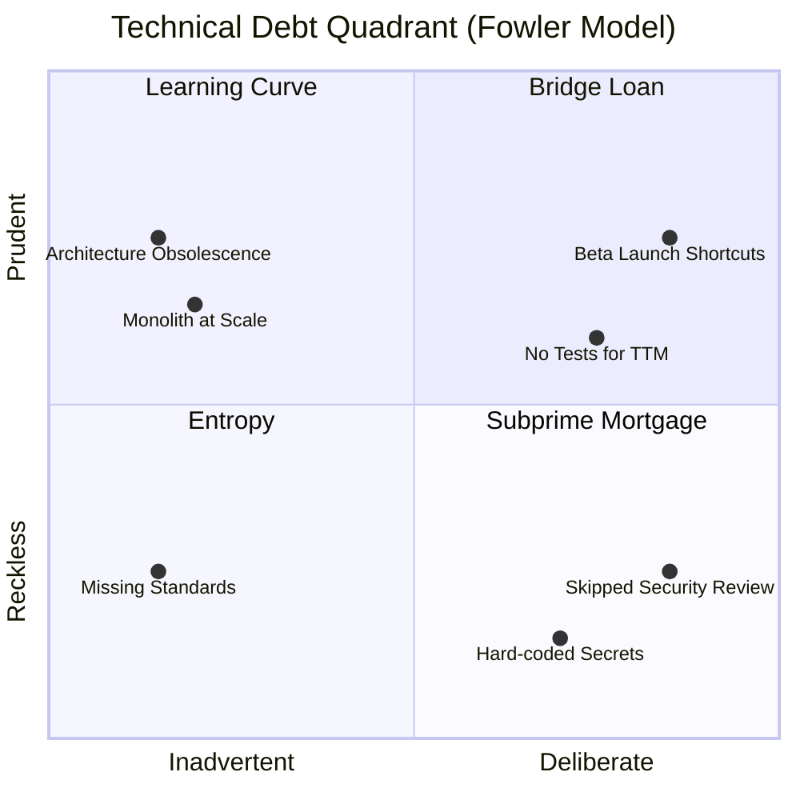
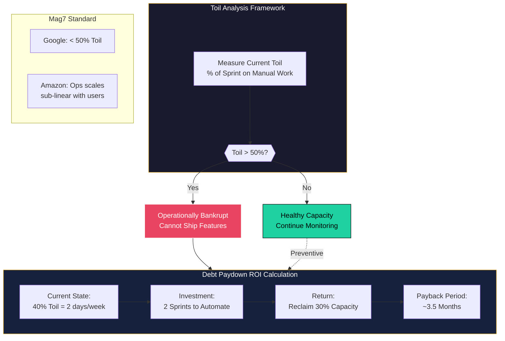
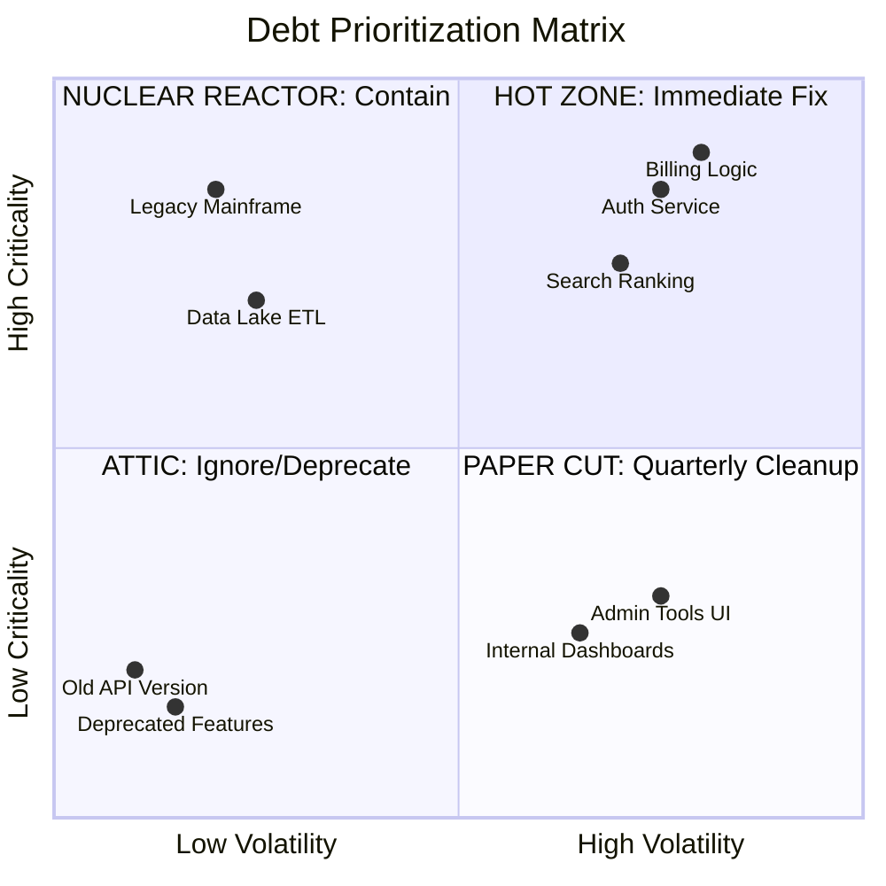
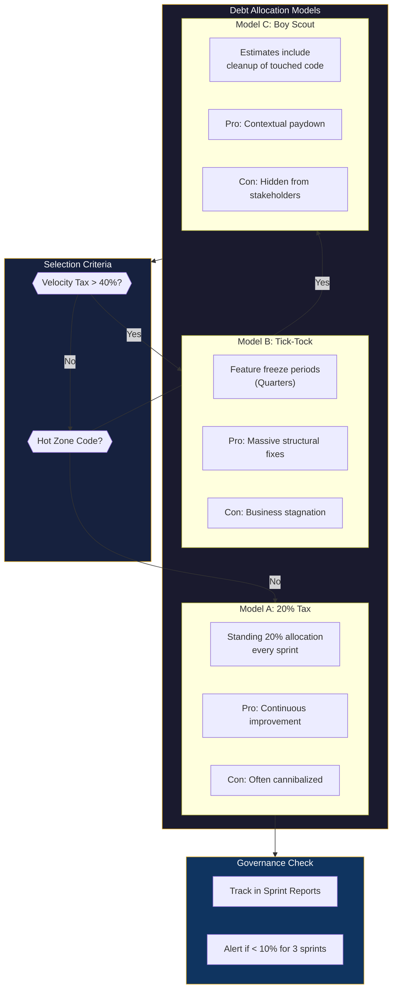
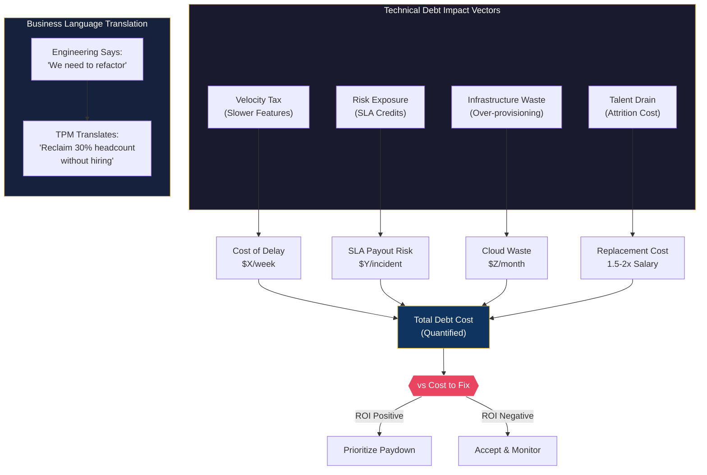

# Technical Debt Quantification

This guide covers 5 key areas: I. Strategic Context: Defining Debt for the Principal TPM, II. Quantitative Metrics and Measurement Frameworks, III. Categorization and Prioritization Models, IV. Governance: How Mag7 Companies Manage Debt, V. Business Impact and ROI Analysis.

## I. Strategic Context: Defining Debt for the Principal TPM

At the Principal level, technical debt must be reframed from an engineering nuisance to a **strategic portfolio management** challenge. You are not managing a backlog of bugs; you are managing a risk ledger. In a Mag7 environment, where systems operate at hyperscale, the definition of debt expands beyond code quality to include architectural rigidity, operational toil, and "glue code" complexity—particularly in AI/ML pipelines.

The Principal TPM acts as the broker between Engineering (who bears the interest payments) and Product/Business (who benefitted from the principal loan). Your strategic definition must distinguish between **Prudent-Deliberate** debt (leveraging speed for market capture) and **Reckless-Inadvertent** debt (incompetence or process failure).

### 1. The Four Quadrants of Debt at Scale

To effectively manage debt, you must categorize it. Mag7 companies often utilize a variation of Martin Fowler’s Technical Debt Quadrant, but operationalized for massive distributed systems.

*   **Prudent/Deliberate (The "Bridge Loan"):**
    *   **Definition:** Consciously cutting scope or hard-coding a configuration to meet a hard deadline (e.g., Black Friday or a keynote launch).
    *   **Mag7 Behavior:** When Amazon launches a new service in preview (Beta), they often skip automated scaling or multi-region redundancy initially. This is documented, tracked, and has a mandatory repayment date (General Availability).
    *   **Tradeoff:** You gain **Time-to-Market (TTM)** and feedback loops. You sacrifice immediate reliability or scalability.
    *   **Business Impact:** High ROI if the feature succeeds; wasted effort if the feature is deprecated. The risk is if the "Bridge Loan" becomes a permanent mortgage.

*   **Prudent/Inadvertent (The "Learning Curve"):**
    *   **Definition:** The team wrote the best code they could, but the scale or requirements shifted, rendering the architecture obsolete.
    *   **Mag7 Behavior:** Netflix’s transition from monolithic architecture to microservices was a response to this. The original architecture wasn't "bad," it just couldn't support the new scale.
    *   **Tradeoff:** Refactoring requires halting feature work. Ignoring it leads to "scalability cliffs" where the system fails non-linearly under load.
    *   **Business Impact:** This is a CapEx investment. Paying this down increases **System Agility** and raises the ceiling for future growth.

*   **Reckless/Deliberate (The "Subprime Mortgage"):**
    *   **Definition:** Skipping testing, ignoring security reviews, or hard-coding secrets to "just get it done."
    *   **Mag7 Behavior:** This is culturally rejected at the Principal level. If a TPM identifies this, it triggers an immediate "Stop the Line" (Andon Cord) event.
    *   **Tradeoff:** Short-term speed for almost guaranteed long-term failure or security breach (e.g., Log4j vulnerabilities due to poor dependency management).
    *   **Business Impact:** catastrophic risk to **Brand Trust** and potential regulatory fines.

*   **Reckless/Inadvertent (The "Entropy"):**
    *   **Definition:** Developers don't know better; lack of mentorship or standards.
    *   **Mag7 Behavior:** Addressed via "Paved Road" or "Golden Path" platform engineering. If teams deviate from the standard CI/CD pipelines without cause, they generate this debt.
    *   **Tradeoff:** High freedom for devs vs. standardization.
    *   **Business Impact:** Increases **Onboarding Time** and reduces **Developer Velocity** across the org.

### 2. Infrastructure and Data Debt (The Hidden Iceberg)

For a Generalist/Product Principal TPM, the most dangerous debt is often not in the application code, but in the infrastructure and data layers.

**Infrastructure as Code (IaC) Drift:**
*   **Context:** In Azure or AWS, manual changes to production environments (ClickOps) create a divergence from the defining Terraform/CloudFormation templates.
*   **Mag7 Example:** Google SRE practices strictly forbid manual production changes. If a config change isn't checked into version control, it doesn't exist.
*   **Tradeoff:** Enforcing strict IaC slows down emergency fixes (hotfixes) but ensures reproducibility.
*   **ROI/Capability:** Prevents "Snowflake Servers" that cannot be recreated during a Disaster Recovery (DR) event.

**Data & AI "Glue Code":**
*   **Context:** As Mag7 companies pivot to AI-first strategies, "Hidden Technical Debt in Machine Learning Systems" (a famous Google paper) becomes critical. 95% of ML code is glue code (data ingestion, cleaning, feature extraction), not the model itself.
*   **Mag7 Behavior:** Meta’s move to standardize ML pipelines (FBLearner Flow) was a direct response to the massive debt of ad-hoc Python scripts running critical ad-ranking models.
*   **Tradeoff:** Building a centralized ML platform is expensive and restricts data scientist flexibility.
*   **Business Impact:** Reduces **Model Time-to-Production** from months to days. Poor management here leads to "Model Drift" where revenue drops silently because the model is training on bad data.

### 3. The "Interest Rate" of Toil

You must quantify the cost of carry. In SRE terms, this is "Toil"—manual, repetitive work required to keep the service running.

*   **Defining the Threshold:**
    *   If Toil > 50% of engineering time, the team is operationally bankrupt. They cannot ship features.
    *   **Mag7 Standard:** Google targets <50% Toil. Amazon often mandates that operational load (ticket volume) must scale sub-linearly with customer growth. If customers double, tickets cannot double.
*   **The Principal TPM Action:**
    *   You do not ask for "time to refactor." You present a **Capacity Planning Model**.
    *   *Example:* "Currently, 40% of sprint capacity is consumed by manual data patching (Debt Interest). If we invest 2 sprints (Principal Paydown) to automate this, we reclaim 30% capacity permanently. ROI is achieved in 3.5 months."
*   **Tradeoff:** Short-term roadmap delay (Quarter 1 features slipped) for increased Long-term Throughput (Quarter 2-4 acceleration).

### 4. Strategic Governance: The Debt Budget

A Principal TPM creates governance structures to manage debt as a flow, not a backlog.

**The 20% Tax Rule:**
*   **Strategy:** Allocate a fixed percentage of every planning cycle (Sprint/PI) to debt reduction/engineering health.
*   **Mag7 Real-World:** LinkedIn famously paused feature development for months (Project Inversion) to fix deployment tooling. Now, most Mag7 teams allocate ~20% of capacity to "Engineering Health" by default.
*   **Tradeoff:** Product Management effectively loses 1 day per week of engineering time.
*   **Business Impact:** This "tax" buys **Reliability** and **Retention**. It prevents the "Big Rewrite," which is almost always a business failure.

**The "Deprecation Policy" as a Weapon:**
*   **Strategy:** Aggressively deprecating old APIs/versions to force debt paydown by consumers.
*   **Mag7 Real-World:** Microsoft Azure or AWS deprecating old API versions. They set a "Sunset Date." If internal teams (or customers) don't migrate, their services break.
*   **Tradeoff:** High friction for internal dependent teams; they must stop feature work to migrate.
*   **Business Impact:** Reduces the **Cognitive Load** on the platform team (maintaining one version vs. five) and reduces the **Attack Surface** for security threats.

## II. Quantitative Metrics and Measurement Frameworks
To manage debt, you must measure it. A Generalist TPM relies on three specific buckets of metrics to triage debt health.

### 1. The Velocity Tax (Process Metrics)
This measures how much debt slows you down.
*   **Metric:** **Cycle Time Trend.**
    *   *Definition:* The time from "Commit" to "Production."
    *   *Signal:* If Cycle Time increases by 20% over two quarters while team size remains constant, the delta is likely caused by architectural complexity or fragile testing suites (debt).
*   **Metric:** **KTLO Ratio.**
    *   *Definition:* Percentage of engineering hours spent on maintenance/bugs vs. new feature development.
    *   *Mag7 Standard:* A healthy team targets <20% KTLO. Anything >40% triggers an automatic review.

### 2. The Stability Tax (Quality Metrics)
This measures the user impact of debt.
*   **Metric:** **Change Failure Rate (CFR).**
    *   *Definition:* The percentage of deployments causing a failure in production.
    *   *Signal:* High CFR indicates "testing debt" or "deployment pipeline debt."
*   **Metric:** **Mean Time to Recovery (MTTR).**
    *   *Definition:* How long it takes to fix a breakage. High MTTR suggests "observability debt" (logs/monitoring are insufficient).

### 3. The Code Health Tax (Static Analysis)
While TPMs don't write the checks, they monitor the trends.
*   **Metric:** **Code Churn vs. Complexity.**
    *   *Definition:* Files that are changed frequently (High Churn) AND have high Cyclomatic Complexity.
    *   *Quantification:* These "Hotspots" are where 80% of bugs will occur. A Principal TPM prioritizes refactoring these specific modules over general cleanup.

**Tradeoffs:**
*   **False Positives:** Static analysis tools often flag non-critical issues. Blindly following these metrics can lead to "metric hacking" where engineers fix easy style warnings rather than deep architectural flaws.

---

## III. Categorization and Prioritization Models

Once technical debt is quantified, the Principal TPM must lead the categorization and prioritization process. At the Mag7 scale, this is not a subjective exercise of "cleaning up code"; it is a portfolio management challenge. You are managing a portfolio of liabilities, deciding which to pay off, which to refinance (mitigate), and which to default on (deprecate).

### 1. The Four-Quadrant Categorization Model

While standard engineering teams might categorize debt by "frontend vs. backend," a Principal TPM must categorize by **business risk and volatility**. This determines the urgency of repayment.

**The Model:**
Plot your debt items on a 2x2 matrix: **Volatility** (How often do we touch this code?) vs. **Criticality** (If this breaks, does revenue stop?).

1.  **High Volatility / High Criticality (The "Hot Zone"):**
    *   **Definition:** Core billing logic, authentication services, or main search loops that are frequently updated.
    *   **Action:** Immediate repayment. This debt causes the highest "interest payments" via merge conflicts, regressions, and Sev-1 incidents.
    *   **Mag7 Example:** At **Meta**, core News Feed ranking algorithms undergo constant experimentation. Any architectural debt here slows down the "metric-moving" experiments essential for ad revenue. This area is aggressively refactored.
2.  **Low Volatility / High Criticality (The "Nuclear Reactor"):**
    *   **Definition:** Legacy mainframe connections or foundational data stores that work but are fragile.
    *   **Action:** **Containment.** Do not rewrite unless necessary. Wrap it in APIs (Strangler Fig pattern) and add heavy monitoring. Rewriting stable critical systems introduces massive regression risk with low ROI on velocity.
3.  **High Volatility / Low Criticality (The "Paper Cut"):**
    *   **Definition:** Internal admin tools, non-critical UI features, experimental side-bets.
    *   **Action:** **Quarterly Cleanup.** Allocate "Fix-it" weeks or hackathons.
4.  **Low Volatility / Low Criticality (The "Attic"):**
    *   **Definition:** Deprecated features still in use by <1% of users.
    *   **Action:** **Ignore or Deprecate.** Paying down this debt has negative ROI. The correct business move is often to EOL (End of Life) the feature rather than fix the code.

**Tradeoffs:**
*   **Stability vs. Modernization:** Keeping "Nuclear Reactor" code (Low Volatility/High Criticality) avoids regression risk but creates a "knowledge silo" where only tenured engineers understand the system. This becomes a **Bus Factor** risk.
*   **Business Impact:** Correct categorization prevents "Resume Driven Development," where engineers rewrite stable legacy systems in Rust/Go just to learn new tech, delivering zero value to the customer.

### 2. Prioritization Frameworks: RICE vs. The "Pain" Index

Generalist TPMs often use RICE (Reach, Impact, Confidence, Effort) for features. For debt, RICE fails because "Reach" is internal. Instead, use the **Debt-to-Value (D2V)** framework or the **Pain Index**.

#### The Pain Index (Mag7 Approach)
This is a data-driven approach often used in SRE-heavy cultures (Google/Microsoft).

*   **Formula:** `Pain Score = (Frequency of Touch) × (Cycle Time Penalty + Incident Restoration Time)`
*   **Application:** If a specific library requires 2 hours of manual config for every deployment and is deployed 10 times a week, the cost is 20 engineering hours/week.
*   **Prioritization Logic:** Sort the backlog by *Hours Saved per Quarter*. This translates abstract "clean code" into "Headcount Returned."

#### Mag7 Real-World Example: Amazon's "Correction of Error" (COE)
When an incident occurs at Amazon, a COE is written. If the root cause is identified as technical debt (e.g., "manual database patching led to downtime"), an action item is created.
*   **The Rule:** COE action items generally trump feature work. This is a mechanism that prioritizes debt based on *proven* risk (it already caused an outage) rather than *theoretical* risk.

**Tradeoffs:**
*   **Reactive vs. Proactive:** Relying solely on COEs or Pain Indexes is reactive. You only fix things after they break or hurt.
*   **Mitigation:** The Principal TPM must balance this with *strategic* debt repayment (e.g., moving from Monolith to Microservices), which may not hurt *today* but caps scalability *tomorrow*.

### 3. Allocation Models: How to Fund the Repayment

Once prioritized, how do you resource the work? There are three standard models used at the Principal/Director level.

#### Model A: The 20% Tax (Google Model)
**Concept:** Engineers have a standing allocation (often 20%) to work on technical debt, refactoring, or tooling.
*   **Pros:** Continuous improvement; empowers engineers.
*   **Cons:** Hard to police. Often gets cannibalized by "crunch time" feature delivery.
*   **TPM Action:** You must audit sprint reports. If "Tech Debt" tickets constitute <10% of closed points for three consecutive sprints, you must flag a **Process Risk** to leadership.

#### Model B: The "Tick-Tock" or "Inversion" (LinkedIn/Apple Model)
**Concept:** Feature freezes.
*   **Real-World Context:** **LinkedIn's "Operation Inversion"** halted feature development for months to fix architecture and deployment speeds.
*   **Pros:** massive, concentrated impact. Solves structural architectural issues that cannot be fixed in 2-week sprints.
*   **Cons:** Business stagnation. Marketing/Sales have nothing new to sell.
*   **TPM Action:** Only deploy this when the **Velocity Tax** (see Section II) exceeds 40-50%. You must present a business case: "If we pause for Q3, Q4 velocity will increase by 2x."

#### Model C: The "Boy Scout" Rule (Embedded Tax)
**Concept:** Estimates for features *include* the cost to refactor the area being touched.
*   **Pros:** Debt is paid down contextually.
*   **Cons:** "T-shirt sizing" and estimates inflate. Stakeholders lose visibility into how much time is actually spent on debt.
*   **TPM Action:** Use this for "Hot Zone" code (High Volatility). Do not use this for major architectural migrations.

### 4. ROI and Business Capabilities

To justify debt prioritization to non-technical VPs, you must map debt reduction to **Business Capabilities**.

*   **Wrong Pitch:** "We need to upgrade from Python 2 to 3 because 2 is EOL."
*   **Principal TPM Pitch:** "Currently, we cannot use the new AI/ML libraries because they require Python 3. By paying down this upgrade debt, we unlock the capability to deploy Recommendation Engine v2, projected to increase user retention by 5%."

**Impact on Skill/Culture:**
Ignoring debt prioritization leads to **Talent Attrition**. Top-tier engineers at Mag7 companies will leave if they spend >50% of their time fighting "spaghetti code" or manual release processes. Prioritizing debt is a retention strategy.

## IV. Governance: How Mag7 Companies Manage Debt

At the Principal TPM level, governance is the mechanism by which you institutionalize the management of technical debt. It moves the handling of debt from ad-hoc negotiations ("Can we have time to refactor?") to systemic mandates ("The system prohibits deployment until this metric improves").

Effective governance requires establishing three pillars: **Budgeting Models**, **Enforcement Triggers**, and **Incentive Alignment**.

### 1. The Allocation Model: Budgeting for Sustainability

The most common failure mode in debt management is treating it as a "nice to have" activity that occurs only when there is spare capacity. In a Mag7 environment, spare capacity does not exist. Therefore, capacity for debt reduction must be ring-fenced before sprint planning begins.

**Mag7 Real-World Examples:**
*   **LinkedIn (Microsoft):** Following their historic "Operation InVersion," where feature development stopped completely for months to fix architecture, they adopted a strict ongoing allocation model.
*   **Google:** Often utilizes a "20% Tax" rule within infrastructure teams, where 20% of engineering cycles are reserved for technical debt, refactoring, and migration work, distinct from the famous "20% time" for innovation.

**Implementation Strategy:**
As a Principal TPM, you must implement a **Capacity Allocation Policy**.
*   **The 70/20/10 Rule:** 70% Feature Work, 20% Debt/Maintenance, 10% Innovation/Experimentation.
*   **The "Golden Ticket" Approach:** Each engineer gets one "Golden Ticket" per quarter to work on a debt item of their choice without Product Manager approval, fostering ownership and morale.

**Tradeoffs:**
*   **Rigidity vs. Agility:** A strict 20% allocation ensures debt is paid but can prevent "all hands on deck" swarming during critical product launches.
    *   *Mitigation:* Use a quarterly aggregate budget rather than a sprint-level cap. If a team burns 100% on features in Month 1, Month 2 must be 40% debt.
*   **Phantom Work:** If not tracked rigorously, "debt work" can become a bucket for slacking or over-engineering without business value.
    *   *Mitigation:* Debt tickets must have the same acceptance criteria and definition of done as feature tickets.

### 2. Enforcement Mechanisms: The "Stop the Line" Authority

Governance is toothless without enforcement. Principal TPMs must define the triggers that convert "suggested maintenance" into "mandatory blockage."

**Mag7 Real-World Examples:**
*   **Google (SRE Model):** The **Error Budget** is the ultimate governance tool. If a service exceeds its error budget (reliability drops below SLO), feature launches are contractually halted. The TPM enforces this freeze, shifting all engineering resources to reliability until the budget is replenished.
*   **Amazon:** The **COE (Correction of Error)** process. If a piece of technical debt causes a high-severity (Sev-2 or Sev-1) outage, the remediation items (action items) are automatically prioritized at the top of the backlog. A Principal TPM ensures these action items are not deprioritized by Product Managers 3 months later.

**Implementation Strategy:**
Establish **Quality Gates** in your CI/CD pipeline and release process.
1.  **Code Coverage Gates:** PRs cannot merge if coverage drops below X%.
2.  **Latency Gates:** Builds fail if p99 latency increases by >5% without an exception waiver.
3.  **Debt Ceilings:** If the backlog of "High Priority" bugs exceeds $N$, no new feature tickets can be pulled into the sprint.

**Tradeoffs:**
*   **Safety vs. Velocity:** Strict gates prevent bad code from shipping but can stall releases for minor violations, frustrating developers.
    *   *Impact:* High friction can lead to "Shadow IT" or developers bypassing the pipeline.
*   **False Positives:** Automated gates may flag legitimate architectural changes as regressions.
    *   *ROI Impact:* Engineering time wasted debugging the test harness rather than the feature.

### 3. Inventory Management: Deprecation and Migrations

A specific form of debt governance is managing the lifecycle of internal platforms. Mag7 companies are constantly migrating (e.g., from Monolith to Microservices, or internal framework A to B). The "Long Tail" of migration is a massive drain on ROI.

**Mag7 Real-World Examples:**
*   **Meta:** Known for aggressive deprecation. When a new internal API or framework version is released, strict "sunset" dates are enforced. If a team does not migrate off the old version by the deadline, their build targets may be disabled.
*   **Microsoft (Azure):** Uses "Breaking Change Review Boards." Before a service can introduce a change that creates debt for downstream consumers (forcing them to update), it must pass a governance review to justify the ecosystem cost.

**Implementation Strategy:**
The Principal TPM must act as the **Migration Governor**.
*   **The "Double Payment" Trap:** Running two systems in parallel doubles the operational load.
*   **Governance Action:** Set a "Kill Switch" date. After this date, the old system enters "Read Only" or strict "No Support" mode.
*   **Tracking:** Create a dashboard tracking % adoption of the new stack. Name and shame teams (or orgs) that are laggards in migration.

**Tradeoffs:**
*   **Forced Upgrades vs. Stability:** Forcing teams to migrate constantly (churn) reduces their capacity for product work.
    *   *Business Impact:* "Migration Fatigue" leads to engineer burnout and attrition.
*   **Standardization vs. Innovation:** Strict governance on allowed tech stacks reduces fragmentation but limits the use of cutting-edge tools that might solve specific problems better.

### 4. Incentivization: Aligning HR with Engineering Health

Governance fails if the organizational culture rewards only feature shipping. If a Principal Engineer spends 6 months stabilizing the platform but launches no "new" features, will they be promoted?

**Mag7 Real-World Examples:**
*   **Amazon:** "Operational Excellence" is a core tenet. During performance reviews (Forte), engineers and managers are evaluated on their operational metrics. A Manager whose service is constantly on fire will struggle to get promoted, regardless of feature output.
*   **Apple:** Values "Fit and Finish." Engineers are culturally rewarded for refactoring UI/UX code to be pixel-perfect, treating UI debt as a critical product flaw.

**Implementation Strategy:**
The Principal TPM influences the **Review Taxonomy**.
*   **Metric Visibility:** Ensure "Debt Paid Down" (e.g., latency reduction, test coverage increase, tickets closed) is a highlighted metric in Quarterly Business Reviews (QBRs).
*   **Gamification:** Create "Bug Bashes" or "Fix-It Weeks" with executive visibility and prizes. This turns a chore into a visible contribution.

**Impact on ROI:**
*   Aligning incentives reduces the need for heavy-handed policing. When engineers know that fixing debt helps their career, they self-govern.

## V. Business Impact and ROI Analysis

At the Principal TPM level, your primary responsibility regarding technical debt is translation. You must translate engineering friction into P&L statements. While Engineering Managers advocate for code hygiene and Product Managers advocate for new features, the Principal TPM provides the economic framework to arbitrate these competing demands. You are not arguing for "clean code"; you are arguing for **Capital Efficiency** and **Risk Exposure Management**.

### 1. The Cost of Delay and Velocity Arbitrage

The most direct business impact of technical debt is the deceleration of future value delivery. In Mag7 environments, where "Time to Market" determines market share (e.g., AI model deployment races between Azure/OpenAI and Google/DeepMind), a 20% drag on velocity is a strategic vulnerability.

**The Calculation:**
You must quantify the "Velocity Tax" discussed in previous sections into dollar amounts using **Cost of Delay (CoD)** analysis.
*   **Formula:** `(Weekly Burn Rate of Team) x (% Capacity spent on Unplanned Work/Fixes)` = **Direct Cash Waste**.
*   **Formula:** `(Projected Revenue of Delayed Feature) / (Weeks of Delay caused by Debt)` = **Opportunity Cost**.

**Real-World Mag7 Behavior:**
*   **Amazon:** Teams track "Undifferentiated Heavy Lifting." If a team spends 30% of their time patching a legacy database rather than building features, the Principal TPM frames a migration project not as "database modernization" but as "reclaiming 30% engineering headcount without hiring." This is presented as an operational expenditure (OpEx) reduction.
*   **Meta:** Uses the concept of "scrappy" vs. "solid." Debt is acceptable during the "scrappy" phase to test product-market fit. Once a product reaches a user threshold (e.g., 10M DAU), the ROI analysis flips. The cost of an outage (reputation + ad revenue loss) exceeds the value of marginal feature velocity.

**Tradeoffs:**
*   **Short-term Revenue vs. Long-term Margin:** Ignoring debt maximizes short-term revenue (more features released now). Addressing debt maximizes long-term margin (lower maintenance costs later).
*   **Accuracy vs. Precision:** Calculating exact CoD is difficult. The tradeoff is accepting directional accuracy (e.g., "High/Medium/Low" impact) rather than paralyzing the team seeking exact dollar figures.

### 2. Risk Monetization: SLA Credits and Reputation

For platform-centric companies (AWS, Azure, Google Cloud), technical debt often manifests as reliability risks. The ROI of fixing this debt is calculated via **Risk Avoidance**.

**The Framework:**
You must link specific debt items (e.g., "Single Point of Failure in Auth Service") to the **SLA (Service Level Agreement)** payout exposure.
*   **Direct Cost:** If debt causes a 1-hour outage, calculate the mandatory SLA credits paid to customers.
*   **Indirect Cost:** For consumer products (Netflix, Instagram), the metric is **Churn Risk**. If latency increases by 500ms due to bloated code, what is the drop-off rate in user sessions?

**Real-World Mag7 Behavior:**
*   **Microsoft Azure:** Principal TPMs managing core infrastructure utilize "Severity 1 (Sev1) Post-Mortem" data to justify debt paydown. If a specific legacy component caused two Sev1 incidents in a quarter, the ROI of replacing it is calculated against the engineering hours spent on mitigation + the estimated customer trust degradation.
*   **Google:** The SRE "Error Budget" is a financial proxy. If a team burns its error budget due to debt, the "freeze" on feature launches is a tangible business cost. The Principal TPM uses this to force product leadership to prioritize stability work, framing it as "purchasing future release insurance."

**Tradeoffs:**
*   **Over-Engineering vs. Acceptable Failure:** Paying down *all* reliability debt is infinite ROI negative. The tradeoff is identifying the "efficient frontier" where the cost of the debt (risk of outage) roughly equals the cost of the fix.
*   **Feature Freeze vs. Customer Trust:** Halting features to fix stability preserves trust but risks losing ground to competitors.

### 3. Total Cost of Ownership (TCO) and Infrastructure Efficiency

Technical debt often results in inefficient resource utilization—bloated binaries, memory leaks, or poor database indexing leading to over-provisioning.

**The Calculation:**
*   **Infrastructure Bill:** `(Current Compute Cost) - (Optimized Compute Cost)` = **Monthly Debt Cost**.
*   **ROI of Fix:** `(Monthly Savings x 12) / (Engineering Cost to Refactor)`.

**Real-World Mag7 Behavior:**
*   **Netflix:** Given their massive AWS footprint, "efficiency" is a dedicated engineering vertical. A Principal TPM might identify that a specific microservice has accumulated debt in the form of inefficient serialization libraries. By refactoring this (paying the debt), they can reduce instance counts by 15%. At Netflix scale, this is millions of dollars annually. The ROI is immediate and hard-cash.
*   **Apple (Services):** Focuses heavily on "Cost to Serve." If technical debt causes the cost-per-transaction (e.g., an iCloud upload) to drift upward, it directly impacts the gross margin of the Services division.

**Tradeoffs:**
*   **Engineer Time vs. Cloud Bill:** It is often cheaper to pay AWS/Azure for more servers than to pay L5/L6 engineers to optimize code. The Principal TPM must identify the crossover point where the cloud bill exceeds the cost of engineering optimization.

### 4. Attrition and Talent Acquisition Costs (The "Human Capital" ROI)

High technical debt creates a miserable Developer Experience (DX). Engineers at Mag7 companies want to work on cutting-edge systems, not patch spaghetti code.

**The Impact:**
*   **Metric:** **Time-to-Onboard** and **Attrition Rate**.
*   **ROI Analysis:** If a team with high debt has 20% higher attrition than the company average, the cost includes: `(Recruiting Fees) + (3-6 months ramp-up time) + (Loss of Tribal Knowledge)`.

**Real-World Mag7 Behavior:**
*   **Google:** Tracks "CSAT" (Customer Satisfaction) for internal tools. If internal developer satisfaction drops due to tooling debt, it is treated as a crisis. Principal TPMs advocate for "Tech Debt Weeks" or "Fix-It" sprints specifically to improve DX, justifying it by citing the high cost of replacing a Senior Engineer (often estimated at 1.5x - 2x annual salary).

**Tradeoffs:**
*   **Tangible vs. Intangible:** It is hard to prove an engineer quit *solely* because of technical debt. This ROI argument is softer and usually requires qualitative data (exit interviews) to support the quantitative metrics.

---

---

## Interview Questions

### I. Strategic Context: Defining Debt for the Principal TPM

### Question 1: The "Bankruptcy" Scenario
**Question:** "You have joined a high-visibility product team at [Company] that is missing every deadline. The Engineering Lead claims they are 'technically bankrupt' and need a full quarter to rewrite the legacy backend, halting all new features. The VP of Product says we will lose a critical client if we don't ship Feature X in six weeks. As the Principal TPM, how do you resolve this impasse?"

**Guidance for a Strong Answer:**
*   **Reject the Binary:** Do not accept "Rewrite vs. Feature" as the only options.
*   **Quantify the Risk:** Investigate the "Bankruptcy" claim. Is the blockage specifically preventing Feature X, or is it general slowness?
*   **The "Strangler Fig" Pattern:** Propose a strategy where Feature X is built on a new, parallel micro-architecture (stopping the bleeding) while legacy is slowly deprecated, rather than a "Big Bang" rewrite.
*   **Negotiate the Loan:** Secure the VP's agreement for Feature X *only if* the subsequent quarter is dedicated to paying down the specific debt incurred to rush it.
*   **Data-Driven:** Use metrics (Cycle Time, Defect Escape Rate) to prove to the VP that velocity will hit zero without intervention.

### Question 2: Measuring the Unmeasurable
**Question:** "We have a mandate to 'reduce technical debt' by 30% this year. However, our debt is currently untracked and anecdotal. How do you operationalize this objective and demonstrate success to the CTO?"

**Guidance for a Strong Answer:**
*   **Define Proxies:** Acknowledge that "Debt" isn't a single metric. Propose proxies: Toil (operational hours), Cycle Time (code to production speed), and Incidents (severity/frequency).
*   **Inventory & Triage:** Describe a process to audit the codebase (e.g., static analysis scores, dependency age) and create a "Debt Backlog."
*   **ROI Prioritization:** Explain that you wouldn't fix *all* debt. You would prioritize debt in "Hot Files" (code changed frequently) over "Cold Files" (stable, ugly legacy code).
*   **Outcome Metric:** Success isn't "lines of code deleted." Success is "Deployment frequency increased from weekly to daily" or "On-call alerts reduced by 50%." Focus on the *business outcome* of the paydown.

### II. Quantitative Metrics and Measurement Frameworks

### Question 1: The Metrics Dashboard Design
**Question:** "You've been asked to create a Technical Debt Dashboard for leadership visibility. What metrics would you include, how would you avoid 'metric gaming,' and how would you handle the reality that some debt is invisible (architectural decisions that will hurt us in 2 years but work fine today)?"

**Guidance for a Strong Answer:**
*   **Layered Metrics:** Propose a three-tier approach: (1) Process Metrics (Cycle Time, KTLO Ratio), (2) Quality Metrics (Change Failure Rate, MTTR), and (3) Code Health Metrics (Hotspot analysis—files with high churn AND high complexity).
*   **Gaming Prevention:** Acknowledge that engineers will optimize for what's measured. Avoid vanity metrics like "lines deleted." Instead, focus on *outcome* metrics: "Deployment frequency" and "Time to recover from incidents."
*   **Leading vs. Lagging Indicators:** Address the "invisible debt" by using leading indicators. Track dependency age, security vulnerability counts, and "TODO/FIXME density" as proxies for future problems.
*   **Contextualization:** Explain that metrics need context. A high KTLO ratio in a new product is expected; in a mature platform, it's alarming. The dashboard must segment by product lifecycle stage.

### Question 2: The Conflicting Signals
**Question:** "Your team's deployment frequency (a key metric) has increased 3x this quarter—great news! But the Change Failure Rate has also doubled, and MTTR has tripled. Engineering claims the system is 'healthier than ever' because they're shipping faster. What is actually happening, and how do you adjudicate this conflict?"

**Guidance for a Strong Answer:**
*   **Diagnose the Pattern:** Recognize this as a classic "velocity vs. quality" tradeoff. Faster deployments without proper testing or observability create technical debt in the form of stability risk.
*   **Root Cause Analysis:** Investigate what changed. Did the team skip code reviews? Reduce test coverage? Bypass staging environments? Often faster deployment comes from cutting corners.
*   **The DORA Framework:** Reference the four DORA metrics (Deployment Frequency, Lead Time, Change Failure Rate, MTTR) and explain they must be viewed holistically. High-performing teams improve *all four simultaneously*.
*   **Actionable Outcome:** Propose a quality gate: "We celebrate deployment frequency only if CFR stays below X%." This prevents optimizing one metric at the expense of system health.
*   **Business Translation:** Explain to leadership that "shipping faster" is not value if it creates customer-facing incidents. The *net* velocity includes the time spent firefighting.

### III. Categorization and Prioritization Models

### Question 1: The "Legacy Black Box"
**Scenario:** You have joined a team managing a critical payment service that processes $50M/day. The code is a "black box"—legacy, poorly documented, and the original authors have left. The business wants to add new payment methods (Crypto/BNPL) aggressively. The engineering lead refuses, citing the risk of touching the legacy code. As a Principal TPM, how do you resolve this deadlock?

**Guidance for a Strong Answer:**
*   **Assessment:** Acknowledge the high risk (High Volatility/High Criticality). Do not simply side with the business.
*   **Strategy:** Propose a **Strangler Fig** pattern. Do not rewrite the black box immediately. Build a proxy layer to route new payment methods to a new microservice while keeping the legacy path for existing methods.
*   **Metrics:** Define "Parity" metrics to ensure the new path matches the old in reliability.
*   **Negotiation:** Frame the "Refusal" not as blocking, but as "Risk Management." Sell the new architecture as an enabler for *faster* future integrations, accepting a slower start for the first new method.

### Question 2: The "Death by a Thousand Cuts"
**Scenario:** Your organization is missing deadlines. Engineers complain about "tech debt," but there is no single smoking gun—just slow builds, flaky tests, and old libraries. The VP of Product says, "We don't have time for cleanup, we have a launch date." How do you prioritize and convince the VP to allocate capacity for debt?

**Guidance for a Strong Answer:**
*   **Quantification:** Reject anecdotal complaints. Describe setting up a **Cycle Time** analysis to show exactly where time is lost (e.g., "Developers wait 4 hours per day for builds").
*   **Translation:** Convert those hours into dollars or FTEs. "Our build times are wasting the equivalent of 5 full-time engineers per week."
*   **Proposal:** Do not ask for a "freeze." Propose a **focused strike**. "Give me one sprint of 2 engineers to fix the build pipeline. I project this will increase team velocity by 15% for the remainder of the quarter, allowing us to actually *hit* the launch date, which is currently at risk."
*   **Tradeoff:** Acknowledge that some features might be cut, but argue that without the fix, *all* features are at risk of quality failure.

### IV. Governance: How Mag7 Companies Manage Debt

### Question 1: The Feature vs. Stability Standoff
**Question:** "You are the TPM for a critical platform team. The VP of Product is demanding a new feature set be delivered by Q3 to match a competitor. However, your Engineering Lead argues that the current architecture cannot support the scale required for these features without a 2-month refactor. The VP says we can't afford the delay. How do you resolve this conflict?"

**Guidance for a Strong Answer:**
*   **Quantify the Risk:** Do not rely on opinions. The candidate should propose a quick "spike" or load test to prove (with data) that the current architecture will fail under the projected load.
*   **Propose Options (The "Third Way"):** A Principal TPM doesn't just say "yes" or "no." They structure a phased approach. Can we ship a "Private Preview" with the old architecture (limited scale) while the refactor happens in parallel for General Availability (GA)?
*   **Governance Check:** Reference the "Error Budget." If the service is currently stable, can we borrow against reliability? If it's unstable, the refactor is non-negotiable.
*   **Stakeholder Management:** Demonstrate how to translate "refactoring" into business terms (e.g., "If we skip this, we risk a Sev-1 during the launch marketing push, which will cost $X in reputation").

### Question 2: The Migration Long Tail
**Question:** "Your organization is migrating from a legacy authentication system to a new internal standard. The first 80% of services migrated easily, but the remaining 20% are stuck. These are legacy services with no active owners or complex dependencies. The dual-maintenance cost is high. How do you drive this to completion?"

**Guidance for a Strong Answer:**
*   **Triage the 20%:** Acknowledge that the last 20% is always the hardest. Categorize them: "Zombie services" (can be turned off?), "Critical Legacy" (needs funding), and "Blocked" (needs technical unblocking).
*   **The "Scream Test":** Propose aggressive governance techniques, such as scheduled "brownouts" (temporarily disabling the old service) to identify who is actually using it and force them to engage.
*   **Resource Injection:** Suggest a temporary "Tiger Team" or funding a specific "Migration Squad" whose sole job is to port these ownerless services, rather than waiting for non-existent owners to do it.
*   **Executive Escalation:** Define a "Sunset Date" endorsed by VP-level leadership where the old system *will* be turned off, shifting the risk acceptance to the teams that failed to migrate.

### V. Business Impact and ROI Analysis

### Question 1: The "Feature vs. Fix" Deadlock
**Scenario:** You are the Principal TPM for a critical service. The Engineering Lead insists that 50% of the next quarter must be dedicated to refactoring a legacy backend to move from a monolith to microservices. The Product Lead insists that we cannot spare more than 10% capacity because we need to launch a response to a competitor's new AI feature. Both have valid points. How do you resolve this?

**Guidance for a Strong Answer:**
*   **Reject the Binary:** Do not simply pick a side or split the difference (30%).
*   **Quantify the Impact:** Ask for data. For Eng: "What is the specific velocity tax of the monolith right now? Is it slowing down the *new* AI feature?" For Product: "What is the Cost of Delay if the AI feature launches 1 month late?"
*   **Propose a Strategic Phasing:** A strong candidate will look for a way to decouple. Can we carve out *only* the microservices needed for the AI feature (Strangler Fig pattern)?
*   **ROI Framework:** Frame the decision in terms of risk. "If we build the AI feature on the monolith, we incur 'X' amount of new debt and 'Y' risk of instability. Is the business willing to accept 'Y' risk for 'Z' speed?"
*   **Executive Escalation:** Acknowledge that if the ROI analysis is close, this is a business decision for leadership, but you will provide the data (Risk vs. Speed) to make that decision informed, not emotional.

### Question 2: Auditing the Investment
**Scenario:** Six months ago, you convinced leadership to pause feature development for a month to pay down significant technical debt, promising a 20% increase in velocity. Today, velocity (story points per sprint) has actually *decreased*. The VP is asking for an explanation. How do you handle this?

**Guidance for a Strong Answer:**
*   **Root Cause Analysis:** First, validate the metric. Did velocity drop, or did story point estimation change? (Inflation/Deflation).
*   **The J-Curve Effect:** Acknowledge that velocity often drops immediately after a major refactor due to the learning curve of the new system. This is a known phenomenon.
*   **Shift Metrics:** Pivot to other ROI indicators. Has the *defect rate* dropped? Has *Time to Production* (cycle time) improved, even if "points" are down? Has the *severity* of incidents decreased?
*   **Honesty & Pivot:** If the refactor failed to deliver value, admit it. "We removed the debt, but the architectural choice we made introduced new complexity."
*   **Business Outcome:** meaningful ROI is rarely "story points." Show that the team is now capable of shipping a capability they *could not* ship before. "Velocity is flat, but we successfully launched X, which was impossible on the old stack."

---

## Key Takeaways

- Review each section for actionable insights applicable to your organization

- Consider the trade-offs discussed when making architectural decisions

- Use the operational considerations as a checklist for production readiness
