# Technical Strategy & RFC Process

The RFC is the artifact that converts abstract strategy into concrete engineering commitments—and at Principal TPM level, you own the integrity of this process. Your role is distinguishing One-Way Door decisions (database selection, public API contracts, vendor lock-in) that require rigorous scrutiny from Two-Way Door decisions that should be delegated for velocity. This guide equips you to run effective RFC lifecycles using Nemawashi pre-alignment, apply the Build vs. Buy vs. Partner framework through TCO and Core vs. Context analysis, drive conflict resolution to convergence using DACI and Disagree-and-Commit, and govern long-term architectural evolution while preventing the "resume-driven development" that plagues engineering organizations.

## I. The Principal TPM's Role in Technical Strategy

Technical strategy at the Principal TPM level is not about choosing the specific library or writing the algorithm; it is about aligning architectural choices with business trajectories, risk profiles, and organizational capabilities. You are responsible for ensuring that the technical output of the engineering team translates into sustainable business value, preventing "resume-driven development" where engineers build complex systems solely to learn new technologies.

### 1. Evaluating "One-Way Door" Decisions
At Amazon and other Mag7 companies, decisions are categorized as Type 1 (One-way door, irreversible/high cost) or Type 2 (Two-way door, reversible). A Principal TPM must identify Type 1 technical decisions and subject them to rigorous scrutiny.

```mermaid
flowchart TB
    subgraph TYPE1["Type 1: One-Way Door (Irreversible)"]
        direction TB
        T1_1["Database selection<br/>(NoSQL vs Relational)"]
        T1_2["Public API contracts<br/>(Breaking changes = years)"]
        T1_3["Vendor lock-in<br/>(Cloud-native services)"]
        T1_4["Primary key structure"]
    end

    subgraph TYPE2["Type 2: Two-Way Door (Reversible)"]
        direction TB
        T2_1["UI framework choice"]
        T2_2["Internal tooling"]
        T2_3["A/B test variations"]
        T2_4["Configuration values"]
    end

    TYPE1 -->|"Action"| SLOW["🔍 Rigorous RFC Review<br/>Principal Engineer sign-off<br/>VP approval for strategic"]
    TYPE2 -->|"Action"| FAST["⚡ Delegate for velocity<br/>Team autonomy<br/>Iterate quickly"]

    style TYPE1 fill:#ef4444,color:#fff
    style TYPE2 fill:#22c55e,color:#fff
    style SLOW fill:#f59e0b,color:#000
    style FAST fill:#3b82f6,color:#fff
```

**Real-World Mag7 Behavior:**
*   **Database Selection:** An engineering lead suggests using a graph database (e.g., Amazon Neptune) for a new social feature. A Principal TPM validates this by modeling the data access patterns. If 90% of queries are relational and only 10% are graph-based, the TPM challenges the choice because migrating data models later is a massive, high-risk effort (One-way door).
*   **API Contract Definition:** When defining public-facing APIs (e.g., Azure Management APIs), the Principal TPM ensures strict adherence to backward compatibility standards. Changing an external API contract breaks customer trust and requires years of deprecation cycles.

**Tradeoffs:**
*   **Flexibility vs. Predictability:** Choosing a "boring," established technology (e.g., PostgreSQL/Aurora) ensures predictable scaling and hiring pools but may require complex workarounds for niche features. Choosing bleeding-edge tech offers feature velocity but introduces "unknown unknowns" in failure modes.
*   **Coupling vs. Decoupling:** A monolithic architecture allows for faster initial development (shared memory, no network latency), but a microservices architecture allows for independent scaling. The Principal TPM decides when the *organization* is too large for a monolith, not just when the *code* is too large.

**Impact on Business/ROI/CX:**
*   **ROI:** Correctly identifying a Type 1 decision saves the organization from multi-year refactoring projects.
*   **CX:** Stable architectural choices lead to predictable latency and uptime SLAs, directly correlating to customer trust.

### 2. The "Build vs. Buy vs. Integrate" Framework
In Mag7, "Buy" is rare for core tech, but "Integrate" (using internal platforms) is the standard. The Principal TPM fights the "Not Invented Here" (NIH) syndrome.

**Real-World Mag7 Behavior:**
*   **Google:** A team wants to build a custom job scheduler. The Principal TPM pushes them to use Google Cloud Tasks or an internal Borg-based scheduler. The engineers argue the internal tool is "too heavy." The TPM counters with a TCO (Total Cost of Ownership) analysis showing the cost of maintaining a custom scheduler (security patching, on-call rotation, compliance audits) outweighs the integration friction.
*   **Meta:** A product team wants to spin up a separate user database. The TPM enforces usage of the core "TAO" (The Association of Objects) data store to ensure social graph consistency and privacy compliance, even if it slows down the initial MVP launch.

**Tradeoffs:**
*   **Local Optimization vs. Global Efficiency:** Building a custom tool optimizes for the specific team's immediate speed. Using the platform optimizes for the company's long-term maintenance and security posture.
*   **Feature Fit vs. Operational Excellence:** Internal platforms often lag in specific features (e.g., an internal logging tool might lack a specific visualization). However, they come with "free" security compliance, backups, and SRE support.

**Impact on Business/ROI/CX:**
*   **Security/Compliance:** Using paved-path internal tools ensures that data governance (GDPR/CCPA) is handled centrally. A custom solution introduces a compliance blind spot.
*   **Business Agility:** When teams use standard infrastructure, re-orgs are easier because engineers don't need to learn a bespoke stack to contribute to a new team.

### 3. Managing Technical Debt as an Investment Portfolio
A Principal TPM does not advocate for "zero technical debt." Instead, they treat tech debt as financial leverage: useful for short-term speed, but dangerous if serviced poorly. You must create a strategy for *servicing* the debt.

**Real-World Mag7 Behavior:**
*   **The "Tax" Model:** At Microsoft, Principal TPMs often negotiate a "20% Tax" agreement with Product Management. Every sprint, 20% of engineering capacity is reserved for debt reduction and architectural cleanup, non-negotiable.
*   **Migration Strategy (Strangler Fig Pattern):** When moving from a legacy monolith to microservices, the Principal TPM rejects the "Big Bang" rewrite (stopping feature work for 6 months). Instead, they architect a strategy where new features are built in the new system, and the old system is strangled off piece by piece.

**Tradeoffs:**
*   **Feature Velocity vs. System Stability:** Ignoring debt increases feature velocity today but decreases it tomorrow as the code becomes brittle. Paying down debt reduces velocity today to increase it next quarter.
*   **Refactoring vs. Rewriting:** Refactoring improves existing code structure. Rewriting replaces it. Rewriting is high risk (loss of domain knowledge embedded in old code). The TPM usually advocates for incremental refactoring over full rewrites.

**Impact on Business/ROI/CX:**
*   **Business Continuity:** Proactive debt management prevents "Black Swan" outages caused by legacy systems failing under new load levels.
*   **Developer Retention:** Top-tier engineers at Mag7 will leave if they are forced to work in a "spaghetti code" environment with no plan to fix it.

### 4. Defining Scalability Limits and Failure Modes
Strategy involves planning for failure. A Principal TPM ensures the architecture defines *how* it fails, not just how it works.

**Real-World Mag7 Behavior:**
*   **Thundering Herd Protection:** During a high-traffic event (e.g., Apple Keynote or Amazon Prime Day), if a cache clears, thousands of requests hit the database simultaneously. A Principal TPM ensures the strategy includes *jitter* (randomized retry delays) and *exponential backoff* protocols.
*   **Degraded Modes:** If the recommendation engine fails on Netflix, the strategy dictates that the system falls back to a static list of "Popular Titles" rather than showing an error page. The TPM defines these fallback requirements.

**Tradeoffs:**
*   **Consistency vs. Availability (CAP Theorem):** In a distributed system, you can’t have both perfect consistency and 100% availability during a partition.
    *   *Strategy:* For a "Like" counter on Facebook, the TPM chooses Availability (eventual consistency is fine). For a Payment transaction, the TPM chooses Consistency (it’s better to fail the transaction than charge the user twice).

**Impact on Business/ROI/CX:**
*   **Revenue Protection:** Handling failure gracefully (degraded mode) keeps users engaged and revenue flowing even during partial outages.
*   **Brand Reputation:** Preventing cascading failures (where one service crashing takes down the whole site) is the primary metric for platform reliability.

## II. Mastering the RFC (Request for Comments) Lifecycle

The RFC is, in fact, the artifact that converts abstract strategy into concrete engineering commitments. As a Principal TPM, you own the *integrity of the process* and the *alignment of the outcome*, even if a Staff Engineer owns the technical content. You act as the bridge between the "What" (Product Requirements) and the "How" (Engineering Specification).

### 1. The Pre-Read and "Nemawashi" (Consensus Building)

At the Principal level, you must never walk into an RFC review meeting cold. The most effective TPMs practice *Nemawashi* (a Toyota concept heavily adopted by Amazon and Google leadership)—laying the groundwork and gathering feedback informally before the formal review.

**Real-World Mag7 Behavior:**
At Meta or Google, if you schedule a review for a high-stakes architecture change (e.g., migrating a monolithic billing service to microservices), you must pre-circulate the draft to key stakeholders (Security, SRE, Peer Teams) 48 hours in advance.
*   **The Principal TPM Action:** You identify the "loudest voices" or "blockers" early. If the Staff Engineer from the Platform team hates the proposed database choice, you set up a 1:1 between your lead engineer and that detractor *before* the main meeting.

**Tradeoffs:**
*   **Velocity vs. Alignment:** Pre-alignment takes time (days of 1:1s), slowing the start of the formal review. However, it prevents the review meeting from stalling due to fundamental disagreements, ultimately accelerating the "Approved" status.
*   **Transparency vs. Back-channeling:** resolving conflicts in small groups can feel less transparent than a public forum. You must mitigate this by documenting the resolved conflict in the "Alternatives Considered" section of the final RFC.

**Impact on Business/ROI:**
*   **Efficiency:** Reduces the number of review cycles. A meeting that ends with "Let's regroup next week" costs the company thousands of dollars in senior engineering time.
*   **Political Capital:** builds trust. Stakeholders feel heard rather than blindsided.

### 2. Validating Non-Functional Requirements (NFRs)

While engineers focus on functional logic (APIs, schemas), the Principal TPM must rigorously interrogate the Non-Functional Requirements. This is where technical debt is either prevented or created.

**Technical Depth & Scrutiny:**
You must audit the RFC for specific "Day 2" operational realities:
*   **Scalability:** Does the design handle 10x the current load? If the design relies on a single write-master database (e.g., PostgreSQL), at what TPS (Transactions Per Second) does it cap out?
*   **Latency Budgets:** If the service adds 200ms to the critical path, how does that impact the overall user journey? (e.g., At Amazon, 100ms latency = 1% sales drop).
*   **Data Consistency:** Is Eventual Consistency acceptable here? If this is a financial transaction, you must enforce Strong Consistency (ACID compliance), even if it sacrifices availability (CAP Theorem tradeoffs).

**Real-World Mag7 Example:**
In a Netflix design review for a new content metadata service, a Principal TPM might challenge the caching strategy. If the design relies heavily on Redis but has no fallback if the cache warms up too slowly after a restart (Thundering Herd problem), the TPM flags this as a critical availability risk.

**Impact on CX/Capability:**
*   **CX:** Enforcing strict latency budgets in the RFC phase ensures the end-user UI remains snappy.
*   **Resiliency:** Mandating "Chaos Engineering" readiness (e.g., how does this service behave if the region goes down?) ensures business continuity.

### 3. The "One-Way Door" Analysis

Amazon distinguishes between One-Way Doors (irreversible decisions) and Two-Way Doors (reversible). A Principal TPM must identify which parts of an RFC represent One-Way Doors and slow down the process for those specific points.

**Critical Decisions to Flag:**
*   **Data Storage:** Migrating petabytes of data from DynamoDB to Spanner later is excruciatingly expensive and risky. This is a One-Way Door.
*   **External Dependencies:** Taking a hard dependency on a third-party vendor or a deprecated internal API.
*   **Public API Contracts:** Once you release an API to external developers, you cannot easily change the signature without breaking the ecosystem.

**Tradeoffs:**
*   **Analysis Paralysis vs. Future Proofing:** You cannot debate every variable. The tradeoff is spending 80% of the review time on the 20% of decisions that are irreversible.
*   **Cost vs. Flexibility:** Choosing a managed service (e.g., AWS Lambda) increases variable costs but reduces operational overhead (Two-Way Door). Building on bare metal is cheaper at scale but requires high upfront CAPEX and ops teams (One-Way Door).

### 4. Managing "Bikeshedding" and Driving to Decision

"Bikeshedding" (Parkinson's law of triviality) occurs when highly intelligent engineers spend disproportionate time debating minor details (like naming conventions) because they are easy to grasp, while ignoring complex architectural flaws.

**The Principal TPM Intervention:**
*   **Interrupt and Park:** "We are spending 15 minutes on variable naming. Unless this breaks the API contract, let's take this offline and focus on the sharding strategy."
*   **The DACI Model:** Clarify roles immediately.
    *   **D**river: (Usually the TPM or Lead Eng)
    *   **A**pprover: (Single threaded owner)
    *   **C**ontributors: (Subject Matter Experts)
    *   **I**nformed: (Stakeholders)
*   **Disagree and Commit:** If consensus is impossible, the TPM asks the Approver to make a call. Once made, the TPM enforces that the team moves forward, stopping circular debates.

**Impact on ROI:**
*   **Time-to-Market:** Eliminating churn in the design phase is the single highest-leverage activity to improve delivery speed.

### 5. Post-Approval: The RFC as a Living Contract

The biggest failure mode at Mag7 companies is "Drift"—the code implemented diverges from the approved RFC.

**Actionable Guidance:**
*   **Implementation Tracking:** The Principal TPM ensures the RFC links to specific Epics/Tickets in Jira/Asana.
*   **Guardrails:** If the engineering team discovers the approved design is impossible during implementation, the TPM triggers a "Mini-RFC" or an addendum process. You do not allow silent deviations.
*   **Success Metrics:** The RFC must state success metrics (e.g., "P99 Latency < 50ms"). The TPM validates these metrics are met before the project is marked "Complete."

## III. Strategic Trade-off Analysis (Buy vs. Build vs. Partner)

At the Principal level, the decision to Build, Buy, or Partner is rarely a binary technical choice; it is an investment thesis. Your role is not to perform the vendor evaluation yourself, but to frame the decision matrix so that engineering leadership and business stakeholders are solving for **Total Cost of Ownership (TCO)** and **Strategic Differentiation**, rather than technical curiosity or convenience.

In Mag7 environments, the default bias is almost always "Build" due to the high caliber of engineering talent and the prevalence of "Not Invented Here" (NIH) syndrome. As a Principal TPM, you act as the counterbalance to this bias, forcing a rigorous evaluation of whether a capability is a competitive differentiator or a commodity utility.

### 1. The Core vs. Context Framework

The most effective tool for a Principal TPM in this analysis is the distinction between **Core** (proprietary capabilities that drive competitive advantage) and **Context** (necessary utilities that keep the business running but do not differentiate the product).

*   **Real-World Mag7 Behavior:**
    *   **Amazon:** Amazon builds its own logistics software and warehouse robotics (Core) because supply chain efficiency is their differentiator. However, they might buy Slack for corporate communication (Context) rather than maintaining a custom chat tool, acknowledging that internal chat does not drive customer value.
    *   **Netflix:** Netflix built its own CDN (Open Connect) because video delivery latency is existential to their user experience. Conversely, they partner/buy for payroll and HR systems.

*   **The Principal TPM Action:**
    When an engineering lead proposes building a new service (e.g., an identity management wrapper), ask: *"If we build this best-in-class, will the customer care? Will it increase our stock price?"* If the answer is no, it is likely Context, and you should advocate for Buying or using existing internal platform solutions.

*   **Tradeoffs:**
    *   **Differentiation vs. Velocity:** Building Core capabilities creates a moat but slows initial time-to-market. Buying Context accelerates launch but creates dependency on external roadmaps.

### 2. The "Build" Analysis: The Hidden Costs of Ownership

In a Mag7 company, "Build" usually means one of two things: writing code from scratch or assembling a solution using internal primitives (e.g., using AWS Lambda, DynamoDB, and Kinesis to build a notification engine).

*   **Real-World Mag7 Behavior:**
    At Google, teams often attempt to build custom workflow orchestrators rather than using standard internal tools. The Principal TPM must highlight the **"Day 2" costs**: patching, on-call rotation burden, compliance audits (GDPR/SOX), and API versioning.

*   **Tradeoffs:**
    *   **Control vs. Maintenance Tax:** Building offers 100% control over the feature set and performance optimization. However, it incurs a permanent "tax" on engineering capacity. A team of 5 engineers building a tool is 5 engineers *not* building revenue-generating features.
    *   **Integration vs. Isolation:** Custom builds fit perfectly into your existing VPC/security architecture but often lack the ecosystem integrations that come standard with commercial tools (e.g., generic connectors to Salesforce or Jira).

*   **Impact on Business/ROI:**
    *   **ROI Calculation:** You must quantify the "Build" cost not just in initial dev months, but in annual maintenance (usually 20-30% of initial build cost per year).

### 3. The "Buy" Analysis: Integration and Compliance

"Buying" in a Mag7 context often involves procuring Enterprise SaaS (e.g., Salesforce, Snowflake, Datadog) or acquiring a smaller company to accelerate capability.

*   **Real-World Mag7 Behavior:**
    When Microsoft integrates OpenAI (a form of "Buy/Partner"), they bypass years of R&D but face massive integration challenges regarding safety and governance. A Principal TPM leads the **Security and Compliance Review**. External vendors rarely meet Mag7 security standards out of the box (e.g., specific encryption key rotation requirements or data residency rules).

*   **Tradeoffs:**
    *   **Speed vs. Security Friction:** Buying is theoretically faster, but in Mag7, the security review (InfoSec) and legal procurement process can take 3-6 months. The "speed" advantage is often negated if the TPM doesn't parallelize these approvals.
    *   **Feature Set vs. Vendor Lock-in:** You get a mature feature set immediately, but you are beholden to the vendor's pricing model. If usage scales 100x (common in Mag7), licensing costs can destroy unit economics.

*   **Impact on CX:**
    *   **CX:** Buying can lead to disjointed UX if the vendor's UI is embedded (iFrame/SDK) and doesn't match the native look and feel of your product.

### 4. The "Partner" Analysis: Strategic Alliances

This is distinct from buying a vendor tool; this implies a shared revenue model or deep API integration, such as Apple Partnering with Goldman Sachs for Apple Card, or a cloud provider partnering with Nvidia for chip supply.

*   **Real-World Mag7 Behavior:**
    A Principal TPM managing a partnership focuses on **API Contracts and SLAs**. You are responsible for defining what happens when the partner goes down.
    *   *Example:* If your product relies on a partner for real-time data (e.g., stock prices in a finance app), and the partner has an outage, does your app crash or show stale data?

*   **Tradeoffs:**
    *   **Market Reach vs. Brand Risk:** Partnerships allow you to enter new markets immediately (e.g., Spotify partnering with Uber). However, if the partner suffers a scandal or security breach, your brand suffers collateral damage.
    *   **CapEx Savings vs. Margin Compression:** You save on capital expenditure (building the infrastructure), but you permanently share revenue margins.

### 5. Executing the Decision: The Comparative Matrix

When presenting this analysis in an RFC or Strategy Review, the Principal TPM should present a matrix covering these specific dimensions:

```mermaid
flowchart TB
    subgraph QUESTION["Key Questions"]
        Q1["Will building this best-in-class<br/>increase our stock price?"]
        Q2["Is this Core (differentiator)<br/>or Context (utility)?"]
    end

    Q1 -->|"YES"| BUILD
    Q1 -->|"NO"| Q2
    Q2 -->|"CORE"| BUILD
    Q2 -->|"CONTEXT"| BUYBRANCH

    subgraph BUILD["BUILD"]
        B1["✓ Full control"]
        B2["✓ Optimized for use case"]
        B3["⚠️ 20-30% annual maintenance tax"]
        B4["⚠️ Needs security, on-call, compliance"]
    end

    subgraph BUYBRANCH["BUY or PARTNER"]
        direction TB
        subgraph BUY["BUY (SaaS)"]
            BY1["✓ Fast time-to-value"]
            BY2["⚠️ Vendor lock-in risk"]
            BY3["⚠️ 3-6mo InfoSec review"]
        end

        subgraph PARTNER["PARTNER"]
            P1["✓ Shared revenue/risk"]
            P2["✓ Market expansion"]
            P3["⚠️ Brand risk coupling"]
        end
    end

    BUILD -->|"Always define"| EXIT["Exit Strategy:<br/>How do we rip it out?"]
    BUY --> EXIT
    PARTNER --> EXIT

    style BUILD fill:#22c55e,color:#fff
    style BUY fill:#3b82f6,color:#fff
    style PARTNER fill:#8b5cf6,color:#fff
    style EXIT fill:#f59e0b,color:#000
```

| Dimension | Build (Internal) | Buy (SaaS/Vendor) | Partner |
| :--- | :--- | :--- | :--- |
| **Time to Value** | Slow (6-18 months) | Medium (3-6 months for integration) | Fast (1-3 months) |
| **CapEx vs OpEx** | High OpEx (Headcount) | High OpEx (Licensing) | Shared Revenue / Low CapEx |
| **Scalability** | High (tailored to internal infra) | Variable (dependent on vendor limits) | High (leverage partner scale) |
| **Exit Strategy** | Deprecation/Migration | Data Export/Contract Termination | Contract Renegotiation |
| **Mag7 Risk** | "Not Invented Here" waste | Security/Privacy Compliance | Competitor acquisition of partner |

**Actionable Guidance for the Principal TPM:**
1.  **Force the "Walk-Away" Price:** Before negotiating with a vendor or partner, define the internal build cost. This is your BATNA (Best Alternative to a Negotiated Agreement). If the vendor cost > internal build cost + maintenance, you build.
2.  **Define the Exit Strategy First:** Never approve a "Buy" or "Partner" decision without documenting how you would rip it out if the vendor raises prices by 300% or gets acquired by a competitor.

## IV. Conflict Resolution and Decision Convergence

At the Principal level, conflict resolution is not about "keeping the peace"; it is about **unblocking business value through technical clarity**. Conflicts at Mag7 companies rarely stem from personality clashes; they stem from misaligned incentives (e.g., feature velocity vs. platform stability) or valid disagreements on architectural trade-offs (e.g., consistency vs. availability).

Your role is to act as the **forcing function for convergence**, ensuring that decisions are made based on data and long-term strategy rather than who shouts the loudest. You must prevent "analysis paralysis" where high-cost engineering teams idle while leadership debates.

### 1. The Mechanics of "Clean Escalation"

In junior roles, escalation is seen as a failure to manage. At the Principal level, **escalation is a tool for speed**. A "Clean Escalation" occurs when two valid business or technical truths conflict, and the decision requires authority above the current pay grade (e.g., sacrificing Q3 revenue to fix a P0 security vulnerability).

**Real-World Mag7 Behavior:**
At Amazon, this is formalized via the "Escalation Document." You do not forward an email chain. You write a one-pager stating:
1.  The specific disagreement.
2.  Option A (Team X's preference) with data/impact.
3.  Option B (Team Y's preference) with data/impact.
4.  The TPM's recommendation.

**Example:**
*   **Scenario:** The Ads team wants to query the User Profile database directly to reduce latency by 50ms. The Identity team blocks this, citing that direct database dependency prevents them from sharding the database next quarter.
*   **TPM Action:** You do not beg the Identity team to yield. You calculate the revenue lift of the 50ms latency reduction vs. the engineering cost of delaying the sharding project. You present this to the L8/VP.

**Tradeoffs:**
*   **Local Optimization vs. Global Stability:** Allowing the direct query optimizes the Ads product (Revenue) but destabilizes the Identity platform (Reliability).
*   **Immediate Speed vs. Future Velocity:** Bypassing the API is faster now but creates a "distributed monolith" where the Identity team cannot evolve their schema without breaking Ads.

**Impact on Business/Capabilities:**
*   **Skill:** Demonstrates the ability to quantify technical debt in dollar terms.
*   **ROI:** Prevents "Shadow IT" or brittle architectures that cause massive outages (e.g., a schema change taking down a revenue-generating service).

### 2. Resolving "Religious" Technical Wars

Engineers often have strong preferences for languages, frameworks, or patterns (e.g., GraphQL vs. REST, SQL vs. NoSQL). When these preferences cause gridlock, the Principal TPM must shift the conversation from "preference" to "requirements."

**The "One-Way vs. Two-Way Door" Framework:**
*   **Two-Way Door:** A decision that is easily reversible (e.g., A/B testing a UI button color). *Action:* Delegate to the team; optimize for speed.
*   **One-Way Door:** A decision that is expensive or impossible to reverse (e.g., exposing a public API, choosing a primary datastore). *Action:* Slow down, demand rigorous RFCs, and require Principal Engineer sign-off.

**Real-World Mag7 Behavior:**
At Google, if two teams disagree on a protocol (e.g., Protocol Buffers versioning), the TPM initiates a "Spike" or "Bake-off."
*   **Example:** Team A wants to use an emerging open-source DB; Team B wants to use Spanner (internal standard). The TPM mandates a 2-week performance benchmark on the *specific* workload. The decision is made based on the resulting metrics (latency p99, cost per op), not the loudest engineer.

**Tradeoffs:**
*   **Innovation vs. Fragmentation:** Allowing a new technology introduces operational overhead (new on-call playbooks, security scanning tools) but may solve a specific problem 10x better.
*   **Standardization vs. Fit-for-Purpose:** Forcing Spanner everywhere simplifies operations but may be overkill (and too expensive) for a simple caching layer.

**Impact on Business/CX:**
*   **CX:** Using proven internal infrastructure usually leads to higher reliability and faster incident recovery compared to bespoke setups.
*   **Business Capability:** Reduces "Bus Factor." If every team uses standard infrastructure, engineers can move between teams easily, increasing organizational agility.

### 3. Disagree and Commit: Driving Convergence

Once a decision is made—either by data (the Bake-off) or by authority (the Escalation)—the Principal TPM enforces "Disagree and Commit." This is critical at Mag7 scale where passive-aggressive resistance can derail multi-quarter initiatives.

**The "DACI" Model Implementation:**
To prevent re-litigation of decisions, you must clarify roles explicitly:
*   **D**river: (Usually the TPM) Moves the process forward.
*   **A**pprover: (Single individual, usually a VP or Principal Engineer) Makes the final call.
*   **C**ontributors: Provide input/data.
*   **I**nformed: Told after the decision is made.

**Real-World Mag7 Behavior:**
At Meta (Facebook), the culture emphasizes "Move Fast." If a consensus isn't reached in a meeting, the TPM identifies the Approver and demands a decision by EOD. If an engineer continues to argue after the decision, the TPM intervenes: "We have committed to path A. If you have new data that invalidates the premise of A, present it. Otherwise, we are executing."

**Tradeoffs:**
*   **Consensus vs. Velocity:** Mag7 companies prioritize velocity. Seeking 100% consensus is a failure mode. The tradeoff is that occasionally the "wrong" quick decision is made, requiring a pivot later.
*   **Inclusion vs. Efficiency:** Limiting the "Approver" to one person excludes others, potentially lowering morale, but ensures a decision is actually reached.

**Impact on Business/ROI:**
*   **ROI:** The cost of delay often exceeds the cost of a suboptimal technical choice. A product launched 3 months late loses market share that may never be recovered.
*   **Business Capability:** Establishes a culture of accountability.

### 4. Handling Cross-Functional Misalignment (Product vs. Engineering)

The most common conflict is Scope vs. Timeline. Product wants the "Kitchen Sink"; Engineering wants "Clean Code."

**The "Cut Line" Strategy:**
Instead of asking Engineering "Can we do this?", the Principal TPM asks "What can we do by Date X with high confidence?" and draws a Cut Line.

**Real-World Mag7 Behavior:**
*   **Example:** In an Amazon PR-FAQ process for a Prime Day launch, Engineering estimates the "Must Haves" will take 6 months. Prime Day is in 4 months. The TPM does not pressure Engineering to "work harder." The TPM facilitates a session to descope features that drive the least value, or proposes a phased rollout (e.g., "Launch to 10% of traffic with reduced feature set").

**Tradeoffs:**
*   **Scope vs. Quality:** Dropping features preserves quality (reliability/security) but risks landing a product that isn't competitive ("MVP that isn't viable").
*   **Tech Debt vs. Time-to-Market:** The team might agree to hardcode configuration values to meet the date, explicitly logging a ticket to fix it in the next sprint. The TPM tracks this debt to ensure it is actually paid.

**Impact on Business/CX:**
*   **CX:** It is better to launch a stable, smaller feature set than a feature-rich product that crashes under load.
*   **ROI:** Ensures engineering resources are focused on the "Critical Path" items that actually drive revenue/adoption.

## V. Governance and Long-Term Evolution (The "One-Way Door")

At the Principal TPM level, governance is not about bureaucracy or "checking boxes"; it is about risk management and ensuring architectural integrity over time. Your primary responsibility here is distinguishing between **Type 1 decisions** (One-Way Doors: irreversible, high consequence) and **Type 2 decisions** (Two-Way Doors: reversible, low consequence).

While Engineering Managers focus on team execution and Principal Engineers focus on system correctness, the Principal TPM focuses on the **durability of the decision**. You must ensure that high-stakes technical choices (like data storage strategy or public API contracts) undergo rigorous scrutiny, while low-stakes choices (like internal UI component libraries) are delegated to accelerate velocity.

### 1. Identifying and Managing "One-Way Doors"

A "One-Way Door" in technical strategy usually involves data persistence, external-facing APIs, or fundamental security models. Once you walk through, backing out requires a massive migration, data loss risk, or breaking trust with external partners.

**Real-World Mag7 Behavior:**
*   **Amazon (Database Selection):** If a team chooses to build on DynamoDB (NoSQL) versus Aurora (Relational), this is a one-way door. The data modeling required for DynamoDB (single-table design, access patterns defined upfront) is fundamentally different from a normalized relational schema. A Principal TPM ensures the team has mapped out all future query patterns before committing, as migrating from NoSQL back to SQL later is a multi-quarter engineering effort.
*   **Google (Public APIs):** Defining a gRPC or REST service contract for external consumption is a one-way door. Once third-party developers integrate with your API, you cannot change field types or remove endpoints without a multi-year deprecation window.

**Tradeoffs:**
*   **Velocity vs. Rigor:** Treating every decision as a one-way door paralyzes the team (Analysis Paralysis). Treating one-way doors as two-way doors leads to catastrophic tech debt.
*   **Abstraction vs. Performance:** using a "One-Way Door" technology like a proprietary cloud-native database (e.g., Google Spanner) offers immense scale but creates total vendor/infrastructure lock-in.

**Impact on Business/ROI:**
*   **ROI:** Correctly identifying a one-way door prevents "re-platforming" projects 18 months later, which often cost millions in opportunity cost.
*   **CX:** Stable public interfaces build trust. Frequent breaking changes (resulting from poor initial governance) drive partners to competitors.

### 2. The Governance of "Undifferentiated Heavy Lifting"

One of the strongest governance levers a Principal TPM pulls is enforcing the use of paved road (standardized) infrastructure over custom solutions. This is often referred to as eliminating "undifferentiated heavy lifting"—work that consumes engineering resources but adds no unique value to the customer.

**Real-World Mag7 Behavior:**
*   **Meta (Facebook):** A team wants to spin up a custom caching layer using Redis on raw compute instances because they need "special eviction logic." The Principal TPM pushes back, requiring them to use the internal generic caching service (TAO/Memcache wrappers) unless they can prove the business value of the custom logic exceeds the operational cost of patching, scaling, and securing their own Redis cluster.
*   **Microsoft (Azure):** Enforcing compliance standards (e.g., FedRAMP or GDPR) at the platform level. The TPM ensures new services inherit governance controls from the core platform rather than building their own auth/logging stacks.

**Tradeoffs:**
*   **Standardization vs. Optimization:** Centralized governance tools are rarely perfectly optimized for every edge case. Forcing a team to use a standard tool might result in 20% higher latency than a bespoke solution.
*   **Autonomy vs. Alignment:** High governance reduces the cognitive load on teams (they don't have to pick tools) but reduces their sense of autonomy and ownership.

**Impact on Business/ROI:**
*   **Business Capability:** When an acquisition happens (e.g., Microsoft acquiring GitHub), standardized governance allows for faster integration of security and identity systems.
*   **Skill Portability:** Engineers can move between teams (e.g., from Ads to Search) and be productive immediately because the governance stack (CI/CD, Auth, Data compliance) is uniform.

### 3. Lifecycle Management: Deprecation and Sunsetting

Governance is as much about killing systems as it is about building them. A Principal TPM must drive the strategy for "End of Life" (EOL). This is technically complex because dependencies in microservices architectures are often opaque.

**Real-World Mag7 Behavior:**
*   **Google (Deprecation Policy):** Google is notorious for aggressive deprecation. A Principal TPM managing a platform migration (e.g., moving internal services from Borg to a newer orchestration layer) does not just set a date. They orchestrate "brownouts" (intentionally failing a percentage of requests to the legacy system) to identify hidden dependencies that haven't migrated yet.
*   **Netflix (Paved Road):** If a library version is found to have a security vulnerability, the centralized platform team (governed by TPMs) may automate pull requests to upgrade all consumer services. If a team refuses to upgrade, the TPM enforces a "governance lock," preventing that team from deploying new features until compliance is met.

**Tradeoffs:**
*   **Security vs. Feature Velocity:** Enforcing a hard stop on a legacy system often requires product teams to pause roadmap work to migrate. This causes friction with Product Management.
*   **Customer Friction vs. System Health:** maintaining legacy APIs keeps old customers happy but slows down the entire engineering organization due to the complexity of maintaining backward compatibility.

**Impact on Business/ROI:**
*   **ROI:** Maintaining two systems (legacy and new) doubles operational costs and splits engineering focus. A ruthless sunsetting strategy releases budget for innovation.
*   **Risk:** Proper governance ensures that when a legacy system is turned off, it doesn't trigger a cascading failure in a critical revenue path (e.g., Checkout).

### 4. Data Governance and Schema Evolution

In the long term, code is ephemeral, but data is permanent. Governance strategies must address how data schemas evolve without breaking downstream consumers (Data Lakes, ML models, Analytics).

**Real-World Mag7 Behavior:**
*   **Amazon:** Teams are prohibited from accessing another team's database directly. All access must go through a service API. This is a governance rule enforced by TPMs to decouple architecture. If Team A changes their schema, Team B shouldn't break.
*   **LinkedIn/Meta:** Use of strict schema registries (Avro/Thrift/Protobuf). A Principal TPM ensures that changes to data structures are backward compatible (e.g., you can add a field, but you cannot rename a mandatory field).

**Tradeoffs:**
*   **Flexibility vs. Integrity:** strict schema governance prevents "bad data" from entering the data lake but slows down developers who just want to dump a JSON blob and iterate.
*   **Write Speed vs. Read Reliability:** Schema-on-write (governed) slows ingestion but speeds up analytics. Schema-on-read (ungoverned) is fast to ingest but expensive and error-prone to query.

**Impact on Business/ROI:**
*   **Capability (AI/ML):** If governance is weak, data scientists spend 80% of their time cleaning data rather than training models. Strong governance creates a "Feature Store" that accelerates AI adoption.

---

## Interview Questions

### I. The Principal TPM's Role in Technical Strategy

### Question 1: The Migration Strategy
**Scenario:** "We have a legacy monolithic application that handles 100% of our revenue. It is written in an outdated language and is becoming impossible to maintain. Engineering wants to stop all feature development for 9 months to rewrite it from scratch. Product Management says we cannot stop feature work because competitors are gaining ground. As the Principal TPM, how do you resolve this and what is your technical strategy?"

**Guidance for a Strong Answer:**
*   **Reject the Binary:** Immediately reject the "all or nothing" premise. A 9-month code freeze is a business death sentence; a full rewrite usually takes 2x the estimate.
*   **Propose the Strangler Fig Pattern:** Describe placing an API Gateway / Proxy in front of the monolith. Route traffic for *new* features to a new microservice. Slowly peel off existing features (e.g., User Auth, Payments) one by one into the new stack.
*   **Negotiate Capacity:** Establish a "Tech Debt Budget" (e.g., 20-30%) to work on the migration in parallel with feature work.
*   **Risk Mitigation:** Highlight the need for "Shadow Mode" (running new and old systems in parallel to compare outputs) to ensure data integrity during the switch.

### Question 2: The "Buy vs. Build" Conflict
**Scenario:** "Your engineering team wants to build a custom graph database to map user relationships because they claim existing market solutions (like Neo4j or Amazon Neptune) don't meet a specific latency requirement (under 5ms). This will take 4 engineers 6 months to build. How do you validate this strategy?"

**Guidance for a Strong Answer:**
*   **Challenge the Constraint:** Verify the "5ms" requirement. Is it based on real user data or an arbitrary engineering goal? Does the business impact justify the cost?
*   **Prototype/PoC:** Demand a strict, time-boxed Proof of Concept (2 weeks) using the off-the-shelf solution to prove it *cannot* meet the requirement. Often, tuning the existing tool solves the problem.
*   **TCO Analysis:** Calculate the long-term cost. Building a database is easy; maintaining a distributed stateful system, handling corruption, backups, and patching forever is expensive.
*   **Strategic alignment:** "We are a [Social Media/E-commerce] company, not a Database company." Unless the database *is* the product, building one is usually a strategic error.

### II. Mastering the RFC (Request for Comments) Lifecycle

### Question 1: Handling Architectural Conflict
"Imagine you are driving an RFC for a new payment integration. The Staff Engineer wants to build a custom event-bus for high performance, but the Platform team insists you use the standard, albeit slower, enterprise message queue (e.g., Kafka). The debate has stalled progress for two weeks. How do you resolve this?"

**Guidance for a Strong Answer:**
*   **Identify the Tradeoff:** Frame it as "Local Optimization (Custom Bus)" vs. "Global Standardization (Kafka)."
*   **Quantify the Delta:** Don't rely on feelings. Ask for data. "How much slower is the standard queue? Is that latency within our SLA?" If the standard queue meets the business requirement, the custom build is over-engineering (waste).
*   **Total Cost of Ownership (TCO):** Highlight that building a custom bus incurs maintenance debt, security patching, and onboarding costs. The "free" custom solution is actually expensive.
*   **Resolution Mechanism:** Propose a POC (Proof of Concept) timeboxed to 3 days to validate if the standard queue breaks the product. If it doesn't, mandate the standard. If it does, document the exception and proceed with custom.

### Question 2: The "Shadow IT" Scenario
"You discover a team within your program has nearly finished building a feature without an RFC or design review. They claim they wanted to 'move fast' and that the RFC process is too bureaucratic. What do you do?"

**Guidance for a Strong Answer:**
*   **Immediate Audit (Not Punishment):** Do not demand they delete the code. Instead, trigger a "Retroactive Review."
*   **Risk Assessment:** Assess for Security, Privacy, and Scalability risks immediately. If they are storing PII in plain text, "moving fast" just created a legal liability.
*   **Process Correction:** Validate *why* they skipped it. Was the process actually too slow? If so, propose a "Lite RFC" template for smaller features.
*   **The "Why" Enforcement:** Explain to the team that RFCs are not for permission, they are for *protection* (from outages) and *visibility* (so other teams don't build the same thing).
*   **Outcome:** If the code is safe, ratify it. If it's flawed, put a blocker on deployment until critical issues are fixed. Make this a teaching moment about "Scale" vs. "Speed."

### III. Strategic Trade-off Analysis (Buy vs. Build vs. Partner)

**Question 1: The "Not Invented Here" Challenge**
"You are the TPM for a new machine learning initiative. The engineering lead wants to build a custom data labeling platform from scratch, arguing that existing market solutions don't meet their specific quality requirements. You know this will delay the launch by 6 months. How do you evaluate this decision and influence the outcome?"

*   **Guidance for a Strong Answer:**
    *   **Acknowledge the Engineer's view:** Validate that "Build" offers control and specificity.
    *   **Apply the Framework:** Classify the tool as Core vs. Context. Is *data labeling* the differentiator, or is the *model* the differentiator?
    *   **Run the Numbers:** Calculate the opportunity cost. A 6-month delay means 6 months of lost data gathering and model training.
    *   **Propose a Hybrid (The Pivot):** Suggest buying a tool for the MVP to unblock data science immediately, while scoping a custom build for v2 *only if* the vendor tool proves insufficient. This manages risk while preserving velocity.

**Question 2: The Vendor Lock-in Crisis**
"We integrated a third-party payment gateway two years ago. They just announced a pricing change that doubles our transaction fees, killing our product margins. The contract expires in 3 months. As the Principal TPM, how do you handle this?"

*   **Guidance for a Strong Answer:**
    *   **Immediate Mitigation:** Analyze the contract for caps or extension clauses. Engage Legal/Procurement immediately.
    *   **Technical Assessment:** Evaluate the abstraction layer. Did the team hardcode the vendor's SDK, or did they build an internal wrapper?
    *   **The "Build" vs. "Switch" Analysis:** Quickly size the effort to switch to a competitor vs. building a direct connection to payment networks.
    *   **Strategic Leverage:** Use the credible threat of switching (backed by your engineering sizing) to renegotiate the pricing.
    *   **Long-term Fix:** Establish a multi-vendor strategy (redundancy) so this leverage problem never happens again.

### IV. Conflict Resolution and Decision Convergence

### Question 1: The Architectural Stalemate
**"Tell me about a time when two senior engineers or teams had a fundamental disagreement on the technical architecture for a critical project. How did you resolve it?"**

*   **Guidance for a Strong Answer:**
    *   **Don't** say you "listened to both sides and found a middle ground." Compromise in architecture often leads to Frankenstein systems (worst of both worlds).
    *   **Do** explain how you identified the *root* of the disagreement (e.g., read vs. write heavy optimization).
    *   **Do** describe the framework you used (e.g., Bake-off/Spike, One-way door analysis).
    *   **Do** mention the specific business impact (e.g., "We chose the eventually consistent model because 99.99% availability was worth the 2-second data lag for this specific use case, saving $2M in infrastructure costs").
    *   **Do** show how you enforced "Disagree and Commit" after the decision.

### Question 2: The Impossible Deadline
**"Product Leadership wants to launch a complex feature for an upcoming keynote (fixed date), but Engineering estimates it requires 2x the time available. How do you handle this?"**

*   **Guidance for a Strong Answer:**
    *   **Don't** say you "motivated the team to work overtime." That is not sustainable or Principal-level thinking.
    *   **Do** focus on **Descoping** and **Phasing**.
    *   **Do** explain how you audited the critical path. Did you find parallelization opportunities? Did you cut the "Nice to Haves"?
    *   **Do** discuss "cutting the tail"—perhaps launching the feature but without the automated reporting dashboard (handling that manually for the first month).
    *   **Do** highlight how you communicated the risk to leadership: "We can launch by the keynote, but we will have zero buffer for QA. If a P0 bug is found 2 days prior, we must scrub the launch. Do you accept this risk?"

### V. Governance and Long-Term Evolution (The "One-Way Door")

**Question 1: The "One-Way Door" Reversal**
"Tell me about a time you identified a technical decision that was a 'one-way door.' How did you evaluate the risk, and looking back, was the decision to proceed (or block) the right one? If you had to reverse a one-way door decision, how did you manage the stakeholder fallout?"

*   **Guidance for a Strong Answer:**
    *   **Identification:** Clearly define *why* it was a one-way door (e.g., changing the primary key structure of a global database, switching cloud providers).
    *   **Process:** Describe the RFC/Review process you initiated. Did you bring in Principal Engineers? Did you demand a prototype?
    *   **The "Why":** Focus on the business impact. "We chose Option A because Option B, while faster, would have capped our transactions per second at limit X, which we would hit in Q4."
    *   **Reflection:** If it went wrong, admit it. Show how you managed the "Correction of Errors" (COE) process and what guardrails you installed to prevent recurrence.

**Question 2: Managing Governance vs. Velocity**
"You are the TPM for a platform team. Product teams are complaining that your governance requirements (security reviews, mandatory library upgrades, architectural audits) are slowing them down and causing them to miss market opportunities. How do you handle this conflict?"

*   **Guidance for a Strong Answer:**
    *   **Empathy & Data:** Acknowledge the friction. Don't just say "security is important." Show you understand the cost of delay.
    *   **The "Paved Road" Solution:** Explain that the goal of governance is to make the *right* way the *easiest* way. If compliance is hard, the platform tooling is failing.
    *   **Segmentation:** Discuss distinguishing between Type 1 and Type 2 risks. "I relaxed the review process for internal-only admin tools (Type 2) but maintained strict enforcement for PII-handling services (Type 1)."
    *   **Outcome:** Show how you reduced the "compliance tax" through automation or better tooling, rather than just removing the rules.

---

## Key Takeaways

1. **Classify every significant decision as One-Way or Two-Way Door**: Database selection, public API contracts, and vendor dependencies are One-Way (require rigorous RFC review); internal tooling choices are Two-Way (delegate for velocity)

2. **Practice Nemawashi before formal RFC reviews**: Pre-circulate drafts 48 hours ahead and resolve conflicts in 1:1s with detractors—the meeting is for ratification, not discovery

3. **Apply the Core vs. Context framework to Build vs. Buy decisions**: If building it best-in-class won't increase your stock price, it's Context and should be bought or integrated from internal platforms

4. **Calculate Total Cost of Ownership, not just build cost**: Custom solutions incur 20-30% annual maintenance tax plus security patching, on-call rotation, and compliance audits forever

5. **Use the "Strangler Fig Pattern" for legacy migrations**: Reject Big Bang rewrites; route new features to the new system while slowly strangling the monolith piece by piece

6. **Treat technical debt as an investment portfolio, not a moral failing**: Negotiate a "20% Tax" agreement with Product Management—debt servicing capacity is non-negotiable every sprint

7. **Enforce "Disagree and Commit" after decisions are made**: Passive-aggressive resistance derails multi-quarter initiatives; once the Approver calls it, stop re-litigating and execute

8. **Define exit strategy before approving Buy or Partner decisions**: Document how you would rip out the vendor if they raise prices 300% or get acquired by a competitor

9. **Apply the Cut Line strategy for scope vs. timeline conflicts**: Don't ask "Can we do this?"—ask "What can we do by Date X with high confidence?" and draw the line

10. **Make the right way the easiest way for governance**: If compliance is hard, platform tooling is failing; reduce "compliance tax" through automation rather than removing rules
