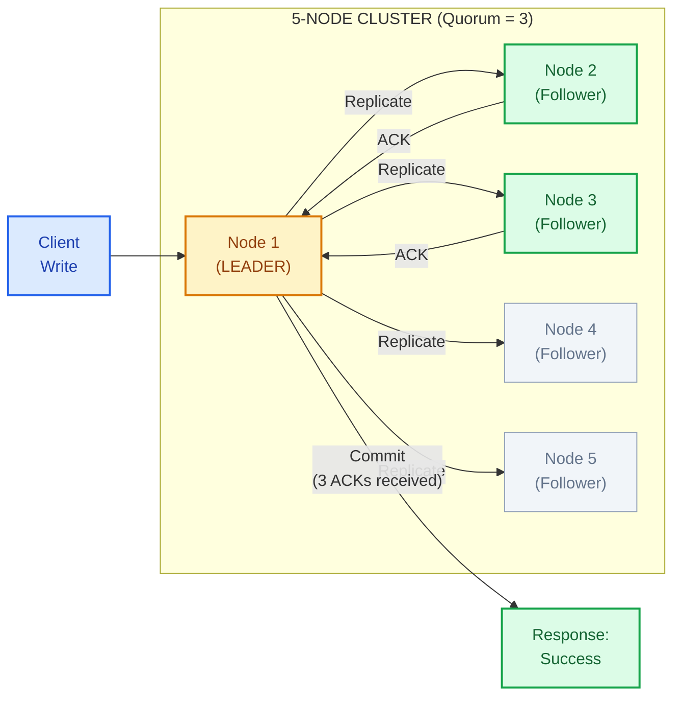
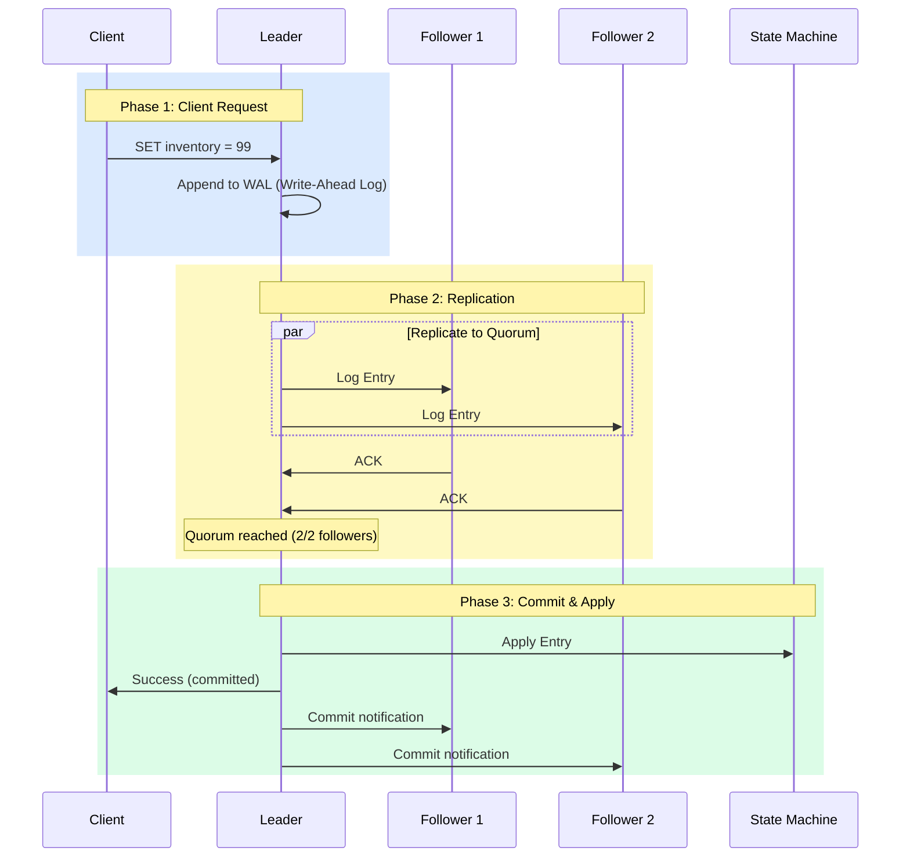
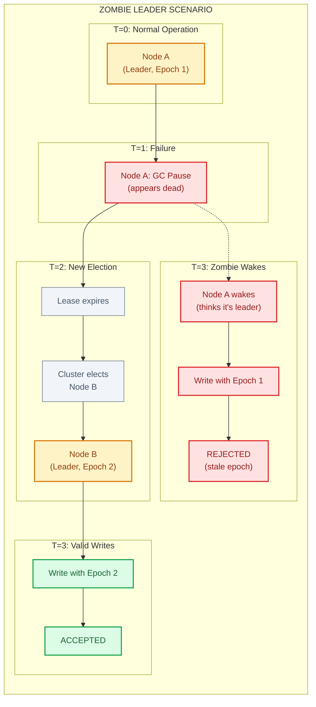
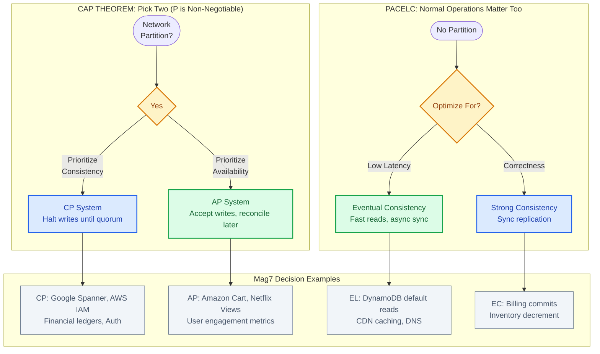

# The Consensus Problem

This guide covers 5 key areas: I. Executive Summary: The Business of Agreement, II. Core Technical Concepts & Mechanisms, III. Real-World Behavior at Mag7, IV. Strategic Tradeoffs & Decision Frameworks, V. Impact on Business, ROI, and CX.

## I. Executive Summary: The Business of Agreement

At the Principal TPM level, the "Business of Agreement" is not about the algorithmic nuances of Paxos or Raft, but rather the architectural decision to prioritize **Consistency** over **Availability** or **Latency**. In a distributed system, consensus is the mechanism by which a cluster of machines agrees on the state of truth. This agreement is expensive in terms of time and compute resources, but necessary for critical operations.

The fundamental value proposition of consensus is the prevention of data divergence. In a Mag7 ecosystem, where systems are distributed across availability zones (AZs) and regions, the network *will* partition. When it does, your system must decide: do we stop accepting writes to ensure data is correct (CP - Consistency/Partition Tolerance), or do we accept writes and risk data conflict (AP - Availability/Partition Tolerance)?

### 1. The Cost of "Truth" in Distributed Systems

Consensus is the foundation of the "Control Plane." It is rarely used for high-volume data streaming (like Netflix video chunks) but is mandatory for metadata management (like knowing *where* the video chunks are stored).

**Real-World Mag7 Behavior:**
*   **Google's Chubby:** Google relies on a lock service called Chubby (based on Paxos). It provides coarse-grained locking. If Chubby is unavailable, many Google services (like BigTable or GFS) halt operations to prevent corruption. They sacrifice availability for absolute consistency.
*   **AWS DynamoDB (Paxos):** While DynamoDB offers eventual consistency for reads, its internal leader election and partition management rely on Paxos to ensure that the system knows which node is the master for a specific shard.
*   **Kubernetes (etcd):** All cluster state data in Kubernetes is stored in etcd (which uses Raft). If the etcd quorum is lost, the cluster cannot schedule new pods or self-heal.

**Tradeoffs:**
*   **Latency vs. Certainty:** To achieve consensus, a leader must propose a value and wait for a majority (Quorum) to acknowledge it. This introduces network round-trip time (RTT) into the critical path of every write.
*   **Throughput Bottlenecks:** Because all strong-consistency writes usually funnel through a single leader, that leader becomes a bottleneck. You cannot scale write throughput simply by adding more nodes to the consensus group; in fact, adding more nodes *slows down* writes because the leader needs acknowledgments from more followers.

### 2. Quorums and the "Split Brain" Risk

The most critical failure mode a Principal TPM must mitigate is **Split Brain**. This occurs when a network partition severs communication between data centers. If both sides believe they are the "primary," they both accept writes. When the network heals, the data cannot be reconciled, leading to financial loss or data corruption.

To prevent this, Mag7 systems use **Quorums**. A cluster of $N$ nodes can only commit a write if $N/2 + 1$ nodes agree.

*   **3-Node Cluster:** Can survive 1 failure. (Requires 2 for quorum).
*   **5-Node Cluster:** Can survive 2 failures. (Requires 3 for quorum).

**Business Impact & ROI:**
*   **Infrastructure Cost:** Running a 5-node consensus cluster across 3 AZs is standard for high availability. However, running it across 3 *Regions* (e.g., US-East, US-West, EU-West) increases latency from sub-millisecond to 100ms+, directly impacting Customer Experience (CX).
*   **Availability Math:** If you require a quorum of 3 out of 5 nodes, and a region-wide outage takes down 3 nodes, your entire "Source of Truth" becomes read-only. The ROI calculation here is the cost of downtime vs. the cost of cross-region data transfer and latency.

### 3. Leader Election and "Stop-the-World" Events

In protocols like Raft or Zab (used by ZooKeeper), there is always one Leader. If the Leader dies, the remaining nodes must elect a new one.

**Operational Reality:**
During an election, the system is effectively **down** for writes. No new data can be committed until a new leader is established.
*   **Election Time:** Typically ranges from 200ms to several seconds depending on configuration.
*   **The "Flapping" Problem:** If network jitter causes followers to suspect the leader is dead, they may trigger unnecessary elections. This causes "availability flapping," where the system is constantly pausing to re-elect leaders, destroying P99 latency targets.

**Actionable Guidance for TPMs:**
When reviewing architecture for a new service, ask: "What is the Time to Recovery (TTR) during a leader election?" If the product requires real-time responsiveness (e.g., ad bidding), a standard consensus implementation might introduce unacceptable pauses. You may need to advocate for a design that caches stale data or allows "optimistic writes" that are reconciled later.

### 4. Impact on Business Capabilities

The choice of consensus strategy dictates the capabilities of the product.

*   **Capability: Global Consistency.**
    *   *Requirement:* Spanner-like architecture (Google) using TrueTime or cross-region Paxos.
    *   *Business Result:* Users in Tokyo and New York see the exact same inventory count instantly.
    *   *Cost:* High latency on writes, extremely expensive infrastructure.
*   **Capability: High Availability / Disaster Recovery.**
    *   *Requirement:* Asynchronous replication (Eventual Consistency).
    *   *Business Result:* If US-East fails, US-West takes over immediately.
    *   *Risk:* Some data committed in US-East just before the crash might be lost (RPO > 0). The TPM must ensure Legal and Product leadership agree to this data loss risk in the Service Level Agreement (SLA).

## II. Core Technical Concepts & Mechanisms

### 1. State Machine Replication (SMR) & The Log
At the core of almost every consensus system (ZooKeeper, Etcd, Spanner) is the **Replicated Log**. The mechanism relies on a deterministic state machine: if multiple servers execute the exact same commands in the exact same order, they will reach the exact same state.

*   **The Mechanism:** The Leader does not send the final file or database row to followers. Instead, it sends the *command* (e.g., `SET inventory_count = 99`). This command is appended to a log. Only once the log entry is replicated to a quorum is it "committed" and applied to the state machine.
*   **Mag7 Example:** **Google Spanner** and **Chubby** rely heavily on this. When a write occurs in Spanner, it is logged via Paxos to multiple replicas. The transaction is not acknowledged to the client until that log entry is safe on the majority of disks.
*   **Tradeoff:** **Write Latency vs. Durability.** To guarantee consensus, the leader must wait for network round-trips to followers *and* usually for the disk flush (fsync) on those followers.
    *   *Decision Point:* If you disable disk flush (memory-only consensus), you gain massive throughput (ROI/CX) but risk total data loss if the data center loses power simultaneously (Business Risk).
*   **Business Impact:** This mechanism dictates your **Write Throughput Cap**. Since all writes must be serialized through the Leader's log, the Leader becomes a bottleneck. If your product requires millions of writes per second (e.g., telemetry ingestion), standard consensus (CP systems) will fail; you need a sharded or eventual consistency approach.

### 2. Epochs, Terms, and Fencing (Stopping the Zombie Leader)
The most dangerous scenario in distributed systems is not when a node dies, but when it is slow. A "Zombie Leader" (a node that thinks it is the leader but has been cut off from the network) might try to write data or acknowledge a client request, leading to Split Brain.

*   **The Mechanism:** Consensus protocols use a monotonically increasing number (Epoch in ZooKeeper, Term in Raft, Ballot in Paxos) to version the leadership.
    *   **Fencing:** When a new leader is elected, it increments the Epoch. If the old leader tries to send a command, followers see the old Epoch number and reject the request. This "fences" the old leader off.
*   **Mag7 Example:** **Hadoop HDFS NameNode High Availability**. If the active NameNode hangs, the ZooKeeper Failover Controller elects a new active node. To ensure the old node doesn't corrupt the file system, it is "fenced" (sometimes essentially by cutting power to the node via a PDU, historically known as STONITH - Shoot The Other Node In The Head).
*   **Tradeoff:** **Failover Time (RTO) vs. Data Safety.** Aggressive timeouts detect failures faster (lower RTO) but increase the risk of "false positives," triggering unnecessary elections and performance degradation during the transition.
*   **Business Impact:** Prevents **Double Booking/Spending**. Without strict Epoch checking, an old leader could sell the last seat on a plane that the new leader has already sold to someone else.

### 3. Membership Changes (Dynamic Scaling)
Mag7 infrastructure is elastic. Nodes are replaced, clusters are resized. You cannot simply add a node to a 3-node cluster without careful coordination, or you risk having two disjoint majorities (a 3-node cluster needs 2 votes; if you add 2 nodes causing a split configuration, you might end up with two groups thinking they have a quorum).

*   **The Mechanism:** **Joint Consensus** (Raft) or incremental reconfiguration. The system enters a transitional state where a majority of *both* the old configuration and the new configuration is required before switching entirely to the new configuration.
*   **Mag7 Example:** **Kubernetes (Etcd)**. When you scale a control plane or replace a failing master node, Etcd handles the membership change dynamically. If this is mishandled manually, the cluster becomes "read-only" or corrupts.
*   **Tradeoff:** **Operational Complexity vs. Availability.** Dynamic reconfiguration is complex to implement correctly. The alternative is taking the system down for maintenance to update the configuration file, which is unacceptable for Tier-1 services (AWS S3, Azure SQL).
*   **Business Capability:** Enables **Zero-Downtime Scaling**. This allows services to grow from 3 to 5 to 7 nodes to handle peak holiday traffic (e.g., Prime Day) without service interruption.

### 4. Batched Writes & Pipelining
Naive consensus implementations wait for one log entry to commit before sending the next (Stop-and-Wait). This destroys performance.

*   **The Mechanism:**
    *   **Batching:** The leader groups multiple client requests into a single consensus message (e.g., commit 50 writes in one network round trip).
    *   **Pipelining:** The leader sends log entries to followers continuously without waiting for the previous acknowledgment, maintaining order upon commit.
*   **Mag7 Example:** **Kafka (via KRaft or ZK controller interactions)** and high-throughput transaction processing systems. Batching is essential to amortize the heavy cost of the network round-trip and disk fsync.
*   **Tradeoff:** **Latency vs. Throughput.**
    *   *Batching* increases average latency (the first request in the batch waits for the batch to fill or a timeout) but drastically increases max throughput.
    *   *Pipelining* increases complexity in error handling (if message N fails, what happens to N+1?).
*   **CX Impact:** High throughput batching is great for background processing (billing generation), but bad for real-time user interaction (gaming, chat) where every millisecond of latency counts.

## III. Real-World Behavior at Mag7

### 1. "Consensus as a Service" vs. Rolling Your Own
At Mag7 scale, application engineering teams almost never implement raw consensus algorithms (Paxos/Raft) from scratch. The operational risk of a bug in a consensus implementation is catastrophic. Instead, consensus is consumed as a centralized infrastructure service.

**Real-World Implementations:**
*   **Google:** Uses **Chubby** (a distributed lock service). When a system like BigTable needs to elect a master, it doesn't run Paxos itself; it grabs a lock file in Chubby. If the node holds the lock, it is the leader.
*   **Open Source/Meta/Netflix:** Heavily utilize **Apache ZooKeeper** or **etcd** (the backbone of Kubernetes). These services handle the complexity of the quorum and heartbeat mechanisms, exposing simple APIs (e.g., "Create Ephemeral Node") to client applications.
*   **AWS:** Uses internal variations of Paxos for control planes (e.g., EC2 control plane) but exposes **DynamoDB** with conditional writes to customers who need lightweight consensus-like locking.

**Tradeoffs:**
*   **Dependency Risk vs. Reliability:** By using a shared service (like Chubby), you introduce a single point of failure for the entire region. If Chubby goes down, BigTable, GFS, and Spanner may all stall. However, the reliability of a dedicated infrastructure team maintaining the consensus service far outweighs the risk of product teams building buggy implementations.
*   **Performance:** Centralized consensus services can become bottlenecks. They are optimized for read-heavy, write-light workloads (coordination data), not high-throughput data streams.

**Impact:**
*   **Skill/Capabilities:** TPMs must ensure teams are not "reinventing the wheel." If a design doc proposes a custom leader election protocol, the TPM should block it and redirect to standard infra (etcd/ZooKeeper).
*   **ROI:** Drastically reduces engineering headcount required to maintain stability.

### 2. The "Consensus Tax" on Write Latency
Consensus is the enemy of low latency. In a Mag7 environment, TPMs often mediate conflicts between Product (wanting speed) and Engineering (wanting consistency).

**The Mechanism:**
To confirm a write in a consensus-based system (like Google Spanner or an AWS RDS Multi-AZ commit), the data must travel to a majority of nodes, be written to disk (fsync), and acknowledgments must return to the leader. This involves physical network propagation delay, especially if the quorum spans multiple Availability Zones (AZs) or regions.

**Real-World Behavior:**
*   **The "Hot Path" Avoidance:** Mag7 architectures rarely put strong consensus on the user-facing "hot path" for content delivery.
    *   *Example:* When a user "Likes" a post on Facebook/Instagram, the system does *not* wait for global consensus. It uses **Eventual Consistency**. The "Like" is written to a local cache and asynchronously replicated. If the node dies, the "Like" might be lost, which is acceptable (low business impact).
*   **The "Money Path" Necessity:**
    *   *Example:* When an advertiser updates a campaign budget (Billing), the system *must* use strong consensus. We cannot allow the budget to be spent twice due to a sync delay. The business accepts the higher latency (e.g., 200ms vs 20ms) to ensure the ledger is correct.

**Tradeoffs:**
*   **Latency vs. Consistency (CAP Theorem):** You are trading the speed of the write operation for the guarantee that the data is correct.
*   **Throughput Limits:** Consensus groups have a hard limit on write throughput because every write must be serialized through the leader.

**Impact:**
*   **CX:** Using consensus incorrectly (e.g., on a search autocomplete feature) destroys the user experience.
*   **Business Capabilities:** Strong consensus enables transactional revenue features (Inventory, Billing) that eventual consistency cannot support.

### 3. Handling Network Partitions: The "Fencing" of Zombies
The most critical behavior of consensus systems in production is how they handle "Split Brain"—when a network partition severs communication between data centers.

**The Scenario:**
Imagine a cluster with 5 nodes. A network cut isolates 2 nodes (Side A) from the other 3 nodes (Side B).
*   **Side B (Majority):** Continues to function, elects a leader, and processes writes.
*   **Side A (Minority):** Must realize it is in the minority and **stop processing writes immediately**.

**Real-World Behavior (Fencing):**
If the old leader is on Side A, it might not know it has been deposed. It might try to write data. This is a "Zombie Leader."
*   **Mag7 Solution (Epochs/Generations):** Every time a new leader is elected, the "Epoch Number" increments.
*   **Example (Kafka/Zookeeper):** If the Zombie Leader tries to send a write command to a storage node with Epoch 4, but the storage node has already seen a command from the new leader with Epoch 5, the storage node rejects the write. This is called **Fencing**.

**Tradeoffs:**
*   **Availability vs. Integrity:** During a partition, the minority side goes completely offline for writes. This is a hard down. The tradeoff is preserving data integrity over availability.
*   **Complexity:** Clients connecting to the minority partition will experience errors. The client SDK must be smart enough to failover to the majority partition.

**Impact:**
*   **ROI:** Prevents "Double Spend" or "Double Booking" scenarios which require expensive manual customer support reconciliation.
*   **CX:** Users in the partitioned region may experience a "Read-Only" mode or total service unavailability.

### 4. Scalability: Sharding the Consensus (Multi-Raft)
A single consensus group (e.g., one Raft group) can typically handle only a few thousand writes per second because the Leader is a bottleneck. Mag7 services need millions of writes per second.

**The Solution: Sharding**
Instead of one giant consensus group for the whole database, the data is split into "Shards" or "Ranges." Each shard has its own independent consensus group.

**Real-World Examples:**
*   **CockroachDB / Google Spanner:** These databases split data into ranges (e.g., User A-M, User N-Z).
    *   Range 1 has its own Raft group (Leader 1, Followers).
    *   Range 2 has its own Raft group (Leader 2, Followers).
*   **Behavior:** This allows the system to scale linearly. If you need more write throughput, you add more nodes and split the shards further.

**Tradeoffs:**
*   **Cross-Shard Transactions:** If a transaction needs to update data in Range 1 *and* Range 2 simultaneously, the system must coordinate *between* the two consensus groups (using Two-Phase Commit). This drastically increases latency and failure probability.

**Impact:**
*   **Business Capability:** Allows infinite horizontal scaling of transactional data systems.
*   **Architectural Cost:** High complexity in the storage layer. TPMs must ensure schema designs minimize cross-shard transactions to maintain performance.

## IV. Strategic Tradeoffs & Decision Frameworks

### 1. The CAP Theorem in a Mag7 Context: CP vs. AP

While the CAP Theorem (Consistency, Availability, Partition Tolerance) is standard computer science curriculum, at the Principal level, you must apply it to product strategy. In a distributed cloud environment (AWS, Azure, GCP), **Partition Tolerance (P)** is non-negotiable. Network cables get cut, and switches fail. Therefore, the strategic decision is purely between **Consistency (CP)** and **Availability (AP)**.

**The Strategic Choice:**
*   **CP (Consistency prioritized):** The system returns an error or times out if it cannot guarantee the data is current.
    *   **Use Case:** Google Cloud Billing, AWS IAM, Azure Subscription Management.
    *   **Business Rationale:** It is better to fail a request than to allow a user to double-spend credit or access resources they just paid to remove.
    *   **Tradeoff:** Lower availability during outages; higher latency due to synchronous replication requirements.
*   **AP (Availability prioritized):** The system always responds, even if the data is stale.
    *   **Use Case:** Amazon Shopping Cart, Facebook News Feed, Netflix "Continue Watching."
    *   **Business Rationale:** Never block a user from adding an item to the cart. A lost "Add to Cart" event is lost revenue. If the inventory count is slightly off, Amazon handles it post-transaction (via "We're sorry" emails or backordering), which is cheaper than blocking the sale.
    *   **Tradeoff:** Complexity in reconciling data later (conflict resolution); potential for "split-brain" user experiences.

### 2. Beyond CAP: The PACELC Framework

CAP only applies during a failure. Principal TPMs must address the **steady state** (normal operations). This is where **PACELC** comes in:
*   **If Partition (P):** Choose Availability (A) or Consistency (C).
*   **Else (E) (Normal operation):** Choose **Latency (L)** or **Consistency (C)**.

**The Latency vs. Consistency Tradeoff:**
To guarantee strong consistency, a database leader must replicate data to a quorum of followers *before* acknowledging the write to the user. This takes time (network round trips).

*   **Mag7 Example (DynamoDB):** Amazon DynamoDB allows developers to choose between "Eventually Consistent Reads" (half the price, lower latency) and "Strongly Consistent Reads" (full price, higher latency).
*   **Impact on CX:** If you enforce strong consistency on a social media "Like" counter, the UI feels sluggish. If you use eventual consistency for a banking balance, the user panics.
*   **ROI Implication:** Choosing Eventual Consistency usually reduces infrastructure costs (fewer read units required) and improves conversion rates via faster page loads (Google found that an extra 500ms in search page generation dropped traffic by 20%).

### 3. Consistency Models: The Spectrum of "Truth"

You should not view consistency as binary (Strong vs. Weak). It is a spectrum with distinct business implications.

| Consistency Model | Description | Mag7 Example | Business Tradeoff |
| :--- | :--- | :--- | :--- |
| **Strict/Linearizable** | Absolute truth. Global real-time ordering. | **Google Spanner** (using TrueTime atomic clocks). | **High Cost/High Latency.** Required for financial ledgers. Prevents overselling high-value inventory. |
| **Sequential** | Operations occur in a specific order, but maybe not real-time. | **Zookeeper** (Configuration management). | **Medium Latency.** Good for queues and state machines where order matters more than speed. |
| **Causal** | If Event A causes Event B, everyone sees A before B. Unrelated events can be out of order. | **Meta (Facebook) Messenger.** | **Balanced.** Ensures conversations make sense (Question appears before Answer) without blocking unrelated chats. |
| **Eventual** | "If no new updates occur, eventually all accesses return the last updated value." | **DNS, CDN Caching, YouTube View Counts.** | **Lowest Cost/Lowest Latency.** High risk of stale data. Acceptable for vanity metrics, unacceptable for auth/payments. |

### 4. Conflict Resolution Strategies

When you choose Availability (AP) or Eventual Consistency, you introduce **Data Conflicts**. Two users edit the same Wiki page or update the same inventory record simultaneously in different regions. You must define the resolution strategy in the PRD/Technical Specs.

**A. Last Write Wins (LWW):**
*   **Mechanism:** Rely on timestamps. The latest timestamp overwrites everything else.
*   **Risk:** Clock skew between servers can cause data loss (a newer write is discarded because a server clock was slow).
*   **Use Case:** Updating user profile pictures (low risk).

**B. CRDTs (Conflict-free Replicated Data Types):**
*   **Mechanism:** Data structures designed to always merge mathematically (e.g., a "Grow Only Set").
*   **Mag7 Example:** **Riak** or **Redis Enterprise**. Shopping carts often use this logic (Union of all items added).
*   **Tradeoff:** High engineering complexity to implement; increases storage size as history is preserved.

**C. Application-Level Resolution:**
*   **Mechanism:** The database stores both versions and asks the user (or business logic) to fix it.
*   **Mag7 Example:** Git merge conflicts; Amazon DynamoDB version vectors.
*   **Impact:** Degrades UX (asking the user to fix it) or requires complex backend logic.

### 5. Architectural ROI: Multi-Region Active-Active vs. Active-Passive

The consensus approach dictates your Disaster Recovery (DR) architecture and cost structure.

**Active-Passive (Failover):**
*   **Behavior:** All writes go to `us-east-1`. Data is asynchronously replicated to `us-west-2`.
*   **Consensus:** Only needed in the primary region.
*   **Tradeoff:** In a disaster, you lose data committed during the replication lag (RPO > 0).
*   **ROI:** Cheaper. Simpler to build.

**Active-Active (Multi-Master):**
*   **Behavior:** Users can write to `us-east-1` OR `us-west-2`.
*   **Consensus:** Requires complex conflict resolution or global locking.
*   **Mag7 Example:** **Google Spanner** or **Azure Cosmos DB** (Multi-region writes).
*   **Tradeoff:** Extremely expensive. High latency if using global strong consistency.
*   **ROI:** Zero downtime (RTO near 0). Required for Tier-0 global services (Identity, Billing).

## V. Impact on Business, ROI, and CX

At the Principal TPM level, the "Consensus Problem" ceases to be an algorithmic challenge and becomes a strategic lever involving risk management, user experience, and unit economics. You are not deciding *how* Paxos is implemented; you are deciding *if* the business requirement justifies the latency and cost of Paxos, or if a lighter, eventually consistent model suffices.

### 1. The Latency Tax: Strong Consistency vs. User Experience
The most immediate business impact of consensus is **write latency**. Because a consensus algorithm (like Raft or Paxos) requires a leader to communicate with a quorum of followers and receive acknowledgments before confirming a write, the physical laws of network propagation apply.

*   **The Mechanism:** To achieve "Strong Consistency" (Linearizability), the system cannot confirm a user's action until the data is safely replicated to multiple nodes. If these nodes are across Availability Zones (AZs) or Regions, the latency penalty increases significantly.
*   **Mag7 Real-World Example:**
    *   **Google Spanner:** Google achieves global consensus using TrueTime (atomic clocks). While this allows for "external consistency," the tradeoff is that write commits must wait out the clock uncertainty window. Google accepts this latency to gain the business capability of treating a distributed database like a single machine.
    *   **Amazon DynamoDB:** By default, offers "Eventual Consistency" for reads to maximize throughput and minimize cost. However, for billing or inventory, developers must opt-in to "Strong Consistency," which doubles the read cost (ROI impact) and increases latency.
*   **Tradeoff Analysis:**
    *   **Choice:** Implementing synchronous replication (Strong Consensus) across regions.
    *   **Pro:** Zero data loss (RPO = 0); simplified application logic (developers don't handle conflicts).
    *   **Con:** High write latency (100ms+); if the link between regions fails, the system halts (availability hit).
*   **Business Impact:** High latency directly correlates to abandoned shopping carts and lower ad click-through rates. A Principal TPM must push back on requirements asking for "global strong consistency" for non-critical data (e.g., user "likes" or "view counts").

### 2. Availability and Revenue Protection (CAP Theorem Application)
In a distributed system, you cannot have both perfect Consistency and perfect Availability during a network partition (CAP Theorem). A Principal TPM must align the technical choice (CP vs. AP) with the business model.

*   **CP Systems (Consistency favored):** If the quorum cannot communicate, the system stops accepting writes.
    *   **Use Case:** **Azure Billing** or **AWS IAM**. It is better to deny a permission update or pause billing aggregation than to allow double-spending or unauthorized access.
    *   **ROI Impact:** Potential short-term revenue pause during outages, but prevents massive liability and remediation costs (e.g., reconciling a corrupted ledger).
*   **AP Systems (Availability favored):** The system accepts writes even if nodes cannot agree, reconciling them later.
    *   **Use Case:** **Amazon Retail Shopping Cart**. Amazon famously realized that preventing a user from adding an item to a cart (availability) costs more revenue than the rare edge case of selling an out-of-stock item (consistency).
    *   **CX Impact:** The user flow is never blocked.
    *   **Tradeoff:** Requires complex "conflict resolution" logic (e.g., Last-Write-Wins or Vector Clocks), which increases engineering complexity and operational overhead.

### 3. Infrastructure ROI: The Cost of Quorums
Consensus is expensive in terms of compute and storage. To tolerate $f$ failures, you need $2f+1$ nodes.

*   **The Multiplier Effect:**
    *   To survive 1 node failure: 3 nodes required.
    *   To survive 2 node failures: 5 nodes required.
*   **Mag7 Example:** In **Meta’s ZippyDB** (a distributed key-value store), data is replicated across regions. A Principal TPM planning capacity must account that every write operation consumes bandwidth across 3 to 5 data centers.
*   **ROI Analysis:**
    *   **Storage Cost:** Storing 3x or 5x the data.
    *   **Network Cost:** Cross-region data transfer is often the highest line item in a cloud bill. High-frequency consensus chatter ("heartbeats" and log replication) amplifies this.
    *   **Decision Framework:** For "Tier 0" services (Identity, Key Management), the 5-node cost is justified for resilience. For "Tier 2" logging data, a consensus-based system is financial malpractice; simple asynchronous replication suffices.

### 4. Operational Complexity and "Split Brain" Risk
The most catastrophic business failure related to consensus is **Split Brain**. This occurs when a network partition fools two different subsets of nodes into believing *they* are the leader.

*   **Business Consequence:** If two database primaries accept writes simultaneously, you end up with diverging histories. Reconciling this often requires manual intervention, data loss, or "stop the world" maintenance windows.
*   **Mag7 Mitigation:**
    *   **Fencing Tokens:** Used to lock out the old leader.
    *   **External Coordinators:** Systems like **Apache ZooKeeper** or **Etcd** are used specifically to maintain configuration consensus so the main application doesn't have to implement it from scratch.
*   **Skill/Capability Impact:** Relying on consensus systems requires specialized SRE talent. Debugging a Raft log divergence is significantly harder than debugging a standard SQL failure. Adopting a consensus-heavy architecture increases the "barrier to entry" for on-call engineers.

### 5. Summary of Tradeoffs for the Principal TPM

| Business Goal | Technical Choice | Tradeoff |
| :--- | :--- | :--- |
| **Max Revenue (Retail)** | Eventual Consistency (AP) | High Availability, Low Latency **vs.** Occasional data conflicts/overselling. |
| **Financial Integrity** | Strong Consensus (CP) | Data Correctness **vs.** Higher Latency, System halts during partitions. |
| **Disaster Recovery** | Multi-Region Consensus | Zero Data Loss (RPO=0) **vs.** High Infrastructure Cost ($$$) and Latency. |
| **Speed to Market** | Cloud Native (e.g., Cosmos DB) | Configurable Consistency **vs.** Vendor Lock-in and variable cost. |

---

## Interview Questions

### I. Executive Summary: The Business of Agreement

### Question 1: The Cross-Region Latency Dilemma
**"We are building a global payment ledger for a new marketplace. The product requirement states 'zero data loss' (RPO=0) and 'immediate global consistency,' but they also want sub-100ms response times for users in both Asia and the US. As the Principal TPM, how do you handle this architecture review?"**

*   **Guidance for a Strong Answer:**
    *   **Identify the Physics Constraint:** Acknowledge that speed of light prevents strong consistency between Asia and US in under 100ms (RTT is ~150-200ms). The requirements are physically impossible to satisfy simultaneously.
    *   **Propose Tradeoffs:** Offer a solution that uses a local consensus group (e.g., primary in US) for writes, meaning Asia users suffer latency, OR a sharded approach where Asia users write to an Asia primary (fast) but global reconciliation happens asynchronously.
    *   **Business Alignment:** Discuss moving the "consistency" requirement. Does the *user* need to see the global state instantly, or just the system? Can we use optimistic UI updates to hide the latency?

### Question 2: Handling Split Brain in Financial Transactions
**"Your team is designing a transaction processing system using a standard 5-node consensus cluster. During a network partition, the system split into a group of 2 nodes and a group of 3 nodes. The group of 2 nodes is serving the region with the highest customer traffic. How should the system behave, and what is the impact on the customer?"**

*   **Guidance for a Strong Answer:**
    *   **Strict Quorum Rule:** The group of 2 nodes (minority) *must* stop accepting writes immediately. It cannot form a quorum ($2 < 3$).
    *   **CX Impact:** The region with the highest traffic will experience a "Write Outage." Customers can likely still *read* data (potentially stale), but cannot purchase/transact.
    *   **Mitigation:** The candidate should not suggest "fixing" the algorithm to allow the 2 nodes to write (that causes Split Brain). Instead, they should discuss architectural mitigations like client-side retries, redirecting traffic to the healthy region (if network allows), or pre-partitioning users so that the "highest traffic" isn't dependent on a single consensus group.

### II. Core Technical Concepts & Mechanisms

### Question 1: The Inventory Race Condition
**Scenario:** You are the TPM for a high-demand ticketing platform (like Ticketmaster). During a major Taylor Swift ticket release, the inventory service (backed by a consensus-based database) is becoming the bottleneck, causing high latency and timeouts. The engineering lead suggests moving from Strong Consistency (Consensus/Raft) to Eventual Consistency to handle the load.
**Question:** Critique this proposal. What are the specific business and technical risks of dropping consensus for inventory management? If you cannot drop consensus, what architectural patterns would you propose to alleviate the bottleneck?

**Guidance for a Strong Answer:**
*   **Identify the Trap:** Moving to Eventual Consistency for inventory allows "overselling" (selling the same seat twice). The candidate must identify that the cost of reconciling oversold tickets (CX nightmare, reputation damage, manual support costs) likely outweighs the throughput gain.
*   **Technical mechanism:** Explain that without a single leader/log (Consensus), two nodes can accept a purchase for Seat 1A simultaneously.
*   **Alternative Solutions:**
    *   **Sharding:** Partition inventory by section/row so multiple consensus groups handle different subsets of tickets (Linear scalability).
    *   **Reservation Pattern:** Use a lightweight, high-throughput system (like Redis with Lua scripts) to "hold" tickets temporarily before committing to the heavy consensus ledger.
    *   **Batching:** As discussed above, optimizing the consensus layer.

### Question 2: The Split Brain Scenario
**Scenario:** Your team manages a global configuration service using a 5-node cluster spread across 3 regions (2 in US-East, 2 in US-West, 1 in EU). A network partition cuts off US-West from the rest of the world. The US-West clients can still talk to the 2 US-West nodes, but those nodes cannot talk to the Leader in US-East.
**Question:** Describe the behavior of the system for clients in US-West versus US-East. What happens if the US-West nodes try to elect a new leader? How does this impact the "Read Availability" vs. "Write Availability" of your service?

**Guidance for a Strong Answer:**
*   **Quorum Math:** A 5-node cluster needs 3 votes to commit.
*   **US-East Behavior:** Has 3 nodes (2 East + 1 EU). It retains Quorum. It continues to accept Writes and Reads.
*   **US-West Behavior:** Has 2 nodes. It *cannot* form a Quorum.
    *   *Writes:* Will fail (or hang until timeout).
    *   *Reads:* Depends on consistency setting. If "Strong Reads" (Linearizable), reads fail because they can't verify with the leader. If "Stale Reads" are allowed, they can serve data but it might be old.
*   **Election:** US-West cannot elect a new leader because they cannot get 3 votes.
*   **Principal Insight:** Discuss the tradeoff of *placement*. Spreading 5 nodes across 3 regions creates a risk where losing one region + one node could kill the whole cluster. Discuss the necessity of a "Tie-Breaker" region or using 9 nodes if region survivability is required.

### III. Real-World Behavior at Mag7

### Question 1: The Global Inventory Problem
**Scenario:** You are the Principal TPM for a global e-commerce platform. We are launching a "Flash Sale" for a limited item (100 units total). The inventory system currently uses an eventually consistent database (AP) to ensure fast user experience.
**Challenge:** What risks does this pose for the Flash Sale? How would you re-architect the critical path for this specific event, and what are the trade-offs of your proposed solution?

**Guidance for a Strong Answer:**
*   **Identification of Risk:** The candidate must identify **Overselling** as the primary risk. In an AP (Eventual Consistency) system, two users in different regions could buy the last item simultaneously because the nodes haven't synced.
*   **Architectural Pivot:** They should propose moving the "Checkout/Reserve" action to a CP (Strongly Consistent/Consensus-based) system, or using a distributed lock (e.g., Redis/Zookeeper) for the inventory counter.
*   **Tradeoff Awareness:** A strong answer acknowledges that this change introduces **latency** and a potential **bottleneck**. If 10 million users hit the "Buy" button, a single consensus leader cannot handle the load.
*   **Mitigation:** They should suggest sharding the inventory (e.g., 100 items split into 5 buckets of 20, handled by different servers) or using a queue-based approach to serialize requests before they hit the consensus layer.

### Question 2: The "Zombie Leader" Incident
**Scenario:** A critical internal service relying on a leader-follower architecture suffered a "Split Brain" scenario during a network fluctuation. Post-mortem analysis shows that for 30 seconds, both the old leader and the new leader were accepting writes, resulting in data corruption.
**Challenge:** As the TPM leading the Corrective of Error (COE) process, what specific mechanism failed? What technical requirements must be added to the roadmap to prevent this recurrence?

**Guidance for a Strong Answer:**
*   **Root Cause Analysis:** The candidate should identify a failure in **Fencing** or **Heartbeat Timeouts**. The old leader didn't realize it was isolated, or the storage layer didn't check the "Epoch/Term" number.
*   **Technical Requirement:** They must propose implementing **Fencing Tokens** (or Epoch checking) at the storage/resource level. The resource must reject writes from any leader with an older generation ID.
*   **Operational Depth:** They should ask about the "Time to Live" (TTL) settings on the leader lease. If the lease is too long, the system waits too long to elect a new leader (downtime). If too short, the system flaps. They should advocate for tuning these parameters based on network stability data.

### IV. Strategic Tradeoffs & Decision Frameworks

**Question 1: The Ticketmaster/High-Demand Inventory Problem**
"We are designing a ticket reservation system for a major concert event where demand vastly exceeds supply. We need to prevent overselling, but we also cannot have the system crash or slow to a crawl under load. Which consistency model do you choose, and how do you handle the architectural tradeoffs?"

*   **Guidance for a Strong Answer:**
    *   **Identify the Conflict:** Acknowledge the tension between preventing overselling (needs Strong Consistency) and handling high load (needs Availability/Eventual Consistency).
    *   **Propose a Hybrid Strategy:** Do not suggest pure Strong Consistency on the database for every read (it will fall over). Suggest a "hold" mechanism (leases) using a fast, strongly consistent cache (like Redis with Lua scripts or DynamoDB with conditional writes) for the *inventory decrement* only.
    *   **Address UX:** Explain that the "Browse" experience should be Eventually Consistent (cached), while the "Checkout" experience must be Strongly Consistent.
    *   **Discuss Failure Modes:** What happens if the user reserves a ticket but the payment fails? (Need a TTL/timeout to release inventory back to the pool).

**Question 2: Global Latency vs. Data Correctness**
"Your product is a global collaborative document editor (like Google Docs). Users in Tokyo and New York are editing the same sentence simultaneously. How do you architect the consensus mechanism to ensure they don't overwrite each other, without introducing 200ms+ latency for every keystroke?"

*   **Guidance for a Strong Answer:**
    *   **Reject Global Locking:** Immediately state that waiting for a round-trip confirmation for every keystroke is unacceptable for UX (PACELC).
    *   **Operational Transformation (OT) or CRDTs:** Mention these specific technologies used for real-time collaboration. The local client updates immediately (Optimistic UI), and changes are merged asynchronously.
    *   **Resolution Logic:** Explain how the system handles conflicts (e.g., transforming the index of User A's insertion based on User B's deletion).
    *   **Tradeoff Recognition:** Acknowledge that this requires significant client-side logic and CPU, trading off "simplicity" for "responsiveness."

### V. Impact on Business, ROI, and CX

**Question 1: The Global Inventory System**
"We are designing a global inventory system for a high-demand product launch (e.g., a new gaming console). Marketing wants to ensure we never oversell, but they also want the checkout experience to be under 200ms globally. As a Principal TPM, how do you navigate these conflicting requirements?"

*   **Guidance for a Strong Answer:**
    *   **Identify the Conflict:** Acknowledge that "never oversell" implies Strong Consistency (global lock/consensus), which physically conflicts with "under 200ms globally" due to the speed of light (latency).
    *   **Propose a Hybrid Solution:** Do not just pick one. Suggest segmenting inventory. Allocate specific stock to specific regions (sharding). Local regions use strong consistency (fast). Cross-region transfers happen asynchronously.
    *   **Discuss Failure Modes:** What happens if a region runs out? Do we fallback to a global check (slow) or show "out of stock" (safe but lost revenue)?
    *   **Business Alignment:** Clarify that "overselling" slightly might be better than crashing the site due to global lock contention. Perhaps allow a 1% oversell buffer and manage it via customer service (soft compensation) rather than engineering limits.

**Question 2: The Consensus Outage**
"Your team relies on an Etcd cluster for service discovery. During a network upgrade, a partition occurs, and the cluster loses quorum. Your services start failing health checks and restarting, causing a cascading failure. How would you architect the system to prevent this dependency from taking down the business?"

*   **Guidance for a Strong Answer:**
    *   **Root Cause Analysis:** Recognize that a hard dependency on a CP system (Etcd) for the "hot path" (every request) is an architectural flaw.
    *   **Caching/Fallback:** The application should cache the last known good state. If Etcd is down, serve stale data rather than crashing. Stale service discovery is usually better than no service discovery.
    *   **Degraded Mode:** Define a "Panic Mode" where the system defaults to static configuration or stops scaling activities but keeps serving user traffic.
    *   **Operational Maturity:** Discuss the need for chaos engineering (testing partition handling) and monitoring the "time to recovery" for quorum.

---

## Key Takeaways

- Review each section for actionable insights applicable to your organization

- Consider the trade-offs discussed when making architectural decisions

- Use the operational considerations as a checklist for production readiness
