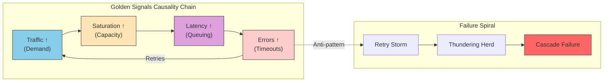
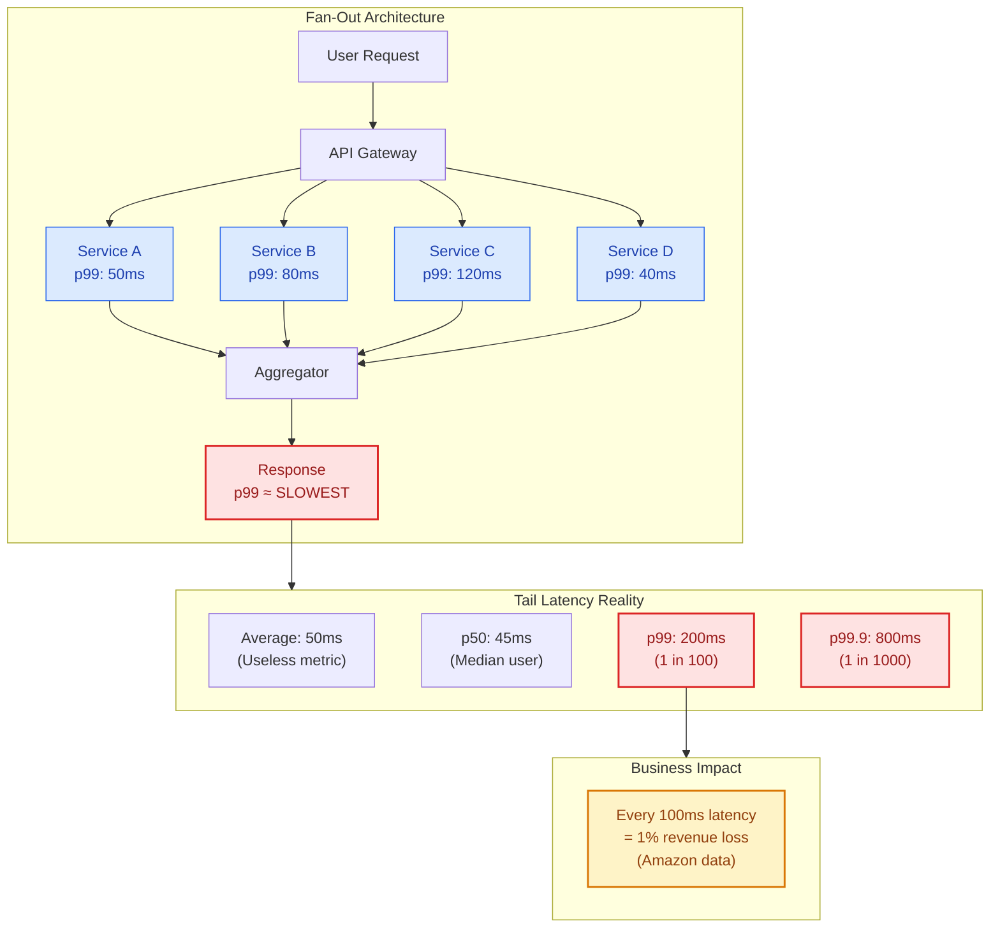
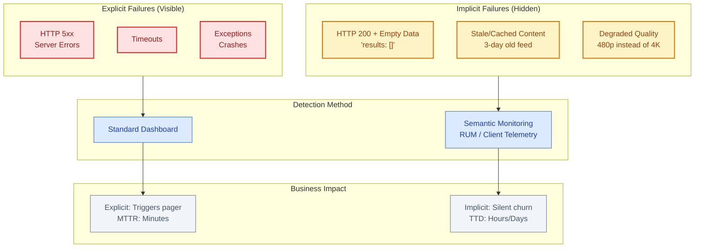
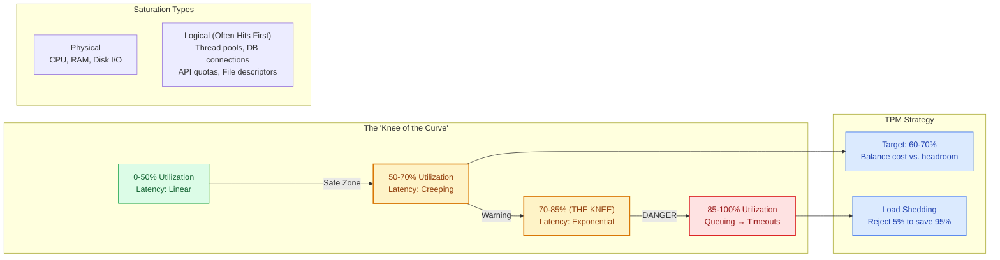

# The Golden Signals (Google SRE)

This guide covers 6 key areas: I. Executive Overview: Why the Golden Signals Matter to a Principal TPM, II. Latency: The Speed of User Perception, III. Traffic: Measuring the Demand, IV. Errors: Explicit vs. Implicit Failures, V. Saturation: The Capacity Ceiling, VI. Strategic Application for Principal TPMs.

## I. Executive Overview: Why the Golden Signals Matter to a Principal TPM

At the Principal TPM level, the Golden Signals (Latency, Traffic, Errors, Saturation) are not merely operational metrics to be reviewed during an outage; they constitute the **governance framework** for decision-making regarding architecture, roadmap prioritization, and capital allocation.

In a distributed microservices environment typical of Mag7 companies, binary states of "Up" or "Down" rarely exist. Systems exist in a constant state of partial degradation. The Golden Signals provide the quantitative data required to answer the fundamental Principal TPM question: **"Is the current state of the system acceptable for the business?"**

### 1. The Strategic Utility of Golden Signals

For a Generalist or Product Principal TPM, these signals bridge the gap between infrastructure reality and product goals. They transform vague complaints ("The app feels slow") into actionable engineering constraints ("The checkout service p99 latency has drifted from 200ms to 450ms due to database saturation").

**Mag7 Real-World Behavior:**
*   **Google:** Uses these signals to calculate **Error Budgets**. If a service is within its error budget (derived from Errors and Latency), feature velocity is prioritized. If the budget is exhausted, the Principal TPM enforces a "Code Yellow" or freeze, prioritizing reliability work over new features.
*   **Amazon:** During high-velocity events like Prime Day, these signals define **shedding strategies**. If *Saturation* hits a critical threshold, the system automatically degrades non-critical features (e.g., "People who bought this also bought...") to preserve the core checkout funnel (prioritizing *Traffic* throughput over feature completeness).

**Tradeoffs:**
*   **Granularity vs. Cost:** Collecting high-cardinality data for these signals (e.g., tracking latency per user ID rather than per region) provides better insights but exponentially increases observability costs. A Principal TPM must decide if the ROI of granular debugging justifies the infrastructure spend.
*   **Sensitivity vs. Alert Fatigue:** Configuring alerts on these signals too tightly results in engineering burnout (paging on minor blips); configuring them too loosely results in undetected customer impact.

**Business Impact:**
*   **ROI:** These signals prevent over-provisioning. If *Saturation* is consistently below 20%, the TPM identifies wasted capital (COGS).
*   **CX:** Direct correlation to Net Promoter Score (NPS). Users do not churn because of CPU spikes; they churn because of *Latency* and *Errors*.

### 2. From Signals to Service Level Objectives (SLOs)

The Golden Signals are raw data; a Principal TPM transforms them into **Service Level Objectives (SLOs)**. An SLO is a target value for a service level that is measured by a Service Level Indicator (SLI).

**The Principal TPM's Role:**
Your responsibility is to negotiate the SLOs between Product and Engineering. Engineering will often push for lower SLOs to reduce on-call burden, while Product will demand 100% availability. You must arbitrate using the Golden Signals to define what is realistic and profitable.

**Mag7 Real-World Behavior:**
*   **Microsoft Azure:** Differentiates SLOs based on service tier. A "Premium" storage tier has stricter Latency and Error SLOs than a "Hot" or "Cool" tier. The TPM ensures that the architecture supports these tiered promises.
*   **Meta:** Uses "Server-Side Reliability" (SSR) metrics. If the *Error* rate exceeds the SLO, automated remediation tools (like switching traffic to a different region) are triggered without human intervention.

**Tradeoffs:**
*   **Availability vs. Velocity:** Setting a "Four Nines" (99.99%) availability target requires significant investment in redundancy and slower release cycles compared to "Three Nines" (99.9%). The TPM must determine if the business value of that extra "Nine" outweighs the cost of slower feature delivery.

**Business Impact:**
*   **Capabilities:** Defines the architectural ceiling. If the *Traffic* signal predicts 10x growth, the current SLOs may become mathematically impossible with the current architecture, triggering a need for a re-platforming initiative.

### 3. The Interdependency of the Signals

A common failure mode for junior TPMs is viewing these signals in isolation. A Principal TPM understands the causal relationships between them.

**The Causality Chain:**
1.  **Traffic** increases (demand).
2.  **Saturation** rises (capacity limit approaches).
3.  **Latency** increases (queuing theory: requests wait for resources).
4.  **Errors** occur (timeouts or out-of-memory crashes).

**Mag7 Real-World Example:**
*   **Netflix:** When a popular show launches, *Traffic* spikes. If auto-scaling is too slow, *Saturation* on the edge nodes hits 100%. This causes *Latency* to spike. The client app has a timeout set to 5 seconds; if the response takes 6 seconds, the client treats it as an *Error* and retries. These retries artificially inflate *Traffic* further, creating a "Retry Storm" or "Thundering Herd" that takes down the service.

**Actionable Guidance:**
When reviewing an architectural design, ask: "How does this system behave when Saturation hits 90%? Does it fail gracefully (shed load) or does it spiral (retry storm)?"

**Tradeoffs:**
*   **Fail-Fast vs. Resilience:** Designing a system to fail fast (returning an error immediately when saturated) protects the system but hurts the immediate user request. Designing for resilience (queueing requests) improves success rate but destroys latency.

### 4. Governance and Business Continuity

Finally, the Golden Signals are the primary input for Capacity Planning and Business Continuity Planning (BCP).

**Capacity Planning:**
You cannot plan headcount or hardware spend without accurate *Traffic* (growth rate) and *Saturation* (utilization) history.
*   **Scenario:** If *Traffic* is growing 20% MoM but *Saturation* is at 80%, you have exactly one month before you hit a wall. A Principal TPM flags this risk quarters in advance.

**Business Continuity:**
*   **Scenario:** An Availability Zone (AZ) goes down.
*   **The Signal Check:** Can the remaining AZs handle the redistributed *Traffic* without hitting *Saturation* levels that trigger *Errors*? If not, the BCP is invalid.

**Business Impact:**
*   **Skill/Capability:** Moves the organization from "Reactive Firefighting" to "Proactive Capacity Management."
*   **ROI:** Ensures infrastructure spend matches actual business demand, optimizing Cost of Goods Sold (COGS).

## II. Latency: The Speed of User Perception

### 1. The Physics of Distributed Systems: Fan-Out and Tail Latency

At the scale of a Mag7 company, a single user action (loading an Amazon product page or a Netflix home screen) triggers a "fan-out" to dozens or hundreds of microservices. This architecture fundamentally changes how a Principal TPM must view latency.

If a user request depends on 100 backend microservices, and each service has a 99th percentile (p99) latency of 1 second, the probability that the user request will take at least 1 second is not 1%—it is roughly 63%.

**Technical Depth:**
In a fan-out architecture, the user's experience is determined by the *slowest* dependency in the chain. This is why "average" latency is useless. A Principal TPM must focus on **Tail Latency** (p99 and p99.9).

*   **Google's Strategy:** Google employs **"Hedged Requests"** to combat this. If a service doesn't respond within the p95 expected time, the system sends a second request to a different replica. It accepts the first response that arrives and cancels the other.
*   **Tradeoff:** This technique drastically reduces tail latency but increases overall compute load and infrastructure cost by a calculated percentage (often ~5-10%).
*   **Business Impact:** High tail latency results in "spinning wheels" for users. For Amazon, it is a documented metric that every 100ms of latency costs 1% in sales. For Google Search, latency impacts ad impressions and Click-Through Rate (CTR).

### 2. Differentiating Server-Side vs. Client-Side Latency

A common friction point between Product and Engineering occurs when dashboards show green (low latency), but CSAT (Customer Satisfaction) scores are dropping due to "slowness."

**The Discrepancy:**
*   **Server-Side Latency:** Measured from the moment the request hits the ingress load balancer to the moment the last byte leaves the server. This is what Engineering usually monitors.
*   **Client-Side Latency (RUM - Real User Monitoring):** Measured from the user clicking a button to the UI rendering the result. This includes DNS resolution, TCP handshakes, TLS negotiation, ISP latency, and client-side JavaScript execution.

**Mag7 Real-World Behavior:**
At Meta (Facebook/Instagram), optimizing for emerging markets involves heavy focus on Client-Side Latency. Engineers might optimize image compression (WebP/AVIF) or alter the loading order of assets (critical rendering path) rather than just optimizing backend database queries.

**Actionable Guidance for TPMs:**
If your Product Manager complains about speed, do not rely solely on server logs. Demand **RUM data**. If Server Latency is 50ms but Client Latency is 2s, the problem is likely payload size, unoptimized JavaScript, or lack of CDN coverage, not backend code efficiency.

### 3. Latency vs. Consistency (The CAP Theorem in Practice)

One of the most strategic tradeoffs a Principal TPM oversees is the balance between how fast data is retrieved versus how accurate that data is.

**The Tradeoff:**
*   **Strong Consistency:** The user always sees the absolute latest data. Requires locking or checking multiple replicas. **Result:** Higher Latency.
*   **Eventual Consistency:** The user sees data that is "mostly" current. The system returns the nearest available copy without verifying global sync. **Result:** Lowest Latency.

**Mag7 Example:**
*   **YouTube View Counts:** It is acceptable for the view count to be eventually consistent. If you see 301 views and I see 305, the user experience is not degraded. Therefore, YouTube optimizes for low latency (cached reads).
*   **Amazon Inventory Checkout:** If there is only 1 item left, the system *must* switch to strong consistency to prevent double-selling. The business accepts higher latency at the "Place Order" step to ensure inventory integrity.

**ROI & Capability Impact:**
Choosing Strong Consistency where it isn't needed (e.g., a social media feed) wastes millions in infrastructure spend and degrades CX. Choosing Eventual Consistency where accuracy matters (e.g., banking ledgers) creates operational/support debt.

### 4. The Hidden Latency: Cold Starts and GC Pauses

In modern serverless and managed-language environments (Java, Go, Python), two specific technical phenomena cause sporadic latency spikes that ruin p99 metrics.

1.  **Garbage Collection (GC) Pauses:** Languages like Java automatically manage memory. Occasionally, the system "pauses" execution to clean up memory.
    *   **Impact:** A 200ms "Stop-the-World" GC pause causes a timeout for the user.
    *   **Mitigation:** Tuning heap sizes or switching to languages with manual memory management (C++/Rust) or different GC strategies (Go) for critical path services.
2.  **Cold Starts (Serverless/Lambda):** If a function hasn't been called recently, the cloud provider spins down the container. The next request must wait for the container to boot (100ms - 2s) before processing begins.
    *   **Mag7 Context:** AWS Lambda users often use "Provisioned Concurrency" to keep instances warm, trading cost (paying for idle time) for lower latency.

### 5. Latency as a Function of Saturation (Queuing Theory)

Latency does not increase linearly with traffic; it increases exponentially as the system nears capacity (Saturation).

**The "Hockey Stick" Curve:**
A system might maintain 50ms latency at 50% CPU utilization. At 80% utilization, latency might creep to 70ms. At 90% utilization, requests begin to queue, and latency spikes to 500ms or timeouts.

**Actionable Guidance:**
When defining SLOs, a TPM must ensure that **Load Shedding** or **Throttling** strategies are in place. It is better to reject 5% of traffic immediately (fast failure) to preserve low latency for the remaining 95%, rather than accepting 100% of traffic and causing the system to lock up (brownout), resulting in high latency for everyone.

**Tradeoff:**
*   **Throttling:** Protects system health and latency for VIP clients.
*   **Cost:** Direct revenue loss from rejected requests.
*   **Decision:** A Principal TPM must define *who* gets throttled (Tier 1 vs. Tier 3 services) during high-latency events.

---

## III. Traffic: Measuring the Demand

Traffic is a measure of the demand placed on your system, but for a Principal TPM at a Mag7 company, treating traffic as a single aggregate number (e.g., "Total Requests") is a failure mode. Traffic must be categorized by intent, source, and resource cost. It is the primary input variable for capacity planning, cost modeling (COGS), and revenue forecasting.

In high-scale distributed systems, traffic is generally measured in two distinct dimensions based on the system type:
1.  **Throughput (High-Level):** Requests per second (RPS) or Transactions per second (TPS). This is CPU/Compute bound.
2.  **Bandwidth (Data-Level):** Bits per second (Bps). This is I/O or Network bound.

### 1. Granularity and Segmentation
At Mag7 scale, "global traffic" is a vanity metric. To make product decisions, you must segment traffic to understand the *cost* of that traffic. A request to fetch a cached static image costs significantly less than a request to generate a complex report or transcode a video.

*   **Mag7 Example:** At **Netflix**, traffic is measured distinctly for the control plane (browsing the catalog, which is high RPS, low bandwidth) versus the data plane (streaming video, which is low RPS, massive bandwidth).
*   **Tradeoff:** High cardinality metrics (segmenting by user ID, micro-region, or specific API endpoint) increase observability costs and storage requirements.
    *   *Decision:* Aggregate at the service level for general health, but sample high-cardinality data (e.g., 1% of requests) for debugging specific customer issues.
*   **Business Impact:** Correct segmentation prevents "noisy neighbor" issues where a heavy batch process starves latency-sensitive user traffic. It allows for Tiered Service Levels—ensuring your premium users get bandwidth priority during congestion.

### 2. The Shape of Traffic: Seasonality and Burstiness
Traffic is rarely flat. Understanding the "shape" of your traffic is critical for distinguishing between a healthy spike (viral growth) and an attack (DDoS), as well as for managing infrastructure ROI.

*   **Predictable Seasonality:** Diurnal patterns (day/night cycles) or event-driven patterns (Black Friday for Amazon, New Year's Eve for WhatsApp).
*   **Unpredictable Bursts:** A celebrity tweet linking to a product, or breaking news on Twitter/X.
*   **Mag7 Example:** **Amazon** uses historical traffic modeling to pre-scale fleets before Prime Day. Conversely, **Google** Spanner utilizes "true time" and global distribution to handle traffic shifts without manual intervention, though at a higher engineering complexity cost.
*   **Strategic Action:** As a TPM, you must drive the decision between **Auto-scaling** vs. **Pre-provisioning**.
    *   *Auto-scaling:* Cost-efficient but reactive. There is a "warm-up" latency penalty while new instances spin up.
    *   *Pre-provisioning:* Expensive (paying for idle compute) but guarantees immediate availability for spikes.
    *   *Tradeoff:* For critical user paths (Checkout), pre-provision to handle p99 load. For background tasks (Image resizing), use auto-scaling or spot instances.

### 3. Differentiating Organic vs. Synthetic Traffic
A common pitfall in product reporting is failing to filter "non-human" traffic. This skews conversion rates and leads to incorrect capacity planning.

*   **Types of Traffic:**
    *   **Organic:** Real users interacting with the product.
    *   **Internal/Synthetic:** Health checks, heartbeats, and canary tests.
    *   **Crawlers/Bots:** GoogleBot, scrapers, or malicious actors.
*   **Mag7 Behavior:** **Meta** and **Google** heavily filter traffic at the ingress layer (Load Balancers). If your service receives 10,000 RPS, but 4,000 are internal health checks and 2,000 are malicious scrapers, your *business* traffic is only 4,000 RPS.
*   **Impact on ROI:** If you scale your fleet based on total traffic including bots, you are burning cloud spend on non-revenue-generating cycles.
*   **Impact on CX:** If you do not filter "bad" traffic (Rate Limiting), a single scraper can exhaust your database connection pool, causing 5xx errors for legitimate users.

### 4. Traffic as a signal for Capacity Planning (Headroom)
Traffic measurement is useless without context regarding **Saturation**. You must measure traffic relative to the system's maximum capacity.

*   **The Concept:** If traffic increases by 20%, does latency remain stable? If latency degrades non-linearly, you have reached the "knee of the curve"—the point where the system is saturated.
*   **Mag7 Example:** **AWS** services often operate with a target utilization of ~60-70%. This leaves 30% "headroom" for failover. If one Availability Zone (AZ) goes down, the traffic shifts to the remaining two. If those two were already running at 90%, the shift causes a cascading failure.
*   **TPM Responsibility:** You must enforce **Load Shedding** strategies. When traffic exceeds 100% capacity, the system should drop excess requests (return 503s) rather than attempting to process them and crashing the entire service.

---

## IV. Errors: Explicit vs. Implicit Failures

To a Principal TPM, "Errors" are not simply a count of HTTP 500 responses or system exceptions. While Engineering focuses on stack traces, the Principal TPM must focus on **semantic correctness**. You must distinguish between **Explicit Failures** (the system knows it failed) and **Implicit Failures** (the system thinks it succeeded, but the user received the wrong outcome).

In a distributed Mag7 architecture, a service can return a `200 OK` status code while serving empty data, stale content, or a degraded experience. If your dashboard shows 100% availability but revenue is dropping, you are likely suffering from implicit failures.

### 1. Explicit Failures: The Noise vs. Signal Dilemma

Explicit failures are failures clearly trapped by the application or infrastructure logic. These include HTTP 5xx (Server Errors), non-zero exit codes, and uncaught exceptions logged in tools like Splunk or Datadog.

**Real-World Mag7 Behavior:**
At scale, raw error counts are misleading due to the sheer volume of traffic. A 0.1% error rate on a service handling 1M RPS is 1,000 errors per second.
*   **The TPM Role:** You must define which explicit errors count against the Error Budget (SLO).
*   **Load Balancer vs. App Logic:** AWS and Google separate infrastructure errors (LB 502 Bad Gateway) from application errors (App 500 Internal Server Error). A Principal TPM must track these separately. LB errors usually indicate capacity/network issues; App errors indicate code bugs.

**Tradeoffs:**
*   **Alerting on 4xx (Client Errors):**
    *   *Pro:* Can detect broken client builds or API misuse.
    *   *Con:* High noise. If a user types a bad URL (404), the system is working correctly.
    *   *Mag7 Approach:* Do not page on 4xx unless the *ratio* of 4xx to 2xx spikes dramatically (e.g., >10% shift), indicating a bad deployment of a mobile app client.

### 2. Implicit Failures: The "Watermelon" Metrics

Implicit failures occur when the protocol says "Success" (Green), but the payload is functionally useless (Red)—hence the term "Watermelon" metrics (Green on the outside, Red on the inside).

**Common Mag7 Scenarios:**
*   **The "Empty 200":** An Amazon Search query returns HTTP 200, but the JSON payload contains `results: []` due to a backend search index timeout, not because the item doesn't exist.
*   **The "Fallback" Success:** Netflix cannot load the 4K stream, so it falls back to 480p. The API reports success (video is playing), but the Customer Experience (CX) is degraded.
*   **Stale Data:** A Facebook News Feed loads instantly (low latency, 200 OK) but displays cached posts from three days ago because the real-time feed service is down.

**Technical Implementation & Impact:**
To detect these, Principal TPMs must push for **Semantic Monitoring** or **Whitebox Monitoring**.
*   **Implementation:** The response body must be parsed. You cannot rely on headers.
*   **Business Impact:** Implicit failures are the primary driver of silent churn. Users assume the app is "glitchy" rather than "down."

### 3. Strategy: Graceful Degradation vs. Hard Failure

As a Principal TPM, you define the system's behavior during partial outages. This is a strategic choice between **Failing Hard** (Explicit) and **Failing Soft** (Implicit).

**Option A: Fail Hard (Explicit)**
*   **Behavior:** If the recommendations engine is down, the homepage returns a 500 Error.
*   **Tradeoff:**
    *   *Pros:* Data consistency is guaranteed. The error is immediately visible to Ops.
    *   *Cons:* Revenue drops to zero. CX is catastrophic.
*   **Use Case:** Financial transactions (e.g., Google Pay). You never want to "guess" or degrade a payment. It must succeed or fail explicitly.

**Option B: Fail Soft / Graceful Degradation (Implicit)**
*   **Behavior:** If the recommendations engine is down, the homepage loads generic "Top 10 Global Items" cached in a CDN.
*   **Tradeoff:**
    *   *Pros:* Revenue continues (albeit lower conversion). The site feels "up."
    *   *Cons:* Difficult to detect the failure without deep instrumentation. Engineers might not realize the personalization service is dead for hours.
*   **Use Case:** E-commerce discovery, Social Media feeds, Streaming.

**Mag7 Best Practice:**
Most Mag7 consumer products prioritize **Graceful Degradation**. However, this requires the TPM to enforce **"Degraded Mode" metrics**. You need a specific dashboard that tracks "Requests served via Fallback." If this metric spikes, it is an incident, even if the user sees a 200 OK.

### 4. ROI and Business Capabilities

Investing in the distinction between explicit and implicit failures directly impacts ROI and Engineering Efficiency.

*   **Capacity Planning:** If you do not track implicit failures (retries disguised as success), you may underestimate the load on your system. A client retrying a "soft fail" 10 times generates 10x the traffic of a hard fail.
*   **Incident Response Time (MTTR):** Explicit failures trigger pagers instantly. Implicit failures often persist until a customer complains (high Time to Detect).
    *   *ROI Calculation:* Reducing Time to Detect (TTD) on implicit failures from 4 hours to 5 minutes prevents substantial revenue bleed during "soft" outages.
*   **Skill Capability:** Implementing **Client-Side Instrumentation** is required here. Server-side logs often miss the implicit failure. The TPM must drive the requirement for the Mobile/Web client to report "Empty Result" events back to the telemetry system.

## V. Saturation: The Capacity Ceiling

Saturation is the most complex of the Golden Signals because it is a leading indicator of failure, whereas Latency and Errors are lagging indicators. By the time you see errors, the damage is done. Saturation measures how "full" your service is, emphasizing the most constrained resource (e.g., CPU, memory, I/O, or disk space).

For a Principal TPM, Saturation is the bridge between **Finance (COGS)** and **Engineering (Reliability)**. It answers the question: "How much more traffic can we handle before performance degrades non-linearly?"

### 1. The Non-Linearity of Saturation

At Mag7 scale, saturation is rarely a binary state (full vs. empty). It is a curve. The most critical concept a Principal TPM must understand is the **"Knee of the Curve."**

*   **The Concept:** As utilization increases linearly, performance (latency) degrades linearly—up to a point. Once a resource crosses a specific threshold (often 70-80% for CPU or I/O), latency shoots up exponentially due to queuing effects.
*   **Real-World Behavior:** In a Kubernetes cluster at Google (Borg), if a service is allocated 10 CPU cores and consistently uses 9.5 of them, the scheduler considers this efficient. However, if a microburst of traffic hits, requests immediately queue, causing a latency spike from 50ms to 500ms.
*   **Trade-off:**
    *   **High Saturation (80%+):** Maximizes infrastructure ROI (low waste) but leaves zero margin for error. High risk of cascading failure.
    *   **Low Saturation (<40%):** High reliability and burst tolerance, but poor financial efficiency.
*   **Business Impact:** Running "hot" saves millions in infrastructure but risks SLA breaches that trigger contract penalties or reputational damage.

### 2. Logical Saturation vs. Physical Saturation

While Engineering often focuses on physical resources (CPU/RAM), Principal TPMs must monitor **Logical Saturation**. In distributed systems, you often hit a configuration limit before you hit a hardware limit.

*   **Examples:**
    *   **Thread Pools:** A Java application might have plenty of CPU, but if the Tomcat thread pool is exhausted, new requests are rejected immediately.
    *   **Database Connections:** An AWS Lambda function scaling to 10,000 concurrent executions can easily exhaust the maximum connection limit of an RDS instance, causing failures despite low CPU on the database.
    *   **Quotas:** Cloud providers (and internal platforms at Meta/Google) impose API rate limits. Hitting a "Read Capacity Unit" limit on DynamoDB is a saturation event.
*   **Actionable Guidance:** When reviewing architecture, explicitly ask: "What are the hard limits on our dependencies?" Ensure your dashboard monitors thread pool depth and connection counts, not just CPU.

### 3. Saturation in Distributed Storage (The Hot Shard Problem)

Averages lie. This is never more true than with Saturation.

*   **The Problem:** You might have a distributed database cluster running at 20% average utilization. However, if 90% of your traffic is querying for "Justin Bieber" (or a specific viral product), that specific shard/partition is at 100% saturation while others sit idle.
*   **Real-World Mag7 Example:** During Amazon Prime Day, traffic is not evenly distributed. A "Lightning Deal" creates a hot partition. If the TPM looks at *average* fleet CPU, the system looks healthy. If they look at *max* partition utilization, they see the fire.
*   **Impact on CX:** Users accessing that specific hot content experience timeouts, while other users are fine. This creates inconsistent, hard-to-debug customer complaints.
*   **Mitigation:** Implement aggressive caching (memcached/Redis) or "scatter-gather" strategies to break up hot keys.

### 4. Mitigation Strategies: Load Shedding and Degradation

When saturation reaches critical levels (100%), the system *will* fail. The TPM's role is to define *how* it fails.

*   **Load Shedding:** Intentionally rejecting a percentage of traffic to save the rest.
    *   *Trade-off:* You deliberately drop 10% of users (revenue loss) to ensure the other 90% get sub-second responses. If you try to serve 100%, the system crashes, and you serve 0%.
*   **Graceful Degradation:** Turning off expensive features to reduce resource cost per request.
    *   *Example:* If Netflix detects bandwidth saturation in a region, they may temporarily disable "Auto-play previews" or limit the default stream quality to 720p rather than 4k. The service works, but in a "brownout" mode.
*   **ROI/Capability:** Building degradation capabilities requires significant engineering investment (feature flags, complexity). The ROI is calculated by estimating the cost of total downtime versus the cost of building these safety valves.

### 5. Capacity Planning and Forecasting

Saturation data is the primary input for capacity planning.

*   **The Metric:** You must measure **"Headroom"**—how much capacity is left to handle a spike?
    *   *Formula:* `(Limit - Current Usage) / Growth Rate` = Time until saturation.
*   **Mag7 Nuance:** At companies like Meta, we do not provision for "Average" traffic; we provision for "Peak" traffic plus a safety buffer. However, with auto-scaling, we focus on **"Time to Scale."**
    *   *Scenario:* If it takes 5 minutes to spin up new capacity, and traffic doubles in 2 minutes, you will saturate and fail.
    *   *Action:* Use "Predictive Scaling" (ML models predicting traffic based on historical patterns) rather than "Reactive Scaling" (CPU > 70%).

## VI. Strategic Application for Principal TPMs

### 1. The Error Budget: Governing Velocity vs. Reliability

The most strategic application of the Golden Signals is the **Error Budget**. As a Principal TPM, you utilize the "Errors" and "Latency" signals to create a quantifiable bridge between Product Management (feature velocity) and Engineering (system stability).

The Error Budget is calculated as `100% - Service Level Objective (SLO)`. If your SLO is 99.9% availability, your error budget is 0.1% of all requests in a given window (usually 28 days).

**Real-World Mag7 Behavior:**
At Google and Meta, the Error Budget is not a suggestion; it is a policy trigger.
*   **Surplus Budget:** If a service has consumed only 20% of its error budget by day 20 of the cycle, the TPM encourages the team to accelerate releases, perform A/B tests, or run chaos engineering experiments (e.g., Netflix’s Chaos Monkey).
*   **Depleted Budget:** If the budget is exhausted, the Principal TPM enforces a "Code Freeze." No new features are launched. Engineering efforts shift 100% to reliability fixes, tech debt reduction, or post-mortem action items until the rolling window recovers.

**Tradeoffs:**
*   **Velocity vs. Stability:** Enforcing a freeze frustrates Product Managers who have launch deadlines. However, ignoring the freeze risks a SEV1 outage that could cause reputational damage far worse than a delayed feature.
*   **Granularity:** Setting the budget too loose (e.g., 99.0% for a payment gateway) erodes trust. Setting it too tight (e.g., 99.999% for a user avatar service) results in unnecessary engineering costs and wasted time chasing diminishing returns.

**Impact:**
*   **ROI:** Prevents over-engineering. If users are happy with 99.9%, spending engineering months to get to 99.99% is a negative ROI. The Error Budget signals when "good enough" is actually achieved.
*   **Skill:** Requires the TPM to possess high negotiation skills to hold the line against VP-level pressure to "ship anyway" when the budget is blown.

### 2. Tiered Service Level Objectives (SLOs)

A Principal TPM must architect a tiered SLO strategy. Not all Golden Signals are created equal across the distributed architecture. You must classify services (Tier 0, 1, 2, 3) and apply Golden Signal monitoring accordingly.

**Real-World Mag7 Behavior:**
*   **Tier 0 (The Control Plane/Identity):** At AWS, the IAM (Identity and Access Management) service is Tier 0. If IAM fails, *nobody* can do *anything*. Here, Golden Signals are monitored with aggressive granularity (e.g., 1-minute windows). The "Saturation" signal is kept artificially low (e.g., auto-scaling at 40% CPU) to ensure massive headroom for spikes.
*   **Tier 3 (Batch Processing/Recommendations):** A "People You May Know" widget at LinkedIn is Tier 3. If it fails (Errors) or is slow (Latency), the page simply loads without it (graceful degradation). The TPM sets looser alerts here to prevent on-call engineer burnout.

**Tradeoffs:**
*   **Cost vs. Availability:** Tier 0 reliability is expensive (multi-region active-active replication). Applying Tier 0 standards to a Tier 3 internal tool burns cloud spend (COGS) with zero business value.
*   **Alert Fatigue:** If you treat every service as Tier 0, on-call engineers receive hundreds of pages for minor issues. The TPM must trade off "knowing everything" for "knowing what matters."

**Impact:**
*   **CX:** Ensures critical user journeys (Checkout, Login) are prioritized over non-critical ones (Footer rendering).
*   **Business Capabilities:** Allows the business to define "Critical Path" explicitly, aligning disaster recovery (DR) investments with actual revenue drivers.

### 3. Saturation as a Leading Indicator for Capacity Planning

While Latency and Errors are lagging indicators (the user is already hurting), **Saturation** is the Principal TPM’s primary *leading* indicator for strategic capacity planning. Saturation measures the most constrained resource (CPU, I/O, Memory, or Logical Quotas).

**Real-World Mag7 Behavior:**
*   **The "Knee" of the Curve:** At Microsoft Azure, TPMs monitor saturation to identify the "knee"—the point where a linear increase in traffic causes an exponential increase in latency.
*   **Logical Saturation:** It is rarely CPU that kills a system at Mag7 scale; it is often logical limits. For example, a service might be at 20% CPU utilization but at 99% of its allowed open file descriptors or database connection pool limits. A Principal TPM ensures "Saturation" dashboards include these logical constraints, not just hardware metrics.

**Tradeoffs:**
*   **Utilization vs. Headroom:** Running servers at 90% saturation is cost-efficient (high utilization) but dangerous (zero buffer for micro-bursts). Running at 30% is safe but doubles the infrastructure bill. The TPM must find the optimization point (usually 60-70% for steady state).
*   **Auto-scaling Latency:** Relying solely on auto-scaling for saturation involves a lag (e.g., 5 minutes to spin up new pods). The tradeoff is paying for "warm pools" (pre-provisioned capacity) versus risking latency spikes during scale-up events.

**Impact:**
*   **ROI/COGS:** Directly impacts the bottom line. Improving saturation efficiency by 10% across a fleet the size of Amazon EC2 represents millions of dollars in savings.
*   **Business Continuity:** Prevents "Success Disasters"—where a marketing campaign works so well that the traffic spike takes down the platform because saturation limits were hit.

### 4. Dependency Alignment via Golden Signals

In a microservices architecture, your service’s Golden Signals are dependent on downstream dependencies. A Principal TPM uses these signals to hold dependencies accountable.

**Real-World Mag7 Behavior:**
If your service (Service A) calls a Payment Service (Service B), and Service B has a p99 latency of 500ms, Service A *cannot mathematically* offer a p99 latency of 200ms.
*   **The TPM Action:** You map the dependency tree. If your Product requirement is "200ms response time," you use the Golden Signals data to prove to leadership that this is impossible until the downstream dependency (Service B) improves their latency or until you architect a cache/fallback to bypass them.

**Tradeoffs:**
*   **Build vs. Buy (Internal):** If a dependency is consistently saturating or erroring, the TPM faces a tradeoff: invest time helping that team fix their service, or build a local workaround (caching, eventual consistency). The former is better for the company; the latter is faster for your specific team.

**Impact:**
*   **Organizational Alignment:** Moves discussions from finger-pointing ("Your service is slow") to data-driven architectural reviews ("Your p99 latency violates our composite SLA").

---

## Interview Questions

### I. Executive Overview: Why the Golden Signals Matter to a Principal TPM

**Question 1: The "False Positive" Dilemma**
"Your engineering team complains that the strict Latency SLOs you negotiated with Product are causing too many pager alerts for 'micro-spikes' that don't seem to affect user retention. They want to relax the alert thresholds. Product argues that any latency degradation is unacceptable. As a Principal TPM, how do you resolve this impasse?"

*   **Guidance for a Strong Answer:**
    *   **Acknowledge the Tradeoff:** Alert fatigue is a real risk to system health (engineers ignore pages), but silent degradation kills trust.
    *   **Data-Driven Approach:** Move away from "feelings." Analyze the correlation between the micro-spikes and actual business metrics (e.g., checkout completion rate, CTR).
    *   **Proposed Solution:** Suggest measuring **Tail Latency** (p99 or p99.9) over a longer window (burn rate alerting) rather than instantaneous spikes. This allows for small blips (consuming a small amount of the Error Budget) without waking up engineers, while still alerting if the budget is draining too fast.
    *   **Strategic Outcome:** Realign both sides on *User Impact* rather than raw numbers.

**Question 2: Capacity vs. Latency**
"We are launching a new GenAI feature that is computationally expensive. Early testing shows that as Traffic scales, Saturation hits 80% very quickly, causing Latency to triple. We have a hard launch deadline in 4 weeks. We cannot procure more GPUs in that time. What is your mitigation strategy?"

*   **Guidance for a Strong Answer:**
    *   **Identify the Constraint:** Hardware is fixed (Saturation cap). Traffic is the variable.
    *   **Prioritization (Tiering):** Propose a tiered service model. Premium users get guaranteed access; free users get "best effort" or are queued.
    *   **Degradation Strategy:** Implement aggressive load shedding or model quantization (trading accuracy/quality for lower saturation/latency) during peak times.
    *   **Business Alignment:** Clearly communicate the tradeoff to execs: "We can launch on time with capped traffic/lower quality, or delay for hardware. We cannot do both."
    *   **Golden Signal Application:** Define the exact Saturation threshold where shedding begins to prevent total system collapse (Errors).

### II. Latency: The Speed of User Perception

### Question 1: Debugging the Disconnect
**Scenario:** "You are the TPM for a checkout service at a large e-commerce platform. Your engineering team shows you dashboards indicating the service is healthy with a p99 latency of 200ms, well within the SLA. However, Customer Support is reporting a spike in complaints about 'checkout freezing' and cart abandonment is up 15%. How do you investigate this, and what is the likely cause?"

**Guidance for a Strong Answer:**
*   **Identify the Gap:** Acknowledge the discrepancy between Server-Side (dashboard) and Client-Side (user perception) latency.
*   **Hypothesize Causes:**
    *   **Network/CDN:** Is the latency happening in the "last mile"? Are static assets (JS/CSS) failing to load?
    *   **Third-Party Dependencies:** Is the checkout page blocked by a synchronous call to a 3rd party payment gateway or fraud detection API that isn't instrumented in the internal service dashboard?
    *   **Silent Failures:** Are requests timing out at the load balancer before reaching the service (so the service never records the latency)?
*   **Action Plan:** Request RUM (Real User Monitoring) data immediately. Check Load Balancer logs for 5xx errors or timeouts that don't reach the app server. Verify client-side JavaScript error rates.

### Question 2: The Cost of Speed
**Scenario:** "We are designing a new real-time recommendation engine for a streaming service. Engineering wants to rewrite the caching layer to reduce p99 latency from 150ms to 50ms. This will delay the project by 3 months and increase infrastructure costs by 20%. As a Principal TPM, how do you determine if this trade-off is worth it?"

**Guidance for a Strong Answer:**
*   **Business Value Quantification:** Challenge the premise. Does a drop from 150ms to 50ms actually impact user behavior for *recommendations*? (Unlike search-as-you-type, recommendations might not need sub-100ms speed).
*   **Experimentation:** Propose an A/B test (synthetic delay) to simulate 150ms vs. 50ms latency on a small user cohort. Measure the impact on "Time to Watch" or "Click-Through Rate."
*   **Opportunity Cost:** Analyze what features are being sacrificed for that 3-month delay.
*   **Decision Framework:** If the A/B test shows negligible engagement lift, reject the rewrite. If it shows a 5% increase in watch time, calculate the ROI against the 20% infra cost increase. Focus on data-driven decision making over engineering perfectionism.

### III. Traffic: Measuring the Demand

### Question 1: Handling Unexpected Surges
**"You are the Principal TPM for a video streaming service. We just secured exclusive rights to a major live sports event starting in 48 hours. Marketing predicts a 5x spike in traffic, but Engineering says the current architecture can only handle 2x before latency degrades. What is your plan?"**

**Guidance for a Strong Answer:**
*   **Immediate Mitigation (The "Now"):** Acknowledge that re-architecting in 48 hours is impossible. Focus on **Degradation strategies**.
    *   *Load Shedding:* Prioritize paid users over free users.
    *   *Feature Flagging:* Turn off non-essential features (recommendation engines, comments, 4K streaming) to save bandwidth/compute for the core video stream.
*   **Capacity Levers:** Discuss aggressive pre-scaling (over-provisioning) and warming up caches/load balancers.
*   **Communication:** Establish a "War Room" (Incident Command). define clear SLAs for when to start shedding load to preserve the stream for the majority.
*   **Tradeoff:** Explicitly state that you are trading "feature richness" and "video quality" for "availability."

### Question 2: The "Missing" Traffic
**"You launch a new feature and your dashboard shows that Traffic (RPS) has remained flat, but Latency has doubled. Business stakeholders are panicking. How do you diagnose this using the Golden Signals, and what are the likely causes?"**

**Guidance for a Strong Answer:**
*   **Diagnosis:** If Traffic is flat but Latency is up, the *cost per request* has increased.
*   **Root Cause Analysis:**
    *   *Code Change:* Did the new feature introduce an N+1 query problem? (Fetching data inefficiently).
    *   *Traffic Composition:* Did the *type* of traffic change? Perhaps the new feature is attracting "heavy" users or complex queries, even if the total count is the same.
    *   *Dependency Saturation:* Is a downstream dependency (database, 3rd party API) saturated, causing the queue to back up?
*   **Action:** Check the **Errors** signal next. If errors are low, the system is slow but working. If errors are rising, you may need to rollback.
*   **Business Impact:** Explain that high latency often leads to lower conversion, even if the system is "up." A rollback might be necessary to protect CX while Engineering investigates the performance regression.

### IV. Errors: Explicit vs. Implicit Failures

**Question 1: The "Green Dashboard" Paradox**
"Imagine you are the Principal TPM for our Video Streaming platform. During a major live sports event, your latency graphs look great, error rates (5xx) are near zero, and traffic is normal. However, Customer Support is flooded with tickets claiming the video is freezing or black. What is happening, why didn't your dashboard catch it, and how do you fix the observability gap?"

*   **Guidance for a Strong Answer:**
    *   **Diagnosis:** Identify this as an **Implicit Failure**. The client is likely receiving 200 OKs for video chunks, but the chunks are corrupt, empty, or the client player is stuck in a buffering loop (which doesn't generate server errors).
    *   **Why missed:** The dashboard relies on Server-Side metrics (Explicit Errors). It lacks Client-Side perspective.
    *   **The Fix:**
        1.  Immediate: Check "Rebuffer Rate" or "Bitrate Drop" metrics if available.
        2.  Long-term: Implement **Client-Side Telemetry** (RUM - Real User Monitoring). The video player must emit a "PlaybackFailed" event even if the API returns 200.
        3.  Strategy: Define a new SLO based on "Successful Playback Minutes" rather than "API Availability."

**Question 2: Hard vs. Soft Failure Strategy**
"We are launching a new 'Buy Now, Pay Later' feature at checkout. The credit check service depends on a third-party API that has 99.0% availability (lower than our 99.99% standard). As the TPM, how do you handle the error path when the third-party API times out? Do we fail the transaction or allow it?"

*   **Guidance for a Strong Answer:**
    *   **Tradeoff Analysis:** Discuss the risk of **Bad Debt** (allowing a user who can't pay) vs. **Lost Revenue/Cart Abandonment** (blocking a good user).
    *   **Proposed Solution:**
        *   Do *not* fail hard (500 error) if possible, as it kills conversion.
        *   Do *not* blindly accept (Implicit success) due to financial risk.
        *   **Hybrid Approach:** Implement a risk threshold. If the user has a high trust score/history, fail soft (allow the transaction and queue the credit check for later—asynchronous processing). If the user is new/high-risk, fail hard (ask for a different payment method).
    *   **Observability:** Ensure the "Asynchronous Credit Check Queue" is monitored as a Golden Signal (Saturation) to prevent a backlog.

### V. Saturation: The Capacity Ceiling

### Question 1: The Efficiency vs. Reliability Trade-off
**"Our CFO wants to cut infrastructure costs by 20%. Currently, our fleet runs at 30% CPU utilization on average. Engineering wants to keep it there for safety. As a Principal TPM, how do you adjudicate this?"**

*   **Guidance for a Strong Answer:**
    *   **Acknowledge the tension:** Validate both the CFO's desire for efficiency and Engineering's desire for stability.
    *   **Challenge the metric:** Explain that "Average CPU" is a poor metric for safety. Ask for the P99 utilization during peak hours. 30% average might mean 80% at peak.
    *   **Propose a test:** Suggest a "Squeeze Test" (Chaos Engineering). Artificially lower capacity in a non-prod or canary environment to find the actual "knee of the curve" where latency degrades.
    *   **Solutioning:** Move from static provisioning to aggressive auto-scaling. Or, identify "batch" workloads that can run on the idle capacity (spot instances) to increase utilization without risking user-facing traffic.
    *   **Outcome:** Define an SLO for saturation (e.g., "We aim for 60% utilization"). If we hit 60% and latency is stable, we save money.

### Question 2: Handling Cascading Saturation
**"A downstream dependency (e.g., an internal identity service) is reporting 100% saturation and is timing out. Your service calls this dependency on every request. Your service is now queuing requests, and your memory usage is spiking. What is your immediate response mechanism and long-term fix?"**

*   **Guidance for a Strong Answer:**
    *   **Immediate Action (Stop the bleeding):** Implement **Circuit Breaking**. Stop calling the saturated dependency immediately. Fail fast or return cached/default data to your users. This prevents your service from crashing due to memory exhaustion (from holding open connections).
    *   **Secondary Action (Backpressure):** Signal upstream clients to back off (HTTP 429 Too Many Requests).
    *   **Root Cause Analysis:** Why did the dependency saturate? Was it a "Retry Storm" caused by your service retrying failed requests too aggressively?
    *   **Long-term Fix:** Implement **Exponential Backoff with Jitter** on retries. Decouple the dependency using a message queue (asynchronous processing) so your service isn't blocked synchronously by the downstream slowdown.

### VI. Strategic Application for Principal TPMs

### Question 1: The "Success Disaster"
**Question:** "You are the TPM for a new generative AI feature. Two days after launch, traffic is 10x higher than forecasted. Latency has degraded from 200ms to 2s, but the Error rate is stable at 0.01%. Product leadership wants to keep the feature open to capture market share; Engineering wants to throttle traffic to prevent a total system collapse. How do you decide, and what signals do you use?"

**Guidance for a Strong Answer:**
*   **Identify the Missing Signal:** The candidate must immediately ask about **Saturation**. High latency with low errors suggests the system is queuing (at the knee of the curve) and is likely milliseconds away from hitting a saturation wall (memory limit or thread exhaustion), which would lead to cascading failure.
*   **Strategic Action:** Reject the binary choice (Keep Open vs. Throttle). Propose **Load Shedding** or **Graceful Degradation**. Can we serve a "lighter" version of the AI model? Can we queue non-VIP users?
*   **Business Alignment:** Frame the decision as protecting the *entire* platform. If the AI feature crashes the shared database, does it take down Checkout? If yes, you must throttle immediately.
*   **Root Cause:** Acknowledge that "Average Latency" is useless here; discuss p99 and p99.9 to see if the tail is already timing out.

### Question 2: The ROI of Reliability
**Question:** "Your engineering team wants to spend the next quarter refactoring the database layer to improve availability from 99.9% to 99.99%. This will delay the launch of a major revenue-generating product by 3 months. How do you determine if this trade-off is worth it?"

**Guidance for a Strong Answer:**
*   **Quantify the "9s":** The candidate should calculate the difference in downtime. 99.9% = ~43 minutes of downtime/month. 99.99% = ~4 minutes/month.
*   **Cost of Downtime:** Ask: "How much money do we lose in those 39 minutes?" If it's a high-frequency trading platform, 39 minutes is billions. If it's a user profile setting page, it's negligible.
*   **Error Budget Analysis:** Look at historical data. Have we actually exhausted our 99.9% error budget recently? If we are consistently hitting 99.95% without the refactor, the project is unnecessary.
*   **Opportunity Cost:** Compare the calculated loss of downtime against the projected revenue of the delayed feature. A Principal TPM makes the decision based on net-positive financial impact, not just technical purity.

---

## Key Takeaways

- Review each section for actionable insights applicable to your organization

- Consider the trade-offs discussed when making architectural decisions

- Use the operational considerations as a checklist for production readiness
