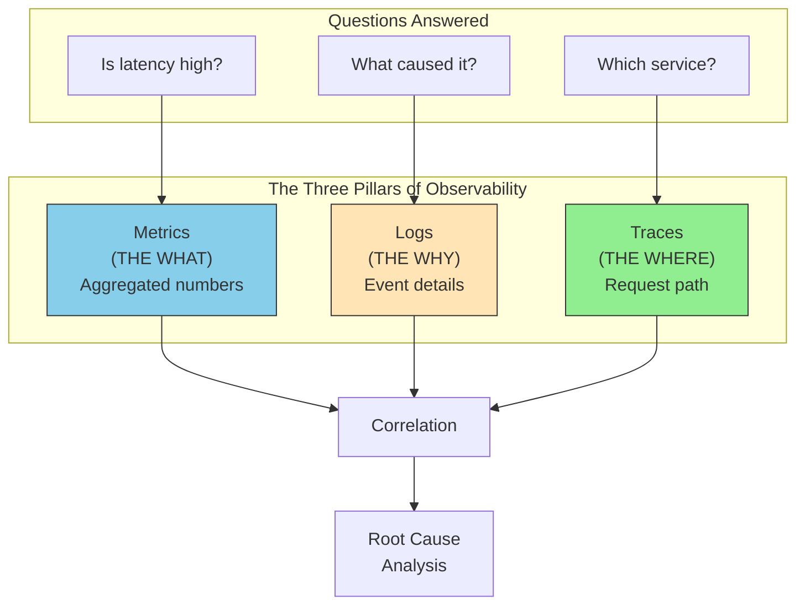

# The Three Pillars - Deep Dive

This guide covers 5 key areas: I. Executive Overview: Observability at Scale, II. Pillar 1: Metrics (The "What"), III. Pillar 2: Logs (The "Why"), IV. Pillar 3: Traces (The "Where"), V. Strategic Synthesis for the Principal TPM.


## I. Executive Overview: Observability at Scale



Observability at the Mag7 scale is fundamentally a data engineering challenge disguised as an operations problem. While monitoring tells you *when* you have a problem (the "known knowns"), observability allows you to ask arbitrary questions about your system to understand *why* it is behaving that way (the "unknown unknowns").

For a Principal TPM, the strategic focus shifts from tool selection to **data governance, cost containment, and noise reduction**. You are not just managing uptime; you are managing the signal-to-noise ratio of a distributed system that generates petabytes of telemetry daily.

### 1. The Architecture of High-Scale Observability

At companies like Amazon, Google, or Meta, observability is not a single SaaS tool (like Datadog or New Relic) plugged into the stack. It is usually a tiered architecture comprising a collection agent, a transport layer (Kafka/Kinesis), a storage engine (often time-series databases), and a query layer.

**Real-World Behavior at Mag7:**
*   **Decoupled Ingestion:** Telemetry is rarely sent directly to the storage backend. It is buffered through high-throughput streams (e.g., Kafka at LinkedIn/Netflix) to prevent backpressure on the application during traffic spikes. If the logging backend goes down, the application must not crash.
*   **The "Sidecar" Pattern:** In Kubernetes environments (Google GKE, Azure AKS), observability agents run as sidecars (e.g., Envoy proxy) alongside the application container. This abstracts the telemetry logic away from the application code, allowing TPMs to push standardization updates without requiring product teams to change a single line of code.
*   **Standardization via OpenTelemetry:** Mag7 companies are increasingly converging on OpenTelemetry (OTel) to standardize how data is generated. A Principal TPM drives the initiative to ensure Service A’s "latency" metric means the same thing as Service B’s "latency" metric.

### 2. Strategic Tradeoffs: Cost vs. Fidelity

The primary constraint in observability at scale is cost. Storing 100% of logs and traces for a service handling millions of RPS (Requests Per Second) is economically non-viable and technically useless (too much noise).

**The Sampling Dilemma:**
*   **Head-Based Sampling:** The decision to keep or drop a trace is made at the start of the request.
    *   *Pro:* Extremely low overhead; cheap.
    *   *Con:* You miss the "interesting" failures. If you sample 1%, and the error rate is 0.1%, you will likely miss the root cause trace.
*   **Tail-Based Sampling:** All data is buffered, and the decision to keep the trace is made *after* the request completes, based on whether it was an error or high latency.
    *   *Pro:* You capture 100% of failures.
    *   *Con:* High infrastructure cost (requires buffering terabytes of live data in memory/disk).

**Mag7 Context:** A Principal TPM at Uber or Netflix often champions **Tail-Based Sampling** for critical paths (Checkout, Playback) to ensure 100% of errors are captured, while enforcing aggressive **Head-Based Sampling** for non-critical background jobs to save money.

### 3. Cardinality: The Silent Killer

Cardinality refers to the number of unique values in a dataset. In metrics, this is the combination of tag values (e.g., `user_id`, `container_id`).

*   **The Problem:** If a developer tags a metric with `user_id` at a company with 100M users, they create 100M unique time series. This is a "Cardinality Explosion" and will crash the time-series database (TSDB) or skyrocket the vendor bill.
*   **TPM Action:** You must implement governance gates. High-cardinality data belongs in **Logs** (which are searchable but slow/expensive to aggregate), not **Metrics** (which are fast/cheap but break under high cardinality).
*   **Impact:** Failure to manage cardinality results in "blind spots" where the observability platform degrades or drops data during incidents—exactly when you need it most.

### 4. Business and CX Impact

Observability is directly tied to the **DORA metrics** (DevOps Research and Assessment) and the company's bottom line.

*   **MTTR (Mean Time To Recovery):** Effective observability reduces the "Time to Innocence." In a microservices outage, teams waste hours proving "it’s not my service." Distributed tracing eliminates this, isolating the fault immediately.
*   **Developer Velocity:** When developers trust their observability tools, they deploy more frequently. Fear of "unknown" breakages is the biggest bottleneck to release velocity.
*   **ROI on Infrastructure:** By utilizing observability data (specifically memory and CPU profiles), TPMs can drive "efficiency programs." For example, identifying that a service requests 8GB of RAM but only uses 2GB allows for "right-sizing," saving millions in annual cloud spend.

### 5. Edge Cases and Failure Modes

*   **The "Observer Effect":** Heavy instrumentation can slow down the application. A Principal TPM must enforce budgets on instrumentation overhead (e.g., "Tracing agents must not add more than 5ms of latency").
*   **Alert Fatigue:** If every anomaly triggers a page, engineers stop reacting. The Mag7 standard is to alert only on **Symptoms** (User pain, SLO breach), not **Causes** (High CPU).
*   **Telemetry Blackouts:** During a massive network failure, the observability system itself is often the first to fail due to the flood of error logs. Implementing "circuit breakers" for logging clients is mandatory to prevent the logging system from DDOSing the internal network.

## II. Pillar 1: Metrics (The "What")

risk for observability infrastructure at scale. Cardinality refers to the number of unique values in a metric dimension.
    *   **The Trap:** If a developer tags a metric with `user_id` (where you have 100M users) or `container_id` (which changes every deployment), you create millions of unique time series.
    *   **The Consequence:** This crashes the Time Series Database (TSDB) or explodes the vendor bill (Datadog/Splunk costs are often based on active time series).
    *   **TPM Action:** You must enforce governance. High-cardinality data belongs in Logs, not Metrics.

*   **Resolution vs. Retention Cost:**
    *   **The Tradeoff:** You want 1-second granularity to debug micro-bursts, but storing that data for a year is cost-prohibitive.
    *   **The Mag7 Solution:** **Downsampling**. Keep 1-second data for 24 hours (for immediate debugging), 1-minute data for 30 days (for sprint reviews), and 1-hour data for 1 year (for capacity planning/YoY analysis).

*   **Averages vs. Percentiles:**
    *   **The Trap:** Relying on "Average Latency." In a distributed system, the average hides the outliers. If 1% of requests take 10 seconds, the average might still look fine, but 1% of Amazon's traffic is millions of unhappy users.
    *   **TPM Action:** Always mandate P90, P99, and P99.9 (percentile) metrics for customer-facing SLOs.

### 3. Impact on Business & Capabilities

| Capability Area | Impact |
| :--- | :--- |
| **ROI / Cost** | **Observability Spend Management:** At Mag7 scale, observability data can cost 10-30% of total infrastructure spend. A Principal TPM drives initiatives to "drop" unused metrics, saving millions annually. |
| **CX (Customer Experience)** | **SLA Enforcement:** Metrics are the legal basis for SLAs. If your metrics are inaccurate or sampled incorrectly, you may be issuing service credits (refunds) unnecessarily or failing to detect actual breaches. |
| **Business Agility** | **Canary Deployments:** Automated deployment pipelines (CI/CD) rely on metrics. If the "Error Rate" metric spikes during a 1% canary rollout, the pipeline automatically rolls back. This allows Mag7 companies to deploy thousands of times per day with safety. |

### 4. Technical Deep-Dive: The Four Golden Signals

While "RED" is common for microservices, Google SRE methodology (widely adopted across Mag7) emphasizes the **Four Golden Signals**. As a Principal TPM, you should ensure any platform you manage exposes these by default.

1.  **Latency:** The time it takes to service a request.
    *   *Critical Detail:* You must distinguish between successful requests and failed requests. The latency of a 500 Error is often very fast (fail fast), which can artificially lower your average latency if grouped with successes.
2.  **Traffic:** A measure of how much demand is being placed on your system.
    *   *Examples:* HTTP requests per second (for APIs), I/O rate (for databases), or bandwidth (for streaming).
3.  **Errors:** The rate of requests that fail.
    *   *Explicit:* HTTP 500s.
    *   *Implicit:* HTTP 200 OK, but the response body contains "Error: Out of Stock" (soft errors).
    *   *Policy:* A Principal TPM must define if "User Errors" (HTTP 4xx) count against the service's reliability score. (Usually, they should not, unless the rate spikes abnormally).
4.  **Saturation:** How "full" the service is.
    *   *Why it matters:* This is the leading indicator for failure. Latency and Errors are lagging indicators (the user is already hurting). Saturation (e.g., "Thread pool is 90% full") tells you an outage is imminent.

### 5. Edge Cases and Failure Modes

*   **The "Silent Failure" (Metric Absence):**
    *   *Scenario:* A service crashes so hard it stops emitting metrics entirely. The dashboard shows "0 Errors" because no data is being sent.
    *   *Mitigation:* Implement "Heartbeat" metrics or "Absence" alerting (Alert if `sum(requests) == 0` for 5 minutes).
*   **Metric Delay (Ingestion Lag):**
    *   *Scenario:* During a massive traffic spike (e.g., Super Bowl ad), the telemetry system gets backed up. You are seeing metrics from 10 minutes ago, thinking the system is fine, while it is currently burning down.
    *   *Mitigation:* Monitor "Ingestion Latency" of the observability pipeline itself.

## III. Pillar 2: Logs (The "Why")

While metrics provide the "pulse" of the system, logs provide the medical chart. Logs are discrete, immutable records of specific events that occurred within your application or infrastructure. In a Principal TPM role at a Mag7 company, you must view logs not merely as text files for debugging, but as a massive data pipeline that balances **fidelity (resolution)** against **cost** and **compliance**.

Unlike metrics, which are aggregatable and cheap, logs are high-dimensional, heavy, and expensive. They answer the question: *"Why did the error rate spike, and exactly which users were affected?"*

### 1. Technical Deep-Dive: Structured Logging and Context
At the scale of Google or Microsoft, "grepping" text files on a server is impossible. Containers are ephemeral; they may exist for only minutes. Therefore, logs must be emitted as **Structured Data (usually JSON)** and shipped immediately to a centralized aggregation layer (like ELK Stack, Splunk, or internal tools like Google’s Monarch/Cloud Logging).

*   **The "What":** Instead of logging `Error: User login failed`, a Mag7 system logs:
    ```json
    {
      "level": "ERROR",
      "timestamp": "2023-10-27T10:00:00Z",
      "service": "auth-service",
      "trace_id": "a1b2c3d4",
      "user_id": "u-12345",
      "error_code": "AUTH_TIMEOUT",
      "region": "us-east-1"
    }
    ```
*   **The "Why" (Correlation):** The critical field here is the `trace_id`. This ID allows a TPM or engineer to stitch together a log entry from the Load Balancer, the API Gateway, the Auth Service, and the Database to reconstruct the entire request lifecycle. Without structured correlation, microservices logging is just noise.

### 2. Real-World Behavior at Mag7: The "Firehose" and Sampling
The volume of logs generated by a Mag7 service can easily exceed petabytes per day. A common anti-pattern is logging every successful HTTP 200 request.

*   **Dynamic Sampling:** High-maturity organizations (like Netflix or Meta) utilize dynamic sampling. They might log 100% of errors (5xx responses) but only 0.1% of successes (2xx responses).
*   **Priority Levels:**
    *   **FATAL/ERROR:** Wake someone up. Immediate ingestion.
    *   **WARN:** Review during business hours.
    *   **INFO/DEBUG:** often dropped at the ingestion layer in production or heavily sampled to save costs, only enabled via dynamic configuration during active incidents.
*   **Example:** During a massive outage at AWS, logging systems often experience "backpressure." If the logging agent (sidecar) cannot push logs fast enough because the destination is overwhelmed, it may block the main application thread, causing the logging solution itself to take down the service (a "brownout"). Mag7 architectures use **asynchronous, non-blocking logging** with fallback strategies (drop logs rather than crash the app) to prevent this.

### 3. Tradeoffs: Cost vs. Fidelity
As a Principal TPM, you will frequently mediate disputes between Engineering (who want to log everything for easier debugging) and FinOps/SRE (who need to control the massive storage bill).

| Choice | Tradeoff | Impact |
| :--- | :--- | :--- |
| **Log Everything** | **Pro:** Maximum visibility; solving "unknown unknowns" is easier.<br>**Con:** Exorbitant storage/indexing costs; slower query speeds due to data volume. | **ROI Negative:** You pay for data you never read. Can degrade indexing performance during critical incidents. |
| **Aggressive Sampling** | **Pro:** Significant cost reduction (90%+).<br>**Con:** You might miss the specific log entry for a "needle in a haystack" bug affecting only 0.01% of VIP users. | **CX Risk:** High-value customers may experience errors that engineers cannot reproduce because the logs were dropped. |
| **Hot vs. Cold Storage** | **Pro:** Keep recent logs (7 days) in expensive, fast search (Hot); move older logs to cheap blobs (Cold/Glacier).<br>**Con:** Retrieving cold logs for a post-mortem or compliance audit takes hours/days. | **Operational Efficiency:** Optimizes spend while meeting compliance retention (e.g., 7 years for financial data). |

### 4. Impact on Business Capabilities and Compliance
Logs are a double-edged sword regarding data privacy.

*   **The "Third Rail" (PII/MNPI):** A common failure mode is a developer accidentally logging a full JSON payload that includes a user's password, credit card number, or PII.
*   **Mag7 Mitigation:**
    *   **Automated Scrubbing:** Ingestion pipelines often have regex scrubbers that mask patterns looking like SSNs or Credit Cards before writing to disk.
    *   **Policy Enforcement:** If a service is found logging PII, it is treated as a SEV-1 security incident.
*   **Business Value:** High-quality logs reduce **Mean Time to Recovery (MTTR)**. If an engineer can query "Show me all errors for Tenant X in the last 15 minutes" and get an instant result, an outage that costs $100k/minute might last 5 minutes instead of 50.

### 5. Principal TPM Actionable Guidance
1.  **Enforce Standardization:** Ensure all teams in your program output logs in a consistent JSON schema. If Team A calls it `user_id` and Team B calls it `uid`, cross-service debugging is impossible.
2.  **Define Retention Policies:** Do not treat all logs equally. Audit logs (who changed permissions) need years of retention; Debug logs from a dev environment need 24 hours.
3.  **Monitor Log Volume:** Treat "Log Ingestion Volume" as a metric itself. A sudden spike in log volume often precedes a service failure or indicates a code deployment left "Debug" mode on.

## IV. Pillar 3: Traces (The "Where")

Distributed tracing provides the causal link between services. While metrics tell you *that* a problem exists (latency spiked), and logs tell you *why* a specific process failed (null pointer exception), traces tell you *where* the latency originated in a complex request lifecycle.

For a Principal TPM, tracing is the primary tool for resolving cross-team dependencies and "blame game" scenarios. In a microservices architecture, a single user request (e.g., "Load News Feed") triggers a fan-out to hundreds of downstream services (Ads, Ranking, User Profile, Image CDN). Tracing visualizes this entire chain as a "Waterfall View," identifying exactly which service on the critical path caused the delay.

### 1. The Mechanics of Distributed Tracing at Scale

At the Mag7 level, tracing relies on **Context Propagation**. When a request hits the edge load balancer (e.g., AWS ALB or Google GFE), it is assigned a unique `Trace-ID`. This ID is injected into the HTTP headers (standardized via W3C Trace Context) and passed to every downstream service.

*   **Spans:** Each unit of work (e.g., a database query, an API call) is recorded as a "Span." A Span contains a start time, end time, and reference to the parent Span.
*   **Service Maps:** By aggregating traces, platforms generate dynamic dependency graphs. This allows a TPM to see, in real-time, that the *Checkout Service* depends on the *Inventory Service*, which depends on a legacy *SQL Database*.

**Real-World Example:**
At **Uber**, a ride request hits the dispatch service. This triggers calls to:
1.  Geolocation Service (Where is the driver?)
2.  Pricing Service (Is it surge pricing?)
3.  Fraud Detection Service (Is this a stolen credit card?)

If the user sees a spinning wheel, metrics might show the Dispatch Service is slow. However, the **Trace** reveals that the Dispatch Service is actually waiting on a timeout from the Fraud Detection Service. Without tracing, the Dispatch team would waste hours debugging their own code when the root cause lies elsewhere.

### 2. The Critical Tradeoff: Sampling Strategies

The single biggest technical and business challenge with tracing at Mag7 scale is **volume**. Generating a full trace for every single request (100% sampling) is technically feasible but economically ruinous due to storage and network costs.

A Principal TPM must drive the strategy on **Sampling**:

*   **Head-Based Sampling:** The decision to trace is made at the start of the request.
    *   *Strategy:* "Trace 1 out of every 1,000 requests."
    *   *Pros:* Low overhead, predictable cost.
    *   *Cons:* You will likely miss the specific trace for a rare "black swan" error.
*   **Tail-Based Sampling:** The decision to keep the trace is made *after* the request completes.
    *   *Strategy:* "Buffer all traces in memory. If the request was successful and fast, delete it. If it failed or was slow, store it."
    *   *Pros:* You capture 100% of the interesting/failure data. This is the gold standard for debugging.
    *   *Cons:* Extremely resource-intensive. Requires massive buffers to hold data while waiting for the request to finish.

**Mag7 Context:**
**Google** (via its Dapper paper) historically pioneered probabilistic (head-based) sampling to manage overhead. However, modern observability platforms at companies like **Meta** or **Netflix** often lean toward tail-based sampling for critical paths (like Payments) because losing debug data for a failed transaction is unacceptable, whereas they might aggressively down-sample "heartbeat" checks.

### 3. Business Impact and Capabilities

Implementing robust tracing impacts the organization across three axes:

#### A. Mean Time to Resolution (MTTR) & ROI
Tracing is the fastest way to exonerate innocent services. In a major outage, "Mean Time to Innocence" (proving it's not your service) is a vital metric.
*   **ROI Calculation:** If an outage costs Amazon \$1M/minute, and tracing reduces root cause analysis from 30 minutes to 5 minutes, the system pays for itself in one incident.

#### B. Performance Optimization (Latency Analysis)
Tracing identifies the "Long Pole" in the tent.
*   **Example:** A TPM at **Microsoft Azure** might use tracing to discover that a 500ms latency in the portal is caused by a sequential execution of three API calls that could be parallelized. By refactoring to parallel execution, they improve CX significantly without buying new hardware.

#### C. Organizational Alignment (Conway’s Law)
Service maps derived from traces often reveal that the software architecture no longer matches the org chart. A Principal TPM uses this data to argue for re-orgs or architectural refactoring (e.g., "Service A calls Service B 50 times per request; these should be merged or the API redesigned").

### 4. Implementation Risks and Mitigation

*   **Instrumentation Tax:** Adding tracing code adds slight latency to the application.
    *   *Mitigation:* Use asynchronous non-blocking agents (e.g., OpenTelemetry collectors) to offload the processing of trace data away from the main application thread.
*   **Broken Traces:** If one team in the middle of the chain (e.g., a legacy Java middleware team) fails to forward the HTTP headers, the trace "breaks." The visualization stops dead, rendering the tool useless for downstream dependencies.
    *   *TPM Action:* This is a compliance issue. The TPM must enforce "Observability mandates" where header propagation is a launch blocker for all services.

## V. Strategic Synthesis for the Principal TPM

Strategic synthesis transforms the raw data of the Three Pillars (Metrics, Logs, Traces) into actionable business intelligence and engineering strategy. For a Principal TPM, the objective is not to configure the collectors, but to govern the ecosystem to ensure it drives reliability, cost-efficiency, and product velocity.

### 1. The Economics of Observability: Balancing Cost vs. Visibility
At Mag7 scale, observability data volume grows faster than production traffic. A common anti-pattern is "log everything, measure everything." This leads to observability bills that can rival infrastructure costs (often 20-30% of total cloud spend).

*   **Real-World Behavior (Google/Meta):**
    *   **Dynamic Sampling:** Instead of tracing 100% of requests (which is cost-prohibitive at 1M+ RPS), systems are configured for "tail-based sampling." The system buffers traces and only persists those that exhibit errors or high latency, discarding the 99% of "happy path" requests.
    *   **Metric Aggregation:** High-cardinality metrics (e.g., tracking latency per `user_id`) are blocked at the ingestion gateway. They are aggregated into histograms or percentiles before storage to prevent database collapse.

*   **Tradeoffs:**
    *   **Visibility vs. Cost:** Aggressive sampling saves millions of dollars but risks missing the "needle in the haystack" root cause for a rare bug affecting a specific VIP customer.
    *   **Granularity vs. Performance:** Storing high-resolution data (1-second intervals) allows precise debugging but degrades query performance and increases storage costs. Moving to 1-minute aggregations saves space but smooths out micro-bursts.

*   **Principal TPM Action:** Implement "Tiered Observability." Critical Tier-0 services (Checkout, Auth) get 100% log retention and high-resolution metrics. Tier-2 internal tools get aggressive sampling (1%) and 7-day retention.

### 2. Defining Reliability: SLOs and Error Budgets
A Principal TPM must bridge the gap between Product Management (who want 100% uptime) and Engineering (who want to release code fast). The strategic tool for this is the **Service Level Objective (SLO)**.

*   **Real-World Behavior (Amazon/Netflix):**
    *   **SLI (Indicator):** The specific metric (e.g., "Latency of `GetProduct`").
    *   **SLO (Objective):** The target (e.g., "99.9% of requests complete in < 200ms").
    *   **Error Budget:** The remaining 0.1%. If a team burns their error budget (due to outages), the Principal TPM enforces a "Feature Freeze." The team must stop shipping new features and work solely on reliability until the budget replenishes.

*   **Impact on Business/CX:**
    *   **Alignment:** Eliminates subjective arguments about whether the system is "stable enough" to deploy.
    *   **Customer Trust:** SLOs are derived from customer pain thresholds, not arbitrary engineering goals.

*   **Tradeoffs:**
    *   **Velocity vs. Stability:** Enforcing error budgets strictly can delay product launches. The TPM must have the political capital to hold the line against product VP pressure during a freeze.
    *   **False Positives:** Poorly defined SLOs (e.g., alerting on CPU usage rather than user latency) lead to "alert fatigue," causing engineers to ignore real incidents.

### 3. The "Paved Path" vs. Tooling Anarchy
In a federated organization, teams often choose their own observability stacks (Prometheus vs. DataDog vs. New Relic). A Principal TPM drives the strategy for convergence.

*   **Real-World Behavior:**
    *   Mag7 companies invest heavily in a "Paved Path" (or "Golden Path"). This is a centralized, platform-supported observability stack.
    *   **Example:** A TPM at Uber might drive migration to a centralized Jaeger tracing cluster. Teams *can* use their own tools, but they receive no central support, no integration with standard deployment pipelines, and must pay for it from their own P&L.

*   **Tradeoffs:**
    *   **Standardization vs. Autonomy:** Standardization reduces context switching during cross-team incidents (everyone reads the same dashboards). However, it may force a square peg into a round hole for niche services (e.g., ML pipelines needing different metrics than web servers).
    *   **Build vs. Buy:** Mag7 often builds internal tools (e.g., Google's Monarch). The tradeoff is the engineering headcount required to maintain the monitoring tool itself versus paying a vendor premium.

### 4. Strategic Incident Management & MTTR Reduction
The ultimate test of observability is the Mean Time To Recovery (MTTR). The Principal TPM uses observability gaps identified during post-mortems (COE - Correction of Error) to drive roadmap changes.

*   **Real-World Behavior:**
    *   **The "Dashboard-First" Culture:** During a P0 incident, the first question is not "What changed?" but "Link the dashboard."
    *   **Distributed Tracing as a Dependency Map:** In microservices, service A fails because service Z (four hops away) is slow. Without distributed tracing, teams blame each other ("My service is fine, it's the network"). Tracing provides the irrefutable evidence required to route the incident to the correct team immediately.

*   **Impact on Capabilities:**
    *   **Skill Shift:** Moves the organization from "intuition-based debugging" (guessing) to "evidence-based debugging."
    *   **ROI:** Reducing a P0 outage duration by 10 minutes on Prime Day can save millions in revenue.

---


## Interview Questions


### I. Executive Overview: Observability at Scale

### Question 1: Designing for Cost-Efficient Observability
**"We are launching a new high-throughput service anticipated to handle 500k TPS. The engineering team wants to log every request and trace every transaction for the first month to ensure stability. As the Principal TPM, how do you handle this request given strict budget constraints?"**

*   **Guidance for a Strong Answer:**
    *   **Challenge the premise:** Logging everything at 500k TPS is technically infeasible (IOPS bottlenecks) and financially ruinous.
    *   **Propose tiers:** Differentiate between "Control Plane" (low volume, log everything) and "Data Plane" (high volume, sample heavily).
    *   **Technical solution:** Suggest **Dynamic Sampling**. Start with 100% for the first hour (controlled rollout), then exponentially decay sampling rates as confidence grows.
    *   **Alternative data paths:** Use Metrics for the "What" (100% coverage of error rates/latency) and Logs/Traces for the "Why" (sampled coverage).
    *   **Governance:** Establish a "TTL" (Time to Live) policy. Debug logs should be retained for only 3 days, whereas compliance logs are kept for years in cold storage (S3 Glacier).

### Question 2: Handling Cardinality Explosions
**"During a P0 incident, the observability dashboards load extremely slowly, and some panels show 'No Data'. The metrics backend is timing out. You discover a team recently deployed a change tagging metrics with `session_id`. How do you resolve the immediate incident and prevent recurrence?"**

*   **Guidance for a Strong Answer:**
    *   **Immediate Mitigation:** Drop the high-cardinality metric at the ingestion layer (Ingress/Gateway) to relieve pressure on the TSDB. Do not wait for a code rollback; use the observability pipeline's configuration to block the tag.
    *   **Root Cause Analysis:** Explain *why* `session_id` breaks metrics (cardinality explosion).
    *   **Systemic Fix:** Move `session_id` to Logs or Traces, where high cardinality is acceptable.
    *   **Prevention (The Principal TPM value add):** Implement "Cardinality Limits" in the CI/CD pipeline or the metrics client library. If a new metric exceeds a limit (e.g., 1000 unique series), the client should aggregate it to "other" rather than crashing the backend. Establish a "Metric Review" process for high-impact services.

### II. Pillar 1: Metrics (The "What")

### Question 1: Managing Cardinality and Cost
**"We are migrating a legacy monolith to microservices. The engineering team wants to tag every metric with `Customer_ID` to track VIP experience. This will increase our observability bill by 10x. As the Principal TPM, how do you handle this?"**

*   **Guidance for a Strong Answer:**
    *   **Acknowledge the tension:** Validate the engineer's need (VIP tracking is critical) vs. the architectural constraint (cardinality kills TSDBs).
    *   **Propose the technical tradeoff:** Explain that `Customer_ID` is high cardinality. It belongs in **Logs** or **Traces**, not standard Metrics.
    *   **Offer a solution (The "Allow-list" approach):** Suggest creating a specific metric *only* for the top 50 VIP customers (low cardinality), while aggregating the rest into "Standard Tier."
    *   **Process:** Establish a "Metric Governance" review process where any new dimension with >1000 potential values requires architectural approval.

### Question 2: Leading vs. Lagging Indicators
**"You are the TPM for a new AI inference platform. The team has set up alerts on CPU usage and Error Rates. Why is this insufficient, and what specific metrics would you add to ensure reliability?"**

*   **Guidance for a Strong Answer:**
    *   **Critique existing metrics:** CPU (Saturation) is good but noisy. Error Rate is a *lagging* indicator—by the time it fires, customers are already failing.
    *   **Introduce SLO-focused metrics:** Focus on **Latency (Duration)**. For AI inference, the "Time to First Token" is the primary CX metric.
    *   **Add Queue Depth (Saturation):** In AI/ML, requests often queue up before processing. Monitoring queue depth is a *leading* indicator. If the queue grows, latency *will* spike in 30 seconds. Alerting on the queue allows auto-scaling to kick in *before* the user perceives lag.
    *   **Business Metric:** Mention tracking "Model Drift" or "token count" to correlate technical health with business quality/cost.

### III. Pillar 2: Logs (The "Why")

### Question 1: The "Cost vs. Visibility" Conflict
**Question:** "We are currently overspending our observability budget by 40%. The engineering teams refuse to reduce logging volume, claiming they need the data to debug production issues effectively. As a Principal TPM, how do you resolve this impasse?"

**Guidance for a Strong Answer:**
*   **Acknowledge the tension:** Validate both the budget constraint and the engineering need.
*   **Data-driven analysis:** Propose an audit of log utility. How many of these logs are actually queried? (At Mag7, usually <5% of logs are ever read).
*   **Technical solutions:** Suggest implementing **dynamic sampling** (keep 100% of errors, 1% of success) or **tiered storage** (move logs to cold storage faster).
*   **Process change:** Propose "On-Demand Logging" capabilities where verbose logging can be temporarily turned on for specific users/instances during an incident, rather than always-on.
*   **Outcome:** Demonstrate how you reduced cost while maintaining (or improving) the signal-to-noise ratio.

### Question 2: Compliance and Architecture
**Question:** "During a post-mortem of a P0 incident, you discover that the root cause was identified quickly, but the logs containing the error details also included unencrypted customer PII. This violates GDPR and internal security policies. How do you handle the immediate aftermath and the long-term architectural fix?"

**Guidance for a Strong Answer:**
*   **Immediate Action:** Incident response. The logs must be purged or masked immediately, even if it hinders the post-mortem. Legal/Privacy teams must be notified.
*   **Root Cause Analysis (Process):** How did this pass code review? Was it a dependency update?
*   **Architectural Fix:** Move away from relying on developers to manually sanitize logs. Propose **centralized scrubbing** in the sidecar/agent level or the ingestion pipeline.
*   **Cultural/Skill Impact:** Implement automated linting rules in the CI/CD pipeline to block commits that log raw request objects. Turn this into a learning opportunity, not a witch hunt, to improve the organization's security posture.

### IV. Pillar 3: Traces (The "Where")

**Question 1: Designing for Cost vs. Visibility**
"We are launching a new high-volume payment gateway processing 50,000 transactions per second. We need deep observability to debug failures, but storing traces for every transaction will blow our infrastructure budget. As a Principal TPM, propose a tracing strategy that balances cost with the need to debug rare failures."

*   **Guidance for a Strong Answer:**
    *   Acknowledge that 100% retention is impossible/wasteful.
    *   Propose **Tail-Based Sampling**: Buffer traces and only persist those with HTTP 5xx errors or latency > P99.
    *   Suggest **Dynamic Sampling**: Keep 0.1% of successful traces for baseline comparison, but 100% of failed traces.
    *   Discuss **Span Baggage**: Injecting high-value business context (like `MerchantID` or `TransactionValue`) into the trace header so you can prioritize retaining traces for high-value enterprise customers over free-tier users.

**Question 2: Cultural Adoption of Tracing**
"You have joined a team where Service A blames Service B for latency, and Service B blames the Network. No distributed tracing exists, and teams are resistant to adding 'more code' for instrumentation. How do you drive the adoption of tracing across these siloed teams?"

*   **Guidance for a Strong Answer:**
    *   **Start Small (The Lighthouse Strategy):** Do not try to boil the ocean. Instrument one critical path (the "Checkout" flow) to demonstrate value.
    *   **Quantify the Pain:** Use data from the last outage. Show how many hours were wasted on conference calls guessing the root cause.
    *   **Standardization:** Push for **OpenTelemetry** so teams aren't locked into a specific vendor.
    *   **The "Carrot":** Promise that once tracing is active, on-call paging volume will decrease because alerts will be routed to the actual culprit, not everyone in the chain.

### V. Strategic Synthesis for the Principal TPM

### Question 1: The Cost of Observability
**"Our observability costs have tripled in the last year and are now 15% of our total cloud spend. Engineering teams argue they need this data to maintain 99.99% availability. As a Principal TPM, how do you approach reducing this cost without sacrificing reliability?"**

*   **Guidance for a Strong Answer:**
    *   **Analyze the Data:** Don't just cut blindly. Identify the top 5 "noisy" services or metrics driving the cost.
    *   **Differentiate Value:** Discuss "Write-Heavy vs. Read-Never" data. Are we storing terabytes of debug logs that are never queried?
    *   **Propose Technical Strategies:** Mention sampling (tail-based), aggregation (metrics vs. raw logs), and retention policies (hot vs. cold storage).
    *   **Governance:** Propose a "chargeback" model where observability costs come out of individual team budgets to incentivize efficiency.
    *   **Risk Management:** Acknowledge the tradeoff. Changing sampling rates implies a calculated risk. How will you mitigate this? (e.g., keeping 100% for P0 services, reducing P2).

### Question 2: Implementing SLOs in a Feature-Driven Culture
**"You are working with a product vertical that is aggressive about shipping features and frequently breaks production. They currently have no defined SLOs and rely on customer complaints to detect outages. How do you drive the adoption of SLOs and Error Budgets in this environment?"**

*   **Guidance for a Strong Answer:**
    *   **Cultural alignment, not just technical:** Acknowledge that this is a negotiation with Product leadership, not just an engineering task.
    *   **Start Small:** Don't try to define SLOs for everything. Pick the "Critical User Journey" (e.g., Checkout).
    *   **Baseline First:** Measure current performance for a month before setting a target. Don't set a 99.99% goal if the current reality is 95%.
    *   **The "Teeth" of the mechanism:** Explain how you will enforce the Error Budget. What happens when it's exhausted? (Feature freeze). How do you handle pushback? (Escalation paths, data-driven justification regarding churn/revenue impact).
    *   **Outcome focus:** Frame the implementation not as "slowing down devs" but as "protecting customer trust" and "sustainable velocity" (less rework/firefighting).

---


## Key Takeaways

- Review each section for actionable insights applicable to your organization

- Consider the trade-offs discussed when making architectural decisions

- Use the operational considerations as a checklist for production readiness
