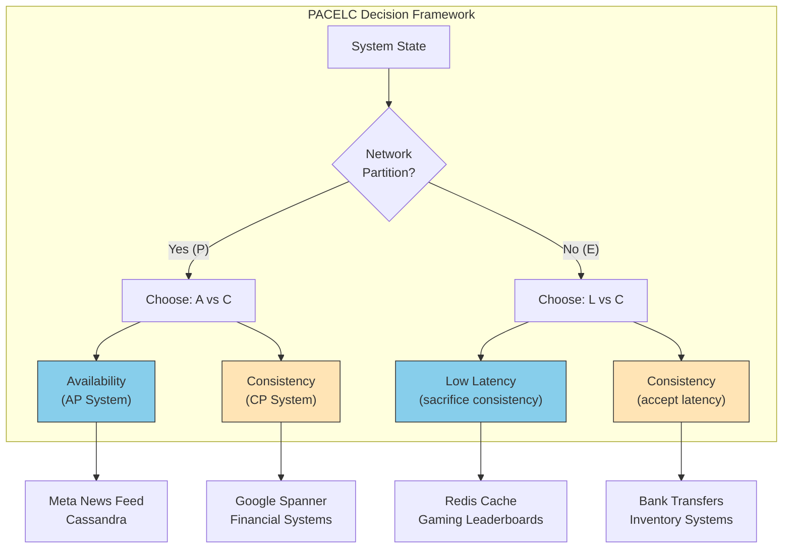
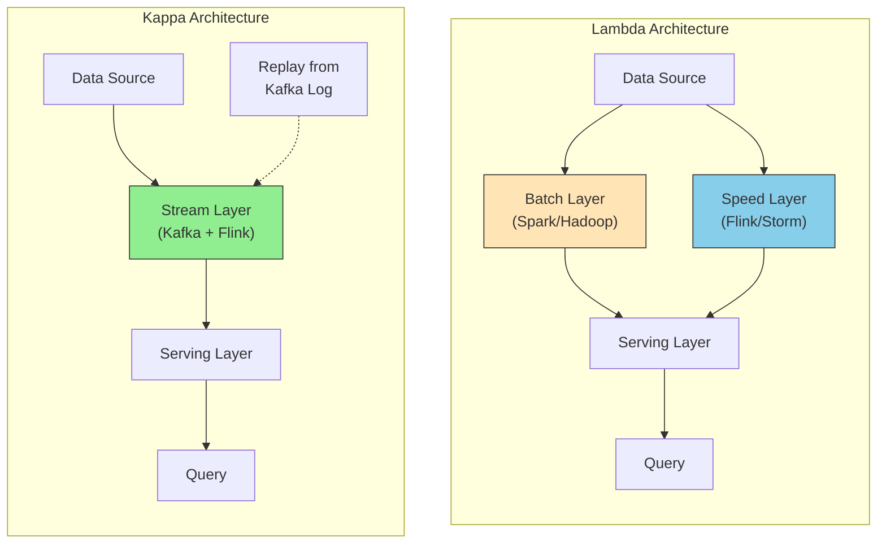

# Trade-offs Summary

This guide covers 6 key areas: I. The Fundamental Theorem: Consistency vs. Availability (CAP & PACELC), II. Data Storage: SQL (Relational) vs. NoSQL (Non-Relational), III. Processing Models: Batch vs. Real-Time (Stream), IV. Communication: Synchronous (REST/gRPC) vs. Asynchronous (Event-Driven), V. Compute Strategy: Serverless vs. Containers vs. VMs, VI. Strategic Execution: Build vs. Buy vs. Open Source.

## I. The Fundamental Theorem: Consistency vs. Availability (CAP & PACELC)

### 1. The PACELC Extension: The TPM's Reality
While CAP addresses system behavior during network partitions (failures), it fails to address the system's behavior during normal operations. At a Mag7 level, partitions are rare, but latency is a constant constraint. You must utilize the **PACELC** theorem to drive architectural decisions.

**PACELC states:**
*   If there is a Partition (**P**), how does the system trade off Availability (**A**) and Consistency (**C**)?
*   **E**lse (when the system is running normally), how does the system trade off Latency (**L**) and Consistency (**C**)?

**TPM Action:** When defining SLAs with engineering leads, do not just ask "What happens if the network fails?" You must ask, "To achieve sub-50ms latency on the 'Buy Now' button, are we willing to show a user an item that *might* be out of stock?"

### 2. Mag7 Implementation Patterns

#### Consistency-Heavy (CP/PC): Google Spanner & Financial Ledgers
*   **Architecture:** Uses synchronous replication and atomic clocks (TrueTime) to ensure external consistency.
*   **Behavior:** A write is not confirmed to the client until it is replicated to a majority of Paxos groups.
*   **Trade-off:** Write latency is higher because the system waits for consensus. If a region goes down, the system stops accepting writes rather than accepting a "split-brain" scenario.
*   **Business Impact:** High cost per transaction (compute/network). Zero risk of double-spending. Essential for billing, entitlements, and inventory reservation systems.

#### Availability-Heavy (AP/PA): Meta (Facebook) News Feed & Cassandra
*   **Architecture:** Uses "gossip protocols" and eventual consistency.
*   **Behavior:** When a user posts a status, it is written to the nearest node. The user sees it immediately (Low Latency). It propagates to other regions asynchronously.
*   **Trade-off:** A friend in a different region might not see the post for several seconds (Replication Lag).
*   **Business Impact:** Maximizes engagement time. Blocking a user from posting because a database node in Virginia is down would directly reduce Daily Active Users (DAU) and ad impressions.

#### Tunable Consistency: Amazon DynamoDB
*   **Architecture:** Allows the application (and the TPM/Product owner) to choose consistency levels per request.
*   **Behavior:**
    *   *Eventual Consistent Read:* Fast, cheap (0.5 read units), might return stale data.
    *   *Strongly Consistent Read:* Slower, expensive (1.0 read units), guarantees most recent data.
*   **TPM Strategy:** You can optimize COGS (Cost of Goods Sold) by defaulting to eventual consistency for non-critical features (e.g., review counts) while enforcing strong consistency for critical paths (e.g., checkout).

### 3. Critical Trade-offs and ROI

| Decision | Technical Implication | Business/ROI Impact | CX Impact |
| :--- | :--- | :--- | :--- |
| **Strong Consistency** | Requires synchronous replication. Write latency increases with distance between nodes. | **High Cost:** Lower throughput per dollar. **Low Risk:** Eliminates financial discrepancies. | **Trust:** User always sees accurate data. **Frustration:** Slower load times; potential "System Unavailable" errors. |
| **Eventual Consistency** | Asynchronous replication. High throughput. Requires conflict resolution logic (e.g., Last-Write-Wins). | **High ROI:** Cheap scaling. Maximizes revenue capture during outages. | **Speed:** Snappy interfaces. **Confusion:** User might see "phantom" data (e.g., a deleted comment reappearing briefly). |
| **Read Repair** | System fixes inconsistencies when data is read. | **Compute Cost:** shifts load to read-time. | **Latency:** Occasional slow reads for unlucky users triggering the repair. |

### 4. Conflict Resolution Strategies
If you choose Availability (AP), you create data conflicts. Two users edit the same wiki page at the same time in different regions. As a Principal TPM, you must define the business rule for resolution:

1.  **Last Write Wins (LWW):** The system uses a timestamp. The latest one overwrites the other.
    *   *Risk:* Data loss. If User A spends 1 hour writing and User B fixes a typo 1 second later, User A's work is deleted.
2.  **CRDTs (Conflict-free Replicated Data Types):** Mathematical structures that merge data automatically (e.g., a counter that only increments).
    *   *Benefit:* No data loss, high availability.
    *   *Cost:* High engineering complexity to implement.
3.  **Read-Time Resolution:** Show the user both versions and ask them to merge (e.g., Git merge conflicts).
    *   *CX Impact:* High friction, bad for consumer apps, acceptable for developer tools.

### 5. Edge Cases and Failure Modes
*   **The Thundering Herd:** In CP systems, when a partition heals, nodes rush to sync data. This can overwhelm the network, causing a secondary outage. *Mitigation:* Exponential backoff strategies.
*   **Split Brain:** In a cluster, if the network cuts the cluster in half, both halves might think they are the "leader" and accept writes. *Mitigation:* Quorum consensus ($N/2 + 1$ nodes must agree). If you can't reach a quorum, you shut down (sacrificing Availability).
*   **Replication Lag Spikes:** In AP systems, "eventual" consistency usually means milliseconds. However, during a datacenter outage, "eventual" can become hours. *TPM Check:* Does the UI handle a state where the user buys an item, but the "My Orders" page is empty for 10 minutes?

## II. Data Storage: SQL (Relational) vs. NoSQL (Non-Relational)

At the scale of Mag7, the decision between SQL and NoSQL is rarely about "structured vs. unstructured" data. It is almost exclusively a decision based on **access patterns**, **write-scaling limitations**, and **operational overhead**. A Principal TPM must identify when a team is choosing a database based on comfort (resume-driven development) rather than the specific read/write characteristics of the workload.

### 1. The Relational Model (SQL) at Scale
While standard relational databases (MySQL, PostgreSQL) excel at ACID compliance and complex joins, they hit a hard ceiling on **write throughput**. In a traditional setup, you can scale reads horizontally (Read Replicas), but you can typically only scale writes vertically (bigger hardware).

#### Mag7 Real-World Behavior
*   **Google Spanner:** Google refused to accept the trade-off that SQL cannot scale horizontally. They built Spanner, a globally distributed synchronous database. It offers SQL semantics with horizontal scalability, utilizing atomic clocks (TrueTime) to guarantee external consistency. This powers Google Play and Google Ads.
*   **Meta (Facebook):** Heavily utilizes a customized version of MySQL. To bypass write bottlenecks, they built extensive sharding logic into the application layer and created an intermediate caching graph layer (TAO) to handle the massive read volume of the social graph, using MySQL primarily for durable storage.

#### Trade-offs
*   **Pros:**
    *   **Query Flexibility:** Ad-hoc queries are easy; business intelligence teams can query data without Engineering intervention.
    *   **Data Integrity:** Foreign keys and constraints prevent "orphaned" data, reducing the need for application-side validation code.
*   **Cons:**
    *   **The "Alter Table" Nightmare:** At Mag7 scale, running an `ALTER TABLE` command to add a column on a table with 10 billion rows can lock the database for hours or days. This requires complex "Online Schema Change" (OSC) tooling.
    *   **Sharding Complexity:** Once write volume exceeds a single node, you must manually shard (partition) data. This introduces immense complexity in the application layer (e.g., cross-shard joins are impossible or highly inefficient).

### 2. The Non-Relational Model (NoSQL)
NoSQL databases (Key-Value, Document, Wide-Column) abandon rigid schemas and complex joins in favor of **predictable latency** at any scale. They are designed to scale horizontally by default, using consistent hashing to distribute data across thousands of commodity servers.

#### Mag7 Real-World Behavior
*   **Amazon DynamoDB:** Born from the learnings of the "Amazon.com" outages. Amazon realized 70% of their access patterns were "fetch one record by primary key." DynamoDB powers the Shopping Cart and Prime Day peak traffic. It prioritizes single-digit millisecond latency over complex query capability.
*   **Netflix (Cassandra):** Netflix uses Apache Cassandra (Wide-Column store) for its viewing history. It requires massive write throughput (recording every second you watch). If a node fails, Cassandra is "eventually consistent"—it is acceptable if your "Continue Watching" bar is 5 seconds out of date on a different device, provided the write never fails.

#### Trade-offs
*   **Pros:**
    *   **Linear Scalability:** Doubling the nodes effectively doubles the throughput. No complex manual sharding logic is required in the application.
    *   **Schema Flexibility:** You can start storing new attributes (e.g., adding "TikTok handle" to a user profile) without migrating billions of existing records.
*   **Cons:**
    *   **Access Pattern Rigidity:** You must know *exactly* how you will query the data before you design the table. If you design a table to be queried by `UserID`, and later the Product Manager wants to query by `Region`, you often have to duplicate the data into a new table or build a secondary index, which increases cost.
    *   **Eventual Consistency:** In many NoSQL configurations, a read immediately following a write may return old data, leading to CX issues (e.g., a user posts a comment but doesn't see it appear immediately).

### 3. Business & ROI Implications

As a Principal TPM, you must translate technical database choices into business outcomes.

| Feature | SQL Impact | NoSQL Impact |
| :--- | :--- | :--- |
| **Time-to-Market** | **Slower initially.** Requires rigorous schema design. **Faster later** for analytics/reporting features due to SQL join capabilities. | **Faster initially.** Schemaless nature allows rapid prototyping. **Slower later** if access patterns change, requiring data migration/restructuring. |
| **Cost (ROI)** | **High at Scale.** Vertical scaling (specialized high-RAM hardware) and licensing (Oracle/SQL Server) are expensive. | **Optimized.** Runs on commodity hardware. Managed services (DynamoDB) charge by request, aligning cost strictly with revenue-generating traffic. |
| **Customer Experience** | **Consistency.** Good for financial transactions/inventory. Prevents "overselling." | **Availability/Speed.** Good for user feeds, catalogs, and gaming. Prevents "downtime" during peak loads. |

### 4. Polyglot Persistence
The modern Mag7 architecture is rarely "SQL vs. NoSQL." It is usually **Polyglot Persistence**—using the right database for the specific microservice.

*   **Example:** An Uber-style app.
    *   **Trip Payment:** SQL (ACID is non-negotiable).
    *   **Driver Location Stream:** NoSQL/In-Memory (Redis/Cassandra) for massive write volume where historical data expires quickly.
    *   **Route Optimization:** Graph Database (Neo4j) to calculate nodes and edges.

**Guidance for TPMs:** If a team proposes a "one size fits all" database for a complex platform, challenge it. If they propose 5 different databases for a simple CRUD app, challenge the operational overhead.

## III. Processing Models: Batch vs. Real-Time (Stream)

At the Principal TPM level, the decision between Batch and Real-Time processing is rarely a binary technical choice; it is a negotiation between business value (Time-to-Insight) and infrastructure cost/complexity. You must discern whether a feature requires sub-second latency (Stream) or if T+1 day consistency (Batch) yields a higher ROI.

### 1. Architectural Paradigms

**Batch Processing (Bounded Data):**
Processing occurs on a finite set of data that has already been stored. The system ingests a large volume of data, processes it, and writes the output.
*   **Tech Stack:** Apache Spark, Hadoop MapReduce, AWS Glue, Google Cloud Dataflow (batch mode).
*   **Key Metric:** Throughput (records processed per second).

**Real-Time/Stream Processing (Unbounded Data):**
Processing occurs continuously as data flows through the system. The system reacts to individual events or micro-batches.
*   **Tech Stack:** Apache Kafka, Apache Flink, Amazon Kinesis, Google Pub/Sub.
*   **Key Metric:** Latency (time from event ingestion to action).

### 2. Mag7 Real-World Behavior

**Batch Example: Meta (Facebook) "People You May Know" (PYMK)**
While the user interface feels dynamic, the heavy lifting of graph traversal to find friend connections often happens in batch.
*   **The Logic:** Calculating 2nd and 3rd-degree connections for billions of users is computationally expensive. Running this in real-time for every page load would cripple the infrastructure.
*   **Implementation:** Meta runs massive nightly batch jobs (using Spark/Presto) to pre-compute recommended connections. These are stored in a key-value store. When a user logs in, the application simply reads the pre-computed list.
*   **Tradeoff:** The recommendations might be 12-24 hours stale, but the user experience is fast (low read latency), and compute costs are managed using spot instances during off-peak hours.

**Real-Time Example: Uber Surge Pricing & Fraud Detection**
Uber cannot wait for a nightly batch job to determine pricing or detect account takeovers.
*   **The Logic:** Supply (drivers) and Demand (riders) fluctuate by the minute. Pricing must reflect the state of the network *now*. Similarly, if a payment pattern indicates fraud, the transaction must be blocked before it completes.
*   **Implementation:** Uber uses a Kappa Architecture (stream-first). Events (ride requests, GPS pings) are ingested via Kafka and processed by Flink to aggregate demand in geospatial windows (e.g., S2 cells) every few seconds.
*   **Tradeoff:** High operational complexity. If the stream processing lags, pricing becomes inaccurate, directly impacting revenue. The infrastructure cost is significantly higher because compute resources must be always-on and provisioned for peak loads.

### 3. Technical Deep Dive: The "How" and "Why"

To lead these discussions, you must understand three specific concepts that dictate feasibility:

**A. Windowing (The "When")**
In stream processing, you cannot calculate an "average" of an infinite stream. You must define a window.
*   **Tumbling Window:** Non-overlapping (e.g., "Count clicks every 5 minutes").
*   **Sliding Window:** Overlapping (e.g., "Count clicks in the last 5 minutes, updated every 1 minute").
*   **Session Window:** Dynamic (e.g., "Keep the window open as long as the user is active, close after 30 mins of inactivity").
*   **TPM implication:** You must force Product Managers to define the window. "I want real-time analytics" is not a requirement. "I want to see the error rate calculated over a sliding 5-minute window" is a requirement.

**B. Watermarks (The "Late Data" Problem)**
In a distributed system, Event Time (when it happened) rarely matches Processing Time (when your server saw it) due to network lag or mobile devices going offline.
*   **Mechanism:** A watermark is a heuristic that says, "We have received all data up to time T."
*   **Tradeoff:** If you set the watermark too tight, you drop late data (lower accuracy). If you set it too loose, the system waits longer to emit results (higher latency).
*   **Mag7 Context:** Netflix telemetry allows for significant late arrival (users watching downloads offline), whereas Google Ads bidding has strict watermarks (bids must be resolved instantly).

**C. Lambda vs. Kappa Architecture**

*   **Lambda:** Runs both a Batch layer (for accuracy/correction) and a Speed layer (for real-time views). It requires maintaining two codebases.
*   **Kappa:** Treats everything as a stream. To reprocess history, you simply replay the stream from the beginning with new logic. This is the modern preference at Mag7 to reduce engineering toil, though it requires immutable logs (like Kafka) with long retention policies.

### 4. Tradeoffs Analysis

| Feature | Batch Processing | Real-Time (Stream) Processing |
| :--- | :--- | :--- |
| **Data Freshness** | Low (Hours/Days). | High (Milliseconds/Seconds). |
| **Complexity** | Low. Easy to re-run on failure. | High. Requires state management, checkpointing, and dead-letter queues. |
| **Cost** | **Efficient.** Can use Spot instances; resources spin down when idle. | **Expensive.** Requires always-on compute; hard to auto-scale instantly without over-provisioning. |
| **Accuracy** | **Exact.** Can perform global deduplication and sorting. | **Approximate.** Often relies on probabilistic data structures (e.g., HyperLogLog) for distinct counts. |
| **Fault Tolerance** | High. If a job fails, restart it. | Medium. Requires "Exactly-Once" semantics (EOS) which adds latency. |

### 5. Impact on Business/ROI/CX

**ROI & Cost Optimization**
Real-time pipelines can cost 5x-10x more than batch pipelines due to the inability to utilize "cold" storage and the requirement for premium compute availability.
*   **TPM Action:** Challenge the "Real-Time" requirement. If a stakeholder asks for real-time reporting, ask: "If this data is 30 minutes old, does the business decision change?" If the answer is no, build a micro-batch or batch system.

**Customer Experience (CX)**
*   **Stream:** Essential for reactive CX (e.g., credit card fraud alerts, ride-sharing updates).
*   **Batch:** Acceptable for reflective CX (e.g., "Your Year in Review," monthly invoices).
*   **Risk:** Using batch for critical alerts leads to "Notification Fatigue" (getting an alert for an issue you already fixed). Using stream for heavy analytics leads to slow dashboards and timeouts.

### 6. Edge Cases & Failure Modes

**1. Backpressure**
When the ingestion rate exceeds the processing rate (e.g., a viral event on Twitter/X).
*   *Solution:* The system must signal the producer to slow down, or the stream needs to spill to disk (buffer). If the buffer fills, the system will crash or drop data.
*   *TPM Role:* Ensure load testing covers "shock" scenarios and define the "Load Shedding" strategy (which data do we drop first?).

**2. The "Poison Pill"**
A malformed record crashes the consumer. The system restarts, reads the same record, and crashes again (infinite loop).
*   *Solution:* Implementation of Dead Letter Queues (DLQ). Failed messages are moved to a side storage for manual inspection, allowing the stream to continue.

**3. State Bloat**
In streaming, if you are aggregating data (e.g., "sum of sales per user"), the application state grows indefinitely.
*   *Solution:* State Time-to-Live (TTL). You must define when to "forget" a user or session to free up memory.

## IV. Communication: Synchronous (REST/gRPC) vs. Asynchronous (Event-Driven)

This distinction defines the coupling, scalability, and failure modes of your architecture. As a Principal TPM, you are not merely choosing a protocol; you are defining how failure in one domain propagates to another and how teams coordinate their development lifecycles.

### 1. Synchronous Communication (REST & gRPC)

In synchronous patterns, the client sends a request and waits (blocks) for a response. This creates a direct dependency between the availability and latency of the caller and the callee.

**Mag7 Real-World Behavior:**
*   **Public-Facing APIs (REST/GraphQL):** **Netflix API.** When a user opens the Netflix app on a TV, the device makes a synchronous call to the Edge API to fetch the "Continue Watching" list. The user expects an immediate UI update. JSON over HTTP is used for broad compatibility across devices.
*   **Internal Microservices (gRPC):** **Google Spanner/Stubby.** Internally, Google rarely uses JSON/REST between services due to serialization overhead. They use gRPC (based on Protobuf). It is strictly typed, supports bi-directional streaming, and is significantly lighter on CPU/Network than text-based JSON.

**Trade-offs:**
*   **Pros:**
    *   **Simplicity:** Easier to reason about control flow; stack traces are linear.
    *   **Immediate Consistency:** The caller knows immediately if the action succeeded or failed.
    *   **Skill/Tooling:** Lower barrier to entry; standard load balancers and debug tools work out of the box.
*   **Cons:**
    *   **Tight Coupling:** If Service B is down, Service A is effectively down (or degraded).
    *   **Cascading Latency:** The total latency is the sum of all downstream calls.
    *   **Resource Hoarding:** Threads are held open while waiting for I/O, which can starve the server during high load.

**Principal TPM Impact Analysis:**
*   **CX:** Best for read-heavy paths where the user is waiting (e.g., loading a profile).
*   **Business Capability:** Enables rapid feature iteration because contracts are simple.
*   **Risk:** High risk of "Distributed Monolith" behavior. If you split a monolith but keep all communication synchronous, you have increased latency and operational complexity without gaining availability.

### 2. Asynchronous Communication (Event-Driven)

In asynchronous patterns, the caller sends a message (Event/Command) to a broker and moves on. The receiver processes it later. This is "Fire and Forget."

**Mag7 Real-World Behavior:**
*   **Load Leveling:** **Amazon.com Order Placement.** When you click "Place Order" on Prime Day, the UI may show "Order Received," but the billing, inventory reservation, and shipping logic happen asynchronously via queues (SQS/SNS). This allows Amazon to accept orders faster than the database can process them, buffering the spike.
*   **Data Propagation:** **LinkedIn News Feed.** When you post an update, it is written to a Kafka topic. Various consumers (Search Indexer, Notification Service, Timeline Service, Analytics) consume this event at their own pace.

**Trade-offs:**
*   **Pros:**
    *   **Temporal Decoupling:** The producer and consumer do not need to be online at the same time.
    *   **Throttling/Backpressure:** Consumers process messages at their maximum sustainable rate, preventing system collapse under load.
    *   **Extensibility:** You can add new consumers (e.g., a new Data Lake ingestion service) without modifying the producer.
*   **Cons:**
    *   **Operational Complexity:** Requires managing brokers (Kafka/RabbitMQ), Dead Letter Queues (DLQs), and message schemas.
    *   **Eventual Consistency:** The UI cannot immediately promise the user that the action is "done," only that it is "accepted."
    *   **Debugging Difficulty:** Tracing a transaction across async boundaries requires sophisticated distributed tracing (e.g., OpenTelemetry, AWS X-Ray).

**Principal TPM Impact Analysis:**
*   **ROI:** dramatically lowers infrastructure costs by allowing you to provision for *average* load rather than *peak* load (using the queue as a buffer).
*   **Skill:** Requires senior engineering talent to handle idempotency (processing the same message twice without corruption) and out-of-order event handling.

### 3. Orchestration vs. Choreography

A Principal TPM must often mediate the debate between these two architectural styles for managing complex business logic.

*   **Orchestration (Commander):** A central service (e.g., AWS Step Functions, Netflix Conductor) tells other services what to do synchronously or via managed async flows.
    *   *Use Case:* Payment processing where strict order (Authorize -> Charge -> Receipt) is required.
    *   *Trade-off:* Central point of failure, but easy to monitor and audit.
*   **Choreography (Dancers):** Services react to events emitted by others without a central coordinator. Service A emits "OrderPlaced," Service B hears it and emits "InventoryReserved."
    *   *Use Case:* Analytics or loosely coupled notifications.
    *   *Trade-off:* Highly decoupled, but difficult to visualize the entire business process or track where a transaction failed.

### 4. Protocol Selection Strategy (REST vs. gRPC vs. GraphQL)

While "Sync vs. Async" is the architectural choice, the *protocol* choice affects developer velocity and performance.

| Feature | REST (JSON) | gRPC (Protobuf) | GraphQL |
| :--- | :--- | :--- | :--- |
| **Mag7 Use Case** | Public APIs, 3rd party integrations. | Internal service-to-service (S2S) communication. | Frontend-to-Backend (BFF) aggregation. |
| **Performance** | Low (Text parsing overhead). | High (Binary, HTTP/2 multiplexing). | Variable (Risk of over-fetching complexity). |
| **Contract Strictness** | Loose (OpenAPI optional). | Strict (Proto files required). | Strict (Typed Schema). |
| **TPM Consideration** | Easiest for hiring/onboarding. | Best for latency/throughput ROI. | Best for reducing Frontend/Backend team friction. |

### 5. Failure Modes and Recovery

*   **Synchronous Failure:**
    *   *Retries with Exponential Backoff:* Essential to prevent "thundering herd" problems where retries DDOS a recovering service.
    *   *Circuit Breakers:* If a downstream service fails 50% of requests, stop calling it immediately to fail fast and save resources.
*   **Asynchronous Failure:**
    *   *Poison Pills:* A malformed message that crashes the consumer.
    *   *Dead Letter Queues (DLQ):* The mechanism to move failed messages aside so the rest of the queue can be processed. A TPM must ensure there is a process (automated or manual) to review and replay DLQs; otherwise, data is lost.

## V. Compute Strategy: Serverless vs. Containers vs. VMs

At the Principal TPM level, compute strategy is rarely a binary choice between "new and shiny" vs. "old and reliable." It is an optimization problem balancing **Operational Overhead**, **Cost of Goods Sold (COGS)**, **latency requirements**, and **developer velocity**. The progression from VMs to Containers to Serverless represents a shift from "Control" to "Convenience." Your job is to determine where on that spectrum a specific workload belongs to maximize business value.

### 1. Virtual Machines (VMs): The "Control" Extreme

VMs (EC2, GCE, Azure VMs) provide hardware virtualization. You manage the Guest OS, the runtime, and the application.

*   **Mag7 Real-World Behavior:**
    *   **Netflix:** Despite the industry hype around containers, Netflix ran on EC2 instances (VMs) for years using an "Immutable Infrastructure" model. They bake a machine image (AMI) with the code and dependencies, deploy it, and never patch live—they simply replace the VM. This minimizes configuration drift.
    *   **Database Layers:** Most Mag7 companies still run heavy, stateful workloads (like Cassandra rings or primary SQL clusters) on bare-metal or dedicated VMs to avoid the "noisy neighbor" I/O contention found in shared container environments.

*   **Trade-offs:**
    *   **Pros:** Complete control over kernel tuning (essential for high-performance networking/storage); strongest isolation guarantees; no "cold starts."
    *   **Cons:** Slow scaling (minutes to boot); low packing density (you pay for the idle CPU cycles in the reserved instance); high operational burden (OS patching, security hardening).

### 2. Containers (Kubernetes/Borg): The "Density" Optimization

Containers provide OS virtualization. They share the host kernel but isolate the user space. This is the standard for microservices at scale.

*   **Mag7 Real-World Behavior:**
    *   **Google (Borg):** Google runs virtually everything in containers via Borg (the precursor to Kubernetes). The primary driver was **Bin Packing**. By mixing batch jobs (low priority, high compute) with latency-sensitive web services (high priority, bursty), Google increases hardware utilization from ~15% (industry standard for VMs) to ~60%+.
    *   **Meta:** Uses Twine (cluster management) to manage millions of containers, allowing a single engineer to manage thousands of machines through automation.

*   **Trade-offs:**
    *   **Pros:** High portability (runs anywhere); excellent resource utilization (bin packing); fast startup (seconds).
    *   **Cons:** **Complexity Tax.** Managing a Kubernetes cluster requires specialized platform engineering skills. If your team spends 20% of their time debugging K8s networking instead of shipping features, the ROI is negative. Security risks exist if the shared kernel is compromised (container breakout).

### 3. Serverless (FaaS): The "Velocity" Extreme

Serverless (Lambda, Cloud Functions) abstracts the runtime entirely. You upload code; the cloud provider handles provisioning and scaling.

*   **Mag7 Real-World Behavior:**
    *   **Amazon:** Heavily uses Lambda for "glue" logic—event-driven triggers. For example, when an image is uploaded to S3, a Lambda triggers to resize it. It is rarely used for the core, sustained-traffic shopping cart service due to cost at scale.
    *   **Greenfield Projects:** Mag7 teams often launch internal prototypes on Serverless to bypass the 2-week lead time of provisioning capacity or configuring build pipelines.

*   **Trade-offs:**
    *   **Pros:** Zero infrastructure management; scales to zero (cost efficient for low traffic); fastest Time-to-Market (TTM).
    *   **Cons:** **The Cost U-Curve.** Serverless is cheap at low volume but becomes exponentially more expensive than containers at high, steady-state throughput. **Cold Starts:** The 200ms-1s latency penalty when a function initializes is unacceptable for real-time bidding or high-frequency trading. **Vendor Lock-in:** Migrating a Lambda-heavy architecture to K8s requires significant refactoring.

### 4. Strategic Decision Framework & Business Impact

As a Principal TPM, you must evaluate the impact of these choices across four dimensions:

#### A. ROI and COGS (Cost of Goods Sold)
*   **Low/Bursty Traffic:** **Serverless wins.** You do not want to pay for an EC2 instance running 24/7 for a service hit once an hour.
*   **High/Steady Traffic:** **Containers/VMs win.** If a service processes 10k requests/second 24/7, the "premium" per-millisecond cost of Serverless will destroy your margins. Moving high-volume workloads from Lambda to Fargate/EKS is a common cost-optimization project at Mag7.

#### B. Developer Velocity vs. Operational Capability
*   **Startup Mode:** If the team lacks strong DevOps skills, forcing them to use Kubernetes will halt product development. Use Serverless or Managed Containers (e.g., AWS Fargate, Google Cloud Run) to offload ops.
*   **Maturity Mode:** As the team grows, the lack of debugging tools and local reproduction environments in Serverless becomes a bottleneck. Containers offer a better local-dev-to-prod parity.

#### C. Customer Experience (CX)
*   **Latency Sensitivity:** If the SLA requires P99 latency < 50ms, Serverless (standard tier) is risky due to cold starts. You must use VMs or pre-warmed Containers.
*   **Availability:** Serverless relies heavily on the cloud provider's control plane. If AWS Lambda API is down, you are down. VMs allow for more autonomous redundancy strategies.

### 5. Summary Table for Quick Decision Making

| Feature | VMs (EC2/GCE) | Containers (K8s/EKS) | Serverless (Lambda) |
| :--- | :--- | :--- | :--- |
| **Primary Use Case** | Legacy, Stateful, Kernel Tuning | Microservices, High Scale | Event-driven, Prototyping |
| **Ops Effort** | High (OS mgmt) | High (Cluster mgmt) | Low (App logic only) |
| **Scalability Speed** | Minutes | Seconds | Milliseconds |
| **Cost Model** | CapEx-like (Reserved Instances) | Efficient (Bin Packing) | OpEx (Pay-per-trigger) |
| **Mag7 Example** | Netflix Video Encoding | Google Search Indexing | Amazon S3 Event Triggers |

## VI. Strategic Execution: Build vs. Buy vs. Open Source

At the Principal TPM level, this decision is rarely binary. It is a strategic portfolio management exercise involving Total Cost of Ownership (TCO), time-to-market (TTM), and competitive differentiation. You are the counterweight to engineering teams suffering from "Not Invented Here" syndrome (bias to build) and business teams suffering from "Silver Bullet" syndrome (bias to buy).

### 1. The Decision Framework: Core vs. Context

The primary filter for a Mag7 Principal TPM is Geoffrey Moore’s "Core vs. Context."
*   **Core:** Does this capability differentiate us in the market? (e.g., Google’s Search Algorithm, Netflix’s Recommendation Engine). **Strategy: Build.**
*   **Context:** Is this necessary to do business but offers no competitive advantage? (e.g., Payroll, CRM, Issue Tracking). **Strategy: Buy or Open Source.**

#### Mag7 Real-World Behavior
*   **Build (Differentiation):** **Amazon DynamoDB.** In the early 2000s, Amazon realized that commercial relational databases (Oracle) could not handle the scale of Prime Day traffic without massive operational overhead. They built DynamoDB because database latency directly correlated to revenue, and no vendor existed that could meet their requirement.
*   **Buy (Speed/Commodity):** **Corporate IT.** Even Google and Meta use **Workday** for HR and **Salesforce** for B2B sales. Building a custom HRIS offers zero ROI for an ad-tech or social media company.
*   **Open Source (Standardization):** **Kubernetes.** Google built Borg (proprietary), realized the industry needed a standard to commoditize the cloud layer, and released Kubernetes. Now, they use managed OSS (GKE) to align with industry skills.

### 2. Deep Dive: The "Build" Strategy

Building proprietary software is the default impulse of high-performing engineering teams. As a Principal TPM, you must validate that the long-term maintenance is justified by the business value.

*   **When to Build:**
    *   The problem is unique to your scale (Mag7 problems often break vendor software).
    *   The IP generated creates a "moat" against competitors.
    *   Latency or security requirements are too strict for third parties.

*   **Trade-offs:**
    *   *Pro:* Perfect alignment with business requirements; full control over the roadmap; no licensing fees.
    *   *Con:* **The Maintenance Tax.** You own the code, the bugs, the on-call rotation, and the security patching forever. High opportunity cost (engineers building internal tools aren't building customer features).

*   **Impact on Business/ROI:**
    *   **ROI:** High upfront CapEx. ROI is realized only if the tool provides efficiency gains or revenue capabilities that competitors cannot replicate.
    *   **Skill:** Increases need for niche internal knowledge. Can hurt retention if the internal stack is obscure and non-transferable (e.g., developers prefer learning React over a proprietary internal UI framework).

### 3. Deep Dive: The "Buy" Strategy (SaaS/COTS)

"Buying" at Mag7 often means integrating. The challenge is rarely the purchase price; it is the integration complexity and the vendor's ability to handle your volume.

*   **When to Buy:**
    *   The domain is a commodity (HR, Finance, Legal).
    *   Time-to-market is the primary constraint.
    *   The vendor provides regulatory compliance (e.g., PCI, HIPAA) that you don't want to audit yourself.

*   **Trade-offs:**
    *   *Pro:* Immediate availability; vendor handles maintenance and upgrades; industry-standard workflows.
    *   *Con:* **Vendor Lock-in.** Migrating data out of a SaaS platform later is expensive. **Scale Limits.** A vendor might work for a startup but crash under the API request volume of a Facebook or Apple launch.

*   **Impact on Business/ROI:**
    *   **CX:** Often disjointed. Buying a third-party support tool might mean it doesn't look/feel like your native product, causing friction for users or support agents.
    *   **ROI:** Shift from CapEx to OpEx (subscription models). ROI is usually positive for non-core functions due to reduced engineering headcount.

### 4. Deep Dive: The Open Source (OSS) Strategy

This is the middle ground often preferred by technical TPMs. It leverages community innovation but requires internal governance.

*   **When to use OSS:**
    *   Industry standards exist (e.g., Kafka for streaming, Postgres for relational data).
    *   You want to hire easily (engineers know these tools).
    *   You need to modify the source code to fit your infrastructure.

*   **Trade-offs:**
    *   *Pro:* No licensing fees; rapid innovation by the community; hiring leverage.
    *   *Con:* **"Free like a puppy, not free like beer."** You still pay for hosting, management, and security scanning. Vulnerabilities (e.g., Log4j) become your immediate crisis.

*   **Mag7 Specific Nuance: The "Wrap and Extend" Pattern:**
    *   Mag7 companies rarely use "raw" OSS. They fork it or wrap it.
    *   *Example:* **Meta and React.** Meta uses React (which they built and open-sourced), but their internal version is deeply integrated with their proprietary data fetching layer (Relay/GraphQL) in ways the public version is not.

### 5. Principal TPM Actionable Guidance: The TCO Calculation

When presenting a Strategic Execution recommendation to VP-level leadership, use a 3-Year TCO model.

1.  **Build Cost:** `(Eng Headcount x Months) + Infrastructure Costs`
2.  **Buy Cost:** `(License Fee) + (Integration Eng Headcount) + (Support Contract)`
3.  **Maintenance Cost (The Hidden Killer):** For "Build," estimate 20-30% of the initial build cost *per year* for maintenance.

**Edge Case Analysis:**
*   **The "Vendor Acquisition" Edge Case:** At Mag7, if you rely heavily on a small vendor, you introduce risk. If they go bust, you lose the capability. *Mitigation:* Mag7 companies often acquire the vendor (Buy capability -> Build/Own capability) or demand code escrow agreements.
*   **The "Scale Wall":** You buy a solution, but 18 months later, your traffic doubles, and the vendor hits a hard limit. *Mitigation:* TPMs must demand load-testing benchmarks from vendors that exceed current traffic by 10x before signing.

---

## Interview Questions

### I. The Fundamental Theorem: Consistency vs. Availability (CAP & PACELC)

### Question 1: Designing for Flash Sales
**Prompt:** "We are building a ticketing system for a high-demand concert (e.g., Taylor Swift). Millions of users will hit the 'Buy' button simultaneously. We cannot oversell the venue. Walk me through your consistency strategy and the trade-offs you would accept."

**Guidance for a Strong Answer:**
*   **Identify the Constraint:** This is a hard inventory limit. You cannot use Eventual Consistency for the final inventory decrement (risk of overselling).
*   **Hybrid Approach:** Propose a funnel architecture.
    *   *Top of Funnel (View Concert Details):* High Availability/Eventual Consistency. Use caching heavily. It doesn't matter if the "Tickets Remaining" counter is slightly stale.
    *   *Bottom of Funnel (Reservation/Payment):* Strong Consistency (CP). Use a database with ACID transactions (e.g., Postgres/Spanner) or a distributed lock (Redis/Zookeeper).
*   **Trade-off Management:** Acknowledge that choosing CP at the bottom of the funnel creates a bottleneck. To manage CX, implement a "Waiting Room" (queue) to throttle traffic to the consistent database, trading off "immediate access" for "system stability."

### Question 2: Global User Profile Migration
**Prompt:** "You are migrating a monolithic User Profile service to a distributed, multi-region architecture to reduce latency for global users. Business requires 99.99% availability. How do you handle data consistency for profile updates (e.g., changing a password or email)?"

**Guidance for a Strong Answer:**
*   **Apply PACELC:** Acknowledge that 99.99% availability implies an AP system or a highly tuned CP system with failover.
*   **Segment Data Types:** Not all profile data needs the same consistency.
    *   *Avatar/Bio:* Eventual consistency is fine. If a user changes their pic in London, it's okay if Sydney sees the old one for 2 seconds. Prioritize Latency (L).
    *   *Password/Security:* Strong consistency is required. If a user changes their password, the old password must be invalidated globally immediately to prevent unauthorized access.
*   **Solution:** Use "Sticky Routing" or "Master-Slave" architecture for security writes (write to a primary region, read from local). Accept higher latency on password changes to ensure security (Consistency over Latency). Use multi-master replication for non-critical data (Latency over Consistency).

### II. Data Storage: SQL (Relational) vs. NoSQL (Non-Relational)

### Question 1: The Migration Strategy
**"We have a legacy monolithic service running on a massive, sharded MySQL setup that is becoming operationally unmaintainable. The team wants to migrate to a NoSQL solution (like DynamoDB) to handle upcoming holiday traffic. Walk me through how you would evaluate this proposal and execute the migration with zero downtime."**

**Guidance for a Strong Answer:**
*   **Evaluation (The "Why"):** Do not just accept the migration. Ask about access patterns. If the app relies heavily on complex joins or ad-hoc reporting, moving to NoSQL will fail or require massive application rewrites.
*   **Dual-Write Strategy:** The candidate must describe a "Dual-Write" phase.
    1.  Read from SQL, Write to SQL (Current state).
    2.  Read from SQL, Write to SQL *and* NoSQL (asynchronously).
    3.  Backfill historical data.
    4.  Compare/Verify data consistency between the two.
    5.  Flip the switch: Read from NoSQL.
*   **Rollback Plan:** What happens if the NoSQL performance is poor? The candidate must maintain the SQL writes during the cutover to allow an instant revert.

### Question 2: The "Hot Partition" Problem
**"You are the TPM for a social media platform. We are using a NoSQL database partitioned by `User_ID`. A celebrity user (e.g., Justin Bieber) posts, and millions of people try to comment/like simultaneously. The database throttles requests, causing an outage for that specific user. How do you work with engineering to solve this?"**

**Guidance for a Strong Answer:**
*   **Identify the Bottleneck:** This is a "Hot Key" or "Thundering Herd" problem. In NoSQL, all traffic for one ID goes to one specific partition/node.
*   **Technical Solutions:**
    *   **Write Sharding:** Append a random suffix to the partition key (e.g., `Bieber_1`, `Bieber_2`) to spread the writes across multiple nodes, then aggregate them on read.
    *   **Caching:** Introduce a Write-Back Cache (e.g., Redis) to buffer the likes in memory and persist them to the database in batches.
*   **Trade-offs:** Discuss that Write Sharding makes "Reading total count" harder (you must query all shards and sum them), illustrating the Read vs. Write trade-off.

### III. Processing Models: Batch vs. Real-Time (Stream)

### Question 1: System Evolution
"We currently process our billing logs in a nightly batch job to generate customer invoices. The Product team wants to move to real-time billing so users can see their current spend immediately. As the Principal TPM, how do you evaluate this request, what architecture do you propose, and what are the primary risks?"

**Guidance for a Strong Answer:**
*   **Challenge the Requirement:** First, distinguish between "real-time invoicing" (finalizing the bill) and "real-time spend visibility" (estimation). Real-time invoicing implies strict consistency and exactly-once semantics, which is expensive and risky.
*   **Propose Hybrid/Lambda:** Suggest keeping the batch job for the legal/final invoice (Source of Truth) but adding a lightweight stream (approximate aggregation) for the user dashboard. This satisfies the CX need without risking billing accuracy.
*   **Risks:** Mention "Late arriving data" (user sees \$50, invoice says \$55), cost ballooning, and the complexity of reconciling the stream view with the batch view.

### Question 2: Handling Scale
"You are managing a streaming pipeline for a video platform's analytics. During a major live sports event, the event volume spikes 50x, causing lag to increase from seconds to 20 minutes. The dashboard is useless. What immediate actions do you take, and how do you re-architect to prevent this?"

**Guidance for a Strong Answer:**
*   **Immediate Action:** Implement Load Shedding (drop low-priority metrics, keep only viewer counts/stream health) to catch up. Scale out consumer groups if partitions allow.
*   **Root Cause Analysis:** Identify if the bottleneck was CPU (processing logic), Network (throughput), or Downstream (database lock contention).
*   **Architecture Fix:**
    *   **Partitioning:** Ensure the Kafka topic has enough partitions to support high parallelism.
    *   **Auto-scaling:** Move to a serverless stream processor (like AWS Kinesis Data Analytics or Google Dataflow) that scales better than fixed EC2 instances.
    *   **Pre-aggregation:** Aggregate data at the edge or ingestion point before sending it to the heavy processing layer.

### IV. Communication: Synchronous (REST/gRPC) vs. Asynchronous (Event-Driven)

### Question 1: The "Distributed Monolith" Trap
"We are migrating a monolithic e-commerce application to microservices to improve scalability. However, after splitting the services, we are noticing that end-to-end latency has increased, and overall system availability has dropped. What is likely happening, and how would you propose we re-architect the communication patterns to fix it?"

**Guidance for a Strong Answer:**
*   **Identification:** The candidate should identify the "Distributed Monolith" anti-pattern, where in-process function calls were replaced 1:1 with synchronous HTTP calls.
*   **Availability Math:** Explain that if Service A calls B, C, and D synchronously, the availability is $A \times B \times C \times D$. If any one fails, the whole request fails.
*   **Solution:** Propose moving from synchronous orchestration to asynchronous choreography for non-critical path items.
    *   *Example:* The "Checkout" call should only synchronously reserve inventory and charge the card. Sending the email confirmation, updating the recommendation engine, and notifying the warehouse should be offloaded to an Event Bus (Kafka/SQS) to return a response to the user faster and isolate failures.

### Question 2: Handling Backpressure in High-Scale Ingestion
"You are the TPM for a telemetry ingestion system at a large cloud provider. During a major regional outage, thousands of customer servers come back online simultaneously and flood your API with buffered logs. The system crashes. How do you design the communication layer to survive this 'thundering herd' without dropping data?"

**Guidance for a Strong Answer:**
*   **Sync vs. Async:** Acknowledge that a synchronous API cannot scale to meet an infinite spike.
*   **Decoupling:** Introduce a highly scalable message queue (like AWS Kinesis or Kafka) as a buffer between the ingestion API and the processing workers.
*   **Load Shedding:** Discuss implementing "Load Shedding" or "Rate Limiting" at the API gateway level to protect the internal infrastructure (returning HTTP 429 Too Many Requests) if the queue fills up.
*   **Trade-off:** Explicitly state the trade-off: It is better to reject some data (Availability/Stability) than to crash the entire platform and process zero data.
*   **Auto-scaling:** Mention auto-scaling consumers based on queue depth (lag), not just CPU usage.

### V. Compute Strategy: Serverless vs. Containers vs. VMs

### Question 1: The Migration Strategy
"We have a legacy monolithic application running on a fleet of EC2 instances. It is becoming hard to deploy and scale. The engineering team wants to rewrite it entirely as Serverless functions to 'modernize' it. As the Principal TPM, how do you evaluate this proposal and what is your recommendation?"

**Guidance for a Strong Answer:**
*   **Challenge the "Rewrite" premise:** A full rewrite is high risk. A Principal TPM should advocate for the Strangler Fig pattern (peeling off microservices one by one).
*   **Analyze the workload:** If the monolith handles long-running connections (e.g., WebSockets) or heavy computation, Serverless is the wrong technical fit (timeout limits, cost).
*   **Advocate for the middle ground:** Suggest containerizing the monolith first (Lift and Shift to Docker/Fargate). This gains deployment velocity and portability without the complexity of a code rewrite.
*   **Cost/Skill analysis:** Highlight that moving to Serverless requires a different engineering skillset (event-driven design) and might introduce "distributed monolith" complexity.

### Question 2: The Cost Optimization
"You are managing a new video processing product. We launched using Serverless for speed, but now that we have hit 10M daily active users, our compute bill has increased 500%, erasing our profit margins. What is your strategy to fix this?"

**Guidance for a Strong Answer:**
*   **Identify the inflection point:** Acknowledge that the product has moved from "Innovation Phase" (optimize for speed) to "Scale Phase" (optimize for cost).
*   **Technical Deep Dive:** Propose analyzing the traffic patterns. Are they predictable? If so, identify the "base load."
*   **Hybrid Solution:** Suggest moving the steady-state base load to Reserved Instances (Containers/VMs) to lock in lower costs (saving ~40-60%), while keeping Serverless for the unpredictable "burst" traffic.
*   **Operational Trade-off:** Acknowledge that this adds operational complexity (managing two compute stacks) and justify why the ROI (margin recovery) outweighs the engineering cost.

### VI. Strategic Execution: Build vs. Buy vs. Open Source

### Question 1: The "Not Invented Here" Conflict
**Question:** "Your engineering team wants to build a custom distributed job scheduler because they claim the open-source industry standard (e.g., Airflow or temporal.io) doesn't meet a specific latency requirement. The build estimate is 6 months. Product wants to launch in 2 months. How do you resolve this?"

**Guidance for a Strong Answer:**
*   **Validation:** Do not accept the engineering claim at face value. Ask for data. "Show me the POC (Proof of Concept) where the OSS tool failed the latency benchmark."
*   **Decomposition:** Can we use the OSS tool for the MVP (launch in 2 months) to validate the product market fit, while engineering works on the custom optimizer in parallel?
*   **TCO Analysis:** Highlight that building a scheduler is not just 6 months of coding; it's years of debugging concurrency issues. Is this scheduler a competitive differentiator?
*   **Strategic Decision:** If the latency requirement is truly critical to the *customer experience* (Core), support the build but negotiate a phased rollout. If it's "nice to have," enforce the OSS choice to meet the TTM window.

### Question 2: Vendor Lock-in vs. Velocity
**Question:** "We need to add a search function to our internal customer support portal. We can use a managed service like Algolia (expensive, fast integration, data leaves our VPC) or spin up an internal Elasticsearch cluster (cheap software, high operational effort, data stays local). Which do you choose and why?"

**Guidance for a Strong Answer:**
*   **Constraint Identification:** Identify the non-negotiables. "Data leaves our VPC" is a massive red flag for Mag7 due to GDPR/Privacy. If customer PII is involved, Algolia might be disqualified immediately unless they have a specific enterprise compliance tier.
*   **Resource Evaluation:** Does the team have SREs capable of managing an Elasticsearch cluster? ES is notorious for being difficult to tune. If we lack the skill, the "cheap software" becomes expensive due to downtime.
*   **Hybrid/Gateway Approach:** A Principal TPM might suggest a managed cloud version (e.g., AWS OpenSearch) which offers the "Buy" convenience (managed infrastructure) with the "Build" flexibility (standard APIs) and keeps data within the cloud provider's compliance boundary.

---

## Key Takeaways

- Review each section for actionable insights applicable to your organization

- Consider the trade-offs discussed when making architectural decisions

- Use the operational considerations as a checklist for production readiness
