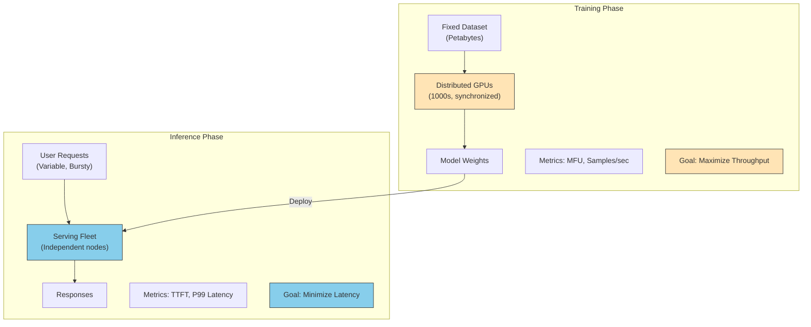
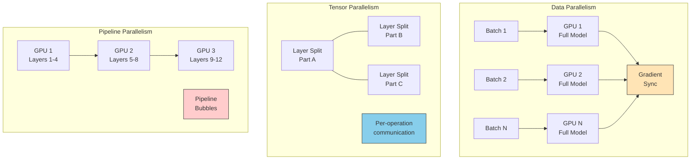
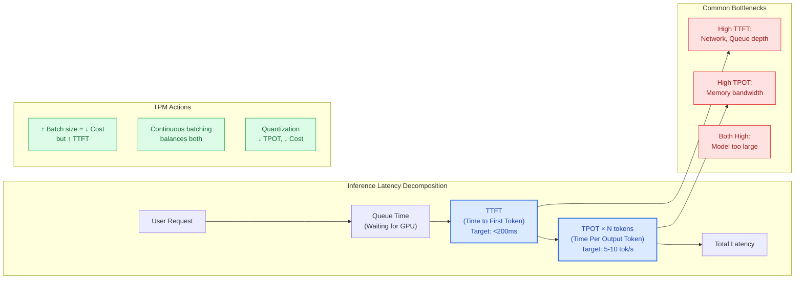
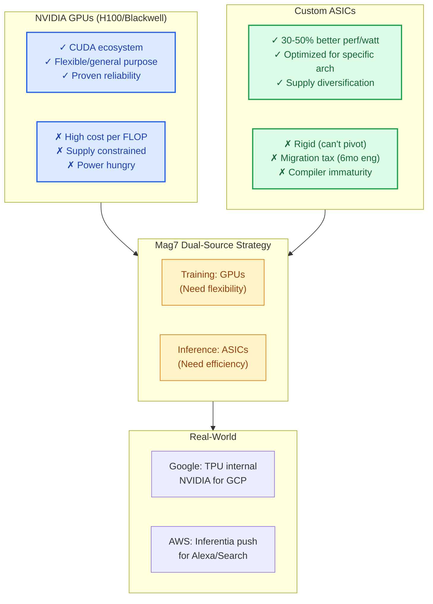
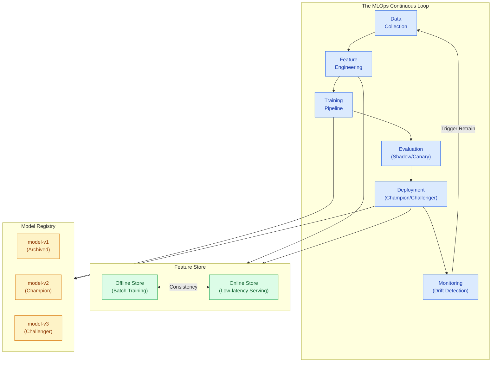

# Training vs. Inference

This guide covers 6 key areas: I. Executive Summary: The Lifecycle Distinction, II. The Training Phase: Creating the Intelligence, III. The Inference Phase: Delivering the Value, IV. Infrastructure Strategy: Hardware and Architecture, V. The MLOps Loop: Bridging the Gap, VI. Summary of Metrics for Principal TPMs.

## I. Executive Summary: The Lifecycle Distinction

For a Principal TPM, the distinction between Training and Inference determines the entire strategy for capacity planning, budget allocation (CapEx vs. OpEx), and success metrics. While they involve the same underlying neural network architectures, they are diametrically opposed in terms of system design goals.

### 1. The Fundamental Divergence: Throughput vs. Latency

The primary engineering constraint differs by phase.

*   **Training (Throughput Optimization):** The goal is to process a fixed, massive dataset as fast as possible to converge on model weights.
    *   **Metric:** Samples per second, Cluster Utilization (MFU - Model FLOPs Utilization).
    *   **System Design:** Requires synchronous execution across thousands of GPUs. The network interconnect (e.g., NVLink, InfiniBand) is often the bottleneck, not the GPU compute itself. If one node fails, the training job often halts or restarts from a checkpoint.
*   **Inference (Latency & Availability Optimization):** The goal is to respond to a variable, unpredictable stream of user requests within a specific Service Level Agreement (SLA).
    *   **Metric:** Time to First Token (TTFT), Tokens Per Second (TPS), P99 Latency.
    *   **System Design:** Requires asynchronous, highly available setups. Nodes operate independently or in small groups (tensor parallelism). If one node fails, traffic is rerouted via load balancers; the service must survive.

**Mag7 Real-World Example:**
At **Google**, Training happens on **TPU v4/v5p Pods** configured in massive, tightly coupled topologies (e.g., 4096 chips) optimized for bisection bandwidth. However, Inference for Gemini often runs on **TPU v5e** (efficient) or NVIDIA L4s, which are optimized for cost-performance and memory bandwidth rather than raw compute power. A TPM deploying Gemini to Workspace (Docs/Gmail) focuses on the v5e supply chain to ensure query costs don't exceed the subscription price, whereas the Research TPM focuses on v5p availability to finish the model build.

### 2. Economic Implications: CapEx vs. COGS

The financial profile of these phases dictates different approval processes and ROI calculations.

*   **Training = R&D CapEx:** This is a "sunk cost" investment. It is high-risk. You spend $10M-$100M+ to create an asset. Once the model is trained, that cost is static regardless of how many users use it.
    *   **Tradeoff:** You trade time for accuracy. Training longer (more compute cost) yields a better model, but delays time-to-market.
*   **Inference = COGS (Cost of Goods Sold):** This is a variable cost that scales linearly (or super-linearly) with user growth. It directly impacts gross margin.
    *   **Tradeoff:** You trade quality for margin. Using a smaller model (e.g., Llama 8B vs. 70B) or higher quantization (Int8 vs. FP16) reduces cost per query but may degrade response quality.

**Mag7 Real-World Example:**
**Microsoft/OpenAI** faced a critical juncture when releasing GPT-4. The *Training* cost was a massive, one-time capital expenditure on Azure supercomputers. However, the *Inference* cost (running ChatGPT) threatened to make the free tier unsustainable. The TPM strategy shifted from "maximize model size" (Research phase) to "distillation and quantization" (Product phase) to lower the compute footprint per user request, effectively managing the unit economics.

### 3. Hardware and Infrastructure Requirements

A Principal TPM must prevent the "hardware mismatch" anti-pattern, where expensive training hardware is wasted on inference tasks, or inference hardware fails to converge training jobs.

| Feature | Training Requirements | Inference Requirements |
| :--- | :--- | :--- |
| **Precision** | High (BF16, FP32) for gradient convergence. | Low (Int8, FP8) via Quantization. |
| **Memory** | Massive VRAM to hold weights + optimizer states + gradients. | High Bandwidth (HBM) to load weights fast; KV Cache management. |
| **Network** | East-West traffic dominant (GPU-to-GPU). | North-South traffic dominant (User-to-Server). |
| **Utilization** | Target 90%+ sustained usage (batch processing). | Bursty; utilization fluctuates with diurnal traffic patterns. |

**Business Impact & Capabilities:**
*   **Skill Impact:** Operations teams need different playbooks. Training Ops focuses on "checkpoint recovery" and "straggler mitigation." Inference Ops focuses on "autoscaling policies" and "multi-region failover."
*   **ROI Impact:** Using H100s for simple inference is like using a Ferrari to deliver pizza—it works, but it destroys your profit margin. A TPM must drive the migration of models from training clusters to inference-optimized fleets (e.g., AWS Inferentia or NVIDIA A10s).

### 4. The Data Lifecycle Loop

The lifecycle is circular, not linear. Inference is the source of data for the next Training cycle.

1.  **Training:** Offline processing of curated data.
2.  **Inference:** Live processing of real-world inputs.
3.  **Data Flywheel:** Logs from inference (user prompts + accept/reject rates) are anonymized and fed back into the training pipeline for **RLHF (Reinforcement Learning from Human Feedback)** or fine-tuning.

**Mag7 Real-World Example:**
**Tesla's Autopilot** team exemplifies this loop. The cars (Inference edge nodes) run models to drive but also run "shadow mode" models. If the shadow model predicts a turn but the human driver goes straight, that specific data clip is uploaded. The TPM oversees the pipeline that ingests these clips to re-train the model (Training core), which is then OTA updated back to the fleet. The value lies in the tightness of this loop.

## II. The Training Phase: Creating the Intelligence

### 1. The Infrastructure of Scale: Distributed Training Strategies

At the Mag7 scale, training is rarely done on a single machine. Foundation models (like GPT-4, Gemini, or Llama 3) exceed the memory capacity of a single GPU. Consequently, the primary technical challenge a TPM manages is **Parallelism**. This is the architecture of how the model and data are split across thousands of accelerators.

There are three primary strategies, often combined into "3D Parallelism":

*   **Data Parallelism (DP):** The model is replicated on every GPU; the dataset is split. Each GPU processes a different batch of data, calculates gradients, and synchronizes with others.
    *   *Mag7 Example:* Standard for ResNet or smaller BERT implementations at Amazon Search.
    *   *Tradeoff:* High communication overhead for gradient synchronization. As model size grows, the model no longer fits on one GPU, making DP impossible alone.
*   **Tensor Parallelism (TP):** A single layer of the model is split across multiple GPUs. If a matrix multiplication is too big, it is divided into chunks.
    *   *Mag7 Example:* NVIDIA Megatron-LM implementations.
    *   *Tradeoff:* Requires ultra-high bandwidth (NVLink) because communication happens *per operation*. High complexity to implement.
*   **Pipeline Parallelism (PP):** Different layers of the model are placed on different GPUs (e.g., Layers 1-4 on GPU A, 5-8 on GPU B).
    *   *Mag7 Example:* Google's GPipe.
    *   *Tradeoff:* Suffers from "pipeline bubbles" where GPUs sit idle waiting for data to flow through the sequence.

**Business & ROI Impact:**
The choice of parallelism strategy dictates **Model Flops Utilization (MFU)**.
*   **Poor Strategy:** MFU < 30%. You are paying for 100% of the H100s but only extracting 30% of the value due to communication bottlenecks.
*   **Optimized Strategy:** MFU > 50-60%. This effectively doubles the training speed without buying more hardware, directly impacting Time-to-Market.

### 2. The Data Supply Chain: Feeding the Beast

A common failure mode in Mag7 training programs is **GPU Starvation**. This occurs when the GPUs compute faster than the CPU/Storage can feed them data.

*   **The Bottleneck:** Training requires fetching terabytes of tokenized text or images, preprocessing them (shuffling, masking), and moving them to GPU memory.
*   **Mag7 Behavior:**
    *   **Google:** Uses tf.data with interleave to prefetch data from Colossus (storage) directly to TPU memory, bypassing standard CPU bottlenecks.
    *   **Meta:** Developed specialized data loaders (like AI-Store) to handle the random access patterns required for training on massive datasets without crushing the network backbone.
*   **Tradeoff: Online vs. Offline Preprocessing:**
    *   *Offline:* Pre-tokenize and save to disk. **Pro:** CPU efficient during training. **Con:** Static dataset; hard to experiment with dynamic masking or curriculum learning. Storage heavy.
    *   *Online:* Tokenize on the fly. **Pro:** Flexible. **Con:** CPU bottlenecks can stall expensive GPUs.

**TPM Action Item:** Monitor the "Data Loading Time" vs. "Compute Time" ratio. If GPUs are waiting for data, you need to upgrade network storage throughput (e.g., move to Amazon FSx for Lustre) or optimize the data loader pipeline.

### 3. Fault Tolerance & Checkpointing

When training on 16,000+ GPUs, hardware failure is not a probability; it is a certainty. The Mean Time Between Failures (MTBF) of a cluster that size is measured in hours, not days.

*   **The Mechanism:** Training runs must periodically save the model state (Checkpointing) to persistent storage. If a node fails, the system reboots and resumes from the last checkpoint.
*   **Mag7 Behavior:**
    *   **Microsoft/OpenAI:** Implements automated "heartbeat" monitoring. If a GPU hangs, the orchestrator (Kubernetes/Slurm) automatically drains the node, spins up a hot spare, and resumes training from the last checkpoint within minutes.
*   **Tradeoff: Checkpoint Frequency:**
    *   *Too Frequent:* You lose training time to I/O overhead (writing TBs to disk takes time).
    *   *Too Infrequent:* A crash causes the loss of hours of expensive compute progress.
*   **Business Impact:**
    *   A poor fault tolerance strategy can increase total training costs by 15-20% due to "wasted" compute on crashed runs.
    *   **CX Impact:** Delays in model convergence directly slip product launch dates.

### 4. Precision and Numerical Stability

Training does not always require high precision for every calculation.

*   **Mixed Precision (FP16/BF16):** Modern training uses "Bfloat16" (Brain Floating Point), a format championed by Google and adopted by NVIDIA. It keeps the dynamic range of 32-bit numbers but cuts the precision to 16-bit.
*   **Mag7 Behavior:** Almost all SOTA training (Llama, GPT, PaLM) uses Mixed Precision. It reduces memory footprint by half, allowing for double the batch size.
*   **Tradeoff:**
    *   *Lower Precision:* Faster, less memory. **Risk:** "Loss Spikes" or "NaNs" (Not a Number) where the model diverges and training fails because the numbers got too small (underflow) or too big (overflow).
    *   *Higher Precision:* Stable but slow and memory-expensive.

**TPM Action Item:** Ensure the hardware procurement aligns with the precision strategy. For example, buying older GPUs that do not support BF16 natively will severely handicap training throughput compared to competitors using H100s or TPUv5s.

### 5. The "Chinchilla" Ratio: Resource Allocation

A Principal TPM must influence *what* is trained, not just *how*. The "Chinchilla Scaling Laws" (from DeepMind) dictate the optimal relationship between Model Size and Training Data.

*   **The Rule:** For every parameter in the model, you typically need ~20 tokens of training data.
*   **Mag7 Real-World Example:**
    *   **Mistake:** Training a massive model (1T params) on a small dataset. The model is "undertrained" and inefficient at inference.
    *   **Optimization:** Meta's Llama 3 is "over-trained" (trained on far more tokens than Chinchilla suggests).
*   **Tradeoff:**
    *   *Compute Optimal:* Stops training when the loss curve flattens relative to compute spend.
    *   *Inference Optimal:* Spending *extra* CapEx on training (over-training) to produce a smaller, denser model that is cheaper to run in OpEx (Inference).
*   **Business Impact:** For a widely deployed model (like Siri or Alexa), over-training is ROI positive. The massive one-time training cost is offset by saving millions in daily inference costs.

## III. The Inference Phase: Delivering the Value

Inference is the production runtime where the model interacts with the real world. For a Principal TPM, the shift from Training to Inference is a shift from **throughput optimization** (training) to **latency and cost optimization** (inference).

While training happens once (or periodically), inference happens billions of times. Consequently, a 10% inefficiency in training is a one-time project cost overrun; a 10% inefficiency in inference is a permanent drag on gross margins and a direct hit to User Experience (UX).

### 1. Architectural Patterns: Where Compute Meets Data

The first decision a TPM must influence is the deployment topology. This dictates the cost structure and privacy compliance of the product.

*   **Server-Side (Cloud) Inference:** The model runs on massive GPU clusters (e.g., H100s, A100s) in data centers.
    *   **Mag7 Example:** **ChatGPT (OpenAI/Microsoft)** or **Google Gemini**. The models are too large (100B+ parameters) to fit on consumer hardware.
    *   **Tradeoff:** Offers maximum capability and context window but incurs high cloud costs and network latency. Requires strict SLA management for "Time to First Token" (TTFT).
*   **On-Device (Edge) Inference:** The model runs on the user's local hardware (NPU on iPhone, Tensor cores on RTX cards).
    *   **Mag7 Example:** **Apple Intelligence** running local summarization on the A17 Pro chip, or **Pixel's Magic Eraser**.
    *   **Tradeoff:** Zero marginal cloud cost and high privacy, but severely limited model size (usually <7B parameters) and battery drain concerns.
*   **Hybrid/Speculative Inference:** A small model on the device handles easy queries; complex queries are routed to the cloud.
    *   **Mag7 Example:** **Google Assistant**. Local voice recognition handles "Set a timer," while "Explain quantum physics" goes to the cloud.

**Business Impact:** Choosing Cloud over Edge for a high-volume, low-complexity feature (e.g., predictive text) can destroy unit economics. Conversely, forcing Edge for complex reasoning leads to hallucinations and poor CX.

### 2. Optimization Techniques: Squeezing the Model

A raw model output from training (typically FP32 or BF16 precision) is rarely deployed directly to production without optimization. A Principal TPM must drive the "Model Compression" strategy to ensure ROI.

#### Quantization (Precision Reduction)
This involves reducing the precision of the model weights from 16-bit floating point to 8-bit integers (INT8) or even 4-bit.
*   **Technical Detail:** This reduces memory bandwidth requirements, which is usually the bottleneck in inference (not compute).
*   **Mag7 Example:** **Meta** deploying Llama 3. By quantizing to INT8, they can fit a 70B model on fewer GPUs, doubling the concurrent users per node.
*   **Tradeoff:** slight degradation in model accuracy/perplexity vs. massive (2x-4x) reduction in memory footprint and latency.
*   **TPM Action:** Mandate accuracy benchmarks (e.g., MMLU score) before and after quantization to ensure product requirements are met.

#### Distillation
Training a smaller "student" model to mimic the behavior of a massive "teacher" model.
*   **Mag7 Example:** **Amazon** using a distilled version of a massive LLM for Alexa's conversational capabilities to keep latency under 500ms.
*   **Tradeoff:** The student model lacks the broad "world knowledge" of the teacher but excels at specific domain tasks at 10% of the cost.

#### KV Caching & Paged Attention
In LLMs, the model must "remember" the previous tokens in a conversation.
*   **Technical Detail:** Instead of recomputing the attention map for the whole history every time a new word is generated, we cache the Key-Value (KV) pairs.
*   **Mag7 Example:** **Microsoft Azure OpenAI Service** utilizes PagedAttention (similar to OS memory paging) to manage KV caches, allowing them to batch thousands of user requests simultaneously without running out of GPU memory (OOM).

### 3. Key Performance Indicators (KPIs) for Inference

"Latency" is too vague for a Principal TPM. You must decompose performance into granular metrics to debug CX issues.

1.  **Time to First Token (TTFT):** How long until the user sees the *start* of the answer?
    *   *CX Impact:* If this > 1s, users perceive the system as "thinking" or "laggy."
    *   *Bottleneck:* Network latency and request queueing.
2.  **Time Per Output Token (TPOT):** How fast does the text stream once it starts?
    *   *CX Impact:* If this is slower than human reading speed (~5-10 tokens/sec), the user feels impatient.
    *   *Bottleneck:* Memory bandwidth.
3.  **Throughput (Tokens/Sec):** Total system capacity.
    *   *Business Impact:* Defines infrastructure ROI. Higher throughput = fewer GPUs required for the same user base.

**Tradeoff Analysis:**
Optimizing for Throughput (batching many users together) usually hurts TTFT.
*   *Scenario:* If you wait to batch 64 user requests to maximize GPU usage, the first user waits longer.
*   *Mag7 Approach:* **Continuous Batching**. Systems like vLLM allow requests to join and leave a batch dynamically, balancing TTFT and Throughput.

### 4. Hardware Selection: The Cost Driver

The hardware used for inference differs from training. While Training demands high-bandwidth interconnects (NVLink) to sync thousands of GPUs, Inference is often "embarrassingly parallel" across users.

*   **Nvidia H100/A100:** The gold standard. High cost, high availability risk. Used for the most complex models.
*   **Custom Silicon (ASICs):**
    *   **AWS Inferentia:** Designed specifically for low-cost inference.
    *   **Google TPU v5e:** Optimized for serving Transformer models efficiently.
*   **CPU Inference:** Viable for very small models or non-real-time batch processing (e.g., nightly sentiment analysis of customer reviews).

**ROI Calculation:** A TPM must calculate the **"Cost per 1k Tokens."** If AWS Inferentia offers 20% slower latency but 50% lower cost than H100s, and the latency is still within SLA, the switch is a business imperative.

### 5. Managing Risk: Guardrails and Fallbacks

Inference is nondeterministic. A Principal TPM must architect safety layers *outside* the model.

*   **Input/Output Guardrails:** A lightweight classifier that scans user prompts (Input) and model answers (Output) for PII, toxicity, or jailbreak attempts.
    *   **Mag7 Example:** **Azure AI Content Safety** sits in front of OpenAI models. It adds ~50ms latency but prevents brand-damaging outputs.
*   **Hallucination Mitigation (RAG):** Retrieval-Augmented Generation. Instead of relying on the model's training data, you inject verified data (e.g., internal docs) into the context window.
    *   **CX Impact:** Increases accuracy but increases input token count (cost) and latency.

### 6. Edge Cases & Failure Modes

*   **The "Cold Start" Problem:** If you use serverless inference (scaling to zero), the first user faces a massive delay (10s+) while the model loads into GPU memory.
    *   *Mitigation:* Provisioned Concurrency (keep warm instances) during business hours.
*   **The "Death Spiral":** If inference latency increases, users tend to refresh or retry, adding more load to an already struggling system.
    *   *Mitigation:* Aggressive load shedding and request prioritization queues.

## IV. Infrastructure Strategy: Hardware and Architecture

At the Principal TPM level, infrastructure strategy is not about selecting server specs; it is about managing the **Cost of Goods Sold (COGS)**, securing **supply chain resilience**, and defining the **velocity of innovation**. You operate at the intersection of hardware procurement, data center facility planning, and software kernel optimization.

In the AI era, the hardware strategy has shifted from "commoditized x86 CPU farms" to "highly specialized, supply-constrained GPU/ASIC superclusters."

### 1. The Compute Layer: General Purpose (GPUs) vs. Custom Silicon (ASICs)

The primary strategic decision for Mag7 infrastructure is the balance between flexible, market-standard hardware (NVIDIA) and proprietary, optimized silicon (ASICs).

*   **NVIDIA GPUs (H100/Blackwell):** The industry standard. They run everything out of the box thanks to the CUDA ecosystem.
*   **Custom ASICs:** Chips designed for specific workloads. Examples include **Google TPUs** (Tensor Processing Units), **AWS Trainium/Inferentia**, **Meta MTIA**, and **Microsoft Maia**.

**Mag7 Real-World Behavior:**
Mag7 companies aggressively pursue a dual-sourcing strategy to reduce reliance on NVIDIA's margins and supply constraints.
*   **Google:** Uses TPUs for internal workloads (Search, Waymo, Gemini training) to achieve massive cost efficiencies, while offering NVIDIA GPUs in GCP to capture external customers who rely on CUDA.
*   **AWS:** Pushes internal teams (e.g., Alexa, Amazon Search) to migrate to Inferentia/Trainium to lower internal OpEx and validate the hardware for external customers.

**Tradeoffs:**
*   **Flexibility vs. Efficiency:** GPUs are versatile but power-hungry. ASICs offer 30-50% better performance-per-watt but are rigid. If the model architecture changes drastically (e.g., moving from Transformers to State Space Models), an ASIC optimized for matrix multiplication might become obsolete, whereas a GPU can be reprogrammed.
*   **Engineering Velocity (The "Tax"):** Using custom silicon imposes a "migration tax." Engineers must adapt code from standard PyTorch/CUDA to specialized compilers (e.g., XLA for TPUs, Neuron for AWS). A Principal TPM must weigh the 6-month engineering cost of migration against the long-term 40% compute cost reduction.

**Business Impact:**
*   **ROI:** Migrating stable, high-volume inference workloads to ASICs usually yields the highest ROI. Keeping experimental training on GPUs preserves agility.

### 2. Interconnects and Networking: The Hidden Bottleneck

In distributed training, the network *is* the computer. When training a model across 16,000 GPUs, the speed is determined by how fast the slowest GPU can sync its gradients with the others.

*   **InfiniBand (IB):** NVIDIA’s proprietary networking standard. Extremely low latency, lossless, but expensive and locks you into the NVIDIA ecosystem.
*   **RoCEv2 (RDMA over Converged Ethernet):** The hyperscaler alternative. Uses standard Ethernet switches (Broadcom/Cisco) to achieve near-IB performance at a lower cost and better supply availability.

**Mag7 Real-World Behavior:**
*   **Meta:** Famously built their 24k GPU Llama 3 cluster using an **Ethernet-based (RoCE)** fabric rather than InfiniBand. This allowed them to use standard networking gear, reducing dependency on NVIDIA networking components and lowering costs.
*   **Microsoft Azure:** Often leans heavily on InfiniBand for their high-performance compute instances to guarantee maximum throughput for OpenAI’s training runs.

**Tradeoffs:**
*   **Performance vs. Supply Chain:** InfiniBand offers slightly better tail-latency performance for massive clusters. However, Ethernet components have a broader supply chain.
*   **Operational Complexity:** Network engineers at Mag7 are deeply versed in Ethernet. InfiniBand requires specialized skills and different monitoring tools.

**Business Impact:**
*   **Time-to-Market:** If NVIDIA networking gear has a 52-week lead time but Ethernet switches have 12 weeks, the TPM must advocate for the Ethernet architecture to ensure the cluster goes live on time, even if it entails a 5% theoretical performance penalty.

### 3. Power Density and Cooling Strategy

We have hit the limits of air cooling. A rack of H100s consumes vastly more power (up to 40-100kW per rack) than traditional CPU racks (10-15kW). This forces a fundamental redesign of the data center.

**Technical Context:**
*   **Air Cooling:** Fans blow air over heat sinks. Cheap, but fails at high density.
*   **Liquid Cooling (Direct-to-Chip):** Coolant pipes run directly to the processor. Required for next-gen chips (NVIDIA Blackwell).
*   **Immersion Cooling:** Submerging the entire server in non-conductive fluid.

**Mag7 Real-World Behavior:**
*   **Microsoft:** Experimenting with two-phase immersion cooling to reduce water usage and improve PUE (Power Usage Effectiveness).
*   **Legacy Retrofits:** A major TPM challenge is that you cannot simply put an AI rack into an old data center. The facility lacks the power feeds and cooling capacity.

**Tradeoffs:**
*   **CapEx vs. OpEx:** Liquid cooling requires massive upfront infrastructure investment (plumbing, specialized racks) but significantly lowers energy bills (OpEx) because fans consume a large percentage of data center power.
*   **Density vs. Spread:** If you stick to air cooling, you must "strand" capacity—leaving slots in a rack empty to prevent overheating. This wastes valuable data center floor space.

**Business Impact:**
*   **Sustainability Goals:** Inefficient cooling hurts the company's "Net Zero" commitments.
*   **Deployment Velocity:** Liquid cooling is complex to install. A TPM must account for extended "commissioning" times in the project roadmap.

### 4. Utilization Strategy: Handling "Stranded" Capacity

Hardware is the most expensive asset on the balance sheet. A GPU sitting idle is burning cash ($2/hour/GPU depreciation).

**Technical Context:**
*   **Bin Packing:** Fitting jobs of different sizes onto machines to minimize gaps.
*   **Preemption:** Killing low-priority jobs (e.g., batch analytics, experimental training) to make room for high-priority jobs (e.g., production inference, critical training).

**Mag7 Real-World Behavior:**
*   **Google (Borg):** Google mixes production latency-sensitive jobs with batch jobs on the same clusters. If a production job needs resources, the batch job is throttled or killed instantly.
*   **Capacity Buffers:** Mag7 companies maintain a "buffer" of compute. The TPM's job is to size this buffer. Too small = outages during traffic spikes. Too large = millions of dollars in wasted CapEx.

**Tradeoffs:**
*   **Reliability vs. Utilization:** Running clusters at 90%+ utilization creates "noisy neighbor" problems where jobs contend for memory bandwidth, causing latency spikes. Running at 50% utilization is stable but financially irresponsible.

**Business Impact:**
*   **COGS:** Improving cluster utilization from 40% to 60% can save hundreds of millions of dollars annually, effectively negating the need to build a new data center.

## V. The MLOps Loop: Bridging the Gap

MLOps (Machine Learning Operations) is the connective tissue that transforms a static model artifact into a living, sustainable product. For a Principal TPM, the "Gap" refers to the "Valley of Death" between a Data Scientist’s Jupyter Notebook and a scalable, production-grade microservice.

While DevOps focuses on code reliability, MLOps focuses on **Data + Code + Model reliability**. In a Mag7 environment, where a 0.1% degradation in model accuracy can cost millions in ad revenue or trigger regulatory audits, the MLOps loop is a critical risk management and efficiency engine.

### 1. The Core Challenge: Training-Serving Skew

The most common failure mode in production ML is **Training-Serving Skew**—when the data or logic used during inference differs from what was used during training. This leads to silent failures where the system runs without errors but produces garbage predictions.

**Mag7 Solution: The Feature Store**
To bridge this gap, companies like Uber (Michelangelo), Google (Vertex AI Feature Store), and Airbnb (Zipline) utilize Feature Stores. A Feature Store creates a single source of truth for features.
*   **Offline Store:** Used for batch training (high throughput, historical data).
*   **Online Store:** Used for low-latency inference (Redis/Cassandra, real-time data).

**Tradeoff Analysis:**
*   **Implementation Cost vs. Consistency:** Building a Feature Store is a massive infrastructure investment (6-18 months for a platform team). However, without it, you face the "glue code" anti-pattern where logic is duplicated between training pipelines (Python) and serving layers (C++/Go/Java).
*   **ROI Impact:** Reduces "Time to Market" for new models by allowing DS to reuse existing, vetted features rather than re-engineering pipelines from scratch.

### 2. Continuous Training (CT) and Trigger Mechanisms

In traditional software, you redeploy when code changes. In ML, you must also redeploy when **data changes**. This is the "Loop."

**Mag7 Behavior:**
At Meta or Google, models for News Feed or Search are not static. They undergo **Continuous Training**.
*   **Schedule-Based:** Retraining every night (e.g., standard fraud detection models).
*   **Metric-Based:** Retraining triggered automatically when model performance (e.g., F1 score, AUC) drops below a threshold.
*   **Event-Based:** Retraining triggered by data volume or specific shifts (e.g., trending topics on Twitter/X).

**Technical Depth: The Pipeline Orchestrator**
You cannot rely on manual scripts. You need orchestration tools like **Kubeflow Pipelines**, **TFX (TensorFlow Extended)**, or **AWS SageMaker Pipelines**.
*   **The TPM Role:** You define the *SLAs* for the pipeline. If the retraining pipeline fails, how stale can the model get before it impacts business metrics?
*   **Edge Case:** "Feedback Loops." If your model recommends clickbait, and users click it, the model learns to recommend *more* clickbait. The MLOps loop must include "exploration" traffic (randomized results) to gather unbiased ground truth data, preventing the model from over-optimizing on its own bias.

### 3. Model Registry and Governance

A Principal TPM must enforce strict governance. You cannot deploy a `model_v2_final_final.pkl` file.

**The Model Registry:**
This is the "Git" for models. It tracks:
*   **Lineage:** Which dataset (commit hash) and code version produced this model?
*   **Metadata:** Hyperparameters, test metrics, and training time.
*   **Status:** Staging, Production, Archived.

**Mag7 Real-World Example:**
In regulated environments (e.g., Amazon Financial Services or Azure Health), the Registry is the primary audit trail. If a loan approval model shows bias, the TPM uses the Registry to trace back to the exact training data slice that caused the issue.

**Impact on CX:**
Proper versioning allows for instant **rollbacks**. If a new deployment tanks user engagement, the serving infrastructure can revert to the previous "Champion" model in seconds, provided the Registry is correctly integrated into the CI/CD pipeline.

### 4. Deployment Strategies: Shadow vs. Canary

Deploying ML is riskier than deploying standard code because failures are often probabilistic, not deterministic.

**Strategy A: Shadow Mode (Dark Launch)**
The new model receives production traffic and makes predictions, but these predictions are *logged*, not returned to the user. The system compares the Shadow Model's output against the current Production Model.
*   **Pros:** Zero user risk. Perfect for validating latency and accuracy.
*   **Cons:** Doubles the inference compute cost (running two models for every request).
*   **Mag7 Context:** Almost mandatory for core ranking algorithms (Search, Ads) where a bad deploy impacts revenue immediately.

**Strategy B: Canary/A/B Testing**
The new model takes 1% to 5% of live traffic.
*   **Pros:** Real feedback on user behavior (CTR, Conversion).
*   **Cons:** Real users are exposed to potential bad predictions.
*   **Tradeoff:** You trade "safety" for "ground truth." Shadow mode tells you if the model crashes; Canary tells you if the model makes money.

### 5. Monitoring: Data Drift and Concept Drift

Standard observability (latency, error rate, CPU) is insufficient. You need **ML Observability**.

*   **Data Drift (Covariate Shift):** The input data changes.
    *   *Example:* A CV model trained on daylight images suddenly receiving night-time images.
*   **Concept Drift:** The relationship between input and output changes.
    *   *Example:* A spam filter model. "Free Rolex" was spam yesterday; today, scammers use "Free Crypto." The input words are different, but the intent (spam) remains, yet the model fails to catch the new pattern.

**Actionable Guidance for TPMs:**
Define **alerting thresholds** on statistical distance metrics (like KL Divergence or PSI - Population Stability Index). If the input distribution deviates by >10% from the training distribution, fire an alert to the Data Science team to investigate or trigger an auto-retrain.

---

## VI. Summary of Metrics for Principal TPMs

For a Principal TPM, metrics are the primary mechanism for alignment, risk management, and decision-making. You are not responsible for tuning hyperparameters to improve a loss curve, but you are responsible for defining the "Success Criteria" that gates a model's release to production. You must bridge the gap between **Offline Metrics** (what data scientists optimize) and **Online Metrics** (what the business cares about).

### 1. The Metric Hierarchy: Offline vs. Online

The most common failure mode in AI programs is the "Offline-Online Gap"—where a model shows improved accuracy in the lab but drives down user engagement in production.

*   **Offline Metrics (Model Performance):** Calculated on historical/test datasets during training.
    *   *Examples:* Cross-Entropy Loss, Perplexity, F1-Score, AUC-ROC.
    *   *Goal:* Verify the model learned the pattern.
*   **Online Metrics (Business/System Performance):** Calculated on live traffic.
    *   *Examples:* Click-Through Rate (CTR), Conversion Rate, Latency (P99), Cost-per-Query.
    *   *Goal:* Verify the model generates value.

**Mag7 Real-World Example:**
At **Netflix**, a recommendation algorithm might improve "Prediction Accuracy" (Offline) by suggesting highly rated, niche documentaries. However, when deployed, "Streaming Hours" (Online) might drop because users actually prefer "good enough" Adam Sandler movies over "perfect" documentaries.
*   **Principal TPM Action:** You must enforce a "Backtesting" or "Shadow Mode" phase where offline improvements are correlated with online proxies before a full rollout.

### 2. Generative AI Specific Metrics

In the era of LLMs (Large Language Models), traditional metrics like Accuracy are often insufficient. You must track generation-specific performance indicators.

#### A. Token Latency Metrics
In GenAI, "Latency" is too vague. You must decompose it:
*   **Time to First Token (TTFT):** The time from the user hitting "enter" to seeing the first word appear.
    *   *Impact:* This is the primary driver of perceived responsiveness. High TTFT feels like the system is broken.
    *   *Target:* <200ms is ideal; >1s causes user churn.
*   **Time Per Output Token (TPOT):** The speed of generation after the first token (reading speed).
    *   *Impact:* If this is slower than human reading speed (~5-10 tokens/second), the user feels frustrated.

**Tradeoff:**
Optimizing for **Throughput** (batching many requests together) usually degrades **TTFT**.
*   *Decision:* For a chatbot (ChatGPT), prioritize TTFT (User Experience). For an offline summarization job (email digest), prioritize Throughput (Cost Efficiency).

#### B. Quality Metrics (Evaluation)
How do you measure if a summary is "good"?
*   **Perplexity:** A measure of how "surprised" the model is by the text. Lower is generally better for fluency, but does not guarantee factual accuracy.
*   **Hallucination Rate:** The percentage of generated facts that are objectively false.
*   **Human Evaluation (RLHF):** The gold standard. Human raters rank Output A vs. Output B.
    *   *Mag7 Implementation:* **Google** uses "Gold/Silver/Bronze" datasets where human experts provide the ground truth to benchmark model performance.
*   **LLM-as-a-Judge:** Using a stronger model (e.g., GPT-4) to grade the output of a smaller, cheaper model (e.g., Llama-3-8B).

### 3. System Health & Operational Metrics

These metrics determine if the infrastructure is viable.

*   **GPU Utilization (Duty Cycle):** The % of time the GPU is doing math vs. waiting for memory (HBM) or network.
    *   *Mag7 Context:* If your H100s are running at 30% utilization during training, you are burning millions of dollars in idle capital. A Principal TPM drives initiatives to optimize data loading pipelines to push this >50%.
*   **Cache Hit Rate (KV Cache):** In inference, reusing previously computed attention keys/values.
    *   *Impact:* Higher hit rates drastically lower latency and cost.
*   **Queue Depth:** The number of requests waiting for a compute slot.
    *   *Impact:* Spike in queue depth indicates you need autoscaling logic to kick in immediately.

### 4. Business & ROI Metrics

A Principal TPM must translate engineering metrics into P&L (Profit and Loss) implications.

*   **Cost per 1k Tokens:** The fundamental unit of production cost.
    *   *Calculation:* (Hardware Cost / Tokens per Second) + Energy + Networking.
    *   *Mag7 Example:* **Microsoft** tracks this ruthlessly for Copilot. If the cost to generate a code snippet exceeds the subscription revenue allocated to that interaction, the product has negative unit economics.
*   **Query Volume vs. Cannibalization:**
    *   *Context:* For Search ads (Google/Amazon), if an LLM answers the user's question directly (Zero-Click), the user doesn't click an ad.
    *   *Metric:* Revenue-per-Search (RPS). You must track if AI integration increases engagement enough to offset the drop in ad clicks.

### 5. Tradeoff Analysis Framework

When reviewing metrics, you will face the "Iron Triangle" of AI: **Quality vs. Latency vs. Cost.** You can usually only pick two.

| Choice | Tradeoff | Example Scenario |
| :--- | :--- | :--- |
| **High Quality + Low Latency** | **High Cost** | **Financial Trading / Premium Tier Chatbots.** You use the largest models (e.g., GPT-4) on dedicated, un-batched hardware. |
| **High Quality + Low Cost** | **High Latency** | **Offline Batch Processing.** Generating nightly reports or creative writing where immediate response isn't required. High batch sizes. |
| **Low Latency + Low Cost** | **Lower Quality** | **Real-time Classification / Autocomplete.** Using smaller, quantized models (e.g., 7B parameters, INT8) on edge devices or CPUs. |

### 6. Principal TPM Action Plan: The "Go/No-Go" Dashboard

Do not rely on ad-hoc reports. Establish a standardized evaluation harness.

1.  **Define the Golden Set:** A static dataset of inputs (prompts) with known "perfect" outputs. This prevents regression.
2.  **Establish Guardrails:**
    *   *Latency:* P99 must be < X ms.
    *   *Quality:* Pass rate on Golden Set > Y%.
    *   *Safety:* Toxicity score < Z%.
3.  **Monitor Drift:**
    *   **Data Drift:** The input distribution changes (e.g., users start asking about a new breaking news event the model doesn't know).
    *   **Concept Drift:** The relationship between input and output changes (e.g., "cool" means temperature today, but popularity tomorrow).

---

---

## Interview Questions

### I. Executive Summary: The Lifecycle Distinction

**Question 1: The "Success Catastrophe"**
"Imagine we just launched a new GenAI feature in our productivity suite. Adoption is 10x higher than forecasted. Our inference costs are skyrocketing and eating into the product's entire profit margin, and we are hitting capacity limits on our current GPU SKUs. As the Principal TPM, what is your immediate mitigation plan and your long-term strategy?"

*   **Guidance for a Strong Answer:**
    *   **Immediate (Triage):** Aggressive quantization (move from FP16 to Int8) to increase throughput on existing hardware. Implement strict rate limiting or queuing to preserve availability (prevent brownouts). Spillover traffic to less optimal but available regions/hardware if necessary.
    *   **Mid-Term (Optimization):** Switch to "Teacher-Student" architectures (Distillation) where a smaller, cheaper model handles simple queries and only complex queries are routed to the expensive model.
    *   **Long-Term (Strategic):** Renegotiate cloud capacity reservations (Reserved Instances) for better pricing. Invest in custom silicon or inference-optimized SKUs (e.g., migrating from A100s to L40s or Inferentia). Redefine the pricing model or tiering structure if unit economics remain negative.

**Question 2: Resource Contention**
"You are managing a shared cluster of 5,000 H100 GPUs. The Research team needs 4,000 GPUs for 3 months to train the next-gen foundation model (GPT-Next). The Product team currently uses 2,000 GPUs for live inference of the current model and traffic is growing. You are 1,000 GPUs short. How do you resolve this conflict?"

*   **Guidance for a Strong Answer:**
    *   **Quantify Business Value:** Do not just split the difference. Compare the Cost of Delay (CoD) for the new model training vs. the SLA impact on current customers. Usually, breaking live production SLAs is non-negotiable.
    *   **Technical Solvency:** Can the training job be fragmented? (Likely no, large training jobs need contiguity). Can inference be moved? (Yes, inference is easier to shard or move to older generation hardware like A100s).
    *   **The "Principal" Move:** Propose moving the Inference workload to a different, more available SKU (even if it requires a quick engineering sprint to validate performance) to free up the homogenous H100 cluster for the training job, which strictly requires that interconnect performance. Prioritize the *nature* of the workload matching the hardware, not just the raw count.

### II. The Training Phase: Creating the Intelligence

### Question 1: The Straggler Problem
**Scenario:** You are managing the training of a new foundation model on a cluster of 4,000 GPUs. The Engineering Lead reports that the Model Flops Utilization (MFU) has dropped from 50% to 35%, and training is now projected to miss the launch deadline by 3 weeks. Initial logs suggest "stragglers" (slow nodes) are holding back the synchronous gradient updates.
**Question:** How do you diagnose the root cause, and what short-term vs. long-term trade-offs do you propose to recover the timeline?

**Guidance for a Strong Answer:**
*   **Diagnosis:** Identify if the stragglers are due to hardware degradation (throttling due to heat), network congestion (bad switch), or data imbalance (some batches are harder to process).
*   **Short-term Mitigation:** Propose "Blacklisting" the slow nodes immediately, even if it reduces total cluster size, because synchronous training runs at the speed of the slowest GPU. Discuss the tradeoff of smaller batch size vs. higher speed.
*   **Long-term Fix:** Discuss implementing asynchronous training (if applicable) or better cluster health monitoring (auto-drain mechanisms).
*   **Business View:** Quantify the cost of the delay vs. the cost of spinning up additional "hot spare" capacity to replace stragglers.

### Question 2: CapEx vs. OpEx Optimization
**Scenario:** Your research team wants to train a massive 500B parameter model. They argue it will have the best performance benchmarks. However, your inference engineering team warns that serving a 500B model will be too slow and expensive for the product's latency SLAs (Service Level Agreements).
**Question:** As the Principal TPM, how do you bridge this gap? What technical compromises or training strategies would you suggest to satisfy both the quality requirements and the serving constraints?

**Guidance for a Strong Answer:**
*   **The Pivot:** Suggest training a smaller model for *longer* (The Llama/Chinchilla approach). A 70B model trained on 4x the data might match the 500B model's quality but be 7x cheaper/faster to serve.
*   **Techniques:** Propose "Knowledge Distillation" (train the 500B model as a teacher, then teach a smaller student model).
*   **Quantization:** Discuss training with "Quantization Aware Training" (QAT) to ensure the model can be served in Int8 precision without quality loss.
*   **ROI focus:** Frame the decision not just on accuracy, but on "Quality per Dollar of Inference."

### III. The Inference Phase: Delivering the Value

### Question 1: The "Build vs. Buy" Inference Architecture
**Question:** "We are launching a new coding assistant feature for our IDE. We expect 1M DAU. Engineering wants to host Llama 3-70B on our own Kubernetes clusters using H100s to ensure data privacy. However, the projected cost is 3x our budget. As the Principal TPM, how do you analyze this situation and what alternatives do you propose?"

**Guidance for a Strong Answer:**
*   **Challenge the constraint:** Does a coding assistant actually require a 70B model? Code completion often works well with smaller, specialized models (e.g., CodeLlama 7B or StarCoder).
*   **Propose a Hybrid approach:** Use a small, cheap model (7B) for autocomplete (low latency, high volume) and route only complex "Refactor this class" requests to the 70B model.
*   **Address Infrastructure:** Suggest looking at AWS Bedrock or Azure OpenAI provisioned throughput instead of managing raw K8s clusters, which reduces operational overhead (OpEx vs. Eng resources).
*   **Quantization:** Ask if the team has benchmarked a quantized (INT8) version of the 70B model, which could halve the hardware requirement.

### Question 2: Handling Latency Spikes in Production
**Question:** "Your GenAI product's TTFT (Time to First Token) has spiked from 400ms to 2 seconds after a recent deployment, but only during peak hours. The model weights haven't changed. What is your investigation strategy?"

**Guidance for a Strong Answer:**
*   **Identify the Bottleneck:** Recognize this is likely a **concurrency/batching issue**, not a model computation issue. The queue time is increasing.
*   **KV Cache Analysis:** Ask if the new deployment increased the default context window size. Larger context consumes more GPU memory (KV Cache), reducing the batch size available for concurrent users.
*   **Autoscaling Metrics:** Check if the autoscaling triggers are based on CPU/GPU utilization (which might lag) rather than "Queue Depth" or "Active Requests."
*   **Mitigation:** Propose switching to continuous batching (if not used) or implementing aggressive request shedding to preserve SLA for admitted requests while scaling up.

### IV. Infrastructure Strategy: Hardware and Architecture

### Question 1: The Migration Strategy
**"We are launching a new GenAI feature that requires significant inference compute. We have the option to launch on NVIDIA H100s, which are available now but expensive, or migrate the model to our internal custom silicon (ASIC), which will delay launch by 3 months but reduce cost-per-query by 40%. As a Principal TPM, how do you decide?"**

**Guidance for a Strong Answer:**
*   **Avoid Binary Thinking:** Do not just pick one. Propose a phased approach.
*   **Phase 1 (Time-to-Market):** Launch on NVIDIA GPUs immediately to capture market share and validate user demand. Cost is secondary to user acquisition in the early phase.
*   **Phase 2 (Optimization):** In parallel, staff a dedicated workstream to port the model to ASICs.
*   **Break-Even Analysis:** Calculate the volume of queries required where the 40% savings covers the engineering cost of migration.
*   **Risk Mitigation:** Mention that ASICs might have lower precision or different numerical behaviors; the migration plan must include rigorous quality regression testing (e.g., BLEU scores or human eval).

### Question 2: Capacity Crisis Management
**"You are managing the infrastructure roadmap for next year. Supply chain constraints have just hit, and we will receive 50% fewer GPUs than planned. However, product leadership refuses to lower their growth targets. How do you handle this?"**

**Guidance for a Strong Answer:**
*   **Prioritization Framework:** Establish a "Tier 0, 1, 2" service hierarchy. Critical production inference (Tier 0) gets guaranteed capacity. Experimental R&D (Tier 2) moves to spot instances or older hardware.
*   **Software Optimization:** Pivot engineering focus from "new features" to "efficiency." Mention specific techniques: quantization (FP16 to INT8), model distillation (teacher-student models), or aggressive caching to reduce compute demand.
*   **Architecture Shifts:** Explore hybrid-cloud bursting (spilling over to public cloud if you are on-prem, or vice versa) even if it hurts margins temporarily.
*   **Stakeholder Management:** Be transparent about the trade-offs. "We can hit the growth target, but we must pause the new video-generation feature to cannibalize its compute for the core text product."

### V. The MLOps Loop: Bridging the Gap

### Question 1: Designing for Freshness vs. Stability
**"We are launching a real-time fraud detection system for a payment platform. The fraud patterns change daily. Walk me through how you would design the MLOps pipeline to handle this. specifically focusing on the tradeoff between model freshness and system stability."**

**Guidance for a Strong Answer:**
*   **Architecture:** Propose a Continuous Training (CT) pipeline.
*   **Freshness:** Discuss "Online Learning" (updating weights incrementally) vs. "Micro-batch Retraining" (e.g., every hour). Acknowledge that Online Learning is high-risk/high-reward.
*   **Stability/Safety:** Introduce a "Challenger/Champion" framework. The new model (Challenger) must beat the current model (Champion) on a holdout dataset *and* pass a "sanity check" (e.g., not flagging >5% of all transactions as fraud) before promotion.
*   **Infrastructure:** Mention a Feature Store to ensure real-time transaction features (velocity, location) are consistent.
*   **Rollback:** Define an automated rollback trigger if latency spikes or False Positives exceed a KPI threshold.

### Question 2: The ROI of MLOps
**"Our Data Science team wants to spend the next two quarters building a custom Feature Store and Model Registry. Business leadership wants them to ship three new models instead. As the Principal TPM, how do you evaluate this tradeoff and what is your recommendation?"**

**Guidance for a Strong Answer:**
*   **Quantify the Debt:** Explain that without these tools, the "tax" on every future model is high (manual data prep, deployment friction).
*   **The "N+1" Argument:** If the company plans to scale from 5 models to 50, the infrastructure is mandatory. If we are staying at 3 models, manual is fine.
*   **Compromise/Buy vs. Build:** Challenge the "Build" assumption. Why not use AWS SageMaker Feature Store or Databricks? A Principal TPM should push for *buying* commoditized infrastructure to focus engineering talent on proprietary model logic.
*   **Phasing:** Propose a phased approach where the Feature Store is built iteratively alongside the new models, rather than a 6-month code freeze.

### VI. Summary of Metrics for Principal TPMs

### Question 1: The Accuracy vs. Latency Conflict
**"We are ready to launch a new version of our recommendation model for the Prime Video homepage. The new model improves user click-through rate (CTR) by 2% in offline testing but increases P99 latency by 200ms. As the Principal TPM, do you launch? Walk me through your decision process."**

**Guidance for a Strong Answer:**
*   **Reject the binary:** Do not simply say "Yes" or "No."
*   **Quantify the impact:** A 200ms latency increase often correlates to a specific drop in engagement (e.g., Amazon found every 100ms latency cost 1% in sales). Does the 2% CTR gain outweigh the loss from latency churn?
*   **Propose mitigation:** Can we optimize the model (quantization, distillation) to keep the accuracy but reduce the compute load?
*   **Deployment strategy:** Suggest an A/B test (Canary deployment). Roll out to 1% of traffic. Measure *actual* revenue/watch-time, not just proxy metrics. If the net impact is positive, launch; otherwise, send it back to engineering for optimization.

### Question 2: Evaluating GenAI Quality
**"We are building an internal coding assistant for our engineers using an LLM. The engineering team says the model is '95% accurate' based on their test set. How do you validate this before rolling it out to 10,000 engineers, and what metrics would you track post-launch?"**

**Guidance for a Strong Answer:**
*   **Challenge the "95%":** Ask what the test set is. If it's the same data the model was trained on, the metric is useless (data leakage).
*   **Define "Accuracy" for Code:** Code isn't just text. Does it compile? Does it pass unit tests? Suggest a "Pass@k" metric (percentage of times the code works within $k$ attempts).
*   **Human-in-the-loop:** Establish a beta group of senior engineers to qualitatively rate the suggestions (Helpful vs. Distracting).
*   **Post-Launch Metrics:**
    *   *Acceptance Rate:* How often do engineers hit "Tab" to accept the code?
    *   *Retention:* Do engineers turn the feature off after a week?
    *   *Latency:* Does the tool slow down the IDE?

---

## Key Takeaways

- Review each section for actionable insights applicable to your organization

- Consider the trade-offs discussed when making architectural decisions

- Use the operational considerations as a checklist for production readiness
