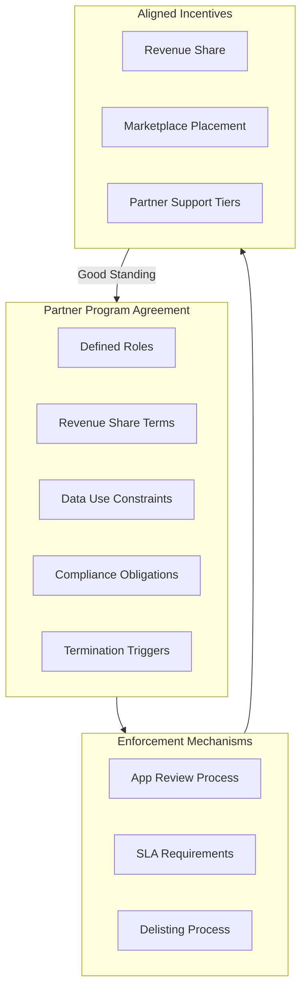
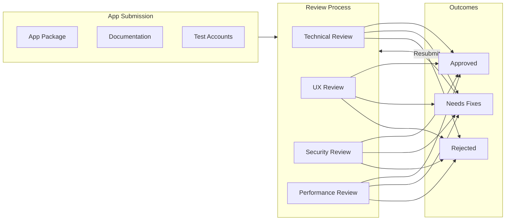
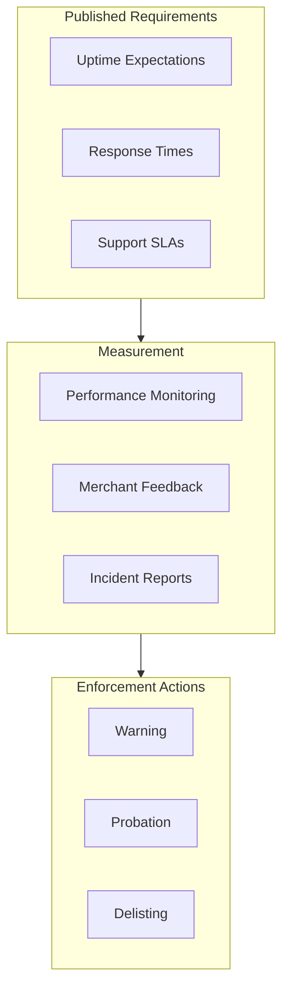
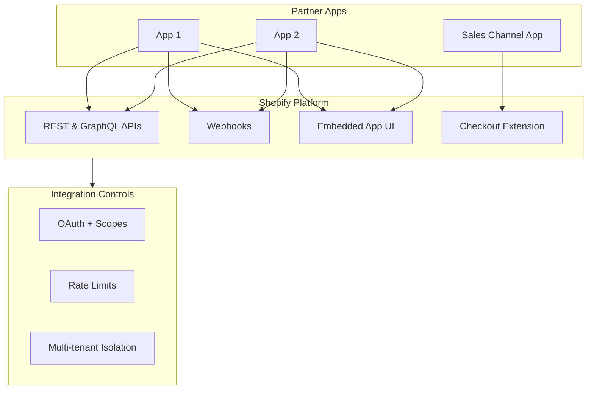
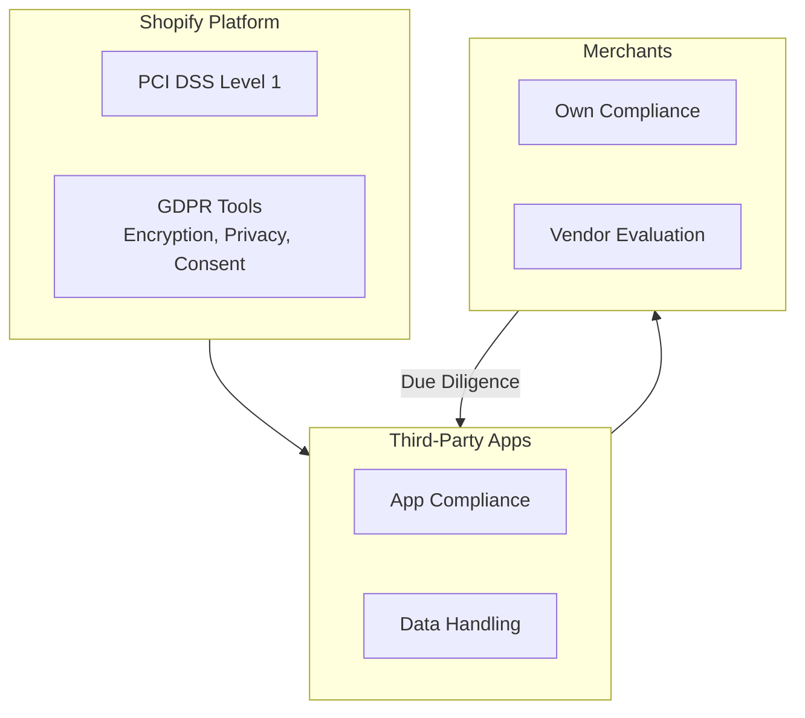
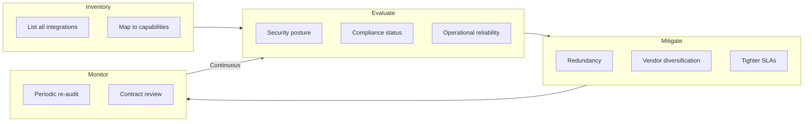
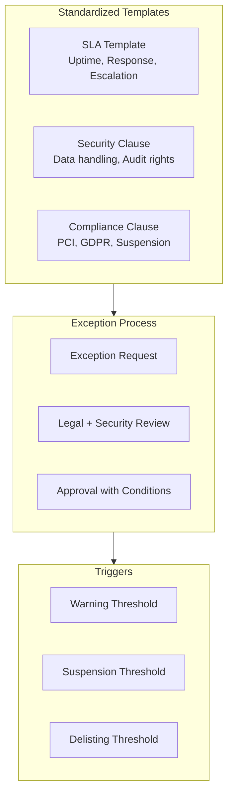
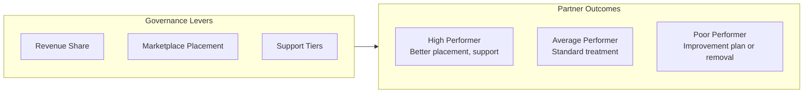
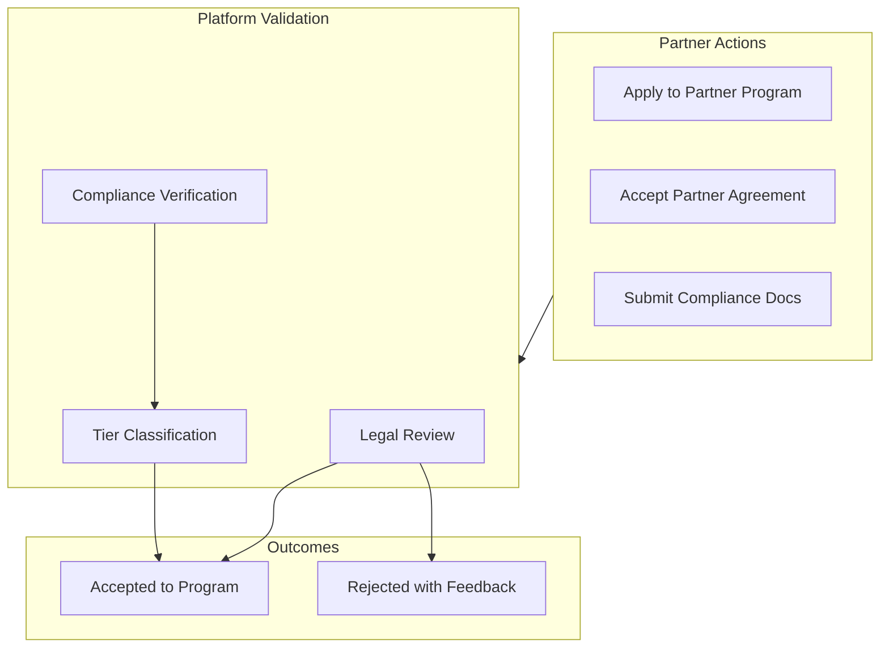
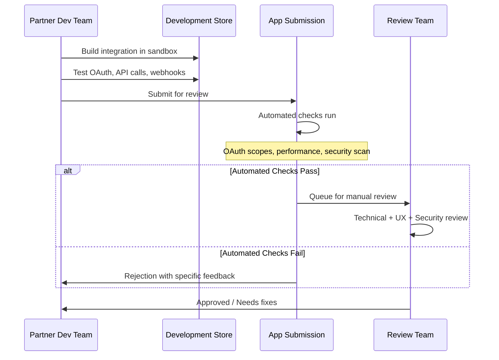

# Vendor & Partner Program Management at Shopify Scale

## Why This Matters

Shopify's App Store has thousands of third-party apps that merchants depend on for payments, shipping, marketing, and more. A single poorly-behaving app can impact thousands of merchants. Understanding Shopify's approach matters for TPMs because:

1. **You manage programs, not one-off deals.** At scale, standardized contracts, automated enforcement, and clear SLAs beat ad-hoc negotiations.
2. **Contract is control plane.** Revenue share, compliance requirements, and termination triggers shape vendor behavior without requiring constant oversight.
3. **Review gates are SLA enforcement.** The App Store review process is how quality standards become operational reality.

This document covers Shopify's partner program structure: contract frameworks, SLA enforcement through app review, multi-vendor orchestration, compliance requirements, and how to run these as long-lived programs.

---

## 1. The Core Challenge: Thousands of Vendors, One Merchant Trust

**The problem:** Shopify's platform depends on third-party apps. Merchants trust these apps with their data, their customers, and their revenue. A single bad actor or poorly-designed app can destroy that trust.

**The solution:** Standardized Partner Program Agreement that aligns incentives through revenue share, enforces quality through review gates, and provides clear termination triggers. You can't manually oversee thousands of partners—you need automated enforcement.

---

## 2. Revenue Share: Aligning Incentives at Scale

**The problem:** How do you motivate thousands of independent developers to build high-quality apps without direct employment relationships?

**The solution:** A revenue share model that rewards success while keeping the barrier to entry low.

| Revenue Tier | Share to Shopify | Notes |
|--------------|-----------------|-------|
| First $1M app revenue | 0% | Encourages ecosystem growth |
| Above $1M | 15% | Standard tier |
| Plus/Enterprise referrals | 15-20% monthly | Recurring share |
| Development stores | 20% monthly | One-time bonuses available |

### 2.1 Why This Works

- **Low barrier to entry:** 0% on first $1M lets small developers get started
- **Aligned incentives:** Shopify only makes money when partners make money
- **Scalable:** No manual negotiation needed—the formula applies to everyone

### 2.2 Contract as Control Plane

The Partner Program Agreement is the control plane for vendor behavior:

| Contract Element | Purpose | Enforcement |
|-----------------|---------|-------------|
| **Revenue share** | Align incentives | Automated calculation |
| **Data use constraints** | Protect merchant data | Review + audit |
| **Compliance obligations** | PCI/GDPR alignment | Certification required |
| **Termination triggers** | Clear exit criteria | Suspension/delisting |

> **TPM Insight:** You manage programs, not individual deals. Default templates, exception processes, and clear triggers for suspension. If you want stronger SLAs or security posture, tie them to being in "good standing."

---

## 3. App Review: SLA Enforcement Through Quality Gates

**The problem:** Published requirements are meaningless if not enforced. How do you ensure thousands of apps meet quality standards?

**The solution:** The App Store review process is the operational SLA gate. Apps either meet standards or don't ship.

### 3.1 Technical Requirements

| Requirement | Standard | Validation |
|-------------|----------|------------|
| **No UI/HTTP errors** | Zero during review | Automated + manual testing |
| **Operational UI** | Fully functional | Manual review |
| **Correct OAuth scopes** | Principle of least privilege | Scope audit |
| **Checkout integration** | Sales channel compliance | Integration testing |
| **Performance** | Within defined thresholds | Benchmarks |

### 3.2 UX Standards

| Standard | Requirement |
|----------|-------------|
| Simple interfaces | Clear, intuitive navigation |
| Responsive design | Works across devices |
| Performance thresholds | No material impact on store speed |
| Support channels | Clear response time commitments |

### 3.3 Implicit SLAs in Guidelines

Shopify's app policies translate into codified SLAs:

> **Enforcement Model:** Partners either meet published standards or don't ship. This scales quality across thousands of apps without manual oversight of each one.

---

## 4. Multi-Vendor Orchestration: Constrained Integration Patterns

**The problem:** When thousands of apps integrate with your platform, each one is a potential security vulnerability, performance bottleneck, or data leak.

**The solution:** Deliberately constrained integration surfaces. Vendors can only integrate through defined APIs with explicit scopes, rate limits, and isolation.

### 4.1 Standardized Integration Surfaces

| Surface | Purpose | Constraints |
|---------|---------|-------------|
| **REST/GraphQL APIs** | Data access | Rate limited, scoped |
| **Webhooks** | Event notifications | Retry with idempotency |
| **Embedded App UI** | In-admin experience | Iframe sandboxing |
| **Sales Channel** | Checkout integration | Strict order scope restrictions |

### 4.2 Security Requirements

| Category | Requirement | Enforcement |
|----------|-------------|-------------|
| **Multi-tenancy** | Scoping all DB queries by tenant | Code review, automated tests |
| **PCI DSS** | Payment data handling | Certification |
| **GDPR** | Data protection, consent | Privacy review |
| **Prohibited Actions** | No crypto payments without KYC | Policy enforcement |

### 4.3 Operational Best Practices

| Practice | Requirement | Consequence of Failure |
|----------|-------------|----------------------|
| Installation docs | Complete setup guide | Rejection |
| Support channels | Clear response times | Rejection/delisting |
| Self-help resources | FAQ, troubleshooting | Lower rating |
| Performance testing | Cross-merchant configs | Rejection |

> **Principal TPM Role:** Align app patterns + platform surfaces so most vendors behave predictably: shared auth model, shared extension points, shared observability.

---

## 5. Compliance as Constraint

**The problem:** Shopify carries PCI Level 1 certification. If a partner app mishandles payment data, it's Shopify's compliance at risk.

**The solution:** Make compliance requirements non-negotiable—built into contracts, review criteria, and escalation playbooks.

### 5.1 Platform Compliance Baseline

| Standard | Shopify Provides | Partner Responsibility |
|----------|-----------------|----------------------|
| **PCI DSS Level 1** | Infrastructure | App-level compliance |
| **GDPR** | Encryption, privacy tools | Data handling, consent |
| **SOC2** | Platform controls | App security posture |

### 5.2 Enterprise Expectations (Shopify Plus)

For Plus merchants, enterprise standards become de-facto requirements:

| Certification | Expectation | Verification |
|---------------|-------------|--------------|
| GDPR | Required for EU merchants | Privacy review |
| SOC2 Type II | Expected for Plus apps | Audit report |
| ISO 27001 | Preferred | Certificate |

### 5.3 Risk Management Framework

---

## 6. Principal TPM Program Ownership

**The problem:** Ad-hoc vendor management doesn't scale. You need repeatable processes.

**The solution:** Run these as formal programs with templates, metrics, and governance.

### 6.1 Contract/SLA Framework Program

| Program Element | Content |
|----------------|---------|
| **Uptime SLA** | 99.9% monthly, measured by Shopify monitoring |
| **Response times** | P1: 1hr, P2: 4hr, P3: 24hr |
| **Incident communication** | Status page + direct notification |
| **Escalation paths** | Defined contacts per severity |
| **Right-to-audit** | Annual security review |
| **Suspension triggers** | SLA breach, security incident, merchant complaints |

### 6.2 App Ecosystem Quality Program

| Initiative | Goal | Metric |
|------------|------|--------|
| Tighten requirements | Reduce incident volume | Incidents/1000 installs |
| Automated checks | Scale review capacity | Review time reduction |
| Quality metrics | Measurable standards | App quality score |
| Enforcement tiers | Clear consequences | Rejection/delisting rate |

### 6.3 External Dependency Risk Program

| Activity | Frequency | Output |
|----------|-----------|--------|
| Critical app inventory | Quarterly | Dependency map |
| Risk assessment | Semi-annual | Risk register |
| Compliance verification | Annual | Audit report review |
| Mitigation planning | As needed | Redundancy/diversification plan |

### 6.4 Partner Success and Governance

---

## 7. Reliability, SLOs, and Operations

### 7.1 SLIs/SLOs

| SLI Category | Metric | SLO Target |
|--------------|--------|------------|
| **App Availability** | Partner app uptime | 99.9% monthly |
| **API Response Time** | p95 latency | &lt;500ms |
| **Integration Quality** | Installation failure rate | &lt;0.1% |
| **Support** | Time to first response | P1: 1hr, P2: 4hr, P3: 24hr |
| **Review Throughput** | Submission to completion | &lt;5 business days |

### 7.2 Error Budgets

**Burned by:** Partner outages, API violations, security incidents, compliance violations, merchant complaints.

**Policy:** Exceeded budget → Warning → Probation → Delisting. Good standing required for premium placement.

### 7.3 Golden Signals

| Signal | What to Monitor |
|--------|-----------------|
| **Latency** | Partner response times, OAuth flow, webhook delivery |
| **Traffic** | Installations, API calls, webhook volume |
| **Errors** | Installation failures, API errors, webhook failures, complaints |
| **Saturation** | Partner rate limit consumption, review queue depth |

### 7.4 Chaos Scenarios

| Scenario | Expected Behavior |
|----------|-------------------|
| Partner app unavailable | Graceful degradation, clear errors, support escalation |
| API rate limit exceeded | Graceful throttling, partner notification |
| Webhook endpoint fails | Retry with backoff, dead-letter, partner alert |
| Security incident | Immediate suspension capability, merchant notification |

---

## 8. Trade-Off Matrix

| Decision | Vendor Friction | Platform Control | Merchant Trust | Scalability |
|----------|----------------|------------------|----------------|-------------|
| Strict app review | High | High | High | Medium |
| Revenue share model | Low | Medium | N/A | High |
| Standardized APIs | Medium | High | High | High |
| Mandatory compliance | High | High | High | Medium |
| Automated quality checks | Low | High | High | High |

---

## 9. Example Flow: Partner Onboarding with Compliance

**Scenario:** New payment partner wants to integrate with Shopify Plus, requiring PCI compliance and SOC2.

### 9.1 Initial Application

### 9.2 App Submission and Review

### 9.3 Post-Launch Monitoring

- Shopify monitors availability and API usage
- Merchant feedback aggregated and flagged
- Quarterly compliance re-verification for payment apps
- Revenue share calculated monthly

### 9.4 Enforcement Example

**Incident:** Partner app experiences 4-hour outage affecting 500 merchants.

**Response:**
- Automated alert (SLA clock starts)
- Merchant support escalation
- Pattern continues → Warning → Probation → Delisting
- Post-incident: Mandatory RCA, improvement plan

---

## 10. Role-Specific Focus

### 10.1 Senior TPM Scope

**Owns a slice:** "Payment partner onboarding and compliance validation."

| Responsibility | Deliverables |
|---------------|--------------|
| Partner onboarding | Documented process with SLAs |
| Compliance verification | Checklist, validation workflow |
| App review coordination | Queue management, SLO tracking |
| Escalation handling | Partner issues affecting merchants |
| Quarterly reporting | Partner health, compliance status |

### 10.2 Principal TPM Scope

**Owns the multi-year roadmap:** Partner ecosystem strategy.

| Responsibility | Deliverables |
|---------------|--------------|
| Partner Program strategy | Revenue share evolution, tier structure |
| Compliance framework | Cross-cutting requirements |
| Platform API governance | Rate limits, deprecation, versioning |
| Ecosystem health metrics | Partner success KPIs |
| Build vs. partner decisions | Strategic capability analysis |

### 10.3 Interview Readiness

Be ready to:
- **Articulate the partner program structure** (contracts, SLAs, enforcement)
- **Walk through partner onboarding** with compliance validation
- **Quantify impact:**
  - Ecosystem scale (10,000+ apps)
  - Merchant trust metrics
  - Compliance coverage (100% PCI for payment apps)
  - Revenue share economics

---

## Key Takeaways

> **Programs, Not Deals:** At Principal level, run standardized frameworks with templates, exception processes, and enforcement triggers. Don't negotiate each vendor from scratch.

> **Contract as Control Plane:** Revenue share, SLAs, and compliance requirements shape vendor behavior at scale. Good standing = good behavior.

> **Review as SLA Gate:** App Store requirements are codified SLAs. Partners meet them or don't ship. Scales quality without manual oversight.

> **Compliance as Constraint:** PCI/GDPR/SOC2 are non-negotiable. Build into contracts, review criteria, and escalation playbooks.
