# Vendor & Partner Program Management at Shopify Scale

Shopify is a textbook example of **multi-vendor orchestration at platform scale**: tight partner contracts, explicit SLAs, strong app-review gates, and opinionated integration patterns. This ensures thousands of external vendors don't blow up merchant trust.

> **Why This Matters for Principal TPMs**
>
> At Principal level, you will own programs with critical external dependencies. Shopify's model shows how to scale vendor management through standardized contracts, automated enforcement, and explicit SLA frameworks—not ad-hoc deal-making.

---

## 1. Contract Frameworks and Economic Model

Shopify uses standardized Partner contracts and revenue-share to align incentives and keep enforcement scalable.

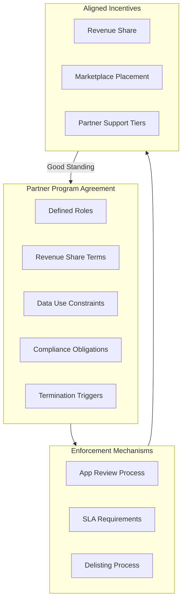

### 1.1 Revenue Share Structure

| Revenue Tier | Share to Shopify | Notes |
|--------------|-----------------|-------|
| First $1M app revenue | 0% | Encourages ecosystem growth |
| Above $1M | 15% | Standard tier |
| Plus/Enterprise referrals | 15-20% monthly | Recurring share |
| Development stores | 20% monthly | One-time bonuses available |

### 1.2 Contract as Control Plane

The Partner Program Agreement serves as the **control plane for vendor behavior**:

| Contract Element | Purpose | Enforcement |
|-----------------|---------|-------------|
| **Revenue share** | Align incentives | Automated calculation |
| **Data use constraints** | Protect merchant data | Review + audit |
| **Compliance obligations** | PCI/GDPR alignment | Certification required |
| **Termination triggers** | Clear exit criteria | Suspension/delisting |

> **TPM Insight**
>
> You manage programs, not one-off deals. This means: default templates, exception processes, and clear triggers for suspension or delisting. If you want stronger SLAs or security posture, tie them to being in "good standing" under these terms.

---

## 2. SLAs and App Review as Enforcement Mechanisms

Shopify doesn't trust partners blindly. The **App Store requirements + review process** are the operational SLA gate.

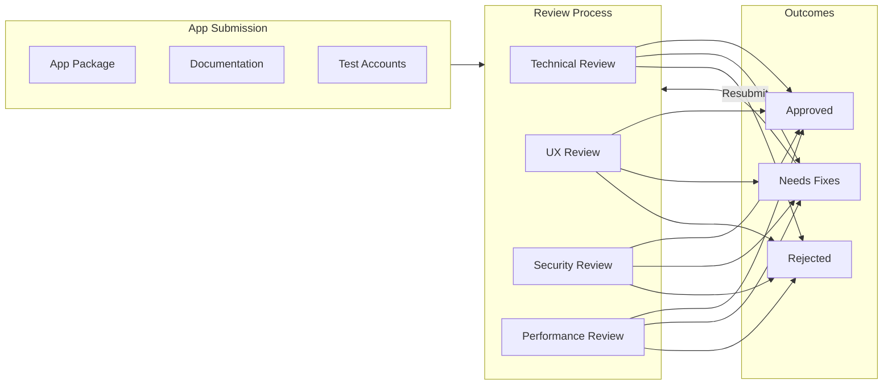

### 2.1 App Store Technical Requirements

| Requirement | Standard | Validation |
|-------------|----------|------------|
| **No UI/HTTP errors** | Zero during review | Automated + manual testing |
| **Operational UI** | Fully functional | Manual review |
| **Correct OAuth scopes** | Principle of least privilege | Scope audit |
| **Checkout integration** | Sales channel compliance | Integration testing |
| **Performance** | Within defined thresholds | Performance benchmarks |

### 2.2 UX and Merchant-Centric Standards

| Standard | Requirement |
|----------|-------------|
| Simple interfaces | Clear, intuitive navigation |
| Responsive design | Works across devices |
| Performance thresholds | No material impact on store speed |
| Support channels | Clear response time commitments |

### 2.3 Implicit SLAs in Guidelines

Shopify's app policies translate into **codified SLAs** for the ecosystem:

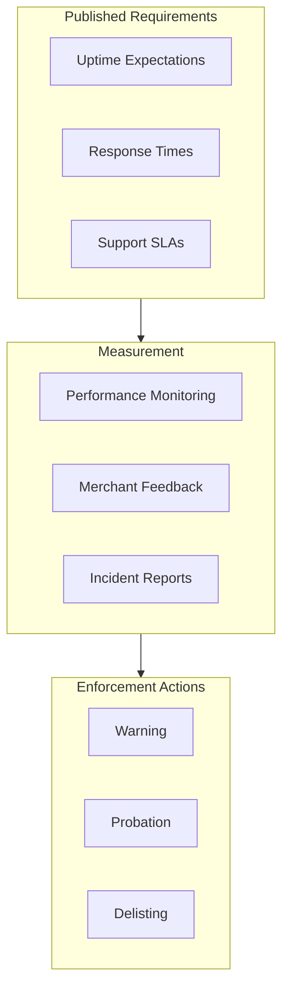

> **Enforcement Model**
>
> Partners either meet the published standards or don't ship. This is how you scale quality across thousands of apps without manual oversight of each one.

---

## 3. Multi-Vendor Orchestration and Integration Patterns

Shopify's integration patterns deliberately constrain how vendors plug into core surfaces, keeping blast radius manageable.

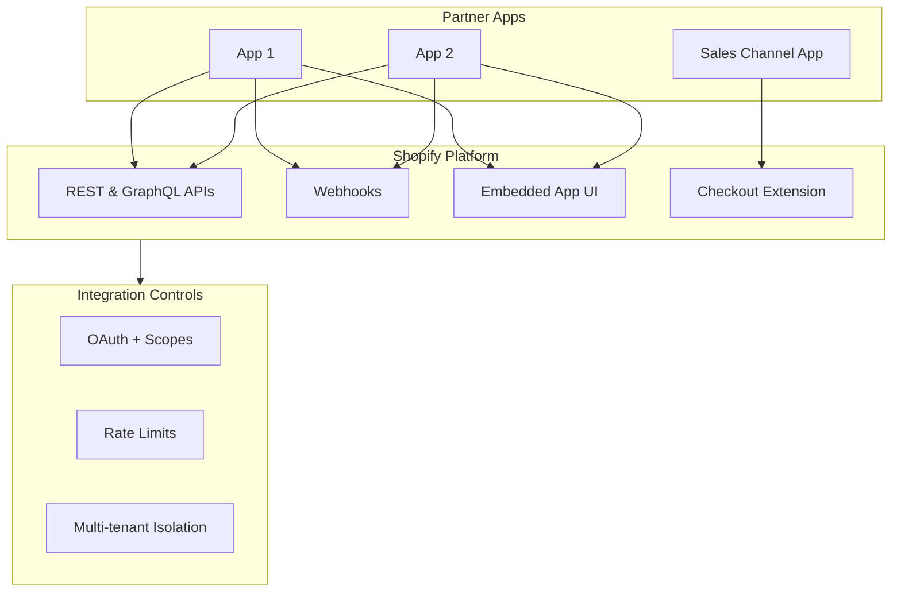

### 3.1 Standardized Integration Surfaces

| Surface | Purpose | Constraints |
|---------|---------|-------------|
| **REST/GraphQL APIs** | Data access | Rate limited, scoped |
| **Webhooks** | Event notifications | Retry with idempotency |
| **Embedded App UI** | In-admin experience | Iframe sandboxing |
| **Sales Channel** | Checkout integration | Strict order scope restrictions |

### 3.2 Security and Compliance Requirements

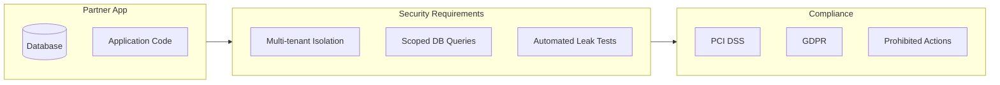

| Category | Requirement | Enforcement |
|----------|-------------|-------------|
| **Multi-tenancy** | Scoping all DB queries by tenant | Code review, automated tests |
| **PCI DSS** | Payment data handling | Certification |
| **GDPR** | Data protection, consent | Privacy review |
| **Prohibited Actions** | No crypto payments without KYC | Policy enforcement |

### 3.3 Operational Best Practices

| Practice | Requirement | Consequence of Failure |
|----------|-------------|----------------------|
| Installation docs | Complete setup guide | Rejection |
| Support channels | Clear response times | Rejection/delisting |
| Self-help resources | FAQ, troubleshooting | Lower rating |
| Performance testing | Cross-merchant configs | Rejection |

> **Principal TPM Role**
>
> Your job is to align app patterns + platform surfaces so most vendors behave predictably: shared auth model, shared extension points, shared observability.

---

## 4. External Dependency Risk and Compliance

Shopify carries the platform's compliance posture; partners must not undermine it.

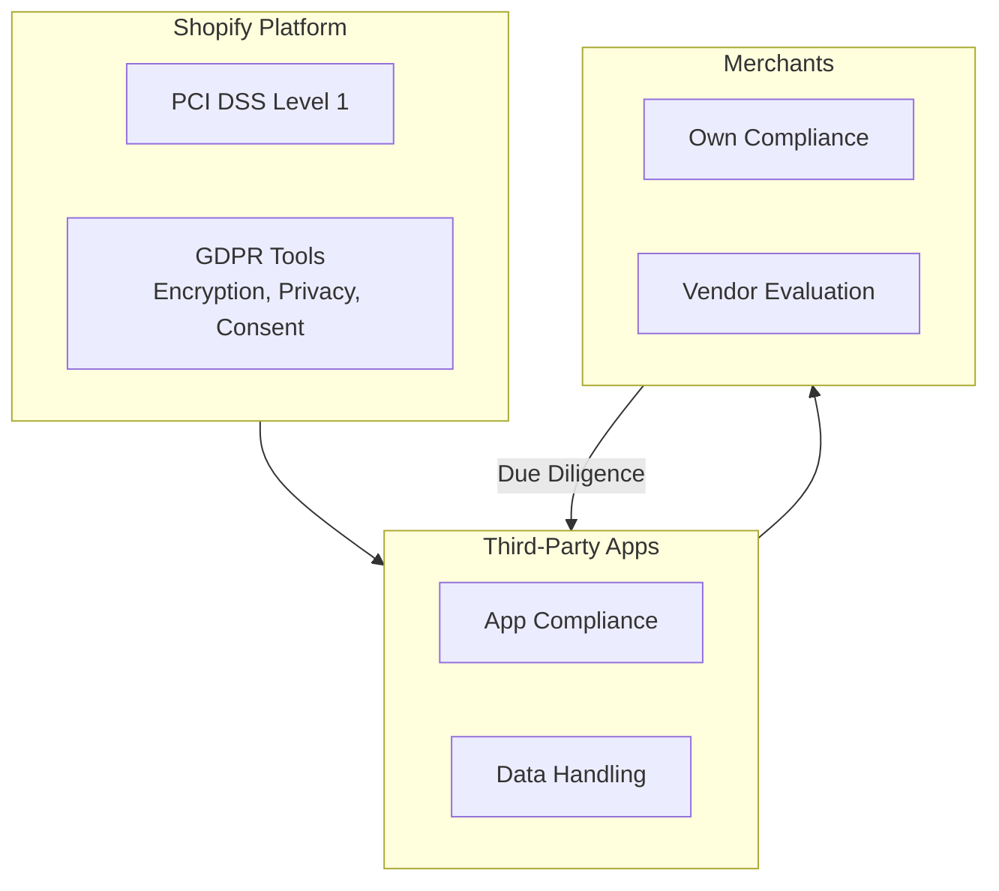

### 4.1 Platform Compliance Baseline

| Standard | Shopify Provides | Partner Responsibility |
|----------|-----------------|----------------------|
| **PCI DSS Level 1** | Infrastructure | App-level compliance |
| **GDPR** | Encryption, privacy tools | Data handling, consent |
| **SOC2** | Platform controls | App security posture |

### 4.2 Third-Party Compliance Expectations

For Shopify Plus, enterprise standards become de-facto requirements:

| Certification | Expectation | Verification |
|---------------|-------------|--------------|
| GDPR | Required for EU merchants | Privacy review |
| SOC2 Type II | Expected for Plus apps | Audit report |
| ISO 27001 | Preferred | Certificate |

### 4.3 Risk Management Framework

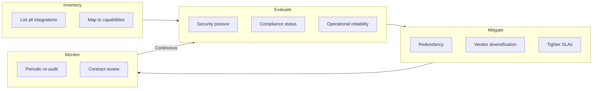

> **Compliance as Constraint**
>
> PCI/GDPR/SOC2 are **non-negotiable constraints** in partner contracts, review criteria, and escalation/termination playbooks.

---

## 5. Principal TPM Program Ownership

If you claim this domain in an interview, anchor on **programs**, not ad-hoc deals.

### 5.1 Contract/SLA Framework Program

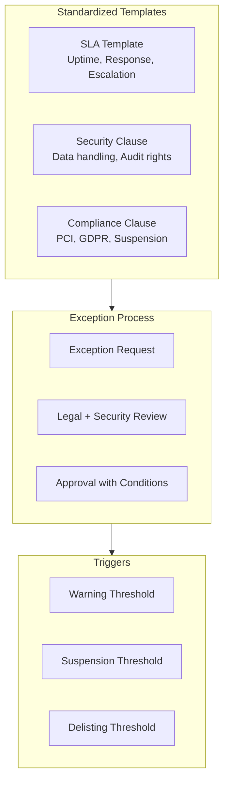

| Program Element | Content |
|----------------|---------|
| **Uptime SLA** | 99.9% monthly, measured by Shopify monitoring |
| **Response times** | P1: 1hr, P2: 4hr, P3: 24hr |
| **Incident communication** | Status page + direct notification |
| **Escalation paths** | Defined contacts per severity |
| **Right-to-audit** | Annual security review |
| **Suspension triggers** | SLA breach, security incident, merchant complaints |

### 5.2 App Ecosystem Quality Program

| Initiative | Goal | Metric |
|------------|------|--------|
| Tighten requirements | Reduce incident volume | Incidents/1000 installs |
| Automated checks | Scale review capacity | Review time reduction |
| Quality metrics | Measurable standards | App quality score |
| Enforcement tiers | Clear consequences | Rejection/delisting rate |

### 5.3 External Dependency Risk Program

| Activity | Frequency | Output |
|----------|-----------|--------|
| Critical app inventory | Quarterly | Dependency map |
| Risk assessment | Semi-annual | Risk register |
| Compliance verification | Annual | Audit report review |
| Mitigation planning | As needed | Redundancy/diversification plan |

### 5.4 Partner Success and Governance

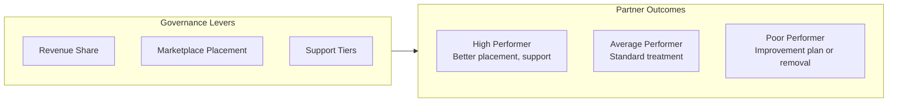

> **The Shopify Bar**
>
> Thousands of vendors, but a **single, enforced operating model** for contracts, SLAs, security, and integration behavior—run as long-lived programs, not ad-hoc firefighting.

---

## 6. Trade-off Matrix

| Decision | Vendor Friction | Platform Control | Merchant Trust | Scalability |
|----------|----------------|------------------|----------------|-------------|
| Strict app review | High | High | High | Medium |
| Revenue share model | Low | Medium | N/A | High |
| Standardized APIs | Medium | High | High | High |
| Mandatory compliance certs | High | High | High | Medium |
| Automated quality checks | Low | High | High | High |

---

## 7. Reliability, SLOs, and Operations

### 7.1 SLIs/SLOs

| SLI Category | Metric | SLO Target |
|--------------|--------|------------|
| **App Availability SLI** | Partner app uptime as measured by Shopify monitoring | 99.9% monthly availability |
| **API Response Time SLI** | p95 latency for partner API calls | &lt;500ms for standard endpoints |
| **Integration Quality SLI** | Error rate for app installations and OAuth flows | &lt;0.1% failure rate |
| **Support SLI** | Time to first response for merchant support tickets | P1: 1hr, P2: 4hr, P3: 24hr |
| **Review Throughput SLI** | Time from app submission to review completion | &lt;5 business days |

### 7.2 Error Budgets

**Burned by:** Partner app outages affecting merchants, API rate limit violations, security incidents, compliance violations, excessive merchant complaints.

**Policy:** If a partner exceeds error budget (e.g., multiple SLA breaches in a month), escalate through warning → probation → delisting. Good standing required for premium placement and support tiers.

### 7.3 Golden Signals

| Signal | What to Monitor |
|--------|-----------------|
| **Latency** | Partner app response times, OAuth flow completion time, webhook delivery latency |
| **Traffic** | App installations, API call volume per partner, webhook delivery volume |
| **Errors** | App installation failures, API errors, webhook delivery failures, merchant complaints |
| **Saturation** | Partner approaching rate limits, app store review queue depth |

### 7.4 Chaos Scenarios to Run

| Scenario | Expected Behavior |
|----------|-------------------|
| Partner app becomes unavailable | Merchants see graceful degradation, clear error messaging, support escalation path |
| Partner exceeds API rate limits | Requests throttled gracefully, partner notified, no merchant data loss |
| Partner webhook endpoint fails | Retry with backoff, dead-letter after max retries, partner alerted |
| Partner security incident | Immediate suspension capability, merchant notification workflow, audit trail |
| App review backlog spike | Automated triage, priority queue for critical fixes, SLO tracking |

### 7.5 MTTR Targets

- Target MTTR for partner app incident affecting merchants: &lt;1 hour (partner responsibility, platform provides alerting)
- Target MTTR for platform-side issues affecting partners: &lt;30 minutes
- Suspension/delisting can be executed within minutes for critical security issues

---

## 8. Economics, COGS, and Mag7 vs non-Mag7

### 8.1 COGS Levers

| Category | Optimization Strategy |
|----------|----------------------|
| **App Review** | Automated checks reduce manual review burden; quality gates catch issues early |
| **Support** | Tiered support model; self-service for common issues; escalation for complex |
| **API Infrastructure** | Rate limiting protects platform; partners pay for higher tiers |
| **Compliance** | Standardized requirements reduce per-partner audit costs |
| **Monitoring** | Centralized observability reduces per-app monitoring overhead |

### 8.2 Time to Value

- Standardized Partner Program Agreement reduces legal negotiation time
- Automated app review catches 80% of issues before human review
- Self-service onboarding gets partners to first integration in hours, not weeks
- Template-based contracts enable scaling without linear legal cost growth

### 8.3 Mag7 vs non-Mag7

| Aspect | Mag7 (Shopify) | Strong non-Mag7 |
|--------|----------------|-----------------|
| **Partner Scale** | 10,000+ apps, millions of merchants | Hundreds of partners |
| **Program Approach** | Highly automated, standardized contracts, tiered enforcement | More manual, relationship-based |
| **Review Process** | Automated + manual, clear SLAs | Primarily manual |
| **Compliance** | Platform-enforced (PCI Level 1) | Partner-attested |
| **Revenue Model** | Revenue share aligns incentives at scale | Fixed fees or case-by-case |

---

## 9. Example Flow: New Partner App Onboarding with Compliance Validation

Walk one concrete flow like you'd in an interview.

**Scenario:** A new payment processing partner wants to integrate with Shopify Plus merchants, requiring PCI compliance, SOC2 attestation, and passing the app review process.

### 9.1 Initial Application

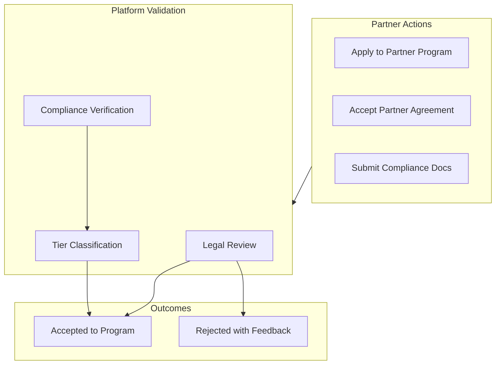

Partner submits application with: PCI DSS AOC, SOC2 Type II report, proof of insurance, technical architecture documentation.

### 9.2 App Development and Submission

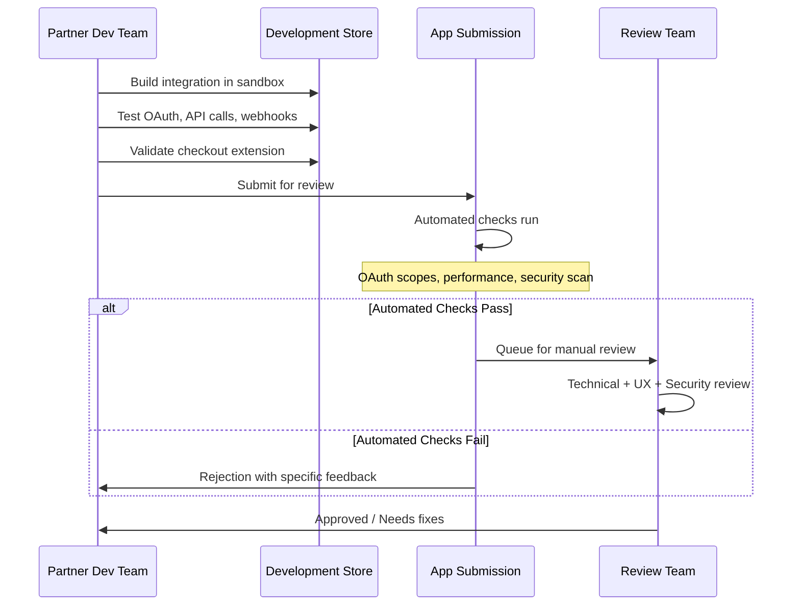

### 9.3 Review Criteria Validation

| Criterion | Validation Method | Partner Requirement |
|-----------|-------------------|---------------------|
| OAuth scopes | Automated audit | Principle of least privilege |
| API performance | Benchmark tests | &lt;500ms p95 response |
| Security | SAST/DAST scans | No critical vulnerabilities |
| UX | Manual review | Clear, responsive, accessible |
| Checkout compliance | Integration tests | Correct order handling |

### 9.4 Post-Launch Monitoring

- Shopify monitors app availability and API usage
- Merchant feedback aggregated and flagged
- Quarterly compliance re-verification for payment apps
- Revenue share calculated and distributed monthly

### 9.5 Failure Scenario (Enforcement Example)

**Incident:** Partner app experiences 4-hour outage affecting 500 merchants.

**Expected Response:**
- Automated alert to partner (SLA clock starts)
- Merchant support ticket escalation
- If pattern continues: Warning → Probation → Delisting consideration
- Post-incident: Mandatory RCA from partner, improvement plan required

---

## 10. How a Senior vs Principal TPM Should Operate Here

### 10.1 Senior TPM Scope

**Owns a slice:** e.g., "Payment partner onboarding program and compliance validation."

| Responsibility | Deliverables |
|---------------|--------------|
| Partner onboarding process | Documented process with SLAs |
| Compliance verification | Checklist, validation workflow, audit tracking |
| App review coordination | Review queue management, SLO tracking |
| Escalation handling | Partner issues affecting merchants |
| Quarterly reporting | Partner health metrics, compliance status |

### 10.2 Principal TPM Scope

**Owns the multi-year roadmap:** Partner ecosystem strategy and platform governance.

| Responsibility | Deliverables |
|---------------|--------------|
| Partner Program strategy | Revenue share model evolution, tier structure |
| Compliance framework | Cross-cutting requirements (PCI, GDPR, SOC2) |
| Platform API governance | Rate limits, deprecation policies, versioning |
| Ecosystem health metrics | Partner success KPIs, merchant satisfaction |
| Build vs. partner decisions | Strategic capability analysis |

### 10.3 Interview Readiness

For interviews, you should be ready to:
- **Articulate the partner program structure** with contracts, SLAs, and enforcement
- **Walk through a partner onboarding** with compliance validation steps
- **Quantify impact** in terms of:
  - Partner ecosystem scale (10,000+ apps)
  - Merchant trust metrics (app quality scores)
  - Compliance coverage (100% PCI for payment apps)
  - Revenue share economics and incentive alignment

---

## Key Takeaways

> **Programs, Not Deals**
>
> At Principal level, you run standardized frameworks with clear templates, exception processes, and enforcement triggers. You don't negotiate each vendor relationship from scratch.

> **Contract as Control Plane**
>
> Revenue share, SLAs, and compliance requirements in the Partner Agreement are how you shape vendor behavior at scale. Good standing = good behavior.

> **Review as SLA Gate**
>
> App Store requirements and review process are codified SLAs. Partners meet them or don't ship. This scales quality without manual oversight.

> **Compliance as Constraint**
>
> PCI/GDPR/SOC2 are non-negotiable. Build them into contracts, review criteria, and escalation playbooks.
