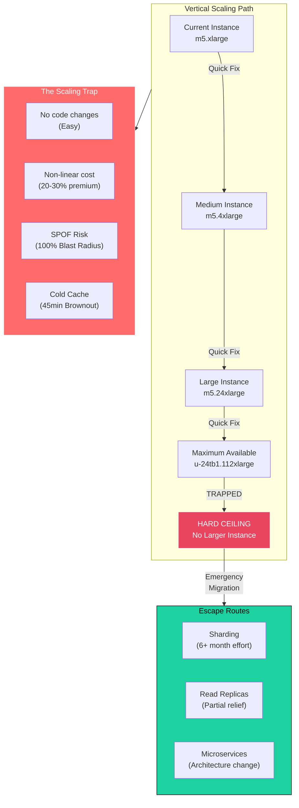
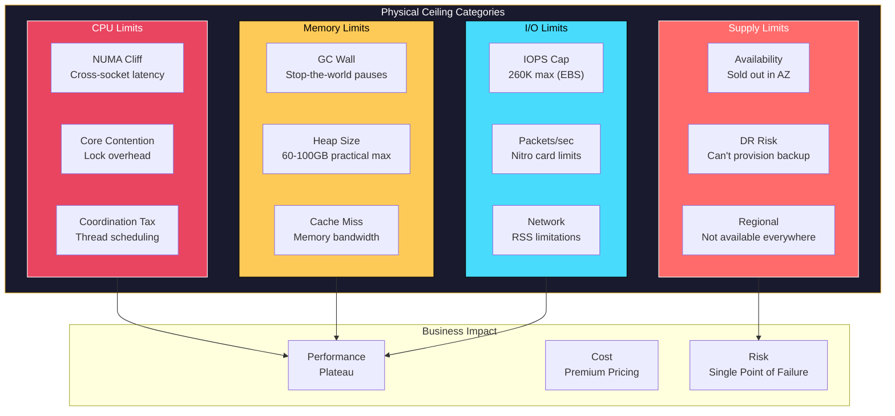
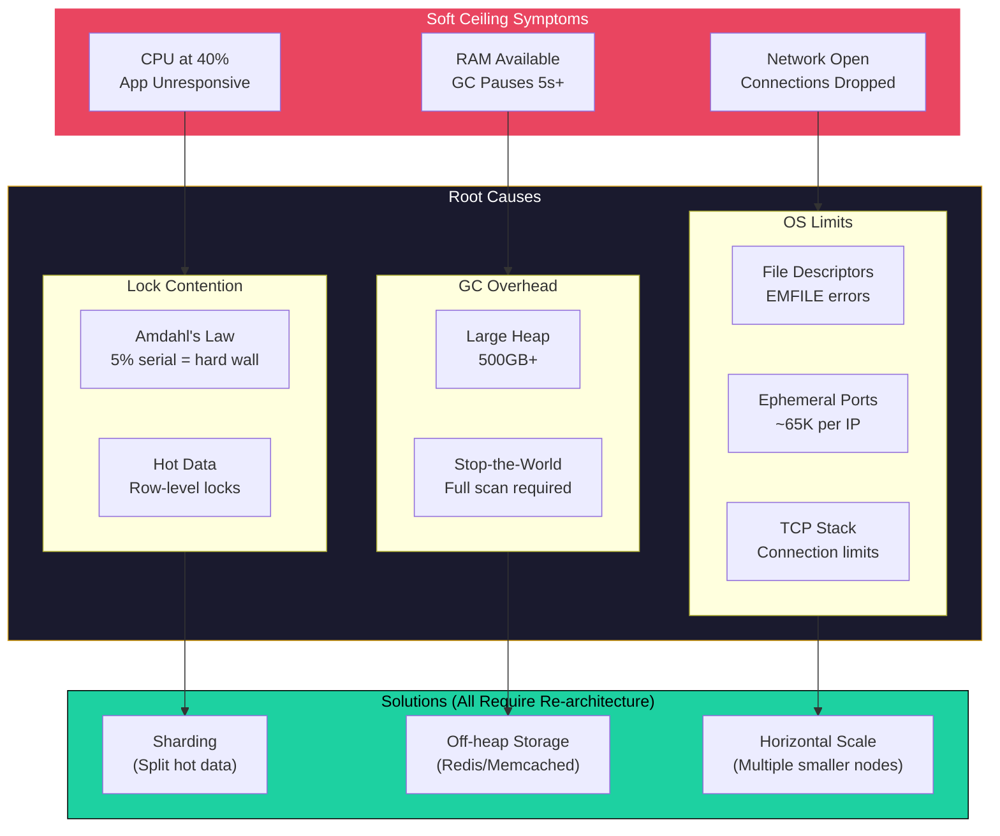
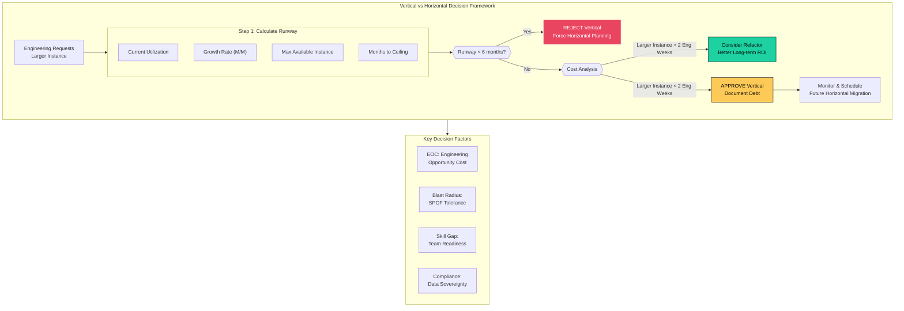

# Vertical Scaling Limits

This guide covers 5 key areas: I. Conceptual Overview: The "Scale Up" Trap, II. Hardware Limits: The Physical Ceiling, III. Software & Architectural Limits: The "Soft" Ceiling, IV. Business & Operational Impact Analysis, V. Strategic Decision Framework for Principal TPMs.

## I. Conceptual Overview: The "Scale Up" Trap

At the Principal TPM level, Vertical Scaling (Scaling Up) is rarely just an infrastructure ticket; it is a strategic bet on **Time-to-Market vs. Technical Debt**.

Vertical scaling is the act of increasing the capacity of a single node—adding more CPU cores, increasing RAM, or upgrading to faster SSDs (NVMe)—rather than adding more nodes to a cluster. In a Mag7 environment, this creates a specific tension: the infrastructure is virtually limitless, but the software running on a single instance is bound by OS kernel limits, hardware architecture, and diminishing returns.

The "Trap" occurs when a product team relies on vertical scaling to handle growth because it requires zero code refactoring, only to hit the physical hardware ceiling during a critical traffic surge (e.g., Prime Day, Super Bowl, Black Friday), leaving no architectural runway to recover.

### 1. The Physics of the Ceiling: Diminishing Returns
A common misconception is that doubling the hardware specs doubles the performance. At the scale of Mag7 compute (e.g., AWS `u-6tb1.metal` or Azure `M-series`), this linearity breaks down due to **resource contention**.

*   **NUMA (Non-Uniform Memory Access) Cliff:** On massive instances with multiple CPU sockets, accessing RAM attached to a different socket incurs latency penalties. A Principal TPM must understand that moving from a 64-core to a 128-core machine might result in *lower* performance per core due to memory locking and bus contention.
*   **The "Cold Cache" Recovery:** Vertical scaling usually requires a restart (downtime) to resize the instance. A massive database instance (e.g., 4TB RAM) relies heavily on cached data in RAM to perform quickly. When that node reboots, the cache is empty ("cold").
    *   *Mag7 Impact:* Even if the server comes back online in 5 minutes, the application may be unresponsive for 45 minutes while the database re-reads data from disk to warm up the cache. This creates a "brownout" scenario often missed in SLA calculations.

### 2. The "Write Check vs. Write Code" Trade-off
The decision to scale vertically is fundamentally an economic tradeoff between OpEx (Cloud Spend) and R&D (Engineering Hours).

*   **The Argument for Vertical:** "Writing a check" to AWS/GCP for a larger instance is instant. It unblocks business growth immediately without diverting engineers from feature work.
*   **The Argument Against Vertical:** The cost curve is non-linear. The largest available instances often cost 20-30% more per unit of compute than standard instances. Furthermore, you are creating a **Single Point of Failure (SPOF)**.
*   **Real-World Mag7 Example:**
    *   *Scenario:* An internal Amazon team manages a legacy monolithic service for vendor onboarding. Traffic grows 20% YoY.
    *   *The Trap:* The team keeps upgrading the RDS instance type for three years.
    *   *The Failure:* During Q4 peak, the database hits the maximum IOPS (Input/Output Operations Per Second) limit of the largest available EBS volume. There is no larger instance to buy. The service goes down.
    *   *The Consequence:* The team is forced to attempt a risky "sharding" migration under fire during a code freeze, resulting in significant business disruption and reputation damage.

### 3. Business & ROI Implications
As a Principal TPM, you must quantify the impact of remaining in the "Scale Up" paradigm:

*   **Risk Exposure (MTTR):** Vertical scaling negatively impacts Mean Time To Recovery. If a 12TB database node fails, restoring it from a snapshot or failing over to a replica can take significantly longer than replacing a small node in a horizontal cluster.
*   **Vendor Lock-in:** Relying on "Bare Metal" or specialized high-memory instances ties the architecture to specific hardware availability. If a region runs out of `x1e.32xlarge` capacity (which happens), your scaling strategy fails.
*   **Innovation Stagnation:** Teams addicted to vertical scaling often lack the skill sets required for distributed systems (sharding, eventual consistency, partitioning). This creates a capability gap in the organization.

### 4. Actionable Guidance: The "Runway" Calculation
When an Engineering Lead proposes "bumping the instance size" to solve a performance issue, the Principal TPM should enforce the following validation framework:

1.  **Determine the Ceiling:** Look up the absolute maximum instance size available in the current cloud region.
2.  **Calculate Burn Rate:** Based on current growth (W/W or M/M), how many months until we hit that maximum size?
3.  **The "6-Month Rule":** If the projected growth hits the hardware ceiling in less than 6 months, vertical scaling is **rejected**. The team must immediately prioritize architectural refactoring (sharding/horizontal scaling).
4.  **Cost Analysis:** Does the cost of the larger instance exceed the cost of 2 engineering weeks? If yes, refactoring might yield better long-term ROI.

## II. Hardware Limits: The Physical Ceiling

### 1. The Diminishing Returns of CPU (The NUMA Cliff)

While cloud providers offer instances with 128+ vCPUs, a Principal TPM must understand that performance does not scale linearly with core count on a single machine. This is largely due to **Non-Uniform Memory Access (NUMA)** architecture and interconnect saturation.

*   **Technical Mechanism:** In massive instances (e.g., AWS `u-12tb1.112xlarge`), multiple physical CPU sockets are linked. When a core on Socket A needs to access memory controlled by Socket B, it must traverse an interconnect (like Intel UPI). This adds latency. Furthermore, OS overhead for scheduling threads across hundreds of cores creates "coordination tax."
*   **Mag7 Real-World Example:** At Amazon, legacy monolithic services (often Java-based) migrated to the largest available EC2 instances often see a "performance plateau." A move from 64 to 128 cores might only yield a 30% throughput increase, not 100%, because the application isn't NUMA-aware and threads are locking/blocking each other.
*   **Tradeoffs:**
    *   **Simplicity vs. Efficiency:** Sticking to one massive node avoids distributed system complexity (network calls, consistency models) but results in significantly higher cost-per-transaction due to wasted CPU cycles waiting on memory.
*   **Business Impact:**
    *   **ROI:** You are paying premium rates for "dark silicon"—compute capacity you cannot effectively utilize.
    *   **CX:** Latency jitter increases as requests bounce between CPU sockets.

### 2. Memory Limits: The Garbage Collection Wall

The physical limit of RAM is high (AWS offers up to 24TB for SAP HANA workloads), but the *usable* limit for standard application runtimes is much lower.

*   **Technical Mechanism:** For managed languages (Java, Go, Python, Node), memory size is limited by Garbage Collection (GC). If you assign a 500GB heap to a single Java process, the GC "Stop-the-World" pause required to scan that memory can last seconds or even minutes.
*   **Mag7 Real-World Example:** An indexing service at Google or a metadata service at Netflix might attempt to cache the entire dataset in memory to reduce latency. If the heap grows beyond ~60-100GB, the service may experience "brownouts" where the application freezes during GC cycles, causing upstream timeouts and cascading failures.
*   **Tradeoffs:**
    *   **Stateful vs. Stateless:** Massive RAM allows for stateful architectures (keeping data local). However, it introduces unpredictable latency spikes compared to stateless architectures that fetch from a distributed cache (like Redis/Memcached) which has predictable, albeit slightly higher, baseline latency.
*   **Business Impact:**
    *   **Reliability:** P99 latency violates SLAs.
    *   **Skill:** Requires highly specialized engineering tuning (GC tuning) rather than standard scaling patterns.

### 3. I/O and Network Bandwidth: The "Noisy Neighbor" & Nitro Limits

Even if CPU and RAM are sufficient, data must enter and exit the box. There is a physical limit to the number of PCIe lanes and network throughput a single motherboard can handle.

*   **Technical Mechanism:**
    *   **EBS/Disk Limits:** AWS instances have maximum IOPS and throughput caps (e.g., 260,000 IOPS / 7,500 MB/s). If your database writes exceed this, the OS queues the writes, causing I/O wait times to skyrocket.
    *   **Network Limits:** A "100 Gbps" instance does not guarantee 100 Gbps for a single TCP flow due to receive-side scaling (RSS) limitations.
*   **Mag7 Real-World Example:** A high-frequency ingestion fleet at Meta or a video processing node at YouTube. Engineers might assume upgrading to a larger instance increases network bandwidth linearly. However, they hit the **packet-per-second (PPS)** limit of the virtualization hardware (e.g., AWS Nitro cards) before saturating the bandwidth, resulting in dropped packets.
*   **Tradeoffs:**
    *   **Managed Storage vs. Ephemeral Flash:** To bypass network storage (EBS) limits, you can use instances with local NVMe SSDs (e.g., `i3en` family).
    *   *The Catch:* Local NVMe is ephemeral. If the instance stops, data is lost. This forces the application to handle data replication (RAID-0/1/10 logic) at the software level, increasing engineering complexity.
*   **Business Impact:**
    *   **Capabilities:** The product cannot handle burst traffic (e.g., Super Bowl streaming) if the single-node I/O ceiling is lower than the burst peak.

### 4. The Availability and Procurement Risk (The "Unobtainium" Factor)

A strictly physical limit often overlooked by TPMs is the supply chain availability of the largest instances ("Metal" or "High Memory" classes).

*   **Technical Mechanism:** Cloud providers do not stock `u-24tb1.metal` instances in the same quantity as `m5.large`. These instances reside on specific racks in specific Availability Zones (AZs).
*   **Mag7 Real-World Example:** During a region build-out or a major event (Prime Day), a team relying on the absolute largest instance type for their primary database may find that they cannot launch a standby replica in a secondary AZ because that specific hardware SKU is sold out or capacity-constrained in that zone.
*   **Tradeoffs:**
    *   **Performance vs. Recoverability:** Vertical scaling to the max hardware limit creates a "Snowflake" infrastructure. If that hardware fails, you may not be able to provision a replacement immediately.
*   **Business Impact:**
    *   **DR/BCP:** Your Disaster Recovery Plan is invalid if the hardware required to run the backup doesn't exist in the failover region.
    *   **Leverage:** You lose negotiation leverage with the cloud provider/hardware vendor because you are locked into a niche SKU.

## III. Software & Architectural Limits: The "Soft" Ceiling

Even if you secure the largest "bare metal" instance AWS or Azure offers, software architecture often hits a performance ceiling long before the hardware creates a physical bottleneck. This is the "Soft Ceiling." For a Principal TPM, this is the most dangerous limit because it is invisible to infrastructure monitoring tools until it is too late. You will see CPU utilization sitting at 40%, yet the application is unresponsive.

Understanding these limits allows you to push back against engineering teams who claim, "We have budget for a bigger box, so we don't need to shard yet."

### 1. Concurrency and Lock Contention (Amdahl's Law)
The most common software limit in vertical scaling is lock contention. As you add more CPU cores to a single machine, the application threads must coordinate access to shared memory. If the software was not designed with high concurrency in mind, threads spend more time waiting for locks (mutexes) than executing code.

*   **The Technical Reality:** This is governed by Amdahl’s Law, which states that the theoretical speedup of a task is limited by the portion of the task that cannot be parallelized. If 5% of your transaction logic is serial (e.g., writing to a specific log file or updating a global counter), you hit a hard wall where adding more cores actually *degrades* performance due to context switching overhead.
*   **Mag7 Real-World Example:** At Amazon, legacy inventory management systems for specific fulfillment centers often ran on massive relational databases. During peak events (Prime Day), simply moving to a larger instance with 128 vCPUs failed to improve throughput because the database engine was bottlenecked on internal row-level locking for "hot" items (e.g., the year's most popular toy). The CPU was idle, but the database was locked up.
*   **Tradeoff:**
    *   *Stay Vertical:* Requires deep code profiling and refactoring of locking mechanisms (high engineering skill required, risky).
    *   *Go Horizontal:* Requires splitting the "hot" data from the "cold" data (sharding), which increases architectural complexity but removes the locking bottleneck.
*   **Business Impact:** High infrastructure waste (paying for 128 cores but using 12) and degraded Customer Experience (CX) due to timeouts on high-demand items.

### 2. Runtime Overhead and Garbage Collection (The "Stop-the-World" Problem)
In managed languages common at Mag7 companies (Java, Go, Python), memory is managed by a Garbage Collector (GC). Vertical scaling often implies assigning massive amounts of RAM (e.g., 512GB or 1TB) to a single application process to cache data.

*   **The Technical Reality:** As the heap size grows, the time required for the GC to scan and clean memory increases. In Java, a "Full GC" event can pause the entire application ("Stop-the-World"). On a 1TB heap, this pause can last seconds or even minutes.
*   **Mag7 Real-World Example:** A search indexing service at Google or a metadata cache at Netflix running on the JVM. If the team attempts to scale vertically by giving the process 500GB of RAM to cache more metadata, they may inadvertently introduce 5-second latency spikes every 15 minutes. This violates the "p99 latency" SLA (Service Level Agreement), causing cascading timeouts in dependent microservices.
*   **Tradeoff:**
    *   *Vertical Tuning:* Requires highly specialized "Garbage Collection Tuning" skills (rare expertise) to mitigate pauses.
    *   *Architectural Change:* Move to off-heap storage (like Redis) or shard the application so each instance manages a smaller heap (e.g., 10 instances with 50GB heaps).
*   **ROI Impact:** Violation of SLAs triggers penalties or credits to customers (cloud providers) or loss of user trust. It also creates "phantom outages" that are hard to debug.

### 3. Operating System Limits (The Connection Ceiling)
A single node, regardless of its size, is limited by the Operating System's kernel limits, specifically regarding network connections and file descriptors.

*   **The Technical Reality:** Every open connection (e.g., a user connecting to a web socket) consumes a file descriptor. Additionally, ephemeral ports (ports used for outgoing connections to other services) are limited to roughly 65,000 per IP address. A massive monolithic application handling 100k+ concurrent users on one box will hit `EMFILE` (Too many open files) or run out of ports, causing new connections to be dropped instantly.
*   **Mag7 Real-World Example:** A load balancer or proxy layer at Meta (Facebook) handling incoming traffic. If a specific edge node is vertically scaled to handle too much traffic without utilizing multiple IPs or specialized kernel bypassing techniques (like DPDK), it will drop packets despite having ample CPU and RAM.
*   **Tradeoff:**
    *   *Kernel Tuning:* You can increase `ulimit`, but you eventually hit hard kernel ceilings regarding TCP stack processing.
    *   *Load Balancing:* It is almost always better to distribute connections across multiple smaller nodes (Horizontal) to aggregate connection limits.
*   **Capability Impact:** The business loses the capability to support "flash crowd" events. If a push notification goes out to 10M users, a vertically scaled gateway will fail the handshake for 50% of them.

### 4. Blast Radius and Recovery Time Objective (RTO)
The "Soft Ceiling" also includes the operational risk of running a massive single node.

*   **The Technical Reality:** A database with 4TB of RAM and 10TB of data on NVMe SSDs takes a long time to "warm up." If that node crashes, restarting the process, reloading the cache into memory, and verifying the file system integrity can take hours.
*   **Mag7 Real-World Example:** A core master database for an Azure regional control plane. If this "Super Node" reboots, the "Cold Start" penalty means the service runs at 10% capacity for 45 minutes while the cache warms up.
*   **Tradeoff:**
    *   *Vertical Risk:* One failure = Total Outage. High RTO (long recovery).
    *   *Horizontal Safety:* Failure of one small node = 1/N capacity loss. Near-instant recovery or unnoticed degradation.
*   **Business Impact:** In a Mag7 environment, a 45-minute outage on a core service can cost millions in revenue and trigger Sev-1 incidents that reach the CEO level.

## IV. Business & Operational Impact Analysis

### 1. The Non-Linear Cost of "Premium" Verticality

While vertical scaling is initially cheaper due to low engineering overhead, the cost curve eventually inverts. At the extreme end of vertical scaling (e.g., AWS `u-12tb1.112xlarge` or Azure `M-series`), you are no longer paying for commodity compute; you are paying for specialized, low-yield silicon and proprietary interconnects.

*   **Mag7 Behavior:** At Amazon or Microsoft, finance teams scrutinize "Cost to Serve" (CTS). A standard EC2 instance has a linear price-to-performance ratio. However, the largest "High Memory" instances often carry a 20-30% premium per vCPU compared to standard instances due to the scarcity of the hardware and the specialized cooling/power requirements in the data center. Furthermore, enterprise software licensing (e.g., Oracle, SQL Server) often scales per-core. Moving to a machine with 128 cores to solve a memory bottleneck inadvertently skyrockets licensing costs.
*   **Tradeoff:**
    *   *Choice:* Vertically scale to the largest available instance class.
    *   *Pro:* Immediate performance relief; zero code refactoring; keeps the team focused on product features.
    *   *Con:* Gross margin erosion. The Cost of Goods Sold (COGS) increases disproportionately to the traffic gain. You risk negative unit economics where every new user costs more to support than the previous one.
*   **Business Impact:**
    *   **ROI:** Diminishing returns. The cost to gain the last 10% of performance might double the monthly infrastructure bill.
    *   **Capabilities:** Financial lock-in. The budget consumed by these "monster boxes" reduces the OpEx available for R&D or experimental projects.

### 2. Operational Risk: MTTR and the "Blast Radius"

The most critical operational danger of vertical scaling is the concentration of risk. In a horizontal architecture, the loss of a node is a non-event. In a vertically scaled architecture, the node *is* the system.

*   **Mag7 Behavior:** Consider a legacy metadata store at Netflix or a specific regional inventory system at Amazon. If this system resides on a single massive primary node, maintenance becomes a high-stakes operation.
    *   **Reboot Times:** A server with 12TB of RAM can take 30-45 minutes just to perform a memory check during a reboot.
    *   **Snapshot/Restore:** Restoring a 50TB volume from a snapshot is governed by disk I/O physics. Even with fast SSDs, the Recovery Time Objective (RTO) shifts from minutes (in a distributed system) to hours or days.
*   **Tradeoff:**
    *   *Choice:* Maintain a single massive primary node (Single Point of Failure logic).
    *   *Pro:* Simplified data consistency model (ACID is easy on one machine).
    *   *Con:* Catastrophic "Blast Radius." If the hardware fails, the entire service goes dark. High Availability (HA) setups (Active-Passive) mitigate this but double the cost without increasing throughput capacity.
*   **Business Impact:**
    *   **CX (Customer Experience):** During an outage, the "Time to Recovery" is unacceptable for modern SLAs (99.99%).
    *   **Operational Skill:** Requires "Hero Engineering." Only the most senior SREs are trusted to touch the box, creating a knowledge silo and bus-factor risk.

### 3. Strategic Agility and Regional Constraints

Vertical scaling limits are not uniform across the globe. A Principal TPM must recognize that relying on "Big Iron" creates geographic constraints that hinder business expansion.

*   **Mag7 Behavior:** A Google service launching in a new GCP region (e.g., Dammam or Santiago) often finds that the specific high-memory instance families used in US-East-1 are not yet available.
*   **The "Hardware Affinity" Trap:** If your application performance profile *requires* a specific processor clock speed or memory-to-core ratio found only in the absolute largest instance types, you cannot deploy to emerging markets until the cloud provider upgrades those data centers.
*   **Tradeoff:**
    *   *Choice:* Design for peak vertical capacity (specialized hardware).
    *   *Pro:* Maximum performance in established regions.
    *   *Con:* Inability to deploy "Edge" locations or enter data-sovereign markets where only commodity hardware is available.
*   **Business Impact:**
    *   **Market Reach:** Delays entry into new territories due to infrastructure unavailability.
    *   **Compliance:** Inability to meet data residency laws if the local region cannot support the hardware requirements of the monolithic stack.

### 4. The "Re-platforming Cliff" (Opportunity Cost)

The final and most dangerous business impact is the "Re-platforming Cliff." Vertical scaling works until it doesn't. When you finally hit the hard ceiling (physics), you cannot simply add more RAM. You are forced to re-architect to a distributed system (sharding/microservices) under duress.

*   **Mag7 Behavior:** This is often referred to as "changing the engines mid-flight." A team at Meta might realize their vertically scaled graph database cannot handle the projected traffic for New Year’s Eve. They must now pause *all* feature development to frantically shard the database.
*   **Tradeoff:**
    *   *Choice:* Maximize vertical scaling before sharding.
    *   *Pro:* Delays the complexity of distributed systems as long as possible.
    *   *Con:* The inevitable migration happens under emergency conditions. Technical debt must be paid back with compound interest (high stress, high risk of data corruption, feature freeze).
*   **Business Impact:**
    *   **Roadmap Destruction:** Planned Q3/Q4 features are cancelled to focus 100% of engineering resources on database migration.
    *   **Talent Retention:** Engineers burn out from the pressure of high-stakes migrations and the inability to ship user-facing value.

## V. Strategic Decision Framework for Principal TPMs

At the Principal level, technical decisions are rarely about "what is possible" and almost always about "what is profitable" in terms of time, capital, and risk. You are not just solving for system capacity; you are solving for **Engineering Opportunity Cost**.

The decision to move from a Vertical Scaling strategy (buying bigger boxes) to a Horizontal Scaling strategy (re-architecting for distributed nodes) is a critical inflection point. Move too early, and you waste expensive engineering hours on unnecessary complexity. Move too late, and you risk a SEV1 outage during a peak traffic event (e.g., Prime Day, Black Friday, Super Bowl ad spot).

This framework provides the criteria for evaluating that transition.

### 1. The "Runway vs. Refactor" Calculation

The primary metric a Principal TPM must track is **Headroom Exhaustion Rate**. This is the projected date when the largest commercially available instance type will no longer support the workload at acceptable latency levels.

*   **The Calculation:** If your database CPU utilization is at 60% on the largest available AWS RDS instance, and traffic grows 5% month-over-month, you do not have infinite time. You have approximately 8-10 months before you hit the "Redline" (usually 80-85% utilization where queuing theory dictates latency spikes occur).
*   **Mag7 Example:** At Amazon, during Prime Day preparation, teams perform "Game Days." If a legacy service running on a monolithic database shows 70% utilization during a stress test that simulates 2x current traffic, the "Runway" is deemed insufficient. The decision is forced: immediate optimization (caching, query tuning) or architectural split.
*   **Tradeoff:**
    *   *Optimization:* Low risk, extends runway by 3-6 months, delays the inevitable.
    *   *Refactor:* High risk, consumes 1-2 quarters of engineering time, solves the problem permanently.
*   **Business Impact:** A forced migration due to a hard ceiling results in "Feature Freeze." The business cannot launch new products because the platform cannot support the incremental load.

### 2. The Engineering Opportunity Cost (EOC)

Vertical scaling is financially expensive (OpEx) but operationally cheap (low complexity). Horizontal scaling is financially cheaper per unit of compute eventually, but expensive to build (CapEx/R&D).

A Principal TPM must ask: **"Is the cloud bill high enough to justify pulling 5 Senior Engineers off the roadmap for 6 months?"**

*   **The "Mag7" Threshold:** In many startups, a $50k/month database bill is a crisis. At Google or Meta, a $50k/month bill is a rounding error compared to the salary cost of a generic engineering team (approx. $1M-$2M/year for a small squad).
*   **Strategic Decision:** If a system fits on a single node and costs $200k/year, but re-architecting it requires a team of 4 engineers for 6 months, **do not scale out**. Stay vertical. The EOC is too high.
*   **Tradeoff:**
    *   *Stay Vertical:* Higher monthly infrastructure bill, zero implementation delay for product features.
    *   *Go Horizontal:* Lower infrastructure unit economics, massive initial engineering sink.
*   **ROI Impact:** You are optimizing for *Velocity*, not *Efficiency*, until the scale dictates otherwise.

### 3. Complexity and "Day 2" Operations

Horizontal scaling introduces **Distributed System Complexity**. Moving from a single SQL writer to a sharded architecture or NoSQL cluster changes the consistency model from ACID (Atomicity, Consistency, Isolation, Durability) to BASE (Basically Available, Soft state, Eventual consistency).

*   **Mag7 Real-World Behavior:** When Uber migrated from a monolithic Postgres architecture to Schemaless (a sharded MySQL layer), they didn't just change databases; they changed how developers wrote code. Engineers could no longer perform `JOIN` operations across tables. All aggregation had to move to the application layer.
*   **The TPM Challenge:** You must assess if your team has the **Skill Capability** to manage this. If a team of Data Scientists accustomed to strong consistency is forced to manage an eventually consistent distributed store, the bug rate (SEV2s) will skyrocket.
*   **Tradeoff:**
    *   *Vertical:* Simple mental model for developers, easy debugging, strong consistency.
    *   *Horizontal:* Complex failure modes (partial failures, replication lag), difficult debugging, higher operational burden.
*   **CX Impact:** Poorly implemented horizontal scaling leads to "Ghost Records" (user creates an item, refreshes page, item is missing due to lag). This degrades trust.

### 4. The Blast Radius Assessment

Vertical scaling concentrates risk; Horizontal scaling distributes it.

*   **Vertical Risk (Single Point of Failure):** If the "Big Box" goes down, the entire service is down. Recovery (failover to a standby replica) can take minutes, which is unacceptable for Tier-0 services at Mag7.
*   **Horizontal Risk (Grey Failures):** If one shard out of 100 fails, 1% of customers are affected. This is the "Blast Radius."
*   **Strategic Decision:** For Tier-0 services (Identity, Payments, Checkout), the risk of a total outage is unacceptable. You must scale horizontally to isolate failures, even if vertical scaling is technically feasible.
*   **Mag7 Example:** Netflix’s architecture is designed such that if a specific microservice or region fails, it degrades gracefully (e.g., you can watch videos, but you can't update your "My List"). A vertical monolith would simply return 503 errors for everything.
*   **Tradeoff:**
    *   *Vertical:* Binary availability (Up or Down).
    *   *Horizontal:* Fractional availability (Degraded but functional).

### 5. Data Locality and Compliance (The "Hidden" Limit)

Sometimes the limit isn't hardware; it's legal.

*   **The Constraint:** GDPR, CCPA, and data sovereignty laws may prevent you from scaling vertically if that single massive instance resides in a region that cannot legally house all user data.
*   **Mag7 Context:** Microsoft Azure and AWS have specific "Sovereign Clouds" (e.g., Germany, US GovCloud). You cannot simply have one massive global database. You are forced to shard (scale horizontally) by geography.
*   **Impact:** The decision to scale horizontally is driven by **Business Capability** (market access) rather than technical performance.

---

## Interview Questions

### I. Conceptual Overview: The "Scale Up" Trap

**Question 1: The "Prime Day" Dilemma**
"It is three months before our biggest sales event of the year. Your engineering lead tells you that the primary database is at 70% CPU utilization. They want to migrate to the largest available instance type, which gives them roughly 40% more headroom. This migration requires 2 hours of downtime. Refactoring to a horizontally scalable solution would take 4 months and puts feature delivery at risk. What is your recommendation and how do you manage the risk?"

*   **Guidance for a Strong Answer:**
    *   **Acknowledge the Trap:** Recognizing that 40% headroom might not be enough for a "biggest sales event" surge (which could be 2x-3x traffic).
    *   **Mitigation over Perfection:** Since refactoring is impossible (4 months > 3 months), you must approve the vertical scale *but* couple it with aggressive demand management (throttling, shedding non-critical load, turning off heavy features).
    *   **The "Day 2" Plan:** Emphasize that immediately after the event, the roadmap must change to prioritize sharding, as you have now exhausted your vertical runway.
    *   **Downtime negotiation:** Challenge the 2-hour downtime—can we use a read-replica promotion to minimize this to seconds?

**Question 2: The Cost of Monoliths**
"You have joined a team managing an internal tool that runs on a massive, expensive single-node mainframe-style server. The bill is high ($50k/month), but the tool is stable. Leadership wants to reduce costs. Engineers argue that rewriting it for microservices will cost $500k in engineering salaries. How do you evaluate if this project is worth it?"

*   **Guidance for a Strong Answer:**
    *   **ROI Calculation:** Simple math ($50k savings/month = $600k/year) suggests a break-even point of roughly 10-12 months. This is a decent ROI, but not a slam dunk.
    *   **Look beyond Cost:** A Principal TPM looks at *agility* and *risk*. Is the current monolith preventing the team from shipping features quickly? Is the hardware approaching end-of-life?
    *   **Opportunity Cost:** If those engineers spend $500k of time rewriting stable code, what revenue-generating features are they *not* building?
    *   **Decision:** Unless there is a risk of the monolith falling over or the business needs features the monolith cannot support, a strong TPM might actually recommend *keeping* the monolith and optimizing it, rather than rewriting it just for cost.

### II. Hardware Limits: The Physical Ceiling

### Question 1: The "Scale Up" Ceiling
**"We have a legacy monolithic payment processing service that is hitting 80% CPU utilization during peak hours. The engineering lead suggests migrating from our current `c5.9xlarge` instances to `c5.18xlarge` to handle the projected 2x load for the upcoming holiday season. As a Principal TPM, how do you validate if this strategy will work, and what risks would you highlight?"**

*   **Guidance for a Strong Answer:**
    *   **Identify Non-Linearity:** Candidate must recognize that doubling vCPUs does not guarantee double the throughput due to software contention (lock contention, database connections) and hardware overhead (NUMA).
    *   **Request Data:** Ask for load testing results specifically focusing on "throughput per core" degradation.
    *   **Highlight Risk:** Mention the "Dead End." If `c5.18xlarge` also hits 80% utilization, there is no `c5.36xlarge`. The team needs a horizontal sharding strategy immediately as a fallback.
    *   **Mention Dependencies:** Ask if the database or downstream dependencies can handle the increased concurrency from a larger single node.

### Question 2: Hardware Dependency & DR
**"Your product requires a specialized GPU instance type (e.g., p4d.24xlarge) for ML inference. The latency requirements dictate that we cannot use smaller, distributed nodes. We are launching in a new region next quarter. What is your strategy to ensure launch readiness regarding these hardware limits?"**

*   **Guidance for a Strong Answer:**
    *   **Capacity Planning:** Acknowledge that specialized hardware has long lead times and low spot availability. The TPM must engage with the cloud provider (AWS/GCP account team) months in advance for capacity reservations (ODCRs).
    *   **Quota Management:** Validate service quotas in the new region immediately; default quotas are often zero for high-end GPUs.
    *   **Failover Strategy:** Challenge the "cannot use smaller nodes" assumption. If the primary AZ fails and capacity is unavailable in the secondary AZ, is degraded service (high latency on smaller nodes) acceptable vs. total outage?
    *   **Cost Analysis:** Discuss the ROI of reserving this hardware (paying for idle time) vs. the risk of a blocked launch.

### III. Software & Architectural Limits: The "Soft" Ceiling

### Question 1: The "Throw Money at It" Trap
**Scenario:** "We have a legacy monolithic service that handles user authentication. Latency is spiking during peak hours. The engineering lead suggests migrating the service to the largest available EC2 instance type (u-12tb1.112xlarge) to resolve the issue immediately without code changes. As the TPM, what technical concerns would you raise, and how would you validate if this will actually solve the problem?"

**Guidance for a Strong Answer:**
*   **Identify the Bottleneck:** The candidate must ask *why* latency is spiking. Is it CPU/RAM saturation (which hardware solves) or lock contention/database limits (which hardware won't solve)?
*   **Mention Amdahl's Law:** Acknowledge that more cores do not equal faster processing if the code is serial or heavily locked.
*   **Risk Assessment:** Highlight the risk of GC pauses with massive heaps (if Java/managed) and the single-point-of-failure risk.
*   **Validation Strategy:** Propose a load test (Game Day) on a clone of the environment to prove the larger instance actually improves throughput before committing to the migration.

### Question 2: Managing the Transition
**Scenario:** "Your product's primary database is hitting the vertical scaling limit. You cannot buy a bigger box. The team needs to shard the database, which is a 6-month engineering effort. However, marketing is planning a massive launch in 2 months that will double traffic. How do you manage this conflict?"

**Guidance for a Strong Answer:**
*   **Short-term Mitigation (The "Band-aid"):** Propose aggressive caching (Redis/Memcached) to offload read traffic from the DB, or degrade non-critical features (feature flagging) to reduce write load.
*   **Business Negotiation:** Communicate the hard limit to marketing. "If we double traffic, the site *will* go down." Negotiate a phased rollout or waitlist for the launch.
*   **Prioritization:** Pause all other feature work. The 6-month timeline must be compressed or the scope reduced (e.g., shard only the heaviest tables).
*   **Architecture vs. Business:** Demonstrate the ability to translate "database sharding" into "business continuity risk."

### IV. Business & Operational Impact Analysis

### Question 1: The "Buy vs. Build" Scaling Crisis
**"You are the TPM for a critical internal payment reconciliation service at Amazon. The service runs on a massive, vertically scaled relational database that is at 85% CPU utilization. Prime Day is in 4 months, and traffic is expected to double. Leadership wants to simply 'upgrade the instance' to the largest available size, which gives 20% more headroom, and optimize queries to bridge the gap. Engineering argues this is too risky and wants to rewrite the layer to be horizontally scalable (NoSQL), which puts feature delivery at risk. How do you evaluate this tradeoff and what is your recommendation?"**

*   **Guidance for a Strong Answer:**
    *   **Quantitative Risk Assessment:** Acknowledge that 20% headroom for a 100% traffic increase is mathematically impossible without massive query optimization. The "upgrade" is a false safety net.
    *   **Business Impact Analysis:** Highlight that if the vertical scale fails during Prime Day, the cost (revenue loss + reputation) outweighs the cost of delayed features.
    *   **Hybrid Approach (The "Strangler Fig" Pattern):** A Principal TPM shouldn't just pick a side. Propose a mitigation strategy: Offload high-volume read traffic to a read-replica or cache (Redis/Memcached) to buy headroom immediately, while parallel-tracking the NoSQL migration for the write-heavy components.
    *   **Define Exit Criteria:** Establish strict load-testing gates. If the vertical optimization doesn't yield >50% headroom by Month 2, the architectural rewrite becomes mandatory.

### Question 2: The Cost of Reliability
**"We have a legacy monolithic application that requires a specific, expensive high-memory instance type to run. It costs $50k/month. We can refactor it to run on commodity containers for $10k/month, but the refactor is estimated to take 2 engineers 3 months. Is this refactor worth it? Walk me through your ROI analysis."**

*   **Guidance for a Strong Answer:**
    *   **Beyond Simple Math:** A junior TPM calculates ($40k savings * 12 months) vs (Engineer Salary * 3 months). A Principal TPM looks deeper.
    *   **Opportunity Cost:** What are those 2 engineers *not* building? If they are working on a feature expected to generate $1M/month, the refactor is a bad business decision despite the infrastructure savings.
    *   **Operational Stability:** Does the current $50k instance have a high failure rate? If the refactor improves uptime (and thus customer trust), the value is higher than just the $40k savings.
    *   **Lifecycle context:** Is this legacy app being deprecated in 18 months? If so, pay the "vertical tax" and don't waste engineering cycles refactoring dead code.
    *   **Conclusion:** The answer is "It depends on the strategic value of the engineers' time and the lifecycle of the application," not just the server costs.

### V. Strategic Decision Framework for Principal TPMs

### Question 1: The "Prime Day" Dilemma
**Scenario:** You are the TPM for a critical inventory service. Traffic is projected to triple for an upcoming sales event in 3 months. Your current database is a vertical monolith running at 60% capacity. The engineering lead wants to rewrite the system to a sharded NoSQL architecture to handle the load, estimating it will take 2.5 months. The product manager wants to launch a new feature that requires 2 months of work. You cannot do both. What is your recommendation?

**Guidance for a Strong Answer:**
*   **Risk Assessment:** Acknowledge that 2.5 months for a rewrite with a 3-month deadline is a "Death March" with zero buffer for testing. A rewrite before a peak event is high-risk.
*   **Alternative Analysis:** Propose a "Bridge Solution." Can we optimize the current monolith (caching, read replicas, archiving old data) to survive *this* specific event?
*   **Prioritization:** If the math shows the monolith *will* crash (capacity > 100%), the feature must be cut. Stability is a feature. If the monolith can survive with optimizations, prioritize the feature to drive revenue, but schedule the rewrite immediately post-event.
*   **Business Language:** Frame the answer in terms of "protecting revenue" vs. "capturing new revenue."

### Question 2: The Cost vs. Complexity Tradeoff
**Scenario:** Your team manages an internal analytics tool. The cloud bill has grown to $500k/year because it runs on the largest available instance types. An engineer proposes migrating to a serverless/distributed architecture that would cut the bill to $100k/year. The migration would take the team 3 months. How do you evaluate if this project is worth greenlighting?

**Guidance for a Strong Answer:**
*   **ROI Calculation:** Calculate the savings ($400k/year). Compare this against the cost of engineering. If 3 engineers cost $900k/year combined, 3 months of their time is roughly $225k.
*   **Payback Period:** The project pays for itself in roughly 7 months ($225k cost / $33k monthly savings). This is a strong financial case.
*   **Opportunity Cost:** Ask "What are we NOT building during these 3 months?" If the team is supposed to build a tool that saves the company $10M, the $400k savings is irrelevant.
*   **Maintenance:** Ask about Day 2 operations. Will the new serverless architecture require new skills or on-call burdens that increase team burnout?

---

## Key Takeaways

- Review each section for actionable insights applicable to your organization

- Consider the trade-offs discussed when making architectural decisions

- Use the operational considerations as a checklist for production readiness
