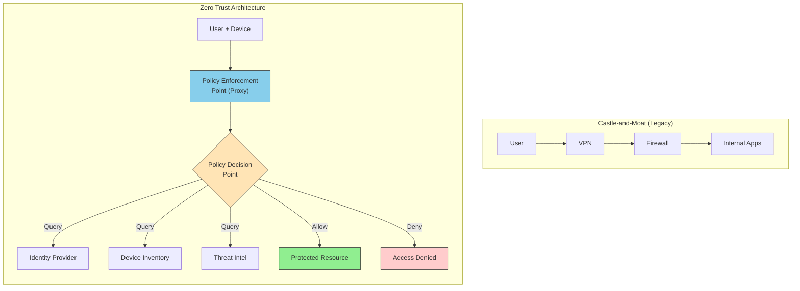
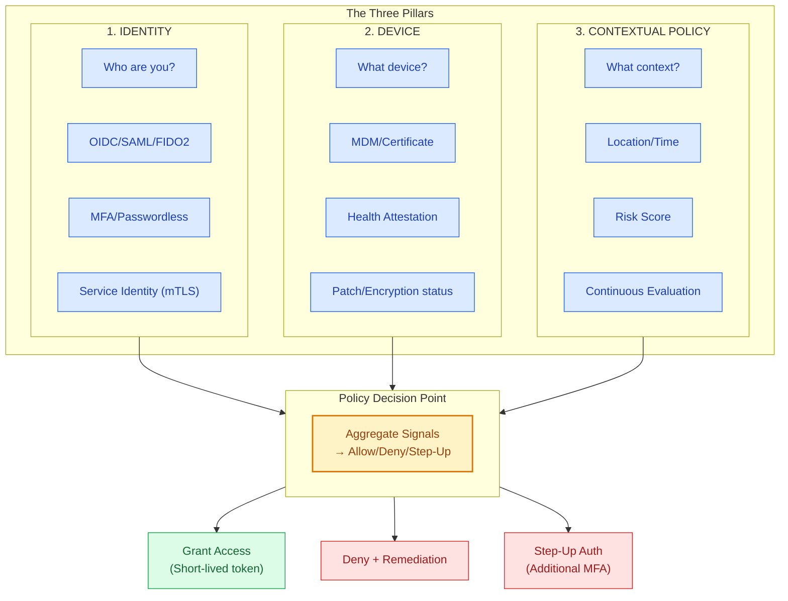
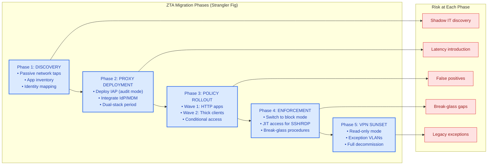

# Zero Trust Architecture

This guide covers 5 key areas: I. Conceptual Foundation: From "Castle-and-Moat" to "BeyondCorp", II. The Three Technical Pillars of Zero Trust, III. Execution Strategy: The Migration Program, IV. Business Impact, ROI, and Capabilities, V. Key Tradeoffs and Risks Summary.

## I. Conceptual Foundation: From "Castle-and-Moat" to "BeyondCorp"

The shift from perimeter-based security ("Castle-and-Moat") to Zero Trust Architecture (ZTA) represents a fundamental decoupling of access from network location. In the legacy model, trust was binary: inside the firewall meant "trusted," outside meant "untrusted." This model failed because it could not contain lateral movement once a breach occurred (e.g., via phishing or VPN compromise) and became obsolete as corporate data moved to multi-cloud and SaaS environments.

For a Principal TPM, this is not merely a security upgrade; it is an infrastructure transformation that alters how every employee, service, and device connects to corporate resources. You are moving the enforcement boundary from the network edge to the individual application or data resource.

### 1. The Technical Architecture: Unbundling the Perimeter

The technical realization of "BeyondCorp" (Google's implementation) or modern ZTA relies on shifting the "control plane" for access.

*   **The Old Way (Network-Centric):** Access is granted via IP allow-listing and VPN concentrators. If an IP is on the corporate subnet, it can access the database.
*   **The New Way (Identity-Centric):** Access is mediated by a Policy Decision Point (PDP) and enforced by a Policy Enforcement Point (PEP).

**How it works:**
1.  **The Request:** A user attempts to access an internal tool (e.g., `code-review.internal.corp`).
2.  **The Interception (PEP):** Instead of hitting the server directly, the request hits a reverse proxy (e.g., Google Identity-Aware Proxy or AWS Verified Access).
3.  **The Evaluation (PDP):** The proxy holds the request and asks the identity provider (IdP): "Does User X, on Device Y, with Security Posture Z, have permission to access Resource A?"
4.  **The Verdict:** The PDP evaluates signals (User Group, Device Certificate, EDR Health Status, Geo-velocity).
5.  **The Session:** If approved, a short-lived token is issued. The proxy tunnels the traffic to the backend service.

**Mag7 Real-World Behavior:**
*   **Google:** Uses an "Access Proxy" component. All internal web applications sit behind this proxy. There is no distinction between a user sitting in a Google cafe and a user at home; both traverse the public internet to hit the proxy, which authenticates them.
*   **Microsoft:** Heavily utilizes **Conditional Access** within Entra ID (formerly Azure AD). They evaluate "Sign-in Risk" in real-time. If a Principal Engineer logs in from a known device but an impossible travel location, the policy demands an MFA step-up or blocks access entirely.

### 2. Trust Signals and Device Inventory

A ZTA is only as robust as its inventory data. You cannot verify a device if you do not know it exists. This creates a massive dependency on MDM (Mobile Device Management) and EDR (Endpoint Detection and Response) data pipelines.

**Key Technical Dependency:**
The PDP needs near real-time ingestion of device health. If an engineer disables their endpoint protection (CrowdStrike/Carbon Black) to compile code faster, the ZTA system must detect this state change and revoke access to sensitive repositories immediately.

**Tradeoffs:**
*   **Security vs. Latency:** Every access request involves a complex logic check against multiple databases (Identity, Device Inventory, Threat Intel). This introduces latency.
    *   *Mitigation:* Caching authorization decisions for short durations (e.g., 5-15 minutes), balancing security with UX.
*   **Strictness vs. Productivity:** If policies are too tight (e.g., "OS must be patched within 24 hours of release"), you risk locking out entire engineering orgs when a patch fails to deploy.
    *   *Mitigation:* Use "Grace Periods" in policy logic.

### 3. Migration Strategy: The "Proxy-First" Approach

As a Principal TPM, you avoid a "Big Bang" migration. The standard Mag7 approach is the **Strangler Fig Pattern** applied to network security.

1.  **Discovery:** specific agents or network taps identify all internal applications.
2.  **Proxy Deployment:** Place the Identity-Aware Proxy *in front* of the legacy application, initially in "Passthrough" or "Audit" mode.
3.  **Policy Modeling:** Analyze logs to see who is accessing the app. Build policies that match valid traffic.
4.  **Enforcement:** Switch the proxy to "Block" mode.
5.  **Retirement:** Shut down the VPN path to that specific application.

**Business & ROI Impact:**
*   **Reduced OpEx:** Eliminating VPN concentrators and MPLS circuits saves millions in hardware and bandwidth costs.
*   **M&A Velocity:** Integrating an acquired company (a common Mag7 scenario) becomes faster. You don't need to bridge networks; you simply provision identities and grant access to the proxy.
*   **User Experience (CX):** "VPN-less" access is a major productivity booster. Engineers don't have to toggle VPNs to view a Jira ticket or a wiki page.

### 4. Handling Legacy Protocols (The Edge Cases)

The most significant friction point in ZTA is non-HTTP protocols. Identity-Aware Proxies work great for web apps (Jira, Wikis, Dashboards). They fail for SSH, RDP, and proprietary thick-client protocols (e.g., legacy financial systems or older database admin tools).

**Mag7 Solutions:**
*   **Bastion/Jump Hosts:** Users authenticate via ZTA to reach a jump box, then SSH from there.
*   **Tunneling via Agents:** Deploying a lightweight agent (like Cloudflare WARP or Zscaler Client Connector) on the endpoint that encapsulates non-web traffic into HTTP/2 or HTTP/3 tunnels to pass through the proxy.
*   **Just-in-Time (JIT) Access:** AWS and Azure use this heavily. Access to a production server via SSH is granted for a 1-hour window based on a specific ticket ID, then revoked.

### 5. The "Break Glass" Problem

In a fully realized ZTA, the Identity Provider (IdP) is a single point of catastrophic failure. If the IdP goes down, no one can log in to fix it because the tools to fix it are protected by the IdP.

**Actionable Guidance for TPMs:**
You must drive the requirement for **Emergency Access Accounts ("Break Glass")**.
*   These accounts should bypass the standard SSO/ZTA flow.
*   They should be alerted on heavily when used.
*   They must be tested quarterly.
*   *Example:* If Okta/Entra ID is down, how do SREs access the AWS console? (Answer: A specific root account with a hardware token stored in a physical safe).

## II. The Three Technical Pillars of Zero Trust

To execute a Zero Trust Architecture (ZTA) effectively, a Principal TPM must decompose the philosophy into three tangible technical implementation pillars: **Identity**, **Device**, and **Contextual Policy**. These pillars function as the input signals for the Policy Decision Point (PDP), which ultimately grants or denies access to the Policy Enforcement Point (PEP).

### 1. Identity: Strong Authentication & Least Privilege

At a Mag7 level, identity is the new perimeter. The goal is to establish high assurance that the entity (user or service) is who they claim to be. This moves beyond simple username/password combinations to cryptographic verification.

**Technical Implementation:**
*   **Protocol Standardization:** Leveraging OIDC (OpenID Connect) and SAML 2.0 for federation.
*   **Phishing-Resistant MFA:** Moving away from SMS/OTP toward FIDO2/WebAuthn hardware keys (e.g., YubiKeys, Titan Keys).
*   **Service-to-Service Identity:** Using SPIFFE/SPIRE or mTLS (mutual TLS) to authenticate microservices, ensuring that not only users but also applications have verified identities.

**Mag7 Real-World Example:**
*   **Google:** Mandates physical security keys for all employees. This virtually eliminated account takeovers via phishing.
*   **Microsoft:** Pushes "Passwordless" authentication heavily internally, relying on Windows Hello for Business (biometrics + TPM chip).

**Tradeoffs:**
*   **Security vs. Onboarding Friction:** Enforcing hardware keys creates logistical supply chain challenges during remote onboarding.
*   **Standardization vs. Legacy Support:** Legacy apps (LDAP/Kerberos based) often require expensive refactoring or "sidecar" proxies to support modern OIDC claims.

**Business & ROI Impact:**
*   **ROI:** drastic reduction in helpdesk tickets for password resets and remediation costs for credential stuffing attacks.
*   **Capability:** Enables "Work from Anywhere" without VPNs, as identity—not network location—dictates access.

### 2. Device: Endpoint Health & Attestation

Verifying the user is insufficient if they are accessing sensitive data from a compromised or unmanaged device. The architecture must query the device's state before granting access.

**Technical Implementation:**
*   **Device Inventory Service:** A centralized source of truth (e.g., Jamf, Intune) that tracks serial numbers and ownership.
*   **Health Attestation:** The device sends a cryptographically signed "health claim" to the proxy. Checks include: Is disk encryption on? Is the OS patched? Is EDR (Endpoint Detection and Response) running?
*   **Certificate Management:** Deploying unique machine certificates to validated devices to prevent credential export to unauthorized machines.

**Mag7 Real-World Example:**
*   **Meta (Facebook):** Utilizes strict device certificate checks. If a developer tries to access the codebase from a personal laptop (even with valid credentials), the request is rejected because the device lacks the corporate certificate (UDID check).
*   **Amazon (AWS):** Uses internal client agents that continuously report patch status. If a laptop misses a critical security patch, it is dynamically quarantined from production environments until updated.

**Tradeoffs:**
*   **Security vs. Privacy:** deeply inspecting employee devices (especially in BYOD scenarios) raises privacy concerns and legal hurdles in regions like the EU (GDPR).
*   **Strictness vs. Productivity:** If a security patch fails to install, a strict policy locks the engineer out of their tools. A Principal TPM must design "grace periods" or remediation workflows to prevent work stoppages.

**Business & ROI Impact:**
*   **Risk Reduction:** Prevents malware on a user device from laterally moving into the cloud environment.
*   **Asset Management:** Forces accurate inventory tracking, which optimizes hardware procurement spend.

### 3. Contextual Policy: The Decision Engine

This is the "brain" of ZTA. It aggregates signals from Identity and Device pillars to make real-time access decisions. It shifts from static rules (Allow IP 10.0.0.1) to dynamic policies (Allow User X + Managed Device + Low Risk Geo).

**Technical Implementation:**
*   **Policy Decision Point (PDP):** A centralized engine that evaluates requests.
*   **Policy Enforcement Point (PEP):** The proxy or gateway that blocks/allows traffic based on the PDP's verdict.
*   **Continuous Evaluation:** Authorization is not a one-time gate at login; it is re-evaluated periodically or upon behavior change (e.g., token revocation).

**Mag7 Real-World Example:**
*   **Netflix:** Uses a highly granular access gateway. Access to customer PII requires a different "trust score" than access to the lunch menu.
*   **Microsoft (Conditional Access):** If a user logs in from Seattle, and 10 minutes later attempts a login from London, the "Context" pillar flags the "Impossible Travel" anomaly and triggers a step-up authentication or block.

**Tradeoffs:**
*   **Granularity vs. Latency:** Complex policy evaluation on every request adds milliseconds to latency. TPMs must balance how often policies are re-evaluated (caching decisions vs. real-time security).
*   **False Positives vs. Safety:** Over-tuned anomaly detection can block legitimate business travel or VPN usage, frustrating executives.

**Business & ROI Impact:**
*   **CX:** Users experience a "silent" security layer. If they are compliant, they get access instantly without toggling VPNs.
*   **Auditability:** Centralized policy logs provide a clear audit trail for compliance (SOC2, FedRAMP), reducing the cost of audits.

## III. Execution Strategy: The Migration Program

The migration from a perimeter-based network to a Zero Trust Architecture (ZTA) is rarely a "greenfield" deployment at a Mag7 company. It is almost exclusively a "brownfield" migration involving massive technical debt, thousands of internal applications, and a user base that prioritizes velocity over security.

As a Principal TPM, your role is not merely tracking tickets; it is orchestrating a **Strangler Fig pattern** migration—gradually replacing specific functions of the legacy system with new implementations until the legacy system can be decommissioned.

### 1. The Inventory and Classification Phase

You cannot secure what you cannot see. The most common failure mode in ZTA migrations is discovering mission-critical "shadow IT" applications only after the VPN is turned off.

*   **Technical Execution:**
    *   **Passive Discovery:** Deploy network taps or utilize NetFlow logs to map traffic flows between users and internal services. This identifies unauthorized lateral movement and undocumented dependencies.
    *   **Active Scanning:** Utilize crawlers to identify internal web endpoints.
    *   **Identity Mapping:** Correlate network flows to specific user identities and device IDs.
*   **Mag7 Real-World Example:**
    *   **Google:** Before enforcing BeyondCorp fully, Google ran in "observation mode" for months. They deployed the access proxy but set policies to "allow all + log." This allowed them to build a graph of *User -> Device -> Application* without breaking workflows.
*   **Tradeoffs:**
    *   **Speed vs. Visibility:** A comprehensive inventory takes months. Rushing this phase leads to "scream tests" (turning off access to see who complains), which erodes trust in the security organization.
*   **Business Impact:**
    *   **Risk Reduction:** Identifies abandoned applications that are unpatched vectors for attack.
    *   **Cost Optimization:** Opportunities to decommission duplicate internal tools discovered during inventory.

### 2. The Identity-Aware Proxy (IAP) Rollout

The core technical mechanism of the migration is shifting access control from the Network Layer (L3/L4 VPN concentrators) to the Application Layer (L7 Reverse Proxies).

*   **Technical Execution:**
    *   Deploy an Identity-Aware Proxy (IAP) in front of internal web applications.
    *   Integrate the IAP with the central Identity Provider (IdP) and Device Inventory Service.
    *   **The "Dual-Stack" Period:** For a transition period, applications must often be accessible via *both* the legacy VPN and the new IAP. This is technically complex because it requires the application to handle different ingress paths and potentially different header formats for user identity.
*   **Mag7 Real-World Example:**
    *   **Microsoft:** Migrated internal apps to Azure AD App Proxy. They utilized "Conditional Access" policies to pilot specific low-risk apps (e.g., the cafeteria menu, internal wikis) before moving high-value targets (e.g., source code repositories).
*   **Tradeoffs:**
    *   **Latency vs. Security:** Placing a proxy in the flow introduces hops. For latency-sensitive developer tools, this is a major friction point. You must negotiate acceptable latency budgets.
    *   **Compatibility:** Legacy "thick client" apps (non-HTTP protocols like RDP, SSH, proprietary TCP) do not work natively with web proxies.
*   **TPM Action:**
    *   Define the "Golden Path" for migration. If an app is HTTP-based and supports OIDC, it moves in Wave 1. If it requires raw TCP, it moves to Wave 2 (utilizing tunneling or virtual desktop infrastructure).

### 3. Handling "Thick Client" and Legacy Protocols

The hardest 20% of the migration involves engineering workflows that rely on protocols other than HTTP/HTTPS.

*   **Technical Execution:**
    *   **Tunneling:** Encapsulating TCP traffic over HTTPS (e.g., WebSocket tunnels) to pass it through the IAP.
    *   **Just-in-Time (JIT) Access:** For SSH/RDP, moving away from static keys to ephemeral certificates issued only after MFA and device health checks.
*   **Mag7 Real-World Example:**
    *   **Netflix:** Created "Bleach" (and later tools) to manage SSH access. Instead of a bastion host, developers authenticate against an IdP, which issues a short-lived certificate for that specific SSH session.
*   **Tradeoffs:**
    *   **Developer Experience (DX) vs. Security:** Engineers hate friction. If the new ZT tool requires re-authenticating every hour for SSH, they will build backdoors. The TPM must push for "seamless" re-authentication (e.g., relying on device certificates rather than constant interactive prompts).
*   **Business Capabilities:**
    *   **Auditability:** Moving SSH/RDP behind an identity proxy provides full session recording and logging, which is impossible with standard VPN routing.

### 4. Policy Definition and "Break-Glass" Scenarios

Moving from coarse-grained network ACLs (e.g., "Engineering Subnet can access Git Server") to fine-grained policies (e.g., "Senior Engineers on compliant MacBooks can push to Master branch").

*   **Technical Execution:**
    *   Defining policies based on **Context**: User Role + Device Health + Location + Time.
    *   **The Policy Engine:** Implementing a centralized Policy Decision Point (PDP) that evaluates every request.
*   **Mag7 Real-World Example:**
    *   **Amazon:** Uses incredibly granular policies. Access to customer data requires not just being on the network, but being in a specific "clean room" environment (VDI) with disabled copy/paste, invoked via a specific ticket approval.
*   **Tradeoffs:**
    *   **Availability vs. Security (Fail-Open vs. Fail-Closed):** If the central Policy Engine goes down, nobody can work. Do you fail open (allow access, log it) or fail closed (total work stoppage)? A Principal TPM must define the SLA and the "Break-Glass" procedure for outages.
*   **Impact:**
    *   **Resilience:** Centralizing auth creates a Single Point of Failure (SPoF). The migration strategy must include multi-region redundancy for the IdP and Proxy.

### 5. Decommissioning the Legacy VPN (The Sunset)

The final phase is the political and technical removal of the "Moat."

*   **Technical Execution:**
    *   **Read-Only Mode:** Before killing the VPN, switch it to a mode where it can access only a landing page explaining the migration.
    *   **Exception Management:** Creating isolated VLANs for the 1% of legacy hardware (e.g., mainframes, lab equipment) that cannot support ZTA. These are accessed via "Jump Hosts" rather than general VPN.
*   **Tradeoffs:**
    *   **Maintenance Cost vs. Migration Effort:** Keeping the VPN alive for the final 5% of apps is expensive (OpEx). However, rewriting those 5% of legacy apps might be even more expensive (CapEx). The TPM drives the ROI analysis to decide: Migrate, Refactor, or Retire?
*   **ROI/Business Impact:**
    *   Elimination of VPN concentrator hardware/licensing costs.
    *   Reduction in attack surface (no more lateral movement from a compromised VPN credential).

## IV. Business Impact, ROI, and Capabilities

### 1. ROI Modeling: Quantifying the "Invisible" Value

For a Principal TPM, the challenge with Zero Trust Architecture (ZTA) is that success often looks like "nothing happened." You cannot strictly calculate ROI based on revenue generation. Instead, you must construct a business case based on **Risk Avoidance (RA)** and **Operational Efficiency (OE)**.

**The Calculation:**
You must shift the conversation from "Cost of Security" to "Cost of Downtime/Breach."
*   **Formula:** `(Annualized Loss Expectancy [ALE] of Legacy) - (ALE of ZTA) - (Cost of ZTA Implementation) = ROI`.
*   **Operational Savings:** Calculate the reduction in IT helpdesk tickets related to VPN connectivity, password resets (if moving to passwordless), and firewall change requests.

**Mag7 Real-World Behavior:**
*   **Microsoft:** In their internal Zero Trust rollout, they quantified ROI by measuring the reduction in helpdesk tickets for VPN connectivity issues. By moving to internet-first access for internal apps, they eliminated thousands of monthly support hours.
*   **Google:** Leverages ZTA to reduce the scope of compliance audits. Because the network is assumed hostile, the scope of PCI/SOX audits shrinks from "the whole network" to "specific application flows," saving millions in audit fees and engineering hours spent on evidence gathering.

**Tradeoffs:**
*   **Hard Costs vs. Soft Avoidance:** You are trading immediate, hard capital expenditure (identity providers, endpoint agents, consultancy) for probabilistic savings (avoiding a breach). Finance teams often push back on probabilistic savings.
*   **Vendor Lock-in vs. Custom Build:** Buying a ZTA suite (e.g., Zscaler, Cloudflare) offers faster ROI but creates dependency. Mag7 companies often opt for a hybrid "Build" approach (custom control planes over commodity proxies) to maintain leverage, accepting a longer ROI timeline for strategic control.

### 2. Strategic Capability: M&A and Third-Party Integration

One of the highest-value capabilities a Principal TPM unlocks with ZTA is the acceleration of Mergers and Acquisitions (M&A) and partner integration.

**The Capability Shift:**
In a Castle-and-Moat architecture, integrating an acquired company requires connecting two networks (site-to-site VPNs), dealing with overlapping IP spaces, and creating firewall rules—a process taking 6-18 months. With ZTA, you do not connect networks; you federate identity.

**Mag7 Real-World Behavior:**
*   **Amazon/AWS:** When acquiring a niche AI startup, they do not immediately re-IP the startup’s network. Instead, they provision the new employees with strong identity tokens (YubiKeys) and grant them access to specific Amazon internal tools via the ZTA proxy. The networks remain air-gapped; the application layer is bridged.
*   **Meta (Facebook):** Uses ZTA principles to grant third-party content moderators access to internal moderation tools without placing those vendors on the corporate network, isolating the core IP from the high-turnover vendor environment.

**Tradeoffs:**
*   **Velocity vs. Deep Integration:** ZTA allows for "Day 1 Access," but it can delay the deep technical integration of the acquired tech stack. The TPM must manage the risk that "good enough" access prevents the necessary hard work of platform consolidation.
*   **Identity Complexity:** While network complexity drops, identity complexity spikes. You must manage trust relationships between disparate Identity Providers (IdP), often requiring complex claims mapping.

### 3. Impact on Developer Experience (DX) and Velocity

A Principal TPM must proactively manage the tension between security strictness and developer velocity. If ZTA is implemented poorly (e.g., "re-authenticate every 15 minutes"), developers will find workarounds, undermining the security model.

**The "Invisible Security" Goal:**
The objective is to use context (device health, location, behavior) to reduce explicit authentication challenges.

**Mag7 Real-World Behavior:**
*   **Netflix:** Their approach to access (Lisa) emphasizes self-service. If a developer needs access to a sensitive production database, they request it via a portal. ZTA policies automatically check if the request is logical (e.g., "Is this dev on-call?"). If yes, access is granted time-bound (JIT). This removes the "ticket to the security team" bottleneck.
*   **Google:** Uses "Touchless" authentication where possible. If the device is managed, the certificate is valid, and the user is in a known location, the ZTA proxy grants access without a 2FA prompt.

**Tradeoffs:**
*   **Friction vs. Risk:** Reducing friction (longer session times, fewer prompts) increases the window of opportunity for session hijacking. The TPM must define "Risk Tolerance" SLAs with leadership (e.g., "We accept a 4-hour token validity for code repos, but only 15 minutes for payment gateways").
*   **Standardization vs. Edge Cases:** ZTA relies on standardized endpoints to measure health. This punishes teams using non-standard hardware (e.g., hardware engineers, mobile devs using unmanaged test devices). The TPM must budget for "VDI (Virtual Desktop Infrastructure) enclaves" for these edge cases, which degrades user experience.

### 4. Organizational Skill and Culture Shift

Moving to ZTA changes the political landscape of IT and Security. The balance of power shifts from Network Engineering (firewalls/routing) to Identity and Access Management (IAM) and Device Management.

**The Capability Gap:**
*   **Network Teams:** Must pivot from managing ACLs to managing transport reliability.
*   **Security Teams:** Must pivot from "perimeter defense" to "policy definition."
*   **Product Teams:** Must learn to integrate identity libraries (OIDC/SAML) rather than relying on IP whitelisting.

**TPM Action:**
You must drive a "Security Champions" program within product teams. You cannot scale a central security team to write policies for every microservice. You must decentralize policy definition while centralizing policy enforcement.

**Tradeoffs:**
*   **Central Control vs. Distributed Agility:** Centralizing policy creation ensures consistency but creates a bottleneck. Distributing policy creation (letting service owners define who accesses their service) risks overly permissive rules.
*   **Retraining vs. Hiring:** It is often faster to hire Identity architects than to retrain legacy network engineers, but this destroys morale and institutional knowledge. A Principal TPM creates the transition roadmap to upskill existing staff on the new policy engines.

## V. Key Tradeoffs and Risks Summary

### 1. User Experience (UX) Friction vs. Security Granularity

The most immediate tension in a Zero Trust rollout is the inverse relationship between security granularity and user productivity. In a ZTA model, trust is ephemeral. A user verified at 9:00 AM is not implicitly trusted at 9:15 AM. However, prompting a user for MFA every 15 minutes leads to "MFA Fatigue," where users blindly approve requests, effectively nullifying the security control.

*   **Technical Detail:** The Policy Decision Point (PDP) must constantly evaluate signals (device health, geolocation, behavior). If the policy is too aggressive (e.g., "Block access if latency implies a location change"), false positives spike. If the policy is too lax, session hijacking becomes a risk.
*   **Mag7 Example:** At **Google**, the implementation of BeyondCorp initially faced pushback regarding latency and authentication friction. To solve this, Google shifted from "active verification" (user types a code) to "passive verification" (device certificates and TPM chips). The browser (Chrome) acts as the endpoint agent, constantly sending device telemetry to the Access Proxy without interrupting the user.
*   **Tradeoff:** High security granularity vs. Developer velocity.
    *   *Strict ZTA:* Reduces session hijacking risk by 90%+, but increases login latency by 200-500ms per request and can degrade developer build times if applied to backend compilation jobs.
    *   *Lenient ZTA:* Improves UX but leaves a window for token theft/replay attacks.
*   **Business Impact:** If the ZTA friction is too high, engineers will find workarounds (Shadow IT), such as moving data to personal devices or hardcoding credentials to bypass the handshake. The TPM must define "acceptable friction" metrics (e.g., "Authentication should take <100ms and require user interaction only once per 24 hours unless risk score spikes").

### 2. Centralized Control Plane: The Single Point of Failure (SPoF) Risk

ZTA centralizes trust brokering. Instead of distributed firewalls making simple allow/deny decisions based on IP, a centralized Control Plane (IdP + Policy Engine) makes complex decisions for every access request.

*   **Technical Detail:** In a traditional model, if the Active Directory server had issues, cached credentials might allow existing sessions to continue. In a strict ZTA, every request is proxied. If the Control Plane (e.g., Okta, Azure AD, or an internal service) goes down or suffers latency, the entire organization halts.
*   **Mag7 Example:** **Microsoft** and **AWS** have both experienced global outages where the Identity control plane failed. During these events, even engineers with physical access to data centers could not log into consoles to fix the issue because the "Zero Trust" policy required an online verification that wasn't available.
*   **Tradeoff:** Security visibility vs. Availability resilience.
    *   *Centralized:* 100% visibility and instant policy revocation, but creates a massive blast radius during outages.
    *   *Decentralized:* Higher availability, but disjointed logs and slower revocation times (propagation delay).
*   **Actionable Guidance:** As a Principal TPM, you must mandate **"Break Glass" protocols**. This involves defining a highly restricted, monitored "emergency mode" where local authentication is permitted if the central IdP is unreachable. You must also drive the requirement for the Control Plane to be distributed across multiple availability zones and regions with active-active replication.

### 3. The "Strangler Fig" Problem: Legacy Infrastructure Compatibility

Mag7 companies have massive amounts of technical debt. ZTA relies on modern protocols (OIDC, SAML, mTLS). Legacy systems (mainframes, old LDAP apps, proprietary TCP protocols) often cannot natively support ZTA.

*   **Technical Detail:** You cannot simply "turn on" ZTA for a legacy application that relies on IP allow-listing. You generally have two choices: Refactor the app (expensive, slow) or wrap it in an Identity-Aware Proxy (IAP). The IAP handles the modern auth and tunnels the traffic to the legacy app.
*   **Mag7 Example:** **Netflix** (while transitioning to modern identity patterns) had to manage legacy tools used by studio partners. They utilized sidecar proxies (like Envoy) to handle authentication logic, allowing the application code to remain relatively untouched while still enforcing ZTA principles at the network ingress.
*   **Tradeoff:** Migration velocity vs. Architectural purity.
    *   *Proxying (wrapping):* Fast deployment, low code change, but adds network hops (latency) and hides the internal app complexity from the security layer.
    *   *Refactoring:* Native integration, better performance, but consumes engineering quarters that could be used for product features.
*   **Business Impact/ROI:** The TPM must perform a cost-benefit analysis. If a legacy app generates $10M/year but costs $2M to refactor for ZTA, is the risk reduction worth the 20% hit? Often, the decision is to "contain" the legacy app in a segmented VLAN (a mini-perimeter) rather than fully integrating it into ZTA immediately.

### 4. Operational Complexity and Skill Gaps

Moving to ZTA shifts the complexity from the network layer (firewall rules) to the application and identity layer (policy definitions). This requires a different skillset.

*   **Technical Detail:** Debugging a connection failure in ZTA is difficult. It could be a revoked certificate, a conditional access policy triggering due to an OS update, a geo-block, or an actual network timeout. "It works on my machine" becomes rampant because access is context-dependent.
*   **Mag7 Example:** At **Meta**, internal tools teams had to build self-service diagnostic portals. When an engineer is denied access, they don't get a generic 403 Forbidden; they get a detailed report: *"Access denied because your laptop is running OS version X and policy requires Y. Update here."*
*   **Tradeoff:** Security efficacy vs. Support overhead.
    *   *Complex Policy:* Catches subtle anomalies (e.g., "impossible travel"), but generates high volumes of support tickets.
    *   *Simple Policy:* Easy to support, but misses sophisticated attacks.
*   **CX Impact:** Without automated remediation (self-healing), the Help Desk will be flooded. The Principal TPM must prioritize the development of "User-Facing Diagnostics" alongside the security rollout, or the program will fail due to organizational revolt.

---

## Interview Questions

### I. Conceptual Foundation: From "Castle-and-Moat" to "BeyondCorp"

**Question 1: Managing Friction in Security Rollouts**
"We are migrating a critical high-frequency trading platform to a Zero Trust architecture. The engineering team is pushing back, claiming that the Identity-Aware Proxy introduces 150ms of latency, which violates their SLA. As the Principal TPM leading this rollout, how do you resolve this conflict?"

*   **Guidance for a Strong Answer:**
    *   **Acknowledge the validity:** Validate the engineering constraint. 150ms is unacceptable for HFT.
    *   **Architecture modification:** Propose a hybrid approach. The *control plane* (authentication/configuration) goes through ZTA. The *data plane* (trade execution) might remain on a segmented, highly restricted network path (micro-segmentation) rather than an application proxy.
    *   **Risk Acceptance:** If an exception is granted, negotiate compensating controls (e.g., strictly limited jump-box access, higher frequency of credential rotation).
    *   **Data-driven decision:** Measure the actual latency overhead in a staging environment to verify the 150ms claim before making architectural changes.

**Question 2: Legacy Application Migration**
"You are responsible for decommissioning the corporate VPN. You have 50 legacy applications that do not support modern authentication (SAML/OIDC) and are hardcoded to check for specific internal IP addresses. The owners of these apps have left the company. What is your strategy to migrate these to Zero Trust without rewriting the code?"

*   **Guidance for a Strong Answer:**
    *   **Discovery:** First, audit traffic to understand dependencies.
    *   **The "Sidecar" or "Header Injection" pattern:** Put the legacy app behind a modern proxy. The proxy handles the AuthN/AuthZ. Once authenticated, the proxy injects the user identity into the HTTP header and passes it to the legacy app (which is configured to trust the proxy's internal IP).
    *   **Network Translation:** Use NAT (Network Address Translation) at the gateway level to spoof the expected internal IP if the app validates source IPs.
    *   **Sunsetting:** If the app is truly unmanageable, define a "containment" strategy (VDI/Virtual Desktop Infrastructure) where the app runs in a virtualized environment that is accessible via ZTA, rather than exposing the app directly.

### II. The Three Technical Pillars of Zero Trust

**Question 1: The "Break Glass" Scenario**
"You are leading the rollout of a Zero Trust policy that requires a managed device certificate to access our source code repository. On launch day, a critical P0 incident occurs, and the On-Call engineers report they cannot access the repo because the certificate service is down. As the Principal TPM, how do you handle this situation immediately, and what is your post-incident strategy?"

*   **Guidance for a Strong Answer:**
    *   **Immediate Action:** Demonstrate bias for action. Acknowledge that availability trumps security during a P0. Describe a pre-planned "Break Glass" mechanism (e.g., a bypass group or temporary policy relaxation) that allows access but with heightened logging/auditing.
    *   **Root Cause:** Identify that the ZTA infrastructure (the certificate authority) is now a critical dependency and single point of failure.
    *   **Long-term:** Propose architectural redundancy for the PDP/PEP and establish SLAs for security infrastructure that match the uptime requirements of the services they protect.

**Question 2: Managing Tradeoffs and Friction**
"We want to implement 'Continuous Verification,' requiring re-authentication every time a developer switches between internal tools. The Engineering Director argues this will destroy developer velocity and increase build times. How do you assess the validity of their claim and propose a path forward?"

*   **Guidance for a Strong Answer:**
    *   **Validation:** Don't dismiss the concern. Propose measuring the "toil" (time spent authenticating) using telemetry.
    *   **Solutioning:** Suggest technical compromises like "Short-lived certificates" or "SSO sessions with sliding windows" rather than hard re-authentication prompts.
    *   **Risk-Based Approach:** Argue for tiered access. High-friction verification for production databases; low-friction (cached trust) for documentation or non-sensitive tools.
    *   **Business Value:** Frame the solution not just as "security" but as enabling "remote work" or "BYOD" which benefits the developers, making the friction a worthy trade-off.

### III. Execution Strategy: The Migration Program

### Question 1: The "Developer Revolt"
"You are leading the ZTA migration for our internal developer tools. We have moved 80% of apps to the new Identity-Aware Proxy. However, the Engineering Director for the AI division refuses to migrate their clusters, citing that the new proxy introduces 50ms of latency which breaks their distributed training synchronization. They are demanding to stay on the legacy VPN indefinitely. How do you handle this?"

**Guidance for a Strong Answer:**
*   **Validate technical claims:** Don't just accept the "50ms" claim. Propose instrumentation to measure actual latency impact vs. perceived impact.
*   **Analyze the architecture:** Distributed training (node-to-node communication) usually shouldn't pass through a user-access proxy anyway. Distinguish between *Control Plane* access (developers logging in) and *Data Plane* traffic (server-to-server).
*   **Offer alternatives (The "Third Way"):** Propose a specialized implementation—perhaps a direct interconnect with mutual TLS (mTLS) for the servers, while human access goes through the proxy.
*   **Risk Acceptance:** If they must stay on VPN, frame it as a "Risk Acceptance" that requires VP-level sign-off and a strict timeline for remediation, rather than a permanent exemption.
*   **Business Focus:** Balance the ROI of the AI model (business value) against the risk of a breach. Do not block revenue-generating work for security purity, but do not allow unmanaged risk.

### Question 2: The "Unknown Unknowns" Failure
"During a phased rollout of Zero Trust enforcement, you disable VPN access for the Marketing department. Immediately, the CMO calls saying their external agency partners can no longer upload assets to the internal DAM (Digital Asset Management) system. This workflow was never documented in your discovery phase. How do you resolve the immediate crisis and prevent this in future phases?"

**Guidance for a Strong Answer:**
*   **Immediate Mitigation (Rollback/Hotfix):** Prioritize business continuity. Either temporarily re-enable VPN for that specific group (if possible) or, better, quickly provision "Guest" identities for the agency in the new IdP if the tech stack allows.
*   **Root Cause Analysis:** Admitting the failure in the Discovery phase. Why did the network taps or logs miss this traffic? (Likely because it originated from external IPs not monitored by internal taps).
*   **Process Improvement:** Update the "Pre-Flight Checklist" for future departments to include interviews with department heads regarding *external* collaborators, not just internal employees.
*   **Technical Solution:** Discuss how ZTA is actually *better* for this scenario (granting agency partners specific access to the DAM app via the proxy is safer than giving them VPN network access). Turn the failure into a selling point for the new architecture.

### IV. Business Impact, ROI, and Capabilities

**Question 1: The ROI of "Invisible" Security**
"We are two years into a three-year Zero Trust migration. The CFO is asking why our security software spend has increased by 40% while we haven't suffered a major breach in five years anyway. She wants to cut the budget for the remaining device-health integration. How do you justify the continued investment?"

*   **Guidance for a Strong Answer:**
    *   **Acknowledge the fallacy:** Admit that "absence of failure" is a poor metric for success.
    *   **Pivot to Agility:** Shift the argument from security to business capability. Explain how the completed ZTA components have enabled specific business wins (e.g., "We integrated Company X in 3 weeks instead of 6 months").
    *   **Quantify the "Blast Radius":** Use data to show that while breaches haven't happened, *near misses* or minor incidents were contained to single devices rather than lateral movement, saving $X in remediation.
    *   **Operational Debt:** Explain that cutting the budget now leaves a hybrid environment (half VPN, half ZTA) which is the *most* expensive state to operate (double license costs, double support training).

**Question 2: Managing Friction and Developer Revolt**
"You are rolling out a policy requiring device health checks (OS patch level, disk encryption) for access to source code repositories. The Mobile Engineering team claims this blocks their workflow because they use beta OS versions and jailbroken devices for testing. They are escalating to the VP of Engineering to get an exemption. How do you handle this?"

*   **Guidance for a Strong Answer:**
    *   **Empathy first:** Validate the legitimate business need of the mobile team. Do not dismiss it as "non-compliant."
    *   **No blanket exemptions:** Explain why a blanket exemption undermines the entire trust model (attackers target the weakest link).
    *   **Architectural compromise:** Propose a specific "Segmentation" solution. For example, create a specific VDI environment or a separate "Lab Network" segment for these devices that has restricted access *only* to the necessary test repos, but is blocked from production user data or HR systems.
    *   **Data-driven negotiation:** Ask the team to define the specific capabilities blocked, then work with Security Engineering to create a "Conditional Access" policy that might require stronger authentication (e.g., FIDO2 keys) to compensate for the lower device trust level.

### V. Key Tradeoffs and Risks Summary

**Question 1: The Legacy Application Standoff**
"We are migrating to a strict Zero Trust model where VPNs are being deprecated. However, a critical revenue-generating legacy platform relies on hardcoded IP allow-lists and cannot support modern SSO/OIDC without a 6-month rewrite. The security team demands the VPN be cut next month. As the Principal TPM, how do you resolve this impasse?"

*   **Guidance for a Strong Answer:**
    *   **Acknowledge the Tradeoff:** Validate both sides. Security wants to reduce attack surface; Business needs revenue.
    *   **Technical Solution:** Propose an interim "Bridge" solution. Do not suggest delaying the whole program. Suggest an Identity-Aware Proxy (IAP) or a bastion host that sits behind the ZTA interface but tunnels to the legacy app. This treats the legacy app as a "resource" protected by the proxy.
    *   **Risk Acceptance:** Define the residual risk. If an IAP isn't possible, negotiate a specific, time-bound exception (Risk Acceptance Memo) signed by a VP, while keeping the legacy app on a highly restricted VLAN segment.
    *   **Execution:** Outline the roadmap: Immediate mitigation (segmentation) -> Interim solution (Proxy) -> Long-term solution (Refactor).

**Question 2: The Availability Crisis**
"You have successfully rolled out ZTA to 90% of the company. A massive DDoS attack hits our Identity Provider (IdP), rendering the Policy Decision Point unreachable. No one can log in to push code or access production servers to mitigate the attack. What architectural miss did you make, and how do you fix it for the future?"

*   **Guidance for a Strong Answer:**
    *   **Root Cause Analysis:** Admit the failure was designing a "hard dependency" on a centralized control plane without a fallback for the "Break Glass" scenario.
    *   **Immediate Action:** This is a disaster recovery scenario. Reference physical access or local admin accounts that should have been vaulted for this exact moment (though this is reactive).
    *   **Architectural Fix:** Discuss **"Resilient Auth"** patterns.
        *   *Token Caching:* Policies should allow for "stale" but cryptographically valid tokens to function for a short window during outages.
        *   *Local Auth Fallback:* Critical infrastructure (like routers or hypervisors) must support local authentication keys (stored in a physical safe or hardware security module) that bypass the network IdP.
    *   **Process:** Mention the need for "Game Days" (Chaos Engineering) where you intentionally sever the link to the IdP to test if the company can still operate in a degraded state.

---

## Key Takeaways

- Review each section for actionable insights applicable to your organization

- Consider the trade-offs discussed when making architectural decisions

- Use the operational considerations as a checklist for production readiness
